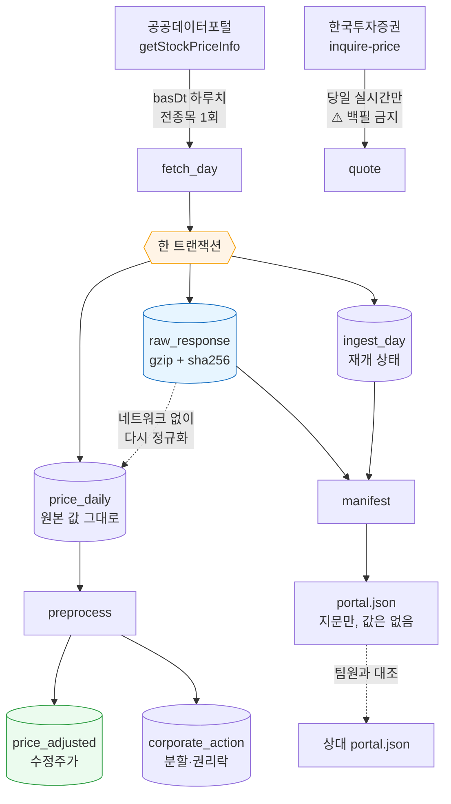
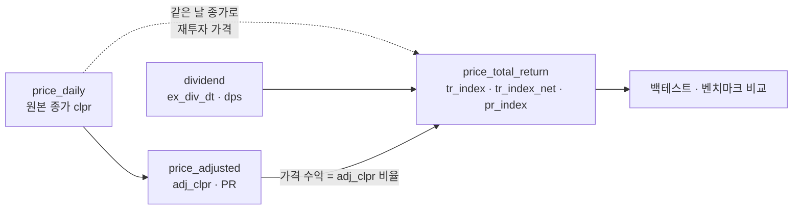
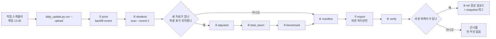
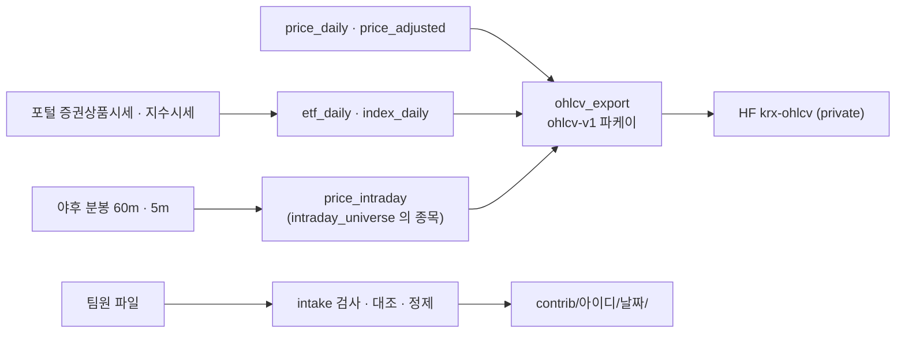
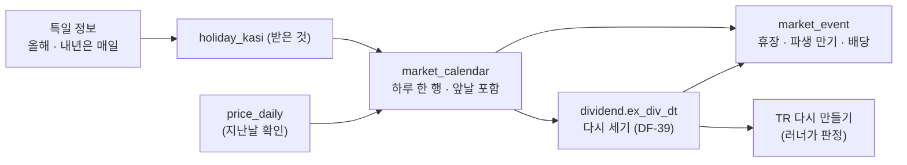

# collector — 시세 수집기

한국 주식 일별 시세를 받아 **원문 그대로 보존**하고, **수정주가**로 정규화한다.
**배당**은 전자공시(DART) 공시에서 따로 받는다(§13). 2026-09-22 가동을 목표로 만들었다.

> 이 문서의 모든 수치는 2026-09-19 에 **직접 호출해 얻은 실측값**이다. 추측한 값은
> 없고, 확인하지 못한 것은 "모른다" 라고 적었다.

---

## 1. 5분 만에 돌려 보기

```bash
# 1) 자료가 있는지부터 확인 — 아무것도 받지 않는다
python -m collector.backfill status

# 2) 최근 2주치를 받아 본다 (14회 호출, 하루 한도 10,000 중)
python -m collector.backfill recent

# 3) 과거 구간을 받는다. 끊겨도 다시 실행하면 이어서 간다
python -m collector.backfill backfill --from 20200101 --to 20261231

# 4) 수정주가를 만든다 (분할·권리락 보정) — 인자 없이 전 종목을 다시 쓴다. 설명만 보려면 --help
python -m collector.preprocess

# 5) 배당을 받는다 — 총수익(TR)의 재료. 자세한 규칙은 §13
python -m collector.dividend corp-code   # 처음에 한 번 (호출 1회)
python -m collector.dividend scan

# 6) 총수익(TR) 계열을 만든다 — 4)+5) 를 합친다. 네트워크를 타지 않는다. §14
python -m collector.total_return build

# 7) 지문을 남긴다 — 팀원과 "같은 자료를 봤는가" 맞출 때
python -m collector.manifest write

# 8) 위 전부를 매일 자동으로 — 작업 스케줄러에 한 번 등록한다 (§15)
python scripts/daily_update.py install     # 매일 12:30 · HF 증분 업로드 포함
python scripts/daily_update.py status      # 마지막 실행 결과 · 다음 실행 시각
```

Git Bash 에서 그대로 돌려도 된다 — 명령마다 표준출력을 UTF-8 로 바꿔 찍어서 `✅` · `—` 한 글자에 죽지 않는다
(`console.py` · DF-11 · 2026-09-29).

필요한 것은 `.env` 의 `DATA_GO_KR_API_KEY` **하나**다(배당까지 받으려면
`DART_API_KEY` 를 더한다). Postgres·Redis·Qdrant·Neo4j·Ollama 는 **하나도 필요 없다.**

---

## 2. 왜 앱과 따로 도는가

Qurious 본체는 다섯 개 서비스가 떠 있어야 `import` 조차 된다. 수집은 그 중 아무것도
필요 없다 — 필요한 것은 API 키와 디스크뿐이다.

수집기를 스택에 묶어 두면 **스택이 안 뜨는 날의 시세를 통째로 놓친다.** 놓친 시세는
사람이 기억해서 메꿔야 하고, 결국 안 메꾼다. 그래서 `collector` 는 표준 라이브러리와
`requests` 만 쓴다.

```
바꾸기 전 (스택에 묶인 모양)                바꾼 뒤 (이 설계)
────────────────────────────                ────────────────────────────
app/config.py                               collector/config.py
  ├─ Postgres  ─┐                             └─ .env 한 줄만 읽는다
  ├─ Redis      │  하나라도 안 뜨면
  ├─ Qdrant     ├─ import 실패              collector/db.py
  ├─ Neo4j      │                             └─ SQLite 파일 하나
  └─ Ollama    ─┘
       ↓                                           ↓
  수집 태스크                                 python -m collector.backfill
  (스택 없이는 못 돈다)                       (아무 것도 없이 돈다)
                                                   ↓
                                            app/tasks/collector_tasks.py
                                              └─ 스택이 있을 때만 얹는 얇은 어댑터
```

**요점은 코어가 스케줄러도 DB 스택도 모른다는 것이다.** 그래서 CLI·Windows 작업
스케줄러·Celery Beat 어느 쪽에 붙여도 같은 코드가 돈다.

---

## 3. 데이터가 흐르는 길



셋이 **한 트랜잭션에** 들어가는 것이 핵심이다. 원문만 남고 상태가 안 남으면 다음
실행이 같은 날을 또 받아 유량을 두 배로 쓴다. 상태만 남고 원문이 안 남으면 재정규화가
불가능해진다.

---

## 4. 코드 재사용 판정

| 가져온 곳 | 줄 수 | 판정 | 무엇을·왜 |
|---|---:|---|---|
| [`Alpha_Stack/common/raw_store.py`](https://github.com/devlee328288/Alpha_Stack/blob/3bb08f8/common/raw_store.py) | 300 | 🟢 **이식** → `collector/raw_store.py` (198줄) | gzip+sha256 보존·무결성 검증·통계를 그대로. **바꾼 곳**: ① 연결을 스스로 열던 길을 막고 `conn` 을 **반드시** 받게 했다(트랜잭션을 함께 묶으려고) ② `ALLOWED_SOURCES` 를 이 프로젝트 출처로 교체 ③ `common.paths`·`ingest.store.migrations` 의존 제거(그 패키지가 여기 없다) |
| [`Qurious/app/services/brokers/kis.py`](https://github.com/EST-team-project/Qurious/blob/04f476a/app/services/brokers/kis.py) | 190 | 🟡 **규격만 재사용** → `collector/sources/kis.py` (241줄) | 엔드포인트 경로·TR ID(`FHKST01010100`·`VTTC8434R`)·응답 필드 이름을 그대로 썼다. **코드는 다시 썼다** — 원본은 `httpx` 비동기에 `app.config` 를 import 해서 스택 없이는 못 돈다. 그리고 원본에는 **`rt_cd` 검사가 없다**(`r.json()["output"]` 을 바로 꺼낸다). 유량 초과가 HTTP 500 + 빈 배열로 오므로 그 경로는 조용히 틀린다 |
| [`Qurious/app/celery_app.py`](https://github.com/EST-team-project/Qurious/blob/04f476a/app/celery_app.py) | 74 | 🟢 **그대로 얹음** | Beat 스케줄에 3줄 추가. `timezone="Asia/Seoul"` 이 이미 잡혀 있어 KST 로 그냥 돈다 |
| [`Qurious/app/tasks/ingest_tasks.py`](https://github.com/EST-team-project/Qurious/blob/04f476a/app/tasks/ingest_tasks.py) | 151 | 🟢 **패턴 모방** → `app/tasks/collector_tasks.py` (83줄) | 태스크 안에서 늦게 import 하는 방식을 따랐다. 단 `asyncio.run` 은 안 쓴다 — 수집 코어가 동기라서 |
| [`edumgt/stock-coin-trade` `scheduler.py`](https://github.com/edumgt/stock-coin-trade/blob/ebb40c3/python-stock-backend/scheduler.py) | 72 | 🔴 **쓰지 않음** | APScheduler 선례였지만, 이 저장소에 **이미 Celery Beat 가 돌고 있다**. 스케줄러를 하나 더 들이면 같은 일을 하는 물건이 둘이 되고 "어느 쪽이 안 돌았나" 를 찾는 일이 늘어난다 |
| [`Alpha_Stack/scripts/upload_to_hf.py`](https://github.com/devlee328288/Alpha_Stack/blob/3bb08f8/scripts/upload_to_hf.py) · [`supply/hf_model_data.py`](https://github.com/devlee328288/Alpha_Stack/blob/3bb08f8/supply/hf_model_data.py) · [`scripts/check_hf_access.py`](https://github.com/devlee328288/Alpha_Stack/blob/3bb08f8/scripts/check_hf_access.py) | 890 / 278 / 160 | ~~⏸ **보류**~~ → 🔴 **쓰지 않음** (2026-09-20) | ~~HF 업로드 경로다. "팀원이 제3자인가" 가 판단되기 전에는 원자료를 밖으로 내보내지 않는다(§8). 매니페스트(지문)만으로 대조가 되므로 급하지 않다~~ → **보류 사유는 2026-09-20 팀 결정으로 해소됐다**(§9.2). 다만 이 세 파일을 **이식하지는 않았다** — HF 경로는 `scripts/hf_dataset.py`(2,099줄)로 **새로 썼다**(Alpha_Stack 코드 참조 0건). 설계가 다르다: 파케이 연도 파티션 · Xet 청크 중복제거 · dry-run 기본 |

새로 쓴 코드 **1,972줄** 중 이식·모방이 약 **480줄**, 나머지는 새 로직이다.
(이 셈은 수집기 본체만이다 — 나중에 더한 `scripts/hf_dataset.py` 2,099줄은 들어 있지 않다.)

---

## 5. 전처리 규격 v1 — `vs` 로 조정한다  ★ S26 규격에서 바뀜

### 무엇이 문제인가 (비전문가용)

카카오는 2021년 4월 1주를 5주로 쪼갰다(액면분할). 주가는 558,000 원에서 112,000 원대로
**뚝 떨어진 것처럼** 보인다. 회사 가치는 그대로인데 숫자만 1/5 이 된 것이다. 이걸 그대로
두면 그날 **-80% 대폭락**이 있었던 것으로 기록된다. 그런 가짜 폭락이 섞인 데이터로
전략을 검증하면 검증 결과 자체가 거짓이 된다.

> **액면분할** — 피자를 8조각에서 16조각으로 자른 것이지, 피자가 작아진 게 아니다.
> **조정계수** — 과거 가격에 곱해 오늘 기준으로 맞추는 배수.
> **기준가** — 분할 뒤 첫 거래일에 거래소가 정해 주는 출발 가격.
>   ⚠️ `직전 종가 ÷ 분할비율` 이 **아니다**. 카카오는 558,000÷5 = 111,600 이 아니라 **112,000** 이었다.

### `fltRt`(등락률) 대신 `vs`(전일대비 금액)

S26 규격은 `fltRt` 누적이었다. 실측해 보니 그쪽이 덜 정확하다.

| 기준일 | `vs` 로 역산한 전일가 | `fltRt` 로 역산한 전일가 | 실제 직전 종가 | |
|---|---:|---:|---:|---|
| 20210409 | **548,000.0** | 548,025.9 | 548,000 | `vs` 만 정확 |
| 20210415 | **112,000.0** | 111,999.3 | 558,000 | ← 분할일 |
| 20210420 | **119,000.0** | 119,000.2 | 119,000 | |
| 20210421 | **119,500.0** | 119,505.8 | 119,500 | `vs` 만 정확 |

`fltRt` 는 **소수 둘째 자리까지만** 온다 — 삼성전자 2026-09-17 은 실제 −0.3945% 인데
`"-.39"` 로 잘린다. `vs` 는 정수 원 단위라 자르는 일이 없다. 열 곳 중 `vs` 는 **열 곳
모두** 소수점 이하 0 으로 정확히 맞았다.

그리고 분할일 행을 보면 `vs` 가 **이미 조정된 기준가 기준으로** 계산돼 있다
(120,500 − 8,500 = 112,000). **조정계수를 우리가 추정할 필요가 없다 — 데이터 안에 있다.**

```
조정계수 f = (종가 − 전일대비) ÷ 직전 거래일 종가
누적계수  = 가장 최근 날부터 거꾸로 곱해 나간다 (오늘 가격은 건드리지 않는다)
```

### 이벤트를 세 갈래로 가른다

데이터 안에 **두 번째 독립 신호**가 있다 — 상장주식수(`lstgStCnt`). 분할이면 주식 수가
늘어난 배수만큼 가격이 내려가므로, 가격 계수 `f` 와 주식수 비율 `q` 를 곱하면 1 이 된다.

| 분류 | 조건 | 뜻 | 실측 (2021-04 + 2026-09, 79건) |
|---|---|---|---:|
| `split` | `f·q ≈ 1` | 분할·병합. 두 신호가 일치하므로 **믿어도 된다** | **54건** |
| `rights` | `q ≈ 1` 이고 `f ≠ 1` | **권리락**. 신주는 나중에 상장되므로 그날 주식수는 아직 그대로 | **21건** |
| `review` | 둘 다 어긋남 | 자동 판단하지 않는다 | **4건** |

실제로 잡힌 것들:

| 기준일 | 종목 | 직전종가 | 기준가 | `f` | 주식수비 `q` | 분류 |
|---|---|---:|---:|---:|---:|---|
| 20210415 | 카카오 | 558,000 | 112,000 | 0.200717 | ×5.00 | `split` ✅ |
| 20210421 | 세기상사 | 61,600 | 6,160 | 0.100000 | ×10.00 | `split` ✅ |
| 20210423 | 씨젠 | 195,000 | 98,000 | 0.502564 | ×1.00 | `rights` — 무상증자 권리락 |
| 20210429 | 대한제당 | 7,490 | 3,745 | 0.500000 | ×1.00 | `rights` — 같은 종목에 분할(04-14)과 권리락(04-29)이 둘 다 |
| 20210415 | 한국석유 | 281,000 | 14,550 | 0.051779 | ×10.00 | `review` ⚠️ 1/10 이면 28,100 이어야 한다 |
| 20210408 | 아이엠텍 | 214 | 5,350 | 25.0 | ×0.111 | `review` ⚠️ 아래 참고 |

**🟢 S26 의 열린 질문 하나가 해결됐다** — "권리락에서도 `vs` 가 통하는가". 통한다.
씨젠·대한제당이 실증한다. 다만 권리락일에는 **주식수로 교차검증할 수 없다.**

### 거래정지가 만드는 사각지대 🔴

아이엠텍은 문제를 그대로 보여 준다. 그 구간이 **거래정지라 `vs` 가 계속 0** 이었다.

```
20210401~07   종가    214   vs 0   거래량 0   주식수 43,543,747   ← 정지
20210408      종가  5,350   vs 0   거래량 0   주식수  4,831,715   ← 정지인 채로 값만 바뀜
```

`vs = 0` 이면 "가격이 이어진다" 와 "조정 정보가 없다" 가 **구별되지 않는다.** 정지
해제일에 가격이 달라져 있으면 그것이 조정 때문인지 실제 등락인지 이 데이터만으로는
알 수 없다. 이 경우는 `review` 로 남기고 **사람에게 넘긴다.**

### 거래정지 판별은 출처마다 다르다 ⚠️

| 출처 | 규칙 | 근거 |
|---|---|---|
| 공공데이터포털 | `mkp == 0` **이고** `trqu == 0` | 2026-09-17 하루치에서 각각 147종목, 교집합 **147** — 완전 일치 |
| KIS | `acml_vol == 0` | 시가 필드로는 안 나타난다 (#33) |

한쪽 규칙을 다른 쪽에 그대로 쓰면 정지일을 통째로 놓친다.

### 상장폐지는 지우지 않는다

사라진 종목을 빼고 과거를 보면 "끝까지 살아남은 종목들" 만 남아 수익률이 실제보다 좋아
보인다. 이것을 **생존 편향(survivorship bias)** 이라고 하고, 전략 검증을 통째로 무의미하게
만드는 가장 흔한 원인이다. `collector.preprocess.delisted()` 는 목록을 **보여 줄 뿐
아무것도 지우지 않는다.**

---

## 6. 유량 — 실측으로 좁힌 것

응답 헤더가 남은 횟수를 실어 준다(`X-RateLimit-Limit: 10000`, `X-RateLimit-Remaining`).
문서에 적힌 값이 아니라 **응답이 알려 주는 값**이라 이쪽을 믿는다.

| 시각 (KST) | 남은 유량 | 읽는 법 |
|---|---:|---|
| 09-18 14:4x | 9,790 | |
| 09-18 17:16 | 9,789 | |
| 09-18 18:14 | 9,788 | |
| 09-18 19:26 | 9,770 | **4시간 40분 동안 한 번도 회복 안 됨** → 짧은 주기 리셋 배제 |
| 09-18 종료 | 9,757 | |
| **09-19 11:03** | **9,999** | 한 번 쓰고 남은 값. 즉 직전엔 10,000 → **24시간 롤링 배제** |

롤링이라면 09-18 14:4x 의 호출은 09-19 11:03 에 아직 24시간이 안 지났으므로 9,757
근처여야 한다. 9,999 는 그것을 배제한다.

**🟡 결론: 고정 창이다.** 다만 창이 갈리는 시각이 자정인지 새벽 몇 시인지는 이 관측만으로
특정할 수 없다 — 09-18 19:26 과 09-19 11:03 사이 어딘가다.
**그래서 수집기는 그 시각을 알 필요가 없게 짰다** — 헤더가 주는 남은 횟수만 보고 판단한다.

### 백필 예산

| 항목 | 값 | 근거 |
|---|---:|---|
| 하루치 응답 | 2,870행 · 784,012 B | 2026-09-17 실측 |
| 시장 내역 | KOSPI 942 · KOSDAQ 1,820 · KONEX 108 | **세 시장이 다 들어온다** |
| gzip 후 | 176,719 B (22.5%) | |
| 1,648 거래일 저장량 | **약 278 MB** | 176,719 × 1,648 |
| 필요한 호출 | 1,648회 + 공휴일 약 100회 | 주말은 부르지 않는다(−28%) |
| 하루 한도 대비 | **약 17%** | 하루에 끝난다 |

---

## 7. 포털은 당일 시세를 당일에 주지 않는다 ★ 일정 설계가 바뀐 이유

2026-09-19(토) 11:00 KST 실측:

| basDt | 요일 | totalCount | |
|---|---|---:|---|
| 20260917 | 목 | 2,870 | 있다 |
| **20260918** | **금** | **0** | **거래일인데 없다** |
| 20260913 | 일 | 0 | 휴장일 |
| 20260912 | 토 | 0 | 휴장일 |

**휴장일과 "아직 안 올라온 거래일" 이 똑같이 `resultCode=00` + `totalCount=0` 으로 온다.**
포털은 둘을 구분해 주지 않는다.

여기서 두 가지가 따라 나온다.

1. **"오늘 장 끝나고 오늘 것을 받는" 일정은 성립하지 않는다.** 당일 `basDt` 를 찍으면
   영원히 0건이다. → `recent` 모드로 **최근 2주를 되돌아보며 빈 날만 채운다.** 지연이
   하루든 이틀이든 알아서 메워지고, 지연의 정확한 길이를 알아낼 필요가 없어진다.
2. **빈 응답은 확정이 아니라 보류다.** `SETTLE_DAYS`(10일)가 지나도 비어 있으면 그때
   휴장으로 확정한다. 짧게 잡으면 거래일을 휴장으로 잘못 확정하고, 그 손해가 훨씬 크다.

같은 이유로 **KIS 가 포털의 빈 구간을 메운다** — 2026-09-19 에 KIS 는 09-18 금요일 종가
(삼성전자 260,000)를 이미 주고 있었다. 둘은 겹치지 않고 서로를 채운다.

> **2026-10-02 덧붙임** — 이제 거래일 달력(§17)이 「그날이 거래일인가」 를 미리 안다(규칙이 2020~ 시세와 0일 어긋남). 수집 규칙(빈 응답 → 10일 뒤 휴장 확정)은 그대로 두고, 데이터 상태 API 가 달력으로 「아직 안 올라온 거래일」 을 센다. 포털이 0건을 준 거래일을 휴장으로 잘못 확정하면 달력의 `note` 에 「규칙은 거래일인데 포털이 10일 넘게 0건」 으로 남는다.

---

## 8. KIS 로는 백필하지 않는다 — 약관 근거

| 조항 | 내용 | 이 설계에 미친 영향 |
|---|---|---|
| 제5조③ | 시세는 "개인의 업무에 한하여" · **제3자 제공 금지** | 원자료 공유 기본 꺼짐. 그리고 **HF 로 내보내는 표에 KIS 값은 0건**이다(§9.2 실측) |
| 제5조② | 키 양도 금지 | 키는 `.env` 에만, 캐시에도 안 담는다 |
| 제9조①4 | **서버 부하 시 이용 중지** | 수천 번 호출하는 백필이 정확히 그 모양 → **금지** |
| 제12조 | 유량은 "회사가 정하여 게시" — **게시된 수치 없음** | 직접 실측: 모의 **초당 약 2건**. 모르는 한도에 대량 호출을 걸지 않는다 |
| 제13조 | **점검 시간엔 잔고가 실제와 다를 수 있다** | 자동매매는 이 창을 피해야 한다 (D7 #13) |
| 제10조①4 | 1년 미사용 시 해지 | |

그래서 KIS 는 **당일 실시간 시세**와 **모의투자 주문·잔고**만 맡는다.

### `rt_cd` 를 먼저 보는 이유

KIS 는 실패해도 HTTP 200 으로 주는 경우가 있고, 유량 초과(`EGW00201`)는 **HTTP 500 에
`output2` 가 빈 배열**로 온다. 상태 코드만 보거나 `output` 을 바로 꺼내면 **빈 결과를
참으로 받아들인다.** 기존 `app/services/brokers/kis.py` 가 그 경로다
([L66-L67](https://github.com/EST-team-project/Qurious/blob/04f476a/app/services/brokers/kis.py#L66-L67)).

---

## 9. 원자료를 밖으로 내보낼 것인가 — `RAW_SHARING` 🟡  ★ 2026-09-20 팀 결정으로 갱신

### 9.1 남아 있던 질문 — 기록은 지우지 않는다

> 아래는 **2026-09-19 시점의 판단**이다. 두 질문 중 하나는 2026-09-20 팀 결정으로 닫혔고
> 하나는 아직 열려 있다. 무엇이 어떻게 바뀌었는지 보이게 하려고 원문을 남긴다.

**기본은 꺼짐**이고, 켜기 전에 답해야 할 질문이 남아 있다.

- ~~🔴 **"팀원이 제3자인가"**~~ → 🟡 **2026-09-20 팀 운영 결정으로 닫음**(9.2).
  1차 프로젝트 주석은 "private 저장소면 제3자 제공이 아니다"
  였고, 2026-09 에 약관을 다시 읽은 결과는 "팀원도 제3자일 수 있다" 였다.
  **법률 판단이라 우리가 정할 일이 아니다. 강사님께 여쭐 항목이다.**
  ↳ 이 마지막 문장은 **취소하지 않는다.** 닫힌 것은 *팀이 어떻게 운영할 것인가* 이지
  법률 해석이 아니다. **강사님께 여쭐 항목으로 그대로 남긴다.**
- 🔴 **공공누리 "변경금지"가 지표 계산까지 막는가** — **여전히 미확정이다.**
  2026-09-20 결정은 이 해석을 바꾸지 않았다. 학습 용도·비공개 공유라는 **운영 조건 아래**
  진행하기로 한 것뿐이다.
- ~~그때까지 팀은 **매니페스트(지문)만** 주고받으면 된다.~~ → 🟡 **"지문만" 이라는 제한은
  풀렸다**(9.2). 다만 매니페스트 자체는 계속 쓴다 — 백업과 목적이 다르다. 값이 아니라 값의
  지문이므로 저장소에 올려도 되고, 그것만으로 "같은 자료를 봤는가" 는 확인된다.

```bash
python -m collector.manifest write                       # 내 지문 남기기
python -m collector.manifest compare --theirs ./their.json  # 어느 날이 다른지
python -m collector.manifest verify                      # 디스크가 썩지 않았는지
```

### 9.2 2026-09-20 팀 결정 — 무엇을 정했고, 무엇은 정하지 않았나

데이터 파트 담당자(수집기 관리자)가 **팀 운영 방침**으로 정했다.

**정한 것**

| | 내용 |
|---|---|
| 🟡 | **팀원은 제3자가 아니다.** 같은 과제를 같은 조건으로 수행하는 내부 구성원으로 본다 |
| 🟡 | 공공누리 '변경금지' 건은 **학습 용도로 private Organization 에 두고 공유·회수하는 방식**으로 진행한다. 1차 프로젝트에서 이미 같은 방식으로 운영해 온 전례가 있다 |
| 🟡 | 데이터 파트 담당자로서 **공유를 위한 백업이 필요하다** — 지금 2.4GB SQLite 는 한 사람의 노트북 디스크에만 있고, 그 디스크가 죽으면 6.7년치가 같이 죽는다 |
| 🟢 | 그래서 **HF private dataset 업로드 보류를 해제한다**(§4 표·9.3) |

**정하지 않은 것 — 이 결정의 한계**

- 🟡 **이것은 팀 내부 운영 결정이지 법률 자문이 아니다.** 우리에게 약관을 유권해석할
  자격은 없다. "이렇게 운영하기로 했다" 까지가 이 절이 말할 수 있는 전부다.
- 🔴 **`private` 이라는 전제가 깨지면 결정도 깨진다.** 저장소를 public 으로 바꾸거나, org
  밖 사람을 초대하거나, 링크를 외부에 내보내는 순간 **이 결정은 근거를 잃고 처음부터 다시
  판단해야 한다.** Dataset Viewer 를 쓰려고 public 으로 바꾸지 않는 이유가 이것이다
  (`scripts/hf_dataset.py` 의 `REPO_ID` 주석).
- 🔴 **공공누리 '변경금지'의 법적 해석 자체는 여전히 미확정이다.** 학습 용도·비공개 공유라는
  **운영 조건**을 달아 진행하는 것이고, 조건이 바뀌면 다시 본다.
- 🟡 **강사님께 확인할 항목은 살아 있다.** 팀의 운영 판단이 법률 판단을 대신하지 않는다.
- 🟢 **출처 표시는 계속한다.** 내보낸 데이터셋 README 에 출처·가공 사실·private 임을 적는다
  (`scripts/hf_dataset.py` 의 `_readme_yaml`).

**실측 — 이 결정이 실제로 건드리는 자료의 범위** 🟢

가장 엄격한 조항은 KIS 약관 제5조③(제3자 제공 금지)인데, **내보낼 자료에 KIS 는 한 건도
없다.** DB 를 직접 세어 확인했다(2026-09-20):

```
raw_response 출처별 :  portal 1,767건 · dart 10,930건      ← kis 0건
ingest_day   출처별 :  portal 1,755일 · dart_dividend 81건  ← kis 0건
price_daily  고유 원문 해시 : 1,648개  (포털 응답 1거래일 1건)
```

즉 지금 내보내는 것은 **공공데이터포털(공공누리) + OpenDART** 에서 온 자료의 파생물이다.
KIS 는 당일 실시간 시세와 모의 주문에만 쓰고 표에 적재하지 않으므로(§8), **제5조③ 은 이번
업로드 범위 밖이다.** 앞으로 KIS 값을 표에 넣게 되면 **이 절을 다시 써야 한다.**

### 9.3 그래서 실제로 무엇을 올리는가

~~**`RAW_SHARING` 은 원자료(`raw_response`) 스위치다.** HF 내보내기는 `raw_response` 를 애초에
제외하므로 **파생물 반출**이고, 둘은 다른 문제다.~~ → **이 구분은 2026-09-20 에 무너졌다.**
백업의 완전성을 위해 `raw_response`·`ingest_day` 를 내보내기 대상에 넣었으므로, HF 업로드는
이제 **파생물 반출이 아니라 원자료 반출을 포함한다.** "파생물이니 괜찮다" 는 논거는 더 이상
쓸 수 없고, 남는 근거는 **저장소가 `private` 이고 공유 범위가 팀(org `qurious-quant`)** 이라는
점 하나뿐이다. `price_daily` 가 사실상 포털 응답의 정규화본이라는 사정은 그대로다.

⚠️ **그러므로 저장소를 public 으로 바꾸면 그 순간 원자료 재배포가 된다** 🔴 — 공개 범위 변경은
약관 판단을 처음부터 다시 해야 하는 일이다(§9.2). `RAW_SHARING` 깃발은 이 사실을 **기록만**
하고 막지는 않는다(아래).

| 무엇 | 어디 | 기본값 | 켜는 법 |
|---|---|---|---|
| 원자료 반출 의사 표시 | `collector/manifest.py` 의 `RAW_SHARING` | **꺼짐** | 환경변수 `QURIOUS_RAW_SHARING` 을 `1`·`true`·`yes` 중 하나로 |
| HF 저장소 | `scripts/hf_dataset.py` 의 `REPO_ID` | `qurious-quant/krx-daily-market` | dataset 타입 · `private=True` 로 생성. 계정 `data-student` 가 org `qurious-quant` 의 admin |
| HF 토큰 | `HUGGINGFACE_ACCESS_TOKEN` | 없음 | 환경변수 또는 저장소 루트 `.env`. **어떤 경로로도 출력하지 않는다** |

~~⚠️ **지금 `RAW_SHARING` 은 아무것도 막지 않는다** 🔴 — 매니페스트에 기록하고 화면에 표시할
뿐, 반출 경로를 차단하지는 않는다. **선언용 깃발이지 자물쇠가 아니다.**~~
→ ✅ **이제는 자물쇠다** (2026-09-20). [`scripts/hf_dataset.py:629`](../scripts/hf_dataset.py)
의 `_sharing_on()` 이 게이트로 쓰이고, 꺼져 있으면 `export` 와 `upload` 가 **실행되지 않는다.**
2026-09-21 업로드가 실제로 여기서 한 번 멈췄다 — 설계대로였다.

⚠️ **환경변수로만 켜진다. `.env` 에 적어도 켜지지 않는다** — `collector/manifest.py:45` 가
`os.environ` 만 읽는다. 실수로 켜진 채 커밋되는 것을 막으려는 설계다.

```bash
export QURIOUS_RAW_SHARING=1          # bash
$env:QURIOUS_RAW_SHARING="1"          # PowerShell
```

🟡 다만 막힌 경로는 **종료코드 0 으로** 끝난다 — "막혔다" 가 아니라 "하지 않았다" 로 취급한다.
CI 에서 성공과 구분하려면 종료코드가 아니라 출력을 봐야 한다.

**올리는 것** (`scripts/hf_dataset.py` 의 `TABLES`)

| 표 | 쪼개기 | 무엇인가 |
|---|---|---|
| `price_daily` | 연도별 | 정규화한 일별 시세. 모든 파생표의 뿌리 |
| `price_adjusted` | 연도별 | 수정주가(PR) — 분할·권리락만 고친 계열 |
| `price_total_return` | 연도별 | 총수익(TR) — 배당까지 더한 계열 |
| `dividend` | 한 파일 | 배당 공시에서 읽은 사실(§13) |
| `corporate_action` | 한 파일 | 가격이 끊긴 날과 그 계수 |
| `benchmark_index` | 한 파일 · 선택 | 자체 재현 벤치마크. 없으면 조용히 건너뛴다 |
| `raw_response` | 출처별 파일 | ★ 응답 **원문**(gzip BLOB). 감사·재정규화의 유일한 근거 |
| `ingest_day` | 한 파일 | ★ 기준일별 수집 상태. 어디까지 받았는지의 기록 |

★ 표시 둘은 **2026-09-20 에 대상으로 옮겼다.** 파케이로 바꾸면 297.3MB → 298.6MB 로 오히려
커지지만, 그 대가로 **백업이 완전해진다** — 아래가 그 이유다.

**올리지 않는 것** (`scripts/hf_dataset.py` 의 `EXCLUDED`)

| 표 | 왜 |
|---|---|
| — | **지금은 비어 있다.** 모든 표를 올린다 |

✅ **그래서 이제는 로컬 SQLite 를 지워도 복원된다** (2026-09-20 실측) — 예전에는
`raw_response`·`ingest_day` 가 빠져 HF 백업이 "부분 사본" 이었고, 그것만 남기고 DB 를 지우면
감사 근거가 **영구 손실**이었다. 둘을 대상에 넣으면서 그 구멍이 막혔다.

    restore 실측 : 13,428,316행 · 2.2GB · 184.6초
    원문 sha256  : 12,697 / 12,697 일치 (gzip 해제 후 재계산)

즉 **파케이만으로 SQLite 를 통째로 되살릴 수 있다.** 이것이 로컬 삭제를 정당화하는 유일한
근거이고, 그래서 `verify` 가 sha256 전량을 다시 계산한다 — 행 수만 맞는 사본은 백업이 아니다.

⚠️ 그래도 **올리기 전에 지우지는 않는다.** 순서는 `export` → `upload --yes` → `verify` →
(원하면) 삭제다. 되살리려면 포털 하루 10,000건 한도로 1,648 거래일을 다시 긁어야 하므로,
검증 전에 지운 실수는 되돌릴 방법이 없다.

```bash
PYTHONPATH=. python scripts/hf_dataset.py export        # SQLite → 파케이 (data/hf_export/)
PYTHONPATH=. python scripts/hf_dataset.py status        # 로컬 현황 · gitignore 여부까지
PYTHONPATH=. python scripts/hf_dataset.py verify        # 내보낸 것이 온전한가
PYTHONPATH=. python scripts/hf_dataset.py upload        # ← dry-run 이 기본. 아무것도 안 올라간다
PYTHONPATH=. python scripts/hf_dataset.py upload --yes  # 실제 업로드
```

⚠️ `data/hf_export/` 는 556MB 다. **이 팀 저장소는 Public** 이므로 `.gitignore` 에 반드시
들어 있어야 한다 — `status` 가 매번 확인해서 경고한다.

**남은 일** 🟡

- ~~`scripts/hf_dataset.py` 가 `RAW_SHARING` 을 읽지 않는다.~~ → ✅ **읽는다**
  (2026-09-20 · 위 게이트). 한 곳에서 켜고 끄는 스위치가 됐다.
- 🟡 게이트에 막혀 아무것도 올리지 않은 실행이 **종료코드 0** 을 낸다. 자동화에서 성공과
  구분되지 않는다.
- `collector/manifest.py` 머리말이 아직 "판단이 서기 전까지 매니페스트만 주고받는다" 로 남아
  있다 — 이 절과 어긋나므로 같은 취소선 방식으로 갱신해야 한다.

---

## 10. 지금 확실한 것과 모르는 것

| | 내용 |
|---|---|
| 🟢 | 포털 하루치 전종목이 1회에 들어온다 (2,870행·784KB). 코스피·코스닥·코넥스 전부 |
| 🟢 | `vs` 기반 조정이 **분할·권리락 모두**에서 정확 (카카오·씨젠·대한제당 실증) |
| 🟢 | 유량은 고정 창 리셋. 짧은 주기·24시간 롤링 **배제** |
| 🟢 | 중단·재개가 실제로 동작 (13일 받은 뒤 재실행 → 1회만 호출) |
| 🟢 | 원문 무결성 검사 36건 손상 0 |
| 🟡 | 유량 리셋 **시각**은 미특정 (19:26~11:03 사이) — 설계상 알 필요는 없다 |
| 🟡 | 포털 지연이 **정확히 며칠인지** 미측정 (최소 T+1) |
| 🟡 | `review` 4건(한국석유·아이엠텍·코다코·프리티)의 실제 사유 미확인 |
| 🔴 | **거래정지 중 `vs=0` 구간은 조정 정보가 없다** — 자동 보정 불가 |
| 🟢 | **배당 수집기를 만들었다**(§13). 배당락일 역산이 KRX 공표값과 5년 연속 일치하고, 가격 하락으로도 확인됐다 |
| 🔴 | 다만 **TR 계산 자체는 아직 없다** — `dividend` 표는 그 재료다 |
| 🔴 | 포털 **오류 응답이 한도를 깎는지** 미확정 |
| 🔴 | 상장폐지 종목의 **사유** 미확보 (KIND 필요) |
| 🟢 | Celery Beat 어댑터 **검증 완료** — Redis 컨테이너로 태스크 3/3 실행 성공 (§12) |
| 🟡 | **HF private 백업은 팀 운영 결정으로 열렸다**(§9.2). 팀 내부 판단이지 법률 자문이 아니고, `private` 전제가 깨지면 다시 판단해야 한다 |
| 🔴 | **공공누리 "변경금지"의 법적 해석은 여전히 미확정** — 학습 용도·비공개 공유라는 운영 조건 아래 진행하는 것이다. 강사님께 여쭐 항목으로 남아 있다 |

### 이 설계를 뒤집을 조건

- `vs` 기반 조정이 **유상증자 권리락**에서 기준가와 어긋나면 → §5 를 다시 쓴다
  (무상증자는 확인됐고 유상은 아직이다)
- 포털이 **하루치가 3,000행을 넘는 날**을 주면 → `fetch_day` 가 예외로 막는다.
  조용히 잘리지 않으니 그날 안다
- 유량이 **고정 창이 아니라 다른 규칙**으로 드러나면 → 헤더만 보므로 코드는 그대로 둬도 된다

---

## 11. 파일 지도

| 파일 | 줄 | 하는 일 |
|---|---:|---|
| `config.py` | 197 | `.env` 읽기, 경로, 상수. **포털 키는 `unquote`, DART 키는 그대로** |
| `db.py` | 226 | SQLite 표 7개 (TR 표 추가) |
| `raw_store.py` | 198 | 원문 gzip + sha256 보존·검증 |
| `ratelimit.py` | 102 | 호출 간격, 하루 한도, 예비분 |
| `sources/portal.py` | 255 | 포털 하루치 수집 — **백필의 심장** |
| `sources/kis.py` | 241 | KIS 실시간 — `rt_cd` 검사·토큰 캐시 |
| `sources/dart.py` | 752 | DART 배당 공시 — 목록·본문·파싱·배당락일 역산 (§13) |
| `backfill.py` | 304 | 러너·재개·휴장 확정·CLI |
| `preprocess.py` | 451 | 수정주가·이벤트 분류·상폐 목록 — **PR** 계열 · 정지 뒤 감자는 주식 수로(DF-01) · `--help` 는 DB 를 열지 않는다(DF-16) |
| `dividend.py` | 562 | 배당 러너·재개·재파싱·교차검증·CLI (§13) · `--recent` 로 최근 달 재스캔 (§15) |
| `total_return.py` | 457 | **TR 계열** — 수정주가 + 배당, 세전·세후 (§14) |
| `manifest.py` | 157 | 지문 생성·대조·무결성 |
| `console.py` | 25 | 표준출력을 UTF-8 로 — 사용자 셸(cp949)에서 명령이 글자 하나로 죽지 않게 (DF-11) |
| `market_calendar.py` | 595 | **거래일 달력 · 금융 일정** — 특일 정보 받기 · 규칙 · 시세로 확인 · 배당락일 다시 세기 · 일정 (§17) |
| `disclosure.py` | 419 | DART 공시 목록 — 유형 A~J × 시장 · 석 달 창 과거분 · 매일 최근 3일(설계서 5.1.5) |
| `financials.py` | 513 | DART 재무 주요계정 — 정정본마다 판 · `known_at` · `first_known_at` |
| `tagging.py` · `search_index.py` | 236 · 341 | 이름표(종목 · 주제 · 용어 · 공시 유형) · 검색 색인 `search.sqlite3`(공시 · 뉴스 · 롤백 저널 · 줄 끝 접은 지문) |
| `event_sources.py` · `corp_schedule.py` | 287 · 532 | 실적 · 법정 기한 · 금통위 · FOMC 일정 · 주주총회(소집결의 본문) · 배당금 지급 — `corp_schedule backfill` 이 지난 소집결의를 접수일 구간 · 최근 것부터 받는다(일시 오류는 다시 · 하루 한도면 멈춤 · 2026-10-05) |
| `policy_news.py` | 444 | **정책브리핑 정책뉴스**(공공데이터포털 `policyNewsService2` · 3일 창 · 공공누리 제1유형 기사만 본문 · 원문 다시 읽기 · 2026-10-05) |
| `gdelt_news.py` | 291 | **언론사 기사 메타데이터**(GDELT 번역 GKG 15분 원자료 · 한국어 원문 기사의 제목 · 주소 · 시각 · 언론사만 · 본문 없음 · 2026-10-05) |
| `kb_law.py` · `kb_index.py` · `kb_sector.py` | 879 · 216 · 354 | 근거 문서(법령 · 감독규정) 받기 · 판 고르기 · 조각 · 임베딩 · 섹터별 · 연도별 법령 |
| `kb_eval.py` · `kb_answer_eval.py` · `kb_sector_exp.py` | 168 · 187 · 213 | 근거 검색 · 근거 답 평가 · 섹터 법령을 넣은 길을 사본 DB · 다른 컬렉션(`kb_v1_sector`)에 만들어 같은 평가를 돌리는 실험(2026-10-05) |
| `../app/tasks/collector_tasks.py` | 83 | Celery Beat 어댑터 (얇음) |
| `../scripts/hf_dataset.py` | 2,128 | SQLite → 파케이 → HF 증분 업로드 · 복구 리허설 |
| `../scripts/daily_update.py` | 1589 | **일일 자동 갱신** — 위 단계를 순서대로 · 작업 스케줄러 등록 · 한 단계 다시 · 빠진 날 채우기 · 실패한 단계의 까닭 (§15 · 줄 수 2026-10-10) |
| `../scripts/collect_worker.py` | 614 | **화면 수집 요청 작업자** — 요청 표에서 가져가 러너를 부른다(단계 하나 · 전체 수집 · 빠진 날 채우기) · 매 분 작업 등록 (§15 · 2026-10-10) |

`data/collector/` 는 `.gitignore` 에 있다 — **원자료는 커밋하지 않는다.**

---

## 12. Celery 경로 검증 — 그리고 찾은 기존 버그

Redis 컨테이너(`redis:7-alpine`, 이미 보유)를 띄워 실제로 돌렸다.

```bash
docker run -d --name qurious-redis-test -p 6399:6379 redis:7-alpine
REDIS_URL=redis://localhost:6399 python -m celery -A app.celery_app worker --pool=solo
#   Windows 에서는 --pool=solo 가 필요하다. 기본 prefork 는 안 돈다
docker stop qurious-redis-test && docker rm qurious-redis-test   # ★ 끝나면 반드시
```

| 태스크 | 결과 |
|---|---|
| `collector.write_manifest` | ✅ 기준일 36일 · 지문 `26688522…` |
| `collector.rebuild_adjusted` | ✅ 종목 3,140 · 행 93,636 · 이벤트 2,378 |
| `collector.portal_recent` | ✅ 최근 5일 확인, 빈 날 1일 재시도 |

### ⚠️ 그 과정에서 기존 버그를 찾았다

처음에는 **셋 다 `NotRegistered` 로 실패**했다. 워커의 `[tasks]` 목록이 **비어 있었다.**

원인은 `app/celery_app.py` 의 `autodiscover_tasks(["app.tasks"])` 다. 이 함수는 기본적으로
각 패키지 아래 **`tasks` 라는 이름의 모듈**(= `app/tasks/tasks.py`)을 찾는데, 그런 파일이
없다. 그래서 **기존 태스크 7개도 하나도 등록되지 않고 있었다** — `ingest.*` 4개,
`sync.*` 2개, `agent.run` 전부.

조용히 실패하는 종류다. 워커는 `ready` 라고 찍고 정상처럼 떠 있는데 아무 일도 안 일어난다.

고친 방법은 `Celery(include=[...])` 로 **모듈을 직접 적는 것**이다. 고친 뒤 `[tasks]` 에
**10개**가 전부 올라왔다(기존 7 + 수집기 3).

### ⚠️ 그런데 버그가 하나 더 겹쳐 있었다

등록을 고쳐도 기존 Beat 작업 2개는 여전히 안 돈다. **Beat 가 부르는 이름이 등록 이름과
다르기 때문**이다.

```python
"task": "app.tasks.sync_tasks.sync_market_data"   # 모듈 경로 (틀림)
#        실제 등록 이름은 @celery_app.task(name="sync.market_data")
```

이름이 어긋나면 Beat 가 쏜 메시지를 워커가 모르는 태스크로 보고 버린다. [A4 #23] 이
*"Celery Beat 태스크 2개가 한 번도 실행된 적 없음"* 으로 지적한 그 결함이고, 위의 include
문제와는 **별개의 버그**다. 하나만 고쳐서는 여전히 안 돈다.

둘 다 고친 뒤:

| Beat 항목 | 부르는 이름 | 도달? |
|---|---|---|
| `sync-market-data-hourly` | `sync.market_data` | ✅ |
| `sync-candles-daily` | `sync.stock_candles` | ✅ |
| `collector-portal-recent` | `collector.portal_recent` | ✅ |
| `collector-rebuild-adjusted` | `collector.rebuild_adjusted` | ✅ |
| `collector-write-manifest` | `collector.write_manifest` | ✅ |

**불일치 0건.** 다만 `sync.*` 두 개는 **이름만 맞췄고 실행하지는 않았다** — 그 경로가
A4 가 문제 삼은 Yahoo 비공식 API 를 타기 때문이다. 실행은 그 소스 판단이 끝난 뒤에 한다.

[A4 #23]: ../docs/github-archive/2026-09-17/이슈-023/00-기록.md

> 같은 함정을 한 번 더 겪었다: 첫 워커를 `pkill` 로 죽였다고 생각했는데 Windows 에서는
> 안 죽어, 구·신 워커가 같은 큐를 나눠 먹으며 3건 중 1건만 성공했다. `Get-CimInstance`
> 로 확인해 확실히 종료한 뒤에야 3/3 이 됐다.

---

## 13. 배당 — 가격수익(PR)에서 총수익(TR)로  ★ S30 추가

### 왜 필요한가 (비전문가용)

우리 수정주가는 분할·권리락만 반영한 **가격수익(PR)** 이다. 배당이 빠져 있다.

> **PR(Price Return, 가격수익)** — 주가 변동만으로 계산한 수익률.
> **TR(Total Return, 총수익)** — 주가 변동 **+ 받은 배당**까지 합한 수익률.
> 헷갈리는 점 — 현금배당은 거래소가 기준가를 **조정하지 않는다.** 그래서 포털 응답의
> `vs`(전일대비)에도 안 나타나고 `corporate_action` 표에도 안 잡힌다. 배당은 가격을
> 고쳐서 넣는 값이 아니라 **수익률에 더하는** 별도 항목이다.

빼놓으면 무엇이 틀리나: 배당수익률이 높은 종목(은행·통신·지주)을 고르는 전략의 성과가
**체계적으로 낮게** 나온다. 벤치마크 비교도 성립하지 않는다 — KOSPI TR 과 우리 PR 을
견주면 매년 배당수익률만큼 지는 것이 당연하다.

### 왜 공시 본문인가 — 경로 둘을 재 보고 골랐다

| 경로 | 나오는 것 | 판정 |
|---|---|---|
| `alotMatter.json` (사업보고서 배당 항목) | 주당 배당금 3개년이 한 번에 | 🔴 **배당기준일이 없다** · 연간 합계라 분기배당을 못 가른다 → 교차검증용 |
| `document.xml` (「현금ㆍ현물배당결정」 공시 본문) | 기준일·금액·시가배당율·총액 | 🟢 **기준일이 정확히 나온다** · 응답 2KB · 표 형식 고정 → **주 경로** |

### 왜 달 단위로 훑나 — 그리고 왜 **열두 달 전부**인가

`list.json` 은 회사를 안 지정하고 기간+공시유형으로 전체 조회가 된다. 다만 기간이 3개월을
넘으면 거부되고(`status=100`), 한 달 수시공시가 5,000~6,800건이라 100건씩 **22~69쪽**이다.
그래서 **달 단위**로 끊고, 어느 달을 훑었는지 `ingest_day` 에 남긴다 — 다시 돌려도
**안 훑은 달만** 받는다.

⚠️ 처음에는 "배당철" 일곱 달 `(1,2,3,4,7,10,12)` 만 훑었다. **틀렸다.** 아래 교차검증이
잡아냈다 — **공시는 기준일이 아니라 이사회 결의일에 나가고, 그 달은 회사마다 다르다.**
같은 기준일(6-30) 배당도 6월에 미리 결의하는 회사·7월·8월이 모두 있어 **미리 고를 수 없다.**
지금은 열두 달 전부 훑는다 (목록 약 2,800회 + 본문 약 12,000회 = 하루 한도 20,000 안쪽).

### 🟢 교차검증 — 빠진 것을 찾는 유일한 방법

주 경로(공시 본문)는 **공시를 하나라도 놓치면 조용히 적게** 나온다. 빠진 자리에 아무 표시도
남지 않는다. 그래서 사업보고서 `alotMatter`(연간 확정치)와 맞춰 본다.

```bash
python -m collector.dividend crosscheck [--codes 005930,033780]
```

**실측 추이** (표본 8종목 · 같은 명령):

| 시점 | 대조 | 일치 | 어긋남 | 무엇이 바뀌었나 |
|---|---:|---:|---:|---|
| 일곱 달만 훑던 때 | 36 | 24 | 12 | — |
| 열두 달 81달 완주 후 | 47 | 41 | 6 | 8월 등에서 572건을 더 찾음 |
| 사업연도 매핑 수정 후 | 48 | 44 | 4 | 아래 ④ |
| **지금** | **48** | **44** | **4** | 남은 4건이 **전부 설명된다** |

⚠️ **어긋남이 곧 결함은 아니다.** 설명되는 네 경우를 먼저 본다 — ① 수집 구간 앞 공시
② 아직 안 훑은 달 ③ 인적분할·합병이 끼면 주당 금액이 비교 자체가 안 된다
④ 3월·6월 결산법인(아래 사업연도 매핑이 12월 결산을 가정한다).

#### ★ 기준일 연도가 곧 사업연도가 아니다

2023년 말 **배당절차 개선**(배당액을 먼저 정하고 기준일을 뒤에 두도록 한 것) 이후로,
결산배당 기준일이 **사업연도 밖(이듬해 2~4월)** 으로 나가는 회사가 늘었다.

```
현대차  FY2023 결산배당  기준일 2024-02-29 (결의 2024-01-25)  8,400원
POSCO  FY2023 결산배당  기준일 2024-02-29 (결의 2024-01-31)  2,500원
```

실측 — 결산배당 중 기준일이 **12-31 이 아닌** 것의 비율:

| 연도 | 12-31 기준 | 그 밖 | 비율 |
|---|---:|---:|---:|
| 2020~2023 | 약 1,100건 | 19~25건 | 약 **2%** |
| 2024 | 905 | **128** | **12%** |
| 2025 | 838 | **293** | **26%** |

"12월 결산법인의 배당기준일은 12-31" 이라는 통념이 깨지는 중이다. **배당락일도 따라서
연초로 옮겨 간다** — 집계만의 문제가 아니라 수익률 계산에 직접 영향이 있다.

#### ★ 어긋났을 때 **어느 쪽이 틀렸는지**는 총액으로 가린다

고려아연은 우리 값이 **더 컸다**(2019 +3,000 · 2020 +1,000). 위 ①~④ 로는 설명이 안 된다.
보존해 둔 공시 원문을 직접 읽어 확정했다.

```
기준일 2019-12-31 · 보통주 14,000원 · 총액 247,439,360,000원
```

그리고 같은 회사 **FY2020** 사업보고서(접수 `20210316000528`)의 **당기** 총액이
`247,439백만원` — 위와 같은 값이다. 즉 그 보고서가 기준일 2019-12-31 배당을 당기로
적었다. **한 해 밀린 것은 우리가 아니라 저쪽이다.**

주당배당금만 봐서는 이것을 가릴 수 없다. 총액은 그 배당에 단 하나뿐인 값이라 **지문**
노릇을 한다. `crosscheck` 가 어긋난 해의 사업보고서 총액을 우리 다른 해 총액과 맞춰 보고,
같으면 🔄 로 표시한다.

> ⚠️ **자동 보정하지 않는다. 표시만 한다.** 잘못된 자동 보정은 틀린 값을 조용히 맞는 값으로
> 둔갑시킨다. 처음에는 종목 단위로 "이 회사는 밀려 적는다" 고 추정해 보정하려 했는데,
> 고려아연의 2021~2023 은 어긋나지 않아 **그 추정이 틀렸다.** 밀린 것은 회사가 아니라
> 그 보고서 한 건이다.

⚠️ `alotMatter` 함정 — 응답의 `bsns_year` 가 **`None` 으로 온다**(API 가 요청 값을 안
돌려준다). 믿었다가 표본 8종목이 통째로 "결측" 으로 나왔다. 연도는 **요청한 값**으로 센다.

🟢 삼성전자로 확증됐다: 우리 날짜별 합계 361원×4 = **1,444원**이 사업보고서와 정확히 일치.
2020년은 특별배당이 낀 **2,994원**(354×3 + 결산 1,932)까지 맞는다.

### ★ 배당락일은 "T-2" 가 아니다

TR 에 배당을 더해야 하는 날은 기준일이 아니라 **배당락일**이다. 그런데 기준일에서 달력으로
이틀을 빼면 틀린다 — 결제는 **거래일** 기준이고, 기준일이 휴장일일 수도 있다.

```
  L = 기준일 이하의 마지막 거래일
  배당락일 = L 의 한 거래일 전

  왜: 매수일 D 의 결제일은 D+2거래일이다. 기준일에 주주명부에 있으려면
      D+2거래일 ≤ L 이어야 하므로 배당받는 마지막 매수일은 L-2거래일이고,
      그 다음 날(= L-1거래일)부터 배당이 없다. 그날이 배당락일이다.

  기준일 2020-12-31 (휴장)          기준일 2021-06-30 (거래일)
    L = 12-30  (2020 마지막 거래일)    L = 06-30
    배당락 = 12-29  ✅ KRX 공표값       배당락 = 06-29  ✅
    달력 T-2 = 12-29  (우연히 맞음)     달력 T-2 = 06-28  ❌ 틀린다
```

거래일 달력은 이미 있다 — `price_daily` 에 쌓인 1,648 거래일이 그것이다. 틀린 달력을 따로
들고 있지 않으려는 것은 `portal.weekdays` 와 같은 태도다.

### 검증 — 공시가 스스로 적은 숫자로, 그리고 가격으로

공시 본문에 이렇게 적혀 있다: *"시가배당율은 주주명부폐쇄일 2매매거래일 전부터 과거
1주일간 형성된 최종가격의 산술평균가격에 대한 주당 배당금의 비율"*. 즉 **시가배당율의
기준 창이 배당락일에서 과거로** 잡힌다. 우리에게는 종가가 있으므로 역산이 맞는지
공시값으로 확인할 수 있다.

**① 기준일을 일부러 밀어 본 대조군** (표본 30건 · 2020~2024 · 코스피·코스닥)

| 밀기(거래일) | 시가배당율 평균 절대오차 | 우리 값 대비 |
|---:|---:|---|
| −10 | 0.052 %p | 1.7배 나쁨 |
| −5 | 0.039 %p | 1.3배 나쁨 |
| −3 | 0.031 %p | 1.0배 |
| −1 | 0.026 %p | 0.9배 |
| **0 (우리 값)** | **0.030 %p** | — |
| +1 | 0.043 %p | 1.4배 나쁨 |
| +3 | 0.082 %p | 2.7배 나쁨 |
| +5 | 0.116 %p | 3.8배 나쁨 |

🟢 **뒤로(늦게) 미는 방향은 확실히 배제된다** — 우리가 틀릴 수 있었던 방향(기준일 자체나
`L` 을 배당락일로 쓰는 실수)이 바로 그 방향이다. 🟡 앞으로 1~3거래일은 이 검정으로
갈리지 않는다(가격이 천천히 움직여서다). 그 자리를 못 박는 것은 아래 ②·③ 이다.

**② KRX 공표 배당락일과 5년 연속 일치**

| 연말 기준일 | 마지막 거래일 | 우리 계산 | KRX 공표 |
|---|---|---|---|
| 2020-12-31 | 12-30 | **12-29** | 12-29 ✅ |
| 2021-12-31 | 12-30 | **12-29** | 12-29 ✅ |
| 2022-12-31 | 12-29 | **12-28** | 12-28 ✅ |
| 2023-12-31 | 12-28 | **12-27** | 12-27 ✅ |
| 2024-12-31 | 12-30 | **12-27** | 12-27 ✅ |

**③ 가격이 실제로 그날 빠진다** (2021년 중간·분기배당 39종목, 배당락일 2021-06-29)

```
            배당표본 평균등락   시장 전체    초과
  06-28        +0.954%        +0.744%    +0.210%p
  06-29 ◄─    -1.817%        -0.065%    -1.752%p   ← 우리가 구한 배당락일
  06-30        -0.168%        +0.503%    -0.671%p

  같은 날 시장은 거의 안 움직였다(-0.065%). 하락이 표본에만, 그 하루에만 몰렸다.
  시가배당율이 높은 종목이 더 많이 빠졌다:  상관 r = +0.609 · 회귀 기울기 +1.23 (n=39)
```

🟡 기울기가 1 을 넘는다(배당보다 조금 더 빠졌다). n=39 의 잡음일 수도 있고 실제 현상일
수도 있다 — 표본을 늘려 다시 본다. 🔴 그리고 이 표본 39건은 **같은 하루**에 몰려 있다.
시장 요인은 초과수익률로 뺐지만, 그날 배당주에만 작용한 다른 요인이 있었다면 구분되지
않는다. 그 한계를 메우는 것이 다음 ④ 다.

**④ `corporate_action` 과의 대조 — 완전히 다른 메커니즘으로** 🟢

주식배당은 거래소가 배당락일에 **기준가를 조정한다**(주식수가 늘기 때문이다). 즉 우리
`corporate_action` 표에 이미 잡혀 있다. ③과 달리 이것은 **거래소 자신의 조정**이라
가격 움직임 해석이 끼어들지 않는다.

| 확인 | 결과 |
|---|---|
| 표본 | 기준일 2020-12-31 「주식배당결정」 공시 **22종목** (고정 목록) |
| 우리가 역산한 배당락일 `20201229` 의 `corporate_action` 에 있는가 | **22 / 22** 🟢 |
| 그날 `corporate_action` 전체 54건 중 주식배당으로 설명되는 비중 | **22건 (41%)** |

★ 이 대조에서 **권리락의 넷째 원인**도 나왔다. 주식배당은 배당락일에 기준가는 조정되는데
(`f<1`) 신주는 주주총회 뒤에 발행되므로 **그날 주식수는 안 변한다**(`q=1`) — 실측 22종목
중 21종목이 그랬다. §5 의 `rights` 분류가 "주식수 불변" 으로 잡아 온 것의 실제 사례다.

🟡 다만 `kind` 라벨이 이것을 잘못 붙인다. `LSTG_CROSS_TOL=0.05` 라서 배당률이 2~5% 면
`f×q` 가 1 에서 5% 안쪽이라 **주식수가 안 변했는데도 `split`** 이 된다(22종목 중 18건).
⚠️ **가격 조정 자체는 영향이 없다** — `price_adjusted` 는 `kind` 와 무관하게 계수를
곱한다. `kind` 는 사람이 보는 라벨일 뿐이다.

### 오검출 둘 — 표본 조사에서 찾았다

제목에 "배당"이 있는 공시를 다 받으면 **두 종류가 섞여 들어온다.** 목록 단계에서 걸러
호출을 아낀다(`DIVIDEND_EXCLUDE`).

| 섞여 드는 것 | 왜 위험한가 | 처리 |
|---|---|---|
| 「…결정**(자회사의 주요경영사항)**」 | 본문의 배당금이 **자회사 것**이다. 공시를 낸 종목코드에 붙이면 **두 종목이 함께 틀린다.** 실측: 에코프로(086520)가 낸 공시의 450원은 에코프로비엠(247540) 배당이었다 | 제목·본문 **이중**으로 제외. 자회사가 상장사면 자기 공시를 따로 내므로 잃는 것이 없다 |
| 「현금ㆍ현물배당을위한**주주명부폐쇄(기준일)**결정」 | 기준일만 정하는 공시로 **배당금이 안 적혀 있다.** 금액은 나중에 따로 나온다 | 제외하되 **세어서 보고**한다 (🟡 기준일 교차검증에 쓸 수 있다) |
| 「**주식배당**결정」 | 현금이 아니라 주식을 준다. 서식이 달라 금액 칸이 없고(실측 24건 전부), 게다가 **거래소가 배당락일에 기준가를 조정하므로 이미 `corporate_action` 에 있다** → 넣으면 **이중 계상** | 제외 · 세어서 보고 |

### ⚠️ 정정공시 함정 — 하마터면 정정'전' 값을 담을 뻔했다

정정공시 본문은 맨 앞에 `정정항목 | 정정전 | 정정후` 표가 붙는다. 위에서부터 라벨을
찾으면 **정정전 값을 집을 수 있다.** 그래서 `1. 배당구분` 의 **마지막** 출현부터
파싱한다 — 정정 블록은 항상 서식보다 앞에 오기 때문이다.

같은 (종목, 기준일)에 정정공시가 오면 **접수번호가 큰 쪽이 이긴다.** 그냥 덮어쓰면
처리 순서에 따라 옛 공시가 최종값이 될 수 있어 조건을 SQL 에 박았다.

### ⚠️ 기본키 결함 — 종류가 다른 공시가 같은 짝을 쓴다

*"접수번호가 큰 쪽이 이긴다"* 는 **정정공시에는 맞고, 종류가 다른 공시에는 틀리다.**

```
  같은 종목 · 같은 기준일 2020-12-31

  「주식배당결정」        접수번호 2021xxxx  ─┐  같은 (종목, 기준일)
  「현금ㆍ현물배당결정」  접수번호 2021yyyy  ─┘  → 접수번호 큰 쪽이 덮어쓴다

  ❗ 정정이 아니라 서로 다른 사실인데 하나가 사라진다.
     실제로 주식배당 22건이 16건으로 줄어 있는 것을 보고 알았다.
```

주식배당을 제외하니 이 충돌은 사라진다 — 남는 것은 「현금ㆍ현물배당결정」과 그 정정뿐이고
그때는 "나중 접수번호가 이긴다" 가 맞다. 그래도 **같은 일이 또 생기면 눈에 띄게**
`status` 가 덮어쓰기 수를 띄운다(달별 저장 합계 vs 표에 남은 행).

### ⚠️ 파싱이 조용히 실패했던 실제 버그

공시 본문은 **HTML** 이고 태그마다 줄이 바뀌어 있다. 줄바꿈을 살려 둔 채 태그를 벗기면
표 한 줄(`<tr>`)이 여러 줄로 쪼개져 **라벨과 값이 서로 다른 줄로 갈린다.** 그러면 라벨은
찾히는데 값 칸이 늘 비어, *"공시에 배당이 안 적혀 있다"* 는 잘못된 결론이 나온다.
표본 12건이 전부 그렇게 나와서 알았다 — **원본 줄바꿈을 먼저 없애야 한다**(`flatten`).

덧붙여 본문 8KB 중 6KB 가 `<style>` 안의 CSS 였다. 태그만 벗기면 CSS 글자가 표 칸으로
섞여 들어온다.

### 쓰는 법

```bash
# 0) 종목코드↔기업고유번호 매핑 (호출 1회, 처음에 한 번)
python -m collector.dividend corp-code

# 1) 열두 달을 훑는다. 끊겨도 다시 실행하면 이어서 간다
python -m collector.dividend scan

# 2) 파싱 규칙을 고쳤을 때 — 네트워크를 한 번도 안 타고 다시 읽는다
python -m collector.dividend reparse

# 3) 사업보고서 연간 확정치와 맞춰 본다 — 놓친 공시를 찾는 유일한 방법
python -m collector.dividend crosscheck

# 4) 현황
python -m collector.dividend status
```

`.env` 에 `DART_API_KEY` 가 필요하다. ⚠️ 포털 키와 달리 **`unquote` 하지 않는다** —
DART 키는 40자 16진수라 퍼센트 인코딩될 문자가 없다.

### 남은 것

| | 내용 |
|---|---|
| 🟢 | 기준일·금액·시가배당율·총액 파싱, 배당락일 역산, 정정·자회사·명부폐쇄·주식배당 처리 |
| 🟢 | 교차검증 **실시** — 표본 8종목×5개년 24건 일치. 이 검증이 `DIVIDEND_MONTHS` 결함을 잡았다 |
| 🟡 | 다만 교차검증은 **표본 8종목**이다. 전 종목은 종목당 2회 호출이라 약 6,700회로 하루가 더 든다 |
| 🟢 | 배당락일 역산이 KRX 공표값과 **5년 연속 일치**, 가격 하락으로도 확인 |
| 🟡 | `alotMatter.json` 과의 **교차검증 미실시** — 공시를 안 내고 사업보고서로만 처리하는 회사를 놓치는지 아직 모른다 |
| 🟡 | 2024년 배당기준일 제도 변경 — 공식 자체는 깨지지 않지만(공시에 적힌 기준일을 읽으므로) 배당락 시점의 **가격 반응**은 다를 수 있다 |
| 🟡 | 우선주 배당(`dps_pref`)을 **우선주 종목코드에 붙이지 못한다** — 공시는 보통주 corp_code 로만 오고, `corpCode.xml` 이 우선주에 별도 고유번호를 주지 않는다 |
| 🟡 | `corporate_action.kind` 가 주식배당을 `split` 으로 잘못 붙인다 (위 ④ · 계수 자체는 영향 없음) |
| 🔴 | 현물배당은 서식이 달라 **금액 칸을 못 읽을 수 있다** — 표본에 없었다. `needs_review` 로 남는다 |
| 🔴 | **자회사 배당 필터가 한 건을 놓쳤다** — 제목에 꼬리표가 없고 표시가 본문 11번 항목에 있으면 두 겹을 다 통과한다(009440). §14 에서 잡았지만 근본은 이쪽이다 |
| 🟢 | ~~TR 계산 자체는 **아직 안 만들었다.** 이 표는 그 재료다~~ → **만들었다.** §14 |

### `needs_review` 가 뜻하는 것 — 섞지 않는다

두 가지를 구분한다. 섞으면 진짜 문제가 수천 건에 묻힌다.

| 표시 | 뜻 | 대응 |
|---|---|---|
| `needs_review = 1` | **본문에서 필요한 칸을 못 읽었다.** 진짜 문제 | 원문을 보고 파서를 고친 뒤 `reparse` |
| `ex_div_dt = ''` + note | 기준일이 **시세 구간(2020-01-02~) 앞**이라 배당락일을 구할 거래일이 없다 | **정상이다.** 그런 배당은 배당락일이 이미 지나 우리 구간 수익률에 더해서도 안 된다 |

실측: 적재 2,229건 중 배당락일 없음 1,038건이 전부 기준일 2019-12-31(FY2019 결산배당)
이었다. 이것을 `needs_review` 로 세면 **83%가 문제인 것처럼 보인다.** 실제 파싱 실패는
24건(1.9%)이고 전부 주식배당이라, 이제는 제목 단계에서 걸러진다.

---

## 14. 총수익(TR) — 가격에 배당을 더한다  ★ S32 추가

§5 가 만든 것은 **PR**(Price Return, 가격수익)이다. 분할·권리락을 고쳤다고 총수익이
되는 것이 아니다. 여기서 배당을 더해 **TR**(Total Return, 총수익)을 만든다.

### 왜 수정주가로는 안 되나 — 실측

거래소는 현금배당으로 기준가를 **조정하지 않는다.** §5 의 조정은 `vs`(전일대비)에서
나오는데, `vs` 가 배당을 전혀 모른다. 삼성전자 배당락일 두 곳을 재 보면 이렇다.

| 배당락일 | 주당배당금 | 전일 종가 | 당일 종가 | `vs` | `clpr − vs` (기준가) | 판정 |
|---|---:|---:|---:|---:|---:|---|
| 2024-12-27 | 363원 | 53,600 | 53,700 | +100 | **53,600** | 전일 종가 그대로 |
| 2025-12-29 | 566원 | 117,000 | 119,500 | +2,500 | **117,000** | 전일 종가 그대로 |

기준가가 전일 종가와 **정확히 같다.** 분할·권리락이라면 여기가 달라져 계수가 잡혔을
것이다. 즉 `price_adjusted` 는 배당을 **구조적으로** 담을 수 없고, 담아서도 안 된다.
배당은 가격에 섞는 값이 아니라 수익률에 **더하는** 값이다.

### 계산 규칙 — 왜 이 식인가

표준 TR 의 정의는 하나다.

```
그날 수익률 = (당일 종가 + 그날 받은 배당금) ÷ 전일 종가 − 1
```

이 식을 둘로 쪼개면 이미 가진 것과 맞물린다.

```
 (P_d + D_d)        P_d            D_d
 ───────────  =  ─────────  ×  (1 + ───)
   P_{d-1}        P_{d-1}           P_d
                  └───┬───┘      └────┬────┘
              price_adjusted 가    이 파일이
              이미 만든 값          새로 만드는 값
```

왼쪽 괄호는 `price_adjusted.adj_clpr` 의 비율이고(분할·권리락이 이미 고쳐져 있다),
오른쪽 괄호가 배당 계수다. **곱하기만 하면 된다.**

★ 이 쪼개기에 공짜 이득이 하나 더 있다. `D_d ÷ P_d` 는 **같은 날의 두 값**을 나눈
것이라 **분할 조정과 무관하다.** 1:5 분할이 있었다면 배당금도 주가도 똑같이 1/5 이
되므로 비율은 그대로다. 그래서 *"분할 전에 공시된 배당금을 분할 후 기준으로 고치는"*
별도 규칙이 필요 없다 — 그런 규칙은 새 오류의 온상이 됐을 것이다.

### 바꾸기 전 / 후

```
[전]  price_daily ──(vs 로 계수)──> price_adjusted ──> 분석
                                        (PR)
      dividend  ──────────────────────────────────────> (아무도 안 씀) 🔴

[후]  price_daily ──(vs 로 계수)──> price_adjusted ─┐
                                        (PR)       │
                                                   ├──> price_total_return ──> 분석
      dividend ──(배당락일→계수)─────────────────────┘        (TR)
                                                    세전 tr_index
                                                    세후 tr_index_net
                                                    비교 pr_index
```



### 누적 방향이 `price_adjusted` 와 **반대**다 ⚠️

| | `price_adjusted` | `price_total_return` |
|---|---|---|
| 누적 방향 | 뒤 → 앞 | 앞 → 뒤 |
| 1.0 이 되는 날 | **오늘** | 각 종목의 **첫 거래일** |
| 왜 | 과거를 고치는 일이다. 오늘 가격이 바뀌면 어제 본 화면과 오늘 본 화면의 현재가가 달라진다 | 누적 수익이 얼마인지가 곧 답이다. 시작점이 고정돼야 읽을 수 있다 |

둘 다 "이미 본 구간이 나중에 달라지지 않는다" 를 만족한다. 방향만 다르다.

### 세전과 세후를 **둘 다** 낸다

한국 배당소득세는 **15.4%**(소득세 14% + 지방소득세 1.4%, 원천징수)다.

| 칸 | 가정 | 쓰는 곳 |
|---|---|---|
| `tr_index` | 세전(gross). 배당금 전액 재투자 | **벤치마크 비교.** KRX 의 TR 지수가 세전이라, 세후로 만들면 나란히 놓을 수 없다 |
| `tr_index_net` | 세후. `DPS × (1 − 0.154)` 재투자 | **실제 계좌.** 개인이 직접 굴리면 손에 들어오는 것은 세후다 |
| `pr_index` | 배당 없음 | 배당 기여가 얼마인지 보려고 같은 기준으로 나란히 둔다 |

세전을 기본으로 삼은 이유는 세율이 투자자마다 다르기 때문이다 — 개인·법인·외국인·
연금계좌가 전부 다르고, 금융소득종합과세 대상이면 15.4% 가 아니다. 세율은
`--tax` 로 바꿔 다시 만들 수 있다.

### ⚠️ 정정공시가 **기준일을 바꾸면** 배당이 두 번 계산된다

`dividend` 의 기본키는 (종목, 기준일)이다. 정정공시가 기준일까지 고쳐 올라오면
원본과 정정본이 **서로 다른 행**으로 남는다. 실측 2건.

| 종목 | 기준일 | 접수번호 | 제목 | 주당 | 배당락일 |
|---|---|---|---|---:|---|
| 대신증권 003540 | 20211231 | 20220228800680 | 현금ㆍ현물배당결정 | 1,400 | 20211229 |
| 대신증권 003540 | **20220101** | 20220228801106 | **[기재정정]**현금ㆍ현물배당결정 | 1,400 | 20211229 |
| 우진플라임 049800 | 20211231 | 20220228801305 | **[기재정정]**현금ㆍ현물배당결정 | 50 | 20211229 |
| 우진플라임 049800 | **20220101** | 20220228800663 | 현금ㆍ현물배당결정 | 50 | 20211229 |

배당락일이 같으므로 그냥 `SUM` 하면 **2,800원**이 된다. 배당을 두 번 준 셈이고,
백테스트가 조용히 틀린다. 그래서 같은 (종목, 배당락일)에 여러 건이면 **접수번호가
가장 큰 것 하나만** 쓴다 — `sources/dart.py` 의 upsert 규칙과 같은 규칙이다.

우진플라임을 보면 **기준일이 늦은 쪽이 정정본이 아니다.** 접수번호로 골라야 맞는다.

### 🔴 TR 의 sanity 검사가 **자회사 배당**을 하나 잡아냈다

전 종목 빌드에서 배당수익률 **104.39%** 짜리가 하나 나왔다. 2위(24.59%)와 네 배 넘게
벌어져 있어 확인해 보니, 파싱 오류가 아니라 **이 종목의 배당이 아니었다.**

**KC그린홀딩스 009440 · 배당락일 2022-12-28 · 주당 2,949원 · 종가 2,825원**

공시 본문 「11. 기타 투자판단과 관련한 중요사항」이 스스로 적고 있다.

```
1. 본 공시는 지주회사의 자회사에 대한 주요경영사항 신고입니다.
   - 주요자회사명 : 케이씨환경서비스㈜ [비상장]
2. 상기 '4. 시가배당율(%)'은 비상장회사이므로 기재하지 않았습니다.
3. 발행주식총수는 보통주 1,373,130주 우선주 152,570주입니다.
```

**총액이 증명한다** — `(1,373,130 + 152,570) × 2,949 = 4,499,289,300` 으로 공시된
배당금총액과 **원 단위까지 일치**한다. 2,949원은 비상장 자회사 주식 1주당 금액이고,
KC그린홀딩스 주주는 이 돈을 받지 않는다.

#### ⚠️ 왜 §13 의 자회사 필터 두 겹을 다 빠져나갔나

| 방어선 | 무엇을 보나 | 왜 통과됐나 |
|---|---|---|
| `DIVIDEND_EXCLUDE` (제목) | 「…(자회사의 주요경영사항)」 | 제목이 **그냥 「현금ㆍ현물배당결정」**이다. 꼬리표가 안 붙었다 |
| `_SUBSIDIARY_BODY` (본문 머리행) | `자회사인｜종속회사인｜자회사의 주요경영사항` | 표시가 머리행이 아니라 **본문 11번 항목**에 있고, 문구도 "자회사**에 대한**"이라 정규식에 안 걸린다 |

근본 해결은 `sources/dart.py` 쪽이다(별도 작업). 여기서는 **세 번째 방어선**을 둔다.

#### 판정 규칙 — 두 신호가 **함께** 어긋날 때만 버린다

배당수익률이 크다는 것만으로는 오류인지 진짜 고배당인지 구별되지 않는다. 구별해 주는
두 번째 독립 신호가 공시 안에 있다 — 회사가 직접 적은 「4. 시가배당율(%)」이다.

```
배당수익률 = dps ÷ 종가  >  50% ?
      │
      ├─ 아니다 ────────────────────────────────> 적용한다 (신호 하나로는 판정 안 함)
      │
      └─ 그렇다 ─> 공시 시가배당율이 뒷받침하나?
                        │
                        ├─ 계산값 ÷ 공시값 ∈ [0.5, 2.0] ──> 적용한다 (진짜 고배당)
                        │                                  예) 필옵틱스 24.59% vs 공시 21.3%
                        └─ 없거나 크게 어긋남 ───────────> ⚠️ 적용하지 않고 보고
                                                           예) 009440 104.39% vs 공시 없음
```

임계값은 실측으로 정했다.

| 검사 | 값 | 근거 (실측 2026-09-19) |
|---|---|---|
| 배당수익률 상한 | **50%** | 실측 2위가 24.59%, 1위가 104.39%. 그 사이에 둔다 |
| 시가배당율 대조 | **[0.5, 2.0]** | 시가배당율이 있는 8,033건의 중앙값 1.0111, **[0.5,2.0] 밖은 6건(0.07%)** 뿐이고 전부 배당수익률 3% 미만이라 이 판정에 걸리지 않는다 |

#### ★ 총액 대조를 **쓰지 않은 이유** — 재 보니 거짓 양성이 더 많았다

직관적으로는 `총액 ÷ dps` 를 상장주식수와 견주는 것이 맞아 보인다. 실측하면 아니다.

| `(총액÷dps) ÷ 상장주식수` | 건수 | 비중 |
|---|---:|---:|
| < 0.5 | 37 | 0.46% |
| 0.5 ~ 0.9 | 1,168 | 14.44% |
| **0.9 ~ 1.1** | **6,627** | **81.96%** |
| 1.1 ~ 2.0 | 245 | 3.03% |
| ≥ 2.0 | 9 | 0.11% |

`< 0.5` 인 37건 중 **009440 을 뺀 36건은 배당이 멀쩡하고 총액 칸이 일부만 담긴**
경우였다(교보증권 0.143 · 대양제지 0.045 — 둘 다 배당수익률 1~5% 로 정상).
총액으로 걸렀다면 **정상 배당 36건을 버리고 009440 하나를 잡았을 것이다.**

### 무엇을 하지 않는가

| | 내용 | 왜 |
|---|---|---|
| ✖ | 배당금 **지급 시차**를 반영하지 않는다 | 결산배당은 주주총회 뒤 두세 달 지나 들어온다. 배당락일에 곧바로 재투자한 것으로 친다 — 국제 표준이 그렇다 |
| ✖ | **거래비용**을 넣지 않는다 | 재투자 매수에도 수수료가 든다. `orders` 에 체결가·수수료 칸이 없는 것이 더 큰 걸림돌이다 (#21 3.2) |
| ✖ | **우선주 배당**(`dps_pref`)을 쓰지 않는다 | 공시가 보통주 corp_code 로만 와서 우선주 종목코드에 붙일 수가 없다. 우선주 종목의 TR 은 배당이 0인 채로 계산된다 — **실제보다 낮다** |
| ✖ | 배당락일의 **실제 주가 하락폭**으로 계산하지 않는다 | 하락폭은 시장의 변덕이 섞인다. 실측 기울기는 0.703 이었다(#33 검증 ③). 공시된 배당금으로 계산한다 |

### 검증 — 서로 다른 두 경로가 같은 수에 닿는가

`build` 가 날마다 누적해 만든 `tr_index ÷ pr_index` 와, `dividend` 표에서 곧바로 다시
곱한 `∏(1 + DPS ÷ 종가)` 가 같아야 한다. 누적 과정에 새는 곳이 있으면 여기서 갈라진다.

```bash
python -m collector.total_return verify
```

표본 4종목 실측 (2020-01-02 ~ 2026-09-17) — **소수 10자리까지 일치**.

| 종목 | 배당 | PR | TR(세전) | TR(세후) | 배당 기여(세전) | 대조 |
|---|---:|---:|---:|---:|---:|---|
| 삼성전자 005930 | 26회 | +357.43% | +433.34% | +420.92% | **+16.60%p** | ✅ |
| SK하이닉스 000660 | 20회 | +1742.66% | +1862.76% | +1843.81% | +6.52%p | ✅ |
| 현대차 005380 | 18회 | +207.63% | +287.56% | +274.13% | **+25.98%p** | ✅ |
| 카카오 035720 | 6회 | +9.44% | +10.11% | +10.01% | +0.61%p | ✅ |

읽는 법 — **배당을 빼고 보면 현대차는 6년 9개월에 +207%지만, 배당까지 세면 +287%다.**
80%p 차이는 전략 비교를 뒤집을 수 있는 크기다. 배당수익률이 높은 종목을 고르는 전략은
PR 로 재면 실제보다 나쁘게 나온다.

### 쓰는 법

```bash
# 1) 만든다 (네트워크를 타지 않는다. preprocess·dividend 가 먼저 끝나 있어야 한다)
python -m collector.total_return build

# 2) 세율을 바꿔 다시 만든다 (예: 연금계좌 저율과세)
python -m collector.total_return build --tax 5.5

# 3) 검증 — TR÷PR 이 배당 계수의 곱과 맞는가
python -m collector.total_return verify --codes 005930,005380

# 4) 현황
python -m collector.total_return status
```

### 남은 것

| | 내용 |
|---|---|
| 🟢 | TR·세후 TR·PR 세 계열, 정정공시 중복 제거, 두 경로 교차검증 |
| 🟢 | 분할 조정과 배당이 **간섭하지 않는다** — 같은 날의 두 값을 나누므로 |
| 🟢 | sanity 검사가 자회사 배당 1건을 잡았다(009440) — 두 신호가 함께 어긋날 때만 버린다 |
| 🟡 | 배당금 **지급 시차** 미반영 (국제 표준을 따른 것이지만, 실계좌와는 다르다) |
| 🟡 | 우선주 TR 이 **실제보다 낮다** — 배당을 못 붙인다 |
| 🔴 | **거래비용 미반영.** 1차 결론(#32 숙제 ①)을 막는 것은 배당이 아니라 이쪽이다 |
| 🔴 | **벤치마크가 아직 없다.** TR 을 만들었어도 KOSPI TR 과 비교할 공식값이 없다 (#16 6.3.1) |

---

## 15. 일일 자동 갱신 — 작업 스케줄러  ★ S53 추가

### 왜 필요한가 (비전문가용)

1~7 단계는 전부 있었는데 **이어 부르는 손**이 없었다. 2026-09-28 에 확인해 보니 HF 스냅샷은 09-21, 로컬 시세는 09-22,
수정주가·TR·벤치마크는 09-17 에 멈춰 있었다 — **단계마다 멈춘 날이 달랐다.** 사람이 세션마다 기억해서 돌리면 결국 빠진다.

그래서 `scripts/daily_update.py` 가 1~7 단계와 HF 업로드를 **순서대로** 부르고, Windows 작업 스케줄러가 그것을 **매일 한 번**
부른다. Claude 세션·터미널·앱 스택(Postgres·Redis)과 **아무 관계가 없다** — §2 의 "스택이 안 뜨는 날 시세를 놓친다" 와 같은 이유다.

> **작업 스케줄러** — Windows 에 들어 있는 예약 실행기. cron 과 같은 일을 한다.
> **StartWhenAvailable** — 예약 시각에 PC 가 꺼져 있었으면 **켜진 뒤 곧바로** 돌리라는 설정. 노트북을 닫아 둔 날도 건너뛰지 않는다.
> ⚠️ 로그인해 있을 때만 돈다(`InteractiveToken` — 비밀번호를 저장하지 않으려고 고른 방식).

### 흐름



| 단계 | 명령 | 첫 실행 (2026-09-28 11:19) | 실패하면 |
|---|---|---:|---|
| ① price | `backfill recent` | 2초 · 09-23 1일 적재 · 빈 응답 3일(09-24·25 추석) | 멈춘다 |
| ② dividend | `dividend scan --recent 2` | 17초 · 목록 49회 · 새 공시 0 | **계속 간다** (🟡 로 남긴다) |
| ③ adjusted | `preprocess` | 398초 | 멈춘다 |
| ④ total_return | `total_return build` | 407초 | 멈춘다 |
| ⑤ benchmark | `benchmark build` | 253초 | 멈춘다 |
| ⑥ manifest | `manifest write` | 14초 | 계속 간다 |
| ⑦ export | `hf_dataset export` | 274초 | 멈춘다 |
| ⑧ verify | `hf_dataset verify` | 14초 | 멈춘다 — **검증을 못 넘으면 올리지 않는다** |
| ⑨ upload | `hf_dataset upload --yes --incremental` | 20초 · 바뀐 파케이 14개(340.6MB 선택 · xet 로 바뀐 청크만) · 커밋 `6d612d36` · 태그 `snapshot-2026-09-28` | — |

합계 **23분 18초**(11:19:52 → 11:43:10). 끝난 뒤 원격: private · 파케이 27개 557.1MB · 로컬 매니페스트와 일치.

### 설계에서 되돌리면 안 되는 것

1. **배당은 최근 두 달을 늘 다시 훑는다(`--recent 2`).** `scan` 은 다 훑은 달을 `done` 으로 찍고 다시 안 본다. 09-19 에 훑은
   2026-09 가 `done` 이면 **그 뒤 나온 9월 배당 공시는 영원히 안 들어온다.** 목록 호출만 다시 들고 본문은 보존본을 쓴다(§13).
2. **배당이 수정주가보다 앞이다.** 파생 단계를 돌릴지는 ③ 직전에 한 번 판정한다. 배당을 뒤에 두면 "시세는 그대로 · 배당만 새로
   옴" 인 날 TR 이 건너뛰어진다. 배당 스캔은 배당락일 계산에 시세 **달력**만 쓰므로 ① 뒤면 충분하다.
3. **파생 표가 시세보다 뒤처져 있으면 새 자료가 없어도 다시 만든다.** 이것을 빼면 한 번 어긋난 표가 다음 거래일까지 뒤처진 채로 남는다
   — 09-28 이 정확히 그 상태였다(시세 09-22 · 파생 09-17).
4. **바뀐 파케이가 0개면 올리지 않는다.** `upload --incremental` 은 바뀐 파일이 없어도 `meta/*`·`README.md` 를 올려 **내용 없는
   커밋과 태그**를 매일 남긴다. 판정은 `hf_dataset.changed_since_upload()` 한 곳이다.
5. **공유 스위치는 러너가 켠다 — `.env` 가 아니다.** `QURIOUS_RAW_SHARING` 은 `--upload` 를 준 실행의 ⑦⑨ 자식에게만 넘긴다.
   켠 흔적은 작업 스케줄러에 등록된 **명령줄 자체**다(`status` 가 보여 준다). private 확인·xet 확인은 `upload()` 가 그대로 건다(§9).
6. **겹쳐 돌지 않는다.** 잠금 파일에 PID 를 적는다. ⚠️ Windows 의 `os.kill(pid, 0)` 은 살아 있는지 묻지 않고 **그 프로세스를
   죽인다**(TerminateProcess) — 생존 확인은 `OpenProcess` 로 한다.

### 쓰는 법

```bash
python scripts/daily_update.py install              # 매일 12:30 · 업로드 포함 (한 번만)
python scripts/daily_update.py install --time 18:30 --no-upload
python scripts/daily_update.py start                # 등록된 작업을 지금 한 번 (이 터미널과 무관하게 돈다)
python scripts/daily_update.py status               # 예약 상태 + 마지막 실행 단계별 결과
python scripts/daily_update.py run                  # 이 터미널에서 직접 (업로드 없이)
python scripts/daily_update.py run --only news      # 그 단계 하나만 다시 — 12:30 회차와 겹치는 때 · 다른 실행이 돌 때는 막힘 (2026-10-07)
python scripts/daily_update.py steps --write        # 단계 목록(이름표 · 묶음 · 하는 일) · 이 PC 용량 파일을 지금 쓴다 (2026-10-07)
python scripts/daily_update.py run --manual --request <요청 번호>   # 화면 「전체 수집」 — 작업자가 부른다 · 11:00 ~ 13:30 은 75 (2026-10-10)
python scripts/daily_update.py run --fill signals --from 2026-10-02 --to 2026-10-06   # 빠진 날 채우기 — 31일까지 · 그 범위의 빠진 날만 지움 (2026-10-10)
python scripts/collect_worker.py install            # 화면 수집 요청 작업자 — 작업 스케줄러에 매 분 (기본 올리기 받음 · --no-upload)
python scripts/collect_worker.py status             # 작업자 마지막 바퀴 · 작업 등록
python scripts/daily_update.py uninstall            # 등록 해제
```

로그 `data/collector/logs/daily_update-*.log`(최근 30개) · 마지막 결과 `data/collector/state/daily_update_last.json` ·
이력 `data/collector/state/daily_update_history.jsonl`(2026-10-08 회차부터 단계별 결과도 · 한 단계 다시 줄은 처음부터) · 단계 목록 `state/daily_update_steps.json` ·
이 PC 용량 `state/pc_disk.json` · 빠진 날 `state/daily_update_fill.json`(2026-10-10). 모두 gitignore 된 `data/collector/` 아래다.

**단계 이름표는 러너 한 곳(`STEPS` 의 `label` · `group` · `desc`)에만 둔다**(2026-10-07 · 결정 ④). 러너가 회차마다 단계 목록과
회차 기록에 함께 쓰고, 앱(`app/services/data_status.py` · `GET /api/data/runner`)은 그 기록만 읽는다 — 단계를 더할 때 앱을 고치지
않아도 화면이 따라온다. 앱 컨테이너는 수집 폴더를 읽기만 하므로 이 PC 용량도 러너가 잰다.

**한 단계 다시는 끝에 수집 DB 를 읽기 전용으로 한 번 연다**(`rearm_wal` · 2026-10-07 · DF-81). 수집 DB 는 WAL 이고 앱은 `data/` 를
읽기 전용으로 붙여 여는데, 이 PC 의 쓰기 연결이 마지막으로 닫히면 SQLite 가 보조 파일(`-wal` · `-shm`)을 지워 앱의 데이터 API 가
「unable to open database file」 로 멈춘다(근거 DB 의 DF-74 와 같은 뿌리). 정기 회차는 끝의 `snapshot()` 이 같은 일을 한다.
이 PC 에서 수집 DB 에 쓰는 다른 명령(수집기 직접 실행 등)을 돌린 뒤에는 `check.ps1 -Group 데이터` 로 확인한다.

**한 단계 다시는 끝에 끝 상태(시세 기준일 등)를 다시 잰다**(2026-10-08 · DF-85). 처음에는 회차 기록의 단계 줄 · 성공 여부만
바꾸고 `after`(시세 · 수정주가 · TR · 벤치마크 기준일 · 배당 지문)는 회차 때 값으로 두어, 시세를 다시 받아도 리밸런싱 하루 점검
준비 판정(`app/services/rebalance_daily.py` — 팀원 코드 · 읽기만)이 옛 기준일로 「시세 기준일이 다름」 을 냈다. 지금은 읽기 전용
`snapshot()` 으로 다시 재어 `after` · `after_at` 과 이력 줄의 `price_max` 를 고친다. 못 재면 옛 값을 지우지 않되 `after_error`(언제 ·
왜)와 로그 한 줄을 남긴다(옛 값이 「지금 값」 처럼 보이지 않게). 회차 뒤에 더한 단계를 처음 다시 돌리면 단계 목록 차례 자리에 그 줄을 끼운다.

**신호 단계(`signals` · 2026-10-08 · 이슈 #142)** — 목표 기능 ② 배치 `scripts/signals_daily.py`(팀원 코드 · 부르기만)를 일봉(`ohlcv`) 뒤 ·
목록표(`manifest`) 앞에 둔다. 그날 일봉 · 60분봉이 들어온 다음 수집 DB 의 마지막 거래일 하루를 계산해 **앱 DB(PostgreSQL)** 의 T2
`signal_snapshots` 에 쓴다(401종목 · 약 45초 · 같은 날은 값만 바뀐다). 수집 DB 는 읽기 전용으로 연다.

- **앱 DB 주소는 compose 에서 만든다**(`host_app_db_env()`). 컨테이너끼리는 `postgres:5432` 지만 PC 에서는 compose 가 연 포트로
  불러야 한다 — 앱 설정은 `ENV_FILE` 이 없으면 `.env.dev` 를 읽어, 처음 연결 때 앱 DB 가 떠 있는데도 `ConnectionRefusedError`(종료코드 3)
  였다. 앱 서비스의 `DATABASE_URL` 과 DB 서비스의 포트 짝(`15432:5432`)으로 `127.0.0.1:15432` 를 만들어 **앱 DB 를 쓰는 단계에만**
  넘긴다(`Step.app_db`). 로그에는 비밀번호 없이 주소만 남는다. 개발 모드 스크립트(`scripts/personal/dev.ps1`)와 같은 값인지 시험이 맞댄다.
- **돌리기 전에 앱 DB 포트를 확인한다**(조사서 [러너 단계 결과와 화면 실행 통로](../docs/조사/러너단계결과-화면실행통로-조사.md) 안 B ·
  2026-10-08 결정). 닫혀 있으면 돌리지 않고 단계 줄에 `rc` 없음 · 까닭 `app_db_down` · 뒤 할 일 `fill` · 그 회차가 계산했을 거래일을
  남긴다 — 회차 `ok` 는 그대로라 리밸런싱 하루 점검을 막지 않고, 수집 일정 화면은 그 줄만 노랑 「건너뜀」 으로 칠한다. 포트가 열렸는데
  실패하면 경고다(종료코드 3 만 보고 건너뜀으로 바꾸면 주소 · 계정 결함이 숨는다). 주소를 못 만들면 돌리지 않고 경고(종료코드 78 =
  EX_CONFIG)다 — 앱 설정의 기본 주소로 돌면 다른 DB 에 말없이 쓸 수 있다.
- **빠진 날 채우기**: `python scripts/signals_daily.py --from YYYY-MM-DD --to YYYY-MM-DD`. 명령 글은 단계 정의의 `fill` 한 곳에 두고
  단계 목록 파일로 수집 일정 화면에 넘긴다(단계 줄의 「명령」 을 열면 함께 보인다 — 2026-10-10 「이 단계만 다시」 에서 이름을 바꿨다).
  2026-10-10 부터 명령 글은 채우기 인자(`Step.fill_args` — `{from}` · `{to}` 자리)에서 만든다 — 러너 `run --fill` 이 같은 인자에 날짜를 넣어
  돌리므로 명령 글과 실제 인자가 두 곳에서 갈라지지 않는다.
- **빠진 날 세기 · 채우기(2026-10-10 · 사용자 결정 — 새 요청 종류 fill · 상한 31일)** — 회차 기록은 회차마다 새로 써서 여러 날 꺼졌던
  때를 셀 수 없다. 그래서 앱 DB 가 꺼진 회차마다 그 회차가 계산했을 거래일을 `state/daily_update_fill.json`(`{"steps": {이름: {"days": […]}}}`)
  에 모으고 단계 줄에 `followup: "fill"` · `fill_from` · `fill_to` · `fill_days`(한 묶음 = 첫날부터 31일 안 · 넘는 날 수는 `fill_rest`)와
  메모 「채울 날 n · 첫날 ~ 마지막 날」 을 적는다. 앱 DB 가 다시 뜬 회차 · 한 단계 다시는 그날 하루만 계산하므로 **그날만** 지우고, 남은 날은
  성공 줄이어도 「채울 것」 으로 둔다(말없이 사라지지 않게). `run --fill <단계> --from --to [--request]` 는 받는 값(`fill_range_error` —
  채우기 인자가 있는 단계 · 날짜 꼴 · 첫날 ≤ 마지막 날 ≤ 오늘 · 31일 안)이 틀리면 2, 12:30 회차와 겹치면 75(막는 때는 그 범위의 시간 한도 =
  평일 수 × 단계 한도 · 120분에서 멈춤 · 단계 목록의 `guards.fill` 은 가장 긴 범위의 창), 앱 DB 가 꺼져 있으면 3 이고, 성공하면 **그 범위의
  빠진 날만** 지운다. 회차 기록의 그 줄 · 다시 돌림 줄 · 이력 줄(`only` · `fill: {from, to}` · `request_id` · 로그 `…-fill-<단계>.log`)에 남는다.
  화면은 빠진 날이 있는 단계의 「다시 받기」 를 「빠진 날 채우기(n일)」 로 바꾸고, 작업자가 `run --fill` 을 인자 목록으로 부른다(줄의 날짜를 러너
  함수로 한 번 더 본다).
- **실패한 단계의 까닭(DF-101 · 2026-10-10)** — 실패한 단계(종료코드 0 이 아님)의 로그 구간에서 마지막 예외 줄을 골라(모듈 경로는 떼고 ·
  없으면 🔴 줄 · 그것도 없으면 마지막 줄) 단계 줄에 `error` 로, 로그 파일 이름을 `log_name`(경로 없이)으로 적는다. 화면 · 요청 결과에 나가므로
  경로는 파일 이름만 · 주소는 물음표 뒤와 계정을 떼고 · 「키 = 값」 꼴 비밀값 · 긴 토큰은 `***` · 200자(`failure_line` · `scrub_line`).
  시간 한도를 넘기면 「시간 한도 n분을 넘겨 멈춤」. 2026-10-10 배당 · 기업 일정이 DART 점검으로 멈췄을 때 결과 줄이 「종료코드 1」 뿐이라
  로그를 열어야 했던 것을 고쳤다. `status` 출력에도 「까닭: … · 로그 …」 한 줄. 앱은 이 둘을 관리자 답(`API-DATA-05`)에만 싣는다.
- **건너뛴 줄의 까닭 코드**: `upload_off`(업로드 끔) · `upstream_failed`(앞 단계 실패) · `no_new_data`(새 자료 없음) · `nothing_to_upload`
  (바뀐 파케이 0개) · `app_db_down`(앱 DB 꺼짐 · 뒤 할 일 있음) · `app_db_address_unknown`(주소를 못 만듦 · 경고). 이력 줄에도 남는다.

**화면 수집 단추(2026-10-10 · 사용자 결정 2026-10-08 「사이트 단추로 언제든 한 단계 · 전체 수집」)** — 앱은 컨테이너 안에서 수집 폴더를
읽기만 하므로 러너를 부르지 않는다. 관리자 화면이 요청 표(`collect_requests` · 앱 DB · 이전 0018)에 줄을 남기면 이 PC 의 작업자
`scripts/collect_worker.py` 가 매 분(작업 스케줄러 `Qurious-collect-worker` · 사용자 결정 2026-10-10) 와서 가져가 러너를 인자 목록으로
부른다(조사서 [러너 단계 결과와 화면 실행 통로](../docs/조사/러너단계결과-화면실행통로-조사.md) 안 1).

- **막는 때는 `guard_window` 한 곳에서 센다** — 한 단계 다시는 「12:30 − 그 단계 한도 ~ 13:30」(옛 그대로), 수동 전체 수집은
  「11:00 ~ 13:30」(`MANUAL_FULL_GUARD_BEFORE_MIN` 90 — 12:30 앞에 시작한 수동 회차가 정기 회차를 밀어내면 그날 리밸런싱 점검이
  하루 내내 기다린다). 단계 목록 파일에 그 시각(`guards`)을 실어 화면이 단추를 미리 끄게 하고, 판정은 작업자 · 러너가 같은 함수로 다시 한다.
  앱은 그 창과 서버 시각(KST)으로 지금이 막는 때인지(`rules.blocked_now` · 양 끝 포함)를 셈해 요청 목록 응답에 싣고, 화면은 그 값으로
  단추를 끈다 — 화면이 PC 시계로 다시 세지 않는다(2026-10-10 · 러너 판정과 같은지 TC-CQ-17).
- **종료코드 75 = 막힘(EX_TEMPFAIL · 나중에 다시)** — 한 단계 다시 · 수동 회차가 막는 때 · 다른 실행과 겹치면 돌지 않고 75 로 끝난다
  (옛 3 은 단계가 스스로 내는 3 — 달력의 공휴일 받기 실패 · 앱 DB 꺼짐 건너뜀 — 과 겹쳐 작업자가 「기다림」 과 「경고」 를 가를 수
  없었다). 작업자는 75 를 받으면 요청을 다시 대기로 돌리고 그 바퀴에는 다시 잡지 않는다. 정기 회차의 겹침은 지금처럼 0 과 「건너뜀」 줄.
- **기록 칸** — 회차 기록 · 이력 줄에 `trigger`(schedule · manual) · `request_id` · `rc` · `log`. 작업자는 요청 번호로 이력 줄을
  찾아 결과를 적고, 줄이 없으면 「끝」 이 아니라 실패 「결과 기록 없음」 으로 적는다. 수동 회차 로그 이름은 `…-manual.log`.
- **올리기** — 작업자 등록 명령줄에 `--allow-upload` 가 있을 때만 전체 수집에 `--upload` 를 넘기고 올리기 단계를 받는다(공유 스위치
  원칙 — 켜는 결정은 명령줄에 남는다 · 사용자 결정 2026-10-10 「올림」). 같은 날 두 번째 HF 올리기는 두 도구 모두 처리돼 있다.
- **결과 한 줄의 까닭** — 작업자는 러너 기록의 실패한 단계 `error` 를 결과 끝에 「 · 까닭: …」 으로 붙인다(`WHY_SEP` · 전체 수집은 첫 실패
  단계 이름과 함께 · 결과 칸 300자를 넘으면 「…」). 채우기는 결과에 범위를 적는다(「신호 빠진 날 채우기 · 2026-10-06 · 1분 18초」).
- **작업자 상태** — 앱 DB `collect_workers`(심장 박동 · 도는 동안 15초마다 · 3분 없으면 화면이 「꺼짐」) · 이 PC 파일
  `state/collect_worker.json`(매 바퀴 · 앱 DB 에 닿지 않을 때도 까닭) · 로그 `logs/collect_worker-YYYYMMDD.log`(일이 있을 때만 · 14일).
  결과를 적지 못하고 죽은 앞 바퀴의 「도는 중」 줄은 다음 바퀴가 러너 기록으로 맞춘다(러너가 아직 돌면 기다린다).
- **화면(2026-10-10 · Figma 「데이터 수집 화면」 03-2 안 A)** — 수집 일정 · 단계(관리자)의 줄마다 「다시 받기」 · 맨 위 「전체 수집」(확인 창) ·
  PC 작업자 띠 · 수집 요청 최근 10건(대기 줄에 「취소」) · 요청 직후 대기 창(강사님 기초 코드의 대기 창 꼴) · 「명령」(작업자가 꺼져 있을 때
  이 PC 에서 직접 돌리는 길). 데이터 관제에는 관리자에게만 한 줄(작업자 · 대기 · 도는 중 · 최근 요청). 목록은 대기 · 도는 중이면 5초,
  아니면 1분마다 다시 묻는다(요청이 없을 때 멈추게 했더니 작업자를 다시 켜도 띠가 「꺼짐」 으로 남았다). 화면 요소 · 경우 표는
  [UI 명세서](../docs/화면/UI명세서.md) 5.2절 <표 10> · 5.5절 <표 13-2>.

### 한계 · 뒤집을 조건

| | 내용 |
|---|---|
| 🟡 | **한 사람 PC 에서만 돈다.** 팀원 PC 에 같은 작업을 걸면 같은 HF 저장소에 두 곳이 올린다 — 올리는 사람은 하나로 둔다(D0 ⑥ 담당) |
| 🟡 | 로그인해 있지 않으면 안 돈다. 로그인하면 `StartWhenAvailable` 로 곧바로 따라잡는다 |
| 🟡 | **화면 수집 요청은 매 분 뜨는 작업자가 가져간다** — 시작이 최대 1분 늦고, 로그온해 있을 때만 돈다. 앱 DB 가 꺼져 있으면 요청도 화면도 없다(작업자는 이 PC 상태 파일에만 까닭을 남긴다). 3시간 안에 시작하지 못한 요청은 만료 |
| 🟡 | 태그 `snapshot-YYYY-MM-DD` 가 **올린 날마다** 하나씩 쌓인다(바뀐 게 없는 날은 안 올리므로 안 생긴다) |
| 🟡 | **수정주가는 닫힌 연도도 바뀐다.** 오늘을 1.0 으로 거꾸로 누적하므로(§5) 새 조정 이벤트가 생기면 2020년 값까지 달라진다 — 첫 실행에서 `price_adjusted` 7개 연도 파일 **전부**(50.6MB)가 바뀌었다. `hf_dataset.py` 머리말의 "닫힌 연도는 업로드 0바이트" 는 시세·TR 에만 맞는 말이다. xet 가 바뀐 청크만 보내서 업로드는 20초였다 |
| ~~🔴~~ 🟢 | ~~**앱 화면은 아직 이 데이터를 읽지 않는다** — 앱 쪽 참조는 수집을 **부르는** Celery 어댑터 둘(`app/celery_app.py` · `app/tasks/collector_tasks.py`)뿐이고, HF 참조는 0건이다. 화면 시세는 여전히 야후 경로다~~ → 2026-10 지금은 읽는다 — 앱 컨테이너가 수집 폴더를 읽기 전용으로 붙이고(`./data:/app/data/csv:ro`), 데이터 묶음 화면(데이터 관제 · 자료 안내 · 수집 일정 · 자료 직접 받기 · 적재 · 백업)과 데이터 API(`API-DATA-*`)가 이 자료와 러너 기록을 읽는다. 투자 화면 차트의 시세 경로는 화면마다 다르다(`tests/test_no_yahoo_regression.py` 봉인선은 그대로) |
| ↩ | 팀이 스택을 늘 띄워 두기로 하면 Celery Beat(`app/celery_app.py` 의 `collector-*`)로 옮길 수 있다. 그때는 **둘 중 하나만** 남긴다 |

## 16. OHLCV 규격 자료 — ETF · 지수 일봉 · 분봉 · 받은 파일 검사  ★ 2026-10-01 추가

### 왜 필요한가

주식 일봉만 있던 수집 DB 에 **ETF · 지수 일봉 · 주봉 · 분봉**을 더하고, 출처가 어디든 같은 모양으로 읽게 하는 규격
`ohlcv-v1`(`collector/ohlcv.py`)을 둔다. 팀원이 모은 자료도 이 규격으로 받아 **검사 · 대조 · 정제**한다. 설계 근거는
[목표 기능 ① 상세 설계서](../docs/설계/지난판/목표기능1-데이터지식-설계_v0.1.md) 5.1절 · 부록 C, 개념은 학습 사이트 1부 네 장.



### 쓰는 법

| 명령 | 하는 일 |
|---|---|
| `python -m collector.ohlcv_load status` | 표별 행 수 · 기간 · 유니버스 |
| `python -m collector.ohlcv_load etf` · `index` | 2020-01-02 부터 빈 날만 받는다(받은 날은 건너뜀 · API 마다 하루 10,000) |
| `python -m collector.ohlcv_load universe` | 분봉 대상 u1 — 코스피 시가총액 200 · 코스닥 150 · ETF 거래대금 50(우선주 · 스팩 · 정지 제외 · **지수 구성종목 근사**) |
| `python -m collector.ohlcv_load universe --kospi200 F --kosdaq150 F` | 분봉 대상 u2 — **KRX 「지수구성종목」 화면에서 사람이 받은 CSV**(`data/collector/krx_manual/`). 자동 로그인 수집은 정보데이터시스템 약관 제10조②에 걸려 하지 않는다 |
| `python -m collector.ohlcv_load intraday --timeframe 60m --first` | 받을 수 있는 창 전체(`period` — 60분 730거래일 · 5분 60거래일). `--only-missing` 은 명단에 새로 든 종목만, 날짜 지정으로 |
| `python -m collector.ohlcv_load intraday --timeframe 5m --recent` | 최근 5일을 다시 받아 덮는다(장 중에 받은 마지막 봉을 완성값으로) |
| `python -m collector.ohlcv_load crosscheck` | 포털 일봉을 FinanceDataReader · 야후와 대조 → `data/collector/state/ohlcv_crosscheck_<날짜>.json` |
| `python -m collector.ohlcv_load daily` | 12:30 러너의 `ohlcv` 단계 — ETF · 지수 최근 14일 · 분봉 최근 5일 · 내보내기 |
| `python -m collector.ohlcv_export` | `data/collector/ohlcv_export/` 에 파케이 · `manifest.json`(값 규칙 검사 결과 포함) |
| `python scripts/hf_ohlcv.py upload [--yes]` | HF `qurious-quant/krx-ohlcv` — 기본 dry-run · 공유 스위치 · 올리기 직전 private 확인 |
| `python -m collector.intake 파일 --contributor 아이디 [--symbol 005930]` | 받은 파일 검사 → `data/collector/contrib/<아이디>/<날짜>/` 에 정제본 · `*.report.json` |

### 첫 적재 (2026-10-01)

| 자료 | 행 | 기간 |
|---|---:|---|
| ETF 일봉 `etf_daily` | 1,214,565 | 2020-01-02 ~ 2026-09-30 · 1,655거래일(하루 최대 1,171종목) |
| 지수 일봉 `index_daily` | 256,053 | 같은 기간 · 하루 171개(시리즈 넷) |
| 60분봉 `price_intraday` | 1,628,338 | 2023-09-27 ~ 2026-10-01 · 400종목 |
| 5분봉 | 1,703,764 | 2026-07-06 ~ 2026-10-01 · 400종목 |
| HF `krx-ohlcv` | 파케이 154 · 292.8MB | 커밋 `e2c18daa` · 태그 `ohlcv-2026-10-01` · private 확인 |

### 실측으로 정한 것 — 되돌리면 안 되는 것

| | 내용 |
|---|---|
| ⚠️ | **같은 이름의 지수가 시리즈마다 따로 있다**(「IT 서비스」 가 KOSPI · KOSDAQ) — `index_daily` 기본 키에 시리즈가 들어간다 |
| ⚠️ | **야후 분봉은 09:00~15:00 만** 준다(종가 단일가 15:20~15:30 없음) — 분봉 거래량 합은 일봉의 68~77%. 일봉을 분봉에서 만들지 않는다 |
| ⚠️ | 야후 `period` 는 거래일로, `start` 는 달력으로 센다. 2023~24년 상장 종목은 `period="730d"` 가 거절되어 날짜로 다시 받는다(24종목) |
| ⚠️ | 같은 「수정 가격」 도 출처마다 다르다 — 수집기 = 기준가 계수(`adj_base`) · 야후 `Close` = 분할 비율(`adj_split`) · `Adj Close` · **FinanceDataReader 의 ETF 가격 = 배당 · 분배금 반영**(`adj_total`). 규격의 `price_basis` 칸이 이것을 가른다 |
| ⚠️ | 주봉의 고가 · 저가는 거래가 있던 날로 정하고, 마지막 날 종가(거래가 없으면 기준가)까지 넓힌다 — 넓히지 않으면 ETF 주봉 1,683개가 값 규칙을 어긴다 |
| ⚠️ | 분봉은 원문 보관 대상(`raw_store.ALLOWED_SOURCES`)이 아니라 정규화 결과만 남긴다. 출처가 창 밖 분봉을 다시 주지 않으므로 **표를 지우면 되찾을 수 없다** |

### 한계 · 뒤집을 조건

| | 내용 |
|---|---|
| 🟡 | 분봉 유니버스 u1 은 시가총액 순위 근사다 — KRX 구성종목 파일을 받으면 u2 로 바꾸고 `--only-missing` 으로 빠진 종목만 더 받는다 |
| 🟡 | 1분봉은 받지 않는다(설계서 제안 50종목 · 하루 8일 · 30일 창) — 팀이 필요하다고 하면 더한다 |
| 🟡 | ETF 수정주가(분할 · 분배)는 아직 계산하지 않는다 — ETF 는 원 가격만 낸다 |
| 🟡 | 앱 API(`/api/data/ohlcv`)는 아직 없다 — 지금은 HF `krx-ohlcv` 로 넘긴다 |


---

## 17. 거래일 달력 · 금융 일정 — 앞날의 거래일  ★ 2026-10-02 추가

### 왜 필요한가

지금까지 거래일 달력은 `price_daily` 에 시세가 쌓인 날이었다(`sources/dart.trading_days`). 그 달력에는 **내일이 없다.**
그래서 아직 시세가 없는 기준일의 배당락일을 달력 끝에서 세어 틀렸다(DF-39 — 2026-10-02 실제 DB 4행: 기준일 10-13 · 10-16 → 09-30,
기준일 09-30 두 행 → 09-28). 배당 단계가 새 공시를 받을 때마다 같은 실수를 새로 했다. 리밸런싱 날짜 · 체결일 · 데이터 상태도 앞날의 거래일을 쓴다.

### 규칙 넷 + 시세로 확인

| 겹 | 휴장 | 출처 |
|---|---|---|
| 1 | 토 · 일 | — |
| 2 | 공휴일(대체 · 선거 · 임시 포함) | 한국천문연구원 특일 정보 `getRestDeInfo` 의 `isHoliday=Y` — **이용허락범위 제한 없음** |
| 3 | 근로자의 날(5-1) | 거래소 — 2025 년까지 특일 정보에 없었다(2026 년부터 「노동절」 로 실림) |
| 4 | 연말 휴장일(12-31 · 주말 · 공휴일이면 그 앞 마지막 평일) | 거래소 — 2022-12-30 · 2023-12-29 실측 |

**실측(2026-10-02)**: 이 규칙이 2020-01-02 ~ 2026-09-30 의 거래일 1,655일과 **한 날도 어긋나지 않았다**(시험 TC-CA-12 가 실제 DB 로 날마다 확인할 수 있다).
지난날(시세 마지막 날까지)은 `basis='observed'` 로 시세를 따르고, 그 뒤는 `basis='rule'`(예정)이다. 달력 끝은 특일 정보가 2020 년부터
**이어서** 있는 마지막 해의 12-31 — 공휴일을 모르는 해는 만들지 않는다(지금 2027-12-31 · 2027 년 공휴일 24건이 이미 발표됐다).



### 쓰는 법

| 명령 | 하는 일 |
|---|---|
| `python -m collector.market_calendar build` | 공휴일 받기 → 달력 → 배당락일 다시 세기 → 일정. 러너 ②' 단계가 매일 부른다 · `--no-fetch` 는 받은 공휴일로만 |
| `python -m collector.market_calendar status` | 달력 범위 · 공휴일 받은 해 · 어긋나거나 시세가 아직 없는 날 · 다가오는 평일 휴장 · 만기 |
| `python -m collector.market_calendar show --from 2026-10-01 --to 2026-10-31` | 하루하루(요일 · 거래일/휴장 까닭 · 시세로 확인/예정) |

앱은 읽기만 한다 — `GET /api/calendar/trading-days` · `GET /api/calendar/events`(로그인 없이) · `GET /api/data/status`(로그인 뒤 · 「몇 거래일 늦었나」 를 이 달력으로 센다).

### 파생 만기 · 배당 일정

- 코스피200 옵션(매월) · 선물(3 · 6 · 9 · 12월)의 최종거래일 = **두 번째 목요일, 휴장이면 순차적으로 앞당김** — 증권사 상품 안내(2차 출처 🟡). 2025-10 은 10-09 한글날 · 추석 연휴로 10-02.
- 배당 표 한 행 → 일정 둘(기준일 = 공시에 적힌 값 · 배당락일 = 달력으로 센 값).

### 하지 않는 것

- 개장 시각이 바뀌는 날(새해 첫 거래일 · 수능일 10:00 개장) — 다음에 일정 종류로.
- 거래소의 갑작스러운 임시 휴장 — 미리 모른다. 지난날이 되면 시세가 바로잡는다(`note` 에 어긋남이 남는다).
- 포털 수집 규칙(§7)은 바꾸지 않았다.
