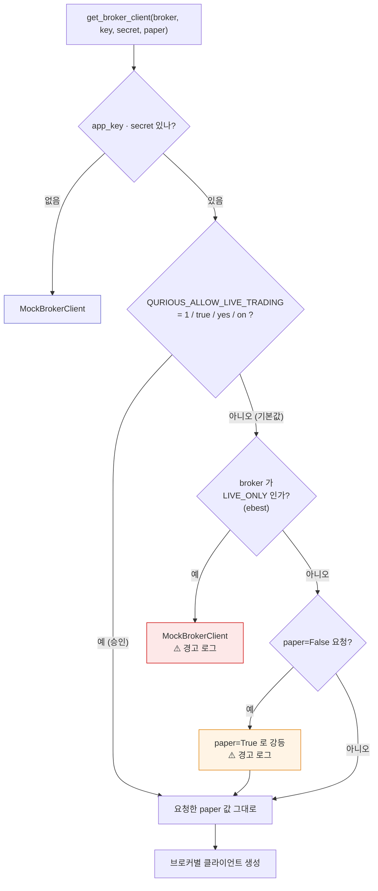

# ADR-0001 · 실거래 주문 경로를 팩토리 한 곳에서 차단한다

| 항목 | 내용 |
|------|------|
| **상태** | 채택 (Accepted) |
| **작성일** | 2026-09-21 (KST) |
| **작성자** | 이동원 |
| **관련 요구** | rfp-2 §4.2 제외 범위 · 이슈 #61 P0-1 |
| **영향 범위** | `app/services/brokers/factory.py` · `app/services/auto_trade.py` · `app/routes/stocks.py`(간접) |
| **구분 (산출물 분류)** | 시스템 설계 → 기술 의사결정 기록(ADR) |

> **ADR**(Architecture Decision Record, 아키텍처 의사결정 기록)
> — 「무엇을 정했는가」보다 **「왜 그렇게 정했는가」와 「무엇을 버렸는가」**를 남기는 문서다.
> 코드는 결정의 *결과*만 보여 주고 이유를 잃어버리기 때문에 따로 적는다.
> 뒤에 오는 사람이 이 결정을 **되돌리려 할 때 읽으라고** 쓰는 글이다.

---

## 1. 배경 — 무엇이 문제였나

발주 요구사항(`docs/rfp-2.md`) §4.2 **제외 범위**의 첫 줄:

> - 실제 증권 계좌를 통한 실거래 자동 주문 실행

즉 이 프로젝트는 **모의투자까지**가 범위다. 그런데 코드는 실거래를 낼 수 있는 상태였다.

### 1.1 실주문이 나갈 수 있던 경로 — 3중 구멍

S39 프롬프트는 `auto_trade.py` 한 곳을 지목했으나, 실제로 훑어 보니 **세 갈래**였다.

| # | 경로 | 어떻게 실계좌로 갔나 | 차단 장치 | 위험도 |
|---|------|---------------------|-----------|--------|
| 1 | `app/services/auto_trade.py:183` (자동매매) | `paper=False` 를 **코드에 박아** 넘김 | `quant_mode != "live"` **한 줄** | 🔴 높음 |
| 2 | `app/routes/stocks.py:639` (수동 주문 API) | DB 칸 `broker_settings.paper` 를 **그대로** 넘김 | 없음 — 칸이 `False` 면 코드 수정 없이 실계좌 | 🔴 높음 |
| 3 | `app/services/brokers/ebest.py` (LS증권) | `paper` 인자를 **아예 받지 않음**. 모의·실전이 같은 도메인 | 플래그로는 **막을 수 없음** | 🔴 높음 |

3번이 특히 고약하다. `paper=True` 를 주더라도 `EBestClient` 는 그 값을 볼 자리가 없어
`https://openapi.ebestsec.co.kr/stock/order` 로 그냥 나간다. **플래그로 막았다고 믿는데
막히지 않는 것**이 막지 않은 것보다 나쁘다.

### 1.2 브로커별 실호출 여부 (실측)

| 브로커 | `place_order` 실제 동작 | `paper` 반영 | 미승인 시 조치 |
|--------|------------------------|--------------|----------------|
| `kis` (한국투자) | 🔴 실 HTTP 호출 | ✅ `base_url`·`tr_id` 둘 다 분기 | `paper=True` 강등 |
| `ebest` (LS) | 🔴 실 HTTP 호출 | ❌ 인자 없음 | **Mock 으로 교체** |
| `kb` (KB) | ⚪ `_not_ready()` 예외 | ⚠️ 저장만 함 | `paper=True` 강등 |
| `kiwoom` · `daishin` | ⚪ Mock 상속 (+ Windows 가드) | — | 그대로 |
| `shinhan` | ⚪ Mock 상속 | — | 그대로 |
| `meritz` | ⚪ 예외 (`_raise_not_ready`) | — | 그대로 |
| `mock` | ⚪ 시뮬레이션 | — | 그대로 |

> **tr_id** — 한국투자증권 REST API 가 요구하는 **거래 식별 코드**다.
> 매수 실전은 `TTTC0012U`, 모의는 `VTTC0012U` 처럼 앞 글자가 갈린다.
> URL 만 모의로 바꾸고 `tr_id` 를 실전 값으로 두면 거부되므로, 둘이 **함께** 바뀌어야 한다.
> KIS 클라이언트는 이미 둘 다 `self.paper` 로 분기하고 있어 플래그 하나로 안전하게 갈린다.

---

## 2. 결정

**증권사 클라이언트를 만드는 팩토리에 관문을 하나 두고, 호출부는 손대지 않는다.**

환경변수 `QURIOUS_ALLOW_LIVE_TRADING` 이 켜져 있지 않으면

1. `paper=False` 요청을 **`paper=True` 로 강등**하고 경고를 남긴다.
2. 플래그가 듣지 않는 브로커(`ebest`)는 **`MockBrokerClient` 로 갈아 끼운다.**

### 2.1 왜 호출부가 아니라 팩토리인가

```
[ 전 ]  호출부마다 따로 막는다 — 새 경로가 생기면 또 빠진다

  auto_trade.py ──┐ paper=False (하드코딩)
                  ├──→ get_broker_client() ──→ KISClient(실전 URL)  🔴
  stocks.py    ───┘ row.paper (DB 칸)                               🔴
                    (ebest 는 플래그 자체를 무시)                    🔴


[ 후 ]  팩토리가 유일한 목이다 — 지나가려면 반드시 관문을 거친다

  auto_trade.py ──┐
                  │      ┌──────────────────────────────┐
                  ├──────┤  관문: live_trading_allowed()  │
  stocks.py    ───┘      │  미승인 → paper=True 강등       │
                  │      │  미승인 + ebest → Mock 교체     │
  (앞으로 생길 경로)───────┤                              │
                         └───────────────┬──────────────┘
                                         ↓
                          KISClient(모의 URL) / MockBrokerClient  ✅
```

호출 지점을 하나하나 막는 방식은 **지금 있는 두 곳**만 막는다.
세 번째 경로가 생기는 날 조용히 뚫린다. 팩토리는 **모든 경로가 반드시 지나는 유일한 목**이라,
여기 한 번 걸면 앞으로 생길 경로까지 같이 걸린다.

### 2.2 제어 흐름



### 2.3 호출부도 의도를 드러낸다 (이중 안전망)

팩토리만 고쳐도 기능은 막힌다. 그런데 `auto_trade.py` 에 `paper=False` 가 남아 있으면
**코드가 여전히 "실계좌를 원한다"고 읽힌다.** 다음 사람이 관문을 손볼 때 그 오해가 비싸다.
그래서 호출부도 함께 바꿨다.

```python
# 전
client = get_broker_client(broker, app_key, app_secret, paper=False)

# 후
client = get_broker_client(
    broker, app_key, app_secret, paper=not live_trading_allowed()
)
```

두 겹이라 하나가 무너져도 다른 하나가 남는다.

---

## 3. 버린 대안

| 대안 | 왜 버렸나 |
|------|-----------|
| **A. 실주문 코드를 지운다** | 프로젝트 목표가 *모의투자 의사결정*(rfp-2 Phase 5)이다. 실주문 경로는 모의투자 경로와 **같은 코드**라 지우면 모의투자도 죽는다. |
| **B. `quant_mode` 검사만 강화** | 수동 주문 API(경로 2)는 `quant_mode` 를 보지 않는다. 자동매매만 막힌다. |
| **C. DB 칸(`broker_settings.paper`)을 강제로 True 고정** | 경로 2는 막히지만 경로 1(하드코딩)과 경로 3(ebest)은 그대로다. 그리고 DB 를 고치면 **사용자 설정을 말없이 덮어쓰는** 일이라, 나중에 실거래를 열 때 되돌릴 근거가 남지 않는다. |
| **D. 설정 파일(`app/config.py`)에 플래그를 둔다** | 설정은 저장소에 커밋된다. 실거래 승인은 **저장소가 아니라 실행 환경**의 결정이어야 한다. 환경변수는 커밋되지 않는다. |
| **E. 코드 리뷰로 막는다** | 팀원 넷의 작업 시간대가 달라 PR 에 사람 승인을 필수로 걸 수 없다(#62 §5.0). 사람이 못 막으면 코드가 막아야 한다. |

---

## 4. 결과

### 4.1 얻은 것

- 실주문 경로 **3곳이 한 번에** 막혔다. 앞으로 생길 경로도 팩토리를 지나는 한 자동으로 막힌다.
- 모의투자(`paper=True`)는 **그대로 동작한다** — 프로젝트 목표가 죽지 않는다.
- 여는 일이 **명시적 행동**이 됐다. `QURIOUS_ALLOW_LIVE_TRADING=1` 을 실행 환경에 넣는 것은
  실수로 일어나지 않는다.
- 강등될 때마다 **경고 로그**가 남아, 누가 실거래를 시도했는지 추적된다.

### 4.2 치르는 비용

- 실거래를 실제로 열 때 환경변수를 알아야 한다 → `docs/배포/CI-CD명세_v1.0.md` 5절에 적었다.
- 애매한 값(`"2"`, `"아니오"`)은 전부 **막힘**으로 읽는다. 여는 쪽이 명시적이어야 하므로 의도한 동작이다.
- `ebest` 는 승인 전까지 **연동 시험 자체가 불가능**하다. 실서버 말고 갈 곳이 없기 때문이다.

### 4.3 검증 — 스스로 판정하지 않는다

`tests/test_live_trading_guard.py` 가 요구사항을 직접 확인한다(23건 중 12건).
**테스트가 통과했다는 사실만으로 판정하지 않고**, 테스트 밖에서 한 번 더 실행해 대조했다.

| 확인 항목 | 기대 | 실측 | 판정 |
|-----------|------|------|------|
| 미승인 · `kis` `paper=False` | 모의 URL | `openapivts...:29443` | ✅ |
| 미승인 · `ebest` | `MockBrokerClient` | `MockBrokerClient` | ✅ |
| 승인 · `kis` `paper=False` | 실전 URL | `openapi...:9443` | ✅ |
| 승인 · `ebest` | `EBestClient` | `EBestClient` | ✅ |
| 셸에 `=1` 이 남아 있을 때 pytest | 격리되어 23건 통과 | 23건 통과 | ✅ |
| 강등 시 경고 로그 | 출력됨 | 출력됨 | ✅ |

> 마지막 항목이 중요하다. **조용히 성공하는 차단**은 S39 에서 4시간 반을 먹은 실패 유형
> (#53 · 한글 `license_name`)과 같은 모양이다. 강등은 반드시 소리를 낸다.

### 4.4 이 결정을 되돌릴 때

모의투자 검증이 끝나고 **발주자가 실거래를 범위에 넣기로 바꾸면**, 이 ADR 을
`Superseded`(대체됨)로 바꾸고 ADR-00NN 을 새로 쓴다. 코드에서는
`live_trading_allowed()` 의 기본값만 바꾸면 되지만, **왜 바뀌었는지 기록 없이 기본값만
바꾸는 일은 하지 않는다.** 그때는 rfp 개정본이 근거로 붙어야 한다.

---

## 5. 참조

- `docs/rfp-2.md` §4.2 제외 범위
- `app/services/brokers/factory.py` — 관문 구현 + 모듈 설명
- `tests/test_live_trading_guard.py` — 인수시험
- `docs/시험/테스트계획서_v1.0.md` — 시험 범위와 합격 기준
- 이슈 #61 P0-1 · #62 §5.0
