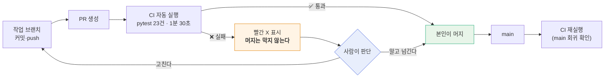

# ADR-0002 · CI 를 병합 게이트가 아니라 회귀 신호로 둔다

| 항목 | 내용 |
|------|------|
| **상태** | 채택 (Accepted) |
| **작성일** | 2026-09-21 (KST) · S41 |
| **작성자** | 이동원 |
| **관련 요구** | 이슈 #62 §5.0 (승인자를 둘 수 없는 사정) · #61 P2-3 |
| **영향 범위** | `.github/workflows/ci.yml` · `docs/배포/CI-CD명세_v1.0.md` → v1.1 · 저장소 룰셋(설정 안 함) |
| **구분 (산출물 분류)** | 시스템 설계 → 기술 의사결정 기록(ADR) |
| **대체 관계** | CI/CD 명세 v1.0 §4 (룰셋 설정 절차)를 **철회**한다 |

> **ADR**(Architecture Decision Record, 아키텍처 의사결정 기록)
> — 「무엇을 정했는가」보다 **「왜 그렇게 정했는가」와 「무엇을 버렸는가」**를 남기는 문서다.
> 이 ADR 은 특히 **하루 전에 내린 결정을 되돌리는 기록**이라, 되돌린 이유를 자세히 적는다.

---

## 1. 배경 — 하루 만에 방침이 바뀐 이유

### 1.1 어제(S40) 세운 계획

ADR-0001 로 실거래 경로를 막으면서, 그 차단이 **되돌아오지 않게** 지킬 장치로 CI 를 들였다.
그때의 논리는 이랬다(CI/CD 명세 v1.0 §1).

> 이 팀은 PR 에 필수 승인자를 둘 수 없다. 팀원 넷의 작업 시간대가 달라 승인을 기다리면
> 병합이 멈춘다. 그래서 **사람 대신 CI 가 막는다.**

그리고 그 "막는다"를 완성하려면 저장소 **룰셋**에 필수 상태 검사를 등록해야 한다고 적고,
사용자가 웹 UI 에서 직접 할 절차(v1.0 §4)를 남겼다.

### 1.2 오늘(S41) 제기된 반론

> "저희는 자기가 작업하고 올린 것에 대해서는 자기가 merge 하고,
> 이슈나 PR 확인 요청을 통해서 이중 검증하는 방식으로 진행했는데,
> 쓸데없는 CI 같아서 제거하는 방향을 생각 중입니다."

**이 반론의 핵심은 옳다.** 룰셋을 켜면 필수 상태 검사가 빨간색일 때 병합 버튼이 잠긴다.
승인자를 0명으로 두어도 마찬가지다. 즉 **「자기가 올리고 자기가 머지」라는 팀의 실제
운영 방식을 CI 가 가로막게 된다.** v1.0 §1 은 "승인자를 못 두니 CI 가 대신 막는다"고 썼지만,
막는 대상이 남의 부주의가 아니라 **자기 자신의 병합**이라는 점을 충분히 따지지 않았다.

### 1.3 그러나 시험 자체를 지우면 잃는 것이 있다

반론을 받아들여 워크플로까지 지우면, 함께 죽는 것이 있다. 시험 23건 중 **3건은
저장소 전체를 걸어다니는 스캔**이다.

| 시험 | 훑는 범위 | 지키는 것 |
|------|-----------|-----------|
| `test_저장소_어디에도_paper_False_하드코딩이_남아있지_않다` | `app/**/*.py` 전체 | ADR-0001 의 실거래 차단 |
| `test_야후_참조가_기준선과_같다` | 저장소 전체 | 야후 의존 봉인선 (#61 P1-1) |
| `test_기준선에_없는_파일이_야후를_쓰지_않는다` | 저장소 전체 | 새 파일이 야후를 들고 들어오는 것 |

이 3건은 **사람의 PR 리뷰로는 원리상 잡히지 않는다.** 리뷰어는 diff 를 본다.
내 diff 가 깨끗해도 저장소 전체는 깨져 있을 수 있고, 아무도 그것을 보지 않는다.

---

## 2. 두 검증은 대체재가 아니라 보완재다

```
        사람 이중 검증 (PR·이슈)              CI (pytest 23건)
        ─────────────────────────            ─────────────────────────
보는 것  ┌───────────────┐                    ┌───────────────────────┐
         │  이 PR 의 diff │                    │  저장소 전체의 현재 상태 │
         └───────────────┘                    └───────────────────────┘
             ↑ 좁고 깊다                          ↑ 넓고 얕다

잡는 것  · 설계 의도가 맞는가                  · 지난번에 고친 게 되돌아왔나
         · 요구를 충족하는가                   · 전역 약속이 아직 지켜지나
         · 읽히는 코드인가                     · 기계적으로 셀 수 있는 것

못 잡음  · 다른 파일에 **이미 있던** 문제        · 의도가 옳은지
         · 여러 PR 에 걸쳐 쌓인 회귀            · 설계가 나은지
```

### 2.1 이 저장소에 실제 전력이 있다

ADR-0001 이 막은 `paper=False` 하드코딩이 언제 들어왔는지 추적했다.

```
005ad7d  강사님 lumina-invest 최신본 반영 + AWS 걷어내기
            └─ app/services/auto_trade.py 의 paper=False 가 이때 들어옴
                          │
                          ▼
49d8159  주문이 정산금액으로 현금을 옮긴다 — orders 확장 + order_fills 신설
            └─ 같은 파일을 또 건드렸다. 그런데도 안 잡혔다
                          │
                          ▼
ae501e1  실거래로 나가는 문이 셋이었다 (2026-09-21 · S40)
            └─ 전수 조사를 해서야 찾았다
```

**실거래로 나가는 코드가 여러 차례 사람 눈앞을 지나갔는데 아무도 잡지 못했다.**
이것은 리뷰어가 게을렀다는 뜻이 아니다. diff 리뷰는 「이 변경이 맞는가」를 보는 도구이지
「저장소가 여전히 맞는가」를 보는 도구가 아니다. 구조의 문제다.

---

## 3. 검토한 선택지

| # | 안 | 자기 머지 | 회귀 탐지 | 시험 산출물 | 관리 부담 |
|---|-----|:--------:|:--------:|:----------:|:--------:|
| A | **워크플로 유지 + 룰셋 미설정 (신호등)** | ✅ 그대로 | ✅ 빨간 X 로 보임 | ✅ 유지 | 낮음 |
| B | 워크플로 제거 | ✅ 그대로 | ❌ 없음 | ❌ 실행 증거 소멸 | 없음 |
| C | 워크플로 + 룰셋 (게이트) | ⚠️ 검사 실패 시 잠김 | ✅ 강제 | ✅ 유지 | 중간 |

### 3.1 B 안을 버린 이유

pytest 파일은 남지만 **아무도 자동으로 돌리지 않는다.** 로컬에서 돌리는 것은 기억에 의존하고,
기억은 바쁠 때 가장 먼저 무너진다. 그러면 §1.3 의 전역 스캔 3건은 사실상 죽는다 —
ADR-0001 의 실거래 차단과 야후 봉인선이 **문서상의 약속으로만** 남는다.
강사님 산출물 10구분의 「시험」 칸에 실행 증거가 사라지는 것도 손실이다.

### 3.2 C 안을 버린 이유

팀의 실제 운영 방식(자기 머지 + 이슈·PR 로 이중 검증)과 정면으로 부딪힌다.
급할 때 우회하려면 룰셋을 껐다 켜야 하는데, 그렇게 우회하기 시작한 게이트는
**켜져 있다는 착각만 남기고 실제로는 막지 않는다.** ADR-0001 §1.1 의 3번 경로와 같은
실패 양상이다 — *막았다고 믿는데 막히지 않는 것은 막지 않은 것보다 나쁘다.*

---

## 4. 결정

**A 안을 채택한다. `.github/workflows/ci.yml` 은 유지하고, 저장소 룰셋은 설정하지 않는다.**



| 구성 요소 | 결정 | 근거 |
|-----------|------|------|
| `ci.yml` 워크플로 | **유지** | 비용 0(Public 저장소 = Actions 무제한) · 1분 30초 |
| pytest 23건 | **유지** | 전역 스캔 3건은 리뷰로 대체 불가 (§1.3) |
| 저장소 룰셋 `main-gate` | **설정하지 않음** | 자기 머지를 막는다 (§1.2) |
| 필수 상태 검사 | **등록하지 않음** | 위와 같음 |
| PR 확인 요청·이슈 | **그대로 정본** | 설계 의도 검증은 사람이 한다 |

> **룰셋**(ruleset) — GitHub 저장소 설정에서 브랜치에 거는 규칙 묶음이다.
> 「main 에 직접 푸시 금지」, 「이 검사가 통과해야 병합 가능」 같은 조건을 담는다.
> **워크플로와는 별개의 물건이다** — 워크플로는 *검사를 실행할 뿐*이고,
> 그 결과를 병합 조건으로 삼는 것은 룰셋이다.
> 그래서 워크플로만 있으면 **아무것도 막히지 않는다.** 이번 결정이 노리는 상태가 정확히 그것이다.

---

## 5. 감수하는 위험과 완화책

솔직하게 적는다. A 안은 공짜가 아니다.

| 위험 | 실제로 일어나면 | 완화책 |
|------|----------------|--------|
| 빨간 X 를 보고도 그냥 머지한다 | 회귀가 main 에 들어간다 | main push 에서도 CI 가 돌아 **다음 사람이 즉시 본다**. 넘긴 판단은 PR 본문에 남긴다 |
| 빨간 X 에 익숙해져 아무도 안 본다 | 신호등이 꺼진 것과 같다 | 시험이 23건뿐이라 실패는 **드물게** 나야 정상이다. 상시 빨간 상태가 되면 그때 게이트를 재검토한다 (§6) |
| 팀원이 CI 존재를 모른다 | PR 에 X 가 떠도 의미를 모른다 | 이 ADR 과 CI/CD 명세 v1.1 을 산출물목록에 올린다 |

**신호등이 게이트보다 약하다는 것을 부정하지 않는다.** 다만 약한 장치가 실제로 쓰이는 것이,
강한 장치가 우회되는 것보다 낫다고 판단했다.

---

## 6. 이 결정을 되돌려야 할 때

아래 중 하나라도 해당하면 C 안(룰셋 게이트)을 다시 검토한다.

| 조건 | 왜 그때는 게이트가 필요한가 |
|------|---------------------------|
| 빨간 X 인 채로 머지된 PR 이 **2건 이상** 누적 | 신호등이 작동하지 않는다는 증거 |
| 팀원이 실제로 PR 을 올리기 시작하고 **리뷰 없이 머지**되는 일이 반복 | 자기 검증 전제가 깨진다 |
| 실거래·자금 이동 코드가 **실제 계좌**에 닿는 단계로 진입 | 돌이킬 수 없는 손실이 생긴다 |
| 강사님이 **병합 게이트를 산출물로 요구** | 요구사항이 바뀐다 |

절차는 지우지 않고 CI/CD 명세 v1.1 **부록 A** 에 보존한다 — 되돌릴 때 다시 쓸 수 있게.

---

## 7. 참조

- `docs/배포/CI-CD명세_v1.1.md` — 이 결정을 반영한 명세 (부록 A 에 룰셋 절차 보존)
- `docs/ADR/ADR-0001-실거래-주문-경로-차단.md` — CI 가 지키려는 대상
- `docs/시험/테스트계획서_v1.0.md` — 시험 23건의 내역 (TC-LT · TC-YH)
- `.github/workflows/ci.yml`
- 이슈 #62 §5.0 · #61 P2-3
