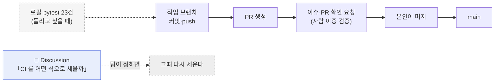

# ADR-0003 · CI 를 걷어내고, 어떤 식으로 세울지 먼저 논의한다

| 항목 | 내용 |
|------|------|
| **상태** | 채택 (Accepted) |
| **작성일** | 2026-09-21 (KST) · S41 |
| **작성자** | 이동원 |
| **관련 요구** | 이슈 #67 · #62 §5.0 · #61 P2-3 |
| **영향 범위** | `.github/workflows/ci.yml` **삭제** · `docs/배포/CI-CD명세_v1.1.md` → v1.2 |
| **구분 (산출물 분류)** | 시스템 설계 → 기술 의사결정 기록(ADR) |
| **대체 관계** | [ADR-0002](ADR-0002-CI를-게이트가-아니라-신호로-둔다.md) 를 **대체한다** (같은 날) |

> **ADR**(Architecture Decision Record, 아키텍처 의사결정 기록)
> — 「왜 그렇게 정했는가」와 「무엇을 버렸는가」를 남기는 문서다.
> 이 ADR 은 **같은 날 세 번째 판**이다. 그 사실 자체가 기록할 가치가 있다(§5).

---

## 1. 무엇을 되돌리는가

하루 사이에 CI 방침이 세 번 바뀌었다. 순서대로 적는다.

```
  S40  ADR 없음      CI 를 세우고 룰셋으로 **병합 게이트**를 만들려 함
        │            (CI/CD 명세 v1.0 §4 — 사용자 숙제로 룰셋 절차를 남김)
        ▼
  S41  ADR-0002      게이트는 우리 머지 방식을 막는다 → **신호등**으로 전환
        │            (워크플로 유지 · 룰셋 미설정 · PR #68 머지됨)
        ▼
  S41  ADR-0003      **워크플로를 걷어내고, 어떤 식으로 세울지 먼저 논의한다**  ← 이 문서
       (이 판)
```

**이번에 되돌리는 것은 판단이 아니라 순서다.** ADR-0002 의 기술적 분석(사람 리뷰와
CI 가 보는 범위가 다르다는 것, §2 에서 다시 다룬다)은 취소하지 않는다.
틀렸던 것은 **그 분석을 근거로 팀 도구를 혼자 세운 것**이다.

---

## 2. 왜 되돌리나

### 2.1 팀이 쓸 도구를 팀 논의 없이 세웠다

CI 는 **모든 팀원의 PR 화면에 나타나는 공용 장치**다. 그런데 지금까지의 경위는 이렇다.

| 단계 | 누가 정했나 | 팀 논의 |
|------|------------|:------:|
| CI 도입 (S40) | 작성자 단독 | ❌ 없음 |
| 룰셋 게이트 계획 (S40) | 작성자 단독 | ❌ 없음 |
| 신호등 전환 (S41 · ADR-0002) | 사용자 반론 → 작성자 | 🟡 1인 |
| **걷어내고 논의 (이 판)** | 사용자 판단 | ✅ **논의를 연다** |

이 프로젝트에는 이미 논의 규격이 있다 — Discussion 9건이 그것이다.
**CI 는 그 규격을 거치지 않고 들어온 유일한 공용 장치다.**

### 2.2 ADR-0002 의 분석은 여전히 유효하다 — 그래서 논의 재료가 된다

ADR-0002 §2 가 보인 것은 취소되지 않는다. 다시 적는다.

```
        사람 이중 검증 (PR·이슈)              자동 시험
        ─────────────────────────            ─────────────────────────
보는 것  ┌───────────────┐                    ┌───────────────────────┐
         │  이 PR 의 diff │                    │  저장소 전체의 현재 상태 │
         └───────────────┘                    └───────────────────────┘
못 잡음  · 다른 파일에 **이미 있던** 문제        · 의도가 옳은지
```

그리고 이 저장소에는 실제 전력이 있다 — `paper=False` 하드코딩이 `005ad7d` 에서
들어와 `49d8159` 가 같은 파일을 또 건드렸는데도 지나갔고, 전수 조사에서야 잡혔다
(ADR-0002 §2.1).

**그러나 「문제가 있다」가 「내가 고른 해법을 쓰자」로 바로 이어지지 않는다.**
문제는 논의에 올리고, 해법은 팀이 고른다. 이것이 이번 결정의 전부다.

### 2.3 지금 걷어내도 잃는 것이 적다

| 항목 | 상태 |
|------|------|
| 시험 23건 (`tests/`) | **그대로 둔다** — `python -m pytest` 로 언제든 돈다 |
| `pytest.ini` · `requirements-dev.txt` | **그대로 둔다** |
| 시험이 지키던 내용 | ADR-0001(실거래 차단) · TC-YH(야후 봉인) 모두 **코드와 문서에 남아 있다** |
| 잃는 것 | **자동 실행**뿐 — 누군가 돌려야 결과가 나온다 |

CI 가 있던 기간은 **하루가 안 된다**(S40 → S41). 실행 이력은 2건이고,
그 사이 회귀는 없었다. 지금이 걷어내기 가장 싼 시점이다.

---

## 3. 결정

**`.github/workflows/ci.yml` 을 삭제하고, 「CI 를 어떤 식으로 세울까」를 Discussion 으로 연다.**

| 구성 요소 | 결정 | 비고 |
|-----------|------|------|
| `.github/workflows/ci.yml` | **삭제** | 이 PR 에서 |
| `tests/` 23건 | **유지** | 로컬에서 `python -m pytest` |
| `pytest.ini` · `requirements-dev.txt` | **유지** | 시험을 돌리는 데 필요 |
| 저장소 룰셋 | 걸지 않음 | ADR-0002 §4 와 동일 — 애초에 건 적이 없다 |
| 재도입 여부·형태 | **Discussion 에서 정한다** | §4 |



---

## 4. 논의에 올릴 것 — 질문의 형태로

Discussion 에 그대로 옮긴다. **답을 정해 두고 묻지 않는다.**

| # | 질문 | 왜 이것을 묻나 |
|---|------|---------------|
| 1 | 자동 시험이 **필요한가** | 필요 없다는 답도 정당한 답이다. 팀 규모·기간·리스크에 따라 다르다 |
| 2 | 필요하다면 **무엇을 막아야 하나** | 실거래 경로? 야후 의존? 문법 오류? 막을 대상이 정해져야 도구가 정해진다 |
| 3 | **언제 돌아야 하나** | PR? push? 배포 전? 수동? |
| 4 | **실패하면 어떻게 되나** | 머지를 막나, 알리기만 하나 — ADR-0002 의 게이트/신호등 갈림 |
| 5 | **누가 관리하나** | 깨진 CI 를 아무도 안 고치면 없느니만 못하다 |
| 6 | GitHub Actions 말고 **다른 방법**은 | pre-commit 훅 · 로컬 스크립트 · 아무것도 안 함 |

---

## 5. 같은 날 세 번 바뀐 것을 기록으로 남기는 이유

숨기면 편하지만 남긴다. 이유가 둘이다.

**1. 판단 근거가 얕았던 자리가 드러난다.**
S40 에서 「팀원 시간대가 달라 승인자를 못 둔다 → 그러니 CI 가 막는다」로 이었는데,
그 사이에 **「그러니 무엇이 필요한가」를 팀에 묻는 단계**가 빠져 있었다.
ADR-0002 는 게이트/신호등을 다시 따졌지만 **그 빠진 단계는 그대로 두었다.**
세 번째에야 그것이 보였다.

**2. 이 프로젝트는 되돌린 기록을 이미 쓰고 있다.**
ADR-0001 도 「막았다고 믿는데 막히지 않는 것은 막지 않은 것보다 나쁘다」를 적었고,
ADR-0002 도 「하루 만에 뒤집힌 결정은 근거가 얕았다는 뜻」이라고 적었다.
**되돌린 횟수보다, 되돌린 이유가 남아 있는지가 중요하다.**

> 🟡 **다만 경고도 적어 둔다** — 같은 날 세 판은 정상이 아니다.
> 다음에 공용 장치를 들일 때는 **만들기 전에 논의를 먼저 연다.**
> 이 ADR 이 그 규칙의 근거다.

---

## 6. 이 결정을 되돌려야 할 때

| 조건 | 무엇을 한다 |
|------|------------|
| Discussion 에서 팀이 **형태를 합의** | 그 형태로 세운다. 이 ADR 을 대체하는 ADR-0004 를 쓴다 |
| 09-27 마감까지 **응답이 없다** | 🟡 무응답을 찬성으로 읽지 않는다. 기한을 한 번 더 두되, 재촉 글은 쓰지 않는다 |
| 회귀 사고가 **실제로 난다** | 사고 기록을 근거로 논의를 다시 연다 — 가정이 아니라 사례가 생긴 것이다 |
| 실거래·자금 이동이 **실계좌**에 닿는 단계 | 그때는 논의를 기다리지 않는다. 안전 장치가 먼저다 |

---

## 7. 참조

- `docs/ADR/ADR-0002-CI를-게이트가-아니라-신호로-둔다.md` — 대체 대상 (분석은 유효)
- `docs/ADR/ADR-0001-실거래-주문-경로-차단.md` — 시험 23건이 지키던 대상
- `docs/배포/CI-CD명세_v1.2.md` — 이 결정을 반영한 명세
- `docs/시험/테스트계획서_v1.0.md` — 시험은 그대로 있다
- 이슈 [#67](https://github.com/devlee328288/Qurious/issues/67) · PR #68(머지 후 되돌림)
