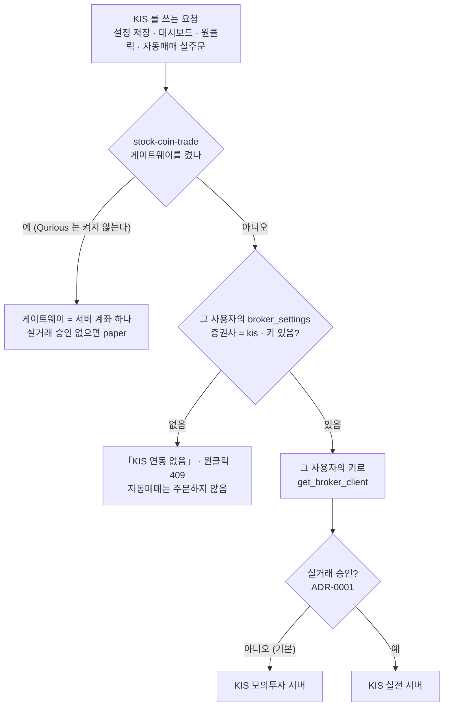

# ADR-0004 · KIS 자격증명은 사용자마다 자기 키를 쓴다

| 항목 | 내용 |
|------|------|
| **상태** | 채택 (Accepted) — 팀장 결정 · 담당 확인 대기(`P02-⑤-1` 오준영) |
| **작성일** | 2026-10-03 (KST) |
| **작성자** | 이동원 |
| **관련 요구** | `P02-⑤-1` 증권사 연동 · `RFP2-4.2-①` 실거래 제외 · 강사님 기초 코드 `9478811` 반영 |
| **영향 범위** | `app/services/kis_credentials.py` · `app/services/kis_quickstart.py` · `app/routes/dashboard.py`(KIS 탭) · `app/routes/stocks.py`(간접) · `app/services/auto_trade.py`(간접) |
| **구분 (산출물 분류)** | 시스템 설계 → 기술 의사결정 기록(ADR) |

> **ADR**(Architecture Decision Record, 아키텍처 의사결정 기록) — 「무엇을 정했는가」보다 **「왜 그렇게 정했고 무엇을 버렸는가」** 를
> 남기는 문서다. 강사님 기초 코드를 다음에 다시 받을 때 이 결정을 되돌리지 않으려고 쓴다.

---

## 1. 배경 — 강사님 판은 KIS 계좌가 하나다

강사님이 2026-10-02 에 기초 코드(lumina-invest `9478811`)에 KIS 자동매매 연동을 넣으면서, KIS 자격증명을 **서버가 관리**하게 바꿨다.

| 무엇 | 강사님 판(`9478811`) | 코드 |
|---|---|---|
| 키를 어디서 읽나 | AWS Secrets Manager → 없으면 `.env` 의 `KIS_APP_KEY` · `KIS_APP_SECRET` · `KIS_ACCOUNT_NO` | `kis_credentials._load()` |
| 사용자가 넣은 키 | 설정을 저장할 때 **지운다**(KIS 를 고르면 키 · 계좌 칸을 빈 값으로) | `routes/stocks.py` `_apply_credentials` |
| 원클릭 「KIS 모의투자 시작」 | 시작하며 그 사용자의 키를 지운다 | `kis_quickstart.start` |
| 대시보드 KIS 탭 · 자동매매 실주문 | 서버 계좌 하나로 조회 · 주문 | `dashboard.kis_tab` · `auto_trade._place_live_order` |

강사님 사이트는 운영자 한 사람이 쓰는 곳이라 이 방식이 맞다. 그래도 강사님도 「원클릭을 모든 로그인 사용자에게 보일지, 운영 계정만인지」 를 열린 질문으로 남겼다(작업 기록 `todo.md` L11).

**Qurious 는 여러 사람이 쓰는 모의투자 플랫폼이다.** 강사님 판을 그대로 받으면 이렇게 된다.

```
 [ 강사님 판을 그대로 ]                         [ Qurious 결정 ]

  사용자 A ─┐                                    사용자 A ── A 의 키 ──▶ A 의 KIS 모의 계좌
  사용자 B ─┼─▶ 서버 KIS 계좌 하나 (.env)          사용자 B ── B 의 키 ──▶ B 의 KIS 모의 계좌
  사용자 C ─┘    · 주문 · 포지션이 섞인다          사용자 C ── 키 없음 ──▶ 「KIS 연동 없음」(주문하지 않음)
                 · 대시보드가 모두에게 같은 잔고
                 · 설정 저장 때마다 각자 키가 지워짐  · 환경(모의 · 실전)은 실거래 승인이 정한다(ADR-0001)
```

## 2. 결정

**KIS 도 다른 증권사처럼 사용자가 「종목 선정」 화면에 넣은 자기 키(`broker_settings` 행)를 쓴다.** 사용자 결정(2026-10-03): *「사용자마다 받는 것으로 처음부터 진행해야 될 것 같습니다. 이 부분은 문제가 될 수 있기 때문입니다」*.

강사님 코드를 되도록 그대로 두려고, **모듈 이름과 함수 이름은 지키고 뜻만 바꿨다.**

| 바꾼 곳 | 어떻게 | 효과 |
|---|---|---|
| `kis_credentials.MANAGED_BROKERS` | `{"kis"}` → **빈 집합** | `is_managed()` 가 늘 거짓 → `stocks.py` 의 `_apply_credentials` · `_resolve_credentials` · `_connection_view` 와 `auto_trade` 실주문이 **고치지 않아도** 사용자 행을 쓴다. 저장할 때 키를 지우지 않는다 |
| 서버 계좌를 읽던 함수 넷 | `is_configured` · `resolve` · `get_credentials` · `get_status` 는 이름만 남기고 「서버 계좌 없음」 | 강사님 코드가 부르는 자리가 깨지지 않는다 |
| 새 함수 `for_user(row)` | 그 사용자의 KIS 키 → 자격증명. 환경은 실거래 승인(`QURIOUS_ALLOW_LIVE_TRADING`)이 정한다 — 승인 없으면 모의 | 대시보드 KIS 탭 · 원클릭이 이것을 부른다(파일마다 몇 줄) |
| Secrets Manager 갈래 | 뺐다(boto3) | 2026-09-15 에 AWS 를 걷어낸 방침 그대로 |
| 원클릭 시작 | 사용자 키를 지우는 줄을 뺐다 · 키가 없으면 409 「KIS 키가 없습니다」 | — |



## 3. 버린 대안

| 대안 | 왜 버렸나 |
|------|-----------|
| **A. 강사님 판 그대로(서버 계좌 하나)** | 주문 · 포지션 · 잔고가 사용자 사이에 섞이고, 설정을 저장할 때마다 각자 넣은 키가 지워진다. 우리 실거래 관문 덕에 돈이 나가지는 않지만, 모의투자 기록 자체가 누구 것인지 알 수 없게 된다(결정 대장 D7 ③ 장부 논의와도 어긋난다). |
| **B. 받되 서버 계좌 길은 관리자 한 명만** | 강사님 자료 추적 댓글 07 이 낸 안. 계좌가 섞이는 문제는 막지만 나머지 사용자는 KIS 를 쓸 길이 없어진다. 그리고 **누가 서버 계좌를 쓰는가** 를 우리가 정책으로 더하는 일이라 담당(`P02-⑤-1`)의 판단을 앞질러 간다. |
| **C. `kis_credentials.py` 를 받지 않고 부르는 곳을 고친다** | 강사님 코드 네 파일(`stocks.py` · `auto_trade.py` · `dashboard.py` · `kis_quickstart.py`)의 import 와 갈래를 손봐야 한다. 다음 반영 때 충돌이 네 곳으로 퍼진다. 이 결정은 그것을 **한 파일**(`kis_credentials.py`)로 모았다. |
| **D. 사용자 키를 서버 비밀 저장소에 암호화해 둔다** | 맞는 방향이지만 별도 과제다 — 지금도 `broker_settings.app_secret` 은 평문이다(옛 분석 A3). 이 결정은 「누구의 키인가」 만 정하고, 「어떻게 보관하나」 는 남긴다(4.2). |

## 4. 결과

### 4.1 얻은 것

- 사용자마다 자기 KIS 모의 계좌를 본다. 대시보드 KIS 탭 · 원클릭 · 자동매매 실주문이 모두 같은 키(그 사용자 행)를 쓴다.
- 서버 `.env` 에 KIS 키를 넣어도 사용자에게 새지 않는다(시험이 지킨다 — 4.3).
- 강사님 코드 대부분(라우트 · 자동매매 · 원클릭의 흐름)은 그대로다 — 갈라진 곳은 `kis_credentials.py` 한 파일과 대시보드 · 원클릭 몇 줄이다.

### 4.2 치르는 비용

- **사용자 키는 여전히 DB 에 평문이다**(`broker_settings.app_key` · `app_secret`). 강사님 판은 서버 관리로 이 문제를 비켜 갔다. 암호화는 `P02-⑤-1` 과제로 넘긴다(대안 D).
- 다음 강사님 반영 때 `kis_credentials.py` 는 늘 손으로 합친다(강사님이 고치면 충돌). 머리말에 이 ADR 을 적어 두었다.
- **게이트웨이(stock-coin-trade) 길은 이 결정과 맞지 않는다** — 그 서버의 KIS 계좌 하나를 모두가 쓴다. 그래서 켜지 않는다(`.env.example` 에 칸이 없다). 켜려면 「사용자별 키를 게이트웨이에 넘기는 설계」 를 팀이 먼저 정해야 한다. 켜더라도 실거래 승인 없이는 모의로만 나간다(ADR-0001 6절).
- 미국주식 탭(Alpaca)도 서버 키 하나를 모두가 본다 — 강사님 기존 설계 그대로 두었다(같은 질문이 남는다 · 팀 확인 글).

### 4.3 검증

| 시험 | 무엇을 | 건수 |
|---|---|:-:|
| `tests/test_live_trading_guard.py` 6절 | KIS 는 서버가 관리하지 않는다 · 사용자 키의 환경은 승인이 정한다 | 3 |
| `tests/test_kis_credentials.py` (TC-KC) | 서버 계좌 없음 · `.env` 키 무시 · `for_user` · 화면용 상태에 키 원문 없음 · 저장이 키를 남김 | 10 |
| `tests/test_legacy_kis_order_managed.py` (TC-KC) | 실주문이 사용자 DB 키로 · 승인 없이는 `paper=True` · 서버 키 무시 | 3 |
| `tests/test_kis_quickstart.py` · `_http.py` (TC-KQ) | 원클릭이 사용자 키로 판정 · 키를 지우지 않음 · 키 없으면 409 | 18 |
| `tests/test_dashboard_accounts.py` (TC-DA) | KIS 탭이 사용자 키로 · 키 없으면 「연동 없음」 | 6 |
| `tests/test_base_code_merge_guard.py` (TC-BM) | `kis_credentials` 에 Secrets Manager 갈래가 없다 | 1 |

앱에서도 확인했다(개발 모드 · 점검 계정): `GET /api/quant/settings` 의 `managed_brokers` 가 `[]`, 원클릭 `POST` 가 키 없이 409 「KIS 키가 없습니다 …」.

### 4.4 이 결정을 되돌릴 때

팀이 「운영자 한 명이 KIS 계좌 하나로 시연한다」 로 바꾸면(예: 발표용 데모 계좌), `MANAGED_BROKERS` 를 `{"kis"}` 로 돌리고 서버 계좌 읽기를 `.env` 갈래만 되살리면 된다 — 그때는 이 ADR 을 `Superseded` 로 바꾸고 누가 그 계좌를 쓰는지(대안 B)를 새 ADR 에 적는다.

## 5. 참조

- 강사님 자료 추적 댓글 07(분석) · 08(반영 결과) — `docs/github-archive/2026-09-28/이슈-강사님자료-변경추적/`
- [ADR-0001](ADR-0001-실거래-주문-경로-차단.md) — 실거래 차단 관문(6절에 게이트웨이 길)
- `app/services/kis_credentials.py` 머리말 · `docs/contracts/kis-autotrade-api.md`(강사님 세 저장소 계약서 사본)
