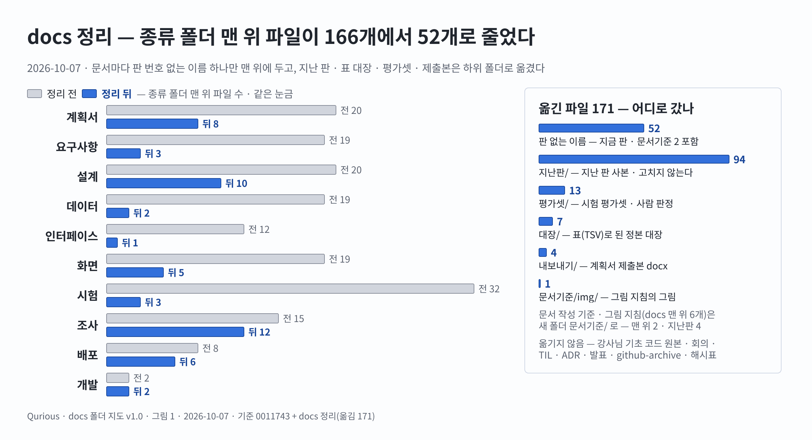

# docs 폴더 지도 — Qurious

| 문서 정보 | |
|---|---|
| **판 · 상태** | v1.1 · 개인 git 초안 폴더 `_git-drafts/` 의 자리를 더함 |
| **구분** | 8. 개발 · 형상 관리 — 문서의 자리 · 이름 · 판 |
| **작성** | 이동원(팀장) |
| **검토** | 검토 전 — 정리 PR 에 팀원 한 명 이상의 「읽었음」 을 받는다 |
| **최종 수정** | 2026-10-08 (KST) |
| **기준** | 코드 `main` `0011743` + 이 정리 · 옮긴 파일 171 · 정리 전부터 깨져 있던 상대 링크 15 는 그대로 두었다(4절) |
| **관련 문서** | [산출물목록](산출물목록.md) · [문서 작성 기준](문서기준/문서작성기준.md) · [문서 그림 지침](문서기준/문서그림지침.md) · [기록 색인](github-archive/README.md) |

> **이 문서가 답하는 질문**
> 1. 어떤 문서가 어느 폴더에 있나?
> 2. 판을 올릴 때 무엇을 하나 — 지난 판은 어디에 남나?
> 3. GitHub 글에 걸린 옛 주소(`…_v1.12.md`)는 어디로 갔나?
>
> **읽는 순서** — 팀원: 2절 → 3절 · 옛 링크를 따라온 사람: 5절 표 · 처음 온 사람: 1절 그림

---

## 1. 한눈에 — 정리 전후

종류 폴더 맨 위에 판마다 파일이 쌓여(테스트 계획서 16판 · RTM 13판 · 시험 폴더 한 곳에 32파일) 원하는 문서를 찾기 어려웠다. 2026-10-07 에 문서마다 이름 하나만 맨 위에 두고, 지난 판 · 표 대장 · 평가셋 · 제출본을 하위 폴더로 나눴다.



**<그림 1> docs 정리 전후 — 종류 폴더 맨 위 파일 166 → 52**
원본: Figma 「Qurious · 문서 그림」 · 페이지 「[작업 중] docs 폴더 지도 v1.0」 · Design [`45:3`](https://www.figma.com/design/6lstWS4YwuhJPhGB9XoBMD?node-id=45-3) · 기준 `0011743` + 이 정리 · 숫자는 정리 전 `git ls-tree HEAD` · 정리 뒤 폴더를 직접 셌다

---

## 2. 폴더 지도

```text
docs/
├─ README.md            이 문서 — 폴더 지도 · 이름 · 판 규칙 · 옮긴 자리
├─ 산출물목록.md         정본 색인 — 문서마다 지금 판 · 다음 판 · 상태
├─ 문서기준/             문서 작성 기준 · 문서 그림 지침            (+ img/ · 지난판/)
├─ 계획서/               계획서 · 결정 대장 · WBS · 스프린트 · 할 일 (+ 내보내기/ · img/ · 지난판/)
├─ 요구사항/             RTM · 유스케이스 · 강사님 자료 기능 대조    (+ 대장/ · img/ · 지난판/)
├─ 설계/                 기능 설계서 · 목표 기능 설계서 · 동작 원리 (+ 대장/ · img/ · 지난판/)
├─ 데이터/               ERD · 데이터 사전                         (+ 대장/ · 지난판/)
├─ 인터페이스/           API 명세서                                (+ 대장/ · 지난판/)
├─ 화면/                 IA · UI 명세서 · 와이어프레임 · 설계 절차   (+ img/ · 지난판/)
├─ 시험/                 테스트 계획서 · 기능 완성도 점검 · 백테스트 (+ 대장/ · 평가셋/ · img/ · 지난판/)
├─ 조사/                 조사서 · 색인(README.md)                  (+ img/ · 지난판/)
├─ 배포/ · 개발/         배포 · 운영 문서 · 코딩 표준 · 코드 리뷰 기록
├─ ADR/ · 회의/ · TIL/ · 발표/ · github-archive/    날짜 · 번호로 이미 나뉘어 있다(그대로)
├─ img/architecture/     README 첫 그림
├─ _git-drafts/          개인 git 초안 — 올리지 않는다(.gitignore · 3.3절)
└─ 01~05.md · rfp-1.md · rfp-2.md · supabase_schema.sql · contracts/ · commit-map-2026-09-23.tsv   (그대로 — 3.3절)
```

**<표 1> 종류 폴더 안 — 무엇을 어디에 두나**

| 자리 | 담는 것 | 판 | 예 |
|---|---|---|---|
| (맨 위) | 문서마다 **판 번호 없는 이름 하나** — 머리표의 판이 최신이다 | 머리표 · 개정 이력 | `시험/테스트계획서.md`(지금 v1.15) |
| `지난판/` | 지난 판 사본 `<이름>_v<판>.md` — 넣은 뒤에는 고치거나 옮기지 않는다 | 이름에 | `시험/지난판/테스트계획서_v1.14.md` |
| `대장/` | 표(TSV)로 된 정본 대장 — 한 파일을 고쳐 간다(스캐너 · 시험이 읽는다) | 없음 | `요구사항/대장/시험-요구대장.tsv` |
| `평가셋/` | 평가셋 · 사람 판정 · 표본 밖 질문 — 시험 폴더만 | 이름에 — 평가 도구가 판 이름으로 읽는다 | `시험/평가셋/근거검색-평가셋_v1.tsv` |
| `내보내기/` | 다른 형식으로 낸 제출본(docx) — 계획서 폴더만 | 이름에 | `계획서/내보내기/프로젝트계획서_v2.0.docx` |
| `img/` | 그림 PNG · SVG — 이름에 그림 판을 붙인다 | 이름에 | `화면/img/collect-decisions_v1.3.png` |

---

## 3. 이름 · 판 규칙

### 3.1 새 문서

판 번호 없는 이름으로 종류 폴더 맨 위에 만들고, 머리표에 `v0.1` 을 적는다. 산출물목록 0.1절에 한 줄을 더한다.

### 3.2 판 올리기 (네 단계)

| 단계 | 할 일 | 명령 · 확인 |
|:-:|---|---|
| 1 | 지금 파일을 `지난판/<이름>_v<지금 판>.md` 사본으로 만든다 | `python scripts/docs_scan.py --bump docs/<종류>/<이름>.md` — 사본은 한 칸 아래 폴더라 상대 링크를 새 자리에 맞춰 다시 쓴다(손으로 복사하면 링크가 모두 한 단계 어긋난다) |
| 2 | 같은 파일(판 없는 이름)을 고치고 머리표의 판 · 최종 수정 · 개정 이력을 올린다 | 큰 변화는 X.0 → (X+1).0, 작은 변화는 +0.1 |
| 3 | 산출물목록 0.1절의 판 칸을 고친다 | **다른 문서의 링크는 고치지 않아도 된다** — 최신을 가리키는 이름이 그대로라서 |
| 4 | 규칙 검사 | `python scripts/docs_scan.py --check` — 맨 위의 판 붙은 문서 0 · 짝 없는 지난판 사본 0 |

- **링크를 걸 때** — 최신을 가리키려면 판 없는 이름(`../시험/테스트계획서.md`), 그때의 판을 꼭 가리켜야 하면 지난판 사본(`../시험/지난판/테스트계획서_v1.14.md`).
- GitHub 글 · 대화방 글에도 판 없는 이름으로 건다. 판을 올려도 다시 깨지지 않는다.
- 판 이름을 붙인 채 맨 위에 새 파일을 만들지 않는다(정리 전 방식). `--check` 가 잡는다.

### 3.3 예외 — 옮기지 않은 것

| 경로 | 이유 |
|---|---|
| `01~05.md` · `rfp-1.md` · `rfp-2.md` · `supabase_schema.sql` · `contracts/` | 강사님 기초 코드 원본과 바이트까지 같다 — 기초 코드를 다시 반영(3-way 병합)할 때 경로가 같아야 한다 · RTM 스캐너가 `rfp-2.md` 를 읽는다 |
| `commit-map-2026-09-23.tsv` | 계정 이관 해시표 — 팀장 작업 규칙이 이 경로를 가리킨다 |
| `img/architecture/` | README 첫 그림 |
| `회의/` · `TIL/` · `github-archive/` · `ADR/` · `발표/` | 날짜 · 번호로 이미 나뉘어 있다 |
| `xlsx/` · `계획서/프로젝트계획서양식_AI퀀트예시.docx` | 커밋하지 않는 파일(섹터 자료 · 강의 양식) — 건드리지 않았다 |
| `_git-drafts/` | 팀장 개인 git 초안 — 세션마다 쓰는 커밋 · push · PR 스크립트와 커밋 메시지 · PR 본문 · 다음 세션 프롬프트. `.gitignore` 로 올리지 않으므로 팀원 PC 에는 없다. 2026-10-08 에 저장소 밖(`team_project/_git-drafts/`)에서 옮겨 왔다 · RTM 스캐너도 이 폴더를 훑지 않는다. 올릴 글(이슈 · 댓글 · 답글)의 원본은 여전히 `github-archive/` 다 |

---

## 4. 링크를 어떻게 고쳤나

| 링크 | 처리 | 수 |
|---|---|--:|
| 저장소 안 문서의 상대 링크 | 옛 자리 기준으로 대상을 풀고 새 자리 기준으로 다시 썼다 — 그때 최신이던 판은 판 없는 이름으로, 지난 판은 지난판 사본으로(내용이 같다) | 2,496 |
| 저장소 안 문서의 GitHub 절대 주소 | 경로만 새 자리로(대화방 안내 파일) | 25 |
| 명령 인자 속 문서 경로(`--doc` · `--check` · `--src`) | 지난판이 아니라 판 없는 이름으로 — 스캐너가 지난판을 다시 채우지 않게 | 94 |
| 글 속 전체 경로(`docs/…` 글자) | 새 자리로 | 270 |
| 코드 · 시험 속 경로 | 평가 도구 넷 · 스캐너 넷 · 계획서 docx 도구 · 시험 셋 · 주석 | 23 조각 + 주석 |
| **올린 글 보관본**(`github-archive/<날짜>/`) | **고치지 않았다** — 올린 글과 같게 둔다. 그 안의 옛 주소는 5절 표로 찾는다 | (236 그대로) |
| 정리 전부터 깨져 있던 상대 링크 | 그대로 두었다(지난 판 속 옛 이름 · 예시 글) | 15 |

---

## 5. 옮긴 자리 (2026-10-07)

GitHub 에 이미 올린 글 속 옛 주소는 열리지 않는다(쓰기를 몰아서 하지 않으려고 올린 글은 고치지 않았다). 옛 경로를 이 표에서 찾아 새 경로로 연다. **「이름바꿈」 줄의 새 경로는 앞으로도 최신 판**이다.

<!-- docs_reorg:moved -->
**<표 2> 옮긴 자리 — 옛 경로 → 새 경로 (171)**

| 옛 경로 (`docs/` 뒤) | 새 경로 (`docs/` 뒤) | 종류 |
|---|---|---|
| `img/doc-figure-flow_v0.3.png` | `문서기준/img/doc-figure-flow_v0.3.png` | 그림 |
| `개발/코드리뷰기록_v0.1.md` | `개발/코드리뷰기록.md` | 이름바꿈(최신 v0.1) |
| `개발/코딩표준_v0.1.md` | `개발/코딩표준.md` | 이름바꿈(최신 v0.1) |
| `계획서/WBS_v0.1.md` | `계획서/WBS.md` | 이름바꿈(최신 v0.1) |
| `계획서/논의결정대장_v0.9.md` | `계획서/지난판/논의결정대장_v0.9.md` | 지난판 |
| `계획서/논의결정대장_v1.0.md` | `계획서/지난판/논의결정대장_v1.0.md` | 지난판 |
| `계획서/논의결정대장_v1.1.md` | `계획서/지난판/논의결정대장_v1.1.md` | 지난판 |
| `계획서/논의결정대장_v1.2.md` | `계획서/논의결정대장.md` | 이름바꿈(최신 v1.2) |
| `계획서/스프린트계획_v0.1.md` | `계획서/스프린트계획.md` | 이름바꿈(최신 v0.1) |
| `계획서/완료보고서_v0.1.md` | `계획서/완료보고서.md` | 이름바꿈(최신 v0.1) |
| `계획서/이동원파트-할일_v0.1.md` | `계획서/지난판/이동원파트-할일_v0.1.md` | 지난판 |
| `계획서/이동원파트-할일_v0.2.md` | `계획서/지난판/이동원파트-할일_v0.2.md` | 지난판 |
| `계획서/이동원파트-할일_v0.3.md` | `계획서/이동원파트-할일.md` | 이름바꿈(최신 v0.3) |
| `계획서/이해관계자목록_v0.1.md` | `계획서/이해관계자목록.md` | 이름바꿈(최신 v0.1) |
| `계획서/착수보고서_v0.1.md` | `계획서/착수보고서.md` | 이름바꿈(최신 v0.1) |
| `계획서/프로젝트계획서_v1.0.docx` | `계획서/내보내기/프로젝트계획서_v1.0.docx` | 내보내기 |
| `계획서/프로젝트계획서_v1.0.md` | `계획서/지난판/프로젝트계획서_v1.0.md` | 지난판 |
| `계획서/프로젝트계획서_v1.1.docx` | `계획서/내보내기/프로젝트계획서_v1.1.docx` | 내보내기 |
| `계획서/프로젝트계획서_v1.1.md` | `계획서/지난판/프로젝트계획서_v1.1.md` | 지난판 |
| `계획서/프로젝트계획서_v1.2.docx` | `계획서/내보내기/프로젝트계획서_v1.2.docx` | 내보내기 |
| `계획서/프로젝트계획서_v1.2.md` | `계획서/지난판/프로젝트계획서_v1.2.md` | 지난판 |
| `계획서/프로젝트계획서_v2.0.docx` | `계획서/내보내기/프로젝트계획서_v2.0.docx` | 내보내기 |
| `계획서/프로젝트계획서_v2.0.md` | `계획서/프로젝트계획서.md` | 이름바꿈(최신 v2.0) |
| `데이터/ERD_v1.0.md` | `데이터/지난판/ERD_v1.0.md` | 지난판 |
| `데이터/ERD_v1.1.md` | `데이터/지난판/ERD_v1.1.md` | 지난판 |
| `데이터/ERD_v1.2.md` | `데이터/지난판/ERD_v1.2.md` | 지난판 |
| `데이터/ERD_v1.3.md` | `데이터/지난판/ERD_v1.3.md` | 지난판 |
| `데이터/ERD_v1.4.md` | `데이터/지난판/ERD_v1.4.md` | 지난판 |
| `데이터/ERD_v1.5.md` | `데이터/지난판/ERD_v1.5.md` | 지난판 |
| `데이터/ERD_v1.6.md` | `데이터/지난판/ERD_v1.6.md` | 지난판 |
| `데이터/ERD_v1.7.md` | `데이터/지난판/ERD_v1.7.md` | 지난판 |
| `데이터/ERD_v1.8.md` | `데이터/ERD.md` | 이름바꿈(최신 v1.8) |
| `데이터/데이터사전_v1.0.md` | `데이터/지난판/데이터사전_v1.0.md` | 지난판 |
| `데이터/데이터사전_v1.1.md` | `데이터/지난판/데이터사전_v1.1.md` | 지난판 |
| `데이터/데이터사전_v1.2.md` | `데이터/지난판/데이터사전_v1.2.md` | 지난판 |
| `데이터/데이터사전_v1.3.md` | `데이터/지난판/데이터사전_v1.3.md` | 지난판 |
| `데이터/데이터사전_v1.4.md` | `데이터/지난판/데이터사전_v1.4.md` | 지난판 |
| `데이터/데이터사전_v1.5.md` | `데이터/지난판/데이터사전_v1.5.md` | 지난판 |
| `데이터/데이터사전_v1.6.md` | `데이터/지난판/데이터사전_v1.6.md` | 지난판 |
| `데이터/데이터사전_v1.7.md` | `데이터/지난판/데이터사전_v1.7.md` | 지난판 |
| `데이터/데이터사전_v1.8.md` | `데이터/데이터사전.md` | 이름바꿈(최신 v1.8) |
| `데이터/표-속성대장.tsv` | `데이터/대장/표-속성대장.tsv` | 대장 |
| `문서그림지침_v0.1.md` | `문서기준/지난판/문서그림지침_v0.1.md` | 지난판 |
| `문서그림지침_v0.2.md` | `문서기준/지난판/문서그림지침_v0.2.md` | 지난판 |
| `문서그림지침_v0.3.md` | `문서기준/지난판/문서그림지침_v0.3.md` | 지난판 |
| `문서그림지침_v0.4.md` | `문서기준/문서그림지침.md` | 이름바꿈(최신 v0.4) |
| `문서작성기준_v0.1.md` | `문서기준/지난판/문서작성기준_v0.1.md` | 지난판 |
| `문서작성기준_v0.2.md` | `문서기준/문서작성기준.md` | 이름바꿈(최신 v0.2) |
| `배포/CI-CD명세_v1.0.md` | `배포/지난판/CI-CD명세_v1.0.md` | 지난판 |
| `배포/CI-CD명세_v1.1.md` | `배포/지난판/CI-CD명세_v1.1.md` | 지난판 |
| `배포/CI-CD명세_v1.2.md` | `배포/CI-CD명세.md` | 이름바꿈(최신 v1.2) |
| `배포/로컬실행안내서_v0.1.md` | `배포/로컬실행안내서.md` | 이름바꿈(최신 v0.1) |
| `배포/릴리스노트_v0.1.md` | `배포/릴리스노트.md` | 이름바꿈(최신 v0.1) |
| `배포/배포계획서_v0.1.md` | `배포/배포계획서.md` | 이름바꿈(최신 v0.1) |
| `배포/배포구성도_v0.1.md` | `배포/배포구성도.md` | 이름바꿈(최신 v0.1) |
| `배포/장애대응절차서_v0.1.md` | `배포/장애대응절차서.md` | 이름바꿈(최신 v0.1) |
| `설계/개념학습-설계_v0.1.md` | `설계/개념학습-설계.md` | 이름바꿈(최신 v0.1) |
| `설계/기능동작원리_v0.1.md` | `설계/기능동작원리.md` | 이름바꿈(최신 v0.1) |
| `설계/기능설계_v0.1.md` | `설계/기능설계.md` | 이름바꿈(최신 v0.1) |
| `설계/목표기능1-데이터지식-설계_v0.1.md` | `설계/지난판/목표기능1-데이터지식-설계_v0.1.md` | 지난판 |
| `설계/목표기능1-데이터지식-설계_v1.0.md` | `설계/지난판/목표기능1-데이터지식-설계_v1.0.md` | 지난판 |
| `설계/목표기능1-데이터지식-설계_v1.1.md` | `설계/지난판/목표기능1-데이터지식-설계_v1.1.md` | 지난판 |
| `설계/목표기능1-데이터지식-설계_v1.2.md` | `설계/지난판/목표기능1-데이터지식-설계_v1.2.md` | 지난판 |
| `설계/목표기능1-데이터지식-설계_v1.3.md` | `설계/지난판/목표기능1-데이터지식-설계_v1.3.md` | 지난판 |
| `설계/목표기능1-데이터지식-설계_v1.4.md` | `설계/지난판/목표기능1-데이터지식-설계_v1.4.md` | 지난판 |
| `설계/목표기능1-데이터지식-설계_v1.5.md` | `설계/지난판/목표기능1-데이터지식-설계_v1.5.md` | 지난판 |
| `설계/목표기능1-데이터지식-설계_v1.6.md` | `설계/목표기능1-데이터지식-설계.md` | 이름바꿈(최신 v1.6) |
| `설계/목표기능2-패턴예측-XAI-설계_v0.1.md` | `설계/지난판/목표기능2-패턴예측-XAI-설계_v0.1.md` | 지난판 |
| `설계/목표기능2-패턴예측-XAI-설계_v0.2.md` | `설계/목표기능2-패턴예측-XAI-설계.md` | 이름바꿈(최신 v0.2) |
| `설계/목표기능3-리밸런싱-설계_v0.1.md` | `설계/목표기능3-리밸런싱-설계.md` | 이름바꿈(최신 v0.1) |
| `설계/용어사전-설계_v0.1.md` | `설계/용어사전-설계.md` | 이름바꿈(최신 v0.1) |
| `설계/인프라-네트워크구성도_v0.1.md` | `설계/인프라-네트워크구성도.md` | 이름바꿈(최신 v0.1) |
| `설계/통합본-반입대장.tsv` | `설계/대장/통합본-반입대장.tsv` | 대장 |
| `설계/통합본-이식계획_v0.1.md` | `설계/통합본-이식계획.md` | 이름바꿈(최신 v0.1) |
| `설계/통합본-이식대장.tsv` | `설계/대장/통합본-이식대장.tsv` | 대장 |
| `시험/근거검색-평가셋_v0.tsv` | `시험/평가셋/근거검색-평가셋_v0.tsv` | 평가셋 |
| `시험/근거검색-평가셋_v1.tsv` | `시험/평가셋/근거검색-평가셋_v1.tsv` | 평가셋 |
| `시험/근거답-사람판정_v1.tsv` | `시험/평가셋/근거답-사람판정_v1.tsv` | 평가셋 |
| `시험/근거답-평가셋_v0.tsv` | `시험/평가셋/근거답-평가셋_v0.tsv` | 평가셋 |
| `시험/근거답-평가셋_v1.tsv` | `시험/평가셋/근거답-평가셋_v1.tsv` | 평가셋 |
| `시험/근거답-평가셋_v2.tsv` | `시험/평가셋/근거답-평가셋_v2.tsv` | 평가셋 |
| `시험/근거충실도-사람판정_v1.tsv` | `시험/평가셋/근거충실도-사람판정_v1.tsv` | 평가셋 |
| `시험/기능완성도-점검_v0.1.md` | `시험/기능완성도-점검.md` | 이름바꿈(최신 v0.1) |
| `시험/기능완성도-점검표.tsv` | `시험/대장/기능완성도-점검표.tsv` | 대장 |
| `시험/백테스트보고서_v0.1.md` | `시험/백테스트보고서.md` | 이름바꿈(최신 v0.1) |
| `시험/섹터법령-사람판정_v1.tsv` | `시험/평가셋/섹터법령-사람판정_v1.tsv` | 평가셋 |
| `시험/섹터법령-사람판정_v2.tsv` | `시험/평가셋/섹터법령-사람판정_v2.tsv` | 평가셋 |
| `시험/섹터법령-사람판정_v3.tsv` | `시험/평가셋/섹터법령-사람판정_v3.tsv` | 평가셋 |
| `시험/섹터법령-평가셋_v1.tsv` | `시험/평가셋/섹터법령-평가셋_v1.tsv` | 평가셋 |
| `시험/섹터법령-표본밖_v1.tsv` | `시험/평가셋/섹터법령-표본밖_v1.tsv` | 평가셋 |
| `시험/섹터법령-표본밖_v2.tsv` | `시험/평가셋/섹터법령-표본밖_v2.tsv` | 평가셋 |
| `시험/테스트계획서_v1.0.md` | `시험/지난판/테스트계획서_v1.0.md` | 지난판 |
| `시험/테스트계획서_v1.1.md` | `시험/지난판/테스트계획서_v1.1.md` | 지난판 |
| `시험/테스트계획서_v1.10.md` | `시험/지난판/테스트계획서_v1.10.md` | 지난판 |
| `시험/테스트계획서_v1.11.md` | `시험/지난판/테스트계획서_v1.11.md` | 지난판 |
| `시험/테스트계획서_v1.12.md` | `시험/지난판/테스트계획서_v1.12.md` | 지난판 |
| `시험/테스트계획서_v1.13.md` | `시험/지난판/테스트계획서_v1.13.md` | 지난판 |
| `시험/테스트계획서_v1.14.md` | `시험/지난판/테스트계획서_v1.14.md` | 지난판 |
| `시험/테스트계획서_v1.15.md` | `시험/테스트계획서.md` | 이름바꿈(최신 v1.15) |
| `시험/테스트계획서_v1.2.md` | `시험/지난판/테스트계획서_v1.2.md` | 지난판 |
| `시험/테스트계획서_v1.3.md` | `시험/지난판/테스트계획서_v1.3.md` | 지난판 |
| `시험/테스트계획서_v1.4.md` | `시험/지난판/테스트계획서_v1.4.md` | 지난판 |
| `시험/테스트계획서_v1.5.md` | `시험/지난판/테스트계획서_v1.5.md` | 지난판 |
| `시험/테스트계획서_v1.6.md` | `시험/지난판/테스트계획서_v1.6.md` | 지난판 |
| `시험/테스트계획서_v1.7.md` | `시험/지난판/테스트계획서_v1.7.md` | 지난판 |
| `시험/테스트계획서_v1.8.md` | `시험/지난판/테스트계획서_v1.8.md` | 지난판 |
| `시험/테스트계획서_v1.9.md` | `시험/지난판/테스트계획서_v1.9.md` | 지난판 |
| `요구사항/RTM_v1.0.md` | `요구사항/지난판/RTM_v1.0.md` | 지난판 |
| `요구사항/RTM_v1.1.md` | `요구사항/지난판/RTM_v1.1.md` | 지난판 |
| `요구사항/RTM_v1.10.md` | `요구사항/지난판/RTM_v1.10.md` | 지난판 |
| `요구사항/RTM_v1.11.md` | `요구사항/지난판/RTM_v1.11.md` | 지난판 |
| `요구사항/RTM_v1.12.md` | `요구사항/RTM.md` | 이름바꿈(최신 v1.12) |
| `요구사항/RTM_v1.2.md` | `요구사항/지난판/RTM_v1.2.md` | 지난판 |
| `요구사항/RTM_v1.3.md` | `요구사항/지난판/RTM_v1.3.md` | 지난판 |
| `요구사항/RTM_v1.4.md` | `요구사항/지난판/RTM_v1.4.md` | 지난판 |
| `요구사항/RTM_v1.5.md` | `요구사항/지난판/RTM_v1.5.md` | 지난판 |
| `요구사항/RTM_v1.6.md` | `요구사항/지난판/RTM_v1.6.md` | 지난판 |
| `요구사항/RTM_v1.7.md` | `요구사항/지난판/RTM_v1.7.md` | 지난판 |
| `요구사항/RTM_v1.8.md` | `요구사항/지난판/RTM_v1.8.md` | 지난판 |
| `요구사항/RTM_v1.9.md` | `요구사항/지난판/RTM_v1.9.md` | 지난판 |
| `요구사항/강사님자료-기능대조_v0.1.md` | `요구사항/강사님자료-기능대조.md` | 이름바꿈(최신 v0.1) |
| `요구사항/시험-요구대장.tsv` | `요구사항/대장/시험-요구대장.tsv` | 대장 |
| `요구사항/요구-대장.tsv` | `요구사항/대장/요구-대장.tsv` | 대장 |
| `요구사항/유스케이스명세서_v0.1.md` | `요구사항/지난판/유스케이스명세서_v0.1.md` | 지난판 |
| `요구사항/유스케이스명세서_v0.2.md` | `요구사항/지난판/유스케이스명세서_v0.2.md` | 지난판 |
| `요구사항/유스케이스명세서_v0.3.md` | `요구사항/유스케이스명세서.md` | 이름바꿈(최신 v0.3) |
| `인터페이스/API-ID대장.tsv` | `인터페이스/대장/API-ID대장.tsv` | 대장 |
| `인터페이스/API명세서_v0.1.md` | `인터페이스/지난판/API명세서_v0.1.md` | 지난판 |
| `인터페이스/API명세서_v0.10.md` | `인터페이스/지난판/API명세서_v0.10.md` | 지난판 |
| `인터페이스/API명세서_v0.11.md` | `인터페이스/API명세서.md` | 이름바꿈(최신 v0.11) |
| `인터페이스/API명세서_v0.2.md` | `인터페이스/지난판/API명세서_v0.2.md` | 지난판 |
| `인터페이스/API명세서_v0.3.md` | `인터페이스/지난판/API명세서_v0.3.md` | 지난판 |
| `인터페이스/API명세서_v0.4.md` | `인터페이스/지난판/API명세서_v0.4.md` | 지난판 |
| `인터페이스/API명세서_v0.5.md` | `인터페이스/지난판/API명세서_v0.5.md` | 지난판 |
| `인터페이스/API명세서_v0.6.md` | `인터페이스/지난판/API명세서_v0.6.md` | 지난판 |
| `인터페이스/API명세서_v0.7.md` | `인터페이스/지난판/API명세서_v0.7.md` | 지난판 |
| `인터페이스/API명세서_v0.8.md` | `인터페이스/지난판/API명세서_v0.8.md` | 지난판 |
| `인터페이스/API명세서_v0.9.md` | `인터페이스/지난판/API명세서_v0.9.md` | 지난판 |
| `조사/Figma-문서그림-실무관행-조사_v0.1.md` | `조사/Figma-문서그림-실무관행-조사.md` | 이름바꿈(최신 v0.1) |
| `조사/공시-재무-뉴스-이용조건-조사_v0.1.md` | `조사/지난판/공시-재무-뉴스-이용조건-조사_v0.1.md` | 지난판 |
| `조사/공시-재무-뉴스-이용조건-조사_v0.2.md` | `조사/공시-재무-뉴스-이용조건-조사.md` | 이름바꿈(최신 v0.2) |
| `조사/교재원천-갱신따라가기-조사_v0.1.md` | `조사/교재원천-갱신따라가기-조사.md` | 이름바꿈(최신 v0.1) |
| `조사/근거답-출처표시-화면-조사_v0.1.md` | `조사/근거답-출처표시-화면-조사.md` | 이름바꿈(최신 v0.1) |
| `조사/근거충실도-자동지표-조사_v0.1.md` | `조사/지난판/근거충실도-자동지표-조사_v0.1.md` | 지난판 |
| `조사/근거충실도-자동지표-조사_v0.2.md` | `조사/지난판/근거충실도-자동지표-조사_v0.2.md` | 지난판 |
| `조사/근거충실도-자동지표-조사_v0.3.md` | `조사/근거충실도-자동지표-조사.md` | 이름바꿈(최신 v0.3) |
| `조사/기능확장-시장조사_v0.1.md` | `조사/기능확장-시장조사.md` | 이름바꿈(최신 v0.1) |
| `조사/로컬LLM-퀀트활용-조사_v0.1.md` | `조사/로컬LLM-퀀트활용-조사.md` | 이름바꿈(최신 v0.1) |
| `조사/로컬용량-HF원격저장-조사_v0.1.md` | `조사/로컬용량-HF원격저장-조사.md` | 이름바꿈(최신 v0.1) |
| `조사/섹터별-근거법령-조사_v0.1.md` | `조사/섹터별-근거법령-조사.md` | 이름바꿈(최신 v0.1) |
| `조사/신용평가CSV-인제스트-조사_v0.1.md` | `조사/신용평가CSV-인제스트-조사.md` | 이름바꿈(최신 v0.1) |
| `조사/학습-API문서-앱통합-조사_v0.1.md` | `조사/학습-API문서-앱통합-조사.md` | 이름바꿈(최신 v0.1) |
| `화면/IA_v0.1.md` | `화면/지난판/IA_v0.1.md` | 지난판 |
| `화면/IA_v0.2.md` | `화면/지난판/IA_v0.2.md` | 지난판 |
| `화면/IA_v0.3.md` | `화면/지난판/IA_v0.3.md` | 지난판 |
| `화면/IA_v0.4.md` | `화면/지난판/IA_v0.4.md` | 지난판 |
| `화면/IA_v1.0.md` | `화면/지난판/IA_v1.0.md` | 지난판 |
| `화면/IA_v1.1.md` | `화면/지난판/IA_v1.1.md` | 지난판 |
| `화면/IA_v1.2.md` | `화면/지난판/IA_v1.2.md` | 지난판 |
| `화면/IA_v1.3.md` | `화면/IA.md` | 이름바꿈(최신 v1.3) |
| `화면/UI명세서_v0.1.md` | `화면/지난판/UI명세서_v0.1.md` | 지난판 |
| `화면/UI명세서_v0.2.md` | `화면/지난판/UI명세서_v0.2.md` | 지난판 |
| `화면/UI명세서_v0.3.md` | `화면/UI명세서.md` | 이름바꿈(최신 v0.3) |
| `화면/와이어프레임_v0.1.md` | `화면/지난판/와이어프레임_v0.1.md` | 지난판 |
| `화면/와이어프레임_v0.2.md` | `화면/지난판/와이어프레임_v0.2.md` | 지난판 |
| `화면/와이어프레임_v0.3.md` | `화면/지난판/와이어프레임_v0.3.md` | 지난판 |
| `화면/와이어프레임_v0.4.md` | `화면/지난판/와이어프레임_v0.4.md` | 지난판 |
| `화면/와이어프레임_v0.5.md` | `화면/와이어프레임.md` | 이름바꿈(최신 v0.5) |
| `화면/화면설계절차_v0.1.md` | `화면/지난판/화면설계절차_v0.1.md` | 지난판 |
| `화면/화면설계절차_v0.2.md` | `화면/화면설계절차.md` | 이름바꿈(최신 v0.2) |
| `화면/화면자리조사_v0.1.md` | `화면/화면자리조사.md` | 이름바꿈(최신 v0.1) |
<!-- /docs_reorg:moved -->

---

## 부록 D. 개정 이력

| 판 | 날짜 | 바뀐 것 | 까닭 | 근거 |
|---|---|---|---|---|
| v1.1 | 2026-10-08 | 2절 폴더 지도 · 3.3절 예외 표에 `_git-drafts/`(개인 git 초안 · `.gitignore`) 한 줄씩 | 저장소 밖에 두던 초안을 찾기 쉽게 docs 안으로 옮기되 올리지는 않는다(사용자 2026-10-08) | `.gitignore` 한 줄 · `scripts/rtm_scan.py` 제외 폴더 한 줄(옮기기 전후 RTM 결과 바이트까지 같음) |
| v1.0 | 2026-10-07 | 첫 판 — 폴더 지도 · 하위 폴더 규칙 · 판 올리는 네 단계 · 예외 · 링크 처리 · 옮긴 자리 표 171줄 · <그림 1> | 판 파일이 맨 위에 쌓여 찾기 어려웠다(팀장 결정 — 최신은 판 없는 이름, 지난 판은 지난판/ 사본) | 정리 PR(`docs/reorganize-by-kind`) |
