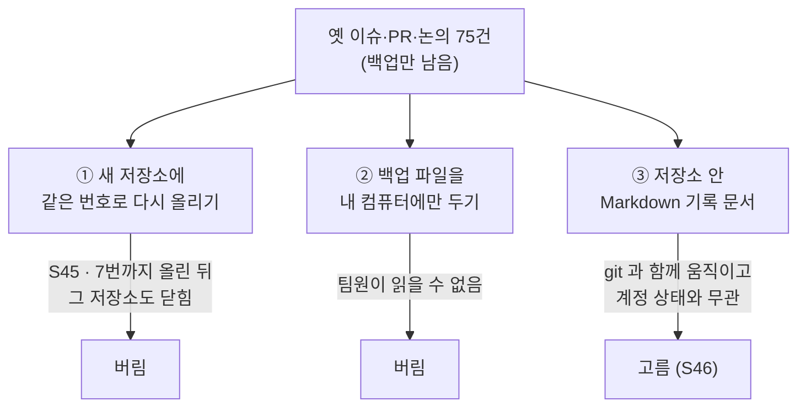

# 2026-09-23 · git 밖에 있던 것은 계정과 함께 사라진다 — 이슈·PR·논의 75건을 문서로 옮긴 날

| | |
|---|---|
| 작성 | 이동원 |
| PR | [#1](https://github.com/EST-team-project/Qurious/pull/1) — 조직 저장소 `EST-team-project/Qurious` 의 첫 PR |
| 브랜치 | `chore/move-to-mygithub05253` — 커밋 `c03bef7`(S44) · `0c8467f`(S45) · `9793b2a`(S46) |
| 관련 | 기록 색인 [`docs/github-archive/README.md`](../../github-archive/README.md) · 해시 대응표 [`docs/commit-map-2026-09-23.tsv`](../../commit-map-2026-09-23.tsv) |
| 쓴 때 | S47 — **사후 작성**이다. S44~S46 에는 쓰지 못했고, 아래 숫자는 S47 에 따로 짠 스크립트로 다시 쟀다 |

> **한 줄** — 코드는 저장소를 두 번 옮겨도 따라왔다. 이슈·PR·논의 75건은 git 밖에 있어서 따라오지 않았고, 계정과 함께 사라질 뻔했다.

---

## 1. 무엇을 했나

| 세션 | 한 일 | 남긴 것 |
|---|---|---|
| S44 | 옛 저장소(`devlee328288/Qurious`)의 git 이력을 브랜치 21개째 새 저장소로 옮기고, 커밋 75개의 작성자 이메일을 다시 썼다 | 옛→새 해시 대응표 `docs/commit-map-2026-09-23.tsv` |
| S45 | 옛 논의 `#29` 의 첨부 이미지 3장을 저장소에 넣었다. 이슈·논의를 두 번째 저장소(`mygithub05253/Qurious`)에 같은 번호로 다시 올리다가 7번에서 멈췄다 | `docs/github-archive/attachments/` 3장 |
| S46 | 백업을 Markdown 기록 문서 75건과 색인으로 바꿨다. GitHub 에는 다시 올리지 않는다 | `docs/github-archive/` |
| S47 | 숫자를 다른 방법으로 다시 재고, 조직 저장소에 PR #1 을 열었다 | 이 TIL |

그날의 시각 (KST · 커밋 시각과 API 의 생성 시각 기준):

```
14:00 무렵    옛 저장소의 이슈·PR·논의를 백업으로 받음
14:22         c03bef7  해시 대응표                      (S44)
14:54         0c8467f  첨부 이미지 3장                   (S45)
15:02~15:20   두 번째 저장소에 옛 글을 같은 번호로 다시 올림 (#1~#7)
15:23~15:25   조직 EST-team-project · 저장소 Qurious 생성
15:28         두 번째 저장소도 로그인 없이 404 → 다시 올리기 중단
16:08         9793b2a  기록 문서 75건                    (S46)
16:22         PR #1                                      (S47)
```

## 2. 왜 했나

- 09-23 옛 저장소가 **로그인하지 않은 사람에게** 404 로 보이기 시작했다 — 저장소·PR·논의 전부. 본인 화면과 토큰으로는 멀쩡해서, 로그인하지 않고 열어 봐야만 알 수 있었다.
- 저장소 이전(Transfer)도 막혔다 — `Repository transfers not available for this account`.
- git 이력은 push 만 하면 어디로든 따라간다. 그런데 **이슈 41 · PR 24 · 논의 10건은 git 이 아니라 GitHub 쪽에 저장된 데이터**라서 따라오지 않는다. 그중 논의 8건에는 결론 초안과 의견 기한(09-26 · 09-27)이 달려 있었다.
- 이 폴더의 README 는 "결정은 GitHub Discussion 의 결론과 ADR 로 남긴다"고 적어 두었다. 그 Discussion 이 통째로 닫힌 것이다.

## 3. 어떻게 했나 — 고른 것과 버린 것

### 3-1. git 이력 — 해시를 지킬까, 작성자를 바꿀까

| 선택지 | 결과 | 판정 |
|---|---|---|
| 해시 그대로 옮기기 | 옛 계정 이메일로 남은 커밋이 새 계정의 기여로 잡히지 않는다. 옛 계정의 noreply 주소는 계정 번호에 묶여 있어 다른 계정에 추가할 수 없다 | 처음엔 이렇게 올렸다가 버림 |
| **작성자 이메일만 다시 쓰기** | 커밋 75개의 해시가 전부 바뀐다 → TIL·명세서·이슈 본문에 적힌 옛 해시와 어긋난다 | **고름** — 어긋남은 옛→새 **대응표**로 메움 |

바꾼 것은 작성자뿐이니 **파일 트리는 그대로여야** 한다. S47 에 75쌍을 다시 대조했다(4절).

### 3-2. 백업 — 같은 저장소를 두 API 가 다르게 보여 줬다

REST `issues?state=all` 은 **0건**을 돌려줬고, GraphQL 은 이슈 41 · PR 24 · 논의 10건을 돌려줬다. 어느 쪽을 믿을지는 **번호 합**으로 가렸다.
이슈·PR·논의는 저장소 안에서 번호 줄 하나를 나눠 쓴다. 그래서 세 개를 더한 값이 마지막 번호와 같으면 빠진 번호가 없다 — 41 + 24 + 10 = 75 = 마지막 번호 `#75`. GraphQL 을 정본으로 삼았다.

### 3-3. 옛 글을 어디에 남길까



①은 **번호가 그대로 산다**는 점에서 가장 자연스러웠다. 커밋 메시지 속 `#74` 가 그대로 이어지고, 팀원은 보던 화면에서 댓글을 이어 달 수 있다. 그런데 7번까지 올렸을 때 그 저장소도 로그인 없이 404 가 됐다. **원인은 확정할 수 없다.** 옛 글을 그대로 다시 올리는 일이 같은 문제를 다시 부를 수 있다고 보고 멈췄다.

③은 번호 자동 링크와 댓글 달기를 포기하는 대신, **git 에 들어가는 순간 계정 상태와 무관해진다.** 저장소를 또 옮겨도 이력과 함께 따라온다. 의견은 팀 대화방에서 받기로 했다.

### 3-4. 링크를 어떻게 바꿀까 — "또 옮겨진다"를 전제로

```
_github_backup/  (저장소 밖 · 한 번 받은 백업)
      │
      │  restore.py archive — 네트워크를 쓰지 않는다
      ▼
글 75건 × (본문 + 댓글 + 답글) ── 링크 바꾸기 (아래 표)
      │
      ▼
검사: 상대 링크 대상 · 앵커 대상 · 남은 첨부 주소 · 남은 맨 @멘션 · 비밀값
      │
      ▼
docs/github-archive/{issues,pulls,discussions}/NNN.md + README
```

도구가 네트워크를 쓰지 않게 한 것은 옛 계정이 S45 에 삭제돼 **다시 받을 수 없기** 때문이다. 백업 한 벌에서 몇 번이든 다시 만들 수 있어야 했다.

| 원문에 있던 것 | 바꾼 모양 | 곳 | 이렇게 한 이유 |
|---|---|---|---|
| `#N` · 이슈·PR·논의 주소 | 상대 경로 `../issues/012.md` | 2,512 | 조직 주소로 박아 두면 **다음에 옮길 때 또 깨진다** |
| 댓글 고정 링크 `#issuecomment-…` | 그 댓글 위에 같은 이름의 앵커 `<a id="…">` | 100 | 옛 링크의 조각 이름을 그대로 살린다 |
| 코드·커밋 링크 | 조직 저장소 + **새 해시** | 1,378 | 코드는 git 에 있으니 고정 해시 링크가 가장 오래간다 |
| Alpha_Stack 링크 | `경로 @ 새 해시` 글자 | 135 | 옮기지 않은 저장소라 이을 곳이 없다. 죽은 링크보다 찾을 수 있는 글자가 낫다 |
| `@아이디` | 백틱으로 감쌈 | 77 | 옮겨 싣는 글의 멘션은 알림이 가지 않게 감싼다(S45 규칙) |
| 첨부 이미지(`user-attachments`) | 저장소에 커밋 + 상대 경로 | 3 | GitHub 첨부는 옛 글에 딸려 있어 함께 끊길 수 있다. 올리기 전에 세 장 모두 개인정보가 없는지 눈으로 봤다 |

곳 수는 S46 생성 도구 출력(`archive_validate.txt`)의 항목을 묶은 값이다 — 예: 상대 경로 2,512 = `#N` 2,034 + 글 주소 478 · Alpha_Stack 135 = 코드 링크 130 + 글 링크 5.

## 4. 어떻게 확인했나

S46 에는 문서를 만든 도구가 검사까지 했다. 만든 쪽이 검사도 하면 같은 착각을 두 번 할 수 있어서, S47 에 **따로 짠 스크립트**(링크 정규식과 트리 대조를 새로 씀)로 다시 쟀다.

| 확인 | S46 (생성 도구) | S47 (따로 짠 스크립트) |
|---|---|---|
| 대응표 75쌍 — 옛·새 커밋의 파일 트리가 같은가 | 75 / 75 (S44) | **75 / 75** · 다름 0 · 개체 없음 0 |
| 기록 문서 수 · 크기 | 76개 · 2,833 KB | 76개 · 2,833 KB |
| 상대 링크 — 가리키는 파일이 있는가 | 2,681 · 문제 0 | **2,681** · 깨짐 0 |
| 앵커 링크 — 가리키는 앵커가 있는가 | 108 · 문제 0 | **108** · 깨짐 0 |
| 남은 첨부 주소(`user-attachments`) | 0 | 0 |
| 남은 옛 저장소 주소 | 75 | 75 — 문서마다 머리의 "옛 주소" 칸에 1곳씩(링크가 아닌 글자) |
| 비밀값 패턴 | 0 | 0 (토큰·키 8종) |
| GitHub 화면에서 앵커가 그 댓글로 가는가 | 미측정 | **동작함** — 사용자가 GitHub 화면에서 확인 |
| PR #1 | — | 로그인 없이 보임 · 충돌 없음 · 80파일 +35,349 / −0 |

두 번 잰 값이 모두 같았다. 다만 두 스크립트 모두 **"대상이 있는가"**만 본다. 옛 글과 **뜻이 같은 곳**을 가리키는지는 GitHub 화면에서 사람이 눌러 본 것이 유일한 확인이다.

## 5. 막힌 것 · 남은 것

| 막힌 것 | 원인 | 한 일 |
|---|---|---|
| 본인 화면에서는 아무 문제가 없어 보였다 | 계정 문제는 **로그인하지 않은 사람에게만** 드러난다 | 로그인 없이(python `urllib`) 조회하고, 다른 공개 계정(대조군)이 200 인지 같이 본다 |
| REST 목록이 이슈 0건 | 같은 저장소를 REST 와 GraphQL 이 다르게 보여 줬다 | GraphQL 로 받고 번호 합으로 검산 |
| 두 번째 저장소도 닫혔다 | 확정할 수 없음 | 다시 올리기를 멈추고 문서로 방향을 바꿈 |
| 옛 번호와 새 저장소 번호가 겹친다 | 번호는 저장소마다 `#1` 부터 새로 매겨진다 | 파일 이름을 옛 번호로 고정하고, PR 본문에서도 옛 번호는 백틱으로 씀 |

남은 것
- **옮기지 못한 것**: PR 리뷰(승인·줄 댓글) · 이모지 반응 · 글 수정 이력 · Actions 로그. 백업에 없었고, 옛 계정이 삭제돼 다시 받을 수도 없다.
- 기록 문서 밖 23개 파일에 옛 저장소 주소가 남아 있다(이 TIL 목록 표의 옛 PR 링크도 여기에 들어간다). PR #1 범위 밖이라 그대로 뒀다.
- 이 장은 사후 작성이다. 그날 쓰지 못해서, 무엇이 막막했는지는 커밋 메시지와 도구 기록에서 되짚었다.

## 6. 배운 것

**1. git 밖에 있는 것은 git 이 지켜 주지 않는다.**
코드는 저장소를 두 번 옮겨도 따라왔다. 이슈·PR·논의는 계정 하나에 매여 있었다. 이 README 는 결정을 "Discussion 결론과 ADR"에 남기라고 했는데, 그중 Discussion 은 계정과 함께 닫힐 수 있었다. 결정의 근거는 git 안 문서에도 남긴다.

**2. 본인 화면이 가장 늦게 알려 준다.**
토큰도 본인 화면도 멀쩡했다. 남에게 어떻게 보이는지는 로그인하지 않고 봐야 안다. 내 쪽 네트워크 문제와 구별하려면 대조군을 같이 본다.

**3. 0건은 "없다"가 아니라 "못 본다"일 수 있다.**
REST 는 0건, GraphQL 은 41건이었다. 목록이 0 을 돌려주면 번호 합처럼 **다른 길로 잰 값**과 맞춰 본다. S42 에 "무반응"이 사실은 답글을 세지 않은 탓이었던 것과 같은 모양이다.

**4. 링크는 "또 옮겨진다"를 전제로 쓴다.**
기록끼리는 상대 경로로, 코드는 고정 해시로 잇는다. 한 번 옮기고 끝났다면 절대 주소도 괜찮았겠지만, 같은 날 두 번 옮겼다.

**5. 되돌릴 수 없는 곳에 쓰기 전에, 되돌릴 수 있는 곳에 먼저 쓴다.**
GitHub 에 올린 글은 계정 상태에 따라 한꺼번에 가려질 수 있다. git 커밋은 `revert` 로 되돌릴 수 있고 어디로든 옮길 수 있다. S45 에는 순서가 반대였다 — 다시 올리기부터 시작했고, 문서로 남긴 것은 그다음이었다.

---

## 참조

- [`docs/github-archive/README.md`](../../github-archive/README.md) — 기록 색인 · 결론 초안 8건과 의견 기한
- [`docs/commit-map-2026-09-23.tsv`](../../commit-map-2026-09-23.tsv) — 옛→새 커밋 해시 75행
- [PR #1](https://github.com/EST-team-project/Qurious/pull/1) — 이 장이 다루는 세 커밋
- 저장소 밖: `team_project/_github_backup/` — 백업 원본과 생성 도구 `restore/restore.py` (부모 저장소 `.gitignore` 대상이라 커밋되지 않음)
- [2026-09-21 무반응이 아니라, 내가 안 본 것이었다](2026-09-21-무반응이-아니라-내가-안-본-것이었다.md) — 배운 것 3번과 같은 모양의 실수
