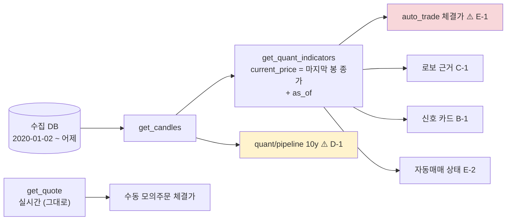

> **쉬운 요약**
> 1. 데이터 파트가 차트 · 지표 · 백테스트 · ML 의 **국내 주식 일봉**을 외부 차트 API 대신 **수집 DB** 에서 읽게 바꿨습니다(DF-08 · 옛 `#61` P1-1). 값은 수정주가이고, 부르는 쪽 코드는 그대로입니다.
> 2. 달라진 점이 하나 있습니다. 수집 DB 는 공공데이터포털이 **다음 날 낮**에 주는 값을 받으므로 **마지막 봉이 어제(휴일 뒤면 그 전)** 입니다. 그래서 「마지막 봉 종가 = 지금 가격」으로 쓰던 곳이 틀리기 시작합니다.
> 3. 그런 곳 **5곳**을 파트별로 모았습니다. 서버 응답에는 `as_of`(마지막 봉 날짜) · `source` 칸을 더해 두었습니다. 가장 급한 것은 **E-1 자동매매 체결가**입니다.

기준 커밋 `df345b4`(main · 2026-09-28). 확실도 · 🟢 코드·실측으로 확인 / 🟡 추론·재확인 전.
관련: 화면결함 이슈 #26 (같은 방식 — 파트별 체크리스트 · 담당 지정 비움) · 다리 PR 은 브랜치 `feat/collector-candles-df08`.

## 1. 무엇이 바뀌었나 — 전후

```
바꾸기 전                                  바꾼 뒤 (이 PR)
─────────────────────────────              ─────────────────────────────────────
get_candles(005930.KS, 2y)                 get_candles(005930.KS, 2y)
  └─ 캐시(6시간) → 외부 차트 API              ├─ 수집 DB (price_adjusted) ← 먼저
       마지막 봉 = 오늘(캐시면 ≤6시간 전)       │    마지막 봉 = 어제 · as_of 칸
                                            └─ 지수 · 환율 · 해외 · ETF · 주봉만 옛 경로
```



| 파트 (분배안 v1.0) | 항목 | 가장 큰 것 |
|---|---:|---|
| P-E 안전·실행·운영 (팀 결정) | 2 | E-1 자동매매가 어제 종가로 체결한다 |
| P-D 비용차감 검증·LEAN | 1 | D-1 「10년」 백테스트가 약 6.7년이다 |
| P-C 자산배분·스크리닝 | 1 | C-1 로보 근거의 가격이 없으면 0 |
| P-B 지표·신호 | 1 | B-1 신호 카드 가격에 기준일이 없다 |

## 2. P-E — 안전·실행·운영

- [ ] **E-1 🔴 자동매매가 지표의 `current_price` 로 체결한다** — [`auto_trade.py:270`](https://github.com/EST-team-project/Qurious/blob/df345b4/app/services/auto_trade.py#L270) · [`:308`](https://github.com/EST-team-project/Qurious/blob/df345b4/app/services/auto_trade.py#L308)
  - 이 값은 일봉의 마지막 종가입니다. 다리 뒤에는 **어제 종가**라서, 체결가(어제)와 평가가(실시간 `get_quote`)가 달라 **체결 순간 없는 손익**이 생깁니다 — I14(#24)가 막은 것과 같은 모양입니다.
  - 크기 예: 2026-09-28 장중 삼성전자 실시간 273,500 · 수집 DB 마지막 봉(09-23) 285,500 → 매수 즉시 **−4.2%** 평가손(추석 연휴 뒤라 차이가 컸던 날). 🟢 (두 값 모두 S56 · S57 실측)
  - 옛 경로도 캔들을 **6시간 캐시**해서 지금 가격이 아니었습니다(🟢 `stock.py` 의 `cache_get(…, max_age_hours=6)`). 다리가 만든 문제가 아니라 **원래 있던 틈이 하루로 커진 것**입니다.
  - 제안: 수동 모의주문처럼 체결가는 `get_quote(symbol)["price"]` 로, 지표는 **신호에만** 씁니다. 두 줄 수정 + I14 시험 모양의 회귀 시험 하나. 🟢
- [ ] **E-2 자동매매 상태 화면의 「현재가」** — [`app.html:4483`](https://github.com/EST-team-project/Qurious/blob/df345b4/public/app.html#L4483) `data.current_price`. 옆에 `data.as_of` 를 붙이거나 E-1 을 고친 뒤 체결가를 보여 줍니다. 🟢

## 3. P-D — 비용차감 검증·LEAN

- [ ] **D-1 🟡 「10년」 백테스트가 실제로는 2020-01-02 부터다** — 화면은 `period=10y` 를 보냅니다([`app.html:3413`](https://github.com/EST-team-project/Qurious/blob/df345b4/public/app.html#L3413) · [`:3520`](https://github.com/EST-team-project/Qurious/blob/df345b4/public/app.html#L3520)). 수집 DB 는 2020-01-02 부터라 **약 6.7년(1,652거래일)** 이 옵니다.
  - 결과 화면에 **첫 봉 ~ 마지막 봉 날짜**를 보여 주거나, 라벨을 「수집 기간 전체」로 바꾸는 것을 제안합니다. 🟢 (기간은 실측)
  - 더 긴 기간이 필요하면 데이터 파트에 알려 주세요 — 2019년 이전 백필은 유량 예산 문제라 따로 정합니다(collector/README §6). 🟡
- (참고) LEAN 백테스트(`lean_backtest.py`)는 아직 외부 API 를 **직접** 부릅니다(19줄 · 봉인 시험 TC-YH). 이 PR 범위 밖이고, 다음 다리 후보입니다.

## 4. P-C — 자산배분·스크리닝

- [ ] **C-1 로보 근거의 가격이 없으면 0** — [`app.html:3277`](https://github.com/EST-team-project/Qurious/blob/df345b4/public/app.html#L3277) `ind.current_price ?? 0`. #26 C3 과 같은 함정(모르는 값을 0 으로)입니다. 기준일(`ind.as_of`)도 함께. 🟢

## 5. P-B — 지표·신호

- [ ] **B-1 신호 카드 가격에 기준일이 없다** — [`app.html:4368`](https://github.com/EST-team-project/Qurious/blob/df345b4/public/app.html#L4368) `r?.current_price`. 카드에 「09-23 종가」처럼 `r.as_of` 를 붙이는 것을 제안합니다. 🟢

## 6. 데이터 파트가 한 것 · 안 한 것

| | 내용 | 확실도 |
|---|---|:-:|
| 한 것 | `get_candles` 가 국내 주식 일봉을 수집 DB(수정주가)에서 먼저 읽는다 — 새 파일 `app/services/collector_db.py` | 🟢 |
| 한 것 | 응답 모양은 그대로 + `source` · `as_of` 칸 · 지표 응답에도 `as_of` · `source` | 🟢 |
| 한 것 | 시험 22건 — 카카오 5:1 분할 골든 픽스처 · 스크리닝 31종목 전 기간의 수익률 = 거래소 등락률 | 🟢 |
| 한 것 | 도커: compose 를 고치지 않았다 — 앱 컨테이너가 이미 `./data` 를 읽기 전용으로 붙이고 있어 그 안의 수집 DB 를 읽는다(읽기 전용 마운트에서 열리는 것을 컨테이너로 확인) | 🟢 |
| 안 한 것 | 실시간 시세(`get_quote`) · 지수 · 환율 · 해외 · 펀더멘털 — 수집기가 장중 값을 받지 않는다 | — |
| 안 한 것 | 위 5곳의 코드 — 각 파트 몫 | — |

**용어**
- **수정주가** — 액면분할 · 권리락처럼 가격이 기계적으로 끊기는 날을 계수로 이어 붙인 가격입니다. *이 문서에서*: 카카오 2021-04-15 분할 전날 558,000원 → 112,000원으로 보입니다. *헷갈리는 점*: 배당은 반영하지 않습니다(배당까지 넣은 것은 따로 있는 총수익 TR 계열).
- **`as_of`** — 돌려준 마지막 봉의 날짜입니다. *헷갈리는 점*: 요청한 날이 아닙니다. 오늘 요청해도 어제 날짜가 옵니다.
