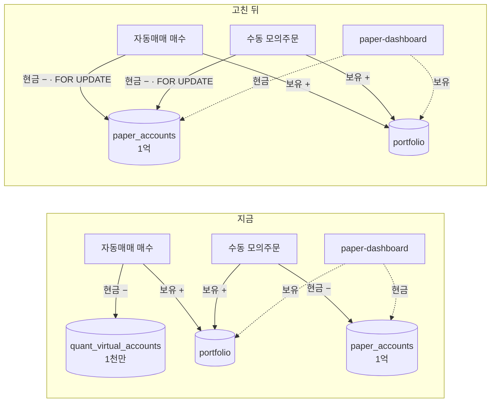

> **쉬운 요약**
> 1. 자동매매가 주식을 사면 **주식은 모의계좌에 들어오는데 돈은 다른 지갑(1천만 원)에서 나갑니다.** 그래서 모의투자 화면에 산 주식 값만큼 **없는 수익**이 찍힙니다(화면 IA v0.2 브라우저 확인 +3.19%).
> 2. 현금 지갑을 **모의계좌(`paper_accounts`, 1억 원) 하나로** 합칩니다. 보유 종목 표는 이미 하나라, 현금만 합치면 두 장부가 맞습니다.
> 3. 직접매매 화면의 **「보유 없이 팔아도 현금이 늘어나는」** 구멍(옛 `#12` A9 가 찾은 것)도 같은 부류라 함께 막습니다.

작업 이슈입니다 — 고치는 PR 이 머지되면 닫힙니다. 발견 경위는 [화면 IA 이슈 #14](https://github.com/EST-team-project/Qurious/issues/14) 의 IA v0.2 1.6절 I14 입니다.

## 한눈에 보기

| | 지금 | 고친 뒤 | 확실도 |
|---|---|---|---|
| 자동매매 매수의 현금 | `quant_virtual_accounts`(1천만 원)에서 빠짐 | `paper_accounts`(1억 원)에서 빠짐 | 🟢 코드 · 시험 |
| 수동 모의주문의 현금 | `paper_accounts` | 그대로 | 🟢 |
| 보유 종목 | 공용 `portfolio` 하나 | 그대로 | 🟢 |
| 모의투자 화면 총자산 | `paper_accounts` 현금 + `portfolio` 보유 → **안 맞음** | 같은 식 → **맞음** | 🟢 |
| 같은 매수 3건(59만 원어치) 뒤 총 손익 | **+590,000원**(없는 수익) | **−104원**(거래비용만) | 🟢 실측 · 아래 근거 1 |
| 직접매매에서 보유 0주 → 10주 가상 매도 | 현금 **+698,476원**(없는 돈) | 400 거절 · 현금 그대로 | 🟢 실측 · 아래 근거 2 |
| `quant_virtual_accounts` 표 | 자동매매가 읽고 씀 | **안 씀**(표는 남김 · 마이그레이션 없음) | 🟢 |

## 용어

| 용어 | 뜻 | 이 문서에서 | 헷갈리는 점 |
|---|---|---|---|
| **장부(원장)** | 돈과 보유 수량을 적는 정본 기록 | 현금 = `paper_accounts.cash` 한 칸, 보유 = `portfolio` 행들 | 「DB 표가 두 개」가 문제가 아니다. **현금과 보유가 서로 다른 장부를 보는 것**이 문제다 |
| **정산금액(`net_amount`)** | 실제로 현금이 움직이는 양 | 매수 = 체결대금 + 수수료·유관기관비, 매도 = 체결대금 − 비용 − 세금 | `가격 × 수량` 이 아니다. 그래서 고친 뒤에도 총 손익이 0 이 아니라 **−비용**이다 |
| **행 잠금(`FOR UPDATE`)** | 트랜잭션이 끝날 때까지 다른 트랜잭션이 그 행을 못 바꾸게 잡는 것 | 수동 주문(`paper_trading.get_account(lock=True)`)이 이미 쓰던 방식을 자동매매도 쓴다 | 잠금이 없으면 수동 주문과 자동매매가 **동시에** 들어올 때 한쪽 차감이 덮어써진다 |

## 전후 구조



```
같은 매수 3건 (SK 1주 · 삼성전자 3주 · SK하이닉스 1주 = 590,000원어치) 뒤 모의투자 화면

                       지금                          고친 뒤
  보유 현금      100,000,000   ← 안 줄었다        99,409,896   ← 정산금액만큼 줄었다
  주식 평가          590,000                          590,000
  ─────────────────────────────────────────────────────────────
  총자산         100,590,000                       99,999,896
  총 손익           +590,000  (+0.59%)                   −104  (거래비용)
                   ↑ 없는 수익                         ↑ 맞는 값
  (그 590,000원은 1천만 원짜리 다른 장부에서 빠져 있었다 → 9,409,896)
```

## 코드 재사용 판정

| 가져온 곳 | 판정 | 무엇을 · 왜 |
|---|---|---|
| `paper_trading.get_account(lock=True)` | 🟢 **그대로 씀** | 수동 모의주문이 이미 쓰는 계좌 조회 + 행 잠금. 자동매매가 같은 함수를 부르면 「같은 행을 같은 방식으로 잠근다」가 코드로 보장된다 |
| `paper_trading.reset_account` | 🟢 **그대로** | 주식·코인·대체자산 보유와 주문을 지우고 현금을 1억으로 되돌린다. 장부가 하나라 초기화도 한 번에 맞는다 |
| `paper_trading.account_snapshot` | 🟢 **그대로** | 화면의 총자산 식. 고칠 곳은 여기가 아니라 **이 식에 들어오지 않던 현금**이었다 |
| `QuantVirtualAccount` | 🔴 **쓰지 않음** | 보유를 장부별로 나누는 안(아래 대안 B)을 고르지 않았으므로 필요 없다. 표 삭제는 D7 원장 설계가 확정된 뒤 |

## 근거

1. **자동매매 매수** — 옛 코드(`db00327`)와 고친 코드로 같은 빈 DB(도커 `pgvector/pgvector:pg16`)에서 같은 매수 3건을 했다.
   - 옛 코드: `paper_accounts` 현금 100,000,000 그대로 · 보유 590,000 · 총 손익 **+590,000** · `quant_virtual_accounts` 현금 9,409,896
   - 고친 코드: `paper_accounts` 현금 99,409,896 · 총 손익 **−104** · `quant_virtual_accounts` 행 **없음**
   - 코드 위치(IA v0.2 가 적은 줄 번호와 조금 다르다 — 아래가 `db00327` 실측): 옛 현금 장부 [`auto_trade.py:62-69`](https://github.com/EST-team-project/Qurious/blob/db00327/app/services/auto_trade.py#L62-L69) · 보유 갱신 [`:135-151`](https://github.com/EST-team-project/Qurious/blob/db00327/app/services/auto_trade.py#L135-L151) · 화면 총자산 [`paper_trading.py:704-722`](https://github.com/EST-team-project/Qurious/blob/db00327/app/services/paper_trading.py#L704-L722)
2. **직접매매 가상 매도** — 옛 `/api/orders` 로 보유 0주에서 10주(70,000원)를 팔았더니 현금이 **+698,476원** 늘었다. 현금은 먼저 더하고, 보유 갱신(`_apply_portfolio`)은 보유가 없으면 아무것도 안 한다([`stocks.py:258-278`](https://github.com/EST-team-project/Qurious/blob/db00327/app/routes/stocks.py#L258-L278) · [`:297-311`](https://github.com/EST-team-project/Qurious/blob/db00327/app/routes/stocks.py#L297-L311)).
3. IA v0.2 브라우저 확인(1.5절 10행): 자동매매 3건 뒤 보유 현금 **100,000,000원 그대로** · 주식 평가 3,194,750 · 총 손익 **+3,194,750원(+3.19%)**.

## 할 일

- [ ] 자동매매 체결(`_execute_virtual_trade`)과 사이클 요약이 `paper_accounts` 를 쓰게 한다
- [ ] 직접매매 가상 매도에 보유 수량 검사를 넣는다
- [ ] 실제 Postgres 로 도는 회귀 시험(DB 주소가 없으면 건너뜀 · 정적 가드 1건은 늘 돈다)
- [ ] 이 수정 전에 자동매매를 돌린 DB 는 모의투자 화면의 「초기화」로 되돌린다고 안내한다 — **자동으로 고치지 않는다**

## 범위 밖 — 같은 부류지만 이 이슈에서 하지 않는 것

| | 왜 뺐나 |
|---|---|
| 보유 직접 편집(`POST /api/portfolio`)이 현금 없이 보유를 만든다 | 「내 실제 보유를 적어 두는」 기능으로 보인다 — 모의계좌와 **표를 나눌지**가 먼저다(D7 ③) |
| 자동매매가 **모듈 전역 한 벌**(누가 켜든 한 사람 것으로 돈다 · 옛 `#22` A3) | 권한 경계 문제라 D3 ③ 결정 뒤 |
| `robo-decision` 판단 근거 문구가 늘 「과매도 구간 진입」(IA v0.2 8행) | 화면 문구 문제 — 와이어프레임 v0.2 에서 |
| `quant_virtual_accounts` 표 삭제 | 마이그레이션이 필요하다. D7 원장(봉인 기록 전용 장부) 설계와 함께 |

## 한계 · 뒤집을 조건

- **자동매매 로그의 손익률 숫자가 작아진다.** 같은 거래라도 기준 자본이 1천만 → 1억이라 `robo-decision` 로그의 「손익 ±x%」가 약 1/10 이 된다. 거래 크기(`per_trade_budget` 기본 100만 원)는 그대로다.
- 자동매매 로그의 「모의계좌 평가」는 **현금 + 국내주식만**이다(코인·대체자산 제외 — 10분 주기 루프에 외부 시세 호출을 더 얹지 않으려고). 모의투자 화면 총자산과 다를 수 있어 로그에 `scope` 로 밝혔다.
- **뒤집을 조건**: 팀이 「자동매매 전용 계좌를 따로 보여 준다」로 정하면(D7 ③ 이 C1 이 아니면) → 현금을 합치는 대신 **보유 표를 장부별로 나누는 대안 B** 로 간다. 어느 쪽이든 지금 화면의 +3.19% 는 틀리다.

💬 초기 자본을 1억 하나로 두는 것(자동매매도 1억 계좌에서 매매)에 이견이 있으면 이 이슈에 남겨 주세요.
