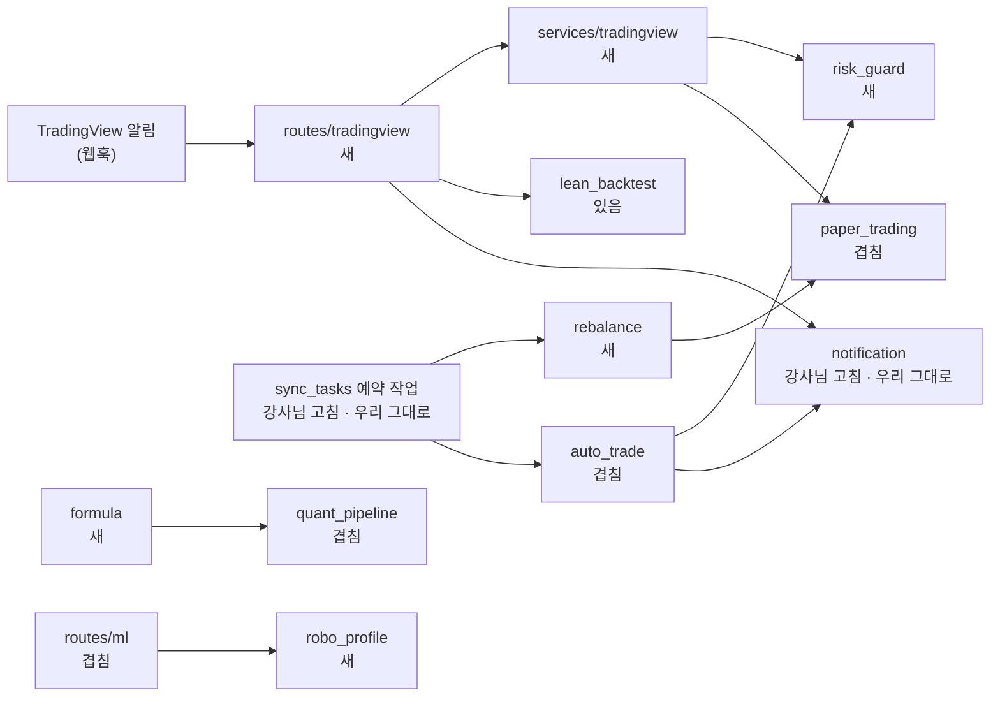

## 강사님 자료 변경 — 2026-09-30 09:24 확인

> **쉬운 요약 3줄**
> 1. 어제(09-29 09:52) 기준점 뒤로 바뀐 곳은 두 곳이다 — **th06 lumina-invest 4커밋**(80경로 · +9,406 / −3,515줄)과 th03 1커밋(README 에 TradingView 추천 스크립트 3개).
> 2. **th06 은 Qurious 의 출발점**인데, 강사님이 2 · 3차 필수 요구 여러 개를 코드와 시험으로 넣었다 — 리밸런싱 · 위험 한도(중복 주문 · 일손실 · 비상 정지) · TradingView 웹훅 · 수식 지표 · 투자성향 · XAI · 차트 패턴 · 미래 데이터 참조 시험. **Qurious 에는 같은 기능 파일이 하나도 없다.**
> 3. 그대로 받아 오면 부딪힌다 — Qurious 에도 있는 파일 18개와 겹치고(우리가 고친 15 · 같은 이름으로 따로 만든 시험 설정 3), 마이그레이션 번호가 갈라진다(우리 `0003_trading_cost` · 강사님 `0003_rebalance` ~ `0008`). ~~**어떻게 가져올지는 팀이 정할 일**이라, 아래는 요구 ID 별로 무엇이 생겼는지와 선택지만 적었다.~~ → **같은 날 Qurious 에 반영했다**(팀장 결정 · 맨 아래 「결정」) — 겹치는 파일은 3-way 병합으로 우리 고침을 지켰다.

- 받아 온 시각: 2026-09-30 오전(사용자) · 스캐너 `python scripts/lecture_scan.py --md` · 이 댓글 뒤 `--update` 로 기준점을 옮긴다.
- 커밋 작성자 · 비밀값은 읽지 않았다. 강사님 원본에서 `aws-work/ansible/…/secrets.yml` 두 파일이 커밋 `b79040b` 로 **지워졌지만 이력에는 남아 있다** — 작업본(`projects/lumina-invest` · Public)에 강사님 최신을 얹으면(기본은 안 함) 그 이력이 딸려 온다.

### 강사님 th06 변경 80경로 — Qurious 와 겹치는 정도

```
 한 칸 = 2경로 · 합계 80 (새로 생김 55 · 고침 23 · 지움 2)
 새 파일 (Qurious 에 없음)               ██████████████████████████ 52
 Qurious 에도 있는 파일 (충돌 위험)      █████████ 18
 Qurious 가 안 고친 파일 (받기 쉬움)     ███ 6
 AWS · SageMaker (우리 방침상 제외)      ██ 4
```

겹치는 18 — 우리가 고친 15: `auto_trade.py` · `paper_trading.py` · `stocks.py` · `brokers/kis.py` · `investment_research.py` · `quant_pipeline.py` · `routes/ml.py` · `models/trading.py` · `models/__init__.py` · `main.py` · `config.py` · `celery_app.py` · `public/app.html` · `readme.md` · `.gitignore`(모의 장부 하나로 · 수집 DB 어댑터 · 라우트 캐시 · KIS 거래 ID · 실거래 차단이 들어 있다) + 강사님이 새로 만든 이름이 우리 파일과 같은 3: `pytest.ini` · `requirements-dev.txt` · `tests/conftest.py`.

### Qurious 에 닿는 것 🟡 (제 판단 · 요구 ID 는 [요구 대장](https://github.com/EST-team-project/Qurious/blob/main/docs/요구사항/요구-대장.tsv))

| # | 강사님이 넣은 것 | 파일 (th06 `b055ab0`) | 닿는 요구 | Qurious 지금 |
|---|---|---|---|---|
| 1 | 리밸런싱 엔진 — 시간 · 이탈률 · 현금흐름 · 수동 네 가지 계기 · 계획과 이력 표 | `app/services/rebalance.py`(505줄) · `routes/rebalance.py` · 마이그레이션 `0003_rebalance` · `public/js/rebalance.js` · 시험 6 | `P01-③-1` · `③-2` · `③-3` · `U5` | 없음 — 리밸런싱 API 0 |
| 2 | 위험 한도 — 같은 종목 · 방향 재주문 쿨다운 · 일 주문 수 · 종목 비중 · 일손실 한도 → 비상 정지 + 알림 | `app/services/risk_guard.py` · `0004_risk_guard` · 시험 5 | ★ `P02-⑤-2` | 없음 — RTM v1.1 에서 **직접 시험 0 인 ★ 요구** |
| 3 | TradingView 웹훅 수신 → 위험 한도 → 모의 주문 → 알림 · Strategy Tester 대 LEAN 비교 | `app/services/tradingview.py` · `routes/tradingview.py` · `0005_tradingview` · `public/js/tradingview.js` · `tradingview.md` · 시험 5 | `P02-③-3` · `P02-③-2` · `P02-④-3` | 없음 — webhook 은 **보내는** 슬랙 알림뿐 |
| 4 | 수식 지표 — 문자열 산식을 AST 화이트리스트로 계산 · `shift` 는 과거로만 | `app/services/formula.py`(427줄) · `routes/formula.py` · `0008_formula_indicators` · `public/js/formula.js` · 시험 9 | `P02-②-1` · ★ `P02-②-2` | 조합형 커스텀 인디케이터만 · 자유 산식 없음 |
| 5 | 미래 데이터 참조 시험 — t 시점 지표값은 뒤 데이터가 바뀌어도 같아야 한다 | `tests/test_ta_utils_lookahead.py` · 시험 5 | ★ `P02-②-2` | 없음 — **직접 시험 0 인 ★ 요구** |
| 6 | 투자성향 설문 7문항 → 5단계 · 목표 수익률 달성 확률(몬테카를로) | `app/services/robo_profile.py` · 시험 4 | `U1` · `U4` | 설문 없음 — 성향은 세 값 고르기(`app/routes/ml.py:62`) |
| 7 | XAI — LightGBM 기여도로 예측 근거를 설명 | `app/services/xai.py` · 시험 2 | `P01-①-5` | 없음 |
| 8 | 차트 패턴 — 캔들 · 지지와 저항 · 돌파 · 여러 주기 종합 신호 | `app/services/patterns.py` · 시험 7 | `P01-②-2` | 없음 |
| 9 | 비용 · 손절 · 익절 반영 시험 | `tests/test_backtest_costs.py` · 시험 6 | `P01-④-1` · `P02-①-2` | 비용 규격은 있음 · 손절 · 익절 없음(RTM 7절 ⑦) |
| 10 | 화면을 기능별 파일로 나눔(`app.html` −3,727줄 → `public/js/` 13개 + `css/app.css`) · 화면마다 **기능 완성도 점수**(UI 20 · 백엔드 30 · DB · 외부 연동 25 · 자동 시험 25) | `public/js/*.js` · `public/js/completion.js` | IA · 와이어프레임 v0.3 · `U1` ~ `U10` | `app.html` 한 파일 — 화면 스캐너 `scripts/view_scan.py` 가 이 파일을 읽는다 |
| 11 | 시험 워크플로 — push · PR 마다 단위 시험, 통과해야 배포 | `.github/workflows/test.yml` | D8(#54) CI 논의 | CI 없음(걷어냄 · ADR-0003) |
| 12 | 모의 장부 · 자동매매 · KIS · 환율 | `0006_portfolio_book` · `0007_quant_auto_flag` · `auto_trade.py` · `paper_trading.py` · `brokers/kis.py` · `fx.py` | `P01-④-3` · `P02-⑤-1` | **우리가 고친 파일과 겹침** |
| 13 | th03 README — TradingView 추천 Pine 스크립트 3개(UT Bot Alerts · Supertrend · Ehlers Fisher Transform) | th03 `README.md` · `image.png` | `P02-③-1` | 참고 |

강사님 시험은 함수 49개다(강사님 `completion.js` 기록: 57 통과 · 1 건너뜀 — 매개변수 포함). 시험 파일 이름은 우리 188건과 겹치지 않지만, 시험 설정 셋(`pytest.ini` · `tests/conftest.py` · `requirements-dev.txt`)은 이름이 같아 합쳐야 한다.

### 강사님 새 모듈이 어떻게 이어지나 (코드의 `import` 로 확인)



「새」 파일만 복사해서는 안 돌아간다 — 새 기능이 **겹치는 파일**(`paper_trading` · `auto_trade` · `quant_pipeline` · `routes/ml` · `stocks`)을 통해 들어온다.

### 가져오는 방식 — 팀이 정할 것 (제안 🟡)

| 안 | 무엇 | 좋은 점 | 드는 것 |
|---|---|---|---|
| ⓐ 통째로 다시 반영 | 09-15 에 한 것처럼 강사님 최신(`b055ab0`)을 받고 AWS 를 걷어낸 뒤, 우리 고침을 다시 얹는다 | 강사님 기준과 같아진다 · 시험 49개가 한 번에 | 겹치는 18파일에 우리 고침을 다시 · 마이그레이션 두 갈래 합치기 · 화면 문서(IA · 와이어프레임 · 화면 결함 #26)의 `app.html` 줄 참조를 전부 다시 |
| ⓑ 기능별로 골라 옮기기 | 요구 하나씩(위험 한도 → 미래 참조 시험 → 리밸런싱 → 웹훅 → 수식 지표 …) 새 파일 + 이음새만 옮긴다 | 우리 고침이 그대로 · 역할 희망(D9) 뒤 파트별로 나누기 쉽다 | 기능마다 겹치는 파일의 이음새를 손으로 맞춘다 · 마이그레이션 번호를 다시 매긴다 |
| ⓒ 참고만 | 설계 본보기로만 쓴다 | 지금 일정이 안 흔들린다 | 같은 기능을 우리가 다시 만든다 |

- ~~제 생각(🟡): **ⓑ** — 새 파일이 대부분 요구 하나에 하나씩 대응하고, ★ 요구 둘(`P02-②-2` · `P02-⑤-2`)의 시험이 이미 있다.~~
- **결정(2026-09-30 · 팀장)**: **ⓐ 로 반영했다** — 기초 코드라 다른 파트가 들어가기 전에 최신이어야 한다. 3-way 병합(기준 `039bf43`)으로 강사님 변경을 받고, 우리 고침(실거래 차단 · 주문 비용 · 수집 DB 어댑터 · 라우트 캐시 · KIS 거래 ID)은 지켰다. 설계가 갈린 **자동매매 장부는 강사님 방식(장부 둘)** 을 따랐고, 「나만의」 방향으로 고칠 곳 10가지는 [논의 초안](https://github.com/EST-team-project/Qurious/blob/main/docs/github-archive/2026-09-30/논의-강사님최신-반영/00-본문.md)에 모았다. 시험 249/249 · 마이그레이션은 `0004` ~ `0009` 로 옮김.
- 화면: 강사님이 `app.html` 을 나눴으므로 IA · 와이어프레임 v0.3(10-06 오전 칸)은 새 구조(화면 53개)로 그린다 — 화면 스캐너를 새 구조에 맞게 고쳤다.
- (게시 전 갱신 · 2026-09-30 — 반영 결정과 PR 을 적었다)

### 24곳 표 (스캐너 출력)

| 폴더 | 원본 | 지금 끝 | 상태 |
|---|---|---|---|
| th01-investment-analysis | `edumgt/investment-analysis` | `2cb9b7f` 2026-09-14 21:08 | 변화 없음 |
| th02-docker | `edumgt/docker-class` | `50547fd` 2026-09-11 15:23 | 변화 없음 |
| th03-stock-coin-trade | `edumgt/stock-coin-trade` | `78c584e` 2026-09-29 17:47 | **1커밋** (`debd561` 부터) |
| th04-in2 | — | — | lecture 없음 |
| th05-quant-krx | `edumgt/quant-test-20260828` | `8684a2b` 2026-08-28 17:46 | 변화 없음 |
| th06-lumina-invest | `edumgt/lumina-invest` | `b055ab0` 2026-09-29 15:56 | **4커밋** (`039bf43` 부터) |
| th07-domain-rag-lab | `edumgt/domain-rag-lab` | `e63e675` 2026-09-21 17:52 | 변화 없음 |
| th08-aws-ec2-alb-lab | `edumgt/aws-ec2-alb-lab` | `d47c244` 2026-09-21 14:54 | 변화 없음 |
| th09-python-ai-basic-lab | `edumgt/python-ai-basic-lab` | `b723826` 2026-07-30 04:23 | 변화 없음 |
| th10-stock-ml-dl-project | `edumgt/stock-ml-dl-project` | `09b5823` 2026-07-30 04:08 | 변화 없음 |
| th11-python-ml-class | `edumgt/python-ml-class` | `e84cf65` 2026-07-30 04:06 | 변화 없음 |
| th12-python-crawling-lab | `edumgt/python-crawling-lab` | `1572282` 2026-07-02 10:45 | 변화 없음 |
| th13-py-util | `edumgt/py-util` | `e8554b9` 2026-06-11 21:41 | 변화 없음 |
| th14-edumgt-lab-init | `edumgt/edumgt-lab-init` | `3783d98` 2026-09-14 21:13 | 변화 없음 |
| th15-aihub-rag | `edumgt/aihub-rag` | `a1fbe8d` 2026-07-02 14:42 | 변화 없음 |
| th16-ai-agent-lab | `edumgt/ai-agent-lab` | `7151a88` 2026-06-29 12:49 | 변화 없음 |
| th17-invest-flow | `edumgt/invest-flow` | `81165da` 2026-07-02 14:06 | 변화 없음 |
| th18-langchain-lab | `edumgt/langchain-lab` | `87bc4d5` 2026-06-29 11:58 | 변화 없음 |
| th19-multi-db-lab | `edumgt/multi-db-lab` | `aaec902` 2026-06-30 15:18 | 변화 없음 |
| th20-aws-serverless | `edumgt/aws-serverless` | `d6780aa` 2026-09-23 14:01 | 변화 없음 |
| th21-ollama-llava-canvas | `edumgt/ollama-llava-canvas` | `fb4ea94` 2026-07-30 04:11 | 변화 없음 |
| th22-vdp-agent | `edumgt/vdp-agent` | `8745eb9` 2026-07-07 11:18 | 변화 없음 |
| th23-meeting-agent | `edumgt/meeting-agent` | `0b56382` 2026-07-06 15:03 | 변화 없음 |
| th24-stcok-kms-portal | `edumgt/stcok-kms-portal` | `25d97ba` 2026-09-22 16:58 | 변화 없음 |

### th03-stock-coin-trade — 1커밋 (`debd561` → `78c584e` · 2 files changed, 19 insertions(+))

비교: https://github.com/edumgt/stock-coin-trade/compare/debd561...78c584e

| 커밋 | 시각 (KST) | 제목 |
|---|---|---|
| `78c584e` | 09-29 17:47 | Refactor code structure for improved readability and maintainability |

### th06-lumina-invest — 4커밋 (`039bf43` → `b055ab0` · 80 files changed, 9406 insertions(+), 3515 deletions(-))

비교: https://github.com/edumgt/lumina-invest/compare/039bf43...b055ab0

| 커밋 | 시각 (KST) | 제목 |
|---|---|---|
| `ed7226c` | 09-29 13:44 | Add stock screening documentation, implement pytest configuration, and enhance testing suite |
| `b79040b` | 09-29 15:42 | secrets.yml 파일 삭제: Osaka 및 prod 환경의 비밀 정보 제거 |
| `6b607b6` | 09-29 15:42 | 1 |
| `b055ab0` | 09-29 15:56 | Add completion indicator functionality and styles for app, login, and register pages |
