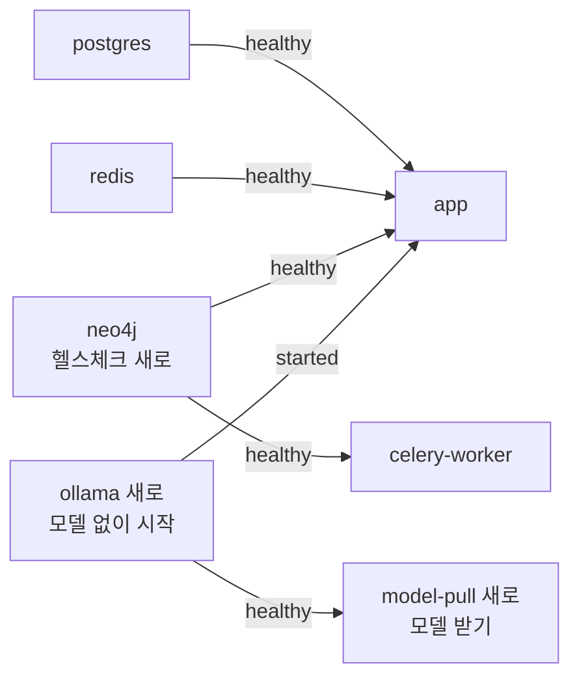

## 강사님 자료 변경 — 2026-10-01 12:13 확인

> **쉬운 요약 3줄**
> 1. 지난 기준점 뒤로 세 곳이 바뀌었다 — **th06 lumina-invest 3커밋**(8파일 · +367 / −31줄) · th07 domain-rag-lab 1커밋(Quant Lab: EDA · LightGBM 실습 화면) · th20 aws-serverless 1커밋(SAM 템플릿 안내 문서).
> 2. th06 은 대부분 **EC2 배포**라 방침상 받지 않는다. 받을 만한 것은 `docker-compose.yml` 의 **준비 확인(헬스체크 · `depends_on` 조건)과 Ollama 컨테이너**, 그리고 **기본 답변 모델 `llama3.1` → `qwen2.5:1.5b`** 다.
> 3. 3-way 병합을 미리 돌려 보니 **4파일 모두 충돌 0** 이다. 다만 그대로 받으면 앱이 `.env` 의 Ollama 주소 · 모델 대신 compose 값을 쓰게 된다 — 모델은 평가셋(💬 ④) 전까지 `llama3.1` 로 두자고 제안한다.

- 받아 온 시각: 2026-10-01 12:13 ~ 12:14(사용자) · 스캐너 `python scripts/lecture_scan.py --md`(12:25) · 이 댓글을 올린 뒤 `--update` 로 기준점을 옮긴다.
- 커밋 작성자 · 비밀값은 읽지 않았다. th06 `infra/fd-edumgt/Caddyfile` 에 운영 서버 공인 IP 가 있다(옮기지 않음). th20 새 문서 19개에는 키 · 계정 번호 모양이 없다 🟢.
- 병합은 임시 폴더에서만 돌렸다 — 작업 트리는 그대로다.

```
 th06 3커밋 · 8파일                     한 칸 = 바뀐 줄 20
 받을 만한 것 (compose · config · .env.example · readme 로컬 절)   █████            +94 / −14
 AWS · 배포 (제외)                                                ███████████████  +273 / −17
 th07 1커밋 · 9파일 +474 / −1 · th20 1커밋 · 19파일 +442           참고만
```

### Qurious 에 닿는 것 🟡 (제 판단 · 요구 ID 는 [요구 대장](https://github.com/EST-team-project/Qurious/blob/main/docs/요구사항/요구-대장.tsv))

| # | 강사님이 넣은 것 | 파일 | 닿는 요구 | Qurious 지금 |
|---|---|---|---|---|
| 1 | 준비 확인 — Neo4j 헬스체크(cypher-shell 로 `RETURN 1`) · app · worker 가 postgres · redis · neo4j 가 healthy 가 된 뒤 뜬다 | th06 `docker-compose.yml`(`a644d1a`) | 실행 환경(요구 없음) | neo4j 헬스체크가 없어 `start.ps1` 이 17474 응답으로 기다린다(`scripts/personal/_common.ps1:348`) |
| 2 | Ollama 컨테이너 · 모델 받기 일회성 작업(`model-pull`) · app · ingest · worker 에 Ollama 주소 · 모델 환경 변수(`COMPOSE_OLLAMA_URL` · `COMPOSE_LLM_MODEL` 로 바꿈) | th06 `docker-compose.yml`(`affb05c`) | `P01-①-3`(이동원) | compose 에 Ollama 가 없다([목표 기능 ① 설계서](https://github.com/EST-team-project/Qurious/blob/main/docs/설계/목표기능1-데이터지식-설계_v0.1.md) 3.1) · 호스트 Ollama 를 `.env` 로 가리킨다(`start.ps1:251`) |
| 3 | 기본 답변 모델 `llama3.1` → `qwen2.5:1.5b`(GPU 없는 서버용 소형 모델) | th06 `app/config.py` · `.env.example` · `readme.md` 로컬 실행 절 | `P01-①-3` · 💬 ④ | `llama3.1`(`app/config.py:32` · `.env.example:21`) · 이 PC Ollama 에는 `llama3.1` · `bge-m3` 뿐 |
| 4 | EC2 배포 — 운영 덧씌우기 compose(Qdrant · Caddy) · HTTPS 프록시 · 배포 워크플로 사전 점검 · 비밀값 등록 스크립트 · readme EC2 절 | `compose.fd.yml` · `infra/fd-edumgt/Caddyfile` · `.github/workflows/deploy.yml` · `scripts/setup-github-deploy.sh` · `readme.md` | — | 제외(AWS · 배포 · CI 는 D8) |
| 5 | Quant Lab — OHLCV EDA(수익률 분포 · 결측 · 변동성 · 최대 낙폭) + LightGBM 「다음 거래일 시가 → 종가 상승」 분류 · 시간순 분리(경계 1행 제외) · 편도 비용을 뺀 모의 성과 · 특징 중요도 | th07 `app/api/routes/quant_lab.py`(+231) · `frontend/assets/quant-lab.js`(+173) · `quant-lab.css` 외 6 | `P01-②-3` · `P01-①-5`(신장환) · `P01-④-1`(강민석) · `SCH-DQ`(이동원) · `SCH-ROB`(강민석 · 3차) | LightGBM 방향 분류 · SHAP 설명이 이미 있다(`app/services/ml_models.py:35` · `app/routes/ml.py:317`) · `rag-lab/` 사본에는 없다(사본 기준 `a13b9a8` · 09-21) |
| 6 | SAM init 템플릿 18종 안내(만들기 → 빌드 → 로컬 실행 → 배포 → 정리) | th20 `SAM/README.md` · `SAM/sam1.md` ~ `sam18.md` | — | 참고만(AWS) |

### 병합안 compose 의 기동 순서



`start.ps1` 은 app · celery 만 올리므로 `model-pull` 은 돌지 않는다.

### 반영 계획 (제안 🟡)

**① th06 비-AWS — 3-way 병합 제안**(기준 `b055ab0` · 강사님 `affb05c` · 우리 `9327db7`). 아직 적용하지 않았다.

| 파일 | 충돌 | 우리 대비 | 메모 |
|---|---|---|---|
| `docker-compose.yml` | 0 | +87 / −10 | 우리 파일이 `b055ab0` 와 같아 결과 = 강사님 판 |
| `app/config.py` | 0 | +1 / −1 | 모델 한 줄 — ③ 대로면 받지 않는다 |
| `.env.example` | 0 | +1 / −1 | 같은 한 줄 |
| `readme.md` 로컬 실행 절 | 0 | +5 / −2 | EC2 절(+27)은 뺐다 — 넣어도 충돌 0 |

확인한 것 🟢
- 병합안 compose + 개발 모드 덧씌우기(`scripts/personal/compose.dev.yml`)를 `docker compose config --quiet` 로 검사 → 통과. 병합안 단독도 통과.
- 떠 있는 `fin-ai-neo4j`(5.18)에서 헬스체크와 같은 명령 → 성공(2.6 ~ 3.6초 · 시한 10초). 틀린 비밀번호는 실패로 잡는다.
- 병합안 설정에서 app · ingest · worker 의 Ollama 주소 · 모델이 compose 기본값(컨테이너 · `qwen2.5:1.5b`)으로 풀린다 — `environment:` 가 `env_file: .env` 보다 앞서기 때문이다.

받으면 달라지는 것 🟡(설정으로 확인 · 띄워 보지는 않음)
- `start.ps1` 로 띄우면 ollama 컨테이너도 같이 켜지지만 모델이 없어, AI 채팅이 503 「LLM 모델(…)을 찾을 수 없습니다」(`app/routes/chat.py:132`)가 된다. `docker compose up -d model-pull` 을 한 번 돌려야 한다(1GB 남짓 · `ollama/ollama` 이미지는 이 PC 에 있다).
- 호스트 Ollama 와 `llama3.1` 을 계속 쓰려면 `.env` 에 `COMPOSE_OLLAMA_URL=http://host.docker.internal:11434` · `COMPOSE_LLM_MODEL=llama3.1` 을 둔다. `start.ps1:251` 안내 문구도 이 이름으로 고친다.
- neo4j 설정이 바뀌어 첫 `up` 때 `fin-ai-neo4j` 가 다시 만들어진다(자료는 볼륨에 남는다). 헬스체크가 5초마다 JVM 을 띄워 한 번에 CPU 약 3.9초를 쓴다 — 가볍게 하려면 컨테이너에 있는 `wget` 으로 7474 를 보는 방법이 있다.
- `status.ps1` 은 서비스 표(`_common.ps1:44`)에 ollama 가 없어 보여 주지 않는다. `stop.ps1 -DeleteData` 는 받은 모델 볼륨까지 지운다.

**② AWS · 배포 — 제외**: `compose.fd.yml` · `infra/fd-edumgt/Caddyfile` · `.github/workflows/deploy.yml` · `scripts/setup-github-deploy.sh` · `readme.md` EC2 절. 배포 워크플로(CI)는 D8 논의가 끝날 때까지 받지 않는다.

**③ 답변 모델 — 지금은 `llama3.1` 유지를 제안한다.**
- 답변 LLM 은 설계서 💬 ④ 대로 W8(10-15 · 10-20) 평가셋 50 으로 고르기로 했다. 지금 바꾸면 평가 전에 정하는 셈이다.
- 이 PC 에 `qwen2.5:1.5b` 가 없어 받는 즉시 채팅이 멈춘다.
- 강사님이 바꾼 까닭은 GPU 없는 배포 서버다. 우리는 AWS 를 미뤘다.
- `qwen2.5:1.5b` 는 가볍고 CPU 에서 빠르니 평가 후보에 넣는다. 지난 반영처럼 강사님 방식을 따르는 기본과 다르게 가는 것이라, 팀이 강사님 값을 원하면 `.env` 한 줄로 바꾼다.

**③-1 로컬 시험 결과 (2026-10-01 13:48~13:50 · 이 PC · GPU 없음)** — 강사님 `ollama` · `model-pull` 두 서비스를 이름만 바꾼 시험 프로젝트로 띄워(호스트 Ollama 와 겹치지 않게 11435) 그대로 돌렸다. 질문 · 프롬프트는 개념 학습 3.1 장 RAG 예제와 같다(temperature 0 · seed 42 · 최대 200토큰). 시험 뒤 컨테이너 · 볼륨은 지웠다.

| | 호스트 `llama3.1` 8B (지금) | 컨테이너 `qwen2.5:1.5b` (강사님) |
|---|---|---|
| 기동 · 모델 받기 | — | 됨 — `model-pull` 52초(986MB + 임베딩 274MB) |
| 생성 속도 | 8.0 ~ 8.8 토큰/초 | 35.2 ~ 36.7 토큰/초 |
| 근거 없이 「2026년 코스피 매도세는 몇 %?」 | 「0.1%」 — 틀림 | 「15%」 — 양도소득세와 섞음 · 더 틀림 |
| 근거와 함께(RAG) | 「[출처 2] 증권거래세법 시행령 제5조 제1호 … 1만분의 5」 — 맞음 · 출처 검사 통과 | 근거 조각 셋을 그대로 옮겨 적다 200토큰에서 끊김 — 답 문장이 없음 · 근거 밖 숫자 1 |

정리: 강사님 설정은 **로컬에서 돌아간다.** 속도는 4배지만, 이 질문에서는 근거를 주어도 답을 만들지 못했다. 답변 모델은 평가셋으로 고르는 💬 ④ 의 후보로 두고, 지금 기본값은 `llama3.1` 을 유지하자는 ③ 의 제안을 실측이 뒷받침한다.

**④ th07 · th20 — 참고만.** 팀이 따로 정하지 않으면 코드는 가져오지 않는다. th07 Quant Lab 은 신호 · XAI · 성과 담당에게 본보기다 — 시간순 분리와 경계 1행 제외(미래 정보 차단), 다수 클래스 기준과 나란히 보는 정확도, 비용을 뺀 성과. th20 은 AWS 라 방침상 참고만 한다.

### 스캐너 출력

스캐너 실행 2026-10-01 12:25 · `--md` · 기준점은 아직 옮기지 않았다.

| 폴더 | 원본 | 지금 끝 | 상태 |
|---|---|---|---|
| th01-investment-analysis | `edumgt/investment-analysis` | `2cb9b7f` 2026-09-14 21:08 | 변화 없음 |
| th02-docker | `edumgt/docker-class` | `50547fd` 2026-09-11 15:23 | 변화 없음 |
| th03-stock-coin-trade | `edumgt/stock-coin-trade` | `78c584e` 2026-09-29 17:47 | 변화 없음 |
| th04-in2 | — | — | lecture 없음 |
| th05-quant-krx | `edumgt/quant-test-20260828` | `8684a2b` 2026-08-28 17:46 | 변화 없음 |
| th06-lumina-invest | `edumgt/lumina-invest` | `affb05c` 2026-10-01 09:04 | **3커밋** (`b055ab0` 부터) |
| th07-domain-rag-lab | `edumgt/domain-rag-lab` | `dea1724` 2026-10-01 11:39 | **1커밋** (`e63e675` 부터) |
| th08-aws-ec2-alb-lab | `edumgt/aws-ec2-alb-lab` | `d47c244` 2026-09-21 14:54 | 변화 없음 |
| th09-python-ai-basic-lab | `edumgt/python-ai-basic-lab` | `b723826` 2026-07-30 04:23 | 변화 없음 |
| th10-stock-ml-dl-project | `edumgt/stock-ml-dl-project` | `09b5823` 2026-07-30 04:08 | 변화 없음 |
| th11-python-ml-class | `edumgt/python-ml-class` | `e84cf65` 2026-07-30 04:06 | 변화 없음 |
| th12-python-crawling-lab | `edumgt/python-crawling-lab` | `1572282` 2026-07-02 10:45 | 변화 없음 |
| th13-py-util | `edumgt/py-util` | `e8554b9` 2026-06-11 21:41 | 변화 없음 |
| th14-edumgt-lab-init | `edumgt/edumgt-lab-init` | `3783d98` 2026-09-14 21:13 | 변화 없음 |
| th15-aihub-rag | `edumgt/aihub-rag` | `a1fbe8d` 2026-07-02 14:42 | 변화 없음 |
| th16-ai-agent-lab | `edumgt/ai-agent-lab` | `7151a88` 2026-06-29 12:49 | 변화 없음 |
| th17-invest-flow | `edumgt/invest-flow` | `81165da` 2026-07-02 14:06 | 변화 없음 |
| th18-langchain-lab | `edumgt/langchain-lab` | `87bc4d5` 2026-06-29 11:58 | 변화 없음 |
| th19-multi-db-lab | `edumgt/multi-db-lab` | `aaec902` 2026-06-30 15:18 | 변화 없음 |
| th20-aws-serverless | `edumgt/aws-serverless` | `206b70c` 2026-10-01 11:49 | **1커밋** (`d6780aa` 부터) |
| th21-ollama-llava-canvas | `edumgt/ollama-llava-canvas` | `fb4ea94` 2026-07-30 04:11 | 변화 없음 |
| th22-vdp-agent | `edumgt/vdp-agent` | `8745eb9` 2026-07-07 11:18 | 변화 없음 |
| th23-meeting-agent | `edumgt/meeting-agent` | `0b56382` 2026-07-06 15:03 | 변화 없음 |
| th24-stcok-kms-portal | `edumgt/stcok-kms-portal` | `25d97ba` 2026-09-22 16:58 | 변화 없음 |

### th06-lumina-invest — 3커밋 (`b055ab0` → `affb05c` · 8 files changed, 367 insertions(+), 31 deletions(-))

비교: https://github.com/edumgt/lumina-invest/compare/b055ab0...affb05c

| 커밋 | 시각 (KST) | 제목 |
|---|---|---|
| `8fc5d2b` | 09-30 16:52 | Add Docker Compose configuration for services and Caddyfile setup |
| `a644d1a` | 09-30 17:28 | EC2 배포 워크플로 개선 및 Docker Compose 설정 추가: 서버 사전 점검, 건강 상태 확인, 의존성 조건 추가 |
| `affb05c` | 10-01 09:04 | Ollama 모델 업데이트 및 Docker Compose 설정 개선: qwen2.5:1.5b 모델로 변경, 환경 변수 추가 |

### th07-domain-rag-lab — 1커밋 (`e63e675` → `dea1724` · 9 files changed, 474 insertions(+), 1 deletion(-))

비교: https://github.com/edumgt/domain-rag-lab/compare/e63e675...dea1724

| 커밋 | 시각 (KST) | 제목 |
|---|---|---|
| `dea1724` | 10-01 11:39 | feat: Implement EDA and LightGBM simulation in Quant Lab |

### th20-aws-serverless — 1커밋 (`d6780aa` → `206b70c` · 19 files changed, 442 insertions(+))

비교: https://github.com/edumgt/aws-serverless/compare/d6780aa...206b70c

| 커밋 | 시각 (KST) | 제목 |
|---|---|---|
| `206b70c` | 10-01 11:49 | Document SAM init template examples (#9) |
