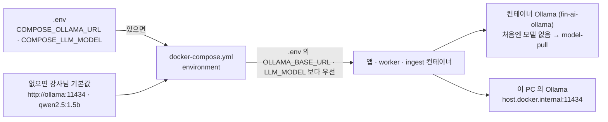

## 강사님 자료 반영 — th06 `affb05c` 의 compose 를 Qurious 에 (2026-10-01 17:00)

> **쉬운 요약 3줄**
> 1. 04 댓글의 반영 계획 ① 을 그대로 했다 — `docker-compose.yml` 은 **강사님 판과 한 글자도 다르지 않게**(+87 / −10 · 충돌 0) 받았고, readme 로컬 실행 절(+5 / −2)도 받았다. EC2 배포 · Caddy · 배포 워크플로는 받지 않았다.
> 2. **답변 모델은 `llama3.1` 을 유지한다**(`app/config.py` · `.env.example` 의 모델 줄은 받지 않음). 다만 이제 도커로 띄우면 compose 가 Ollama 주소 · 모델을 정하므로, `.env` 에 아무것도 넣지 않은 PC 는 **컨테이너 Ollama + `qwen2.5:1.5b`** 가 기본이다.
> 3. **pull 뒤 AI 채팅을 쓰려면 둘 중 하나** — 처음 한 번 `docker compose up -d model-pull`(약 1.3GB) 또는 `.env` 에 두 줄(이 PC 의 Ollama + `llama3.1`). 다른 기능은 영향이 없다.

### 받은 것 · 받지 않은 것

| 강사님이 넣은 것 | 파일 | Qurious | 까닭 |
|---|---|---|---|
| neo4j 준비 확인(`cypher-shell` 로 `RETURN 1`) · app · worker 가 postgres · redis · neo4j 가 healthy 가 된 뒤 뜬다 | `docker-compose.yml` | ✅ 받음 | 실행 환경 — 앱이 Neo4j 보다 먼저 떠 그래프 기능이 꺼지던 일을 compose 가 막아 준다 |
| Ollama 컨테이너(`fin-ai-ollama` · 포트 열지 않음) · 모델 받기 일회성 작업(`model-pull`) · `COMPOSE_OLLAMA_URL` · `COMPOSE_LLM_MODEL` | `docker-compose.yml` | ✅ 받음 | 근거 RAG(`P01-①-3`)가 Ollama 를 쓴다 · 팀원 PC 에 Ollama 를 따로 깔지 않아도 된다 |
| readme 로컬 실행 절(qwen2.5:1.5b 포함 기동 · 다른 모델 · 호스트 Ollama 쓰는 법) | `readme.md` | ✅ 받음 | compose 와 맞는 안내 |
| 기본 답변 모델 `llama3.1` → `qwen2.5:1.5b` | `app/config.py` · `.env.example` | ❌ 받지 않음 | 답변 모델은 W8 평가셋으로 고르기로 했다(목표 기능 ① 설계서 💬 ④) · 로컬 시험에서 RAG 답을 만들지 못했다(04 댓글 ③-1) |
| EC2 배포(운영 compose · Caddy · 배포 워크플로 · 비밀값 등록 스크립트 · readme EC2 절) | `compose.fd.yml` 외 4 | ❌ 받지 않음 | AWS 는 비용 합의 전 · 배포 워크플로(CI)는 D8 논의 뒤 |

```
 th06 b055ab0 → affb05c · 8파일 +367 / −31
 받음   docker-compose.yml +87/−10 · readme.md 로컬 절 +5/−2      ████
 안 받음 config.py · .env.example 모델 줄 각 1                     ·
 안 받음 EC2 · Caddy · deploy.yml · setup 스크립트 · readme EC2 절   ███████████████
```

### 앱이 쓰는 Ollama — 어디서 정해지나



### 팀원이 할 일 (pull 뒤 · AI 채팅을 쓸 때만)

| 방법 | 할 일 | 결과 |
|---|---|---|
| A. 컨테이너 Ollama (강사님 기본) | `docker compose up -d model-pull` 한 번 · 진행은 `docker compose logs -f model-pull` | `qwen2.5:1.5b` + `nomic-embed-text` 약 1.3GB · CPU 에서 빠름(35 토큰/초) |
| B. 이 PC 에 깐 Ollama | `.env` 에 `COMPOSE_OLLAMA_URL=http://host.docker.internal:11434` · `COMPOSE_LLM_MODEL=llama3.1` 두 줄 → 다시 띄우기 | 지금까지 쓰던 `llama3.1` |

`scripts/personal/start.ps1` 을 쓰면 마지막 줄에 **앱이 실제로 받은 주소 · 모델**과 모델이 없을 때 할 일이 나온다. `.env` 의 `OLLAMA_BASE_URL` 은 도커 안에서는 compose 가 덮어써 쓰이지 않는다(도커 밖에서 앱을 직접 돌릴 때만 쓰인다).

### 잰 것 (2026-10-01 · 이 PC · 22코어 · Docker Desktop)

| 무엇 | 값 |
|---|---|
| 병합 결과 대조 | `docker-compose.yml` = 강사님 `affb05c` (줄 끝 CR 빼고 차이 0) · readme = 3-way 전체 결과에서 EC2 절만 뺀 것 |
| 설정 검사 | `docker compose config --quiet` — 보통 모드 · 개발 모드 덧씌우기 둘 다 통과 |
| 다시 띄우기 | `start.ps1 -Dev` 36초 — neo4j 를 다시 만들고(데이터는 볼륨에 그대로) Healthy · ollama 컨테이너 생성 · 앱 응답 |
| 빈 ollama 컨테이너 | CPU 0% · 메모리 118MiB |
| neo4j 준비 확인 비용 | 확인 한 번 1.7 ~ 1.8초 · 약 7초마다 · **neo4j 평균 CPU 0.57코어**(60.8초 동안 CPU 34.9초 · 확인 사이에는 0.06코어 안팎) |

### 우리 방향에 맞게 고칠 곳 — 후보 (팀 의견 필요)

- **neo4j 준비 확인이 가볍지 않다** — 확인마다 자바 프로그램(`cypher-shell`)을 새로 띄워 평균 0.5코어를 늘 쓴다. 노트북에서는 팬이 돌 수 있다. 같은 컨테이너의 `wget` 으로 7474 번(브라우저 포트)을 보거나 간격을 30초로 늘리는 방법이 있다. 강사님 판을 따르는 것이 기본이라 지금은 고치지 않았다 — 팀이 원하면 한 줄 고친다.
- **답변 모델** — 평가셋(50문항 · W8)에서 `llama3.1` · `qwen2.5:1.5b` · 그 밖의 후보를 같은 질문으로 비교해 정한다. 그때 compose 기본값과 `app/config.py` 기본값을 같은 값으로 맞춘다(지금은 도커 기본 qwen · 도커 밖 기본 llama3.1 로 갈려 있다).

### 다음 반영의 기준점

th06 **`affb05c`**(2026-10-01 09:04). 다음 3-way 병합은 이 커밋을 기준으로 한다 — `app/config.py` · `.env.example` 의 모델 줄은 「우리가 의도해서 다르게 둔 곳」 이다.
