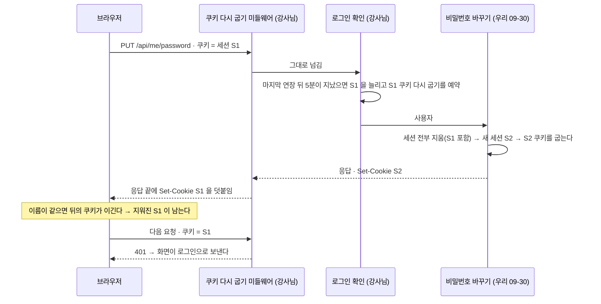

## 강사님 자료 변경 — 2026-10-02 09:04 확인

> **쉬운 요약 3줄**
> 1. 지난 기준점(10-01 13:51) 뒤로 세 곳이 바뀌었다 — **th06 lumina-invest 3커밋**(32파일 · +1,510 / −192 · 로그인 유지 · 채팅 답변 엔진 고르기 · 화면 파일 캐시) · th03 2커밋(백엔드를 Flask → FastAPI 로 다시 짬 + Pine 17단계 「오더 블록」) · th07 5커밋(Walk-Forward 검증 화면 · 삼성전자 일봉 · RAG 설계 일지).
> 2. th06 은 AWS · 서비스 분리 12파일을 빼면 20파일이다. 3-way 를 미리 돌려 보니 **9파일은 충돌 없이 합쳐지고**, 9파일은 우리 09-30 계정 작업 · 10-01 화면 고침과 같은 자리라 손으로 합쳐야 한다(충돌 17곳 — 그중 `app.html` 1곳은 서식 차이 탓이라 뜻이 없고 실제 변경은 1덩어리). 새 시험 2개 중 채팅 시험은 그대로 들어오고, 세션 시험은 우리 JWT 방식에 맞게 고쳐 넣어야 한다.
> 3. **글자는 안 겹치는데 위험한 곳이 하나 있다** — 강사님 「쿠키 다시 굽기」 미들웨어가 우리 「비밀번호 바꾸기」 응답 끝에 *방금 지운 옛 세션* 쿠키를 덧붙여, 비밀번호를 바꾼 그 기기가 로그아웃될 수 있다(따로 만든 재현으로 확인 · 고칠 곳 두 줄). 리프레시 토큰 연장 · OpenAI 키 입력 모드는 팀이 정할 일이다.
>
> **→ 같은 날(10-02) Qurious 에 반영했다** — 맨 아래 「반영 결과」. 위험한 곳은 고치고 시험을 더했다(DF-37).

- 받아 온 시각: 2026-10-02 08:54 ~ 08:56(사용자) · 스캐너 `python scripts/lecture_scan.py --md`(09:04) · 기준점은 반영 뒤 옮겼다(맨 아래).
- 아래 Qurious 코드 링크는 분석한 판(`9353b70` · 반영 전)에 고정했다 — 줄 번호가 반영 뒤 판과 다르다.
- 커밋 작성자는 읽지 않았다. 새로 들어온 줄에서 비밀값 모양(클라우드 키 · 개인키 · 토큰 · 공인 IP · 12자리 번호 · 이메일)을 셌다 — th03 5건 · th06 2건 모두 시험값 · 자리표시자 · 공개 DNS 주소(`8.8.8.8`)라 🟢 · th07 0건.
- 병합은 임시 폴더에서만 돌렸다 — 작업 트리는 그대로다. 「우리 판」 은 작업 트리(커밋 전 compose 반영 포함)이고, `app.html` · `main.js` 만 팀원 PR #85 · #86 이 들어간 `main` 판으로 했다.

```
 th06 3커밋 · 32파일                                        한 칸 = 바뀐 줄 25
 충돌 없이 합쳐짐  9파일 (세션 · 채팅 · Redis · CSS · JS)     ███████████████████    +422 / −57
 손으로 합침       9파일 (계정 · 첫 화면 · 로그인 · readme)    █████████              +166 / −48
 새 시험           2파일 (세션 12건 · 채팅 8건)               █████████████████████  +522
 제외              12파일 (services/ 11 · 배포 워크플로 1)     ███████████████████    +400 / −87
 th03 2커밋 · 229파일 +10,540 / −6,106 · th07 5커밋 · 13파일 +1,122 / −37            참고만
```

### Qurious 에 닿는 것 🟡 (제 판단 · 요구 ID 는 [요구 대장](https://github.com/EST-team-project/Qurious/blob/9353b70/docs/요구사항/요구-대장.tsv))

| # | 강사님이 넣은 것 | 파일 | 닿는 요구 | Qurious 지금 |
|---|---|---|---|---|
| 1 | 로그인 유지 — 인증된 요청이 오면(5분에 한 번) Redis 세션 만료를 다시 늘리고, 같은 세션 쿠키를 응답에 다시 실어 브라우저 쪽 만료도 늘린다(「슬라이딩 만료」) · 세션 기본 30일 · 로그아웃은 세션이 이미 없어도 쿠키를 지운다 · Redis 장애는 500 대신 503 | th06 `app/lib/session.py`(+134 / −17 · `SessionCookieRefreshMiddleware`) · `routes/auth.py` · `main.py` · `config.py` · 시험 `tests/test_session_auth.py`(12건) | — (계정 · 요구 없음) | 쿠키 만료는 로그인 때 한 번 정해진다([`auth.py:118`](https://github.com/EST-team-project/Qurious/blob/9353b70/app/routes/auth.py#L118)) · 기본값이 1일([`.env.example:38`](https://github.com/EST-team-project/Qurious/blob/9353b70/.env.example#L38)) · 7일([`config.py:8`](https://github.com/EST-team-project/Qurious/blob/9353b70/app/config.py#L8))로 갈려 있다 · 09-30 계정 작업(비밀번호 바꾸기 · 탈퇴)이 세션을 직접 지우고 만든다 |
| 2 | JWT 폐기 목록 키 고침 — 「토큰 앞 32자」 → 토큰 전체 SHA-256 | `app/lib/jwt_auth.py` | — | **우리가 09-20 에 먼저 고쳤다** — `jti` · 없으면 서명 앞까지 SHA-256([`jwt_auth.py:154`](https://github.com/EST-team-project/Qurious/blob/9353b70/app/lib/jwt_auth.py#L154)) · 서명 부분만 바꾼 변조본도 막는 쪽이라 우리 것을 남긴다 |
| 3 | 리프레시 토큰 연장 — `/api/auth/token/refresh` 가 새 리프레시 토큰도 함께 준다(옛것은 만료까지 유효) | `app/routes/auth.py` | — | 액세스 토큰만 새로 준다([`auth.py:262`](https://github.com/EST-team-project/Qurious/blob/9353b70/app/routes/auth.py#L262)) → 💬 1 |
| 4 | Redis AOF — 컨테이너를 다시 띄워도 세션이 남게 Redis 가 쓰기 기록을 파일에 남긴다 | `docker-compose.yml` +4 | 실행 환경 | 작업 트리 compose = 강사님 `affb05c` 판(커밋 전) → 4줄이 그대로 얹힌다 |
| 5 | 채팅 답변 엔진 고르기 — Ollama(기본) · OpenAI 키 입력(브라우저가 요청마다 키를 보냄) · 순수 RAG(LLM 없이 검색한 문서 조각만) | `app/routes/chat.py`(+90 / −26) · `lib/llm_client.py`(+35 `OpenAIClient`) · `public/js/agent.js` · `app.html` · `app.css` · 시험 `tests/test_chat_modes.py`(8건) | `P01-①-3`(이동원) · 설계서 💬 ④ 답변 모델 | `chat.py` 는 강사님 `affb05c` 판 그대로라 겹침 없음 · 화면에 엔진 선택 없음 → 💬 2 |
| 6 | 화면 — API 가 401 이면 어디서든 로그인 화면으로(`?next=` 로 원래 화면에 돌아옴 · 같은 사이트 주소만) · 로그인 · 가입 화면이 이미 로그인이면 앱으로 | `public/js/common.js` · `main.js` · `login.html` · `register.html` | — | 09-30 에 같은 목적을 다르게 했다 — 첫 주소는 서버가 고르고([`app/main.py:173`](https://github.com/EST-team-project/Qurious/blob/9353b70/app/main.py#L173)) · 앱 시작은 401 일 때만 로그인 화면([`main.js:34`](https://github.com/EST-team-project/Qurious/blob/9353b70/public/js/main.js#L34)) · 뒤로가기 캐시 처리([`login.html:171`](https://github.com/EST-team-project/Qurious/blob/9353b70/public/login.html#L171)) |
| 7 | 화면 파일 캐시 끄기 — `/js/` · `/css/` · `*.html` · `/` 응답에 `Cache-Control: no-cache` | `app/main.py` | — | 10-01 에 `/js` · `/css` 만 같은 일을 했다([`app/main.py:131`](https://github.com/EST-team-project/Qurious/blob/9353b70/app/main.py#L131)) — 강사님 것은 `app.html` · `login.html` · `register.html` 까지 덮는다 |
| 8 | 배포 워크플로 `sudo env` 고침 · 인증 · 수집 서비스 분리본(`services/`)에 같은 세션 고침 | `.github/workflows/deploy.yml` · `services/` 11파일 | — | 제외(AWS · CI · Qurious 에 `services/` 없음) |
| 9 | th03 — 백엔드 Flask → FastAPI 재구성 · Pine 17단계 「오더 블록 · SMC 차트 읽기」 | th03 `python-stock-backend/app/` · `frontend/learning/tr-pine/step-17.html` · `order-block.md` | `P02-③-1`(이동원 · 3차) | 참고 |
| 10 | th07 — Walk-Forward 검증(학습 구간을 늘려 가며, 시험 구간 앞을 정답 기간만큼 비움) | th07 `app/api/routes/walk_forward.py` · `frontend/assets/walk-forward.js` · `tests/test_walk_forward.py` | `SCH-ROB`(강민석 · 3차) · `P02-②-2`(신장환) | [`investment_research.py:191`](https://github.com/EST-team-project/Qurious/blob/9353b70/app/services/investment_research.py#L191) 은 5거래일 뒤 수익률(`:181`)을 맞히는데 `TimeSeriesSplit` 에 간격(`gap`)이 없다 → 아래 th07 절 |
| 11 | th07 — Quant Lab 에 삼성전자 2년 일봉(yfinance) · RAG 아키텍처 탐색 일지 · README Streamlit 소개 | th07 `quant_lab.py` · `llm-middle-ware.md` · `README.md` | `P01-①-3`(이동원) | 야후는 봉인돼 있다([`tests/test_no_yahoo_regression.py`](https://github.com/EST-team-project/Qurious/blob/9353b70/tests/test_no_yahoo_regression.py)) — 가져오지 않는다 · 일지는 참고 |

### th06 3-way 를 미리 돌려 본 결과 (기준 `affb05c` · 강사님 `289bfb5` · 우리 판)

「충돌」 은 `git merge-file` 이 멈춘 곳 수다. 0 이어도 아래 ① ② 처럼 뜻이 어긋날 수 있다.

| 파일 | 강사님 | 충돌 | 우리 고침과 | 제안 🟡 |
|---|---|---|---|---|
| `app/lib/session.py` | +134 / −17 | 0 | 우리가 안 고친 파일 — 결과 = 강사님 판 | 그대로 · 단 ① |
| `app/lib/redis_cache.py` | +26 / −2 | 0 | 우리가 안 고침 | 그대로 · 단 ③ 위험 한도 |
| `app/routes/chat.py` | +90 / −26 | 0 | 우리가 안 고침 | 그대로 |
| `public/js/agent.js` · `public/css/app.css` | +76 / −8 · +17 | 0 · 0 | 우리가 안 고침 | 그대로 |
| `docker-compose.yml` | +4 | 0 | 작업 트리 = 강사님 `affb05c` 판 → 결과 = 강사님 판 | 그대로 · 단 ③ 첫 재시작 |
| `app/config.py` | +12 / −1 | 0 | 다른 자리 — 우리 `llama3.1` · JWT 가드 · AWS 뺀 것이 그대로 남는다 | 그대로 |
| `app/lib/llm_client.py` | +35 | 0 | 다른 자리 — 우리가 Bedrock · SageMaker 를 뺀 것과 안 겹친다 | 그대로 |
| `public/js/common.js` | +28 / −3 | 0 | 다른 자리 — 우리 `err.status` 와 안 겹친다 | 그대로 · 단 ② |
| `app/lib/jwt_auth.py` | +14 / −8 | 2 | 폐기 목록 키(위 표 2번) — 우리 것이 먼저 · 더 촘촘 | 키 함수 · 설명은 우리 것 · `get_current_user_any`(요청 · 쿠키 이름 · 연장)는 강사님 것(조용히 들어옴) |
| `app/routes/auth.py` | +25 / −25 | 3 | 쿠키 굽기 2곳 · 리프레시 토큰 | 쿠키는 강사님 도우미(`set_session_cookie` · `clear_session_cookie`) 하나로 · 리프레시는 💬 1 · 로그아웃 고침은 조용히 들어온다 |
| `app/main.py` | +61 / −4 | 3 | 「로그인이면 앱으로」 를 양쪽이 따로 만들었다 | 화면 함수는 우리 것(`_logged_in` · 앱 화면 막기 — 시험 `test_entry_pages_look_at_the_session` 이 본다) · 미들웨어 둘은 강사님 것 |
| `public/js/main.js` | +6 / −4 | 2 | 앱 시작 오류 처리 · 로그아웃(공백만 다름) | 우리 시작 처리(401 만 로그인 화면) 유지 · ② 의 한 줄 |
| `public/login.html` · `register.html` | +8 / −2 · +8 / −2 | 2 · 2 | 같은 목적을 다르게(우리 뒤로가기 처리 · 가입 화면 비밀번호 규칙) | 우리 것 + 강사님 `safeNextPath()` · ② 의 한 칸 |
| `public/app.html` | +14 / −1 | 1 (뜻 없음) | 팀원 자동 서식(10-01)으로 2,824줄 중 479줄만 글자가 같다(빈 줄 포함) | 아래 토큰 비교 — 1덩어리 · 우리 고침과 안 겹침 |
| `.env.example` | +10 / −1 | 1 | 우리가 지운 AWS 줄 자리에 OpenAI 3줄 | OpenAI 3줄만 · `SESSION_TTL` 2줄은 조용히 들어온다 |
| `readme.md` | +20 / −1 | 1 | 기술 표(우리가 다시 씀) | 표는 우리 것 · 새 절 셋은 받되 JWT 한 줄은 고쳐 받기(③) |
| `tests/test_chat_modes.py` | 새 203줄 · 8건 | — | 없음 | 그대로 — `chat.py` 가 강사님 판이고 `langgraph` 가 깔려 있다 |
| `tests/test_session_auth.py` | 새 319줄 · 12건 | — | 우리 JWT 방식과 부딪힘 | 고쳐 넣기 — 바로 아래 |

`tests/test_session_auth.py` 를 그대로 넣으면 (코드만 읽고 판단 · 돌리지 않음)
- `test_revoking_one_token_does_not_revoke_others` — **반드시 실패.** 우리 `is_revoked(token, payload)` 는 서명을 검증한 클레임을 함께 받는다([`jwt_auth.py:182`](https://github.com/EST-team-project/Qurious/blob/9353b70/app/lib/jwt_auth.py#L182)) → `is_revoked(a, decode_token(a))` 로 고친다.
- `test_token_refresh_issues_new_sliding_refresh_token` — 💬 1 에 달렸다. 우리 방식이면 응답에 `refresh_token` 이 없어 실패.
- 위 두 시험은 토큰을 만든다 — `JWT_SECRET` 이 자리표시자면 우리 가드([`jwt_auth.py:56`](https://github.com/EST-team-project/Qurious/blob/9353b70/app/lib/jwt_auth.py#L56))가 500 을 낸다. 시험 설정이 각자의 `.env.dev` 를 읽으므로, 시험 파일 안에서 비밀값을 정해 주는 편이 안전하다.
- 나머지 8개(10건 — 세션 연장 · 쿠키 다시 굽기 · 로그아웃 · Redis 장애 503)는 우리 코드와 부딪히는 곳을 못 찾았다.

`app.html` 토큰 비교 — 공백 · 줄바꿈을 접고 태그 경계로 잘라 비교했다(기준 4,535 · 강사님 4,560 · 우리 4,736 토큰).

| 덩어리 | 강사님이 바꾼 것 | 우리 판(`main`) 같은 자리 |
|---|---|---|
| 1 (토큰상 2) | 채팅 머리의 「초기화」 단추를 `chat-mode-bar` 로 감싸고, 그 앞에 「답변 엔진」 선택(Ollama · OpenAI 키 · 순수 RAG) · 키 입력 칸 · 보이기 단추를 넣었다 | 있다 — 122줄 `<button id="clear-chat">` · 앞뒤 3토큰이 같고 우리 고침 8덩어리와 안 겹친다 |

### 조용히 합쳐지지만 위험한 곳

**① 비밀번호를 바꾼 기기가 로그아웃될 수 있다 🔴**



- 따로 만든 재현(강사님 미들웨어와 같은 동작 · FastAPI 시험 클라이언트): Set-Cookie 순서 `S2, S1` → 남은 쿠키 **S1**. 미들웨어에 S2 를 맡긴 고친 안 → `S2` 하나만.
- 언제 나나: 세션 연장은 5분에 한 번, 그 뒤 처음 오는 인증 요청에서 일어난다. 그 요청이 마침 「비밀번호 바꾸기」 이면 난다 — 마이페이지에 오래 머물다 바꾸면 잘 겹친다. 그래서 될 때도 있고 안 될 때도 있다.
- 고칠 곳(제안): [`auth.py:441`](https://github.com/EST-team-project/Qurious/blob/9353b70/app/routes/auth.py#L441) 에서 새 세션을 만든 뒤 강사님 공개 함수 `mark_cookie_refresh(request, 새 세션)` 로 미들웨어가 S2 를 굽게 한다(라우트에 `request` 인자 하나 더). 탈퇴([`auth.py:466`](https://github.com/EST-team-project/Qurious/blob/9353b70/app/routes/auth.py#L466))도 같은 까닭으로 지운 쿠키 뒤에 S1 이 다시 붙는다 — 30일짜리 죽은 쿠키라 해는 작지만 같이 막는다.
- 우리 시험([`test_account_crud.py:283`](https://github.com/EST-team-project/Qurious/blob/9353b70/tests/test_account_crud.py#L283))은 라우트 함수를 직접 불러 미들웨어를 거치지 않으므로 이 일을 못 잡는다 → 미들웨어를 거치는 시험 1개를 더하자.

**② 화면 — 401 이면 어디서든 로그인 화면으로 🟡**
- 가입 · 로그인 화면의 뒤로가기 처리([`register.html:180`](https://github.com/EST-team-project/Qurious/blob/9353b70/public/register.html#L180) · [`login.html:171`](https://github.com/EST-team-project/Qurious/blob/9353b70/public/login.html#L171))가 `api("/api/me")` 를 부른다. 합친 뒤에는 로그인 안 된 사람이 가입 화면으로 뒤로가기하면 그 401 때문에 로그인 화면으로 옮겨진다 → `{ redirectOnUnauthorized: false }` 한 칸.
- 앱 시작([`main.js:34`](https://github.com/EST-team-project/Qurious/blob/9353b70/public/js/main.js#L34))이 401 에서 `location.replace("/login.html")` 를 한 번 더 한다 — `api()` 가 먼저 `?next=` 를 붙여 보냈는데 덮어써서 돌아올 곳이 사라진다 → 그 줄은 `return` 만.
- 마이페이지([`mypage.js:103`](https://github.com/EST-team-project/Qurious/blob/9353b70/public/js/mypage.js#L103))는 비밀번호를 바꾼 뒤 「다른 기기 n곳 로그아웃」 알림을 띄우고 화면에 남는다 — ① 이 나면 다음 클릭에서 로그인 화면으로 튕긴다. ① 을 고치면 같이 풀린다.

**③ 받으면 달라지는 것 🟡**
- 세션 기간: 각자 `.env` 에 옛 `.env.example` 값 `SESSION_TTL=86400`(1일)을 복사해 두었다면 그 값이 이긴다 — 30일이 아니라 「마지막 활동 뒤 1일」 이 된다.
- Redis AOF 를 켜고 처음 다시 띄울 때 지금 Redis 안의 세션 · 캐시가 한 번 비워진다(Redis 문서: 설정만 바꿔 다시 띄우면 데이터를 잃을 수 있다 — [Redis persistence](https://redis.io/docs/latest/operate/oss_and_stack/management/persistence/)) → 모두 한 번 다시 로그인. 그 뒤로는 재시작해도 남는다.
- `get_redis()` 가 연결 전이어도 예외 대신 클라이언트를 만든다. 위험 한도([`risk_guard.py:28`](https://github.com/EST-team-project/Qurious/blob/9353b70/app/services/risk_guard.py#L28))는 「Redis 없음」 을 그 예외로 알아채 곧장 메모리로 넘어갔는데, 이제는 연결을 시도하다 실패한 뒤 넘어간다. 결과는 같고 느려진다 — 이 PC 에서 실패 한 번 4.1초, `tests/test_risk_guard.py` 의 Redis 경로 11번이면 45초 안팎 늘 수 있다(어림 · 시험은 돌리지 않음).
- readme 새 절의 「JWT 블랙리스트 키는 토큰 전체의 SHA-256」 은 우리 방식(위 표 2번)과 다르다 → 그 줄을 고쳐 받는다.
- 화면 파일 캐시: 강사님 미들웨어와 우리 `_Revalidate`(`/js` · `/css`)가 같은 일을 겹쳐 한다 — 해는 없다. 앱 · 로그인 · 가입 화면에 처음으로 캐시 지시가 붙는다 🟢. `/learn/` · `/lectures/` 폴더 주소는 강사님 규칙에 안 걸려 우리 `_RevalidateHtml` 이 계속 맡는다.

### 팀이 정할 것 💬

1. **리프레시 토큰 연장** — 강사님: 새로 고칠 때마다 새 리프레시 토큰(7일)을 함께 준다 · 옛것도 만료까지 유효 / 우리(09-20): 액세스 토큰만 새로. 제안 🟡 강사님 방식을 따른다(기초 코드 원칙). 다만 지금 모양이면 훔친 리프레시 토큰 하나로 끝없이 연장할 수 있으니, 쓸 때마다 옛 리프레시를 폐기하는 「회전」 은 「나만의」 방향 후보로 둔다. 비밀번호를 바꾸면 그 전 토큰이 모두 끊기는 것(`min_iat`)은 어느 쪽이든 그대로다.
2. **OpenAI 키 입력 모드** — 받으면 채팅 화면 오른쪽 위에 엔진 선택이 생긴다. 걸리는 것 셋: 키가 브라우저 `localStorage` 에 평문으로 남는다(`lumina.chat.openaiKey` — 화면 스크립트에 취약점이 생기면 읽힌다) · 질문과 근거 문서 조각이 OpenAI 로 나간다 · 서버 `.env` 에 `OPENAI_API_KEY` 를 넣으면 로그인한 누구나 그 키로 부른다. 제안 🟡 코드는 받고 서버 기본 키는 비워 둔다 — 화면에 둘지는 팀이. 「순수 RAG」 모드(LLM 없이 검색 조각만)는 근거 RAG 평가셋에서 「검색만 했을 때」 기준선으로 쓸 수 있다.
3. **세션 30일** — 모의투자에는 무리가 없다. 실거래를 열 때는 다시 본다(실거래 화면만 다시 인증하는 식). 지금 Qurious 는 실거래가 기본으로 막혀 있다.

### th03 · th07 — 참고

**th03 stock-coin-trade** ([fa38e53](https://github.com/edumgt/stock-coin-trade/commit/fa38e53) · [2798f72](https://github.com/edumgt/stock-coin-trade/commit/2798f72))
- 백엔드를 Flask → FastAPI 로 다시 짰다 — 평평한 파일 57개를 지우고(`fa38e53`), 같은 내용을 `python-stock-backend/app/`(routes · services · core · jobs · cli) 계층으로 옮겼다(`2798f72` · 새 파일 110 · 고침 87 · Python 3.12 · uv 잠금 파일 · 시험 9파일). 로그인은 서버 쪽 Redis 세션 + 로그인 때 세션 ID 재발급(`app/core/sessions.py` · `tests/test_sessions_and_auth.py`).
- Pine 학습 17단계 「오더 블록 · SMC 차트 읽기」 — `frontend/learning/tr-pine/step-17.html`(+152) · `order-block.md`(+143). 삼성전자 4시간봉 캡처 한 장으로 BOS · CHoCH · EQL · 오더 블록 후보 · 무효화 기준을 읽는 순서를 적었다. 나머지 화면 80여 개는 `?v=` 판 번호만 바뀌었다.
- 3차 ③ TradingView(`P02-③-1`) 학습 자료로 본다. 코드는 가져오지 않는다.

**th07 domain-rag-lab** ([1f6bac0](https://github.com/edumgt/domain-rag-lab/commit/1f6bac0) · [d3daa71](https://github.com/edumgt/domain-rag-lab/commit/d3daa71) · [314a389](https://github.com/edumgt/domain-rag-lab/commit/314a389) · [37bacb5](https://github.com/edumgt/domain-rag-lab/commit/37bacb5))
- Walk-Forward 검증 화면(`/?view=walk-forward` · `app/api/routes/walk_forward.py` +112 · `frontend/assets/walk-forward.js` +721 · 시험 1). 가상 시장 1,250거래일에서 「10거래일 뒤 수익률 하위 10%」 위험을 로지스틱 회귀로 맞힌다. 학습 구간을 폴드마다 늘리고(확장 창), 시험 구간 앞 10거래일을 비운다(Purging — 학습 정답이 시험 기간 가격을 보지 않게). 위험 기준(하위 10%)도 폴드마다 학습 구간에서만 다시 잰다. 마지막 10행은 정답이 없어 뺀다.
- Quant Lab 에 「삼성전자 최근 2년 일봉」(yfinance `005930.KS` · 수정하지 않은 종가 · 30분 캐시) · `llm-middle-ware.md`(+81 · 벡터 DB 를 직접 만든다면 · HNSW · 통째로 넣기 대 RAG 토큰 비용 · 토큰 정제 미들웨어 — 질문과 답 요약 일지) · README Streamlit 소개.
- Qurious 에 닿는 곳: [`investment_research.py:191`](https://github.com/EST-team-project/Qurious/blob/9353b70/app/services/investment_research.py#L191) 은 5거래일 뒤 수익률을 맞히는데 `TimeSeriesSplit` 에 간격이 없어, 폴드마다 학습 구간 끝 행들의 정답이 검증 구간 가격으로 계산된다 — th07 이 비우는 바로 그 겹침이다. `TimeSeriesSplit(n_splits, gap=5)` 한 칸이면 막힌다 🟡(담당 파트가 볼 일). yfinance 는 우리 방침상 가져오지 않는다. `rag-lab/` 사본(기준 `a13b9a8` · 09-21)에는 이번 변경이 없다.

### 스캐너 출력

스캐너 실행 2026-10-02 09:04 · `--md` · 기준점은 아직 옮기지 않았다.

| 폴더 | 원본 | 지금 끝 | 상태 |
|---|---|---|---|
| th01-investment-analysis | `edumgt/investment-analysis` | `2cb9b7f` 2026-09-14 21:08 | 변화 없음 |
| th02-docker | `edumgt/docker-class` | `50547fd` 2026-09-11 15:23 | 변화 없음 |
| th03-stock-coin-trade | `edumgt/stock-coin-trade` | `2798f72` 2026-10-01 14:04 | **2커밋** (`78c584e` 부터) |
| th04-in2 | — | — | lecture 없음 |
| th05-quant-krx | `edumgt/quant-test-20260828` | `8684a2b` 2026-08-28 17:46 | 변화 없음 |
| th06-lumina-invest | `edumgt/lumina-invest` | `289bfb5` 2026-10-01 16:24 | **3커밋** (`affb05c` 부터) |
| th07-domain-rag-lab | `edumgt/domain-rag-lab` | `7ea4940` 2026-10-01 17:48 | **5커밋** (`dea1724` 부터) |
| th08-aws-ec2-alb-lab | `edumgt/aws-ec2-alb-lab` | `d47c244` 2026-09-21 14:54 | 변화 없음 |
| th09-python-ai-basic-lab | `edumgt/python-ai-basic-lab` | `b723826` 2026-07-30 04:23 | 변화 없음 |
| th10-stock-ml-dl-project | `edumgt/stock-ml-dl-project` | `09b5823` 2026-07-30 04:08 | 변화 없음 |
| th11-python-ml-class | `edumgt/python-ml-class` | `e84cf65` 2026-07-30 04:06 | 변화 없음 |
| th12-python-crawling-lab | `edumgt/python-crawling-lab` | `1572282` 2026-07-02 10:45 | 변화 없음 |
| th13-py-util | `edumgt/py-util` | `e8554b9` 2026-06-11 21:41 | 변화 없음 |
| th14-edumgt-lab-init | `edumgt/edumgt-lab-init` | `3783d98` 2026-09-14 21:13 | 변화 없음 |
| th15-aihub-rag | `edumgt/aihub-rag` | `a1fbe8d` 2026-07-02 14:42 | 변화 없음 |
| th16-ai-agent-lab | `edumgt/ai-agent-lab` | `7151a88` 2026-06-29 12:49 | 변화 없음 |
| th17-invest-flow | `edumgt/invest-flow` | `81165da` 2026-07-02 14:06 | 변화 없음 |
| th18-langchain-lab | `edumgt/langchain-lab` | `87bc4d5` 2026-06-29 11:58 | 변화 없음 |
| th19-multi-db-lab | `edumgt/multi-db-lab` | `aaec902` 2026-06-30 15:18 | 변화 없음 |
| th20-aws-serverless | `edumgt/aws-serverless` | `206b70c` 2026-10-01 11:49 | 변화 없음 |
| th21-ollama-llava-canvas | `edumgt/ollama-llava-canvas` | `fb4ea94` 2026-07-30 04:11 | 변화 없음 |
| th22-vdp-agent | `edumgt/vdp-agent` | `8745eb9` 2026-07-07 11:18 | 변화 없음 |
| th23-meeting-agent | `edumgt/meeting-agent` | `0b56382` 2026-07-06 15:03 | 변화 없음 |
| th24-stcok-kms-portal | `edumgt/stcok-kms-portal` | `25d97ba` 2026-09-22 16:58 | 변화 없음 |

### th03-stock-coin-trade — 2커밋 (`78c584e` → `2798f72` · 229 files changed, 10540 insertions(+), 6106 deletions(-))

비교: https://github.com/edumgt/stock-coin-trade/compare/78c584e...2798f72

| 커밋 | 시각 (KST) | 제목 |
|---|---|---|
| `fa38e53` | 10-01 14:04 | Remove deprecated stock trading API and related test files |
| `2798f72` | 10-01 14:04 | 1 |

### th06-lumina-invest — 3커밋 (`affb05c` → `289bfb5` · 32 files changed, 1510 insertions(+), 192 deletions(-))

비교: https://github.com/edumgt/lumina-invest/compare/affb05c...289bfb5

| 커밋 | 시각 (KST) | 제목 |
|---|---|---|
| [`d763901`](https://github.com/edumgt/lumina-invest/commit/d763901) | 10-01 16:08 | 로그인 세션 유지 개선: 슬라이딩 만료 쿠키 재발급, JWT 블랙리스트 키 수정, Redis AOF |
| [`6f3f0cc`](https://github.com/edumgt/lumina-invest/commit/6f3f0cc) | 10-01 16:17 | 로보 어드바이저 채팅 답변 엔진 선택 추가 (Ollama / OpenAI 키 / 순수 RAG) + 배포 워크플로 sudo 수정 |
| [`289bfb5`](https://github.com/edumgt/lumina-invest/commit/289bfb5) | 10-01 16:24 | 정적 파일(/js, /css, *.html) Cache-Control: no-cache 미들웨어 추가 |

`d763901` 이 Windows 에서 만들 수 없는 찌꺼기 파일 `public/js/common.js:RVContext`(60바이트)를 다시 넣었다가 `6f3f0cc` 에서 지웠다 — 끝 판에는 없다.

### th07-domain-rag-lab — 5커밋 (`dea1724` → `7ea4940` · 13 files changed, 1122 insertions(+), 37 deletions(-))

비교: https://github.com/edumgt/domain-rag-lab/compare/dea1724...7ea4940

| 커밋 | 시각 (KST) | 제목 |
|---|---|---|
| `1f6bac0` | 10-01 13:58 | feat: add walk-forward validation feature with simulation and UI integration |
| `d3daa71` | 10-01 16:35 | Update walk-forward CSS and JS versions for consistency and improvements |
| `314a389` | 10-01 17:11 | feat: 커스텀 벡터 데이터베이스 및 RAG 아키텍처 탐색 일지 추가 |
| `37bacb5` | 10-01 17:39 | docs: add Streamlit overview to README |
| `7ea4940` | 10-01 17:48 | Merge pull request `#3` from edumgt/copilot/update-streamlit-readme |

### 반영 결과 (2026-10-02 · 다음 반영의 기준 = `289bfb5`)

| 무엇 | 어떻게 했나 |
|---|---|
| 충돌 없는 9파일 | 그대로 받음 — 그중 6파일(세션 · Redis · 채팅 · 채팅 화면 JS · CSS · compose)은 우리가 손대지 않은 파일이라 강사님 판과 같다 |
| 손으로 합친 9파일 | 위 표의 제안대로 — 폐기 목록 키 · 첫 화면 고르기(`_logged_in`)는 **우리 것**, 쿠키 도우미 · 로그아웃 · 미들웨어 둘 · `?next=` 돌아오기는 **강사님 것**. 우리 `/js` · `/css` no-cache 는 강사님 미들웨어와 같은 일이라 뺐다 |
| 💬 1 · 2 · 3 | 「설계가 갈리면 기초 코드(강사님) 방식」 원칙대로 **리프레시 토큰 연장 · OpenAI 키 입력 모드 · 세션 30일을 받았다**. 리프레시 「회전」 · 키를 브라우저에 평문으로 두는 문제는 위 💬 그대로 팀이 정할 것으로 남긴다. 서버 기본 키(`OPENAI_API_KEY`)는 비워 두고 `.env.example` 에 「채우면 로그인한 누구나 그 키로 부른다」 경고 줄을 달았다 |
| ① 🔴 | **고쳤다(DF-37)** — 비밀번호를 바꾸면 새 세션 ID 를 미들웨어에도 알리고, 탈퇴는 예약된 재발급을 취소한다. 미들웨어를 거치는 시험 `TC-AC-22`(고침을 끈 판에서는 실패함을 확인) · `TC-AC-23` |
| ② 🟡 | 로그인 · 가입 화면의 확인 호출에 `redirectOnUnauthorized: false` · 앱 시작의 401 은 `redirectToLogin()`(돌아올 주소를 지킴) · 로그인 뒤 `safeNextPath()` |
| ③ 🟡 | `.env.example` 에 `SESSION_TTL` 옛 값 경고 · readme 의 JWT 줄은 우리 방식으로 고쳐 받음. AOF 첫 재시작에서 세션이 한 번 비워지는 것은 실제로 확인(다시 로그인) |
| 새 시험 | `TC-SA`(세션 · 12건) — 우리 `is_revoked` 인자 · 시험용 JWT 비밀값 두 곳만 고침 · `TC-CM`(채팅 · 8건) — 호스트에 `langchain_ollama` 가 없으면 건너뛰는 줄 하나 |
| 결과 | 자동 시험 **473 통과 · 건너뜀 1**(일회용 DB) + 시험용 가상환경에서 채팅 8/8 · 기능 점검 통과 61 · 주의 1(LEAN 이미지) · 실패 0 |
| 덤으로 고친 것 | Qdrant 가 compose 에 없어 상태 화면이 늘 「접속 불가」 였다 → compose 에 Qdrant 를 늘 켬(Qurious 쪽 결정 · 강사님 compose 에는 없음). 켜고 보니 문서 저장 · 검색이 한 번도 동작하지 않았다(DF-38 — LangChain 에 비동기 클라이언트 · 메타데이터 키) → 고쳐서 올리기 → 찾기 → 순수 RAG → 지우기 왕복을 확인했다 |
| 제외 | `services/` 11파일 · 배포 워크플로(AWS · CI) |

### 이 댓글을 올린 뒤 할 일

- th07 의 「간격 없는 시간순 교차검증」(`investment_research.py:191` · `gap` 없음)은 담당 파트 몫이라 고치지 않았다 — 이슈 초안 후보.
- 💬 1 · 2 · 3 의 팀 의견을 받으면 결정 대장에 옮긴다.

