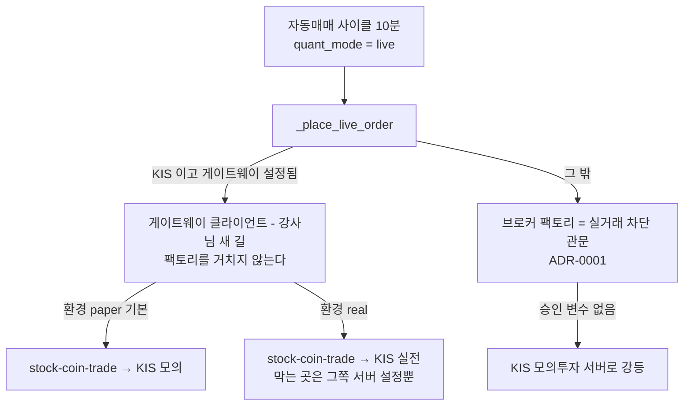

## 강사님 자료 변경 — 2026-10-03 12:28 확인

> **쉬운 요약 3줄**
> 1. 지난 반영(10-02 · th06 `289bfb5`) 뒤로 다섯 곳이 바뀌었다 — **th06 lumina-invest 11커밋**(41파일 · +4,195 / −85 · KIS 실주문 게이트웨이 · 통합 대시보드 · 메뉴 재구성 · 합격 전략 적용 · LEAN 원격 위임) · th03 8커밋(그 게이트웨이의 서버 쪽) · th07 16커밋(KRX 시장 시간 · 배포 · 4일차 산출물 예시) · th01 4커밋(폴더 둘 삭제) · th10 1커밋(`llms.txt`).
> 2. th06 3-way 를 임시 폴더에서 미리 돌려 보니, 우리도 가진 17파일 중 **13파일은 충돌 없이** 합쳐지고 4파일에서 충돌 7곳이 난다(`app.html` 3곳은 서식 차이 탓 — 공백을 접은 토큰으로 보면 실제 변경 10덩어리 중 우리 고침과 겹치는 곳은 2). 새 파일은 24개(앱 9 · 시험 13파일 73건 · 문서 2)다. 데이터 쪽으로는 강사님이 손으로 적은 2026 휴장일 17일이 우리 거래일 달력과 **한 날도 다르지 않다**.
> 3. **충돌 표시 없이 들어오는데 위험한 곳이 둘이다 🔴** — ① 게이트웨이로 가는 KIS 주문은 우리 실거래 차단 관문(팩토리 · ADR-0001)을 거치지 않는다(환경값 `real` 한 줄이면 실전) ② 합친 `auto_trade.py` 가 우리가 09-15 에 지운 `quant_ai_scores`(SageMaker)를 맨 위에서 import 해 앱과 시험이 뜨지 않는다. 둘 다 몇 줄로 막힌다.
>
> **반영 전 — th06 을 이번 세션에 반영할지는 사용자 결정 대기 · 다음 3-way 의 기준은 여전히 `289bfb5`**

- 받아 온 시각: 2026-10-03 12:05 ~ 12:07(사용자) · 스캐너 `python scripts/lecture_scan.py --md`(12:28) · 기준점은 옮기지 않았다(`--update` 안 함).
- 분석 판 고정: Qurious `e63d32f`(main · #96 머지) — 아래 Qurious 코드 링크는 모두 이 판이다. 분석을 시작할 때 작업 트리의 해당 17파일은 이 판과 같았다(분석 중 W5 작업으로 `app/main.py` 에 3줄이 더해졌는데, 그 판으로 다시 돌려도 충돌 0).
- 병합은 임시 폴더에서 `git merge-file -p --diff3` 로만 돌렸다 — 저장소 작업 트리 · 인덱스는 그대로다. 「우리 판」 은 `git show e63d32f:<경로>`(LF)로 꺼냈다. Windows 작업 트리 파일(CRLF)을 그대로 넣으면 17파일이 통째로 충돌로 보인다(처음 한 번 그렇게 나왔다).
- 커밋 작성자 · 이메일은 싣지 않았다. 새로 들어온 줄의 비밀값 모양은 아래 「비밀값 모양」 절(건수와 판정만).

```
 th06 11커밋 · 41파일 · +4,195 / −85                         한 칸 = 바뀐 줄 50
 충돌 없이 합쳐짐 13파일 (설정 · 라우트 · 화면 JS · readme)   ███████████                  +489 / −61
 손으로 합침       4파일 (자동매매 · 모델 · .env · app.html)  ███████████                  +507 / −24
 새 앱 코드        9파일 (게이트웨이 · 자격증명 · 대시보드 …) ███████████████████████      +1,149
 새 시험          13파일 · 73건                               ███████████████████████████  +1,347
 문서              2파일 (계약서 · todo.md)                    ██████████████               +703
 th01 4커밋 −1,883 · th03 8커밋 +2,074 / −11 · th07 16커밋 +2,350 / −28 · th10 1커밋 +32     참고만
```

### Qurious 에 닿는 것 🟡 (제 판단 · 요구 ID 는 [요구 대장](https://github.com/EST-team-project/Qurious/blob/e63d32f/docs/요구사항/요구-대장.tsv))

| # | 강사님이 넣은 것 | 파일 | 닿는 요구 | Qurious 지금 |
|---|---|---|---|---|
| 1 | **KIS 실주문 게이트웨이** — 자동매매의 live 주문을 stock-coin-trade(th03) Open API 로 보낸다. 2단계(승인 토큰 → 주문 · 토큰은 60초 1회용이고 주문 내용에 묶여 수량 · 가격을 못 바꾼다) · 멱등키 `clientOrderId`(같은 키로 다시 보내도 주문은 한 번) · 주문은 다시 보내지 않고 연결이 끊기면 「모름(UNKNOWN)」 으로 두어 체결 조회로 확인 · 지정가는 호가 단위에 맞춤 · `live_orders` 표에 추적 · 2분마다 체결 확인 · N분 미체결 자동 취소(기본 끔) · 비상 정지 때 미체결 취소 | `brokers/stock_coin_trade_gateway.py`(+233) · `auto_trade.py`(+397 / −7) · `models/trading.py` · `0009_live_orders` · `celery_app.py` · `tasks/sync_tasks.py` · 시험 20건 | `P02-⑤-1` · `P02-⑤-2` · `SCH-ORD`(오준영) · `RFP2-4.2-①`(팀) | 게이트웨이 없음 · 실주문은 팩토리 한 곳에서 막는다([`factory.py:78`](https://github.com/EST-team-project/Qurious/blob/e63d32f/app/services/brokers/factory.py#L78)) · 증권사 체결은 `orders` · `order_fills` 로 들여와 비용을 대조한다([`fill_sync.py:86`](https://github.com/EST-team-project/Qurious/blob/e63d32f/app/services/fill_sync.py#L86)) — 받으면 추적표가 둘 → ① · 💬 2 |
| 2 | **실계좌 위험 한도** — live 이고 게이트웨이가 있으면 게이트웨이 잔고로 실계좌 일손실을 따로 재고, 미체결 매수 금액을 종목 비중에 미리 더하며, Redis 가 없으면(쿨다운이 메모리로 떨어지면) 실전 주문은 내지 않는다 | `auto_trade.py` · 시험 `test_risk_guard_boundaries`(4) · `test_quant_cycle_integration`(4) | `P02-⑤-2`(오준영) | 위험 한도는 가상계좌 기준 · 게이트웨이를 안 쓰면 이 코드는 돌지 않는다 |
| 3 | **합격 전략 적용** — 종목 선정 화면에서 domain-rag-lab(th07)이 백테스트로 합격시킨 전략을 고르면, 사이클이 그 스펙(종목 범위 · 최대 종목 수 · 매수 / 매도 임계값 · 진입 / 청산 규칙)으로 신호를 다시 판정한다. LightGBM 가중이 있으면 ML 점수(SageMaker 배치 → 없으면 캔들로 5일 뒤 수익률을 Ridge 회귀) · 직접 선택 종목 최대 10개 · 모르는 코드는 422 | `strategy_loader.py`(+68) · `ml_symbol_score.py`(+93) · `auto_trade.py` · `routes/stocks.py` · `settings.js` · 시험 9건 | `P01-④-2`(강민석) · `P02-①-2` · `P02-①-3`(신장환) | domain-rag-lab 을 안 띄우므로 전략 목록이 비고 지금 규칙대로 돈다 · Ridge 점수는 우리 수집 DB 일봉 2년치(수정주가)를 읽는다([`collector_db.py:74`](https://github.com/EST-team-project/Qurious/blob/e63d32f/app/services/collector_db.py#L74)) |
| 4 | **LEAN 백테스트 원격 위임** — `DOMAIN_RAG_LAB_BASE_URL` 이 있으면 domain-rag-lab `/backtests/run`, 연결 실패 · 5xx 면 로컬로(강사님 결정 L5 — LEAN 정본을 domain-rag-lab 하나로) | `lean_remote.py`(+74) · `routes/lean.py` · 시험 4 | `P02-④-1`(강민석) · `P02-③-2`(이동원) | 설정이 비면 지금과 같다(로컬) |
| 5 | **KIS 자격증명 서버 관리** — KIS 는 사용자가 넣은 키를 저장하지 않고(저장할 때 지운다) 서버가 AWS Secrets Manager → `.env`(`KIS_APP_KEY` …) 순으로 읽는다 · 화면에는 연동 여부 · 계좌 마스킹 · 환경만 | `kis_credentials.py`(+188) · `routes/stocks.py`(+150 / −32) · `settings.js` · `config.py` · `.env.example` · 시험 12(자격증명 10 · 레거시 주문 2) | `P02-⑤-1`(오준영) · AWS 제외 | 사용자가 설정 화면에 자기 KIS 키를 넣는다 · [`.env.example:87`](https://github.com/EST-team-project/Qurious/blob/e63d32f/.env.example#L87) 의 `KIS_APP_KEY` 는 지금 서버가 읽지 않는다 → ④ · 💬 1 |
| 6 | **통합 대시보드** — 로그인 첫 화면이 「투자 대시보드」: 사이트별 현재 투자액 탭(KIS 모의 · 퀀트 가상계좌 · 모의투자 · 미국주식 — 탭 하나가 실패해도 나머지는 보인다) · 「KIS 모의투자 시작」 원클릭(경로가 모의일 때만 · 권장 한도 저장 + 자동매매 켬) · 기본 전략 성능 | `routes/dashboard.py`(+156) · `kis_quickstart.py`(+139) · `js/dashboard.js`(+146) · `app.html` · `main.js` · 시험 20건 | `U9`(강민석) · `U10`(오준영) | 첫 화면은 「AI 투자 상담」([`main.js:59`](https://github.com/EST-team-project/Qurious/blob/e63d32f/public/js/main.js#L59)) · 대시보드 화면 없음(화면 요청 ④) → 💬 3 |
| 7 | **메뉴 구조** — 위 메뉴(GNB) 탭 9개를 로보 어드바이저 · 투자 인디케이터 2개로 줄이고, 나머지 묶음은 「더보기」 서랍 안 펼침 목록(`<details>`)으로 — `GNB_MENUS` 에서 자동으로 만든다 · Esc 로 닫기 · 포커스 돌려주기 | `app.html` · `core.js`(+39 / −6) · `app.css` | IA · 화면 설계(팀) | 위 메뉴 9개(10-02 에 「크롤링」 → 「데이터」 · [`app.html:46`](https://github.com/EST-team-project/Qurious/blob/e63d32f/public/app.html#L46)) · 더보기는 고정 항목 넷([`app.html:92`](https://github.com/EST-team-project/Qurious/blob/e63d32f/public/app.html#L92)) → ③ · 💬 3 |
| 8 | **KRX 장 시간 · 2026 휴장일 17일** — 장 밖(평일 09:00 ~ 15:30 KST · 휴장일)이면 실주문을 보내지 않는다(가상 체결은 그대로) · 시험 3건 | `stock_coin_trade_gateway.py` 의 `KRX_HOLIDAYS_2026` · `test_stock_coin_trade_gateway.py` | `P01-①-4`(이동원) | 우리 달력과 2026 평일 휴장 17일이 같다 · 2027 은 우리만 있다 → 「데이터 파트」 절 |
| 9 | 문서 — 세 저장소 API 계약서 v0.5(th03 · th06 · th07 사본이 바이트까지 같다) · 작업 기록 `todo.md`(운영 서버 · 배포 런북 · 의사결정 L1 ~ L13) | `docs/contracts/kis-autotrade-api.md`(+160) · `todo.md`(+543) | — | 계약서는 게이트웨이를 받을 때 같은 경로로 받는다 · `todo.md` 는 뺀다(운영 서버 주소 · AWS 계정 번호 — 「비밀값 모양」) |
| 10 | th03 — 게이트웨이 서버 쪽(`/openapi/v1/kis/*` · 승인 토큰 · 멱등 · 권한 `api_key.scopes` · 실전 가드 세 겹) | th03 `kis_autotrade.py`(+714) · `openapi_kis.py`(+127) · 시험(+349) | `P02-⑤-1` · `P02-⑤-2`(오준영) | 참고 — 아래 |
| 11 | th07 — KRX 주식 시장 시간 · 2025 ~ 2026 휴장(LEAN 참조 자료) · 전략 스펙 API · 4일차 산출물 예시 13종 · 배포(AWS · CI) | th07 | `P02-③-2`(이동원) · `P02-④-1`(강민석) · 산출물 | 참고 — 아래 |
| 12 | th01 · th10 — 폴더 둘 · 과정 소개 다섯 절 삭제 / `llms.txt` | — | — | Qurious 에서 가리키는 곳 0 — 영향 없음 |

### th06 3-way 를 미리 돌려 본 결과 (기준 `289bfb5` · 강사님 `9478811` · 우리 `e63d32f`)

「충돌」 은 `git merge-file` 이 멈춘 곳 수다. 0 이어도 아래 ① ~ ⑤ 처럼 뜻이 어긋날 수 있다.

| 파일 | 강사님 | 충돌 | 우리 고침과 | 제안 🟡 |
|---|---|---|---|---|
| `app/services/auto_trade.py` | +397 / −7 | 2 | import 한 줄 · 실주문 클라이언트의 `paper=` — 우리 `not live_trading_allowed()`([`auto_trade.py:260`](https://github.com/EST-team-project/Qurious/blob/e63d32f/app/services/auto_trade.py#L260)) ↔ 강사님 `paper`(자격증명의 환경) | `paper=paper or not live_trading_allowed()` — 우리 줄만 두면 승인된 날 모의 키로 실전 서버를 부른다(거절됨) · 단 ① ② |
| `app/models/trading.py` | +40 / −1 | 1 | import 한 줄(`DateTime` ↔ `Text`)뿐 — 팀원이 바꾼 `Portfolio.user_id`(CASCADE · 색인 · [`trading.py:23`](https://github.com/EST-team-project/Qurious/blob/e63d32f/app/models/trading.py#L23))와 안 겹친다 | 둘 다 넣기 · `LiveOrder` · `BrokerSettings` 두 칸은 그대로 |
| `.env.example` | +12 | 1 | 우리가 지운 AWS 줄 자리 | `KIS_ENVIRONMENT=paper` 한 줄만 · Secrets Manager 두 줄 빼기 · 키 세 줄은 ④ |
| `public/app.html` | +58 / −16 | 3 | 서식 차이 탓 — 팀원 자동 서식이 남아 있다(기준 → 우리: 그냥 보면 +2,733 / −2,157 · 공백을 무시하면 +815 / −239) | 아래 토큰 비교 — 실제 변경 10덩어리 · 겹침 2 |
| `public/js/core.js` | +39 / −6 | 0 | 다른 자리 — 이 파일은 지금 자동 서식이 없다(공백 무시 diff 와 그냥 diff 가 같다 · +82 / −9) | 그대로 · 단 ③ |
| `app/routes/stocks.py` | +150 / −32 | 0 | 다른 자리(우리 비용 모델 · 수집 DB 다리 · 라우트 캐시) | 그대로 · 단 ① 의 화면 표시 · 💬 1 |
| `app/config.py` | +28 | 0 | 다른 자리(우리 쪽엔 AWS 칸이 없다) | 그대로 · Secrets Manager 두 칸은 「비워 두는 칸」 으로(시험 고정 장치가 이 이름을 쓴다) |
| `app/main.py` · `celery_app.py` · `models/__init__.py` | +3 · +5 · +6 | 0 | 다른 자리 | 그대로 — 2분 체결 확인 작업은 게이트웨이가 없으면 바로 끝난다(Redis · DB 연결만 열고 닫음 🟢) |
| `public/js/main.js` | +4 / −1 | 0 | 다른 자리 — 우리 시작 처리(401 만 로그인 화면)와 안 겹친다 | 그대로 — 첫 화면이 `dashboard` 로 바뀐다(💬 3) |
| `routes/lean.py` · `notification.py` · `tasks/sync_tasks.py` · `css/app.css` · `js/settings.js` | +5 / −2 · +22 · +22 · +46 / −2 · +150 / −18 | 0 | 우리가 안 고친 파일 — 결과 = 강사님 판 | 그대로 |
| `readme.md` | +9 | 0 | 끝에 붙는 절 | 받되 `todo.md` 링크 · `.venv/bin/python` 시험 줄은 우리 것으로 |
| 새 앱 코드 9 | +1,149 | — | 없음 | `0009_live_orders` 는 번호 바꾸기(아래) · `kis_credentials.py` 는 Secrets Manager 갈래(boto3)를 빼고 `.env` 갈래만 |
| 새 시험 13파일 73건 | +1,347 | — | 이름이 우리 시험과 안 겹친다 | 64건 그대로 · AWS · SageMaker 에 기댄 9건(자격증명 5 · 대시보드 1 · 원클릭 1 · 레거시 주문 1 · ML 배치 점수 1)은 `.env` 갈래로 고치거나 빼기 |

- 문서 2: 계약서는 받고 `todo.md` 는 뺀다. 그 밖에 AWS 를 손보는 곳은 넷뿐이다 — `kis_credentials` 의 Secrets Manager 갈래(빼기) · `config` 두 칸(남기되 비워 둠) · `.env.example` 두 줄(빼기) · `auto_trade` 의 SageMaker import(빼기 — ②). 이번 묶음에 CI 워크플로는 없다.
- 「Secrets Manager 갈래까지 그대로 받기」(잠든 코드 — 칸을 비워 두면 boto3 를 부르지 않는다)도 된다. 시험 손질이 1건으로 줄고 다음 반영 때 충돌이 적지만, AWS 코드가 남는다 — 지난 방침(09-15 AWS 걷어냄)대로라면 빼는 쪽이다.

`app.html` 토큰 비교 — 공백 · 줄바꿈을 접고 태그와 낱말로 잘라 비교했다(기준 6,956 · 강사님 7,155 · 우리 7,474 토큰). 12덩어리 중 주석만 바뀐 2를 빼면 실제 변경 10.

| 덩어리 | 강사님이 바꾼 것 | 우리 판 같은 자리 |
|---|---|---|
| 1 | 로고 주소 `/` → `/app.html#dashboard` | 안 겹침 |
| 2 · 3 | 위 메뉴 탭 9개 → 2개(크롤링 · 직접매매 · 모의투자 · 퀀트자동매매 · 미국주식 · ML · 투자분석을 뺌) | **겹침** — 우리 「데이터」 탭(옛 크롤링 · 10-02 화면 결정 ①). 탭이 없어져도 이름은 `core.js` 묶음 이름([`core.js:23`](https://github.com/EST-team-project/Qurious/blob/e63d32f/public/js/core.js#L23))에 남아 더보기에 「데이터」 로 뜬다 |
| 4 · 5 | 주석 둘 | — |
| 6 | 더보기 안 고정 항목(금융 지식 · 시스템) → 빈 `<nav id="gnb-offcanvas-nav">`(JS 가 채운다) | **겹침** — 우리가 넣은 고정 항목 「개념 학습」 · 「내 계정」([`app.html:92`](https://github.com/EST-team-project/Qurious/blob/e63d32f/public/app.html#L92) · [`:94`](https://github.com/EST-team-project/Qurious/blob/e63d32f/public/app.html#L94)). 강사님 방식이면 `GNB_MENUS` 에서 저절로 생기므로 고정 항목은 지운다(단 ③) |
| 7 | 「투자 대시보드」 화면 통째(199토큰) | 안 겹침 |
| 8 ~ 12 | 자동매매 설정 — 칸 3열 · 실주문 경로 안내 · 「전략(백테스트 합격분)」 고르기 · KIS 서버 관리 안내 칸 · 사이클 상태 · KIS 실주문 현황 | 안 겹침 |

`core.js` 토큰 비교(기준 5,650 · 강사님 5,998 · 우리 6,885) — 11덩어리 · 기능으로 묶으면 넷(로보 어드바이저 메뉴 맨 앞 「통합 대시보드」 · 더보기를 `GNB_MENUS` 로 만들기 · `navigate()` 의 더보기 강조 · `GNB_MENUS` 내보내기). 글자로 겹치는 곳은 0 — 뜻은 ③.

### 조용히 합쳐지지만 위험한 곳

**① 실거래 차단에 두 번째 출구가 생긴다 🔴**



- 지금 우리 실주문은 모두 팩토리 한 곳을 지난다 — 승인 변수 `QURIOUS_ALLOW_LIVE_TRADING` 이 없으면 `paper=False` 요청을 모의로 내린다([`factory.py:78`](https://github.com/EST-team-project/Qurious/blob/e63d32f/app/services/brokers/factory.py#L78) · [ADR-0001](https://github.com/EST-team-project/Qurious/blob/e63d32f/docs/ADR/ADR-0001-실거래-주문-경로-차단.md)). 강사님 새 길은 `get_broker_client` 를 부르지 않고 HTTP 로 stock-coin-trade 에 주문하므로 이 관문을 지나지 않는다. 실전 · 모의는 `STOCK_COIN_TRADE_KIS_ENVIRONMENT`(기본 `paper`) 하나가 정한다.
- 지금 당장 나가지는 않는다 — `.env.example` 에 `STOCK_COIN_TRADE_*` 칸이 없어 누가 일부러 켜지 않는 한 잠들어 있고, th03 서버에도 `KIS_REAL_ORDER_ENABLED=false` 가 있다. 그래도 남의 서버 설정에 기대는 것이고, ADR-0001 이 지키려던 「앞으로 생길 경로까지 한 곳에서」 가 깨진다.
- 고칠 곳(제안 · 두세 줄): 게이트웨이 모듈의 `environment()` 와 `build_intent()` 에서 `real` 이면 `live_trading_allowed()` 를 보고, 승인이 없으면 `paper` 로 내리며 경고 로그를 남긴다 — 주문 · 잔고 · 취소가 모두 이 둘을 지나므로 한 곳이다. 시험 1건 「승인 없이 환경 `real` → 주문 본문의 `environment` 가 `paper`」 를 [`test_live_trading_guard.py`](https://github.com/EST-team-project/Qurious/blob/e63d32f/tests/test_live_trading_guard.py#L30) 에 더한다.
- 같은 김에: 게이트웨이가 없을 때 종목 선정 화면 표시(`_live_gateway_info`)가 `environment: "real"` 을 보낸다 — 우리 팩토리가 모의로 내리므로 거짓 표시가 된다 → 승인일 때만 `real`.

**② 합치면 앱이 뜨지 않는다 🔴**
- 합친 `auto_trade.py`(임시 결과 33줄)에 `from app.services.quant_ai_scores import get_batch_training_scores` 가 충돌 표시 없이 들어온다. 이 파일은 SageMaker 배치 점수를 S3 에서 읽는 모듈이라 우리가 09-15 에 AWS 를 걷어낼 때 지웠다(`2e2d3f8`).
- `app.main` → `routes/stocks.py` → `auto_trade.py` 로 이어져 앱과 Celery 작업(`tasks/sync_tasks.py`)이 `ImportError` 로 멈춘다. 시험은 우리 2파일(`test_paper_ledger_i14` · `test_route_cache_df17` — 모으기 단계)과 실거래 차단 시험 1건(`auto_trade` 소스 검사), 새 시험 9파일이 그 import 에서 멈춘다.
- 고칠 곳: `ml_scores_by_symbol()` 을 「배치 점수 없음 → 빈 dict」 로 두고 import 를 뺀다 — ML 가중은 캔들 Ridge 점수(`symbol_ml_score`)만 쓰게 된다. 시험 `test_ml_scores_by_symbol_normalizes_and_aliases` 1건은 빼거나 「늘 빈 값」 으로 고친다(위 9건에 셈).

**③ 더보기 서랍이 우리 메뉴 모양을 모른다 🟡**
- 강사님 더보기는 `GNB_MENUS` 항목을 전부 `<button data-menu-view=key>` 로 만든다. 우리 메뉴에는 두 모양이 더 있다 — 「금융 필수 지식」 의 소제목 셋(`{ heading: "강의" }` 등 · [`core.js:111`](https://github.com/EST-team-project/Qurious/blob/e63d32f/public/js/core.js#L111))과 「개념 학습」 의 바깥 주소 셋(`href: "/learn/…"` · [`core.js:133`](https://github.com/EST-team-project/Qurious/blob/e63d32f/public/js/core.js#L133)). 합치면 소제목은 글자 「undefined」 단추 셋이 되고, 개념 학습 셋은 `navigate()` 로 가서 열리지 않는다.
- 고칠 곳: 더보기를 만드는 줄에 우리 `renderLnb` 와 같은 두 갈래(`heading` → 소제목 · `href` → 링크 · [`core.js:434`](https://github.com/EST-team-project/Qurious/blob/e63d32f/public/js/core.js#L434) · [`:443`](https://github.com/EST-team-project/Qurious/blob/e63d32f/public/js/core.js#L443))를 넣는다. 더보기 묶음은 우리 메뉴 13개 중 11개가 된다.
- 데이터 배지(위 메뉴 오른쪽 `gnb-right` 에 붙는다)는 강사님 판에도 그 자리가 있어 그대로다.

**④ `.env.example` 의 키 세 줄이 두 번 🟡**
- 강사님 판에는 `KIS_APP_KEY` · `KIS_APP_SECRET` · `KIS_ACCOUNT_NO` 가 82줄과 143줄에 두 번 있다(옛 「증권사 Open API」 칸 + 새 「서버 관리」 칸). 이제 서버가 이 이름을 읽는데(`config.py` 새 칸), 같은 이름이 두 번이면 뒤 줄이 앞 줄을 덮는다(python-dotenv · compose 의 `env_file` 도 그렇게 안다 🟡) — 앞 칸에 키를 넣고 뒤 칸을 비워 두면 서버는 「키 없음」 으로 본다.
- 제안: 우리 판에는 한 번만([`.env.example:87`](https://github.com/EST-team-project/Qurious/blob/e63d32f/.env.example#L87)) 두고 「서버가 읽는다 · KIS 를 고른 모든 사용자가 이 계좌를 쓴다」 를 적는다. `KIS_PAPER=true`([`:91`](https://github.com/EST-team-project/Qurious/blob/e63d32f/.env.example#L91))는 서버가 안 읽고 새 `KIS_ENVIRONMENT` 와 이름이 갈린다 — 하나로.

**⑤ 받으면 달라지는 것**
- 첫 화면: `main.js` 기본 화면 `agent-chat` → `dashboard`(충돌 없이 들어옴) → 💬 3 🟡
- KIS 사용자 키: 설정을 저장하면 KIS 행의 키 · 계좌가 지워지고, KIS 연동은 서버 키만 본다 → 💬 1 🟡
- 대시보드 「기본 전략 성능」 은 `cost_bps=10&slippage_bps=0` 을 보내 우리 `/quant/pipeline` 이 flat 비용으로 계산한다([`stocks.py:872`](https://github.com/EST-team-project/Qurious/blob/e63d32f/app/routes/stocks.py#L872) — Qurious 기본 `real` 이 아님 · D4 ①) 🟢
- `kis_credentials.status()` 는 자격증명이 없을 때 `environment` 칸에 글자 대신 참 / 거짓을 넣는다(화면 표시만 · 작은 버그) 🟢

### 마이그레이션 번호 — 강사님 `0009_live_orders`

- 강사님 파일: revision `"0009"` · down_revision `"0008"`(강사님의 0008 = `formula_indicators`). 하는 일: 표 `live_orders`(유일 키 `client_order_id` · 색인 `user_id, status`) + `broker_settings` 두 칸(`quant_strategy_id` · `quant_strategy_version`).
- 우리: `0009` 는 이미 `formula_indicators`다([`0009_formula_indicators.py:14`](https://github.com/EST-team-project/Qurious/blob/e63d32f/alembic/versions/0009_formula_indicators.py#L14) — 09-30 에 우리 `0003_trading_cost` 가 끼어 한 칸씩 밀렸다). 지금 머리는 하나, `17e868117893`(합치기 판 · #96 · [`:15`](https://github.com/EST-team-project/Qurious/blob/e63d32f/alembic/versions/17e868117893_merge_backup_chain_into_main.py#L15)).
- 제안 🟡 「우리 것 먼저 · 강사님 것은 뒤로」: 파일 이름 · revision 을 그때 비어 있는 다음 번호(지금 `0013`)로, down_revision 을 그때의 `alembic heads`(지금 `'17e868117893'`)로. 내용은 그대로.
- #88 확인 댓글의 `portfolio` 외래키(CASCADE) 마이그레이션이 먼저 들어가면 이 파일이 `0014` 다. `alembic check` 는 그 외래키 때문에 지금도 실패하므로, 이 파일은 `upgrade head → downgrade -1 → upgrade head` 왕복으로 확인한다.
- 탈퇴: `live_orders.user_id` 는 `users.id` 외래키라 우리 탈퇴 코드가 모델에서 표를 찾아 함께 지운다([`account.py:251`](https://github.com/EST-team-project/Qurious/blob/e63d32f/app/services/account.py#L251)) 🟢

### 데이터 파트(이동원)에 닿는 것 — KRX 휴장일 · 장 시간 (th06 `7a12cba` · th07 `896c867`)

| 견줄 것 | th06 게이트웨이 | th07 LEAN 참조 자료 | Qurious 거래일 달력 |
|---|---|---|---|
| 휴장일을 어디서 | 2026 한 해를 손으로 적음(웹 일정 두 곳과 대조) + `KRX_EXTRA_HOLIDAYS` 로 덧붙임 | 2025 · 2026 을 손으로 | 천문연 특일 정보 + 거래소 규칙 둘(5-1 · 연말 휴장 — [`rule_reason`](https://github.com/EST-team-project/Qurious/blob/e63d32f/collector/market_calendar.py#L230) · [`year_end_closure`](https://github.com/EST-team-project/Qurious/blob/e63d32f/collector/market_calendar.py#L222)) · 지난날은 시세로 확인 |
| 2025 평일 휴장 | — | 19일 | 19일 — **같다** |
| 2026 평일 휴장 | 17일 | 17일 | 17일 — **세 쪽이 한 날도 다르지 않다** |
| 2027 | 없음 — 2027-01-01 부터 평일은 모두 장이 열린 날로 본다 | 없음 | 평일 휴장 16일(특일 정보 2027 발표분) |
| 장 시간 | 09:00 ~ 15:30 고정 | 장전 08:30 · 정규장 09:00 ~ 15:30 · 장후 15:40 ~ 18:00 | 날만 다루고 시간은 안 다룬다 |
| 개장이 늦는 날(새해 첫 거래일 · 수능일 10:00) | 모름 | 모름(`earlyCloses` 빈칸 · 늦은 개장 칸 없음) | 모름 — 「하지 않는 것」 에 적어 둠([`market_calendar.py:54`](https://github.com/EST-team-project/Qurious/blob/e63d32f/collector/market_calendar.py#L54)) |
| 처음 판 | 14:10 판은 09-28 을 휴장으로 넣고 07-17 을 빠뜨렸다 → 15:03 에 웹 일정과 대조해 고침 | — | 07-17 휴장 · 09-28 거래를 시세로 확인(2020-01-02 ~ 2026-09-30 거래일 1,655일 · 어긋남 0) |

- 제안 🟡(반영할 때 · 내 영역): 게이트웨이의 `is_krx_market_open()` 이 날짜 판정을 우리 달력([`market_calendar.trading_days`](https://github.com/EST-team-project/Qurious/blob/e63d32f/app/services/market_calendar.py#L78) — 수집 DB 읽기 전용)에 묻고, 달력을 못 읽을 때만 내장 2026 표로 떨어지게 한다. 시간 판정(09:00 ~ 15:30)은 그대로. 2027-01-01 전에 필요하다 — 그대로 두면 새해 첫날(금)과 설(02-08 · 02-09)에 「장 밖 주문 막기」 가 듣지 않는다(증권사가 거절은 하겠지만 그 앞의 장치가 빈다).
- 3차 ③ LEAN 교차 검증(`P02-③-2`) 때 th07 의 KRX 휴장 목록을 손으로 늘리지 말고 우리 달력에서 2020 ~ 2027 을 뽑아 넣는다.
- 개장 지연(새해 첫 거래일 2027-01-04 · 수능일 10:00 개장)은 세 쪽 모두 없다 — 장 시간을 보는 코드가 생겼으니 일정 종류로 더하는 순서를 당길 만하다.
- 수집 쪽: `ml_symbol_score` 가 우리 수집 DB 일봉 2년치를 읽는다(마지막 행은 전 거래일 · 12:30 갱신) 🟢 고칠 것 없음.

### 팀이 정할 것 💬

1. **KIS 키를 사용자별로 둘지, 서버 계좌 하나로 둘지** — 강사님(혼자 운영하는 사이트)은 서버 계좌 하나다. Qurious 는 여러 사람이 쓰는 모의투자 플랫폼이라 그대로 받으면 KIS 를 고른 사람 모두의 live 주문이 서버 계좌 하나로 모여 포지션이 섞이고, 대시보드 KIS 탭은 모두에게 같은 잔고를 보이며, 설정을 저장할 때 각자 넣어 둔 KIS 키가 지워진다. 강사님도 같은 질문을 열어 두었다(`todo.md` L11 「원클릭을 모든 로그인 사용자에게 보일지, 운영 계정만인지」). 제안 🟡 코드는 받되(기초 코드 원칙) 서버 계좌 경로는 관리자 한 명에게만 열고, 「사용자별 키」 는 「나만의」 방향 후보로 논의 초안 — `P02-⑤-1`(오준영) 담당이 볼 일.
2. **실주문 추적을 한 표로 둘지** — 강사님 `live_orders`(게이트웨이 주문 · 2분 체결 확인)와 우리 `orders` + `order_fills`(증권사 체결 들여오기 · 비용 대조). 게이트웨이를 안 띄우는 동안 `live_orders` 는 빈 표로 남는다. 제안 🟡 둘 다 받고, 잇는 방법은 `P02-⑤`(오준영) · 체결(`P01-④-3` 강민석)이 정한다.
3. **첫 화면과 메뉴** — 강사님 「대시보드 첫 화면 + 위 메뉴 2개 + 더보기 펼침 목록」 을 따를지. 화면 요청 ④(대시보드) · IA v0.3 · 「데이터」 관제 자리(10-02 화면 결정 ①)가 같이 움직인다. 제안 🟡 따른다(기초 코드 원칙) — 「데이터」 는 더보기 묶음 이름으로 남는다.

### th03 · th07 · th01 · th10 — 참고

**th03 stock-coin-trade** — 8커밋 · 19파일 · +2,074 / −11 ([2f52db5](https://github.com/edumgt/stock-coin-trade/commit/2f52db5) … [e55bfd7](https://github.com/edumgt/stock-coin-trade/commit/e55bfd7))
- th06 게이트웨이의 서버 쪽 — `/openapi/v1/kis/order-approval` · `orders` · `orders/{orderNo}` · `balance`(`openapi_kis.py` +127 · `kis_autotrade.py` +714 · 시험 +349). 승인 토큰은 API 키 + 주문 내용 다이제스트에 묶어 DB 에 두고, 멱등은 (환경, `clientOrderId`) 유일 키로 지킨다. 권한은 `api_key.scopes` 의 `kis:order` 하나로 모았다(환경변수 화이트리스트 폐기 · `d7cda66`).
- 실전 가드가 세 겹이다 — `KIS_REAL_ORDER_ENABLED=false`(기본) · 계좌 주인 이메일 일치 · 허용 종목(선택) + 회당 금액 · 수량 한도. 우리 실거래 차단(승인 변수 하나)보다 촘촘하다 → `P02-⑤-2`(오준영)의 「나만의」 안전장치 본보기로 참고 🟡.
- 그 밖: `database/db.sql` +48(주문 · 승인 표 · `scopes` 칸) · `docker-compose.override.yml`(로컬에서 lumina 와 같은 도커 망) · 계약서 · `todo.md`. 가져오지 않는다 — Qurious 는 이 서버를 띄우지 않는다.

**th07 domain-rag-lab** — 16커밋 · 59파일 · +2,350 / −28
- [`896c867`](https://github.com/edumgt/domain-rag-lab/commit/896c867) KRX 주식(`Equity-krx`) 시장 시간 · 심볼 속성 · 샘플 전략 `sample_ma_cross_kr_v1.json` · 시험 2. 휴장은 위 「데이터 파트」 절에 적은 대로 우리 달력과 같다. 심볼 속성의 최소 호가가 1원 고정이다(실제 KRX 호가 단위는 가격대별 1 ~ 1,000원 — th06 게이트웨이는 이것을 맞춘다). 선물 · 지수 항목에는 `7/17/2026` 이 두 번 들어갔다(해는 없음). 우리 `lean_reference_data` 에는 `Equity-krx` 가 없지만, 우리 LEAN 실행은 사용자 정의 자료(`add_data` · [`lean_backtest.py:566`](https://github.com/EST-team-project/Qurious/blob/e63d32f/app/services/lean_backtest.py#L566))라 이 항목을 바로 읽지 않는다 🟡(코드 읽기).
- [`4e76d4f`](https://github.com/edumgt/domain-rag-lab/commit/4e76d4f) 전략 스펙 API(`/backtests/strategies` · 판 · 다시 검증) — th06 `strategy_loader` 가 받는 쪽.
- [`4ce3bfe`](https://github.com/edumgt/domain-rag-lab/commit/4ce3bfe) 4일차 「산출물 예시」 — 일정표의 산출물 이름을 누르면 비슷한 공개 산출물 그림(프로젝트 헌장 · WBS · 칸반 · 백테스트 · 성과지표 · 코드 · CI/CD · Swagger · 아키텍처 · 요구사항 · 실험 보고서 · 디자인 시스템 · SHAP 13종)을 출처와 함께 띄운다. 그림은 외부 사이트 캡처(「권리는 원저작자」 표기)라 들이지 않고, 종류 목록만 `docs/산출물목록.md` 와 대조할 거리 🟡. 지금 th07 에는 그 단추(`data-deliverable-example`)를 만드는 코드가 없어 실제로는 열리지 않는다.
- Walk-Forward 단독 화면(`c37ff42`) · 배포 7커밋(`deploy/` · CloudFront · ACM · EC2 · DNS · `.github/workflows/` — AWS · CI 라 제외) · 계약서 · `todo.md`. `rag-lab/` 사본은 건드리지 않았다.

**th01 investment-analysis** — 4커밋 · 16파일 · −1,883: `6-1-rst/`(3) · `6-2-rst/`(11 — 리포트 스크립트 · JSON) · `image.png` 삭제 · readme 의 과정 소개 다섯 절(투자분석 기초 80시간 … 투자 인디케이터 120시간) 삭제. Qurious 에서 `6-1-rst` · `6-2-rst` · 그 `image.png` 를 가리키는 곳은 0건(검색)이다. Qurious 가 읽는 th01 문서(`docs/voca.md` · `docs/03.md` 등)는 그대로 있고, 과정 소개 다섯 절은 우리 readme 에 사본이 있다. (덧: 강의 목록 `manifest.json` 이 출처로 적은 `docs/10.md` 는 이번 변경 전부터 th01 에 없다 — 이번과 무관.)

**th10 stock-ml-dl-project** — 1커밋 `ef0240e` · `llms.txt` +32(사이트 안내 · LLM 용). 할 일 없음.

### th06 반영 품 어림 (한 세션 = 2 ~ 3시간)

| 덩어리 | 손볼 것 | 어림 |
|---|---|---|
| 백엔드 | `auto_trade.py` 충돌 2 · ② 한 줄 · ① 가드 + 시험 1 · `kis_credentials.py` Secrets Manager 갈래 · `config.py` · `.env.example`(④) · `trading.py` import · 마이그레이션 번호 + 왕복 · 새 파일 8 | 1 세션 |
| 시험 | 새 73건(9건 손질) · 우리 기존 시험 전부 · 점검 스크립트 | 위 세션 안 |
| 화면 | `app.html` 10덩어리(겹침 2 — 공백 접은 토큰 비교로 손으로 얹기) · `core.js` 더보기 두 갈래(③) · 첫 화면 · 대시보드 · 설정 화면 · 개발 모드로 눈 확인 | 0.5 ~ 1 세션 |
| 합계 | | **1.5 ~ 2 세션(3 ~ 5시간)** · 💬 결정이 늦으면 화면 덩어리를 뒤로 미룰 수 있다 |

### 비밀값 모양 (새로 들어온 줄 · 값은 옮기지 않음)

| 곳 | 건수 | 무엇 | 판정 |
|---|---|---|---|
| th06 | 13 | 공인 IP 6 · AWS 계정 번호 모양 12자리 3 · 이메일 2 · ARN 안의 `secret:` 경로 1 — 모두 `todo.md` / 12자리 1건은 시험의 주문 ID 시각 | 🟡 `todo.md` 의 IP 는 운영 서버 · 12자리는 실제 AWS 계정으로 보인다(키 파일 이름 · 접속 명령도 있다 — 키 내용은 없음) → 가져오지 않는다 · 이메일 둘은 시험 계정(`test.com` · 더미) 🟢 · 시험 값 🟢 |
| th03 | 9 | 공인 IP 5 · 이메일 1(`todo.md` · 더미로 보임) · `example.com` 3(시험) | 🟡 IP 는 운영 서버 · 나머지 🟢 |
| th07 | 24 | 공인 IP 20 · 사설 · 예약 IP 2 · AWS 계정 번호 모양 12자리 2(IAM 역할 · ACM 인증서 ARN) — `deploy/` 19 · `todo.md` 5 | 🟡 운영 서버 · 실제 계정으로 보인다 → 배포 폴더는 원래 제외 대상 · 사설 IP 🟢 |
| th10 · th01 | 0 | — | 🟢 |
| 다섯 곳 모두 | 0 | 클라우드 키(AKIA · ASIA) · 개인키 머리 · 토큰(ghp_ · sk- · JWT 꼴) | 🟢 |

### 스캐너 출력 (12:28 · `--md` · 기준점은 그대로)

| 폴더 | 원본 | 지금 끝 | 상태 |
|---|---|---|---|
| th01-investment-analysis | `edumgt/investment-analysis` | `12f423d` 2026-10-02 17:37 | **4커밋** (`2cb9b7f` 부터) |
| th03-stock-coin-trade | `edumgt/stock-coin-trade` | `e55bfd7` 2026-10-02 15:28 | **8커밋** (`2798f72` 부터) |
| th06-lumina-invest | `edumgt/lumina-invest` | `9478811` 2026-10-02 16:06 | **11커밋** (`289bfb5` 부터) |
| th07-domain-rag-lab | `edumgt/domain-rag-lab` | `241157c` 2026-10-02 17:49 | **16커밋** (`7ea4940` 부터) |
| th10-stock-ml-dl-project | `edumgt/stock-ml-dl-project` | `ef0240e` 2026-10-02 17:46 | **1커밋** (`09b5823` 부터) |
| 나머지 18곳(th02 · th05 · th08 · th09 · th11 ~ th24) · th04 | — | — | 변화 없음 · th04 는 lecture 없음 |

#### th06-lumina-invest — 11커밋 (`289bfb5` → `9478811` · 41 files changed, 4195 insertions(+), 85 deletions(-))

비교: https://github.com/edumgt/lumina-invest/compare/289bfb5...9478811

| 커밋 | 시각 (KST) | 제목 |
|---|---|---|
| [`156d5c0`](https://github.com/edumgt/lumina-invest/commit/156d5c0) | 10-02 10:00 | 로그인 후 통합 대시보드 뷰 추가 및 GNB 더보기 오프캔버스를 메뉴 그룹 기반으로 재구성 |
| [`66d408c`](https://github.com/edumgt/lumina-invest/commit/66d408c) | 10-02 12:49 | KIS 자동매매 연동 API 계약 문서 및 TODO 추가 |
| [`bb19ae5`](https://github.com/edumgt/lumina-invest/commit/bb19ae5) | 10-02 14:10 | feat: Implement stock-coin-trade KIS automated trading gateway client |
| [`7a12cba`](https://github.com/edumgt/lumina-invest/commit/7a12cba) | 10-02 15:03 | Add tests for KRX holidays, integrate ML symbol scoring, and enhance risk guard functionality |
| [`9f5e3ea`](https://github.com/edumgt/lumina-invest/commit/9f5e3ea) | 10-02 15:13 | feat(lean): LEAN 백테스트를 domain-rag-lab /backtests/run 으로 위임하고 실패 시 로컬 폴백 (정본 일원화 결정 L5/R1) |
| [`fc6baa7`](https://github.com/edumgt/lumina-invest/commit/fc6baa7) | 10-02 15:13 | docs: 계약서 v0.5, todo 5차 작업·의사결정 7절·Testbed 자동매매 가동 기록 |
| [`c014c95`](https://github.com/edumgt/lumina-invest/commit/c014c95) | 10-02 15:15 | docs(todo): Testbed 첫 자동 주문 미체결 기록, 의사결정 L9(지정가 체결 프리미엄) 추가 |
| [`9edc350`](https://github.com/edumgt/lumina-invest/commit/9edc350) | 10-02 15:28 | docs(todo): 운영 배포 8절 — fd/pr 배포 결과, st 서버 배포·API 키 발급 런북, 푸시 절차 |
| [`ba9c240`](https://github.com/edumgt/lumina-invest/commit/ba9c240) | 10-02 15:50 | feat(kis): KIS 자격증명 Secrets Manager 서버 관리 + 대시보드 「KIS 모의투자 시작」 원클릭 |
| [`333badc`](https://github.com/edumgt/lumina-invest/commit/333badc) | 10-02 15:52 | docs(todo): 6-7 KIS 모듈 fd 배포 결과·Secrets Manager 권한 미설정 기록 |
| [`9478811`](https://github.com/edumgt/lumina-invest/commit/9478811) | 10-02 16:06 | feat(dashboard): 투자 사이트별 현재 투자액 탭(KIS 모의투자 첫 탭) + 연동·매도 점검 기록 |

`156d5c0` 이 Windows 에서 만들 수 없는 찌꺼기 파일 `public/js/common.js:RVContext`(60바이트)를 또 넣었다가 `9478811` 에서 지웠다 — 끝 판에는 없다(지난번과 같은 일).

#### th03-stock-coin-trade — 8커밋 (`2798f72` → `e55bfd7` · 19 files changed, 2074 insertions(+), 11 deletions(-))

| 커밋 | 시각 (KST) | 제목 |
|---|---|---|
| `2f52db5` | 10-02 12:49 | Add initial TODO documentation for KIS automated trading integration |
| `f1882a1` | 10-02 12:49 | feat: KIS 자동매매 Open API 추가 및 관련 스키마 및 라우터 구현 |
| `97f33c1` | 10-02 14:10 | feat: add scopes to ApiKey model and implement scope-based access control for KIS autotrade |
| `53a4cad` | 10-02 15:03 | feat: Enhance KIS Autotrade API integration with new features and improvements |
| `d7cda66` | 10-02 15:13 | feat(kis): 자동매매 주문 권한을 api_key.scopes 로 일원화(env 화이트리스트 제거), 주문 기록에 종목명 저장 |
| `26e9ef4` | 10-02 15:13 | docs: 계약서 v0.5(권한 일원화·미결 확정), todo 5·6차 작업 보고와 의사결정 7절 |
| `95a04e0` | 10-02 15:23 | chore(compose): shared-net 참여를 로컬 전용 docker-compose.override.yml 로 분리 (운영 EC2 는 lumina 가 https 로 호출) |
| `e55bfd7` | 10-02 15:28 | docs(todo): 운영 배포 8절 — fd/pr 배포 결과, st 서버 배포·API 키 발급 런북, 푸시 절차 |

#### th07-domain-rag-lab — 16커밋 (`7ea4940` → `241157c` · 59 files changed, 2350 insertions(+), 28 deletions(-))

| 커밋 | 시각 (KST) | 제목 |
|---|---|---|
| `c37ff42` | 10-02 09:35 | feat: Walk-Forward 검증 기능 추가 및 관련 HTML, JS 파일 생성 |
| `15e72e0` | 10-02 09:36 | Merge branch 'main' of https://github.com/edumgt/domain-rag-lab |
| `0dc5756` | 10-02 09:45 | feat: Walk-Forward 배포를 위한 Dockerfile, Caddyfile, compose.yml 및 FastAPI 설정 추가 |
| `b564b8d` | 10-02 10:08 | feat: AWS CloudFront 및 ACM 설정 추가 |
| `ea50d62` | 10-02 10:29 | feat: pr.edumgt.co.kr 전체 앱을 위한 EC2 배포 설정 추가 및 관련 파일 생성 |
| `41c8e2a` | 10-02 10:56 | feat: DNS 레코드 변경 및 CloudFront 관련 설정 정리 |
| `601b05f` | 10-02 12:48 | feat: KIS 자동매매 연동 API 계약 및 TODO 문서 추가 |
| `4e76d4f` | 10-02 14:10 | feat: Update KIS 자동매매 연동 API 계약 to v0.3 with new endpoints and error codes |
| `896c867` | 10-02 15:02 | feat: KRX 주식 시장시간 및 심볼 속성 추가, 샘플 전략 및 통합 테스트 파일 생성 |
| `a938d64` | 10-02 15:13 | docs: KIS 자동매매 계약서 v0.5, todo 5·6차 작업 보고와 사용자 의사결정(7절) 기록 |
| `7c0dd33` | 10-02 15:23 | ci(cd): pr.edumgt.co.kr 배포를 deploy/pr-edumgt/compose.yml 로 전환 (기존 Caddy 와 충돌하는 prod compose 사용 중단) |
| `0a2ef4e` | 10-02 15:27 | deploy(pr-edumgt): api 에 LEAN 로컬 러너(docker.sock·작업 폴더)와 전략 스펙 볼륨 추가 |
| `1a03219` | 10-02 15:28 | docs(todo): 운영 배포 8절 — fd/pr 배포 결과, st 서버 배포·API 키 발급 런북, 푸시 절차 |
| `64190ad` | 10-02 15:30 | docs(todo): 운영 서버 실제 LEAN 백테스트 결과(R2/R3) 기록 |
| `4ce3bfe` | 10-02 17:40 | Refactor code structure for improved readability and maintainability |
| `241157c` | 10-02 17:49 | ci(cd): AWS 세션 토큰 추가 및 SSH 키 설정 오류 처리 개선 |

#### th01 · th10

| 커밋 | 시각 (KST) | 제목 |
|---|---|---|
| th01 `876c715` | 10-02 17:36 | Delete 6-1-rst directory |
| th01 `114e63f` | 10-02 17:37 | Delete 6-2-rst directory |
| th01 `f23bf56` | 10-02 17:37 | Remove investment analysis and quant finance sections |
| th01 `12f423d` | 10-02 17:37 | Delete image.png |
| th10 `ef0240e` | 10-02 17:46 | Add Korean llms.txt site guide (`#27`) |

### 다음 할 일

1. **사용자 결정** — th06 을 이번 세션에 반영할지. 반영하면 위 어림(1.5 ~ 2 세션), 순서는 백엔드(① ② 먼저) → 시험 → 화면 → 점검. 끝나면 기준점을 `9478811` 로 옮기고 이 글에 「반영 결과」 를 덧붙인다. 반영하지 않으면 다음 비교도 `289bfb5` 부터다.
2. 반영할 때 함께(데이터 파트): 게이트웨이 휴장 판정을 우리 달력에 묻게 한다 — 2027-01-01 전.
3. #88 의 `portfolio` 외래키 마이그레이션과 번호 순서를 맞춘다(누가 먼저 `0013` 을 쓰나).
4. 💬 1 · 2 는 `P02-⑤`(오준영) · 체결(강민석) 영역 — 직접 고치지 않고 이슈 · 논의 초안 후보로 둔다. 💬 3 은 화면 설계(팀).
5. th07 산출물 예시 13종 목록을 `docs/산출물목록.md` 와 대조한다(그림은 들이지 않는다).
6. th01 · th03 · th10 은 할 일 없음.
