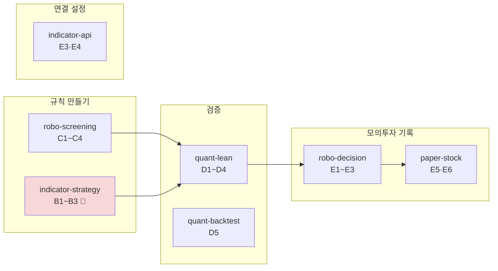

> **쉬운 요약**
> 1. 와이어프레임 v0.2(나머지 7개 화면)를 그리려고 화면 코드를 읽다가, **화면이 실제보다 더 말하는 곳**을 찾았습니다. 모두 에러가 나지 않아 로그에도 남지 않는 종류입니다.
> 2. 데이터 파트(이동원)는 **다른 파트의 코드를 고치지 않고** 여기에 파트별로 모았습니다. 파트는 역할 분배안 v1.0 기준이고 **담당 지정(Assignee)은 비워 둡니다** — 자기 파트 줄을 가져가 PR 에 `Refs` 로 이어 주세요.
> 3. 가장 급한 것은 **B1(가짜 볼린저밴드)** 입니다. 3차 첫 화면의 「매수 우위」 판정이 이 가짜 행 때문에 나왔습니다.

기준 커밋 `e764e5f`(main · 2026-09-28). 확실도 · 🟢 코드·브라우저로 확인 / 🟡 추론·재확인 전.
관련: 화면 IA 이슈 #14 · 와이어프레임 v0.2(`docs/화면/와이어프레임_v0.2.md` · 브랜치 `docs/wireframe-v0-2` 의 PR 로 올라갑니다 — 7절 표에 화면별 전후가 있습니다).

## 1. 한눈에 — 결함이 흐름의 어디에 있나

| 파트 (분배안 v1.0) | 항목 | 가장 큰 것 |
|---|---:|---|
| P-B 지표·신호·커스텀 인디케이터 | 3 | B1 볼린저밴드가 밴드가 아니다 |
| P-C 자산배분·스크리닝 | 4 | C1 「LightGBM」은 학습 모델이 아니다 |
| P-D 비용차감 검증·LEAN | 5 | D1 서로 다른 기간을 뺀 「초과 수익」 |
| P-E 안전·실행·운영 (팀 결정) | 6 | E5 미리보기에 비용이 없다 |
| P-A 데이터 (이동원 · 제가 합니다) | 1 | A1 등락률이 비는 원인 |

## 2. P-B — 지표·신호

- [ ] **B1 🔴 「볼린저밴드 ±2σ」 행이 밴드가 아니라 전일 등락률 ±2% 로 판정한다** — [`app.html:3295`](https://github.com/EST-team-project/Qurious/blob/e764e5f/public/app.html#L3295)
  - 체크박스와 **무관하게 늘** 붙습니다. 그날 삼성전자 −3.33% → 「하단 이탈 · 매수」. S52 브라우저 확인의 「매수 2 · 매도 0 · 중립 1 → 📈 매수 우위」 중 매수 1개가 이 행입니다.
  - 서버는 이미 진짜 밴드를 줍니다 — `bb_upper`·`bb_lower` ([`stock.py:327`](https://github.com/EST-team-project/Qurious/blob/e764e5f/app/services/stock.py#L327) · [`:340-342`](https://github.com/EST-team-project/Qurious/blob/e764e5f/app/services/stock.py#L340-L342)). 종가를 그 값과 비교하면 됩니다. 🟢
- [ ] **B2 MA60 · MACD · 볼린저 체크박스를 읽지 않는다** — 읽는 줄은 MA5 · MA20 · RSI 셋뿐([`app.html:3268-3270`](https://github.com/EST-team-project/Qurious/blob/e764e5f/public/app.html#L3268-L3270)). 눌러도 결과가 안 바뀝니다. 🟢
- [ ] **B3 종합 신호 카드가 「AI 판단」** — 서버 신호는 RSI·이평·볼린저 규칙입니다([`stock.py:330`](https://github.com/EST-team-project/Qurious/blob/e764e5f/app/services/stock.py#L330) `_generate_signal`). 「규칙 합산」 같은 이름을 제안합니다. 🟢

## 3. P-C — 자산배분·스크리닝

- [ ] **C1 「패턴 인식 모델: LightGBM (앙상블)」** ([`app.html:1759`](https://github.com/EST-team-project/Qurious/blob/e764e5f/public/app.html#L1759)) — 서버는 이 값을 받으면 **이평 ±1 + MACD ±1 + RSI ±1 합산 점수**를 씁니다. 코드 주석도 *"학습 모델을 가장한 값이 아닌 투명한 앙상블 점수"* 라고 적어 두었습니다([`investment_research.py:124`](https://github.com/EST-team-project/Qurious/blob/e764e5f/app/services/investment_research.py#L124)). 화면 이름만 남았습니다. 🟢
- [ ] **C2 「최소 신뢰도 65%」는 확률이 아니다** — `min(95, 55 + |점수| × 13)` 으로 만든 값입니다([`investment_research.py:128`](https://github.com/EST-team-project/Qurious/blob/e764e5f/app/services/investment_research.py#L128)). 점수 1 → 68, 2 → 81, 3 → 94. 「최소 점수」로 두는 편이 정직합니다. 🟢
- [ ] **C3 등락률이 없으면 카드 `+--%`(초록) · 표 `+0.00%`** — [`app.html:3195`](https://github.com/EST-team-project/Qurious/blob/e764e5f/public/app.html#L3195) · [`:3207`](https://github.com/EST-team-project/Qurious/blob/e764e5f/public/app.html#L3207) `change_pct ?? 0`. **없는 값을 0 으로 채웁니다**(옛 A4 분석 「결측을 0.0 으로」와 같은 함정). 값이 비는 원인은 A1 에서 데이터 파트가 봅니다. 🟢
- [ ] **C4 들어가면 8초 넘게 빈 칸** — 31종목마다 캔들·시세를 차례로 부릅니다([`stocks.py:155-161`](https://github.com/EST-team-project/Qurious/blob/e764e5f/app/routes/stocks.py#L155-L161)). 불러오는 중 표시가 없습니다. 🟡 (시간은 재지 않았습니다)

## 4. P-D — 검증·LEAN

- [ ] **D1 「초과 수익 (vs 비교기간)」이 서로 다른 기간을 뺀 값** — `strategy_return − comparison_return`([`lean_backtest.py:204`](https://github.com/EST-team-project/Qurious/blob/e764e5f/app/services/lean_backtest.py#L204)). S52: 검증 2023-01-01~ **+430.57%** − 비교 2022-01-01~ **+283.38%** = **+147.19%**. 기간 길이가 다르면 이 차이는 성과가 아닙니다. 🟢
- [ ] **D2 이 화면은 비용을 빼지 않는다** — 면책 문구에만 있습니다([`lean_backtest.py:212`](https://github.com/EST-team-project/Qurious/blob/e764e5f/app/services/lean_backtest.py#L212) *"수수료·슬리피지 … 반영하지 않으며"*). `indicator-backtest` 는 뺍니다(비용 전 13.22% → 3.70%p 차감). 두 화면을 「교차 확인」으로 이으면 **비용 후 숫자와 비용 전 숫자가 나란히** 놓입니다. 🟢
- [ ] **D3 LEAN 화면 전략은 4종뿐** — 보유 · 이평 교차 · DCA · 모멘텀([`lean_backtest.py:35-40`](https://github.com/EST-team-project/Qurious/blob/e764e5f/app/services/lean_backtest.py#L35-L40)). `indicator-backtest` 의 RSI 규칙은 넘겨받을 수 없어서, 와이어프레임의 「LEAN 으로 교차 확인」 버튼은 **이평 교차일 때만** 성립합니다. 🟢
- [ ] **D4 초기 자금 `10000` 에 단위가 없다** — [`app.html:1249`](https://github.com/EST-team-project/Qurious/blob/e764e5f/public/app.html#L1249). 국내 종목이면 1만 원인지 1만 달러인지 화면만으로 모릅니다. 🟢
- [ ] **D5 `quant-backtest` 「퀀트 전략 분석 (10년 Mockup)」에 백테스트가 없다** — 사용법은 *"10년치 백테스트 성과를 확인"*([`app.html:2842`](https://github.com/EST-team-project/Qurious/blob/e764e5f/public/app.html#L2842))인데, 부르는 API 는 `indicator-strategy` 와 같은 `/stocks/quant/indicators` 이고 현재 지표만 보여 줍니다. IA v0.2 는 메뉴에서 빼는 안(숨김 후보)입니다. 🟢

## 5. P-E — 안전·실행·운영 (팀 결정 영역)

- [ ] **E1 자동매매 판단 근거 카드가 고정 문구** — BUY 면 늘 「과매도 구간 진입, 반등 기대」([`app.html:3252`](https://github.com/EST-team-project/Qurious/blob/e764e5f/public/app.html#L3252)). 실제 근거(「RSI 중립 52.6 · 골든크로스」)는 로그 줄에 이미 있습니다. (IA v0.2 I15 ② · 다시 적음) 🟢
- [ ] **E2 자동매매 로그 시각이 UTC** — [`auto_trade.py:83`](https://github.com/EST-team-project/Qurious/blob/e764e5f/app/services/auto_trade.py#L83)(`+00:00` 붙음) · [`:230`](https://github.com/EST-team-project/Qurious/blob/e764e5f/app/services/auto_trade.py#L230)(**표시 없이** UTC). 화면의 「01:34:21」은 한국 시각 10:34 입니다. 🟢
- [ ] **E3 「AI 의사결정」·「LightGBM 모델이 신호를 해석」** — 자동매매가 쓰는 것은 규칙 신호의 `action`·`reasons` 입니다([`auto_trade.py:306-313`](https://github.com/EST-team-project/Qurious/blob/e764e5f/app/services/auto_trade.py#L306-L313)). `robo-decision` 제목·설명과 `indicator-api` 설명 카드 두 곳입니다. 🟢
- [ ] **E4 `indicator-api` 「연결 테스트」가 성공해도 「연결되지 않음」** — 테스트는 토스트만 띄우고 상태 글자를 고치지 않습니다([`app.html:3581-3586`](https://github.com/EST-team-project/Qurious/blob/e764e5f/public/app.html#L3581-L3586)). 상태는 들어올 때 한 번만 정합니다([`:3563`](https://github.com/EST-team-project/Qurious/blob/e764e5f/public/app.html#L3563)). 🟢
- [ ] **E5 모의주문 미리보기에 비용이 없다** — `cashAfter = cash − 금액`([`paper_trading.py:194-200`](https://github.com/EST-team-project/Qurious/blob/e764e5f/app/services/paper_trading.py#L194-L200)). S52 실측: 미리보기 **99,449,500원** → 실제 **99,449,402.6원**(비용 97.4원). 현금이 「금액」과 「금액 + 비용」 사이면 미리보기는 가능인데 **주문은 거절**됩니다. 주문 함수가 쓰는 `trading_cost.order_costs` 를 미리보기도 쓰면 됩니다. 🟢 (거절 경우는 코드로만 확인 🟡)
- [ ] **E6 빈 종목 「시세 조회」 안내가 4초 토스트뿐** — [`paper.js:79`](https://github.com/EST-team-project/Qurious/blob/e764e5f/public/js/paper.js#L79) · [`common.js:76-80`](https://github.com/EST-team-project/Qurious/blob/e764e5f/public/js/common.js#L76-L80). IA v0.2 의 「아무 안내가 없다」는 **제 관찰 오류일 가능성**이 큽니다(12~30초 뒤 찍어서 토스트가 이미 사라짐). 칸 아래 남는 안내를 제안합니다. 🟡

## 6. P-A — 데이터 (이동원 · 제가 합니다)

- [ ] **A1 `get_quote` 가 등락률을 늘 비워서 돌려준다** — 전일 종가(`prev_close`)는 받으면서 `change`·`change_pct` 를 **`None` 으로 고정**합니다([`stock.py:82-83`](https://github.com/EST-team-project/Qurious/blob/e764e5f/app/services/stock.py#L82-L83)). C3 의 뿌리입니다. 계산 두 줄 + 시험으로 데이터 파트가 따로 PR 을 올립니다. 시세 출처(지금 야후) 교체는 그다음 일입니다. 🟢
- 참고: `_generate_signal`([`stock.py:330`](https://github.com/EST-team-project/Qurious/blob/e764e5f/app/services/stock.py#L330))은 주석에 「AI 해석」이 있지만 본문은 **점수 가감만 하는 규칙**입니다 — B3 · E3 의 근거.

## 7. 용어

- **볼린저밴드** — 20일 평균 ± 2 표준편차로 그린 띠. 종가가 아래 띠 밖이면 「하단 이탈」. *이 문서에서*: B1 은 띠를 계산하지 않고 하루 등락률로 판정합니다. *헷갈리는 점*: 「±2σ」 글자가 있어도 계산이 그것이라는 뜻은 아닙니다.
- **결측(값 없음)** — 값을 못 받은 것. 0 과 다릅니다. *이 문서에서*: C3 의 `+0.00%` 는 「오늘 안 움직였다」가 아니라 「모른다」입니다.
- **비용 전/후** — 수수료·세금·슬리피지(주문 가격과 체결 가격의 차이)를 빼기 전과 뒤의 수익률. 같은 규칙이라도 두 숫자는 다릅니다(D2).

## 8. 한계 · 뒤집을 조건

- 역할 분배안 v1.0 은 **제안**입니다. 파트가 다르게 정해지면 줄을 옮깁니다.
- 🟢 는 코드 읽기와 S52 브라우저 확인(2026-09-28 10:27~10:36 KST · 증권사 키 없음 · LEAN 없음) 기준입니다. E5 의 거절 경우, E6, C4 는 브라우저로 다시 보지 않았습니다.
- 고치는 방향은 **제안**입니다. 각 파트가 더 나은 방법을 고르면 그쪽이 맞습니다.

🤖 Generated with [Claude Code](https://claude.com/claude-code)
