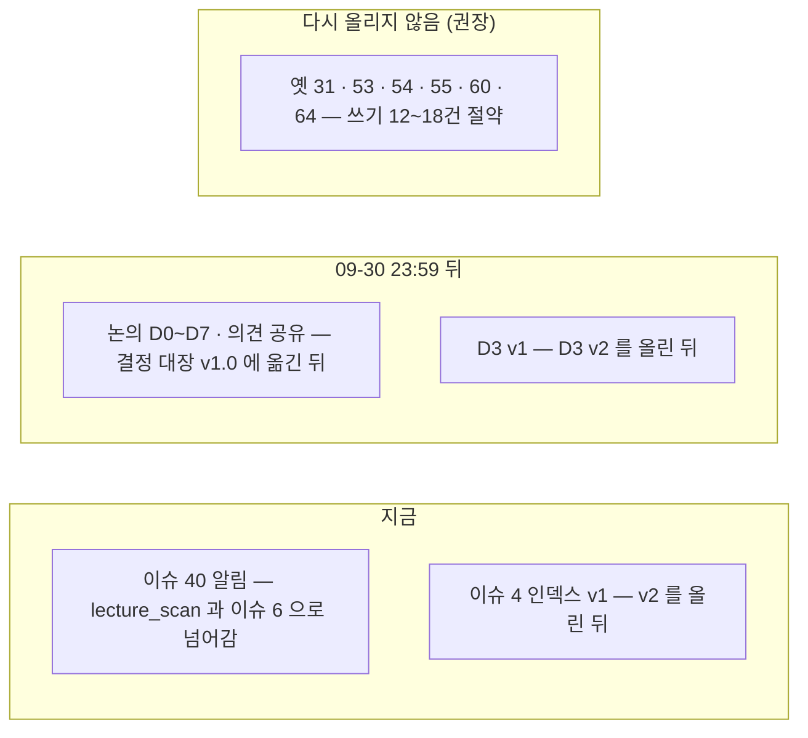

> **쉬운 요약**
> 1. 다시 올린 옛 글 **23건**(논의 9 · 이슈 14)의 **새 번호**를 기록 색인에 채웠습니다. 옛 번호와 새 번호가 겹쳐 헷갈리던 것을 한 표로 풉니다.
> 2. 논의 9건의 갱신 댓글은 페이지를 한 건씩 열어 **9/9 붙은 것**을 확인했습니다. 이슈 페이지는 로그인하지 않으면 댓글이 안 보여 검색으로만 확인했습니다 🟡.
> 3. 옛 인덱스(#4)를 대신할 **인덱스 v2** 본문을 썼습니다 — 새 번호 목록 · 공식 일정 · 글마다 **닫는 조건** 한 줄.
> 4. **닫아도 되는 글**을 골랐습니다(갱신 대장 6절) — 지금 2건(#40 · #4 는 v2 뒤) · 기한 뒤 논의 9건 · 다시 올리지 않고 기록으로 끝낼 옛 글 6건(권장).

기준 커밋 `58367d4`(main · #42 머지 뒤). 확실도 · 🟢 파일·페이지로 확인 / 🟡 추론·재확인 전. **문서만** 바꿉니다.

## 한눈에 보기

| | S60 까지 | 이 PR |
|---|---|---|
| 기록 색인 「새 저장소」 칸 | 새 글만 번호 · 옛 글 17건 「새 번호 미기입」 | **옛 글 23건 새 번호** · 갱신 댓글 🟢 9 · 🟡 11 · ⏳ 3 |
| 갱신 대장 | v0.1 · 올림 17 · 안 올림 27 | **v0.2** · 올림 23 · 안 올림 21 · **6절 닫기 점검** |
| 옛 `#1` 인덱스 | 「v2 로 새로 쓰겠습니다」 예고만 | **v2 본문** + #4 닫기 댓글 파일 |
| D3 끝 문단(v2 제안) | 사용자 결정 대기 | **그대로 올라감**(09-29 · 페이지 확인) → ①④⑦⑧ 은 D3 v2 에서 |
| 세션 끝 확인 | 6줄 | **7줄** — ⑦ 닫기 점검 |

## 옛 번호 → 새 번호 (23건)

```
논의  D0 `#6`→#10  D1 `#7`→#11  D2 `#10`→#12  D7 `#13`→#13  D4 `#17`→#20
      D5 `#18`→#21  D6 `#20`→#22  의견 공유 `#29`→#31  D3 `#30`→#32      (D8 `#69` 은 아직)
이슈  `#1`→#4  `#3`→#5  `#4`→#6  `#5`→#7  `#8`→#8  `#9`→#9  `#11`→#17  `#12`→#18
      `#14`→#38  `#15`→#40  `#16`→#41  `#19`→#43  `#21`→#44  `#22`→#45
```

## 닫아도 되는 글 (갱신 대장 6절)



| 묶음 | 글 | 근거 |
|---|---|---|
| 지금 | #40 · #4(v2 뒤) | 갱신 댓글이 이미 「닫고 #6 에서 이어 간다」 고 말함 · v1 은 옛 번호 목록 |
| 조건 뒤 | 논의 9 · #7 · #8 · #14 · 분석 이슈 9 · #6 · #26 · #35 · #37 | 인덱스 v2 3절 「닫는 조건」 |
| 다시 올리지 않음 | 옛 `#31` · `#53` · `#54` · `#55` · `#60` · `#64` | 올리자마자 닫는 글 — 남은 한두 줄은 넘길 곳을 적음(6.3) · **사용자 결정** |

## 바뀐 파일

| 구분 | 파일 |
|---|---|
| 기록 색인 | `docs/github-archive/README.md` — 0절 지도(09-29 폴더 · `Github-링크.md`) · 올림 현황 · 1절 논의 표에 새 번호 칸 · 3절 23줄 · 09-29 표(#42 · 새 글 2) |
| 갱신 대장 | `docs/github-archive/갱신대장.md` v0.2 — 1절 23건 · 1.1 결정 2건 반영 · 2.3 ⑦ 제안 바꿈 · 3절 상태 칸 · **6절 신설** |
| 새 글 | `2026-09-29/이슈-로드맵-인덱스-v2/00-본문.md` · `2026-09-15/이슈-001/02-2026-09-29-v2-로-옮김.md`(#4 닫기 댓글) |
| 사용자 파일 | `docs/github-archive/Github-링크.md` — 이동원이 모아 둔 이슈 · 논의 주소(S60 보류 → 사용자 승인으로 커밋) |
| 답글 수신함 (새로) | `docs/github-archive/답글-수신함.md` — 팀원 답글이 오면 이동원이 원문을 붙여 두고, Claude 가 세션마다 글 폴더로 옮긴다(이동원 제안) |
| 색인 | `docs/산출물목록.md` v1.9 — 0.1 판 현황 · 0.2절 ⑦ · 8절 · 11절 S60 #42 채움 + S61 줄 · 12절 |
| TIL | 새 1장 · S60 TIL 에 #42 채움 · TIL 목록 |

## 이번에 겪은 것 (TIL)

- 다시 올린 논의 본문 안에 **옛 댓글 기록이 통째로 들어 있어**, 페이지를 읽는 도구가 그것을 새 댓글로 셉니다(D7 「2건 · 답글 3건」). 새 댓글은 제목(「올린 뒤 바뀐 것 N가지」)과 끝 문단을 파일과 맞춰서 가렸습니다.
- 이슈 페이지는 로그인하지 않으면 댓글을 그리지 않습니다 — 그래서 한 건씩 열어 본 이슈 5건은 「댓글 없음」, 검색 `comments:>0` 은 「있음」 으로 엇갈렸습니다. 이슈는 **검색으로 있음까지만** 적었습니다 🟡.

## 확인

- `python scripts/post_check.py` → 새 글 두 파일 길이 · 링크 통과 · 색인 없는 글 폴더 0
- 코드 · 시험 파일은 바꾸지 않았습니다(시험 117건 그대로).

🤖 Generated with [Claude Code](https://claude.com/claude-code)
