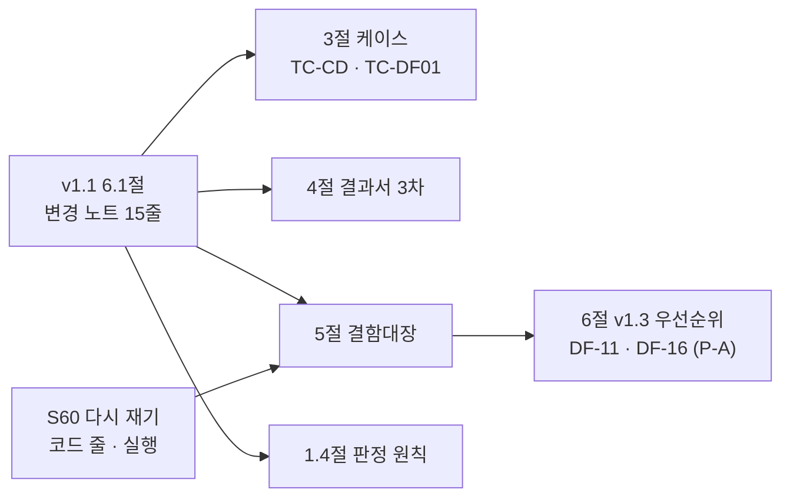

> **쉬운 요약**
> 1. 테스트계획서를 **v1.2** 로 올렸습니다. v1.1(78건) 뒤 두 PR 이 더한 시험 39건(수집 DB 다리 · DF-01 전처리)을 본문에 넣어 **117건**입니다.
> 2. 결함대장 **16건을 전부 다시 쟀습니다** — v1.1 은 DF-01~09 를 v1.0 에서 옮겨 적기만 했습니다. 줄마다 「다시 잰 방법」 칸이 있습니다.
> 3. 다시 재다가 새 결함 둘을 찾았습니다 — 수집기 모듈 5개가 Git Bash(cp949)에서 죽고(DF-11), `collector.preprocess` 는 `--help` 에도 전 종목을 다시 계산합니다(DF-16). 둘 다 데이터 파트 몫이고 **이 PR 은 문서만** 바꿉니다.
> 4. 함께 **강사님 자료 기능 대조 v0.1** 을 냈습니다 — th03 `stock-coin-trade` 기능 26개를 Qurious 와 맞췄고(있음 4 · 일부 13 · 없음 8), 공식 일정표 3차 칸(10/28 TradingView · 11/3 Pine 교차검증)의 본보기가 거의 th03 에 있습니다.

기준 커밋 `33772be`(main · #39 머지 뒤). 확실도 · 🟢 코드·실행으로 확인 / 🟡 추론·재확인 전.

## 한눈에 보기

| | v1.1 (S56) | v1.2 (이 PR) |
|---|---|---|
| 시험 | 78건 · 8파일 | **117건 · 11파일** (TC-CD 22 · TC-SS 2 · TC-DF01 15) |
| 계층 | 단위 55 · 계약 5 · 통합 9 · 인수 6 · 봉인 3 | 단위 **88** · 계약 **8** · 통합 **12** · 인수 6 · 봉인 3 |
| 결과서 | 2차 78/78 | **3차 117/117** (09-29 · Postgres 붙임 · 사용자 셸 조건 · 109초) |
| 결함대장 | 14건 · DF-01~09 옮겨 적기 | **16건 · 전부 다시 잼** — 열림 9 · 일부 닫힘 3 · 닫힘 4 |
| 판정 원칙 | 4개 | **7개** (S57 출처가 다른 숫자 · S59 건드리면 안 되는 날 · S60 예약 작업과 겹치지 않기) |

## 결함대장 — 다시 재서 바뀐 것

```
DF-01  열림       → 닫힘        (S59 #39 · 실제 DB 시험 통과)
DF-04  열림       → 일부 닫힘   게이트에 막히면 종료코드 1 (옛 기록 「0」 은 잘못 잰 값이었을 가능성 🟡)
DF-11  일부(5개)  → 일부(10개)  scripts 5 + collector 5 · benchmark status 가 줄표 — 에서 죽음
DF-13  열림       → 열림 +1곳   app.html:4765 에도 ?? 0
DF-15  (노트)     → 열림        다리 뒤 「현재가 = 어제 종가」 5곳 · #35
DF-16  —          → 열림 (새로) preprocess 가 인자를 안 봄 → --help 에도 재계산
DF-02 · 03 · 05 · 06 · 07     줄 번호까지 그대로 (DF-02 코스닥 오차 0.871% · 1.896% 도 그대로)
```



## 바뀐 파일

| 구분 | 파일 |
|---|---|
| 문서 (새 판) | `docs/시험/테스트계획서_v1.2.md` (v1.0 · v1.1 은 이력으로 둠) |
| 문서 (새로) | `docs/요구사항/강사님자료-기능대조_v0.1.md` |
| 강사님 자료 추적 | `docs/github-archive/2026-09-28/이슈-강사님자료-변경추적/02-2026-09-29-th03-전체-다시보기.md` · `기준점.tsv` |
| 색인 | `docs/산출물목록.md` v1.8 (0.1 판 현황 · 2절 · 9절 · 11절 S59 #39 채움 + S60 줄 · 12절) |
| 기록 | `docs/github-archive/README.md` (#37 · #39 채움 · 이 PR 줄) · 이 본문 |
| 안 올린 갱신 댓글 8개 | 옛 `#22` · `#23` · `#51` · `#53` · `#62` · `#64` · `#71` · 논의 D8 — 시험 102 → 117 · DF-04 재측정 · v1.2 링크 (이미 올린 글은 그대로) |
| TIL | 새 1장 · S59 TIL 에 #39 채움 · TIL 목록 |

## 강사님 자료 기능 대조 v0.1 (두 번째 작업)

| 공식 일정표 칸 | 요구 (요지) | th03 본보기 | Qurious 지금 |
|---|---|---|---|
| 10/14 오전 | 모의투자 손실한도 · 비상정지 | KIS 모의 주문 60초 승인 토큰 · CSRF | 모의 주문만 |
| **10/28** | TradingView — Webhook 수신 · 검증 · Pine 전략 코드 | 16단계 코스 · `strategy.exit` + ATR · 수수료 0.015% | `indicator()` · v5 생성기(DF-05 · DF-06) · Webhook 없음 |
| 10/30 | 다중주기 신호(일봉 · 분봉) | KIS 분봉 차트 | 일봉만 |
| 11/2 | 변동성 기반 손절 · 데이터 품질 대시보드 | ATR 손절 | 청산 규칙 없음 · 품질은 명령줄 검사뿐 |
| **11/3** | Pine · LEAN · 로컬 신호 대사 | 연습장 · 전략 거래 | 잰 적 없음 |
| 11/5 | 주문 승인 · 취소 흐름 · 실시간 | 주문 → 정정 → 취소 · 휴장 사전 체크 | 없음 |

- 서버의 `POST /api/stocks/orders/pine` 은 있는데 **화면이 한 번도 부르지 않습니다**. Qurious 차트는 ApexCharts, th03 은 Lightweight Charts 4.2.0 입니다. 강사님도 TradingView **위젯**은 쓰지 않습니다.
- 데이터 파트 몫 제안 5가지(분봉 출처 · 관제 API · 품질 대시보드 API · 거래일 달력 API · OHLCV 공개 조회)는 문서 4절 — 다른 파트 몫은 칸만 적었고 담당은 정하지 않았습니다.
- 강사님 자료 변경 추적 — 09-28 뒤 바뀐 곳은 th03 2커밋(AWS SAM · 참고만). 추적 이슈 #6 에 달 댓글 파일 `02-2026-09-29-…` · 기준점 24곳(th24 처음).

## 이번에 겪은 것 (TIL 5절)

- 모듈마다 사용자 셸에서 죽는지 보려고 `python -m collector.preprocess --help` 를 돌렸더니 **쓰기 트랜잭션이 열렸습니다**(DF-16). 마침 예약 작업이 같은 일을 하고 있어 잠금을 기다리다 멈췄고, 한 트랜잭션이라 DB 영향은 없습니다.
- 일일 갱신(09:06 시작)과 실제 DB 시험이 겹쳐 수정주가 단계가 398초 → 1,286초로 늘었습니다(성공). → 판정 원칙 7번째.

## 확인

- `python -m pytest --collect-only` → 117 · Postgres 붙여 117 passed(사용자 셸 조건)
- `python scripts/post_check.py` → 색인 없는 글 폴더 0
- 코드 · 시험 파일은 바꾸지 않았습니다.

🤖 Generated with [Claude Code](https://claude.com/claude-code)
