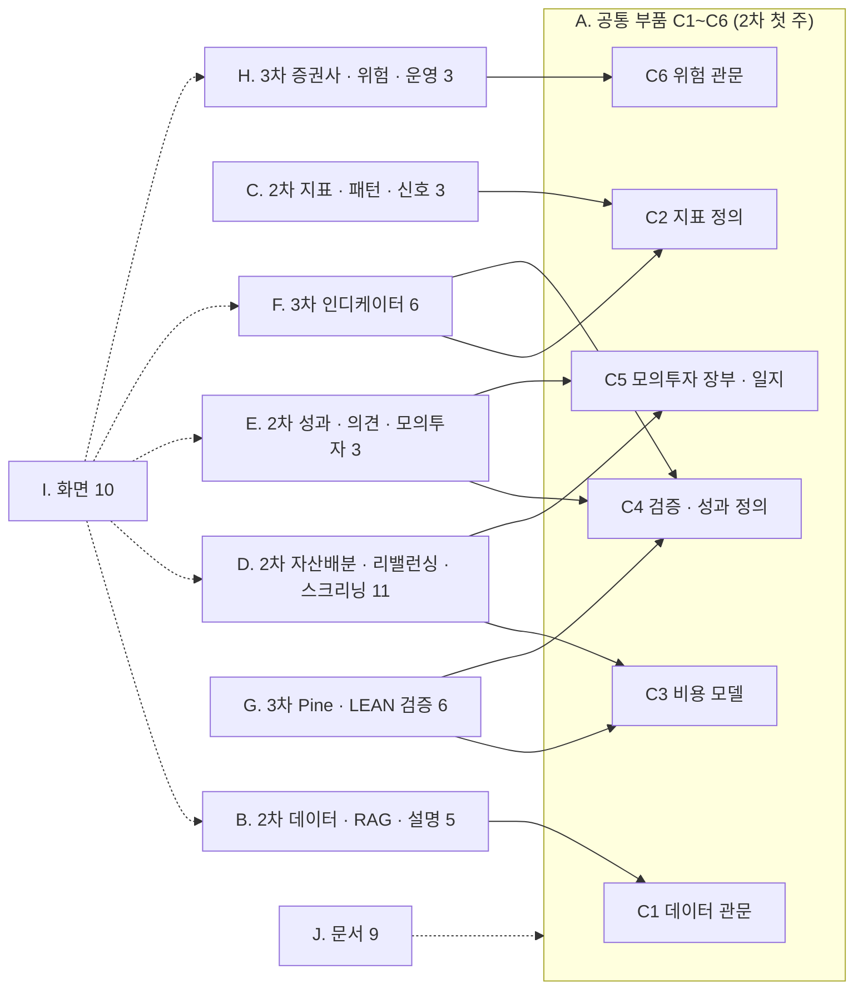

# [논의] D9 기능 전체 목록과 역할 희망 — 2차 · 3차에서 하고 싶은 것을 골라 주세요

> 작성 2026-09-29 (KST) · 이동원 · 카테고리 General 제안 · 역할을 **정하는** 글이 아니라 **희망을 모으는** 글입니다.

> **쉬운 요약**
> 1. 2차(로보 어드바이저)와 3차(투자 인디케이터)에서 만들 것을 **카드 62장**으로 모두 늘어놓았습니다 — 강사님 요구 29 · 제안요청서(rfp-2)의 자산배분 · 스크리닝 8 · 화면 필수 요소 10 · 여러 기능이 함께 쓰는 공통 부품 6 · 비어 있는 문서 산출물 9.
> 2. 지금까지의 역할표(분배안 v1.0)는 제가 짠 **제안**이었습니다. 정하기 전에 **각자 하고 싶은 것**을 먼저 듣고 싶습니다. 고른 일이어야 발표에서 「제가 이걸 했습니다」를 자기 말로 할 수 있으니까요.
> 3. 댓글로 **1~3지망 카드 번호와 이유 한 줄**을 남겨 주세요(양식은 4절). 겹치거나 비는 칸은 제가 조율안을 이 글 본문 맨 위에 올리고, 다시 확인을 받겠습니다.

기준 커밋 `5adfb81` 뒤 S63 문서 · 카드마다 자세한 설계는 [기능 설계서 v0.1](https://github.com/EST-team-project/Qurious/blob/main/docs/설계/기능설계_v0.1.md)에 있습니다(요구 ID 로 찾으면 됩니다). 확실도 · 🟢 있음 / 🟡 일부 / 🔴 없음 · 크기는 전부 **추정 🟡** 입니다.

---

## 0. 왜 이 논의인가

- **강사님 유의사항** — ① 각 역할은 **주담당 · 보조담당 2인 이상** ⑦ 09-30 까지 팀 구성 · 2차는 **10-01(목)** 시작입니다.
- **역할은 아직 정해지지 않았습니다** — D0 ⑤ 「역할 분담」([#10](https://github.com/EST-team-project/Qurious/discussions/10))은 3/4 에서 멈춰 있고, 분배안 v1.0(옛 `#62` · [기록](https://github.com/EST-team-project/Qurious/blob/main/docs/github-archive/2026-09-21/이슈-062/00-기록.md))은 파트(P-A~P-E)로 나눈 제안일 뿐입니다.
- **파트보다 작은 단위로 고를 수 있게** — 파트 하나에는 성격이 다른 일이 섞여 있습니다(예: 「자산배분」 파트 안에 수학 최적화도, 화면도, 데이터도 있습니다). 카드 단위로 보면 「이 파트는 싫지만 이 카드는 하고 싶다」 가 보입니다.
- 이 글의 결과로 **분배안 v1.1**(카드 → 사람)을 만들고, 결정 대장의 D0 ⑤ 를 닫습니다.

---

## 1. 카드 읽는 법

| 칸 | 뜻 |
|----|----|
| **ID** | 요구 ID(`P01-③-1` 처럼 — 요구사항 추적표와 같은 번호) · 공통 부품 `C1`~`C6` · 화면 `U1`~`U10` · 문서 `DOC1`~`DOC9`. 댓글에 이 번호를 적어 주세요 |
| **무엇을 만드나** | 쉬운 말 한두 줄. 자세한 입력 · 출력 · 데이터 · 화면 · 시험은 기능 설계서의 같은 ID 칸 |
| **지금** | 🟢 있음 · 🟡 일부(고칠 것이 있음) · 🟠 흔적만 · 🔴 없음(새로 만듦) |
| **필요한 것** | 백엔드(파이썬 FastAPI) · 화면(HTML · JS) · 데이터(수집 DB · SQL) · 통계(지표 · 최적화 · 검정) · 시험(pytest) · 문서 · 운영 |
| **크기** | **S** 반나절~하루 · **M** 2~3일 · **L** 4일 이상 — 코드를 읽고 짐작한 값이라 해 보면 달라집니다 🟡 |
| **언제** | 강사님 공식 일정표에서 그 기능을 **보여 줘야 하는 칸**(마감이라기보다 「그날 쓸 수 있어야」) |
| **먼저** | 그 카드보다 먼저 있어야 편한 카드. 없어도 시작은 할 수 있습니다(가짜 데이터로) |
| **제안 파트** | 분배안 v1.0 이 붙였던 파트 — **참고만** 하세요. 파트와 다른 카드를 골라도 됩니다 |

> **용어 풀이**
> - **주담당 · 보조담당** — 주담당은 그 카드를 끝까지 책임지는 사람. 보조담당은 분배안 §5 대로 딱 세 가지만 합니다: ① 올라온 PR 을 나중에라도 읽고 한 줄 남기기(머지를 막지 않음) ② 그 기능을 **밖에서** 시험하는 블랙박스 시험 1건 ③ 주담당이 빠지면 이어받기. 「2인 이상」 은 이렇게 채웁니다.
> - **공통 부품** — 여러 카드가 기대는 바닥입니다(예: 비용 계산을 한 곳에서). 먼저 서면 다른 카드가 훨씬 쉬워집니다. 이 글에서 헷갈리기 쉬운 점: 공통 부품을 고르면 **다른 사람이 기다리는 일**이라 2차 첫 주에 몰립니다.
> - **일정 칸** — 강사님 일정표는 반나절(4시간)이 한 칸입니다. 2차 25칸 · 3차 30칸.

---

## 2. 한눈에

### 2.1 카드 묶음과 공통 부품



### 2.2 묶음별 카드 수와 크기

```
 묶음                              카드   S   M   L
 ─────────────────────────────────────────────────
 A 공통 부품                          6    0   5   1
 B 2차 데이터 · RAG · 설명            5    1   4   0
 C 2차 지표 · 패턴 · 신호             3    1   1   1
 D 2차 자산배분 · 리밸런싱 · 스크리닝 11    4   5   2
 E 2차 성과 · 의견 · 모의투자         3    1   2   0
 F 3차 인디케이터                     6    1   4   1
 G 3차 Pine · LEAN 검증               6    1   3   2
 H 3차 증권사 · 위험 · 운영           3    0   2   1
 I 화면 필수 요소                    10    3   7   0
 J 문서 산출물                        9    4   5   0
 ─────────────────────────────────────────────────
 합계                                62   16  38   8     (크기는 추정 🟡)
```

### 2.3 언제 보여 줘야 하나 — 강사님 공식 일정표의 기능 칸

```
 2차  10-01 착수 ── 10-06 IA·ERD ── 10-07 수집·지식검색 ── 10-08 RAG·성향·배분 ── 10-12 리밸런싱·패턴
      ── 10-13 XAI·성과 ── 10-14 모의투자(손실한도·비상정지) ── 10-16 검증 ── 10-21 오전 발표 (추정)
 3차  10-27 기본전략 ── 10-28 커스텀지표·Pine·알림 ── 10-29 LEAN ── 10-30 증권사·다중주기
      ── 11-02 변동성 손절·데이터 품질 ── 11-03 Pine 교차검증·알림 큐 ── 11-04 대사·강건성 ── 11-05 주문 승인·취소
```

---

## 3. 카드 62장

### A. 공통 부품 — 여러 카드의 바닥 (2차 첫 주에 필요)

> 발표 그림: 「같은 규칙이면 어느 화면에서 돌려도 **같은 숫자**가 나온다」

| ID | 무엇을 만드나 | 지금 | 필요한 것 | 크기 | 언제 | 먼저 | 제안 파트 |
|----|---------------|:----:|-----------|:----:|------|------|:---------:|
| `C1` | **데이터 관문** — 앱이 시세를 읽는 길을 수집 DB 하나로 모으고, 응답마다 「언제 값인지(`as_of`)」 를 싣는다. 일봉 · 지표 API 앞의 6시간 캐시 문제(DF-17)도 여기 | 🟡 | 백엔드 · 데이터 | M | 2차 첫 주 | — | P-A |
| `C2` | **지표 정의 한 곳** — RSI · 이동평균 · 볼린저 · MACD · ATR 을 한 모듈에서만 계산(TradingView 와 같은 정의). 지금은 RSI 가 세 벌 | 🟡 | 백엔드 · 통계 · 시험 | M | 2차 첫 주 | — | P-B |
| `C3` | **비용 모델 한 곳** — 수수료 · 매도세 · 슬리피지를 모든 백테스트와 모의 체결이 같은 값으로. 지금은 비용을 쓰는 경로가 1곳뿐 | 🟡 | 백엔드 · 통계 | M | 2차 첫 주 | — | P-D |
| `C4` | **검증 엔진 · 성과 정의** — 백테스트 한 번 = 기록 한 줄, 샤프 · 승률 · PF · MDD 정의 한 장. 지금은 샤프가 3곳 · 승률이 두 벌 | 🟡 | 백엔드 · 통계 · 시험 | L | 2차 둘째 주 | C1 · C2 · C3 | P-D |
| `C5` | **모의투자 장부 · 일지** — 모든 모의 주문이 한 장부에, 매 거래일 1행 일지(지울 수 없음). 장부는 있고 일지가 없다 | 🟡 | 백엔드 · 데이터 | M | 10-14 전 | — | P-E |
| `C6` | **위험 관문** — 주문 직전에 한 함수가 중복 주문 · 손실 한도 · 비상 정지를 본다. 지금 0 | 🔴 | 백엔드 · 시험 | M | 10-14 전 | C5 | P-E |

### B. 2차 — 데이터 · RAG · 설명 (P01 목표 기능 ①)

> 발표 그림: 「답 옆에 **출처**, 추천 옆에 **이유**」

| ID | 무엇을 만드나 | 지금 | 필요한 것 | 크기 | 언제 | 먼저 | 제안 파트 |
|----|---------------|:----:|-----------|:----:|------|------|:---------:|
| `P01-①-1` | **용어사전 · 연관 개념** — 화면의 용어(MDD · 샤프)를 누르면 뜻 · 쉬운 뜻 · 이어진 개념. 지금은 화면 코드 안 상수 51개 | 🔴 | 백엔드 · 화면 · 문서 | M | 10-07 | — | P-A |
| `P01-①-2` | **투자 자료 수집 · 분류 · 검색** — 수집 DB 를 조회하는 API · 뉴스 분류 · (선택) 재무를 공시(DART)로 | 🟢 | 데이터 · 백엔드 | M | 10-07 | — | P-A |
| `P01-①-3` | **출처를 붙인 RAG 답** — 답마다 근거 문서 번호(「[출처 1]」). 지금은 출처 칸이 늘 비어 있다 | 🟡 | 백엔드 · LLM | M | 10-08 | — | P-A |
| `P01-①-4` | **갱신일 · 거래일 달력 · 배치 상태 화면** — 매일 12:30 배치는 이미 돈다. 그 상태를 화면으로 | 🟡 | 백엔드 · 화면 | S | 10-07 | — | P-A |
| `P01-①-5` | **추천 이유를 쉬운 말로(XAI)** — 규칙 설명 먼저(「RSI 28 이라 과매도」), 모델이 생기면 SHAP 기여도 | 🔴 | 통계 · 백엔드 · 화면 | M | 10-13 | `P01-②-3` | P-D |

### C. 2차 — 지표 · 패턴 · 신호 (P01 목표 기능 ②)

> 발표 그림: 「이 패턴이 이름값을 했나 — **나온 횟수와 그 뒤 5일**」

| ID | 무엇을 만드나 | 지금 | 필요한 것 | 크기 | 언제 | 먼저 | 제안 파트 |
|----|---------------|:----:|-----------|:----:|------|------|:---------:|
| `P01-②-1` | **기본 지표** — C2 로 통일하고 값이 TradingView 와 같은지 시험 | 🟡 | 통계 · 시험 | S | 10-12 | C2 | P-B |
| `P01-②-2` | **차트 패턴 탐지** — 골든크로스 · 신고가 돌파 · 캔들 5종 · 지지/저항, 그 뒤 수익률 통계 | 🔴 | 통계 · (ML 선택) | L | 10-12 | C2 | P-B |
| `P01-②-3` | **여러 주기 신호 + 신뢰도** — 일봉 · 주봉 신호를 합쳐 매수 · 매도 · 관망과 「얼마나 확실한가」. 매일 1회 계산해 표에 (분봉은 데이터 출처가 없어 보류) | 🔴 | 통계 · 데이터 | M | 10-12 | C1 · C2 | P-B |

### D. 2차 — 자산배분 · 리밸런싱 · 스크리닝 (P01 목표 기능 ③)

> 발표 그림: 「같은 포트폴리오에 규칙 셋 — 거래 시점 · 회전율 · 비용이 **어떻게 갈리나**」
> `RFP2-…` 여덟 장은 제안요청서의 요구입니다. 강사님 원문의 목표 기능 ③ 머리글(「자산배분모델을 활용한 포트폴리오 최적화, 주식 스크리닝을 통한 종목 선정」)이 이것을 말합니다. **요구로 셀지는 아직 팀 결정 전**(요구사항 추적표 6-2)이라 카드로는 올려 둡니다.

| ID | 무엇을 만드나 | 지금 | 필요한 것 | 크기 | 언제 | 먼저 | 제안 파트 |
|----|---------------|:----:|-----------|:----:|------|------|:---------:|
| `P01-③-1` | **시간 기반 리밸런싱 엔진** — 월 · 분기 · 연마다 목표 비중으로. 목표 비중 표 · 계획 미리보기 · 이력 | 🔴 | 백엔드 · 통계 | L | 10-12 | C3 · C5 | P-C |
| `P01-③-2` | **이탈률(밴드) 리밸런싱** — 비중이 5%p 넘게 벗어날 때만. 위와 **같은 엔진**, 방아쇠만 다름 | 🔴 | 백엔드 | S | 10-12 | `P01-③-1` | P-C |
| `P01-③-3` | **입출금 · 배당 리밸런싱** — 돈이 들어오면 팔지 않고 모자란 자산부터. 입출금 기록 · 배당 연결 | 🔴 | 백엔드 · 데이터 | M | 10-12 | `P01-③-1` | P-C |
| `RFP2-3.1.3-①` | **평균-분산(Markowitz) 최적화** — 라이브러리 하나(Riskfolio-Lib 제안)로. 지금 「AI 자산배분」 은 3택 조회표 | 🔴 | 통계 | M | 10-08 | D5 ①② | P-C |
| `RFP2-3.1.3-②` | **리스크 패리티 · 최소분산** — 공매도 없음을 최적화 제약으로 | 🔴 | 통계 | S | 10-08 | 위 | P-C |
| `RFP2-3.1.3-③` | **Black-Litterman** — 「A 가 B 보다 낫다」 같은 내 생각 몇 줄을 비중에 반영 | 🔴 | 통계 · 화면 | M | 10-08 | 위 | P-C |
| `RFP2-3.1.3-④` | **동적 자산배분** — 시장 국면(추세 × 변동성)마다 다른 목표 비중 | 🔴 | 통계 | M | 10-12 | `P01-③-1` | P-C |
| `RFP2-3.1.4-①` | **팩터 스크리닝** — 모멘텀 · 저변동성부터(가격만으로 가능) · 가치 · 퀄리티는 재무 데이터가 생긴 뒤 | 🟠 | 통계 · 데이터 | M | 10-12 | C1 | P-C |
| `RFP2-3.1.4-②` | **재무 필터(PER · PBR · ROE · 부채)** — 재무 출처부터(지금은 야후 조회뿐) · 공시일 이전 값을 쓰지 않게 | 🟠 | 데이터 · 통계 | L | 10-12 | 재무 출처 | P-C (데이터 P-A) |
| `RFP2-3.1.4-③` | **기술적 스크리닝** — 정배열 · 52주 신고가 — 패턴 탐지기를 전 종목에 | 🟠 | 통계 | S | 10-12 | `P01-②-2` | P-C |
| `RFP2-3.1.4-④` | **랭킹(복합 점수)** — 팩터 점수 가중합, 가중치는 돌리기 전에 적어 둔다 | 🟠 | 통계 | S | 10-12 | 팩터 | P-C |

### E. 2차 — 성과 · 의견 · 모의투자 (P01 목표 기능 ④)

> 발표 그림: 「비용 **전 / 후** 두 열 + 매일 쌓인 일지」

| ID | 무엇을 만드나 | 지금 | 필요한 것 | 크기 | 언제 | 먼저 | 제안 파트 |
|----|---------------|:----:|-----------|:----:|------|------|:---------:|
| `P01-④-1` | **비용 전후 성과** — 수익률 · MDD · 샤프를 비용 빼기 전과 후 나란히 | 🟡 | 통계 · 화면 | M | 10-13 | C3 · C4 | P-D |
| `P01-④-2` | **신호 → 매수 · 매도 · 보유 의견** — 규칙 표 한 장 + 이유(관망도 기록) | 🔴 | 백엔드 · 통계 | S | 10-14 | `P01-②-3` | P-C |
| `P01-④-3` | **모의 주문 · 운용** — 체결가 = 다음 거래일 시가 · 일지 조회. 장부 · 실거래 차단은 이미 있음 | 🟢 | 백엔드 | M | 10-14 | C5 | P-E |

### F. 3차 — 인디케이터 (P02 목표 기능 ① · ②)

> 발표 그림: 「미래 봉을 몰래 먹인 지표가 **시험에서 빨갛게 떨어지는** 화면」

| ID | 무엇을 만드나 | 지금 | 필요한 것 | 크기 | 언제 | 먼저 | 제안 파트 |
|----|---------------|:----:|-----------|:----:|------|------|:---------:|
| `P02-①-1` | **기본 지표를 LEAN 과 대조** — 같은 데이터에서 값이 같은가 | 🟡 | 통계 · 시험 | S | 10-27 | C2 | P-B |
| `P02-①-2` | **규칙 명세** — 조건 조합 · 손절 · 익절 · 포지션 크기를 한 JSON 으로. 백테스트 · Pine · 자동매매가 같은 명세를 읽는다 | 🔴 | 백엔드 · 화면 | L | 11-02 | C2 | P-B |
| `P02-①-3` | **조합 백테스트로 기준 전략 고르기** — 조합표를 먼저 적고(최대 118개) 봉인 구간은 한 번만 | 🟡 | 통계 · 백엔드 | M | 10-29 | C4 | P-D |
| `P02-②-1` | **커스텀 지표 산식** — 여러 지표를 정규화(z점수 · 백분위)해 합친 내 지표 | 🟡 | 통계 | M | 10-28 | C2 | P-B |
| `P02-②-2` ★ | **미래 데이터 참조 방지 시험 · 실시간 갱신** — 3차 채점 항목. 지금 이 시험이 0 | 🟡 | 시험 · 통계 | M | 10-28 | C2 | P-B |
| `P02-②-3` | **지표 판(버전) 저장 · API 제공** — 산식이 바뀌면 새 판, 옛 판도 다시 부를 수 있게 | 🟡 | 백엔드 | M | 10-28 | `P02-②-1` | P-B |

### G. 3차 — Pine · LEAN 검증 (P02 목표 기능 ③ · ④)

> 발표 그림: 「두 도구가 **어디서부터** 달라졌는지 한 장(신호 · 체결 · 비용)」

| ID | 무엇을 만드나 | 지금 | 필요한 것 | 크기 | 언제 | 먼저 | 제안 파트 |
|----|---------------|:----:|-----------|:----:|------|------|:---------:|
| `P02-③-1` | **Pine 생성기** — 서버에서 v6 `strategy()` 로 · 비용 값이 우리와 같게. 지금 생성 코드는 컴파일이 안 된다 | 🟡 | 백엔드 · Pine | M | 10-28 | `P02-①-2` | P-B |
| `P02-③-2` | **Strategy Tester ↔ LEAN 교차 검증** — 같은 규칙이 같은 날 같은 신호를 냈나(줄 단위 대사) | 🟡 | 통계 · 시험 | L | 11-03 | `P02-③-1` · `P02-④-1` | P-D |
| `P02-③-3` | **알림 · Webhook** — 텔레그램 알림을 제대로(한도 · 실패 기록). 받는 Webhook 은 설계만(약관 판단 전) | 🟡 | 백엔드 | M | 10-28 · 11-03 | — | P-B |
| `P02-④-1` ★ | **LEAN 을 같은 조건으로** — 수집 DB → LEAN 데이터 변환기 · 우리 비용 모델. 지금 LEAN 은 야후 · 무비용 | 🟡 | 데이터 · 백엔드 | L | 10-29 | C1 · C3 | P-A + P-D |
| `P02-④-2` | **성과 지표 한 정의로** — 모든 엔진 결과를 같은 식으로 다시 계산 | 🟡 | 통계 | S | 10-29 | C4 | P-D |
| `P02-④-3` | **TradingView 대 LEAN 차이를 층별로** — 신호 · 체결 · 비용 중 어디서 갈렸나 | 🔴 | 통계 | M | 11-03 | `P02-③-2` | P-D |

### H. 3차 — 증권사 · 위험 · 운영 (P02 목표 기능 ⑤)

> 발표 그림: 「같은 신호가 두 번 와도 **주문은 한 번** · 정지 버튼 한 번에 **모두 멈춤**」

| ID | 무엇을 만드나 | 지금 | 필요한 것 | 크기 | 언제 | 먼저 | 제안 파트 |
|----|---------------|:----:|-----------|:----:|------|------|:---------:|
| `P02-⑤-1` | **신호 → 증권사 모의 계좌 주문** — 실거래 차단 관문은 이미 있음 · 한국투자증권 모의 병행은 선택 | 🟢 | 백엔드 | M | 10-30 | C5 · C6 | P-E |
| `P02-⑤-2` ★ | **중복 주문 방지 · 손실 한도 · 비상 정지** — C6 을 설정 · 화면까지. 사고 방지라 주 · 보조 둘 다 꼭 | 🔴 | 백엔드 · 화면 · 시험 | L | 10-14 · 11-02 · 11-05 | C6 | P-E |
| `P02-⑤-3` | **실행 일정 · 로그 · 장애 알림** — 매일 도는 작업이 실패하면 알림 한 건 | 🟡 | 백엔드 · 운영 | M | 3차 후반 | — | P-E |

### I. 화면 — 강사님이 정한 필수 요소 10

| ID | 무엇을 만드나 | 지금 | 필요한 것 | 크기 | 언제 | 먼저 | 제안 파트 |
|----|---------------|:----:|-----------|:----:|------|------|:---------:|
| `U1` | **투자성향진단** — 설문 5~7문항 → 성향 5단계 → 목표 비중. 지금은 3택 선택 상자 | 🔴 | 화면 · 통계 | M | 10-08 | — | P-C |
| `U2` | **시각적 포트폴리오** — 목표 · 현재 비중 도넛 + 벗어난 정도 막대 | 🟡 | 화면 | S | 10-08 | `P01-③-1` | P-C |
| `U3` | **시뮬레이션** — 과거 구간을 다시 뽑아 수익 분포로. 지금 「예상 MDD」 식이 틀렸다 | 🔴 | 통계 · 화면 | M | 10-13 | C4 | P-D |
| `U4` | **목표 수익률 모의** — 이 목표를 이룰 확률 · 필요한 위험 | 🔴 | 통계 · 화면 | M | 10-13 | `U3` | P-C |
| `U5` | **리밸런싱 화면** — 목표 · 현재 · 차이 · 다음 확인일 · 이력 | 🔴 | 화면 | M | 10-12 | `P01-③-1` | P-C |
| `U6` | **전략 설정** — 규칙 명세 편집기(조건 · 손절 · 익절 · 크기) | 🟡 | 화면 | M | 10-27 | `P02-①-2` | P-B |
| `U7` | **지표 차트** — 기준일 배지 · 신호 표시 | 🟡 | 화면 | S | 10-27 | C2 | P-B |
| `U8` | **백테스트 화면** — 데이터 · 기간 · 비용이 같은지 배지 | 🟡 | 화면 | S | 10-29 | C4 | P-D |
| `U9` | **성과 대시보드** — 비용 전후 · 벤치마크 · 정의 툴팁 | 🔴 | 화면 · 통계 | M | 10-13 · 10-29 | C4 | P-D |
| `U10` | **자동매매 모니터링** — 오늘 주문 의향 · 거부 사유 · 정지 버튼 | 🟡 | 화면 | M | 10-30 | C6 | P-E |

### J. 문서 — 강사님 산출물 표에서 비어 있는 것

| ID | 무엇을 만드나 | 지금 | 필요한 것 | 크기 | 언제 | 먼저 | 제안 파트 |
|----|---------------|:----:|-----------|:----:|------|------|:---------:|
| `DOC1` | **사용자 스토리 · 인수 기준** — 기능 설계서의 스토리 한 줄에 「이러면 끝」 3줄 | 🟡 | 문서 | S | 10-02 전후 | — | 누구나 |
| `DOC2` | **유스케이스** — 주 흐름 4개(규칙 만들기 → 검증 → 모의 기록 → 리밸런싱) | 🔴 | 문서 | M | 10-02 전후 | `DOC1` | 누구나 |
| `DOC3` | **UI 명세서** — 와이어프레임을 화면별 칸 · 동작 표로 | 🔴 | 문서 · 화면 | M | 10-06 | `DOC4` | 누구나 |
| `DOC4` | **IA · 와이어프레임 v0.3 · ERD v1.2** — 10-06 오전 칸 산출물(지금까지 이동원 작성 · 함께할 사람 환영) | 🟡 | 문서 · 화면 · 데이터 | M | 10-06 | — | P-A |
| `DOC5` | **간트 · 주간 보고** | 🔴 | 문서 | S | 10-02 | — | 누구나 |
| `DOC6` | **백테스트 보고서** — 비용 전후 · ΔSharpe · 주 검정 | 🔴 | 문서 · 통계 | M | 10-16 · 11-04 | C4 | P-D |
| `DOC7` | **코딩 표준 · 브랜치 전략 · 기여 가이드** — D0 에서 약속한 「한 장 가이드」 | 🔴 | 문서 | S | 10-02 | — | 누구나 |
| `DOC8` | **장애 대응 절차 · 앱 운영 매뉴얼** | 🔴 | 문서 · 운영 | S | 10-20 | `P02-⑤-3` | P-E |
| `DOC9` | **발표 자료** — 2차(10-21 오전 추정) · 3차 | 🔴 | 문서 · 화면 | M | 10-21 | 전부 | 누구나 |

---

## 4. 고르는 법 · 댓글 양식

**규칙은 다섯 줄입니다.**

1. **1~3지망**을 카드 ID 로 적어 주세요. 묶음째 골라도 됩니다(예: 「D 묶음 전체」). 「딱히 없음」 도 답입니다 — 그러면 분배안 제안을 기본으로 둡니다.
2. **겹치면** 한 사람은 주담당, 다른 사람은 보조담당이 됩니다(유의사항 ①). 누가 주담당일지는 두 분이 정하거나, 카드가 크면(L) 나눕니다.
3. **아무도 고르지 않은 카드**는 조율안에서 분배안 제안 파트를 기본으로 채우고, 다시 여쭙니다.
4. ★ 붙은 카드(`P02-②-2` · `P02-④-1` · `P02-⑤-2`)와 `C6` 은 채점 · 사고 방지 항목이라 **주 · 보조 둘 다** 꼭 정합니다.
5. 한 번 정해도 **바꿀 수 있습니다** — 댓글로 알려 주시면 조율안 표를 고칩니다.

```text
이름 (GitHub 아이디):
1지망: 카드 ID — 이유 한 줄
2지망: 카드 ID — 이유 한 줄
3지망: 카드 ID — 이유 한 줄
피하고 싶은 것 (없으면 비움):
이번에 배우고 싶은 것:
보조로 도울 수 있는 것 (선택):
이번 주 쓸 수 있는 시간 (선택):
```

고르기 어려우면 — 파이썬이 편하면 **A · D · G**, 화면이 좋으면 **I 묶음**, 통계 · 수학이 좋으면 **D(RFP2) · G**, 처음이라 작게 시작하고 싶으면 **크기 S 카드 16장** 중에서 골라 보세요.

---

## 5. 앞으로 — 이 글의 흐름

```
  이 글 올림 ──▶ 댓글로 희망 ──▶ 조율안 v2 (본문 맨 위 표) ──▶ 조율안에 ✅ ──▶ 확정
                 10-02(금) 17:30          10-02 저녁               전원 명시         결정 대장 D0 ⑤
                 보고 전까지 (제안)                                찬성               분배안 v1.1
```

- 기한은 **제안**입니다. 늦어도 괜찮습니다 — 다만 10-06(화) 오전 칸(IA · ERD)부터는 역할별 산출물이 나오기 시작해서, 그 전에 정해지면 좋겠습니다.
- 역할은 D0 ② 초안대로 **전원 명시 찬성**으로 확정합니다(목표 · 비용 · 역할만 전원 찬성).
- 조율안은 **본문을 고쳐서** 올리고, 댓글에는 바뀐 것 한 줄만 남기겠습니다.

---

## 6. 다른 글과의 관계

| 글 | 관계 |
|----|------|
| [기능 설계서 v0.1](https://github.com/EST-team-project/Qurious/blob/main/docs/설계/기능설계_v0.1.md) | 카드마다 자세한 설계(입력 · 출력 · API · 데이터 · 화면 · 시험) — 이 글의 원본 |
| [API 명세서 v0.1](https://github.com/EST-team-project/Qurious/blob/main/docs/인터페이스/API명세서_v0.1.md) | 카드가 고칠 API 가 어디 있는지(146개 · 요구 ID 칸) |
| 분배안 v1.0 (옛 `#62` · [기록](https://github.com/EST-team-project/Qurious/blob/main/docs/github-archive/2026-09-21/이슈-062/00-기록.md)) | 「제안 파트」 칸의 출처 · 이 글의 결과로 v1.1 |
| D0 [#10](https://github.com/EST-team-project/Qurious/discussions/10) ⑤ 역할 분담 | 3/4 에서 멈춤 — 이 글이 그 입력 |
| D5 [#21](https://github.com/EST-team-project/Qurious/discussions/21) · D6 [#22](https://github.com/EST-team-project/Qurious/discussions/22) · D7 [#13](https://github.com/EST-team-project/Qurious/discussions/13) | 2차 · 3차 · 모의투자 설계 결론(09-30 기한) — 카드 내용이 이 결론을 따른다 |

---

## 7. 한계 · 이 글이 바뀔 조건

- **크기는 추정**입니다 🟡 — 코드를 읽고 짐작한 값이라, 해 보면 한 단계씩 틀릴 수 있습니다.
- 논의 결론(D5 · D6 · 09-30 23:59)이 바뀌면 카드 몇 장의 내용이 바뀝니다(예: 리밸런싱 규칙 · 지표 정의).
- `RFP2-…` 여덟 장을 요구로 셀지는 아직 팀 결정 전입니다 — 요구가 아니라고 정하면 D 묶음이 셋으로 줄어듭니다.
- 강사님이 3차 요구를 따로 내시면 F · G · H 묶음이 그 기준으로 바뀝니다.
- 이 글은 역할을 **정하지 않습니다** — 희망을 모으는 자리입니다. 정하는 것은 조율안과 전원 찬성입니다.
