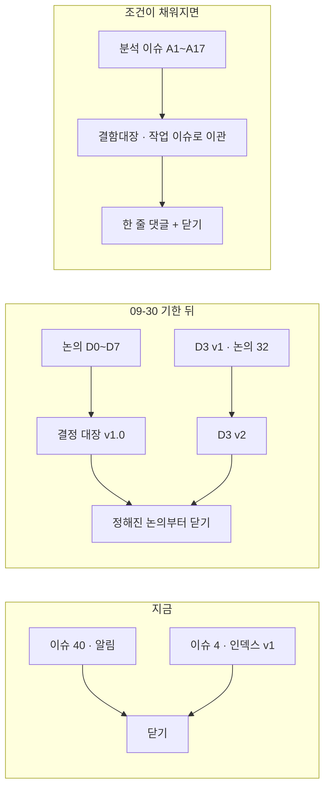

# [로드맵] Qurious 2.0 인덱스 v2 — 새 번호로 다시 묶은 이슈·논의 목록과 닫는 조건

> 작성 2026-09-29 (KST) · 이동원 · 옛 인덱스 #4(v1 · 09-15 작성)를 대신합니다 — v1 은 이 글을 올린 뒤 닫습니다.

> **쉬운 요약**
> 1. 옛 저장소에서 옮겨 온 글은 **번호가 바뀌었습니다.** 이 글이 새 번호 기준 목록입니다. 옛 번호는 `` `#1` `` 처럼 백틱으로 적습니다(새 번호와 겹치기 때문).
> 2. 2차는 **10-01(목)~10-21(수)**, 3차는 **10-22(목)~11-11(수)** 입니다(강사님 공식 일정). 논의 D0~D7 의견 기한은 **09-30(수) 23:59** — Discord 에 안건 번호와 한 줄로 남겨 주세요.
> 3. 글마다 **닫는 조건**을 한 줄로 붙였습니다(제안). 조건이 채워진 글은 닫고, 남은 일은 결함대장이나 체크리스트로 넘깁니다.

기준 커밋 `58367d4`(main · #42 머지 뒤). 확실도 · 🟢 파일·페이지로 확인 / 🟡 추론·재확인 전.

## 0. 한눈에 — 글이 흘러가는 길

```
 [분석] 이슈 A#          [논의] D#              결정 대장              [작업] 이슈 · PR
 지금 코드가 어떤가  ──▶  무엇으로 할까    ──▶  v0.9 → v1.0     ──▶  고치고 Closes #N
 (결함 · 근거)           (기한 · 투표)          (09-30 뒤)            (시험 · TIL)
      │                                                                   │
      └──── 닫는 때: 남은 결함이 결함대장 · 체크리스트로 옮겨지고, 걸린 논의가 정해진 뒤 ────┘
```

| 종류 | 끝나는 조건 | 끝내는 방법 |
|---|---|---|
| 분석 이슈 `[분석] A#` | 남은 결함이 [결함대장](https://github.com/EST-team-project/Qurious/blob/main/docs/시험/테스트계획서_v1.2.md)(테스트계획서 5절) 또는 작업 이슈로 옮겨지고, 걸린 논의가 정해짐 | 「어디로 옮겼는지」 한 줄 댓글 → 닫기 |
| 논의 `[논의] D#` | 안건이 모두 [결정 대장](https://github.com/EST-team-project/Qurious/blob/main/docs/계획서/논의결정대장_v0.9.md)에 확정 또는 「잠정」으로 적힘 | 결론 댓글 → 닫기 (카테고리가 General 이면 답 표시가 안 되므로 「해결됨」으로) |
| 작업 이슈 `[작업]` | 체크리스트가 다 채워짐 | PR 의 `Closes #N` 또는 손으로 닫기 |

## 1. 일정 — 강사님 공식 ([계획서 v1.2](https://github.com/EST-team-project/Qurious/blob/main/docs/계획서/프로젝트계획서_v1.2.md) 7절)

| 언제 (KST) | 칸 | 이 목록에서 걸리는 글 |
|---|---|---|
| **09-30(수) 23:59** | 논의 D0~D7 의견 기한 | #10 · #11 · #12 · #13 · #20 · #21 · #22 · #32 |
| 10-01(목) | 2차 착수 · 요구사항 | [RTM v1.0](https://github.com/EST-team-project/Qurious/blob/main/docs/요구사항/RTM_v1.0.md) → v1.1 |
| **10-06(화) 오전** | ERD·데이터 사전 · IA·와이어프레임 | #14 (IA v0.3 · 와이어프레임 v0.3) |
| 10-08(목) 오후 | 성향·자산배분 | #41 A7 · D5 #21 |
| **10-14(수) 오전** | 모의투자 | #18 A9 · D7 #13 · #35 E-1 |
| 10-16(금) 오전 | 모의투자 검증 | 일지를 쌓을 거래일이 많아야 5일 🟡 |
| 10-21(수) 오전 | 인수 · 최종 발표자료 | — |
| 10-22(목)~11-11(수) | 3차 (IA 칸 10-26(월) 오전) | #43 A5 · D6 #22 |

휴일 10-05(월) · 10-09(금)과 주말은 칸이 없습니다.

## 2. 논의 D0~D8

| 논의 | 번호 | 주제 | 지금 (09-29) |
|---|---|---|---|
| D0 | #10 | 팀 운영·기록 방식 | 결론 초안(7절) · 갱신 댓글 🟢 |
| D1 | #11 | Qurious 2.0 은 누구의 어떤 문제를 푸는가 | 결론 초안 · ③ 「동결 25」 중 5개가 강사님 공식 산출물이라 충돌 |
| D2 | #12 | 유료 서비스(AWS 등)·데모 방식 | 결론 초안 = 유료 클라우드 0원 · AWS 는 비용 합의 전까지 보류 |
| D3 | #32 | lumina-invest 기능 범위 | ②③⑤-1⑥ 은 09-30 까지 · **①④⑦⑧ 은 v2 에서 다시 여쭙니다(제안 · 09-29 댓글)** |
| D4 | #20 | 1차 매듭 — 비용·누수·검정 규격 | 결론 초안 · 수정주가 오염 DF-01 2곳 고침 반영 |
| D5 | #21 | 2차 로보어드바이저 설계 | 결론 초안 · 10-08 칸이 이 결과를 씀 |
| D6 | #22 | 3차 커스텀 인디케이터 | 결론 초안 · Pine 결함 DF-05·06 코드는 그대로 |
| D7 | #13 | 모의투자 체결·기록 | 결론 초안 · 2026 매도세 재대조 🟡(코드 0.20% vs 법령 판독 0.15%) |
| D8 | 아직 안 올림 | CI(자동 시험)를 둘 것인가 | [기록](https://github.com/EST-team-project/Qurious/blob/main/docs/github-archive/2026-09-21/논의-069/00-기록.md) · 올린 뒤 번호를 여기 적습니다 |
| 의견 공유 | #31 | 2차·3차 의견 (원 작성 `rkdalstjr`) | D5 · D6 로 이어짐 |

기한 뒤 결정 대장 v1.0 에 옮기고, 안건이 모두 정해진 논의부터 닫습니다. D3 은 v2 를 새로 올린 뒤 v1(#32)을 닫습니다.

## 3. 분석 A1~A17 — 한 줄 현황과 닫는 조건

「옛 번호」 칸은 아직 다시 올리지 않은 글입니다 — 원문은 기록 파일에 있습니다.

| 분석 | 번호 | 지금 한 줄 | 남은 것 | 닫는 조건 (제안) |
|---|---|---|---|---|
| A1 실행 환경 | #9 | 국내 주식 일봉을 앱이 수집 DB 에서 읽음 · 매일 갱신은 작업 스케줄러 12:30 | 팀원 PC 사양 표 · compose 비밀번호 하드코딩 | D2 확정 + 사양 표 |
| A2 데이터 계층 | #44 | 현금 장부 하나(#25) · `orders` 비용 칸 · Postgres 26표 | 일지·일별 잔고 표 없음 · 인덱스 어긋남 4 · DF-03 | D7 ⑤ 일지 표가 생기면 |
| A3 인증 | #45 | 실거래 관문(ADR-0001) · 로그아웃 폐기는 `jti` 로 | 인증 자동 시험 0 · DF-07 `docker.sock` · 자동매매 소유자 검사 | D3 ③⑥ 확정 + 인증 시험 |
| A4 시장 데이터 | 옛 `#23` ([기록](https://github.com/EST-team-project/Qurious/blob/main/docs/github-archive/2026-09-17/이슈-023/00-기록.md)) | 국내 일봉 = 수집 DB · 모르는 등락률은 `null`(#30) | ETF 적재 0건 · `sync.*` 2개 외부 API | D3 ⑦ · D5 ① 뒤 |
| A5 기술지표 | #43 | `cost_bps` 무시 고침 | 가짜 볼린저(#26 B1) · DF-05·06 | D6 확정 + DF-05·06 |
| A6 ML·백테스트 | #38 | 두 화면이 같은 요율표 | 교차검증 누수 3곳 코드 그대로 · LEAN 비용 0 | D4 ②④ 코드 교체 |
| A7 자산배분 | #41 | 자체 지수 12계열(화면 미연결) | 스크리닝 31종목 고정 · 음수 현금 · 재무 없음 | D5 ②③⑦ → 10-08 칸 |
| A8 브로커 | #17 | 신 TR · `rt_cd` 검사 · live 관문 | 결함 5·6(TLS 검증 끔 · 키 평문) · 증권사 응답 시험 0 | 결함 5·6 을 결함대장으로 |
| A9 주문·장부 | #18 | 현금 장부 하나 · 비용 차감(97.4원 확인) | **E-1 자동매매 체결가 = 어제 종가**(#35) · 결함 4 · 일지 | E-1 · D7 ⑤ |
| A10 LLM·RAG | 옛 `#24` ([기록](https://github.com/EST-team-project/Qurious/blob/main/docs/github-archive/2026-09-17/이슈-024/00-기록.md)) | 코드 변경 0 | 공식 일정의 RAG 대화·지식 검색 ↔ D1 ③ 동결 | D1 ③ · D3 ④ |
| A11 크롤링 | 옛 `#25` ([기록](https://github.com/EST-team-project/Qurious/blob/main/docs/github-archive/2026-09-17/이슈-025/00-기록.md)) | HF private 공유 운영(🟡 조건부) · 네이버 학습용 적재 | DF-03 `hash()` | D0 ⑥-1 · D3 ⑤-1 |
| A12 알림·감사 | 옛 `#27` ([기록](https://github.com/EST-team-project/Qurious/blob/main/docs/github-archive/2026-09-17/이슈-027/00-기록.md)) | 코드 변경 0 | D3 ①②③ · 공식 「알림 관리」 화면과 충돌 | D3 v2 뒤 |
| A13 프론트 SPA | 옛 `#28` ([기록](https://github.com/EST-team-project/Qurious/blob/main/docs/github-archive/2026-09-17/이슈-028/00-기록.md)) | IA v0.2 · 와이어프레임 v0.2 · 화면 결함 18건(#26) | Pine DF-05·06 · 상단 탭 넘침 · 모바일 메뉴 | IA v0.3(10-06) |
| A14 인프라·CI | #8 | CI 는 걷어냄(ADR-0003) · 정기 실행 = 작업 스케줄러 | CI 형태(D8) · AWS 보류 | D2 · D8 결론 |
| A15 격차표 | #7 | 요구 추적은 [RTM v1.0](https://github.com/EST-team-project/Qurious/blob/main/docs/요구사항/RTM_v1.0.md) 으로 넘어감 | 8절 행별 확인 요청 | RTM v1.1 이 8절 행을 옮기면 |
| A16 1차 유산 | #5 | HF 결과 표 6개가 public 이었음 → 전부 private | 8절 1차 담당 확인 ②③④ | 확인 3건에 답 |
| A17 강사님 자료 | #6 | 강사님 자료 변경 추적 댓글을 여기 남김 | 계속 | 3차 끝(11-11)까지 열어 둠 |

## 4. 설계·작업 이슈 (2026-09-28~)

| 번호 | 무엇 | 닫는 조건 |
|---|---|---|
| #14 | 화면 IA v0.1 → v0.2 · 💬 Q7 답 대기 | IA v0.3(10-06 칸 전) |
| #26 | 화면이 실제보다 더 말하는 곳 18건 — 파트별 체크리스트 | 체크리스트가 다 채워지면 |
| #35 | 수집 DB 다리 뒤 「현재가 = 어제 종가」 5곳 | E-1 · D-1 등 5칸 |
| #37 | HF 데이터셋 private 체크리스트 | 본문 5절 3칸(첫 월간 점검 10-28 무렵) |
| #40 | [알림] 강사님 원본 점검(옛 `#15`) | **지금 닫아도 됩니다** — 점검은 #6 에서 이어 감 |
| #15 · #24 | 추적 이슈(→ #6) · 모의투자 장부 불일치 | 닫힘 |



## 5. 정본 문서 — 숫자와 상태는 이쪽이 먼저입니다

| 문서 | 지금 판 | 무엇을 보나 |
|---|---|---|
| [산출물 목록](https://github.com/EST-team-project/Qurious/blob/main/docs/산출물목록.md) | v1.9 | 강사님 산출물 10구분 · 문서 판 현황(0.1절) |
| [프로젝트 계획서](https://github.com/EST-team-project/Qurious/blob/main/docs/계획서/프로젝트계획서_v1.2.md) | v1.2 | 공식 일정(7절) |
| [논의 결정 대장](https://github.com/EST-team-project/Qurious/blob/main/docs/계획서/논의결정대장_v0.9.md) | v0.9 | 결론 초안 64행 — 09-30 뒤 v1.0 |
| [RTM](https://github.com/EST-team-project/Qurious/blob/main/docs/요구사항/RTM_v1.0.md) · [강사님 자료 기능 대조](https://github.com/EST-team-project/Qurious/blob/main/docs/요구사항/강사님자료-기능대조_v0.1.md) | v1.0 · v0.1 | 요구 29개 · th03 기능 26개 |
| [IA](https://github.com/EST-team-project/Qurious/blob/main/docs/화면/IA_v0.2.md) · [와이어프레임](https://github.com/EST-team-project/Qurious/blob/main/docs/화면/와이어프레임_v0.2.md) | v0.2 · v0.2 | 주 경로 12화면 |
| [ERD](https://github.com/EST-team-project/Qurious/blob/main/docs/데이터/ERD_v1.1.md) · [데이터 사전](https://github.com/EST-team-project/Qurious/blob/main/docs/데이터/데이터사전_v1.1.md) | v1.1 | 수집 DB 1,346만 행 · 앱 DB 26표 |
| [테스트계획서](https://github.com/EST-team-project/Qurious/blob/main/docs/시험/테스트계획서_v1.2.md) | v1.2 | 시험 117건 · **결함대장 16건(5절)** |
| [기록 폴더](https://github.com/EST-team-project/Qurious/tree/main/docs/github-archive) · [갱신 대장](https://github.com/EST-team-project/Qurious/blob/main/docs/github-archive/갱신대장.md) | — · v0.2 | 옛 글 75건 원문 · 옛↔새 번호 · 닫기 후보 |

## 6. 용어 — 이 글에서 쓰는 뜻

| 말 | 뜻 | 헷갈리는 점 |
|---|---|---|
| 옛 번호 | 09-23 까지 쓰던 저장소(`devlee328288/Qurious`)의 글 번호 | 새 저장소 번호와 **숫자가 겹칩니다** — 그래서 옛 번호는 백틱으로만 씁니다 |
| 정본 | 여러 사본 중 기준이 되는 한 부 | GitHub 글과 저장소 파일이 다르면 **파일**(기록 폴더 · docs)이 정본입니다 |
| 결함대장 | 테스트계획서 5절의 결함 목록(DF-01~16) | 이슈 번호가 아니라 `DF-번호`로 부릅니다 |
| 갱신 댓글 | 다시 올린 옛 글 아래에 「올린 뒤 바뀐 것」을 적은 댓글 | 본문은 옛 사실 그대로라, 댓글과 같이 읽어야 합니다 |
| 닫는다 | 할 일이 없어졌다는 표시 | 지우는 게 아닙니다 — 닫힌 글도 검색·링크로 계속 읽힙니다 |

닫는 조건은 제안입니다. 다르게 봐야 할 글이 있으면 이 글에 댓글로 알려 주세요. 목록이 많이 바뀌면 본문을 고치지 않고 v3 으로 새로 씁니다.
