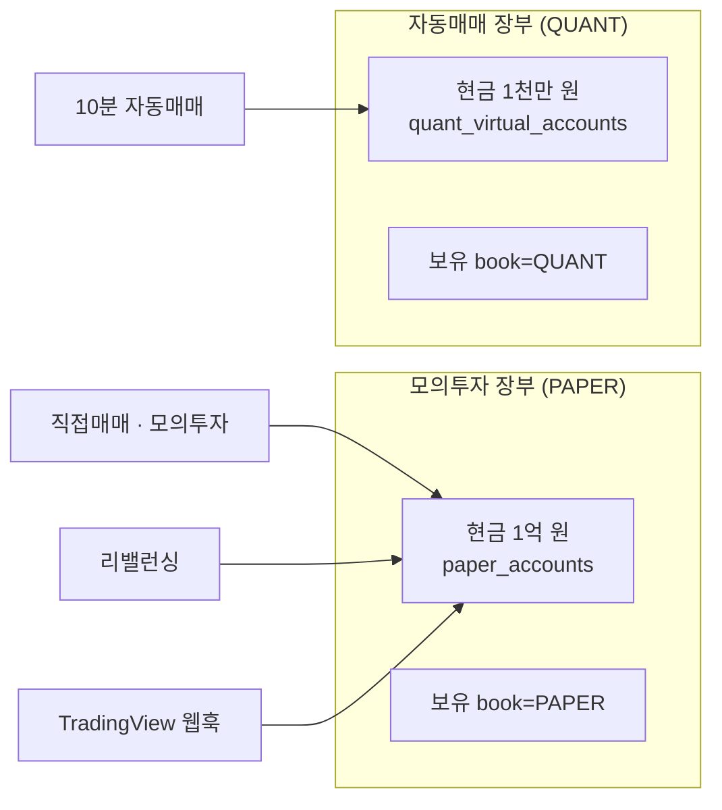

> **쉬운 요약 3줄**
> 1. 강사님이 09-29 에 lumina-invest(= Qurious 의 기초 코드)를 크게 고쳤습니다 — 리밸런싱 · 위험 한도 · TradingView 웹훅 · 수식 지표 · 투자 성향 · XAI · 차트 패턴과 시험 59건. **이것을 Qurious 에 반영했습니다**(PR 「chore: 강사님 lumina-invest 최신(b055ab0)을 기초 코드로 반영」 · PR 목록에서).
> 2. 원칙은 「강사님 방식을 따르고, 우리 고침 중 방향이 같은 것은 지킨다」 입니다 — 다른 파트가 강사님 최신 구조 위에서 바로 시작할 수 있게 하려는 것입니다.
> 3. 다만 프로젝트는 **「나만의」 어드바이저 · 인디케이터**라, 강사님 방식과 우리 방향이 갈리는 곳 **10가지**를 여기 모았습니다. 의견을 주시면 결정 대장에 옮깁니다.

- 올린 사람: 이동원(데이터 파트) · 의견 기한(제안): **10-06(화) 09:00** — 강사님 일정표의 IA · 와이어프레임 · ERD 칸 전
- 의견은 Discord 나 이 글 댓글로 — 번호(① ~ ⑩)만 적어 주셔도 됩니다

## 1. 무엇을 받았나

강사님 변경 80경로(09-29 · 4커밋 · `039bf43` → `b055ab0`) 중 AWS 4개와 CI 워크플로 1개를 빼고 모두 반영했습니다.

| 강사님이 넣은 것 | 닿는 요구 | 시험 | 화면(메뉴) |
|---|---|---|---|
| 리밸런싱 엔진 — 시간 · 이탈률 · 현금흐름 · 수동 계기 | `P01-③-1` ~ `③-3` · `U5` | 10 | 리밸런싱 (새) |
| 위험 한도 — 중복 주문 쿨다운 · 일 주문 수 · 종목 비중 · 일손실 한도 → 비상 정지 | ★ `P02-⑤-2` | 5 | 자동매매 |
| TradingView 웹훅 수신 → 모의 체결 → 알림 · Strategy Tester 대 LEAN 비교 | `P02-③-2` · `③-3` · `④-3` | 8 | TradingView 연동 (새) |
| 수식 지표 — 문자열 산식 · 과거로만 `shift` · 판 관리 · Pine 코드 생성 | `P02-②-1` · ★ `P02-②-2` · `P02-③-1` | 9 | 수식 지표 (새) |
| 미래 데이터 참조 방지 시험 | ★ `P02-②-2` | 8 | — |
| 투자 성향 7문항 · 목표 수익률 달성 확률 | `U1` · `U4` | 4 | 로보 어드바이저 |
| XAI — LightGBM 기여도로 판단 근거 설명 | `P01-①-5` | 2 | 로보 추천 · 성과 검증 |
| 차트 패턴 — 캔들 · 지지와 저항 · 돌파 · 여러 주기 종합 | `P01-②-2` | 7 | 패턴 분석 (새) |
| 백테스트 손절 · 익절 · 슬리피지 | `P01-④-1` · `P02-①-2` | 6 | 성과 검증 · 커스텀 인디케이터 |
| 화면 스크립트를 기능별 파일로 나눔(`app.html` 안 한 덩어리 → `public/js/` 새 파일 16개) · 화면별 「기능 완성도」 배지 | IA 전체 | — | 전 화면 |

숫자로 보면 — 시험 188 → **249건**(모두 통과) · API 146 → **181개** · 화면 49 → **53개** · 앱 DB 표 +8 · 시험이 붙은 요구 11 → **27개**(강사님 원문 세부 기능 29개 중 6 → 19).

```
 시험이 붙은 요구 (강사님 원문 세부 기능 29개 중)
 반영 전  ██████                    6
 반영 뒤  ███████████████████       19
```

## 2. 지킨 것 · 뺀 것

- **지킨 우리 고침** — 실거래 차단(ADR-0001 · 자동매매 경로 포함) · 주문 비용(세금 · 수수료 · ETF 면세) · 수집 DB 어댑터(국내 일봉) · 라우트 캐시 · KIS 신 거래 ID · JWT 비밀키 보호 · AWS 제거. 강사님의 인증서 검사 켜기(`verify=False` 제거)는 우리가 더한 체결 조회 함수에도 맞췄습니다.
- **뺀 것** — AWS(SageMaker 학습 · EC2 배포 · Ansible 비밀 파일 2개 삭제분)와 CI 워크플로(`test.yml` — CI 논의 D8 전이라).
- **번호** — 강사님 마이그레이션 `0003` ~ `0008` 은 우리 `0003_trading_cost` 뒤로 `0004` ~ `0009` 로 옮겼습니다(이미 올린 DB 를 깨지 않게).

## 3. 우리 방향으로 고칠 수 있는 곳 — 10가지

지금 코드는 **왼쪽(강사님 방식)** 입니다. 오른쪽이 우리가 했던 것 또는 대안입니다.

| # | 무엇 | 지금 (강사님 방식) | 우리가 했던 것 · 대안 | 걸린 논의 · 요구 |
|:-:|---|---|---|---|
| ① | 자동매매 장부 | 둘 — 자동매매 = 가상계좌 1천만 원 + 보유 `QUANT` / 모의투자 · 직접매매 · 리밸런싱 · TradingView = 1억 원 + 보유 `PAPER` | 09-28 우리 수정(I14)은 현금 하나로 합쳤다 — 「내 규칙을 믿어도 되는지」 를 한 계좌 기록으로 볼지 | D7 ③ · `P01-④-3` |
| ② | 성과 검증 화면의 비용 | 입력칸의 수수료 + 슬리피지를 대칭으로 뗀다 | 연도별 실제 요율(매도에만 세금 · `cost_model=real`)을 기본으로 — API 는 둘 다 받는다 | D4 ① |
| ③ | CI(자동 시험) | 강사님은 push · PR 마다 시험 후 배포 | 넣을지 · 어떻게 — 시험 249건이 로컬 1분 남짓 | D8 · ADR-0003 |
| ④ | 야후 의존 새 3곳 | 환율(`KRW=X`) · 60분봉 패턴이 야후를 부른다 | 공식 출처나 수집 DB 로 바꿀지 · 60분봉은 수집 DB 에 없다 | 데이터 출처 원칙 · `P01-①-2` |
| ⑤ | 새 화면 4개의 자리 | 리밸런싱 · 패턴 분석 · TradingView · 수식 지표가 메뉴에 들어왔다 | D1 ③(주 경로 · 동결) 분류에 넣기 — 지금 「미분류」 | D1 ③ · IA v0.3 |
| ⑥ | 관리자 초기화 | 두 장부의 보유는 지우고 자동매매 현금은 남긴다 → 자동매매 장부가 어긋난다 | 함께 지우거나 초기 현금으로 되돌리기 | 감사 · 초기화(D3 ②) |
| ⑦ | 웹훅 받는 쪽 확인 | API 키로 사용자 식별 · 같은 종목 · 방향 1분 안 반복은 중복으로 무시 · API 키당 분당 30건 · 발신 IP 허용 목록(기본 꺼짐) | 요구의 「보낸 쪽 확인」 — IP 목록을 기본으로 켤지 · 본문 비밀 토큰을 더할지 · 중복 창(1분)을 우리 주기에 맞출지 | `P02-③-3` |
| ⑧ | 예약 작업 두 개 | Celery 로 자동매매 10분 · 리밸런싱 1시간 | 수집은 작업 스케줄러(매일 12:30) — 실행처를 하나로 볼지 | D2 ④ · D7 ④ |
| ⑨ | 「기능 완성도」 배지 | 강사님이 화면마다 점수(UI 20 · 백엔드 30 · 연동 25 · 시험 25)를 붙였다 | 우리 IA 의 화면 판정(🟢 🟡 🔴)과 두 벌 — 하나로 | D3 ⑧ · IA |
| ⑩ | 다음 반영 규칙 | 강사님이 또 고치면 | 이번처럼 3-way 병합 + 이 표에 추가 · 번호는 우리가 밀기 | 운영(D0) |



그림 1 은 ① 을 보여 줍니다 — 지금은 두 장부가 섞이지 않고, 모의투자 화면은 왼쪽만 셉니다.

## 4. 이 글로 옛 서술이 바뀌는 글

아래 글의 해당 칸은 이 글이 대신합니다(글마다 댓글을 따로 달지 않으려고 모았습니다).

- 논의 D7 [#13](https://github.com/EST-team-project/Qurious/discussions/13) ③ — 「C1 이 I14 로 절반 구현」 → 강사님 방식(장부 둘)으로 바뀜 · ① 에서 다시
- 이슈 A9 [#18](https://github.com/EST-team-project/Qurious/issues/18) · A2 [#44](https://github.com/EST-team-project/Qurious/issues/44) — 「현금 장부 하나(I14)」 → 장부 둘
- 이슈 A7 [#41](https://github.com/EST-team-project/Qurious/issues/41) · A5 [#43](https://github.com/EST-team-project/Qurious/issues/43) · A13 [#61](https://github.com/EST-team-project/Qurious/issues/61) — 투자 성향 · 리밸런싱 · 수식 지표 · 화면 파일 구조가 새로 생김
- 인덱스 [#47](https://github.com/EST-team-project/Qurious/issues/47) — 다음 갱신 때 이 글을 목록에 넣습니다

자세한 파일 목록 · 병합 방법은 PR 본문과 저장소의 [강사님 자료 변경 추적 댓글](https://github.com/EST-team-project/Qurious/blob/main/docs/github-archive/2026-09-28/이슈-강사님자료-변경추적/03-2026-09-30-th06-기능-추가.md)에 있습니다.
