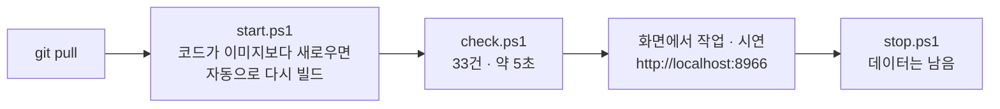

> **쉬운 요약**
> 1. AI 도구 없이도 **각자 PC 에서 Qurious 전체(화면 + API + DB + 예약 작업)를 띄우고, 기능이 도는지 확인**할 수 있게 PowerShell 스크립트를 만들었습니다 — `scripts/personal/`.
> 2. 평소엔 세 줄입니다: `start.ps1`(띄우기) → `check.ps1`(기능 점검) → `stop.ps1`(끄기). 기능 점검은 curl 로 API 를 하나씩 두드려 보던 일을 묶은 것으로, 기본 33건을 5초 안팎에 봅니다.
> 3. 팀에서 이야기한 대로 **로컬에서 전체 기능을 먼저 확인하고, AWS 배포는 강사님 안내가 나온 뒤에** 합니다. 시간 되실 때 한 번 돌려 보시고 마지막 결과 줄을 댓글로 남겨 주시면, 다른 PC 에서 막히는 곳을 안내서에 반영하겠습니다.

기준: `main`(이 글의 링크가 가리키는 스크립트 · 안내서가 들어간 뒤) · 확실도 🟢 = 2026-09-30 팀장 PC(Windows 11 · PowerShell 5.1 · Docker Desktop 28.5)에서 실행 확인.

## 1. 준비 — 처음 한 번

| 무엇 | 왜 | 확인 |
|---|---|---|
| Docker Desktop | DB 셋(PostgreSQL · Redis · Neo4j)과 앱을 컨테이너로 띄웁니다 | `docker version` 에 Server 줄 |
| PowerShell 5.1 이상 | 스크립트 실행 — Windows 기본이라 따로 설치할 것이 없습니다 | `$PSVersionTable.PSVersion` |
| (선택) Python 3.12 | 자동 시험(`test.ps1`) · 개발 모드(`dev.ps1`)에만 필요합니다 | `python --version` |

스크립트 실행이 막혀 있으면(「이 시스템에서 스크립트를 실행할 수 없으므로…」) 한 번만:

```powershell
Set-ExecutionPolicy -Scope CurrentUser RemoteSigned
```

## 2. 매일 쓰는 세 줄

저장소 폴더(`Qurious`)에서 PowerShell 을 열고:

```powershell
git pull                              # 코드 받기 — 받은 뒤에도 그냥 start 를 돌리면 됩니다
.\scripts\personal\start.ps1          # 1) 띄우기 — DB 먼저, 준비되면 앱. 끝나면 브라우저가 열립니다
.\scripts\personal\check.ps1          # 2) 기능 점검 — 통과 · 주의 · 실패 · 건너뜀 표
.\scripts\personal\stop.ps1           # 3) 끄기 — 컨테이너만 지우고 DB 데이터는 남습니다
```



`git pull` 로 코드를 받고 이미지를 다시 만들지 않으면 화면에 옛 코드가 보이는 착각이 생기는데, `start.ps1` 이 코드와 이미지의 시각을 비교해 필요하면 스스로 다시 만듭니다.

## 3. 스크립트 일곱 개

| 파일 | 하는 일 | 자주 쓰는 옵션 |
|---|---|---|
| `start.ps1` | 도커로 전체 실행 (사전 점검 → DB 셋 준비 대기 → 앱 · 예약 작업 → 헬스 체크 → 브라우저) | `-NoCelery` 가볍게 · `-Build` 강제 재빌드 · `-NoBrowser` |
| `check.ps1` | 기능 점검 (로그인 · 시세 · 전략 · 로보 · 매매 · 연동 · 시스템) | `-Full` 느린 ML 셋 · `-Write` 모의 매수 · 매도까지 · `-Group 시세` · `-SaveReport` |
| `status.ps1` | 지금 무엇이 떠 있나 (컨테이너 · 앱 응답 · 이미지 신선도 · 수집 DB · 디스크) | `-Data` |
| `logs.ps1` | 컨테이너 로그 | `-Service app` · `-Service celery-worker` · `-Follow` |
| `stop.ps1` | 끄기 (데이터 유지) | `-Keep` 멈추기만 · `-DeleteData` DB 까지 삭제(확인 입력) |
| `test.ps1` | 자동 시험 약 250건 — 일회용 시험 DB 를 띄웠다가 지웁니다 | `-Path tests\test_formula.py` · `-NoDb` |
| `dev.ps1` | 개발 모드 — DB 는 도커, 앱은 내 파이썬으로 · 코드를 저장하면 앱이 스스로 다시 켜짐 | `-Port 8000` |

각 스크립트 머리에 설명을 자세히 적어 두었습니다: `Get-Help .\scripts\personal\check.ps1 -Full`

`check.ps1` 의 기본 점검은 아무것도 바꾸지 않습니다. `-Write` 를 주면 **로컬 점검 전용 계정**(`smoke-check@example.com` · 없으면 처음 한 번 가입)의 모의투자에 매수 · 매도 1주씩이 남습니다 — 내 계정 데이터는 건드리지 않습니다.

## 4. 결과 예시 — 2026-09-30 팀장 PC

```text
  [ OK ] [시세] 국내 일봉 — 수집 DB 에서 오나
         GET /api/stocks/candles?symbol=005930.KS&period=1mo&interval=1d  → 200 · 23ms
         봉 19 개 · 출처 collector · 기준일 2026-09-28
  ...
  결과 — 통과 43 · 주의 1 · 실패 0 · 건너뜀 1  (46.7초)     ← -Full -Write 로 45건
```

- **주의 1** — LEAN 백테스트가 docker 모드인데 엔진 이미지(내려받는 크기 약 14GB)가 없습니다. 실제로 돌리면 받기 시작하니, 로컬 확인만 할 때는 `.env` 에 `LEAN_MODE=local` 을 권합니다.
- **건너뜀 1** — AI 채팅 · 문서 검색은 Ollama 가 있어야 합니다(설계상 동결 기능이라 실패로 세지 않습니다).
- 자동 시험 `test.ps1` 은 249건 전부 통과(86초)였습니다.

## 5. 자주 막히는 곳

| 이런 줄이 보이면 | 할 일 |
|---|---|
| 「Docker Desktop 이 꺼져 있습니다」 | Docker Desktop 을 켜고 고래 아이콘이 멈춘 뒤 다시 |
| 「포트 15432 를 이미 … 가 쓰고 있습니다」 | 로컬에 설치된 PostgreSQL 이나 다른 도커 프로젝트를 끄기 |
| 「컨테이너 이름 fin-ai-… 를 다른 프로젝트가 쓰고 있습니다」 | 그 프로젝트 폴더에서 `docker compose down` |
| 국내 일봉이 「주의」(출처가 collector 가 아님) | 수집 DB(`data\collector\market.sqlite3`)가 없는 것 — 데이터 파트에 말씀 주시면 복원 방법을 안내합니다 |
| `dev.ps1` 이 「앱 패키지가 빠져 있습니다」 | 가상환경 권장: `python -m venv .venv` → `.\.venv\Scripts\Activate.ps1` → `pip install -r requirements-dev.txt` |
| 한글이 깨짐 | 스크립트를 고쳐 저장할 때 **UTF-8 BOM** 으로 저장 (PowerShell 5.1 규칙) |

## 6. 부탁드리는 것 (시간 되실 때)

- [ ] `git pull` 뒤 `.\scripts\personal\start.ps1` 이 「준비 끝」 까지 가는지
- [ ] `.\scripts\personal\check.ps1` 의 마지막 「결과 — …」 줄을 댓글로 (실패가 있으면 그 `[실패]` 줄도 — `.env` 값 · 토큰은 빼고)
- [ ] (선택) 처음 돌리는 PC 라면 「준비 끝 (N초)」 의 N — 이미지 캐시가 없는 PC 의 첫 빌드 시간을 모르고 있습니다

담당 지정(Assignee)은 비워 둡니다.

## 7. 더 읽을 곳

- 스크립트 사용법(짧게): https://github.com/EST-team-project/Qurious/blob/main/scripts/personal/README.md
- **로컬 실행 안내서 v0.1** — 스크립트 안에서 일어나는 일(핵심 코드 · 그림 8개) · 점검 45건이 각각 무엇을 부르고 무엇을 보면 통과인지 · 점검으로 찾은 것 10가지 · 나중의 AWS 대응: https://github.com/EST-team-project/Qurious/blob/main/docs/배포/로컬실행안내서_v0.1.md
- 앱을 띄운 뒤 모든 API 를 눌러 볼 수 있는 자동 문서: `http://localhost:8966/docs`
