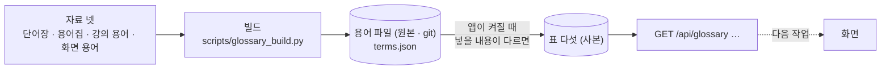

> **쉬운 요약**
> 1. 강사님 요구 원문의 첫 세부 기능 「용어사전과 연관 개념 탐색」 의 구현 방안(「domain-rag-lab 와 investment-analysis 의 통합」)을 받으려고, 그 **통합본을 AWS 만 빼고 저장소의 `rag-lab/` 폴더로 들여왔습니다.** 이 폴더는 **앱과 이어져 있지 않은 읽기 · 이식용 사본**입니다 — 고치지 않고, 기능은 묶음마다 `app/` · `public/` 에 새로 씁니다.
> 2. 첫 묶음인 **용어사전의 서버 쪽**을 만들었습니다 — 자료 넷을 합친 **용어 755개**를 표 다섯에 넣고 **API 넷**(로그인 없이 읽기)으로 돌려줍니다. 이름 · 약어 · 영어 · 초성 · 풀이로 찾습니다.
> 3. **화면은 아직 바꾸지 않았습니다.** 어느 화면에 어떻게 넣을지(새 화면 · 이미 있는 화면에 더하기)는 다음 작업에서 경우를 나눠 설계해 같이 봅니다. 연관 개념 탐색도 다음 작업입니다. 이 이슈는 작업 기록이고, PR 이 머지되면 닫힙니다.

기준 커밋 `90dde10`(main · 2026-09-30) + 이 이슈를 닫는 PR. 확실도 · 🟢 코드 · 실측으로 확인 / 🟡 추론 · 재확인 전.
영역: 역할 분배안(제안)의 **데이터 파트** — 역할 희망 논의(D9) 전이라 담당 지정은 비웁니다. 리뷰를 부탁드립니다.

## 1. 무엇이 들어왔나 — `rag-lab/`

| 무엇 | 수 | 어디 | 확실도 |
|---|--:|---|:-:|
| 저장소에 복사 | 314파일 · 57.6MB | `rag-lab/` — 원본과 파일마다 내용이 같은지 스캐너가 본다 | 🟢 |
| 팀 비공개 데이터셋에 보관 | 3파일 | 외부에서 받은 시세 자료 — 저장소에 두지 않는다(`.gitignore`) | 🟢 |
| 가져오지 않음 | 12파일 | AWS 배포 · 설정 | 🟢 |
| 통합본의 화면 | 73 (+ 강의 사이트 5장) | 기능 묶음 19개로 나눴다 — 새 화면 3 · 합침 5 · 바꿈 1 · 참고 2 · 보류 4 · 제외 4 | 🟢 |
| 통합본의 API | 110 | 앱에 실제로 걸린 것 107 | 🟢 |

```
 rag-lab/  ← 읽기 · 이식용 사본 (앱과 안 이어짐)
 ├─ 00-반입안내.md ···· 이 폴더가 무엇인지 · 고치지 말 것
 ├─ app/ ············· 통합본의 서버 코드 (Qurious 의 app/ 과 다른 것)
 ├─ frontend/ ········ 통합본의 화면 · 강의 사이트
 └─ data/ ············ 용어집 · 교재 글 · 그림
        │
        ▼  묶음 하나씩 — 화면을 먼저 설계하고, Qurious 방식으로 새로 쓴다
 app/ · public/  ← 여기에 생긴 것만 「구현됐다」
```

**알아 둘 것** 🟢
- `rag-lab/` 의 파일은 **고치지 않습니다** — 원본과 같아야 검사가 통과합니다(`python scripts/raglab_scan.py --check`).
- 도커 이미지에 들어가지 않고(`.dockerignore`), 요구 추적의 「코드 흔적」 에서도 뺐습니다 — 옮겨 놓은 코드가 구현된 것으로 읽히지 않게.
- 받은 뒤 `start.ps1` 을 돌려도 이미지를 다시 만들지 않습니다(같은 이름의 파일 때문에 매번 다시 만들던 결함을 이 PR 에서 고쳤습니다).
- 출처와 조건은 [NOTICE](https://github.com/EST-team-project/Qurious/blob/main/NOTICE.md) — 강사님 자료는 수업 중 구두 허가에 기대고 있어 **서면 확인을 여쭐 예정**입니다(아래 💬 ③).

## 2. 용어사전 — 서버 쪽



| 무엇 | 값 | 확실도 |
|---|---|:-:|
| 용어 · 분류 · 찾는 이름 | 755 · 22 · 1,688 (자료 항목 948개를 같은 말끼리 합침) | 🟢 |
| API | `GET /api/glossary?q=`(목록 · 검색) · `/categories` · `/meta` · `/{이름}`(한 건) — 로그인 없이 | 🟢 |
| 찾는 법 | 이름 · 약어 · 영어 이름 · 화면의 용어 키 · 초성(`ㅅㄱㅊㅇ`) · 풀이 — 정확히 같은 이름부터 다섯 단계 | 🟢 |
| 저장 | 원본은 git 의 용어 파일, 표는 그 사본 — 용어를 고치면 PR 에서 줄 단위로 보인다 | 🟢 |
| 확인 | 자동 시험 79건 · 기능 점검 「용어」 6건 · 응답 7~12 ms(로컬) | 🟢 |
| 화면 | **그대로** — 설명창은 화면 상수 55개를 보여 준다 | 🟢 |

설계와 근거(저장 방식을 고른 까닭 · 검색 순위 · 핵심 코드 · 한계)는 [용어사전 설계서 v0.1](https://github.com/EST-team-project/Qurious/blob/main/docs/설계/용어사전-설계_v0.1.md), 통합본 전체 목록과 옮기는 차례는 [통합본 이식 계획서 v0.1](https://github.com/EST-team-project/Qurious/blob/main/docs/설계/통합본-이식계획_v0.1.md)에 있습니다.

## 3. 다음 작업

- [ ] **화면 자리 설계** — 용어를 어디에 넣나(새 화면 · 메뉴 「금융 필수 지식」 묶음에 더하기 · 설명창만 넓히기). [화면 설계 절차 v0.1](https://github.com/EST-team-project/Qurious/blob/main/docs/화면/화면설계절차_v0.1.md)(제안)대로 경우를 나눠 그린 뒤 같이 봅니다
- [ ] **연관 개념 탐색** — 관련어 · 헷갈리는 짝 · 이름을 함께 쓰는 용어(요구의 뒷절반)
- [ ] 「금융 필수 지식」 의 개념 화면을 통합본의 금융 지식으로 보완

## 4. 💬 팀이 정할 것

| # | 무엇 | 지금 안 |
|:-:|---|---|
| ① | 용어를 화면 어디에 넣나 | 다음 작업에서 세 안을 나란히 그려 묻습니다 |
| ② | 화면 설계 절차(Figma 로 먼저 설계 · 경우 표 · 결정 기록)를 쓸까 | 제안 — 가볍게 줄여도 됩니다 |
| ③ | 강의 본문 · 교재 글 · 그림을 공개 저장소에 두어도 되는가 | 강사님께 서면으로 여쭙니다 — 안 된다고 하시면 뺍니다 |
| ④ | 통합본의 「보류」 묶음 넷(강의 사이트 · 퀴즈 · 머신러닝 실습 · 세무)을 옮길까 | 요구 목록 밖이라 뒤로 |
| ⑤ | 분류 22개를 화면에 다 보일까 | 화면 설계 때 |
