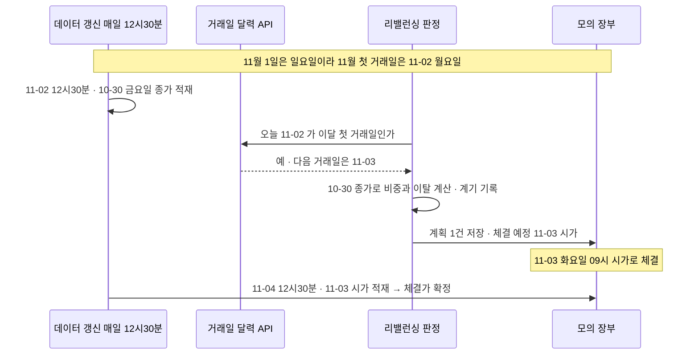
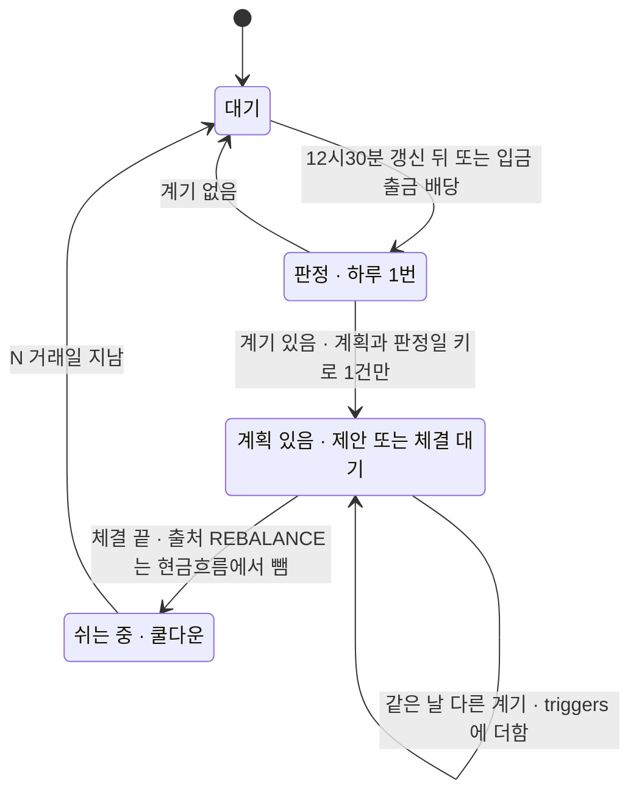
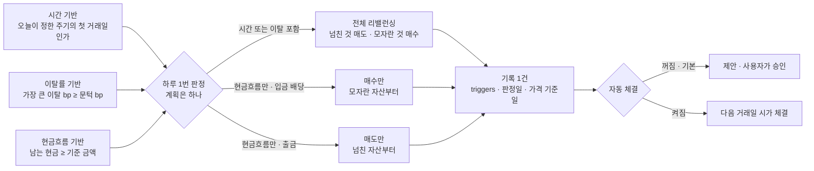

## 항목별 의견 — ③ 부담당 (2026-10-01)

논의 열어 주셔서 감사합니다. 7절 양식대로 짧은 답을 먼저 두고 아래에 항목별 까닭을 적었습니다. 코드 줄 번호는 `main` `5f8fdcf` 기준으로 하나씩 열어 확인했고, 외부 근거는 오늘(10-01) 직접 열어 본 것만 썼습니다(10절). 모두 제 생각이고, 정하는 것은 주담당님과 팀입니다.

> **쉬운 요약**
> 1. 본문 1절 표는 코드와 모두 맞습니다. 다만 코드가 본문보다 더 하는 일이 있습니다 — 현금도 이탈 계산에 들어가고, 시간 계기가 「1일 09:00」 이라 앞으로 12번 중 적어도 5번이 휴장일에 걸리며, 체결은 야후 현재가로 바로 됩니다.
> 2. 제 생각은 주기 월 · 분기 · 연(기본 「사용 안 함」 유지) · 이탈 5%p 「이상」 유지(대신 정수 bp 로 비교) · 현금흐름 C안 10만 원(누적은 「남는 현금」 으로) · 범위 A안입니다.
> 3. 실제 일봉 6.7년으로 재 보니 이탈 1%p 는 289번 · 연 22.8bp, 5%p 는 22번 · 7.0bp, 「매월 무조건」 은 80번 · 10.8bp 였습니다(예시 계좌 하나 · 가정은 3절).
> 4. 「첫 거래일」 에 필요한 거래일 달력과 배당 일정은 제 몫(목표 기능 ①)이라 W4(10-06 ~ 10-07)에 API 로 드리겠습니다. 배당 현금이 실제로 들어오는 날은 「지급일」 인데, 그 칸은 아직 없습니다(7절).

### 7절 양식 답

```text
시간 기반: 매월 · 매분기 · 매년 (+ 사용 안 함) — 매주 · 사용자 지정일은 지금은 빼기
          / 기본값 = 「사용 안 함」 유지 (이탈률을 매 거래일 확인하는 한)
          / 판정 = 매 거래일 1번, 12:30 데이터 갱신 뒤 · 전 거래일 종가 기준
            체결 = 다음 거래일 시가 (D7 ⑥-2) · 「첫 거래일」 은 거래일 달력으로
이탈률 기반: 5%p 유지 / 선택지 3 · 5 · 10%p + 직접 입력(0.5 단위) / 「이상」 유지, 비교는 정수 bp 로
현금흐름 금액: C / 10만 원 유지 / 건별 + 누적 둘 다 — 하루 1번 「목표보다 남는 현금」 을 보면 한 번에 됨
              · 입금 · 배당 = 매수만, 출금 = 넘친 자산부터 매도
현금흐름 범위: A / 리밸런싱 자체 체결은 넣지 않음 (B 라면 주문 출처 REBALANCE 제외 + 하루 1건)
기타 의견: ① 하나의 계획 + triggers 목록 기록 찬성
          ② 이탈률에 「확인 시점: 매 거래일 / 시간 기반 날에만」 칸 하나 → D5 ③ C 도 고를 수 있게
          ③ 플랜 밖 종목 전량 매도 · 체결 비용 기록 · 휴장일 판정 (8절)
```

---

## 1. 현재 구현 상태 — 본문 표를 코드와 맞춰 봤습니다

| 본문 1절 | 코드 (줄) | 맞나 |
|---|---|:-:|
| 시간 기반 — 사용 안 함 · 월 · 분기 · 연 | `time_period` 기본 `"none"` (`app/models/rebalance.py:39` · `alembic/versions/0004_rebalance.py:45`) · 선택지 `TIME_PERIODS` (`app/models/rebalance.py:20`) | 🟢 |
| 이탈률 — 켜짐 · 5%p **이상** | `drift_enabled` 참 · `drift_threshold_pct` 5.0 (`app/models/rebalance.py:43-44`) · 판정 `max_drift >= plan.drift_threshold_pct` (`app/services/rebalance.py:204`) | 🟢 |
| 현금흐름 — 켜짐 · 1건 10만 원 **이상** | `cashflow_enabled` 참 · `cashflow_min_amount` 100,000 (`app/models/rebalance.py:47-48`) · 판정 `amount >= plan.cashflow_min_amount` (`rebalance.py:459`) | 🟢 |
| 자동 체결 — 꺼짐 · 제안 생성 | `auto_execute` 거짓 (`app/models/rebalance.py:51`) · 꺼져 있으면 `record_proposal` (`rebalance.py:370-374`) | 🟢 |
| 달력상 월 · 분기 · 연 시작일 | `next_period_start` (`rebalance.py:96-106`) — 「1일 00:00 UTC」 = 한국 시각 1일 09:00 · 화면 이름도 「매월 1일 · 매분기 첫날 · 매년 1월 1일」 (`public/app.html:1392`) | 🟢 |

**본문에는 없지만 판단에 닿는 것 다섯 가지**

1. 이탈 계산에 **현금 칸도 들어갑니다.** 가장 많이 벗어난 한 칸(현금 포함)을 봅니다(`rebalance.py:171-178` · `:190-193`). 플랜에 없는 보유 종목은 목표 0% 로 셉니다(`:168` · `:176`).
2. 시간 · 이탈 점검은 **1시간마다** 야후 현재가로 돌고(`app/celery_app.py:106-110`), 체결도 야후 현재가로 **바로** 됩니다(`rebalance.py:306` → `app/services/paper_trading.py:226-227` → `app/services/stock.py:100-105`).
3. `next_run_at` 이 「1일 09:00」 이라 휴장일에도 켜집니다. 함수 원문을 떼어 지금(10-01) 기준으로 돌려 보니 월 = **11-01(일)**, 분기 · 연 = **2027-01-01(금 · 신정)** 이었습니다. 다음 12번(2026-11 ~ 2027-10)의 1일 중 적어도 5번이 휴장일입니다 — 11-01(일) · 01-01(신정) · 03-01(삼일절) · 05-01(토) · 08-01(일).
4. 「배당」 이벤트는 사람이 화면에서 금액을 넣는 것이고(`app.html:1428` 「배당금 수령」), 배당 자료와 이어져 있지 않습니다.
5. 시험 10건(`tests/test_rebalance.py`)은 목표 비중 정리와 다음 주기 계산만 봅니다. 이탈 경계 · 현금흐름 · 겹침은 시험이 없습니다(RTM v1.1 TC-RB 줄과 같음).

**본문 밖 문서와 코드가 다른 곳 셋** — 정할 때 같이 보면 좋겠습니다.

- 요구 `P01-③-2` 원문 「허용 이탈률을 **넘으면**」 · RTM 「넘을 때만」(`docs/요구사항/RTM_v1.1.md:137`) · 제가 09-29 에 쓴 기능 설계서 v0.1 「정확히 5%p 는 안 함」(`docs/설계/기능설계_v0.1.md:350`)은 「초과」 쪽이고, 강사님 코드는 「이상」 입니다. 제 설계서는 강사님 코드가 들어오기 전 초안이라, 어느 쪽으로 정해지든 제 문서를 고치겠습니다.
- 요구 `P01-③-3`(RTM 확정 · `RTM_v1.1.md:138`)은 「**파는 주문 없이** 그 현금으로 가장 모자란 자산부터」 인데, 코드의 현금흐름 계기는 시간 · 이탈과 같은 `propose()` 를 불러 매도까지 냅니다(`rebalance.py:461` → `:364` → `:243-265`).
- D7 ⑥-2(결정 대장 v0.9 · 🟢 확정 예정 · D0 ② 잠정 위)는 체결가를 「다음 거래일 시가」 로 두었는데, 리밸런싱은 위 2 처럼 즉시 체결입니다. 다음 거래일 시가로 체결하는 경로는 아직 없습니다(D7 09-28 갱신 댓글).

---

## 2. 시간 기반

**추천**

- 주기는 매월 · 매분기 · 매년(+ 사용 안 함)이면 충분하다고 봅니다. 매주 · 사용자 지정일은 지금은 빼는 쪽입니다.
- 기본값은 지금처럼 「사용 안 함」 — 이탈률을 매 거래일 확인하는 것이 켜져 있다는 전제입니다.
- 실행 시각은 **판정**과 **체결**을 나눠 정하면 좋겠습니다. 판정 = 매 거래일 1번, 12:30 데이터 갱신이 끝난 뒤(전 거래일 종가 기준) · 체결 = 다음 거래일 시가(D7 ⑥-2).
- 「첫 거래일」 은 거래일 달력으로 정합니다(7절 — 제 몫).

**까닭**

1. **비용.** 실데이터 예시(3절 표 2)에서 「매월 무조건」 80번 · 연 10.8bp, 「매분기」 26번 · 6.3bp, 「매년」 6번 · 2.6bp, 「매 거래일」 1,653번 · 42.5bp 였습니다. 매주는 그 사이입니다 — D5 ③ 의 합성 데이터 표에서도 주 1회 20.6bp 로 월 1회(10.0)의 두 배였습니다. Vanguard(2022)도 매 거래일 달력 리밸런싱을 가장 비효율로, 월 · 분기 달력 리밸런싱을 「너무 잦음」 으로 봤습니다(미국 주식 · 채권 장기 포트폴리오 기준).
2. **규정의 최소선.** 로보어드바이저의 법적 이름은 「전자적 투자조언장치」(자본시장법 시행령 제2조 제6호)이고, 그 요건인 금융투자업규정 제1-2조의2 제1호 나목 2)는 투자자문 · 일임에서 「**매 분기별로 1회 이상**」 안전성 · 수익성 · 투자성향 적합성을 **평가**해 필요하면 바꾸라고 합니다. 「분기마다 리밸런싱」 이 아니라 「분기 1회 이상 평가」 입니다. 우리 앱은 허가 사업자가 아니라 의무는 아니지만, 이탈률을 매 거래일 판정하고 기록하면 그 최소선을 넘습니다(D7 ⑤ 「매 거래일 1행 · 관망 포함」 일지와 같은 모양).
3. **기본 「사용 안 함」 의 까닭.** 지금 기본(이탈 5%p · 매 거래일 확인)은 예시에서 22번 · 연 7.0bp 였고 목표에서 가장 멀어진 폭이 6.3%p 였습니다. 여기에 「매월 무조건」 을 더하면 거래가 80번대로 늘어납니다.
   - D5 ③ 에서 제가 「월 1회 확인 + 5%p」(C)를 추천했는데, 실데이터로는 15번 · 6.2bp 로 비용은 비슷하고 가장 멀어진 폭은 11.3%p 로 더 컸습니다(한 달 사이 크게 움직인 구간). 확인하는 데 사람 손이 들지 않는 앱이라면 「매일 확인 + 넓은 띠」 가 낫다고 생각을 고칩니다. Daryanani(2008)의 「드물게 거래하되 자주 들여다보라」 와 같은 방향입니다. D5 ③ 은 결정 대장 v1.0 을 정리할 때 이 결과를 함께 적겠습니다.
4. **매주 · 사용자 지정일.** 지정일(예: 매월 15일)은 31일 · 휴장일 규칙이 늘고, 「첫 거래일」 하나면 거래일 달력만 붙이면 됩니다. 매주는 2차에서 쓸 곳이 뚜렷하지 않습니다. 다만 시연 기간(10-14 ~ 10-20)에는 월초가 없어 시간 계기가 저절로 켜지지 않으니, 시연은 「지금 점검」(`POST /api/rebalance/check`)으로, 시험은 날짜를 넣어 돌리는 방식으로 보이면 됩니다.
5. **실행 시각.** 우리 데이터는 매일 12:30 에 **전 거래일** 시세가 들어옵니다 — 09-30 회차는 12:30:01 → 12:59:08 에 끝났고 넣은 마지막 시세일은 09-29 였습니다(`python scripts/daily_update.py status`). 그래서 판정은 갱신 뒤 하루 1번이 자연스럽고(D7 ④ R2 「기록 매 거래일 1회」), 체결은 D7 ⑥-2(확정 예정)를 따르면 다음 거래일 시가입니다. 그러면 「매월 첫 거래일」 은 그날 오후 판정 → 둘째 거래일 시가 체결 → 셋째 거래일 12:30 에 체결가 확정이 됩니다(그림 1). 지금처럼 장중 1시간마다 실시간 값으로 보면 같은 날에도 판정이 바뀔 수 있고, 휴일에도 돕니다.

**그림 1. 「매월 첫 거래일」 판정에서 체결가 확정까지 (2026년 11월 예)**



판정 전에 「가격 기준일 = 전 거래일」 인지 확인하면 갱신이 늦은 날에도 어제 값으로 잘못 판정하지 않습니다(7절의 데이터 상태 API).

**다른 선택지**

| 안 | 좋은 점 | 아쉬운 점 |
|---|---|---|
| 매주 추가 | 시연 때 자주 켜짐 | 비용 증가 · 월요일 휴장 주 처리 |
| 사용자 지정일 추가 | 월급날 같은 날에 맞춤 | 31일 · 휴장일 규칙이 늘어남 |
| 기본 「매월」 (무조건) | 정기 점검이 눈에 보임 | 예시 기준 거래 80번 · 연 10.8bp |
| 기본 「매월 확인 + 5%p」 (D5 ③ C) | 확인 날짜가 정해져 설명이 쉬움 · 15번 · 6.2bp | 한 달 사이 급변을 못 잡음(예시 최대 11.3%p) |
| 실행 = 지금처럼 장중 실시간 값 · 즉시 체결 | 화면에서 바로 보임 | D7 ⑥-2 와 다름 · 연초 첫날은 10시 개장(2026-01-02 사례) · 야후 의존(#69 ④) |

**뒤집을 조건**

- D5 ③ 이 C(월 1회 확인 + 5%p)로 확정되면 → 기본 「매월」 + 이탈률 「시간 기반 날에만 확인」(6절 ②).
- 거래일 달력(W4)이 10-12 리밸런싱 칸 전에 나오지 않으면 → 임시로 「1일이 주말 · 1월 1일이면 다음 평일」 규칙(임시공휴일은 못 잡음).
- 팀이 「시연에서 바로 체결되는 모습」 을 우선하면 → 수동 실행만 즉시 체결, 자동 계기는 다음 거래일 시가.
- 실행처(Celery 1시간 vs 작업 스케줄러 12:30)는 #69 ⑧ 에서 정해지는 대로 따릅니다.

**확실도** 🟢 코드 · 날짜 계산 · 갱신 시각 · 규정 원문 / 🟡 2027 휴장일(임시공휴일 · 첫날 10시 개장 여부는 거래소 공지 전) · 실데이터 예시는 계좌 하나

---

## 3. 이탈률 기반

**추천** 기본 5%p 유지 / 선택지 3 · 5 · 10%p + 직접 입력(0.5 ~ 50, 0.5 단위 — 지금 서버 · 화면 범위 그대로 `rebalance.py:127-128` · `app.html:1394`) / 경계는 「이상」 유지 — 대신 비교를 정수 bp 로.

**까닭**

1. 5%p 는 연구 · 실무에서 흔한 값입니다. Vanguard(2015)는 「연 1회 또는 반년 1회 확인 + 5% 문턱」 을 대부분의 투자자에게 위험 통제와 비용의 적당한 균형으로 결론 내렸고, Vanguard 투자자 안내도 「목표에서 5%p 이상 벗어나면」 을 예로 듭니다.
2. 실데이터 예시(표 2)에서 매 거래일 확인 기준 1%p 289번 · 연 22.8bp / 3%p 49번 · 11.0bp / 5%p 22번 · 7.0bp / 10%p 7번 · 4.4bp 였습니다. 1%p 는 5%p 보다 비용이 약 3.2배입니다. D5 ③ 의 뒤집을 조건 「5%p 가 연 1회 미만으로만 걸리면 3%p 로」 에도 닿지 않습니다(연 약 3.3번).
3. **한 번에 드는 돈.** 1억 원 계좌에서 한 종목이 25%(목표 20%)로 5%p 넘쳐 500만 원을 팔면, 2026년 코스피 매도 비용률 0.2176923%(수수료 · 유관기관 · 증권거래세 0.05% · 농특세 0.15%)로 약 10,885원, 슬리피지 10bp 를 더하면 약 15,885원입니다. 같은 500만 원이 ETF 면 매도세가 없어 약 885원입니다(`app/services/trading_cost.py` 로 계산). 그래서 기본값은 D5 ①(ETF 를 넣나)이 정해지면 한 번 더 볼 만합니다.
4. Betterment 는 기본 3% 를 쓰지만 재는 방식이 다릅니다 — 자산군마다 목표와의 차이(절댓값)를 모두 더해 2로 나눈 값이고, 우리는 가장 많이 벗어난 한 칸입니다. 같은 숫자라도 뜻이 달라 그대로 옮기기 어렵습니다.

**표 2. 실제 일봉으로 재 본 규칙별 거래 횟수 · 비용 (설명용 예시)**

| 규칙 | 6.74년 거래 횟수 | 연 회전율(편도) | 연 비용 · 괄호는 슬리피지 0 | 목표에서 벗어난 폭 95% · 최대 |
|---|---:|---:|---:|---:|
| 안 함 | 0 | 0% | 0bp | 25.5 · 28.9%p |
| 매 거래일 | 1,653 | 96.1% | 42.5bp (23.3) | 1.1 · 3.6%p |
| 매월 첫 거래일 (무조건) | 80 | 23.4% | 10.8bp (6.1) | 3.7 · 10.1%p |
| 매분기 첫 거래일 | 26 | 12.8% | 6.3bp (3.8) | 8.4 · 12.3%p |
| 매년 첫 거래일 | 6 | 5.1% | 2.6bp (1.6) | 11.4 · 16.5%p |
| 이탈 1%p · 매일 확인 | 289 | 50.8% | 22.8bp (12.7) | 1.4 · 3.3%p |
| 이탈 3%p · 매일 확인 | 49 | 23.9% | 11.0bp (6.3) | 2.8 · 5.0%p |
| **이탈 5%p · 매일 확인** (지금 기본) | 22 | 14.6% | 7.0bp (4.1) | 4.2 · 6.3%p |
| 이탈 10%p · 매일 확인 | 7 | 8.1% | 4.4bp (2.8) | 8.0 · 11.3%p |
| 상대 20% · 매일 확인 | 27 | 18.1% | 8.7bp (5.1) | 4.3 · 7.9%p |
| 상대 25% · 매일 확인 | 14 | 12.2% | 6.0bp (3.6) | 6.3 · 11.3%p |
| 월 1회 확인 + 5%p (D5 ③ C) | 15 | 12.5% | 6.2bp (3.7) | 5.7 · 11.3%p |

가정 — 현금 40% + 삼성전자 · 현대차 · KB금융 각 20%(ETF 일봉이 아직 0행이라 주식 셋으로 대신 · 종목은 예시일 뿐) · 1억 원 · 2020-01-02 ~ 2026-09-29 수집 DB 수정주가(1,654 거래일) · 배당 무시 · 계기가 켜진 날 **종가**로 목표까지 전부 되돌림(설계안인 다음 거래일 시가와 다름) · 소수 주 허용 · 최소 주문금액 무시 · 처음 사는 비용 제외 · 비용 = `trading_cost.cost_rate`(연도별 매도세) + 슬리피지 10bp(D4 ① 기준선) · 「벗어난 폭」 = 매 거래일 가장 많이 벗어난 칸(현금 포함)의 95번째 값과 최댓값. 이 계좌 기준(슬리피지 포함) 1%p 는 연평균 약 33만 원, 5%p 는 약 10만 원을 비용으로 썼습니다. 스크립트는 저장소에 넣지 않았고, 필요하시면 붙이겠습니다.

**절대 띠와 상대 띠**

**그림 2. 같은 「5」 라도 목표 크기에 따라 띠 너비가 다르다 (한 칸 = 1%p)**

```text
  0         10        20        30        40        50   (%)
  |----+----|----+----|----+----|----+----|----+----|
                                     [====*====]       A 목표 40% · 절대 ±5%p → 35~45%
                                  [=======*=======]    A 목표 40% · 상대 ±20% → 32~48% (±8%p)
       [====*====]                                     B 목표 10% · 절대 ±5%p → 5~15% (목표의 절반)
          [=*=]                                        B 목표 10% · 상대 ±20% → 8~12% (±2%p)
```

지금은 절대 띠(%p)입니다. 상대 띠(목표의 n%)는 Daryanani(2008)가 쓴 방식으로, 목표 20% · 띠 10% 면 18 ~ 22% 입니다. 그 연구(미국 1992 ~ 2004 · 자산군 다섯 · 거래 한 번에 정액 20달러)에서는 띠 20% 에 1 · 5 · 10거래일마다 들여다보는 조합이 가장 좋았습니다. 다만 우리 비용은 정액이 아니라 금액에 비례(매도세)해서 그대로 옮기기 어렵습니다. 목표가 작은 자산(그림 2 의 B)에 절대 띠를 쓰면 목표의 절반이 흔들려도 안 움직이는 점은 기억해 둘 만합니다. 기본은 절대 %p(설명이 쉽고 지금 코드 그대로) · 상대 띠는 나중에 더할 선택으로 두는 쪽입니다.

**경계 — 「이상」 과 「초과」, 그리고 부동소수점**

「이상」 유지를 권합니다. 사용자가 읽는 말 「5%p 벗어나면」 과 Vanguard 투자자 안내의 「5 percentage points or more」 에 맞고, 지금 코드 · 강사님 방식(#69 원칙)과 같습니다. 원문 요구 「넘으면」 을 따르기로 하면 「초과」 로 바꾸고 RTM · 제 설계서를 같이 고치면 됩니다.

그런데 지금 계산에서는 **「정확히 5%p」 가 방향에 따라 갈립니다**(파이썬으로 `rebalance.py:175-177` 식 그대로 확인).

```text
0.45 - 0.40                                     = 0.04999999999999999  (0.05 보다 작다)

목표 60% · 현재 65% (1억 중 6,500만)   65.0 - 60.0              = 5.0                  → 5.0 >= 5.0  켜짐
목표 60% · 현재 55% (1억 중 5,500만)   55.00000000000001 - 60.0 = -4.999999999999993   → 안 켜짐
```

목표 A 60% · B 20% · 현금 20% 계좌가 A 55% · B 22.5% · 현금 22.5% 가 되면, 화면에는 「최대 이탈 5.0%p」(소수 둘째 자리 반올림 · `rebalance.py:203`)로 보이는데 `drift_exceeded` 는 거짓이라(`:204`) 「트리거 조건 미충족」 배지가 뜹니다(`public/js/rebalance.js:114` · `:120`). 총자산 8가지 × 목표 · 현재 10가지 = 80가지를 넣어 보니 8가지(모두 목표 60% → 55%)가 이렇게 어긋났고, 위로 벗어난 쪽은 모두 맞게 켜졌습니다. 「초과」 로 바꿔도 이 문제는 그대로 남으니, 비교 방식을 같이 정하면 좋겠습니다. 아래 셋 모두 어긋난 8가지를 바르게 판정하는 것을 확인했습니다.

| 방법 | 식 | 좋은 점 · 아쉬운 점 |
|---|---|---|
| 정수 bp (제 추천) | `abs(round(금액 * 10000 / 총자산) - round(목표 * 100)) >= 500` | 0.01%p 단위로 딱 떨어짐 · 기록도 bp 로 두면 화면과 기록이 같은 값 |
| 화면 값으로 비교 | `round(max_drift, 2) >= threshold` | 고칠 줄이 가장 적음(`:204`) · 화면과 판정이 늘 같음 |
| 허용 오차 | `max_drift >= threshold - 1e-9` | 간단 · 오차 크기를 정할 근거가 약함 |

**다른 선택지** 3%p 기본(목표에 더 가깝게 · 비용 약 1.6배) / 상대 띠 기본(목표가 작은 자산에 공정 · 설명이 어려움) / 「초과」(원문 문구와 맞음).

**뒤집을 조건** D5 ① 이 ETF 중심으로 정해져 매도세가 거의 없어지면 → 3%p 기본도 검토 · 실제 투자 대상으로 다시 재서 5%p 가 연 1회 미만이면 → 3%p(D5 ③ 조건 그대로) · 팀이 원문 문구를 우선하면 → 「초과」.

**확실도** 🟢 코드 · 부동소수점 실측 · 비용률 · 연구 원문 / 🟡 실데이터 예시(계좌 하나 · 종가 체결 가정)

---

## 4. 현금흐름 — 기준 금액

**추천** C(선택지 + 직접 입력) · 기본 10만 원 유지 · 건별과 누적 둘 다 — 따로 누적 칸을 두기보다 하루 1번 「목표보다 남는 현금」 을 기준 금액과 비교 · 입금 · 배당 계획은 매수만.

**까닭**

1. 선택지 + 직접 입력은 이탈률 입력과 같은 모양이라 화면이 일관됩니다. 선택지 간격은 넓게(금액 무관 · 5만 · 10만 · 50만 · 100만 원 같은) 두면 좋겠습니다. 모의계좌 시작 현금이 1억 원(`app/models/paper.py:20`)이라 10만 원은 0.1% 입니다.
2. 「금액 무관」 은 지금도 0원을 넣으면 됩니다(`rebalance.py:133` · 이벤트 금액은 0 보다 커야 함 `:438-439`). 1주 미만 · 최소 주문금액(기본 1만 원 · `app/models/rebalance.py:53`) 미만 주문은 빠지므로(`rebalance.py:252`) 아주 작은 입금은 계획이 비어 제안이 생기지 않습니다(`:368-369`). 「금액 무관」 을 골라도 소음이 크지 않습니다.
3. **누적이 필요한 까닭.** 매달 5만 원씩 넣으면 건별 10만 원 기준에는 영영 걸리지 않습니다. 지금은 쌓인 현금이 결국 이탈률(현금 칸)로 잡히지만, 그때는 매도까지 하는 전체 리밸런싱이 됩니다.
4. **「남는 현금」 으로 보면 건별 · 누적 · 배당이 한 규칙이 됩니다.** 남는 현금 = 현금 − 총자산 × 현금 목표. 예를 들어 1억 원 · 현금 목표 40% 계좌에 10만 원을 넣으면 4,010만 − 1억 10만 × 40% = **6만 원**입니다. 입금액 전부가 아니라 주식 몫(60%)만 사야 목표가 맞습니다. Vanguard(2015)도 배당 · 입금 같은 현금흐름을 모아 두었다가 정기 리밸런싱 때 가장 모자란 자산에 넣는 방식을 권합니다.
5. **매수만.** RTM `P01-③-3`(확정) 「파는 주문 없이 · 가장 모자란 자산부터」 와 같습니다. Betterment 는 들어온 돈으로 지금 모자란 자산군을 산다고, Wealthfront 는 현금 유입으로 모자란 자산을 사고 시간 기반 대신 문턱 기반을 쓴다고 공개합니다. 출금은 넘친 자산부터 팝니다(Vanguard 투자자 안내 · Betterment).

**배당은 「지급일」 이 기준입니다** (7절 접점)

- 배당 현금이 계좌에 들어오는 날은 **지급일**입니다. 기준일 · 배당락일은 「누가 받나」 를 정하는 날이지 돈이 들어오는 날이 아닙니다.
- 예: 삼성전자 2026년 2분기 배당(수집 DB `dividend`) — 배당락일 06-29 · 기준일 06-30 · 이사회 결의 07-30 · 주당 374원이고, **지급일 칸은 없습니다**(`collector/db.py:155-178`). 상법 제464조의2 ① 은 결의일부터 1개월 안 지급이 원칙(따로 정할 수 있음)이라, 이 예에서는 돈이 배당락일보다 한 달 넘게 뒤에 들어옵니다.
- 배당 이벤트를 자동으로 만들려면 「배당락일 전날 장 마감 때 보유 수량 × 주당 배당금」 을 지급일에 넣으면 됩니다. 배당락일은 이미 거래일 기준으로 계산합니다(`collector/sources/dart.py` 머리말). 지급일은 공시 본문의 지급 예정일 칸을 수집기가 더 읽어야 하고(설계서 표 9 🟡) W7(10-12 ~ 10-14) 무렵을 목표로 봅니다. 그 전까지는 지금처럼 사람이 입력합니다.
- 배당소득세(원천징수)를 뺀 금액으로 넣을지도 정해야 합니다. 우리 비용 모델은 배당소득세를 범위 밖으로 적어 두었습니다(`trading_cost.py:15`).

**다른 선택지** A 직접 입력만(지금 · 자유롭지만 기준을 고르기 어려움) / B 선택만(간단 · 계좌 크기가 다르면 안 맞음) / 이벤트 즉시 · 건별(지금 · 입금하자마자 제안이 보임 · 작은 입금이 빠지고 매도가 섞임).

**뒤집을 조건** 시연에서 「입금하자마자 제안」 이 보여야 하면 → 이벤트 때 즉시 판정은 두고, 같은 날 두 번째부터는 기존 계획에 합침(6절) · 하루 1번 판정이 부담되면 → 건별만 두고 누적은 이탈률(현금 칸)에 맡김.

**확실도** 🟢 코드 · 상법 원문 · 배당 표 · Vanguard · Betterment · Wealthfront 원문 / 🟡 지급일 일정 · 세후 금액

---

## 5. 현금흐름의 범위

**추천** A(입금 · 출금 · 배당만) · 리밸런싱 자체 체결은 넣지 않음.

**까닭**

1. 일반 매매는 사용자가 일부러 한 일이라, 그 현금 변화에 바로 리밸런싱을 붙이면 방금 한 매매를 되돌리게 됩니다. 매매로 비중이 크게 틀어지면 이탈률 계기가 이미 잡습니다(현금 칸 포함).
2. 공개된 로보어드바이저 설명(Betterment · Wealthfront)의 현금흐름은 입금 · 출금 · 배당입니다.
3. B 는 리밸런싱 체결 자체도 현금을 바꾸므로 반복을 막는 장치가 반드시 같이 가야 합니다.

**같이 볼 사실 — 장부 하나를 넷이 씁니다.** 리밸런싱이 읽는 보유(`book=PAPER`)는 직접매매(`app/routes/paper.py:90`) · OPENAPI(`app/routes/openapi.py:132`) · TradingView 웹훅(`app/services/tradingview.py:125`) · 리밸런싱(`rebalance.py:306`)이 함께 씁니다. 리밸런싱은 플랜에 없는 보유 종목을 목표 0% 로 보고, 어떤 계기로든 전량 매도 주문을 냅니다(`rebalance.py:168` · `:220` · `:250-262` · 화면 배지 `rebalance.js:141`). 그래서 범위를 A 로 정해도 「직접매매 · 웹훅으로 산 종목을 리밸런싱이 판다」 는 일이 생깁니다. #69 ① 장부 논의와 함께 「플랜 밖 종목은 건드리지 않음」 선택을 두면 어떨까 합니다.

**B 를 고른다면 — 반복 실행을 막는 장치**

| 장치 | 어떻게 | 지금 있는 것 |
|---|---|---|
| 출처로 빼기 | 주문 출처가 `REBALANCE` 인 체결은 현금흐름 대상에서 뺌 | 주문 표 `orders.source` 칸(`app/models/trading.py:47`) · 리밸런싱은 `"REBALANCE"`(`rebalance.py:31` · `:306`) |
| 같은 날 1번 | (계획 · 판정일)을 멱등 키로 — 같은 날 다시 켜져도 새 계획을 만들지 않고 기존 계획에 계기만 더함 | 없음 — 지금은 계기 종류별 24시간 제안 중복만 막음(`:348-357`) |
| 쿨다운 | 마지막 체결 뒤 N 거래일은 현금흐름 계기를 쉼 | 없음 |
| 하루 묶음 | 여러 체결의 현금 변화는 하루 판정 때 한 번에 | 없음 |

**그림 3. 반복 실행 방지 — 하루 1건 · 출처 제외 · 쿨다운**



**뒤집을 조건** 팀이 「매매로 생긴 현금도 바로 굴리는 것」 을 핵심 기능으로 보면 → B, 위 장치 가운데 적어도 앞의 둘(출처 · 하루 1번)은 같이.

**확실도** 🟢 코드 / 🟡 「사용자 의도」 는 제 해석

---

## 6. 세 조건의 동작 관계

**추천** 찬성합니다 — 각각 켜고 끄기 + 같은 날 켜진 조건은 계획 하나 + 충족 조건 목록 기록. 두 가지를 더하면 좋겠습니다.

- ① 이탈률에 「확인 시점: 매 거래일 / 시간 기반 날에만」 칸 하나를 두면, 지금의 「따로따로(또는)」 와 D5 ③ C 의 「정한 날에 문턱을 넘었을 때만(그리고)」 를 둘 다 고를 수 있습니다. Vanguard 가 time-and-threshold(2015) · calendar-and-threshold(2022)라고 부르는 방식입니다.
- ② 계획 종류를 셋으로 — 전체(시간 또는 이탈이 들어 있으면) / 매수만(입금 · 배당만) / 매도만(출금만).

**지금 코드에서 겹칠 때**

- 같은 점검에서 TIME · DRIFT 가 같이 켜지면 TIME 하나만 기록됩니다(`rebalance.py:394`).
- 하루에 제안이 여럿 생길 수 있습니다. 중복 방지가 계기 종류별 24시간(`:348-357` · `:372-373`)이라, 09시대 TIME 제안 뒤 `next_run_at` 이 다음 달로 넘어가고(`:342-343`) 10시대 점검에서 이탈이 그대로면 DRIFT 제안이 또 생깁니다. 입금이 있으면 CASHFLOW 제안도 따로 생깁니다.
- 자동 체결이 켜져 있으면 중복 방지 없이 바로 체결합니다(`:370-371`).

**그림 4. 세 조건 → 하루 하나의 계획**



**기록 모양 (제안)**

```json
{
  "trigger": "TIME",
  "triggers": ["TIME", "DRIFT"],
  "decision_date": "2026-11-02",
  "price_as_of": "2026-10-30",
  "fill_planned": "2026-11-03",
  "plan_kind": "full",
  "detail": {
    "TIME": {"period": "monthly", "first_trading_day": "2026-11-02"},
    "DRIFT": {"max_drift_bp": 512, "threshold_bp": 500, "symbol": "005930.KS"}
  }
}
```

- `trigger` 칸(문자 10자 · `app/models/rebalance.py:81`)은 화면 호환을 위해 대표 계기로 남기고 `triggers` 목록을 더하는 안입니다. 이름은 기존 상수 그대로 대문자(`TIME` · `DRIFT` · `CASHFLOW` · `MANUAL` · `:22`)로 두면 화면 표(`rebalance.js:10`)도 그대로 씁니다.
- 현금흐름 이벤트 여러 건이 한 계획으로 묶여도, 이벤트마다 계획으로 이어지는 칸(`rebalance_run_id` · `:70`)이 이미 있습니다.
- 실행 기록에 체결 비용도 남기면 좋겠습니다. 지금은 가격 · 금액만 남습니다(`rebalance.py:307`). RTM `P01-③-1` 「계획 · 체결 · 비용을 이력으로」, 금융투자업규정 제4-78조 ① 7 · 8호(투자일임보고서에 총 발생비용 · 매매회전률)와 같은 까닭입니다.

**뒤집을 조건** 계기마다 주문을 따로 보여 주는 편이 배우기에 낫다는 의견이 나오면 → 계획 둘을 허용하되 같은 날 체결 순서를 정함.

**확실도** 🟢 코드 / 🟡 기록 칸 이름 · 모양

---

## 7. 제가 드릴 것 — 「첫 거래일」 · 「배당 현금」 의 접점

목표 기능 ① 설계서 v0.1(`docs/설계/목표기능1-데이터지식-설계_v0.1.md`) 9절 표 11 에 ③ 이 받는 것으로 「거래일 달력 · 배당 일정」 이 들어 있습니다. 리밸런싱 쪽에서 필요한 모양으로 다시 적으면 이렇습니다.

| 무엇 | 모양 | 언제 (제안) | 지금 |
|---|---|---|---|
| 거래일 달력 | 표 `market_calendar(cal_date, is_trading_day, reason)` → `GET /api/calendar/trading-days?from=&to=` (거래일 · 휴장 까닭) | W4 10-06(화) ~ 10-07(수) 오전 · 리밸런싱 칸(10-12) 전 | 🔴 없음 — 지난날은 시세가 있는 날로 알 수 있지만, 다음 달 첫 거래일 같은 **앞날**은 휴장일 표가 있어야 압니다 |
| 첫 거래일 · 다음 거래일 | 위 API 위의 작은 함수 둘 — 그 달의 첫 거래일 · 어떤 날의 다음 거래일. ④ 체결일 계산과 같이 씀 | W4 함께 (제안) | 🔴 |
| 배당 기준일 · 배당락일 | 표 `market_event` → `GET /api/calendar/events?kind=&symbol=` | W4 첫판 | 🟢 수집 DB `dividend` 9,189건 |
| 배당 지급일 | 같은 표에 종류 하나 더 | W7(10-12 ~ 10-14) 무렵 목표 | 🔴 칸 없음 — 공시 본문의 지급 예정일 칸을 수집기가 더 읽어야 함(표 9 🟡) |
| 데이터 기준일 | `GET /api/data/status` | 칸 7(10-07 오전) | 🔴 — 판정 전 「가격 기준일 = 전 거래일」 확인용 |

휴장일은 특일 정보(공휴일 · 대체 · 임시)에 거래소 휴장(연말 마지막 거래일 · 근로자의 날)을 더해 만듭니다(설계서 표 9). 거래소 영문 안내도 정규장 09:00 ~ 15:30 · 근로자의 날과 그해 마지막 거래일 휴장을 적고 있습니다. 시험 고정값(TC-CA · 2026 달력)도 리밸런싱 시험이 같이 쓸 수 있게 드리겠습니다.

---

## 8. 코드에서 바꾸면 어떨까 하는 곳 (제안만 · 코드는 건드리지 않았습니다)

| 곳 | 지금 | 제안 |
|---|---|---|
| `rebalance.py:96-106` · `app.html:1392` | 달력 1일 00:00 UTC · 「매월 1일」 | 거래일 달력의 첫 거래일 · 화면 이름 「매월 첫 거래일」 · 화면의 다음 확인일(`rebalance.js:115`)도 같은 값 |
| `rebalance.py:175-178` · `:190-193` · `:204` | 실수 비교 | 정수 bp 비교(3절) |
| `rebalance.py:394` · `:348-357` · `:372-373` | 대표 계기 하나 · 계기별 24시간 | `triggers` 목록 · (계획, 판정일) 하루 1건 |
| `rebalance.py:459-461` → `:243-265` | 현금흐름도 전체 리밸런싱(매도 포함) | 입금 · 배당 = 매수만 · 출금 = 넘친 것부터 매도(RTM `P01-③-3`) |
| `rebalance.py:168` · `:220` | 플랜 밖 종목 전량 매도 | 「플랜 밖 종목 건드리지 않음」 선택(5절 · #69 ①) |
| `rebalance.py:307` | 실행 기록에 비용 없음 | `stock_order` 가 돌려주는 비용(`paper_trading.py:273-275`)을 같이 기록 |
| `rebalance.py:268` | 매수 한도를 비용 빼기 전 금액으로 셈 | 현금 목표가 0% 에 가까우면 매도 대금이 비용만큼 모자라 마지막 매수가 「현금 부족」 으로 실패할 수 있음(`paper_trading.py:243-248` · 계산으로만 확인) — 비용을 빼고 셈 |
| `app/celery_app.py:106-110` | 1시간마다 | 하루 1번(12:30 갱신 뒤) — 실행처는 #69 ⑧ |
| `rebalance.py:306` → `paper_trading.py:226-227` | 야후 현재가 즉시 체결 | 자동 계기는 다음 거래일 시가(D7 ⑥-2) — 그 경로는 ④ 모의투자 쪽과 같이 |
| `tests/test_rebalance.py` | 정리 · 주기 계산 10건 | 경계(정확히 5%p 위 · 아래) · 11-01(일) → 11-02 · 하루 1건 · 출처 제외 시험 |

---

## 9. 용어

| 말 | 뜻 | 이 글에서 | 헷갈리기 쉬운 점 |
|---|---|---|---|
| %p 와 % | %p 는 두 비율의 **차이**, % 는 **비율** | 목표 40% 가 45% 가 되면 5%p 벗어남 | 「5% 벗어남」 이라 쓰면 40% 의 5% = 2%p 로도 읽힘 |
| 절대 띠 · 상대 띠 | 목표 ± 고정 %p / 목표 × n% | 지금 코드는 절대 띠(그림 2) | 목표가 작은 자산에 절대 띠를 쓰면 띠가 상대적으로 매우 넓음 |
| bp | 0.01%p | 연 비용 · 이탈 비교 단위 | 500bp = 5%p · 10bp = 0.1% |
| 회전율(편도) | 한 해 동안 사고판 금액의 절반 ÷ 평균 자산 | 표 2 | 왕복으로 세면 두 배 |
| 첫 거래일 | 그 기간(월 · 분기 · 연)에 장이 처음 열리는 날 | 시간 계기의 날짜 | 1일과 다름 — 11-01(일) → 11-02(월) · 연초 첫날은 10시 개장 사례(2026-01-02) |
| 배당 기준일 · 배당락일 · 지급일 | 주주명부를 정하는 날 · 그날부터 사도 배당이 없는 날 · 돈이 들어오는 날 | 현금흐름 계기는 지급일 | 배당락일 = 기준일 이하 마지막 거래일의 하루 전 거래일 · 지급일은 결의일부터 보통 1개월 안 |
| 판정일 · 체결일 · 체결 확정일 | 계획을 정한 날 · 실제 사고판 날 · 그 체결가가 우리 데이터에 들어온 날 | 그림 1 | D7 ⑤ 의 「결정일 / 체결 확정일」 과 같은 말 |
| T+1 (데이터 지연) | 거래일 다음 날에야 그날 시세를 받음 | 12:30 갱신은 전 거래일 시세 | 결제 주기 T+2 와는 다른 이야기 |
| 반복 실행 방지 (재진입 · 쿨다운) | 실행 결과가 같은 실행을 다시 부르지 못하게 막음 · 실행 뒤 일정 기간 쉼 | 5절 그림 3 | 「중복 제안 방지(24시간)」 와 다름 — 그건 같은 종류 제안만 막음 |
| 멱등성 | 같은 요청을 여러 번 해도 결과가 한 번 한 것과 같음 | (계획, 판정일) 키로 하루 1건 | 「한 번만 실행」 이 아니라 「여러 번 실행해도 결과가 같음」 |

---

## 10. 근거 — 직접 열어 본 것 (2026-10-01 KST)

**법령** (국가법령정보센터 Open API · 공개 시험 키 · 한 건씩) — 「현행」 판이 최신 개정을 놓칠 수 있어(설계서 3.3절) 판 번호와 시행일을 같이 적습니다.

- 자본시장법 시행령 제2조 제6호(전자적 투자조언장치의 정의) — 대통령령 제36729호 · 2026-09-29 공포 · 2026-10-01 시행(현행 판): https://www.law.go.kr/DRF/lawService.do?OC=test&target=law&MST=290293&type=XML&JO=000200
- 금융투자업규정 제1-2조의2(전자적 투자조언장치의 요건 — 제1호 나목 2) 「매 분기별로 1회 이상」 평가) · 제4-78조 ① 7 · 8호(투자일임보고서의 총 발생비용 · 매매회전률) — 금융위원회 고시 제2026-38호 · 2026-09-09 발령 · 2026-09-15 시행(현행 판): https://www.law.go.kr/DRF/lawService.do?OC=test&target=admrul&ID=2100000285020&type=XML
- 상법 제464조의2(이익배당의 지급시기) — 법률 제21044호 · 2025-09-09 공포 · 2026-09-10 시행(현행 판): https://www.law.go.kr/DRF/lawService.do?OC=test&target=law&type=XML&LM=%EC%83%81%EB%B2%95&JO=046402

**연구 · 실무**

- Vanguard, *Best practices for portfolio rebalancing* — Zilbering · Jaconetti · Kinniry, 2015-11 개정판(첫 판 2010). 공식 주소(vanguard.com/pdf/ISGPORE.pdf)는 오류 페이지로 넘어가 사본으로 읽었습니다: https://www.financieelonafhankelijkblog.nl/wp-content/uploads/2021/11/Vanguard-ISGPORE.pdf — 「연 1회 또는 반년 1회 확인 + 5% 문턱」 · 배당 · 입금을 모아 가장 모자란 자산에
- Vanguard, *Rational rebalancing* — Zhang 외, 2022-10: https://www.vanguardsouthamerica.com/content/dam/intl/americas/documents/latam/en/2022/10/mx-sa-2558523-rational-rebalancing-an-analytical-approach.pdf — 매 거래일 달력 방식이 가장 비효율 · 월 · 분기 달력 방식은 너무 잦음 · 연 1회(또는 + 1 ~ 2% 문턱)가 최적 · 현금흐름을 넣으면 더 드물게 · 더 넓은 문턱이 최적
- Vanguard 투자자 안내 *Rebalancing your portfolio*: https://investor.vanguard.com/investor-resources-education/portfolio-management/rebalancing-your-portfolio — 「5 percentage points or more」 · 배당을 모자란 자산에 · 출금은 넘친 자산부터
- Daryanani, *Opportunistic Rebalancing: A New Paradigm for Wealth Managers*, Journal of Financial Planning 2008-01: https://www.financialplanningassociation.org/article/journal/JAN08-opportunistic-rebalancing-new-paradigm-wealth-managers · 본문 PDF https://www.financialplanningassociation.org/sites/default/files/2020-05/9%20Opportunistic%20Rebalancing%20A%20New%20Paradigm%20for%20Wealth%20Managers.pdf — 띠는 목표의 몇 % 로 정의(20% 목표 · 10% 띠 → 18 ~ 22%) · 띠 20% 와 1 · 5 · 10거래일 간격이 가장 좋았음 · 거래 비용은 정액 20달러 가정
- Betterment 도움말 *How and when will my portfolio be rebalanced?*(2026-08-07 갱신): https://www.betterment.com/help/portfolio-rebalancing — 기본 문턱 3% · 이탈 = 자산군별 차이 절댓값 합 ÷ 2 / *What are the different rebalancing methods …*(2026-06-19 갱신): https://www.betterment.com/help/portfolio-rebalancing-methods — 들어온 돈으로 모자란 자산군 매수 · 출금은 넘친 것부터
- Wealthfront, *Classic Portfolio Investment Methodology White Paper*(2026-03-09): https://research.wealthfront.com/whitepapers/investment-methodology/ — 현금 유입으로 모자란 자산 매수 · 시간 기반 대신 문턱 기반 · 문턱 숫자는 공개하지 않음

**거래소**

- 한국거래소 *Guide to Trading in the Korean Stock Market*: https://global.krx.co.kr/contents/GLB/01/0109/0109000000/guide_to_trading_in_the_korean_stock_market.pdf — 정규장 09:00 ~ 15:30 · 근로자의 날과 그해 마지막 거래일 휴장(문서 날짜 표시 없음)
- 한국투자증권 공지(2025-12-26) 「2025년 연말 시장운영 일정 및 2026년 연초 개장일 매매거래시간 안내」: https://securities.koreainvestment.com/main/customer/notice/Notice.jsp?cmd=TF04ga000002&num=45922 — 2025-12-31 연말 휴장 · 2026-01-02 개장 시각만 1시간 늦춤

**팀 문서 · 데이터** — 결정 대장 v0.9(D5 ③ · D7 ④⑤⑥⑧ · D2 ④) · D5 · D7 · #69 기록(`docs/github-archive/`) · RTM v1.1 · 기능 설계서 v0.1 4.3절 · 목표 기능 ① 설계서 v0.1(표 9 · 11 · 12) · 수집 DB `price_adjusted` · `dividend`(읽기 전용)

---

## 11. 확인하지 못한 것 · 한계

- 🟡 2027년 휴장일(임시공휴일)과 2027년 첫 거래일 10시 개장 여부는 거래소 공지 전입니다. 11-02 · 2027-01-04 같은 날짜는 주말 · 법정 공휴일만 보고 셈했습니다.
- 🟡 배당 지급일 칸이 언제 생길지(W7 목표)는 공시 본문 읽기를 해 봐야 압니다.
- 🟡 표 2 는 계좌 하나 · 6.7년 · 종가 체결 · 배당 무시 예시입니다. 비중 · 종목 · 기간이 바뀌면 숫자도 바뀝니다. 투자 대상(D5 ①)이 정해지면 그 구성으로 다시 재겠습니다.
- 🟡 Betterment 의 판정 경계(이상 · 초과) 문구는 찾지 못했고, Wealthfront 는 문턱 숫자를 공개하지 않습니다.
- 🟡 Vanguard 2015 보고서는 공식 주소가 열리지 않아 다른 곳의 사본으로 읽었습니다.
- Daryanani(2008)의 비용 가정(거래 한 번에 정액)은 우리(금액 비례 · 매도세)와 다릅니다.
- D5 ③ · D7 ⑥-2 는 결정 대장 v0.9 기준 「대기」 · 「확정 예정」 입니다 — v1.0 결과에 따라 이 글의 추천도 바뀔 수 있습니다.
