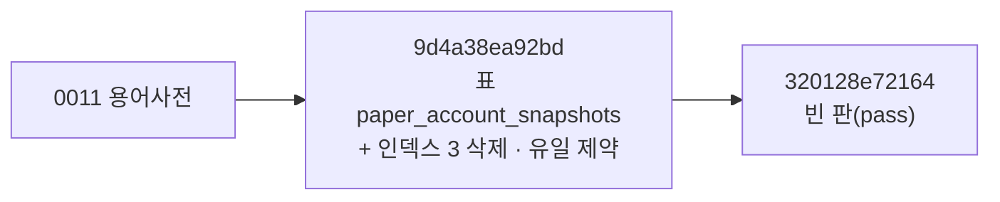

> **쉬운 요약**
> 1. 10-01 에 머지된 모의계좌 스냅샷(QFRS · PR #85 · #86)의 DB 마이그레이션이 새 표 하나를 만들면서, 자동 생성 도구가 덧붙인 **다른 표의 인덱스 3개 삭제 · 유일 제약 바꾸기**를 함께 담고 있습니다. 지금 기능이 깨지지는 않습니다.
> 2. 다만 **되돌리기(downgrade)가 실행하면 실패하게 생성**됐고, 두 번째 마이그레이션은 비어 있으며, 저장소 맨 위에 실수로 들어간 파일 `h`(diff 출력 208줄)가 있습니다.
> 3. 고칠 곳은 아래 체크리스트 넷입니다 — 같은 PR 을 만든 분이 보시면 가장 빠릅니다. 데이터 파트는 ERD · 데이터 사전에 새 표를 옮기는 일만 합니다(10-02 옮김).
> 4. 덧붙여 스냅샷을 **쓰는 길**에서 확인할 것 셋을 2-2절에 적었습니다 — 계좌를 연 날만 줄이 생긴다 · 시연용 주소가 실제 줄을 지운다 · 날짜가 UTC 기준이다. 성과 지표(샤프 · 최대 낙폭)의 입력이라 값이 달라질 수 있습니다.

기준 커밋 `9353b70`(main · 2026-10-01 17:40). 확실도 🟢 코드 · 실측으로 확인 / 🟡 추론.

## 1. 무엇이 들어 있나

| # | 무엇 | 지금 영향 | 확실도 |
|:-:|---|---|:-:|
| 1 | `9d4a38ea92bd` 가 표 `paper_account_snapshots` 를 만들면서 인덱스 `ix_api_keys_user`(0002 에서 만듦) · `ix_portfolio_user_id`(0001) 를 **지운다** | 기능은 그대로. `portfolio` 는 유일 제약 `uq_portfolio_user_symbol_book(user_id, symbol, book)` 이 같은 일을 하고, `api_keys` 는 사용자별 목록 조회가 표 전체를 훑는다(지금은 행이 적어 체감 없음) | 🟢 코드 · 개발 DB 확인 / 🟡 속도 |
| 2 | `ix_users_client_id`(유일 인덱스)를 지우고 **이름 없는 유일 제약**을 만든다 | 중복을 막는 뜻은 같다. PostgreSQL 이 이름을 `users_client_id_key` 로 붙였다(개발 DB 확인) | 🟢 |
| 3 | 되돌리기의 `op.drop_constraint(None, 'users', type_='unique')` | **되돌리면 실패한다** — 생성된 파일 안의 경고문 그대로(「constraint name is None; this directive will fail as rendered」) | 🟢 |
| 4 | `320128e72164` 의 본문이 `pass` | 할 일 없는 판 하나 — 같은 제목이라 헷갈린다. 이미 적용된 판이라 **지우면 안 된다**(그 판까지 올린 DB 가 판을 못 찾는다) | 🟢 |
| 5 | 저장소 맨 위의 `h` | `git diff` 의 색 출력이 파일로 들어갔다(208줄 · 색 코드 포함) | 🟢 |

마이그레이션 사슬은 한 줄이라(머리 하나) `alembic upgrade head` 는 문제없이 돈다 — 개발 DB 에 적용 · 자동 시험 473건 통과(일회용 DB 에 처음부터 올림)를 확인했다.

## 2. 고칠 곳 (체크리스트)

- [ ] **되돌리기 고치기** — `9d4a38ea92bd` 의 downgrade 에서 `op.drop_constraint(None, ...)` → `op.drop_constraint("users_client_id_key", "users", type_="unique")`. 이미 적용된 판이어도 **downgrade 함수만 고치는 것은 안전하다**(올리기 쪽은 건드리지 않는다).
- [ ] **지워진 인덱스를 다시 둘지 정하기** — 필요하면 새 판(다음 번호)에서 다시 만들고, 모델에도 `index=True` · `Index(...)` 로 적어 둔다. 모델에 없으면 다음 자동 생성 때 또 지운다(2026-09-17 분석 이슈 A2 에서 예측한 그대로).
- [ ] **저장소의 `h` 지우기** — `git rm h`.
- [ ] **자동 생성 결과를 커밋 전에 한 번 읽기** — `alembic revision --autogenerate` 는 모델과 DB 의 차이를 **전부** 적는다. 이번처럼 다른 표의 변경이 섞이면 그 줄을 지우고 커밋한다.

## 2-2. 스냅샷을 쓰는 길 — 확인할 것 셋

| # | 무엇 | 왜 문제가 될 수 있나 | 확실도 |
|:-:|---|---|:-:|
| 6 | 스냅샷은 모의투자 잔고(`GET /api/paper/account`)를 **열 때만** 쓰인다 — 매일 도는 배치가 없다 | 그날 계좌를 열지 않으면 그날 줄이 없고, 다음에 연 날의 `daily_return` 은 **직전 줄과의 비율**이라 이틀 · 사흘치가 「하루 수익률」 한 칸에 들어간다 → 샤프 · 변동성처럼 날마다 고르게 있다고 보는 지표가 틀어진다 | 🟢 코드(`record_daily_snapshot` 의 직전 줄 조회) · 🟡 영향 크기 |
| 7 | 시연용 `POST /api/paper/performance/simulate` 는 로그인한 **누구나** 부를 수 있고, 부른 사람의 스냅샷을 **모두 지운 뒤** 가짜 15일(랜덤 워크 · 1억 원)을 넣는다 | 화면 단추나 시험으로 한 번 부르면 실제 기록이 사라진다. 코드 주석도 「실제 운영에서는 제거하거나 관리자 전용으로 제한」 이라고 적었다 | 🟢 코드 |
| 8 | 날짜를 UTC 로 정한다 — 기록은 `datetime.now(timezone.utc).date()`, 시연은 `date.today()`(컨테이너 시계 UTC · 10-02 확인) | 한국 시각 00:00 ~ 08:59 에 계좌를 열면 **전날** 줄로 들어가 전날 값을 덮어쓴다. 장 마감 뒤의 값이 다음 날 아침 값으로 바뀐다 | 🟢 코드 · 컨테이너 시계 |

- [ ] **스냅샷을 하루 한 번 쓰는 배치** — 예: 매일 장 마감 뒤(15:40 KST) 모든 사용자의 줄을 쓴다. 이미 있는 스케줄러(`sync_scheduler`)나 Celery Beat 에 한 줄. 그러면 계좌를 열 때의 쓰기는 「오늘 줄이 없을 때만」 으로 줄여도 된다.
- [ ] **시연 주소 막기** — 관리자만(`/api/admin` 처럼 역할 검사) 또는 개발 모드에서만 켜기 · 지우는 대신 다른 사용자(시연 계정)에 쓰기.
- [ ] **날짜를 한국 기준으로** — `datetime.now(ZoneInfo("Asia/Seoul")).date()` 한 곳에서 만들어 두 곳이 같이 쓰게.

## 3. 💬 같이 정할 것

- 마이그레이션 파일 이름 규칙 — 지금까지는 `0001_…` ~ `0011_…`(번호), 이번 둘은 해시(`9d4a38ea92bd_…`). 다음 판을 만드는 사람이 헷갈리지 않게 하나로 정하면 좋겠습니다(번호 쪽이면 `alembic revision --rev-id 0012 …`).

## 4. 데이터 파트가 할 일

- 새 표 `paper_account_snapshots` 를 ERD · 데이터 사전 다음 판(v1.3 · 10-06 오전 칸)과 표 속성 대장에 옮긴다.
