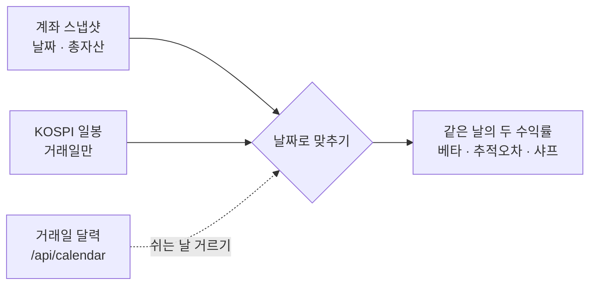
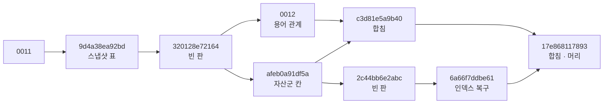

<!-- 게시: #88 댓글 · 이동원이 웹에서 · 2026-10-03 S81 초안 -->
## 확인 결과 — 답글을 코드와 대조 (2026-10-03)

> **쉬운 요약**
> 1. 답글의 7개 중 **5개는 코드와 개발 DB에서 그대로 확인**했습니다(인덱스 둘 · downgrade · `h` 파일 · 배치 KST 15:40 · 스냅샷 날짜 KST).
> 2. **`/simulate` 의 관리자 검사는 아직 아무도 막지 못합니다** — 환경 변수 `ENVIRONMENT` 를 정하는 곳이 없어 늘 「개발」 로 보고, 운영으로 바꾸면 거꾸로 **관리자까지** 막힙니다. 날짜도 이 주소만 아직 UTC 입니다.
> 3. 모델에 `ondelete="CASCADE"` 가 새로 붙어 **`alembic check` 가 실패**합니다 — 다음 자동 생성에 `portfolio` 외래키 다시 만들기가 섞여 들어갑니다(이번 이슈와 같은 종류).
> 4. 새 배치가 **주말 · 휴일에도** 줄을 써서, 성과 지표의 기간 창 · 연율화와 어긋나고, KOSPI 와 **날짜가 아니라 순서로** 짝을 지어 베타 · 추적오차가 다른 날끼리 계산됩니다.
> 5. 이름 규칙 제안에 찬성합니다 — 다만 `0012` 는 이미 쓰였으니 **다음은 `0013`** 입니다.

기준 커밋 `e63d32f`(main · #96 머지 · 2026-10-02 17:47) · 개발 DB 는 이 커밋으로 `alembic upgrade head` 를 마친 상태(`17e868117893`). 확실도 🟢 코드 · 실측 / 🟡 추론.

### 1. 답글 항목별 대조

| # | 답글 | 코드 · DB 에서 본 것 | 판정 |
|:-:|---|---|:-:|
| 1 | 인덱스 둘을 모델에 명시 | `api_keys` 는 `Index("ix_api_keys_user", "user_id")`, `portfolio` 는 `user_id` 칸의 `index=True` ✔ · 개발 DB 에 둘 다 있음 ✔ | 🟢 |
| 1-덧 | (같은 줄에서 함께 바뀐 것) | `portfolio.user_id` 에 `ondelete="CASCADE"` 가 새로 붙었는데 DB 의 외래키(0001 에서 만듦)는 그대로 → `alembic check` 실패: `remove_fk` + `add_fk`(portfolio_user_id_fkey) | 🟢 실측 |
| 3 | downgrade 이름 지정 | `9d4a38ea92bd` 가 `op.drop_constraint('users_client_id_key', 'users', type_='unique')` ✔ (바로 위 자동 생성 경고 주석은 이제 지워도 됨) | 🟢 |
| 5 | `h` 없음 | 저장소 맨 위에 없음 ✔ | 🟢 |
| 6 | 스냅샷 배치 KST 15:40 | `celery_app.conf.timezone="Asia/Seoul"` 이라 crontab 이 KST ✔ · `include` 에 `app.tasks.paper_snapshot` ✔ | 🟢 (덧붙임 → 2절) |
| 7 | `/simulate` 관리자 제한 | ① `ENVIRONMENT` 를 정하는 곳이 없다(`app/config.py` · `docker-compose.yml` · `.env.example` 모두 0곳) → 기본값 `"dev"` 라 **지금은 로그인한 누구나 호출** ② `user` 는 `get_current_user_any` 가 돌려주는 **dict** 라 `getattr(user, "roles", [])` 가 늘 `[]` → `ENVIRONMENT=prod` 면 **관리자도 403** | 🟢 코드 — 아직 막지 못함 |
| 8 | 날짜 KST | `record_daily_snapshot` ✔ · **`/simulate` 의 `date.today()`(`app/routes/paper.py` 490줄 근처)는 컨테이너 시계(UTC)** | 🟡 반 |

### 2. 새 배치에서 본 것 — 성과 지표의 입력

```
달력    월  화  수  목  금  토  일  월
계좌    ●   ●   ●   ●   ●   ●   ●   ●    ← 배치가 매일 15:40 (주 7줄)
KOSPI   ●   ●   ●   ●   ●   ·   ·   ●    ← 거래일만 (주 5줄)

지금 짝짓기 = 끝에서부터 순서대로 n 개
  계좌  [ … 목  금  토  일  월 ]
  KOSPI [ … 화  수  목  금  월 ]   ← 금↔수 · 토↔목 · 일↔금 처럼 다른 날끼리 짝
```

| # | 무엇 | 영향 | 확실도 |
|:-:|---|---|:-:|
| 9 | 배치가 주말 · 휴일에도 돈다(`crontab(hour=15, minute=40)` · 요일 지정 없음) | 주식만 든 계좌는 쉬는 날 `daily_return = 0` 줄이 쌓인다 → 「1개월」 `pr(21)` 이 3주 · 「1년」 `pr(252)` 가 약 8개월 · 변동성(√252)과 샤프가 약 15% 작게(√(5/7) ≈ 0.85) | 🟢 코드 · 🟡 크기 |
| 10 | KOSPI 수익률과 **순서로** 짝짓기(`_get_benchmark_returns` → `bench[-n:]`) | 9 때문에 날짜가 어긋난 쌍으로 베타 · 젠센 알파 · 추적오차 · 정보비율을 계산. 배치 전에도 계좌를 연 날만 줄이 있어 어긋났다 | 🟢 코드 |
| 11 | 사용자 한 명이 실패하면 `except` 에서 `rollback` 없이 다음 사람으로 | DB 오류였다면 세션이 「되돌리기 대기」 상태라 뒤 사용자가 전부 실패 | 🟡 |
| 12 | `get_account` 가 계좌 없는 사용자에게 1억 원 계좌를 만든다 | 배치가 모든 사용자(관리자 · 점검 계정 포함)에게 모의계좌를 연다 — 의도라면 괜찮음 | 🟢 코드 · 🟡 의도 |



### 3. 남은 것 (체크리스트)

- [ ] `portfolio.user_id` 외래키 — CASCADE 가 의도라면 새 판(`0013`)에서 외래키를 다시 만들고, 아니면 모델의 `ondelete` 를 뺀다. 어느 쪽이든 끝나면 `alembic check` 가 통과해야 한다.
- [ ] `/simulate` — 이미 있는 공용 검사 `Depends(require_roles("admin"))`(`app/lib/jwt_auth.py`)로 바꾸거나 `user.get("roles", [])` · 그리고 **기본은 막힘**(예: `ENVIRONMENT` 기본값을 `prod` 로, 또는 개발용 스위치를 따로).
- [ ] `/simulate` 날짜도 `datetime.now(KST).date()`.
- [ ] 계좌 · KOSPI 를 **날짜로** 맞춰 짝짓고, 쉬는 날 줄을 어떻게 볼지 정하기 — 거래일만 쓰기(√252) ↔ 코인이 있으니 달력일(√365) 💬. 거래일은 데이터 파트의 거래일 달력(`/api/calendar` · 2027-12-31 까지)을 쓰면 됩니다.
- [ ] 배치 `except` 에 `await db.rollback()`.

### 4. 💬 이름 규칙 · 중복 판

- **찬성합니다 — 다음 판부터 번호.** 다만 `0012` 는 10-02 에 용어 관계 표(`0012_glossary_relations.py`)로 이미 썼으니 **다음은 `0013`** 입니다: `alembic revision --autogenerate --rev-id 0013 -m "…"` → 만든 파일에서 다른 표 줄을 지우고 커밋.
- `2c44bb6e2abc`(본문 `pass`) · `6a66f7ddbe61`(실제 복구)는 둘 다 이미 적용된 판이라 지우지 않는 게 맞습니다. 대신 `2c44bb6e2abc` 의 머리 설명에 「빈 판 — 실제 복구는 6a66f7ddbe61」 한 줄을 적어 두면 다음 사람이 헷갈리지 않습니다(설명만 바꾸는 것은 안전).

지금 판 사슬(머리 하나 · `17e868117893`):



3절 체크리스트가 끝나면 이 이슈는 닫아도 됩니다.
