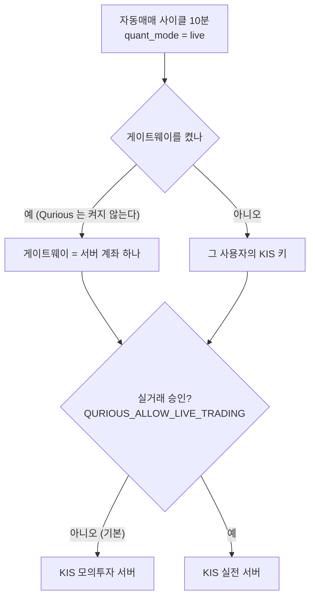
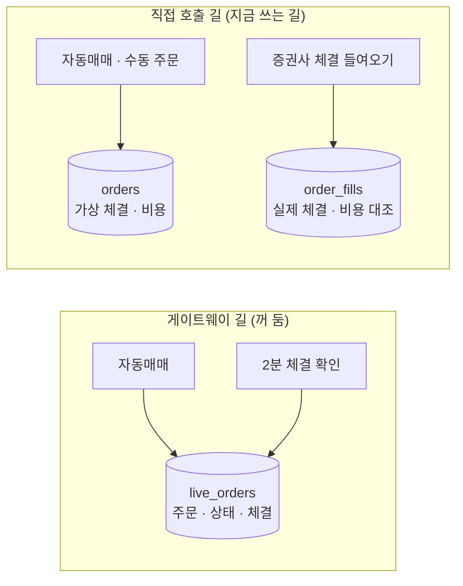

# [논의] 강사님 기초 코드 9478811 반영 — KIS 키는 사용자마다 · 실주문 추적 표 둘 · 첫 화면과 메뉴

> **쉬운 요약 3줄**
> 1. 강사님이 10-02 에 올린 기초 코드(lumina-invest `9478811` · KIS 자동매매 연동)를 **서버 쪽만** Qurious 에 받았습니다. 화면(첫 화면 대시보드 · 위 메뉴 · 설정 화면)은 Figma 로 지금 판과 나란히 그린 뒤 정합니다.
> 2. 그대로 받지 않은 곳이 둘입니다 — **KIS 키는 사용자마다 자기 키를 씁니다**(강사님 판은 서버 계좌 하나를 모두가 같이 씀 · 팀장 결정) · **강사님의 새 주문 길(게이트웨이)에도 실거래 차단을 걸고 꺼 두었습니다.**
> 3. 담당 파트에 여쭐 것이 넷입니다(3절 💬) — 실주문 추적 표가 둘이 된 것 · 첫 화면과 메뉴 · 미국주식 탭의 서버 키 · 게이트웨이를 켤 때의 설계. 편하실 때 댓글로 주세요.

| 항목 | 내용 |
|---|---|
| 강사님 원본 | `edumgt/lumina-invest` `289bfb5` → `9478811` (11커밋 · 41파일 · 2026-10-02) — 분석은 [강사님 자료 추적 댓글 07](https://github.com/EST-team-project/Qurious/blob/main/docs/github-archive/2026-09-28/%EC%9D%B4%EC%8A%88-%EA%B0%95%EC%82%AC%EB%8B%98%EC%9E%90%EB%A3%8C-%EB%B3%80%EA%B2%BD%EC%B6%94%EC%A0%81/07-2026-10-03-th01-th03-th06-th07-th10.md) |
| 반영한 범위 | 서버 쪽(백엔드 · 마이그레이션 · 시험) — 화면 파일(`public/`)은 다음 세션 |
| 닿는 요구 · 담당 | `P02-⑤-1` 증권사 연동 · `P02-⑤-2` 중복 주문 · 손실 한도 · 비상 정지(오준영) · `U9` 성과 대시보드 · 체결(강민석) · `U10` 자동매매 모니터링(오준영) · `P02-①-2` · `①-3` 전략 규칙(신장환) |
| 결정 기록 | [ADR-0004 KIS 자격증명은 사용자마다](https://github.com/EST-team-project/Qurious/blob/main/docs/ADR/ADR-0004-KIS-%EC%9E%90%EA%B2%A9%EC%A6%9D%EB%AA%85%EC%9D%80-%EC%82%AC%EC%9A%A9%EC%9E%90%EB%A7%88%EB%8B%A4.md) · [ADR-0001 6절 게이트웨이](https://github.com/EST-team-project/Qurious/blob/main/docs/ADR/ADR-0001-%EC%8B%A4%EA%B1%B0%EB%9E%98-%EC%A3%BC%EB%AC%B8-%EA%B2%BD%EB%A1%9C-%EC%B0%A8%EB%8B%A8.md) |

---

## 1. 무엇이 들어왔나 — 서버 쪽

| 강사님이 넣은 것 | Qurious 에서 | 상태 |
|---|---|:-:|
| KIS 실주문 **게이트웨이** — 자동매매의 실주문을 강사님 stock-coin-trade 서버로 보낸다(승인 토큰 60초 1회용 → 주문 · 같은 주문 키로 두 번 보내도 한 번 · 끊기면 「모름」 으로 두고 체결 조회) | 받았다 · **실거래 차단을 걸고 꺼 둠**(2절 ②) | ⏸️ |
| 실계좌 위험 한도 — 게이트웨이 잔고로 일손실 · 미체결 매수를 비중에 미리 더함 · Redis 가 없으면 실전 주문 안 함 | 그대로 | 🟢 |
| **합격 전략 적용** — domain-rag-lab(강사님 th07)이 백테스트로 합격시킨 전략 스펙으로 신호를 다시 판정 · LightGBM 가중이면 ML 점수 | 받았다 · SageMaker 배치 점수는 뺌(09-15 AWS 걷어냄) → 캔들 Ridge 점수만 · domain-rag-lab 을 띄우지 않아 전략 목록은 빈 값 | 🟡 |
| LEAN 백테스트 원격 위임(실패하면 로컬) | 그대로 · 설정이 비어 지금은 로컬 | 🟢 |
| **KIS 자격증명 서버 관리**(Secrets Manager → `.env` 계좌 하나) | **바꿔 받음 — 사용자마다 자기 키**(2절 ①) | 🔁 |
| 통합 대시보드 API(사이트별 투자액 탭 넷 — KIS · 퀀트 가상계좌 · 모의투자 · 미국주식) · 「KIS 모의투자 시작」 원클릭 API | 받았다 · KIS 탭과 원클릭은 **그 사용자의 키**로 | 🔁 |
| 실주문 추적 표 `live_orders` · 2분마다 체결 확인(Celery) | 받았다 · 마이그레이션 **`0013`**(강사님 `0009` 를 번호만 바꿈) · 게이트웨이가 꺼져 있어 빈 표 | 🟢 |
| KRX 장 시간 · 2026 휴장일 17일 | 그대로 — 우리 거래일 달력과 한 날도 다르지 않다(2027 은 우리 달력만 있다) | 🟢 |
| 화면 — 첫 화면 대시보드 · 위 메뉴 9 → 2 · 더보기 펼침 목록 · 자동매매 설정 칸 | **다음 세션** — Figma 로 나란히 그린 뒤(3절 💬2) | ⏳ |

새 API 5개는 [API 명세서 v0.2](https://github.com/EST-team-project/Qurious/blob/main/docs/%EC%9D%B8%ED%84%B0%ED%8E%98%EC%9D%B4%EC%8A%A4/API%EB%AA%85%EC%84%B8%EC%84%9C_v0.2.md) 2.1절에 있습니다 — `GET /api/quant/strategies` · `GET /api/quant/live-orders` · `GET · POST /api/quant/kis/quickstart` · `GET /api/dashboard/accounts`. 시험은 강사님 시험 73건을 받아 손본 것을 포함해 전체 668건이 통과합니다.

---

## 2. 이미 정한 것 — 확인 부탁드립니다

### ① KIS 키는 사용자마다 (팀장 결정 · ADR-0004)

강사님 사이트는 운영자 한 사람이 쓰는 곳이라 서버가 KIS 계좌 하나를 관리합니다. Qurious 는 여러 사람이 쓰는 모의투자 플랫폼이라 그대로 받으면 이렇게 됩니다.

```
 [ 강사님 판을 그대로 ]                         [ 받은 판 ]

  사용자 A ─┐                                    사용자 A ── A 의 키 ──▶ A 의 KIS 모의 계좌
  사용자 B ─┼─▶ 서버 KIS 계좌 하나 (.env)          사용자 B ── B 의 키 ──▶ B 의 KIS 모의 계좌
  사용자 C ─┘    · 주문 · 포지션이 섞인다          사용자 C ── 키 없음 ──▶ 「KIS 연동 없음」(주문하지 않음)
                 · 대시보드가 모두에게 같은 잔고
                 · 설정을 저장할 때마다 각자 키가 지워짐
```

- 사용자는 지금처럼 「종목 선정」 화면에서 증권사 KIS 와 **자기 모의투자 App Key · Secret · 계좌번호**를 넣습니다. 설정을 저장해도 지우지 않습니다.
- 대시보드 KIS 탭 · 원클릭 · 자동매매 실주문이 모두 그 사용자의 키를 씁니다. 키가 없으면 원클릭은 「KIS 키가 없습니다」(409)로 멈춥니다.
- 서버 `.env` 에 `KIS_APP_KEY` 를 넣어도 사용자에게 쓰이지 않습니다(시험이 지킵니다).
- 강사님 코드 구조는 그대로 두고 `app/services/kis_credentials.py` 한 파일에서 뜻만 바꿨습니다 — 다음 강사님 반영 때 충돌을 그 파일 하나로 모으려고요.

> **@GoonGuMa 오준영 님 확인 부탁** (`P02-⑤-1` 담당) — ① 이 방향이 괜찮은지 ② 사용자 키가 DB 에 평문으로 남는 것(예전부터 그랬습니다 — 옛 분석 A3)을 암호화할지 · 언제 할지. 서버 계좌 방식이 낫다고 보시면 말씀 주세요 — 그때는 「누가 그 계좌를 쓰나」 를 함께 정해 ADR 을 새로 씁니다.

### ② 게이트웨이에도 실거래 차단 · 꺼 둠 (ADR-0001 6절)



강사님 게이트웨이는 우리 실거래 차단 관문(팩토리)을 지나지 않고 HTTP 로 주문해서, 설정값 한 줄(`real`)이면 실전으로 나갈 수 있었습니다. 3-way 병합에서 **충돌 표시 없이** 들어오는 줄이라 받기 전에 시험부터 써서 막았습니다 — 주문 · 잔고 · 조회 · 취소가 모두 같은 승인 변수를 봅니다. 게이트웨이 자체는 서버 계좌 하나를 모두가 쓰는 길이라 켜지 않았습니다(`.env.example` 에 칸이 없습니다).

---

## 3. 여쭐 것 💬

| # | 무엇 | 지금 상태 | 여쭐 분 |
|:-:|---|---|---|
| 💬1 | **실주문 추적 표가 둘** — 강사님 `live_orders`(게이트웨이 주문 · 2분 체결 확인) ↔ 우리 `orders` + `order_fills`(증권사 체결을 들여와 비용 대조) | 둘 다 두었습니다 · 게이트웨이가 꺼져 있어 `live_orders` 는 빈 표 | 오준영 님(`P02-⑤`) · 강민석 님(체결) |
| 💬2 | **첫 화면과 메뉴** — 강사님 판은 로그인 첫 화면이 「투자 대시보드」 · 위 메뉴 9 → 2(로보 어드바이저 · 투자 인디케이터) · 나머지는 「더보기」 펼침 목록 | 지금 판 그대로(첫 화면 AI 투자 상담 · 위 메뉴 9 · 「데이터」 탭) — **Figma 로 두 판을 나란히 그려 다음에 여쭙겠습니다** | 팀 · 강민석 님(`U9` 대시보드) |
| 💬3 | **미국주식 탭(Alpaca)도 서버 키 하나** — 대시보드의 미국주식 탭은 서버 `.env` 의 Alpaca 키 하나를 모두에게 보여 줍니다(강사님 기존 설계) | 그대로 두었습니다 — KIS 와 같은 질문 | 오준영 님(P-E) |
| 💬4 | **게이트웨이를 켤 날이 오면** — 사용자별 키를 stock-coin-trade 에 넘기는 설계가 먼저 필요합니다(지금 계약서는 서버 API 키 하나) | 꺼 둠 | 오준영 님 |

💬1 을 그림으로 보면 이렇습니다.



> 「추적 표」 — 증권사에 낸 주문 한 건이 접수 → 일부 체결 → 체결 · 취소로 바뀌는 상태를 줄 하나로 따라가는 표입니다. `orders` 는 우리 장부의 체결 기록이고 `live_orders` 는 증권사 쪽 주문의 상태라 뜻이 겹치되 같지는 않습니다.

---

## 4. 그다음

- 화면 쪽은 다음 세션에 Figma 파일로 지금 판 · 강사님 판을 나란히 올리고 링크를 이 글에 댓글로 남기겠습니다.
- 강사님 자료 추적 기준점(`289bfb5`)은 화면 쪽을 받을 때까지 옮기지 않습니다 — 화면 파일의 3-way 기준이 그대로여야 해서요.
- 바뀐 문서: API 명세서 v0.2 · ERD · 데이터 사전 v1.4 · 테스트 계획서 v1.4 · RTM v1.2 · 결정 대장 v1.1 · ADR-0004(새) · ADR-0001 6절.
