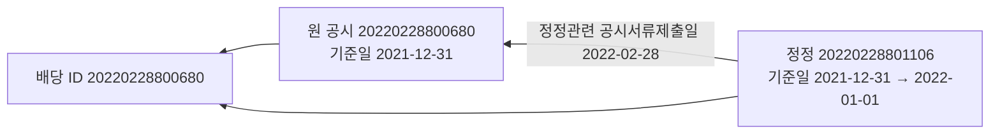

## 지급 · 권리 · 정정 자료 — 데이터 쪽 의견 (2026-10-07)

정리해 주셔서 감사합니다. 데이터 쪽에서 지금 드릴 수 있는 것과 없는 것을 먼저 적고, 정하실 칸(세전 · 세후, 중복 처리, 장부)에는 근거와 함께 의견만 적었습니다. 코드 줄 번호는 `main` `a617f2a`, 예시는 로컬 일정 API 의 실제 응답(2026-10-07 13:30 회차 뒤)입니다.

본문 「관련 자료」 의 설계서 v1.5 주소는 문서 정리(#130)로 옮겨져 지금 열리지 않습니다 — 지금 판은 https://github.com/EST-team-project/Qurious/blob/main/docs/설계/목표기능1-데이터지식-설계.md 입니다(v1.5 는 `docs/설계/지난판/` 아래).

> **쉬운 요약**
> 1. 지금 일정 API 의 「배당금 지급」 은 화면용입니다. 주당 배당금은 `detail` 글자 속 보통주 금액뿐이고, 지급일이 없는 배당은 줄 자체가 없으며, 정정되면 `source_ref` 가 바뀌고 날짜를 고친 정정이면 `id` 도 바뀝니다.
> 2. 계산용으로 「배당 한 건 = 한 줄」 주소를 데이터 쪽에서 새로 만드는 안을 제안합니다. 같은 배당은 정정 사슬의 첫 공시 접수번호(배당 ID)로 끝까지 따라갑니다.
> 3. 첫 자동 대상은 국내 상장 보통주의 현금배당(결산 · 중간 · 분기) 가운데 지급일이 공시된 것으로 좁히길 권합니다. 우선주 · ETF 분배금 · 주식배당 · 현물배당은 지금 자료로 금액이나 수량을 정확히 셀 수 없습니다.
> 4. 세후라면 근거는 소득세 14%(소득세법 제129조) · 지방소득세 = 소득세의 10%(지방세법 제103조의13)이고, 원천징수세액이 1천 원 미만이면 떼지 않습니다(소득세법 제86조). 원 단위 끝수 규칙은 원문으로 확인하지 못했습니다.
> 5. 결제주기를 T+1 로 줄이는 로드맵이 이달 나올 예정입니다. 권리 기준을 「권리 마지막 매수일까지 체결분」 으로 두고 그 날짜를 자료가 주면, 전환 영향이 데이터 쪽 계산식 한 곳에 갇힙니다.

### 1. 용어

**<표 1> 이 글에서 쓰는 말**

| 말 | 뜻 | 이 글에서 | 헷갈리는 점 |
|---|---|---|---|
| 결제주기 T+2 · T+1 | 매매한 날(T)부터 며칠째 거래일에 주식과 돈이 오가나 | 지금 T+2 — 배당락일 계산의 전제 | 「전 거래일 시세가 다음 날 들어온다」 는 데이터 지연과는 다른 말 |
| 배당기준일 | 이날 주주명부에 있는 사람이 배당을 받는다(상법 제354조 ①) | 공시 「6. 배당기준일」 그대로 | 휴장일인 경우가 많다 · 2023년 절차 개선 뒤 결의 뒤로 잡는 회사가 늘었다 |
| 배당락일 | 이날부터 사면 그 배당이 없다 | 기준일 이하 마지막 거래일의 전 거래일(T+2 기준 · 우리가 계산) | 공시에 없는 계산값 · 결제주기가 바뀌면 식도 바뀐다(5절) |
| 권리 마지막 매수일 | 배당락일의 전 거래일 — 이날까지 체결한 주식에 권리가 있다 | 권리 수량을 세는 날(새 칸 제안) | 결제일이 아니라 체결일 기준 · 그날 시간외 체결도 같은 D+2 결제라 포함된다고 본다(추정) |
| 지급일 | 배당금이 계좌에 들어오는 날 | 공시 「7. 배당금지급 예정일자」 | 결산배당은 대부분 「-」 · 실제 입금이 하루 다를 수 있다 |
| 원천징수 | 지급하는 쪽이 세금을 먼저 떼고 나머지를 주는 것 | 소득세 14% + 지방소득세(소득세의 10%) | 세액 1천 원 미만은 떼지 않는다(소액부징수) |
| 정정 공시 | 이미 낸 공시를 고쳐 다시 내는 것 · 제목 머리 [기재정정] | 새 접수번호 · 본문이 앞 공시의 제출일을 가리킨다 | 원 공시가 아니라 바로 앞 정정을 가리키기도 한다 |
| 배당 ID | 정정이 와도 같은 배당을 가리키는 키(제안) | 정정 사슬의 첫 접수번호 | 지금 `source_ref` 는 최신 판 번호라 정정마다 바뀐다 |
| 분배금 | ETF 같은 집합투자기구가 이익을 나눠 주는 돈 | 이번 자동 대상 밖 | 배당과 공시 경로 · 세금 계산이 다르다 |

### 2. 날짜 흐름 — 실제 한 건

그림 1 은 일정 API 가 지금 돌려주는 한 건을 날짜 순서로 놓은 것입니다.

**<그림 1> 원풍(008370) 2026년 분기배당 · 1주당 300원 · 공시 접수번호 20260915900392**


- 09-28 에 산 주식은 T+2 결제로 09-30 명부에 오릅니다. 09-24 · 25 추석 휴장은 거래일 달력이 이미 세어 넣었습니다.
- 세 일정(`dividend_record` · `dividend_ex` · `dividend_pay`)은 지금도 `source_ref`(최신 판 접수번호)로 이을 수 있습니다. 다만 정정이 오면 셋이 함께 새 번호로 바뀝니다.

### 3. 질문별 답

#### 3.1 입금 금액 — 세전 · 세후 (정하실 칸 · 의견)

**<표 2> 세후 계산의 근거** — 원문은 국가법령정보센터 현행 판(2026-10-07 조회)

| 규칙 | 원문 | 확실도 |
|---|---|---|
| 소득세 14% | 소득세법 제129조 ① 2호 나목 「그 밖의 배당소득에 대해서는 100분의 14」(법률 제21221호 · 2026-01-01 시행) | 확인 |
| 지방소득세 | 지방세법 제103조의13 ① 「원천징수하는 소득세 … 의 100분의 10에 해당하는 금액을 소득세 원천징수와 동시에 개인지방소득세로 특별징수하여야 한다」(법률 제21308호 · 2026-01-01 시행) | 확인 |
| 소액부징수 | 소득세법 제86조 1호 — 원천징수 대상 소득(이자소득 등은 제외)에 대한 「원천징수세액이 1천원 미만인 경우」 징수하지 아니한다 | 확인 — 배당소득은 제외 목록에 없다 |
| 끝수 | 국고금 관리법 제47조 ① 「국고금의 수입 또는 지출에서 10원 미만의 끝수가 있을 때에는 그 끝수는 계산하지 아니하고」 | 추정 — 국고에 넣는 단계의 조문이다. 주주 한 사람 몫을 셀 때 10원 미만을 버리는지는 원문으로 확인 못 함 |
| 입금 실무 | 「15.4%가 원천징수된 뒤 증권사 계좌로 입금」 · 「한국예탁결제원을 통해 각 증권사로 전달」 · 공시 지급일과 계좌 날짜가 「하루 정도 차이 나는 경우가 있습니다」(삼성증권 안내 2026-09-15) | 확인(증권사 안내) |

**<표 3> 계산 예 — 원풍 1주당 300원** · 화살표 오른쪽은 10원 미만을 버렸을 때

| 보유 | 세전 | 소득세 | 지방소득세 | 세후 | 메모 |
|--:|--:|--:|--:|--:|---|
| 100주 | 30,000 | 4,200 | 420 | 25,380 | 끝수 없음 |
| 37주 | 11,100 | 1,554 → 1,550 | 155 → 150 | 9,391 → 9,400 | 끝수 규칙에 따라 9원 차이 |
| 20주 | 6,000 | 0 | 0 | 6,000 | 소득세 840원이 1천 원 미만 → 소액부징수 |

의견은 B 쪽입니다.

- 실제 계좌에는 세후가 들어옵니다(<표 2> 입금 실무). 모의 장부가 실제 계좌처럼 읽히려면 세후가 맞습니다.
- 세전 · 소득세 · 지방소득세 · 세후와 규칙 이름(예: `tax_rule`)을 따로 남기면, 끝수 규칙이 확인된 뒤 다시 계산할 수 있습니다. 끝수는 실제 배당 입금 내역의 세액 끝자리가 0 인지로 확인할 수 있습니다.
- 대상은 거주자 일반 계좌로 두는 편이 단순합니다. ISA · 연금계좌 · 금융소득종합과세 · 고배당기업 배당소득 과세특례(조세특례제한법 제104조의27 · 2025-12 신설)는 범위 밖으로 둡니다.

A 를 고르시면 「세전 · 모의 계산」 표시만으로 충분하고, 데이터 쪽 준비는 같습니다.

#### 3.2 권리 수량과 데이터 연결

- **기준 시점** — 「권리 마지막 매수일(배당락일의 전 거래일)까지 체결된 매수 · 매도를 반영한 수량」. 앞서 쓴 「배당락일 전날 장 마감 보유」 와 같은 뜻을 체결일로 다시 적은 것입니다.
- **휴장** — 배당락일은 거래일 달력(공휴일 · 근로자의 날 · 연말 휴장 · 2027-12-31 까지)으로 셉니다. 임시공휴일처럼 달력이 바뀌면 회차마다 다시 셉니다([market_calendar.py#L350-L379](https://github.com/EST-team-project/Qurious/blob/main/collector/market_calendar.py#L350-L379)). 그래서 입금 처리 때 받은 날짜를 쓰고, 미리 계산해 둔 날을 들고 있지 않는 편이 안전합니다.
- **장부 쪽(모의투자 담당 몫 · 의견)** — 모의 즉시 체결은 시간 제한이 없어 체결 시각이 주말 · 밤일 수 있습니다([paper_trading.py#L230-L288](https://github.com/EST-team-project/Qurious/blob/main/app/services/paper_trading.py#L230-L288) · `filled_at` 기본값은 그 순간 [trading_cost.py#L350](https://github.com/EST-team-project/Qurious/blob/main/app/services/trading_cost.py#L350)). 「휴장일 · 거래 시간 밖 체결은 다음 거래일 체결로 본다」 같은 규칙이 하나 있으면 권리 판정이 그대로 따를 수 있습니다.
- **자료 부족 시 보류** — 찬성합니다. 추측하지 않는다는 원칙과 같습니다.
- **계산용 구조** — <표 4> 의 칸을 한 줄에 담는 주소를 제안합니다(예: `GET /api/calendar/dividends?symbol=&from=&to=&date=pay|ex|record` · 로그인 없이 · 이름은 제안).

**<표 4> 계산용 배당 한 줄 — 칸과 지금 상태**

| 칸 | 뜻 | 지금 |
|---|---|---|
| `dividend_id` | 배당 ID(정정 사슬의 첫 접수번호) | 없음 — 새로 |
| `rcept_no` · `version` · `amended` | 지금 값이 실린 판 · 몇 번째 판 · 정정 여부 | 번호만 있음(`source_ref`) |
| `symbol` · `corp_code` · `share_class` | 종목 · 회사 고유번호 · 보통주 | 앞 둘 있음 · 늘 보통주(드러나지 않음) |
| `div_kind` · `div_type` | 결산 · 중간 · 분기 / 현금 · 현물 | 표에 있음 · API 는 `title` 글자 |
| `dps` | 보통주 1주당 배당금(원 · 숫자) | 표에 있음 · API 는 `detail` 글자 |
| `record_date` · `ex_date` · `last_cum_date` | 기준일 · 배당락일 · 권리 마지막 매수일 | 앞 둘은 다른 일정 줄 · 셋째 없음 |
| `ex_date_rule` | 배당락일을 센 규칙(T+2 · T+1) | 없음 |
| `pay_date` · `pay_date_status` · `pay_date_text` | 지급일 · 공시에 있음 / 정정으로 확정 / 미정 / 오기로 버림 · 칸 원문 | 날짜만 · 미정은 줄 없음 |
| `needs_review` · `auto_eligible` · `reason` | 본문을 다 못 읽음 · 자동 대상인가와 까닭 | 앞만 표에 있음 |
| `known_at` | 그 판의 접수일(접수번호 앞 8자리) | 없음 |

원풍 한 건을 이 모양으로 적으면 아래와 같습니다(`version` · `amended` · `auto_eligible` 은 모양을 보이려고 넣은 값).

```json
{"dividend_id": "20260915900392", "rcept_no": "20260915900392", "version": 1, "amended": false,
 "symbol": "008370", "corp_code": "00144012", "share_class": "common", "div_kind": "quarterly",
 "div_type": "cash", "dps": 300, "record_date": "2026-09-30", "ex_date": "2026-09-29",
 "last_cum_date": "2026-09-28", "ex_date_rule": "T+2", "pay_date": "2026-10-13",
 "pay_date_status": "stated", "needs_review": false, "auto_eligible": true, "known_at": "2026-09-15"}
```

**<표 5> 배당 종류별 — 자동 대상 의견** · 건수는 수집 DB 2026-10-05 무렵(#79 갱신 03 · 데이터 사전)

| 종류 | 지금 자료 | 의견 | 까닭 |
|---|---|---|---|
| 보통주 현금배당(결산 · 중간 · 분기) | 배당 표 9,196건 · 지급일 있는 것 결산 2,833/8,174 · 분기 490/687 · 중간 258/321 | 자동 — 지급일이 공시된 것만 | 금액 · 날짜를 공시 원문에서 읽는다 |
| 우선주 | 배당은 보통주 코드에만 붙는다(우선주 코드는 매핑에 없음) · 종류주식 금액은 첫 줄 하나 | 수동 유지 | 대신증권 2022년 공시는 1우선주 1,450원 · 2우선주 1,400원 — 둘째 금액은 「기타」 칸과 덧붙인 표에만 있다 |
| ETF 분배금 | 없음 | 수동 유지 | 공시 경로가 다르고(거래소 공시) 국내 주식형 밖은 과세표준이 분배금과 다르다 |
| 주식배당 | 수집에서 뺌 | 범위 밖 | 현금이 아니라 주식 수가 는다 — 분할 · 병합과 같은 수량 조정 묶음 |
| 현물 · 현금ㆍ현물배당 | 28건 | 범위 밖 | 현물 값을 매길 수 없다 |
| `needs_review` | 17건 | 보류 | 본문에서 금액 · 기준일을 못 읽었다 |

#### 3.3 지급일 미정 · 지연 수집 · 정정

- **지급일 미정 — 추측하지 않기에 찬성합니다.** 상법 제464조의2 ① 은 결의일부터 「1개월 내에 하여야 한다. 다만, 주주총회 또는 이사회에서 배당금의 지급시기를 따로 정한 경우에는 그러하지 아니하다」 이고, 분기배당도 자본시장법 제165조의12 ③ 이 같은 꼴입니다(2025-01-21 개정 「다만, 정관 또는 이사회에서 그 지급시기를 따로 정한 경우에는 그에 따른다」). 1개월은 원칙일 뿐이라 날짜를 만들 근거가 없습니다.
- **실제 예** — 만호제강 결산배당(기준일 09-15) · 백산 중간배당(09-15) · 미스토홀딩스 분기배당(기준일 10-16 · 1주당 960원)은 기준일 줄은 있고 지급 줄은 없습니다(로컬 일정 API).
- **지급일을 나중에 알게 되는 길 둘** — ① 「배당금지급 예정일자 확정」 정정 공시: 이미 읽습니다([corp_schedule.py#L192-L218](https://github.com/EST-team-project/Qurious/blob/main/collector/corp_schedule.py#L192-L218)). ② 공공데이터 「금융위원회_주식배당정보」: 1차 프로젝트에서 받아 본 API 로 현금배당 지급일 · ISIN(우선주 따로) · 배당구분 칸이 있습니다. 지급이 끝난 결산배당의 날짜를 채우는 보조 출처 후보이고, 붙일지는 이용 조건을 확인한 뒤 데이터 쪽에서 판단하겠습니다.
- **수집 지연** — 공시가 나오면 다음 12:30 회차의 배당 단계가 받고 같은 회차의 달력 단계(오늘 12:35 무렵)에 일정에 실립니다. 보통 하루 안이고 회차가 실패하면 그만큼 늦습니다. 지급일이 지난 뒤 들어온 배당을 뒤늦게 넣되 지급일과 처리 시각을 따로 두는 안에 찬성합니다.
- **입금 전 정정** — 최신 판으로 갱신에 찬성합니다. 데이터는 판 이력을 함께 드리겠습니다.
- **입금 후 정정(장부 쪽 · 의견)** — 원 기록은 두고 차액만 조정 기록으로 남기는 쪽이 일반 장부 관행과 맞습니다. 감액인데 현금이 모자라면 음수를 만들기보다 확인 대기가 안전합니다.
- **정정이 기준일을 바꾼 실제 예** — <그림 2>. 지금 배당 표는 기본키가 (종목, 기준일)이라 이런 정정에서 원 공시 줄이 함께 남고([db.py#L176-L198](https://github.com/EST-team-project/Qurious/blob/main/collector/db.py#L176-L198)), 총수익 계산은 (종목, 배당락일)로 한 건만 써서 막고 있습니다([total_return.py#L186-L211](https://github.com/EST-team-project/Qurious/blob/main/collector/total_return.py#L186-L211)). 일정 API 의 기준일 · 배당락일 줄은 이 거름을 거치지 않습니다 — 지금 이 배당은 배당락일 줄이 둘(같은 2021-12-29 · `id` 만 다름) · 기준일 줄이 둘 · 지급 줄이 하나로 나옵니다(로컬 일정 API). 배당락일 줄을 그대로 더하면 1주당 2,800원이 됩니다.

**<그림 2> 정정 사슬과 배당 ID — 대신증권 2021년 결산배당(DART 원문)**



#### 3.4 수동 · 자동 중복 (정하실 칸 · 의견)

- B(배당을 고르게) 쪽입니다. 수동 · 자동이 같은 배당 ID 를 쓰면 「계좌 × 배당 ID 유일」 제약 하나로 재시도 · 동시 실행 · 수동 중복을 함께 막습니다. A 를 고르셔도 예외 수동 건에는 배당 ID 를 달아야 같은 효과가 납니다. 지금 `cashflow_events` 에는 배당을 가리킬 칸이 없습니다([models/rebalance.py#L64-L77](https://github.com/EST-team-project/Qurious/blob/main/app/models/rebalance.py#L64-L77)).
- 금액만 있는 기존 수동 기록은 자동으로 붙이지 않고 후보만 보이는 쪽을 권합니다 — 같은 계좌 · 같은 종목 · 지급일 앞뒤 며칠 · 금액이 세전이나 세후 계산값과 같을 때 「같은 배당일 수 있음」 으로 보이고 확정은 사람이. 불확실 건 확인 대기에 찬성합니다.

**<표 6> 배당 ID 후보**

| 후보 | 정정에 버티나 | 약점 | 우리 실측 |
|---|---|---|---|
| (종목, 기준일) — 지금 표의 기본키 | 기준일을 고치는 정정에 깨진다 | 옛 줄이 남아 두 번 셀 수 있다 | 2건(대신증권 · 우진플라임) |
| (종목, 배당락일) — 총수익 계산의 거름 | 기준일 오기에는 버틴다 | 배당락일까지 옮기는 정정 · 같은 날 두 배당 | 위 2건을 이것으로 막는다 |
| 정정 사슬의 첫 접수번호 — 제안 | 어떤 칸을 고쳐도 버틴다 | 사슬을 이어야 한다 · 같은 날 두 건이면 「정정전」 값으로 가린다 | 주주총회 일정에 같은 방법을 이미 쓴다(비츠로시스 네 번 정정 · [corp_schedule.py#L420-L449](https://github.com/EST-team-project/Qurious/blob/main/collector/corp_schedule.py#L420-L449)) |
| (ISIN, 기준일, 배당구분) — 1차 프로젝트 | 기준일 정정에 깨진다 | 우리 출처(DART)에 ISIN · 구분코드가 없다 | 1차 71,681행에서 중복 0 |

추천은 첫 접수번호를 배당 ID 로, (종목, 배당락일)을 검산용으로 두는 것입니다. 사슬을 잇지 못하면(원 공시가 수집 구간 밖 등) 그 판의 접수번호를 쓰고 어느 키인지(`id_basis`)를 함께 적겠습니다. DART 쪽 근거 — 공시 목록의 `report_nm` 「[기재정정] : 본 보고서명으로 이미 제출된 보고서의 기재내용이 변경되어 제출된 것임」, 정정 본문 머리 「1. 정정관련 공시서류 · 2. 정정관련 공시서류제출일 · 3. 정정사유 · 4. 정정사항(정정전 · 정정후)」.

### 4. 지금 되는 것 · 안 되는 것 · 더 만들 것

**<표 7> 상태와 근거**

| 구분 | 내용 | 근거 |
|---|---|---|
| 됨 | 배당 기준일 · 배당락일 · 지급일 일정(로그인 없이) | [market_calendar.py#L167-L236](https://github.com/EST-team-project/Qurious/blob/main/app/services/market_calendar.py#L167-L236) |
| 됨 | 지급일 — 본문 날짜 · 정정 표의 정정후 · 기준일보다 앞선 날은 버림 | [corp_schedule.py#L370-L378](https://github.com/EST-team-project/Qurious/blob/main/collector/corp_schedule.py#L370-L378) |
| 됨 | 배당락일을 앞날 거래일까지 세고 달력이 바뀌면 다시 셈 | [dart.py#L561-L575](https://github.com/EST-team-project/Qurious/blob/main/collector/sources/dart.py#L561-L575) |
| 됨 | 정정은 나중 접수번호가 이김 · 정정 본문의 「정정전」 값을 집지 않음 | [dart.py#L643-L670](https://github.com/EST-team-project/Qurious/blob/main/collector/sources/dart.py#L643-L670) · [#L145-L153](https://github.com/EST-team-project/Qurious/blob/main/collector/sources/dart.py#L145-L153) |
| 안 됨 | 주당 배당금을 숫자로 · 우선주 금액 · 날짜 셋을 한 줄로 | [corp_schedule.py#L371](https://github.com/EST-team-project/Qurious/blob/main/collector/corp_schedule.py#L371) · [market_calendar.py#L206-L221](https://github.com/EST-team-project/Qurious/blob/main/app/services/market_calendar.py#L206-L221) |
| 안 됨 | 지급일 미정을 줄로 알림 · 칸 원문(「-」 · 「1개월 이내」) | [corp_schedule.py#L467](https://github.com/EST-team-project/Qurious/blob/main/collector/corp_schedule.py#L467) — 날짜 없는 줄은 일정에서 빠진다 |
| 안 됨 | 판 이력 · 같은 배당 키 | 표는 마지막 판만 남긴다(원문은 남아 다시 만들 수 있다) |
| 안 됨 | 지급 일정 `id` 가 지급일을 품어 날짜 정정 때 바뀐다 | [corp_schedule.py#L474](https://github.com/EST-team-project/Qurious/blob/main/collector/corp_schedule.py#L474) |
| 더 만들 것 · 데이터 | 계산용 배당 주소(<표 4>) · 정정 사슬 · 판 이력 · 지급일 상태 | 새로 |
| 더 만들 것 · 데이터 | 배당락일 규칙 칸 · 결제주기 시행일로 계산식 나누기 | [dart.py#L41-L57](https://github.com/EST-team-project/Qurious/blob/main/collector/sources/dart.py#L41-L57) |
| 더 만들 것 · 판단 | 지급일 보조 출처(금융위원회_주식배당정보)를 붙일지 | 이용 조건 확인 뒤 |
| 장부 쪽 · 의견 | 권리 마지막 매수일 끝 수량을 체결 이력으로 되짚기 · 계좌 × 배당 ID 유일 | — |

### 5. 결제주기 T+1 — 미리 알아 둘 것

- 금융위원회는 주식 결제주기를 T+2 에서 T+1 로 줄이는 로드맵을 10월까지 마련하기로 했고(정책브리핑 2026-06-23), 내년 전환을 목표로 한다는 보도가 있습니다(2026-07-15). 로드맵 원문은 아직 확인하지 못했습니다.
- T+1 이면 기준일 이하 마지막 거래일에 사도 다음 날 결제라 명부에 오르지 못하므로, 배당락일이 「기준일 이하 마지막 거래일」 로 하루 늦어집니다(같은 식으로 셈 · 추정 — 거래소 공표 전).
- 우리 계산식은 T+2 를 전제로 합니다. 시행일을 경계로 나누고 배당마다 `ex_date_rule` 을 적겠습니다. 장부가 `last_cum_date` 를 자료에서 받아 쓰면 장부 코드는 바꾸지 않아도 됩니다. 1차 프로젝트도 같은 까닭으로 규칙 이름 칸(`ex_date_rule`)을 두었습니다.

### 6. 남은 물음

| 무엇 | 정할 곳 |
|---|---|
| 세전 · 세후, 세후라면 끝수 규칙(확인 전 임시 규칙 포함) | 주담당 |
| 수동 입력 A · B, 금액만 있는 기존 기록 대조 방식 | 주담당 · 모의투자 담당 |
| 체결 시각 → 거래일 규칙(주말 · 밤 체결), 입금 후 정정의 조정 방식 | 모의투자 담당 |
| 계산용 배당 주소의 이름 · 칸, 지급일 보조 출처를 붙일지 | 데이터(이 글의 제안) |

### 근거 (2026-10-07 조회)

- 법령 원문(국가법령정보센터 현행 판): [소득세법 제129조](https://www.law.go.kr/법령/소득세법/제129조) · [제86조](https://www.law.go.kr/법령/소득세법/제86조) · [지방세법 제103조의13](https://www.law.go.kr/법령/지방세법/제103조의13) · [국고금 관리법 제47조](https://www.law.go.kr/법령/국고금관리법/제47조) · [상법 제464조의2](https://www.law.go.kr/법령/상법/제464조의2) · [상법 제354조](https://www.law.go.kr/법령/상법/제354조) · [자본시장법 제165조의12](https://www.law.go.kr/법령/자본시장과금융투자업에관한법률/제165조의12)
- 금융위원회 「배당액을 보고 투자할 수 있도록 배당절차를 개선하겠습니다」(2023-01-31): https://www.fsc.go.kr/no010101/79358
- 삼성증권 「주식 배당금이란?」(2026-09-15): https://blog.onestopsamsungpop.co.kr/what-is-dividend
- DART 대신증권 [기재정정]현금ㆍ현물배당결정: https://dart.fss.or.kr/dsaf001/main.do?rcpNo=20220228801106
- OpenDART 공시검색 가이드: https://opendart.fss.or.kr/guide/detail.do?apiGrpCd=DS001&apiId=2019001
- 정책브리핑 「주식 결제주기 단축 로드맵 10월까지 마련」(2026-06-23): https://www.korea.kr/news/policyNewsView.do?newsId=148966977
- 미래에셋투자와연금센터 「ETF 월분배금 … 7가지 개념」(2023-11-08 · 분배금 과세표준): https://investpension.miraeasset.com/contents/view.do?idx=20393
