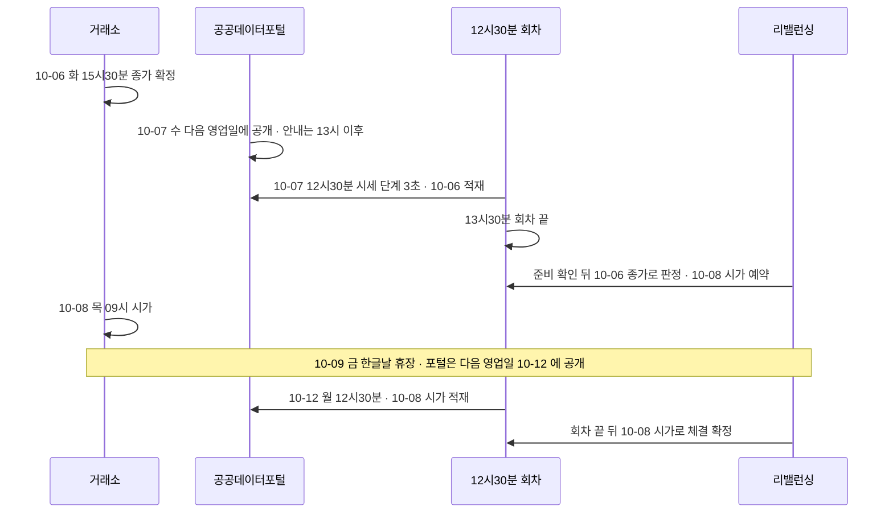
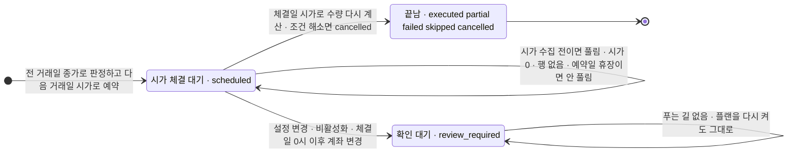

## 가격 확정 시점 · 자료가 모자랄 때의 대기 기준 — 데이터 쪽 의견 (2026-10-08)

정리해 주셔서 감사합니다. 이 글을 쓰는 사이 #136 이 머지되어 가격 · 체결 기준, 갱신 전 대기, 입출금 · 배당 뒤 점검 시점, 체결일 전 계좌 변경의 처리가 코드와 시험으로 정해졌습니다. 그래서 질문마다 #136 이 정한 것을 먼저 적고, 데이터 쪽 몫인 「가격이 언제 정해지고 언제 우리 자료에 들어오나」 · 「모자라면 무엇을 기다리나」 를 덧붙였습니다. 의견은 #136 뒤에도 남은 칸에만 적었습니다. 코드 줄 번호는 `main` `ef8cf5b`, 회차 시각은 러너 기록(`daily_update_history.jsonl` · 10-07 회차까지)입니다.

> **쉬운 요약**
> 1. 전 거래일 종가는 거래소에서 15:30 에 정해지지만, 우리 수집 DB 에는 다음 거래일 12:30 회차의 첫 단계(몇 초)에 들어오고, 리밸런싱 판정은 그 회차가 다 끝난 뒤(최근 12:33 ~ 13:30)에 열립니다.
> 2. 제공처 안내는 「기준일 다음 영업일 오후 1시 이후」 입니다. 지금까지 거래일 회차 7번은 모두 12:30 에 받았지만 보장된 시각이 아니므로, 늦는 날을 위해 오후에 시세를 한 번 더 받는 장치를 데이터 쪽에 더하겠습니다.
> 3. #136 으로 수동 실행 · 「지금 점검」 · 미리보기도 전 거래일 종가로 판단하고 다음 거래일 시가로 예약만 합니다. 갱신 전 · 휴장일 · 종가 누락이면 대체 가격 없이 기다리고, 입출금 · 배당 뒤 판정은 다음 일별 점검 회차로 미룹니다. 예약은 목표 비중으로 남기고 체결일 시가로 수량을 다시 계산하므로, 체결일 전 계좌 변경은 그 계산에 들어가고 조건이 풀렸으면 예약이 취소됩니다.
> 4. 데이터 쪽에서 덧붙일 것은 「기다려도 풀리지 않는 대기」 입니다. 시가 0(거래정지 · 무거래)과 그날 행 없음(상장폐지 등)은 나중에 채워지지 않는데, 지금은 예약일에 목표 종목 하나라도 그러면 예약 전체가 남고, 그동안 그 플랜은 새 판정을 열지 않습니다.
> 5. #136 뒤에도 남은 칸은 확인 대기를 푸는 규칙(체결일 당일 이후 계좌 변경 · 설정 변경 · 비활성화), 예약일이 휴장으로 바뀐 예약, 장기 미체결의 끝입니다. 의견은 여기에만 적었습니다 — 시가가 끝내 없을 예약은 그날로 닫고 다음 판정 회차에 맡기기, 휴장으로 바뀐 예약일은 다음 거래일로 다시 세기, 플랜을 끄면 예약도 취소.

### 1. 용어

**<표 1> 이 글에서 쓰는 말**

| 말 | 뜻 | 이 글에서 | 헷갈리는 점 |
|---|---|---|---|
| 종가 확정 | 그날 정규장 마지막 단일가(15:20 ~ 15:30)로 종가가 정해지는 것 | 거래소 기준 15:30 무렵 | 시간외 · 애프터마켓 거래는 종가를 바꾸지 않는다 |
| 적재 | 그 값이 우리 수집 DB 에 들어온 것 | 다음 거래일 12:30 회차 | 출처가 공개하기 전에는 적재할 수 없다 |
| 판정 회차 | 자동 점검이 하루 한 번 판정하는 때 | 12:30 회차가 성공으로 끝난 뒤 · 5분마다 준비 확인 · 「지금 점검」 도 같은 하루 1회(#136) | 「12:30」 이 아니라 「회차가 끝난 뒤」 다 |
| `data_as_of` | 판정에 쓰는 시세 기준일 | 주식 일봉의 마지막 날 | ETF 일봉은 같은 회차 뒤쪽 단계에서 들어온다 |
| 거래정지 · 무거래 | 그날 체결이 하나도 없음 | 포털 일봉의 시가 0 · 거래량 0(`halted`) | 행은 남고 종가는 직전 값으로 온다 |
| 목표 비중 예약 | 예약 때 주문 수량이 아니라 목표 비중을 남기고, 체결일 시가로 수량을 다시 계산하는 것 | #136 의 `target_weights_v1` | 예약 때 낸 수량은 참고값(`indicative_orders`)으로만 남는다 · #136 전에 만든 예약은 승인 수량 그대로 |
| 확인 대기 | 예약을 체결도 취소도 하지 않고 남겨 두는 상태 | `review_required` | 한 번 걸리면 플랜을 다시 켜도 풀리지 않고, 푸는 길은 아직 없다 |
| 미체결로 닫기 | 예약한 거래일의 시가가 끝내 없어 그 예약을 체결하지 않고 끝내는 것 | 이 글의 의견(3.5) | 다른 날 시가로 대신 체결하는 것과 다르다 |

### 2. 가격이 정해지고 들어오는 때

**<그림 1> 10-06 종가로 판정해 10-08 시가로 체결하면 확정은 10-12 — 이번 주 실제 달력**

**<표 2> 언제 무엇이 정해지고 들어오나**

| 무엇 | 언제 | 근거 | 확실도 |
|---|---|---|---|
| 정규장 종가 | 거래일 15:30 — 종가 단일가 15:20 ~ 15:30, 「30초 이내의 임의의 시간에 종료」 | 삼성증권 국내주식거래안내 | 확인(증권사 안내 · 거래소 규정 원문은 못 엶) |
| 출처 공개 | 「기준일자로부터 영업일 하루 뒤 오후 1시 이후」 · 「금요일 데이터는 차주 월요일」 · 월요일이 공휴일이면 다음 영업일 | 공공데이터포털 금융위원회_주식시세정보 안내(2026-09-07 수정) | 확인 |
| 우리 적재 | 다음 거래일 12:30 회차의 시세 단계(10-07 회차 2.7초) — 거래일 회차 7번 모두 전 거래일분을 받음(<표 3>) | 러너 기록 | 확인(실측 7회) |
| 판정 가능 | 그 회차가 모두 끝나고(12:33 ~ 13:30) 시세 기준일 = 전 거래일일 때 | [rebalance_daily.py#L20-L62](https://github.com/EST-team-project/Qurious/blob/main/app/services/rebalance_daily.py#L20-L62) | 확인 |
| ETF 일봉 | 같은 회차의 `ohlcv` 단계(뒤쪽 · 10-07 회차 773초) | [daily_update.py#L188-L189](https://github.com/EST-team-project/Qurious/blob/main/scripts/daily_update.py#L188-L189) | 확인 |
| 체결일 시가 | 체결일 다음 영업일의 같은 회차 | [rebalance_settlement.py#L139-L140](https://github.com/EST-team-project/Qurious/blob/main/app/services/rebalance_settlement.py#L139-L140) | 확인 |

**<표 3> 최근 12:30 회차 — 거래일만**

| 회차 날짜 | 시작 → 끝 | 넣은 마지막 시세일 | 전 거래일과 같나 |
|---|---|---|---|
| 09-28 월 | 12:30:00 → 12:33:13 | 09-23(추석 휴장 뒤) | 같음 |
| 09-29 화 | 12:30:01 → 12:49:17 | 09-28 | 같음 |
| 09-30 수 | 12:30:01 → 12:59:08 | 09-29 | 같음 |
| 10-01 목 | 12:30:01 → 12:51:16 | 09-30 | 같음 |
| 10-02 금 | 12:30:01 → 13:06:56 | 10-01 | 같음 |
| 10-06 화 | 12:30:01 → 13:26:03 | 10-02(10-03 ~ 05 회차는 10-01 그대로) | 같음 |
| 10-07 수 | 12:30:01 → 13:30:13 | 10-06 | 같음 |

12:30 은 제공처가 약속한 시각(13시 이후)보다 앞입니다. 늦는 날에는 그날 회차가 전 거래일분을 못 받고, 러너가 하루 한 번이라 자동 점검이 하루를 통째로 건너뜁니다(09-28 이후 기록에는 아직 없음). 시세가 비면 오후에 한 번 더 받는 장치를 데이터 쪽에서 더하겠습니다. 준비 판정이 읽는 회차 기록(`price` · `calendar` 단계 결과 · `price_max`)의 모양은 바꾸지 않는 방향으로 만들겠습니다.

### 3. 질문별 답

#### 3.1 가격 · 체결 기준 A · B — #136 이 A 로 정함

**#136 이 정한 것**

- 미리보기 · 수동 실행 · 「지금 점검」 · 제안 승인이 모두 자동 점검과 같은 준비 판정을 거쳐 전 거래일 종가로 판단합니다([rebalance.py#L207-L220](https://github.com/EST-team-project/Qurious/blob/main/app/services/rebalance.py#L207-L220)). 목표 종목의 수집 가격이 없으면 외부 시세로 채우지 않고 기다립니다([rebalance.py#L239-L242](https://github.com/EST-team-project/Qurious/blob/main/app/services/rebalance.py#L239-L242)).
- 수동 실행도 바로 체결하지 않고 다음 거래일 시가로 예약만 합니다([rebalance.py#L309-L330](https://github.com/EST-team-project/Qurious/blob/main/app/services/rebalance.py#L309-L330) · 예약일 = 판정일의 다음 거래일 [rebalance_settlement.py#L113](https://github.com/EST-team-project/Qurious/blob/main/app/services/rebalance_settlement.py#L113)). 시가를 기다리는 예약이 있으면 새 수동 실행은 막힙니다([rebalance.py#L316-L317](https://github.com/EST-team-project/Qurious/blob/main/app/services/rebalance.py#L316-L317)).
- 「지금 점검」 은 자동 점검과 같은 하루 1회 판정(`check_daily`)을 씁니다([routes/rebalance.py#L145-L161](https://github.com/EST-team-project/Qurious/blob/main/app/routes/rebalance.py#L145-L161) · [rebalance.py#L399-L426](https://github.com/EST-team-project/Qurious/blob/main/app/services/rebalance.py#L399-L426)). 현재가로 만든 옛 제안은 승인할 수 없습니다([rebalance.py#L557-L562](https://github.com/EST-team-project/Qurious/blob/main/app/services/rebalance.py#L557-L562)).
- 시험 `test_manual_preview_execution_use_close_and_only_reserve`([test_rebalance_unified.py#L41-L64](https://github.com/EST-team-project/Qurious/blob/main/tests/test_rebalance_unified.py#L41-L64)) — 미리보기는 10-02 종가, 실행은 10-07 시가 예약만(주문 0 · 현금 그대로), 두 번째 실행은 거절. 외부 현재가 조회는 시험에서 막아 두었습니다([test_rebalance_unified.py#L35-L38](https://github.com/EST-team-project/Qurious/blob/main/tests/test_rebalance_unified.py#L35-L38)).

**데이터 쪽 덧붙임**

- 데이터 쪽에서 A 를 반기는 까닭은 다시 계산할 수 있다는 점입니다. #136 전의 수동 즉시 체결은 야후 현재가를 써서 그 값이 수집 DB 에 남지 않았는데, 이제는 판단 종가와 체결 시가가 모두 수집 DB 의 원주가(`price_daily` · `etf_daily` 의 `clpr` · `mkp`)에서 나오고([rebalance_prices.py#L29-L63](https://github.com/EST-team-project/Qurious/blob/main/app/services/rebalance_prices.py#L29-L63)), 판정 기준일 · 예약 체결일이 예약 기록에 남습니다(`valuation_date` [rebalance.py#L257-L262](https://github.com/EST-team-project/Qurious/blob/main/app/services/rebalance.py#L257-L262) · `scheduled_for` [rebalance_settlement.py#L116-L118](https://github.com/EST-team-project/Qurious/blob/main/app/services/rebalance_settlement.py#L116-L118)). 같은 수집 DB 로 그 판정과 체결을 다시 계산해 대조할 수 있습니다.
- 다만 우리 수집기는 받은 날을 다시 받지 않으므로([backfill.py#L98-L99](https://github.com/EST-team-project/Qurious/blob/main/collector/backfill.py#L98-L99)), 출처가 지난 값을 고쳐도 대조 기준은 처음 받은 값 그대로입니다(드묾 · 추정).
- 1차 프로젝트도 「T 종가까지 본 뒤 … T 종가에는 이미 살 수 없다. 실제로 닿는 첫 가격이 T+1 시가」 로 같은 규칙을 썼습니다.

#### 3.2 종가 미갱신 · 누락 — #136 이 정한 대기 · 기다려도 안 풀리는 것

**#136 이 정한 것** — 대체 가격 없이 기다립니다. 자동 점검의 준비 판정([rebalance_daily.py#L20-L62](https://github.com/EST-team-project/Qurious/blob/main/app/services/rebalance_daily.py#L20-L62) — #136 에서 바뀌지 않음)을 수동 경로도 함께 씁니다([rebalance.py#L207-L211](https://github.com/EST-team-project/Qurious/blob/main/app/services/rebalance.py#L207-L211)). 준비가 안 되면 미리보기 · 실행은 거절되고, 현황은 비중 대신 까닭(`valuation_error`)을 보여 주며, 「지금 점검」 은 판정 없이 준비 상태를 알려 줍니다([routes/rebalance.py#L90-L109](https://github.com/EST-team-project/Qurious/blob/main/app/routes/rebalance.py#L90-L109) · [#L145-L161](https://github.com/EST-team-project/Qurious/blob/main/app/routes/rebalance.py#L145-L161)). 시험 `test_manual_routes_wait_without_fallback`([test_rebalance_unified.py#L67-L94](https://github.com/EST-team-project/Qurious/blob/main/tests/test_rebalance_unified.py#L67-L94))이 회차 전 · 휴장일 · 회차 실패 · 목표 종목 종가 누락 네 경우를 외부 시세 없이 확인합니다. 데이터 쪽도 대체 가격을 쓰지 않는 데 찬성합니다.

**데이터 쪽 덧붙임** — 같은 「대기」 라도 기다리면 풀리는 것과 기다려도 안 풀리는 것이 섞여 있습니다.

**<표 4> 자료 부족의 종류 — #136 뒤**

| 상태 | 알아보는 법(지금 자료) | 기다리면 풀리나 | #136 뒤 처리 · 데이터 쪽 덧붙임 |
|---|---|---|---|
| 시장 전체가 아직 안 들어옴 | `data_as_of` 가 전 거래일보다 앞 ([rebalance_daily.py#L57-L59](https://github.com/EST-team-project/Qurious/blob/main/app/services/rebalance_daily.py#L57-L59)) | 풀림 — 출처 공개 뒤 다음 받기 | 자동 · 수동 모두 대기 + 오후 재시도(데이터) |
| 회차의 다른 단계 실패(뉴스 · 기사 · HF 올리기 등) | 회차 `ok` 가 거짓이면 대기 ([daily_update.py#L523](https://github.com/EST-team-project/Qurious/blob/main/scripts/daily_update.py#L523) · [rebalance_daily.py#L54-L56](https://github.com/EST-team-project/Qurious/blob/main/app/services/rebalance_daily.py#L54-L56)) | 사람이 다시 돌리면 — 실패해도 뒤를 막지 않는 단계(뉴스 · 기사 등)는 그 단계만 다시 돌려도(`run --only` · 12:30 회차와 겹치는 시간에는 막힘) 마지막 회차 기록의 `ok` 가 고쳐진다([daily_update.py#L640-L645](https://github.com/EST-team-project/Qurious/blob/main/scripts/daily_update.py#L640-L645)). 회차를 멈춘 단계(HF 올리기 등)는 「멈춤」 이 남아 회차를 다시 돌려야 한다 | 대기(시험 `failed`). 준비 판정이 가격에 쓰는 단계(`price` · `ohlcv` · `calendar`)만 볼지는 남은 칸(5절) — 지금은 주식 기준일만 보고 ETF 기준일은 따로 안 본다 |
| 목표 종목의 그날 행이 없음(상장폐지 · 코드 변경 등) | 시장 기준일은 맞는데 그 종목의 그날 행이 없음([rebalance_prices.py#L51-L52](https://github.com/EST-team-project/Qurious/blob/main/app/services/rebalance_prices.py#L51-L52)) | 안 풀림 | 판정 전체가 대기(시험 `missing_close`). 안내가 「가격 수집 대기」 라 끝내 안 오는 경우와 구분되지 않는다 — 종목마다 까닭을 돌려주는 일은 4절. 「플랜 밖 종목 유지」 가 켜져 있으면(기본값 · [models/rebalance.py#L46](https://github.com/EST-team-project/Qurious/blob/main/app/models/rebalance.py#L46)) 목표 밖 보유 종목은 판정을 막지 않는다([rebalance_settlement.py#L41-L51](https://github.com/EST-team-project/Qurious/blob/main/app/services/rebalance_settlement.py#L41-L51)) |
| 거래정지 · 무거래 | 행은 있음 · 시가 0 · 거래량 0 · 종가는 직전 값([portal.py#L87-L98](https://github.com/EST-team-project/Qurious/blob/main/collector/sources/portal.py#L87-L98)) | 그날 시가는 끝내 0 | 종가 판정은 그대로 · 예약일이면 예약 전체가 대기(3.5) |
| 예약일이 휴장으로 바뀜(임시공휴일) | 달력의 거래일 여부가 거짓 | 그날 시가는 없다 | #136 에서도 대기([rebalance_settlement.py#L152-L153](https://github.com/EST-team-project/Qurious/blob/main/app/services/rebalance_settlement.py#L152-L153)) — 다음 거래일로 다시 세는 안(3.3) |
| 출처가 지난 값을 고침 | 알 수 없음 — 받은 날은 다시 받지 않는다([backfill.py#L98-L99](https://github.com/EST-team-project/Qurious/blob/main/collector/backfill.py#L98-L99)) | — | 드묾(추정) · 범위 밖 |

#### 3.3 휴장일 · 정기 점검 전 요청 — #136 은 둘 다 판정하지 않고 기다림

요청을 받은 시각에 수집 DB 에 있는 마지막 종가는 <표 5> 와 같습니다. 거래일의 회차가 끝나기 전에는 하루치가 더 묵어 있고, 휴장일에는 새 시세가 들어오지 않습니다.

**#136 이 정한 것** — 수동 미리보기 · 실행 · 「지금 점검」 도 준비 판정을 거치므로, 회차 전과 휴장일에는 판정하지 않고 까닭만 알려 줍니다(시험 `test_manual_routes_wait_without_fallback` 의 `before_update` · `closed`). 수동 요청이 쌓였다가 회차 뒤에 저절로 실행되지는 않습니다 — 회차 뒤 자동 점검은 시간 · 이탈 · 현금흐름 조건만 봅니다. 「지금 점검」 은 그날 하루 1회 판정이 이미 끝났으면(자동 점검이든 「지금 점검」 이든) 다시 판정하지 않습니다([rebalance.py#L407-L408](https://github.com/EST-team-project/Qurious/blob/main/app/services/rebalance.py#L407-L408)).

**<표 5> 요청 시각별 판정 · 체결 — #136 기준**

| 요청 시각(예) | 그때 마지막 종가 | 판정 | 체결 | 확정 |
|---|---|---|---|---|
| 10-07 수 15:00 · 회차 끝 뒤 | 10-06 | 바로 · 10-06 종가(그날 자동 점검과 같은 기준) | 10-08 시가 | 10-12 |
| 10-07 수 10:00 · 회차 전 | 10-02 | 판정 안 함 → 회차 끝(13:30 무렵) 뒤 다시 → 10-06 종가 | 10-08 시가 | 10-12 |
| 10-10 토 · 휴장 | 10-07 | 판정 안 함 → 10-12 월 회차 끝 뒤 다시 → 10-08 종가 | 10-13 시가 | 10-14 |

**데이터 쪽 덧붙임**

- 회차 전에는 기다려도 체결일(10-08)이 같고 기준 종가만 새것(10-02 → 10-06)이 됩니다. 기다려서 잃는 것이 없습니다.
- 휴장일에는 기다리면 기준 종가가 하루치 새것(10-07 → 10-08)이 되는 대신 체결이 한 거래일 늦어집니다(10-12 → 10-13).
- #136 화면은 이력마다 종가 기준일 · 예약 체결일 · 체결일 · 확정 시각을 보입니다([rebalance.js#L296](https://github.com/EST-team-project/Qurious/blob/main/public/js/rebalance.js#L296)). 확정 예정일(체결일 다음 거래일의 회차 뒤)도 거래일 달력([market_calendar.py#L101-L141](https://github.com/EST-team-project/Qurious/blob/main/app/services/market_calendar.py#L101-L141))으로 미리 셀 수 있습니다.
- 예약일이 휴장으로 바뀐 예약은 #136 에서도 시가 체결 대기에 남고(까닭 「예약일이 휴장일로 변경되어 확인 대기」 — [rebalance_settlement.py#L152-L153](https://github.com/EST-team-project/Qurious/blob/main/app/services/rebalance_settlement.py#L152-L153)), 그날 시가는 생기지 않으므로 이 대기는 풀리지 않습니다. 예약일을 「판정 뒤 첫 거래일」 로 두고, 달력이 바뀌어 그날이 휴장이 되면 다음 거래일로 다시 세는 쪽을 권합니다(의견). 임시공휴일은 두 주쯤 전에 정해지기도 합니다(2025-01-27 임시공휴일은 1-14 국무회의에서 정해졌고, 거래소는 「정부의 임시공휴일 지정에 따라 증권·파생·일반상품시장을 휴장한다」 고 알렸습니다). 실제 증권사도 예약주문을 「현지 영업일 당일까지만 유효」 · 「미국 휴장일 경우, 현지 거래 가능한 익영업일에 주문 처리」 로 다룹니다(신한투자증권 해외주식 안내).

#### 3.4 입출금 · 배당 뒤 점검 시점 · 예약 뒤 변경 — #136 이 정한 것 · 남은 칸

**<표 6> #136 이 정한 것 — 본문 3 · 4절의 물음**

| 물음 | #136 의 동작 | 근거 |
|---|---|---|
| 입출금 · 배당 뒤 점검 시점 | 현금 · 미사용 예산은 바로 반영하고 판정은 다음 일별 점검 회차 — 본문 3절의 안 A | [rebalance.py#L471-L507](https://github.com/EST-team-project/Qurious/blob/main/app/services/rebalance.py#L471-L507) · 시험 `test_cashflow_waits_until_daily_check_and_reserves`([test_rebalance_settlement.py#L240-L254](https://github.com/EST-team-project/Qurious/blob/main/tests/test_rebalance_settlement.py#L240-L254)) |
| 같은 날 이벤트가 여러 번 · 그날 이미 점검함 | 「지금 점검」 도 하루 1회 판정을 함께 써서 그날은 다시 판정하지 않고, 쌓인 이벤트는 다음 거래일 회차에서 한 번에 판정 | [rebalance.py#L399-L426](https://github.com/EST-team-project/Qurious/blob/main/app/services/rebalance.py#L399-L426) · 시험 `test_manual_check_shares_daily_gate_and_defers_later_events`([test_rebalance_unified.py#L97-L122](https://github.com/EST-team-project/Qurious/blob/main/tests/test_rebalance_unified.py#L97-L122) — 10-06 입금 · 배당 → 10-07 회차에서 `CASHFLOW` 한 건 · 매수만 · 10-06 종가) |
| 체결일 전 계좌 변경(입출금 · 직접 매매) | 예약은 목표 비중으로 두고 체결일 시가로 수량을 다시 계산(변경이 그 계산에 들어감) · 조건이 풀렸으면 취소(`cancelled`) · 다시 승인받지 않음 | [rebalance_settlement.py#L154-L180](https://github.com/EST-team-project/Qurious/blob/main/app/services/rebalance_settlement.py#L154-L180) · 시험 `test_pre_execution_changes_recalculate_or_cancel`([test_rebalance_unified.py#L125-L155](https://github.com/EST-team-project/Qurious/blob/main/tests/test_rebalance_unified.py#L125-L155)) |
| 시가가 종가와 크게 다름 · 현금이 모자람 | 시가로 수량을 줄여 현금이 음수가 되지 않게 체결 · 부분 체결은 다시 하지 않음 | 시험 `test_price_gap_resizes_orders_without_negative_cash`([test_rebalance_settlement.py#L160-L180](https://github.com/EST-team-project/Qurious/blob/main/tests/test_rebalance_settlement.py#L160-L180)) · `test_partial_fill_keeps_costs_and_does_not_retry`([#L211-L237](https://github.com/EST-team-project/Qurious/blob/main/tests/test_rebalance_settlement.py#L211-L237)) |
| 체결일 당일 이후 계좌 변경 | 지난 체결에 넣지 않고 확인 대기 · 그 사건의 예산은 쓰지 않고 남김 | [rebalance_settlement.py#L79-L93](https://github.com/EST-team-project/Qurious/blob/main/app/services/rebalance_settlement.py#L79-L93) · [#L148-L150](https://github.com/EST-team-project/Qurious/blob/main/app/services/rebalance_settlement.py#L148-L150) · 시험 `test_execution_day_or_later_event_never_enters_historical_fill`([test_rebalance_unified.py#L158-L174](https://github.com/EST-team-project/Qurious/blob/main/tests/test_rebalance_unified.py#L158-L174)) |
| 설정 변경 · 플랜 비활성화 | 확인 대기 — 「처리 규칙 확정 필요」 | [rebalance_settlement.py#L144-L147](https://github.com/EST-team-project/Qurious/blob/main/app/services/rebalance_settlement.py#L144-L147) |
| #136 전에 만든 예약 | 승인 수량 그대로 체결 · 그사이 계좌가 바뀌었으면 확인 대기 | [rebalance_settlement.py#L148-L150](https://github.com/EST-team-project/Qurious/blob/main/app/services/rebalance_settlement.py#L148-L150) · 시험 `test_old_reservation_keeps_approved_quantities`([test_rebalance_unified.py#L177-L189](https://github.com/EST-team-project/Qurious/blob/main/tests/test_rebalance_unified.py#L177-L189)) |

**<그림 2> 예약 하나가 지나는 길 — #136 뒤**

예약이 「시가 체결 대기」 나 「확인 대기」 로 남아 있는 동안 그 플랜은 새 판정을 열지 않습니다([rebalance.py#L413-L415](https://github.com/EST-team-project/Qurious/blob/main/app/services/rebalance.py#L413-L415)).

**데이터 쪽 덧붙임**

- 배당은 공시 지급일에 넣는데, 실제 계좌 입금일은 하루 정도 다를 수 있습니다(삼성증권 안내). 자동 입금(#123)도 지금의 배당 이벤트 길(`record_cashflow`)로 넣는다면, 지급일의 판정 회차보다 먼저 넣으면 그날, 뒤에 넣으면 다음 거래일에 판정됩니다.
- #136 은 체결일 0시 이후의 계좌 변경을 확인 대기로 둡니다 — 「일봉에는 개장 시각이 없으므로」([rebalance_settlement.py#L79-L93](https://github.com/EST-team-project/Qurious/blob/main/app/services/rebalance_settlement.py#L79-L93)). 시가는 08:30 ~ 09:00 시가 단일가로 정해지고(09:00 에서 30초 안 임의 시각에 끝남 · 삼성증권 안내) 우리 일봉에는 그 시각이 없으므로, 0시 기준은 실제 시가보다 이르게 잡은 쪽입니다. 차이는 체결일 0 ~ 9시 사이의 변경뿐입니다.
- 확인 대기가 걸릴 수 있는 구간은 체결일 0시부터 그 시가가 들어오는 회차(체결일 다음 영업일)가 끝나 정산될 때까지입니다. <그림 1> 에서는 10-08 0시 ~ 10-12 회차 끝으로 나흘이 넘습니다. 이 사이 사용자가 입출금하거나 직접 매매하면 예약이 확인 대기로 남습니다.
- 확인 대기는 한 번 걸리면 플랜을 다시 켜도 풀리지 않습니다([rebalance_settlement.py#L144-L147](https://github.com/EST-team-project/Qurious/blob/main/app/services/rebalance_settlement.py#L144-L147) — `review_required` 를 먼저 봄). 본문 4절의 「대기 상태가 계속 남아 이후 자동 계획도 막힐 수 있으므로 후속 동작이 필요합니다」 는 #136 뒤에도 그대로입니다.
- 남은 칸(의견) — 체결일 당일 이후 계좌 변경의 확인 대기를 풀려면 #136 의 안내 문구대로 「과거 잔고 확인」 이 있어야 합니다. 예를 들어 체결일 전날 끝 잔고로 그 체결을 셈하고, 체결일 이후 사건은 그다음 기록으로 쌓는 식입니다. 장부를 되짚는 일이라 모의투자 담당 몫으로 둡니다. 플랜을 끄면 예약도 취소하는 쪽이 사용자 뜻과 맞다고 봅니다 — #136 은 지금 확인 대기로 둡니다.

#### 3.5 장기 미체결 — 만료 기준(남은 칸)

**#136 이 정한 것** — 만료는 아직 없습니다. 예약일의 시가가 없으면 그 예약은 기다리고, 다른 날 시가로 채우지 않습니다([rebalance_settlement.py#L183-L184](https://github.com/EST-team-project/Qurious/blob/main/app/services/rebalance_settlement.py#L183-L184) · 시험 `test_missing_data_or_unresolved_changes_wait` 의 `missing` · `halted` — [test_rebalance_settlement.py#L111-L137](https://github.com/EST-team-project/Qurious/blob/main/tests/test_rebalance_settlement.py#L111-L137)). 목표 비중 예약은 체결일에 목표 종목 전부(「플랜 밖 종목 유지」 를 끄면 보유 종목까지)의 시가를 읽으므로([rebalance_settlement.py#L41-L44](https://github.com/EST-team-project/Qurious/blob/main/app/services/rebalance_settlement.py#L41-L44) · [#L155](https://github.com/EST-team-project/Qurious/blob/main/app/services/rebalance_settlement.py#L155)), 그날 주문이 없는 목표 종목이라도 시가가 없으면 예약 전체가 남습니다. 그동안 그 플랜은 새 판정을 열지 않고 새 수동 실행도 막힙니다([rebalance.py#L413-L415](https://github.com/EST-team-project/Qurious/blob/main/app/services/rebalance.py#L413-L415) · [#L316-L317](https://github.com/EST-team-project/Qurious/blob/main/app/services/rebalance.py#L316-L317)). 체결일 이후에 들어온 입출금 · 배당은 지난 체결에 넣지 않고 미사용 예산으로 남깁니다(시험 `test_execution_day_or_later_event_never_enters_historical_fill` — 입금 100,000 의 예산 80,000 이 그대로).

**데이터 쪽 덧붙임**

- 시가 0 은 거래량 0 과 함께 오고(포털 2026-09-17 하루치 실측에서 시가 0 인 147 종목과 거래량 0 인 147 종목이 같았음 — [portal.py#L87-L98](https://github.com/EST-team-project/Qurious/blob/main/collector/sources/portal.py#L87-L98)), 「그날 거래가 없었다」 는 뜻입니다([db.py#L91](https://github.com/EST-team-project/Qurious/blob/main/collector/db.py#L91)). 우리 수집기는 받은 날을 다시 받지 않으므로([backfill.py#L98-L99](https://github.com/EST-team-project/Qurious/blob/main/collector/backfill.py#L98-L99)) 그 시가는 나중에 채워지지 않습니다. 그날 행이 없는 경우(상장폐지 등)도 같습니다. 이 두 경우의 대기는 기다려도 끝나지 않습니다.
- 배치 시험의 「빠진 시가 보완 뒤 같은 날 재시도」(`test_batch_pipeline_waits_for_update_and_open_across_holidays` · [test_rebalance_settlement.py#L309-L329](https://github.com/EST-team-project/Qurious/blob/main/tests/test_rebalance_settlement.py#L309-L329))는 거래량이 있는 채로 시가만 0 으로 둔 자료라, 시가가 0 이면 거래량도 0 인 실제 포털 자료와는 꼴이 다릅니다. 시가 0 이 나중에 채워지는 일은 지금 수집기로는 생기지 않습니다.

실제 서비스는 예약의 끝을 <표 7> 처럼 둡니다.

**<표 7> 실제 서비스의 예약 · 리밸런싱 규정(원문)**

| 곳 | 원문 | 우리에게 |
|---|---|---|
| 키움증권 HTS 도움말 [0331] 예약주문 | 「오후 4시부터 익일 7시30분까지 주문을 미리 입력하여 오전 동시호가에 증권사에서 대신 주문을 제출」 · 「주문가능수량, 상한가 등을 체크하지 않고 증권사에서 주문을 제출할 때 체크하므로 … 실제 주문이 실행되지 않을 수도」 | 예약은 다음 거래일 한 번 · 잔고 확인은 낼 때 |
| 미래에셋증권 HTS 도움말 [0631] | 「일반예약주문 … 다음 영업일 (익매매일)에 주문」 · 「기간예약주문 예약수량으로 주문기간중 매일 주문」 | 기간을 두면 매일 다시 낸다 |
| 신한투자증권 해외주식 유의사항 | 기간예약 「최대 세 달(공휴일,비영업일, 포함 90일)」 · 「주말 및 현지 휴장일에는 주문이 전송되지 않습니다」 · 「증거금이 부족할 경우, 기간예약주문 자체가 자동으로 취소」 · 주문 불가 「주문유효기간 중 … 거래정지 사유 발생」 | 기간에는 상한 · 거래정지면 내지 않는다 |
| Betterment 리밸런싱 고지(2026-09-30) | 「Betterment has discretion to limit or postpone rebalancing … including days where extreme market conditions produce a higher volume of trading.」 | 로보어드바이저도 미루거나 줄일 재량을 둔다 |

- 의견: 예약은 그 거래일 하루만 유효로 두고, 그날 목표 종목 가운데 시가가 끝내 없을 종목(시가 0 · 행 없음)이 있으면 그 예약을 「미체결 — 시가 없음」 으로 닫는 쪽입니다. 남은 비중 차이는 다음 판정 회차가 새 종가로 다시 잡고, 그사이 들어온 입출금 · 배당은 미사용 예산으로 남아 있어(#136) 잃는 것이 없습니다. 「다른 날짜 시가로 임의 체결하지 않음」 과 같은 방향이고, 풀리지 않는 대기가 그 플랜의 다음 판정을 막는 일도 없어집니다.
- 그 종목만 그날 종가(무거래면 직전 값)로 평가하고 주문에서 빼는 길도 자료로는 됩니다. 다만 #136 이 목표 밖 종목을 화면에 보일 때도 「never a fallback valuation」(대체 평가는 하지 않는다)이라고 적어 두었으므로([rebalance_settlement.py#L46](https://github.com/EST-team-project/Qurious/blob/main/app/services/rebalance_settlement.py#L46)), 예약을 닫는 쪽이 그 원칙과 맞습니다. 거래정지가 길면 날마다 닫히는 예약만 남으므로, 그 종목을 목표에서 뺄지는 사람이 정하게 두는 편이 낫습니다.
- 대안은 기간 상한(예: N 거래일)입니다. 실서비스에도 있는 꼴이지만, 그 기간 동안 매일 다른 시가로 체결될 수 있어 「판정 근거 = 그날 종가」 와의 거리가 벌어집니다.
- 1차 프로젝트도 거래정지 · 상장 전 · 폐지 뒤의 「구멍을 메우지 않는다」 를 원칙으로 두었습니다.

### 4. 지금 되는 것 · 더 만들 것

**<표 8> 상태와 근거**

| 구분 | 내용 | 근거 |
|---|---|---|
| 됨 | 원주가 종가 · 시가 읽기 — 누락 · 0 · 거래정지 · 무거래면 대기, 다른 가격으로 채우지 않음 | [rebalance_prices.py#L29-L63](https://github.com/EST-team-project/Qurious/blob/main/app/services/rebalance_prices.py#L29-L63) |
| 됨 | 준비 판정 — 12:30 뒤 · 잠금 없음 · 회차 성공 · 시세 기준일 = 전 거래일 | [rebalance_daily.py#L20-L62](https://github.com/EST-team-project/Qurious/blob/main/app/services/rebalance_daily.py#L20-L62) |
| 됨(#136) | 수동 미리보기 · 실행 · 「지금 점검」 도 같은 준비 판정과 전 거래일 종가 · 외부 현재가 조회 없음 | [rebalance.py#L207-L220](https://github.com/EST-team-project/Qurious/blob/main/app/services/rebalance.py#L207-L220) · [test_rebalance_unified.py#L35-L64](https://github.com/EST-team-project/Qurious/blob/main/tests/test_rebalance_unified.py#L35-L64) |
| 됨 | 거래일 달력(2027-12-31 까지) · 다음 거래일 | [market_calendar.py#L101-L141](https://github.com/EST-team-project/Qurious/blob/main/app/services/market_calendar.py#L101-L141) · [rebalance_prices.py#L17-L26](https://github.com/EST-team-project/Qurious/blob/main/app/services/rebalance_prices.py#L17-L26) |
| 됨 | 데이터 상태(`as_of` · 전 · 다음 거래일 · 회차 기록) | [data_status.py#L484-L525](https://github.com/EST-team-project/Qurious/blob/main/app/services/data_status.py#L484-L525) |
| 안 됨 | 회차가 하루 한 번 — 출처가 13시 넘어 공개하면 그날 시세를 놓친다. 그 단계만 다시 받아도(`run --only price`) 회차 기록의 `price_max` 는 그대로라 준비 판정이 열리지 않는다 | [daily_update.py#L108](https://github.com/EST-team-project/Qurious/blob/main/scripts/daily_update.py#L108) · [#L640-L645](https://github.com/EST-team-project/Qurious/blob/main/scripts/daily_update.py#L640-L645) · [data_status.py#L212](https://github.com/EST-team-project/Qurious/blob/main/app/services/data_status.py#L212) |
| 안 됨 | 가격과 무관한 단계 실패도 판정을 막음 · ETF 기준일은 따로 안 봄 | <표 4> 둘째 줄 |
| #136 동작 | 목표 종목 하나가 그날 행이 없으면 판정 전체가 대기 · 안내만으로는 끝내 안 오는 경우와 구분되지 않음 | [rebalance.py#L357-L360](https://github.com/EST-team-project/Qurious/blob/main/app/services/rebalance.py#L357-L360) · [rebalance_settlement.py#L41-L44](https://github.com/EST-team-project/Qurious/blob/main/app/services/rebalance_settlement.py#L41-L44) |
| #136 동작 | 예약일에 목표 종목 하나라도 시가가 없으면 예약 전체가 대기 · 그동안 새 판정 없음 | [rebalance_settlement.py#L154-L155](https://github.com/EST-team-project/Qurious/blob/main/app/services/rebalance_settlement.py#L154-L155) · [#L183-L184](https://github.com/EST-team-project/Qurious/blob/main/app/services/rebalance_settlement.py#L183-L184) · [rebalance.py#L413-L415](https://github.com/EST-team-project/Qurious/blob/main/app/services/rebalance.py#L413-L415) |
| #136 동작 | 체결일 당일 이후 계좌 변경 · 설정 변경 · 비활성화는 확인 대기 — 푸는 길 없음 | [rebalance_settlement.py#L144-L150](https://github.com/EST-team-project/Qurious/blob/main/app/services/rebalance_settlement.py#L144-L150) |
| 더 만들 것 · 데이터 | 시세 오후 재시도 · 종목마다 「그날 행 있음 · 거래 있음」 을 함께 돌려주기(대기 까닭을 가르게) | 새로 |
| 의견 · 남은 칸 | 예약 하루 유효 · 시가가 끝내 없으면 예약 닫기 · 휴장으로 바뀐 예약일은 다음 거래일로 · 플랜을 끄면 예약 취소 | — |

### 5. 남은 물음

| 무엇 | 정할 곳 |
|---|---|
| 확인 대기를 푸는 규칙(체결일 당일 이후 계좌 변경 · 설정 변경 · 비활성화), 그때 다시 승인받을지 | 주담당 · 모의투자 담당 |
| 예약 유효 기간(하루 · N 거래일), 미체결로 닫은 뒤 화면 문구, 휴장으로 바뀐 예약일 | 주담당 · 모의투자 담당 |
| 준비 판정이 볼 단계(전부 · 가격 단계만) | 주담당(데이터 쪽은 단계별 결과를 그대로 드림) |
| 오후 재시도 시각 · 방법 | 데이터 |
| #136 의 결정을 설계서에 적기 — [목표기능3-리밸런싱-설계.md#L18](https://github.com/EST-team-project/Qurious/blob/main/docs/설계/목표기능3-리밸런싱-설계.md?plain=1#L18) 은 아직 「화면 현황·수동 신규 실행·지금 점검·입출금 직후 점검은 기존 조회 시세 경로를 유지한다」 | 주담당 |

### 근거 (2026-10-07 조회)

- 공공데이터포털 금융위원회_주식시세정보: https://www.data.go.kr/data/15094808/openapi.do
- 삼성증권 국내주식거래안내: https://www.samsungpop.com/ux/kor/customer/guide/workproductguide/domesticStockTab2.do
- 키움증권 [0331] 예약주문: https://download.kiwoom.com/hero4_help_new/0331.htm · 미래에셋증권 [0631]: https://securities.miraeasset.com/kairos/0631.htm
- 신한투자증권 해외주식 유의사항: https://m.shinhansec.com/mweb/svif/tdif/stdif1001
- Betterment Rebalancing and Auto-Adjust Disclosure: https://www.betterment.com/legal/auto-adjust-disclosure
- 2025-01-27 임시공휴일 국무회의(코리아중앙데일리 2025-01-14): https://www.koreajoongangdaily.com/korea/jan-27-public-holiday-approved-in-cabinet-meeting-to-stimulate-local-economy/11944230 · 거래소 휴장 안내 보도(2025-01-17): https://www.smarttoday.co.kr/ko-kr/articles/70324
- 삼성증권 「주식 배당금이란?」(입금일 차이): https://blog.onestopsamsungpop.co.kr/what-is-dividend
