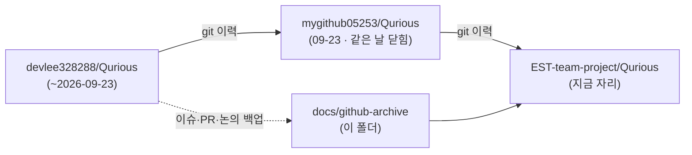

# GitHub 기록 — 옛 이슈·PR·논의 75건

> 옛 저장소 `devlee328288/Qurious` 의 이슈·PR·논의는 2026-09-23 계정 문제로 더는 열리지 않습니다.
> GitHub 에 다시 올리지 않고, 백업(2026-09-23 14:00 KST 무렵 받음)에서 **이 폴더의 Markdown 문서**로 옮겼습니다.
> 번호는 옛 번호 그대로입니다 — 커밋 메시지 속 `#74` 같은 번호도 이 폴더의 같은 번호 파일을 가리킵니다.

## 1. 지금 답이 필요한 논의 — 결론 초안 8건

2026-09-23 에 논의마다 결론 초안을 올렸는데, 곧바로 옛 저장소가 닫혀 팀원이 읽을 수 없게 됐습니다.
**GitHub 에 댓글을 달 수 없으니 의견은 팀 대화방에 남겨 주세요** — 이동원이 결정 대장에 옮깁니다.
결정 대장 v0.9 는 [`docs/계획서/논의결정대장_v0.9.md`](../계획서/논의결정대장_v0.9.md) 입니다 — 옛 PR [#75](pulls/075.md) 는 머지되기 전에 옛 저장소가 닫혔습니다.

| 논의 | 번호 | 주제 | 초안 | 의견 기한 (KST) |
|---|---|---|---|---|
| D0 | [#6](discussions/006.md) | 팀 운영·기록 방식 | [결론 초안](discussions/006.md#discussioncomment-18561533) | ~~09-27(일) 23:59~~ **09-30(수) 23:59** |
| D1 | [#7](discussions/007.md) | Qurious 2.0은 누구의 어떤 문제를 푸는가 | [결론 초안](discussions/007.md#discussioncomment-18561553) | ~~09-27(일) 23:59~~ **09-30(수) 23:59** |
| D2 | [#10](discussions/010.md) | 유료 서비스(AWS 등)를 어디까지 쓸지와 데모 방식 | [결론 초안](discussions/010.md#discussioncomment-18561567) | ~~09-27(일) 23:59~~ **09-30(수) 23:59** |
| D3 | [#30](discussions/030.md) | lumina-invest 기능 범위 — 화면이 한 번도 부르지 않는 API가 31개입니다 | [결론 초안](discussions/030.md#discussioncomment-18561638) | ~~09-27(일) 23:59~~ **09-30(수) 23:59** |
| D4 | [#17](discussions/017.md) | 1차 프로젝트 매듭짓기 — 비용·누수·검정 규격을 2·3차 공통으로 정합니다 | [결론 초안](discussions/017.md#discussioncomment-18561510) | ~~09-26(토) 18:00~~ **09-30(수) 23:59** |
| D5 | [#18](discussions/018.md) | 2차 로보어드바이저 설계 — 무엇에 투자하고, 무엇으로 계산하고, 무엇과 비교할까 | [결론 초안](discussions/018.md#discussioncomment-18561594) | ~~09-27(일) 23:59~~ **09-30(수) 23:59** |
| D6 | [#20](discussions/020.md) | 3차 커스텀 인디케이터 설계 — 같은 'RSI 14'가 세 벌이라 결론이 58.3% 뒤집힙니다 | [결론 초안](discussions/020.md#discussioncomment-18561614) | ~~09-27(일) 23:59~~ **09-30(수) 23:59** |
| D7 | [#13](discussions/013.md) | 모의투자는 무엇으로 체결하고 무엇을 기록할까 — 실행 데모와 포워드 데이터 축적 | [결론 초안](discussions/013.md#discussioncomment-18561493) | ~~09-26(토) 18:00~~ **09-30(수) 23:59** |
| D8 | [#69](discussions/069.md) | CI(자동 시험)를 둘 것인가, 둔다면 어떤 식으로 — 먼저 세웠던 것을 걷어내고 여쭙습니다 | 초안 없음 | — |

의견 기한은 2026-09-23(S49)에 전부 **09-30(수) 23:59** 로 늦췄습니다(D4·D7 포함) — 옛 값은 취소선으로 남겼습니다. 2차 시작일 09-27 은 그대로입니다.

## 2. 읽는 법

```
docs/github-archive/
├── README.md          ← 이 색인
├── discussions/NNN.md ← 논의 10건 (댓글·답글 전부)
├── issues/NNN.md      ← 이슈 41건 (열림 34)
├── pulls/NNN.md       ← PR 24건 (열림 1 = #75)
└── attachments/       ← 옛 글에 붙어 있던 이미지
```



| 원문에 있던 것 | 이 문서에서 |
|---|---|
| `#12` 같은 번호 · 이슈·PR·논의 주소 | 이 폴더의 파일로 잇는 **상대 경로** — 저장소 주소가 또 바뀌어도 안 깨집니다 |
| 댓글 고정 링크(`#issuecomment-…`) | 그 댓글 바로 위에 같은 이름의 앵커를 달아 그 자리로 잇습니다 |
| 코드·커밋 링크 · 본문 속 커밋 해시 | 조직 저장소 `EST-team-project/Qurious` 로, 해시는 **새 해시**로 (대응표 [`docs/commit-map-2026-09-23.tsv`](../commit-map-2026-09-23.tsv)) |
| Alpha_Stack 링크 | 옮기지 않은 저장소라 링크 대신 `경로 @ 새 해시` 글자로 — 각자 가진 사본에서 찾습니다 |
| `@아이디` 멘션 | `` `@아이디` `` 처럼 감쌌습니다 (글자 그대로) |
| 시각 | 모두 한국 시각(KST) |

**옮기지 못한 것** — PR 리뷰(승인·코드 줄 댓글), 이모지 반응, 글 수정 이력, Actions 실행 로그.
백업에 없었고, 옛 계정이 삭제돼 다시 받을 수도 없습니다.

## 3. 논의 10건

| 번호 | 제목 | 카테고리 | 원 작성 | 작성일 | 댓글·답글 |
|---|---|---|---|---|---|
| [#6](discussions/006.md) | [논의] D0 팀 운영·기록 방식 | General | 이동원(`devlee328288`) | 2026-09-15 | 6·6 |
| [#7](discussions/007.md) | [논의] D1 Qurious 2.0은 누구의 어떤 문제를 푸는가 | 방향성·목표 | 이동원(`devlee328288`) | 2026-09-15 | 6·2 |
| [#10](discussions/010.md) | [논의] D2 유료 서비스(AWS 등)를 어디까지 쓸지와 데모 방식 | 인프라·비용 | 이동원(`devlee328288`) | 2026-09-15 | 4·2 |
| [#13](discussions/013.md) | [논의] D7 모의투자는 무엇으로 체결하고 무엇을 기록할까 — 실행 데모와 포워드 데이터 축적 | 설계(1·2·3차) | 이동원(`devlee328288`) | 2026-09-15 | 2·3 |
| [#17](discussions/017.md) | [논의] D4 1차 프로젝트 매듭짓기 — 비용·누수·검정 규격을 2·3차 공통으로 정합니다 | 설계(1·2·3차) | 이동원(`devlee328288`) | 2026-09-17 | 5·3 |
| [#18](discussions/018.md) | [논의] D5 2차 로보어드바이저 설계 — 무엇에 투자하고, 무엇으로 계산하고, 무엇과 비교할까 | 설계(1·2·3차) | 이동원(`devlee328288`) | 2026-09-17 | 3·0 |
| [#20](discussions/020.md) | [논의] D6 3차 커스텀 인디케이터 설계 — 같은 'RSI 14'가 세 벌이라 결론이 58.3% 뒤집힙니다 | 설계(1·2·3차) | 이동원(`devlee328288`) | 2026-09-17 | 2·0 |
| [#29](discussions/029.md) | [의견 공유] 2차, 3차 의견 공유합니다 | 방향성·목표 | `rkdalstjr` | 2026-09-17 | 1·2 |
| [#30](discussions/030.md) | [논의] D3 lumina-invest 기능 범위 — 화면이 한 번도 부르지 않는 API가 31개입니다 | 설계(1·2·3차) | 이동원(`devlee328288`) | 2026-09-17 | 3·0 |
| [#69](discussions/069.md) | [논의] D8 CI(자동 시험)를 둘 것인가, 둔다면 어떤 식으로 — 먼저 세웠던 것을 걷어내고 여쭙습니다 | General | 이동원(`devlee328288`) | 2026-09-21 | 0·0 |

## 4. 이슈 41건

| 번호 | 제목 | 상태 | 원 작성 | 작성일 | 댓글 |
|---|---|---|---|---|---|
| [#1](issues/001.md) | [로드맵] Qurious 2.0 설계 인덱스: 분석 Issue·논의 Discussion 전체 목록 | 열림 | 이동원(`devlee328288`) | 2026-09-15 | 1 |
| [#3](issues/003.md) | [분석] A16 1차 Alpha_Stack 유산 인벤토리 | 열림 | 이동원(`devlee328288`) | 2026-09-15 | 0 |
| [#4](issues/004.md) | [분석] A17 강사님 배포 자료 인벤토리: 2·3차 평가 관점과 재사용 자산 | 열림 | 이동원(`devlee328288`) | 2026-09-15 | 0 |
| [#5](issues/005.md) | [분석] A15 과제 명세·문서 현황과 RFP 대비 구현 격차표 | 열림 | 이동원(`devlee328288`) | 2026-09-15 | 0 |
| [#8](issues/008.md) | [분석] A14 클라우드 인프라·CI/CD — 걷어낸 것·남은 것·무료로 할 수 있는 것 | 열림 | 이동원(`devlee328288`) | 2026-09-15 | 0 |
| [#9](issues/009.md) | [분석] A1 실행 환경·루트 설정·앱 진입점 — 주 경로에 꼭 필요한 서비스는 무엇인가 | 열림 | 이동원(`devlee328288`) | 2026-09-15 | 1 |
| [#11](issues/011.md) | [분석] A8 [Execution] 증권사 브로커 계층 — 모의투자로 실제 연결되는 증권사는 어디인가 | 열림 | 이동원(`devlee328288`) | 2026-09-15 | 1 |
| [#12](issues/012.md) | [분석] A9 [Execution] 주문·포트폴리오·자동매매 — 가상 체결은 무엇을 기록하고 무엇을 빠뜨리나 | 열림 | 이동원(`devlee328288`) | 2026-09-15 | 1 |
| [#14](issues/014.md) | [분석] A6 퀀트 ML 파이프라인·백테스트·ML 실험(LEAN 포함) — 성과 계산 엔진 5개가 서로 다른 규칙을 씁니다 | 열림 | 이동원(`devlee328288`) | 2026-09-17 | 0 |
| [#15](issues/015.md) | [알림] 강사님 원본 최신화 점검 (2026-09-17) — domain-rag-lab만 변경, 가져올 것은 거의 없습니다 | 열림 | 이동원(`devlee328288`) | 2026-09-17 | 0 |
| [#16](issues/016.md) | [분석] A7 로보어드바이저 자산배분·스크리닝 — 'AI가 최적 계산'이라는 화면에서 자산군 비중은 고정표입니다 | 열림 | 이동원(`devlee328288`) | 2026-09-17 | 1 |
| [#19](issues/019.md) | [분석] A5 기술지표·커스텀 인디케이터 — 화면에서 본 지표와 백테스트가 쓰는 지표가 다릅니다 | 열림 | 이동원(`devlee328288`) | 2026-09-17 | 1 |
| [#21](issues/021.md) | [분석] A2 데이터 계층 — 테이블 25개는 마이그레이션과 맞는데, 장부가 다섯 군데로 흩어져 있습니다 | 열림 | 이동원(`devlee328288`) | 2026-09-17 | 1 |
| [#22](issues/022.md) | [분석] A3 인증·세션·권한 — 로그아웃 한 번이 전 사용자의 JWT를 끊습니다 | 열림 | 이동원(`devlee328288`) | 2026-09-17 | 2 |
| [#23](issues/023.md) | [분석] A4 시장 데이터·캐시·동기화 — 예약 작업 2개가 한 번도 실행된 적이 없습니다 | 열림 | 이동원(`devlee328288`) | 2026-09-17 | 10 |
| [#24](issues/024.md) | [분석] A10 LLM 공급자·에이전트·RAG — 설정을 바꿔도 세 갈래는 계속 로컬로 가고, 크롤링한 문서는 읽히지 않는다 | 열림 | 이동원(`devlee328288`) | 2026-09-17 | 1 |
| [#25](issues/025.md) | [분석] A11 크롤링·인제스트 — robots.txt를 확인하지 않고, 같은 저장소 안에 중복 방지의 정답과 오답이 같이 있다 | 열림 | 이동원(`devlee328288`) | 2026-09-17 | 4 |
| [#26](issues/026.md) | [확인 요청] 번역 데이터(AI 허브)를 2·3차에 쓸 것인가 — 이용정책 3개 조항 확인 필요 | 열림 | 이동원(`devlee328288`) | 2026-09-17 | 0 |
| [#27](issues/027.md) | [분석] A12 알림·감사·시스템 — 알림을 끄면 팀 공용 채널로 나가고, 로그인 기록은 한 줄도 없습니다 | 열림 | 이동원(`devlee328288`) | 2026-09-17 | 1 |
| [#28](issues/028.md) | [분석] A13 프론트엔드 SPA — 3차 산출물인 Pine Script가 지금은 TradingView에서 실행되지 않습니다 | 열림 | 이동원(`devlee328288`) | 2026-09-17 | 1 |
| [#31](issues/031.md) | [알림] 강사님 강의 자료 4곳 신규 확인 (2026-09-17) — KRX·DART 수집 경로와 ML 모델 예제가 2차에 바로 걸립니다 | 열림 | 이동원(`devlee328288`) | 2026-09-17 | 13 |
| [#32](issues/032.md) | [인계] 1차 AlphaStack이 2차에 넘기는 것 — 재사용 자산 4종과 숙제 5건 | 열림 | 이동원(`devlee328288`) | 2026-09-18 | 2 |
| [#33](issues/033.md) | [분석] 포털 시세 데이터의 실제 구조 — 원주가·거래정지·상장폐지 실측과 전처리 설계 | 열림 | 이동원(`devlee328288`) | 2026-09-18 | 11 |
| [#38](issues/038.md) | TR(총수익) 계열 계산 — 설계·구현·검증 | 닫힘(완료) · 2026-09-19 15:51 | 이동원(`devlee328288`) | 2026-09-19 | 0 |
| [#40](issues/040.md) | [작업] 거래비용 — 체결·수수료·세금·슬리피지를 저장하고 백테스트에 반영한다 | 닫힘(완료) · 2026-09-20 12:57 | 이동원(`devlee328288`) | 2026-09-19 | 2 |
| [#46](issues/046.md) | [작업] JWT 폐기가 전 사용자를 끊는다 — 이름표를 jti 로, 폐기 API 에 인증을 (#22 결함 1·2) | 닫힘(완료) · 2026-09-20 16:39 | 이동원(`devlee328288`) | 2026-09-20 | 0 |
| [#49](issues/049.md) | [문서] 프로젝트 계획서 v1.0 — 강사님 양식 9칸을 저장소 실측치로 채운다 | 닫힘(완료) · 2026-09-20 17:04 | 이동원(`devlee328288`) | 2026-09-20 | 0 |
| [#51](issues/051.md) | [분석] 요율표 실측 판정 — 모의 체결로는 검증할 수 없다: 4중 차단과 output2 누락, 2026 법정요율 대조 (#40 후속) | 열림 | 이동원(`devlee328288`) | 2026-09-20 | 0 |
| [#52](issues/052.md) | [작업] 벤치마크 지수를 자체 계산한다 — KOSPI 평균 0.066% 재현, 감자 1건 보정 | 닫힘(완료) · 2026-09-21 14:23 | 이동원(`devlee328288`) | 2026-09-21 | 0 |
| [#53](issues/053.md) | [작업] HF 백업 경로 — 파케이만으로 SQLite 를 되살린다 (복원 실측 13,428,316행) | 열림 | 이동원(`devlee328288`) | 2026-09-21 | 1 |
| [#54](issues/054.md) | [작업] 요율표 관측 장치 수리 — 제비용은 output2 에 있었다, 주문 0건으로 모의 수수료 0원 확정 (#51 후속) | 열림 | 이동원(`devlee328288`) | 2026-09-21 | 0 |
| [#55](issues/055.md) | [결함] 원천 표가 아직 오염돼 있다 — 052670 감자가 adj_clpr·tr_index 에 300배로 남아 있다 (#52 는 지수만 고쳤다) | 열림 | 이동원(`devlee328288`) | 2026-09-21 | 0 |
| [#56](issues/056.md) | [결함] 코스닥 재현 오차 평균 0.871% — 코스피의 13배, 가설 2개는 기각됐다 | 열림 | 이동원(`devlee328288`) | 2026-09-21 | 0 |
| [#59](issues/059.md) | [작업] 실시간 수집 데모 — 요구사항대로 적재하고 "어떻게 가져왔는지"를 화면으로 보여준다 (강사님 요청) | 열림 | 이동원(`devlee328288`) | 2026-09-21 | 0 |
| [#60](issues/060.md) | [결함] ETF 면제가 체결 경로에만 걸려 있었다 — 매도 정산 0.20%p 과대 계상 (실측 2만원/1천만원) | 열림 | 이동원(`devlee328288`) | 2026-09-21 | 0 |
| [#61](issues/061.md) | [분석] 강사님 4일차 요구사항 격차 지도 — 242항목 대조 (있다 29% · 부분 32% · 없다 38%) | 닫힘(완료) · 2026-09-21 15:07 | 이동원(`devlee328288`) | 2026-09-21 | 0 |
| [#62](issues/062.md) | [작업] 강사님 요구 29개 → 4파트 역할 분배안 v1.0 (심사 4안 중 합성 · Assignee 비움) | 열림 | 이동원(`devlee328288`) | 2026-09-21 | 1 |
| [#63](issues/063.md) | [분석] AWS 요금제별 월 비용과 출구 전략 — 전체 24/7 은 월 305만원, 증빙 전략은 실질 0원 (검증 정정 47건) | 열림 | 이동원(`devlee328288`) | 2026-09-21 | 0 |
| [#64](issues/064.md) | [분석] Organization 신설·저장소 이관·멀티레포 분리 판단 — 옮기는 건 쉽고, 쪼개는 건 하지 말아야 한다 (검증 정정 32건) | 열림 | 이동원(`devlee328288`) | 2026-09-21 | 0 |
| [#67](issues/067.md) | [작업] ~~CI 를 신호등으로 전환~~ → CI 워크플로 제거 + 형태를 D8 #69 에서 논의 | 닫힘(완료) · 2026-09-21 15:36 | 이동원(`devlee328288`) | 2026-09-21 | 0 |
| [#71](issues/071.md) | [작업] 요구사항 추적표(RTM) v1.0 — 27 vs 29 매듭을 계층 ID 로 풀고, 사각지대 8개를 찾았다 | 열림 | 이동원(`devlee328288`) | 2026-09-21 | 0 |

## 5. PR 24건

| 번호 | 제목 | 상태 | 원 작성 | 작성일 | 댓글 |
|---|---|---|---|---|---|
| [#2](pulls/002.md) | chore: 강사님 lumina-invest 최신본(6d91401)을 반영하고 AWS 인프라·연동을 걷어낸다 | 머지됨 · 2026-09-15 11:27 | 이동원(`devlee328288`) | 2026-09-15 | 0 |
| [#34](pulls/034.md) | feat: 시세 수집기 — 원문 보존·vs 기반 수정주가·중단 재개 (09-22 가동) | 머지됨 · 2026-09-19 11:33 | 이동원(`devlee328288`) | 2026-09-19 | 0 |
| [#35](pulls/035.md) | fix: PR #34 이후 누락분 — Celery 태스크 등록·Beat 이름·수집 시작일 실측 | 머지됨 · 2026-09-19 12:26 | 이동원(`devlee328288`) | 2026-09-19 | 0 |
| [#36](pulls/036.md) | feat: 배당 수집기 — PR(가격수익)에서 TR(총수익)의 재료까지, 그리고 S29 'T-2 역산' 정정 | 머지됨 · 2026-09-19 14:10 | 이동원(`devlee328288`) | 2026-09-19 | 2 |
| [#37](pulls/037.md) | fix: 배당 수집기 후속 수정 — 열두 달 훑기·주식배당 제외·reparse 버그 (#36 에서 누락된 3커밋) | 머지됨 · 2026-09-19 15:21 | 이동원(`devlee328288`) | 2026-09-19 | 0 |
| [#39](pulls/039.md) | feat: TR(총수익) 계열 — 모아 둔 배당 9,188건이 이제 쓰인다, 그리고 자회사 배당 1건 적발 | 머지됨 · 2026-09-19 15:51 | 이동원(`devlee328288`) | 2026-09-19 | 0 |
| [#41](pulls/041.md) | fix: KIS 주문 TR ID 를 신 TR 로 바꾼다 — 구 TR 은 사전고지 없이 막힌다 | 머지됨 · 2026-09-20 12:30 | 이동원(`devlee328288`) | 2026-09-20 | 0 |
| [#42](pulls/042.md) | feat: 매매비용을 코드로 옮긴다 — 백테스트 세 갈래가 같은 요율표를 쓴다 | 머지됨 · 2026-09-20 12:30 | 이동원(`devlee328288`) | 2026-09-20 | 0 |
| [#43](pulls/043.md) | feat: 주문이 정산금액으로 현금을 옮긴다 — orders 확장 + order_fills 신설 | 머지됨 · 2026-09-20 12:30 | 이동원(`devlee328288`) | 2026-09-20 | 0 |
| [#44](pulls/044.md) | fix: #43 을 main 으로 잇는다 — 머지 순서가 어긋나 orders 확장이 main 에 빠졌다 | 머지됨 · 2026-09-20 12:33 | 이동원(`devlee328288`) | 2026-09-20 | 0 |
| [#45](pulls/045.md) | feat: 증권사 체결을 들여온다 — 비용이 처음으로 추정을 벗어난다 (+ 주문 버그 2건) | 머지됨 · 2026-09-20 12:57 | 이동원(`devlee328288`) | 2026-09-20 | 0 |
| [#47](pulls/047.md) | fix: 로그아웃 한 번이 전 사용자를 끊던 것을 멈춘다 — 폐기 이름표를 jti 로 (#22 결함 1·2) | 머지됨 · 2026-09-20 16:39 | 이동원(`devlee328288`) | 2026-09-20 | 0 |
| [#48](pulls/048.md) | docs: 밀린 TIL 5장을 채운다 — PR #35~#45 와 #47 | 머지됨 · 2026-09-20 16:39 | 이동원(`devlee328288`) | 2026-09-20 | 1 |
| [#50](pulls/050.md) | docs: 프로젝트 계획서 v1.0 — 양식 9칸을 실측으로 채우고, 정본 .md + 제출용 .docx 로 낸다 | 머지됨 · 2026-09-20 17:04 | 이동원(`devlee328288`) | 2026-09-20 | 0 |
| [#57](pulls/057.md) | feat: 벤치마크 지수를 자체 계산하고 HF 백업 경로를 연다 | 머지됨 · 2026-09-21 14:23 | 이동원(`devlee328288`) | 2026-09-21 | 0 |
| [#58](pulls/058.md) | fix: 제비용은 output2 에 있었고, ETF 면제는 배선돼 있지 않았다 | 머지됨 · 2026-09-21 14:23 | 이동원(`devlee328288`) | 2026-09-21 | 0 |
| [#65](pulls/065.md) | fix: S39 작업 5커밋이 main 에 없다 — PR #58 을 main 으로 잇는다 | 머지됨 · 2026-09-21 15:06 | 이동원(`devlee328288`) | 2026-09-21 | 0 |
| [#66](pulls/066.md) | fix: 실거래로 나가는 문이 셋이었다 + CI 게이트 착수 — 산출물 4종 동봉 | 머지됨 · 2026-09-21 15:07 | 이동원(`devlee328288`) | 2026-09-21 | 0 |
| [#68](pulls/068.md) | docs: CI 를 병합 게이트가 아니라 회귀 신호로 둔다 — 룰셋은 걸지 않는다 | 머지됨 · 2026-09-21 15:36 | 이동원(`devlee328288`) | 2026-09-21 | 0 |
| [#70](pulls/070.md) | chore: CI 워크플로를 걷어내고, 어떤 식으로 세울지 먼저 논의한다 (D8 #69) | 머지됨 · 2026-09-21 15:51 | 이동원(`devlee328288`) | 2026-09-21 | 0 |
| [#72](pulls/072.md) | docs: RTM v1.0 — 개수 매듭을 계층 ID 로 풀고, 사각지대 8개를 찾았다 | 머지됨 · 2026-09-21 15:52 | 이동원(`devlee328288`) | 2026-09-21 | 0 |
| [#73](pulls/073.md) | docs: RTM v1.0 을 main 에 다시 잇는다 — #72 가 죽은 브랜치 위에 머지됐다 (세 번째) | 머지됨 · 2026-09-21 15:55 | 이동원(`devlee328288`) | 2026-09-21 | 0 |
| [#74](pulls/074.md) | docs: ERD·데이터 사전 v1.0 — 1,343만 행에 설명을 붙이고, 두 DB 가 안 이어진 것을 찾았다 | 머지됨 · 2026-09-21 16:26 | 이동원(`devlee328288`) | 2026-09-21 | 0 |
| [#75](pulls/075.md) | docs: 논의 결정 대장 v0.9 — 결론 초안 8건을 한 표로 모으고, 1차 비용이 2배였음을 찾았다 | 열림 | 이동원(`devlee328288`) | 2026-09-23 | 0 |

---

만든 도구: 저장소 밖 `_github_backup/restore/restore.py archive` (네트워크를 쓰지 않음) · 2026-09-23 S46.
