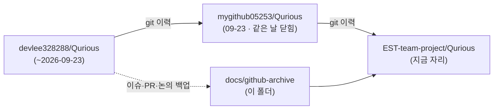

# GitHub 기록 — 옛 글 75건과 새 글의 원본

> 옛 저장소 `devlee328288/Qurious` 의 이슈·PR·논의는 2026-09-23 계정 문제로 더는 열리지 않습니다.
> 백업(2026-09-23 14:00 KST 무렵 받음)에서 **이 폴더의 Markdown 문서**로 옮겼습니다. 번호는 옛 번호 그대로입니다.
> **2026-09-28 부터** 새 저장소 `EST-team-project/Qurious` 에 올리는 글의 원본도 여기에 둡니다.
> 옛 글과 새 글 모두 **원 작성일 폴더 → 글 폴더**로 정리합니다 — GitHub 글이 사라져도 이 폴더와 GitLab 미러에 남습니다.

## 0. 폴더 지도

```
docs/github-archive/
├── README.md          ← 이 색인 (규칙 · 날짜별 목록 · 올림 상태)
├── 갱신대장.md         ← 올린 글 · 안 올린 글의 갱신 상태 (S58~) — 글 폴더마다 01-2026-09-28-갱신.md · 6절 닫기 점검 (S61~)
├── Github-링크.md      ← 이동원이 모아 둔 새 저장소 이슈 · 논의 주소 (S61 커밋 · 09-29 오전 기준 — 정본 번호는 3절)
├── 답글-수신함.md      ← 이동원이 팀원 답글을 붙여 넣는 곳 → Claude 가 세션마다 글 폴더로 옮김 (S61~)
├── attachments/       ← 옛 글에 붙어 있던 이미지
├── 2026-09-15/   ← 옛 글 13건
├── 2026-09-17/   ← 옛 글 18건
├── 2026-09-18/   ← 옛 글 2건
├── 2026-09-19/   ← 옛 글 7건
├── 2026-09-20/   ← 옛 글 11건
├── 2026-09-21/   ← 옛 글 23건
├── 2026-09-23/   ← 옛 글 1건
├── 2026-09-28/        ← 새 글 18건
│   ├── 이슈-화면IA-v0.1/          00-본문.md · 01-2026-09-28-v0.2.md  (#14 · 댓글 01 올림)
│   ├── 이슈-강사님자료-변경추적/   00-본문.md · 01-2026-09-28-기준점.md · 02 ~ 07 점검 댓글 · 08 반영 결과(#6) · 기준점.tsv  (이슈는 닫음 → #6 에서 이어 감)
│   ├── PR-docs-screen-ia-v0-1/    00-본문.md  (#16)
│   ├── PR-docs-screen-ia-v0-2/    00-본문.md  (#19)
│   ├── PR-feat-daily-data-update/ 00-본문.md  (#23)
│   ├── 이슈-I14-모의계좌-장부/     00-본문.md  (#24 · #25 머지로 닫힘)
│   ├── PR-fix-i14-paper-ledger/   00-본문.md  (#25)
│   ├── 이슈-화면결함-파트별/       00-본문.md  (#26)
│   ├── PR-fix-git-bash-utf8-and-records/  00-본문.md  (#27)
│   ├── PR-docs-wireframe-v0-2/    00-본문.md  (#28)
│   ├── PR-docs-records-26-28/     00-본문.md  (#29)
│   ├── PR-fix-quote-change-a1/    00-본문.md  (#30)
│   ├── 이슈-DF08-다리-뒤-기준일/   00-본문.md  (#35)
│   ├── PR-feat-collector-candles-df08/  00-본문.md  (#33)
│   ├── PR-docs-erd-v1-1-and-meetings/   00-본문.md  (#34)
│   ├── 이슈-HF-데이터셋-private/   00-본문.md  (#37)
│   ├── PR-docs-archive-refresh-s58/  00-본문.md  (#36)
│   └── PR-fix-collector-df01-shares/  00-본문.md  (#39)
├── 2026-09-29/        ← 새 글 10건
│   ├── PR-docs-test-plan-v1-2/        00-본문.md  (#42)
│   ├── 이슈-로드맵-인덱스-v2/          00-본문.md  (#47 · 옛 `#1` → #4 를 대신)
│   ├── PR-docs-archive-new-numbers-s61/  00-본문.md  (#46)
│   ├── PR-fix-collector-utf8-df11-df16/  00-본문.md  (#48)
│   ├── 논의-기능목록-역할희망/         00-본문.md · 01 · 02 갱신 · 03 마무리(역할 확정 · 닫기)  (D9 · #52)
│   ├── PR-docs-api-spec-and-design-s63/  00-본문.md  (#51)
│   ├── PR-fix-route-cache-df17/        00-본문.md  (#53)
│   ├── PR-docs-writing-standard-v0-1/  00-본문.md  (#55)
│   ├── PR-docs-erd-dictionary-v1-2/    00-본문.md  (#56)
│   └── PR-docs-rtm-v1-1-test-plan-v1-3/  00-본문.md  (#60)
├── 2026-09-30/        ← 새 글 8건
│   ├── PR-chore-lumina-invest-b055ab0/  00-본문.md  (#68)
│   ├── 논의-강사님최신-반영/           00-본문.md  (#69 · 옛 D8 번호와 다른 글)
│   ├── PR-feat-local-run-scripts/      00-본문.md  (#71)
│   ├── 이슈-로컬실행-사용법/           00-본문.md · 01 · 02 갱신 댓글  (#70)
│   ├── 이슈-계정-CRUD-점검/            00-본문.md  (#76 · 작업 기록 — PR #75 가 닫음)
│   ├── PR-feat-account-crud-mypage/    00-본문.md  (#75)
│   ├── 이슈-통합본-반입-용어사전/      00-본문.md  (번호는 올린 뒤 · 작업 기록 — PR 이 닫는다)
│   └── PR-feat-rag-lab-import-glossary/  00-본문.md  (#77)
├── 2026-10-01/        ← 새 글 5건
│   ├── PR-docs-plan-v2-and-goal1-design/  00-본문.md  (#78)
│   ├── [논의] 리밸런싱 3종의 실행 주기·허용 이탈률·현금흐름 기준 설정/  00-본문.md(③ 주담당 글 · #79 이슈) · 01 내 의견(부담당 · 10-01 올림) · 02 거래일 달력 주소(10-02 · 올릴 것)
│   ├── PR-feat-learning-pages/        00-본문.md  (#80)
│   ├── PR-feat-ohlcv-v1-intake/       00-본문.md  (#81)
│   └── PR-feat-finance-lectures-placement/  00-본문.md  (#84)
├── 2026-10-02/        ← 새 글 5건
│   ├── 이슈-QFRS-마이그레이션-정리/    00-본문.md · 01 강민석 님 답글(10-02) · 02 코드 대조 확인(10-03 · 올림) · 03 갱신(10-03 · 번호 0013 → 0014 · 올릴 것)  (#88)
│   ├── PR-feat-glossary-screen-and-w3-docs/  00-본문.md  (#87)
│   ├── PR-feat-trading-calendar-and-glossary-relations/  00-본문.md  (#89)
│   ├── PR-feat-data-hub-calendar-ohlcv-api/  00-본문.md  (#91)
│   └── PR-feat-legal-kb-fetch-and-index/  00-본문.md  (#93)
└── 2026-10-03/        ← 새 글 7건
    ├── PR-feat-kb-search-eval-and-glossary-candidates/  00-본문.md  (#97)
    ├── PR-chore-instructor-base-9478811-server/  00-본문.md  (#98)
    ├── 논의-강사님기초코드-9478811-반영/  00-본문.md · 01-2026-10-03-화면-결정.md  (#99)
    ├── PR-chore-instructor-base-9478811-screens/  00-본문.md  (#100)
    ├── 이슈-백테스트보고서-결과칸-요청/  00-본문.md  (번호는 올린 뒤)
    ├── PR-docs-deliverables-v01-doc-figures/  00-본문.md  (#101)
    └── PR-feat-kb-ask-and-local-llm-research/  00-본문.md  (번호는 올린 뒤)
```

| | 옛 글 (2026-09-15 ~ 09-23) | 새 글 (2026-09-28 ~) |
|---|---|---|
| 날짜 폴더 | 옛 저장소에 **처음 쓴 날** | 파일로 **처음 쓴 날** |
| 글 폴더 이름 | 종류-옛 번호 (`이슈-001` · `PR-002` · `논의-006`) | 종류-짧은 이름 (`이슈-화면IA-v0.1`) — 새 번호는 올린 뒤 3절 색인에 |
| 글 폴더 안 | `00-기록.md` — 본문과 댓글 전부 (원문 그대로) | `00-본문.md` → `01-날짜-주제.md`(내 댓글) → `NN-날짜-답글-이름.md`(팀원 답글) |
| 새 저장소에 올렸는지 | 3절 「새 저장소」 칸 | 3절 「새 저장소」 칸 |

- 다시 올린 옛 글에 답글이 오면 **그 글 폴더**에 `01-날짜-답글-이름.md` 부터 쌓는다 (옛 기록 `00-기록.md` 는 고치지 않는다).
- 올림 현황 (2026-09-28 S58 · 사용자 보고): 옛 글 75건 중 **17건** — 이슈 8(원 작성 09-15 전부: 옛 `#1` · `#3` · `#4` · `#5` · `#8` · `#9` · `#11` · `#12`) · 논의 9(원 작성 09-17 까지 전부: 옛 `#6` · `#7` · `#10` · `#13` · `#17` · `#18` · `#20` · `#29` · `#30`) — 새 번호 미기입. ~~S57: 6건~~. 새 글 16건 중 올림 15(… PR #30 · **#33 · #34**) · S57 이슈 1건은 번호 확인 전. → **S59 채움**: S57 이슈 「다리 뒤 기준일」 = **#35**(사용자 보고) · S58 PR = **#36**(머지 `abc4853`). 옛 글 17건의 새 번호 · HF 이슈 번호는 아직. → **S61 채움**: 옛 글 17건 새 번호(S60 이 09-29 목록 페이지로 확인 · S61 이 논의 9건 페이지로 갱신 댓글 확인) + S61 검색에서 옛 글 6건이 더 올라간 것을 확인(옛 `#14` → #38 · `#15` → #40 · `#16` → #41 · `#19` → #43 · `#21` → #44 · `#22` → #45) — **올림 23건**. → **S63 채움**: 옛 `#23` → **#49** · `#24` → **#50** · 인덱스 v2 → **#47**(사용자 `Github-링크.md` 09-29 12:31 · S63 이 이슈 목록 페이지로 제목 확인 · #40 닫힘 확인) — 옛 글 **올림 25건**. → **S65 채움**: D8 옛 `#69` → **#54**(09-29 · 본문 + 갱신 댓글 · 사용자 `Github-링크.md`) — 옛 글 **올림 26건**. → **S68 채움**: 옛 `#25` → **#57** · `#26` → **#58** · `#27` → **#59**(09-29) · `#28` → **#61**(09-30) — 이슈 페이지를 한 건씩 열어 제목 · 옛 주소로 확인 · 넷 다 검색 `comments:>0` 에 걸려 갱신 댓글도 붙은 것으로 본다(🟡) — 옛 글 **올림 30건**. 갱신 댓글 상태 · 닫기 후보는 [갱신 대장](갱신대장.md) 1절 · 6절.
- **올린 글도 최신으로** (S58~): 올린 뒤 바뀐 사실은 그 글 폴더에 `01-날짜-갱신.md` 댓글 파일로 남긴다 — 점검 결과와 순서는 [갱신 대장](갱신대장.md).
- 글 폴더를 더한 PR 은 **그 PR 안에서 3절 표에 줄을 더한다** — 번호 칸은 「(올린 뒤 적음)」으로 두면 된다. 줄이 빠지면 `python scripts/post_check.py` 가 `📇 색인 없음` 으로 알린다(S55 · PR #28 이 폴더 2개를 색인 없이 더했다).

## 1. 지금 답이 필요한 논의 — 결론 초안 8건

2026-09-23 에 논의마다 결론 초안을 올렸는데, 곧바로 옛 저장소가 닫혀 팀원이 읽을 수 없게 됐습니다.
**의견은 팀 대화방(Discord)에 남겨 주세요** — 이동원이 결정 대장에 옮깁니다.
결정 대장 v0.9 는 [`docs/계획서/논의결정대장_v0.9.md`](../계획서/논의결정대장_v0.9.md) 입니다 — 옛 PR [#75](2026-09-23/PR-075/00-기록.md) 는 머지되기 전에 옛 저장소가 닫혔습니다.

| 논의 | 옛 번호 | 새 번호 | 주제 | 초안 | 의견 기한 (KST) |
|---|---|---|---|---|---|
| D0 | [#6](2026-09-15/논의-006/00-기록.md) | [#10](https://github.com/EST-team-project/Qurious/discussions/10) | 팀 운영·기록 방식 | [결론 초안](2026-09-15/논의-006/00-기록.md#discussioncomment-18561533) | ~~09-27(일) 23:59~~ **09-30(수) 23:59** |
| D1 | [#7](2026-09-15/논의-007/00-기록.md) | [#11](https://github.com/EST-team-project/Qurious/discussions/11) | Qurious 2.0은 누구의 어떤 문제를 푸는가 | [결론 초안](2026-09-15/논의-007/00-기록.md#discussioncomment-18561553) | ~~09-27(일) 23:59~~ **09-30(수) 23:59** |
| D2 | [#10](2026-09-15/논의-010/00-기록.md) | [#12](https://github.com/EST-team-project/Qurious/discussions/12) | 유료 서비스(AWS 등)를 어디까지 쓸지와 데모 방식 | [결론 초안](2026-09-15/논의-010/00-기록.md#discussioncomment-18561567) | ~~09-27(일) 23:59~~ **09-30(수) 23:59** |
| D3 | [#30](2026-09-17/논의-030/00-기록.md) | [#32](https://github.com/EST-team-project/Qurious/discussions/32) | lumina-invest 기능 범위 — 화면이 한 번도 부르지 않는 API가 31개입니다 | [결론 초안](2026-09-17/논의-030/00-기록.md#discussioncomment-18561638) | ~~09-27(일) 23:59~~ **09-30(수) 23:59** |
| D4 | [#17](2026-09-17/논의-017/00-기록.md) | [#20](https://github.com/EST-team-project/Qurious/discussions/20) | 1차 프로젝트 매듭짓기 — 비용·누수·검정 규격을 2·3차 공통으로 정합니다 | [결론 초안](2026-09-17/논의-017/00-기록.md#discussioncomment-18561510) | ~~09-26(토) 18:00~~ **09-30(수) 23:59** |
| D5 | [#18](2026-09-17/논의-018/00-기록.md) | [#21](https://github.com/EST-team-project/Qurious/discussions/21) | 2차 로보어드바이저 설계 — 무엇에 투자하고, 무엇으로 계산하고, 무엇과 비교할까 | [결론 초안](2026-09-17/논의-018/00-기록.md#discussioncomment-18561594) | ~~09-27(일) 23:59~~ **09-30(수) 23:59** |
| D6 | [#20](2026-09-17/논의-020/00-기록.md) | [#22](https://github.com/EST-team-project/Qurious/discussions/22) | 3차 커스텀 인디케이터 설계 — 같은 'RSI 14'가 세 벌이라 결론이 58.3% 뒤집힙니다 | [결론 초안](2026-09-17/논의-020/00-기록.md#discussioncomment-18561614) | ~~09-27(일) 23:59~~ **09-30(수) 23:59** |
| D7 | [#13](2026-09-15/논의-013/00-기록.md) | [#13](https://github.com/EST-team-project/Qurious/discussions/13) | 모의투자는 무엇으로 체결하고 무엇을 기록할까 — 실행 데모와 포워드 데이터 축적 | [결론 초안](2026-09-15/논의-013/00-기록.md#discussioncomment-18561493) | ~~09-26(토) 18:00~~ **09-30(수) 23:59** |
| D8 | [#69](2026-09-21/논의-069/00-기록.md) | ~~아직 안 올림~~ [#54](https://github.com/EST-team-project/Qurious/discussions/54) (09-29 · General · [갱신 댓글](2026-09-21/논의-069/01-2026-09-28-갱신.md) 포함 · S65 채움 · 사용자 `Github-링크.md`) | CI(자동 시험)를 둘 것인가, 둔다면 어떤 식으로 — 먼저 세웠던 것을 걷어내고 여쭙습니다 | 초안 없음 | — |
| D9 | — (새 글 · S63) | ~~아직 안 올림~~ [#52](https://github.com/EST-team-project/Qurious/discussions/52) (09-29 · S64 채움) | [기능 전체 목록과 역할 희망 — 2차 · 3차에서 하고 싶은 것을 골라 주세요](2026-09-29/논의-기능목록-역할희망/00-본문.md) | ~~역할을 정하는 글이 아니라 희망을 모으는 글~~ → **2026-10-01 팀이 역할을 정했다** — [마무리 댓글](2026-09-29/논의-기능목록-역할희망/03-2026-10-01-역할확정.md)을 올리고 닫는다 | ~~10-02(금) 17:30 보고 전까지 (제안)~~ 끝남 |
| 강사님 반영 | — (새 글 · S68) | [#69](https://github.com/EST-team-project/Qurious/discussions/69) (09-30 · 설계 · S69 채움 · 사용자 `Github-링크.md` · 페이지 확인) — ⚠️ D8 의 **옛** 번호 `#69` 와 다른 글 | [강사님 lumina-invest 최신을 받았습니다 — 「나만의」 방향으로 고칠 곳 10가지](2026-09-30/논의-강사님최신-반영/00-본문.md) | 갈림길 10가지(장부 · 화면 비용 · CI · 새 화면 분류 …) | 10-06(화) 09:00 (제안) |

의견 기한은 2026-09-23(S49)에 전부 **09-30(수) 23:59** 로 늦췄습니다(D4·D7 포함) — 옛 값은 취소선으로 남겼습니다. ~~2차 시작일 09-27 은 그대로입니다.~~ → **2차는 10-01(목) 시작**입니다(강사님 공식 일정 · S52 확인 — 기한 09-30 이 시작보다 앞입니다).

## 2. 올리는 규칙과 명령

1. **글 하나 = 폴더 하나**, 그 폴더는 원 작성일 폴더 안에 둔다 — `YYYY-MM-DD/종류-이름/`.
2. 폴더 안 파일은 **올리는 순서대로 번호**를 붙인다 — 0절 표 참조.
3. **파일 하나 = GitHub 글 하나.** GitHub 는 이슈·댓글·PR 본문이 **65,536자**를 넘으면 거절한다.
   올리기 전에 `python scripts/post_check.py` — 60,000자부터 경고, 넘으면 실패. 넘으면 본문·댓글로 나눠 올린다.
4. **링크는 절대 주소로** (`https://github.com/EST-team-project/Qurious/blob/main/…`). 상대 경로는 GitHub 글 안에서 깨진다.
   `@멘션`은 백틱으로 감싸 두고 알림이 필요한 사람만 올리는 사람이 직접 붙인다. 옛 번호는 백틱(`` `#28` ``) — 새 저장소 번호와 겹친다.
5. **올리는 사람은 이동원이다.** AI 도구는 파일만 쓰고 GitHub 에 접속하지 않는다(개인 전역 규칙 10절 · 2026-09-28).
   **이슈 · 논의 · 거기 다는 댓글은 웹에서** 파일 내용을 붙여 넣어 올린다(S52 · 2026-09-28). git bash 로는 커밋 · push · PR 만 한다.
   한 번에 한 건, 결과를 보고 다음 건. ⚠️ **옛 글을 다시 올릴 때는 하루에 몇 건만** — 09-23 에 flag 된 계정의 글을
   26분에 약 20건 다시 올린 직후 계정이 flagged 됐다(원인 추정). 긴 글은 **쉬운 요약 + 이 폴더의 기록 파일 링크**로 올리는 편이 안전하다.

```bash
cd /c/Users/kik32/workspace/EST-Camp-AI-Quant/team_project/Qurious
python scripts/post_check.py                                   # 길이·링크·멘션 검사 (새 글 전부 + 한도 넘는 옛 글) + 색인 없는 글 폴더
T=$(gh auth token --user dev-dongwon05253); [ -n "$T" ] && echo "토큰 OK" || echo "토큰 없음 — 여기서 멈춤"

# 이슈 · 논의 · 댓글은 웹에서 (S52~) — 파일 내용을 붙여 넣고, 새 번호를 3절 색인에 적는다

# PR 만들기 (브랜치를 push 한 뒤)
GH_TOKEN=$T gh pr create --repo EST-team-project/Qurious --base main --head <브랜치> --title "제목" \
  --body-file docs/github-archive/<날짜>/<글 폴더>/00-본문.md
```

- 이슈 · 논의 · 댓글은 **웹에서** 파일 내용을 그대로 붙여 넣는다 — 원본과 GitHub 글이 같아진다(S52 부터 명령으로 올리지 않는다).
- 새 번호가 생기면 Claude 에게 알려 주면 파일에 직접 채운다 — **`sed` 자리 채우기는 쓰지 않는다**(S51 PR #16 이 `#번호` 글자 그대로 머지됐다).

## 3. 날짜별 색인

글자 수는 `python scripts/post_check.py` 와 같은 방식(UTF-16 단위)으로 잰 **파일 전체** 크기다. 옛 글은 본문과 댓글이 한 파일에 있어,
60,000자를 넘는 것은 본문·댓글 크기를 따로 적었다. 이 폴더로 옮기며 상대 링크가 길어져 옮기기 전보다 조금 커졌다.

### 2026-09-15 — 13건 · 올림 12 (이슈 전부 · 논의 전부 — PR 은 기록만) · 새 번호 S61 채움

| 글 | 제목 | 상태 | 원 작성 | 댓글 | 글자 | 새 저장소 |
|---|---|---|---|---|---:|---|
| [이슈 #1](2026-09-15/이슈-001/00-기록.md) | [로드맵] Qurious 2.0 설계 인덱스: 분석 Issue·논의 Discussion 전체 목록 | 열림 | 이동원(`devlee328288`) | 1 | ❌ 13.7만 — 본문 13.6만 ❌ · 댓글 1건(최대 1,659) | [#4](https://github.com/EST-team-project/Qurious/issues/4) · 갱신 댓글 ⏳ → **v2 로 대신**(2026-09-29/이슈-로드맵-인덱스-v2/) 올린 뒤 닫기 |
| [PR #2](2026-09-15/PR-002/00-기록.md) | chore: 강사님 lumina-invest 최신본(6d91401)을 반영하고 AWS 인프라·연동을 걷어낸다 | 머지됨 · 2026-09-15 11:27 | 이동원(`devlee328288`) | 0 | 6,569 |  |
| [이슈 #3](2026-09-15/이슈-003/00-기록.md) | [분석] A16 1차 Alpha_Stack 유산 인벤토리 | 열림 | 이동원(`devlee328288`) | 0 | 17,420 | [#5](https://github.com/EST-team-project/Qurious/issues/5) · 갱신 댓글 ⏳ |
| [이슈 #4](2026-09-15/이슈-004/00-기록.md) | [분석] A17 강사님 배포 자료 인벤토리: 2·3차 평가 관점과 재사용 자산 | 열림 | 이동원(`devlee328288`) | 0 | 14,679 | [#6](https://github.com/EST-team-project/Qurious/issues/6) · 갱신 댓글 ⏳ · 강사님 자료 추적 댓글도 여기 |
| [이슈 #5](2026-09-15/이슈-005/00-기록.md) | [분석] A15 과제 명세·문서 현황과 RFP 대비 구현 격차표 | 열림 | 이동원(`devlee328288`) | 0 | 35,117 | [#7](https://github.com/EST-team-project/Qurious/issues/7) · 갱신 댓글 🟡 · [닫기 댓글](2026-09-15/이슈-005/02-2026-09-29-닫기.md) 을 붙여 **닫힘**(RTM v1.1 = #60 머지 뒤 · S68 사용자 확인) |
| [논의 #6](2026-09-15/논의-006/00-기록.md) | [논의] D0 팀 운영·기록 방식 | General | 이동원(`devlee328288`) | 6·6 | ⚠️ 6.1만 — 본문 4.1만 · 댓글 6건(최대 7,164) | [#10](https://github.com/EST-team-project/Qurious/discussions/10) · 갱신 댓글 🟢 |
| [논의 #7](2026-09-15/논의-007/00-기록.md) | [논의] D1 Qurious 2.0은 누구의 어떤 문제를 푸는가 | 방향성·목표 | 이동원(`devlee328288`) | 6·2 | 53,914 | [#11](https://github.com/EST-team-project/Qurious/discussions/11) · 갱신 댓글 🟢 |
| [이슈 #8](2026-09-15/이슈-008/00-기록.md) | [분석] A14 클라우드 인프라·CI/CD — 걷어낸 것·남은 것·무료로 할 수 있는 것 | 열림 | 이동원(`devlee328288`) | 0 | 21,692 | [#8](https://github.com/EST-team-project/Qurious/issues/8) · 갱신 댓글 🟡 |
| [이슈 #9](2026-09-15/이슈-009/00-기록.md) | [분석] A1 실행 환경·루트 설정·앱 진입점 — 주 경로에 꼭 필요한 서비스는 무엇인가 | 열림 | 이동원(`devlee328288`) | 1 | 32,034 | [#9](https://github.com/EST-team-project/Qurious/issues/9) · 갱신 댓글 🟡 |
| [논의 #10](2026-09-15/논의-010/00-기록.md) | [논의] D2 유료 서비스(AWS 등)를 어디까지 쓸지와 데모 방식 | 인프라·비용 | 이동원(`devlee328288`) | 4·2 | 54,938 | [#12](https://github.com/EST-team-project/Qurious/discussions/12) · 갱신 댓글 🟢 |
| [이슈 #11](2026-09-15/이슈-011/00-기록.md) | [분석] A8 [Execution] 증권사 브로커 계층 — 모의투자로 실제 연결되는 증권사는 어디인가 | 열림 | 이동원(`devlee328288`) | 1 | 33,456 | [#17](https://github.com/EST-team-project/Qurious/issues/17) · 갱신 댓글 🟡 |
| [이슈 #12](2026-09-15/이슈-012/00-기록.md) | [분석] A9 [Execution] 주문·포트폴리오·자동매매 — 가상 체결은 무엇을 기록하고 무엇을 빠뜨리나 | 열림 | 이동원(`devlee328288`) | 1 | 48,783 | [#18](https://github.com/EST-team-project/Qurious/issues/18) · 갱신 댓글 🟡 |
| [논의 #13](2026-09-15/논의-013/00-기록.md) | [논의] D7 모의투자는 무엇으로 체결하고 무엇을 기록할까 — 실행 데모와 포워드 데이터 축적 | 설계(1·2·3차) | 이동원(`devlee328288`) | 2·3 | ⚠️ 6.5만 — 본문 6.1만 · 댓글 2건(최대 3,252) | [#13](https://github.com/EST-team-project/Qurious/discussions/13) · 갱신 댓글 🟢 |

### 2026-09-17 — 18건 · 올림 17 (논의 5 전부 · 이슈 12 — S61 · S63 · S68 확인 · 옛 `#31` 은 다시 올리지 않음 권장)

| 글 | 제목 | 상태 | 원 작성 | 댓글 | 글자 | 새 저장소 |
|---|---|---|---|---|---:|---|
| [이슈 #14](2026-09-17/이슈-014/00-기록.md) | [분석] A6 퀀트 ML 파이프라인·백테스트·ML 실험(LEAN 포함) — 성과 계산 엔진 5개가 서로 다른 규칙을 씁니다 | 열림 | 이동원(`devlee328288`) | 0 | 35,815 | [#38](https://github.com/EST-team-project/Qurious/issues/38) · 갱신 댓글 🟡 (S61 확인) |
| [이슈 #15](2026-09-17/이슈-015/00-기록.md) | [알림] 강사님 원본 최신화 점검 (2026-09-17) — domain-rag-lab만 변경, 가져올 것은 거의 없습니다 | 열림 | 이동원(`devlee328288`) | 0 | 5,029 | [#40](https://github.com/EST-team-project/Qurious/issues/40) · 갱신 댓글 🟡 · **닫아도 됨**(갱신 대장 6.1) |
| [이슈 #16](2026-09-17/이슈-016/00-기록.md) | [분석] A7 로보어드바이저 자산배분·스크리닝 — 'AI가 최적 계산'이라는 화면에서 자산군 비중은 고정표입니다 | 열림 | 이동원(`devlee328288`) | 1 | 22,237 | [#41](https://github.com/EST-team-project/Qurious/issues/41) · 갱신 댓글 🟡 (S61 확인) |
| [논의 #17](2026-09-17/논의-017/00-기록.md) | [논의] D4 1차 프로젝트 매듭짓기 — 비용·누수·검정 규격을 2·3차 공통으로 정합니다 | 설계(1·2·3차) | 이동원(`devlee328288`) | 5·3 | 49,982 | [#20](https://github.com/EST-team-project/Qurious/discussions/20) · 갱신 댓글 🟢 |
| [논의 #18](2026-09-17/논의-018/00-기록.md) | [논의] D5 2차 로보어드바이저 설계 — 무엇에 투자하고, 무엇으로 계산하고, 무엇과 비교할까 | 설계(1·2·3차) | 이동원(`devlee328288`) | 3·0 | 48,110 | [#21](https://github.com/EST-team-project/Qurious/discussions/21) · 갱신 댓글 🟢 |
| [이슈 #19](2026-09-17/이슈-019/00-기록.md) | [분석] A5 기술지표·커스텀 인디케이터 — 화면에서 본 지표와 백테스트가 쓰는 지표가 다릅니다 | 열림 | 이동원(`devlee328288`) | 1 | 24,147 | [#43](https://github.com/EST-team-project/Qurious/issues/43) · 갱신 댓글 🟡 (S61 확인) |
| [논의 #20](2026-09-17/논의-020/00-기록.md) | [논의] D6 3차 커스텀 인디케이터 설계 — 같은 'RSI 14'가 세 벌이라 결론이 58.3% 뒤집힙니다 | 설계(1·2·3차) | 이동원(`devlee328288`) | 2·0 | 44,608 | [#22](https://github.com/EST-team-project/Qurious/discussions/22) · 갱신 댓글 🟢 |
| [이슈 #21](2026-09-17/이슈-021/00-기록.md) | [분석] A2 데이터 계층 — 테이블 25개는 마이그레이션과 맞는데, 장부가 다섯 군데로 흩어져 있습니다 | 열림 | 이동원(`devlee328288`) | 1 | 23,062 | [#44](https://github.com/EST-team-project/Qurious/issues/44) · 갱신 댓글 🟡 (S61 확인) |
| [이슈 #22](2026-09-17/이슈-022/00-기록.md) | [분석] A3 인증·세션·권한 — 로그아웃 한 번이 전 사용자의 JWT를 끊습니다 | 열림 | 이동원(`devlee328288`) | 2 | 28,182 | [#45](https://github.com/EST-team-project/Qurious/issues/45) · 갱신 댓글 🟡 (S61 확인) |
| [이슈 #23](2026-09-17/이슈-023/00-기록.md) | [분석] A4 시장 데이터·캐시·동기화 — 예약 작업 2개가 한 번도 실행된 적이 없습니다 | 열림 | 이동원(`devlee328288`) | 10 | ❌ 8.1만 — 본문 2.5만 · 댓글 10건(최대 10,783) | [#49](https://github.com/EST-team-project/Qurious/issues/49) · 갱신 댓글 🟡 (S63 채움 · 목록 페이지) |
| [이슈 #24](2026-09-17/이슈-024/00-기록.md) | [분석] A10 LLM 공급자·에이전트·RAG — 설정을 바꿔도 세 갈래는 계속 로컬로 가고, 크롤링한 문서는 읽히지 않는다 | 열림 | 이동원(`devlee328288`) | 1 | 33,089 | [#50](https://github.com/EST-team-project/Qurious/issues/50) · 갱신 댓글 🟡 (S63 채움 · 목록 페이지) |
| [이슈 #25](2026-09-17/이슈-025/00-기록.md) | [분석] A11 크롤링·인제스트 — robots.txt를 확인하지 않고, 같은 저장소 안에 중복 방지의 정답과 오답이 같이 있다 | 열림 | 이동원(`devlee328288`) | 4 | 54,478 | [#57](https://github.com/EST-team-project/Qurious/issues/57) · 갱신 댓글 🟡 (09-29 · S68 채움 · 페이지 · 검색) |
| [이슈 #26](2026-09-17/이슈-026/00-기록.md) | [확인 요청] 번역 데이터(AI 허브)를 2·3차에 쓸 것인가 — 이용정책 3개 조항 확인 필요 | 열림 | 이동원(`devlee328288`) | 0 | 4,549 | [#58](https://github.com/EST-team-project/Qurious/issues/58) · 갱신 댓글 🟡 (09-29 · S68 채움 · 페이지 · 검색) |
| [이슈 #27](2026-09-17/이슈-027/00-기록.md) | [분석] A12 알림·감사·시스템 — 알림을 끄면 팀 공용 채널로 나가고, 로그인 기록은 한 줄도 없습니다 | 열림 | 이동원(`devlee328288`) | 1 | 25,363 | [#59](https://github.com/EST-team-project/Qurious/issues/59) · 갱신 댓글 🟡 (09-29 · S68 채움 · 페이지 · 검색) |
| [이슈 #28](2026-09-17/이슈-028/00-기록.md) | [분석] A13 프론트엔드 SPA — 3차 산출물인 Pine Script가 지금은 TradingView에서 실행되지 않습니다 | 열림 | 이동원(`devlee328288`) | 1 | 20,271 | [#61](https://github.com/EST-team-project/Qurious/issues/61) · 갱신 댓글 🟡 (09-30 · S68 채움 · 페이지 · 검색) |
| [논의 #29](2026-09-17/논의-029/00-기록.md) | [의견 공유] 2차, 3차 의견 공유합니다 | 방향성·목표 | `rkdalstjr` | 1·2 | 17,836 | [#31](https://github.com/EST-team-project/Qurious/discussions/31) · 갱신 댓글 🟢 |
| [논의 #30](2026-09-17/논의-030/00-기록.md) | [논의] D3 lumina-invest 기능 범위 — 화면이 한 번도 부르지 않는 API가 31개입니다 | 설계(1·2·3차) | 이동원(`devlee328288`) | 3·0 | ❌ 6.6만 — 본문 5.8만 · 댓글 3건(최대 5,889) | [#32](https://github.com/EST-team-project/Qurious/discussions/32) · 갱신 댓글 🟢(끝 문단 그대로 — ①④⑦⑧ 은 v2 에서) |
| [이슈 #31](2026-09-17/이슈-031/00-기록.md) | [알림] 강사님 강의 자료 4곳 신규 확인 (2026-09-17) — KRX·DART 수집 경로와 ML 모델 예제가 2차에 바로 걸립니다 | 열림 | 이동원(`devlee328288`) | 13 | ❌ 9.8만 — 본문 1.2만 · 댓글 13건(최대 14,689) |  |

### 2026-09-18 — 2건

| 글 | 제목 | 상태 | 원 작성 | 댓글 | 글자 | 새 저장소 |
|---|---|---|---|---|---:|---|
| [이슈 #32](2026-09-18/이슈-032/00-기록.md) | [인계] 1차 AlphaStack이 2차에 넘기는 것 — 재사용 자산 4종과 숙제 5건 | 열림 | 이동원(`devlee328288`) | 2 | 14,845 |  |
| [이슈 #33](2026-09-18/이슈-033/00-기록.md) | [분석] 포털 시세 데이터의 실제 구조 — 원주가·거래정지·상장폐지 실측과 전처리 설계 | 열림 | 이동원(`devlee328288`) | 11 | ❌ 9.6만 — 본문 6.6만 ❌ · 댓글 11건(최대 8,861) |  |

### 2026-09-19 — 7건

| 글 | 제목 | 상태 | 원 작성 | 댓글 | 글자 | 새 저장소 |
|---|---|---|---|---|---:|---|
| [PR #34](2026-09-19/PR-034/00-기록.md) | feat: 시세 수집기 — 원문 보존·vs 기반 수정주가·중단 재개 (09-22 가동) | 머지됨 · 2026-09-19 11:33 | 이동원(`devlee328288`) | 0 | 12,037 |  |
| [PR #35](2026-09-19/PR-035/00-기록.md) | fix: PR #34 이후 누락분 — Celery 태스크 등록·Beat 이름·수집 시작일 실측 | 머지됨 · 2026-09-19 12:26 | 이동원(`devlee328288`) | 0 | 6,951 |  |
| [PR #36](2026-09-19/PR-036/00-기록.md) | feat: 배당 수집기 — PR(가격수익)에서 TR(총수익)의 재료까지, 그리고 S29 'T-2 역산' 정정 | 머지됨 · 2026-09-19 14:10 | 이동원(`devlee328288`) | 2 | 21,623 |  |
| [PR #37](2026-09-19/PR-037/00-기록.md) | fix: 배당 수집기 후속 수정 — 열두 달 훑기·주식배당 제외·reparse 버그 (#36 에서 누락된 3커밋) | 머지됨 · 2026-09-19 15:21 | 이동원(`devlee328288`) | 0 | 13,190 |  |
| [이슈 #38](2026-09-19/이슈-038/00-기록.md) | TR(총수익) 계열 계산 — 설계·구현·검증 | 닫힘(완료) · 2026-09-19 15:51 | 이동원(`devlee328288`) | 0 | 17,822 |  |
| [PR #39](2026-09-19/PR-039/00-기록.md) | feat: TR(총수익) 계열 — 모아 둔 배당 9,188건이 이제 쓰인다, 그리고 자회사 배당 1건 적발 | 머지됨 · 2026-09-19 15:51 | 이동원(`devlee328288`) | 0 | 5,927 |  |
| [이슈 #40](2026-09-19/이슈-040/00-기록.md) | [작업] 거래비용 — 체결·수수료·세금·슬리피지를 저장하고 백테스트에 반영한다 | 닫힘(완료) · 2026-09-20 12:57 | 이동원(`devlee328288`) | 2 | 30,596 |  |

### 2026-09-20 — 11건

| 글 | 제목 | 상태 | 원 작성 | 댓글 | 글자 | 새 저장소 |
|---|---|---|---|---|---:|---|
| [PR #41](2026-09-20/PR-041/00-기록.md) | fix: KIS 주문 TR ID 를 신 TR 로 바꾼다 — 구 TR 은 사전고지 없이 막힌다 | 머지됨 · 2026-09-20 12:30 | 이동원(`devlee328288`) | 0 | 7,281 |  |
| [PR #42](2026-09-20/PR-042/00-기록.md) | feat: 매매비용을 코드로 옮긴다 — 백테스트 세 갈래가 같은 요율표를 쓴다 | 머지됨 · 2026-09-20 12:30 | 이동원(`devlee328288`) | 0 | 12,316 |  |
| [PR #43](2026-09-20/PR-043/00-기록.md) | feat: 주문이 정산금액으로 현금을 옮긴다 — orders 확장 + order_fills 신설 | 머지됨 · 2026-09-20 12:30 | 이동원(`devlee328288`) | 0 | 10,857 |  |
| [PR #44](2026-09-20/PR-044/00-기록.md) | fix: #43 을 main 으로 잇는다 — 머지 순서가 어긋나 orders 확장이 main 에 빠졌다 | 머지됨 · 2026-09-20 12:33 | 이동원(`devlee328288`) | 0 | 2,883 |  |
| [PR #45](2026-09-20/PR-045/00-기록.md) | feat: 증권사 체결을 들여온다 — 비용이 처음으로 추정을 벗어난다 (+ 주문 버그 2건) | 머지됨 · 2026-09-20 12:57 | 이동원(`devlee328288`) | 0 | 11,303 |  |
| [이슈 #46](2026-09-20/이슈-046/00-기록.md) | [작업] JWT 폐기가 전 사용자를 끊는다 — 이름표를 jti 로, 폐기 API 에 인증을 (#22 결함 1·2) | 닫힘(완료) · 2026-09-20 16:39 | 이동원(`devlee328288`) | 0 | 9,726 |  |
| [PR #47](2026-09-20/PR-047/00-기록.md) | fix: 로그아웃 한 번이 전 사용자를 끊던 것을 멈춘다 — 폐기 이름표를 jti 로 (#22 결함 1·2) | 머지됨 · 2026-09-20 16:39 | 이동원(`devlee328288`) | 0 | 6,498 |  |
| [PR #48](2026-09-20/PR-048/00-기록.md) | docs: 밀린 TIL 5장을 채운다 — PR #35~#45 와 #47 | 머지됨 · 2026-09-20 16:39 | 이동원(`devlee328288`) | 1 | 4,950 |  |
| [이슈 #49](2026-09-20/이슈-049/00-기록.md) | [문서] 프로젝트 계획서 v1.0 — 강사님 양식 9칸을 저장소 실측치로 채운다 | 닫힘(완료) · 2026-09-20 17:04 | 이동원(`devlee328288`) | 0 | 3,116 |  |
| [PR #50](2026-09-20/PR-050/00-기록.md) | docs: 프로젝트 계획서 v1.0 — 양식 9칸을 실측으로 채우고, 정본 .md + 제출용 .docx 로 낸다 | 머지됨 · 2026-09-20 17:04 | 이동원(`devlee328288`) | 0 | 7,498 |  |
| [이슈 #51](2026-09-20/이슈-051/00-기록.md) | [분석] 요율표 실측 판정 — 모의 체결로는 검증할 수 없다: 4중 차단과 output2 누락, 2026 법정요율 대조 (#40 후속) | 열림 | 이동원(`devlee328288`) | 0 | 23,568 | [#67](https://github.com/EST-team-project/Qurious/issues/67) (09-30 게시 · S70 채움 · 사용자 `Github-링크.md` · 페이지 확인) · [갱신 댓글 02](2026-09-20/이슈-051/02-2026-10-01-갱신.md)(2026 매도세 재대조 끝 · 제36001호 · 코드가 맞음 — S72) |

### 2026-09-21 — 23건

| 글 | 제목 | 상태 | 원 작성 | 댓글 | 글자 | 새 저장소 |
|---|---|---|---|---|---:|---|
| [이슈 #52](2026-09-21/이슈-052/00-기록.md) | [작업] 벤치마크 지수를 자체 계산한다 — KOSPI 평균 0.066% 재현, 감자 1건 보정 | 닫힘(완료) · 2026-09-21 14:23 | 이동원(`devlee328288`) | 0 | 5,088 |  |
| [이슈 #53](2026-09-21/이슈-053/00-기록.md) | [작업] HF 백업 경로 — 파케이만으로 SQLite 를 되살린다 (복원 실측 13,428,316행) | 열림 | 이동원(`devlee328288`) | 1 | 6,220 |  |
| [이슈 #54](2026-09-21/이슈-054/00-기록.md) | [작업] 요율표 관측 장치 수리 — 제비용은 output2 에 있었다, 주문 0건으로 모의 수수료 0원 확정 (#51 후속) | 열림 | 이동원(`devlee328288`) | 0 | 4,693 |  |
| [이슈 #55](2026-09-21/이슈-055/00-기록.md) | [결함] 원천 표가 아직 오염돼 있다 — 052670 감자가 adj_clpr·tr_index 에 300배로 남아 있다 (#52 는 지수만 고쳤다) | 열림 | 이동원(`devlee328288`) | 0 | 3,743 |  |
| [이슈 #56](2026-09-21/이슈-056/00-기록.md) | [결함] 코스닥 재현 오차 평균 0.871% — 코스피의 13배, 가설 2개는 기각됐다 | 열림 | 이동원(`devlee328288`) | 0 | 3,648 |  |
| [PR #57](2026-09-21/PR-057/00-기록.md) | feat: 벤치마크 지수를 자체 계산하고 HF 백업 경로를 연다 | 머지됨 · 2026-09-21 14:23 | 이동원(`devlee328288`) | 0 | 4,427 |  |
| [PR #58](2026-09-21/PR-058/00-기록.md) | fix: 제비용은 output2 에 있었고, ETF 면제는 배선돼 있지 않았다 | 머지됨 · 2026-09-21 14:23 | 이동원(`devlee328288`) | 0 | 6,241 |  |
| [이슈 #59](2026-09-21/이슈-059/00-기록.md) | [작업] 실시간 수집 데모 — 요구사항대로 적재하고 "어떻게 가져왔는지"를 화면으로 보여준다 (강사님 요청) | 열림 | 이동원(`devlee328288`) | 0 | 6,969 |  |
| [이슈 #60](2026-09-21/이슈-060/00-기록.md) | [결함] ETF 면제가 체결 경로에만 걸려 있었다 — 매도 정산 0.20%p 과대 계상 (실측 2만원/1천만원) | 열림 | 이동원(`devlee328288`) | 0 | 4,086 |  |
| [이슈 #61](2026-09-21/이슈-061/00-기록.md) | [분석] 강사님 4일차 요구사항 격차 지도 — 242항목 대조 (있다 29% · 부분 32% · 없다 38%) | 닫힘(완료) · 2026-09-21 15:07 | 이동원(`devlee328288`) | 0 | 18,823 |  |
| [이슈 #62](2026-09-21/이슈-062/00-기록.md) | [작업] 강사님 요구 29개 → 4파트 역할 분배안 v1.0 (심사 4안 중 합성 · Assignee 비움) | 열림 | 이동원(`devlee328288`) | 1 | 33,493 |  |
| [이슈 #63](2026-09-21/이슈-063/00-기록.md) | [분석] AWS 요금제별 월 비용과 출구 전략 — 전체 24/7 은 월 305만원, 증빙 전략은 실질 0원 (검증 정정 47건) | 열림 | 이동원(`devlee328288`) | 0 | 41,683 |  |
| [이슈 #64](2026-09-21/이슈-064/00-기록.md) | [분석] Organization 신설·저장소 이관·멀티레포 분리 판단 — 옮기는 건 쉽고, 쪼개는 건 하지 말아야 한다 (검증 정정 32건) | 열림 | 이동원(`devlee328288`) | 0 | 38,379 |  |
| [PR #65](2026-09-21/PR-065/00-기록.md) | fix: S39 작업 5커밋이 main 에 없다 — PR #58 을 main 으로 잇는다 | 머지됨 · 2026-09-21 15:06 | 이동원(`devlee328288`) | 0 | 2,119 |  |
| [PR #66](2026-09-21/PR-066/00-기록.md) | fix: 실거래로 나가는 문이 셋이었다 + CI 게이트 착수 — 산출물 4종 동봉 | 머지됨 · 2026-09-21 15:07 | 이동원(`devlee328288`) | 0 | 4,231 |  |
| [이슈 #67](2026-09-21/이슈-067/00-기록.md) | [작업] ~~CI 를 신호등으로 전환~~ → CI 워크플로 제거 + 형태를 D8 #69 에서 논의 | 닫힘(완료) · 2026-09-21 15:36 | 이동원(`devlee328288`) | 0 | 6,029 |  |
| [PR #68](2026-09-21/PR-068/00-기록.md) | docs: CI 를 병합 게이트가 아니라 회귀 신호로 둔다 — 룰셋은 걸지 않는다 | 머지됨 · 2026-09-21 15:36 | 이동원(`devlee328288`) | 0 | 2,395 |  |
| [논의 #69](2026-09-21/논의-069/00-기록.md) | [논의] D8 CI(자동 시험)를 둘 것인가, 둔다면 어떤 식으로 — 먼저 세웠던 것을 걷어내고 여쭙습니다 | General | 이동원(`devlee328288`) | 0·0 | 5,648 | [#54](https://github.com/EST-team-project/Qurious/discussions/54) (09-29 · 갱신 댓글 포함 · S65 채움) |
| [PR #70](2026-09-21/PR-070/00-기록.md) | chore: CI 워크플로를 걷어내고, 어떤 식으로 세울지 먼저 논의한다 (D8 #69) | 머지됨 · 2026-09-21 15:51 | 이동원(`devlee328288`) | 0 | 3,068 |  |
| [이슈 #71](2026-09-21/이슈-071/00-기록.md) | [작업] 요구사항 추적표(RTM) v1.0 — 27 vs 29 매듭을 계층 ID 로 풀고, 사각지대 8개를 찾았다 | 열림 | 이동원(`devlee328288`) | 0 | 5,989 |  |
| [PR #72](2026-09-21/PR-072/00-기록.md) | docs: RTM v1.0 — 개수 매듭을 계층 ID 로 풀고, 사각지대 8개를 찾았다 | 머지됨 · 2026-09-21 15:52 | 이동원(`devlee328288`) | 0 | 3,333 |  |
| [PR #73](2026-09-21/PR-073/00-기록.md) | docs: RTM v1.0 을 main 에 다시 잇는다 — #72 가 죽은 브랜치 위에 머지됐다 (세 번째) | 머지됨 · 2026-09-21 15:55 | 이동원(`devlee328288`) | 0 | 2,264 |  |
| [PR #74](2026-09-21/PR-074/00-기록.md) | docs: ERD·데이터 사전 v1.0 — 1,343만 행에 설명을 붙이고, 두 DB 가 안 이어진 것을 찾았다 | 머지됨 · 2026-09-21 16:26 | 이동원(`devlee328288`) | 0 | 4,056 |  |

### 2026-09-23 — 1건

| 글 | 제목 | 상태 | 원 작성 | 댓글 | 글자 | 새 저장소 |
|---|---|---|---|---|---:|---|
| [PR #75](2026-09-23/PR-075/00-기록.md) | docs: 논의 결정 대장 v0.9 — 결론 초안 8건을 한 표로 모으고, 1차 비용이 2배였음을 찾았다 | 열림 | 이동원(`devlee328288`) | 0 | 3,350 |  |

### 2026-09-28 — 새 글 18건

글자 수 넷(IA 이슈 · 추적 이슈 · #16 · #27)은 S55 에 다시 쟀다 — 앞서 적은 값은 파일을 마지막으로 고치기 전에 잰 것이었다.

| 글 | 제목 | 글자 | 새 저장소 |
|---|---|---:|---|
| [이슈 화면IA-v0.1](2026-09-28/이슈-화면IA-v0.1/00-본문.md) | [설계] 화면 정보구조(IA) v0.1 — 49개 화면을 「규칙 → 검증 → 기록」으로 다시 묶는 안 · 💬 6개 | 1,921 | [#14](https://github.com/EST-team-project/Qurious/issues/14) · 💬 답 대기 — v0.2(S52)에서 Q7 을 더해 **열어 둔다** · 댓글 `01-2026-09-28-v0.2.md` · **닫는 조건이 채워짐**(IA v0.3 이 PR #75 로 main 에 · S71) — [닫기 댓글](2026-09-28/이슈-화면IA-v0.1/02-2026-09-30-닫기.md) 준비 · 닫을지는 사용자 판단 |
| [이슈 강사님자료-변경추적](2026-09-28/이슈-강사님자료-변경추적/00-본문.md) | [추적] 강사님 자료(learning/th01~th23) 변경 — 확인할 때마다 댓글로 남깁니다 | 1,307 | 올린 뒤 **닫음**(S52 · 사용자 판단) — 강사님 자료 변경은 [#6](https://github.com/EST-team-project/Qurious/issues/6) 에서 이어 간다 |
| [PR docs-screen-ia-v0-1](2026-09-28/PR-docs-screen-ia-v0-1/00-본문.md) | docs: 화면 IA v0.1 · GitHub 기록 폴더를 날짜별로 · 강사님 자료 변경 추적 | 2,573 | [#16](https://github.com/EST-team-project/Qurious/pull/16) · 머지 `db00327` · ⚠️ 본문의 `#번호` 는 채우지 못한 채 올라갔다(S52 발견 · 웹 본문은 고치지 않기로) |
| [이슈 화면IA-v0.1 댓글 01](2026-09-28/이슈-화면IA-v0.1/01-2026-09-28-v0.2.md) | IA v0.2 올렸습니다 — 주 경로 12개를 브라우저로 눌러 봤습니다 (S52 · #14 에 웹으로 · PR 머지 뒤) | 1,147 | [#14](https://github.com/EST-team-project/Qurious/issues/14) 에 올림 09-28 (S55 에 확인 · 댓글 고정 링크는 미기입) |
| [PR docs-screen-ia-v0-2](2026-09-28/PR-docs-screen-ia-v0-2/00-본문.md) | docs: 화면 IA v0.2 · 와이어프레임 착수 · 계획서 v1.2 (강사님 공식 일정) | 2,792 | [#19](https://github.com/EST-team-project/Qurious/pull/19) · 머지 `1f339ee` (S54 에 채움) |
| [PR feat-daily-data-update](2026-09-28/PR-feat-daily-data-update/00-본문.md) | feat: 수집기 일일 자동 갱신 — 단계마다 멈춘 날이 달랐다 | 3,428 | [#23](https://github.com/EST-team-project/Qurious/pull/23) · 머지 `773bc08` (S54 에 채움) |
| [이슈 I14-모의계좌-장부](2026-09-28/이슈-I14-모의계좌-장부/00-본문.md) | [작업] I14 모의계좌 현금 장부를 하나로 — 자동매매 현금 → `paper_accounts` · 보유 초과 매도 400 (웹 제목은 파일에 없어 요약으로 적음) | 5,503 | [#24](https://github.com/EST-team-project/Qurious/issues/24) · #25 머지로 닫힘(`Closes #24`) (S54 에 채움) |
| [PR fix-i14-paper-ledger](2026-09-28/PR-fix-i14-paper-ledger/00-본문.md) | fix: 모의투자 현금 장부를 하나로 — 자동매매가 산 주식은 공짜였다 (I14) | 3,504 | [#25](https://github.com/EST-team-project/Qurious/pull/25) · 머지 `e764e5f` (S54 에 채움) |
| [이슈 화면결함-파트별](2026-09-28/이슈-화면결함-파트별/00-본문.md) | [작업] 화면이 실제보다 더 말하는 곳 18건 — 파트별 체크리스트 (와이어프레임 v0.2 조사) (웹 제목은 S54 안내문 기준) | 7,919 | [#26](https://github.com/EST-team-project/Qurious/issues/26) · 열림 · Assignee 비움 · 데이터 파트 몫은 A1 하나 (S55 에 채움) |
| [PR fix-git-bash-utf8-and-records](2026-09-28/PR-fix-git-bash-utf8-and-records/00-본문.md) | fix: 내 셸에선 되고 사용자 셸에선 죽었다 — status·post_check UTF-8 · 기록 색인 19~25 줄 | 3,141 | [#27](https://github.com/EST-team-project/Qurious/pull/27) · 머지 `67ea840` (S55 에 채움) |
| [PR docs-wireframe-v0-2](2026-09-28/PR-docs-wireframe-v0-2/00-본문.md) | docs: 와이어프레임 v0.2 — 주 경로 12개를 다 그렸더니 IA 판정 셋이 틀렸다 | 2,191 | [#28](https://github.com/EST-team-project/Qurious/pull/28) · 머지 `33d495f` (S55 에 채움) |
| [PR docs-records-26-28](2026-09-28/PR-docs-records-26-28/00-본문.md) | docs: 기록 색인에 #26~#28 — 폴더 둘이 색인 없이 들어온 것을 post_check 가 알린다 | 2,675 | [#29](https://github.com/EST-team-project/Qurious/pull/29) · 머지 `508d858` (S56 에 채움) |
| [PR fix-quote-change-a1](2026-09-28/PR-fix-quote-change-a1/00-본문.md) | fix: 등락률이 늘 비어 있었다 — 전일 종가는 전일 종가가 아니었다 (A1) · 테스트계획서 v1.1 · 산출물목록 v1.4 | 3,672 | [#30](https://github.com/EST-team-project/Qurious/pull/30) · 머지 `df345b4` (S57 에 채움) |
| [이슈 DF08-다리-뒤-기준일](2026-09-28/이슈-DF08-다리-뒤-기준일/00-본문.md) | [작업] 수집 DB 다리(DF-08) 뒤 — 「현재가」가 어제 종가가 된 곳 5곳 (파트별 체크리스트) | 4,533 | [#35](https://github.com/EST-team-project/Qurious/issues/35) · Assignee 비움 (S59 에 채움) · [갱신 댓글](2026-09-28/이슈-DF08-다리-뒤-기준일/01-2026-09-29-갱신.md) 올림(S68 사용자 확인) |
| [PR feat-collector-candles-df08](2026-09-28/PR-feat-collector-candles-df08/00-본문.md) | feat: 국내 주식 일봉을 수집 DB 에서 읽는다 — 모아 둔 446만 행이 처음으로 화면에 닿는다 (DF-08) | 5,640 | [#33](https://github.com/EST-team-project/Qurious/pull/33) · 머지 `0d95471` (S58 에 채움) |
| [PR docs-erd-v1-1-and-meetings](2026-09-28/PR-docs-erd-v1-1-and-meetings/00-본문.md) | docs: ERD v1.1 · 데이터 사전 v1.1 — 그림은 그대로, 길과 값이 바뀌었다 · 회의 폴더 · 일일 기록 양식(제안) | 3,840 | [#34](https://github.com/EST-team-project/Qurious/pull/34) · 머지 `1238b04` (S58 에 채움) |
| [이슈 HF-데이터셋-private](2026-09-28/이슈-HF-데이터셋-private/00-본문.md) | [작업] HF 데이터셋은 private 으로 만든다 — 만들 때 지정 · 올리기 전 검사 (팀 체크리스트) | 3,061 | [#37](https://github.com/EST-team-project/Qurious/issues/37) · 열림 · Assignee 비움 (S60 에 채움 · 09-29 이슈 목록으로 확인) |
| [PR docs-archive-refresh-s58](2026-09-28/PR-docs-archive-refresh-s58/00-본문.md) | docs: 올린 글도 최신으로 — 옛 글 43건 갱신 댓글 · 갱신 대장 · HF private 이슈 초안 · 옛 링크 28곳 | 1,876 | [#36](https://github.com/EST-team-project/Qurious/pull/36) · 머지 `abc4853` (S59 에 채움) |
| [PR fix-collector-df01-shares](2026-09-28/PR-fix-collector-df01-shares/00-본문.md) | fix: DF-01 — 정지 뒤 감자·병합을 주식 수로 잡는다 (052670 300배 → −80% · 086460) | 6,076 | [#39](https://github.com/EST-team-project/Qurious/pull/39) · 머지 `33772be` (S60 에 채움) |

### 2026-09-29 — 새 글 8건

| 글 | 제목 | 글자 | 새 저장소 |
|---|---|---:|---|
| [PR docs-test-plan-v1-2](2026-09-29/PR-docs-test-plan-v1-2/00-본문.md) | docs: 테스트계획서 v1.2 — 결함대장을 처음 다시 쟀다 · 강사님 th03 기능 대조 v0.1 | 3,829 | [#42](https://github.com/EST-team-project/Qurious/pull/42) · 머지 `58367d4` (S61 에 채움 · 사용자 확인) |
| [이슈 로드맵-인덱스-v2](2026-09-29/이슈-로드맵-인덱스-v2/00-본문.md) | [로드맵] Qurious 2.0 인덱스 v2 — 새 번호로 다시 묶은 이슈·논의 목록과 닫는 조건 | 8,245 | [#47](https://github.com/EST-team-project/Qurious/issues/47) (S63 채움 · 사용자 `Github-링크.md` · 목록 페이지) — #4 [닫기 댓글](2026-09-15/이슈-001/02-2026-09-29-v2-로-옮김.md) · ~~닫기는 확인 전~~ **#4 닫힘**(S64 확인 · 페이지 · `Github-링크.md` 에서 빠짐) · [갱신 댓글](2026-09-29/이슈-로드맵-인덱스-v2/01-2026-09-29-갱신.md)(#49 · #50 · D9) 준비 · [갱신 댓글 (2)](2026-09-29/이슈-로드맵-인덱스-v2/02-2026-09-29-갱신.md)(D8 = #54 · S65) **올림**(S68 사용자 확인) |
| [PR docs-archive-new-numbers-s61](2026-09-29/PR-docs-archive-new-numbers-s61/00-본문.md) | docs: 올린 글 23건에 새 번호 · 인덱스 v2 · 닫아도 되는 글 — 갱신 대장 v0.2 | 3,068 | [#46](https://github.com/EST-team-project/Qurious/pull/46) · 머지 `29a7e8a` (S62 에 채움) |
| [PR fix-collector-utf8-df11-df16](2026-09-29/PR-fix-collector-utf8-df11-df16/00-본문.md) | fix: 사람이 돌리는 명령 15곳이 한 글자에 죽지 않게 · preprocess 가 인자를 본다 (DF-11 · DF-16) | 6,033 | [#48](https://github.com/EST-team-project/Qurious/pull/48) · 머지 `5adfb81` (S63 에 채움) |
| [논의 기능목록-역할희망](2026-09-29/논의-기능목록-역할희망/00-본문.md) | [논의] D9 기능 전체 목록과 역할 희망 — 2차 · 3차에서 하고 싶은 것을 골라 주세요 | 15,658 | [#52](https://github.com/EST-team-project/Qurious/discussions/52) (General · 09-29 게시 · S64 채움 · 사용자 `Github-링크.md` · 페이지 확인) · [갱신 댓글](2026-09-29/논의-기능목록-역할희망/01-2026-09-29-갱신.md)(일정표 요구 5 · 차트 라이브러리) **올림**(S68 사용자 확인) · [갱신 댓글 (2)](2026-09-29/논의-기능목록-역할희망/02-2026-09-30-갱신.md)(카드 `P01-①-1` 서버 쪽 됨 · 통합본 묶음 19 · 화면 설계 절차) 준비 — 통합본 반입 PR 머지 뒤 · [마무리 댓글 03](2026-09-29/논의-기능목록-역할희망/03-2026-10-01-역할확정.md)(역할 확정 · 따라오는 카드 제안 · **닫기** — S72 PR 머지 뒤 · 「Close with comment」 로 한 번에) |
| [PR docs-api-spec-and-design-s63](2026-09-29/PR-docs-api-spec-and-design-s63/00-본문.md) | docs: API 명세서 v0.1 · 기능 설계서 v0.1 — 요구 29개의 흩어진 설계를 모으고 API 146개에 요구 ID 를 붙인다 · D9 역할 희망 본문 | 4,795 | [#51](https://github.com/EST-team-project/Qurious/pull/51) · 머지 `2c83f75` (S64 에 채움 · 사용자 확인) |
| [PR fix-route-cache-df17](2026-09-29/PR-fix-route-cache-df17/00-본문.md) | fix: 일봉 · 지표 API 가 12:30 갱신을 바로 보여 주게 — 수집 DB 가 받는 요청은 라우트 캐시를 거치지 않는다 (DF-17) | 5,431 | [#53](https://github.com/EST-team-project/Qurious/pull/53) · 머지 `1108c02` (S65 에 채움 · GitLab 동기화) |
| [PR docs-writing-standard-v0-1](2026-09-29/PR-docs-writing-standard-v0-1/00-본문.md) | docs: 문서 작성 기준 v0.1(제안) — 산출물을 팀원이 읽는 틀로 (실무 양식 25곳 조사) | 3,231 | [#55](https://github.com/EST-team-project/Qurious/pull/55) · 머지 `42fc3e6` (S66 에 채움) |
| [PR docs-erd-dictionary-v1-2](2026-09-29/PR-docs-erd-dictionary-v1-2/00-본문.md) | docs: ERD · 데이터 사전 v1.2 — 문서 작성 기준을 처음 적용 · 표 속성 대장 · 코드 정의 (칸 설명은 코드에서 읽는다) | 4,532 | [#56](https://github.com/EST-team-project/Qurious/pull/56) · 머지 `e8e79fc` (S67 에 채움 · GitLab 동기화) |
| [PR docs-rtm-v1-1-test-plan-v1-3](2026-09-29/PR-docs-rtm-v1-1-test-plan-v1-3/00-본문.md) | docs: RTM v1.1 · 테스트계획서 v1.3 — 요구 59개를 대장으로 잇고, 시험 188건이 어느 요구를 재는지 다시 센다 | 5,000 | [#60](https://github.com/EST-team-project/Qurious/pull/60) · 머지 `acbdc35` (S68 에 채움) |

### 2026-09-30 — 새 글 8건

| 글 | 제목 | 글자 | 새 저장소 |
|---|---|---:|---|
| [PR chore-lumina-invest-b055ab0](2026-09-30/PR-chore-lumina-invest-b055ab0/00-본문.md) | chore: 강사님 lumina-invest 최신(b055ab0)을 기초 코드로 반영 — 리밸런싱 · 위험 한도 · TradingView · 수식 지표 · 시험 59건 (우리 고침은 지킨다) | 4,004 | [#68](https://github.com/EST-team-project/Qurious/pull/68) · 머지 `88d5813` (S69 에 채움) |
| [논의 강사님최신-반영](2026-09-30/논의-강사님최신-반영/00-본문.md) | [논의] 강사님 lumina-invest 최신을 받았습니다 — 「나만의」 방향으로 고칠 곳 10가지 (설계 · 의견 기한 제안 10-06 09:00) | 4,827 | [#69](https://github.com/EST-team-project/Qurious/discussions/69) (09-30 · 설계 · S69 채움 · 사용자 `Github-링크.md` · 페이지 확인 · 댓글 0) — 이 글이 #13 · #18 · #44 · #41 · #43 · #61 의 옛 서술을 대신한다(갱신 대장 1절 S68) |
| [PR feat-local-run-scripts](2026-09-30/PR-feat-local-run-scripts/00-본문.md) | feat: 로컬 실행 스크립트 — PowerShell 세 줄로 띄우고 기능 45건을 점검한다 (로컬 실행 안내서 v0.1) | 2,799 | [#71](https://github.com/EST-team-project/Qurious/pull/71) · 머지 `92087da` (S70 에 채움) |
| [이슈 로컬실행-사용법](2026-09-30/이슈-로컬실행-사용법/00-본문.md) | [안내] 로컬 실행 스크립트 사용법 — start · check · stop 세 줄로 Qurious 전체를 띄우고 확인합니다 | 4,460 | [#70](https://github.com/EST-team-project/Qurious/issues/70) (09-30 게시 · S70 채움 · 사용자 `Github-링크.md` · 페이지 확인) · [갱신 댓글](2026-09-30/이슈-로컬실행-사용법/01-2026-09-30-갱신.md)(개발 모드 · 점검 56) **올림**(S71 사용자 보고) · [갱신 댓글 (2)](2026-09-30/이슈-로컬실행-사용법/02-2026-09-30-갱신.md)(`rag-lab/` · 점검 62 · 시험 367) 준비 — 통합본 반입 PR 머지 뒤 |
| [이슈 계정-CRUD-점검](2026-09-30/이슈-계정-CRUD-점검/00-본문.md) | [작업] 계정 관리 — 이메일 대소문자 무관 · 비밀번호 규칙 · 마이페이지(이름 · 비밀번호 · 탈퇴) · 로그인 유지 | 2,747 | [#76](https://github.com/EST-team-project/Qurious/issues/76) · **닫힘**(PR #75 머지 · S71 채움 · 사용자 보고) — 작업 기록 |
| [PR feat-account-crud-mypage](2026-09-30/PR-feat-account-crud-mypage/00-본문.md) | feat: 계정 관리 — 이메일 대소문자 무관 · 마이페이지(수정 · 탈퇴) · 로그인 유지 · 개발 모드 · 기능별 동작 원리서 v0.1 · IA · 와이어프레임 v0.3 | 3,146 | [#75](https://github.com/EST-team-project/Qurious/pull/75) · 머지 `90dde10` (S71 에 채움 · 로컬 `git log`) |
| [이슈 통합본-반입-용어사전](2026-09-30/이슈-통합본-반입-용어사전/00-본문.md) | [작업] 통합본(investment-rag-lab) 반입 · 용어사전 서버 쪽 — 용어 755개를 API 넷으로 (화면 · 연관 개념은 다음 작업) | 3,485 | (올린 뒤 적음) — 작업 기록 · PR 이 `Closes` 로 닫는다 |
| [PR feat-rag-lab-import-glossary](2026-09-30/PR-feat-rag-lab-import-glossary/00-본문.md) | feat: 통합본 반입(rag-lab/ · AWS 만 빼고 314파일) · 용어사전 서버 쪽 — 용어 755개 · 표 다섯 · API 넷 (이식 계획서 · 용어사전 설계서 · 화면 설계 절차 v0.1) | 3,191 | [#77](https://github.com/EST-team-project/Qurious/pull/77) · 머지 `a9b3737` (09-30 17:11 · S72 에 채움) |

### 2026-10-01 — 새 글 5건

| 글 | 제목 | 글자 | 새 저장소 |
|---|---|---:|---|
| [PR docs-plan-v2-and-goal1-design](2026-10-01/PR-docs-plan-v2-and-goal1-design/00-본문.md) | docs: 프로젝트 계획서 v2.0(역할 확정) · 목표 기능 ① 상세 설계서 v0.1 · 요구 대장 담당 칸 | 1,735 | [#78](https://github.com/EST-team-project/Qurious/pull/78) · 머지 `5f8fdcf` (S73 에 채움 · 로컬 `git log`) |
| [논의 리밸런싱 3종 기준](<2026-10-01/[논의] 리밸런싱 3종의 실행 주기·허용 이탈률·현금흐름 기준 설정/00-본문.md>) | [논의] 리밸런싱 3종의 실행 주기 · 허용 이탈률 · 현금흐름 기준 설정 (③ 리밸런싱 주담당 글) | 2,691 | 번호 확인 전(사용자가 본문을 옮겨 둠 · **[#79](https://github.com/EST-team-project/Qurious/issues/79) — 이슈로 올라감 · 열림**(S74 페이지 한 건 확인)) · [내 의견 01](<2026-10-01/[논의] 리밸런싱 3종의 실행 주기·허용 이탈률·현금흐름 기준 설정/01-2026-10-01-항목별-의견.md>)(부담당 · 코드 줄 · 규정 원문 · 실데이터 측정) **올리기 전** |
| [PR feat-learning-pages](2026-10-01/PR-feat-learning-pages/00-본문.md) | feat: 개념 학습 — 교재 사이트(/learn) · 팀 자료(HF 비공개 · 앱 편집기) · RAG 장 · 뼈대 32편 | 2,189 | [#80](https://github.com/EST-team-project/Qurious/pull/80) · 머지 `9327db7` (S74 채움) |
| [PR feat-ohlcv-v1-intake](2026-10-01/PR-feat-ohlcv-v1-intake/00-본문.md) | feat: OHLCV 규격 자료 — ETF · 지수 일봉 · 분봉 400종목 · HF krx-ohlcv · 받은 파일 검사 · 개념 학습 1부 | 2,338 | [#81](https://github.com/EST-team-project/Qurious/pull/81) |
| [PR feat-finance-lectures-placement](2026-10-01/PR-feat-finance-lectures-placement/00-본문.md) | feat: 금융 강의 — 「금융 필수 지식」 강의실 · 주제 화면 아홉 · 강의 시세 API(수집 DB 먼저 · 저장 없음) · 통합본 19묶음 화면 자리 조사 · 아키텍처 그림 v2.0 | 2,308 | [#84](https://github.com/EST-team-project/Qurious/pull/84) · 머지 `1732cd3` (S77 에 채움 · 로컬 `git log`) |

### 2026-10-02 — 새 글 5건

| 글 | 제목 | 글자 | 새 저장소 |
|---|---|---:|---|
| [이슈 QFRS-마이그레이션-정리](2026-10-02/이슈-QFRS-마이그레이션-정리/00-본문.md) | [확인] 모의계좌 스냅샷(QFRS) — 마이그레이션 정리 넷 · 스냅샷을 쓰는 길 셋 | 3,674 | [#88](https://github.com/EST-team-project/Qurious/issues/88) — 담당 파트가 보는 확인 글 |
| [PR feat-glossary-screen-and-w3-docs](2026-10-02/PR-feat-glossary-screen-and-w3-docs/00-본문.md) | feat: 용어사전 화면 · 모든 화면의 용어 설명 · 서비스 이름 Qurious · 강사님 기초 코드 289bfb5 · Qdrant 늘 켬 · W3 문서 새 판 | 3,507 | [#87](https://github.com/EST-team-project/Qurious/pull/87) |
| [PR feat-trading-calendar-and-glossary-relations](2026-10-02/PR-feat-trading-calendar-and-glossary-relations/00-본문.md) | feat: 거래일 달력 · 금융 일정 · 데이터 상태 API · 배당락일 결함(DF-39) · 연관 개념(헷갈리는 말 25) — 목표 기능 ① W4 서버 쪽 | 3,165 | [#89](https://github.com/EST-team-project/Qurious/pull/89) |
| [PR feat-data-hub-calendar-ohlcv-api](2026-10-02/PR-feat-data-hub-calendar-ohlcv-api/00-본문.md) | feat: 데이터 관제 · 일정 화면 · OHLCV 규격 주소 · HF 백업 완전(DF-40 ~ 43) — 목표 기능 ① W4 끝 | 3,967 | [#91](https://github.com/EST-team-project/Qurious/pull/91) |
| [PR feat-legal-kb-fetch-and-index](2026-10-02/PR-feat-legal-kb-fetch-and-index/00-본문.md) | feat: 근거 문서 받기 · 판 고르기 · 조문 청크 · 벡터 색인 첫 판 — 목표 기능 ① W5 시작 | 1,930 | [#93](https://github.com/EST-team-project/Qurious/pull/93) |

### 2026-10-03 — 새 글 7건

| 글 | 제목 | 글자 | 새 저장소 |
|---|---|---:|---|
| [PR feat-kb-search-eval-and-glossary-candidates](2026-10-03/PR-feat-kb-search-eval-and-glossary-candidates/00-본문.md) | feat: 근거 찾기 API · 청크 머리(편 · 장 경로) · 검색 평가셋 v0 · 후보 용어 다섯 · 분류 화면 결함(DF-44) — 목표 기능 ① W5 | 3,847 | [#97](https://github.com/EST-team-project/Qurious/pull/97) |
| [PR chore-instructor-base-9478811-server](2026-10-03/PR-chore-instructor-base-9478811-server/00-본문.md) | chore: 강사님 기초 코드 9478811 서버 쪽 반영 — KIS 키 사용자별(ADR-0004) · 게이트웨이 실거래 관문 · 마이그레이션 0013 · 문서 판 올림 | 2,937 | [#98](https://github.com/EST-team-project/Qurious/pull/98) — 10-03 16:23 머지 |
| [논의 강사님기초코드-9478811-반영](2026-10-03/논의-강사님기초코드-9478811-반영/00-본문.md) | [논의] 강사님 기초 코드 9478811 반영 — KIS 키는 사용자마다 · 실주문 추적 표 둘 · 첫 화면과 메뉴 | 6,042 | [#99](https://github.com/EST-team-project/Qurious/discussions/99) — 댓글 [01 화면 결정](2026-10-03/논의-강사님기초코드-9478811-반영/01-2026-10-03-화면-결정.md)(10-04 이후 올림) |
| [PR chore-instructor-base-9478811-screens](2026-10-03/PR-chore-instructor-base-9478811-screens/00-본문.md) | chore: 강사님 기초 코드 9478811 화면 쪽 반영 — 첫 화면 투자 대시보드 · 위 메뉴 들어가는 만큼 + 전체 메뉴 · 설정 새 칸 · 문서 판 올림 | 2,760 | [#100](https://github.com/EST-team-project/Qurious/pull/100) — 10-03 18:04 머지 |
| [이슈 백테스트보고서-결과칸-요청](2026-10-03/이슈-백테스트보고서-결과칸-요청/00-본문.md) | [요청] 백테스트 보고서 v0.1 결과 칸 — 비용 반영 성과(강민석 님 · 10-13 오후 칸 전) | 2,066 | (올린 뒤 적음) |
| [PR docs-deliverables-v01-doc-figures](2026-10-03/PR-docs-deliverables-v01-doc-figures/00-본문.md) | docs: 빠진 주요 산출물 15개 v0.1 · 문서 그림 지침(Figma) · 문서 작성 기준 v0.2 | 1,572 | [#101](https://github.com/EST-team-project/Qurious/pull/101) — 10-03 20:24 머지 |
| [PR feat-kb-ask-and-local-llm-research](2026-10-03/PR-feat-kb-ask-and-local-llm-research/00-본문.md) | feat: 근거 번호가 달린 답 API · 로컬 LLM 조사서 · 답 모델 비교 — 목표 기능 ① W6 | 1,827 | (올린 뒤 적음) |

## 4. 읽는 법 — 옛 글을 옮기며 바꾼 것


```mermaid
flowchart LR
  A["devlee328288/Qurious<br/>(~2026-09-23)"] -->|git 이력| B["mygithub05253/Qurious<br/>(09-23 · 같은 날 닫힘)"]
  B -->|git 이력| C["EST-team-project/Qurious<br/>(지금 자리)"]
  A -.->|이슈·PR·논의 백업| D["docs/github-archive<br/>(이 폴더)"]
  D --> C
```

| 원문에 있던 것 | 이 문서에서 |
|---|---|
| `#12` 같은 번호 · 이슈·PR·논의 주소 | 이 폴더의 파일로 잇는 **상대 경로** — 저장소 주소가 또 바뀌어도 안 깨집니다 |
| 댓글 고정 링크(`#issuecomment-…`) | 그 댓글 바로 위에 같은 이름의 앵커를 달아 그 자리로 잇습니다 |
| 코드·커밋 링크 · 본문 속 커밋 해시 | 조직 저장소 `EST-team-project/Qurious` 로, 해시는 **새 해시**로 (대응표 [`docs/commit-map-2026-09-23.tsv`](../commit-map-2026-09-23.tsv)) |
| Alpha_Stack 링크 | 옮기지 않은 저장소라 링크 대신 `경로 @ 새 해시` 글자로 — 각자 가진 사본에서 찾습니다 |
| `@아이디` 멘션 | `` `@아이디` `` 처럼 감쌌습니다 (글자 그대로) |
| 시각 | 모두 한국 시각(KST) |

**옮기지 못한 것** — PR 리뷰(승인·코드 줄 댓글), 이모지 반응, 글 수정 이력, Actions 실행 로그.
백업에 없었고, 옛 계정이 삭제돼 다시 받을 수도 없습니다.

## 5. 세션을 시작할 때

1. **답글** — 이동원이 [답글 수신함](답글-수신함.md) 맨 위에 「받은 날 · 새 번호 · 작성자」 머리줄과 원문을 붙여 둔다(S61~ · 채팅으로 알려 줘도 된다).
   → 그 글 폴더에 `NN-날짜-답글-이름.md` 로 원문 그대로 남기고, 답이 필요하면 다음 번호로 초안을 쓴다.
2. **강사님 자료** — 이동원이 모노레포에서 `bash scripts/sync-lecture.sh` 로 받아 둔다.
   → `python scripts/lecture_scan.py --md` 로 바뀐 곳을 뽑아 추적 이슈 폴더에 다음 번호 댓글 파일을 쓰고,
   `python scripts/lecture_scan.py --update` 로 `기준점.tsv` 를 옮긴다.

---

만든 도구: 옛 글은 저장소 밖 `_github_backup/restore/restore.py archive` (2026-09-23 S46) ·
날짜 폴더로 옮기고 링크 2,722곳을 다시 계산한 것은 2026-09-28 S51 (옮기기 전후 깨진 링크 수 같음).
