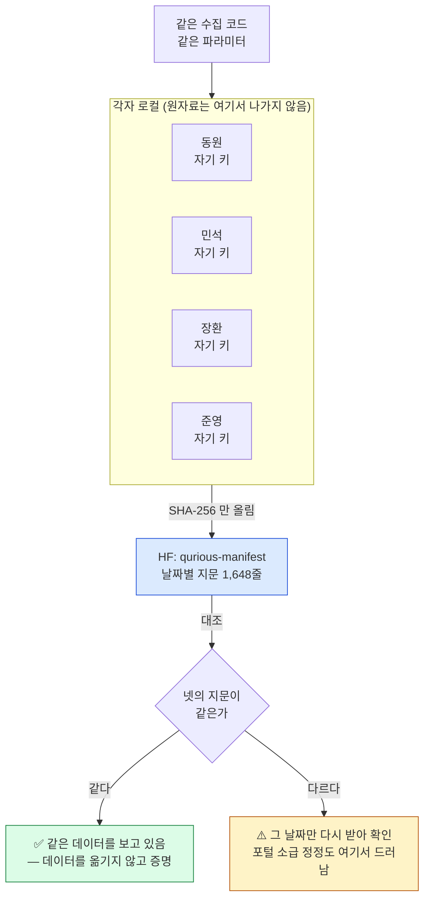
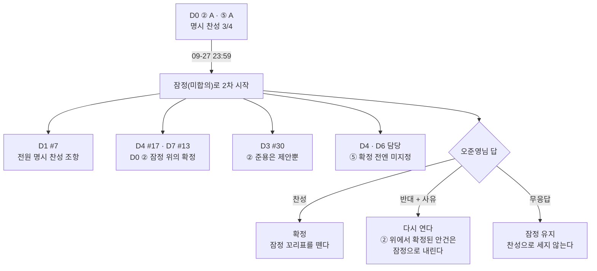
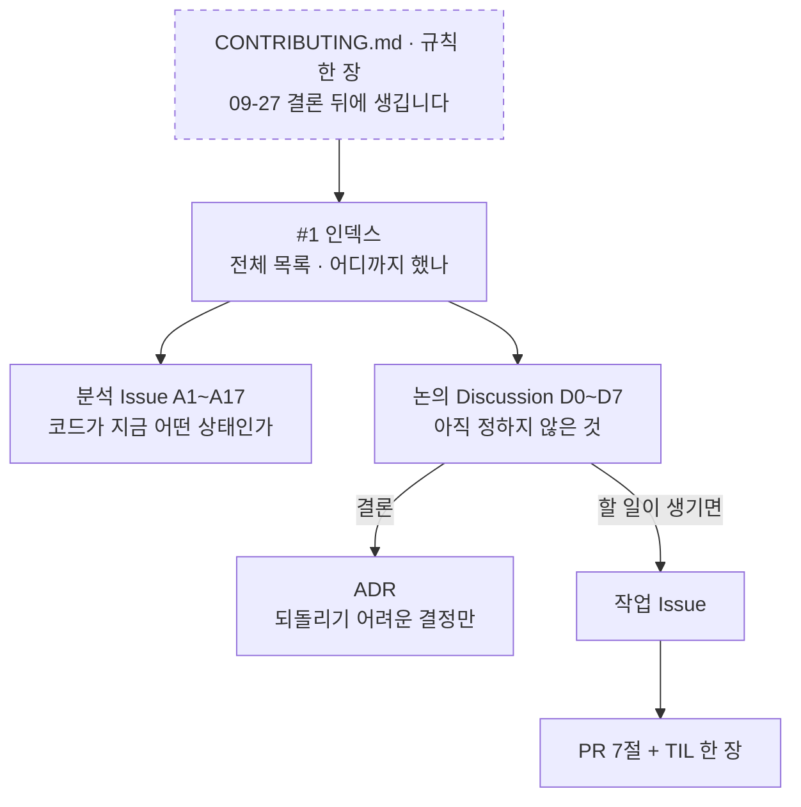

# #6 [논의] D0 팀 운영·기록 방식

> 🗂️ 옛 GitHub 논의를 옮긴 **기록 문서**입니다 — [색인](../README.md). 원문은 그대로 두고, 링크·커밋 해시만 새 자리 기준으로 바꿨습니다.

| 항목 | 내용 |
|---|---|
| 종류 | 논의 |
| 상태 | 논의 · General |
| 원 작성 | 이동원(`devlee328288`) · 2026-09-15 12:47 KST |
| 댓글 | 6건 · 답글 6건 |
| 옛 주소 | `github.com/devlee328288/Qurious/discussions/6` (지금은 열리지 않음) |

## 본문

> 🟡 **결론 초안 게시 (2026-09-23)** — ①③④⑥⑦ 은 명시 찬성 3/4 · 반대 0 으로 **09-27(일) 23:59 KST 확정 예정**입니다. ②(확정 방식)·⑤(역할)는 전원 명시 찬성이 필요한데 3/4 라 09-27 부터 **잠정(미합의)** 으로 두자고 제안합니다. ⑥-1 원자료는 **이 논의 결론 전에 HF private 에 올린 사실을 먼저 밝히고**(§7.5) 원래 A 로 되돌리자고 제안하며, 🟡 조건부로 둡니다. → **본문 아래 §7 결론**

> **읽는 순서**: 1 배경 → 4 추천안 요약표 → 궁금한 안건만 3절 → 6 반응 방법
> 💬 **안건별로 댓글 하나씩** 달아 주세요(예: `② A 👍`, `⑦ B — 이유 …`).

### 1. 배경: 왜 지금 정해야 하는가

- 이번 주는 코드 없이 설계만 합니다. **코드 작업이 시작되기 전에** 기록 방식을 정하지 않으면, 네 명이 결정을 서로 다른 곳(메신저·노션·Issue)에 남기게 됩니다.
- 지금 규칙은 인덱스 [#1](../issues/001.md)의 "기록 규칙" 절에만 있습니다. 거기에도 "운영 방식은 **D0에서 팀이 합의한 뒤** 이 절을 고칩니다"라고 적어 두었습니다. 저장소의 `.github/`(이슈·PR 템플릿)는 비어 있습니다.
- [#3](../issues/003.md)이 넘긴 두 가지도 여기서 정합니다.
  - **2.0 역할 분담**: "2.0 담당은 D0에서 정합니다"([#3](../issues/003.md) §2)
  - **HF Organization 데이터 허브** 유지 여부와 운영 규칙([#3](../issues/003.md) ①)

#### 1차 발표 뒤 강사님 피드백

| # | 피드백 | 이 논의에서 받는 곳 |
|---|---|---|
| 0 | "누구에게·무슨 목적으로"가 불명확하다. 넓게보다 깊게 하는 편이 낫다. | D1 |
| 1 | **목표를 명확하게** 설정하는 것이 중요하다. | D1 (이 논의에서는 다루지 않음) |
| 2 | **분석이 생각보다 부족하다.** 결론은 있는데 심층 분석이 없어서, 결론에 문제가 생기는 경우가 많다. | ⑦ 분석 템플릿(근거·반례·한계) |
| 3 | **수행한 사람도, 모르는 사람도** 이해할 수 있어야 한다. | ⑦ 두 층 쓰기(쉬운 요약·용어 풀이) |
| 4 | **결론에 너무 집착하지 않는다.** 프로젝트에 끌려가면 안 된다. | ② "결론을 뒤집을 조건" · ③ ADR 재검토 조건 |
| 5 | **코드 주석**이 중요하다. 지표 같은 **개념(기초 포함)을 안내·기록**해 두어야 면접에서 본인이 설명할 수 있다. | ⑦ 개념 노트 · 주석 규칙 |

- 이 피드백은 **기록 방식의 문제**이기도 합니다. 1차에도 결론(판정)과 코드는 남았지만, **왜 그 지표를 썼는지, 결과가 어떤 조건에서 틀릴 수 있는지**는 파일마다 흩어져 있었습니다. 그래서 운영 규칙에 함께 넣습니다.

### 2. 사실

#### 2.1 지금까지의 방식 (1차 Alpha_Stack → Qurious 설계 주간)

| 항목 | 1차 Alpha_Stack | Qurious 현재 | 근거 |
|---|---|---|---|
| 브랜치·머지 | main 직커밋 금지, PR로만, 머지는 사람이 웹에서 | 같음 | Alpha_Stack README (Alpha_Stack `README.md` @ `01d8894`) · [#1](../issues/001.md) · PR [#2](../pulls/002.md) |
| PR 본문 | 7절(Why·What·Who·How·Impact·Proof·Learn) | 같음 | [#1](../issues/001.md) |
| TIL | `docs/TIL/<이름>/YYYY-MM-DD-주제.md` | 같음. "결정은 TIL이 아니라 Discussion 결론과 ADR로" | [docs/TIL/README.md#L21-L22](https://github.com/EST-team-project/Qurious/blob/04f476a/docs/TIL/README.md#L21-L22) |
| 결정 기록 | ADR 10건(`docs/decisions/0001~0010`). 머리글은 상태·결정일·관련 논의(Issue), 본문은 맥락·결정·결과 | **없음** | docs/decisions (Alpha_Stack `docs/decisions` @ `01d8894`) · ADR 0005 예 (Alpha_Stack `docs/decisions/0005-홀드아웃-2년.md` @ `01d8894`) |
| 역할 | 역할표 4줄(담당 폴더 포함). **파트 경계를 넘을 땐 담당자에게 먼저 묻고 PR 본문에 사유를 적음** | 미정 | README 역할표 (Alpha_Stack `README.md#L91-L96` @ `01d8894`) · [#3](../issues/003.md) §2 |
| 데이터 | HF Organization `qurious-quant`에 private. 반출 스크립트·리비전 고정·SHA 검증 입구 | 미정 | [#3](../issues/003.md) ① |
| 개념 설명 | 코드 주석·보고서에 흩어져 있음. 별도 개념 문서 없음 | 없음. 교안(docs/01~05)은 강사님 자료 | [#3](../issues/003.md) · [#5](../issues/005.md) |
| 템플릿 | — | `.github/` 없음 | 저장소 확인(2026-09-15) |
| 권한 | — | 4명 모두 쓰기 이상(admin 1 · write 3). Answer 표시와 Discussion→Issue 생성에 필요한 권한은 모두 충족 | 협업자 목록 조회(2026-09-15) |

**개념 기록이 왜 필요한지 보여주는 실제 사례** ([#5](../issues/005.md)에서 발견)
- 같은 "승률"인데 Qurious는 **거래가 아니라 보유일** 기준으로 셉니다([quant_pipeline.py#L254-L255](https://github.com/EST-team-project/Qurious/blob/04f476a/app/services/quant_pipeline.py#L254-L255)).
- Sharpe는 **무위험수익률을 빼지 않습니다**([ta_utils.py#L56-L59](https://github.com/EST-team-project/Qurious/blob/04f476a/app/services/ta_utils.py#L56-L59)).
- 화면의 "기대 MDD"는 **낙폭이 아니라 변동성 근사값**입니다([ml.py#L252](https://github.com/EST-team-project/Qurious/blob/04f476a/app/routes/ml.py#L252)).
- 정의를 적어 두지 않으면 수치가 맞아도 설명이 틀리고, 면접에서 "이 승률은 어떻게 계산했나요?"에 답할 수 없습니다.

#### 2.2 GitHub 기능 사실 (공식 문서, 2026-09-15 KST 조회)

| 기능 | 사실 | 우리에게 주는 의미 |
|---|---|---|
| **Answer 표시** | Q&A 형식 카테고리에서만 가능합니다. | `방향성·목표`·`설계(1·2·3차)`·`인프라·비용`은 가능, **`General`(이 D0)은 불가**입니다(카테고리 조회로 확인). |
| Discussion 닫기 | 사유를 골라 닫습니다: 해결됨 · 더 이상 유효하지 않음 · 중복 | General 논의는 **결론 댓글 + "해결됨"으로 닫기**로 마무리합니다. |
| **Discussion → Issue** | 오른쪽 사이드바 "Create issue from discussion". triage 권한 이상, 본문과 라벨이 복사되고 **원래 Discussion은 남습니다**. | "결정 → 작업 Issue" 파생을 버튼 하나로 할 수 있습니다. |
| 고정(pin) | 저장소 전체 4개, 카테고리별 4개 | 진행 중인 D 논의를 고정할 수 있습니다. |
| **닫기 키워드** | `close(s/d)`·`fix(es/ed)`·`resolve(s/d)` 9종. **기본 브랜치 대상 PR**이 머지되거나, 키워드가 든 커밋이 기본 브랜치에 들어갈 때만 닫힙니다. 다른 브랜치 대상 PR에서는 무시됩니다. | 우리는 PR 흐름이므로 **PR 본문에 `closes #N`** 을 표준으로 씁니다. 커밋에는 `refs #N`을 씁니다. |
| 하위 이슈 | 부모당 100개, 최대 8단계. Projects에서 부모별 그룹과 진행률을 볼 수 있습니다. | 큰 작업 Issue를 쪼갤 때 씁니다. |
| **Projects** | 사용자·조직 단위로 만듭니다. 필드는 날짜·숫자·단일 선택·텍스트·반복 주기(최대 50개), 보기는 표·보드·로드맵입니다. 기본 자동화 2개가 켜져 있습니다(닫히면 Done, PR 머지되면 Done). 사용자 소유 프로젝트에도 협업자를 초대할 수 있습니다(읽기·쓰기·관리). | Qurious는 개인 계정 저장소이므로 **devlee328288 소유 Project**에 3명을 쓰기 권한으로 초대합니다. |
| Issue types | 조직 설정에서 관리하는 기능입니다. | 개인 계정 저장소라 **라벨로 대신**합니다(현재 방식 유지). |
| 템플릿 | 이슈 폼 `.github/ISSUE_TEMPLATE/*.yml`(`name`·`description`·`body` 필수, `labels`·`assignees`·`projects` 자동 지정). 논의 폼 `.github/DISCUSSION_TEMPLATE/<카테고리 slug>.yml`(파일명 = slug, 투표형 불가). PR 템플릿 `.github/pull_request_template.md`. **기본 브랜치에 머지돼야 적용됩니다.** | 템플릿은 저장소 파일이라 **D0 결론 뒤 PR 1건**으로 올립니다. 우리 커스텀 카테고리 slug가 한글(`방향성-목표` 등)이라 파일명 동작은 올릴 때 확인합니다. |
| HF 저장 한도 | 무료 사용자·조직의 private 저장소는 **100GB**입니다. | 1차 full 데이터가 parquet 142.1MB([#3](../issues/003.md))라 무료 등급으로 충분합니다. |

#### 2.3 실무 사례 (2026-09-15 KST 조회)

| 사례 | 운영 방식 | 가져올 점 |
|---|---|---|
| [Home Assistant architecture](https://github.com/home-assistant/architecture) | 주제마다 **Discussion을 열고, 결정되면 ADR 폴더(`adr/`)에 기록**합니다. 빈 템플릿 `EMPTY-ADR.md`가 있습니다. | 우리 흐름(Discussion → ADR)과 같습니다. |
| [Microsoft Engineering Playbook: Decision Log](https://microsoft.github.io/code-with-engineering-playbook/design/design-reviews/decision-log) | ADR을 `proposed` 상태로 PR에 올려 논의하고, `accepted`로 바꿔 머지합니다. `decision-log.md` 요약표를 둡니다. | 상태값을 씁니다. [#1](../issues/001.md)의 "결정 요약" 표가 요약표 역할을 합니다. |
| [Zephyr: Proposals and RFCs](https://docs.zephyrproject.org/latest/contribute/proposals_and_rfcs.html) | 큰 변경은 RFC 라벨 Issue와 폼(개요·동기·설계·**대안**·테스트 전략)으로 제안합니다. 작은 변경은 PR 본문으로 충분합니다. | 논의 폼 항목. **"작은 건 PR로 충분"** 이라는 경계선 |
| [Rust RFC (PEP 8002 조사)](https://peps.python.org/pep-8002/) | 막는 우려가 해소되면 **최종 의견 기간 10일**을 두고, 새 우려가 없으면 병합합니다. 전원 합의까지는 요구하지 않습니다. | **기한이 있는 합의** |
| [Apache 투표 규칙](https://www.apache.org/foundation/voting.html) | **Lazy consensus**: "3일 안에 반대가 없으면 동의로 본다." 투표는 +1 / 0 / −1이고, 투표 기간은 보통 72시간 이상입니다. | 4명이 비동기로 일하는 팀의 기본 결정 규칙 후보 |
| [IBM WIRE 팀 경험 보고(Agile Alliance)](https://agilealliance.org/resources/experience-reports/distribute-design-authority-with-architecture-decision-records) | 2년 동안 ADR 80건 이상을 썼습니다. 그런데 초기 ADR 상당수가 결정이 아니라 가이드라인·정책이었고, 꾸준히 쓴 사람은 팀의 절반이었습니다. | **ADR은 되돌리기 어려운 결정만** 씁니다. 남발하면 아무도 읽지 않습니다. |
| [ADR 개요(adr.github.io)](https://adr.github.io/) · [Nygard(2011)](https://cognitect.com/blog/2011/11/15/documenting-architecture-decisions) · [decision-record](https://github.com/joelparkerhenderson/decision-record) | ADR 1건 = 결정 1개와 근거, ADR 모음 = 결정 로그. 상태는 proposed / accepted / rejected / deprecated / **superseded**입니다. | 1차 ADR 형식(맥락·결정·결과)을 이어 쓸 수 있습니다. **superseded(대체됨)** 상태가 있다는 것은, 결정이 뒤집힐 수 있다는 전제입니다(피드백 4). |
| [Diátaxis](https://diataxis.fr/) | 문서를 네 가지로 나눕니다: **튜토리얼**(학습·실습), **방법 안내**(작업·실습), **참조**(작업·이해), **설명**(학습·이해). Cloudflare·Gatsby·Vonage 등이 채택했습니다. | 개념 노트를 **"설명"(왜 이 지표인가)과 "참조"(정의·수식·코드 위치)** 로 나누면, 모르는 사람과 수행자가 각자 필요한 층을 읽습니다(피드백 3·5). |
| [Google Python 스타일 가이드 §3.8](https://google.github.io/styleguide/pyguide.html) | docstring에는 함수가 **무엇을** 하는지(인자·반환)를 적습니다. 블록·인라인 주석은 **코드를 되풀이하지 말고**, 까다롭거나 자명하지 않은 부분의 **이유**를 적습니다. | 주석 규칙의 기준으로 씁니다(피드백 5). |

### 3. 선택지 (안건 7개)

#### ① 기록 위치

| 안 | 내용 | 장점 | 단점 |
|---|---|---|---|
| **A** | **사실·작업 = Issue, 결정 과정 = Discussion, 확정 = Answer(또는 결론 댓글), 되돌리기 어려운 결정 = ADR, 작업 과정 = TIL, 개념 = 개념 노트(⑦), 회의록 = General `회의록 YYYY-MM-DD`** | 1차 관행(ADR·TIL)을 잇고, 이미 만든 카테고리를 씁니다. 공개 저장소에 과정이 남습니다. | 기록 위치가 여러 곳이라 처음엔 헷갈릴 수 있습니다. [#1](../issues/001.md)에 "어디에 쓰나" 표를 둡니다. |
| B | Discussion 없이 `decision` 라벨 Issue로 결정까지 처리 | 한 곳이라 단순합니다. | Answer 표시가 없고 스레드가 짧아집니다. 만든 카테고리를 버립니다. |
| C | 결정은 노션·메신저, GitHub엔 코드만 | 익숙합니다. | 링크할 수 없고 공개 포트폴리오에 과정이 남지 않습니다. rfp-2도 GitHub 공개를 요구합니다([#L189](https://github.com/EST-team-project/Qurious/blob/04f476a/docs/rfp-2.md#L189)). |

- 메신저에서 정한 것은 **24시간 안에** 해당 Discussion에 한 줄로 옮깁니다(A·B 공통).

#### ② 결정을 확정하는 방식

| 안 | 내용 | 장점 | 단점 |
|---|---|---|---|
| **A** | **담당자가 결론 초안 댓글 → 72시간 안에 반대(−1 + 사유)가 없으면 확정(lazy consensus). 단, D1 목표·D2 비용·⑤ 역할은 4명 전원이 명시적으로 찬성** | 한 명이 바빠도 멈추지 않습니다. 돈·목표·역할처럼 전원이 부담하는 결정만 전원 합의로 둡니다. | 규칙을 두 가지 기억해야 합니다. |
| B | 모든 결정에 4명 전원 👍 | 가장 확실합니다. | 한 명이 부재하면 전부 멈춥니다. |
| C | 팀장이 결정 | 가장 빠릅니다. | 참여가 약해지고, 1차 피드백(목적 공유)과 맞지 않습니다. |

- 확정 뒤 순서: **Answer 표시**(General은 "해결됨"으로 닫기) → **Create issue from discussion으로 작업 Issue 파생** → **[#1](../issues/001.md) 결정 요약에 한 줄** → 필요하면 ADR PR
- **결론 댓글에는 "이 결정을 뒤집을 조건"을 한 줄 이상 적습니다**(A·B·C 공통, 피드백 4).
  - 예: "모의투자 4주 로그에서 비용 차감 Sharpe가 Buy&Hold보다 낮으면 자산배분 모델 선택을 다시 논의한다."
  - 조건이 충족되면 결정을 **실패가 아니라 재검토**로 다룹니다. 새 Discussion을 열고, 기존 ADR은 `superseded`로 바꿉니다.

#### ③ ADR

| 안 | 내용 | 장점 | 단점 |
|---|---|---|---|
| **A** | **`docs/decisions/NNNN-제목.md`. 1차 형식(상태·결정일·관련 논의 / 맥락·결정·결과)에 `재검토 조건` 절을 더합니다. Discussion 결론 뒤에만 씁니다. 대상은 "되돌리기 어렵고 코드·데이터·평가에 영향"인 결정. 번호는 Qurious에서 0001부터, 1차 ADR은 선행 결정으로 링크** | 코드 리뷰(PR)에서 결정 파일을 바로 참조합니다. Discussion과 달리 git 이력에 남습니다. 결정이 틀렸을 때 무엇을 볼지 미리 정해 둡니다. | PR과 TIL이 한 건 더 생깁니다. |
| B | ADR 없이 Discussion Answer만 | 가볍습니다. | 저장소 파일에 결정이 남지 않습니다. 코드 옆에서 근거를 찾기 어렵습니다. |
| C | 모든 결정을 ADR로 | 빠짐없이 남습니다. | WIRE 사례처럼 남발되면 아무도 읽지 않습니다. |

- A안 기준으로 지금 보이는 ADR 후보: D1 목표 · D4 비용 규격 · D5 자산배분 모델·벤치마크 · D7 새 봉인 구간(모의투자 로그)

#### ④ 작업 추적: 담당자·보드·템플릿

| 안 | 내용 | 장점 | 단점 |
|---|---|---|---|
| **A** | **Assignee 1명 필수 + 나머지는 @멘션. GitHub Project 1개**(devlee328288 소유, 3명 쓰기 초대). Status Todo / In progress / Done, **Phase** 단일 선택(1차·2차·3차·공통), 선택으로 주 단위 반복 주기. 템플릿 3종(분석 Issue 폼·논의 폼·PR 7절, ⑦ 항목 포함)은 D0 결론 뒤 PR 1건 + TIL. Milestone은 일정 확정 뒤 | 기본 자동화로 닫히면 Done이 됩니다. 템플릿이 형식을 강제합니다. 무료입니다. | 보드를 갱신하는 습관이 필요합니다. |
| B | 보드 없이 라벨과 [#1](../issues/001.md) 체크리스트만 | 도구가 적습니다. | 누가 무엇을 하는 중인지 한눈에 안 보입니다. |
| C | Milestone 중심 | 마감일 관리가 쉽습니다. | 아직 발표 일정이 확정되지 않았습니다. |

- 하위 이슈는 **구현 Issue를 쪼갤 때만** 씁니다. Discussion은 하위 이슈가 될 수 없으므로 D와 A는 `#번호` 링크로 잇습니다.

#### ⑤ 2.0 역할 분담 ([#3](../issues/003.md) §2에서 넘어옴)

| 안 | 내용 | 장점 | 단점 |
|---|---|---|---|
| **A** | **1차 역할을 이어 2.0 영역을 붙입니다**(아래 표). 파트 경계 규칙(담당자에게 먼저 묻고 PR에 사유)을 유지합니다. | 1차 코드를 쓴 사람이 그 유산을 옮기므로 가장 **깊게** 갈 수 있습니다. | 2차·3차 과제별 책임자가 표에 드러나지 않습니다. |
| B | 과제별 두 팀(2차 2명 · 3차 2명) | 과제마다 책임이 분명합니다. | 공통 검증 엔진·데이터가 두 벌로 갈라질 위험이 있습니다. |
| C | 주 단위 교대 | 모두 전 영역을 경험합니다. | "넓게보다 깊게" 피드백과 충돌합니다. |

A안의 2.0 연결(제안, 확정은 이 논의):

| 1차 역할 | 담당 | 2.0에서 이어받을 영역 | 분석·논의 검토 |
|---|---|---|---|
| ① 데이터·문서화 | `@devlee328288` | HF 데이터 허브, 시세·수급 수집, 모의투자 로그 원장, 문서·ADR | A2 · A4 · A15 · D0 · D2 · D7 |
| ② 백테스팅·성과지표·화면 | `@rkdalstjr` | 비용 차감 검증 엔진 통합, 2차 성과 보고(수치 기준·시나리오 비교), 화면 | A6 · A13 · D4 · D5 |
| ③ 모델 | `@GoonGuMa` | 2차 자산배분·스크리닝 모델, 선정 규칙·시도 기록 | A7 · A10 · D5 |
| ④ 피처·품질 | `@janghwan-god` | 3차 커스텀 인디케이터·PineScript, look-ahead 계약 | A5 · A11 · D6 |

- A1·A3·A8·A9·A12·A14(실행 환경·보안·브로커·주문·알림·인프라)는 특정 파트에 속하지 않습니다. 해당 세션에서 담당을 정합니다.

#### ⑥ HF Organization 데이터 허브 ([#3](../issues/003.md) ①)

| 안 | 내용 | 장점 | 단점 |
|---|---|---|---|
| **A** | **유지.** 원자료와 파생 스냅샷은 `qurious-quant`의 **private** dataset에 둡니다. 리비전 고정 + SHA 검증 입구를 씁니다. Qurious 앱 DB에는 서빙용 파생 데이터만 둡니다. 모의투자 로그도 private dataset에 쌓습니다(D7의 새 봉인 구간). 공개 저장소에는 스크립트만 둡니다. | 팀원 로컬 용량 부담 없이 모두 **같은 스냅샷**을 씁니다([#5](../issues/005.md) 재현성 [#30](../discussions/030.md)). KRX 제3자 제공 금지를 지킵니다. 무료 100GB 안입니다. | 팀원마다 HF 토큰(`.env`, 커밋 금지)과 조직 가입이 필요합니다. |
| B | Qurious 앱 DB(PostgreSQL)만 | 구성이 단순합니다. | 팀원 로컬 DB가 제각각이라 같은 결과를 보장할 수 없습니다. |
| C | GitHub Release·LFS에 데이터 첨부 | 저장소 하나로 끝납니다. | **Qurious는 Public**이라 KRX 이용약관 위반 소지가 있습니다. 쓸 수 없습니다. |

- A안의 운영 규칙 후보
  - 업로드 코드에 **`private=True`를 명시**합니다. 1차에서 4곳이 빠져 있었습니다([#3](../issues/003.md) §6).
  - 데이터셋 이름은 `qurious-<원천>-<구간>`으로 짓습니다.
  - 봉인 구간 데이터는 개봉 기록 없이 읽지 않습니다.
---

##### ⑥-0 ★ 2026-09-18 개정 — A안은 유지하되 **무엇을 올리는가**가 바뀝니다

위 A안은 *"**원자료**와 파생 스냅샷을 private dataset에 둔다"* 였습니다. [A11 #25](../issues/025.md)의 약관 정독으로 **이 전제가 흔들렸습니다.**

> **공공데이터포털** 금융위 API 상세페이지: *"상업적 목적 여부와 상관 없이 **제3자 무단 제공 및 재배포가 엄격히 금지**"*
> **KRX** 이용약관 제12조①② 재배포 금지 · 제10조② 자동화 수단 무단 수집 금지 (시행 2026-08-29)

**그런데 1차 코드는 반대로 해석하고 있습니다.** 🟡 제가 판단할 수 없는 지점이라 양쪽을 그대로 적습니다.

| | 해석 | 근거 | 결론 |
|---|---|---|---|
| **1차 코드** | *"private 이고 조직 멤버 밖으로 안 나가면 제3자 제공이 아니다"* | `Alpha_Stack/scripts/upload_to_hf.py` 헤더 주석 — *"제11조 ②가 제3자 제공을 금지하므로 이 데이터셋은 **반드시 private** 여야 하고, 조직(`qurious-quant`) 멤버 밖으로 나가면 안 된다"* | 원자료를 HF에 올림 (실제로 그렇게 했음) |
| **S25 정독** | *"팀원도 제3자다"* — 각자 자기 키로 발급받은 **별개의 이용자**이므로, 내가 받은 데이터를 팀원에게 주는 것은 제공에 해당 | 포털 상세페이지 원문 · KRX 제12조 | **각자 키로 각자 수집** |

> ⚠️ 1차 주석이 인용한 **제11조②**는 지금 약관에서 **제12조②**입니다(2026-08-29 시행 개정으로 조항이 밀린 것으로 보입니다 🟡). 번호는 사소한 문제이고, **갈리는 것은 "팀원이 제3자인가"** 하나입니다.

**저는 이것을 법률 판단으로 결론 내릴 수 없습니다.** 대신 **어느 해석이 맞든 무너지지 않는 설계**를 제안합니다.

##### ⑥-1 무엇을 올리고 무엇을 안 올리는가 — 6층

| 층 | 무엇 | HF Org | 왜 |
|---|---|:--:|---|
| **L0 원자료** | 포털·KRX 응답 원본(일별시세 등) | ⚙️ **스위치** | 해석이 갈리는 유일한 층. 기본값은 **끔** |
| **L1 파생(복원 가능)** | 종가·거래량을 그대로 담은 parquet, 조정 종가 시계열 | ⚙️ **스위치** | 원자료를 되돌릴 수 있으면 사실상 같은 것 |
| **L2 파생(복원 불가)** | 종목별 순위·z점수·신호 플래그 | 🟡 보류 | 공공누리 **"변경금지"** 해석 필요 — 강사님께 여쭐 항목 |
| **L3 우리 산출물** | 코드 · 모델 가중치 · 백테스트 결과표 · 판정표 | ✅ 올림 | 우리가 만든 것 |
| **L4 매니페스트** | 수집 파라미터 · 코드 커밋 · 날짜별 **SHA-256** · 행 수 | ✅ 올림 | 데이터가 아니라 **데이터의 지문** |
| **L5 모의투자 로그** | 우리 주문 · 체결 · 잔고 기록 | ✅ 올림 | 우리가 만든 것 (D7 [#13](../discussions/013.md) 새 봉인 구간) |

판정 기준 한 줄: **"이걸로 원자료를 되돌릴 수 있는가."** 되돌릴 수 있으면 스위치 뒤에 둡니다.

##### ⑥-2 그러면 "모두 같은 스냅샷"은 어떻게 보장하나 — 매니페스트

A안의 가장 큰 장점이 *"팀원 로컬 용량 부담 없이 모두 같은 스냅샷을 쓴다"* 였는데, L0를 안 올리면 그 장점이 사라져 보입니다. **매니페스트가 그 자리를 대신합니다.**



매니페스트 한 줄의 모습 (제안):

```json
{
  "collector_commit": "04f476a",
  "endpoint": "GetStockSecuritiesInfoService/getStockPriceInfo",
  "params": { "numOfRows": 3000, "resultType": "json" },
  "preprocess_spec": "v1",
  "days": [
    { "basDt": "20260916", "rows": 2871, "sha256": "3f9a…" },
    { "basDt": "20260915", "rows": 2869, "sha256": "c17b…" }
  ]
}
```

`preprocess_spec: "v1"` 이 가리키는 것은 [#33](../issues/033.md)에서 실측으로 정한 세 가지입니다 — **수익률은 `fltRt` 누적**(종가가 아님) · **`mkp==0` 인 날은 거래정지로 마스킹** · **상장폐지 종목을 지우지 않음**.

**부수 효과 하나**: 포털이 **과거 데이터를 소급 정정**하면 SHA가 바뀌므로 즉시 드러납니다. 지금은 알 길이 없는 일입니다.

##### ⑥-3 조직 저장소 구성 (제안)

```
 qurious-quant  (HF Organization · 전부 private)
 │
 ├── datasets/
 │   ├── qurious-manifest              ✅ L4  날짜별 지문 · 수집 규격       (KB 단위)
 │   ├── qurious-results               ✅ L3  백테스트·판정표·성과 스냅샷
 │   ├── qurious-paper-log             ✅ L5  모의투자 주문·체결·잔고
 │   └── qurious-raw-kr-daily          ⚙️ L0  스위치가 켜질 때만 생성
 │
 ├── models/
 │   └── qurious-ra-allocator          ✅ L3  2차 자산배분 모델
 │
 └── (원자료 기본 위치 = 각자 로컬 data/raw/ · .gitignore)
```

##### ⑥-4 코드 재사용 — 1차에서 그대로 가져올 수 있는 것 🟢

로컬 `Alpha_Stack` 을 직접 열어 확인했습니다.

| 1차 파일 | 줄 수 | 무엇을 하나 | 2차에서 |
|---|--:|---|:--:|
| `scripts/upload_to_hf.py` | 890 | private 업로드. **`private=True` 를 주고, 올리기 전 서버에 다시 물어** private 이 아니면 **한 파일도 안 올리고 멈춤** | ✅ 그대로 |
| `supply/hf_model_data.py` | 278 | `revision` 고정 다운로드 (리비전을 박아 같은 버전을 보장) | ✅ 그대로 |
| `common/raw_store.py` | 300 | 응답을 **바이트 그대로** gzip 보관 + **sha256 저장·검증**, `fetched_at` 기록, 출처 화이트리스트 | ✅ **매니페스트의 핵심 부품** |
| `scripts/check_hf_access.py` | 160 | 토큰·권한·private 여부 점검 | ✅ 그대로 |
| `dashboard/services/hf_service.py` | 80 | 화면에 출처·지문 표시 | 🟡 Qurious 는 SPA 라 이식 필요 |

~~**새로 쓰는 것은 매니페스트 생성·대조 스크립트 하나**입니다.~~ 🔴 (09-23 정정) 실제로는 1차 코드를 옮기지 않고 `scripts/hf_dataset.py`(2,111줄)와 `collector/manifest.py`(155줄)를 새로 썼습니다(§7.7). `raw_store` 가 이미 날짜별 sha256 을 들고 있어서, 그것을 JSON 으로 뽑고 남의 것과 비교하는 얇은 층입니다.

##### ⑥-5 스위치가 하는 일 — 결론이 어느 쪽으로 나도 코드는 그대로

```
 RAW_SHARING=off          (기본값 · S25 해석)
   수집 → 로컬 raw_store → 매니페스트만 HF 업로드
   팀원: 각자 수집 → 지문 대조

 RAW_SHARING=org-private  (1차 해석 · 팀·강사님 확인 후에만)
   수집 → 로컬 raw_store → 매니페스트 + 원자료 HF 업로드
   팀원: hf_hub_download 한 줄
```

**두 경로가 같은 코드**를 씁니다. 나중에 해석이 정해지면 ~~`.env` 한 줄만 바뀝니다.~~ 🔴 (09-23 정정) 환경변수 `QURIOUS_RAW_SHARING` 하나만 바뀝니다 — 실수로 켜진 채 커밋되지 않게 `.env` 로는 켜지지 않도록 만들었습니다(`collector/manifest.py:43-45` · `collector/README.md:393`). 지금 결정을 미뤄도 작업이 멈추지 않는다는 뜻입니다.

##### ⑥-6 한계

- 🔴 **"팀원이 제3자인가"는 제가 판단할 수 없습니다.** 강사님 또는 포털 문의로 확인할 항목입니다.
- 🔴 L2(복원 불가 파생)의 **"변경금지"** 해석도 미확정입니다. ~~확정 전에는 L3·L4만으로 갑니다.~~ 🔴 (09-23 정정) 실제로는 09-20 담당자 판단으로 보류를 풀고 09-21 에 L0·L1(원자료)까지 HF private 에 올렸습니다 — 경위와 결론 초안은 §7.5.
- 🟡 매니페스트 대조는 **넷이 같은 날 같은 시각에 받았을 때** 가장 깨끗합니다. 포털은 **영업일+1 오후 1시** 갱신이라, 수집 시각을 **KST 14:00** 로 맞추자는 제안이 [#33](../issues/033.md)에 있습니다.
- 🟡 1차 `upload_to_hf.py` 는 **KRX 원자료 기준**으로 쓰였습니다. 포털 응답은 필드가 달라 export 프로필을 새로 써야 합니다.


#### ⑦ 설명·기록 기준: 심층 분석 · 두 독자 · 개념 노트 · 주석 (강사님 피드백 2·3·4·5)

| 안 | 내용 | 장점 | 단점 |
|---|---|---|---|
| **A** | **네 가지를 규칙으로 둡니다.** (1) **두 층 쓰기**: 모든 Issue·Discussion·PR 맨 위에 모르는 사람도 읽히는 **쉬운 요약 3줄 + 용어 풀이**를 두고, 본문은 수행자용 근거로 씁니다. (2) **분석 템플릿 필수 절**: `근거` · `반례·대안` · `한계(아직 모르는 것)` · `결론을 뒤집을 조건`. 판정만 있고 이 절이 비면 리뷰에서 돌려보냅니다. (3) **개념 노트** `docs/concepts/<개념>.md`: 정의·수식 → 직관(왜 쓰나) → **Qurious에서의 정의와 코드 위치** → 흔한 함정 → 면접 질문 1개. 그 개념을 코드에 넣은 파트가 씁니다. (4) **주석 규칙**: docstring에는 입력·출력·**단위**(%, 비율, 연율화 계수)를, 블록 주석에는 **왜**를 한국어로 적습니다. 지표 함수는 개념 노트를 링크하고, 기준값 상수(예: 252, −20%)에는 출처를 적습니다. | 피드백 2·3·5를 한 번에 받습니다. 개념 노트가 발표 자료와 면접 준비물이 됩니다. 2.1의 "승률·Sharpe·기대 MDD" 같은 정의 차이를 코드 옆에서 바로 설명할 수 있습니다. | 작업마다 문서가 조금씩 늘어납니다. 개념 노트는 **코드에 처음 들어가는 개념만**, 한 장 1쪽 이내로 제한합니다. |
| B | 개념 설명은 발표 자료와 TIL에만 | 가볍습니다. | 흩어져서 코드 옆에서 못 찾습니다. 발표가 끝나면 갱신되지 않습니다. |
| C | 외부 링크(위키·블로그)만 연결 | 비용이 거의 없습니다. | **Qurious 구현이 교과서 정의와 다른 지점**(예: 보유일 기준 승률)을 설명하지 못합니다. 면접 대비가 되지 않습니다. |

A안 개념 노트 뼈대 예시(`docs/concepts/sharpe-ratio.md`):

```markdown
# Sharpe Ratio (샤프 비율)

## 한 줄 정의
위험(변동성) 1단위당 초과수익. 높을수록 같은 위험으로 더 번 전략.

## 수식
Sharpe = (평균 수익률 − 무위험수익률) / 수익률 표준편차 × √연간 기간 수

## 왜 쓰나 (직관)
수익률만 보면 위험을 크게 진 전략이 좋아 보인다. 위험을 나눠 공정하게 비교한다.

## Qurious에서의 정의
- 코드: app/services/ta_utils.py `sharpe_ratio` — 무위험수익률을 빼지 않음, 연 252일
- 기준: rfp-2 §7.1 "1.0 이상"

## 흔한 함정
- 비용을 빼기 전/후 Sharpe를 섞어 비교한다.
- 연율화 계수(252 vs 245)를 파일마다 다르게 쓴다 (#3 §6).

## 면접 질문
"Sharpe가 높은데 MDD도 큰 전략은 가능한가? 왜?"
```

- 처음 쓸 개념 노트 후보: Sharpe · MDD · Profit Factor · 승률 · 평균분산·Risk Parity·Black-Litterman · 워크포워드·누수 · lazy consensus 같은 운영 용어는 제외([#1](../issues/001.md)에 짧게)
- 기존 분석 이슈([#3](../issues/003.md)·[#4](../issues/004.md)·[#5](../issues/005.md))에는 **용어 풀이 댓글**을 한 번씩 보강합니다.

### 3.5 팀원 반응 현황 (2026-09-18 KST 기준) ★ 추가

| 안건 | 강민석 | 신장환 | 오준영 | 상태 |
|---|:--:|:--:|:--:|---|
| ① ③ ④ ⑥ ⑦ | A | A | — | 기한까지 반대 없으면 확정 |
| **② 확정 방식** (전원 명시 찬성 필요) | ✅ | ✅ | ⬜ | **3/4** — `@GoonGuMa` 님 한 분 |
| **⑤ 역할 분담** (전원 명시 찬성 필요) | ✅ | ✅ | ⬜ | **3/4** — `@GoonGuMa` 님 한 분 |

- 강민석님 [09-15](../discussions/006.md#discussioncomment-18445416) *"전체 A로 동의합니다"* + ④ 부연설명 요청 → [답글](../discussions/006.md#discussioncomment-18445593)에서 표·그림으로 풀었고 *"찬성합니다"* 로 확인받음
- 신장환님 [09-18](../discussions/006.md#discussioncomment-18495543) *"전체 A 동의합니다!"*
- ★ 민석님이 요청하신 **"전체 가이드라인이 정리된 하나의 문서"** → D0 확정 뒤 **`CONTRIBUTING.md` 한 장**으로 모읍니다. 그 전까지는 위 답글의 2절 표가 대신합니다.

---

### 4. 추천안 요약

| 안건 | 추천 | 한 줄 이유 |
|---|---|---|
| ① 기록 위치 | **A** | 1차 관행을 잇고, 과정이 공개 저장소에 남습니다. |
| ② 확정 방식 | **A** | 기본은 72시간 lazy consensus, 목표·비용·역할만 전원 찬성. 결론마다 뒤집을 조건 |
| ③ ADR | **A** | 되돌리기 어려운 결정만, 1차 형식 + 재검토 조건 |
| ④ 작업 추적 | **A** | 담당자 1명 + Project 보드 + 템플릿 PR |
| ⑤ 역할 | **A** | 1차 역할을 이어 가장 깊게 갈 수 있습니다. |
| ⑥ 데이터 허브 | **A** | 같은 스냅샷, 약관 준수, 무료 |
| ⑦ 설명·기록 기준 | **A** | 강사님 피드백 2·3·5를 규칙으로 받고, 개념 노트가 면접 준비물이 됩니다. |

### 5. 결정 기준

1. **모르는 사람도 이해할 수 있는가**(피드백 3): 자리를 비운 팀원과 처음 보는 평가자가 5분 안에 따라잡기([TIL README#L17](https://github.com/EST-team-project/Qurious/blob/04f476a/docs/TIL/README.md#L17))
2. **결론보다 분석이 남는가**(피드백 2·4): 근거·반례·한계와 뒤집을 조건이 기록되는가
3. **본인이 설명할 수 있는가**(피드백 5): 지표·모델을 코드 위치와 함께 말할 수 있는가
4. **규칙을 지키는 비용이 작업보다 작은가**: WIRE 사례의 교훈
5. **약관·보안을 지키는가**: KRX 제3자 제공 금지, 키·데이터 원본 커밋 금지
6. **무료인가**: 비용은 팀원 자비 부담입니다.

### 6. 결정 기한과 담당자

- **담당**: `@devlee328288`. 결론 정리, [#1](../issues/001.md) 기록 규칙 절 갱신, 템플릿 PR을 맡습니다.
- **기한**: **2026-09-27(일) 23:59 KST**  ← **2026-09-17 연장** (원래 09-20 · 다른 논의 문서와 09-27로 통일합니다. 아래 댓글 참고)
  - ②·⑤는 이 기한까지 **4명 전원의 명시 찬성**이 필요합니다.
  - 나머지는 기한까지 반대가 없으면 추천안으로 확정합니다.
- **참여 요청**: `@rkdalstjr` `@GoonGuMa` `@janghwan-god`
- **반응 방법**: 안건별 댓글에 `① A 👍` 또는 `① B — 이유`로 남겨 주세요. 새 선택지도 환영합니다.
- **확인 질문**
  - [ ] 네 명 모두 HF Organization `qurious-quant`에 가입돼 있나요? (⑥)
  - [ ] 메신저에서 정한 결정을 옮기는 기한 "24시간"이 괜찮나요? (①)
  - [ ] 개념 노트 1장 1쪽 제한이 괜찮나요? (⑦)

### 7. 결론 — 초안 (2026-09-23)

> ~~**7. 결론 (결정 후 댓글로 남깁니다)**~~ 🔴 2026-09-23 교체 — 2026-09-18 부터 결론·정정은 **본문을 고치고 댓글엔 요약만** 남기기로 운영 방식을 바꿨습니다. 원래 적은 순서와 파생 작업 체크리스트 6줄은 **7.7 파생 작업 표**로 옮겼습니다.

**쉬운 요약 3줄**
1. 안건 7개 중 **①③④⑥⑦ 은 반대가 0건**이라, 이 논의 규칙("기한까지 반대가 없으면 추천안으로 확정")대로 **09-27(일) 23:59 KST 에 확정**됩니다. 강민석·신장환 두 분은 "전체 A"로 명시 찬성하셨습니다. 🟢
2. **②(결정 확정 방식)·⑤(역할)는 4명 전원의 명시 찬성**이 필요한데 **3/4** 입니다(오준영님 발언은 전수 조회로 0건). 그래서 09-27 에는 **"잠정(미합의)"으로 2차를 시작**하자고 제안합니다. 무응답을 찬성으로 세지 않습니다. 🟢
3. ⑥(데이터 허브)은 제가 09-18 에 "원자료는 기본으로 안 올린다"로 고쳐 써 놓고, **09-20~21 에 이 논의의 결론 없이 원자료까지 HF private 에 올렸습니다.** 🔴 그 사실을 먼저 밝히고(7.5), 두 분이 찬성하신 **원래 A**(원자료도 private dataset 에 둔다)로 되돌리자고 **제안**합니다. 두 분 찬성은 재작성 전 판이라 ⑥-1 은 🟡 조건부로 둡니다.

#### 7.0 처음 나오는 용어

| 말 | 뜻 | 이 문서에서 | 헷갈리는 점 |
|---|---|---|---|
| **명시 찬성** | "찬성"·"A 동의"처럼 글로 적은 것만 세는 방식 | ②·⑤ 의 확정 조건. "전체 A 동의"는 ②·⑤ 를 포함한 명시 찬성으로 셉니다 | 발언 없음(—)은 찬성도 반대도 아닙니다 |
| **lazy consensus**(느슨한 합의) | 기한까지 반대가 없으면 통과로 보는 방식 | ①③④⑥⑦ 의 확정 조건(본문 6절) | "모두 찬성했다"가 아닙니다. 그래서 명시 찬성 수를 따로 적습니다 |
| **잠정(미합의)** | 추천안대로 일은 시작하되 "합의 안 됨"을 표시해 둔 상태 | ②·⑤ 에 대한 제안(7.4) | 확정이 아닙니다. 반대가 나오면 되돌리고, 무응답이 길어져도 확정되지 않습니다 |
| **원자료(L0·L1)** | 응답 원문(L0)과, 원문으로 되돌릴 수 있는 정규화 표(L1) | HF 의 `raw_response`(L0) · `price_daily`(L1) | 가공했어도 **되돌릴 수 있으면 원자료로 봅니다**(⑥-1 판정 기준) |

#### 7.1 상태표

범례 — **제안** = 제안자(이동원, 찬성으로 셈) · **✅ X (MM-DD)** = 명시 찬성 · **✅ᶜ** = 조건부 찬성(조건에 제안자가 답함 · 투표자 재확인 없음 · n/4 에 넣지 않고 "+ ✅ᶜ n" 으로 따로 적음) · **💬** = 이 논의 안건을 향한 말이지만 선택지를 고르지 않음(세지 않음) · **—** = 이 논의에서 발언 없음 · **🔴** = 반대. **n/4 는 제안과 ✅ 만 센 값입니다.**

<!-- 결론표:시작 -->
| 안건 | 결론(초안) | 이동원 | 강민석 | 신장환 | 오준영 | 확정 규칙 | 상태 |
|---|---|:-:|:-:|:-:|:-:|---|---|
| ① 기록 위치 | A — 사실·작업=Issue · 결정 과정=Discussion · 되돌리기 어려운 결정=ADR · 과정=TIL · 개념=개념 노트 | 제안 | ✅ A (09-15) | ✅ A (09-18) | — | 기한까지 반대 없으면 추천안 | 🟢 확정 예정 (09-27 23:59) · 명시 3/4 · 반대 0 |
| ② 확정 방식 | A — 결론 초안 뒤 72시간 반대 없으면 확정, 목표·비용·역할만 전원 명시 찬성 | 제안 | ✅ A (09-15) | ✅ A (09-18) | — | 4명 전원 명시 찬성 | ⏳ 전원 찬성 대기 3/4 · 09-27 잠정 제안(7.4) |
| ③ ADR | A — 되돌리기 어려운 결정만 · 되돌릴 조건 절 필수. 경로는 실제대로 `docs/ADR/ADR-NNNN-제목.md` | 제안 | ✅ A (09-15) | ✅ A (09-18) | — | 기한까지 반대 없으면 추천안 | 🟢 확정 예정 (09-27 23:59) · 명시 3/4 · 반대 0 · 경로는 투표 뒤 현행화(7.6) |
| ④ 작업 추적 | A — Assignee 1명 + Project 보드 + 템플릿 3종 PR | 제안 | ✅ A (09-15) | ✅ A (09-18) | — | 기한까지 반대 없으면 추천안 | 🟢 확정 예정 (09-27 23:59) · 명시 3/4 · 반대 0 · Assignee 예외는 투표 뒤 추가(7.6) |
| ⑤ 역할 분담 | A — 1차 역할을 잇는 표. 오준영님 칸은 본인 확인 전 Assignee 비움 | 제안 | ✅ A (09-15) | ✅ A (09-18) | — | 4명 전원 명시 찬성 | ⏳ 전원 찬성 대기 3/4 · 09-27 잠정 제안(7.4) |
| ⑥ 허브 유지 | A — HF org `qurious-quant` private 허브 유지 · 올리기 직전 private 재확인 | 제안 | ✅ A (09-15) | ✅ A (09-18) | — | 기한까지 반대 없으면 추천안 | 🟢 확정 예정 (09-27 23:59) · 명시 3/4 · 반대 0 · 두 분 찬성은 ⑥ 재작성(09-18 19:48) 전 |
| ⑥-1 원자료(L0·L1) | 팀 org 안 private 공유 — 09-18 재작성의 "기본 끔"을 거두고 원래 A 로 되돌리자는 제안 · 09-20~21 업로드는 투표 뒤 생긴 일이라 이 표로 추인하지 않음(7.5) | 제안 | ✅ A (09-15 · 재작성 전) | ✅ A (09-18 · 재작성 전) | — | 기한까지 반대 없으면 추천안 | 🟡 조건부 — 업로드 추인에 대한 명시 찬성 0 · 본문 ⑥-5 "팀·강사님 확인 후에만" · 기한까지 반대가 없어도 강사님 ③ 답 전까지 잠정 |
| ⑥-1 파생 지표(L2) | 종목별 순위·z점수는 올리지 않음 · 자체 지수(`benchmark_index`)는 이미 올라가 있음 — 강사님 ④ 답 뒤 판정 | 제안 | 💬 의견 | — | — | 기한까지 반대 없으면 추천안 | ⏸️ 연기 — 강사님 ④ 답 · 지표 담당(장환·준영님) 의견 뒤 |
| ⑦ 설명·기록 기준 | A — 두 층 쓰기 · 분석 필수 절 · 개념 노트 · 주석 규칙 | 제안 | ✅ A (09-15) | ✅ A (09-18) | — | 기한까지 반대 없으면 추천안 | 🟢 확정 예정 (09-27 23:59) · 명시 3/4 · 반대 0 |
<!-- 결론표:끝 -->

- 🟢 강민석님 [09-15 16:06](../discussions/006.md#discussioncomment-18445416) *"전체 A로 동의합니다"* → 16:37 *"찬성합니다"*(②·⑤ 를 명시 찬성으로 기록해도 되느냐는 물음에 대한 답). 🟡 ④ 는 같은 댓글에서 부연설명을 요청하셨고, 16:37 답이 ④ 설명까지 포함한 것인지는 원문만으로 분명하지 않습니다 — ④ 는 "전체 A"로 셌습니다.
- 🟢 신장환님 [09-18 15:08](../discussions/006.md#discussioncomment-18495543) *"전체 A 동의합니다!"* — 원래 문장만으로 셌습니다.
- 💬 강민석님 09-21 14:33 *"팀원이 제 3자가 아니고, 지표 계산은 추출 후 계산이기에 변경금지에 포함되지 않는다가 제 의견이지만 강사님 의견이 꼭 필요하다면 여쭤보는게 맞는 거 같습니다"* — 선택지를 고른 말이 아니라 의견으로 둡니다. 취지는 원래 A 와 같은 방향입니다.
- 🔴 `benchmark_index`(자체 계산 지수)는 09-21 업로드에 **이미 들어 있습니다**([hf_dataset.py#L282](https://github.com/EST-team-project/Qurious/blob/3b12100/scripts/hf_dataset.py#L282) `TABLES`). 원자료로 되돌릴 수 없는 파생이라 L2 에 가깝습니다 — 강사님께 여쭐 것 ④ 에 함께 넣었습니다.

#### 7.2 투표 시각과 본문 변경 — 누가 어느 판에 찬성했나

```
 시각(KST)     누가    무엇                          ⑥ 원자료
 ───────────  ──────  ────────────────────────────  ─────────
 09-15 16:06  강민석  "전체 A로 동의합니다"          올림 (A)
 09-15 16:37  강민석  "찬성합니다" (②·⑤)                |
 09-18 15:08  신장환  "전체 A 동의합니다!"           올림 (A)
 09-18 19:48  이동원  ⑥ 재작성 (⑥-0 ~ ⑥-6)          기본 끔
 09-20        이동원  보류 해제 · 코드에 "팀 결정"      |
 09-21 낮     이동원  556MB 업로드  (!)              올라감
 09-21 14:39  이동원  "private 으로 진행" 답글          |
 09-21 16:07  이동원  "L3·L4만으로 진행"  (!) 사실과 다름
 09-23        이동원  이 결론 초안                   올림 (A)
 09-27 23:59  -       반대 기한                         |
```

| 투표 뒤 바뀐 것 | 시각 | 걸리는 투표 | 판정 |
|---|---|---|---|
| 기한 09-20 → 09-27 (6절) | 09-17 14:38 | 강민석 09-15 | 내용 변경 아님 — 그대로 셈 🟢 |
| ⑥ 재작성: L0·L1 "기본 끔", "확정 전에는 L3·L4만" | 09-18 19:48 | 강민석 09-15 · 신장환 09-18 15:08 | **재작성 전 안에 대한 찬성** 🟢 |
| ⑥ 운영이 재작성과 반대로 감(원자료 업로드) | 09-20 ~ 09-21 | — | 이 초안은 원래 A 로 되돌리자고 제안 — 두 분 찬성은 재작성 전 판이라 ⑥-1 은 🟡 조건부 |
| ③ 경로 · ④ Assignee 예외 · ①② 결론 위치(7.6) | 09-23 | 두 분 | 세부 변경 — 반대 기한 동안 이의를 받음 |

#### 7.3 확정 규칙 — 본문 6절 원문 그대로

> - ②·⑤는 이 기한까지 **4명 전원의 명시 찬성**이 필요합니다.
> - 나머지는 기한까지 반대가 없으면 추천안으로 확정합니다.

- 🟢 **D0 은 ② 에 기대지 않습니다.** 자체 규칙이 "기한까지"라, ② 를 빌려 쓰는 다른 논의의 "초안 뒤 72시간(09-26 18:00)"이 아니라 **09-27 23:59** 가 확정 시각입니다. 초안 게시(09-23)부터 기한까지 100시간이 넘어 ② A 의 72시간도 넘습니다.
- 🟡 이 6절 규칙은 제가 본문에 적은 것이고 따로 표결하지 않았습니다. 다만 ①③④⑥⑦ 은 명시 찬성이 3/4 라 **"과반 명시 찬성"으로 따져도 결과가 같습니다.**
- 🟢 ② 는 자기 자신을 통과시킬 수 없습니다 — 09-18 답글: *"②가 정하려는 규칙이 바로 "느슨한 합의"입니다. 규칙 자신을 그 규칙으로 통과시킬 수는 없어서, ②만은 전원 찬성으로 둡니다."*

#### 7.4 ②·⑤ — 09-27 에 어떻게 둘 것인가 (제안)

> **제안** — ②·⑤ 는: 09-27 에는 "잠정(미합의)"으로 2차를 시작하고, 전원 찬성이 모이면 확정 · 반대가 나오면 되돌린다 · 무응답을 찬성으로 세지 않는다.

근거가 되는 우리 선례 🟢
- D5 [#18](../discussions/018.md) §8: *기한까지 의견이 모이지 않으면, **추천안대로 진행하되 "미합의"로 표시**하고 2차 중에 언제든 되돌릴 수 있게 남깁니다.*
- D8 [#69](../discussions/069.md) §6: *🟡 **무응답을 찬성으로 읽지 않겠습니다.***

② 는 **다른 논의 넷(D1 · D4 · D7 · D3 제안)이 빌려 쓰는 규칙**이라, ② 가 잠정이면 그 확정들도 잠정 위에 섭니다. D4 [#17](../discussions/017.md) · D7 [#13](../discussions/013.md) 본문에는 이렇게 적었습니다:

> 09-26(토) 18:00 KST 까지 반대(사유 포함)가 없으면 확정하되, 기대는 규칙(D0 [#6](../discussions/006.md) ②)이 아직 명시 찬성 3/4 라 **"D0 ② 잠정 위의 확정"** 으로 표시합니다. D0 ② 가 확정되면 이 꼬리표를 떼고, D0 ② 에 반대가 나오면 이 안건들은 "잠정(미합의)"으로 내립니다. 무응답을 찬성으로 세지 않습니다.



| 기대는 곳 | 원문 | ②·⑤ 가 잠정이면 |
|---|---|---|
| D1 [#7](../discussions/007.md) 결정 방법 | *"D0 ② 제안에 따라 **4명 전원의 명시 찬성**이 필요합니다."* | 전원 명시 찬성 조항도 잠정 규칙 |
| D4 [#17](../discussions/017.md) §8 | *"확정 방식: D0([#6](../discussions/006.md)) ② 제안에 따릅니다."* | "D0 ② 잠정 위의 확정" |
| D7 [#13](../discussions/013.md) §6 | *"D0 [#6](../discussions/006.md) ② 추천안(미확정)을 따라 … **72시간 안에 반대(사유 포함)가 없으면 확정**합니다."* | 같음 |
| D3 [#30](../discussions/030.md) §10.2 | (본문에 규칙 없음) D0 ② 준용 **제안** | 제안 자체를 느슨한 합의로 통과시키지 않음 |
| D4 [#17](../discussions/017.md) · D6 [#20](../discussions/020.md) §8 | *"역할 분배(D0 [#6](../discussions/006.md) ⑤)가 아직 확정되지 않았기 때문입니다."* | ⑤ 가 잠정인 동안 각 8절대로 **담당 미지정** — 확정 뒤 역할표로 나눔 |

**⑤ 잠정의 예외 하나 (제안)** 🟡 — 오준영님 칸(1차 ③ 모델 → 2차 자산배분·스크리닝 모델)은 **본인 확인 전에는 Issue Assignee 로 넣지 않습니다.** ④ A 의 "Assignee 1명 필수"와 부딪히므로, 그 영역 Issue 는 Assignee 를 비우고 본문에 "⑤ 잠정 — 담당 미확인"을 적는 것을 ④ 의 예외로 둡니다.

#### 7.5 ⑥ — 먼저 밝힐 것 🔴

09-18 에 ⑥ 을 "어느 해석에도 무너지지 않게" 고쳐 쓰면서 **원자료(L0·L1)는 스위치 뒤, 기본 끔**으로 두었습니다. 그런데 사흘 안에 제가 그 스위치를 켜고 올렸습니다.

| 언제 | 무엇 | 근거 | 확실도 |
|---|---|---|:-:|
| 09-20 | 데이터 파트 담당자(저) 판단으로 HF 업로드 보류를 풀고 `raw_response`·`ingest_day` 를 내보내기 대상에 넣음. 코드·README 에 **"팀 결정"** 으로 적음 | [collector/README.md#L326-L337](https://github.com/EST-team-project/Qurious/blob/3b12100/collector/README.md#L326-L337) · [scripts/hf_dataset.py#L218-L235](https://github.com/EST-team-project/Qurious/blob/3b12100/scripts/hf_dataset.py#L218-L235) | 🟢 |
| 09-21 낮 | HF private `qurious-quant/krx-daily-market` 에 556MB 업로드(원문 `raw_response/portal.parquet` 275MB 포함) | [TIL 09-21#L15-L24](https://github.com/EST-team-project/Qurious/blob/3b12100/docs/TIL/이동원/2026-09-21-조용히-재시도하는-코드가-네-시간을-먹었다.md#L15-L24) | 🟢 |
| 09-21 14:39 | 제 답글 *"일단 데이터의 경우에는 private으로 진행하고 팀원이 제3자가 아니라는 점을 명시했고…"* — 실제 운영과 같음 | 이 논의 답글 | 🟢 |
| 09-21 16:07 | 제 답글 *"L3·L4만으로 진행"* — **이미 올린 뒤라 사실과 다름** | 7.8 정정 기록 | 🔴 |

- 🔴 09-20 시점에 재작성된 ⑥ 에 대한 팀원 발언은 **0건**이었습니다(첫 발언 09-21 14:33). "팀 결정"은 이 논의의 결론이 아니라 **담당자 운영 판단**이었습니다. GitHub 밖에서 정한 것이 있었다면 ① A("24시간 안에 해당 Discussion에 한 줄로")대로 여기 출처를 적었어야 합니다.
- 🟡 그래서 결론 초안은 **원래 A 로 되돌리자고 제안합니다** — 두 분이 찬성한 판이 *"원자료와 파생 스냅샷은 `qurious-quant`의 **private** dataset에 둡니다"* 였고, 강민석님 09-21 의견도 같은 방향입니다. 다만 ① 두 분 찬성은 재작성 **전** 판이고 ② 이미 한 업로드를 추인하는 명시 찬성은 없으며 ③ 본문 ⑥-5 가 org-private 공유를 "팀·강사님 확인 후에만"이라 적었으므로, ⑥-1 은 **🟡 조건부** 입니다 — 기한까지 반대가 없으면 팀 쪽은 받아들인 것으로 보되, 강사님 ③ 답이 오기 전까지는 잠정입니다.
- 🟢 코드가 이미 강제하는 조건 — ① 올리기 직전 원격이 **실제로 private 인지 다시 묻고 아니면 멈춤**([hf_dataset.py#L1852-L1875](https://github.com/EST-team-project/Qurious/blob/3b12100/scripts/hf_dataset.py#L1852-L1875)) ② 스위치는 **환경변수 `QURIOUS_RAW_SHARING` 로만** 켜지고 `.env` 로는 켜지지 않음([manifest.py#L43-L45](https://github.com/EST-team-project/Qurious/blob/3b12100/collector/manifest.py#L43-L45)) ③ 공유 범위는 org 안. **public 전환·팀 밖 초대가 생기면 이 결론은 근거를 잃습니다.**
- 🟡 L5 모의투자 로그의 저장처는 D7 [#13](../discussions/013.md) ⑤(앱 DB + HF private 원장)와 D2 [#10](../discussions/010.md) ④ 가 함께 정합니다. 확인 질문 *"네 명 모두 HF Organization `qurious-quant`에 가입돼 있나요?"* 는 답이 0건이라, 공유를 쓰려면 가입 확인이 먼저입니다.

| 원래 A 의 운영 규칙 | 지금 | 판정 |
|---|---|:-:|
| 업로드 코드에 `private=True` 명시 | L1861 + 원격 재확인 | ✅ |
| SHA 검증 입구 | `verify`·`restore` 있음. 단 **09-21 업로드분 `verify` 미실행**(TIL #L140-L141) | 🟡 |
| 리비전 고정 | 올릴 때 `snapshot-YYYY-MM-DD` 태그(L1972). 태그를 박아 내려받는 경로는 없음 | 🟡 |
| 이름 `qurious-<원천>-<구간>` | 실제 `krx-daily-market` | 🟡 규칙 쪽을 고칠지 묻습니다 |
| 봉인 구간은 개봉 기록 없이 안 읽음 | 모의투자 로그가 아직 없음(D7) | [ ] |

#### 7.6 투표 뒤 이 초안에서 고치거나 붙인 것 — 반대 기한 동안 이의를 받습니다

- **①·②** "결론 초안 댓글" → **본문 결론 절 + 요약 댓글**(09-18 운영 변경). 72시간·기한은 요약 댓글 시각부터 셉니다.
- **③** 경로 `docs/decisions/NNNN-제목.md` → 이미 쓰는 **`docs/ADR/ADR-NNNN-제목.md`**(3건). 🔴 ADR-0001~0003 은 Discussion 결론이 아니라 Issue([#61](../issues/061.md)·[#62](../issues/062.md)·[#67](../issues/067.md)) 근거로 먼저 썼습니다 — "결론 뒤에만"과 어긋난 사실을 적어 두고, 요구사항이 정한 안전 결정(ADR-0001 실거래 차단)만 예외로 두자고 제안합니다.
- **④** ⑤ 잠정 동안 오준영님 영역 Issue 는 Assignee 비움(7.4).
- **⑥-1** "기본 끔" → 원래 A(org 안 private 공유)로 되돌리자는 제안(7.5).
- 공용 장치(CI·룰셋·봇)를 만들기 전에 논의하는 규칙은 ① 에 넣지 않고 **D8 [#69](../discussions/069.md)** 에서 다룹니다.

#### 7.7 파생 작업

원래 체크리스트 6줄(1~6)을 그대로 옮기고, 이 초안에서 나온 것(7~12)을 붙였습니다. 🟡 = 로컬 자료로 확인할 수 없어 안 한 것으로 둔 칸입니다.

| # | 작업 | 안건 | 상태 | 재사용 | 대표 파일 |
|---|---|:-:|:-:|:-:|---|
| 1 | [#1](../issues/001.md) "기록 규칙" 절 → "CONTRIBUTING.md 참고" 한 줄 | ① | [ ] 🟡 | ✅ 그대로 | — (Issue 본문) |
| 2 | `.github/` 템플릿 3종 + **`CONTRIBUTING.md`** PR 1건 + TIL | ④·강민석 요청 | [ ] | ❌ 새로 작성 | `.github/` 없음([`2498069`](https://github.com/EST-team-project/Qurious/commit/2498069c6dbf477f06bbba41f5930f673bea8936) 에서 CI 와 함께 삭제) · [TIL/README.md#L21-L22](https://github.com/EST-team-project/Qurious/blob/3b12100/docs/TIL/README.md#L21-L22) |
| 3 | GitHub Project 생성 · 3명 초대(웹) | ④ | [ ] 🟡 | ❌ 새로 작성 | [산출물목록.md#L83](https://github.com/EST-team-project/Qurious/blob/3b12100/docs/산출물목록.md#L83) |
| 4a | ADR 폴더 | ③ | ✅ `docs/ADR/` 3건 | ✅ 그대로 | [ADR-0001#L3-L10](https://github.com/EST-team-project/Qurious/blob/3b12100/docs/ADR/ADR-0001-실거래-주문-경로-차단.md#L3-L10) |
| 4b | ADR 빈 템플릿 | ③ | [ ] | 🟡 이식 필요 — ADR-0001 머리표·"되돌릴 때" 절을 떼어 씀 | [ADR-0001#L183-L188](https://github.com/EST-team-project/Qurious/blob/3b12100/docs/ADR/ADR-0001-실거래-주문-경로-차단.md#L183-L188) |
| 5 | `docs/concepts/` + 첫 개념 노트(Sharpe) | ⑦ | [ ] | ❌ 새로 작성 | [ta_utils.py#L56-L59](https://github.com/EST-team-project/Qurious/blob/3b12100/app/services/ta_utils.py#L56-L59) 무위험수익률을 안 뺌 · 252 |
| 6 | [#3](../issues/003.md)·[#4](../issues/004.md)·[#5](../issues/005.md) 용어 풀이 댓글 | ⑦ | [ ] 🟡 | ❌ 새로 작성 | — (Issue 댓글) |
| 7 | "2026-09-20 팀 결정" 문구를 ⑥-1 확정 결과에 맞춰 고침(그 전엔 "담당자 운영 판단 · D0 ⑥-1 결론 대기") | ⑥ | [ ] | 🟡 문구만 | [README.md#L326-L337](https://github.com/EST-team-project/Qurious/blob/3b12100/collector/README.md#L326-L337) · [hf_dataset.py#L218-L235](https://github.com/EST-team-project/Qurious/blob/3b12100/scripts/hf_dataset.py#L218-L235) |
| 8 | 09-21 업로드분 `verify` | ⑥ | [ ] | ✅ 그대로 | [hf_dataset.py#L1196-L1203](https://github.com/EST-team-project/Qurious/blob/3b12100/scripts/hf_dataset.py#L1196-L1203) |
| 9 | 원자료 스위치 · private 재확인 | ⑥ | ✅ | ✅ 그대로 | [hf_dataset.py#L628-L638](https://github.com/EST-team-project/Qurious/blob/3b12100/scripts/hf_dataset.py#L628-L638) |
| 10 | 매니페스트 생성·대조 | ⑥ | ✅ 155줄 | 🟡 1차 `raw_store` 이식 | [manifest.py#L92-L105](https://github.com/EST-team-project/Qurious/blob/3b12100/collector/manifest.py#L92-L105) |
| 11 | 계획서 역할 칸 "확정 아닙니다 3/4" → "잠정(미합의)" | ⑤ | [ ] | ✅ 문구만 | [프로젝트계획서_v1.1.md#L71](https://github.com/EST-team-project/Qurious/blob/3b12100/docs/계획서/프로젝트계획서_v1.1.md#L71) |
| 12 | `benchmark_index` 가 L2 인지 판정(강사님 ④ 답 뒤) | ⑥-1 | [ ] | — | [hf_dataset.py#L282](https://github.com/EST-team-project/Qurious/blob/3b12100/scripts/hf_dataset.py#L282) |

**가장 무거운 것 — 2번** 🔴 강민석님이 09-15 에 요청하신 *"전체 가이드라인이 정리된 하나의 문서"* 는 **아직 전달하지 못했습니다** — [`3b12100`](https://github.com/EST-team-project/Qurious/commit/3b12100a33798c038b7ef3ed52406867efe7bacc) 에 `CONTRIBUTING.md` 가 없고, 09-17 댓글의 목차 초안(0~6절)과 🔒 8줄 표만 드렸습니다. ②·⑤ 칸은 "잠정"으로 표시한 채 09-27 뒤 첫 PR 로 냅니다.

```
 바꾸기 전 (3b12100)               바꾼 뒤 (PR 1건)
 ------------------------------   ------------------------------
 CONTRIBUTING.md   없음           CONTRIBUTING.md   1장 (0~6절)
 .github/          없음           .github/          3파일
 규칙이 적힌 곳    4곳            규칙이 적힌 곳    1곳 + 링크
   #1 기록 규칙 절                  #1 -> "CONTRIBUTING 참고"
   D0 본문 385줄                    D0 -> 결정 이력만
   TIL README 91줄                  TIL README -> 형식만
   09-17 댓글 목차 초안             (파일로 흡수)
```

#### 7.8 정정 기록 · 강사님께 여쭐 것

댓글에 있는 제 표현은 고치지 않고 여기 적습니다(본문 안의 같은 문제는 ⑥-4·⑥-5·⑥-6 자리에서 취소선으로 고쳤습니다).

| 위치 | 원문 | 고친 내용 |
|---|---|---|
| [#6](../discussions/006.md) 이동원 09-18 17:22 답글 표 "나머지 논의 6건" 행 | ~~**없으면 기한에 추천안 확정**~~ | 🔴 (2026-09-23 정정) 확정 규칙은 논의마다 다릅니다 — [#10](../discussions/010.md) 은 0원 항목 과반(3/4) 찬성 + 반대 없음(비용 드는 항목만 전원) · [#13](../discussions/013.md)·[#17](../discussions/017.md) 은 D0 ② 추천안(결론 초안 뒤 72시간 · D0 ② 자체는 3/4 미확정) · [#18](../discussions/018.md) 은 ②③④ 전원 의견 · ①⑤⑥⑦⑧ 과반, 안 모이면 "미합의" 표시 · [#20](../discussions/020.md) 은 ①⑤ 전원 명시 찬성, 나머지는 기한까지 반대 없으면 확정 · [#30](../discussions/030.md) 은 본문에 규칙이 없었습니다([#30](../discussions/030.md) §10.2 에 제안). 무응답은 찬성으로 세지 않습니다. |
| [#6](../discussions/006.md) 이동원 09-21 16:07 답글 | ~~"⑥-1 대로 L3(우리 산출물)·L4(매니페스트)만으로 진행하고, L0~L2 는 스위치 뒤에 둡니다"~~ | 🔴 그 시각에는 이미 L0·L1 을 올린 뒤였습니다(7.5) |
| 같은 답글 | ~~"`.env` 한 줄만 바뀌고"~~ | 🔴 환경변수 `QURIOUS_RAW_SHARING` 하나 — `.env` 로는 안 켜짐 |
| [#6](../discussions/006.md) 이동원 09-15 16:19 답글 | ~~"D0가 끝나면(09-20) `CONTRIBUTING.md` 한 장으로"~~ | 🔴 기한이 09-27 로 연장됐고 아직 못 냈습니다(7.7 2번) |

**강사님께 여쭐 것** (결정 대장 번호 · 전체 목록은 `docs/계획서/논의결정대장_v0.9.md` §5)

| # | 질문 | D0 에서 걸리는 곳 |
|---|---|---|
| ① | 발표일·모의투자 기간 | ④ Milestone("일정 확정 뒤") |
| ③ | 공공누리 — 팀 private 공유가 제3자 제공인가 (**이미 원문까지 org private 에 올려 둔 현 상태를 함께 적어** 여쭙습니다) | ⑥-1 을 뒤집을 수 있는 유일한 답 |
| ④ | 파생 지표(순위·z점수 · 자체 계산 지수 `benchmark_index`)가 "변경금지"에 걸리는가 | ⑥-1 L2 |

#### 7.9 결론을 뒤집을 조건

| 안건 | 이런 일이 생기면 | 그러면 |
|---|---|---|
| ① | `CONTRIBUTING.md` 를 낸 뒤에도 "어디에 적는지 모르겠다"가 다시 나오면 | 기록 위치를 줄이는 쪽으로 재논의 |
| ② | 오준영님 반대, 또는 72시간으로 확정된 안건에 "못 봤다"는 이의 | 기간을 늘리거나 전원 찬성 범위를 넓힘 |
| ③ | ADR 이 PR·논의에서 인용되지 않고 쌓이기만 하면 | 대상을 줄임 |
| ④ | 보드 카드가 2주 동안 한 번도 안 움직이면 | B(라벨 + [#1](../issues/001.md) 체크리스트) |
| ⑤ | 오준영님이 다른 역할을 원하시거나, 담당 없는 영역(A1·A3·A8·A9·A12·A14)이 일정을 막으면 | 역할표 재논의 |
| ⑥-1 | 강사님 ③ 답이 "제3자 제공" · HF 가 public 이 되거나 팀 밖 사람이 org 에 들어옴 | 스위치를 끄고 HF 의 L0·L1 파일을 내린 뒤 **각자 키로 수집 + 매니페스트 대조**(09-18 재작성안)로 |
| ⑦ | 2차 첫 2주에 개념 노트 0장, 또는 1장이 1쪽을 넘김 | 범위를 줄임 |

#### 7.10 반대 기한과 다음 순서

- **반대 기한: 2026-09-27(일) 23:59 KST** — `번호 −1 — 사유` 한 줄이면 됩니다. 없으면 ①③④⑥⑦ 은 6절 규칙대로 확정합니다. ⑥-1 원자료는 🟡 조건부(7.5), L2 는 연기입니다.
- ②·⑤ 는 같은 시각에 3/4 이면 7.4 대로 잠정으로 둡니다. 이 논의는 ②·⑤ 가 잠정인 동안 **"해결됨"으로 닫지 않습니다**(General 이라 Answer 표시 불가).
- 확정 뒤: [#1](../issues/001.md) 결정 요약 한 줄 → 파생 작업 Issue(Create issue from discussion) → 2번 PR.
---

**관련**: 인덱스 [#1](../issues/001.md) · 1차 유산 [#3](../issues/003.md) · 강사님 자료 [#4](../issues/004.md) · RFP 격차 [#5](../issues/005.md)

**출처** (모두 2026-09-15 KST 조회)
- GitHub Docs: [About discussions](https://docs.github.com/en/discussions/collaborating-with-your-community-using-discussions/about-discussions) · [Managing discussions](https://docs.github.com/en/discussions/managing-discussions-for-your-community/managing-discussions) · [Creating an issue (from discussion)](https://docs.github.com/en/issues/tracking-your-work-with-issues/using-issues/creating-an-issue) · [Linking a PR to an issue](https://docs.github.com/en/issues/tracking-your-work-with-issues/using-issues/linking-a-pull-request-to-an-issue) · [Adding sub-issues](https://docs.github.com/en/issues/tracking-your-work-with-issues/using-issues/adding-sub-issues) · [About Projects](https://docs.github.com/en/issues/planning-and-tracking-with-projects/learning-about-projects/about-projects) · [Built-in automations](https://docs.github.com/en/issues/planning-and-tracking-with-projects/automating-your-project/using-the-built-in-automations) · [Managing access to projects](https://docs.github.com/en/issues/planning-and-tracking-with-projects/managing-your-project/managing-access-to-your-projects) · [Issue types](https://docs.github.com/en/issues/tracking-your-work-with-issues/configuring-issues/managing-issue-types-in-an-organization) · [Issue forms](https://docs.github.com/en/communities/using-templates-to-encourage-useful-issues-and-pull-requests/syntax-for-issue-forms) · [Discussion category forms](https://docs.github.com/en/discussions/managing-discussions-for-your-community/creating-discussion-category-forms) · [PR template](https://docs.github.com/en/communities/using-templates-to-encourage-useful-issues-and-pull-requests/creating-a-pull-request-template-for-your-repository)
- Hugging Face: [Storage limits](https://huggingface.co/docs/hub/storage-limits)
- ADR·의사결정: [adr.github.io](https://adr.github.io/) · [Nygard 2011](https://cognitect.com/blog/2011/11/15/documenting-architecture-decisions) · [Microsoft Playbook Decision Log](https://microsoft.github.io/code-with-engineering-playbook/design/design-reviews/decision-log) · [MADR 해설](https://ozimmer.ch/practices/2022/11/22/MADRTemplatePrimer.html) · [decision-record](https://github.com/joelparkerhenderson/decision-record) · [Agile Alliance WIRE 경험 보고](https://agilealliance.org/resources/experience-reports/distribute-design-authority-with-architecture-decision-records)
- 운영 사례: [Home Assistant architecture](https://github.com/home-assistant/architecture) · [Zephyr RFC](https://docs.zephyrproject.org/latest/contribute/proposals_and_rfcs.html) · [PEP 8002 Rust RFC](https://peps.python.org/pep-8002/) · [Apache voting](https://www.apache.org/foundation/voting.html)
- 문서·주석: [Diátaxis](https://diataxis.fr/) · [Google Python Style Guide §3.8](https://google.github.io/styleguide/pyguide.html)

---

## 댓글 6건 · 답글 6건

---

<a id="discussioncomment-18445416"></a>

### 💬 1. `rkdalstjr` · 2026-09-15 16:06 KST

전체 A로 동의합니다
4번 안건에 대해서 이해가 잘 되지 않아 부연설명 부탁드립니다

다만 문서가 너무 많아지고 규칙을 따라가기 어려워 전체 가이드라인이 정리된 하나의 문서가 있다면 알려주시면 감사하겠습니다!

<a id="discussioncomment-18445593"></a>

#### ↳ 답글 1-1 · 이동원(`devlee328288`) · 2026-09-15 16:19 KST

> `@rkdalstjr` 민석님, 의견 감사합니다! 요청하신 두 가지에 답합니다.
>
> **쉬운 요약 3줄**
> 1. **규칙을 한 장에 모은 문서는 아직 없습니다.** 규칙이 [#1](../issues/001.md) · 이 D0 · TIL README에 흩어져 있고, 그중 상당수를 이 D0에서 아직 정하는 중이기 때문입니다. 따라가기 어렵게 만들어 죄송합니다.
> 2. D0가 끝나면(09-20) **`CONTRIBUTING.md` 한 장**으로 모으겠습니다. 그 전까지는 아래 **2절 표 두 개**가 가이드를 대신합니다.
> 3. **안건 ④는 "누가 무엇을 하고 있는지 한눈에 보이게 하는 방법"** 입니다. 담당자 1명 · 칸반 보드 · 작성 양식 세 가지이고, 평소에 할 일은 **카드 한 번 옮기기**와 **양식 빈칸 채우기** 정도입니다.
>
> ---
>
> ### 1. 안건 ④ 쉽게 풀기
>
> 지금은 [#1](../issues/001.md) 체크리스트만 있어서 "이 일을 **누가**, **어디까지** 했는지"가 보이지 않습니다. ④는 그걸 보이게 하는 도구 세 가지를 정하는 안건입니다.
>
> | 도구 | 쉬운 말 | 왜 필요한가 | 내가 할 일 |
> |---|---|---|---|
> | **담당자(Assignee) 1명** | 이슈 오른쪽 칸에 넣는 "이 일의 책임자" 이름 한 명 | 두 명이 맡으면 서로 "상대가 하겠지"가 되기 쉽습니다. 도움이 필요하면 댓글에서 `@이름`으로 부릅니다. | 맡을 일이면 내 이름 넣기 |
> | **Project 보드** | 포스트잇 칸반. 칸 3개(**할 일 / 하는 중 / 끝**) + 스티커 1개(**1차·2차·3차·공통**) | 누가 무엇을 하는 중인지 한 화면에 보입니다. 이슈가 닫히거나 PR이 머지되면 **카드가 자동으로 "끝" 칸으로 갑니다**(GitHub 기본 자동화, 본문 2.2절). | 일을 시작할 때 카드를 "하는 중"으로 한 번 끌기 |
> | **템플릿(양식) 3종** | 새 이슈 · 논의 · PR을 열면 **빈칸 양식이 미리 채워져** 나옵니다(쉬운 요약 · 근거 · 반례 · 뒤집을 조건 칸) | 형식을 외우지 않아도 됩니다. 문서가 많아 헷갈리는 문제도 여기서 줄입니다. | 빈칸만 채우기 |
>
> ```mermaid
> flowchart LR
>   A["이슈 만들기<br/>양식이 자동으로 뜸"] --> B["담당자 1명 지정<br/>카드는 할 일 칸"]
>   B --> C["작업 시작<br/>카드를 하는 중 칸으로"]
>   C --> D["PR 올리기<br/>본문에 closes #번호"]
>   D --> E["머지<br/>이슈 자동으로 닫힘<br/>카드 자동으로 끝 칸"]
> ```
>
> - 보드는 팀장 계정에 만들고 세 분을 **쓰기 권한으로 초대**합니다. 무료입니다.
> - 양식은 저장소 파일이라 **D0 결론 뒤 PR 1건**으로 올립니다.
> - 마감일 묶음(Milestone)은 발표일이 정해지면 그때 만듭니다.
>
> **B · C안과 무엇이 다른가**
>
> | 안 | 한 줄 | 대신 잃는 것 |
> |---|---|---|
> | **A (추천)** | 담당자 1명 + 보드 + 양식 | 카드를 옮기는 습관이 필요합니다. |
> | B | 보드 없이 라벨 + [#1](../issues/001.md) 체크리스트만 | "하는 중"인 일이 보이지 않습니다. |
> | C | 마감일(Milestone) 중심 | 발표일이 아직 확정되지 않아 지금은 쓸 수 없습니다. |
>
> 민석님의 "전체 A"는 ④에서는 **담당자 1명 + 보드 + 양식**입니다. 설명을 보고 생각이 달라지면 편하게 `④ B — 이유`로 바꿔 주세요. 그리고 **②·⑤는 4명 전원의 명시 찬성**이 필요한데, "전체 A로 동의"를 ②·⑤ 찬성으로 기록해도 될까요?
>
> ---
>
> ### 2. 전체 가이드 문서
>
> #### 2.1 지금 알아야 할 것 5가지 (이미 정해진 것만)
>
> | # | 규칙 | 원문 |
> |---|---|---|
> | 1 | **2026-09-27 전까지는 코드 작업이 없습니다.** 글을 읽고 댓글로 의견만 주시면 됩니다. | [#1](../issues/001.md) 목적 |
> | 2 | 코드·문서를 바꿀 때는 **브랜치 → PR**. main에 바로 커밋하지 않고, 머지는 사람이 웹에서 합니다(1차와 같음). | [#1](../issues/001.md) 기록 규칙 |
> | 3 | **PR 하나에 TIL 한 장** (`docs/TIL/<이름>/`) | [TIL README](https://github.com/EST-team-project/Qurious/blob/04f476a/docs/TIL/README.md) |
> | 4 | **앱키 · 시크릿 · 계좌번호 · KRX 원자료는 커밋과 댓글에 올리지 않습니다.** | [#11](../issues/011.md) · [#10](../discussions/010.md) |
> | 5 | 긴 글은 맨 위 **읽는 순서 → 쉬운 요약 3줄 → 한눈에 보기**까지만 읽어도 됩니다. 나머지는 근거 자료입니다. | 모든 A · D 글 |
>
> #### 2.2 민석님께 지금 필요한 반응 (이것만 하시면 됩니다)
>
> | 글 | 할 일 | 기한 |
> |---|---|---|
> | D0 [#6](../discussions/006.md) (여기) | ✅ 완료 — ④만 위 설명을 보고 확인해 주세요 | 09-20(일) 23:59 |
> | D1 [#7](../discussions/007.md) 목표 | 추천안에 **찬성 또는 반대를 명시** (4명 전원 필요) | 09-20(일) 23:59 |
> | A1 [#9](../issues/009.md) 실행 환경 | 맨 아래 "팀원 확인"에 PC 사양 | 가능할 때 |
> | A8 [#11](../issues/011.md) 증권사 | 맨 아래 "팀원 확인"에 KIS · LS 계좌 여부 (**키 · 계좌번호는 적지 마세요**) | 가능할 때 |
> | D2 [#10](../discussions/010.md) 비용 | 비용 · 데모 방식 의견 | 09-27(일) 23:59 |
>
> #### 2.3 D0 결론 뒤: `CONTRIBUTING.md` 한 장
>
> - 저장소 맨 위 폴더에 둡니다. 이 파일이 있으면 GitHub가 **이슈나 PR을 만들 때 링크를 보여 주고**, 저장소 첫 화면에 "Contributing" 탭을 붙입니다([GitHub Docs](https://docs.github.com/en/communities/setting-up-your-project-for-healthy-contributions/setting-guidelines-for-repository-contributors), 2026-09-15 조회). 따로 찾아다닐 필요가 없어집니다.
> - 담는 것: 2.1의 5가지 + D0에서 확정된 ①~⑦을 **한 화면 분량**으로. 상세 설명은 링크만 둡니다.
> - ④의 양식(템플릿) PR에 **같이 넣어 PR 1건**으로 올리겠습니다.
> - "문서가 너무 많다"는 의견은 이 논의의 결정 기준 4("규칙을 지키는 비용이 작업보다 작은가")와 같은 이야기라, **결론 댓글에 반영**하겠습니다. 가이드에 꼭 들어갔으면 하는 내용이 있으면 알려 주세요.

<a id="discussioncomment-18445848"></a>

#### ↳ 답글 1-2 · `rkdalstjr` · 2026-09-15 16:37 KST

> 찬성합니다

---

<a id="discussioncomment-18476393"></a>

### 💬 2. 이동원(`devlee328288`) · 2026-09-17 14:38 KST

## 📌 기한을 09-27로 연장합니다 (본문 6절 수정)

제가 기한을 09-20으로 잡았는데, **다른 논의 문서(D2 [#10](../discussions/010.md) · D7 [#13](../discussions/013.md) · D4 [#17](../discussions/017.md) · D5 [#18](../discussions/018.md))는 모두 09-27** 이었습니다. 문서마다 기한이 다르면 따라가기 어려우니 **전부 09-27(일) 23:59 KST로 통일**하겠습니다. 방금 본문 6절도 고쳤습니다.

`@rkdalstjr` 민석님께는 죄송합니다. 이미 09-15에 답을 주셨는데 제가 기한을 헷갈려 한 번 더 알림을 드리게 됐습니다. **민석님은 이미 전체 A 동의 + "찬성합니다"까지 주셨으니 추가로 하실 일은 없습니다.**

### 지금 상태

| 안건 | 필요 | 현재 |
|---|---|---|
| ② · ⑤ | **4명 전원 명시 찬성** | 1명 (강민석) |
| 나머지 | 기한까지 반대 없으면 확정 | 반대 0건 |

`@GoonGuMa` `@janghwan-god` 준영님 · 장환님, **09-27까지 이 문서 하나만이라도** 봐 주시면 감사하겠습니다. ②·⑤는 전원 찬성이 필요해서 두 분 의견이 없으면 확정을 못 합니다.

전부 읽기 부담스러우시면 **4절 추천안 요약표만** 보시고 "전체 동의" 또는 "③번은 이게 낫다" 정도만 남겨 주셔도 충분합니다. 이해가 안 되는 부분을 적어 주시는 것도 똑같이 도움이 됩니다 — 설명이 부족한 건 제 잘못입니다.

### 현재 열려 있는 논의 문서 (모두 09-27 마감)

| 문서 | 주제 | 반응 |
|---|---|---|
| **D0 [#6](../discussions/006.md)** (이 문서) | 팀 운영·기록 방식 | 강민석 |
| [D1 #7](../discussions/007.md) | 누구의 어떤 문제를 푸는가 | 강민석 |
| [D2 #10](../discussions/010.md) | 유료 서비스·데모 방식 | 강민석 |
| [D7 #13](../discussions/013.md) | 모의투자 체결·기록 | — |
| [D4 #17](../discussions/017.md) | 1차 매듭 · 비용·검정 규격 | — |
| [D5 #18](../discussions/018.md) | 2차 로보어드바이저 설계 | — |
| [D6 #20](../discussions/020.md) | 3차 커스텀 인디케이터 설계 | (오늘 올림) |

D0 안건 ④에서 약속드린 **CONTRIBUTING.md 한 장**은 이 문서가 닫히는 09-27 이후에 만들겠습니다.

---

<a id="discussioncomment-18479009"></a>

### 💬 3. 이동원(`devlee328288`) · 2026-09-17 17:57 KST

`@rkdalstjr` 민석님, 주신 의견 중 **"전체 가이드라인이 정리된 하나의 문서"** 요청에 대한 중간 보고입니다.

## 쉬운 요약 3줄

- 요청하신 **규칙 한 장**(`CONTRIBUTING.md`)의 **목차와 담을 내용**을 결론 전에 먼저 보여 드립니다. 파일 자체는 D0 결론(09-27) 뒤 PR 1건으로 올립니다. 아직 규칙이 바뀔 수 있어서 **지금 파일로 굳히면 곧 낡은 문서가 되기 때문**입니다.
- **지금 지켜야 할 규칙은 아래 1절 표의 🔒 8줄이 전부**입니다. 나머지 ⏳ 6줄은 이 D0에서 정하는 중이라 아직 지키실 필요가 없습니다.
- 주신 "찬성합니다"를 **②·⑤ 명시 찬성**으로 기록했습니다. 이 두 안건은 전원 찬성이 필요해 지금 **2/4**입니다.

## 한눈에 보기

| 주신 의견 | 지금 상태 | 언제 |
|---|---|---|
| 전체 A로 동의 | ①③④⑥⑦ 기록 완료 | — |
| **안건 ④ 부연설명 요청** | [S7 답글](../discussions/006.md#discussioncomment-18445593)로 드렸고 "찬성합니다" 받음 | ✅ 완료 |
| **가이드라인 한 장** | 목차 초안 = 이 댓글 **2절** | 파일은 09-27 결론 뒤 PR |
| **문서가 너무 많다** | 문서 지도(**1절**) + 한 장 요약으로 대응 | 지금부터 |
| ②·⑤ 찬성 | 2/4 기록 — `@GoonGuMa` `@janghwan-god` 두 분 남음 | 09-27 |

> 안건 ④는 [S7 답글](../discussions/006.md#discussioncomment-18445593)에서 이미 풀어 드렸고 찬성 답을 받았으므로 여기서 반복하지 않습니다. 혹시 그 답글을 놓치셨으면 말씀해 주세요.

**용어 풀이**

| 말 | 뜻 | 이 글에서 |
|---|---|---|
| `CONTRIBUTING.md` | 저장소에 두는 **기여 안내문** 파일 이름. GitHub이 알아보는 정해진 이름입니다 | 민석님이 요청하신 "한 장" |
| lazy consensus | "정해진 시간 안에 반대가 없으면 찬성으로 본다"는 확정 방식 | D0 ② 추천안(72시간) |
| information overload (정보 과부하) | 자료가 **많아서** 필요한 것을 못 찾는 상태. 자료가 *적어서* 못 찾는 것과 반대 | 민석님이 겪으신 상태. 4절 근거 |

---

## 1. 지금 규칙 한 장 — 🔒만 지키시면 됩니다

🔒 = 이미 정해진 것(1차 관행을 이어받았거나 [#1](../issues/001.md)에 적힌 것) · ⏳ = 이 D0에서 정하는 중

| # | 규칙 | 상태 | 원문 |
|---:|---|:---:|---|
| 1 | **2026-09-27까지 코드 작업 없음.** 글 읽고 댓글로 의견만 주시면 됩니다 | 🔒 | [#1](../issues/001.md) 목적 |
| 2 | 코드·문서 변경은 **브랜치 → PR**. main 직커밋 안 하고, 머지는 사람이 웹에서 | 🔒 | [#1](../issues/001.md) 기록 규칙 |
| 3 | PR 본문은 **7절**(Why·What·Who·How·Impact·Proof·Learn) | 🔒 | [#1](../issues/001.md) |
| 4 | **PR 하나 = TIL 한 장** (`docs/TIL/<이름>/YYYY-MM-DD-제목.md`) | 🔒 | [TIL README](https://github.com/EST-team-project/Qurious/blob/04f476a/docs/TIL/README.md) |
| 5 | 앱키·시크릿·계좌번호·KRX 원자료는 **커밋과 댓글에 올리지 않음** | 🔒 | [#22](../issues/022.md) · [#10](../discussions/010.md) |
| 6 | **Issue = 현황·작업 / Discussion = 아직 못 정한 결정.** 서로 `#번호`로 연결 | 🔒 | [#1](../issues/001.md) 기록 규칙 |
| 7 | 라벨 6종 — `analysis` `security` `phase-1` `phase-2` `phase-3` `infra-cost` | 🔒 | [#1](../issues/001.md) |
| 8 | GitLab은 **main만**, GitHub에서 머지된 뒤 동기화 | 🔒 | [#1](../issues/001.md) |
| 9 | 담당자(Assignee) 1명 + 나머지는 @멘션 | ⏳ | D0 ④ |
| 10 | Project 보드(칸반 3칸) | ⏳ | D0 ④ |
| 11 | 이슈·논의·PR 템플릿 3종 | ⏳ | D0 ④ |
| 12 | ADR — 되돌리기 어려운 결정만 | ⏳ | D0 ③ |
| 13 | 72시간 lazy consensus / 목표·비용·역할은 전원 찬성 | ⏳ | D0 ② |
| 14 | 설명·기록 기준(쉬운 요약·근거·반례·한계·뒤집을 조건) | ⏳ | D0 ⑦ |

**문서 지도** — 무엇이 어디에 있는지



읽는 순서는 **[#1](../issues/001.md) 하나**입니다. 나머지는 [#1](../issues/001.md)에서 링크로 갑니다. 급하실 때는 각 글 맨 위 **쉬운 요약 3줄**과 **한눈에 보기**까지만 읽으셔도 됩니다.

## 2. `CONTRIBUTING.md` 목차 초안 — 이대로 만들까요

**원칙: 한 화면**(스크롤 1~2번). 상세 설명은 담지 않고 링크만 겁니다.

| 절 | 담는 것 | 분량 | 상세는 |
|---|---|---|---|
| **0. 5분 요약** | 위 1절의 🔒 8줄 | 표 1개 | — |
| **1. 어디에 무엇을 쓰나** | 문서 지도 + Issue·Discussion·TIL·PR 구분 한 줄씩 | 그림 1 + 표 1 | [#1](../issues/001.md) 기록 규칙 |
| **2. 코드 올리기** | 브랜치 이름 · PR 7절 · 머지 방법 · GitLab 동기화 | 표 1개 | 1차 Alpha_Stack README (Alpha_Stack `README.md` @ `01d8894`) |
| **3. 글쓰기 기준** | 쉬운 요약 3줄 · 근거/반례/한계 · 뒤집을 조건 · 용어 풀이 | 표 1개 | D0 ⑦ 결론 |
| **4. 하지 말 것** | 시크릿 · 계좌번호 · KRX 원자료 · main 직커밋 | 목록 5줄 | [#22](../issues/022.md) · [#10](../discussions/010.md) |
| **5. 막혔을 때** | 어느 파트를 누구에게 물어보나 | 표 1개 | D0 ⑤ 역할 |
| **6. 링크 모음** | [#1](../issues/001.md) · 논의 8건 · TIL README · rfp 원문 | 목록 | — |

- **둘 위치는 저장소 루트**입니다. GitHub은 루트·`docs`·`.github` 세 곳을 인식하는데(공식 문서), `.github`는 팀원 눈에 잘 안 띄어 루트로 둡니다. 파일을 두면 **이슈나 PR을 열 때 이 파일 링크가 자동으로 뜨고**, 저장소 첫 화면에 **Contributing 탭**이 생깁니다. 🟢
- **기존 문서에서 규칙 서술은 뺍니다.** [#1](../issues/001.md) 기록 규칙 절은 "규칙은 CONTRIBUTING.md 참고" 한 줄로 줄입니다. 같은 규칙이 두 곳에 있으면 한쪽이 반드시 낡습니다.

**빠진 것이 있을까요?** 위 0~6절 중 "이건 없어도 된다" 또는 "이게 빠졌다" 하는 것을 알려 주시면 그대로 반영하겠습니다.

## 3. ②·⑤ 찬성 기록

| 안건 | 내용 | 명시 찬성 | 남은 분 |
|---|---|:---:|---|
| ② 확정 방식 A | 기본 72시간 lazy consensus · **목표·비용·역할만 전원 찬성** | 2/4 | `@GoonGuMa` `@janghwan-god` |
| ⑤ 역할 A | 1차 역할을 이어 2.0 영역을 붙임(민석님은 **백테스팅·성과지표·화면** → 비용 차감 검증 엔진·2차 성과 보고) | 2/4 | `@GoonGuMa` `@janghwan-god` |

<details>
<summary><b>4. 왜 "문서를 줄이기" 대신 "찾는 길"을 만드나 — 근거</b></summary>

민석님이 말씀하신 상태에는 이름이 있습니다. **information overload(정보 과부하)** 입니다.

오픈소스 신규 참여자가 겪는 장벽을 모은 체계적 문헌고찰(Steinmacher·Silva·Gerosa, *Barriers Faced by Newcomers to Open Source Projects: A Systematic Review*, OSS 2014, IFIP AICT 427, pp. 153–163 · [PDF](https://www.ime.usp.br/~gerosa/papers/Steinmacher2014_Chapter_BarriersFacedByNewcomersToOpen.pdf))은 4개 데이터베이스에서 **291편을 추려 최종 21편**을 분석해 장벽을 5개 범주로 묶었습니다. 그중 하나가 **Documentation Problems**이고, 하위 항목이 셋입니다.

| 하위 장벽 | 근거 연구 수 | 우리 상황 |
|---|:---:|---|
| Outdated documentation (낡은 문서) | 2편 | [#1](../issues/001.md) 기록 규칙 절이 D0 결론 뒤 바뀝니다 → 그래서 **지금 파일로 굳히지 않습니다** |
| **Information overload (정보 과부하)** | **3편** | **민석님 의견** — 분석 17건 + 논의 8건이 2주 만에 생겼습니다 |
| Code comments not clear | 1편 | 강사님 피드백 ⑤와 같은 지적 |

핵심 문장은 처방이 "줄여라"가 아니라는 점입니다.

> "A rich documentation is essential for newcomers trying to understand the projects. However, just providing a bunch of documentation leads to information overload. So, **the project should provide easy ways to find this documentation.**" (3.4절)

그래서 분석 문서를 지우는 대신 **입구를 하나([#1](../issues/001.md))로 만들고, 규칙만 한 장으로 따로 빼는** 방식을 택했습니다. 낡은 문서 쪽도 같은 논문이 경고합니다 — "Finding outdated documentation can make the newcomer give up onboarding."

`CONTRIBUTING.md`의 GitHub 동작은 공식 문서에서 확인했습니다(2026-09-17 조회). "When someone opens a pull request or creates an issue, they will see a link to that file" · 인식 위치는 `.github` → 루트 → `docs` 순. ([GitHub Docs](https://docs.github.com/en/communities/setting-up-your-project-for-healthy-contributions/setting-guidelines-for-repository-contributors)) 🟢

</details>

<details>
<summary><b>5. 반례와 한계</b></summary>

**반례 — "가이드 문서가 또 하나의 문서가 된다"**

맞는 지적입니다. 규칙 문서를 늘리면 D0 결정 기준 4("규칙을 지키는 비용이 작업보다 작은가")에 걸립니다. 그래서 두 가지를 겁니다. ① **한 화면 제한** ② **기존 문서에서 규칙 서술을 빼고 링크로 바꾸기**. 총량이 늘지 않아야 이 안이 성립합니다.

**한계**

1. 인용한 논문은 **오픈소스 신규 기여자**를 다룹니다. 우리는 서로 아는 4인 팀이라 사회적 장벽 부분은 해당되지 않습니다. 겹치는 것은 **정보 과부하와 낡은 문서** 두 가지뿐입니다. 🟡
2. "한 화면"은 제 기준입니다. 초안을 보시고 **길면 길다고** 말씀해 주세요. 🟡
3. S7 답글에서 "D0가 끝나면(09-20) 만들겠다"고 적었는데, 기한이 **09-27로 연장**되면서 파일이 일주일 늦어집니다. 이 댓글의 목차 초안은 그 공백을 메우려는 것입니다. 🟢
4. 분석 Issue 17건은 이미 만들어졌습니다. 이 안은 **앞으로 찾기 쉽게** 만들 뿐, 이미 쌓인 양을 줄이지는 못합니다. 🟢

</details>

<details>
<summary><b>6. 이 계획을 뒤집을 조건</b></summary>

| 조건 | 그러면 |
|---|---|
| 초안 0~6절이 한 화면을 넘으면 | 0절과 6절(링크 모음)만 남기고 나머지는 각 문서로 되돌립니다 |
| D0 ④가 **B**(보드 없음)로 정해지면 | 목차 1절에서 보드 항목이 빠집니다 |
| 팀원이 "루트보다 `.github`가 낫다"고 하면 | 위치를 바꿉니다. GitHub은 세 곳 다 인식합니다 |
| 09-27까지 ②·⑤ 전원 찬성이 안 모이면 | 해당 절을 "미정"으로 표시한 채 발행하고, 정해지면 갱신합니다 |
| 민석님이 "목차보다 실제 초안이 먼저 보고 싶다"고 하시면 | 결론을 기다리지 않고 초안 파일을 먼저 PR로 올립니다(⏳ 항목은 "미정" 표시) |

</details>

---

<a id="discussioncomment-18495543"></a>

### 💬 4. `janghwan-god` · 2026-09-18 15:08 KST

전체 A 동의합니다!

<a id="discussioncomment-18497072"></a>

#### ↳ 답글 4-1 · 이동원(`devlee328288`) · 2026-09-18 17:22 KST

> `@janghwan-god` 장환님, 의견 감사합니다! 확인 한 가지와 남은 반응만 짧게 정리했습니다.
>
> **3줄 요약**
> 1. "전체 A"에 **②·⑤ 찬성**이 포함된 것으로 기록하겠습니다. 아니라면 알려 주세요.
> 2. 이걸로 ②·⑤ 찬성이 **3/4**입니다 — `@GoonGuMa` 님 한 분 남았습니다.
> 3. 남은 필수 반응은 **D1 [#7](../discussions/007.md)** 하나입니다. 여기와 같은 성격이라 **찬성/반대 한 줄**이면 됩니다. 기한은 둘 다 **09-27(일) 23:59 KST**.
>
> ### 왜 ②·⑤만 따로 여쭙나
>
> | 안건 | 정한 내용 | 확정 방식 |
> |---|---|---|
> | ① ③ ④ ⑥ ⑦ | 기록 위치 · ADR · 작업 추적 · 데이터 허브 · 설명 기준 | 기한까지 **반대가 없으면** 추천안 확정 |
> | **② 확정 방식** | 기본은 72시간 느슨한 합의, 목표·비용·역할만 전원 찬성 | **4명 전원의 명시 찬성** |
> | **⑤ 역할** | 1차 역할을 그대로 잇는다 | **4명 전원의 명시 찬성** |
>
> **용어 두 개만**
>
> | 말 | 한 줄 뜻 |
> |---|---|
> | 명시 찬성 | 침묵을 찬성으로 세지 않고, "찬성"이라 적은 것만 세는 것 |
> | lazy consensus(느슨한 합의) | 기한까지 반대가 없으면 통과로 보는 것 |
>
> - **명시 찬성**을 ②·⑤에만 두는 이유: 되돌리기 어려운 두 가지(운영 규칙 자체 · 사람의 담당)이기 때문입니다.
> - **헷갈리기 쉬운 점**: ②가 정하려는 규칙이 바로 "느슨한 합의"입니다. 규칙 자신을 그 규칙으로 통과시킬 수는 없어서, ②만은 전원 찬성으로 둡니다.
>
> ### 장환님 기준 남은 것
>
> | 글 | 할 일 | 기한 |
> |---|---|---|
> | D0 [#6](../discussions/006.md) (여기) | ✅ 완료 — 위 확인만 | — |
> | **D1 [#7](../discussions/007.md) 목표** | 추천안에 **찬성/반대 한 줄** (4명 전원 필요) | 09-27(일) 23:59 |
> | D0 6절 확인 질문 3개 | HF `qurious-quant` 가입 여부 · 메신저 결정 옮기기 24시간 · 개념 노트 1쪽 제한 | 편하실 때 |
> | 나머지 논의 6건 ([#10](../discussions/010.md) [#13](../discussions/013.md) [#17](../discussions/017.md) [#18](../discussions/018.md) [#20](../discussions/020.md) [#30](../discussions/030.md)) | 의견 있으면 댓글, **없으면 기한에 추천안 확정** | 09-27(일) 23:59 |
> | A1 [#9](../issues/009.md) · A8 [#11](../issues/011.md) | 맨 아래 "팀원 확인"에 PC 사양 · 증권사 계좌 여부 (**키·계좌번호는 적지 마세요**) | 편하실 때 |
>
> ④ 작업 추적이 무슨 뜻인지는 [민석님께 드린 답글](../discussions/006.md#discussioncomment-18445593)에 표와 그림으로 풀어 두었습니다.

---

<a id="discussioncomment-18498954"></a>

### 💬 5. 이동원(`devlee328288`) · 2026-09-18 19:48 KST

### 본문을 고쳤습니다 (2026-09-18) — ⑥ HF Organization 설계를 다시 썼습니다

`@rkdalstjr` `@janghwan-god` 두 분 **"전체 A"** 반영했습니다. 본문 3.5절에 반응 현황표를 넣었습니다 — **②·⑤는 3/4**, `@GoonGuMa` 님 한 분 남았습니다.

| 곳 | 무엇을 | 왜 |
|---|---|---|
| **3.5 신설** | 팀원 반응 현황표 | 두 분 의견이 본문에 안 들어가 있었습니다 |
| **⑥-0 ~ ⑥-6 신설** | HF Organization 설계 전면 개정 | 아래 ⚠️ |

---

### ⚠️ ⑥에서 1차 코드와 S25 약관 정독이 **서로 다른 해석**을 하고 있습니다

원래 ⑥ A안은 *"**원자료**와 파생 스냅샷을 private dataset에 둔다"* 였는데, 이 전제가 흔들렸습니다.

| | 해석 | 어디서 |
|---|---|---|
| **1차 코드** | *"private 이고 조직 멤버 밖으로 안 나가면 제3자 제공이 아니다"* | `Alpha_Stack/scripts/upload_to_hf.py` 헤더 주석 |
| **S25 약관 정독** | *"팀원도 제3자다"* — 각자 자기 키를 받은 별개의 이용자 | 포털 원문 · KRX 제12조 |

**저는 이걸 법률 판단으로 결론 낼 수 없습니다.** 그래서 **어느 쪽이 맞든 무너지지 않는 설계**로 바꿨습니다.

1. **6층으로 나눕니다.** 판정 기준 한 줄 — *"이걸로 원자료를 되돌릴 수 있는가."* 되돌릴 수 있는 층(L0·L1)만 **스위치 뒤**에 두고, 나머지(결과·모델·모의투자 로그·매니페스트)는 그냥 올립니다.
2. **원자료 없이도 "우리 넷이 같은 데이터를 본다"를 증명합니다** — 날짜별 **SHA-256 지문**만 올리는 `qurious-manifest`. 각자 자기 키로 받고 지문만 맞춰 보는 방식입니다.
3. **스위치는 `.env` 한 줄**(`RAW_SHARING=off | org-private`)입니다. 해석이 나중에 정해져도 **코드는 그대로**입니다 → 지금 결정을 미뤄도 작업이 안 멈춥니다.

### 좋은 소식 — 1차 코드를 거의 그대로 씁니다 🟢

로컬 `Alpha_Stack` 을 직접 열어 확인했습니다.

| 1차 파일 | 줄 수 | 2차에서 |
|---|--:|:--:|
| `scripts/upload_to_hf.py` (private 이중 확인 — 아니면 **한 파일도 안 올림**) | 890 | ✅ 그대로 |
| `supply/hf_model_data.py` (`revision` 고정 다운로드) | 278 | ✅ 그대로 |
| **`common/raw_store.py`** (바이트 그대로 보관 + **sha256 저장·검증**) | 300 | ✅ **매니페스트의 핵심 부품** |
| `scripts/check_hf_access.py` | 160 | ✅ 그대로 |

**새로 쓰는 것은 매니페스트 생성·대조 스크립트 하나**입니다. `raw_store` 가 이미 날짜별 지문을 들고 있어서 JSON 으로 뽑아 비교하는 얇은 층이면 됩니다.

> 부수 효과 하나 — 포털이 **과거 데이터를 소급 정정**하면 지문이 바뀌어 즉시 드러납니다. 지금은 알 길이 없는 일입니다.

### 여쭙는 것

- **"팀원이 제3자인가"** 를 강사님께 여쭙는 게 맞을까요? (⑥-6 한계 🔴)
- 공공누리 **"변경금지"** 가 지표 계산까지 막는지도 같은 자리에서 여쭐 항목입니다.

민석님이 요청하신 **"전체 가이드라인 한 장"** 은 D0 확정 뒤 `CONTRIBUTING.md` 로 만들겠습니다. 본문 3.5절에 그 약속도 적어 두었습니다.

<a id="discussioncomment-18534385"></a>

#### ↳ 답글 5-1 · `rkdalstjr` · 2026-09-21 14:33 KST

> 팀 프로젝트를 private 내에서 진행하기 때문에 팀원이 제 3자가 아니고, 지표 계산은 추출 후 계산이기에 변경금지에 포함되지 않는다가 제 의견이지만 강사님 의견이 꼭 필요하다면 여쭤보는게 맞는 거 같습니다

<a id="discussioncomment-18534450"></a>

#### ↳ 답글 5-2 · 이동원(`devlee328288`) · 2026-09-21 14:39 KST

> 일단 데이터의 경우에는 private으로 진행하고 팀원이 제3자가 아니라는 점을 명시했고, 변경금지에 포함하지 않는다는 방식으로 진행하고 있었습니다. 이 부분은 제가 데이터를 적재한다는 의미로 했었는데 적재하지 않고 보여줄 수 있는 데이터마저도 금지로 넣었던 저의 오류로 인한 문제 였기 때문에 지표 계산 부분은 담당 파트셨던 장환님이나 준영님의 의견을 확인한 뒤 진행하는 것으로 하겠습니다!

<a id="discussioncomment-18535270"></a>

#### ↳ 답글 5-3 · 이동원(`devlee328288`) · 2026-09-21 16:07 KST

> 민석님, 여쭐 항목에 **넣겠습니다.** 다만 전제 하나가 **반만 맞아서** 먼저 정확히 적어 둡니다 —
> 제 설명이 부족했던 탓입니다.
>
> ### 🔴 "private 내에서 진행" — HF 는 맞고, GitHub 저장소는 아닙니다
>
> | 어디 | 공개 범위 | 근거 |
> |---|---|---|
> | HF 데이터셋 `qurious-quant/krx-daily-market` | ✅ **private** | [`scripts/hf_dataset.py:1861`](https://github.com/EST-team-project/Qurious/blob/233d8f3/scripts/hf_dataset.py#L1861) `create_repo(private=True)` |
> | **이 GitHub 저장소 (`devlee328288/Qurious`)** | 🔴 **PUBLIC** | `gh repo view` → `visibility: PUBLIC` (오늘 확인) |
>
> **지금 읽고 계신 이 논의 글도 누구나 볼 수 있습니다.** 그래서 데이터 값 자체를 문서·이슈·코드에
> 적으면 그건 *팀 안*이 아니라 불특정 다수 공개가 됩니다. L0·L1·L2 를 **HF(private)에 두자**는
> ⑥-1 설계가 이 점 때문에 나온 것입니다.
>
> ### 두 조항은 서로 다른 것입니다 — 따로 판정해야 합니다
>
> 제가 ⑥-6에 둘을 나란히 적어 놓아서 한 덩어리처럼 보였습니다. 갈라 적습니다:
>
> | 쟁점 | 무엇을 묻나 | 공개 범위와의 관계 |
> |---|---|---|
> | **"팀원이 제3자인가"** | 받은 데이터를 **누구에게 주는가** | ✅ private/public 이 **직접 걸립니다.** 민석님 논리가 여기에 해당합니다 |
> | **"변경금지"** | 데이터를 **변형해 새 산출물을 만들어도 되는가** | ⚠️ 공개 범위와 **별개입니다.** private 이어도 따로 판정됩니다 |
>
> **용어 — 공공누리 "변경금지"**
> - 뜻: 원 저작물을 변형·각색해 **2차적 저작물을 만드는 것**을 막는 조건입니다.
> - 이 문서에서: 순위·z점수·신호 플래그(L2)가 여기 걸리는지가 쟁점입니다.
> - 헷갈리는 점: **"제3자 제공 금지"와 다른 조항입니다.** 하나를 통과해도 다른 하나는 따로 봐야 합니다.
>
> 말씀하신 **"지표 계산은 추출 후 계산이라 변경금지에 포함되지 않는다"** 는 논리는 제가 보기에도
> **설득력이 있습니다** — 원본을 고쳐 배포하는 것이 아니라 읽어서 새로 계산한 값이니까요.
> 다만 🔴 **저는 이것을 법률 판단으로 결론 낼 수 없습니다.** 어느 쪽이 맞다고 제가 적어 두면,
> 틀렸을 때 되돌릴 방법이 없습니다.
>
> ### 그래서 지금 할 일 — 설계는 이미 어느 해석에도 견딥니다
>
> ⑥-1 대로 **L3(우리 산출물)·L4(매니페스트)만으로 진행**하고, L0~L2 는 스위치 뒤에 둡니다.
> 해석이 정해지면 `.env` 한 줄만 바뀌고 **작업은 멈추지 않습니다.**
>
> **강사님께 여쭐 목록에 두 문항으로 올리겠습니다:**
> 1. 공공누리 데이터를 **팀 private 저장소에 공유**하는 것이 제3자 제공인가
> 2. 순위·z점수 같은 **파생 지표**가 "변경금지"에 걸리는가
>
> (발표일·모의투자 기간, P02 요구 개수와 함께 한 번에 여쭙겠습니다.)

---

<a id="discussioncomment-18561533"></a>

### 💬 6. 이동원(`devlee328288`) · 2026-09-23 12:58 KST

결론 초안을 본문 **§7** 에 올렸습니다 (2026-09-23)

| 안건 | 결론 | 상태 |
|---|---|---|
| ① 기록 위치 | A | 🟢 09-27 23:59 |
| ② 확정 방식 | A (72시간 규칙) | ⏳ 전원 찬성 3/4 → 09-27 잠정 제안 |
| ③ ADR | A · 경로는 `docs/ADR/` 로 현행화 | 🟢 09-27 23:59 |
| ④ 작업 추적 | A | 🟢 09-27 23:59 |
| ⑤ 역할 분담 | A | ⏳ 전원 찬성 3/4 → 09-27 잠정 제안 |
| ⑥ 허브 유지 | A — HF org private | 🟢 09-27 23:59 |
| ⑥-1 원자료 | 원래 A(org 안 private 공유)로 되돌리자는 제안 | 🟡 조건부 — 강사님 ③ 답 전까지 잠정 |
| ⑥-1 파생 지표 | 순위·z점수는 올리지 않음 | ⏸️ 강사님 ④ 뒤 |
| ⑦ 설명·기록 기준 | A | 🟢 09-27 23:59 |

- ⑥ 을 09-18 에 "원자료 기본 끔"으로 고쳐 써 놓고, 제가 **09-20 담당자 판단으로 보류를 풀어 09-21 에 원자료까지 HF private 에 올렸습니다.** 같은 날 16:07 답글의 "L3·L4 만으로 진행"은 사실과 달랐습니다. 경위와 근거는 §7.5 에, 본문 안의 어긋난 문장 3곳은 그 자리에서 고쳤습니다.
- ② 는 D1·D4·D7·D3(제안)이 빌려 쓰는 규칙이라, ② 가 잠정이면 그 확정들도 "D0 ② 잠정 위"로 표시됩니다(§7.4).
- 민석님이 09-15 에 요청하신 가이드 문서(`CONTRIBUTING.md`)는 아직 못 냈습니다 — 09-27 뒤 첫 PR 로 냅니다.

반대·수정 의견은 **09-27(일) 23:59 KST** 까지 이 글에 `⑥-1 −1 — 이유` 처럼 남겨 주세요.
