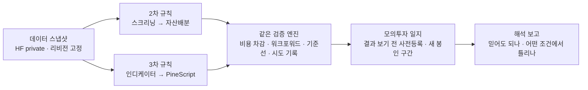
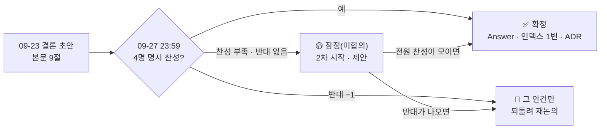
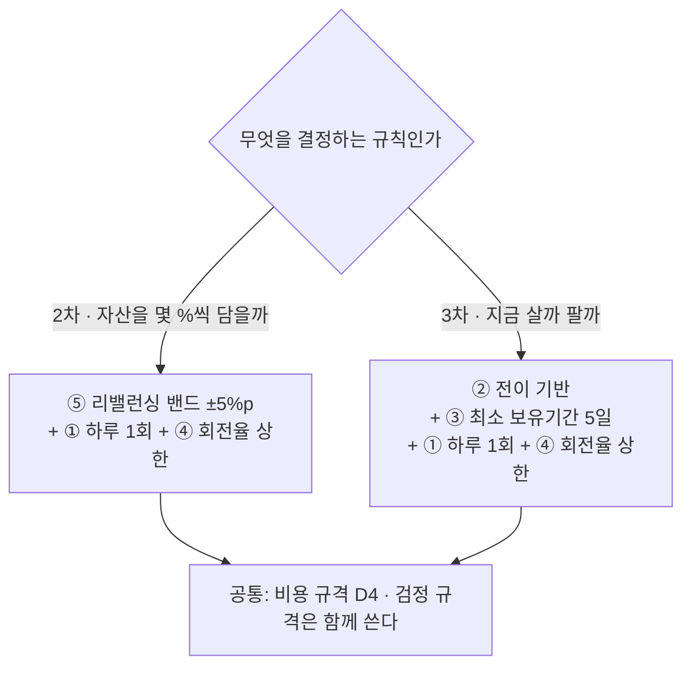

# #7 [논의] D1 Qurious 2.0은 누구의 어떤 문제를 푸는가

> 🗂️ 옛 GitHub 논의를 옮긴 **기록 문서**입니다 — [색인](../README.md). 원문은 그대로 두고, 링크·커밋 해시만 새 자리 기준으로 바꿨습니다.

| 항목 | 내용 |
|---|---|
| 종류 | 논의 |
| 상태 | 논의 · 방향성·목표 |
| 원 작성 | 이동원(`devlee328288`) · 2026-09-15 13:44 KST |
| 댓글 | 6건 · 답글 2건 |
| 옛 주소 | `github.com/devlee328288/Qurious/discussions/7` (지금은 열리지 않음) |

## 본문

> 🟡 **결론 초안 게시 (2026-09-23)** — 결론은 **추천안 그대로**(① B · ② P2 · ③ 주 경로 12 · ④ S1)입니다. 이 논의는 **4명 전원 명시 찬성**이라야 확정이고, 지금 ①② 3/4 · ③ 2/4 · ④ 2/4 + 조건부 1 입니다. 09-27(일) 23:59 KST 까지 모이지 않으면 **잠정(미합의)** 으로 2차를 시작하자고 제안합니다. → **본문 아래 §9 결론**

> **읽는 순서**: 0 쉬운 요약 → 4 추천안 → 6 결론을 뒤집을 조건 → 궁금한 선택지만 3절 → 8 반응 방법
> 💬 **안건별로 댓글 하나씩** 달아 주세요(예: `① B 👍`, `② P1 — 이유 …`). 이 논의는 D0([#6](../discussions/006.md)) ② 제안에 따라 **4명 전원의 명시 찬성**이 필요합니다.

### 0. 쉬운 요약 (처음 보는 분용)

1. 강사님은 1차 발표 뒤 "**누구에게, 무슨 목적으로** 만든 것인지 불명확하다"고 하셨습니다. 이 논의는 2차(로보어드바이저)와 3차(인디케이터)를 만들기 전에 그 답을 **한 문장**으로 정합니다.
2. 조사해 보니 "개인투자자"는 1,442만 명이라 한 덩어리로 볼 수 없습니다. 돈을 **맡기는** 로보어드바이저와 전략을 **만드는** 퀀트 도구도 이미 시장에 많습니다. 반면 "내가 가진 투자 규칙을 **믿어도 되는지**" 판단하는 일은 1차에서 우리가 가장 깊게 해 본 일입니다.
3. 그래서 **"자기 투자 규칙을 가진 개인투자자가, 그 규칙을 믿어도 되는지 판단하게 돕는다"** 를 추천합니다. 결론이 아니라 추천이며, 6절의 조건이 나오면 다시 논의합니다.

#### 용어 풀이

| 용어 | 뜻 |
|---|---|
| 타깃 사용자 | 이 제품을 쓴다고 **가정하는** 사람. 실제로 배포하지 않아도 화면·지표·설명을 고르는 기준이 됩니다. |
| 로보어드바이저(RA) | 알고리즘이 포트폴리오를 추천(**자문형**)하거나 대신 운용(**일임형**)하는 서비스 |
| 자산배분 | 주식·채권·현금 같은 자산에 돈을 어떤 비중으로 나눌지 정하는 일. 평균분산·리스크 패리티·블랙-리터만이 대표 모델입니다. |
| 투자 규칙 | "무엇을 얼마나 담을지(자산배분)", "언제 사고팔지(인디케이터)"를 미리 정한 절차. 퀀트 투자는 이런 규칙으로 투자합니다. |
| 백테스트 | 규칙을 과거 데이터에 적용해 성과를 계산해 보는 것 |
| 과최적화 | 여러 설정을 시험하다가 **과거에만** 잘 맞는 규칙을 고르는 것. 백테스트는 좋은데 앞으로는 나빠집니다. |
| 모의투자 | 가상의 돈으로 실제 시세에 맞춰 매매해 보는 것 |
| 봉인 구간·사전등록 | 결과를 보기 전에 평가 기간과 판정 방법을 적어 두고, 그 기간 데이터는 마지막에 한 번만 여는 방식(1차에서 사용, [#3](../issues/003.md)) |
| 인디케이터·PineScript | 가격·거래량으로 계산한 매매 신호 지표 / TradingView에서 지표·전략을 짜는 언어 |
| 유사투자자문업 | 불특정 다수에게 대가를 받고 **개별성 없는** 투자 조언을 하는 신고 업종. 1:1 맞춤 조언과 자동매매 대행은 할 수 없습니다. |
| JTBD(Jobs to Be Done) | 사람을 나이·소득이 아니라 "**어떤 상황에서 어떤 진전을 원하는가**"로 정의하는 방법 |
| 주 경로 | 목적 한 문장을 설명하는 데 꼭 필요한 기능의 흐름. 여기서 벗어난 기능은 깊게 만들지 않습니다(3절 ③). |

### 1. 배경: 왜 지금 정해야 하는가

- 강사님 피드백 0·1이 곧 이 논의의 질문입니다.
  - 0: "누구에게·무슨 목적으로"가 불명확하다. 넓게보다 깊게 하는 편이 낫다.
  - 1: 목표를 명확하게 설정하는 것이 중요하다.
- 1차 README는 "**맞히는 것보다 어려운 건, 맞혔다고 말해도 되는지 아는 것**"을 부제로 달았습니다(Alpha_Stack README#L3 (Alpha_Stack `README.md#L3` @ `01d8894`)). 그런데 그 판단을 **누구에게** 돌려주는지는 없었습니다.
- 뒤에 올 결정이 모두 이 답에 기댑니다.
  - D5(자산배분 모델·벤치마크) · D6(인디케이터 검증) · D7(모의투자) · D3(기능 유지·폐기)
  - [#1](../issues/001.md) 열린 질문 "**개인 맞춤성**: 위험성향 3단계 선택만 있음"이 이 논의로 넘어와 있습니다([#5](../issues/005.md) §5.2).
- 코드 작업이 시작되면 목표 없이 49개 화면을 조금씩 고치게 될 위험이 있습니다(2.2).

### 2. 사실

- **코드로 답한 것**: 과제 명세가 가정한 사람(2.1), 지금 Qurious 코드가 가정한 사람(2.2)
- **외부 조사로 답한 것**: 개인투자자 규모·특성, 국내 RA의 타깃, 개인이 겪는 문제, 교육용·실사용 사례와 규제 경계(2.3). 조회일은 모두 **2026-09-15 KST**이고 출처는 맨 아래에 모았습니다.

#### 2.1 과제 명세가 말하는 "누구"는 두 층입니다

| 층 | 명세 문장 | 근거 |
|---|---|---|
| 제품을 **쓴다고 가정하는** 사람 | "개인 투자자의 퀀트 모델 접근성 향상 필요성 증대" | [rfp-2#L21-L23](https://github.com/EST-team-project/Qurious/blob/04f476a/docs/rfp-2.md#L21-L23) |
| 프로젝트를 **평가하는** 사람 | 목적은 "로보 어드바이저 모델 **자체 개발** 및 성과 검증 **역량 확보**". 평가는 재현성·로직 타당성·검증 충실도·해석의 논리성 | [rfp-2#L27-L31](https://github.com/EST-team-project/Qurious/blob/04f476a/docs/rfp-2.md#L27-L31) · [rfp-1#L38-L42](https://github.com/EST-team-project/Qurious/blob/04f476a/docs/rfp-1.md#L38-L42) |
| 할 수 없는 것 | 실계좌 자동주문, **상용 서비스 배포·운영, 타인 자산 운용** | [rfp-2#L90-L94](https://github.com/EST-team-project/Qurious/blob/04f476a/docs/rfp-2.md#L90-L94) |

- "개인투자자"는 **제품이 돕는다고 가정하는 사람**이고, 실제로 서비스를 제공하지는 않습니다. 결과물을 읽는 사람은 강사님·평가자·면접관입니다.
- 두 층을 함께 정해야 합니다. 가정한 사용자가 분명해야 평가자가 "왜 이 지표, 왜 이 화면인가"를 이해합니다.

#### 2.2 지금 Qurious 코드가 가정한 사람 (`04f476a`)

| 관찰 | 근거 | 의미 |
|---|---|---|
| 사용자 입력은 **성향 3단계·기간·원금**뿐이고 성향 설문이 없습니다. | [ml.py#L61-L64](https://github.com/EST-team-project/Qurious/blob/04f476a/app/routes/ml.py#L61-L64) · [app.html#L1693-L1711](https://github.com/EST-team-project/Qurious/blob/04f476a/public/app.html#L1693-L1711) | 누구를 돕는지 좁혀 두지 않았습니다. |
| 화면은 "투자 성향과 기간에 따라 **AI가 최적 자산배분 비율을 계산**합니다"라고 안내합니다. 실제 자산군 비중은 성향별 **고정표**에 기간만 더합니다. | [app.html#L1690](https://github.com/EST-team-project/Qurious/blob/04f476a/public/app.html#L1690) · [ml.py#L96-L113](https://github.com/EST-team-project/Qurious/blob/04f476a/app/routes/ml.py#L96-L113) | 화면의 약속과 계산이 다릅니다. 사용자가 믿을 근거를 확인할 수 없습니다. |
| "최대낙폭 (MDD)" 칸의 값은 실제 낙폭이 아니라 `−σ·√t` 근사입니다. | [ml.py#L252](https://github.com/EST-team-project/Qurious/blob/04f476a/app/routes/ml.py#L252) · [app.html#L3156](https://github.com/EST-team-project/Qurious/blob/04f476a/public/app.html#L3156) | 같은 문제입니다([#5](../issues/005.md) §3). |
| 화면 코드에 **쓰이지 않는 고정 추천표**가 남아 있습니다("SK하이닉스 — HBM 수요 급증" 등). 자산군 값도 백엔드와 다릅니다(보수형 대체자산 5 vs 10). | [app.html#L3087-L3111](https://github.com/EST-team-project/Qurious/blob/04f476a/public/app.html#L3087-L3111) · [ml.py#L97](https://github.com/EST-team-project/Qurious/blob/04f476a/app/routes/ml.py#L97) | 화면에 노출되지는 않지만, 투자 권유처럼 읽히는 문구가 남아 있습니다. |
| 앱 5곳이 스스로를 "**교육용**·**학습용**"이라고 부릅니다(LEAN 검증·대체자산 모의주문·딥러닝·재무·기술적 분석). | [app.html#L1243](https://github.com/EST-team-project/Qurious/blob/04f476a/public/app.html#L1243) · [#L2834](https://github.com/EST-team-project/Qurious/blob/04f476a/public/app.html#L2834) · [#L2858](https://github.com/EST-team-project/Qurious/blob/04f476a/public/app.html#L2858) · [#L2861](https://github.com/EST-team-project/Qurious/blob/04f476a/public/app.html#L2861) · [#L2862](https://github.com/EST-team-project/Qurious/blob/04f476a/public/app.html#L2862) | 학습자를 가정한 화면과 실사용자를 가정한 화면이 섞여 있습니다. |
| 메뉴 그룹 11개, **하위 화면 49개**입니다(AI 상담·크롤링·코인·미국주식·신용 리스크·시스템관리 포함). | [app.html#L2656-L2761](https://github.com/EST-team-project/Qurious/blob/04f476a/public/app.html#L2656-L2761) | "넓게"의 실제 폭입니다. |

#### 2.3 외부 조사

**(가) 개인투자자는 한 덩어리가 아닙니다**

| 사실 | 수치 | 출처 |
|---|---|---|
| 2025년 말 상장사 주식 소유자 중 개인 | **1,442만 명**(소유자의 99.1%). 보유주식은 전체의 48.0% | 한국예탁결제원 발표(아주경제 2026-03-18) |
| 한 종목만 가진 소유자 | **459만 명(31.5%)**, 10종목 미만 84.9% | 한국예탁결제원 발표(서울파이낸스 2026-03-18) |
| 개인 해외주식의 미국 편중 | 2019년 말 58.2% → 2023년 말 88.5% → 2025-03-18 **90.4%**. 한국은행은 "일부 종목에 대한 과도한 편중을 줄이고 분산투자로 위험을 분산하려는 노력이 필요"하다고 적었습니다. | 한국은행 블로그(2025-03-26) |
| ETF로 이동 | 2025년 ETF 순자산 297.2조 원(+71.2%), 거래대금의 30.4%가 개인 | 한국거래소 결산(중앙일보 2025-12-30) |
| 구조를 모르고 쓰는 고위험 상품 | ETF 투자자의 42.1%(20대 52.7%)가 레버리지·인버스 경험. "레버리지 ETF 장기투자" 문항 정답률 38.6% | 한국금융소비자보호재단 2025 조사(경향신문 2026-03-12) |
| 성과가 집단마다 크게 갈립니다 | 2020년 3~10월 20만 4천 명: 신규투자자의 60%가 손실. 거래비용 차감 후 수익률은 투자자산 1천만 원 이하 −13.3%, 1억 원 초과 +20.0% | 자본시장연구원 이슈보고서 21-11 |
| 최근 실증 | 2020~2022년 10만 2천 명: 순수익률이 양(+)인 비율은 국내 28%·해외 39%(시간가중). 하위 성과 그룹은 경험 부족 상태의 과도한 매매·소수 종목 집중·공격적 위험 추구로 더 나빠졌습니다. | 자본시장연구원 연구보고서 26-04(2026-02-09) |

- **반례**: 같은 보고서는 "자산규모가 클수록, 투자경험이 많을수록" 초과성과자 비중이 높다고 했습니다. "개인은 비합리적이라 도구가 필요하다"는 일반화는 맞지 않습니다. 도움이 필요한 쪽은 개인의 **일부**입니다.

**(나) 국내 RA는 "맡기는" 시장입니다**

| 사실 | 수치 | 출처 |
|---|---|---|
| 테스트베드 통과사 계약자(2026-07 말) | **일임 216,619명(99.4%) vs 자문 1,316명(0.6%)** | 코스콤 RA 시장규모 추이(2026-08-11 게시) |
| 1위 사업자 | 핀트: 일임 계약자의 72%, AUM 5,200억 원, 운용자산의 99.9%가 개인, 1인당 평균 1,150만 원(회사 발표) | 스포츠경향 2026-05-01 |
| 퇴직연금 RA | 17개 일임업자를 혁신금융서비스로 지정, IRP 한정·연 900만 원 한도. 2026-07 말 고객 18,552명 | 금융위 2025-03-27 · 코스콤 |
| 무료 추천의 퇴장 | 2026년 2분기 은행 무료추천 중단으로 계약자 −44.10%. 보고서는 "유료 기반으로 전환"이라고 적었습니다. | 코스콤 2026년 2분기 운영현황 |
| 개인도 알고리즘을 만듭니다 | 테스트베드에 **개인 22명이 알고리즘 48개**를 접수해 27개가 운용심사를 마쳤고, 상품 출시는 0개 | 같은 자료 |
| 설명은 이미 붙이는 중 | 핀트는 2026-08-31 "오늘 내 자산은?" AI 요약과 운용 과정 타임라인을 추가했습니다. 파운트는 투자보고서·쉬운 해설을 제공합니다. | 벤처스퀘어 2026-08-31 · 파운트 앱 설명 |
| 연구기관의 지적 | "로보어드바이저 간에 자산관리 성과의 격차가 분명하게 존재", "알고리듬에 대한 설명의무 규제도 강화" 필요 | 자본시장연구원 연구보고서 21-05(2021) |

- **시사점**: "개인에게 알고리즘 운용을 제공한다"는 자리는 이미 채워져 있습니다. "쉬운 설명"만으로도 차별점이 되지 않습니다(핀트·파운트).

**(다) 개인이 겪는 문제는 "도구가 없어서"만이 아닙니다**

| 사실 | 출처 |
|---|---|
| 편향 없는 무료 조언을 약 8,000명에게 제공했지만, 조언이 가장 필요한 사람일수록 받지 않았고 받은 약 5%도 거의 따르지 않았습니다. | Bhattacharya et al.(2012, RFS) |
| 평균분산 로보어드바이저는 **분산이 부족했던** 투자자의 변동성을 낮추고 수익을 개선했습니다. 이미 분산된 투자자는 거래만 늘었습니다. | D'Acunto·Prabhala·Rossi(2019, RFS) |
| 로보 조언으로 이득을 본 쪽은 경험이 적고, 현금 비중이 높고, 거래가 잦았던 투자자였습니다. | Rossi·Utkus(2020, 워킹페이퍼) |
| 적은 수의 설정만 시험해도 높은 백테스트 성과를 쉽게 만들 수 있고, 시도 횟수를 보고하지 않으면 투자자는 과최적화를 판단할 수 없습니다. | Bailey·Borwein·López de Prado·Zhu(2014, Notices of the AMS) |
| FINRA는 백테스트 성과가 "사후확신으로 최적화될 수 있어 투자자를 오도할 위험이 크다"며 성과 전망 광고 허용 범위에서 뺐습니다. | FINRA SR-FINRA-2023-016 답변서(2024-02) |
| 2025년 유사투자자문업자 105개사에서 위법 133건. 주요 유형이 "목표 수익률 △△%", 종목별 수익률 단순 합산 같은 **수익률 과장**입니다. | 금융위·금감원(2026-04-20) |
| 미국 투자자의 75%가 증권사 리서치·도구를 쓰지만, 투자지식 퀴즈는 11문항 중 평균 5.3개를 맞혔습니다. | FINRA 재단 NFCS 투자자 백서(2025-12) |
| 개인투자자의 74%가 로보보다 사람의 조언을 더 신뢰합니다(2020년 73%). 국내 2016년 조사의 RA 미이용 사유 1위도 "로봇의 추천을 신뢰할 수 없어서" 35.8%였습니다. | CFA Institute(2022) · 한국금융투자자보호재단(이투데이 2017-01-22) |

- **반례**: 가장 많이 거래한 가구의 연수익률은 11.4%로 시장 17.9%보다 낮았습니다(Barber·Odean 2000). **매매 신호 도구(3차 인디케이터)는 과잉거래를 부추길 수도 있습니다.**

**(라) 교육·학습용과 실사용, 그리고 규제 경계**

| 사례 | 무엇을 누구에게 | 시사점 |
|---|---|---|
| Portfolio Visualizer | 백테스트·최적화. Free·Basic은 "Personal and Educational Use", Pro만 "Personal and Commercial Use" | 용도를 요금 등급으로 나눕니다. 평균분산 최적화는 이미 흔한 기능입니다. |
| QuantConnect | Boot Camp로 배우고 "같은 API로" 모의·실거래로 넘어갑니다. 무료 등급은 백테스트만, 모의·실거래는 유료 등급부터 | 교육과 실사용이 한 제품 안에서 이어집니다. |
| TradingView 게시 규칙 | 공개 스크립트는 목적·작동 방식·원본성을 설명하고, **근거 없는 성과 주장을 금지**하고, 현실적인 수수료·슬리피지를 넣어야 합니다. 전략은 **한 번에 한 데이터셋**에서 돕니다. | 3차 검증 기준으로 그대로 쓸 수 있습니다. Pine만으로는 포트폴리오 단위 검증을 할 수 없습니다. |
| 젠포트(뉴지스탁) | 노코드 백테스트·계좌 연동 예약매매. 개인이 만든 국내 주식 전략 500만 개(회사 발표). "유사투자자문업자로 개별적인 투자 상담과 자금 운영이 불가" 고지 | "참고자료" 고지 아래에서도 실제 매매로 이어집니다. 규칙 **만들기** 도구는 이미 큽니다. |
| 퀀터스 | "퀀트 투자, 이제 누구나 쉽게. 백테스트부터 실전 투자까지" | 같음 |
| KIS Open API | 모의(vps)·실전 키를 따로 발급. 모의 계좌는 호출 제한이 낮아 파라미터 최적화에는 실전 계좌를 권장 | 모의투자로 하는 검증에는 한계가 있습니다(D7). |

| 규제 | 내용 | 출처 |
|---|---|---|
| 투자자문·일임업 등록 | 주식회사, 등록 단위별 자기자본(자문 1억~2.5억 원·일임 5억~15억 원), 전문인력 | 자본시장법 제18조 · 금융위 조문별 개정이유서(2020-05) |
| 유사투자자문업 | 단방향 채널로 불특정 다수에게 **개별성 없는** 조언만 허용. 온라인 양방향 유료 영업은 투자자문업으로 규율(미등록 시 3년 이하 징역 또는 1억 원 이하 벌금) | 금융위 2024-08-13 |
| 1:1 조언·자동매매 | 유사투자자문업자에게 개별(1:1) 조언과 자동매매 방식은 허용되지 않습니다. 무료 회원 대상이라도 1:1 자문을 영업으로 하면 투자자문업에 "해당될 수 있다"는 해석이 있습니다. | 금융위·금감원 법령해석(2021-06-01 · 2019-12-26) |
| 검증과 사업화의 분리 | 개인도 테스트베드에서 알고리즘 **검증**은 받을 수 있지만, **사업화**는 법인으로 다시 참여해야 합니다. | 금융위 2019-05-15 |

- **시사점**: "학습용"이라는 이름보다 **실제 기능**(개인별 맞춤 추천, 자동주문 배포)이 경계를 정합니다. 결과물이 공개 저장소·데모로 남으므로, **특정 개인에게 맞춤 추천을 주는 서비스처럼 설계하지 않는 것**이 제외 범위와 규제 양쪽에 맞습니다.

### 3. 선택지

#### ① 타깃 사용자 (제품을 쓴다고 가정하는 사람)

| 안 | 누구 | 근거 | 약점 |
|---|---|---|---|
| A | **자산배분을 처음 하는 소액 개인투자자**. 한두 종목이나 레버리지 ETF에 몰려 있고, 알아서 나눠 주길 원하는 사람 | 한 종목 보유 31.5%, 분산 부족자에게 RA 효과(D'Acunto 2019), 미국 편중 90.4% | 이 사람의 해법은 "맡기기"이고 그 자리는 일임형(99.4%)이 차지했습니다. 실제 맞춤 추천은 제외 범위·규제상 할 수 없고, **추천 성과가 좋아야** 이야기가 성립합니다(2025년 RA 평균 14.89% vs KOSPI 75.63%, [#5](../issues/005.md)). |
| **B** | **자기 투자 규칙을 만들었거나 받아 쓰는 개인투자자**. 자산배분 비중이나 매매 신호를 스스로 정하지만, 그 규칙을 **믿어도 되는지 판단할 방법이 없는** 사람 | 개인 전략 500만 개(젠포트), 테스트베드 개인 알고리즘 48개, 과최적화(Bailey 2014)와 수익률 과장 제재, 조언이 있어도 따르지 않는 문제(Bhattacharya 2012) | 규모가 작을 수 있습니다(자문형 1,316명). 규칙 만들기 도구는 이미 많아 차별점이 "검증을 정직하게 보여 주기"로 좁습니다. 매매 신호가 과잉거래를 부추길 위험이 있습니다(Barber·Odean 2000). |
| C | 가정한 사용자 없이 **평가자에게 역량을 증명**하는 프로젝트 | rfp-2 목적이 "역량 확보"입니다. | 강사님 피드백 0("누구에게")에 답하지 못합니다. |

- **버리는 후보**: 퇴직연금 IRP에 가입한 직장인. 금융사·핀테크가 제휴로 경쟁 중이고, 혁신금융서비스 특례와 실계좌에 기대는 영역이라 과제 범위 밖입니다.
- 어느 안이든 프로젝트를 **평가하는 사람**(강사님·평가자·면접관)은 같습니다. 이 층은 7절 결정 기준 2·7번으로 챙깁니다.

#### ② 목적 한 문장 후보

| 후보 | 문장 | 연결 |
|---|---|---|
| P1 | "한두 종목에 몰려 있는 개인투자자가, 자기 성향에 맞게 **분산된 포트폴리오가 무엇이고 왜 그런지** 이해하게 돕는다." | A |
| **P2** | "자기 투자 규칙을 가진 개인투자자가, 그 규칙을 **믿어도 되는지**를 비용·누수·과최적화를 걸러 낸 검증과 앞으로 쌓이는 모의투자 기록으로 판단하게 돕는다." | B |
| P3 | "개인투자자가 로보어드바이저의 추천(2차)과 자기 매매 신호(3차)를 **결과가 아니라 근거와 실패 조건으로** 판단하게 돕는다." | A+B |

**선택 기준과 1차 평가** (○ 충족 · △ 일부 · × 미흡. 댓글로 바꿀 수 있습니다)

| 기준 | P1 | P2 | P3 |
|---|---|---|---|
| ⓐ 사람·상황·원하는 진전이 한 문장에 있나 (JTBD) | ○ | ○ | △ 사람이 넓음 |
| ⓑ 무엇을 **안 하는지** 드러나나 | △ | ○ 추천·운용을 하지 않음 | △ |
| ⓒ **결과가 나빠도** 목적이 성립하나 (피드백 4) | × 추천이 단순 대안을 못 이기면 약해짐 | ○ "믿으면 안 된다"도 답 | ○ |
| ⓓ RFP 필수 산출물이 설명되나 | ○ | ○ 예측·스크리닝·배분이 모두 규칙 후보로 필요 | ○ |
| ⓔ 2차·3차·1차 유산을 한 줄로 잇나 | △ 3차 연결이 약함 | ○ | ○ |
| ⓕ 제외 범위·규제 안인가 (맞춤 조언·자동주문 배포 X) | △ 성향 입력 → 맞춤 추천 구조 | ○ | △ |
| ⓖ 비전문가가 5분 발표로 따라오나 (피드백 3) | ○ | △ "과최적화"를 풀어 줘야 함 | △ |

#### ③ "넓게 대신 깊게": 무엇을 버리나

**원칙 제안**: 목적 한 문장의 **주 경로에 없는 기능은 새로 만들거나 고치지 않는다.** 삭제 여부는 D3에서 정한다.

P2 기준 주 경로:



현재 49개 화면의 1차 분류 (P2 기준, **D3 확정 전 제안**)

| 분류 | 처리 | 화면 (수) |
|---|---|---|
| **주 경로** | 깊게 만듭니다. | 자산배분·최적화, 패턴 인식·종목 스크리닝, 모의 투자 의사결정, 모의계좌 현황, 국내주식 모의주문, 전략 분석, LEAN 백테스트(교차 확인), 증권사 API 설정(모의 한정), 기본 인디케이터 전략, 커스텀 인디케이터 개발, 성과 검증(Python), 증권사 API 자동화(모의 한정) **(12)** |
| RFP 필수지만 주 경로 밖 | **최소 요건만** 채웁니다(규칙 후보로 쓰는 만큼). | 모델 비교, 종목 군집화(→ 시장 국면 분류 요구) **(2)** |
| 개념 설명 | 새로 만들지 않고 개념 노트(D0 ⑦)와 연결합니다. | 금융상품 이해, 자산배분 모델, 계절성 분석, 거시경제 지표, 산업 분석, 재무제표 분석, 기술적 분석, 회귀 분석, 하이퍼파라미터 튜닝, 딥러닝 **(10)** |
| **동결** | 개발·발표에 시간을 쓰지 않습니다. 삭제는 D3에서 정합니다. | AI 투자 상담, 신용 리스크 분석, 맞춤 상품 추천, 투자 정보 리서치, 크롤링 3종, 직접매매 3종, 코인 모의매매, 대체자산, Open API, 퀀트 대시보드, 자동매매 현황, 알림 설정, 미국주식 4종, 지표 대시보드, 지표 비교 분석, 섹터 인디케이터, 시스템관리 2종 **(25)** |

- 분석 범위도 같은 원칙입니다. **한 시장만** 깊게 봅니다. 대상이 KOSPI200인지 ETF 멀티에셋인지는 D5에서 정합니다.
- live 실주문 경로는 동결이 아니라 **차단 논의 대상**입니다(D7, [#5](../issues/005.md) 격차표 35행).
- **반례**: RFP는 **항목별 요구사항**입니다(예: 패턴 인식 [rfp-2#L47-L52](https://github.com/EST-team-project/Qurious/blob/04f476a/docs/rfp-2.md#L47-L52)). 너무 많이 버리면 필수 항목이 비어 감점될 수 있어 "최소 요건" 칸을 따로 둡니다.

#### ④ 2차·3차를 하나의 이야기로 잇는 방법

| 안 | 이야기 | 장점 | 약점 |
|---|---|---|---|
| **S1** | **"규칙 → 검증 → 기록" 한 줄기**. 2차는 "무엇을 얼마나 담을지" 규칙, 3차는 "언제 사고팔지" 규칙입니다. 둘 다 **같은 검증 엔진**과 **같은 모의투자 일지**를 통과합니다. 1차는 그 엔진의 출처이자 "맞혔다고 말해도 되는가"라는 질문의 시작입니다. | 발표 한 번에 한 질문으로 설명됩니다. 3차가 늦어도 2차가 막히지 않습니다. 1차 유산([#3](../issues/003.md))을 그대로 씁니다. | 2·3차 기능이 서로 직접 연결되지는 않습니다. |
| S2 | **3차 인디케이터를 2차 포트폴리오의 국면·리밸런싱 신호로 직접 결합** | 하나의 제품이 됩니다. RFP "동적 자산배분"([rfp-2#L59](https://github.com/EST-team-project/Qurious/blob/04f476a/docs/rfp-2.md#L59))을 채웁니다. | Pine 전략은 **한 번에 한 데이터셋**에서만 돌아 포트폴리오 단위 검증은 Python에서만 됩니다. 3차가 늦으면 2차가 막힙니다. |
| S3 | 2차와 3차를 **별개 프로젝트**로 두고 인프라만 공유 | 분업이 쉽습니다. | 이야기가 둘로 갈라져 피드백 0("누구에게")을 두 번 받을 수 있습니다. |

- 1차 보고서 9.2절은 "2026-09-01 이후 쌓이는 자료로 **새 봉인 구간**을 정하고 결과를 보기 전에 다시 사전등록한다"고 적었습니다(build_final_report.py#L1397-L1400 (Alpha_Stack `scripts/build_final_report.py#L1397-L1400` @ `01d8894`)). 모의투자 일지가 그 구간이므로, S1은 **1차의 마지막 문장을 2·3차의 첫 문장으로** 잇습니다(설계는 D7).

### 3.5 ★ 팀원 반응 (2026-09-18 KST 갱신)

| 안건 | 강민석님 | 제 추천 | 상태 |
|---|---|---|:--:|
| ① 타깃 사용자 | **B** | B | ✅ 일치 |
| ② 목적 한 문장 | **P2** | P2 | ✅ 일치 |
| ③ 깊게의 범위 | (의견 없음) | 주 경로 12개만 | — |
| **④ 2·3차 이야기** | ~~S3~~ → **S1** (09-21) | **S1** | ~~✅ **합의**~~ 🔴 (09-23 정정) 민석님 조건부 찬성 — 8절은 전원 명시 찬성이라 합의 아님(§9 결론표) |

민석님 원문([09-15](../discussions/007.md#discussioncomment-18445788)):

> "저는 로보 어드바이저와 인디케이터를 **완전히 다른 범위**로 인식하고 있습니다. … 어드바이저를 깊게, 인디케이터를 깊게 만드는 것이 중요하다 생각합니다. 시간이 남으면 어드바이저와 인디케이터를 결합한 대시보드를 만들어 볼 수도 있겠습니다. 정리하면, **목표가 둘을 잇는 것이 되면 안된다**고 생각합니다."

#### ★ 다시 읽어 보니 S1 과 S3 의 거리가 제가 쓴 것보다 가깝습니다 🟡

제가 세 안을 나눌 때 축을 흐리게 썼습니다. 실제로 갈리는 축은 **둘입니다.**

| | 기능을 직접 잇는가 | 발표를 한 줄기로 하는가 |
|---|:--:|:--:|
| **S1** (제 추천) | ❌ **잇지 않음** | ✅ 한 질문으로 |
| S2 | ✅ 인디케이터를 포트폴리오 신호로 | ✅ |
| **S3** (민석님) | ❌ 잇지 않음 | ❌ 따로 |

**민석님이 반대하신 것은 S2 입니다** — *"목표가 둘을 잇는 것"* 이 곧 S2 이고, S1 은 기능을 잇지 않습니다. S1 이 공유하는 것은 **검증 엔진과 모의투자 일지**뿐이고, 민석님도 *"인프라만 공유"* 는 S3 에서 허용하십니다.

→ 그래서 **S1 과 S3 의 실제 차이는 "발표를 한 줄기로 묶는가" 하나**로 좁혀집니다. [D6 #20 ⑧](../discussions/020.md)에서 이미 **A안(3차를 독립 주제로)** 을 추천드린 것도 같은 방향입니다.

**🟢 2026-09-21 답을 받았습니다 — ④는 S1 으로 ~~합의됐습니다~~ 🔴 (09-23 정정) 조건부 동의를 받았습니다(§9).**

민석님 답(09-21): *"발표를 한 줄기로 한다는게 살짝 모호한 것 같습니다. 같은 목표와 대상을 가지고
어드바이저에 대한 내용/인디케이터에 대한 내용 다른 내용을 발표한다는 말씀이 맞다면 S1에도 동의합니다.
제가 이해한 바로는 S3은 검증로직부터 다시 짜는 방향이고, S1은 전 차수에 사용한 방식을 도입한다는
방향이 맞으면 S1이 좋을 것 같습니다."*

걸리셨던 것은 **②(발표까지 따로)** 였고, 그 말이 모호했던 제 잘못입니다. 뜻을 못 박습니다:

| "한 줄기"가 뜻하는 것 | "한 줄기"가 뜻하지 **않는** 것 |
|---|---|
| 같은 목표·같은 대상 아래에서 **질문 하나**로 묶어 발표합니다 | ❌ 2차와 3차를 **한 화면·한 기능**으로 합치는 것 (그것은 S2) |
| 2차는 어드바이저 내용, 3차는 인디케이터 내용을 **각각** 발표합니다 | ❌ 두 발표를 하나로 합치는 것 |
| **검증 엔진과 모의투자 일지를 공유**합니다 | ❌ 어드바이저 결과를 인디케이터 입력으로 넣는 것 (그것도 S2) |

→ 민석님이 쓰신 *"같은 목표와 대상을 가지고 어드바이저/인디케이터 다른 내용을 발표"* 가
**정확히 S1 입니다.**

그리고 **S1↔S3 이해도 맞습니다** — 다만 한 곳만 더 정확히 적습니다. S3 이 *반드시*
검증로직을 다시 짜야 하는 것은 아니지만(인프라는 공유하니까), 별개 프로젝트로 두면
**검증 규격을 두 번 정해야 하고 둘이 어긋날 때 맞출 주체가 없습니다.** 실질적으로는
말씀하신 대로 갈립니다. S1 은 1차 유산([#3](../issues/003.md))의 검증 엔진·일지를 **그대로** 씁니다.

---

### 4. 추천안

| 안건 | 추천 | 한 줄 이유 |
|---|---|---|
| ① 타깃 사용자 | **B** 자기 투자 규칙을 가진 개인투자자 | 운용을 **맡기는** 자리와 규칙을 **만드는** 도구는 이미 큽니다. **믿어도 되는지 판단**하는 일은 1차에서 가장 깊게 해 봤고, 규제 경계 안에 있습니다. |
| ② 목적 한 문장 | **P2** | 결과가 나빠도 목적이 성립하고(피드백 4), 2·3차와 1차가 한 줄로 이어집니다. |
| ③ 깊게의 범위 | **주 경로 12개 화면만 깊게, 25개는 동결** | 49개를 조금씩 고치는 대신 한 흐름을 끝까지 만듭니다. 필수 항목은 "최소 요건"으로 지킵니다. |
| ④ 2·3차 이야기 | **S1** (S2는 주 경로가 한 바퀴 돈 뒤 선택 확장) ~~✅ **합의 (09-21 · 민석님 S3→S1)**~~ 🔴 (09-23 정정) 민석님 S3→S1 조건부 · 확정은 §9 결론표 | 한 질문으로 발표하고, 한쪽이 늦어도 다른 쪽이 멈추지 않습니다. **단 3.5절 참조** — S1 도 기능은 잇지 않아 민석님 의견과 충돌하지 않을 수 있습니다 |

**이 추천이 뒤따르는 논의에 주는 영향** (확정은 각 논의에서)
- **개인 맞춤성**([#1](../issues/001.md) 열린 질문): 1:1 맞춤 추천을 만들지 않습니다. 대신 테스트베드 심사항목인 "성향별로 **유의미하게 구분되는** 복수 포트폴리오"를 규칙으로 만들고, **정말 구분되는지 검증**합니다(D5).
- **벤치마크**: "KOSPI를 이겼나"보다 "**단순한 대안**(동일가중·60/40·Buy&Hold)보다 비용을 빼고도 나은가"가 주 질문이 됩니다. RFP 수치 기준은 보고 형식으로 함께 적습니다(D5).
- **3차 검증**: TradingView 게시 규칙(현실적 비용·근거 없는 성과 주장 금지)을 검증 기준에 넣습니다(D6).
- **화면 문구**: "AI가 최적 비율을 계산합니다"처럼 계산과 다른 약속을 고칩니다(D3 · A13).

### 5. 근거 · 반례 · 대안 · 한계

**근거** (추천안 B · P2 · S1)
1. 개인이 규칙을 **만드는** 수요는 큽니다: 젠포트 개인 전략 500만 개, 테스트베드 개인 알고리즘 48개.
2. 그 규칙을 **믿어도 되는지**는 개인이 판단하기 어렵습니다: 과최적화 증명(Bailey 2014), FINRA의 백테스트 성과 광고 제외, 수익률 과장 제재 133건.
3. 조언·도구가 있는 것만으로는 부족합니다: 받지 않거나 따르지 않고(Bhattacharya 2012), 효과는 사람마다 다릅니다(D'Acunto 2019 · Rossi·Utkus 2020).
4. 우리 팀의 깊이가 거기 있습니다: 누수 차단 분할·비용 차감 지표·사전등록·봉인([#3](../issues/003.md)). 강사님 배포 예제 백테스트 대부분은 비용을 반영하지 않습니다([#4](../issues/004.md) §6).
5. 제외 범위·규제와 맞습니다: 맞춤 추천이나 자동주문 배포 없이, 규칙과 검증 결과를 보여 줍니다.

**반례** (추천안에 불리한 사실)
1. **수요가 작을 수 있습니다.** 테스트베드 통과사 기준 자문형 계약자는 1,316명이고 99.4%가 일임입니다.
2. **검증은 제도에도 있습니다.** 코스콤 테스트베드가 알고리즘 설명의 합리성·테스트 결과의 신뢰성을 심사하고, 2023년부터 사후운용심사를 합니다.
3. **설명도 이미 붙이고 있습니다.** 핀트(2026-08-31 개편)·파운트(투자보고서).
4. **규칙 만들기 도구는 이미 많습니다.** 젠포트·퀀터스·Portfolio Visualizer·QuantConnect. 기능 수로는 경쟁할 수 없습니다.
5. **매매 신호 도구는 해가 될 수 있습니다.** 과잉거래가 개인 성과를 해칩니다(Barber·Odean 2000 · 자본시장연구원 21-11).
6. **"학습용" 고지로 오용이 사라지지 않습니다.** 참고자료라고 고지해도 계좌 연동으로 실제 매매가 일어납니다(젠포트).
7. **개인 전체가 도움이 필요한 것은 아닙니다.** 자산이 크고 경험이 많은 개인은 초과성과를 냅니다(자본시장연구원 26-04).

**대안**: A·P1(분산 입문자), C(역량 증명), P3(A+B 혼합), S2(2·3차 직접 결합), S3(별개 프로젝트)는 3절 표에 장단점을 남겼습니다.

**한계** (아직 모르는 것)
- **실제 사용자를 한 명도 인터뷰하지 않았습니다.** 타깃 B가 실재한다는 근거는 이용 규모와 연구 결과로 추정한 것입니다.
- 국내 RA **불신·미이용 사유**를 수치로 보여 주는 설문은 2016년 조사가 찾은 것 중 최신입니다.
- 예탁원·거래소 수치 일부는 보도자료 원문 대신 **기사로** 확인했습니다. 핀트·젠포트 수치는 **회사 발표**입니다.
- 외부 수치 대부분이 **2025년 강세장** 기준입니다. 하락장에서의 개인 행동은 이번에 조사하지 않았습니다.
- 3차 명세·평가표는 아직 강사님께 확인하지 못했습니다([#4](../issues/004.md)).
- 규제 해석은 공개 보도자료와 법령해석을 읽은 수준이며 **법률 자문이 아닙니다.**

### 6. 결론을 뒤집을 조건

아래 중 하나라도 나오면 **실패가 아니라 재검토**로 보고 이 논의를 다시 엽니다(D0 ② 제안).

1. **강사님이 3차 명세·평가표에서 "사용자 맞춤 추천 서비스" 형태를 요구하면** → ① A 또는 P3로 다시 논의합니다.
2. **대리 사용자 점검에 실패하면** → 2차 중간 시연에서 투자 경험이 있는 비전공자 3명에게 5분 보여 주고 "이 규칙을 믿어도 되는지 판단할 수 있었나"를 묻습니다. 2명 이상이 "아니오"이면 먼저 화면·설명을 고칩니다. 고친 뒤에도 같으면 목적 문장을 다시 논의합니다.
3. **RFP 필수 항목이 비면** → D3 범위 표에서 주 경로와 "최소 요건"으로 계획되지 않은 필수 항목이 [#5](../issues/005.md) 격차표 기준 **5개 이상** 남으면 ③ 동결 범위를 조정합니다.
4. **일정이 밀리면** → 2차 기간의 절반이 지날 때까지 주 경로를 한 바퀴(데이터 → 규칙 1개 → 검증 → 모의투자 일지 1건) 돌리지 못하면, 동결을 늘리고 S2 확장은 하지 않습니다.
5. **타깃 B가 없다는 더 강한 근거가 나오면** → 예를 들어 국내 개인 퀀트 도구 이용자 조사에서 "검증"이 필요 없다는 결과가 나오면 ①을 다시 논의합니다.

**뒤집는 조건이 아닌 것**: 검증 결과가 "이 규칙은 믿으면 안 된다"로 나오는 것. P2에서는 그것도 목적을 달성한 답입니다.

### 7. 결정 기준

1. **"누구에게·무슨 목적으로"에 한 문장으로 답하는가** (피드백 0·1)
2. **모르는 사람도 5분 안에 이해하는가** (피드백 3)
3. **결과가 기대와 달라도 프로젝트가 성립하는가** (피드백 4)
4. **깊게 갈 곳이 1차 유산과 이어지는가** (넓게보다 깊게)
5. **RFP 필수 항목과 제외 범위를 지키는가**
6. **규제·약관 선을 넘지 않는가** (맞춤 자문·자동주문 배포·KRX 제3자 제공)
7. **본인이 면접에서 왜 이 타깃인지 설명할 수 있는가** (피드백 5)

### 8. 결정 기한과 담당자

- **담당**: `@devlee328288`. 결론 정리, [#1](../issues/001.md) 결정 요약 갱신, ADR 초안(D0 ③ 후보)을 맡습니다.
- **기한**: **2026-09-27(일) 23:59 KST** (D0 [#6](../discussions/006.md)과 같은 날)  ← **2026-09-17 연장** (원래 09-20 · 다른 논의 문서와 09-27로 통일합니다. 아래 댓글 참고)
  - D0 ② 제안에 따라 **4명 전원의 명시 찬성**이 필요합니다. D0에서 확정 방식이 바뀌면 그에 따릅니다.
- **참여 요청**: `@rkdalstjr` `@GoonGuMa` `@janghwan-god`
- **반응 방법**: 안건별로 `① B 👍` 또는 `② P1 — 이유`처럼 남겨 주세요. **다듬은 새 목적 문장도 환영합니다.**
- **확인 질문**
  - [ ] 6절 조건 2의 "비전공자 3명 시연"을 할 수 있을까요? 부탁할 수 있는 분이 있나요?
  - [ ] 3절 ③ 동결 목록에 **꼭 살려야 할 화면**이 있나요?
  - [ ] 강사님께 3차 명세·평가표를 여쭤볼 분이 있나요? ([#4](../issues/004.md)에서 이어짐)

### 9. 결론 — 초안 (2026-09-23)

~~(결정 후 댓글로 남깁니다)~~ 🔴 2026-09-18 운영 규칙 변경 — 결론은 **본문 이 절**에 쓰고 댓글엔 요약만 남깁니다.
흐름: ~~결론 댓글(목적 한 문장 + **뒤집을 조건**)~~ **결론 본문(이 절) + 요약 댓글** → Answer 표시(**확정 뒤에만**) → [#1](../issues/001.md) 결정 요약에 한 줄 → ADR PR(D0 ③ 합의 후)

**쉬운 요약 3줄 (처음 보는 분용)**

1. 결론 초안은 **추천안 그대로**입니다. ① 누구: 자기 투자 규칙을 가진 개인투자자 ② 목적: 그 규칙을 믿어도 되는지 판단하게 돕는다 ③ 화면 49개 중 12개만 깊게 ④ 2차·3차는 기능을 잇지 않고, 같은 질문 아래 **각각** 발표합니다.
2. **아직 확정이 아닙니다.** 이 논의는 4명 **전원**이 찬성이라고 적어야 확정입니다(8절). 지금 ①② 3명, ③ 2명, ④ 2명(+조건부 1명)입니다. 🟢
3. 기한은 **09-27(일) 23:59 KST**(오늘 기준 D-4)입니다. 그때까지 모이지 않으면 "잠정(미합의)"으로 2차를 시작하자는 **제안**을 9.6에 적었습니다. 침묵은 찬성으로 세지 않습니다.

#### 9.1 상태표

범례 — **제안** = 제안자(이동원, 찬성으로 셈) · **✅ X (MM-DD)** = 명시 찬성 · **✅ᶜ** = 조건부 찬성(조건에 제안자가 답함 · 투표자 재확인 없음 · n/4 에 넣지 않고 "+ ✅ᶜ n" 으로 따로 적음) · **💬** = 이 논의 안건을 향한 말이지만 선택지를 고르지 않음(세지 않음) · **—** = 이 논의에서 발언 없음 · **🔴** = 반대. **n/4 는 제안과 ✅ 만 센 값입니다.**

<!-- 결론표:시작 -->
| 안건 | 결론(초안) | 이동원 | 강민석 | 신장환 | 오준영 | 확정 규칙 | 상태 |
|---|---|:-:|:-:|:-:|:-:|---|---|
| ① 타깃 사용자 | B — 자기 투자 규칙을 가진 개인투자자 | 제안 | ✅ B (09-15) | ✅ B (09-23) | — | 전원 명시 찬성 | ⏳ 전원 찬성 대기 3/4 |
| ② 목적 한 문장 | P2 — 그 규칙을 믿어도 되는지 판단하게 돕는다 (문장 원문 그대로) | 제안 | ✅ P2 (09-15) | ✅ P2 (09-23) | — | 전원 명시 찬성 | ⏳ 전원 찬성 대기 3/4 |
| ③ 깊게의 범위 | 주 경로 12 깊게 · 최소 요건 2 · 개념 10 · 동결 25 (삭제는 D3) | 제안 | — | ✅ 동의 (09-23) | — | 전원 명시 찬성 | ⏳ 전원 찬성 대기 2/4 |
| ④ 2·3차 이야기 | S1 — 기능은 잇지 않고 같은 질문으로 각각 발표 · 검증 엔진과 모의투자 일지 공유 | 제안 | ✅ᶜ S1 (09-21) | ✅ S1 (09-23) | — | 전원 명시 찬성 | ⏳ 전원 찬성 대기 2/4 + ✅ᶜ 1 |
<!-- 결론표:끝 -->

**지금 남아 있는 반대(−1)는 네 안건 모두 0건**입니다(민석님 ④ S3 는 09-21 에 S1 조건부로 바뀜). 무응답은 찬성도 반대도 아닙니다. 🟢

```
 안건   동  민  장  준    명시 찬성      남은 것
 ①      ■   ■   ■   □     3/4            준영
 ②      ■   ■   ■   □     3/4            준영
 ③      ■   □   ■   □     2/4            민석 · 준영
 ④      ■   ◐   ■   □     2/4 + ◐ 1      민석 재확인 · 준영
 ■ 명시 찬성(제안 포함)  ◐ 조건부  □ 이 안건 발언 없음
```

#### 9.2 용어 풀이 (이 절에서 처음 나오는 것)

| 용어 | 뜻 | 이 문서에서 | 헷갈리는 점 |
|---|---|---|---|
| 명시 찬성 | 선택지를 적거나 "찬성·동의"라고 쓴 것만 세는 방식 | 8절 확정 규칙의 단위 | "반대 0"과 다릅니다. 반대가 없어도 찬성이 모자라면 확정되지 않습니다 |
| 조건부 찬성(✅ᶜ) | "~라면 동의합니다" | 민석님 ④ (09-21) | 제안자가 "조건이 맞다"고 답해도, 투표자가 다시 확인하기 전까지는 조건부로 둡니다 |
| 잠정(미합의) | 추천안대로 일은 시작하되 결정으로는 기록하지 않는 상태 | 9.6 제안 | "확정"과 달리 반대 한 줄로 되돌아갑니다 |
| 동결 | 개발·발표에 시간을 쓰지 않음. **삭제가 아님** | ③의 25개 화면 | 켜져 있으면 보안 책임은 남습니다(D3 [#30](../discussions/030.md)) |
| 72시간 규칙 | 초안 뒤 72시간 안에 반대가 없으면 확정(D0 ② 추천안) | **이 논의에는 걸리지 않습니다** | 다른 논의의 "09-26 18:00 확정 예정"은 D1과 무관합니다 |

#### 9.3 결론 문장 (초안)

> **② 목적 한 문장 (P2 · 원문 그대로)**
> "자기 투자 규칙을 가진 개인투자자가, 그 규칙을 **믿어도 되는지**를 비용·누수·과최적화를 걸러 낸 검증과 앞으로 쌓이는 모의투자 기록으로 판단하게 돕는다."

- 🟢 문장을 한 글자도 바꾸지 않았습니다. 바꾸면 이미 받은 찬성이 "바뀐 문장"에 대한 것이 아니게 됩니다.

**① 타깃 — B** (3절 표 원문): 자기 투자 규칙을 만들었거나 받아 쓰는 개인투자자. 규칙은 스스로 정하지만 그 규칙을 **믿어도 되는지 판단할 방법이 없는** 사람.
- 민석님 단서(09-15): *"단, 말씀처럼 과잉거래를 방지하기 위한 장치만 마련하면 좋겠습니다."* 단서가 가는 곳: D7 [#13](../discussions/013.md) ④ **R2**(매 거래일 1회 기록 · 매매는 규칙 주기) — 민석님이 09-21 에 직접 고름 🟢 · D5 [#18](../discussions/018.md) ③ 밴드(팀원 투표 없음) · 09-17 답글의 전이+최소 보유기간(답 없음).
- 🟢 코드는 아직 그대로입니다. 매수 경로는 보유 여부를 보지 않고([auto_trade.py#L308-L314](https://github.com/EST-team-project/Qurious/blob/3b12100/app/services/auto_trade.py#L308-L314)), 매도 경로에만 보유 확인이 있습니다([#L333-L338](https://github.com/EST-team-project/Qurious/blob/3b12100/app/services/auto_trade.py#L333-L338)).

**③ 깊게의 범위** — 원칙: 주 경로에 없는 기능은 새로 만들거나 고치지 않는다. 삭제는 D3.

| 분류 | 처리 | 수 |
|---|---|--:|
| 주 경로 | 깊게 만든다 | 12 |
| RFP 필수지만 주 경로 밖 | 최소 요건만 | 2 |
| 개념 설명 | 개념 노트와 연결 | 10 |
| 동결 | 시간을 쓰지 않음 · 삭제는 D3 | 25 |

- 🟢 스캐너로 대조했습니다. `3b12100` 의 메뉴 정의([app.html#L2657-L2762](https://github.com/EST-team-project/Qurious/blob/3b12100/public/app.html#L2657-L2762))에서 11그룹 · 49 key 를 뽑으면 화면 div 49개와 같고, 3절 분류는 **누락 0 · 중복 0** 입니다.
- 🟢 3절의 *"live 실주문 경로는 동결이 아니라 차단 논의 대상"* 은 ADR-0001(09-21 채택)로 처리됐습니다.
- 🟢 동결의 "자동매매 현황"(10분 반복)은 D7 [#13](../discussions/013.md) ④ R2 의 *"10분 반복은 멈추고 코드는 동결"* 과 같은 방향입니다.

**④ 2·3차 이야기 — S1** (09-21 본문 3.5 의 정의를 그대로 가져옵니다)

| "한 줄기"가 뜻하는 것 | 뜻하지 **않는** 것 |
|---|---|
| 같은 목표·같은 대상 아래 **질문 하나**로 묶어 발표 | 2차와 3차를 한 화면·한 기능으로 합치기 (그것은 S2) |
| 2차는 어드바이저, 3차는 인디케이터를 **각각** 발표 | 두 발표를 하나로 합치기 |
| **검증 엔진과 모의투자 일지**를 공유 | 어드바이저 결과를 인디케이터 입력으로 넣기 (S2) |

- S2(기능 결합)는 주 경로가 한 바퀴 돈 뒤의 **선택 확장**입니다. 민석님 09-15 *"시간이 남으면 어드바이저와 인디케이터를 결합한 대시보드"* 와 같은 자리로 봅니다. 🟡

#### 9.4 누가 · 무엇을 · 언제 (원문 대응)

| 시각(KST) | 누구 | 원문 그대로 | 안건 · 판정 | 그 뒤 본문 변경 |
|---|---|---|---|---|
| 09-15 16:34 | 강민석 | "B … 투자 경험이 있는 개인투자자에게 참고 근거를 더해주는 방향이 프로젝트와 제일 맞을 것 같습니다. 단, 말씀처럼 과잉거래를 방지하기 위한 장치만 마련하면 좋겠습니다." | ① ✅ B (단서 1) | ① 선택지는 그대로 🟡 |
| 〃 | 강민석 | "P2" | ② ✅ P2 | 그대로 🟡 |
| 〃 | 강민석 | "S3 … 정리하면, 목표가 둘을 잇는 것이 되면 안된다고 생각합니다." | ④ S3 → 09-21 에 바꿈 | 09-18 20:04 3.5절 신설(축을 둘로 나눔) |
| 09-21 14:45 | 강민석 | "…같은 목표와 대상을 가지고 어드바이저에 대한 내용/인디케이터에 대한 내용 다른 내용을 발표한다는 말씀이 맞다면 S1에도 동의합니다." · "…S1은 전 차수에 사용한 방식을 도입한다는 방향이 맞으면 S1이 좋을 것 같습니다." | ④ ✅ᶜ S1 (조건 2개) | **투표 09-21 14:45 · '한 줄기' 정의표 추가 09-21 16:06** → 조건 문장을 받아 적은 정의. 재확인 없음 |
| 09-23 09:22 | 신장환 | "① B ② P2 ③ 동의 ④ S1 --- 전부 동의합니다" | ①②③④ ✅ | 모든 편집(09-17·09-18·09-21) 뒤 → **지금 본문**에 대한 찬성 🟢 |
| — | 오준영 | 발언 없음 (논의 10건의 댓글·답글 전수 조회) | — | — |

- **④ 조건에 누가·언제 답했나**: 이동원 09-21 16:06 답글 — *"쓰신 … 가 정확히 S1 입니다"* (조건 1) · *"S1↔S3 이해도 맞습니다 … S1 은 1차 유산([#3](../issues/003.md))의 검증 엔진과 일지를 그대로 씁니다"* (조건 2). 🟢
- 09-21 16:06 답글 뒤 [#7](../discussions/007.md) 에 민석님의 재확인이 없어 ④ 는 ✅ᶜ 로 둡니다. 🟢
- "① ② 선택지는 투표 뒤 그대로"는 이동원 편집 댓글 3건(09-17 8절 기한 · 09-18 3.5 신설 · 09-21 3.5·4절 ④행) 기준입니다. 본문 수정 이력과 직접 대조하지는 않았습니다. 🟡

**다른 스레드의 발언** (선택지를 고르지 않았으므로 투표로 세지 않음)

| 어디 · 언제 | 원문 | 이 논의에서 | 판정 |
|---|---|---|---|
| [#29](../discussions/029.md) 본문 · 민석 · 09-17 | "(이용 대상의 여러 상황을 가정하고 그에 맞춰 구현하는 것은 난이도가 꽤 높아 향후 발전 계획으로 빼고, 나머지에 집중하는 편이 합리적이긴 합니다.)" | ① "1:1 맞춤 추천은 만들지 않는다" · ③ 원칙 | 💬 🟡 취지 일치 |
| [#29](../discussions/029.md) 본문 · 민석 · 09-17 | "중요한 것은 1차처럼 개발한 지표로 특정 양의 수익을 내는 것이 목표라기 보다는, … 어떤 유의미한 관점을 도출하는가를 목표로 하면 좋겠습니다." | ② 기준 ⓒ(결과가 나빠도 성립) — 3차 한정 | 💬 🟡 |
| [#29](../discussions/029.md) 본문 · 민석 · 09-17 | "로보 어드바이저는 크게 3가지 핵심 기능으로 1. 포트폴리오 자동구성, 2. 자동매매, 3. 자동 리벨런싱을 갖춰야 합니다." | ③에서 "자동매매 현황" 화면은 동결 | 🟡 긴장 → D7 ④ R2(민석님 09-21 선택)가 자동매매를 받아 해소로 봄 |
| [#29](../discussions/029.md) 답글 · 민석 · 09-21 14:26 | "Q1 다는 구현이 힘들 것 같고 나 안으로 하는게 좋을 것 같습니다." (나 = 매일 거래내역·잔고 기록) | ② "앞으로 쌓이는 모의투자 기록" · ④ 공유 일지 | 💬 |
| [#13](../discussions/013.md) 답글 · 민석 · 09-21 15:26 | "4-R2 사람의 매매 사유에 대해서는 …" | ① 단서(과잉거래 장치)의 일부 | 🟡 D7 소관 |
| [#6](../discussions/006.md) · 민석 09-15 16:06·16:37 / 장환 09-18 15:08 | "전체 A로 동의합니다" · "찬성합니다" / "전체 A 동의합니다!" | 이 논의 확정 규칙의 출처(D0 ②) | D0 ② 3/4 |

#### 9.5 확정 규칙과 계산

> 8절 원문: "D0 ② 제안에 따라 **4명 전원의 명시 찬성**이 필요합니다. D0에서 확정 방식이 바뀌면 그에 따릅니다."

- 🔴 **이 규칙이 기대는 D0 [#6](../discussions/006.md) ② 자체가 미확정입니다.** D0 ②도 전원 명시 찬성이 필요한데 3/4(오준영님)입니다.
- 🟢 그래도 계산은 바뀌지 않습니다. D0 ② A(목표는 전원 찬성)·B(모든 결정 전원 찬성) 어느 쪽이든 D1 은 전원 찬성이고, C(팀장 결정)는 아무도 고르지 않았습니다. D0 ②가 끝내 미확정이어도 8절의 이 논의 자체 문장이 남습니다.
- 🟢 **72시간 규칙은 이 논의에 걸리지 않습니다.** 그래서 상태표에 "확정 예정" 행이 없습니다. 현재 확정 안건 **0/4**.
- 반대·수정 의견 기한: **09-27(일) 23:59 KST**. 안건 번호와 한 줄이면 됩니다(예: `③ 반대 — ○○ 화면은 살려야 함`).

```
 09-15    09-17    09-18    09-21          09-23     09-27
 16:34    14:38    20:04    14:45  16:06   09:22     23:59
   │        │        │        │      │       │         │
 민석     기한     3.5절    민석   동원    장환      마감
 ①B ②P2   연장     신설     ④S1ᶜ   "합의"  ①②③④    D-4
 ④S3                                🔴앞섬  전부 동의
 준영 ─────────────── 발언 0건 (전 스레드) ───────────────
```



#### 9.6 기한까지 모이지 않으면 — 제안 (결정 아님)

> 🟡 **제안**: 09-27 에는 "잠정(미합의)"으로 2차를 시작하고, 전원 찬성이 모이면 확정 · 반대가 나오면 되돌린다 · 무응답을 찬성으로 세지 않는다.

근거 원문
- D5 [#18](../discussions/018.md) §8: *기한까지 의견이 모이지 않으면, **추천안대로 진행하되 "미합의"로 표시**하고 2차 중에 언제든 되돌릴 수 있게 남깁니다.*
- D8 [#69](../discussions/069.md) §6: *🟡 **무응답을 찬성으로 읽지 않겠습니다.***

| 잠정일 때 한다 | 잠정일 때 안 한다 |
|---|---|
| 2차 작업을 ①~④ 초안 기준으로 시작 | Answer 표시 · "확정" 표기 |
| [#1](../issues/001.md) · README · D3 인용에 "잠정(미합의)" 딱지 | ADR 작성 (되돌리기 어려운 결정만 ADR — D0 ③) |
| 찬성이 모이는 즉시 확정으로 바꿈 | 무응답을 찬성으로 세기 |

- ④ ✅ᶜ 는 재확인이 없으면 09-27 뒤에도 ✅ᶜ 로 남습니다.
- 이 제안은 운영 방식이라 D0 ② 쪽 결정에 가깝습니다. 반대가 있으면 이 제안부터 접습니다.

#### 9.7 앞서 쓴 "합의" 표현 정정 🔴

09-21 에 제가 ④를 "합의"라고 적은 네 곳은 **규칙보다 앞선 표현**이었습니다. 그 시점 ④는 2/4(민석님 조건부)였고, 8절은 전원 명시 찬성입니다. 본문 세 곳은 그 자리에서 취소선으로 고쳤고, 댓글은 고치지 않고 여기 적습니다.

| 곳 | 고친 뒤 |
|---|---|
| 3.5절 표 ④행 "✅ **합의**" (본문) | ~~✅ 합의~~ 🔴 조건부 1 · 합의 아님 |
| 3.5절 "④는 S1 으로 합의됐습니다" (본문) | ~~합의됐습니다~~ 🔴 조건부 동의를 받았습니다 |
| 4절 추천안 ④행 "✅ **합의 (09-21 · 민석님 S3→S1)**" (본문) | ~~합의~~ 🔴 9.1 상태표 참조 |
| 09-21 16:06 답글 "④는 S1 으로 합의하겠습니다" (댓글) | ~~합의하겠습니다~~ 🔴 조건부(✅ᶜ)로 기록 |

- 09-17 14:38 댓글의 ~~"5절 추천안 요약표"~~ 는 **4절**입니다(5절은 근거·반례).
- 같은 댓글의 ~~"제 추천안 ④와 정면으로 다릅니다"~~ 는 09-18 재독(3.5절)으로 이미 바로잡은 내용입니다.

#### 9.8 결론을 뒤집을 조건

| 조건 | 그러면 | 출처 |
|---|---|---|
| 6절 1~5 (강사님이 맞춤 추천 형태 요구 · 대리 사용자 점검 실패 · RFP 필수 5개 이상 빔 · 2차 절반까지 주 경로 한 바퀴 못 돎 · 타깃 B 부재 근거) | 6절대로 재검토 | 6절 그대로 유지 🟢 |
| 어느 안건이든 반대(−1 + 사유)가 나오면 | **그 안건만** 되돌려 다시 논의 | 8절 전원 규칙 |
| 민석님이 ④ 조건이 충족되지 않았다고 하면 ("한 줄기" 정의가 뜻과 다름 등) | ④를 S3 로 돌려 다시 논의 | 09-21 조건부 답 |
| 민석님 ① 단서(과잉거래 장치)가 D5 ③ · D6 · D7 ④ 어디에도 채택되지 않으면 | ①을 다시 봄 | 09-15 댓글 |
| D3 에서 동결 25 중 살릴 화면이 나오면 | ③ 분류를 고친 안으로 다시 찬성을 받음 | 8절 확인 질문 2 |
| 강사님 답(9.11 ①·⑤)이 2·3차 통합 제품·통합 발표를 요구하면 | ④ S2 를 다시 논의 | 6절 조건 1 확장 |

**뒤집는 조건이 아닌 것**: 검증 결과가 "이 규칙은 믿으면 안 된다"로 나오는 것(6절 그대로). 그리고 **기한까지의 무응답** — 무응답은 확정도 되돌림도 아니고 잠정으로 둡니다.

#### 9.9 다른 논의에 주는 영향

| 논의 | 닿는 곳 | 판정 |
|---|---|---|
| D3 [#30](../discussions/030.md) ⑧ | 뒤집을 조건 *"D1 [#7](../discussions/007.md) 에서 이 세 화면이 **동결 25** 에 들어가면 → 거짓 배지 한 줄만 고치고 A"*. ③ 초안에서 `company-compare`·`company-sector`·`us-dashboard` 셋 다 동결 | 🟡 D3 초안은 ⑧ 을 "D1 ③ 이 확정되면 A · 그 전까지는 B′ 중 표기 수정만 잠정"으로 둡니다. ③ 이 2/4라 아직 발동 전 |
| D3 [#30](../discussions/030.md) ④ | *"RAG 챗봇이 **주 경로 12** 안에 들어가면 → A 가 강제됨"* | 🟡 D3 초안 ④ B′ 는 AI 투자 상담을 **동결 → 최소 요건**으로 옮기자는 제안입니다. 받아들이면 ③ 분류가 최소 2→3 · 동결 25→24 로 바뀌어 민석·장환님께 다시 확인합니다 |
| D4 [#17](../discussions/017.md) | 뒤집을 조건 *"D1 [#7](../discussions/007.md)이 **S3(각각 깊게)** 로 확정"* | 🟢 초안은 S1 → 발동 안 함. "S3 와 부딪힐 수 있다" 서술은 갱신 필요 |
| D6 [#20](../discussions/020.md) ⑧ | A안 *"2차와 공유하는 것은 비용·검정 규격(D4) 뿐"* | 🟢 D6 결론 초안(§10)이 S1 대로 "비용·검정 규격 + 검증 엔진 + 모의투자 일지 형식" 공유로 맞추고 본문 문구를 취소선으로 고칩니다 |
| D7 [#13](../discussions/013.md) · D2 [#10](../discussions/010.md) | 본문에 "민석님 S3" 서술이 남음 | 서술만 갱신. D7 장부 설계는 S1·S3 둘 다 견딤 🟢 |
| D5 [#18](../discussions/018.md) ③ | 민석님 ① 단서의 답(밴드) | 🟡 D5 ③ 팀원 투표 없음 |

#### 9.10 파생 작업 (8~9절 체크리스트 이관 + 추가)

| # | 작업 | 상태 | 재사용 | 대표 위치 |
|---|---|:-:|:-:|---|
| 1 | [#1](../issues/001.md) "결정 요약"에 한 줄 (잠정이면 딱지) | [ ] | ❌ 새로 작성 | Issue 본문 |
| 2 | README 맨 위 "누구에게·무슨 목적으로" 한 문단 (D3 README 재작성과 함께). 지금 머리는 RFP 문장 나열뿐 | [ ] | 🟡 이식 | [readme.md#L3-L16](https://github.com/EST-team-project/Qurious/blob/3b12100/readme.md#L3-L16) |
| 3 | D3·D5·D6·D7 본문에 목적 문장 인용 (D7 [#13](../discussions/013.md) 은 "D1 P2" 부분 인용 2곳) | [ ] | ❌ 새로 작성 | 각 논의 본문 |
| 4 | 동결 화면 목록을 D3 입력으로 — D3 [#30](../discussions/030.md) 본문이 12·2·10·25 분류를 이미 입력으로 인용("제안 중"). 확정·잠정 표시만 갱신 | ✅ | ✅ 그대로 | [app.html#L2657-L2762](https://github.com/EST-team-project/Qurious/blob/3b12100/public/app.html#L2657-L2762) |
| 5 | ★ 화면 IA 에 분류 칸 + 대조 스캐너 동봉 (가장 무거움 · 아래 그림) | [ ] | ❌ 새로 작성(IA 문서) · 🟡 이식(스캐너 — 시험판을 경로 인자화해 scripts/ 로) | [app.html#L2657-L2762](https://github.com/EST-team-project/Qurious/blob/3b12100/public/app.html#L2657-L2762) · [산출물목록.md#L91-L92](https://github.com/EST-team-project/Qurious/blob/3b12100/docs/산출물목록.md#L91-L92) |
| 6 | 화면 문구 "AI가 최적 자산배분 비율을 계산합니다" 고치기 (4절 영향 · RTM 결정 3) | [ ] | 🟡 이식 | [app.html#L1690](https://github.com/EST-team-project/Qurious/blob/3b12100/public/app.html#L1690) · [ml.py#L96-L100](https://github.com/EST-team-project/Qurious/blob/3b12100/app/routes/ml.py#L96-L100) · [RTM_v1.0.md#L355](https://github.com/EST-team-project/Qurious/blob/3b12100/docs/요구사항/RTM_v1.0.md#L355) |
| 7 | 과잉거래 방지 장치 (민석님 ① 단서) — 소관 D7 ④ · D5 ③ · D6 | [ ] | ❌ 새로 작성 | [auto_trade.py#L308-L314](https://github.com/EST-team-project/Qurious/blob/3b12100/app/services/auto_trade.py#L308-L314) |
| 8 | ADR (D0 ③ 합의 후). D0 ③ 안의 경로는 `docs/decisions/` 인데 저장소는 `docs/ADR/` 를 씀 | [ ] | 🟡 이식 | [ADR-0001#L1-L10](https://github.com/EST-team-project/Qurious/blob/3b12100/docs/ADR/ADR-0001-실거래-주문-경로-차단.md#L1-L10) |
| 9 | 다른 논의의 "민석님 S3" 서술 갱신(D2·D4·D7) + D6 ⑧ 공유 범위 문구 | [ ] | ❌ 본문 수정 | 각 논의 본문 |
| 10 | Answer 표시 — **확정 뒤에만** (잠정이면 하지 않음) | [ ] | — | — |

**5번 바꾸기 전 / 바꾼 뒤** — 코드 줄 변화 0, 문서에 분류 칸 1개 + 스캐너 약 40줄

```
 바꾸기 전 · app.html L2657-2762     바꾼 뒤 · 화면 IA 분류 칸
 ───────────────────────────────    ────────────────────────────
 그룹 11 · 화면 49 · 분류 칸 없음    화면 49 × 분류 1칸
 로보 어드바이저     7               주 3 · 동결 4
 크롤링              3               동결 3
 직접매매            3               동결 3
 모의투자            5               주 2 · 동결 3
 퀀트자동매매        6               주 3 · 동결 3
 미국주식            4               동결 4
 투자 인디케이터     7               주 4 · 동결 3
 ML·딥러닝           5               최소 2 · 개념 3
 투자분석 기초       4               개념 4
 금융 필수 지식      3               개념 3
 시스템관리          2               동결 2
 ───────────────────────────────    ────────────────────────────
 합계               49              주 12 · 최소 2 · 개념 10 · 동결 25
```

#### 9.11 강사님께 여쭐 것 (모아서 한 번에 · 결정 대장 참조)

결정 대장 번호로 적습니다(전체 목록은 `docs/계획서/논의결정대장_v0.9.md` §5).

| # | 질문 | D1 에서 걸리는 곳 |
|---|---|---|
| ① | 발표일·모의투자 기간 (+ 2·3차 발표를 따로 하는지 한 번에 하는지) | ④ "각각 발표"의 전제 |
| ⑤ | 3차 명세·평가표가 "사용자 맞춤 추천 서비스" 형태를 요구하는가 | 6절 조건 1 · 8절 확인 질문 3 · [#4](../issues/004.md) |

#### 9.12 한계

- 🟡 본문 수정 이력(revision)은 보지 않았습니다. "투표 뒤 ①② 선택지가 바뀌지 않았다"는 편집 댓글 3건 기준입니다.
- 🟡 이모지 반응(👍)은 세지 않았습니다. 반응 방법(8절)이 댓글이라 댓글·답글만 전수로 셌습니다.
- 🟡 민석님 ①의 "단, …"은 **조건이 아닌 단서**로 읽었습니다. 조건으로 읽으면 ①도 ✅ᶜ 가 되고 명시 찬성이 2/4로 내려갑니다.
- 🟡 민석님 ③ 칸은 — 입니다. 09-15 *"어드바이저를 깊게, 인디케이터를 깊게"* 는 ④ 에 대한 말이라 ③ 의 12·25 분류를 고른 것으로 보지 않았습니다.
- 🟢 실제 사용자 인터뷰는 여전히 0건입니다(5절 한계 그대로).
---

**관련**: 인덱스 [#1](../issues/001.md) · 1차 유산 [#3](../issues/003.md) · 강사님 자료 [#4](../issues/004.md) · RFP 격차 [#5](../issues/005.md) · 팀 운영 D0 [#6](../discussions/006.md)
**기준 커밋**: Qurious `04f476a` · Alpha_Stack `01d8894`

**출처** (모두 2026-09-15 KST 조회)
- 개인투자자: [아주경제(예탁원 소유자 현황)](https://www.ajunews.com/view/20260318111152285) · [서울파이낸스(보유 종목 수)](https://www.seoulfn.com/news/articleView.html?idxno=623861) · [한국은행 블로그 "서학개미, 이제는 분산투자가 필요할 때"](https://www.bok.or.kr/portal/bbs/B0000347/view.do?menuNo=201106&nttId=10090510) · [중앙일보(거래소 ETF 결산)](https://www.joongang.co.kr/article/25393982) · [경향신문(금융소비자보호재단 2025 펀드 투자자 조사)](https://www.khan.co.kr/article/202603121110001) · [재단 보고서 페이지](https://www.kfcpf.or.kr/front/evalution/reportingView.do?rpIdx=3967) · [자본시장연구원 이슈보고서 21-11](https://www.kcmi.re.kr/report/report_view?report_no=1243) · [자본시장연구원 연구보고서 26-04](https://www.kcmi.re.kr/report/report_view?report_no=2254)
- RA 시장: [코스콤 뉴스룸 2026-01-28](https://www.koscom.co.kr/portal/bbs/B0000064/view.do?nttId=30513&menuNo=200629) · [RA 시장규모 추이(26년 7월말)](https://www.ratestbed.kr:7443/portal/bbs/B0000006/view.do?nttId=37662&menuNo=200241) · [2026년 2분기 테스트베드 운영현황](https://www.ratestbed.kr:7443/portal/bbs/B0000006/view.do?nttId=37538&menuNo=200241) · [금융위 2025-03-27 퇴직연금 RA](https://www.fsc.go.kr/no010101/84247) · [스포츠경향(핀트 7주년)](https://sports.khan.co.kr/article/202605010428003) · [벤처스퀘어(핀트 투자화면 개편)](https://www.venturesquare.net/1109741) · [파운트 앱](https://play.google.com/store/apps/details?id=co.fount.litchi&hl=ko) · [전자신문(퇴직연금 RA 경쟁)](https://www.etnews.com/20260803000226) · [자본시장연구원 연구보고서 21-05](https://www.kcmi.re.kr/report/report_view?report_no=1471)
- 연구·설문: [Bhattacharya et al. 2012](https://ideas.repec.org/a/oup/rfinst/v25y2012i4p975-1032.html) · [D'Acunto·Prabhala·Rossi 2019](https://ideas.repec.org/a/oup/rfinst/v32y2019i5p1983-2020..html) · [Rossi·Utkus 2020](https://gflec.org/wp-content/uploads/2020/09/Rossi-Albert-Draft_9_UTS.pdf) · [Bailey et al. 2014](https://scholarworks.wmich.edu/math_pubs/40) · [Barber·Odean 2000](https://econpapers.repec.org/RePEc:bla:jfinan:v:55:y:2000:i:2:p:773-806) · [FINRA SR-FINRA-2023-016 답변서](https://www.finra.org/sites/default/files/2024-02/SR-FINRA-2023-016-Response-to-Comments.pdf) · [FINRA 재단 NFCS 투자자 백서](https://www.finrafoundation.org/sites/finrafoundation/files/2025-11/NFCS_Investor_Survey_Report_White_Paper.pdf) · [CFA Institute 2022](https://www.cfainstitute.org/about/press-room/2022/levels-of-trust-in-financial-services-reaches-all-time-high) · [이투데이 2017-01-22(투자자보호재단 설문)](http://www.enewstoday.co.kr/news/articleView.html?idxno=683428) · [금융위·금감원 2026-04-20 유사투자자문업 점검](https://www.fsc.go.kr/no010101/86747)
- 교육·실사용: [Portfolio Visualizer 요금제](https://www.portfoliovisualizer.com/pricing) · [QuantConnect 요금제](https://www.quantconnect.com/pricing/) · [QuantConnect Boot Camp](https://www.quantconnect.com/announcements/15528/get-started-with-quantconnect-s-boot-camp) · [TradingView 게시 규칙](https://www.tradingview.com/pine-script-docs/writing/publishing) · [TradingView FAQ: How can I backtest multiple symbols?](https://www.tradingview.com/pine-script-docs/faq/strategies/) · [젠포트](https://genport.newsystock.com/) · [한국경제(젠포트 전략 500만 개)](https://www.hankyung.com/article/202508064671P) · [퀀터스](https://www.quantus.kr/ko) · [KIS open-trading-api](https://github.com/koreainvestment/open-trading-api) · [Christensen Institute: Jobs to Be Done](https://www.christenseninstitute.org/theory/jobs-to-be-done/)
- 규제: [금융위 2024-08-13 유사투자자문업 규율 시행](https://www.fsc.go.kr/no010101/82887) · [금융위 조문별 개정이유서(등록요건)](https://www.fsc.go.kr/comm/getFile?srvcId=RULENOTICE&upperNo=3610&fileTy=ATTACH&fileNo=6) · [금융위·금감원 법령해석 2021-06-01](https://better.fsc.go.kr/fsc_new/replyCase/LawreqDetail.do?stNo=11&muNo=85&muGpNo=75&lawreqIdx=3505) · [금융위 2019-05-15 RA 제도개선](https://www.fsc.go.kr/no010101/73686) · [코스콤 RA 테스트베드 심사](https://www.koscom.co.kr/portal/main/contents.do?menuNo=200590)

---

## 댓글 6건 · 답글 2건

---

<a id="discussioncomment-18445788"></a>

### 💬 1. `rkdalstjr` · 2026-09-15 16:34 KST

B 
> 투자 경험이 있는 개인투자자에게 참고 근거를 더해주는 방향이 프로젝트와 제일 맞을 것 같습니다. 단, 말씀처럼 과잉거래를 방지하기 위한 장치만 마련하면 좋겠습니다.

P2

S3 
> 저는 로보 어드바이저와 인디케이터를 완전히 다른 범위로 인식하고 있습니다. 물론 하나로 엮는 것도 좋지만, 그곳에 리소스를 쓰기보다는 어드바이저를 깊게, 인디케이터를 깊게 만드는 것이 중요하다 생각합니다. 시간이 남으면 어드바이저와 인디케이터를 결합한 대시보드를 만들어 볼 수도 있겠습니다. 정리하면, 목표가 둘을 잇는 것이 되면 안된다고 생각합니다.

---

<a id="discussioncomment-18476394"></a>

### 💬 2. 이동원(`devlee328288`) · 2026-09-17 14:38 KST

## 📌 기한을 09-27로 연장합니다 (본문 8절 수정) + 강민석님 의견을 어떻게 반영했는지

기한을 **09-27(일) 23:59 KST** 로 옮기고 본문 8절을 고쳤습니다. 다른 논의 문서와 날짜를 맞추기 위해서입니다.

---

### 1. `@rkdalstjr` 민석님 의견을 D6에 먼저 반영했습니다

민석님이 09-15에 이렇게 써 주셨습니다.

> "로보 어드바이저와 인디케이터를 **완전히 다른 범위**로 인식하고 있습니다. … 어드바이저를 깊게, 인디케이터를 깊게 만드는 것이 중요하다 생각합니다. … **목표가 둘을 잇는 것이 되면 안 된다**고 생각합니다."

이 의견은 제 추천안 ④(이야기 "규칙 → 검증 → 기록")와 **정면으로 다릅니다.** 제 안은 2차와 3차를 하나의 흐름으로 잇는 구조였기 때문입니다.

그래서 오늘 올린 [D6 #20](../discussions/020.md) 안건 ⑧에서는 **민석님 의견 쪽을 추천안으로 잡았습니다.**

| | 내용 |
|---|---|
| **D6 ⑧ 추천안 A** | 3차를 **독립 주제**로 세운다. 2차와 공유하는 것은 **비용·검정 규격(D4 [#17](../discussions/017.md))** 뿐 |
| 3차의 질문 | "지표 정의가 결과를 얼마나 바꾸는가" 하나로 좁힘 |
| 결합 대시보드 | 민석님이 말씀하신 "시간이 남으면" 안(C안)으로 남겨둠 |

이렇게 잡은 실질적인 이유도 생겼습니다. D6을 쓰면서 확인해 보니, **같은 "RSI 14"가 앱 안에 세 벌 있고, 어느 정의를 쓰느냐에 따라 백테스트 결론이 200개 조합 중 58.3%에서 수익↔손실로 뒤집혔습니다.** 이것만으로도 3차가 독립 주제로 설 만한 분량이 나옵니다.

**다만 이 문서(D1)의 ④는 아직 미확정입니다.** D1에서 "잇는 구조"로 결론이 나면 D6 ⑧도 따라 바꾸겠습니다. 순서가 뒤바뀐 것은 제 진행 사정이니, D1 결론이 D6보다 우선입니다.

### 민석님 다른 의견도 그대로 반영했습니다

| 안건 | 민석님 | 반영 |
|---|---|---|
| ① 타깃 | **B** (투자 경험 있는 개인투자자) | 추천안 유지 |
| ② 목적 | **P2** (참고 근거를 더해준다) | 추천안 유지 |
| 과잉거래 방지 장치 | 필요 | [D4 #17](../discussions/017.md) 비용 규격(매수·매도 각 10bps + 매도세 0.15%)이 **거래를 많이 할수록 불리하게** 만드는 장치 역할을 합니다. 별도 장치가 더 필요한지는 D1 결론 때 다시 여쭙겠습니다 |

---

### 2. `@GoonGuMa` `@janghwan-god` 준영님 · 장환님께

이 문서가 **프로젝트 방향을 정하는 문서**라, 두 분 의견이 없으면 나머지 설계가 전부 흔들립니다. 09-27까지 봐 주시면 감사하겠습니다.

전부 읽지 않으셔도 됩니다. **5절 추천안 요약표 하나만** 보시고 아래 넷 중 하나만 골라 주셔도 충분합니다.

- "전체 동의"
- "①은 A가 낫다" 같은 부분 이견
- "이 부분이 이해가 안 된다"
- "이건 우리 실력으로 못 할 것 같다"

마지막 두 개도 똑같이 중요한 답입니다. 설명이 부족한 것은 제 잘못이고, 못 할 것 같은 일은 지금 빼는 게 맞습니다.

---

**현재 열려 있는 논의 문서** (모두 09-27 마감): [D0 #6](../discussions/006.md) · **D1 [#7](../discussions/007.md)**(이 문서) · [D2 #10](../discussions/010.md) · [D7 #13](../discussions/013.md) · [D4 #17](../discussions/017.md) · [D5 #18](../discussions/018.md) · [D6 #20](../discussions/020.md)

---

<a id="discussioncomment-18479194"></a>

### 💬 3. 이동원(`devlee328288`) · 2026-09-17 18:14 KST

`@rkdalstjr` 민석님, **"과잉거래를 방지하기 위한 장치만 마련하면 좋겠습니다"** 에 근거를 붙여 답합니다. 강사님이 오늘 새로 주신 데이터로 **지금 우리 코드를 그대로 돌려 봤습니다.**

## 쉬운 요약 3줄

- **지금 코드에는 과잉거래를 막는 장치가 하나도 없습니다.** 매수할 때 이미 갖고 있는지조차 보지 않아서, 신호가 유지되는 동안 **10분마다 계속 삽니다**([auto_trade.py#L273-L281](https://github.com/EST-team-project/Qurious/blob/04f476a/app/services/auto_trade.py#L273-L281)). 기본 설정으로는 **약 37분 만에 현금이 바닥납니다**(실측).
- **실측하니 연 회전율 1,516%** 였습니다. 과잉거래 연구에서 *가장 많이 거래한* 가구들이 250%인데(Barber·Odean 2000), 그 **6배**입니다. 같은 코드를 **하루 1회**로 바꾸면 688%, **신호가 바뀐 날만** 거래하면 **206%**로 내려갑니다.
- **장치는 한 종류가 아닙니다.** 2차(자산배분)에는 **리밸런싱 밴드**가, 3차(매매 신호)에는 **전이 기반 + 최소 보유기간**이 맞습니다. 서로 바꿔 쓰면 듣지 않습니다. 민석님이 말씀하신 **"2차와 3차는 다른 범위"** 가 방지 장치에서도 그대로 나타납니다.

## 한눈에 보기 — 방지 장치 5종, 어디에 쓰나

| 장치 | 무엇을 막나 | 2차 자산배분 | 3차 매매신호 | 실측 효과 |
|---|---|:---:|:---:|---|
| ① **하루 1회 배치** | 같은 날 반복 매수 | ✅ | ✅ | 회전율 1,516% → **688%** |
| ② **전이 기반**(신호가 *바뀐* 날만) | 이미 반영된 신호 반복 | 🔸 | ✅ **핵심** | 688% → **206%** |
| ③ **최소 보유기간** | 하루 만에 뒤집기 | 🔸 | ✅ | 5일이면 전이 **46%로** |
| ④ **회전율 상한** | 총량 폭주 | ✅ | ✅ | 상한값은 D4·D5에서 |
| ⑤ **리밸런싱 밴드**(±5%p) | 목표 비중 미세 이탈 | ✅ **핵심** | ❌ 안 맞음 | 연 2.5bp (D5 ③ 실측) |

**용어 풀이**

| 말 | 뜻 | 이 글에서 · 헷갈리는 점 |
|---|---|---|
| **과잉거래(overtrading)** | 기대 이익보다 **거래비용이 더 큰데도** 자주 사고파는 것 | "많이 거래한다"가 아니라 **"비용을 못 넘는데 거래한다"** 가 핵심입니다 |
| **회전율(turnover)** | 1년 동안 사고판 금액 ÷ 자산. 편도 기준 | 100%면 1년에 포트폴리오를 한 번 통째로 갈아 끼운 셈입니다 |
| **상태(state) vs 전이(transition)** | 상태 = "지금 매수 구간이다" / 전이 = "매도였다가 **오늘 매수로 바뀌었다**" | **지금 코드는 상태를 보고 매번 삽니다.** 신호가 5일 이어지면 5일 내내 삽니다 |
| **히스테리시스(hysteresis)** | 들어갈 때와 나올 때의 문턱을 다르게 둬 **경계에서 덜덜 떠는 것**을 막는 장치 | 전자기기 온도조절기와 같은 원리입니다 |
| **최소 보유기간(MinHold)** | 산 뒤 N거래일은 반대 신호가 와도 팔지 않는 규칙 | 손절과 충돌할 수 있어 예외 규칙이 필요합니다 |
| **bp(베이시스포인트)** | 0.01%p | 100bp = 1%p |

---

## 1. 지금 코드에는 장치가 없습니다 — 코드로 확인

매수 경로에는 **보유 여부·직전 거래 시각·거래 횟수 어느 것도 보지 않습니다.**

```python
if action in ("강력 매수", "매수"):
    budget = per_trade_budget * buy_ratio
    qty = max(1, int(budget / price))
    trade = await _execute_virtual_trade(...)   # ← 이미 갖고 있는지 확인이 없다
```
([auto_trade.py#L273-L281](https://github.com/EST-team-project/Qurious/blob/04f476a/app/services/auto_trade.py#L273-L281))

| 확인한 것 | 근거 | 확실도 |
|---|---|:---:|
| 매수 전 **보유 확인 없음** — 매도에는 있음(`existing.quantity > 0`) | [#L273-L281](https://github.com/EST-team-project/Qurious/blob/04f476a/app/services/auto_trade.py#L273-L281) ↔ [#L298-L306](https://github.com/EST-team-project/Qurious/blob/04f476a/app/services/auto_trade.py#L298-L306) | 🟢 |
| **10분마다** 같은 판단을 반복 | `_INTERVAL_SEC = 600` [#L24](https://github.com/EST-team-project/Qurious/blob/04f476a/app/services/auto_trade.py#L24) | 🟢 |
| **쿨다운·최소 보유기간·회전율 상한 없음** | `app/` 전체 검색 결과 해당 코드 없음 | 🟡 검색어 기준 |
| 신호는 **일봉**으로 계산 — 10분마다 불러도 **그날 값은 거의 그대로** | [stock.py#L313-L330](https://github.com/EST-team-project/Qurious/blob/04f476a/app/services/stock.py#L313-L330) | 🟢 |
| 유일한 제동은 **현금 소진** — 잔고가 모자라면 `skipped` | [#L73-L87](https://github.com/EST-team-project/Qurious/blob/04f476a/app/services/auto_trade.py#L73-L87) | 🟢 |

**신호 함수 자체가 과잉거래를 부릅니다.** 점수 규칙에서 `ma5 > ma20`이면 **무조건 +1점**이 붙습니다([stock.py#L371-L374](https://github.com/EST-team-project/Qurious/blob/04f476a/app/services/stock.py#L371-L374)). 즉 상승 추세가 이어지는 동안에는 RSI·볼린저가 중립이어도 **점수 1점 = "매수"** 가 계속 유지됩니다.

## 2. 실측 — 강사님 새 데이터로 우리 코드를 돌렸습니다

오늘 강의 자료에 들어온 [`edumgt/python-ai-basic-lab`](https://github.com/edumgt/python-ai-basic-lab)의 `data/stock_ohlcv.csv`(2025-05-12 ~ 2026-05-08, 260행)에 **`app/services/stock.py`의 지표·신호 함수를 그대로 옮겨** 계산했습니다. 지표가 다 채워지는 **240거래일**이 판정 대상입니다.

**① 신호 분포 — 쉬는 날이 8.3%뿐입니다**

| 신호 | 일수 | 비율 | 막대 |
|---|---:|---:|---|
| 강력 매수 | 6 | 2.5% | ██ |
| 매수 | 76 | 31.7% | ███████████████████ |
| **관망** | **20** | **8.3%** | █████ |
| 매도 | 134 | 55.8% | ██████████████████████████████████ |
| 강력 매도 | 4 | 1.7% | █ |

**240일 중 220일(91.7%)이 매수 아니면 매도 신호**입니다. 쉬라는 날이 8.3%뿐이니, "신호가 났으니 거래한다"는 규칙이면 거의 매일 거래하게 됩니다. 🟢

**② 같은 신호가 이어지는 구간 — 절반이 1~2일짜리**

| 구간 | 개수 | 평균 | 중앙값 | 최장 |
|---|---:|---:|---:|---:|
| 매수 구간 | 22 | 3.7일 | 3일 | 10일 |
| 매도 구간 | 21 | 6.6일 | 5일 | 17일 |
| 관망 구간 | 14 | 1.4일 | 1일 | 3일 |

전체 57개 구간 중 **28개(49%)가 1~2일짜리**입니다. 전이 기반으로 바꿔도 이만큼은 자주 뒤집힌다는 뜻이라, ③ 최소 보유기간이 따로 필요합니다.

**③ 방식별 실제 체결 — 현금·보유를 추적한 결과**

초기자본 1,000만원 · 1회 매수 100만원 · 매도는 보유의 50% (모두 코드 기본값), 비용은 D7 3.3 규격(편도 0.05%, 매도 세금 0.15%).

| 방식 | 매수 | 매도 | 체결 계 | **연 회전율** | 연 거래비용 | 자산 대비 |
|---|---:|---:|---:|---:|---:|---:|
| **A. 지금 코드** (10분 · 장중만) | 168 | 135 | 303 | **1,516%** | 371,407원 | **3.7%** |
| B. 하루 1회로 바꿈 (D7 R2) | 73 | 83 | 156 | 688% | 169,201원 | 1.7% |
| **C. 신호가 바뀐 날만** (전이) | 22 | 21 | 43 | **206%** | 49,898원 | **0.5%** |

- A는 **장중에만 켠** 경우입니다. 장 운영시간 검사가 없으므로([D2 2.4](../discussions/010.md)) 24시간 켜 두면 주기가 39회에서 144회로 늘어 더 나빠집니다. 🟢
- **현금이 마르는 시점**: 3종목 동시 매수(기본 `ai_top_n=3`)면 **약 37분**, 1종목이라도 **110분**이면 1,000만원이 모두 주식으로 바뀝니다. 🟢

**④ 최소 보유기간을 걸면**

| MinHold | 전이(거래) 횟수 | 기준 대비 |
|---:|---:|---:|
| 0일 (제한 없음) | 56회 | 100% |
| 3일 | 33회 | 58.9% |
| **5일** | **26회** | **46.4%** |
| 10일 | 17회 | 30.4% |
| 20일 | 10회 | 17.9% |

매수 구간 중앙값이 3일이고 1~2일 구간이 절반이므로, **5거래일**이면 잡음 대부분을 걸러내면서 10일짜리 추세는 살립니다. 🟡 1종목·1년 결과

## 3. 얼마나 나쁜 수치인가 — 과잉거래 연구와 대조

Barber·Odean, *Trading Is Hazardous to Your Wealth*, **Journal of Finance 55(2), 2000, pp.773–806** ([원문 PDF](https://faculty.haas.berkeley.edu/odean/papers%20current%20versions/individual_investor_performance_final.pdf), 2026-09-17 직접 확인). 대형 할인증권사 **66,465가구, 1991~1996년**.

> "Of 66,465 households … those that trade most earn an annual return of **11.4 percent**, while the market returns **17.9 percent**. The average household earns an annual return of 16.4 percent … and **turns over 75 percent of its portfolio annually**." (초록)

> "households that trade frequently (with monthly turnover in excess of 8.8 percent) earn a net annualized geometric mean return of **11.4 percent**, and those that trade infrequently earn **18.5 percent**" · "average annual turnover of **more than 250 percent** for those households that trade most" (p.774)

| 대상 | 연 회전율 | 순수익률 |
|---|---:|---:|
| 거래가 드문 가구 | 낮음 | **18.5%** |
| 평균 가구 | 75% | 16.4% |
| **가장 많이 거래한 가구** | **250%+** | **11.4%** |
| 시장(가치가중 지수) | — | 17.9% |

**같은 개인투자자끼리 비교해도 7.1%p 차이**입니다. 여기에 우리 실측을 얹으면:

| | 연 회전율 | 논문 최다거래군(250%) 대비 |
|---|---:|---:|
| **A. 지금 코드** | 1,516% | **6.1배** |
| B. 하루 1회 | 688% | 2.8배 |
| **C. 전이 기반** | 206% | **0.8배** ✅ |

**전이 기반으로 바꿔야 비로소 "가장 많이 거래한 가구"보다 낮아집니다.** 🟢 실측 · 🟡 해석(시장·기간·비용 구조가 다름 → 5절 한계)

## 4. 그래서 어디에 무엇을 넣을까 — 판정



| 구분 | 넣을 장치 | 왜 |
|---|---|---|
| **2차 자산배분** | **⑤ 밴드**(월 1회 확인 + 5%p) | 목표 비중이 있는 문제라, "목표에서 얼마나 벗어났나"로 거래 여부를 정할 수 있습니다. D5 ③ 실측으로 연 46.1bp → **2.5bp(18.4배 절약)** 🟢 |
| **3차 매매신호** | **② 전이 + ③ MinHold 5일** | 매매 신호에는 **목표 비중이 없어** 밴드를 걸 대상이 없습니다. 대신 "신호가 바뀐 순간"이 자연스러운 거래 시점입니다 |
| **공통** | ① 하루 1회 · ④ 회전율 상한 | ①은 D7 ④ R2 추천안과 같습니다. ④의 상한값은 D4 비용 규격이 정해진 뒤 정합니다 |

**민석님 의견 두 개가 같은 곳을 가리킵니다.** "로보 어드바이저와 인디케이터는 완전히 다른 범위"라고 하셨는데, 과잉거래 방지 장치도 **2차와 3차가 서로 다른 도구**를 씁니다. 밴드를 3차에 걸면 걸 대상이 없고, 전이 규칙을 2차에 걸면 목표 비중이 흔들립니다. 이 의견은 [D6 #20](../discussions/020.md) ⑧ 추천안(3차를 독립 주제로)의 근거로 이미 반영했습니다.

<details>
<summary><b>5. 반례와 한계</b></summary>

**반례 ① — "전이 기반으로 바꾸면 늦게 들어가서 수익이 줄지 않나"**

맞을 수 있습니다. 전이만 잡으면 구간 중간에 나오는 재진입 기회를 버립니다. 다만 이 글이 주장하는 것은 **"거래를 줄이면 돈을 번다"가 아니라 "비용을 못 넘는 거래를 지운다"** 입니다. 수익 개선 여부는 D4 비용 규격을 넣은 백테스트로 따로 확인해야 합니다. 🟡

**반례 ② — "최소 보유기간은 손절을 막는다"**

맞습니다. MinHold는 급락 시 탈출을 늦춥니다. 그래서 실무에서는 **손절은 예외**로 둡니다(MinHold를 무시하고 청산). 이 예외를 넣으면 회전율이 다시 오르므로, 규칙에 "예외 발동 횟수"를 기록해 두어야 합니다. 🟡

**반례 ③ — "1,516%는 1종목 1년 결과라 일반화할 수 없다"**

그렇습니다. 아래 한계 1을 보아 주세요. 다만 **A와 C의 차이(7.4배)** 는 데이터가 바뀌어도 방향이 뒤집히기 어렵습니다. 같은 데이터·같은 신호에서 **거래 시점 규칙만 바꾼 비교**이기 때문입니다. 🟡

**한계**

1. **데이터가 1종목·240거래일**입니다(강사님 `stock_ohlcv.csv`). 종목·기간이 바뀌면 숫자가 달라집니다. 유니버스 전체 검증은 2차에서 합니다. 🟢
2. **비용 상수는 가정입니다.** 편도 0.05%는 D7 3.3의 설명용 값이고, 실제 값은 D4에서 한 규격으로 정합니다. 비용이 두 배면 위 표의 "자산 대비" 열이 두 배가 됩니다. 🟢
3. **10분 주기 39회는 계산값입니다.** 일봉 데이터로는 장중 가격이 없어 같은 가격에 39번 산 것으로 계산했습니다. 실제로는 장중 가격이 움직여 체결 수량이 조금씩 다릅니다. 🟡
4. **Barber·Odean은 1990년대 미국 개인투자자**입니다. 당시 왕복 거래비용이 "수수료 3% + 스프레드 1%"(p.775)로 지금 한국보다 훨씬 비쌌습니다. 회전율 수치는 비교할 수 있어도, **비용 부담은 그대로 옮길 수 없습니다.** 🟢
5. 이 계산은 실증 연구라 **원문 수치를 재현 검증할 수 없어**, 대신 원문 PDF를 직접 열어 문장을 확인했습니다(2026-09-17). 🟢
6. 처음에는 "10분 루프만 하루 1회로 바꾸면 해결"이라고 보고 있었는데, 실측하니 **하루 1회로 바꿔도 회전율이 688%** 로 여전히 논문 최다거래군의 2.8배였습니다. ②·③이 추가로 필요하다는 것은 계산하고 나서 알았습니다. 🟢

</details>

<details>
<summary><b>6. 이 판정을 뒤집을 조건</b></summary>

| 조건 | 그러면 |
|---|---|
| 유니버스 전체(31종목) 실측에서 **전이 기반이 하루 1회보다 회전율이 높게** 나오면 | ② 추천을 철회합니다. 지금 근거는 1종목입니다 |
| D4 비용 규격이 **왕복 0.05% 이하**로 정해지면 | 비용 논거가 약해져 ③ MinHold는 선택 항목으로 내려갑니다 |
| 3차 인디케이터가 **일봉이 아니라 분봉**을 쓰기로 하면 | 구간 길이 분포가 완전히 달라져 MinHold 5일 근거를 다시 재야 합니다 |
| 백테스트에서 **MinHold를 걸었을 때 MDD가 나빠지면** | 손절 예외를 먼저 설계한 뒤에야 ③을 넣습니다 |
| 팀이 2차·3차를 **하나의 파이프라인으로 합치기로** 하면 | 4절의 2차/3차 구분이 무의미해지고 장치를 하나로 통일해야 합니다 |

</details>

---

**민석님께 여쭙습니다**

1. 4절 판정(**2차 = 밴드 / 3차 = 전이 + MinHold 5일**)에 동의하시나요?
2. MinHold를 **5거래일**로 잡는 게 적당할까요? 실측 근거는 "매수 구간 중앙값 3일·1~2일 구간이 절반"입니다. 더 길게(10일) 가자는 의견도 가능합니다.
3. 위 실측에 쓴 스크립트를 원하시면 `docs/` 아래에 올리겠습니다. 강사님 CSV만 있으면 그대로 재현됩니다.

---

<a id="discussioncomment-18499172"></a>

### 💬 4. 이동원(`devlee328288`) · 2026-09-18 20:04 KST

### 본문을 고쳤습니다 (2026-09-18) — `@rkdalstjr` 님 의견이 본문에 안 들어가 있었습니다

민석님이 09-15에 **B · P2 · S3** 로 답을 주셨는데, 본문 추천안은 **S1** 인 채로 그대로였습니다. **3.5절을 신설**해 반영했습니다.

| 안건 | 민석님 | 제 추천 | 상태 |
|---|---|---|:--:|
| ① 타깃 사용자 | B | B | ✅ 일치 |
| ② 목적 한 문장 | P2 | P2 | ✅ 일치 |
| **④ 2·3차 이야기** | **S3** | **S1** | ⚠️ **갈립니다** |

---

### 다시 읽어 보니 제가 선택지를 흐리게 썼습니다 🟡

S1·S2·S3를 나눌 때 축을 하나로 뭉뚱그렸는데, 실제로는 **축이 둘**입니다.

| | 기능을 직접 잇는가 | 발표를 한 줄기로 하는가 |
|---|:--:|:--:|
| **S1** (제 추천) | ❌ **잇지 않음** | ✅ |
| S2 | ✅ | ✅ |
| **S3** (민석님) | ❌ | ❌ |

민석님이 *"목표가 둘을 잇는 것이 되면 안 된다"* 고 하신 것은 **S2에 대한 반대**로 읽힙니다. **S1도 기능은 잇지 않고**, 공유하는 것은 검증 엔진과 모의투자 일지뿐입니다 — 민석님이 S3에서 허용하신 *"인프라만 공유"* 와 같습니다.

→ **S1과 S3의 실제 차이는 "발표를 한 줄기로 묶는가" 하나**로 좁혀집니다.

### 그래서 여쭙니다

민석님, **S3를 고르신 이유가 둘 중 어느 쪽인가요?**

1. **기능 결합 반대** → 그렇다면 S1도 같은 입장이라 ④는 S1으로 정리됩니다
2. **발표까지 따로** → 그렇다면 S3로 확정하겠습니다

[D6 #20 ⑧](../discussions/020.md)에서 이미 **A안(3차를 독립 주제로)** 을 추천드렸고, [#29 답글](../discussions/029.md#discussioncomment-18498775)에서 3차 **B(새 수식)** 방향에 동의드린 것도 같은 방향입니다. ④만 정리되면 2·3차 범위가 전부 한 방향으로 맞춰집니다.

`@janghwan-god` `@GoonGuMa` 두 분도 ①②④에 한 줄씩 주시면 좋겠습니다. 기한은 **09-27(일) 23:59 KST** 입니다.

<a id="discussioncomment-18534498"></a>

#### ↳ 답글 4-1 · `rkdalstjr` · 2026-09-21 14:45 KST

> 발표를 한 줄기로 한다는게 살짝 모호한 것 같습니다. 같은 목표와 대상을 가지고 어드바이저에 대한 내용/인디케이터에 대한 내용 다른 내용을 발표한다는 말씀이 맞다면 S1에도 동의합니다. 
>
> 제가 이해한 바로는 S3은 검증로직부터 다시 짜는 방향이고, S1은 전 차수에 사용한 방식을 도입한다는 방향이 맞으면 S1이 좋을 것 같습니다.

<a id="discussioncomment-18535246"></a>

#### ↳ 답글 4-2 · 이동원(`devlee328288`) · 2026-09-21 16:06 KST

> 민석님, **④는 S1 으로 합의**하겠습니다. 본문 3.5절과 추천안 표를 그렇게 고쳤습니다.
>
> **"한 줄기"가 모호했던 것은 제 잘못입니다.** 뜻을 본문에 못 박아 두었습니다:
>
> | "한 줄기"가 뜻하는 것 | 뜻하지 **않는** 것 |
> |---|---|
> | 같은 목표·대상 아래 **질문 하나**로 묶어 발표 | ❌ 두 기능을 한 화면으로 합치기 (그건 **S2**) |
> | 2차는 어드바이저, 3차는 인디케이터를 **각각** 발표 | ❌ 두 발표를 하나로 합치기 |
> | **검증 엔진과 모의투자 일지**를 공유 | ❌ 어드바이저 결과를 인디케이터 입력으로 넣기 (그것도 **S2**) |
>
> 쓰신 *"같은 목표와 대상을 가지고 어드바이저/인디케이터 다른 내용을 발표"* 가 **정확히 S1 입니다.**
> 처음에 말씀하신 *"어드바이저를 깊게, 인디케이터를 깊게"* 도 그대로 지켜집니다 — S1 이 잇는 것은
> **검증 방법과 일지**이지 기능이 아닙니다.
>
> **S1↔S3 이해도 맞습니다.** 한 곳만 더 정확히 적자면, S3 이 *반드시* 검증로직을 다시 짜야 하는
> 것은 아니지만(인프라는 공유하니까), 별개 프로젝트로 두면 **검증 규격을 두 번 정해야 하고 둘이
> 어긋날 때 맞출 주체가 없습니다.** 실질적으로는 말씀하신 대로 갈립니다. S1 은 1차 유산([#3](../issues/003.md))의
> 검증 엔진과 일지를 **그대로** 씁니다.

---

<a id="discussioncomment-18560038"></a>

### 💬 5. `janghwan-god` · 2026-09-23 09:22 KST

① B ② P2 ③ 동의 ④ S1 --- 전부 동의합니다

---

<a id="discussioncomment-18561553"></a>

### 💬 6. 이동원(`devlee328288`) · 2026-09-23 13:00 KST

결론 초안을 본문 **§9** 에 올렸습니다 (2026-09-23)

| 안건 | 결론 | 상태 |
|---|---|---|
| ① 타깃 사용자 | B — 자기 투자 규칙을 가진 개인투자자 | ⏳ 전원 찬성 3/4 |
| ② 목적 한 문장 | P2 (문장 원문 그대로) | ⏳ 전원 찬성 3/4 |
| ③ 깊게의 범위 | 주 경로 12 · 최소 2 · 개념 10 · 동결 25 | ⏳ 전원 찬성 2/4 |
| ④ 2·3차 이야기 | S1 — 같은 질문으로 각각 발표 · 검증 엔진과 일지 공유 | ⏳ 전원 찬성 2/4 + 조건부 1 |

- 장환님이 오늘 ①~④ 모두 동의해 주셔서 표를 갱신했습니다. 민석님 ④ S1 은 조건부로 두었습니다(조건에는 09-21 에 답했고 재확인은 없음).
- 제가 09-21 에 ④ 를 "합의"라고 쓴 곳은 전원 명시 찬성 규칙보다 앞선 표현이라, 본문 세 곳을 취소선으로 고쳤습니다(§9.7).
- 기한까지 모이지 않으면: 09-27 에는 "잠정(미합의)"으로 2차를 시작하고, 전원 찬성이 모이면 확정 · 반대가 나오면 되돌린다 · 무응답을 찬성으로 세지 않는다(§9.6 제안).

반대·수정 의견은 **09-27(일) 23:59 KST** 까지 이 글에 `③ −1 — 이유` 처럼 남겨 주세요.
