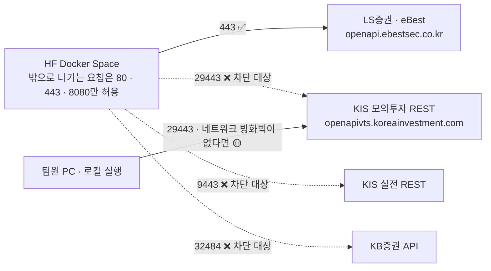
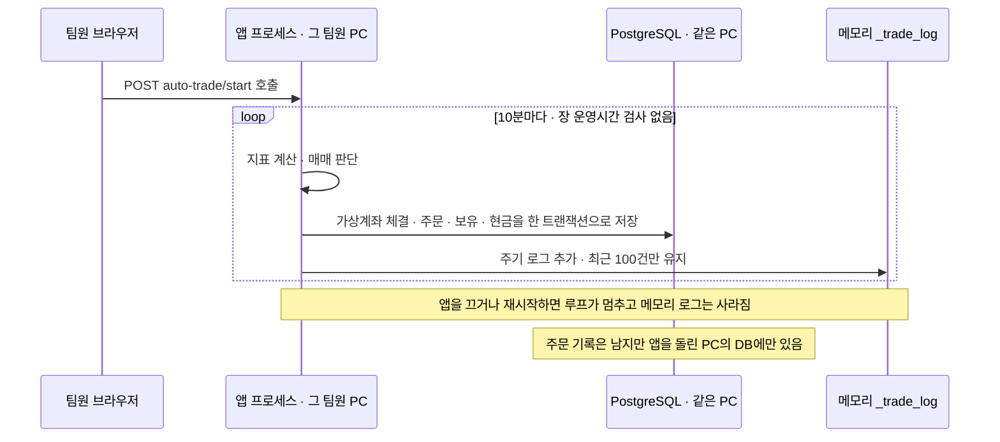
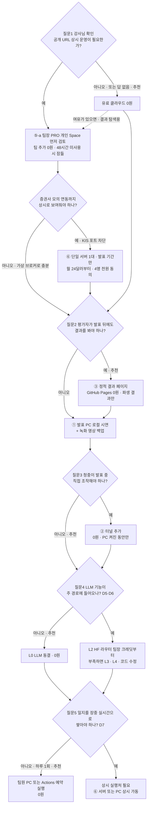
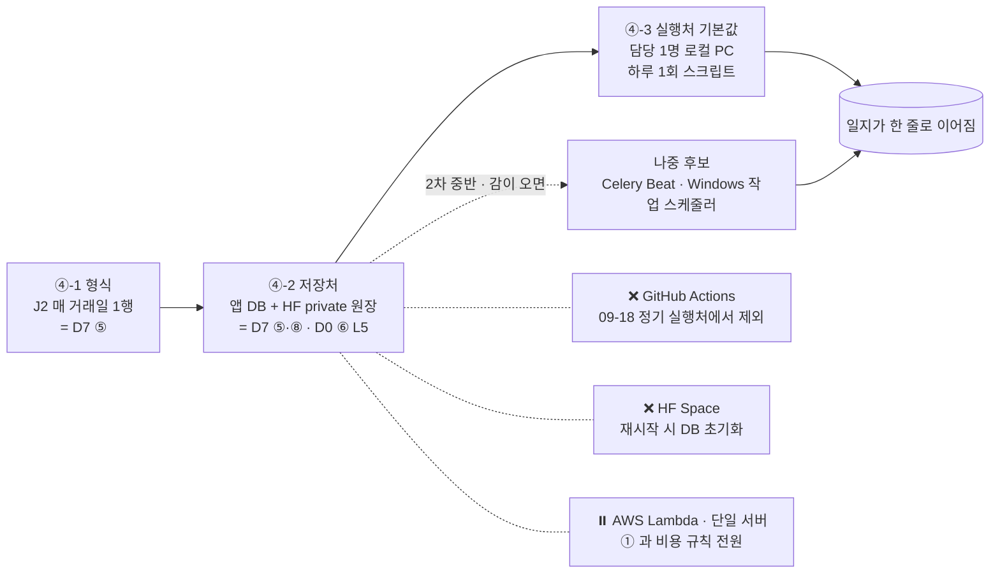
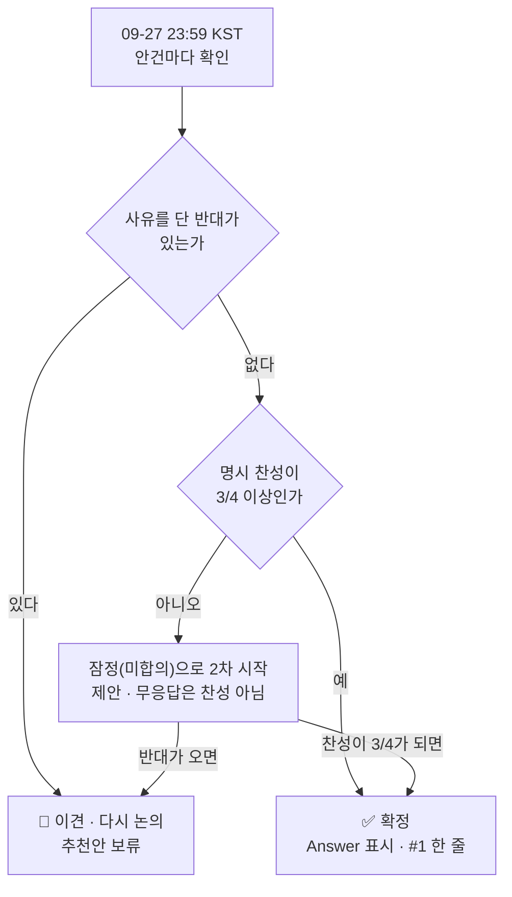
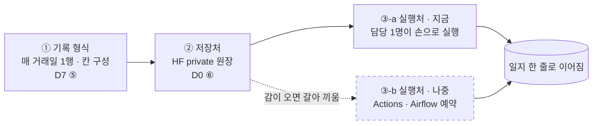

# #10 [논의] D2 유료 서비스(AWS 등)를 어디까지 쓸지와 데모 방식

> 🗂️ 옛 GitHub 논의를 옮긴 **기록 문서**입니다 — [색인](../README.md). 원문은 그대로 두고, 링크·커밋 해시만 새 자리 기준으로 바꿨습니다.

| 항목 | 내용 |
|---|---|
| 종류 | 논의 |
| 상태 | 논의 · 인프라·비용 |
| 원 작성 | 이동원(`devlee328288`) · 2026-09-15 15:05 KST |
| 댓글 | 4건 · 답글 2건 |
| 옛 주소 | `github.com/devlee328288/Qurious/discussions/10` (지금은 열리지 않음) |

## 본문

> 🟡 **결론 초안 게시 (2026-09-23)** — 팀 추가 비용 0원 · 로컬 시연 + 정적 결과 페이지 · 유료 LLM 없음 · 일지는 D7 ⑤ 와 같은 답(매 거래일 1행 · 앱 DB + HF private 원장), 실행처는 기본값만 두고 연기합니다. 확정은 **과반(3/4) 명시 찬성 + 반대 없음**인데 지금 모든 줄이 2/4 이하라, 09-27(일) 23:59 KST 까지 모이지 않으면 **잠정(미합의)** 으로 시작하자고 제안합니다. → **본문 아래 §7 결론**

> **읽는 순서**: 쉬운 요약 → 한눈에 보기 → 4. 추천안 → 3. 선택지 → 필요하면 2. 사실
> 💬 **여기서 정할 것**: 돈이 드는 서비스를 어디까지 쓸지, 발표·평가 때 무엇을 어떻게 보여줄지. 모의투자 일지의 **설계**는 D7, 동결 서비스 삭제는 D3에서 정합니다.
> 🙋 **팀원 요청**: 맨 아래 "6. 결정 방법"을 보고 논점별로 👍/👎와 이유를 댓글로 남겨 주세요. PC 사양은 A1 [#9](../issues/009.md) 댓글에 남겨 주세요(지금 0건).

## 쉬운 요약 (3줄)

1. 과제 명세는 **"상용 서비스 배포 및 운영"을 제외 범위**로 두고, 결과물은 **GitHub 공개 업로드**를 요구합니다. 그래서 추천안은 **팀 추가 비용 월 0원**입니다.
2. 데모는 **발표 PC 로컬 시연 + 정적 결과 페이지(GitHub Pages)** 를 기본으로 추천합니다. 팀장이 이미 **HF PRO를 구독 중**이라 HF Space에 앱을 띄우는 것도 추가 비용 없이 가능하지만, 48시간 미사용 시 잠들고 재시작하면 DB가 지워지며 **KIS 모의투자 API 포트가 막혀** "결과 탐색용 추가 후보"로 둡니다.
3. 유료 LLM API는 **주 경로에 LLM이 필요 없어** 쓰지 않습니다(필요해지면 팀장 PRO의 월 $2 크레딧부터 검토). 모의투자 일지는 **상시 서버 없이 장 마감 후 하루 1회 쌓이게** 설계하도록 D7에 넘깁니다.

## 한눈에 보기 — 논점별 추천안 (미확정)

| 논점 | 추천안 | 팀 추가 월 비용 | 확실도 | 추천을 바꿀 수 있는 것 |
|---|---|---|:---:|---|
| ① 유료 클라우드(AWS 등) | **쓰지 않음** | 0원 | 🟢 과제 범위 · 🟡 평가 방식 | 강사님이 "공개 URL 상시 운영"을 요구 |
| ② 데모 방식 | **로컬 시연 + 정적 결과 페이지** (+ 녹화 영상 백업) · 여유가 있으면 **팀장 PRO HF Space**를 결과 탐색용으로 추가 | 0원 | 🟢 비용·포트 제약 · 🟡 준비 부담 | 청중이 직접 조작해야 함 · 팀장 구독 종료 |
| ③ 유료 LLM API | **쓰지 않음** (LLM 기능은 동결 유지) | 0원 | 🟢 주 경로 import 0건 | D5·D6에서 LLM 기능을 주 경로에 넣음 |
| ④ 모의투자 일지 실행처 | **장 마감 후 하루 1회 기록**을 전제로 D7에서 설계 | 0원 | 🟡 | D7에서 장중 실시간 기록을 택함 |
| ⑤ KRX 원자료와 공개 범위 | **공개 페이지·저장소·Space에는 원자료를 올리지 않고 파생 결과만** | — | 🟢 약관 원문 · 🟡 파생 결과 허용 범위 | 약관 확인 결과 파생 결과도 제한 |
| ⑥ 강사님 확인 | **확인한다** — "로컬 시연 + 정적 결과 페이지로 충분한가" 1문항 | — | — | — |

## 용어 풀이

| 용어 | 뜻 |
|---|---|
| 상시 운영 | 발표 시간만이 아니라 **24시간 누구나 접속**할 수 있게 서버를 켜 두는 것 |
| 로컬 시연 | 발표자 노트북에서 앱을 띄워 화면으로 보여주는 것. 비용은 0원이지만 PC를 끄면 끝납니다. |
| 정적 결과 페이지 | 서버 계산 없이 **미리 만든 HTML·그림·표**만 보여주는 사이트(GitHub Pages). 앱을 조작할 수는 없습니다. |
| HF Space / HF PRO | Hugging Face가 앱을 대신 띄워 주는 공간 / 그 공간에 Docker 앱을 만들 수 있는 **개인 유료 플랜**(월 $9) |
| 컴퓨트 크레딧 | PRO 구독에 매달 딸려 오는 사용 금액($2). LLM API 호출이나 Space 하드웨어 업그레이드에 씁니다. |
| 포트 | 한 서버 안에서 서비스를 구분하는 번호. 웹은 보통 443이고, KIS 모의투자 API는 **29443**을 씁니다. |
| 터널 | 내 PC에서 도는 앱에 **임시 공개 주소**를 붙여 주는 도구(Cloudflare Quick Tunnel, ngrok) |
| 크레딧 (클라우드) | 클라우드 회사가 미리 주는 사용 금액. 다 쓰거나 기간이 끝나면 과금되거나 계정이 닫힙니다. |
| 토큰 | LLM API의 과금 단위. 글자를 잘게 쪼갠 조각이며, 가격은 보통 **100만 토큰당 달러**로 적습니다. |
| 무료 등급 (free tier) | 돈을 내지 않고 쓰는 등급. 한도가 작거나, 입력 내용을 서비스 개선에 쓰는 조건이 붙기도 합니다. |
| 예약 실행 | 정해진 시각에 작업을 자동으로 돌리는 것(GitHub Actions `schedule`, cron) |
| 봉인 구간 | 결과를 보기 전에 평가 기간과 판정 방법을 적어 두고, 그 기간 데이터는 마지막에 한 번만 여는 방식(1차 관행, [#3](../issues/003.md)) |
| 원자료 / 파생 결과 | 원자료는 KRX에서 받은 가격·거래량 그대로, 파생 결과는 그걸로 계산한 수익률 곡선·지표 요약·결정 기록 |
| 제3자 제공 | 받은 데이터를 **나 아닌 다른 사람이 볼 수 있게** 넘기거나 공개하는 것 |

**확실도 표시**: 🟢 코드·공식 문서 원문으로 확인 · 🟡 코드와 문서를 읽고 추론(실행이나 추가 확인 필요)

---

## 1. 배경 — 왜 지금 정해야 하나

- S1([PR #2](../pulls/002.md))에서 강사님 원본의 AWS 배포 장치를 모두 걷어냈습니다. 지금 저장소에는 **클라우드 자원도, 자동 배포도 없습니다**(A14 [#8](../issues/008.md)). 🟢
- 비용은 **팀원 자비 부담**입니다. 무엇을 유료로 쓸지 먼저 정하지 않으면 개발 중에 "일단 켜 둔" 서비스가 과금으로 이어질 수 있습니다. 강사님 원본은 AWS를 함께 쓸 때 **월 30만~150만 원+** 로 추정합니다([#4](../issues/004.md) §5). 🟢
- **팀장(이동원)이 HF PRO를 개인 비용으로 구독 중**입니다(2026-09-15 확인). 팀 데이터는 이미 HF Organization `qurious-quant`(private)에 있습니다([#3](../issues/003.md)). 그래서 HF 쪽 선택지는 "새로 돈을 내는가"가 아니라 **"이미 내는 구독을 팀이 어디까지 기대는가"** 의 문제가 됩니다.
- D1 [#7](../discussions/007.md) 추천안(미확정)의 이야기는 "규칙 → 검증 → **기록**"이고, 기록은 **모의투자 일지(새 봉인 구간)** 입니다. 일지를 매일 쌓으려면 **무엇이 매일 켜져 있어야 하는지**가 인프라 결정과 묶입니다. 🟢 [#7](../discussions/007.md) · 🟡 인프라 영향

### 1.1 착수 시 나눈 질문

| 질문 | 답하는 방법 | 이 글의 위치 |
|---|---|---|
| 과제가 배포·운영을 요구하나 | 코드(과제 문서) `docs/rfp-2.md` | 2.1 |
| 무료로 쓸 수 있는 데모 도구와 한도 | 외부 조사 — S5 [#8](../issues/008.md) §5.2 원문 재사용 | 2.2 |
| 팀장 HF PRO로 무엇이 달라지나 | 외부 조사 — HF 문서 원문 | 2.2.1 |
| HF Space에서 증권사 API를 부를 수 있나 | 코드 `app/services/brokers/` + HF·KIS 원문 | 2.2.2 |
| 단일 서버·LLM API 원문 가격 | 외부 조사 — 이번 조회 | 2.2 · 2.3 |
| 유료 LLM API로 바꿀 수 있나 | 코드 `app/lib/llm_client.py` | 2.3 |
| 모의투자 기록은 어디서·언제 쌓이나 | 코드 `app/services/auto_trade.py` | 2.4 |
| 팀원 PC가 주 경로를 감당하나 | 팀원 댓글 ([#9](../issues/009.md)) | 2.5 |
| KRX 원자료를 어디까지 공개할 수 있나 | 외부 조사 — KRX 약관 원문 | 2.6 |
| "공개 URL 상시 운영"이 평가 항목인가 | **강사님 확인 필요 (미확인)** | 3.6 |

## 2. 사실

외부 조사 조회일: **2026-09-15 KST**. 원문 문장·표 값만 옮겼습니다. 코드 기준 커밋: Qurious `04f476a`.

### 2.1 과제 명세가 요구하는 것과 제외하는 것 🟢

| 구분 | 원문 | 근거 |
|---|---|---|
| **제외 범위** | "실제 증권 계좌를 통한 실거래 자동 주문 실행" · **"상용 서비스 배포 및 운영"** · "타인 자산 운용 서비스 제공" | [rfp-2.md#L90-L94](https://github.com/EST-team-project/Qurious/blob/04f476a/docs/rfp-2.md#L90-L94) |
| 필수 산출물 | "**모의 투자 의사결정 일지**: 스크리닝 → 포트폴리오 구성 → 매매 의사결정 과정 기록" | [#L119](https://github.com/EST-team-project/Qurious/blob/04f476a/docs/rfp-2.md#L119) |
| 선택 산출물 | "대시보드: 포트폴리오 현황 및 성과 시각화 (Streamlit 또는 Dash)" · "자동화 파이프라인: 데이터 수집 → 스크리닝 → 포트폴리오 리밸런싱 자동화 스크립트" | [#L124-L125](https://github.com/EST-team-project/Qurious/blob/04f476a/docs/rfp-2.md#L124-L125) |
| 평가 기준 | 모델 성능(정확도·초과수익·MDD·Sharpe·스크리닝) + 프로세스(전처리·모델 선택·비판적 해석·의사결정 일관성). **서비스 가용성 항목은 없음** | [#L131-L146](https://github.com/EST-team-project/Qurious/blob/04f476a/docs/rfp-2.md#L131-L146) |
| 기타 | "**가상 자산(시뮬레이션)** 기반" · "데이터 출처 및 라이선스를 반드시 확인하고 준수" · "GitHub 레포지토리에 README와 함께 **공개 업로드**" | [#L186-L189](https://github.com/EST-team-project/Qurious/blob/04f476a/docs/rfp-2.md#L186-L189) |

- 명세만 보면 **공개해야 하는 것은 저장소**이고, 앱을 24시간 띄워 두라는 요구는 없습니다. 다만 발표 형식·평가 방법은 명세에 없어 **강사님 확인 전까지 추정**입니다. 🟡

### 2.2 데모·실행처 후보의 원문 한도와 가격

**무료 후보 — S5 [#8](../issues/008.md) §5.2에서 원문 확인한 값 재사용**

| 후보 | 원문 요지 | 출처 |
|---|---|---|
| GitHub Pages | 정적 사이트, 사이트 1GB 이하, 월 100GB 대역폭 소프트 한도, Free 계정은 공개 저장소 | [#8](../issues/008.md) §5.2 |
| Cloudflare Quick Tunnel | "intended for testing and development only" · 동시 200요청 · SLA 없음 | [#8](../issues/008.md) §5.2 |
| ngrok Free | 월 1GB 전송 · 월 2만 요청 · 브라우저 경고 페이지 | [#8](../issues/008.md) §5.2 |
| GitHub Actions | 공개 저장소 표준 러너 무료 · 예약 실행은 지연될 수 있고 최소 5분 간격 · 60일 무활동 시 예약 실행 자동 중지 | [#8](../issues/008.md) §5.2 |

**이번에 새로 확인한 원문**

| 후보 | 원문 | 출처 |
|---|---|---|
| **Streamlit Community Cloud** | "CPU: 0.078 cores minimum, 2 cores maximum / Memory: 690MB minimum, 2.7GBs maximum / Storage: No minimum, 50GB maximum" · "All apps without traffic for 12 hours go to sleep." (방문자가 깨울 수 있음) | [Manage your app](https://docs.streamlit.io/deploy/streamlit-community-cloud/manage-your-app) |
| **AWS Lightsail** (Linux, IPv4) | 2GB "$12 USD/mo" 2 vCPUs 60GB · 4GB "$24 USD/mo" 2 vCPUs 80GB · 8GB "$44 USD/mo" 2 vCPUs 160GB · 16GB "$84 USD/mo" 4 vCPUs 320GB | [Lightsail pricing](https://aws.amazon.com/lightsail/pricing/) |
| **AWS Free Tier** (신규 계정) | "$100 in credits immediately. As you explore key services, you can earn up to $100 more. That's up to $200 over 6 months" · "The account closes on its own 6 months after you open it or when your credits run out" · "You won't be charged unless you convert to a Paid plan" | [AWS Free Tier](https://aws.amazon.com/free/) |
| **GitHub Codespaces** (개인 Free) | "15 GB-month" 저장 · "120 hrs" 계산 시간 · 요금표 "Included usage multiplier" 2코어 = 2 → **2코어로 약 60시간/월**(원문 표에서 계산) | [Codespaces billing](https://docs.github.com/en/billing/concepts/product-billing/github-codespaces) |

#### 2.2.1 팀장 HF PRO로 달라지는 것 🟢

| 항목 | 원문 | 출처 |
|---|---|---|
| Docker Space 생성 | "Gradio and Docker Spaces run on compute and require a paid plan to create: **PRO for personal accounts, Team or Enterprise for organizations.**" | [Spaces overview](https://huggingface.co/docs/hub/spaces-overview) |
| PRO 혜택 | "Host ZeroGPU, Gradio & Docker Spaces" · "Spaces Dev Mode" · "20× included inference credits" | [HF pricing](https://huggingface.co/pricing) |
| 월 크레딧 | PRO Users "$2.00" · "All Hugging Face compute services" · "credited every month and applied automatically before any pay-as-you-go usage is billed" | [Inference Providers pricing](https://huggingface.co/docs/inference-providers/pricing) |
| 기본 하드웨어 | CPU Basic "2 vCPU · 16 GB · 50 GB · Free!" · CPU Upgrade "8 vCPU · 32 GB · $0.03"(시간당) | [Spaces GPUs](https://huggingface.co/docs/hub/spaces-gpus) |
| 잠듦 | cpu-basic은 "inactive for more than a set time (currently, 48 hours)"면 잠들고 "Anyone visiting your Space will restart it automatically." · "If you want your Space never to deactivate … you need to upgrade to paid hardware." | 같은 곳 |
| 디스크 | "The data written on disk is lost whenever your Docker Space restarts." · 영구 보관은 Storage Bucket(S3 같은 객체 저장소)을 붙임 | [Docker Spaces](https://huggingface.co/docs/hub/spaces-sdks-docker) · [Spaces storage](https://huggingface.co/docs/hub/spaces-storage) |
| 컨테이너 | 기본 공개 포트 `7860`(`app_port`로 변경) · "Internally you could have as many open ports as you want" · "The container runs with user ID 1000." | [Docker Spaces](https://huggingface.co/docs/hub/spaces-sdks-docker) |
| **밖으로 나가는 요청** | "you can make requests through the standard HTTP and HTTPS ports (80 and 443) along with port 8080. **Any requests going to other ports will be blocked.**" | [Spaces overview](https://huggingface.co/docs/hub/spaces-overview) |
| 공개 범위 | Public(코드·앱 공개) · **Protected**(코드 비공개·앱 공개, PRO 기능) · Private(코드·앱 모두 비공개, 다른 사용자는 404) | 같은 곳 |
| ZeroGPU | "Currently, ZeroGPU Spaces are exclusively compatible with the **Gradio SDK**." → 우리 FastAPI 앱(Docker)에는 해당 없음 | [ZeroGPU](https://huggingface.co/docs/hub/spaces-zerogpu) |

- **Space는 팀장 개인 계정 이름으로 만들어야** 추가 비용이 없습니다. 조직 `qurious-quant` 이름으로 만들려면 Team 플랜($20/월·인)이 필요합니다. 🟢
- **PRO 구독이 끝나면 이미 만든 Docker Space가 어떻게 되는지는 문서에서 찾지 못했습니다.** 🟡

#### 2.2.2 HF Space에서 증권사 API를 부를 수 있나



| 증권사 | 코드의 주소 | 공식 자료 | Space에서 |
|---|---|---|:---:|
| KIS 모의투자 | [kis.py#L12](https://github.com/EST-team-project/Qurious/blob/04f476a/app/services/brokers/kis.py#L12) `https://openapivts.koreainvestment.com:29443` | KIS 공식 설정 파일의 모의투자 REST 도메인도 같음([kis_devlp.yaml](https://github.com/koreainvestment/open-trading-api/blob/main/kis_devlp.yaml)) | ❌ |
| KIS 실전 | [kis.py#L11](https://github.com/EST-team-project/Qurious/blob/04f476a/app/services/brokers/kis.py#L11) `:9443` | 같은 파일 | ❌ |
| KB증권 | [kb.py#L16](https://github.com/EST-team-project/Qurious/blob/04f476a/app/services/brokers/kb.py#L16) `:32484` | (확인 안 함) | ❌ |
| LS증권(eBest) | [ebest.py#L10](https://github.com/EST-team-project/Qurious/blob/04f476a/app/services/brokers/ebest.py#L10) 포트 표기 없음 = 443 | (A8에서 확인) | ✅ |

- D1 주 경로의 **"증권사 API 설정·자동화(모의 한정)"** 는 KIS 모의투자를 전제로 한 흐름입니다([#4](../issues/004.md) §6). 그래서 **Space에서는 그 화면을 가상 브로커(`mock`)로만 보여줄 수 있습니다.** 🟢 포트 · 🟡 실제 차단은 실행으로 확인 안 함
- 브로커 계층의 나머지 분석은 **A8**에서 합니다.

### 2.3 LLM — 지금 코드가 할 수 있는 것과 API 가격

**코드** 🟢

| 사실 | 근거 |
|---|---|
| 채팅 백엔드는 `ollama`(기본)와 `vllm` 두 가지뿐 | [llm_client.py#L3-L5](https://github.com/EST-team-project/Qurious/blob/04f476a/app/lib/llm_client.py#L3-L5) · [#L73-L79](https://github.com/EST-team-project/Qurious/blob/04f476a/app/lib/llm_client.py#L73-L79) · [config.py#L29](https://github.com/EST-team-project/Qurious/blob/04f476a/app/config.py#L29) |
| `vllm` 요청에는 **인증 헤더가 없음** | [llm_client.py#L57-L58](https://github.com/EST-team-project/Qurious/blob/04f476a/app/lib/llm_client.py#L57-L58) |
| 임베딩은 어떤 백엔드를 골라도 **항상 로컬 Ollama** | [llm_client.py#L7-L9](https://github.com/EST-team-project/Qurious/blob/04f476a/app/lib/llm_client.py#L7-L9) · [#L28-L35](https://github.com/EST-team-project/Qurious/blob/04f476a/app/lib/llm_client.py#L28-L35) |
| 주 경로 라우트 파일은 LLM·Ollama를 import하지 않음 | [#9](../issues/009.md) §4 |

- 그래서 **유료 API(Claude·Gemini·OpenAI·HF 라우터)를 쓰려면 코드 수정이 필요**합니다. 키를 넣을 자리가 없고, RAG를 쓰면 임베딩 때문에 Ollama도 계속 필요합니다. 🟢 코드 · 🟡 "수정 규모"는 A10에서 확인
- HF 라우터는 OpenAI 호환 주소 `https://router.huggingface.co/v1`에 `Authorization: Bearer HF_TOKEN`을 붙이는 방식입니다(원문 예시). 지금 `vllm` 백엔드와 모양은 같고 **인증 헤더만 없습니다.** 🟢 원문·코드 · 🟡 헤더만 넣으면 되는지는 실행 확인 필요

**API 가격** (100만 토큰당 USD, 표준 등급)

| 모델 | 입력 | 출력 | 무료 조건 | 출처 |
|---|---:|---:|---|---|
| Claude Haiku 4.5 | $1 | $5 | "New users receive a small amount of free credits" | [Claude pricing](https://platform.claude.com/docs/en/about-claude/pricing) |
| Gemini 2.5 Flash-Lite | $0.10 | $0.40 | 무료 등급 "Free of charge" · 단 무료 등급은 "Used to improve our products: Yes" · "Specified rate limits are not guaranteed" | [Gemini pricing](https://ai.google.dev/gemini-api/docs/pricing) · [Rate limits](https://ai.google.dev/gemini-api/docs/rate-limits) |
| OpenAI gpt-5-nano | $0.05 | $0.40 | (확인 못 함) | [OpenAI pricing](https://developers.openai.com/api/docs/pricing) |
| **HF Inference Providers** (팀장 PRO) | 모델·제공자별 | 모델·제공자별 | PRO **월 $2.00 크레딧**(Space 하드웨어 업그레이드와 **같은 크레딧을 나눠 씀**) · 소진 후 종량제 · "no markup" | [Inference Providers pricing](https://huggingface.co/docs/inference-providers/pricing) |
| Ollama 로컬 (현재 코드) | 0 | 0 | 대신 모델 3개 약 9.9GB 디스크 | [#9](../issues/009.md) §5.2 |

**가정 계산** 🟡 — "결과 해설 1회 = 입력 2,000 · 출력 500 토큰"을 **1,000회** 호출한다고 가정(입력 200만 · 출력 50만 토큰)

| 모델 | 계산 | 합계 | 막대 (█ = $0.25) |
|---|---|---:|---|
| Claude Haiku 4.5 | 2 × $1 + 0.5 × $5 | **$4.50** | ██████████████████ |
| Gemini 2.5 Flash-Lite (유료 등급) | 2 × $0.10 + 0.5 × $0.40 | **$0.40** | █▌ |
| OpenAI gpt-5-nano | 2 × $0.05 + 0.5 × $0.40 | **$0.30** | █▏ |
| 참고: 팀장 PRO 월 크레딧 | — | $2.00 | ████████ |

- 토큰 수는 가정입니다. 실제 호출 횟수·길이·한국어 토큰화에 따라 달라집니다. HF 라우터의 모델별 단가는 확인하지 않아 계산에서 뺐습니다.

### 2.4 모의투자 기록은 지금 어디서·언제 쌓이나 🟢



| 사실 | 근거 | 확실도 |
|---|---|:---:|
| 자동매매는 **API로 켜야** 시작되고, 앱이 켜질 때 자동으로 시작하지 않음 | 호출처는 라우트 2곳 [stocks.py#L675-L678](https://github.com/EST-team-project/Qurious/blob/04f476a/app/routes/stocks.py#L675-L678) · [#L692-L696](https://github.com/EST-team-project/Qurious/blob/04f476a/app/routes/stocks.py#L692-L696), lifespan에는 없음([#9](../issues/009.md) §3.2) | 🟢 |
| **10분 주기** 반복 | [auto_trade.py#L1](https://github.com/EST-team-project/Qurious/blob/04f476a/app/services/auto_trade.py#L1) · [#L24](https://github.com/EST-team-project/Qurious/blob/04f476a/app/services/auto_trade.py#L24) · [#L359-L369](https://github.com/EST-team-project/Qurious/blob/04f476a/app/services/auto_trade.py#L359-L369) | 🟢 |
| 주기 로그는 **메모리 리스트**, 최근 100건만 | [#L21](https://github.com/EST-team-project/Qurious/blob/04f476a/app/services/auto_trade.py#L21) · [#L354-L356](https://github.com/EST-team-project/Qurious/blob/04f476a/app/services/auto_trade.py#L354-L356) | 🟢 |
| 체결은 PostgreSQL `orders`·`portfolio`·`quant_virtual_accounts`에 저장 | [#L48-L58](https://github.com/EST-team-project/Qurious/blob/04f476a/app/services/auto_trade.py#L48-L58) · [trading.py#L13](https://github.com/EST-team-project/Qurious/blob/04f476a/app/models/trading.py#L13) · [#L24](https://github.com/EST-team-project/Qurious/blob/04f476a/app/models/trading.py#L24) · [#L63](https://github.com/EST-team-project/Qurious/blob/04f476a/app/models/trading.py#L63) | 🟢 |
| 장 운영시간 검사가 없음 (`app/`의 요일 검사는 가상 브로커 [mock.py#L75](https://github.com/EST-team-project/Qurious/blob/04f476a/app/services/brokers/mock.py#L75) 1곳뿐) | 검색어 기준 | 🟡 |
| `app/`에 "일지·journal" 기능 없음 | 검색어 기준 · 화면은 A13에서 확인 | 🟡 |

- **시사점** 🟡
  - 팀원 4명이 각자 PC에서 돌리면 기록이 **4군데 DB로 갈라집니다.**
  - HF Space에서 돌리면 **재시작 때 DB가 지워지고**, KIS 모의투자 API도 막힙니다(2.2.2).
  - 지금 구조는 "앱이 켜져 있는 동안 10분마다 매매"라서, rfp-2가 요구하는 **의사결정 일지**(왜 그렇게 결정했는지의 기록)와 모양이 다릅니다. 상세는 A9(S7), 설계는 D7입니다.

### 2.5 팀원 반응 (★ 2026-09-18 KST 갱신)

| 글 | 반응 | D2에 쓰는 정보 |
|---|---|---|
| **이 논의 D2 [#10](../discussions/010.md)** | **강민석님 [09-15](../discussions/010.md#discussioncomment-18445982)** — *"전체 안건 내용에 동의합니다. 다만 **4번의 일지 실행처는 어느정도 작업이 진행된 후에 결정**하는 것으로 미루는 것이 어떨까요? 작업을 해놔야 감이 올 것 같습니다."* | ★ **④를 지금 확정하지 않습니다** (3.4절 반영) |
| D0 [#6](../discussions/006.md) 운영 방식 | 강민석·신장환 **전체 A 동의** | ⑥ HF Organization 데이터 허브 유지 |
| D1 [#7](../discussions/007.md) 방향성 (주 경로) | 강민석 **B · P2 · S3** (④는 미확정) | 주 경로는 추천안 기준으로 씀 |
| A1 [#9](../issues/009.md) "팀원 확인" (PC 에디션·RAM·디스크·Docker, 꼭 돌려 볼 동결 기능) | 0건 | **팀원 PC가 주 경로 최소 구성을 돌릴 수 있는지 아직 모름** |

- 주 경로 최소 구성은 PostgreSQL·Redis·앱(`LEAN_MODE=local`)이고 기반 이미지 약 0.2GB입니다. LEAN 14.05GB와 Ollama 모델 9.9GB는 선택·동결입니다([#9](../issues/009.md) §5). 🟢

### 2.6 KRX 원자료 — 공개할 수 있는 범위

| 약관 | 원문 | 출처 |
|---|---|---|
| KRX 정보데이터시스템 홈페이지 이용약관 제12조 ② | "이용자는 당 사이트의 정보를 거래소의 사전 허락 없이 복사·복제·배포·전송·공중송신하여서는 아니 됩니다." | [홈페이지 이용약관](https://data.krx.co.kr/contents/MDC/INFO/informationController/MDCINFO003.cmd) |
| KRX OPEN API 이용약관 **제12조 ②** ★ | "API 이용자는 한국거래소로부터 제공받은 정보를 제3자에게 제공할 수 없다." ⚠️ **2026-09-18 정정: 조항 번호가 제11조② → 제12조② 로 밀렸습니다**(시행 2026-08-29 개정). 1차 `Alpha_Stack/scripts/upload_to_hf.py` 주석도 옛 번호(제11조②)를 쓰고 있어 같이 고쳐야 합니다 | [OPEN API 이용약관](https://openapi.krx.co.kr/contents/OPP/INFO/OPPINFO002.jsp) |
| KRX OPEN API 이용약관 제6조 ② | "API 서비스를 비상업적인 목적으로만 이용할 수 있으며" · "API 서비스를 이용한 결과에 대한 대가를 제3자에게 청구해서는 아니된다." | 같은 곳 |

- 1차는 원자료를 **HF Organization `qurious-quant`(private)** 에 두고 공개 저장소에는 반출 스크립트만 남겼습니다([#3](../issues/003.md) ①). 🟢
- ★ **2026-09-18 — 그 방식의 전제가 흔들렸습니다.** 1차 코드는 *"private 이고 조직 멤버 밖으로 안 나가면 제3자 제공이 아니다"* 로 읽었는데, [#25](../issues/025.md) 약관 정독은 *"팀원도 각자 키를 받은 별개의 이용자이므로 제3자"* 로 읽습니다. **법률 판단은 제가 할 수 없습니다.** → [D0 #6 ⑥-0~⑥-6](../discussions/006.md)에 **어느 해석이든 무너지지 않는 설계**(원자료 대신 **날짜별 SHA-256 매니페스트**만 공유 · 스위치 한 줄)를 올렸습니다. 🟡
- **정적 페이지·Actions 커밋·Streamlit 앱·공개 HF Space에 원자료 표를 올리면 위 조항에 걸립니다.** 수익률 곡선·지표 요약 같은 파생 결과가 "정보 제공"에 해당하는지는 원문만으로 판단할 수 없습니다. 🟡

## 3. 선택지

### 3.1 데모 방식 비교표

| # | 방식 | 팀 추가 월 비용 | 상시 접속 | 앱 직접 조작 | 내 PC를 꺼도 됨 | 준비 부담 🟡 | 핵심 제약 |
|---|---|---|:---:|:---:|:---:|---|---|
| ① | 발표 PC **로컬 시연** | 0원 | ❌ | ✅ | ❌ | 낮음 | 발표장 PC·네트워크 의존. 평가자가 나중에 다시 볼 수 없음 |
| ② | 로컬 + **터널** (Quick Tunnel · ngrok) | 0원 | ❌ PC 켜진 동안 | ✅ | ❌ | 낮음 | Quick Tunnel은 테스트 용도·SLA 없음 / ngrok은 월 2만 요청·경고 페이지 |
| ③ | **정적 결과 페이지** (GitHub Pages) | 0원 | ✅ | ❌ 읽기 전용 | ✅ | 중간 — 결과를 HTML·그림으로 내보내는 작업 | 원자료는 올리지 않음(2.6) |
| ④ | **Streamlit Community Cloud** 결과 대시보드 | 0원 | 🔸 12시간 무트래픽 시 잠듦 · 방문자가 깨움 | 🔸 결과 탐색만 | ✅ | 중간 — 별도 앱 작성 | 메모리 최대 2.7GB. rfp-2 **선택** 산출물(대시보드)과 겹침 |
| ⑤-a | **HF Docker Space · 팀장 개인 계정** (PRO 구독 중) | **0원** (팀장 구독료 $9는 이미 지출) | 🔸 48시간 미사용 시 잠듦 · 방문자가 깨움 | ✅ 단 증권사는 가상 브로커만 | ✅ | 높음 — 컨테이너 1개에 PostgreSQL·Redis를 넣고 사용자 ID 1000·포트 7860에 맞춤 🟡 | **재시작 시 DB 초기화** · **KIS 모의 API 포트 차단**(2.2.2) · 팀장 구독에 의존 |
| ⑤-b | HF Docker Space · 조직 `qurious-quant` | $80/월 (Team 4명) | 🔸 ⑤-a와 같음 | ✅ | ✅ | ⑤-a와 같음 | ⑤-a 제약 + 비용 |
| ⑥ | **단일 클라우드 서버** (Lightsail) | $24/월 (4GB) ~ $44/월 (8GB) | ✅ | ✅ | ✅ | 높음 — 서버 보안·업데이트·비밀값 관리 | 자비. KIND가 AWS IP를 차단한다는 강사님 기록([#8](../issues/008.md) §6-6) 🟡 |
| ⑦ | 강사님 원본식 AWS 다중 서비스 | 강사님 추정 30만~150만 원+ | ✅ | ✅ | ✅ | 매우 높음 — Terraform 자원 110개([#8](../issues/008.md)) | S1에서 걷어냄. "상용 서비스 운영"에 가장 가까운 구성 🟡 |

- ⑥·⑦이 제외 범위("**상용** 서비스 배포 및 운영")에 걸리는지는 해석이 필요합니다. 평가용 데모 서버는 상용 서비스가 아니라고 볼 수도 있습니다. 🟡
- ⑤-a를 **Protected**로 두면 코드는 비공개, 앱은 공개입니다(PRO 기능). 다만 Qurious 저장소가 이미 공개라 코드 숨김의 의미는 작습니다. 🟡

### 3.2 비용 시나리오 — 팀 추가 월 USD (원문 가격만)

| 시나리오 | 구성 | 팀 추가 월 비용 | 막대 (█ = $4) | 근거 |
|---|---|---:|---|---|
| **A 추천안** | ① 로컬 시연 + ③ 정적 결과 페이지 (+ 필요 시 ② 터널) | **$0** | ▏ | [#8](../issues/008.md) §5.2 |
| B | A + ④ Streamlit 결과 대시보드 | $0 | ▏ | Streamlit |
| C | A + ⑤-a 팀장 PRO 개인 Space (CPU Basic) | $0 | ▏ (팀장 기존 구독 $9 별도) | HF |
| C+ | ⑤-a를 **잠들지 않게** CPU Upgrade로 30일 가동 (계산) | $19.60 = $0.03 × 720시간 − PRO 크레딧 $2 | ████▉ | HF · 🟡 계산 |
| D | ⑥ Lightsail 4GB 1대 | $24 | ██████ | Lightsail |
| E | ⑥ Lightsail 8GB 1대 (여유를 둘 때) | $44 | ███████████ | Lightsail |
| F | ⑤-b HF Team · 조직 4명 | $80 | ████████████████████ | [#8](../issues/008.md) §5.2 ($20 × 4) |

- **빠진 항목**: 환율 미적용(USD 그대로), 세금·도메인·데이터 전송 초과분·Storage Bucket 요금 제외. ⑦ 강사님 추정(월 30만~150만 원+)은 **원화이고 계산 근거가 없어** 막대에 넣지 않았습니다.
- C+의 PRO 크레딧 $2는 LLM 호출(2.3)과 **같은 주머니**라, 둘 다 쓰면 차감액이 줄어듭니다. 🟢 원문
- D·E는 AWS Free Tier 크레딧($100~$200)으로 **최대 6개월 0원**일 수 있지만, 크레딧이 떨어지거나 6개월이 지나면 **계정이 닫힙니다**(Paid 전환 시 과금). 🟢 원문 · 🟡 발표일 적용
- 주 경로 최소 구성이 4GB 서버나 CPU Basic(16GB)에서 충분한지는 **실행 측정을 하지 않아 모릅니다.** 🟡

### 3.3 유료 LLM API

| # | 선택지 | 팀 추가 월 비용 | 장점 | 단점 |
|---|---|---|---|---|
| L0 | **LLM 동결 유지** (주 경로에 LLM 없음) | 0원 | 비용·코드 수정 0. [#9](../issues/009.md) 동결 판정과 같음 | 3차 "코드 생성·결과 해설" 같은 기능을 못 보여줌 |
| L1 | Ollama 로컬 (현재 코드) | 0원 | 데이터가 밖으로 안 나감 | 모델 9.9GB·팀원 PC 부담([#9](../issues/009.md)). 품질 미측정 |
| L2 | **HF 라우터 + 팀장 PRO 월 $2 크레딧** | 0원 (크레딧 안에서) | 새 가입·결제 없음 · OpenAI 호환 | 인증 헤더 추가 필요 · 크레딧을 Space 하드웨어와 나눠 씀 · 모델 단가 미확인 |
| L3 | 무료 등급 API (예: Gemini 2.5 Flash-Lite) | 0원 | 로컬 부담 없음 | **입력이 제품 개선에 쓰임** · 한도 보장 없음 · 코드 수정 필요 |
| L4 | 저가 유료 API (Haiku 4.5 · gpt-5-nano 등) + **월 상한** | 사용량 비례 (가정 계산 $0.30~$4.50 / 1,000회) | 한도·품질 안정 | 자비·키 관리·코드 수정 필요 |

### 3.4 모의투자 일지 실행처 (설계는 D7)

> ★ **2026-09-18 — 이 안건(④)의 확정을 미룹니다.** 강민석님이 *"어느정도 작업이 진행된 후에 결정하는 것으로 미루는 것이 어떨까요? 작업을 해놔야 감이 올 것 같습니다"* 라고 하셨고, **동의합니다.** 아래 표는 **후보 목록**으로만 두고, 09-22 수집기가 한 바퀴 돈 뒤에 정합니다.
>
> ⚠️ 다만 **KIS 약관 제5조③**(시세를 *"개인의 업무에 한하여"* 이용 · 제3자 제공 금지)과 **제9조①4**(서버 부하 시 이용 중지) 때문에, 어느 실행처를 고르든 **키는 각자 것을 쓰고 대량 수집은 KIS 로 하지 않습니다** ([#33 6.1](../issues/033.md)).

| 실행처 | 팀 추가 월 비용 | 장중 실시간 | 장 마감 후 하루 1회 | 기록이 한 곳에 모이나 | 제약 |
|---|---|:---:|:---:|:---:|---|
| 담당 팀원 1명 PC | 0원 | 🔸 PC 켜진 동안 | ✅ | ✅ | 담당자 부재·PC 꺼짐 = 기록 공백 |
| 팀원 각자 PC | 0원 | 🔸 | ✅ | ❌ 4곳으로 갈라짐 | 합치는 규칙 필요 |
| ~~GitHub Actions 예약 실행~~ 🔴 | 0원 | ❌ 지연 가능 | ✅ | ✅ | 🔴 **2026-09-18 — 정기 수집처로는 제외.** GitHub 약관이 *"소프트웨어 프로젝트와 무관한 활동"* 을 금지하고 AUP 가 *excessive automated bulk activity* 를 금지합니다. `schedule` 은 정각 부하 시 **드롭**되고 60일 무활동이면 비활성화됩니다. **테스트 실행에만** 씁니다 ([#33 댓글](../issues/033.md)) |
| **APScheduler (로컬)** ★ 1단계 | 0원 | ✅ | ✅ | 🔸 로컬 | **09-22 가동 목표**. 강사님 th03 선례 |
| **Lambda + EventBridge** ★ 2단계 | 0원 (영구 무료 범위) | ✅ | ✅ | ✅ | 강사님 th08 선례. PC 꺼져도 돎 |
| ⑤-a 팀장 PRO HF Space | 0원 | 🔸 깨어 있는 동안 | 🔸 | ❌ 재시작 시 DB 초기화 | **KIS 모의 API 포트 차단** → 가상 브로커 기록만 가능 · 영구 보관은 별도 저장소 필요 |
| ⑥ 단일 클라우드 서버 | $24/월~ | ✅ | ✅ | ✅ | 자비·운영 부담 |

### 3.5 KRX 원자료와 공개 범위

| 선택지 | 공개하는 것 | 약관 위험 |
|---|---|---|
| K1 | **파생 결과만** (수익률 곡선·지표 요약·결정 기록) · 원자료는 HF private | 🟡 파생 결과 허용 범위 미확인 |
| K2 | 원자료 표까지 공개 | ❌ 제12조 ②·제11조 ②에 걸림 🟢 |
| K3 | 공개 페이지 없이 발표에서만 보여줌 | 가장 낮음. 대신 평가자가 나중에 볼 수 없음 |

### 3.6 강사님 확인

| 선택지 | 장점 | 단점 |
|---|---|---|
| **확인한다** — 한 문항: "2차 발표에서 공개 URL을 상시로 띄워야 하나요, 로컬 시연 + 정적 결과 페이지(GitHub)로 충분한가요?" | 비용 결정이 추측에서 사실로 바뀜 | 답을 기다리는 시간 |
| 확인하지 않는다 | 바로 진행 | 발표 직전에 요구가 드러나면 서버 준비가 급해짐 |

## 4. 추천안 (미확정)

**결정 흐름도** — 위에서부터 차례로 답하면 추천안이 나옵니다.



| 논점 | 추천 | 이유 |
|---|---|---|
| ① 유료 클라우드 | **쓰지 않음** (시나리오 A, 팀 추가 월 $0) | 명세에 서비스 가용성 평가 항목이 없음(2.1) · 자비 부담 · "넓게 대신 깊게"(D1)에 맞춰 운영보다 검증에 시간을 씀 |
| ② 데모 | **① 로컬 시연 + ③ 정적 결과 페이지** · 녹화 영상 백업. **⑤-a 팀장 PRO Space는 주 경로가 로컬에서 한 바퀴 돈 뒤, 여유가 있으면 결과 탐색용으로 추가** | ③은 팀장 구독이 끝나도 남음. ⑤-a는 추가 비용이 없지만 준비 부담이 크고 DB 초기화·KIS 포트 차단 때문에 증권사 모의 연동은 못 보여줌(2.2.2). ②는 청중 조작이 필요할 때만. ④ Streamlit은 D3에서 선택 산출물 대시보드를 만들기로 하면 함께 검토 |
| ③ 유료 LLM API | **L0 동결 유지** | 주 경로 라우트가 LLM을 쓰지 않음([#9](../issues/009.md)). 필요해지면 새 결제 없이 L2(팀장 PRO 크레딧)부터 봄. 어느 쪽이든 코드 수정 필요(2.3) |
| ④ 일지 실행처 | **"장 마감 후 하루 1회, 상시 서버 없이 쌓인다"를 D7 설계 조건으로 넘김** | 지금 코드(10분 루프·메모리 로그·PC별 DB)는 일지로 쓰기 어려움(2.4). HF Space는 재시작 시 DB 초기화라 일지 저장처로 맞지 않음 |
| ⑤ 공개 범위 | **K1 파생 결과만 공개 · 원자료는 HF private** | 1차 관행([#3](../issues/003.md))과 같음. Space를 띄워도 같은 원칙. 파생 결과 허용 범위는 한계에 적고 확인 |
| ⑥ 강사님 확인 | **확인한다** (한 문항) | 추천안 ①이 이 답에 달려 있음 |

## 5. 결정 기준

| # | 기준 | 질문 |
|---:|---|---|
| 1 | 과제 범위 | rfp-2의 필수 산출물을 채우고 제외 범위를 피하나? |
| 2 | **비용** | 팀 추가 비용은 기본 월 0원. **돈이 드는 선택은 내는 사람을 포함해 4명 전원이 명시 동의**했나? (자비 부담) |
| 3 | 개인 구독 의존 | 팀장 PRO처럼 **한 사람이 이미 내는 구독**에 기댈 때, 그 사람이 동의했고 **발표일까지 유지**하나? 끊겨도 남는 대안(③)이 있나? |
| 4 | 평가자 접근 | 발표가 끝난 뒤에도 평가자가 결과를 확인할 수 있나? |
| 5 | 깊이 | 준비 작업이 주 경로 개발 시간을 잠식하지 않나? (D1 "넓게 대신 깊게") |
| 6 | 데이터 약관 | KRX·Yahoo 등 원자료를 공개 위치에 올리지 않나? |

## 6. 결정 방법 · 기한 · 담당자

- **분류**: `infra-cost` (인프라·유료 서비스 비용)
- **기한**: **2026-09-27(일) 23:59 KST** — 2차 프로젝트 시작일이 2026-09-27로 바뀌어(2026-09-15 확인), 개발을 시작하기 전에 정합니다.
- **담당자**: 이동원 `@devlee328288` (결론 댓글 작성 · 강사님 확인 요청)
- **방법**: 논점 ①~⑥마다 댓글로 👍/👎와 이유를 남깁니다.
  - 팀 추가 비용이 0원인 항목은 **과반 찬성 + 반대 없음**이면 확정합니다.
  - **팀 추가 비용이 드는 항목**(⑤-b·⑥·C+·L4 등)으로 바꾸려면 **4명 전원 명시 찬성**이 필요합니다.
- 강사님 답이 기한 안에 없으면 ①은 "0원"으로 두고, 답이 오는 대로 뒤집을 조건 1을 적용합니다.

## 7. 결론 — 초안 (2026-09-23)

> ~~결정 후 댓글로 남기고 Answer로 표시합니다.~~ 🔴 **2026-09-18 운영 규칙이 바뀌었습니다** — 결론은 이 절(본문)에 쓰고 댓글에는 요약만 남깁니다. **Answer 표시**와 **인덱스 [#1](../issues/001.md) "결정 요약" 한 줄 추가**는 확정된 안건부터 그대로 합니다(7.7 파생 작업 14).

### 7.0 쉬운 요약 (3줄)

1. **돈이 드는 서비스는 쓰지 않습니다**(팀 추가 월 0원). 발표는 **노트북 시연 + 결과만 보여주는 공개 웹페이지(GitHub Pages) + 녹화 영상**으로 하고, 유료 AI(LLM) API도 쓰지 않습니다.
2. **모의투자 일지**는 D7과 같은 답으로 정합니다 — **매 거래일 1행**을 **앱 DB + 팀 비공개 HF 저장소**에 쌓습니다. 일지를 돌리는 컴퓨터는 **일단 담당 1명 PC**로 두고, 자동화는 2차 중반에 정합니다.
3. **4명 중 3명이 분명히 찬성하고 반대가 없어야** 확정됩니다. 지금은 모든 줄이 **2명 이하(동원·민석)** 입니다. 기한(09-27)까지 안 모인 줄은 "잠정(미합의)"로 시작하자고 **제안**합니다.

### 7.1 상태표

범례 — **제안** = 제안자(이동원, 찬성으로 셈) · **✅ X (MM-DD)** = 명시 찬성 · **✅ᶜ** = 조건부 찬성(조건에 제안자가 답함 · 투표자 재확인 없음 · n/4 에 넣지 않고 "+ ✅ᶜ n" 으로 따로 적음) · **💬** = 이 논의 안건을 향한 말이지만 선택지를 고르지 않음(세지 않음) · **—** = 이 논의에서 발언 없음 · **🔴** = 반대. **n/4 는 제안과 ✅ 만 센 값입니다.**

<!-- 결론표:시작 -->
| 안건 | 결론(초안) | 이동원 | 강민석 | 신장환 | 오준영 | 확정 규칙 | 상태 |
|---|---|:-:|:-:|:-:|:-:|---|---|
| ① 유료 클라우드 | 쓰지 않음 — 팀 추가 월 0원 (AWS·Lightsail·HF Team 없음) | 제안 | ✅ 추천안 (09-15) | — | — | 과반 3/4 + 반대 0 (§6) | ⏳ 과반 대기 2/4 · 강사님 답이 없어도 0원 유지(§6) |
| ② 데모 방식 | 발표 PC 로컬 시연 + 정적 결과 페이지(GitHub Pages) + 녹화 영상 백업 · HF Space는 주 경로 뒤 선택 | 제안 | ✅ 추천안 (09-15) | — | — | 과반 3/4 + 반대 0 (§6) | ⏳ 과반 대기 2/4 |
| ③ 유료 LLM API | 쓰지 않음 — L0 LLM 동결 유지 | 제안 | ✅ 추천안 (09-15) | — | — | 과반 3/4 + 반대 0 (§6) | ⏳ 과반 대기 2/4 |
| ④-1 일지 형식 | D7 ⑤ 와 같은 답 — J2 매 거래일 1행 · 장 마감 뒤 하루 1회 · 추가만 하는 기록 | 제안 | ✅ᶜ J2 (09-21 · D7 ⑤) | — | — | 과반 3/4 + 반대 0 (§6) | ⏳ 과반 대기 1/4 + ✅ᶜ 1 · D7 ⑤ 와 연동 |
| ④-2 일지 저장처 | D7 ⑤·⑧ · D0 ⑥ L5 와 같은 답 — 앱 DB(화면용) + HF private 원장 `qurious-paper-log`(보관용) | 제안 | ✅ 추천안 (09-21 · D7 ⑧) | — | — | 과반 3/4 + 반대 0 (§6) | ⏳ 과반 대기 2/4 · D7 ⑤ 와 연동 |
| ④-3 일지 실행처 | 기본값 = 담당 1명 로컬 PC · 장 마감 뒤 하루 1회 스크립트 · 자동화는 2차 중반에 정함 | 제안 | ✅ 기본값+연기 (09-21) | — | — | 과반 3/4 + 반대 0 (§6) | ⏸️ 연기 — 기본값만 둠 · 연기에 명시 찬성 2/4 |
| ⑤ 공개 범위 | K1 — 공개 위치(Pages·저장소·Space)에는 원자료 0 · 전략 수준 성과 요약(수익률 곡선·MDD 등)만 · 종목별 순위·z점수 같은 L2 는 D0 ⑥-1 L2 결론(강사님 ④) 전까지 공개하지 않음 · 원자료는 HF private | 제안 | ✅ 추천안 (09-15) | — | — | 과반 3/4 + 반대 0 (§6) | ⏳ 과반 대기 2/4 · 민석 찬성은 2.6 근거 갱신(09-18 20:05) 전 · 강사님 ③④ 답에 걸림 |
| ⑥ 강사님 확인 | 확인한다 — 따로 묻지 않고 결정 대장 목록(⑥ 신설)에 모아서 한 번에 | 제안 | ✅ 추천안 (09-15) | — | — | 과반 3/4 + 반대 0 (§6) | ⏳ 과반 대기 2/4 |
<!-- 결론표:끝 -->

```
명시 찬성 (█ = 1명 · 과반선 = 3)          조회 09-23 11:40 KST
① 유료 클라우드    ██░░  2/4
② 데모 방식        ██░░  2/4
③ 유료 LLM         ██░░  2/4
④-1 일지 형식      █░░░  1/4 + ✅ᶜ 1
④-2 일지 저장처    ██░░  2/4
④-3 일지 실행처    ██░░  2/4   (연기에 대한 찬성)
⑤ 공개 범위        ██░░  2/4
⑥ 강사님 확인      ██░░  2/4
반대 0건 · 오준영님 전 논의 발언 0건 · 신장환님 D2 스레드 발언 0건
```

### 7.2 확정 규칙 — 이 논의 §6 원문 그대로

> - **방법**: 논점 ①~⑥마다 댓글로 👍/👎와 이유를 남깁니다.
>   - 팀 추가 비용이 0원인 항목은 **과반 찬성 + 반대 없음**이면 확정합니다.
>   - **팀 추가 비용이 드는 항목**(⑤-b·⑥·C+·L4 등)으로 바꾸려면 **4명 전원 명시 찬성**이 필요합니다.
> - 강사님 답이 기한 안에 없으면 ①은 "0원"으로 두고, 답이 오는 대로 뒤집을 조건 1을 적용합니다.

기한은 **2026-09-27(일) 23:59 KST**(§6)입니다.

- 이 초안의 여덟 줄은 **전부 팀 추가 비용 0원**이라 첫째 규칙(과반 = 4명 중 3명 + 반대 없음)만 씁니다. 🟢
- 이 규칙은 D0 [#6](../discussions/006.md) ②의 "72시간" 규칙에 **기대지 않습니다.** 확정 판정 시각은 09-26 18:00이 아니라 **기한 09-27 23:59** 입니다. 🟢
- 🟡 다만 D0 ② 추천안 A 원문은 *"단, D1 목표·D2 비용·⑤ 역할은 4명 전원이 명시적으로 찬성"* 입니다. "D2 비용"을 **돈이 드는 선택**으로 읽으면 §6 둘째 규칙과 같고(D7 [#13](../discussions/013.md) §5 기준 5도 *"드는 선택은 4명 전원이 동의했나? (D0 ② · D2)"*), **D2 전체**로 읽으면 0원 항목도 전원 찬성이 필요합니다. D0 ② 자체가 **3/4로 미확정**이라 이 초안은 §6 원문으로만 셉니다.

**용어 풀이**

**과반 찬성 + 반대 없음**
- 뜻: 4명 중 3명 이상이 분명히 찬성하고, 사유를 단 반대가 한 건도 없는 상태입니다.
- 이 문서에서: 여덟 줄 전부의 확정 조건입니다. 제안자 1명에 2명이 더 필요합니다.
- 헷갈리는 점: **답이 없는 사람을 찬성으로 세지 않습니다.** "반대 0"과 "찬성 3"은 따로 채워야 합니다.

**교차 스레드 투표**
- 뜻: 다른 논의에서 고른 선택지가 이 논의의 같은 내용을 담고 있을 때, 출처를 달아 이쪽에도 세는 것입니다.
- 이 문서에서: ④-1·④-2 의 민석님 표(D7 [#13](../discussions/013.md) ⑤·⑧).
- 헷갈리는 점: 취지만 닮은 말은 세지 않습니다(💬). 고른 선택지 **원문에 이 안건 내용이 글자로 있을 때만** 셉니다.

**실행처 · 저장처 · 원장**
- 뜻: 실행처 = 일지 코드를 **돌리는 컴퓨터**, 저장처 = 기록이 **쌓이는 곳**, 원장(ledger) = 고치지 않고 **추가만 하는** 기록 묶음입니다.
- 이 문서에서: 실행처는 나중에 바꿔도 되지만 형식·저장처는 먼저 정해야 기록이 이어집니다(09-17 답글 1절).
- 헷갈리는 점: "로컬 PC에서 돈다"(실행처)와 "로컬 PC에만 남는다"(저장처)는 다릅니다. 여기서 로컬은 앞의 것뿐입니다.

### 7.3 안건별 근거 — 누가 언제 무엇을 말했나 (교차 스레드 포함)

| 안건 | 명시 찬성 | 반대 | 무응답 | 출처 · 투표 뒤 본문이 바뀌었나 |
|---|:-:|:-:|:-:|---|
| ①②③⑥ | 2 (동원 제안 · 민석) | 0 | 2 (장환·준영) | 민석 [09-15 16:47](../discussions/010.md#discussioncomment-18445982) *"전체 안건 내용에 동의합니다. 다만 4번의 일지 실행처는 …미루는 것이 어떨까요?"* — ④를 뺀 전체 찬성 🟢. 투표 뒤 본문 수정(09-18 20:05)은 2.5·2.6·3.4만 바꿨고 ①②③⑥ 문구는 그대로 🟡(수정 댓글의 변경 목록 기준) |
| ⑤ | 2 | 0 | 2 | 같은 09-15 찬성. **투표 09-15 16:47 · 2.6 근거 갱신 09-18 20:05** → K1 문구는 그대로지만 **근거 갱신 전 찬성**. 민석님은 뒤에 [#6](../discussions/006.md)에서 *"팀 프로젝트를 private 내에서 진행하기 때문에 팀원이 제 3자가 아니고, …"*(09-21 14:33) — 교차 💬, 새 표로 세지 않음. 장환님 [#6](../discussions/006.md) "전체 A"는 "공개 저장소에는 스크립트만"이 K1과 겹치나 "파생 결과 공개"는 없어 💬 🟡 |
| ④-1 | 1 + ✅ᶜ 1 | 0 | 2 | 민석 [#13](../discussions/013.md) 09-21 15:26 *"5-J1 … 다만 매매가 없는 이유를 자동화로 구현이 가능하다면 (예: 지표 no signal, 어드바이저 no signal로 관망) J2에 동의합니다"* → 조건 답: 동원 09-21 16:05("자동입니다" — 🔴 09-23 D7 §7 에서 '설계 · 구현 전'으로 정정) → **민석님 재확인 없음**(17:18 답글은 ⑥-1 비용 4수준). 같은 답글의 *"4-R2"*(매 거래일 1회 기록)는 무조건 찬성 🟢 |
| ④-2 | 2 | 0 | 2 (장환·준영) | 민석 [#13](../discussions/013.md) 09-21 15:26 *"8-추천안 동의"* — D7 ⑧ 추천안 = 담당 1명 PC + **HF private 원장**, 저장처에는 조건이 없었음 🟢 (D7 결론표는 저장처를 ⑤ 행에 함께 적어 ✅ᶜ 로 보입니다). 장환 [#6](../discussions/006.md) 09-18 15:08 *"전체 A 동의합니다!"* — D0 ⑥ A 원문에 *"모의투자 로그도 private dataset에 쌓습니다"* 가 있으나 **D2 선택지를 고른 발언이 아니라 세지 않음**(투표 09-18 15:08 · ⑥ 재작성 19:48) 🟡 |
| ④-3 | 2 | 0 | 2 | 민석 09-21 14:48 *"형식·저장처는 09-27에 정하고, 실행처는 기본값만 두고 미루기에 동의합니다"* — 09-17 답글 4절 제안에 대한 직접 답. 그 뒤 본문 변경 없음 🟢 |

```
09-15 16:47  민석  #10 전체 동의 · ④ 실행처는 미루자
09-17 18:06  동원  ④ = 형식·저장처·실행처로 나눠 역제안
09-18 15:08  장환  #6 "전체 A" (⑥ A = 로그도 HF private)
09-18 19:48  동원  #6 ⑥ 재작성 (원자료 스위치 · L5 는 그대로)
09-18 20:05  동원  #10 본문 수정 (2.5 · 2.6 · 3.4)
09-21 14:33  민석  #6 팀원은 제3자 아님 · 필요하면 여쭙자 💬
09-21 14:48  민석  #10 형식·저장처 09-27 · 실행처 연기 동의
09-21 15:26  민석  #13 ④ R2 · ⑤ 조건부 J2 · ⑧ 추천안
09-21 16:05  동원  #13 "자동입니다" (⑤ 조건에 답)
09-23 오늘   이 결론 초안
09-27 23:59  기한 — 과반 + 반대 없음이면 확정
```

### 7.4 ④ 일지 — 09-27에 정하기로 한 "형식·저장처"의 초안입니다

원래 ④("장 마감 후 하루 1회 기록을 전제로 D7에서 설계")는 09-17 역제안과 09-21 민석님 답으로 **셋으로 나뉘었습니다.** 형식·저장처는 **D7 [#13](../discussions/013.md) ⑤·⑧, D0 [#6](../discussions/006.md) ⑥-1 L5와 같은 답**이어야 해서 새 안 없이 그 답을 옮깁니다.

> 일지 형식·저장처는 D7 [#13](../discussions/013.md) ⑤ 와 D2 [#10](../discussions/010.md) ④ 가 같은 내용을 서로 다른 규칙(72시간 / 과반)으로 셉니다. **둘 다 확정돼야 "확정"으로 적고, 한쪽만 확정이면 "잠정"입니다**(더 엄격한 쪽을 따릅니다). 내용은 D7 ⑤ 를 따르고, D7 ⑤ 가 바뀌면 D2 ④ 도 함께 바뀝니다.



| 줄 | 결정(초안) | 같은 답이어야 하는 곳 | 확실도 |
|---|---|---|:-:|
| ④-1 형식 | 매 거래일 1행(매매가 없어도 "관망" 행 · 이유는 실행기가 자동으로 씀) · 칸은 D7 3.5 그대로(체결가는 하루 뒤 채움 · 사람 해석 주 1회) | D7 ⑤ J2 · 3.5 · 2.6.2 | 🟢 · 🟡 칸은 D5·D6이 더할 수 있음 |
| ④-2 저장처 | 앱 DB(화면·봉인 전용 사용자 장부) + HF Organization `qurious-quant` **private** 원장 `qurious-paper-log` · 추가만 | D7 ⑤·⑧ · D0 ⑥-1 L5 · ⑥-3 | 🟢 |
| ④-3 실행처 | 기본값 = 담당 1명 로컬 PC · 자동화는 2차 중반 · **조건: 실행처를 바꿔도 형식·저장처는 바꾸지 않는다**(09-17 답글 4절) | D7 ⑧ "담당 1명 PC" | 🟢 민석님 동의 문장 · 🟡 담당자 미정 |

- 🟡 **실행처는 두 DB에 모두 닿아야 합니다.** 체결가는 수집기 SQLite에, 장부는 앱 DB에 있는데 둘은 안 이어져 있고([ERD_v1.0.md#L32-L68](https://github.com/EST-team-project/Qurious/blob/3b12100/docs/데이터/ERD_v1.0.md#L32-L68)), SQLite는 한 사람의 노트북에만 있습니다([hf_dataset.py#L7-L9](https://github.com/EST-team-project/Qurious/blob/3b12100/scripts/hf_dataset.py#L7-L9)). 기본 실행처는 사실상 **그 PC이거나 HF 백업에서 되살린 PC**입니다. 담당자는 D7 §6 확인 질문으로 남깁니다.
- 🔴 **Actions**: D7 ⑧은 "Actions는 해외 IP 확인 뒤 백업 후보"인데, 이 논의 3.4는 09-18에 정기 실행처에서 뺐고 저장소에는 워크플로가 없습니다([ADR-0003#L92-L96](https://github.com/EST-team-project/Qurious/blob/3b12100/docs/ADR/ADR-0003-CI를-걷어내고-먼저-논의한다.md#L92-L96)). D7 본문도 09-23 에 같은 문구로 고쳤습니다(Actions 후보 제외). 쓰려면 D8 [#69](../discussions/069.md) 논의가 먼저입니다(팀 공용 장치).
- 🔴 **APScheduler**: 3.4의 "★ 1단계"는 낡았습니다 — 스케줄러를 하나 더 들이지 않기로 했습니다([collector_tasks.py#L6-L21](https://github.com/EST-team-project/Qurious/blob/3b12100/app/tasks/collector_tasks.py#L6-L21)). 나중 후보는 이미 있는 Celery Beat([celery_app.py#L81-L85](https://github.com/EST-team-project/Qurious/blob/3b12100/app/celery_app.py#L81-L85) · 매일 18:00 KST)나 Windows 작업 스케줄러입니다.
- 🟡 **Lambda + EventBridge**는 AWS라 ①·"AWS 보류"에 걸려, 고르려면 §6 둘째 규칙(4명 전원)으로 봅니다.

### 7.5 09-27까지 과반이 안 모이면 — 제안

> **제안(확정 아님)**: 09-27 에는 "잠정(미합의)"으로 2차를 시작하고, 전원 찬성이 모이면 확정 · 반대가 나오면 되돌린다 · 무응답을 찬성으로 세지 않는다. (과반 안건은 "전원 찬성" 대신 "명시 찬성 3/4")

- 근거 1 — D5 [#18](../discussions/018.md) §8: *기한까지 의견이 모이지 않으면, **추천안대로 진행하되 "미합의"로 표시**하고 2차 중에 언제든 되돌릴 수 있게 남깁니다.*
- 근거 2 — D8 [#69](../discussions/069.md) §6: *🟡 **무응답을 찬성으로 읽지 않겠습니다.***
- ①은 §6 원문이 기본값을 이미 정해 둡니다(*"강사님 답이 기한 안에 없으면 ①은 "0원"으로 두고"*) — 잠정이어도 0원입니다. 🟢
- 여덟 줄 모두 **아무것도 새로 켜지 않는 쪽**이 기본값이라 되돌릴 때 끌 것이 없습니다. 🟡



### 7.6 강사님께 여쭐 것 (모아서 한 번에 · 결정 대장 참조)

⑥(강사님 확인)은 따로 여쭙지 않고 결정 대장 목록에 합칩니다 — 번호는 결정 대장 번호입니다(전체 목록은 `docs/계획서/논의결정대장_v0.9.md` §5).

| # | 여쭐 것 | D2에서 걸리는 곳 |
|---|---|---|
| ① | 발표일·모의투자 기간 (+ 일지를 며칠 쌓아야 하는지 — Phase 5 의 2일치로 충분한가) | ④ |
| ③ | 공공누리 — 팀 private 공유가 제3자 제공인가 | ⑤ "원자료는 HF private" · ④-2 원장(체결가가 포털 시가) |
| ④ | 파생 지표(+ 공개 페이지의 성과 요약)가 "변경금지"에 걸리는가 | ⑤ 정적 결과 페이지 |
| ⑥ | 2차 발표에서 공개 URL을 **상시** 띄워야 하나요, **로컬 시연 + 정적 결과 페이지(GitHub)** 로 충분한가요? | ①·② — 이 논의 3.6 원문 문항. "상시 필요"면 뒤집을 조건 1 |

### 7.7 파생 작업

| # | 작업 | 안건 | 상태 | 재사용 | 대표 파일 |
|--:|---|---|:-:|:-:|---|
| 1 | 유료 LLM 경로가 없는지 — 백엔드는 ollama·vllm 둘뿐, AWS 백엔드 제거 | ③ | ✅ | ✅ 그대로 | [llm_client.py#L1-L11](https://github.com/EST-team-project/Qurious/blob/3b12100/app/lib/llm_client.py#L1-L11) · [#L67-L80](https://github.com/EST-team-project/Qurious/blob/3b12100/app/lib/llm_client.py#L67-L80) |
| 2 | 원자료가 공개 저장소에 안 올라가게 — `data/collector/`·`data/hf_export/` 제외 | ⑤ | ✅ | ✅ 그대로 | [.gitignore#L29-L34](https://github.com/EST-team-project/Qurious/blob/3b12100/.gitignore#L29-L34) |
| 3 | **일지 실행기** — 10분 루프를 하루 1회 스크립트로 (D7 파생 "일지 실행기"와 **같은 한 건** · 따로 만들지 않음) | ④-1·④-3 | [ ] | 🟡 이식(실행 방식) · ❌ 본체 | [auto_trade.py#L392-L402](https://github.com/EST-team-project/Qurious/blob/3b12100/app/services/auto_trade.py#L392-L402) · [collector_tasks.py#L6-L21](https://github.com/EST-team-project/Qurious/blob/3b12100/app/tasks/collector_tasks.py#L6-L21) · [celery_app.py#L81-L85](https://github.com/EST-team-project/Qurious/blob/3b12100/app/celery_app.py#L81-L85) |
| 4 | 일지 표(J2 칸) · 봉인 장부 — [`3b12100`](https://github.com/EST-team-project/Qurious/commit/3b12100a33798c038b7ef3ed52406867efe7bacc)에 일지 코드 0건, 두 DB 다리([#61](../issues/061.md) P1-1)가 먼저 | ④-1·④-2 | [ ] | ❌ 새로 작성 | [ERD_v1.0.md#L32-L68](https://github.com/EST-team-project/Qurious/blob/3b12100/docs/데이터/ERD_v1.0.md#L32-L68) |
| 5 | HF private 원장 `qurious-paper-log` — private 확인 부품 재사용 · 고정된 저장소 이름을 인자로 | ④-2 | [ ] | 🟡 이식 | [hf_dataset.py#L156-L165](https://github.com/EST-team-project/Qurious/blob/3b12100/scripts/hf_dataset.py#L156-L165) · [#L1852-L1875](https://github.com/EST-team-project/Qurious/blob/3b12100/scripts/hf_dataset.py#L1852-L1875) |
| 6 | 정적 결과 페이지(GitHub Pages) — 파생 결과만 · Actions 없이 브랜치에서 배포(ADR-0003 · D8 전) | ②·⑤ | [ ] | ❌ 새로 작성 | [rfp-2.md#L186-L189](https://github.com/EST-team-project/Qurious/blob/3b12100/docs/rfp-2.md#L186-L189) · [ADR-0003#L92-L96](https://github.com/EST-team-project/Qurious/blob/3b12100/docs/ADR/ADR-0003-CI를-걷어내고-먼저-논의한다.md#L92-L96) |
| 7 | 녹화 영상 백업 — 발표 전 1회 | ② | [ ] | ❌ 새로 | — |
| 8 | (선택) 팀장 PRO HF Space — 주 경로 한 바퀴 뒤 · 증권사는 가상 브로커만(모의 29443 차단) | ② | [ ] | ❌ 새로 | [kis.py#L14-L15](https://github.com/EST-team-project/Qurious/blob/3b12100/app/services/brokers/kis.py#L14-L15) |
| 9 | 산출물목록 "인프라 구성도·배포계획서 ⏸️ AWS 보류" → 대상 환경(로컬 + Pages) 기록 (확정 뒤) | ①② | [ ] | 🟡 문서 갱신 | [산출물목록.md#L125-L130](https://github.com/EST-team-project/Qurious/blob/3b12100/docs/산출물목록.md#L125-L130) · [#L206-L212](https://github.com/EST-team-project/Qurious/blob/3b12100/docs/산출물목록.md#L206-L212) |
| 10 | RTM `P02-⑤-3` 비고에 "배포 = 로컬 시연 + Pages(D2)" (확정 뒤) | ② | [ ] | 🟡 문서 갱신 | [RTM_v1.0.md#L232-L232](https://github.com/EST-team-project/Qurious/blob/3b12100/docs/요구사항/RTM_v1.0.md#L232-L232) |
| 11 | 강사님께 여쭐 것 목록에 ⑥ 추가 · ①④ 덧붙임 | ⑥ | [ ] | — | 결정 대장 |
| 12 | 본문 정정 — 3.4 두 행·머리말(APScheduler·Actions) · 2.5 두 칸 · §4 흐름도 · 한계 · §6 (이 초안에서는 하지 않음 · 확정 뒤) | 전체 | [ ] | — | 이 본문 |
| 13 | 1차 `upload_to_hf.py` 조항 번호(제11조② → 제12조②) — Qurious로 이식하지 않아 2차 작업 아님 | ⑤ | ⏸️ | — | [collector/README.md#L114-L115](https://github.com/EST-team-project/Qurious/blob/3b12100/collector/README.md#L114-L115) · Alpha_Stack `upload_to_hf.py:11`·`:521` |
| 14 | 확정된 안건부터 Answer 표시 · 인덱스 [#1](../issues/001.md) "결정 요약" 한 줄 (원래 §7) | 전체 | [ ] | — | [#1](../issues/001.md) |

**가장 무거운 파생 작업(3) — 바꾸기 전 / 바꾼 뒤** 🟢 전 · 🟡 후(제안)

```
바꾸기 전 · 3b12100               바꾼 뒤 · ④ 초안
──────────────────────────        ──────────────────────────
앱 프로세스 안 asyncio 루프        담당 1명 PC · 장 마감 뒤 1회
auto_trade.py L392-L402           python -m <일지 실행기>
  while True:                       ① 어제 결정분 → 오늘 시가 체결
    _run_quant_cycle()              ② 오늘 규칙 평가 → 1행(J2)
    sleep(600)   ← 10분             ③ 앱 DB + HF private 원장
기록 = 메모리 100건 L387-L389      기록 = 추가만 · 앱 꺼도 남음
시작 = API 호출 L405-L413          나중 = Beat 항목 5줄(L81-L85꼴)
앱 끄면 멈춤 · PC마다 DB 갈라짐    실행처 바꿔도 형식·저장처 그대로
```

- 줄 수: 전 = `auto_trade.py` 423줄 중 루프·시작·중지 L392-L423(32줄) 🟢 · 후 = Beat 항목 5줄 + 실행기 본체(D7 파생에서 잼) 🟡.

### 7.8 결론을 뒤집을 조건

1. **강사님이 "공개 URL 상시 운영"을 요구하면**(7.6 ⑥) → ①②를 다시 봅니다. 먼저 ⑤-a(팀장 PRO Space, 0원), 증권사 모의 연동까지 상시로 보여야 하면 ⑥ 단일 서버를 발표 기간만 — **4명 전원 명시 찬성**(§6).
2. **팀장 PRO 구독이 발표 전에 끝날 예정이면** → ⑤-a와 L2 후보를 뺍니다.
3. **D5·D6에서 LLM 기능을 주 경로에 넣으면** → ③을 L2(팀장 크레딧)부터 다시 봅니다.
4. **D7에서 장중 실시간 기록을 택하면** → ④-1·④-3의 "하루 1회"가 바뀌어 상시 실행처가 필요합니다.
5. **담당 1명 PC 실행에서 누락일이 거래일의 20%를 넘으면**(D7 뒤집을 조건 8) → ④-3 자동화를 앞당깁니다(Actions는 D8 뒤).
6. **강사님 답(7.6 ③)이 "팀 private 공유도 제3자 제공"이면** → ⑤의 "원자료는 HF private"을 거두고(`QURIOUS_RAW_SHARING` 끔 · 지문만 공유), ④-2 원장에서 포털 가격 칸을 떼어낼지 다시 봅니다.
7. **강사님 답(7.6 ④)이 "파생 결과 공개도 제한"이면** → ⑤를 K3(발표에서만)로 바꾸고 정적 페이지 범위를 줄입니다.
8. **팀원 2명 이상이 주 경로 최소 구성을 못 돌리면**(A1 [#9](../issues/009.md)) → Codespaces나 공용 실행처를 ②④에 더합니다.
9. **어느 줄에든 사유를 단 반대가 1건 오면** → 그 줄은 확정하지 않고 🔴 이견으로 돌려 다시 논의합니다.

**뒤집는 조건이 아닌 것**: 기한까지 답이 없는 것. 무응답은 찬성도 반대도 아닙니다.

### 7.9 이 초안의 한계

- 본문의 **편집 이력**을 볼 수 없어 "투표 뒤 문구가 그대로인가"는 수정 댓글의 변경 목록에 기댔습니다. 🟡
- 장환님 D0 ⑥ "전체 A"(09-18)는 ④-2 와 취지가 겹치지만 D2 선택지가 아니라 세지 않았습니다 — 셌다면 ④-2 만 3/4 가 됩니다.
- A1 [#9](../issues/009.md)(PC 사양)는 이번 전수 조회에 없어 다시 확인하지 못했습니다.
---

## 근거 · 반례 · 한계

**근거**
- 과제 범위·산출물은 `docs/rfp-2.md` 원문 줄을 직접 읽었습니다(2.1).
- 코드 사실은 `llm_client.py`·`auto_trade.py`·`stocks.py`·`models/trading.py`·`brokers/kis.py`·`kb.py`·`ebest.py`를 직접 읽고 줄 번호를 확인했습니다(2.2.2·2.3·2.4).
- 외부 수치는 공식 문서·요금표 원문 값만 옮겼습니다. 무료 데모 도구 한도는 S5에서 원문 확인한 [#8](../issues/008.md) §5.2를 재사용했습니다.

**반례**
- **"팀장이 PRO를 이미 내니 HF Space를 주 데모로 하자"**: 추가 비용은 0원이 맞습니다. 그러나 재시작마다 DB가 지워지고, KIS 모의투자 API 포트(29443)가 막혀 주 경로의 증권사 모의 연동을 보여줄 수 없습니다. 또 **한 사람의 구독**에 팀 데모가 묶입니다.
- **"0원이면 데모가 약해 보인다"**: 평가자가 앱을 직접 만질 수 없습니다. 다만 명세의 평가 항목은 모델 성능·프로세스·보고서이고, 대시보드는 **선택** 산출물입니다(2.1). 여유가 있으면 ⑤-a로 보완합니다.
- **"로컬 시연은 발표장 사고에 약하다"**: 네트워크·PC 문제로 멈출 수 있습니다. 녹화 영상 백업과 정적 결과 페이지로 줄입니다. 발표장 네트워크가 29443 같은 비표준 포트를 막을 수도 있습니다. 🟡
- **"AWS 경험이 취업에 도움이 된다"**: 강사님 th07 EC2 이관 실습이 있습니다([#4](../issues/004.md)). 개인 학습으로 할 수 있고 팀 비용과는 분리할 수 있습니다. 🟡 의견
- **"무료 등급 LLM이면 0원이다"**: Gemini 무료 등급은 입력을 제품 개선에 쓰고 한도를 보장하지 않습니다. 사용자의 투자 규칙이 입력으로 나갑니다.
- **"AWS Free Tier면 서버도 0원이다"**: 6개월 또는 크레딧 소진 시 계정이 닫힙니다. 발표일과 기록 보존을 따져야 합니다.

**한계**
- **강사님의 발표·평가 방식(공개 URL 필요 여부)은 확인하지 못했습니다.** 추천안 ①의 가장 큰 가정입니다.
- 팀원 댓글이 0건이라([#6](../discussions/006.md)·[#7](../discussions/007.md)·[#9](../issues/009.md)) **PC 사양과 선호를 모릅니다.**
- **PRO 구독이 끝나면 기존 Docker Space가 어떻게 되는지** HF 문서에서 찾지 못했습니다.
- HF Space의 포트 차단은 **문서 원문 기준**이며, KIS 모의 API 호출을 Space에서 실제로 시도해 보지는 않았습니다.
- 주 경로 최소 구성의 **실제 RAM 사용량은 측정하지 않았습니다**(설계 주간, 실행 검증 없음). 서버 크기(4GB·8GB)와 CPU Basic 적합성은 추정입니다.
- PostgreSQL을 Storage Bucket 위에서 돌릴 수 있는지는 문서에 언급이 없어 **맞지 않는다고 추정**만 했습니다. Bucket 요금(TB 단위)도 확인하지 않았습니다.
- HF 라우터의 모델별 단가, HF Space·Actions 러너의 **접속 지역(IP)에서 KRX·KIND 호출이 되는지** 확인하지 않았습니다.
- Oracle Cloud Always Free 등 다른 무료 상시 서버는 **공식 페이지 접근이 막혀(403·404) 원문을 확인하지 못해** 선택지에서 뺐습니다.
- Lightsail 가격은 표 값이며, **서울 리전에서도 같은지** 원문에서 따로 확인하지 못했습니다(원문은 일부 리전의 전송량 차이만 언급).
- HF Team 요금에 **최소 좌석 수**가 있는지 요금 페이지에서 확인하지 못했습니다.
- Gemini 무료 등급의 **요청 한도 수치**는 문서에 표가 없고 AI Studio 화면에만 있어 확인하지 못했습니다.
- Streamlit·Lightsail·Gemini·OpenAI·KRX·HF 요금 페이지는 웹 조회 도구(요약 모델 경유)로 받은 인용입니다. Claude 요금표와 HF 문서 대부분(Spaces·Docker·Inference Providers·ZeroGPU)은 페이지 원문 전체를 받았습니다.
- 파생 결과 공개가 KRX 약관의 "제공"에 해당하는지는 법적 판단이 필요해 **결론을 내리지 않았습니다.**

## 추천안을 뒤집을 조건

1. **강사님이 공개 URL 상시 운영을 요구하면** → ① "0원"을 다시 봅니다. 먼저 ⑤-a(팀장 PRO Space)로 되는지 보고, 증권사 모의 연동까지 상시로 보여야 하면 ⑥ 단일 서버를 **발표 기간만** 켜는 안을 원문 요금표로 계산합니다(4명 전원 동의).
2. **팀장 PRO 구독이 발표 전에 끝날 예정이면** → ⑤-a와 L2를 선택지에서 뺍니다.
3. **KIS 모의 API를 443 등 허용 포트로 부를 방법이 확인되면**(A8) → ⑤-a에서 증권사 모의 연동 시연이 가능해져 ②의 ⑤-a 순위를 올립니다.
4. **[#9](../issues/009.md) 댓글에서 주 경로 최소 구성도 못 돌리는 팀원이 2명 이상이면** → Codespaces(개인 무료 2코어 약 60시간/월)나 공용 실행처를 선택지에 추가합니다.
5. **D7에서 장중 실시간 기록을 택하면** → 상시 실행처가 필요해 ④ 추천이 바뀝니다.
6. **D5·D6에서 LLM 해설·코드 생성을 주 경로에 넣으면** → ③을 L2(팀장 크레딧)부터 다시 봅니다.
7. **약관 확인 결과 파생 결과 공개도 제한되면** → ⑤를 K3(발표에서만)로 바꾸고 정적 페이지·Space 범위를 줄입니다.
8. **Actions 러너에서 KRX·증권사 호출이 막히면** → 일지 실행처에서 Actions 예약 실행을 뺍니다.

## 관련 Issue · Discussion

- 입력: **A14 인프라·CI/CD [#8](../issues/008.md)** (§5.2 무료 한도 · §5.3 데모 선택지) · **A1 실행 환경 [#9](../issues/009.md)** (§5 로컬 부담 · 팀원 확인) · A17 강사님 자료 [#4](../issues/004.md) (§5 AWS 비용 추정 · §6 KIS Testbed) · A16 1차 유산 [#3](../issues/003.md) (HF private · KRX 약관) · A15 격차표 [#5](../issues/005.md)
- 연결: D1 방향성 [#7](../discussions/007.md) (주 경로 · 새 봉인 구간) · D0 운영 [#6](../discussions/006.md) · 인덱스 [#1](../issues/001.md)
- 넘길 곳: **A8** 증권사 호출 포트·경로 · **D7** 모의투자 일지 설계 · **A9** 자동매매 루프·일지 (S7) · **A10** LLM 백엔드 인증 헤더·수정 규모 · **D3** CI 도입·선택 산출물 대시보드
- 기준 커밋: Qurious `04f476a`

---

## 댓글 4건 · 답글 2건

---

<a id="discussioncomment-18445982"></a>

### 💬 1. `rkdalstjr` · 2026-09-15 16:47 KST

우선 동원님께서 HF 유료 구독을 개인적으로 지출하고 계시는데 감사의 말씀 드립니다.

전체 안건 내용에 동의합니다. 다만 4번의 일지 실행처는 어느정도 작업이 진행된 후에 결정하는것으로 미루는 것이 어떨까요? 작업을 해놔야 감이 올 것 같습니다.

---

<a id="discussioncomment-18479112"></a>

### 💬 2. 이동원(`devlee328288`) · 2026-09-17 18:06 KST

`@rkdalstjr` 민석님, **"④ 일지 실행처는 작업이 어느정도 진행된 후에 정하자"** 는 역제안에 답합니다. 먼저 HF 구독 관련 말씀도 감사합니다.

## 쉬운 요약 3줄

- **미루자는 데 동의합니다.** 다만 ④ 안에 성격이 다른 두 가지가 섞여 있습니다. **"어느 기계에서 돌릴까"(실행처)는 미룰 수 있고**, **"무엇을 어떤 칸으로 어디에 쌓을까"(기록 형식·저장처)는 미루면 앞 기록이 나중에 이어붙지 않습니다.**
- **마지노선을 계산했습니다.** 말씀하신 "어느정도 진행된 후"를 rfp-2 일정의 Phase 4 끝으로 잡으면 **일지가 4행**만 남습니다. 지금 기본값을 정해 두고 시작하면 **15행**입니다(아래 2절, 날짜는 가정).
- **"작업을 해놔야 감이 온다"는 말씀 그대로인데, 감을 잡을 교보재가 이미 있습니다.** 강사님 새 프로젝트 `stock-ml-dl-project`의 Airflow 배치가 **`0 18 * * 1-5`(평일 18시 하루 1회)** 입니다. 우리가 D2 ④에서 전제한 "장 마감 후 하루 1회"와 같은 모양입니다.

## 한눈에 보기

| ④에 섞인 것 | 미룰 수 있나 | 언제까지 | 미루면 생기는 일 |
|---|:---:|---|---|
| **기록 형식** — 매 거래일 1행 · 칸 구성 | ❌ | D7 결론 **09-27** | 나중에 칸이 바뀌면 **앞 기록을 다시 만들 수 없습니다** |
| **저장처** — 기록이 쌓이는 곳 | ❌ | D0 ⑥ 결론 **09-27** | 각자 PC에 쌓이면 **4곳으로 갈라집니다**(본문 2.4) |
| **실행처** — 어느 기계가 돌리나 | ✅ | 첫 기록일 직전 | 시작이 늦은 만큼 **행이 줄어듭니다**(2절) |
| **자동화** — Airflow · Actions 예약 | ✅ | 2차 후반 | 없어도 **사람이 스크립트 1번 실행**으로 대체됩니다 |

**용어 풀이**

| 말 | 뜻 | 헷갈리는 점 |
|---|---|---|
| **실행처** | 일지를 만드는 **코드를 돌리는 기계** (내 PC · Actions · 서버) | **저장처**와 다릅니다. 실행처는 바뀌어도 저장처가 같으면 기록은 한 줄로 이어집니다 |
| **저장처** | 만들어진 **기록이 쌓이는 곳** (HF private dataset · 앱 DB) | 이게 갈리면 나중에 합칠 때 순서·중복을 손으로 맞춰야 합니다 |
| **배치(batch)** | 정해진 시각에 **한 번에 몰아서** 실행하는 방식 | 장중 실시간(상시 대기)과 반대입니다 |
| `0 18 * * 1-5` | cron 표기. "**평일 18시 0분**에 실행" | 앞에서부터 분·시·일·월·요일입니다 |

---

## 1. 미루면 정확히 무엇이 막히나

셋은 **한 줄로 매달려 있지 않습니다.** 형식과 저장처가 정해지면, 실행처는 그 자리에 **갈아 끼우는 부품**이 됩니다.



- **형식을 미루면** 실행처를 정해도 **무엇을 쓸지 몰라 시작할 수 없습니다.** 순서가 반대로는 성립하지 않습니다.
- **저장처를 미루면** 각자 PC의 DB에 쌓입니다. 본문 2.4에서 확인한 대로 지금 코드는 **앱을 돌린 PC의 PostgreSQL**에만 기록을 남깁니다([auto_trade.py#L48-L58](https://github.com/EST-team-project/Qurious/blob/04f476a/app/services/auto_trade.py#L48-L58)). 나중에 합치려면 네 사람 기록의 시각·중복·누락을 손으로 맞춰야 합니다. 🟢
- **실행처만 미루면** 잃는 것은 **시작일 하나**입니다. 그래서 여기만 미루자는 것이 이 답변의 요지입니다.

## 2. 마지노선 — 언제까지 미룰 수 있나

rfp-2 일정표([docs/rfp-2.md#L98-L107](https://github.com/EST-team-project/Qurious/blob/04f476a/docs/rfp-2.md#L98-L107))를 달력에 얹었습니다. **2차 시작 09-28(월), 캠프일은 평일, 발표는 Day 099**로 가정했고, 휴장일은 **10-05(개천절 대체공휴일)·10-09(한글날)** 입니다. 🟡 가정

| rfp-2 단계 | Day | 날짜(가정) |
|---|---|---|
| Phase 1 데이터 준비 | 085~086 | 09-28 ~ 09-29 |
| Phase 2 예측 모델 | 087~090 | 09-30 ~ 10-06 |
| Phase 3 포트폴리오 최적화 | 091~093 | 10-07 ~ 10-12 |
| Phase 4 스크리닝 | 094~095 | 10-13 ~ 10-14 |
| **Phase 5 모의 투자 의사결정** | 096~097 | **10-15 ~ 10-16 (2일뿐)** |
| Phase 6 성과 검증·발표 | 098~099 | 10-19 ~ 10-20 |

**실행처를 정하는 시점별로 일지에 남는 행 수**

| 정하는 시점 | 첫 기록일 | 발표(10-20)까지 | 일지 행 | 막대 (█ = 1거래일) |
|---|---|---:|---:|---|
| **지금** (D7 결론 09-27) | 09-28 | 15거래일 | **15행** | ███████████████ |
| Phase 2 끝 · 10-06 | 10-07 | 9거래일 | 9행 | █████████ |
| Phase 3 끝 · 10-12 | 10-13 | 6거래일 | 6행 | ██████ |
| **Phase 4 끝 · 10-14** ← "어느정도 진행된 후" | 10-15 | 4거래일 | **4행** | ████ |
| Phase 5 시작 · 10-15 | 10-16 | 3거래일 | 3행 | ███ |

- **rfp-2는 모의투자에 Phase 5의 2일만 배정했습니다.** 그런데 필수 산출물에는 "모의 투자 의사결정 일지: 스크리닝 → 포트폴리오 구성 → 매매 의사결정 과정 기록"이 들어 있습니다([#L119](https://github.com/EST-team-project/Qurious/blob/04f476a/docs/rfp-2.md#L119)). 2일로는 그 과정을 보여주기 어렵습니다. D7이 "2차 시작과 함께 매일 쌓자"고 설계한 이유가 이것입니다. 🟢 원문 · 🟡 해석
- **다만 솔직히 적으면, 15행이든 4행이든 "규칙에 실력이 있다"는 통계 판정은 어차피 불가능합니다.** D7 3.7절 계산으로 연 Sharpe 1.0을 95%로 말하려면 **684거래일(약 2.7년)** 이 필요하고, 20거래일은 공식이 기대는 "관측치 30개" 조건에도 못 미칩니다. 행 수의 차이는 **성과 증명이 아니라 ① 산출물의 두께와 ② "규칙대로 빠짐없이 했나"를 볼 표본**의 차이입니다. 🟢

## 3. 감을 잡을 교보재는 이미 있습니다 — 강사님 `stock-ml-dl-project`

"작업을 해놔야 감이 온다"는 말씀에 가장 직접적인 답입니다. 오늘(09-17) 강의 자료에 새로 들어온 [`edumgt/stock-ml-dl-project`](https://github.com/edumgt/stock-ml-dl-project)에 **매일 도는 배치가 이미 있습니다.**

```python
with DAG(
    dag_id="stock_market_pipeline",
    description="Daily crawling and forecast pipeline via Flask API",
    start_date=datetime(2026, 5, 1),
    schedule="0 18 * * 1-5",   # ← 평일 18시, 하루 1회
    catchup=False,
    tags=["stocks", "ml", "forecast"],
) as dag:
```
([airflow/dags/trading_pipeline.py#L52-L58](https://github.com/edumgt/stock-ml-dl-project/blob/09b5823/airflow/dags/trading_pipeline.py#L52-L58))

| 확인한 것 | 우리 ④와의 관계 |
|---|---|
| **평일 18시 하루 1회** — 정규장 마감 15:30 뒤 | D2 ④ 전제("장 마감 후 하루 1회")와 **같은 모양**입니다. 실행처 감각을 여기서 얻을 수 있습니다 🟢 |
| 작업 순서: 크롤링 → ML 신호 → 예측 (`crawl >> ml >> forecast`, [#L75](https://github.com/edumgt/stock-ml-dl-project/blob/09b5823/airflow/dags/trading_pipeline.py#L75)) | D7 일지의 "규칙 → 기록 → 체결"과 같은 직렬 배치 🟢 |
| **`catchup=False`** — 빠뜨린 날을 나중에 메우지 않음 | ⚠️ D7 판정 ①("기록 누락 0일")과 **충돌합니다.** 우리가 쓸 때는 **누락일 재계산 규칙**을 따로 둬야 합니다(D7 4절) 🟢 |
| 종목이 `005930` 하나로 고정 | 그대로는 못 씁니다. 유니버스는 D5 ①에서 정합니다 🟢 |

> 함께 들어온 [`edumgt/python-ai-basic-lab`](https://github.com/edumgt/python-ai-basic-lab)에는 `docs/10.md` **"평가와 백테스트 읽기: 예측 점수와 투자 결과는 다를 수 있어요"** 와 `docs/voca.md` **주식 AI 용어 사전**이 있습니다. 두 자료는 따로 요약해 올리겠습니다.

## 4. 그래서 이렇게 제안합니다 — 기본값을 두고 미루기

| 언제 | 정하는 것 | 드는 품 |
|---|---|---|
| **09-27 결론과 함께** | ① 기록 형식(D7 ⑤) ② 저장처(D0 ⑥) ③ **기본 실행처 = 담당 1명이 하루 1번 스크립트 실행** | 스크립트 1개. 추가 비용 0원 |
| **2차 중반, 감이 온 뒤** | 자동화로 올릴지(Actions 예약 · Airflow) 그대로 둘지 | 바꿔도 **형식·저장처는 그대로**라 기록이 이어집니다 |

**조건 하나**: 실행처를 바꿔도 **기록 형식과 저장처는 바꾸지 않습니다.** 이 조건이 지켜지는 한 민석님 말씀대로 미뤄도 잃는 것이 없습니다.

<details>
<summary><b>5. 반례와 한계</b></summary>

**반례 — "기본값을 정하는 것도 결국 지금 정하는 것 아닌가"**

맞습니다. 다만 두 가지가 다릅니다. ① **되돌리는 비용**: 수동 실행은 스크립트 1개라 버리는 데 비용이 없지만, Airflow·서버를 세우면 설정과 비용이 남습니다. ② **미루는 대상**: 이 제안이 미루자는 것은 **자동화 투자**이지 시작일이 아닙니다.

**반례 — "Phase 5 전에는 규칙이 없어서 기록할 게 없다"**

일부 맞습니다. Phase 3(포트폴리오 최적화)이 끝나야 매매 규칙이 생깁니다. 그래서 첫 기록일을 09-28로 잡으면 초반 행은 "규칙 준비 중 · 관망"이 됩니다. 그래도 **데이터 기준일·실행 시각·규칙 버전 칸이 채워지므로**, 실행처가 매일 도는지 확인하는 표본이 됩니다. 이 논점은 D7 ⑤에서 이어서 다루겠습니다. 🟡

**한계**

1. **날짜는 전부 가정입니다.** 2차 시작 09-28, 캠프일 = 평일, 발표 = Day 099 셋 다 확정이 아닙니다. 추석 연휴(09-24~09-27) 뒤 **09-28이 임시공휴일로 지정되면** 표 전체가 하루씩 밀립니다. 🟡
2. **행 수 차이는 성과 증명과 무관합니다.** 2절에 적었듯 15행도 통계 판정에는 못 미칩니다. 🟢
3. 강사님 DAG는 **삼성전자 1종목·Flask API 호출 예제**라 구조만 참고할 수 있습니다. 🟢
4. 저는 처음에 이 안건을 "실행처 하나"로 보고 있었는데, 민석님 의견을 계산해 보다가 **형식·저장처·실행처 셋이 섞여 있었다**는 걸 알았습니다. 섞인 채로 미뤘으면 기록이 이어붙지 않았을 것입니다. 지적해 주셔서 갈라졌습니다. 🟢

</details>

<details>
<summary><b>6. 이 판단을 뒤집을 조건</b></summary>

| 조건 | 그러면 |
|---|---|
| 발표일이 확정되어 **기간이 늘어나면** | 미룰 수 있는 폭이 그만큼 커집니다. 2절 표를 다시 계산합니다 |
| D7 ⑤가 **J1(매매가 있을 때만 기록)** 으로 정해지면 | "누락 0일" 판정이 사라져 미루는 비용이 크게 줄어듭니다 |
| 팀이 **Airflow를 2차 인프라로 채택**하면 | 실행처가 자동으로 정해집니다(강사님 `stock-ml-dl-project` 구성 참고) |
| 강사님이 "일지는 Phase 5 2일치면 충분하다"고 확인해 주시면 | 기본값 없이 미뤄도 됩니다. D2 3.6절의 확인 문항에 이 질문을 더하겠습니다 |
| 각자 PC 대신 **HF private 원장에 바로 쌓는 방식이 막히면**(토큰·용량) | 저장처부터 다시 정해야 하므로 ④ 전체를 재검토합니다 |

</details>

---

**민석님께 여쭙습니다**: 위 4절 제안(형식·저장처는 09-27에 정하고, 실행처는 기본값만 두고 미루기)으로 ④를 정리해도 될까요? "그래도 실행처까지 통째로 미루자"시면 그 의견도 그대로 결론에 적겠습니다.

<a id="discussioncomment-18534524"></a>

#### ↳ 답글 2-1 · `rkdalstjr` · 2026-09-21 14:48 KST

> 형식·저장처는 09-27에 정하고, 실행처는 기본값만 두고 미루기에 동의합니다

<a id="discussioncomment-18535279"></a>

#### ↳ 답글 2-2 · 이동원(`devlee328288`) · 2026-09-21 16:08 KST

> 민석님, **그대로 하겠습니다** — 형식·저장처는 **09-27** 에 정하고, 일지 실행처는 **기본값(로컬)만
> 적어 두고 미룹니다.** 09-15 에 주신 *"작업을 해놔야 감이 올 것 같습니다"* 가 맞는 순서라고 봅니다.
>
> 한 가지만 덧붙입니다 🟡 — 실행처를 나중에 바꿔도 **일지 기록 자체는 영향받지 않게** 설계돼 있습니다.
> 일지는 DB 에 쌓이고 실행처는 그 코드를 *어디서 돌리느냐*의 문제라, 미뤄도 되돌릴 일이 생기지 않습니다.
>
> (HF 구독 말씀은 감사합니다. 실제로 지금 백업이 거기 올라가 있습니다 — private 데이터셋
> `qurious-quant/krx-daily-market` · 파케이 27파일 · 555.6 MB.)

---

<a id="discussioncomment-18499187"></a>

### 💬 3. 이동원(`devlee328288`) · 2026-09-18 20:05 KST

### 본문을 고쳤습니다 (2026-09-18) — `@rkdalstjr` 님 제안대로 **④를 미룹니다**

민석님이 *"4번의 일지 실행처는 어느정도 작업이 진행된 후에 결정하는 것으로 미루는 것이 어떨까요? 작업을 해놔야 감이 올 것 같습니다"* 라고 하셨습니다. **동의합니다.** 3.4절을 **후보 목록**으로만 두고, **09-22 수집기가 한 바퀴 돈 뒤**에 정하겠습니다. (HF 유료 구독 말씀도 감사합니다 — 마침 그 HF Organization 설계가 오늘 크게 바뀌어 아래에 적습니다.)

| 곳 | 무엇을 | 왜 |
|---|---|---|
| **3.4 앞** | **④ 확정 미룸** 명시 | 민석님 제안 |
| 3.4 표 | **GitHub Actions 🔴 정기 수집처에서 제외** · **APScheduler(1단계) · Lambda+EventBridge(2단계)** 추가 | GitHub 약관이 *"소프트웨어 프로젝트와 무관한 활동"* 금지 · AUP 가 *excessive automated bulk activity* 금지 · `schedule` 은 정각 부하 시 **드롭** |
| **2.5** | 팀원 반응 **0건 → 실제 반응**으로 갱신 | 민석·장환님 의견이 본문에 안 들어가 있었습니다 |
| **2.6** | KRX 조항 번호 **제11조② → 제12조②** | ⚠️ 아래 |
| 2.6 | HF 원자료 업로드 전제가 흔들린 건 | ⚠️ 아래 |

---

#### ⚠️ ① KRX 약관 조항 번호가 밀렸습니다

본문이 인용하던 **제11조②** 는 개정(시행 **2026-08-29**)으로 **제12조②** 가 됐습니다. 내용은 같습니다. **1차 `Alpha_Stack/scripts/upload_to_hf.py` 주석도 옛 번호를 쓰고 있어** 2차로 옮길 때 같이 고쳐야 합니다.

#### ⚠️ ② "private 이면 괜찮다"는 전제가 흔들렸습니다

| | 해석 | 어디서 |
|---|---|---|
| **1차 코드** | *"private 이고 조직 멤버 밖으로 안 나가면 제3자 제공이 아니다"* | `upload_to_hf.py` 헤더 주석 |
| **[#25](../issues/025.md) 약관 정독** | *"팀원도 각자 키를 받은 **별개의 이용자**이므로 제3자"* | 포털 원문 · KRX 제12조 |

**법률 판단은 제가 할 수 없습니다.** 그래서 [D0 #6 ⑥](../discussions/006.md)에 **어느 해석이든 무너지지 않는 설계**를 올렸습니다 — 원자료 대신 **날짜별 SHA-256 매니페스트**만 공유하고, 원자료 업로드는 **`.env` 스위치 한 줄**로 켜고 끕니다. 결정을 미뤄도 작업이 멈추지 않습니다.

> 그리고 **④와 직접 걸리는 새 제약** 하나 — **KIS 약관 제5조③**(시세를 *"개인의 업무에 한하여"* 이용 · 제3자 제공 금지)과 **제9조①4**(서버 부하 시 이용 중지). 어느 실행처를 고르든 **키는 각자 것을 쓰고, 대량 수집은 KIS 로 하지 않습니다** ([#33 6.1](../issues/033.md)).

---

<a id="discussioncomment-18561567"></a>

### 💬 4. 이동원(`devlee328288`) · 2026-09-23 13:02 KST

결론 초안을 본문 **§7** 에 올렸습니다 (2026-09-23)

| 안건 | 결론 | 상태 |
|---|---|---|
| ① 유료 클라우드 | 쓰지 않음 (팀 추가 월 0원) | ⏳ 과반 2/4 |
| ② 데모 방식 | 로컬 시연 + 정적 결과 페이지 + 녹화 영상 | ⏳ 과반 2/4 |
| ③ 유료 LLM API | 쓰지 않음 | ⏳ 과반 2/4 |
| ④-1 일지 형식 | D7 ⑤ 와 같음 — 매 거래일 1행 | ⏳ 과반 1/4 + 조건부 1 |
| ④-2 일지 저장처 | 앱 DB + HF private 원장 | ⏳ 과반 2/4 |
| ④-3 일지 실행처 | 기본값(담당 1명 PC)만 · 연기 | ⏸️ |
| ⑤ 공개 범위 | 공개 위치엔 원자료 0 · 전략 수준 성과 요약만 | ⏳ 과반 2/4 |
| ⑥ 강사님 확인 | 결정 대장 목록에 모아서 한 번에 | ⏳ 과반 2/4 |

- 09-21 에 민석님과 "형식·저장처는 09-27 에 정한다"고 한 것의 **초안**입니다. 내용은 D7 [#13](../discussions/013.md) ⑤ 를 따르고, **두 논의가 모두 확정돼야 확정**으로 적습니다(더 엄격한 쪽).
- ⑤ 공개 범위는 D0 ⑥-1 과 맞춰, 종목별 순위·z점수 같은 파생 값은 강사님 답 전까지 공개하지 않는 쪽으로 좁혔습니다.
- 과반(3/4)이 안 모이면: 09-27 에는 "잠정(미합의)"으로 2차를 시작하고, 명시 찬성이 3/4 가 되면 확정 · 반대가 나오면 되돌린다 · 무응답은 찬성으로 세지 않는다(§7.5 제안).

반대·수정 의견은 **09-27(일) 23:59 KST** 까지 이 글에 `④-2 −1 — 이유` 처럼 남겨 주세요.
