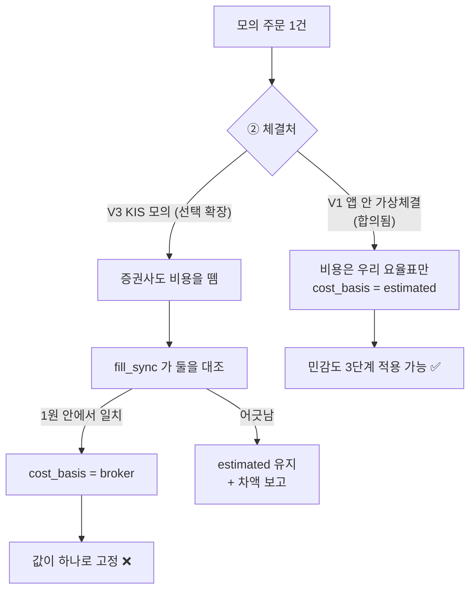
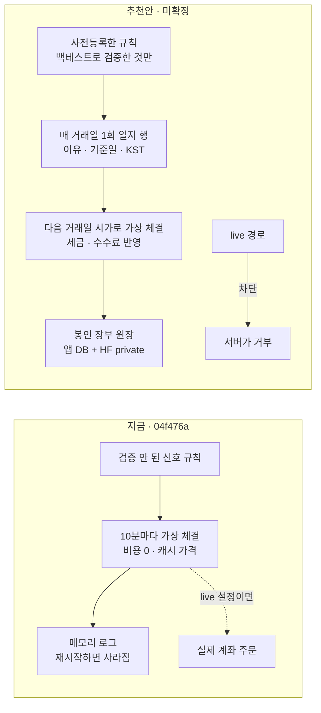
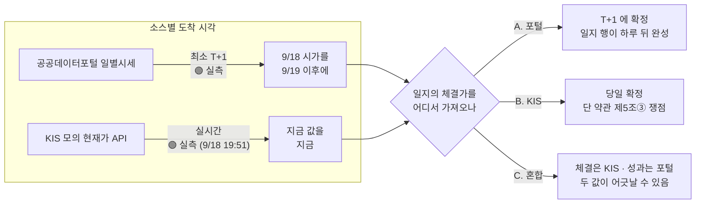
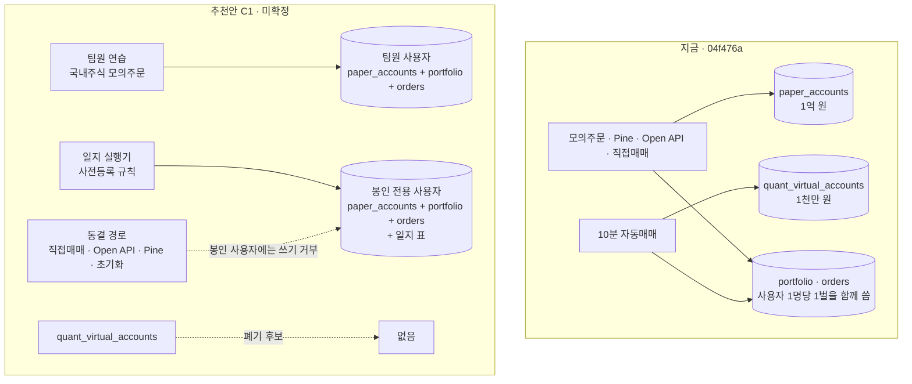
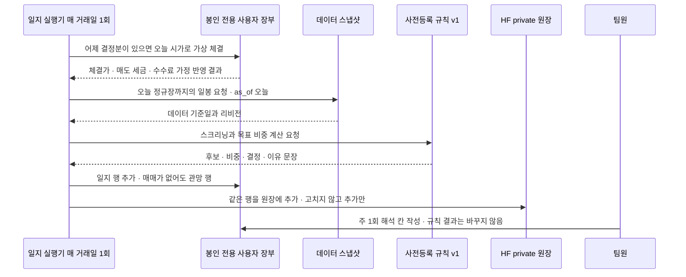
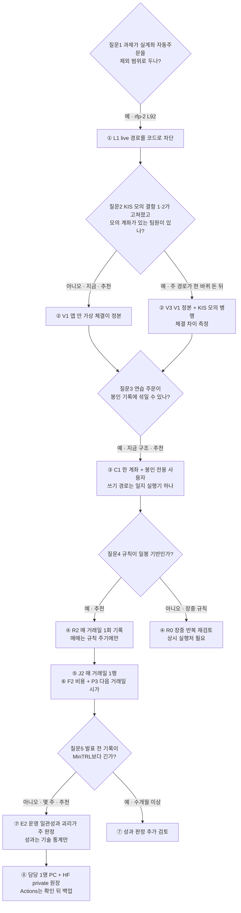
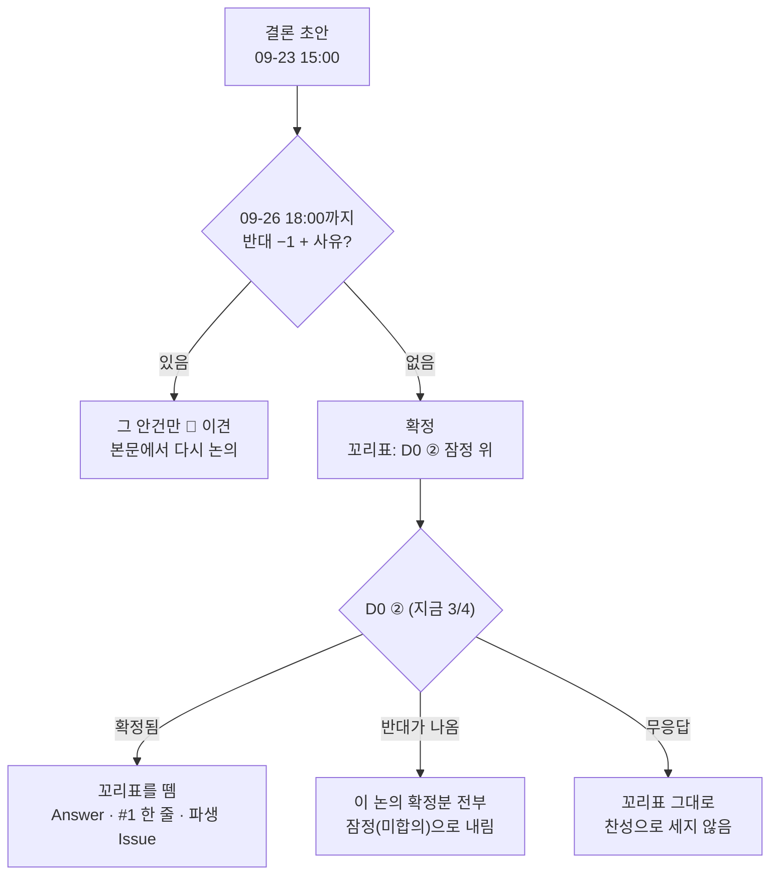

# #13 [논의] D7 모의투자는 무엇으로 체결하고 무엇을 기록할까 — 실행 데모와 포워드 데이터 축적

> 🗂️ 옛 GitHub 논의를 옮긴 **기록 문서**입니다 — [색인](../README.md). 원문은 그대로 두고, 링크·커밋 해시만 새 자리 기준으로 바꿨습니다.

| 항목 | 내용 |
|---|---|
| 종류 | 논의 |
| 상태 | 논의 · 설계(1·2·3차) |
| 원 작성 | 이동원(`devlee328288`) · 2026-09-15 17:12 KST |
| 댓글 | 2건 · 답글 3건 |
| 옛 주소 | `github.com/devlee328288/Qurious/discussions/13` (지금은 열리지 않음) |

## 본문

> 🟡 **결론 초안 게시 (2026-09-23)** — 9행 중 8행은 **09-26(토) 18:00 KST 까지 반대가 없으면 확정**합니다. 기대는 규칙(D0 ②)이 아직 3/4 라 "D0 ② 잠정 위의 확정"입니다. ⑧ 실행처는 기본값만 두고 연기합니다. 강민석님 명시 7 · 조건부 2 · 반대 0 / 장환·준영님은 이 논의 발언 없음. → **본문 아래 §7 결론**

> **읽는 순서**: 쉬운 요약 → 한눈에 보기 → 용어 풀이 0절(구분표) → 4. 추천안 → 추천안을 뒤집을 조건 → 궁금한 논점만 3절
> 💬 **여기서 정할 것**: 모의투자를 **무엇으로 체결하고, 무엇을 언제 기록하며, 실제 계좌 주문을 막을지**. 동결 화면 전체를 끌지는 **D3**, 규칙 자체(무엇을 사고팔지·리밸런싱 주기)는 **D5·D6**, 비용 숫자 통일은 **D4**, 코드 결함 상세는 **A8 [#11](../issues/011.md) · A9 [#12](../issues/012.md)**에서 다룹니다.
> 🙋 **팀원 요청**: 논점 ①~⑧마다 댓글로 `① L1 👍` 또는 `④ R1 — 이유`처럼 남겨 주세요. KIS 계좌·모의투자 신청 가능 여부는 [#11](../issues/011.md) 맨 아래 "팀원 확인"에 적어 주세요. **앱키·시크릿·계좌번호는 적지 마세요.**

## 🟢 2026-09-21 합의 현황 — 민석님 답변으로 8개 중 6개가 ~~닫혔습니다~~ 🔴 (09-23 정정) 추천안과 같습니다 — 팀 확정은 아래 §7 결론 규칙을 따릅니다

민석님이 논점 ①~⑧에 **전부** 답해 주셨습니다(2026-09-21 답글). 제 추천안과 맞대어 보면
**여섯은 그대로 ~~합의~~ 🔴 추천안과 같고**(09-23 정정 · 팀 확정은 §7), **둘은 "코드로 그게 되느냐"가 조건**으로 달렸습니다.
조건 둘 다 **됩니다** — 아래에 코드 위치와 함께 적습니다.

| 논점 | 제 추천 | 민석님 | 상태 |
|---|---|---|---|
| ① 실계좌 주문 | L1 코드로 차단 | **L1** | ✅ 합의 |
| ② 체결처 | V1 앱 안 가상체결 | **V1** | ✅ 합의 |
| ③ 계좌·쓰기 막기 | C1 현금계좌 하나 | **C1** | ✅ 합의 |
| ④ 10분 자동매매 | R2 재설계 | **R2** | ✅ 합의 |
| ⑤ 일지 형식 | J2 매 거래일 1행 | J1 — 단 **관망 사유가 자동이면 J2** | 🟡 조건부 → **자동입니다**(아래) |
| ⑥-1 비용 | F2 세금+가정 | F2 — 단 **별개 적용이 되면** | 🟡 조건부 → **됩니다**(아래) |
| ⑥-2 체결가 | P3 다음 거래일 시가 | **P3** — "하루 늦는 것은 문제되지 않음" | ✅ 합의 |
| ⑦ 봉인 판정 | E2 운영 일관성+괴리 | **E2** | ✅ 합의 |
| ⑧ 전체 | 추천안 | **동의** | ✅ 합의 |

> 🔴 (09-23 정정) 이 표의 "✅ 합의"는 **민석님 선택 = 제 추천안**이라는 뜻이었습니다. 팀 확정은 §7 규칙(초안 뒤 72시간 · D0 ② 잠정 위)을 따릅니다. ⑤ 의 "자동입니다"는 **설계**였습니다(구현 전).

### ⑥-1 "모의투자에 속하는 수수료·슬리피지와 별개로 적용이 가능한가요" — 됩니다

두 겹으로 나눠 답합니다.

**첫째 — ②에서 V1 을 고르셨으므로, 증권사가 떼는 비용이 애초에 없습니다.** 🟢

V1 은 *앱 안 가상 체결이 정본*이라는 뜻입니다. KIS 모의서버에 주문을 내보내지 않으니
증권사가 계산하는 수수료도, 그쪽 체결가에 섞인 슬리피지도 **존재하지 않습니다.**
비용은 우리가 넣는 값이 전부입니다. **"겹쳐서 두 번 떼인다"는 상황 자체가 생기지 않습니다.**

**둘째 — 나중에 KIS 모의를 붙여도(V3 선택 확장) 이미 분리돼 있습니다.** 🟢 코드

`orders` 표에 **`cost_basis`** 라는 칸이 있고, 이 비용이 어디서 온 값인지를 담습니다
([`app/models/trading.py:58-59`](https://github.com/EST-team-project/Qurious/blob/233d8f3/app/models/trading.py#L58-L59)):

```
주문 1건의 비용이 어디서 왔는가 — orders.cost_basis
┌─────────────┬────────────────────────────────────┬──────────────┐
│ "none"      │ 비용을 안 뗐다 (무비용 대조용)       │              │
│ "estimated" │ 우리 요율표로 계산했다               │ ← F2 가 쓰는 값 │
│ "broker"    │ 증권사가 실제로 뗀 금액이다          │ ← F3 가 쓰는 값 │
└─────────────┴────────────────────────────────────┴──────────────┘
                  같은 표 · 같은 행 · 칸 하나로 구분 → 섞이지 않음
```

**용어 — `cost_basis`(비용 근거)**
- 뜻: 이 주문에 붙은 비용 숫자가 *어디서 나온 값인지* 적어 두는 칸입니다.
- 이 문서에서: 우리가 가정으로 넣은 값(`estimated`)과 증권사가 실제로 뗀 값(`broker`)을
  **한 표 안에서 구분**하는 장치로 씁니다.
- 헷갈리는 점: 회계에서 쓰는 *취득원가(cost basis)* 와 글자가 같지만 **다른 뜻입니다.**
  여기서는 "비용의 출처 표시"입니다.

그리고 두 값을 맞대어 보는 코드가 이미 있습니다
([`app/services/fill_sync.py:13-18`](https://github.com/EST-team-project/Qurious/blob/233d8f3/app/services/fill_sync.py#L13-L18)) —
증권사 제비용 합계와 우리 요율표 계산이 **1원 안에서 맞을 때만** `broker` 를 붙이고,
어긋나면 `estimated` 로 두고 **차액을 그대로 보고합니다.** 틀린 값에 "증권사가 준 값"
이라는 이름을 붙이지 않으려는 장치입니다.



### F3 을 고르면 잃는 것 — 민감도를 쓸 수 없게 됩니다

이것이 제가 F2 를 그대로 두자고 말씀드리는 진짜 이유입니다.

F3(증권사 계산 사용)은 비용이 **한 값으로 고정**됩니다. 증권사가 실제로 뗀 금액은
하나뿐이니까요. 반면 추천안의 **민감도**는 *같은 매매를 비용만 바꿔 여러 번 계산해 보는 것*
입니다. 비용을 0으로 놓았을 때와 2배로 놓았을 때 결론이 뒤집히면, 그 전략은 비용 가정에
기대어 서 있다는 뜻입니다. F3 에서는 이 확인을 **할 수 없습니다.**

**용어 — 민감도(sensitivity)**
- 뜻: 가정값을 흔들어 보고 결론이 따라 흔들리는지 보는 것입니다.
- 이 문서에서: 비용만 0 · 기본 · 2배로 바꿔 같은 기간을 세 번 계산합니다.
- 헷갈리는 점: 성과를 **더 좋게 만드는 작업이 아닙니다.** 오히려 "우리 결론이 얼마나
  약한가"를 드러내려는 것입니다.

### 🟡 "1차에서 적용해본 비용 4수준" — 코드에는 지금 세 종류가 있습니다 → 🔴 (09-23 정정) 축이 달랐습니다. 1차 4수준을 찾아 §7.4 에 적었습니다

`trading_cost.build()` 가 받는 비용 모델은 셋입니다
([`app/services/trading_cost.py:513-534`](https://github.com/EST-team-project/Qurious/blob/233d8f3/app/services/trading_cost.py#L513-L534)):

| 이름 | 무엇 |
|---|---|
| `real` | 연도별 실제 요율 (기본값 · 세금·수수료·청산비·슬리피지) |
| `flat` | 왕복 대칭 고정 bps |
| `none` | 비용 없음 (무비용이 얼마나 낙관적인지 대조할 때만) |

1차에서 쓰신 **네 수준이 이 셋과 어떻게 대응하는지 제가 확인하지 못했습니다** 🟡.
네 수준이 무엇이었는지(수치 또는 이름) 알려 주시면 그대로 옮겨 붙이겠습니다.
**F2 는 수준 개수를 가리지 않습니다** — 셋이든 넷이든 값만 정하면 됩니다.

### ⑤ "매매가 없는 이유를 자동화로 구현이 가능하다면 J2" — ~~자동으로 쓰입니다 🟢~~ 🔴 (09-23 정정) 자동으로 쓰도록 **설계**했습니다 (구현 전 🟡)

말씀하신 조건이 **정확히 추천안의 동작**입니다. 사람이 "오늘은 관망했다"고 적는 것이
아니라, **규칙 실행기가 매 거래일 1회 돌면서 각 규칙의 신호를 평가하고 그 결과를 그대로
기록**합니다. 신호가 없으면 "신호 없음 → 관망" 행이 자동으로 남습니다.

지금 코드도 이미 주기적으로 돌고 있습니다 — 다만 주기가 10분이라 ④에서 R2(재설계)로
합의한 부분입니다([`app/services/auto_trade.py:25`](https://github.com/EST-team-project/Qurious/blob/233d8f3/app/services/auto_trade.py#L25) `_INTERVAL_SEC = 600`).
**사람이 손으로 적는 부담은 J1 이든 J2 든 똑같이 0입니다.**

```
J1 (매매일만)                    J2 (매 거래일 1행)
09-22  매수 삼성전자              09-22  매수 삼성전자   (RSI 28 < 30)
09-23  (행 없음)                 09-23  관망           (RSI 41 — 신호 없음)  ← 자동
09-24  (행 없음)                 09-24  관망           (RSI 45 — 신호 없음)  ← 자동
09-25  매도 삼성전자              09-25  매도 삼성전자   (RSI 72 > 70)
       ↑ 규칙이 안 돌았는지               ↑ 규칙은 돌았고 신호가 없었음을
         신호가 없었는지 구분 못 함          기록이 증명함
```

말씀하신 **"실제 매매일지에는 안 한 결정을 쓰지 않는다"** 는 사람이 쓰는 일지 기준으로
맞는 말씀입니다. 다만 우리 일지는 **기계가 쓰는 기록**이라 성격이 다릅니다 — ⑦에서 합의한
E2 판정의 첫째 항목이 **"기록 누락 0일"** 인데, J1 은 *행이 없는 날*이 "규칙이 안 돌아서"인지
"신호가 없어서"인지 구분되지 않아 이 판정을 할 수 없습니다.

말씀하신 조건("시계열이 필요하면 J2")도 걸립니다 — E2 의 셋째 항목인 **백테스트 대비
괴리**를 보려면 매 거래일 평가액이 필요합니다.

→ **J2 로 두되, 민석님 뜻대로 "사람이 안 한 결정을 지어내는" 일은 없습니다.**
   자동 기록과 사람 해석(주 1회)을 분리해 두었습니다.

### 남은 것

- 장환님 의견 (D0 에는 "전체 A 동의" 주셨고, D7 논점에는 아직)
- ~~🟡 1차 비용 4수준의 실제 값~~ ✅ (09-23) 1차 코드에서 찾았습니다 — §7.4
- 기한은 그대로 **2026-09-27** 입니다.

---

## 쉬운 요약 (3줄)

1. 지금 앱의 "모의투자"는 **한 번도 검증하지 않은 규칙**으로 **10분마다** 가짜 체결을 하고, 결정 이유는 **앱이 켜져 있는 동안만** 기억합니다. 현금 계좌가 둘로 나뉘어 총자산이 틀어지고, 설정 하나만 바꾸면 **실제 계좌로 주문**도 나갑니다([#11](../issues/011.md) · [#12](../issues/012.md)). 이 상태로는 rfp-2의 "모의 투자 의사결정 일지"를 만들 수 없습니다.
2. 추천안(미확정): **실제 계좌 주문은 코드로 막고**, 체결은 **앱 안 가상 체결 한 경로**로 모읍니다. 동작은 "**하루 1회** 정규장이 끝난 뒤, **미리 등록한 규칙** → **일지 저장** → **다음 거래일 시가**로 체결, 매도 세금 0.15%와 수수료 가정 반영"으로 바꿉니다. KIS 모의투자 서버 연동은 [#11](../issues/011.md) 결함 1·2를 고친 뒤의 **선택 확장**으로 둡니다.
   🔴 **2026-09-19 갱신** — 이 설계 자체는 그대로 두지만, **"다음 거래일 시가"를 그날 안에 알 수 없다**는 사실이 실측으로 확인됐습니다. 일지는 **하루 뒤에 확정되는** 구조가 됩니다(2.6).
3. 발표 전까지 쌓을 수 있는 기록은 **몇 주**뿐입니다. 논문 공식으로 계산하면 이 기간으로는 "규칙에 실력이 있다"를 **통계로 증명할 수 없습니다**(연 Sharpe 1.0이면 약 684거래일 필요). 그래서 일지는 증명이 아니라 "**규칙대로 했나 · 백테스트와 크게 어긋나지 않나**"를 확인하는 도구로 설계하자고 제안합니다.

## 한눈에 보기 — 논점별 추천안 (⑤·⑥ 조건 해소 · 2026-09-21 민석님 답변 반영)

| 논점 | 추천안 | 팀 추가 비용 | 확실도 | 추천을 바꿀 수 있는 것 |
|---|---|---|:---:|---|
| ① 실제 계좌(live) 주문 | **L1 코드로 차단** — 화면 선택지와 서버 경로 모두 | 0원 | 🟢 과제 제외 범위 | 강사님이 실계좌 시연을 요구 |
| ② 체결처 | **V1 앱 안 가상 체결이 정본** · KIS 모의 연동은 **V3 선택 확장** | 0원 | 🟢 코드 · 🟡 KIS 모의 동작 | [#11](../issues/011.md) 결함 1·2 해결 + 팀원 KIS 모의 계좌 확보 |
| ③ 계좌 · 쓰기 막기 | **C1 현금 계좌 하나(`paper_accounts`)** + 봉인 기록은 **전용 사용자**의 장부로 분리 · 그 장부에 쓰는 경로는 일지 실행기 하나 | 0원 | 🟢 표 구조 · 🟡 구현 | A2·A3에서 전용 사용자 방식이 막히면 C2 |
| ④ 10분 자동매매 | **R2 재설계** — 기록은 매 거래일 1회, 매매는 규칙이 정한 주기(D5·D6)에만 | 0원 | 🟢 결함 · 🟡 운영 | 강사님이 매일 사람이 결정한 기록을 요구 |
| ⑤ 일지 형식 | **J2 매 거래일 1행**(매매가 없어도 "관망" 행) · 결정 이유·데이터 기준일·KST 시각·규칙 버전 · 사람 해석은 주 1회 | 0원 | 🟢 rfp 원문 · 🟡 칸 구성 | D5·D6 규칙이 칸을 더 요구 |
| ⑥ 비용 · 체결가 | **F2 세금(법령 세율) + 수수료·슬리피지 가정(D4 비용 규격)** · 체결가는 **P3 다음 거래일 시가** | 0원 | 🟢 세율 원문 · 🟡 수수료 값 | D4 비용 규격 · 데이터 원천에 시가가 제때 없음 |
| ⑦ 새 봉인 구간 | **E2 규칙·평가 방법을 결과 전에 등록** · 주 판정은 **운영 일관성과 괴리** · 수익률·Sharpe는 **기술 통계로만** | 0원 | 🟢 공식 원문 · 🟡 기간 | 발표가 늦어져 기록이 수개월 이상 쌓임 |
| ⑧ 실행처 · 준비물 | **담당 1명 PC** 기본 · ~~Actions는 해외 IP 호출 확인 뒤 백업 후보~~ 🔴 (09-23 정정) Actions 는 후보에서 뺌(D2 3.4 · ADR-0003) · HF Space는 제외 | 0원 | 🟡 | D2 [#10](../discussions/010.md) 결론 · 담당자 부재 계획 |



## 용어 풀이

> 팀원이 용어를 헷갈린 사례가 있어 **정확한 뜻 → 이 문서에서 가리키는 것 → 헷갈리기 쉬운 점** 순서로 풉니다. 코드 동작 설명에는 확실도를 붙였습니다.

### 0. 먼저 구분할 것

**"모의투자"가 세 가지 뜻으로 쓰입니다** ([#12](../issues/012.md) 용어 풀이 0절과 같은 구분)

| 구분 | 누가 체결하나 | 돈 | 이 문서의 이름 | 헷갈리기 쉬운 점 |
|---|---|---|---|---|
| 앱 안 가상 체결 | 이 앱이 DB 숫자만 바꿈 (거래소·증권사를 거치지 않음) | 가짜 | **가상 체결** (선택지 V1) | 앱 메뉴 이름이 "모의투자"여도 증권사를 부르지 않습니다. 🟢 |
| 증권사 모의투자 서버 | 증권사가 운영하는 연습 서버 (KIS 주소 포트 29443) | 가짜 | **KIS 모의** (선택지 V2·V3) | 증권사 계좌·모의투자 신청·모의 앱키가 따로 필요합니다([#11](../issues/011.md)). |
| 실전 (live) | 증권사 실제 서버 → 거래소 | **진짜** | **live** (논점 ①) | rfp-2 제외 범위입니다. |

**"기록"도 두 가지를 구분합니다**

| 구분 | 무엇 | 언제 쓰나 | 헷갈리기 쉬운 점 |
|---|---|---|---|
| 백테스트 | 과거 데이터에 규칙을 적용해 **계산한** 성과 | 규칙을 고르기 전 | 몇 년치를 한 번에 계산할 수 있지만, 규칙을 여러 번 고치면 과거에만 맞출 수 있습니다(A6). |
| 포워드 기록 | **오늘부터 앞으로** 규칙을 돌리며 쌓는 기록 | 규칙을 고른 뒤 | 미래 엿보기가 **불가능**하지만, 지나간 날은 다시 만들 수 없어 **기간이 짧습니다**. 이 논의의 대상입니다. |

**판정 용어**

| 용어 | 뜻 | 헷갈리기 쉬운 점 |
|---|---|---|
| 차단 | 코드로 **실행 자체를 못 하게** 막음 | 동결과 다릅니다. |
| 동결 | 개발·발표에 시간을 쓰지 않음. **코드는 그대로 실행됨** | 동결한 화면의 API도 부르면 표에 씁니다([#12](../issues/012.md) 결함 3·4). |
| 재설계 | 목적은 남기고 동작 방식을 새로 정함 | "고친다"보다 범위가 큽니다. |
| 선택 확장 | 주 경로가 한 바퀴 돈 뒤 여유가 있으면 하는 일 | 발표 필수가 아닙니다. |
| 정본 | 둘 이상의 기록이 다를 때 **이쪽을 맞는 것으로 보기로 정한** 기록 | V3에서 KIS 모의 결과가 달라도 성과 계산은 정본(V1)으로 합니다. |

### 1. 주문 · 체결 · 비용

| 용어 | 정확한 뜻 | 이 문서에서 · 헷갈리기 쉬운 점 |
|---|---|---|
| 체결 가격 기준 | 가상 체결에서 "얼마에 산 것으로 칠지" 정한 규칙 | 지금 코드는 경로마다 다릅니다(야후 현재가 · 화면 입력 가격 · 캐시된 마지막 가격, [#12](../issues/012.md) §4.1). 🟢 |
| 당일 종가 체결 | 결정에 쓴 그날 종가로 샀다고 치는 것 | 종가가 **확정된 뒤** 결정하므로 현실에서는 그 가격에 살 수 없습니다. 성과가 좋게 나오기 쉽습니다. |
| 다음 거래일 시가 체결 | 결정한 다음 거래일의 첫 가격으로 샀다고 치는 것 | 결정 시점에 **모르는 가격**이라 실행할 수 있는 체결입니다. 1차 라벨도 "t+1 시가"로 정의했습니다([#3](../issues/003.md) · ADR 0002). |
| 수수료 | 증권사가 중개 대가로 **살 때와 팔 때 모두** 받는 돈 | 세금이 아닙니다. 증권사·매체마다 달라 **이번에도 조사하지 않았습니다.** |
| 증권거래세 · 농어촌특별세 | **팔 때만** 판 금액에 붙는 국세 | 현행 법령 기준 코스피 매도 = 농어촌특별세 0.15%, 코스닥 매도 = 증권거래세 0.15%입니다([#12](../issues/012.md) §5.1 원문). **손해를 보고 팔아도** 냅니다. |
| 슬리피지 | 주문하려던 가격과 실제 체결 가격의 차이 | 공식 수치가 없어 **가정값**으로만 넣을 수 있습니다. |
| 편도 · 왕복 비용 | 한 방향(사기 또는 팔기) 비용 / 한 번 사고 한 번 파는 비용 합계 | 둘을 섞으면 비용이 2배로 잡힙니다. 1차에서 실제로 섞였습니다([#3](../issues/003.md) 비용 규격 ②). |
| 회전율 (turnover) | 일정 기간에 포트폴리오를 얼마나 갈아 끼웠는지의 비율 | 비용은 대략 **회전율 × 왕복 비용**으로 커집니다(3.6 계산표). |

### 2. 시장 시간

| 용어 | 정확한 뜻 | 이 문서에서 · 헷갈리기 쉬운 점 |
|---|---|---|
| 정규장 · 종가 | 거래소가 정한 기본 거래 시간 / 그 시간의 마지막 체결 가격 | 일봉의 "종가"는 정규장 종가입니다. 정규장 종료 시각은 KRX 규정 페이지를 읽지 못해 이 글에서는 원문으로 확인하지 않았습니다(한계). |
| 애프터마켓 | 정규장이 끝난 뒤 따로 여는 거래 시간 | **KRX가 2026-09-14부터 오후 4~8시에 실시간 체결로 운영**합니다. 오후 6시까지 열던 시간외단일가 시장은 폐지됐고 **ETF·ETN은 거래 대상이 아닙니다**(2.5). 🟢 기사 |
| "장 마감 후" | 이 문서에서는 **정규장 종료 뒤** | 애프터마켓 때문에 이제 저녁 8시까지 가격이 움직입니다. 규칙 입력을 정규장 일봉으로 한정할지 정해야 합니다(논점 ④·⑥). |
| 거래일 | 거래소가 여는 날 | 주말·공휴일·거래소 휴장일은 빠집니다. 이 글의 계산은 연 252거래일을 가정합니다. |
| KST | 한국 시간 = UTC + 9시간 | 지금 자동매매 로그는 UTC라 오후 3시 기록이 "06:00"으로 보입니다([#12](../issues/012.md)). 🟢 |

### 3. 봉인 · 통계

| 용어 | 정확한 뜻 | 이 문서에서 · 헷갈리기 쉬운 점 |
|---|---|---|
| 사전등록 | 결과를 보기 **전에** 규칙·평가 기간·판정 방법을 문서로 고정하는 것 | 1차 ADR 0004가 예입니다([#3](../issues/003.md)). 결과를 본 뒤 규칙을 바꾸면 "새 등록"으로 다시 시작합니다. |
| 봉인 구간 · 개봉 | 사전등록 뒤 쌓이고 **마지막에 한 번만 평가하는** 기간 / 그 평가를 하는 행위 | 1차는 개봉 기록을 한 번만 쓸 수 있게 막았습니다(`append_unseal_row`, [#3](../issues/003.md)). |
| 장부 (book) | 한 규칙의 현금·보유·주문을 **다른 기록과 섞이지 않게** 모은 단위 | 이 문서에서 새로 쓰는 말입니다. 지금 앱은 사용자 1명 = 보유표 1벌이라, 장부를 나누려면 "사용자를 나누거나" "칸을 추가"해야 합니다(논점 ③). 🟢 |
| 추가만 하는 기록 (append-only) | 한 번 쓴 행을 고치거나 지우지 않고, 고칠 일은 **정정 행**을 새로 붙이는 방식 | 봉인 기록이 나중에 바뀌지 않았음을 보여 줍니다. |
| as_of (기준 시점) | "이 날짜까지 알 수 있었던 데이터만 쓴다"는 조건 | 1차 as_of 정문이 이 조건을 코드로 지켰습니다([#3](../issues/003.md)). 누락일 재계산(3.8)의 전제입니다. |
| Sharpe 비율 | (수익률 평균 − 무위험수익률) ÷ 수익률 표준편차 | 이 문서 계산은 **무위험수익률 0**, 일간 값 × √252로 연율화했다고 가정합니다. |
| 관측치 | 계산에 쓴 데이터 개수 | 일간 기록이면 거래일 1일 = 관측치 1개입니다. |
| MinTRL (최소 기록 길이) | "관측한 Sharpe가 기준값보다 크다"를 정한 신뢰수준으로 말하는 데 필요한 **최소 관측치 수** (Bailey·López de Prado 2012, 식 13) | 년이 아니라 **관측치 개수**입니다. 3.7절 계산표. |
| 신뢰수준 95% (단측) | "기준보다 크다" 한쪽 방향만 보는 검정에서 틀릴 확률을 5%로 두는 것. 표준정규 값 Z = 1.645 | 양측(Z = 1.96)과 섞지 않습니다. 논문 예시(2.73년)를 1.645로 재현했습니다. |
| 왜도 · 첨도 | 분포가 한쪽으로 치우친 정도 / 꼬리가 두꺼운 정도(정규분포 = 3) | 계산표는 **정규분포(왜도 0 · 첨도 3)** 를 가정했습니다. 주식 수익률은 보통 꼬리가 두꺼워 **필요 기간이 더 깁니다**(논문 식 13). |

**확실도 표시**: 🟢 코드·공식 원문으로 확인 · 🟡 코드와 문서를 읽고 추론(실행이나 추가 확인 필요)

---

## 1. 배경 — 왜 지금 정해야 하나

- rfp-2 필수 산출물에 "**모의 투자 의사결정 일지**: 스크리닝 → 포트폴리오 구성 → 매매 의사결정 과정 기록"이 있고([rfp-2.md#L119](https://github.com/EST-team-project/Qurious/blob/04f476a/docs/rfp-2.md#L119)), 평가 항목에 "모의 투자 의사결정의 **논리적 일관성**"이 있습니다([#L146](https://github.com/EST-team-project/Qurious/blob/04f476a/docs/rfp-2.md#L146)). rfp-1은 "구축 모델을 기반으로 **기간형 모의투자**를 수행하고, 거래 의사결정 로그를 기록한다"고 적었습니다([rfp-1.md#L28-L29](https://github.com/EST-team-project/Qurious/blob/04f476a/docs/rfp-1.md#L28-L29)). 🟢
- A9 [#12](../issues/012.md) 분석 결과, 지금 코드는 일지 요소(스크리닝·구성·결정 이유·데이터 기준일)를 **DB에 하나도 저장하지 않습니다**([#12](../issues/012.md) §4.4). 🟢
- D1 [#7](../discussions/007.md) 추천안(미확정)의 이야기는 "규칙 → 검증 → **기록**"이고, 1차 보고서 9.2절은 "2026-09-01 이후 쌓이는 자료로 **새 봉인 구간**을 정하고 결과를 보기 전에 다시 사전등록한다"고 적었습니다([#3](../issues/003.md) · [#7](../discussions/007.md)). 그 기록을 어떻게 만들지가 이 논의입니다.
- **포워드 기록은 늦게 시작한 만큼 짧아지고, 되돌릴 수 없습니다.** 백테스트는 나중에 다시 돌릴 수 있지만 지나간 날의 포워드 기록은 만들 수 없습니다. 2차 개발이 **2026-09-27**에 시작하므로, 그 전에 형식을 정해야 개발 첫 주부터 쌓을 준비를 할 수 있습니다. 🟡
- D2 [#10](../discussions/010.md) 추천안이 "일지는 **장 마감 후 하루 1회, 상시 서버 없이**"를 D7 설계 조건으로 넘겼습니다([#10](../discussions/010.md) §4 ④).
- 팀원 의견: 강민석 님이 D1 [#7](../discussions/007.md) 댓글에서 "**과잉거래를 방지하기 위한 장치**"를 요청했고, 2차와 3차를 **각각 깊게** 만드는 이야기(S3)를 골랐습니다. 이 논의의 추천안은 D1이 S1·S3 어느 쪽으로 정해져도 쓸 수 있게 **장부를 규칙마다 나누도록** 설계했습니다(논점 ③·⑤). 🟡

### 1.1 착수 시 나눈 질문

| 질문 | 답하는 방법 | 위치 |
|---|---|---|
| live 주문 경로는 몇 개이고 어디서 막을 수 있나 | 코드 `auto_trade.py` · `stocks.py` · `app.html` ([#11](../issues/011.md) §4.3 · [#12](../issues/012.md) §4.5를 다시 확인) | 2.1 · 3.1 |
| 가상 체결·계좌·쓰기 경로의 현재 구조 | 코드 모델·서비스·라우트 ([#12](../issues/012.md) §3을 다시 확인) | 2.2 · 3.3 |
| rfp 일지 요소가 어디에 남나 | 과제 명세 원문 + 코드 | 2.3 · 3.5 |
| KIS 모의 연동의 선행 조건 | [#11](../issues/011.md) · [#10](../discussions/010.md) (코드 + KIS·HF 공식 원문, S6 확인) | 2.4 · 3.2 |
| 매도 세금 | [#12](../issues/012.md) §5.1 (법령 원문, S7 확인) | 3.6 |
| "장 마감 후"는 언제인가 | **외부** KRX 규정 페이지(본문을 읽지 못함) · 기사 | 2.5 · 한계 |
| 포워드 기록 몇 주로 무엇을 말할 수 있나 | **외부** Bailey·López de Prado(2012) 원문 식 + 계산 | 3.7 |
| 실행처별 제약 | [#10](../discussions/010.md) §2.2 · §3.4 (HF·Actions 원문, S5·S6 확인) | 3.8 |

## 2. 사실

코드 기준 커밋 Qurious `04f476a`. 외부 조회일 **2026-09-15 KST**. 이 글의 코드 줄 번호는 이번에 파일을 다시 열어 확인했습니다.

### 2.1 실제 계좌(live) 주문이 나가는 길 🟢

| # | 경로 | 켜는 방법 | 결과 | 근거 |
|---|---|---|---|---|
| a | 화면 선택지 | `settings` 화면 "투자 모드"의 **"실전투자 (Live)"** | 저장하면 `paper = False` · `quant_mode = "live"` | [app.html#L1281-L1285](https://github.com/EST-team-project/Qurious/blob/04f476a/public/app.html#L1281-L1285) · [stocks.py#L493-L494](https://github.com/EST-team-project/Qurious/blob/04f476a/app/routes/stocks.py#L493-L494) |
| b | 자동매매 실주문 | `quant_mode`가 `live` + 증권사·키·계좌가 있음 | 가상 체결을 **먼저 커밋**한 뒤 `paper=False`로 실주문 | [auto_trade.py#L154-L165](https://github.com/EST-team-project/Qurious/blob/04f476a/app/services/auto_trade.py#L154-L165) · [#L129](https://github.com/EST-team-project/Qurious/blob/04f476a/app/services/auto_trade.py#L129) · [#L293-L298](https://github.com/EST-team-project/Qurious/blob/04f476a/app/services/auto_trade.py#L293-L298) |
| c | 수동 증권사 주문 API | `POST /api/broker/order` · 설정의 `paper` 값을 그대로 씀 | `paper = False`면 KIS 실전 주소 · **화면에서 부르는 곳 없음** · `orders` 표에 기록 없음 | [stocks.py#L508-L517](https://github.com/EST-team-project/Qurious/blob/04f476a/app/routes/stocks.py#L508-L517) · [#L590-L656](https://github.com/EST-team-project/Qurious/blob/04f476a/app/routes/stocks.py#L590-L656) |
| d | LS증권 | 실전 키를 넣으면 | 앱 설정과 무관하게 **키 종류로** 운영 서버에 접속 | [#11](../issues/011.md) §4.2 (LS 공식 안내) |

- 자동매매 실주문은 실패해도 예외를 흡수하고 반복을 계속합니다. 함수 설명 원문: "브로커 미승인/오류 시에도 자동매매 사이클 자체는 계속 진행되도록 예외를 여기서 흡수한다" [auto_trade.py#L148-L153](https://github.com/EST-team-project/Qurious/blob/04f476a/app/services/auto_trade.py#L148-L153). 그래서 **앱에는 보유로 남고 실제 계좌는 0주**일 수 있습니다([#12](../issues/012.md) §4.5). 🟢
- rfp-2 제외 범위 원문: "실제 증권 계좌를 통한 실거래 자동 주문 실행" [rfp-2.md#L92](https://github.com/EST-team-project/Qurious/blob/04f476a/docs/rfp-2.md#L92). 🟢

### 2.2 가상 체결과 계좌의 현재 구조 🟢

| 사실 | 근거 |
|---|---|
| 보유표 `portfolio`는 **사용자 × 종목 1행** — 고유 조건이 `user_id, symbol`이라 한 사용자가 같은 종목을 두 장부로 나눠 가질 수 없음 | [trading.py#L12-L20](https://github.com/EST-team-project/Qurious/blob/04f476a/app/models/trading.py#L12-L20) |
| 주문표 `orders`는 `source` 글자(WEB·PAPER·OPENAPI·PINE·QUANT)로만 경로를 구분 · **결정 이유 칸 없음** | [trading.py#L23-L36](https://github.com/EST-team-project/Qurious/blob/04f476a/app/models/trading.py#L23-L36) |
| 현금 계좌 ① `paper_accounts` 1억 원 · 모델 설명 "주식 포지션/주문은 기존 Portfolio / Order 테이블을 그대로 재사용한다(직접매매 화면과 잔고 공유)" | [paper.py#L6](https://github.com/EST-team-project/Qurious/blob/04f476a/app/models/paper.py#L6) · [#L20](https://github.com/EST-team-project/Qurious/blob/04f476a/app/models/paper.py#L20) · [#L23-L32](https://github.com/EST-team-project/Qurious/blob/04f476a/app/models/paper.py#L23-L32) |
| 현금 계좌 ② `quant_virtual_accounts` 1천만 원 (자동매매 전용) | [trading.py#L62-L69](https://github.com/EST-team-project/Qurious/blob/04f476a/app/models/trading.py#L62-L69) · [auto_trade.py#L25](https://github.com/EST-team-project/Qurious/blob/04f476a/app/services/auto_trade.py#L25) |
| 모의계좌 현황 총자산 = `paper_accounts` 현금 + 보유 평가액 (자동매매 계좌 현금은 안 더함) | [paper_trading.py#L685-L702](https://github.com/EST-team-project/Qurious/blob/04f476a/app/services/paper_trading.py#L685-L702) |
| 계좌 초기화 대상에 자동매매 계좌가 없음 | [paper_trading.py#L66-L73](https://github.com/EST-team-project/Qurious/blob/04f476a/app/services/paper_trading.py#L66-L73) |
| 가장 잘 짜인 체결 함수 `stock_order`: 계좌 행 잠금 · 매도 시 보유 확인 · 수량 검증 · **비용 0** | [paper_trading.py#L207-L245](https://github.com/EST-team-project/Qurious/blob/04f476a/app/services/paper_trading.py#L207-L245) |
| 직접매매 `/api/orders`: 요청 가격 그대로 체결 · 보유 없이 매도해도 현금 증가 (동결 화면) | [stocks.py#L280-L306](https://github.com/EST-team-project/Qurious/blob/04f476a/app/routes/stocks.py#L280-L306) |
| `POST /api/portfolio`: 현금 변화 없이 보유 수량·단가를 덮어씀 (동결 화면) | [stocks.py#L211-L227](https://github.com/EST-team-project/Qurious/blob/04f476a/app/routes/stocks.py#L211-L227) |
| 자동매매는 사용자 ID가 `quant_system`이면 **시스템 사용자**로 기록 — "사용자 = 장부"로 쓰는 구조가 이미 있음 | [auto_trade.py#L28-L31](https://github.com/EST-team-project/Qurious/blob/04f476a/app/services/auto_trade.py#L28-L31) |

### 2.3 rfp 일지 요소 — 지금 남는 것과 안 남는 것 🟢

| rfp가 요구하는 요소 | 원문 | 지금 코드 | DB에 남나 |
|---|---|---|:---:|
| 스크리닝 | [rfp-2#L119](https://github.com/EST-team-project/Qurious/blob/04f476a/docs/rfp-2.md#L119) | 31종목 신호 점수 상위 N [auto_trade.py#L239-L246](https://github.com/EST-team-project/Qurious/blob/04f476a/app/services/auto_trade.py#L239-L246) | ❌ 메모리 |
| 포트폴리오 구성 | 같은 줄 | 비중 개념 없음 · 종목마다 같은 금액 [#L275-L277](https://github.com/EST-team-project/Qurious/blob/04f476a/app/services/auto_trade.py#L275-L277) | ❌ |
| 매매 결정과 이유 | 같은 줄 | `reasons` 문자열 [#L268](https://github.com/EST-team-project/Qurious/blob/04f476a/app/services/auto_trade.py#L268) → 메모리 로그 최근 100번 [#L354-L356](https://github.com/EST-team-project/Qurious/blob/04f476a/app/services/auto_trade.py#L354-L356) | ❌ |
| 기간형 모의투자 · 거래 의사결정 로그 | [rfp-1#L28](https://github.com/EST-team-project/Qurious/blob/04f476a/docs/rfp-1.md#L28) | 시작일·종료일 개념 없음([#5](../issues/005.md) 23행) | ❌ |
| 시나리오별(상승/하락/횡보) 성과 비교 · 의사결정 일관성 검증 | [rfp-1#L29](https://github.com/EST-team-project/Qurious/blob/04f476a/docs/rfp-1.md#L29) | 없음 | ❌ |
| 결과 해석 · 모의 투자 의사결정 직접 수행 | [rfp-2#L31](https://github.com/EST-team-project/Qurious/blob/04f476a/docs/rfp-2.md#L31) | 버튼 한 번 뒤 기계가 10분마다 반복 | — |

- 시나리오별(상승·하락·횡보) 비교는 몇 주 포워드 기록에 세 국면이 다 나온다는 보장이 없어, **백테스트 구간을 국면별로 나눠** 채우는 쪽이 현실적입니다(A6 · D5). 🟡

### 2.4 KIS 모의 연동의 선행 조건 ([#11](../issues/011.md) · [#10](../discussions/010.md)에서)

| 조건 | 상태 | 근거 | 확실도 |
|---|---|---|:---:|
| 주문 거래 ID가 공식 최신과 같나 | ❌ `VTTC0802U` ↔ 공식 `VTTC0012U` | [#11](../issues/011.md) 결함 1 | 🟢 차이 · 🟡 거부 여부 |
| 주문 필수값 `EXCG_ID_DVSN_CD` | ❌ 없음 | [#11](../issues/011.md) 결함 2 | 🟢 차이 · 🟡 거부 여부 |
| 토큰 재사용 | ❌ 요청마다 발급 (공식: 재발급 1분당 1회 · 발급마다 알림톡) | [#11](../issues/011.md) 결함 3 | 🟢 |
| 모의/실전 스위치 | ❌ 두 개(`paper` · `quant_mode`) | [#11](../issues/011.md) 결함 8 | 🟢 |
| 팀원 KIS 계좌 · 모의투자 신청 | ❓ [#11](../issues/011.md) "팀원 확인" 댓글 0건 | 2026-09-15 조회 | — |
| HF Space에서 호출 | ❌ 밖으로 나가는 요청은 80·443·8080만 → 29443 차단 | [#10](../discussions/010.md) §2.2.2 (HF 원문) | 🟢 원문 · 🟡 실행 |
| 모의 서버 체결 기준(실제 호가대로인가) | ❓ 한국투자증권 안내 페이지를 robots.txt 때문에 읽지 못함 | [#12](../issues/012.md) §5.2 | — |

### 2.5 "장 마감"이 바뀌었습니다 — KRX 애프터마켓 (2026-09-14 시행)

| 사실 | 원문 (파이낸셜뉴스 2026-09-09) |
|---|---|
| 시행일·시간 | "오는 14일부터 애프터마켓을 운영한다고 9일 밝혔다" · "애프터마켓은 오후 4시부터 8시까지 4시간 동안 운영된다" |
| 방식 | "정규장과 마찬가지로 매수·매도 호가가 맞으면 실시간으로 체결되는 접속매매 방식으로 바뀐다" · "기존 시간외단일가 시장은 폐지된다" |
| 대상 | "코스피·코스닥시장의 주식과 주식예탁증서(DR) 가운데 시장관리가 필요한 일부 종목을 제외한 종목" · "상장지수펀드(ETF)와 상장지수증권(ETN)은 … 거래 대상에서 제외했다" |
| 주문 | "지정가와 최우선지정가, 최유리지정가 주문만 가능하다" · 가격제한폭 "전일 종가 대비 ±30%" |
| 넥스트레이드 | "같은 시간대에는 넥스트레이드(NXT)의 애프터마켓도 함께 운영된다" |

- KIS 포털 공지 목록에도 "[중요] KRX 애프터마켓 도입 및 NXT 제도 변경에 따른 안내 2026.09.09"가 있습니다([#11](../issues/011.md) §4.1, 본문은 읽지 못함). 🟢 목록
- 시사점 🟡: 정규장 종가 뒤에도 가격이 움직이므로 **다음 거래일 시가에는 애프터마켓 정보가 이미 반영**됩니다. 우리 데이터 원천(야후 일봉)이 애프터마켓 체결을 포함하는지는 확인하지 않았습니다(A4). D5에서 ETF를 고르면 애프터마켓 대상이 아니라는 점도 달라집니다.

### 2.6 🔴 2026-09-19 추가 — 데이터가 도착하는 시각이 이 설계의 전제를 건드립니다

S27·S28에서 **시세 수집기를 실제로 세우고 돌려 보면서**(PR [#34](../pulls/034.md) · [#35](../pulls/035.md)) D7에 직접 걸리는 사실 네 가지가 나왔습니다. 논점 ④·⑥·⑧의 전제에 닿습니다.

#### 2.6.1 공공데이터포털은 당일 시세를 당일에 주지 않습니다 🟢 실측

| 확인 | 결과 |
|---|---|
| 2026-09-19 11:03 KST 에 `basDt=20260918`(어제) 조회 | `totalCount` = **0** |
| 같은 시각 `basDt=20260917`(그제) 조회 | 정상 (약 2,870건) |
| 휴장일(예: 주말) 조회 | `totalCount` = **0** |

**지연이 최소 T+1 입니다.** 그리고 더 곤란한 점 — **"아직 안 올라온 거래일"과 "휴장일"이 응답으로 구분되지 않습니다.** 둘 다 0건입니다.

**용어 — T+1**
- 뜻: 거래일(T)로부터 1영업일 뒤. 증권 결제에서 쓰는 표기를 그대로 빌린 것입니다.
- 이 문서에서: "9월 18일 시세를 9월 19일에야 받을 수 있다"는 뜻으로 씁니다.
- 헷갈리는 점: **결제 주기 T+2와는 다른 이야기입니다.** 여기서는 *데이터가 공개되는 시점*만 가리킵니다. 그리고 지연이 정확히 며칠인지는 아직 못 쟀습니다 — **최소** T+1 이라는 것까지만 확인했습니다. 🟡

```
                        정규장          애프터마켓
9/18(금)  09:00 ────────── 15:30 ── 16:00 ──── 20:00
                                                      │
                                                      │ 포털에는 아직 없음
9/19(토)  11:03  포털 조회 → 0건  ←──────────────────┘
                 (휴장일인지 미도착인지 구분 불가)

          일지에 "9/18 시가로 체결" 을 쓰려면
          → 9/18 당일에는 쓸 수 없습니다. 최소 하루 뒤입니다.
```

#### 2.6.2 그래서 "체결가를 아는 시각"과 "일지를 쓰는 시각"이 갈립니다

논점 ⑥의 추천안 **P3(다음 거래일 시가)** 는 규칙으로서는 그대로 맞습니다 — 문제는 *그 값을 언제 손에 넣느냐*입니다.



| 안 | 체결가 출처 | 일지가 완성되는 시각 | 장점 | 단점 |
|---|---|---|---|---|
| **A** (추천) | 포털 일별시세 | **T+1** | 성과 계산과 같은 소스 · 약관 부담 없음 | 일지 행이 하루 늦게 채워짐 |
| B | KIS 모의 현재가 | 당일 | 시연할 때 즉시 보임 | 약관 제5조③ 쟁점(2.6.3) · 성과 소스와 값이 다를 수 있음 |
| C | 체결 KIS · 성과 포털 | 당일 + T+1 보정 | 둘의 장점 | **두 값의 괴리를 매번 설명해야 함** |

**A를 추천하는 이유** 🟡 — 일지는 실시간 대시보드가 아니라 **기록물**입니다. 3.7에서 정리했듯 발표까지 쌓이는 기간으로는 성과를 통계로 증명할 수 없고, 일지의 쓸모는 "규칙대로 했나 · 백테스트와 어긋나지 않나"입니다. 그 목적에는 **하루 늦게 확정되어도 아무 손해가 없습니다.** 오히려 체결가와 성과 계산이 같은 소스에서 나오므로 대조가 깔끔해집니다.

**대신 일지 표에 칸이 하나 더 필요합니다** — `결정일`과 `체결 확정일`을 나누어 적습니다. 지금 ⑤ J2의 "매 거래일 1행" 구조에서 **한 행이 이틀에 걸쳐 완성된다**는 뜻입니다.

```
행 하나가 채워지는 순서

  9/18 장 마감 후  │ 결정일=9/18 · 규칙 판단 · 주문 의도 기록   ← 사람이 쓰는 부분
                   │ 체결가 = (빈칸)
  9/19 이후        │ 체결 확정일=9/19 · 9/19 시가로 체결가 채움  ← 수집기가 채우는 부분
```

#### 2.6.3 KIS 약관이 D7에 거는 제약 — 읽고 나서 네 가지가 걸립니다

약관 전문은 [#33](../issues/033.md) §6.1에 정리해 두었습니다(21개 조 · 시행 2022-10-01). D7에 직접 닿는 것만 옮깁니다.

| 조항 | 내용 | D7에서 무엇이 달라지나 | 확실도 |
|---|---|---|:---:|
| **제13조** | 연중무휴이되 **점검시간에는 잔고 조회가 실제와 다를 수 있음** | ⑤ 일지의 **잔고 스냅샷을 찍는 시각을 규칙으로 고정**해야 합니다. 점검시간에 찍힌 잔고가 일지에 들어가면 그 행은 조용히 틀립니다 | 🟢 원문 |
| **제12조** | 유량 제어는 회사가 정해 게시 (게시 수치는 못 찾음 · **모의 실측 초당 약 2건**) | ④ R0(10분마다 장중 반복)를 KIS로 돌리면 유량을 계속 두드립니다. **R2(하루 1회)면 사실상 무관합니다** | 🟢 실측 |
| **제9조①4 · 제10조①6** | 서버에 **일정수준 이상 부하**를 주면 이용 **중지·해지** | ⑧ 실행처가 무엇이든 **KIS로 과거 데이터를 긁지 않습니다.** 백필은 포털로 이미 끝냈습니다 | 🟢 원문 |
| **제5조③** ★ | *"회사에서 제공하는 **시세**정보를 … **제3자에게 제공해서는 아니 된다**"* | ⑤ 일지를 **팀 저장소에 올리는 것**이 여기 걸리는지 판단이 필요합니다 | 🟡 **해석 갈림** |

**제5조③ — 갈리는 지점을 그대로 적습니다** (결론 내지 않습니다)

| 해석 | 논거 | 그러면 |
|---|---|---|
| 걸린다 | 체결가는 결국 KIS가 준 시세다. 일지를 공개 저장소에 올리면 제3자 제공이다 | 일지에서 KIS 출처 가격을 빼거나, 일지를 private으로 둔다 |
| 안 걸린다 | 약관 제3조는 조회 업무를 **"시세·계좌·잔고·거래내역"** 으로 **나누어** 열거한다. 내 계좌의 체결 기록은 *거래내역*이지 *시세*가 아니다. 제14조는 거래기록을 따로 다루며 **고객 요청 시 제공**한다고까지 적는다 | 일지를 그대로 공개해도 된다 |

🟡 저는 **뒤쪽이 더 자연스럽다고 봅니다** — 약관이 두 개념을 같은 조에서 나누어 쓰고 있기 때문입니다. 다만 이것은 제 독해이고, **2.6.2에서 A(포털)를 고르면 이 쟁점 자체가 사라집니다.** 그 점도 A를 추천하는 이유입니다.

#### 2.6.4 ⑧ 실행처 — 수집기가 앱 스택에서 떨어져 나왔습니다 ✅

| | S26까지 예상 | 지금(PR [#34](../pulls/034.md)·[#35](../pulls/035.md)) |
|---|---|---|
| 데이터 수집에 필요한 것 | FastAPI + Redis + PostgreSQL + Celery worker + Beat | **`.env` 키 하나와 파이썬** |
| 실행 방법 | 앱을 띄우고 스케줄러가 돌기를 기다림 | `python -m collector.backfill recent` |
| 하루 유량 소모 | — | 되돌아보기 14일 ÷ 하루 한도 10,000회 = **약 0.14%** |

⑧의 다섯 가지 실행처를 비교할 때 **"컨테이너가 떠 있어야 하나"가 더는 데이터 수집의 제약이 아닙니다.** 담당 1명 PC 안이든 Actions든, 파이썬만 돌면 됩니다. 이 변화는 3.8 표의 "제약" 칸을 전반적으로 가볍게 만듭니다.

⚠️ 다만 **모의 체결·일지 저장은 여전히 앱(DB) 쪽 일입니다.** 수집기가 독립했다고 해서 ⑧이 사라지지는 않습니다.

#### 2.6.5 이 절의 한계와 뒤집을 조건

| 항목 | 상태 |
|---|---|
| 포털 지연이 **정확히 며칠인지** | 🔴 미측정. 최소 T+1 까지만 확인 |
| 휴장일/미도착 구분 | 🔴 응답만으로는 불가. 수집기는 **10일이 지나도 0건이면 휴장으로 확정**하는 방식으로 우회 중 |
| 애프터마켓(16~20시) 체결이 포털 일별시세 종가에 들어가는지 | 🔴 미확인 (2.5와 같은 물음이 포털에도 그대로 남음) |
| KIS 실전 도메인 유량 | 🔴 미측정 (모의만 쟀습니다) |

**뒤집을 조건** — 포털이 당일 오후에 그날 시세를 주기 시작하면 2.6.2의 A와 B 차이가 사라집니다. 반대로 지연이 T+2 이상으로 확인되면 일지 확정이 더 늦어지므로 ⑤ 일지 표의 "체결 확정일" 칸이 **필수**가 됩니다.

---

## 3. 선택지

### 3.1 ① 실제 계좌(live) 주문

| 안 | 내용 | 장점 | 단점 |
|---|---|---|---|
| **L1 차단** | 2.1의 a~d를 모두 막음: 화면 선택지 제거 · 서버가 `live` 저장을 거부 · 자동매매 실주문 함수 제거 · `/api/broker/order`는 모의일 때만 · 모의/실전을 앱이 구분 못 하는 LS 주문은 막음 | 과제 제외 범위를 **코드로** 지킴 · 공개 저장소를 누가 가져가 써도 실주문이 안 나감 · 스위치 두 개 문제([#11](../issues/011.md) 결함 8)가 사라짐 | 3차 "증권사 API 자동화"를 실전으로는 못 보여 줌 → KIS 모의로 대체 |
| L2 동결 | 화면 선택지만 숨기고 코드는 둠 | 작업 거의 없음 | **동결은 실행을 막지 않음** — API로 `live` 저장이 여전히 가능 |
| L3 유지 + 경고 문구 | 지금 그대로 두고 화면에 경고 | 작업 없음 | 제외 범위와 충돌 · 실패해도 앱에 보유로 남는 문제 그대로([#12](../issues/012.md) 결함 14) |

### 3.2 ② 체결처

| 기준 | V1 앱 안 가상 체결 | V2 KIS 모의 서버만 | V3 V1 정본 + KIS 모의 병행 |
|---|:---:|:---:|:---:|
| 팀 추가 비용 0원 | ✅ | ✅ (계좌 필요) | ✅ (계좌 필요) |
| 선행 결함 없이 시작 | ✅ `stock_order` 개선만 | ❌ [#11](../issues/011.md) 결함 1·2·3·8 | 🔸 V1은 바로 · KIS는 뒤에 |
| 팀원 계좌·모의투자 신청 불필요 | ✅ | ❌ | 🔸 KIS 쪽만 필요 |
| 체결 가격 기준을 **우리가 문서로 정의** | ✅ | ❌ 모의 서버 기준 미확인 | ✅ 정본은 V1 |
| 실제 호가에 가까운 체결 | ❌ 가정 | 🔸 모의 서버 기준에 따름 🟡 | 🔸 두 결과의 **차이를 측정** |
| 같은 입력이면 같은 결과 (재현성) | ✅ | ❌ 서버 상태에 따름 | ✅ 정본 |
| 3차 "증권사 API 자동화" 시연 | ❌ | ✅ | ✅ |
| HF Space에서 실행 | ✅ | ❌ 29443 차단 | 🔸 V1만 |
| 호출 제한 부담 | ✅ 없음 | ❌ 모의 계좌는 호출 제한이 낮음(KIS README) | 🔸 하루 1회라 작음 🟡 |

### 3.3 ③ 계좌 통합과 쓰기 막기 범위

**통합 전 · 후**



| 안 | 내용 | 장점 | 단점 |
|---|---|---|---|
| **C1 한 계좌 + 봉인 전용 사용자** | 현금 계좌는 `paper_accounts` 하나. 봉인 기록은 **전용 사용자**(규칙 1개당 1명)의 장부로 둠. 그 사용자에게 쓰는 경로는 **일지 실행기 하나** | 보유·주문 표 구조를 안 바꿔도 장부가 나뉨(고유 조건이 사용자 단위, 2.2) · 팀원의 연습 주문이 봉인 기록에 섞이지 않음 · 시스템 사용자로 기록하는 구조가 이미 있음 | "사용자 = 장부"라는 약속을 문서로 지켜야 함 · 규칙이 여러 개면 사용자도 여러 명 · 전용 사용자 생성·권한은 A2·A3에서 확인 🟡 |
| C2 장부 칸 추가 | 한 사용자 안에서 `portfolio`·`orders`·계좌에 장부 ID 칸을 더함 | 규칙과 연습을 한 사용자 화면에서 나눠 봄 | 표 3개 이상 구조 변경 · 기존 5개 체결 경로를 모두 고쳐야 함 |
| C3 현상 유지 | 계좌 둘 그대로 | 작업 없음 | 총자산 틀어짐 · 초기화 불일치([#12](../issues/012.md) 결함 1·2) 그대로 |

**쓰기 막기 범위 — D3와의 경계**

| 경로 | D7에서 정할 것 (최소) | D3로 넘길 것 |
|---|---|---|
| 직접매매 `/api/orders` · `/api/portfolio` | **봉인 사용자에 대한 쓰기 거부** | 모든 사용자에게 막을지 · 삭제할지 |
| Open API `/openapi/v1` · Pine 주문 | 같음 | 같음 |
| 계좌 초기화 | **봉인 사용자는 초기화 불가** | 연습 계좌 초기화 방식 |
| 코인 · 대체자산 | 봉인 사용자 총자산 합산에서 제외 | 화면 유지 여부 |

### 3.4 ④ 10분 자동매매를 어떻게 할까

| 안 | 내용 | 장점 | 단점 |
|---|---|---|---|
| R0 10분 반복 유지 + 결함 수정 | [#12](../issues/012.md) 결함 8~13 수정(가격 갱신·장 시간 검사·DB 로그·권한) | 화면에서 "자동으로 도는" 모습이 눈에 띔 | 일봉 규칙에 10분 결정은 같은 결정의 반복 · 과잉거래 위험 · 상시 실행처 필요([#10](../discussions/010.md) §3.4) |
| R1 하루 1회 · 사람이 확정 | 사람이 매일 일지 화면에서 규칙 결과를 보고 확정 버튼 | "직접 수행"(rfp-2 L31)이 분명함 | 사람이 빠진 날 기록 공백 · 사람이 규칙 결과를 바꾸면 **봉인 성과가 오염** |
| **R2 매 거래일 1회 자동 기록 + 매매는 규칙 주기 + 사람 해석은 주 1회** | 매 거래일 1회 일지 행을 자동으로 남기고, 매매 결정은 규칙이 정한 날(예: 주·월 리밸런싱일, D5·D6)에만 · 사람은 규칙 결과를 **바꾸지 않고** 해석 칸을 씀 | 기록 공백이 드러남 · 과잉거래 방지 장치가 규칙 안에 들어감 · 규칙 성과와 사람 판단이 분리됨 | "사람이 결정했다"는 느낌이 약함 → 해석 칸·주간 회고로 보완 |

- 10분 반복은 **멈추고 코드는 동결**합니다(삭제 여부는 D3). 전역 변수 하나로 한 사용자만 돌고 누구나 멈출 수 있는 문제([#12](../issues/012.md) 결함 11)도 R2에서는 쓰지 않게 됩니다. 🟢 결함 · 🟡 영향
- **사람이 규칙과 다르게 판단할 때** 🟡 제안: 봉인 장부는 그대로 두고 그 판단을 "재량 메모"로 일지에 적어, 발표에서 **규칙 결과와 나란히** 보여 줍니다. "규칙을 믿어도 되는가"(D1 P2)를 보는 재료가 됩니다.

### 3.5 ⑤ 의사결정 일지 형식

**일지 한 행의 칸 (제안 · 예시 값은 설명용)**

| 칸 | 예시 | 왜 필요한가 | rfp 연결 |
|---|---|---|---|
| 기록 시각 (KST) | 2026-10-05 18:10:03 KST | 결정 시점 재현 | rfp-1 로그 |
| 데이터 기준일 · 스냅샷 | 마지막 일봉 2026-10-05 · 데이터 리비전 ID | "그때 무엇을 알았나" 재현 (1차 as_of·리비전 고정, [#3](../issues/003.md)) | 일관성 |
| 규칙 ID · 버전 · 사전등록 문서 | `rule-v1` · ADR 링크 | 규칙을 바꿨는지 추적 | 일관성 |
| 스크리닝 결과 | 후보 31 → 통과 8 · 탈락 이유 요약 · 점수 상위 | 왜 그 종목인가 | **스크리닝** |
| 목표 비중 · 현재 비중 | A종목 목표 12.5% · 현재 14.1% | 구성 단계 기록 | **포트폴리오 구성** |
| 결정 | 리밸런싱일 여부 · 매수/매도/관망 · 수량 | 무엇을 했나 | **매매 결정** |
| 결정 이유 (규칙이 낸 문장) | "비중 이탈 1.6%p > 허용 1.0%p" | 왜 했나 | **매매 결정** |
| 체결 결과 (다음 거래일에 채움) | 시가 · 매도 세금 · 수수료 가정 | 실제로 반영된 값 | 성과 |
| 평가 | 총자산 · 누적 수익률 · 기준선(동일가중 등) | 결과 추적 | 성과 |
| 사람의 해석 (주 1회 · 선택) | "급락 주간, 규칙은 관망 유지" | 해석 · 직접 수행 | **해석 · 직접 수행** |
| 정정 표시 | 정정 행이면 원래 행 ID | 추가만 하는 기록 유지 | 신뢰성 |

**일지 한 번 기록하는 흐름 (R2 기준)**



| 안 | 기록 주기 | 장점 | 단점 |
|---|---|---|---|
| J1 매매가 있을 때만 | 매매일만 | 행이 적음 | **안 한 결정이 안 남음** → 좋은 날만 남기는 편향을 막을 수 없음 |
| **J2 매 거래일 1행** | 매 거래일 | 공백·선택적 기록이 드러남 · 평가액 시계열이 생김 | 행이 많음(하루에 규칙 수만큼) |
| J3 주 1회 요약 | 주 1회 | 쓰기 쉬움 | 일간 평가·체결 추적이 안 됨 |

- 저장 위치 🟡: 앱 DB(화면용) + HF Organization private 원장(보관용, 1차 `backtest_ledger` 방식, [#3](../issues/003.md)). 공개 위치에는 파생 결과만 둡니다(D2 ⑤).

### 3.6 ⑥ 비용과 체결 가격 기준

| 안 | 비용 | 장점 | 단점 |
|---|---|---|---|
| F0 지금처럼 0 | 없음 | — | 모의 수익률 과대([#12](../issues/012.md) 결함 5) |
| F1 세금만 | 매도 0.15% (법령 원문, [#12](../issues/012.md) §5.1) | 원문 근거만 씀 | 수수료·슬리피지 빠짐 |
| **F2 세금 + 수수료·슬리피지 가정** | 세금 + **D4에서 통일할 비용 규격** 하나 | 1차 유산과 같은 규격 · 과대 평가를 줄임 | 가정값 논쟁 → **민감도(0 · 기본 · 2배)를 함께 보고** |
| F3 KIS 모의 체결 결과 사용 | 증권사 계산 | 실제에 가까울 수 있음 🟡 | V2·V3 전제 · 모의 수수료 규칙 미확인 |

**왕복 비용 예시** — 1천만 원어치를 한 번 사고 판 경우 (**수수료+슬리피지 편도 0.05%는 설명용 가정**, 세금은 법령 세율)

| 항목 | 매수 | 매도 | 왕복 |
|---|---:|---:|---:|
| 수수료+슬리피지 (가정 편도 0.05%) | 5,000원 | 5,000원 | 10,000원 |
| 세금 (코스피 농어촌특별세 또는 코스닥 증권거래세 0.15%) | 0원 | 15,000원 | 15,000원 |
| **합계** | 5,000원 | 20,000원 | **25,000원 (0.25%)** |

**포트폴리오 전체를 갈아 끼우는 주기별 1년 비용** (왕복 0.25% × 연 횟수 · 복리·부분 교체 무시 · 연 250거래일 가정)

| 주기 | 연 횟수 | 연 비용 | 막대 (█ = 2.5%p) |
|---|---:|---:|---|
| 분기 1회 | 4 | 1.0% | ▍ |
| 월 1회 | 12 | 3.0% | █▏ |
| 주 1회 | 52 | 13.0% | █████▏ |
| 매 거래일 | 250 | 62.5% | █████████████████████████ |

- 세금만(F1) 넣어도 매 거래일 전량 교체면 연 37.5%입니다. **거래 주기가 비용을 좌우**하므로, 과잉거래 방지 장치(강민석 님 D1 의견)는 규칙의 **리밸런싱 주기와 회전율 상한**으로 넣는 것이 가장 직접적입니다. 🟢 계산 · 🟡 해석
- 1차 비용 상수는 모듈마다 `0.003`과 `0.0005`로 달랐고 편도·왕복이 섞였습니다([#3](../issues/003.md)). 위 표의 0.05%는 **그중 하나를 고른 것이 아니라 설명용**입니다. 실제 값은 D4에서 한 규격으로 정합니다.

**체결 가격 기준**


| 안 | 체결 가격 | 결정할 때 그 가격을 알았나 | 평가 |
|---|---|:---:|---|
| P1 결정 순간의 캐시 가격 (지금 자동매매) | 최대 약 6시간 전 일봉의 마지막 가격 ([#12](../issues/012.md)) | 알았음 | 그 가격에 살 수 있었는지 보장 없음 |
| P2 당일 종가 | 결정에 쓴 종가 | **알았음** | 종가 확정 뒤 결정하므로 **현실에서 불가능한 체결** → 성과 과대 🟡 |
| **P3 다음 거래일 시가** | D+1 시가 | 몰랐음 | 실행할 수 있는 체결 · 1차 "t+1 시가"와 같음([#3](../issues/003.md)) · 애프터마켓 정보가 시가에 반영됨 |
| P4 다음 거래일 종가 | D+1 종가 | 몰랐음 | 실행할 수 있음 · 하루 더 늦음 |

- P3의 약점 🟡: 야후 일봉에 시가가 없거나 늦게 들어오면 체결을 하루 미뤄야 합니다. 데이터 원천은 A4에서 확인합니다.

### 3.7 ⑦ 새 봉인 구간 — 몇 주로 무엇을 말할 수 있나

**원문 공식** — Bailey·López de Prado, "The Sharpe Ratio Efficient Frontier" (Journal of Risk 게재 예정본, 2012-07 판) 식 (13)

`MinTRL = 1 + [1 − γ₃·SR + (γ₄ − 1)/4 · SR²] · (Z_α ÷ (SR − SR*))²`

| 기호 | 뜻 | 이 계산에 넣은 값 |
|---|---|---|
| SR | 관측한 Sharpe (데이터와 **같은 주기**, 일간 기록이면 일간 값) | 연 Sharpe ÷ √252 |
| SR* | 넘어야 할 기준 Sharpe | 0 ("실력 없음"과 비교) |
| γ₃ · γ₄ | 왜도 · 첨도 | 0 · 3 (정규분포 가정) |
| Z_α | 신뢰수준에 해당하는 표준정규 값 | 1.645 (단측 95%) |

- 원문 문장: "if a track record is shorter than MinTRL, we do not have enough confidence that the observed SR is above the designated threshold SR*" · "MinTRL is expressed in terms of number of observations, not annual or calendar terms" · 식 (11)·(13)은 점근 분포에 기대며 "CLT is typically assumed to hold for samples in excess of 30 observations".
- **계산 검증**: 같은 식으로 논문 예시("an annualized Sharpe of 2 to be considered greater than 1 at a 95% confidence level", 일간 정규)를 계산하면 688.2거래일 = **2.73년**으로 원문 값과 같습니다. 🟢

**연 Sharpe별로 필요한 거래일** (SR* = 0 · 정규 · 단측 95% · 연 252거래일)

| 관측한 연 Sharpe | 필요한 거래일 | 약 | 막대 (█ = 50거래일) |
|---:|---:|---|---|
| 0.5 | 2,730 | 10.8년 | 표 밖 (55칸) |
| **1.0 (rfp-2 기준값)** | **684** | **2.7년** | █████████████▋ |
| 2.0 | 173 | 0.7년 | ███▍ |
| 3.0 | 78 | 0.3년 | █▌ |

**반대로, 쌓을 수 있는 기간에서 판정하려면 필요한 연 Sharpe**

| 포워드 기간 (가정) | 거래일 | "0보다 크다"를 95%로 말하려면 필요한 연 Sharpe |
|---|---:|---:|
| 3주 | 15 | 7.34 |
| 4주 | 20 | 6.22 |
| 8주 | 40 | 4.26 |
| 12주 | 60 | 3.44 |

- 15·20거래일은 원문이 적은 "30 observations" 조건에도 못 미쳐 **공식 자체를 믿기 어렵습니다.** 🟢 원문
- 발표일이 정해지지 않아 기간은 가정입니다. rfp-1 일정안은 3주 차에 "백테스트, 모의투자, 성과 해석 및 최종 보고"를 둡니다([rfp-1.md#L44-L47](https://github.com/EST-team-project/Qurious/blob/04f476a/docs/rfp-1.md#L44-L47)). 🟡
- 결론 🟡: **발표 전 포워드 기록으로는 "규칙이 좋다·나쁘다"를 통계로 판정할 수 없습니다.** 대신 판정할 수 있는 것은 세 가지입니다.
  - (가) 규칙대로 빠짐없이 기록했나
  - (나) 실제 기록의 회전율·비용·체결 방식이 백테스트 가정과 크게 다른가
  - (다) 기록 방법 자체에 결함이 있나
  
  (나)는 D1 P2의 "믿어도 되는가"에 직접 쓰입니다. 백테스트가 **실제로는 돌릴 수 없는 방식**으로 계산됐다면 여기서 드러나기 때문입니다.

| 안 | 사전등록하는 주 판정 | 장점 | 단점 |
|---|---|---|---|
| E1 성과 합격선 | 포워드 Sharpe ≥ 1.0 등 | rfp-2 수치 기준과 모양이 같음 | 위 표대로 **몇 주로는 판정 불가** · 결과를 보고 해석을 바꾸기 쉬움 |
| **E2 운영 일관성 + 괴리** | ① 기록 누락 0일(재계산일은 표시) · ② 규칙 버전 변경 0회 · ③ 백테스트 대비 회전율·비용·체결가 괴리가 등록한 범위 안 · 성과는 **기술 통계**(누적 수익률·MDD·Sharpe + 그 Sharpe의 MinTRL)로만 | 짧은 기간에도 판정 가능 · 결과가 나빠도 성립(강사님 피드백 ④) | "수익이 났나"를 기대하는 청중에게 설명이 필요 |
| E3 봉인 없이 발표 직전 결과만 | 없음 | 가장 쉬움 | 1차 9.2절 약속과 어긋남 · 결과에 끌려가기 쉬움 |

**사전등록 문서에 적을 것 (E2 제안)**

| 항목 | 예시 |
|---|---|
| 시작일 | 규칙과 일지 실행기가 준비된 뒤 첫 거래일 (날짜는 D5·D6 뒤에 확정) |
| 규칙 | 규칙 ID · 파라미터 · 유니버스 · 리밸런싱 주기 · 회전율 상한 |
| 체결·비용 | P3 다음 거래일 시가 · 세금 법령 세율 · D4 비용 규격 · 민감도 3단계 |
| 기준선 | 동일가중 · Buy&Hold · (보고용) KOSPI200 |
| 주 판정 | E2의 ①~③과 허용 범위 |
| 보고만 하는 것 | 누적 수익률 · MDD · Sharpe · 그 Sharpe에 필요한 MinTRL |
| 종료·개봉 | 발표 자료 마감일에 한 번 개봉 · 중간에 규칙을 바꾸면 **새 봉인 구간**으로 다시 시작 |
| 미리 쓰는 결론 문장 두 개 | "운영 일관성을 지켰고 괴리가 범위 안이었다 — 따라서 …" / "괴리가 범위를 넘었다 — 따라서 백테스트의 … 가정을 다시 본다" (1차 ADR 0004 §8 방식, [#3](../issues/003.md)) |

### 3.8 ⑧ 실행처와 준비물

R2(하루 1회)와 V1(가상 체결)을 전제로 [#10](../discussions/010.md) §3.4 표를 다시 봤습니다.

| 실행처 | 하루 1회 실행 | 기록이 한 곳 | KIS 모의(V3) | 제약 |
|---|:---:|:---:|:---:|---|
| **담당 1명 PC** | ✅ PC가 켜진 날 | ✅ + HF private 원장 | ✅ 🟡 네트워크 | 부재·PC 꺼짐 = 공백 → **누락일은 as_of로 다시 계산하고 "재계산"으로 표시** 🟡 |
| 팀원 각자 PC | ✅ | ❌ 4곳 | ✅ | 합치는 규칙 필요 |
| GitHub Actions 예약 실행 | ✅ 지연 가능 | ✅ HF private 원장 | 🔸 해외 IP · Secrets | 60일 무활동 시 예약 중지 · 해외 IP에서 데이터·증권사 호출 **미확인**([#10](../discussions/010.md)) |
| 팀장 PRO HF Space | 🔸 깨어 있는 동안 | ❌ 재시작 시 DB 초기화 | ❌ 29443 차단 | [#10](../discussions/010.md) §2.2 |
| 단일 클라우드 서버 | ✅ | ✅ | ✅ | 월 $24부터 · 4명 전원 동의 필요(D2) |

- **누락일 재계산이 괜찮은 이유** 🟡: 규칙이 그날까지의 데이터(as_of)만 쓰고 체결이 다음 거래일 시가로 정해져 있으면, 하루 늦게 계산해도 결과가 같습니다. 단 사람이 결과를 본 뒤 규칙을 고치면 이 전제가 깨지므로 **규칙 버전 변경 0회**를 판정 ②로 둡니다.
- 준비물: V1만 쓰면 **증권사 계좌가 필요 없습니다.** V3를 하려면 최소 1명의 KIS 계좌·모의투자 신청·모의 앱키가 필요합니다([#11](../issues/011.md) 팀원 확인).
- ✅ **2026-09-19 갱신** — **시세 수집은 이 표의 제약에서 빠졌습니다.** 수집기가 앱 스택(Redis·PostgreSQL·Celery)에 의존하지 않고 `.env` 키 하나로 도는 독립 모듈이 됐습니다(2.6.4). 위 표의 "제약" 칸은 이제 **모의 체결·일지 저장**에만 걸립니다.

## 4. 추천안 (미확정)

**결정 흐름도** — 위에서부터 차례로 답하면 추천안이 나옵니다.



| 논점 | 추천 | 이유 |
|---|---|---|
| ① live | **L1 차단** | 과제 제외 범위(rfp-2 L92) · 동결로는 API 실행을 못 막음 · 실패해도 앱에 보유로 남는 결함([#12](../issues/012.md) 결함 14) · 공개 저장소 |
| ② 체결처 | **V1 정본**, V3는 선택 확장 | 선행 결함 없이 바로 시작 · 체결 기준을 문서로 정의해 재현 가능 · KIS 모의는 결함 1·2·3·8과 팀원 계좌가 먼저 |
| ③ 계좌 | **C1** `paper_accounts` 하나 + 봉인 전용 사용자 · `quant_virtual_accounts` 폐기 후보 · 봉인 사용자에는 동결 경로 쓰기 거부 | 표 구조를 안 바꾸고 장부를 나눔 · 2·3차를 따로 해도(S3) 규칙마다 사용자 1명으로 나뉨 · 동결 경로 전체 처리는 D3 |
| ④ 자동매매 | **R2** 매 거래일 1회 기록 · 매매는 규칙 주기에만 · 10분 반복은 멈추고 동결 | 일봉 규칙에 10분 결정은 의미가 없음 · 과잉거래 방지 장치를 규칙 안에(강민석 님 의견) · D2 "하루 1회" 전제와 같음 |
| ⑤ 일지 | **J2** 매 거래일 1행 · 3.5 칸 구성 · 추가만 하는 기록 · 앱 DB + HF private 원장 · 사람 해석 주 1회 | rfp-2 L119의 세 단계를 칸으로 대응 · 안 한 결정도 남김 · 1차 원장 방식([#3](../issues/003.md)) |
| ⑥ 비용·체결가 | **F2** 세금 법령 세율 + D4 비용 규격 · 민감도 3단계 · **P3 다음 거래일 시가** | 비용 0은 과대 · 당일 종가 체결은 불가능한 체결 · 1차 t+1 시가와 같음 |
| ⑦ 봉인 | **E2** 사전등록 · 운영 일관성과 괴리가 주 판정 · 성과는 MinTRL과 함께 기술 통계로 | 몇 주로는 성과 판정 불가(3.7) · 결과가 나빠도 성립 |
| ⑧ 실행처 | **담당 1명 PC** + HF private 원장 · 누락일 as_of 재계산 표시 · Actions는 해외 IP 확인 뒤 백업 | 0원 · 기록이 한 곳 · HF Space는 DB 초기화로 맞지 않음 |

**이 추천이 다른 논의에 주는 영향** (확정은 각 논의에서)
- **D3**: 10분 자동매매·`_generate_signal`·`quant_virtual_accounts`의 동결·폐기, 동결 경로 전체 차단 여부, "모의 투자 의사결정" 화면 문구([#12](../issues/012.md) 결함 17).
- **D4**: 비용 규격 하나(편도·왕복·연율화 계수)를 일지에도 그대로 씁니다.
- **D5·D6**: 규칙마다 리밸런싱 주기·회전율 상한·기준선을 정하고 사전등록합니다. 3차 신호 규칙도 같은 일지 행 구조를 씁니다. 시나리오별(상승·하락·횡보) 비교는 백테스트 구간으로 채웁니다.
- **A6**: 일지에 올릴 규칙은 백테스트 엔진 하나로 검증한 규칙만 씁니다([#12](../issues/012.md) 결함 13).
- **A2·A3**: 봉인 전용 사용자 방식이 데이터 계층·권한 구조에서 가능한지 확인합니다.

## 5. 결정 기준

| # | 기준 | 질문 |
|---:|---|---|
| 1 | 과제 범위 | rfp-2 필수 산출물(일지)을 채우고 제외 범위(실계좌 자동주문)를 **코드로** 피하나? |
| 2 | 봉인 기록의 순도 | 연습 주문·규칙 변경·사람 개입이 봉인 기록에 섞이지 않나? |
| 3 | 재현성 | 같은 날짜·같은 데이터로 다시 계산하면 같은 일지 행이 나오나? |
| 4 | 정직한 판정 | 기간이 판정에 충분한지 **숫자로** 밝히나? (강사님 피드백 ④ 결론에 끌려가지 않기) |
| 5 | 비용 | 팀 추가 비용이 0원인가? 드는 선택은 4명 전원이 동의했나? (D0 ② · D2) |
| 6 | 깊이 | 준비 작업이 주 경로(규칙 → 검증 → 기록) 개발 시간을 잠식하지 않나? |
| 7 | 설명 가능성 | 비전공자가 일지 한 행을 보고 "왜 샀는지" 이해하나? (강사님 피드백 ③) |

## 6. 결정 방법 · 기한 · 담당자

- **카테고리**: 설계(1·2·3차) · 관련 라벨 `phase-2` `phase-3`
- **기한**: **2026-09-27(일) 23:59 KST** — 2차 개발 시작 전, D2 [#10](../discussions/010.md)과 같은 날
- **담당자**: 이동원 `@devlee328288` (결론 댓글 작성 · [#1](../issues/001.md) 결정 요약 갱신)
- **방법**: 논점 ①~⑧마다 댓글로 👍/👎와 이유를 남깁니다.
  - D0 [#6](../discussions/006.md) ② 추천안(미확정)을 따라, 담당자가 결론 초안 댓글을 올린 뒤 **72시간 안에 반대(사유 포함)가 없으면 확정**합니다.
  - **팀 추가 비용이 드는 선택**(⑧ 단일 서버 등)으로 바꾸려면 **4명 전원 명시 찬성**이 필요합니다.
  - D0에서 확정 방식이 바뀌면 그에 따릅니다.
- **참여 요청**: `@rkdalstjr` `@GoonGuMa` `@janghwan-god`
- **확인 질문**
  - [ ] ⑧ 일지 실행기를 매 거래일 돌릴 **담당 1명**은 누가 좋을까요? (저녁에 PC를 켤 수 있는 분)
  - [ ] ② V3를 하려면 KIS 계좌·모의투자 신청이 필요합니다. [#11](../issues/011.md) "팀원 확인"에 적어 주세요.
  - [ ] ⑦ 강사님께 "2차 모의투자 기간과 발표일"을 여쭤볼까요? 3.7 계산의 가정입니다.

## 7. 결론 — 초안 (2026-09-23)

> ~~(결정 후 댓글로 남깁니다)~~ 🔴 2026-09-18 운영 규칙 변경 — 결론은 **이 절(본문)** 에 쓰고 댓글엔 요약만 남깁니다.
> 🟡 **초안** — 6절 규칙대로 **2026-09-26(토) 18:00 KST** 까지 반대(−1 + 사유)가 없으면 확정합니다. 단 **"D0 ② 잠정 위의 확정"** 입니다(7.2). 기준: Qurious `3b12100` · Alpha_Stack `6ab9a37`.

### 7.0 쉬운 요약 (3줄)

1. 모의투자는 **"앱 안에서 가짜로 체결하고, 매 거래일 한 줄씩 기록하고, 진짜 계좌 주문은 막는다"** 로 갑니다. 민석님이 8개 논점에 모두 답하셨고(9행 기준 명시 7 · 조건부 2) 반대는 없습니다. 장환님·준영님은 이 논의에 발언이 없습니다.
2. 확정은 "초안 뒤 72시간 동안 반대가 없으면" → **09-26(토) 18:00** 입니다. 이 규칙의 출처인 D0 ② 가 아직 3/4 라 **"D0 ② 잠정 위의 확정"** 으로 표시하고, D0 ② 에 반대가 나오면 잠정으로 내립니다.
3. 민석님이 물으신 **"1차 비용 4수준"** 을 1차 코드에서 찾았습니다(왕복 0.05·0.23·0.30·0.50%). **그대로** 기준선으로 쓰자고 제안하고(값·구현은 D4 [#17](../discussions/017.md) ①), 1차 엔진이 이 값을 매수·매도에 각각 떼어 **실제로는 2배**였다는 것도 적었습니다.

### 7.1 상태표

범례 — **제안** = 제안자(이동원, 찬성으로 셈) · **✅ X (MM-DD)** = 명시 찬성 · **✅ᶜ** = 조건부 찬성(조건에 제안자가 답함 · 투표자 재확인 없음 · n/4 에 넣지 않고 "+ ✅ᶜ n" 으로 따로 적음) · **💬** = 이 논의 안건을 향한 말이지만 선택지를 고르지 않음(세지 않음) · **—** = 이 논의에서 발언 없음 · **🔴** = 반대. **n/4 는 제안과 ✅ 만 센 값입니다.**

<!-- 결론표:시작 -->
| 안건 | 결론(초안) | 이동원 | 강민석 | 신장환 | 오준영 | 확정 규칙 | 상태 |
|---|---|:-:|:-:|:-:|:-:|---|---|
| ① 실계좌 주문 | L1 — live 경로를 코드로 차단 (서버 관문 ✅ · 화면·저장 거부 남음) | 제안 | ✅ L1 (09-21) | — | — | 72시간 반대 없음 (§6) | 🟢 확정 예정 (09-26 18:00) · 명시 2/4 · 반대 0 · D0 ② 잠정 위 |
| ② 체결처 | V1 앱 안 가상 체결이 정본 · V3(KIS 모의 병행)는 선택 확장 | 제안 | ✅ V1 (09-21) | — | — | 72시간 반대 없음 (§6) | 🟢 확정 예정 (09-26 18:00) · 명시 2/4 · 반대 0 · D0 ② 잠정 위 |
| ③ 계좌·쓰기 막기 | C1 — `paper_accounts` 하나 + 봉인 전용 사용자 · 쓰기는 일지 실행기만 | 제안 | ✅ C1 (09-21) | — | — | 72시간 반대 없음 (§6) | 🟢 확정 예정 (09-26 18:00) · 명시 2/4 · 반대 0 · D0 ② 잠정 위 |
| ④ 10분 자동매매 | R2 — 기록 매 거래일 1회 · 매매는 규칙 주기 · 10분 반복 동결 · 사람 해석 주 1회 | 제안 | ✅ R2 (09-21) | — | — | 72시간 반대 없음 (§6) | 🟢 확정 예정 (09-26 18:00) · 명시 2/4 · 반대 0 · D0 ② 잠정 위 |
| ⑤ 일지 형식·저장처 | J2 매 거래일 1행(관망 포함 · 설계) · 결정일/체결 확정일 · 추가만 · 앱 DB + HF private 원장 | 제안 | ✅ᶜ J2 (09-21) | — | — | 72시간 반대 없음 (§6) | 🟢 확정 예정 (09-26 18:00) · 명시 1/4 + ✅ᶜ 1 · 반대 0 · D0 ② 잠정 위 · D2 ④ 도 확정돼야 확정 |
| ⑥-1 비용 | F2 — 매도세는 연도별 법령 세율표 + 수수료·슬리피지 가정 · 민감도 기준선은 D4 [#17](../discussions/017.md) ① 결론(1차 4수준 그대로)을 따름 | 제안 | ✅ᶜ F2 (09-21) | — | — | 72시간 반대 없음 (§6) | 🟢 확정 예정 (09-26 18:00) · 명시 1/4 + ✅ᶜ 1 · 반대 0 · D0 ② 잠정 위 |
| ⑥-2 체결가 | P3 다음 거래일 시가 (명시 찬성은 P3 까지) · 출처는 포털(2.6.2 A · 🟡 제안) → 일지 행 T+1 확정 | 제안 | ✅ P3 (09-21) | — | — | 72시간 반대 없음 (§6) | 🟢 확정 예정 (09-26 18:00) · 명시 2/4 · 반대 0 · D0 ② 잠정 위 |
| ⑦ 봉인 판정 | E2 — 사전등록 · 주 판정은 운영 일관성·괴리 · 성과는 기술 통계 + MinTRL | 제안 | ✅ E2 (09-21) | — | — | 72시간 반대 없음 (§6) | 🟢 확정 예정 (09-26 18:00) · 명시 2/4 · 반대 0 · D0 ② 잠정 위 |
| ⑧ 실행처·준비물 | 기본값 담당 1명 PC(로컬) · 최종은 D2 ④ 와 함께 · 담당 미정 · Actions 백업안 취소 | 제안 | ✅ 추천안 (09-21) | — | — | 72시간 반대 없음 (§6) · 비용 드는 안으로 바꾸면 4명 전원 명시 | ⏸️ 연기 — 기본값만 둠 · 명시 2/4 · 반대 0 · Actions 취소는 투표 뒤 |
<!-- 결론표:끝 -->

**투표 뒤 바뀐 곳** — 민석님 답은 모두 09-21 15:26 입니다.

| 안건 | 그 뒤 바뀐 것 | 읽는 법 |
|---|---|---|
| 전체 | 2.6 신설 **09-19 12:32** — 답보다 앞 | 2.6 반영 안에 대한 답 🟢 |
| ⑤ | 16:05 조건 답 "자동입니다" → 이 초안에서 **설계**로 정정 | 조건이 "구현이 **가능**하다면"이라 답은 유효 🟡 |
| ⑥-1 | 민감도 "0·기본·2배" → **1차 4수준 그대로** | 민석님 조건 원문(*"1차에서 적용해본 비용 4수준을 그대로"*)을 따른 변경 |
| ⑧ | **Actions 백업안 취소** | 취소 전 안에 대한 찬성 |

**용어 — 이 절에서 처음 쓰는 것**

- **반대 없음 확정 (lazy consensus)**
  - 뜻: 정한 시간 안에 반대가 없으면 결정을 확정하는 방식.
  - 이 문서에서: 6절 규칙 — 초안 뒤 72시간(→ 09-26 18:00).
  - 헷갈리는 점: 확정돼도 **명시 찬성 수는 늘지 않습니다** — 그래서 "명시 n/4"와 "반대 0"을 따로 적습니다.
- **민감도 기준선**
  - 뜻: 비용 가정을 몇 단계로 정해 두고 단계마다 같은 계산을 다시 하는 기준점.
  - 이 문서에서: 1차가 쓴 왕복 총비용 4개(7.4).
  - 헷갈리는 점: 코드의 `real`·`flat`·`none` 은 **계산 방식**, 기준선은 **얼마나 보수적으로 볼지**입니다. 축이 다릅니다.

### 7.2 확정 규칙 — 원문과 걸리는 점

6절 원문 🟢:
> - D0 [#6](../discussions/006.md) ② 추천안(미확정)을 따라, 담당자가 결론 초안 댓글을 올린 뒤 **72시간 안에 반대(사유 포함)가 없으면 확정**합니다.
> - **팀 추가 비용이 드는 선택**(⑧ 단일 서버 등)으로 바꾸려면 **4명 전원 명시 찬성**이 필요합니다.
> - D0에서 확정 방식이 바뀌면 그에 따릅니다.

- 적용 🟢: 9행 모두 **팀 추가 비용 0원**이라 전원 찬성 조항은 해당 없음. 초안 09-23 15:00 + 72시간을 다른 논의와 맞춰 **09-26 18:00**(75시간).
- 🔴 **규칙의 규칙**: 이 규칙은 D0 [#6](../discussions/006.md) ② 추천안에 기댑니다. D0 6절 원문은 *"②·⑤는 이 기한까지 **4명 전원의 명시 찬성**이 필요합니다"* 이고, 지금 **3/4** 입니다(이동원 제안 · 민석 09-15 · 장환 09-18 · 준영 —).
- 그래서 이렇게 둡니다(D4 [#17](../discussions/017.md) 과 같은 문장):

> 09-26(토) 18:00 KST 까지 반대(사유 포함)가 없으면 확정하되, 기대는 규칙(D0 [#6](../discussions/006.md) ②)이 아직 명시 찬성 3/4 라 **"D0 ② 잠정 위의 확정"** 으로 표시합니다. D0 ② 가 확정되면 이 꼬리표를 떼고, D0 ② 에 반대가 나오면 이 안건들은 "잠정(미합의)"으로 내립니다. 무응답을 찬성으로 세지 않습니다.

```
 09-19      09-21              09-23     09-26     09-27
   │          │                  │         │         │
 2.6 신설   15:26 민석 ①~⑧     15:00     18:00     23:59
            16:05 조건 답      초안      반대마감  기한
            17:18 4수준 설명   (이 절)   (75시간)  2차 시작
```



### 7.3 안건별 결론과 근거

**① L1** 🟢 서버 쪽은 들어갔습니다 — PR [#66](../pulls/066.md) · ADR-0001 팩토리 관문이 `QURIOUS_ALLOW_LIVE_TRADING` 없이는 `paper=False` 를 모의로 강등하고 LS는 Mock 으로 바꿉니다(7.8-1). 남은 것: 화면 "실전투자 (Live)" 선택지 · 서버의 `live` 저장 · 스위치 두 개(7.8-1b). 🟡 관문이 환경변수로 열리는 구조라 원안("실주문 함수 제거")보다 약합니다 — 그 변수를 `.env`·compose 에 넣지 않는 규칙으로 메웁니다.

**② V1 정본 · V3 선택 확장** 🟢 V1은 증권사 계좌가 필요 없습니다. V3 전제([#11](../issues/011.md) 결함 1·2·3·8 + 팀원 KIS 모의 계좌)는 아직 없습니다(7.5).

**③ C1** 🟢 시스템 사용자로 장부를 나누는 틀(`SYSTEM_USER_ID`)은 있고, `quant_virtual_accounts` 는 아직 남아 있습니다(7.8-3). 🟡 봉인 전용 사용자 권한은 A2·A3 확인 전입니다(뒤집을 조건 5).

**④ R2** 🟢 10분 반복(`_INTERVAL_SEC = 600`)은 멈추고 동결합니다. 과잉거래 방지(민석님 D1 의견)는 D5·D6 규칙의 리밸런싱 주기·회전율 상한으로 둡니다.
- 민석님 부가 문장 *"사람의 매매 사유에 대해서는 제가 투자 경험이 꽤 있으니 투자를 해본 대상을 따로 찾으실 필요는 없습니다"* → 🟡 원문만으로는 무엇을 대신하겠다는 것인지(주 1회 해석 칸인지, D1 대리 사용자 점검인지) 정할 수 없어 **담당으로 적지 않습니다.** 투표는 R2 선택으로만 셉니다.

**⑤ J2 · 앱 DB + HF private 원장** — 칸은 3.5 표 + **결정일 / 체결 확정일**(2.6.2), 추가만 하는 기록.
- 🔴 정정: 09-21 의 "자동으로 쓰입니다 🟢"는 **설계**였습니다. 지금 코드는 결정 이유를 메모리에 최근 100개만 둡니다(7.8-4). 조건이 "구현이 **가능**하다면"이라 설계로도 답은 됩니다 🟡.
- 🟡 "시계열이 필요하면 J2" 조건도 걸립니다 — E2 괴리 판정에 매 거래일 평가액이 필요합니다.
- D2 [#10](../discussions/010.md) ④ 와의 관계 🟢: 일지 형식·저장처는 D7 [#13](../discussions/013.md) ⑤ 와 D2 [#10](../discussions/010.md) ④ 가 같은 내용을 서로 다른 규칙(72시간 / 과반)으로 셉니다. **둘 다 확정돼야 "확정"으로 적고, 한쪽만 확정이면 "잠정"입니다**(더 엄격한 쪽을 따릅니다). 내용은 D7 ⑤ 를 따르고, D7 ⑤ 가 바뀌면 D2 ④ 도 함께 바뀝니다.

**⑥-1 F2** — 매도세는 **연도별 법령 세율표**([`trading_cost.py#L61-L86`](https://github.com/EST-team-project/Qurious/blob/3b12100/app/services/trading_cost.py#L61-L86) `TAX_SCHEDULE`)로 뗍니다.
- 🟡 **2026 값은 재대조 중** — 코드는 코스피·코스닥 0.20%(대통령령 제36001호 인용), 법령 DB 현행 증권거래세법 시행령 제5조(2026-01-02 시행판 · 09-23 조회)는 코스피 영(零) + 농특세 0.15% · 코스닥 0.15% → **0.15%**. 코드가 인용한 호수는 조회로 확인되지 않았습니다. 그래서 본문의 "매도 세금 0.15%"는 고치지 않고 둡니다(7.8-8).
- 🟢 "모의투자 비용과 별개 적용"은 됩니다 — V1이면 증권사 비용이 없고, V3에서도 `orders.cost_basis`(none·estimated·broker) 칸으로 나뉩니다. 기준선은 7.4.

**⑥-2 P3 · 포털 → 일지 행 T+1 확정** — 민석님 명시 찬성은 *"하루 늦는 것은 문제가 되지 않을 것으로 판단합니다"*, 즉 **P3 까지**입니다. 출처 A(포털, 2.6.2)는 🟡 제 제안입니다. 🟢 시가는 수집 DB `price_daily.mkp` 에 있습니다(0이면 거래 없음 → 체결을 미루고 표시). 🔴 그러나 **앱은 이 DB를 읽지 않고**(S42 ERD §1) 지금 체결가는 야후 현재가입니다(7.8-2b). [#61](../issues/061.md) P1-1(수집 DB 어댑터)이 먼저이고 새 코드는 야후를 쓰지 않습니다.

**⑦ E2** 🟢 3.7 계산 그대로. 기간은 강사님께 여쭐 것 ①로 모읍니다. 사전등록 문서는 1차 ADR 0004 형식을 옮깁니다(7.8-6).

**⑧ 기본값만** — 최종 실행처는 D2 [#10](../discussions/010.md) ④ 합의(민석님 09-21 14:48 *"실행처는 기본값만 두고 미루기에 동의합니다"*)대로 작업 진행 뒤 정합니다. 담당 1명은 아직 없습니다 — 🟡 제안: 정해질 때까지 수집기를 돌리는 이동원 PC를 기본값으로 두고, 맡겠다는 분이 계시면 바꿉니다. ~~Actions 예약 실행을 백업 후보로~~ 🔴 취소 — D2 [#10](../discussions/010.md) 3.4(09-18)에서 GitHub 약관 때문에 정기 실행처에서 뺐고 ADR-0003 으로 워크플로도 걷어냈습니다.

### 7.4 ⑥-1 — "1차 비용 4수준"을 찾았습니다

민석님 09-21 17:18 *"…얼마나 보수적으로 볼지 기준을 정하는 4개의 기준선들입니다. 지금 코드의 real flat none 과는 다른 개념 같습니다"* — **맞습니다.** 제가 "코드에는 세 종류"라고 맞댄 것이 축을 잘못 잡은 것이었습니다.

1차 코드 `backtest/run_cost_sensitivity.py#L20-L32` (Alpha_Stack `backtest/run_cost_sensitivity.py#L20-L32` @ `6ab9a37`) 🟢 (4수준 × 전략 3개):

| 수준 | 키 | 1차 값 (라벨은 왕복) | 1차 설명 |
|---|---|---:|---|
| 1 | `etf` | 0.05% | ETF 왕복 (주 시나리오) |
| 2 | `stock_min` | 0.23% | 거래세 0.20 + 수수료 0.03 |
| 3 | `stock_slip` | 0.30% | 위 + 슬리피지 0.07 (잔차 추정) |
| 4 | `stress` | 0.50% | 보수 가정 (스트레스 테스트) |

🟡 말씀하신 4수준이 이것이라고 봅니다. 4단계 묶음이 하나 더 있지만(measure_stock_horizon.py#L87-L92 (Alpha_Stack `scripts/measure_stock_horizon.py#L87-L92` @ `6ab9a37`) · 지평 실측용) 쓰임이 다릅니다. 다른 것이면 알려 주세요.

옮기기 전에 걸리는 것 🔴: **1차 엔진은 "왕복" 값을 매수·매도에 각각 뗐습니다**(backtest_strategies.py#L353-L382 (Alpha_Stack `backtest/backtest_strategies.py#L353-L382` @ `6ab9a37`) · run_cost_sensitivity.py#L95-L115 (Alpha_Stack `backtest/run_cost_sensitivity.py#L95-L115` @ `6ab9a37`)). 1차 결과는 라벨의 **2배** 비용이었습니다(비용을 무겁게 본 보수 쪽 오류).

```
 라벨 "왕복 0.23%"      1차가 실제로 뗀 것
 ──────────────        ─────────────────────────
 매수 + 매도 = 0.23%   매수 0.23% + 매도 0.23% = 0.46%
```

→ **판단**: F2 + 민감도 기준선 = **1차 4수준 그대로**(라벨 뜻 = 왕복 총비용) — 이어 붙일 수 있습니다 🟢. 기준선은 주 결과(F2)와 따로 돌리는 비교용 가정이라 F2 의 "세금은 법령 세율" 전제를 깨지 않습니다. 값·구현은 **D4 [#17](../discussions/017.md) ①** 에 한 번만 적습니다(`FlatCostModel` 편도 2.5·11.5·15·25bp, 1차 숫자와 맞댈 때만 2배 판). 버린 안: 슬리피지로 옮긴 보정안(0·3.5·10·13.2bp) — 민석님 조건 "그대로"와 1차와 같은 잣대를 우선했습니다.

### 7.5 6절 확인 질문 3개

- ⑧ 실행기 담당 1명 — 답 없음 → 미정, 기본값은 7.3 ⑧.
- ② V3용 KIS 계좌([#11](../issues/011.md) "팀원 확인") — 이 스레드엔 답 없음 🟡 → V3는 선택 확장이라 영향 없음.
- ⑦ 강사님께 기간·발표일 — 여쭐 것 ①로 모음.

### 7.6 강사님께 여쭐 것 (결정 대장 번호 · 전체 목록은 `docs/계획서/논의결정대장_v0.9.md` §5)

| # | 질문 | 이 논의에서 걸리는 곳 |
|---|---|---|
| ① | 발표일·모의투자 기간 | ⑦ 봉인 기간 · MinTRL 표(3.7) · 뒤집을 조건 4 |
| ③ | 공공누리 — 팀 private 공유가 제3자 제공인가 | ⑤ HF private 원장에 포털 시가 기반 체결가가 실림 |
| ④ | 파생 지표가 "변경금지"에 걸리는가 | 🟡 ⑤ 평가 칸(누적 수익률·MDD)도 파생 값 |
| ⑦ | rfp-2 "의사결정 **직접 수행**"을 R2(규칙 등록 + 주 1회 사람 해석)로 충족하는가 | ④ · 뒤집을 조건 2 |

### 7.7 팀원 발언 전수 대조

| 발언 | 안건 | 세는 법 |
|---|---|---|
| [#13](../discussions/013.md) 민석 09-21 15:26 ①~⑧ | 전 안건 | ✅ 7 · ✅ᶜ 2 (9행 기준) |
| [#13](../discussions/013.md) 민석 09-21 17:18 4수준 | ⑥-1 | 💬 → 7.4 |
| [#10](../discussions/010.md) 민석 09-15 16:47 · 09-21 14:48 | ⑧ · ⑤ | D2 쪽 투표 — 여기선 근거로만 |
| [#29](../discussions/029.md) 민석 09-21 14:26 Q1 '나' | ⑤ | 🟡 취지만 닿음 · 세지 않음 |
| [#7](../discussions/007.md) 민석 09-15 16:34 "과잉거래 방지" | ④ | 💬 R2 근거 |
| [#6](../discussions/006.md) 민석 09-21 14:33 private·변경금지 | 강사님 ③④ | 💬 함께 전달 |
| 장환 · 준영 | — | 이 논의 발언 없음 |

### 7.8 파생 작업

| # | 작업 | 상태 | 재사용 | 대표 위치 (`3b12100`) | 선행 |
|---|---|:-:|:-:|---|---|
| 1 | live 경로 차단 — 팩토리 관문 | ✅ PR [#66](../pulls/066.md) | ✅ 그대로 | [factory.py#L77-L92](https://github.com/EST-team-project/Qurious/blob/3b12100/app/services/brokers/factory.py#L77-L92) | — |
| 1b | 화면 "실전투자 (Live)" 제거 · 서버 `live` 저장 거부 · 스위치 하나로 | [ ] | 🟡 이식 | [app.html#L1282-L1285](https://github.com/EST-team-project/Qurious/blob/3b12100/public/app.html#L1282-L1285) · [stocks.py#L490-L507](https://github.com/EST-team-project/Qurious/blob/3b12100/app/routes/stocks.py#L490-L507) | D3 화면 범위 |
| 2 | `stock_order` 세금·비용 반영 | ✅ PR [#43](../pulls/043.md) · [#58](../pulls/058.md) | ✅ 그대로 | [paper_trading.py#L208-L227](https://github.com/EST-team-project/Qurious/blob/3b12100/app/services/paper_trading.py#L208-L227) | — |
| 2b | 국내 종목만 · 체결가 P3(수집 DB `mkp`) · 야후 제거 | [ ] | 🟡 이식 | [paper_trading.py#L116-L126](https://github.com/EST-team-project/Qurious/blob/3b12100/app/services/paper_trading.py#L116-L126) · [collector/db.py#L61-L80](https://github.com/EST-team-project/Qurious/blob/3b12100/collector/db.py#L61-L80) | [#61](../issues/061.md) P1-1 |
| 3 | 봉인 전용 사용자 · 쓰기 경로 제한 · `quant_virtual_accounts` 정리 | [ ] | 🟡 이식 | [base.py#L35-L37](https://github.com/EST-team-project/Qurious/blob/3b12100/app/models/base.py#L35-L37) · [trading.py#L114-L121](https://github.com/EST-team-project/Qurious/blob/3b12100/app/models/trading.py#L114-L121) | A2·A3 |
| 4 | 일지 표(결정일·체결 확정일) · 일지 실행기 · HF private 원장 | [ ] | ❌ 새로 (원장만 🟡) | [auto_trade.py#L387-L389](https://github.com/EST-team-project/Qurious/blob/3b12100/app/services/auto_trade.py#L387-L389) · [hf_dataset.py#L1-L14](https://github.com/EST-team-project/Qurious/blob/3b12100/scripts/hf_dataset.py#L1-L14) | 2b · 3 |
| 5 | 민감도 기준선 = 1차 4수준 그대로 | [ ] | 🟡 이식 | [trading_cost.py#L456-L487](https://github.com/EST-team-project/Qurious/blob/3b12100/app/services/trading_cost.py#L456-L487) ← 1차 `COST_PRESETS` | D4 ① 값 |
| 6 | 사전등록 문서 템플릿(ADR) | [ ] | 🟡 이식 | 1차 ADR 0004 (Alpha_Stack `docs/decisions/0004-사전등록.md` @ `6ab9a37`) | D5·D6 |
| 7 | 개념 노트: 가상 체결 vs 증권사 모의 · 체결 가격 기준 · MinTRL · 비용 기준선 | [ ] | ❌ 새로 | — | D0 ⑦ |
| 8 | `TAX_SCHEDULE` 2026 행 재대조([#40](../issues/040.md)) — 코드 0.20% vs 법령 DB 0.15% | [ ] | 🟡 | [trading_cost.py#L61-L86](https://github.com/EST-team-project/Qurious/blob/3b12100/app/services/trading_cost.py#L61-L86) | — |

**가장 무거운 작업 — 4. 일지 실행기, 바꾸기 전 / 바꾼 뒤**

```
[바꾸기 전 · 3b12100]             [바꾼 뒤 · 목표]
auto_trade 10분 루프 (600초)      일지 실행기 · 매 거래일 1회
 가격  야후 현재가                  가격  수집 DB price_daily.mkp
 이유  메모리 최근 100개            이유  일지 표 1행 / 규칙 / 거래일
 관망  남지 않음                    관망  "신호 없음" 행 자동
 계좌  quant_virtual_accounts       계좌  봉인 전용 사용자 장부
 비용  real 적용 (PR #43)           비용  real + 기준선 4개 재계산
 원장  없음                         원장  HF private · 추가만
```

### 7.9 결론을 뒤집을 조건

1. 강사님이 실계좌 시연을 요구 → ① 재논의(자동주문은 그래도 제외 범위).
2. 강사님 답(질문 ⑦)이 "매일 사람이 결정한 기록" → ④ R1 · 판정에 "사람이 규칙을 따른 비율" 추가.
3. KIS 모의가 지금 거래 ID로 주문을 받고 팀원 2명 이상이 모의 계좌 보유 → ② V3를 주 경로로.
4. 강사님 답(질문 ①)으로 포워드 120거래일 이상 → ⑦에 E1 보조 판정 재검토.
5. A2·A3에서 봉인 전용 사용자가 막힘 → ③ C2(장부 칸 추가).
6. D4 ① 이 다른 기준선으로 확정되면 ⑥-1 은 D4 를 따릅니다. D4 ① 이 발표 전까지 미정이면 ⑥-1 은 F1(세금만) + 7.4 표.
7. 다음 거래일 시가가 제때 없거나 두 DB 다리([#61](../issues/061.md) P1-1)가 2차 첫 주에 안 놓임 → ⑥-2를 P4로.
8. ~~누락일 20% 초과 → Actions 예약 실행을 백업으로~~ 🔴 → 누락일 20% 초과 시 실행처를 D2 ④에서 다시 정함.
9. D1 ④ 가 S3로 정해짐 → 규칙·봉인 사용자를 2·3차로 나눔(지금 D1 ④ 는 S1 쪽 🟡).
10. D0 ② 에 반대가 나오면 → 이 논의의 확정분 전부를 "잠정(미합의)"으로 내립니다(7.2).

**뒤집는 조건이 아닌 것**: 포워드 수익률이 나쁘게 나오는 것. E2에서는 "백테스트 가정과 어긋났다"도 목적을 달성한 답입니다.

### 7.10 정정 기록 · 확정 뒤 순서

댓글에 있는 제 표현은 고치지 않고 여기 적습니다(본문 안의 같은 표현은 맨 위 합의 현황 절에서 취소선으로 고쳤습니다).

| 위치 | 원문 | 고친 내용 |
|---|---|---|
| [#13](../discussions/013.md) 이동원 09-21 16:05 답글 | ~~"여섯은 그대로 합의"~~ | 🔴 "민석님 선택 = 추천안" — 팀 확정은 이 절 규칙 |
| 같은 답글 ⑤ 단락 | ~~"→ 자동입니다."~~ | 🔴 자동으로 쓰도록 **설계** (구현 전) |
| 같은 답글 ⑤ 단락 | ~~"⑦에서 합의한 E2 판정"~~ | 🔴 ⑦ 도 그때는 민석님 선택뿐 · 확정 전 |

- 순서: ~~결론 댓글~~ 🔴 → **본문 §7 + 요약 댓글** → 09-26 18:00 확정(D0 ② 잠정 위) → Answer 표시 → [#1](../issues/001.md) 결정 요약 한 줄 → 파생 Issue(한 건씩).
- 반대는 이 스레드에 `−1 ⑤ — 이유` 처럼 남기시면 됩니다. 사유가 있는 반대가 나온 안건만 🔴 이견으로 돌려 다시 다룹니다.
---

## 근거 · 반례 · 한계

**근거**
- live 경로·계좌·체결 코드(`auto_trade.py` 전체, `paper_trading.py`·`stocks.py`의 해당 부분, 모델 2개, `settings` 화면)를 이번에 다시 열어 줄 번호를 확인했습니다.
- 과제 요구는 `docs/rfp-1.md`·`docs/rfp-2.md` 원문 줄을 직접 읽었습니다.
- MinTRL은 논문 PDF **원문 8~16쪽**을 읽어 식 (11)·(13)과 주의 문장을 옮겼고, 논문 예시(2.73년)를 같은 식으로 재현해 계산을 검증했습니다.
- 세율·KIS·HF·Actions 사실은 S5~S7에서 원문 전체를 받아 확인한 [#8](../issues/008.md)·[#10](../discussions/010.md)·[#11](../issues/011.md)·[#12](../issues/012.md)를 재사용했습니다.

**반례**
- **"KIS 모의 서버로 체결해야 진짜 모의투자다"**: 증권사 체결을 쓰면 가정이 줄어듭니다. 그러나 모의 서버 체결 기준을 확인하지 못했고(robots.txt), 선행 결함 4건과 계좌 준비가 필요합니다. 그래서 정본이 아니라 **비교 대상(V3)** 으로 추천합니다.
- **"10분마다 자동으로 도는 게 로보어드바이저답다"**: 시연 효과는 큽니다. 하지만 규칙이 일봉 기반이고 가격이 최대 약 6시간 캐시에서 오므로([#12](../issues/012.md)) 10분 결정은 같은 결정을 반복할 뿐입니다. 매 거래일 전량 교체만 해도 연 비용이 62.5%(가정)입니다.
- **"사람이 매일 결정해야 '직접 수행'이다"**: rfp-2 L31은 "모의 투자 의사결정 직접 수행"을 요구합니다. R2는 사람이 **규칙을 등록하고 해석을 쓰는** 방식으로 읽었습니다. 강사님이 매일 사람 결정을 요구하면 R1이 맞습니다(뒤집을 조건 2).
- **"몇 주라도 수익이 나면 의미가 있다"**: 기술 통계로는 의미가 있습니다. 그러나 3.7처럼 연 Sharpe가 4 이상이 아니면 운과 구별할 수 없고, 수익이 났다는 이유로 규칙을 믿으면 1차에서 피하려던 "결과에 끌려가기"가 됩니다.
- **"봉인 전용 사용자는 편법이다"**: 사용자 개념을 장부로 빌려 쓰는 것은 맞습니다. 표 구조를 바꾸는 C2가 더 정석일 수 있습니다. 설계 주간이라 **구조 변경 없는 안**을 먼저 추천하고, A2·A3에서 막히면 C2로 갑니다(뒤집을 조건 5).
- **"애프터마켓이 생겼으니 저녁 8시 가격까지 봐야 한다"**: 규칙 입력을 정규장 일봉으로 한정하면 애프터마켓 정보는 다음 날 시가(P3)에 들어갑니다. 애프터마켓 가격을 규칙에 쓰려면 데이터 원천부터 다시 봐야 합니다.

**한계**
- **실행 검증을 하지 않았습니다**(설계 주간). 봉인 전용 사용자 방식·일지 표·HF 원장의 구현 규모는 추정입니다.
- **KRX 규정 페이지는 본문을 스크립트로 그려 원문을 읽지 못했습니다.** 애프터마켓은 기사(파이낸셜뉴스 2026-09-09)로 확인했고, 정규장 종료 시각·종가 결정 방식·2026년 휴장일은 원문으로 확인하지 않았습니다.
- ~~야후 일봉이 **애프터마켓 체결을 포함하는지**, 한국 종목 일봉의 **시가가 언제 들어오는지** 확인하지 않았습니다(A4).~~ 🔴 **2026-09-19 갱신** — 야후는 **쓰지 않기로 했으므로**([#33](../issues/033.md)) 이 물음은 공공데이터포털로 옮겨 갑니다. **"언제 들어오는가"는 쟀습니다 — 최소 T+1 입니다**(2.6.1). **"애프터마켓을 포함하는가"는 포털에서도 여전히 미확인**입니다.
- 증권사 매매 수수료는 이번에도 조사하지 않았습니다. 3.6의 0.05%는 설명용 가정입니다.
- MinTRL 계산은 **정규분포·독립 동일분포·무위험수익률 0·연 252거래일**을 가정했습니다. 실제 수익률은 꼬리가 두꺼워 필요 기간이 더 깁니다. 여러 규칙을 동시에 돌려 좋은 것을 고르면 다중비교 때문에 기준이 더 엄격해져야 합니다(과최적화, [#7](../discussions/007.md)의 Bailey 등 2014). 🟡
- 발표일과 2차 모의투자 기간이 정해지지 않아 포워드 기간은 가정입니다.
- 한국투자증권 모의투자 안내(체결 기준·신청 조건)는 robots.txt 때문에 읽지 못했습니다.
- 규칙이 여러 개일 때 "사람 해석 주 1회"의 작업량은 추정하지 않았습니다.

## 추천안을 뒤집을 조건

1. **강사님이 실계좌 시연을 허용·요구하면** → ① L1을 다시 논의합니다(그래도 자동주문은 제외 범위).
2. **강사님이 "매일 사람이 결정한 기록"을 요구하면** → ④를 R1로 바꾸고, 봉인 판정에 "사람이 규칙을 따른 비율"을 더합니다.
3. **KIS 모의 서버가 지금 코드의 거래 ID로도 주문을 받고, 팀원 2명 이상이 모의 계좌를 가지면** → ② V3를 선택 확장이 아니라 주 경로로 올립니다.
4. **발표까지 포워드 기록이 120거래일 이상 쌓일 수 있으면** → ⑦에 성과 판정(E1)을 보조로 넣을지 다시 봅니다(그 기간이면 연 Sharpe 약 2.41 이상에서 판정 가능).
5. **A2·A3에서 봉인 전용 사용자 방식이 권한·데이터 구조상 막히면** → ③을 C2 장부 칸 추가로 바꿉니다.
6. **D4 비용 규격이 발표 전까지 정해지지 않으면** → ⑥은 F1(세금만) + 민감도 표로 보고합니다.
7. **데이터 원천에 다음 거래일 시가가 제때 없으면** → ⑥ 체결가를 P4 다음 거래일 종가로 바꿉니다.
8. ~~**담당 1명 PC 실행에서 누락일이 전체 거래일의 20%를 넘으면** → ⑧에 Actions 예약 실행을 백업으로 붙입니다(해외 IP 호출 확인 전제).~~ 🔴 (09-23 정정) 누락일이 20% 를 넘으면 실행처를 D2 [#10](../discussions/010.md) ④ 에서 다시 정합니다 — Actions 는 후보가 아닙니다.
9. **D1이 S3(2·3차 별개)로 정해지면** → 추천안은 그대로 두고 규칙·봉인 사용자를 2차·3차로 나눕니다(이미 규칙별로 나누는 설계).

**뒤집는 조건이 아닌 것**: 포워드 기록의 수익률이 나쁘게 나오는 것. E2에서는 "백테스트 가정과 어긋났다"는 사실도 목적을 달성한 답입니다.

## 관련 Issue · Discussion

- 입력: **A9 [#12](../issues/012.md)**(§3 계좌 · §4.2~4.5 자동매매·일지·live · §5.1 세금 · 결함표) · **A8 [#11](../issues/011.md)**(§4.3 live · 결함 1·2·3·8·9 · 팀원 확인) · **D2 [#10](../discussions/010.md)**(§2.4 기록 위치 · §3.4 실행처) · A15 [#5](../issues/005.md)(35행 live · 23행 기간형 모의투자) · A17 [#4](../issues/004.md)(th03 KIS Testbed) · A16 [#3](../issues/003.md)(새 봉인 구간 · as_of · t+1 시가 · 원장) · D1 [#7](../discussions/007.md)(주 경로 · 새 봉인 구간 · 강민석 님 과잉거래 방지 의견)
- 연결: D0 [#6](../discussions/006.md)(② 확정 방식) · 인덱스 [#1](../issues/001.md)
- 넘길 곳: **D3** 동결 경로 전체·화면 문구 · **D4** 비용 규격 · **D5·D6** 규칙·리밸런싱 주기·사전등록 · **A6** 규칙 검증 엔진 · **A2·A3** 봉인 전용 사용자 · **A4** 일봉 시가·애프터마켓 포함 여부
- 기준 커밋: Qurious `04f476a` · Alpha_Stack `01d8894`

**출처** (조회 2026-09-15 KST)
- Bailey, D. H. & López de Prado, M. "The Sharpe Ratio Efficient Frontier." Journal of Risk (게재 예정본, 2012-07 판) — [PDF](https://www.davidhbailey.com/dhbpapers/sharpe-frontier.pdf) · [SSRN 1821643](http://ssrn.com/abstract=1821643) — 식 (11)·(13), 4~5절
- [파이낸셜뉴스 2026-09-09 "한국거래소, 14일 애프터마켓 개장...오후 8시까지 주식 거래"](https://www.fnnews.com/news/202609091526314083)
- [KRX 규정 · 유가증권시장 매매거래제도일반](https://regulation.krx.co.kr/contents/RGL/03/03010100/RGL03010100.jsp) · [시간외종가/애프터마켓](https://regulation.krx.co.kr/contents/RGL/03/03010301/RGL03010301.jsp) — 본문을 읽지 못함(한계)
- 세율 법령 원문 · KIS 공식 저장소 · HF Spaces · GitHub Actions 원문은 [#12](../issues/012.md) §5.1 · [#11](../issues/011.md) §5 · [#10](../discussions/010.md) §2.2 · [#8](../issues/008.md) §5.2의 출처를 따릅니다.

---

## 댓글 2건 · 답글 3건

---

<a id="discussioncomment-18510426"></a>

### 💬 1. 이동원(`devlee328288`) · 2026-09-19 12:32 KST

**본문을 고쳤습니다 — 2.6 절을 새로 넣었습니다.** (2026-09-19)

지난 주에 **시세 수집기를 실제로 세워 돌려 보면서**(PR [#34](../pulls/034.md) · [#35](../pulls/035.md)) D7의 전제에 닿는 사실이 나왔습니다.

| 바뀐 곳 | 내용 |
|---|---|
| 쉬운 요약 2 | 🔴 정정 한 줄 |
| **2.6 신설** | 아래 네 가지 |
| 3.8 준비물 | ✅ 수집기가 앱 스택에서 떨어져 나옴 |
| 한계 | "시가가 언제 들어오는가" → **쟀습니다** |

**① 포털은 당일 시세를 당일에 주지 않습니다 🟢** — 09-19 11:03에 09-18을 조회하니 0건이었습니다. 최소 T+1입니다. 게다가 **휴장일과 미도착이 응답으로 구분되지 않습니다**(둘 다 0건).

→ ⑥의 **P3(다음 거래일 시가)** 규칙 자체는 그대로 맞지만, **그 값을 그날 안에 알 수 없습니다.** 일지 한 행이 **이틀에 걸쳐** 완성되는 구조가 됩니다. 2.6.2에 체결가 출처 세 안(A 포털 / B KIS / C 혼합)을 놓고 **A를 추천**했습니다 — 일지는 실시간 화면이 아니라 기록물이고, 체결가와 성과가 같은 소스에서 나오면 대조가 깔끔해서입니다.

**② KIS 약관이 D7에 거는 제약 4가지** — 특히 **제13조**(점검시간엔 잔고가 실제와 다를 수 있음)는 ⑤ 일지의 **잔고 스냅샷 시각을 규칙으로 고정**해야 한다는 뜻입니다. 점검시간에 찍힌 잔고는 조용히 틀립니다.

**③ 제5조③ 쟁점 🟡** — "시세정보를 제3자에게 제공 금지"가 **일지를 팀 저장소에 올리는 것**까지 막는지 해석이 갈립니다. 양쪽 논거를 본문에 그대로 적었습니다(결론 내지 않았습니다). 다만 **①에서 A(포털)를 고르면 이 쟁점 자체가 사라집니다.**

**④ ⑧ 실행처가 가벼워졌습니다 ✅** — 수집기가 Redis·PostgreSQL·Celery 없이 `.env` 키 하나로 돕니다. "컨테이너가 떠 있어야 하나"는 더 이상 **데이터 수집**의 제약이 아닙니다. 다만 모의 체결·일지 저장은 여전히 앱 쪽 일이라 ⑧이 사라지지는 않습니다.

논점 ①~⑧ 의견은 여전히 기다리고 있습니다. **④(실행 주기)와 ⑥(체결 가격 기준)** 은 위 내용 때문에 선택지가 조금 달라졌으니 그 둘부터 봐 주시면 좋겠습니다.

<a id="discussioncomment-18534831"></a>

#### ↳ 답글 1-1 · `rkdalstjr` · 2026-09-21 15:26 KST

> 1-L1
> 2-V1
> 3-C1
> 4-R2 사람의 매매 사유에 대해서는 제가 투자 경험이 꽤 있으니 투자를 해본 대상을 따로 찾으실 필요는 없습니다
> 5-J1 실제 매매일지 작성 시 안 한 결정을 쓰지 않습니다. 매매가 실패할 수 있으니 좋은 날만 남기는 편향이 생기지도 않습니다. 다만 매매가 없는 이유를 자동화로 구현이 가능하다면 (예: 지표 no signal, 어드바이저 no signal로 관망) J2에 동의합니다. 시계열이 필요하면 J2로, 굳이 사용하지 않는다면 J1으로 하면 좋겠습니다.
> 6-1-F2 모의투자에 속하는 수수료 슬리피지와 별개로 적용이 가능한가요? 그렇다면 1차에서 적용해본 비용 4수준을 그대로 사용해도 되지만 별개 적용이 안된다면 F3으로 할 수밖에 없습니다.
> 6-2-P3 하루 늦는 것은 문제가 되지 않을 것으로 판단합니다.
> 7-E2
> 8-추천안 동의

<a id="discussioncomment-18535223"></a>

#### ↳ 답글 1-2 · 이동원(`devlee328288`) · 2026-09-21 16:05 KST

> 민석님, 논점 ①~⑧ 전부 답해 주셔서 감사합니다. 맞대어 보니 **여섯은 그대로 합의**이고,
> 조건을 다신 둘은 **둘 다 됩니다.** 코드 위치·도해는 본문 맨 앞 **"🟢 2026-09-21 합의 현황"**
> 절에 넣었습니다. 여기서는 요약만 적습니다.
>
> **⑥-1 "모의투자 수수료·슬리피지와 별개 적용이 가능한가" → 됩니다.**
> ②에서 **V1(앱 안 가상 체결)** 을 고르셨으므로 증권사가 떼는 비용이 **애초에 없습니다.**
> KIS 모의서버로 주문이 나가지 않으니 겹칠 대상이 없습니다. 나중에 V3(선택 확장)으로
> KIS 모의를 붙여도 `orders.cost_basis` 칸이 `estimated`(우리 요율표) / `broker`(증권사 실측)를
> **한 칸으로 구분**해 저장하고, `fill_sync` 가 둘을 1원 안에서 대조합니다.
> → **F3 으로 내려갈 필요 없이 F2 유지**가 가능합니다. 오히려 F3 은 비용이 **한 값으로 고정**돼
> 민감도(0·기본·2배)를 쓸 수 없게 됩니다.
>
> **⑤ "매매가 없는 이유를 자동화로 구현이 가능하다면 J2" → 자동입니다.**
> 사람이 "오늘 관망했다"고 적는 게 아니라, 규칙 실행기가 매 거래일 1회 돌며 신호를 평가하고
> **"신호 없음 → 관망" 행을 스스로 남깁니다.** 손으로 적는 부담은 J1·J2가 똑같이 0입니다.
> 말씀하신 *"안 한 결정을 쓰지 않는다"* 는 사람 일지 기준으로 맞습니다 — 우리 일지는 기계 기록이라
> 지어내는 일이 없고, ⑦에서 합의한 **E2 판정의 첫 항목이 "기록 누락 0일"** 이라 J1 로는
> *규칙이 안 돈 날*과 *신호가 없던 날*이 구분되지 않습니다. → **J2 유지**로 제안드립니다.
>
> 🟡 하나만 여쭙습니다 — **1차에서 쓰신 "비용 4수준"이 무엇이었는지**(수치나 이름). 지금 코드에
> 있는 모델은 `real`(연도별 실제 요율) · `flat`(고정 bps) · `none` 셋이라 넷과 어떻게 대응하는지
> 제가 확인하지 못했습니다. 알려 주시면 그대로 옮겨 붙이겠습니다. **F2 는 수준 개수를 가리지 않습니다.**

<a id="discussioncomment-18536147"></a>

#### ↳ 답글 1-3 · `rkdalstjr` · 2026-09-21 17:18 KST

> 1차의 비용 4수준은 수수료 슬리피지와 같은 것들을 1수준 2수준 3수준 4수준으로 설계해 얼마나 보수적으로 볼지 기준을 정하는 4개의 기준선들입니다. 지금 코드의 real flat none 과는 다른 개념 같습니다

---

<a id="discussioncomment-18561493"></a>

### 💬 2. 이동원(`devlee328288`) · 2026-09-23 12:51 KST

결론 초안을 본문 **§7** 에 올렸습니다 (2026-09-23)

| 안건 | 결론 | 상태 |
|---|---|---|
| ① 실계좌 주문 | L1 코드로 차단 | 🟢 09-26 18:00 |
| ② 체결처 | V1 앱 안 가상 체결 | 🟢 09-26 18:00 |
| ③ 계좌·쓰기 막기 | C1 | 🟢 09-26 18:00 |
| ④ 10분 자동매매 | R2 | 🟢 09-26 18:00 |
| ⑤ 일지 형식·저장처 | J2 · 앱 DB + HF private 원장 | 🟢 09-26 18:00 (D2 ④ 도 확정돼야) |
| ⑥-1 비용 | F2 · 기준선은 1차 4수준 그대로(D4 ①) | 🟢 09-26 18:00 |
| ⑥-2 체결가 | P3 다음 거래일 시가 | 🟢 09-26 18:00 |
| ⑦ 봉인 판정 | E2 | 🟢 09-26 18:00 |
| ⑧ 실행처 | 기본값만 · 연기 | ⏸️ |

- 🟢 는 모두 **"D0 ② 잠정 위의 확정"** 입니다 — D0 ② 가 아직 3/4 라, D0 ② 에 반대가 나오면 잠정으로 내립니다.
- 민석님이 물으신 **1차 비용 4수준**(왕복 0.05·0.23·0.30·0.50%)을 찾아 **그대로** 기준선으로 쓰자고 했습니다. 1차 엔진이 이 값을 매수·매도 양쪽에 떼어 **실제로는 2배**였다는 것도 적었습니다(§7.4).
- 2026 매도세는 코드(0.20%)와 법령 DB 현행 조문(0.15%)이 어긋나 🟡 재대조 중입니다. 제 앞선 표현("여섯은 합의", "자동입니다")은 §7.10 과 본문 맨 위에서 고쳤습니다.

반대·수정 의견은 **09-26(토) 18:00 KST** 까지 이 글에 `−1 ⑤ — 이유` 처럼 남겨 주세요.
