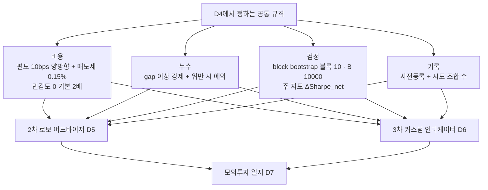
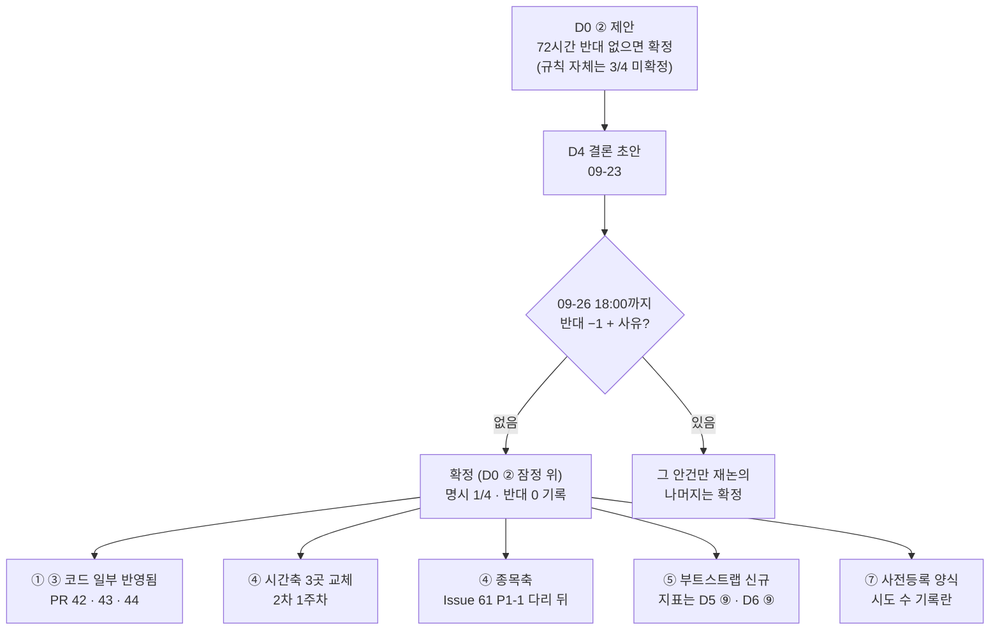
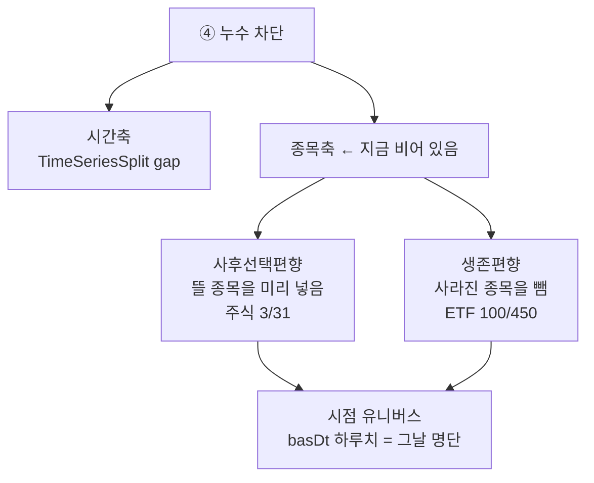
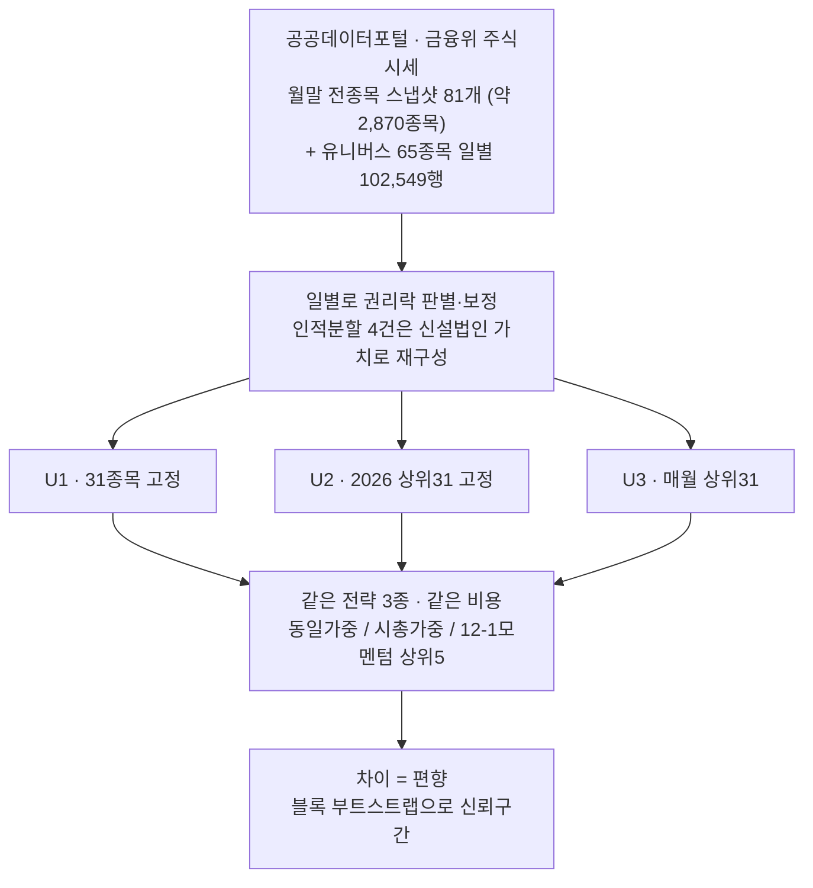

# #17 [논의] D4 1차 프로젝트 매듭짓기 — 비용·누수·검정 규격을 2·3차 공통으로 정합니다

> 🗂️ 옛 GitHub 논의를 옮긴 **기록 문서**입니다 — [색인](../README.md). 원문은 그대로 두고, 링크·커밋 해시만 새 자리 기준으로 바꿨습니다.

| 항목 | 내용 |
|---|---|
| 종류 | 논의 |
| 상태 | 논의 · 설계(1·2·3차) |
| 원 작성 | 이동원(`devlee328288`) · 2026-09-17 12:52 KST |
| 댓글 | 5건 · 답글 3건 |
| 옛 주소 | `github.com/devlee328288/Qurious/discussions/17` (지금은 열리지 않음) |

## 본문

> 🟡 **결론 초안 게시 (2026-09-23)** — 7개 안건 모두 **09-26(토) 18:00 KST 까지 반대가 없으면 확정**합니다. 기대는 규칙(D0 ②)이 아직 3/4 라 "D0 ② 잠정 위의 확정"입니다. 팀원이 D4 안건을 직접 고른 댓글은 0건(명시 1/4 = 제안자)이고 반대도 0건입니다. 새로 찾은 것: **1차 비용 민감도는 라벨의 2배 비용이었습니다.** → **본문 아래 §9 결론**

> 💬 **안건별로 댓글 하나씩** 달아 주세요(예: `① A 👍`, `③ B — 이유 …`). 입력은 [#3](../issues/003.md)(1차 유산) · [#14](../issues/014.md)(A6) · [#16](../issues/016.md)(A7) · [#5](../issues/005.md)(RFP 격차)입니다.

### 0. 쉬운 요약 (처음 보는 분용)

1차(Alpha_Stack)에는 **누수를 막고 비용을 빼고 우연인지 검정하는 장치**가 있었지만, **끝까지 돌려보지 못했습니다.** 2.0(Qurious) 코드에는 **그 장치 자체가 없습니다.**

그래서 이 논의는 **"1차를 되살릴까"가 아니라 "1차가 남긴 규격 중 무엇을 2·3차 공통 규칙으로 쓸까"** 를 정합니다. 여기서 정한 것은 2차(로보 어드바이저)와 3차(커스텀 인디케이터) **양쪽에 똑같이** 적용됩니다.

**한 문장**: 숫자를 만드는 방법(비용·누수·검정)을 먼저 하나로 못 박고, 그다음에 무엇을 만들지 정합니다.

#### 용어 풀이

| 용어 | 정확한 뜻 | 이 논의에서 가리키는 것 | 헷갈리기 쉬운 점 |
|---|---|---|---|
| **비용 규격** | 매매에 드는 돈을 백테스트에서 빼는 규칙 | 수수료·세금·슬리피지를 **몇 %씩, 언제** 뺄지 | "수수료를 넣었다"와 "현실적이다"는 다릅니다. 세금·슬리피지는 별개입니다 |
| **편도 / 왕복** | 한 번 사거나 팔 때 / 사고팔아 한 바퀴 | `cost_bps=10`은 **편도** 0.1% | 왕복으로 착각하면 비용을 절반만 잡습니다 |
| **누수(leakage)** | 그때 알 수 없던 정보가 학습·평가에 섞이는 것 | 교차검증이 미래로 과거를 예측하는 문제(A6 §3) | 에러가 안 나고 **점수만 좋아집니다** |
| **gap (purge)** | 학습 끝과 시험 시작 사이에 **버리는 구간** | `TimeSeriesSplit(gap=...)` | 기본값이 0입니다. 안 적으면 없는 것과 같습니다 |
| **label_horizon** | 판단한 날부터 청산하는 날까지의 거리 | 1차는 **6**, 2.0 코드는 **5** | 이 값보다 gap이 작으면 반드시 누수가 납니다 |
| **주 검정(primary test)** | 결과를 보기 **전에** 정해 둔 단 하나의 판정 기준 | "성과가 우연인가"를 재는 방법 | 여러 지표를 보고 좋은 걸 고르면 검정이 아닙니다 |
| **block bootstrap** | 시계열을 **덩어리째** 다시 뽑아 분포를 만드는 방법 | 1차 ADR 0004의 절차(블록 10 · B=10,000) | 하루씩 섞으면 시계열의 연속성이 깨져 못 씁니다 |
| **과최적화(backtest overfitting)** | 조합을 많이 시도해 **우연히 좋은 것**을 고르는 일 | 커스텀 인디케이터 파라미터 탐색(§2.3) | "검증 구간을 나눴으니 괜찮다"가 **성립하지 않습니다**(원문 인용 §2.3) |
| **MinBTL** | 과최적화를 피하려면 필요한 **최소 백테스트 길이** | 몇 개까지 시도해도 되는지를 역산하는 식 | 데이터가 길어도 시도 횟수가 많으면 소용없습니다 |

---

### 1. 배경: 왜 지금 정해야 하는가

| 이유 | 근거 |
|---|---|
| **2차 시작이 2026-09-27**이라 규격을 먼저 정해야 코드가 갈라지지 않습니다 | [#1](../issues/001.md) 일정 |
| A6에서 **성과 계산 엔진이 5개**이고 **비용을 빼는 건 1개뿐**임이 확인됐습니다 | [#14 §2](../issues/014.md) |
| A7에서 **네 번째 샤프 구현**이 또 발견됐습니다 | [#16 §6.4](../issues/016.md) |
| D7([#13](../discussions/013.md)) ⑥이 **"D4 비용 규격을 그대로 쓴다"** 고 ~~이미 정해 두었습니다~~ 🔴 (09-23 정정) 추천안으로 두었습니다 — 09-17 당시 D7 ⑥ 은 투표 전이었고, 지금도 민석님 조건부 찬성 뒤 D7 §7 규칙으로 확정을 기다립니다 | [#13](../discussions/013.md) |
| 1차 결과보고서가 **"비용 차감 홀드아웃 백테스트와 주 검정을 못 했다"** 고 스스로 적었습니다 | [#3](../issues/003.md) |

> **D4가 정하지 않으면**: 2차와 3차가 각자 비용을 정하고, 발표에서 두 수익률을 나란히 놓을 수 없게 됩니다. 1차에서 실제로 그렇게 됐습니다(모듈마다 왕복비용이 달라 `summarize()` 기본값이 6배로 잡힘 — [#3](../issues/003.md)).

---

### 2. 사실

#### 2.1 1차에 있던 것과 2.0에 없는 것

| 1차 자산 | 하는 일 | 2.0 | 
|---|---|---|
| `_resolve_gap` (Alpha_Stack `evaluation/walk_forward.py#L61-L109` @ `01d8894`) | `gap < label_horizon`이면 **`LeakageError`를 던짐** | **없음** |
| `expanding_splits` 외 2종 (Alpha_Stack `evaluation/walk_forward.py#L112-L177` @ `01d8894`) | 확장·롤링 분할 | `TimeSeriesSplit(gap=0)` 1곳 |
| `apply_cost`·`summarize` (Alpha_Stack `evaluation/metrics.py#L118-L188` @ `01d8894`) | 비용·연율화를 **한 곳에서** 관리 | 엔진마다 0 또는 10bps |
| `overlapping_long_only_returns` (Alpha_Stack `evaluation/overlapping.py#L123-L163` @ `01d8894`) | 자금 5슬리브로 매일 신호 실행 | 없음 |
| `delta_sharpe_net` (Alpha_Stack `evaluation/overlapping.py#L166-L173` @ `01d8894`) | 기준선 대비 순 샤프 차이 | 없음 |
| ADR 0004 block bootstrap (블록 10 · B=10,000 · 시드 20260901) | 우연인지 검정 | 없음 (1차도 미구현) |

1차가 남긴 **미해결 숙제 3가지**([#3](../issues/003.md)):

1. 홀드아웃 비용차감 백테스트와 주 검정을 **하지 못함**
2. 비용 규격이 모듈마다 다름 — 기본 왕복비용 불일치 · **편도 비용을 두 번 뺌** · 연율화 252와 245 혼용
3. `label_horizon` 정의를 **6으로 통일**하기로 했으나 2.0 코드는 5

#### 2.2 2.0에서 새로 확인된 것 (A6·A7)

| 사실 | 출처 | 확실도 |
|---|---|---|
| 성과 엔진 5개 중 비용을 빼는 건 1개, **세금은 0곳** | [#14](../issues/014.md) §2.1 | 🟢 |
| 화면 기본 경로(커스텀 인디케이터)는 `cost_bps`를 받고도 **함수에 넘기지 않음** | [#14](../issues/014.md) §2.2 | 🟢 |
| `cross_val_score(cv=5)` → **StratifiedKFold**, 폴드 0은 미래 표본 347개로 과거 예측 | [#14](../issues/014.md) §3.2 | 🟢 |
| `TimeSeriesSplit`에 **gap 없음** (라벨은 5일 앞) | [#14](../issues/014.md) §3.3 | 🟢 |
| 샤프 정의가 **4가지** (무위험 0/2%, ddof 0/1) | [#14](../issues/014.md) §용어풀이 · [#16](../issues/016.md) §6.4 | 🟢 |
| 승률이 **보유일 기준** — 거래 기준으로 세면 46.03% → 33.33% | [#14](../issues/014.md) | 🟢 |
| 비용 10bps만으로 총수익률 **3.53%p** 변화(매매 41회) | [#14](../issues/014.md) §2.3 | 🟢 실측 |

#### 2.3 외부 조사 — 조합을 많이 시도하면 우연히 좋은 게 나옵니다

**출처**: Bailey, Ger, López de Prado, Sim, Wu, *Statistical Overfitting and Backtest Performance* ([PDF](https://sdm.lbl.gov/oapapers/ssrn-id2507040-bailey.pdf)) · 조회일 2026-09-17 KST. 원 이론은 Bailey et al. 2014.

원문이 보고한 실험(가우시안 난수로 만든 가격 = **예측이 불가능함이 보장된 데이터**):

| 항목 | 값 |
|---|---|
| 탐색한 파라미터 조합 | 55,000개 |
| 백테스트 길이 | 2,500일(약 10년) |
| **In-Sample 샤프 분포 중심** | **0.9** |
| **Out-of-Sample 샤프 분포 중심** | **0.0** |
| 예시 1회 | IS 샤프 **1.59** → OOS 샤프 **−0.18** |

원문 결론 두 가지(직접 인용):

> "there is **no SR threshold or haircut** that can be considered safe"
> "the **hold-out method is not very effective** in preventing backtest overfitting"

**MinBTL(최소 백테스트 길이)** 식으로 "몇 개까지 시도해도 되나"를 역산할 수 있습니다.

```
E[max Z] ≈ (1 − γ)·Φ⁻¹[1 − 1/N] + γ·Φ⁻¹[1 − 1/(N·e)]      γ = 0.5772 (오일러–마스케로니 상수)
MinBTL(년) ≈ ( E[max Z] / 목표샤프 )²
```

**원문 예시 재현 검증** 🟢: 원문은 "5년치 일간 데이터에서 **45개 이상**의 독립 변형을 시도하면, 그중 최고 전략이 **샤프 1.0 이상**일 가능성이 높다"고 적었습니다. 위 식에 N=45, 목표샤프 1.0을 넣으면 **MinBTL = 4.998년** — 원문의 5년과 일치합니다(로컬 계산).

이 식을 **우리 화면**에 적용하면:

| 대상 | 조합 수 N | 필요한 백테스트 길이 | 실제 쓰는 길이 |
|---|---|---|---|
| 커스텀 인디케이터 파라미터 전체 (base 4 × short 29 × mid 118 × rsi 36 × 임계값 46) | **22,667,328** | **29.7년** | **10년** (`period=10y` 고정) |
| 10년으로 안전한 조합 수 | **724개** | 10년 | — |
| 8주 포워드(약 40거래일) | — | — | **1개도 불가** |

> 🟡 조합 수는 [API가 허용하는 범위](https://github.com/EST-team-project/Qurious/blob/04f476a/app/routes/stocks.py#L734-L747)를 정수 단위로 센 **상한**입니다. 사람이 실제로 다 돌리지는 않습니다. 다만 화면에 **저장 기능**([`/custom-indicators`](https://github.com/EST-team-project/Qurious/blob/04f476a/app/routes/stocks.py#L794-L845))이 있어 "좋은 것만 남기기"가 쉽고, **몇 개를 시도했는지 기록이 남지 않습니다.**

---

### 3. 선택지

#### ① 비용 규격

| | 내용 |
|---|---|
| **A** | **매수 편도 10bps + 매도 편도 10bps + 매도 시 세금 0.15%**, 슬리피지 0(기본), 민감도 **0 / 기본 / 2배** 3종 |
| **B** | 왕복 20bps 한 번에 차감(세금 포함해 0.35%), 민감도 동일 |
| **C** | 지금처럼 엔진마다 다르게 두고 **문서로만** 명시 |

세율 근거 🟢 (법령 원문, A6 §5.4):

| 근거 | 시장 | 세율 |
|---|---|---|
| 증권거래세법 시행령 제5조 (시행 2026-01-02) | 유가증권시장 | 영(零) |
| 〃 | 코스닥시장 | 0.15% |
| 농어촌특별세법 제5조 제1항 제5호 (시행 2026-05-12) | 대통령령으로 정하는 증권시장 | 0.15% |

→ **코스피·코스닥 모두 매도 시 실질 0.15%**입니다.

#### ② `label_horizon`

| | 내용 |
|---|---|
| **A** | **6으로 통일** — 1차 정의를 계승. 2.0 피처·라벨을 다시 계산해야 함 |
| **B** | **5 유지** — 2.0 코드 그대로. 1차와 숫자가 달라지므로 비교 시 각주 필요 |
| **C** | 2차는 6, 3차는 별도로 정함 |

> gap은 어느 쪽이든 **label_horizon 이상**이어야 합니다(③④와 연동).

#### ③ 정본 백테스트 엔진

| | 내용 |
|---|---|
| **A** | **`backtest_strategy`(A6의 B3) 하나로** 모으고 나머지는 이 함수를 부르게 바꿉니다 |
| **B** | LEAN 쪽 pandas 경로(B4)를 정본으로 |
| **C** | 2차용·3차용 엔진을 따로 두되 **비용·지표 정의만 공유** |

#### ④ 누수 차단 방법

| | 내용 |
|---|---|
| **A** | **`TimeSeriesSplit(gap ≥ label_horizon)`으로 3곳 교체** + 1차 `_resolve_gap`의 **에러로 막는 아이디어만** 이식(gap이 작으면 예외) |
| **B** | 1차 `walk_forward.py` **모듈 전체 이식** |
| **C** | 지금 코드를 두고 화면에 "참고용" 문구만 추가 |

#### ⑤ 주 검정(성과가 우연인지)

| | 내용 |
|---|---|
| **A** | **block bootstrap 구현** — ADR 0004 절차(블록 10 · B=10,000 · 시드 20260901)를 그대로. 주 지표는 **ΔSharpe_net**(기준선 대비 비용 차감 샤프 차이) |
| **B** | 기술 통계만 보고하고 검정은 하지 않음 (D7 ⑦이 포워드에 대해 택한 방향) |
| **C** | 더 단순한 순열검정(permutation test)으로 대체 |

#### ⑥ 1차가 못 한 홀드아웃 비용차감 백테스트

| | 내용 |
|---|---|
| **A** | **하지 않습니다.** 1차 결과보고서의 한계로 남기고, **2·3차에서 처음부터 이 규격으로** 합니다 |
| **B** | 1차 데이터·코드로 **돌려서 끝냅니다** |
| **C** | 1차 규격만 옮겨 오고, 1차 숫자는 재계산하지 않되 **"미완"임을 발표 자료에 명시** |

#### ⑦ 시도 횟수 기록 (과최적화 대응)

| | 내용 |
|---|---|
| **A** | **사전등록 + 시도 횟수 기록**: 규칙 후보를 정하기 전에 탐색 범위와 개수를 적어 두고, 실제 시도한 조합 수를 남깁니다. §2.3 식으로 "이 데이터 길이에서 몇 개까지"를 계산해 상한을 둡니다 |
| **B** | 상한 없이 탐색하되 **최종 후보만 홀드아웃**으로 검증 |
| **C** | 규칙을 **사람이 이유를 대어** 소수만 고릅니다(그리드 탐색 자체를 안 함) |

---

### 4. 추천안

| 안건 | 추천 | 한 줄 이유 |
|---|---|---|
| ① 비용 규격 | **A** | ~~D7 [#13](../discussions/013.md) ⑥이 이미 이 규격을 전제로 정해졌고, 세율은 법령으로 확인됐습니다~~ 🔴 (09-23 정정) D7 [#13](../discussions/013.md) ⑥ 은 이 규격을 전제로 한 **추천**이었습니다(확정은 D7 §7). 세율은 이 문서 §3 ① 법령 원문이 2026 매도 0.15% 를 가리키고, 코드([#40](../issues/040.md))는 0.20% 라 🟡 재대조 중입니다(§9.9) |
| ② label_horizon | **A (6)** | 1차와 숫자를 비교할 수 있게 됩니다. 다만 ⑦ D1 논의(2·3차를 잇는가)에 따라 B도 무방합니다 |
| ③ 정본 엔진 | **A** | 비용 인자를 이미 가진 유일한 엔진이고, 주 경로 "성과 검증(Python)"이 쓰는 엔진입니다 |
| ④ 누수 차단 | **A** | 모듈 전체 이식(B)은 2주 안에 과합니다. **막아 주는 장치**는 살리고 구현은 가볍게 |
| ⑤ 주 검정 | **A** | 절차가 ADR 0004에 이미 고정돼 있어 다시 설계할 필요가 없습니다. ★ **2026-09-19 보강** — 다만 *주 지표*는 프로젝트마다 달라집니다(4.1) |
| ⑥ 1차 재계산 | **A** | 2주 설계 기간에 1차 코드로 돌아가면 2·3차 준비가 밀립니다 |
| ⑦ 시도 횟수 | **A** | §2.3이 보여주듯 **홀드아웃만으로는 막지 못합니다**. 기록은 비용이 거의 안 듭니다 |

**추천안을 한 장으로**



---

#### 4.1 ★ 2026-09-19 추가 — ⑤가 [#29](../discussions/029.md)의 "관점 도출"과 부딪히나? **아닙니다. 다만 한 칸을 나눠야 합니다**

[#29](../discussions/029.md)에서 강민석님이 3차 방향을 이렇게 적어 주셨습니다.

> *"중요한 것은 1차처럼 개발한 지표로 특정 양의 수익을 내는 것이 목표라기 보다는, 차트의 현 상황을 **어떤 관점으로 어떻게 분석해서 어떤 유의미한 관점을 도출하는가**를 목표로 하면 좋겠습니다."*

그런데 이 문서 ⑤는 주 검정을 **ΔSharpe_net 의 p값**으로 고정하자고 합니다. 얼핏 **"수익이 목표가 아니다"** 와 **"수익 지표로 판정한다"** 가 맞부딪히는 것처럼 보입니다. 짚고 갑니다.

##### (가) 두 가지를 섞어 보고 있었습니다

| | 무엇인가 | ⑤가 정하는 것인가 |
|---|---|:---:|
| **검정 절차** | 어떤 통계량이든 **"이 값이 우연과 구별되는가"를 재는 방법** — 블록 부트스트랩 · 블록 10 · B=10,000 | ✅ **이것이 ⑤입니다** |
| **주 지표** | 그 절차에 **무엇을 넣을 것인가** — ΔSharpe_net · 적중률 · 분포 차이… | ❌ ⑤가 정하는 것이 **아닙니다** |

**블록 부트스트랩은 통계량을 가리지 않습니다.** 수익률이든 적중률이든 분포 거리든, "그 값을 섞어서 다시 재 본다"는 절차는 똑같습니다. 그래서 **절차는 공통으로 두고 지표만 프로젝트별로 고르면 충돌이 사라집니다.**

**용어 — 블록 부트스트랩(block bootstrap)**
- 뜻: 가진 데이터를 **여러 토막(블록)으로 잘라 무작위로 다시 이어 붙이기**를 수천 번 반복해, "우연히 이 정도 값이 나올 확률"을 재는 방법.
- 이 문서에서: 주가처럼 **어제와 오늘이 붙어 있는 자료**는 한 줄씩 섞으면 그 연결이 깨집니다. 그래서 토막째로 섞습니다(블록 10 = 10거래일씩).
- 헷갈리는 점: **무엇을 재는지는 정해 주지 않습니다.** "수익을 재라"는 방법이 아니라 "네가 고른 값이 우연인지 보자"는 방법입니다. 그래서 [#29](../discussions/029.md)의 방향과 부딪히지 않습니다.

```
        ⑤가 정하는 것            프로젝트가 정하는 것
     ┌──────────────────┐      ┌────────────────────────┐
     │ 블록 부트스트랩   │  ←   │ 2차 D5 : ΔSharpe_net    │
     │ 블록 10 · B 10000 │  ←   │ 3차 D6 : 조건부 분포 차이│
     │ 양측 · 사전등록   │  ←   │ (민석님 #29 방향)       │
     └──────────────────┘      └────────────────────────┘
          공통 · 한 번 정하면 끝        프로젝트마다 다름
```

> 🔴 (09-23 정정) 위 그림 왼쪽 칸의 "양측"은 틀렸습니다 — 1차 ADR-AS-0004 §4 는 **단측**입니다(§9.1 용어).

##### (나) D6 ⑨와 이미 맞물려 있습니다 ✅

[D6 #20](../discussions/020.md) ⑨(3차 주 지표)가 [#29](../discussions/029.md)를 받아 **B — 조건부 분포 차이**를 추천하고 있습니다. *"얼마 벌었나" 대신 "분포가 달라지나"* 입니다. 위 (가)의 구조가 그대로 적용됩니다 — **절차는 이 문서 ⑤, 지표는 D6 ⑨.** 두 문서가 충돌하지 않습니다. 🟢

| 프로젝트 | 주 지표 | 정하는 곳 | 검정 절차 |
|---|---|---|---|
| 1차 (끝남) | ΔSharpe_net | — | ⑤ |
| 2차 로보어드바이저 | ΔSharpe_net + 운용정보 8항목 | D5 [#18](../discussions/018.md) ⑨ | ⑤ **그대로** |
| 3차 인디케이터 | **조건부 분포 차이** | D6 [#20](../discussions/020.md) ⑨ | ⑤ **그대로** |

##### (다) 🔴 그런데 [#29](../discussions/029.md)의 방향이 ⑦을 **선택이 아니라 필수**로 만듭니다

민석님은 이렇게도 적으셨습니다 —

> *"각자가 새로운 아이디어를 내며 지표를 **여러개 만들어보고 그 중 좋은 것을 선별**하여 디벨롭하고"*

그리고 —

> *"새로운 지표를 만들고 기존 지표와 결합하여 보았더니 **RSI 과매수 상황에서** 가격이 실제로 하락하는 시점을 포착한다든가"*

**이 두 문장이 다중비교를 두 겹으로 만듭니다.**

```
  겹 1 · 지표를 여러 개 만들고 좋은 것을 고른다
          지표 10개 × 겹 2
  겹 2 · "어떤 상황에서" 강점을 보이는지 조건을 고른다
          조건 5개 (RSI 과매수 · BB 상단 · …)
          ────────────────────────────────
          실질 시도 50회

  이때 유의수준 5%로 재면, 아무 효과가 없어도
  50회 중 한 번쯤은 "유의하다"가 나옵니다 (1 − 0.95^50 ≈ 92%)
```

**용어 — 다중비교(multiple comparisons)**
- 뜻: 여러 번 재 보고 그중 잘 나온 것을 고르면, **우연히 잘 나온 것을 고를 확률**이 함께 올라가는 문제.
- 이 문서에서: ⑦(시도 조합 수 기록)이 막으려는 것이 바로 이것입니다.
- 헷갈리는 점: **부정행위가 아닙니다.** 여러 개 만들어 보는 것은 정상적인 연구 방식이고, [#29](../discussions/029.md)의 제안도 옳습니다. 문제는 **고른 뒤에 "이게 유의하다"고 말할 때** 생깁니다. 몇 번 재 봤는지를 함께 적으면 해결됩니다.

| ⑦ 기록 항목 | 3차에서 채울 값 |
|---|---|
| 사전등록 | 지표 정의·조건·주 지표를 **돌리기 전에** 적는다 |
| 시도 조합 수 | **만든 지표 수 × 시험한 조건 수** |
| 선별 기준 | "좋은 것"을 무엇으로 골랐는지 |

→ ⑦은 §2.3에서 *"기록은 비용이 거의 안 듭니다"* 라는 이유로 추천했는데, [#29](../discussions/029.md) 방향에서는 **없으면 결과를 해석할 수 없는 항목**이 됩니다. 추천 등급을 올려 둡니다. 🟡 → 🔴 필수

##### (라) 한계와 뒤집을 조건

- 🟡 **"조건부 분포 차이"의 구체적 통계량은 아직 정해지지 않았습니다** — D6 ⑨가 A/B/C 중 B로 확정된 뒤에 정합니다. KS 거리·Wasserstein·조건부 기댓값 차이 등 후보가 갈립니다.
- 🟡 블록 길이 10은 1차 규격을 그대로 가져온 값입니다. **조건부 표본은 원래 표본보다 짧아지므로**, 3차에서는 블록 길이를 다시 봐야 할 수 있습니다.
- **뒤집을 조건**: 민석님이 ⑨를 **A(ΔSharpe 그대로)** 로 택하시면 (나)의 표 3행이 2차와 같아지고, 이 절의 (가)·(나)는 불필요해집니다. **(다)는 그래도 남습니다** — 여러 개 만들어 고르는 방식은 지표를 무엇으로 두든 같기 때문입니다.

---

### 5. 근거 · 반례 · 대안 · 한계

#### 반례 (추천안에 반대되는 사실)

| 반례 | 내용 |
|---|---|
| **강민석 님 의견과 부딪힐 수 있습니다** | D1 [#7](../discussions/007.md) 댓글에서 "2차·3차를 각각 깊게, 잇는 것을 목표로 두지 않기"(S3) 의견을 주셨습니다. D4는 **잇는 것이 아니라 규격만 공유**하는 것이지만, ②(label_horizon 6 통일)는 "1차와 맞춘다"는 성격이 있어 S3와 결이 다를 수 있습니다 |
| **block bootstrap은 1차도 못 했습니다** | 절차만 문서에 있고 코드가 없습니다([#3](../issues/003.md)). "이번엔 된다"는 보장이 없습니다 |
| **비용을 빼면 대부분의 전략이 마이너스가 됩니다** | A6 실측에서 비용 0일 때 −12.18%가 10bps에서 −15.71%가 됐습니다. 발표에 불리한 숫자가 나올 수 있습니다 |
| **엔진 통합은 코드 변경 범위가 큽니다** | 5개 엔진을 부르는 화면이 여럿입니다. 2차 시작 전에 끝내기 어려울 수 있습니다 |
| **시도 횟수 상한(724개)은 답답할 수 있습니다** | 3차 커스텀 인디케이터의 재미가 "여러 조합을 돌려보는 것"인데, 상한을 두면 화면의 성격이 바뀝니다 |
| **MinBTL은 독립 시행을 가정합니다** | 파라미터가 조금씩 다른 조합은 서로 독립이 아닙니다. 실제 유효 시행 수는 22,667,328보다 **적습니다** — 29.7년은 보수적인 상한입니다 |

#### 대안

| 대안 | 언제 좋은가 |
|---|---|
| ⑤를 **C(순열검정)**으로 | block bootstrap 구현이 막힐 때. 다만 시계열 연속성을 깨므로 근거가 약해집니다 |
| ③을 **C(엔진 2개)**로 | D1이 S3(각각 깊게)로 확정될 때 |
| ⑦을 **C(사람이 고름)**으로 | 3차 일정이 촉박할 때. 조합 탐색 자체를 안 하면 과최적화 위험이 줄어듭니다 |

#### 한계

| 한계 | 왜 |
|---|---|
| **Alpha_Stack 코드를 이번 세션에 직접 읽지 않았습니다** | [#3](../issues/003.md)의 퍼머링크와 요약을 근거로 했습니다. 이식 난이도는 실제로 열어 봐야 압니다 |
| **A6·A7의 실측은 합성 데이터** | 비용 영향의 크기는 실제 종목에서 달라집니다. 구조는 같습니다 |
| **MinBTL 적용은 상한 추정** | 위 반례 참조. 정확한 유효 시행 수는 계산하기 어렵습니다 |
| **코스닥 농특세 비적용 근거 미확인** | 농어촌특별세법 시행령의 "대통령령으로 정하는 증권시장" 범위를 확인하지 않았습니다(A6 §10) |
| **2차 모의투자 기간이 확정되지 않았습니다** | 강사님 확인 대기([#10](../discussions/010.md) · [#13](../discussions/013.md)). 기간이 정해져야 ⑦의 상한을 숫자로 못 박을 수 있습니다 |

---

### 6. 결론을 뒤집을 조건

| # | 조건 | 뒤집히는 것 |
|---|---|---|
| 1 | D1 [#7](../discussions/007.md)이 **S3(각각 깊게)** 로 확정 | ② label_horizon 통일 · ③ 정본 엔진 하나 |
| 2 | 강사님이 **"백테스트는 교육용 예시로 충분"** 이라고 하심 | ⑤ 주 검정 · ⑦ 시도 기록 |
| 3 | 2차 기간이 **4주 이하**로 짧아짐 | ③④의 코드 변경 범위 — 최소 ①만 적용 |
| 4 | 실제 종목에서 **비용 10bps의 영향이 0.5%p 미만** | ① 민감도 3종의 필요성(그래도 세금은 남습니다) |
| 5 | `backtest_strategy`에 **고치기 어려운 결함**이 발견됨 | ③ A → B 또는 C |
| 6 | block bootstrap 구현이 **1주 안에 안 끝남** | ⑤ A → C |
| 7 | rfp-2 수치 기준(정확도 55% · Sharpe 1.0 · MDD −20%)을 **보고 형식으로 못 박는 방법**이 D5에서 달라짐 | ⑤ 주 지표 정의 |

---

### 7. 결정 기준

1. **2차 시작(09-27) 전에 코드에 반영할 수 있는가** — 규격은 정하되 구현은 단계적으로 나눌 수 있습니다.
2. **1차 발표에서 지적받은 것을 반복하지 않는가** — "결론은 있는데 심층 분석이 없다"(강사님 피드백 ②).
3. **발표에서 한 문장으로 설명되는가** — "비용을 빼고도 기준선보다 나은가"를 하나의 숫자로 답할 수 있어야 합니다.
4. **불리한 결과가 나와도 그대로 보고할 수 있는 형식인가** — 사전등록의 목적입니다(강사님 피드백 ④ "결론에 집착하지 않는다").

---

### 8. 결정 기한과 담당자

- **기한**: **2026-09-27(일) 23:59 KST** (2차 프로젝트 시작일)
- **확정 방식**: D0([#6](../discussions/006.md)) ② 제안에 따릅니다. D0에서 방식이 바뀌면 그에 따릅니다.
- **담당**: **따로 지정하지 않습니다.** 결정 뒤 구현 단계에서 D0([#6](../discussions/006.md)) ⑤ 역할 분배 안에서 나눕니다
  (예: ①③④⑤는 백테스팅·성과지표 쪽, ②⑦ 기록 양식은 문서화 쪽). D0가 확정되면 그에 맞춥니다.
- **①③④는 2차 시작 전에 코드 반영이 필요**합니다. ⑤⑥⑦은 규격만 정하고 구현은 2차 안에서 해도 됩니다.

파생될 작업(결정 후 Issue로):

| 결정 | 파생 작업 |
|---|---|
| ① | 비용·연율화 상수를 한 모듈로 모으기 · `backtest_custom_indicator`에 `cost_bps` 연결 |
| ③ | 엔진 5개 → 1개 통합, 화면 연결 수정 |
| ④ | `cross_val_score`·`GridSearchCV`·`TimeSeriesSplit` 3곳 교체 + gap 강제 |
| ⑤ | block bootstrap 구현 + ΔSharpe_net 산출 |
| ⑦ | 사전등록 양식 · 시도 조합 수 기록란 |

---

### 9. 결론 — 초안 (2026-09-23)

~~(결정 후 댓글로 남깁니다)~~ — 🔴 2026-09-18 운영 규칙 변경으로 **결론은 본문에 적고 댓글엔 요약만** 남깁니다. 원래 있던 체크리스트(①~⑦ · 파생 Issue)는 9.2 결론표와 9.6 파생 작업 표로 옮겼습니다.

#### 9.0 쉬운 요약 (3줄)

1. **7개 안건 모두 초안을 냈습니다.** 뼈대는 09-17 추천안(전부 A)이고, 그사이 실측·구현으로 **사실이 바뀐 곳(①③④⑤⑥⑦)** 만 고쳐 적었습니다(9.4).
2. **팀원이 D4 안건을 직접 고른 댓글은 0건, 반대도 0건**입니다. 민석님 발언은 D6 ⑨·D7 투표·의견·수신 확인이라 D4 찬성으로 세지 않았습니다.
3. **2026-09-26(토) 18:00 KST 까지 반대가 없으면 확정**하되, 기대는 규칙(D0 ②)이 아직 3/4 라 **"D0 ② 잠정 위의 확정"** 입니다. 반대는 `④ −1 — 사유`처럼 안건 번호를 붙이면 **그 안건만** 빠집니다.

#### 9.1 처음 나오는 용어

| 용어 | 뜻 | 이 문서에서 | 헷갈리는 점 |
|---|---|---|---|
| **lazy consensus** (느슨한 합의) | 정한 기간 안에 반대가 없으면 통과로 보는 규칙 | 초안 게시 뒤 72시간 동안 `−1 + 사유`가 없으면 확정 | **"찬성했다"는 뜻이 아닙니다** — 그래서 명시 찬성 수를 따로 적습니다 |
| **시행일 구간표** | 세율이 바뀐 날을 순서대로 적고, 어떤 날의 세율은 그날 이하 가장 늦은 줄로 읽는 표 | 매도세(거래세+농특세) — `trading_cost.py` `TAX_SCHEDULE` (9.6 링크) | 바뀐 점은 **"연도를 상수로 두지 않는다"** 입니다. 2026 값 자체는 🟡 재대조 중(9.9) |
| **민감도 기준선** | 비용 가정을 몇 단계로 정해 두고 단계마다 같은 계산을 다시 하는 기준점 | 1차가 쓴 왕복 총비용 4개를 그대로(9.4 ①) | 주 결과(실제 요율)와 **따로** 돌리는 비교용입니다 |
| **단측 / 양측 검정** | "한 방향(더 크다)"만 보느냐 / "다르기만 하면" 보느냐 | 2차 ΔSharpe_net 은 단측, 3차 분포 차이는 양측 | 1차 ADR-AS-0004 는 **단측**입니다. 4.1 그림의 "양측"은 본문에서 고쳤습니다 |

#### 9.2 결론표

범례 — **제안** = 제안자(이동원, 찬성으로 셈) · **✅ X (MM-DD)** = 명시 찬성 · **✅ᶜ** = 조건부 찬성(조건에 제안자가 답함 · 투표자 재확인 없음 · n/4 에 넣지 않고 "+ ✅ᶜ n" 으로 따로 적음) · **💬** = 이 논의 안건을 향한 말이지만 선택지를 고르지 않음(세지 않음) · **—** = 이 논의에서 발언 없음 · **🔴** = 반대. **n/4 는 제안과 ✅ 만 센 값입니다.**

<!-- 결론표:시작 -->
| 안건 | 결론(초안) | 이동원 | 강민석 | 신장환 | 오준영 | 확정 규칙 | 상태 |
|---|---|:-:|:-:|:-:|:-:|---|---|
| ① 비용 규격 | A 구조(매수·매도 편도 따로 · 매도세는 매도에만 · **연도별 법령 세율표**) · 주 결과 슬리피지 10bp 가정 · **민감도 기준선 = 1차 4수준 그대로** + 무비용 대조 | 제안 | — | — | — | 72시간 반대 없음 (D0 ② 제안) | 🟢 확정 예정 (09-26 18:00) · 명시 1/4 · 반대 0 · D0 ② 잠정 위 |
| ② label_horizon | **A — 6.** gap ≥ 6 을 기본값으로 | 제안 | — | — | — | 72시간 반대 없음 (D0 ② 제안) | 🟢 확정 예정 (09-26 18:00) · 명시 1/4 · 반대 0 · D0 ② 잠정 위 |
| ③ 정본 엔진 | ~~A 엔진 하나~~ → **C′** 파이썬 경로는 그대로 두고 **비용 모델·지표 정의만 한 곳**. LEAN(야후·무비용)은 정본에서 뺌 | 제안 | — | — | — | 72시간 반대 없음 (D0 ② 제안) | 🟢 확정 예정 (09-26 18:00) · 명시 1/4 · 반대 0 · D0 ② 잠정 위 |
| ④ 누수 차단 | **A + 종목축** — 3곳을 `gap ≥ label_horizon` 으로 교체, 어기면 예외. 유니버스는 **날짜별 명단**(시점 유니버스) | 제안 | — | — | — | 72시간 반대 없음 (D0 ② 제안) | 🟢 확정 예정 (09-26 18:00) · 명시 1/4 · 반대 0 · D0 ② 잠정 위 |
| ⑤ 주 검정 | **A — 절차만 공통**: stationary block bootstrap · 기대 블록 10거래일 · B 10,000 · 시드 20260901. **주 지표·방향은 프로젝트별**(D5 ⑨ · D6 ⑨) | 제안 | 💬 의견 | — | — | 72시간 반대 없음 (D0 ② 제안) | 🟢 확정 예정 (09-26 18:00) · 명시 1/4 · 반대 0 · D0 ② 잠정 위 |
| ⑥ 1차 재계산 | **A — 하지 않음.** 1차 주 검정 미수행과 **비용 2배 계산**(9.4 ①)을 1차 보고서의 한계로 남김 | 제안 | — | — | — | 72시간 반대 없음 (D0 ② 제안) | 🟢 확정 예정 (09-26 18:00) · 명시 1/4 · 반대 0 · D0 ② 잠정 위 |
| ⑦ 시도 횟수 기록 | **A — 필수**(사전등록 + 시도 조합 수) + 상위 조합은 봉인 구간에서 순위 유지를 한 번 더 확인 | 제안 | — | — | — | 72시간 반대 없음 (D0 ② 제안) | 🟢 확정 예정 (09-26 18:00) · 명시 1/4 · 반대 0 · D0 ② 잠정 위 |
<!-- 결론표:끝 -->

**명시 1/4 = 제안자 한 명.** 🟢 09-23 11:40 KST 댓글·답글 전수 조회. 투표 뒤 본문이 바뀐 안건: **없음**(D4 안건 투표 0건).

#### 9.3 확정 규칙 — 원문과 계산

> D4 §8: **확정 방식**: D0([#6](../discussions/006.md)) ② 제안에 따릅니다. D0에서 방식이 바뀌면 그에 따릅니다.
>
> D0 ② A: **담당자가 결론 초안 댓글 → 72시간 안에 반대(−1 + 사유)가 없으면 확정(lazy consensus). 단, D1 목표·D2 비용·⑤ 역할은 4명 전원이 명시적으로 찬성**

| 따져 볼 것 | 답 | 확실도 |
|---|---|:-:|
| D4 가 전원 찬성 예외인가 | 아닙니다. 예외는 D1 목표 · D2 비용 · D0 ⑤ 역할 셋 | 🟢 |
| "D2 비용"이 D4 ① 비용 규격인가 | 아니라고 읽습니다. D2([#10](../discussions/010.md))는 **돈을 쓰는 결정**(유료 서비스), D4 ①은 백테스트에서 **빼는 비용의 계산 규칙** — 원문은 "D2 비용"뿐이라 해석입니다(D2 [#10](../discussions/010.md) §7.2 와 같은 읽기) | 🟡 |
| 확정 시각 | 09-23 게시 → 72시간 이상 → 통일 시각 **09-26(토) 18:00** | 🟢 |
| 기대는 규칙(D0 ②)은 확정인가 | 🔴 **아닙니다.** D0 ②는 전원 명시 찬성이 필요하고 지금 **3/4**(민석 09-15 · 장환 09-18 · 제안), 준영님 발언 0건 | 🟢 |

그래서 이렇게 둡니다(D7 [#13](../discussions/013.md) 과 같은 문장):

> 09-26(토) 18:00 KST 까지 반대(사유 포함)가 없으면 확정하되, 기대는 규칙(D0 [#6](../discussions/006.md) ②)이 아직 명시 찬성 3/4 라 **"D0 ② 잠정 위의 확정"** 으로 표시합니다. D0 ② 가 확정되면 이 꼬리표를 떼고, D0 ② 에 반대가 나오면 이 안건들은 "잠정(미합의)"으로 내립니다. 무응답을 찬성으로 세지 않습니다.

```
09-17  D4 게시 — 추천안 ①~⑦ 전부 A
09-18  S21·S22 실측 — ④에 종목축 (CAGR +5.36%p)
09-19  4.1 신설 — ⑤ 절차와 지표를 나눔 · ⑦ 필수
09-20  ① 조사 — 매도세가 해마다 다름 · ③ 비용 모델
09-21  민석 — D6 ⑨ B 동의 15:29 · 확인 17:21
09-23  ▶ 결론 초안 게시 · 1차 비용 2배 계산 발견
09-26  ▶ 18:00 반대 없으면 확정 (D0 ② 잠정 위)
09-27  23:59 논의 기한 · 2차 시작
```

#### 9.4 추천안(09-17) → 초안(09-23): 무엇이 왜 바뀌었나

| 안건 | 09-17 추천안 | 09-23 초안 | 왜 | 근거 |
|---|---|---|---|---|
| ① | 편도 10bps + 매도세 0.15% · 슬리피지 0 · 민감도 "0·기본·2배" | 세목별 요율표 + **세율 시행일 구간표** · 주 결과 슬리피지 10bp · 민감도 기준선 **1차 4수준 그대로** | 매도세가 해마다 다름([#40](../issues/040.md)) · [#42](../pulls/042.md) 구현 · 민석님 D7 ⑥-1 조건 *"1차에서 적용해본 비용 4수준을 그대로"* | 🟢 09-20 댓글 · [`trading_cost.py:36-94`](https://github.com/EST-team-project/Qurious/blob/3b12100/app/services/trading_cost.py#L36-L94) |
| ② | A (6) | 그대로 | 근거 보강 — 1차 보고서 *"하루 겹친다. 다음 봉인에서는 간격을 6거래일로 둔다."* | 🟢 Alpha_Stack `build_final_report.py:1046-1053` (Alpha_Stack `scripts/build_final_report.py#L1046-L1053` @ `6ab9a37`) |
| ③ | A 엔진 하나 | C′ 비용·지표 정의만 공유 | 시그널을 만드는 방식이 경로마다 달라 합치기 비쌈 · 구현이 이미 공통 비용 모델로 감(09-20, 이의 없음) · LEAN 은 야후라 정본이 될 수 없음 | 🟢 09-20 댓글 · `lean_backtest.py:212` (9.6 링크) |
| ④ | A 시간축 | A + **종목축** | 31종목 고정이 CAGR +5.36%p 부풀림(모멘텀 +11.55%p) — 다만 6.6년으로는 유의하지 않음(p=0.368) | 🟢 S22 실측 |
| ⑤ | A · 주 지표 ΔSharpe_net | A · **절차만 공통**, 지표·방향은 프로젝트별 | 민석님 [#29](../discussions/029.md) "관점 도출" · 1차 절차는 단측 | 🟢 4.1 · ADR-AS-0004 §4 (9.6 링크) |
| ⑥ | A 하지 않음 | 그대로 + 한계에 **비용 2배 계산** 추가 | 아래 ① 🔴 | 🟢 코드 |
| ⑦ | A | A **필수** + 봉인 구간 재확인 | 조합 순위(민석님 제안)가 시도 수를 늘림 | 🟢 4.1(다) · 09-21 16:09 답글 |

**① 민감도 기준선 — 1차 4수준을 그대로** 🟢 Alpha_Stack `run_cost_sensitivity.py:20-32` (Alpha_Stack `backtest/run_cost_sensitivity.py#L20-L32` @ `6ab9a37`)

| 기준선 | 1차 키 | 1차 라벨 (왕복) | 2차 구현 `FlatCostModel` (편도) | 1차 숫자와 맞댈 때 (편도) |
|---|---|--:|--:|--:|
| 대조 | — | 0 | `NoCostModel` | — |
| 1 | `etf` | 0.05% | 2.5bp | 5bp |
| 2 | `stock_min` | 0.23% | 11.5bp | 23bp |
| 3 | `stock_slip` | 0.30% | 15bp | 30bp |
| 4 | `stress` | 0.50% | 25bp | 50bp |

- **주 결과는 따로** `KrxCostModel` 로 냅니다 — 연도별 법령 세율 + 수수료·제비용 + 슬리피지 10bp 편도(🟡 가정, [`trading_cost.py:91-94`](https://github.com/EST-team-project/Qurious/blob/3b12100/app/services/trading_cost.py#L91-L94)). 기준선 네 개는 "비용을 얼마나 보수적으로 보면 결론이 바뀌나"를 1차와 **같은 잣대**로 보는 비교용입니다.
- 🔴 **새로 확인 — 1차 비용 민감도는 라벨의 2배 비용으로 계산됐습니다.** 1차 엔진은 `trade_cost` 를 매수·매도에 각각 떼는데(`backtest_strategies.py:353-382` (Alpha_Stack `backtest/backtest_strategies.py#L353-L382` @ `6ab9a37`)), "왕복"이라 적힌 값을 그대로 넘겼습니다(`run_cost_sensitivity.py:95-115` (Alpha_Stack `backtest/run_cost_sensitivity.py#L95-L115` @ `6ab9a37`)). 비용을 무겁게 본 **보수 쪽 오류**라 1차 성과가 부풀려지지는 않았지만, 1차가 보고한 **손익분기 비용은 왕복 기준으로 절반**으로 적혀 있습니다. 그래서 2차 구현은 라벨 뜻(왕복)을 따르고, 1차 숫자와 맞댈 때만 오른쪽 열을 씁니다.

```
 라벨 "왕복 0.23%"      1차가 실제로 뗀 것
 ──────────────        ─────────────────────────
 매수 + 매도 = 0.23%   매수 0.23% + 매도 0.23% = 0.46%
```

- 🟡 Qurious `FlatCostModel` 도 편도로 뗍니다(`(buy_turn + sell_turn) * rate`, [`trading_cost.py:456-487`](https://github.com/EST-team-project/Qurious/blob/3b12100/app/services/trading_cost.py#L456-L487)). 라벨 "왕복 대칭 10bp"는 실제 왕복 20bp 라 라벨을 고칩니다(9.6).
- 버린 안: 09-20 검증 스크립트의 S0~S3(무비용·슬리피지 0·10·20bp)를 기준선으로 쓰는 안 — 민석님 조건 "그대로"와 1차 잣대를 우선했습니다. S0~S3 는 주 결과의 슬리피지 민감도 도구로 남습니다([`verify_trading_cost.py:117-123`](https://github.com/EST-team-project/Qurious/blob/3b12100/scripts/verify_trading_cost.py#L117-L123)).

**팀원 발언 — 안건별 대응** (원문 · 출처 · 어떻게 셌나)

| 안건 | 발언 | 셈 |
|---|---|---|
| ① | 강민석 [#13](../discussions/013.md) 09-21 15:26 *"1차에서 적용해본 비용 4수준을 그대로 사용해도 되지만"* · 17:18 *"4개의 기준선들입니다"* | D7 스레드의 말(D7 ⑥-1 조건)이라 이 표 칸은 — · 내용은 ① 기준선에 그대로 반영 |
| ② | (없음) · 🟡 민석님 D7 ⑥-2 P3 ✅(09-21) — 다음 거래일 시가 체결이면 판단→청산이 6일이라 A(6)와 맞물림 | 추론만 · 세지 않음 |
| ③ | (없음) — 09-20 *"엔진을 합치는 쪽이 낫다고 보시면 그렇게 바꿀 수 있습니다"* 에 답 없음 | 반대 아님 · 찬성도 아님 |
| ⑤ | 강민석 [#17](../discussions/017.md) 09-21 15:29 *"D6 9의 B 동의합니다."* — 이 스레드 4.1 절(⑤ 절차·지표 분리)에 단 답글 | 💬 (D6 ⑨ 투표는 D6 에서 셈) |
| ⑦ | 같은 답글 *"조합을 돌려보고 가장 같이 사용했을 때 좋았던 순위를 매겨보는"* | 3차 제안이라 칸은 — · 시도 수를 늘리므로 ⑦ 기록 대상 |
| 전체 | 강민석 [#17](../discussions/017.md) 09-21 17:21 *"확인했습니다"* | 수신 확인(직전 이동원 16:09 답글) · 세지 않음 |
| ①~⑦ | 신장환 · 오준영 — D4 안건 발언 0건 | — |

#### 9.5 확정 흐름과 선행 조건



#### 9.6 파생 작업 (원래 §8 표 · §9 체크리스트를 옮김)

| 결정 | 파생 작업 | 상태 | 재사용 | 대표 위치 | 선행 |
|---|---|:-:|:-:|---|---|
| ① | 비용 요율을 한 모듈로 (세율 시행일 구간표) | ✅ PR [#42](../pulls/042.md)·[#43](../pulls/043.md)·[#44](../pulls/044.md) | ✅ 그대로 | [`trading_cost.py:61-86`](https://github.com/EST-team-project/Qurious/blob/3b12100/app/services/trading_cost.py#L61-L86) | — |
| ① | `TAX_SCHEDULE` 2026 행 재대조 (코드 0.20% vs 법령 DB 0.15%) | [ ] | 🟡 한 줄 | 같은 곳 · [#40](../issues/040.md) | 확정 전 |
| ① | 커스텀 인디케이터 경로에 비용 연결 | ✅ | ✅ 그대로 | [`stocks.py:776-790`](https://github.com/EST-team-project/Qurious/blob/3b12100/app/routes/stocks.py#L776-L790) | — |
| ① | ML 파이프라인 라우트에 비용 넘기기 (지금 무비용) | [ ] | 🟡 인자 하나 | [`quant.py:31-36`](https://github.com/EST-team-project/Qurious/blob/3b12100/app/routes/quant.py#L31-L36) | — |
| ① | 기준선 4개(1차 그대로) + 1차 비교용 2배 판을 한 번에 | [ ] | 🟡 이식 | [`trading_cost.py:456-487`](https://github.com/EST-team-project/Qurious/blob/3b12100/app/services/trading_cost.py#L456-L487) ← 1차 `COST_PRESETS` | ① 확정 |
| ① | `FlatCostModel` 라벨 정정 (왕복 대칭 10bp → 편도 10bp · 왕복 20bp) | [ ] | ✅ 문구만 | 같은 곳 | — |
| ①③ | 샤프·연율화 정의를 한 곳으로 (확인 3벌 · RTM 은 4개) | [ ] | 🟡 이식 | [`ta_utils.py:56-59`](https://github.com/EST-team-project/Qurious/blob/3b12100/app/services/ta_utils.py#L56-L59) · [`ml.py:130-132`](https://github.com/EST-team-project/Qurious/blob/3b12100/app/routes/ml.py#L130-L132) · [`lean_backtest.py:399-402`](https://github.com/EST-team-project/Qurious/blob/3b12100/app/services/lean_backtest.py#L399-L402) | — |
| ③ | ~~엔진 5개 → 1개 통합, 화면 연결 수정~~ 🔴 C′로 바뀌어 취소 | — | — | — | — |
| ③ | LEAN 결과에 "정본 아님(야후·무비용)" 표시 · RTM P02-①-3 매핑 재검토 | [ ] | ✅ 문구만 | [`lean_backtest.py:200-212`](https://github.com/EST-team-project/Qurious/blob/3b12100/app/services/lean_backtest.py#L200-L212) | — |
| ④ | `cross_val_score`·`GridSearchCV`·`TimeSeriesSplit` 3곳 교체 + gap 강제 | [ ] | 🟡 1차 `_resolve_gap` 이식 | [`ml_models.py:122-128`](https://github.com/EST-team-project/Qurious/blob/3b12100/app/services/ml_models.py#L122-L128) · [`:186-191`](https://github.com/EST-team-project/Qurious/blob/3b12100/app/services/ml_models.py#L186-L191) · [`investment_research.py:160-172`](https://github.com/EST-team-project/Qurious/blob/3b12100/app/services/investment_research.py#L160-L172) | ② 확정 |
| ④ | 시점 유니버스 (날짜 t 의 명단은 t 데이터로만) | [ ] | ❌ 새로 (데이터는 있음) | [`collector/db.py:61-80`](https://github.com/EST-team-project/Qurious/blob/3b12100/collector/db.py#L61-L80) · [`stock.py:15-47`](https://github.com/EST-team-project/Qurious/blob/3b12100/app/services/stock.py#L15-L47) | [#61](../issues/061.md) P1-1 |
| ⑤ | stationary block bootstrap (중심화 p · 방향 인자) | [ ] | ❌ 새로 (1차도 명세만, 저장소 0줄) | ADR-AS-0004 §4 (Alpha_Stack `docs/decisions/0004-사전등록.md#L88-L104` @ `6ab9a37`) | — |
| ⑤ | ΔSharpe_net 산출 (2차) | [ ] | 🟡 이식 | Alpha_Stack `overlapping.py:166-173` (Alpha_Stack `evaluation/overlapping.py#L166-L173` @ `6ab9a37`) | ①③ |
| ⑦ | 사전등록 양식 · 시도 조합 수 기록란 | [ ] | ❌ 새로 (지금 파라미터 6칸뿐) | [`trading.py:124-134`](https://github.com/EST-team-project/Qurious/blob/3b12100/app/models/trading.py#L124-L134) | — |
| ⑦ | 상위 조합 봉인 구간 재확인 절차 | [ ] | ❌ 새로 | D6 [#20](../discussions/020.md) ⑨ 에 적기로 함(09-21) | D7 ⑦ |
| 공통 | 파생 Issue 생성 후 [#1](../issues/001.md) 「결정 요약」에 한 줄 · ADR(D4 비용 규격 — D0 ③ 후보) · RTM 에 D4 연결 | [ ] | — | [#1](../issues/001.md) · `docs/ADR/` · [`RTM_v1.0.md:215-222`](https://github.com/EST-team-project/Qurious/blob/3b12100/docs/요구사항/RTM_v1.0.md#L215-L222) | 확정 뒤 |

담당은 §8대로 **지정하지 않습니다** — D0 ⑤(역할)가 확정되면 그 역할표로 나눕니다.

#### 9.7 가장 무거운 파생 작업 — ④ 누수 차단 (바꾸기 전 / 바꾼 뒤)

```
바꾸기 전 (3b12100)               바꾼 뒤 (초안)
──────────────────────────        ──────────────────────────
ml_models.py:124                  한 splitter 를 같이 씀
  cross_val_score(cv=5)             시간순 · gap = 6
  → 미래 표본으로 과거 예측
ml_models.py:190                  GridSearchCV(cv=같은 것)
  GridSearchCV(cv=3) 같은 문제
investment_research.py:172        TimeSeriesSplit(
  TimeSeriesSplit(n) gap=0          n, gap=6)
(검사 없음)                       gap < 6 → LeakageError
                                    (1차 규칙 3개만 이식)
stock.py:15-47                    날짜 t 명단 = price_daily
  31종목 고정                       t 시점 시총 상위 N
```

- 줄 수 🟡: 3줄 교체 + 가드 약 20줄(1차 `_resolve_gap` (Alpha_Stack `evaluation/walk_forward.py#L61-L109` @ `6ab9a37`) 49줄 중 규칙 3개) + 명단 조회 1개. 종목축은 수집 DB 와 앱이 이어진 뒤에 됩니다([`ERD_v1.0.md:32-34`](https://github.com/EST-team-project/Qurious/blob/3b12100/docs/데이터/ERD_v1.0.md#L32-L34)).
- 🔴 §8은 ④를 "2차 시작 전 코드 반영"으로 적었지만 **09-27 전에는 못 합니다.** 2차 1주차로 두고, 그 전 ML 교차검증 점수엔 "누수 가능"을 붙입니다.

#### 9.8 결론을 뒤집을 조건

| # | 조건 | 뒤집히는 것 |
|---|---|---|
| 1 | 2026 매도세 재대조가 끝남(코드 0.20% vs 법령 DB 0.15%) | ① 세율표 한 줄 (구조는 그대로) |
| 2 | 실전 요율 조회([#54](../issues/054.md))가 요율표와 1원 넘게 어긋남 · 호가로 슬리피지를 실측 | ① 수수료 칸 · 기본 10bp |
| 3 | 같은 신호를 두 경로가 다른 수익으로 계산하는 사례 | ③ C′ → A (엔진 하나) |
| 4 | D5 ①이 유니버스를 규칙(시총 상위 N)으로 정함 · 백테스트 시작을 2022-02 이후로 | ④ 종목축 구현 방식 (S21) |
| 5 | 부트스트랩이 1주 안에 안 끝남(§6-6) · 3차 조건부 표본이 짧아 p 가 안 나옴 | ⑤ A → C · 3차 지표 → ΔSharpe |
| 6 | 강사님 답(여쭐 것 ⑧)이 "백테스트는 교육용 예시로 충분" | ⑤ · ⑦ |
| 7 | ⑤ 구현 뒤 1차 예측 파일로 한 번 돌리는 데 반나절 이하 | ⑥ A → B (1차를 실제로 닫음) |
| 8 | D0 ② 에 반대가 나옴 | 일곱 안건 전부 "잠정(미합의)" (9.3) |

#### 9.9 한계 · 정정 기록 · 강사님께 여쭐 것

- 🟡 **2026년 매도세는 두 판독이 어긋납니다.** 이 문서 §3 ①(09-17)과 법령 DB 현행 증권거래세법 시행령 제5조(2026-01-02 시행판 · 09-23 재조회)는 코스피 영(零) + 농특세 0.15% · 코스닥 0.15% → **0.15%**, 코드 `TAX_SCHEDULE`(09-20 · [#40](../issues/040.md))은 **0.20%**(대통령령 제36001호 인용 — 이 호수는 조회로 확인되지 않음). 법령 DB 가 맞으면 코드가 2026 매도 비용을 0.05%p 과대계상합니다. ① 은 "연도별 법령 세율표"라는 **구조**를 정하는 것이라 이 값과 무관하게 확정할 수 있습니다.
- 🔴 **1차 주 검정은 한 번도 돌지 않았고**, 1차 비용 민감도는 **라벨의 2배 비용**이었습니다(9.4 ①). ⑥ A는 둘 다 1차 보고서의 한계로 남기는 선택이라 **1차 결론은 열린 채로** 갑니다.
- 🔴 **2.0 백테스트는 아직 야후 캔들 위에서 돕니다**([`stock.py:214-222`](https://github.com/EST-team-project/Qurious/blob/3b12100/app/services/stock.py#L214-L222)). ①④⑤를 정해도 실데이터 검증은 [#61](../issues/061.md) P1-1 다리 뒤입니다.
- 🟡 S22 부트스트랩은 **월 단위 블록 10개(10개월)** 였고 ADR 의 10은 **10거래일**입니다 — 블록 단위를 사전등록 항목에 넣습니다.
- 정정 기록(댓글은 고치지 않음): [#17](../discussions/017.md) 이동원 09-20 12:23 댓글 ~~"비용만 한 곳에서 받게 했습니다"~~ → 🔴 네 갈래 중 **파이썬 세 갈래**만 같은 비용 모델을 받습니다(LEAN 은 무비용 — ③ C′ 에서 정본 제외). 본문 안 정정 3곳(§1 "이미 정해 두었습니다" · §4 ① 이유 · 4.1 그림 "양측")은 그 자리에 취소선으로 고쳤습니다.

**강사님께 여쭐 것** (결정 대장 번호 · 전체 목록은 `docs/계획서/논의결정대장_v0.9.md` §5)

| # | 질문 | D4 에 걸리는 곳 |
|---|---|---|
| ① | 발표일·모의투자 기간 | ⑦ 시도 상한(MinBTL)을 숫자로 못 박으려면 필요(§5 한계) |
| ⑧ | 합격선 묶음 — "우연이 아님"을 통계 검정(블록 부트스트랩)으로 보여야 하는지, 기술 통계로 충분한지 | ⑤ · ⑦ · 뒤집을 조건 6 |

<sub>기준 커밋: Qurious `3b12100` · Alpha_Stack `6ab9a37` · 발언 조회 2026-09-23 11:40 KST(댓글+답글 전수) · 확정 규칙은 D4 §8 · D0 ② 원문만으로 계산</sub>
---

<sub>기준 커밋: Qurious `04f476a` · Alpha_Stack `01d8894` · 조회일 2026-09-17 KST · MinBTL 계산은 원문 예시(N=45 → 5년)를 재현해 검증한 뒤 적용했습니다</sub>

---

## 댓글 5건 · 답글 3건

---

<a id="discussioncomment-18493769"></a>

### 💬 1. 이동원(`devlee328288`) · 2026-09-18 13:00 KST

> **S21 실측 공유.** A4 [#23](../issues/023.md)을 조사하다 ④(누수 차단)에 **빠진 축**이 하나 있다는 걸 확인했습니다. 결론을 내자는 것이 아니라, ④ 선택지에 **한 줄 추가할 것**이 있는지 봐 주십사 올립니다.

### 쉬운 요약 3줄

1. ④의 A안(`TimeSeriesSplit(gap ≥ label_horizon)`)은 **시간축** 누수를 막습니다. 잘 고른 방향입니다.
2. 그런데 누수에는 **종목축**도 있습니다. 우리 31종목 명단은 **2026년 기준**인데, 그걸 그대로 2020년부터 돌리면 gap을 아무리 줘도 막지 못합니다.
3. 실측: **31종목 중 3개가 2020-01-02에 아직 상장 전**이었습니다. KRX 공식 API로 교차확인했습니다. 🟢

### 한눈에 보기

| 누수의 축 | 무엇이 새는가 | ④ A안이 막는가 | 확실도 |
|---|---|:---:|:---:|
| **시간축** | 라벨 기간이 학습 구간과 겹침 | ✅ `gap ≥ label_horizon`이 막음 | 🟢 |
| **종목축** ← 새로 확인 | **미래에 상장할/살아남을 종목**을 과거 유니버스에 넣음 | ❌ **못 막음** | 🟢 실측 |

### 용어 풀이

| 용어 | 한 줄 뜻 |
|---|---|
| 시점 유니버스 (point-in-time universe) | "그날 실제로 거래되던 종목"만으로 매일 명단을 다시 만드는 것 |
| 사후선택편향 | 나중에 뜬 종목을 과거에 미리 넣어 성과가 좋아 보이는 잘못 |
| 생존편향 | 나중에 사라진 종목을 빼서 성과가 좋아 보이는 잘못 |

<details><summary><b>자세히</b> — 둘은 반대 방향입니다</summary>

**사후선택편향**은 *뜰 종목을 미리 넣어서*, **생존편향**은 *망한 종목을 빼서* 성과가 좋아 보입니다. 이름이 비슷해 같은 것으로 오해하기 쉽지만 **방향이 반대**이고, **동시에 일어날 수 있습니다.** 지금 우리 유니버스가 정확히 그 경우입니다 — 2026년의 대형주 31개는 (a) 그 사이 상장한 종목을 포함하고 (b) 그 사이 밀려난 종목을 제외한 명단이기 때문입니다.

**"시점 유니버스"**는 이 둘을 한 번에 막는 표준 처방입니다. 종목을 고정하지 않고 **날짜마다 그날의 명단을 다시 만듭니다.**

</details>

### 실측 — KRX 공식 OpenAPI 교차검증 🟢

상장일 **전날엔 없고 당일엔 있으며**, 그날 전 종목 수가 **정확히 1 늘어납니다.**

| 종목 | 코드 | 상장일 | KRX 전 종목 수 | 포털 최초일 | 두 기관 종가 |
|---|---|---|:--:|---|---|
| 하이브 *(당시 **빅히트**)* | 352820 | 2020-10-15 | 914 → **915** | 20201015 | 258,000 = 258,000 ✅ |
| 크래프톤 | 259960 | 2021-08-10 | 931 → **932** | 20210810 | 454,000 = 454,000 ✅ |
| LG에너지솔루션 | 373220 | 2022-01-27 | 940 → **941** | 20220127 | 505,000 = 505,000 ✅ |

전체 종목 수도 **2,475(2020-01-02) → 2,870(2026-09-17)** 로 +395 늘었습니다. — 상세 근거는 [A4 #23 댓글](../issues/023.md#issuecomment-5724930363)

### ETF 쪽과 합치면 — 양방향입니다

| 자산 | 방향 | 규모 |
|---|---|---|
| ETF ([#17](../discussions/017.md) 본문 기록) | **사라진 쪽** — 생존편향 | 2020-01-02의 450종목 중 **100개(22.2%)가 지금 없음** |
| 주식 (S21 실측) | **생긴 쪽** — 사후선택편향 | 우리 31종목 중 **3개가 그때 미상장** |



### 제안 — ④에 한 줄 추가

| | 지금 | 제안 |
|---|---|---|
| **A** | `TimeSeriesSplit(gap ≥ label_horizon)` 3곳 교체 + `_resolve_gap` 아이디어 이식 | **A + 유니버스를 `basDt` 하루치로 구성** (종목 고정 금지) |

**구현 부담이 생각보다 작습니다.** 금융위 주식시세 API는 `basDt` 하루치 조회가 **곧 그날의 상장 명단**이라, 이미 받아야 할 데이터로 시점 유니버스가 만들어집니다. 별도 수집이 필요 없습니다. 🟢

**⑤(주 검정)에도 영향이 있습니다.** 편향된 유니버스 위에서 잰 `ΔSharpe_net`은 **기준선 자체가 부풀려져** 있어, block bootstrap을 제대로 돌려도 "우연이 아니다"라는 결론의 의미가 약해집니다. ④를 고치면 ⑤는 그대로 두어도 됩니다.

### 한계

1. **편향의 크기를 숫자로 재지 않았습니다.** 31종목 고정 유니버스와 시점 유니버스의 성과 차이가 **몇 %p인지는 미측정**입니다. 방향만 말할 수 있습니다. 🟡
2. 3종목의 상장일은 **두 API의 최초 등장일**로 판정했습니다. 상장일을 직접 주는 필드를 쓴 것이 아닙니다(금융위 기업기본정보 API는 이 키로 활용신청이 안 돼 있었습니다). 다만 두 기관이 **같은 날짜·같은 종가**를 주므로 판정은 🟢입니다.
3. **KONEX 108종목**을 유니버스에 넣을지는 별도 논의가 필요합니다.
4. 이 댓글은 **④에 축 하나를 추가하자**는 것이고, A/B/C 선택 자체를 바꾸자는 것이 아닙니다.

### 결론을 뒤집을 조건

- 2차 유니버스를 **31종목 고정이 아니라 시가총액 상위 N위**처럼 규칙으로 정하면 → 이 문제는 규칙 안에서 자동 해결됩니다.
- 백테스트 시작을 **2022-02 이후**로 잡으면 → 3종목이 모두 상장한 뒤라 사후선택 쪽은 사라집니다(생존편향은 남습니다).

---

<a id="discussioncomment-18494669"></a>

### 💬 2. 이동원(`devlee328288`) · 2026-09-18 13:52 KST

> **S22 실측.** S21에 ④(누수 차단)에 **종목축**이 빠져 있다고 올렸는데, 그때는 *방향*만 확인하고 크기를 못 쟀습니다. 이번에 **숫자로 쟀습니다.** 결론을 정하자는 것이 아니라, ④ 선택지를 고를 때 쓸 근거를 붙입니다.

## 쉬운 요약 3줄

1. 우리 31종목을 고정해 6.7년을 돌리면, 그날그날의 명단(시점 유니버스)으로 돌린 것보다 **CAGR이 5.4%p, 총수익률이 81%p 높게** 나옵니다. 모멘텀을 얹으면 **11.6%p**로 벌어집니다. 🟢
2. 그런데 이 차이는 **통계적으로 유의하지 않습니다**(블록 부트스트랩 p=0.37). "우리는 괜찮다"가 아니라 **"6.7년으로는 크기를 못 잰다"**는 뜻입니다. 🟢
3. **제가 S21에 지목한 원인이 틀렸습니다.** 편향은 "2020년에 없던 3종목" 탓이 아닙니다 — 그 3종목은 오히려 성과를 **낮췄습니다**(−1.16%p). 진짜 원인은 **나머지 28종목**입니다. 🟢

## 한눈에 보기

| 질문 | 답 | 확실도 |
|---|---|:---:|
| 고정 유니버스가 성과를 부풀리나 | ✅ **부풀립니다** | 🟢 실측 |
| 얼마나 (우리 31종목, 동일가중·비용 35bp) | **CAGR +5.36%p · 총수익률 +81.4%p · 샤프 +0.242** | 🟢 |
| 얼마나 (모멘텀 상위5를 얹으면) | **CAGR +11.55%p · 총수익률 +155.2%p** | 🟢 |
| 그 차이가 통계적으로 유의한가 | ❌ **아닙니다** (p=0.37 · 95%CI가 0을 포함) | 🟢 |
| 그럼 편향이 없는 건가 | ❌ **아닙니다.** 순수 사후선택 실험은 **p<0.0001** | 🟢 |
| 유의하게 재려면 몇 년이 필요한가 | 약 **16.5년** (모멘텀은 20.2년) | 🟡 근사 |
| 편향의 출처가 후상장 3종목인가 | ❌ **아닙니다** (기여 −1.16%p) | 🟢 |
| 수정주가 보정 방식에 결과가 흔들리나 | ❌ 견고합니다 (+4.81 → +5.15%p) | 🟢 |

## 용어 풀이 — 빠른 대조표

| 용어 | 한 줄 뜻 |
|---|---|
| 시점 유니버스 | 날짜마다 "그날 실제로 있던 명단"을 다시 만드는 것 |
| 고정 유니버스 | 오늘의 명단 하나를 과거 전 구간에 그대로 쓰는 것 |
| 동일가중 / 시총가중 | 31종목에 1/31씩 / 시가총액 비율대로 |
| CAGR | 연평균 복리 수익률 |
| %p (퍼센트포인트) | 두 퍼센트 값의 **차이** |
| 블록 부트스트랩 | 연속된 구간째로 다시 뽑아 불확실성을 재는 방법 |
| 95% 신뢰구간 | 참값이 이 범위 안에 있으리라 보는 구간. **0을 포함하면 "차이가 없다"를 못 버린다** |

<details><summary><b>자세히</b> — 헷갈리기 쉬운 점까지</summary>

**시점 유니버스 (point-in-time universe)**
- *정확한 뜻*: 매 시점에 **그때 알 수 있었던 정보만으로** 종목 명단을 다시 구성하는 것.
- *이 문서에서*: 매월 말 그날의 KOSPI 보통주 시가총액 상위 31개를 새로 뽑았습니다.
- *헷갈리기 쉬운 점*: "상장폐지된 종목을 넣는 것"만이 아닙니다. **아직 크지 않았던 종목을 빼는 것**도 포함입니다. 둘 다 해야 시점 유니버스입니다.

**%p vs %**
- *정확한 뜻*: 13.4% → 18.8%는 **+5.4%p**이고 **+40%**입니다. 같은 사실의 두 표현입니다.
- *이 문서에서*: 편향은 전부 **%p**로 적었습니다.
- *헷갈리기 쉬운 점*: "5%p 차이"를 "5% 차이"로 읽으면 크기를 **8분의 1로** 과소평가합니다. 6.7년 복리로는 총수익률 **81%p** 차이입니다.

**"유의하지 않다"**
- *정확한 뜻*: 관측된 차이가 **우연으로도 이 정도는 나올 수 있다**는 뜻.
- *이 문서에서*: 우리 31종목의 편향(+3.79%p/년)이 그렇습니다.
- *헷갈리기 쉬운 점*: **"차이가 없다"는 뜻이 아닙니다.** 표본이 짧아 **구분할 힘이 없다**는 뜻입니다. 실제로 같은 검정이 순수 사후선택(U2)은 **p<0.0001로 잡아냅니다** — 검정이 무력한 게 아니라 우리 효과가 그보다 4배 작은 것입니다.

**블록 부트스트랩을 왜 쓰나**
- *정확한 뜻*: 월 수익률을 하나씩 섞으면 **연속성**이 깨집니다. 10개월씩 통째로 뽑아 그 성질을 남깁니다.
- *이 문서에서*: D4 ADR 0004 규격(**블록 10 · B=10,000 · 시드 20260901**)을 그대로 썼습니다.
- *헷갈리기 쉬운 점*: 단순 t-검정보다 **보수적**입니다. 실제로 이번에 시총가중 건이 t로는 유의(t=2.17)한데 부트스트랩으로는 유의하지 않았습니다(p=0.196).

</details>

---

## 1. 무엇을 어떻게 쟀나

편향만 깨끗이 분리하려면 **선정 규칙은 같고 시점만 다른 짝**이 필요합니다. 그래서 유니버스를 셋으로 두었습니다.

| | 유니버스 | 명단을 정하는 방법 | 역할 |
|:--:|---|---|---|
| **U1** | 우리 31종목 | `QUANT_STOCKS` 고정 ([stock.py:15-46](https://github.com/EST-team-project/Qurious/blob/04f476a/app/services/stock.py#L15-L46)) | **우리 코드가 실제로 겪는 것** |
| **U2** | 2026-09 시총 상위 31 고정 | 오늘 기준 상위 31을 2020년에 심음 | **사후선택의 순수 상한** |
| **U3** | 매월 시총 상위 31 | 그달 말 그날의 상위 31 | **정답 (시점 유니버스)** |

**U2−U3** 은 선정 규칙(=KOSPI 보통주 시총 상위 31)이 완전히 같고 **시점만** 다릅니다. 그래서 이 차이는 **오로지 편향**입니다.
**U1−U3** 은 거기에 "섹터 분산으로 골랐다"는 차이가 섞입니다. 그래서 둘을 나란히 봅니다.



- **기간**: 2020-01-31 ~ 2026-08-31 (**79개월**, 6.6년). 포털이 2020-01-02부터라 이 이상 못 늘립니다.
- **비용**: D4 ① **A안 그대로** — 매수 편도 10bps + 매도 편도 10bps + 매도 시 세금 0.15%. (A안과 B안은 왕복 0.35%로 같아 어느 쪽이 확정돼도 이 숫자는 유지됩니다.)
- **우선주 제외**: `srtnCd` 끝자리 ≠ 0 규칙. 2026-09-17 기준 **114종목**이 걸러지고, S21에 확인한 114와 일치합니다. 🟢
- **호출**: 총 **155회** 전부 실호출 (`resultCode=00`).

## 2. 결과 — 동일가중 · 비용 35bp

| 유니버스 | 총수익률 | CAGR | 연변동성 | 샤프 | MDD |
|---|---:|---:|---:|---:|---:|
| **U1** 우리 31종목 | **+210.5%** | **18.78%** | 24.3% | 0.832 | −30.0% |
| **U2** 2026 상위31 고정 | **+683.5%** | **36.71%** | 29.5% | 1.214 | −24.8% |
| **U3** 매월 상위31 *(정답)* | **+129.1%** | **13.42%** | 27.8% | 0.590 | −42.6% |

```
CAGR (동일가중·35bp)          0%     10%     20%     30%     40%
U3  매월 상위31  13.42%       ███████████████
U1  우리 31종목  18.78%       █████████████████████  (+5.36%p)
U2  2026상위31   36.71%       ██████████████████████████████████████████  (+23.29%p)
```

**MDD가 더 중요할 수 있습니다.** 고정 유니버스는 낙폭도 얕게 나옵니다 — U3 −42.6% vs U1 −30.0%(**+12.6%p**), U2 −24.8%(**+17.8%p**). 위험을 실제보다 작게 보이게 합니다.

### 전략을 바꾸면

| 전략 | U1 CAGR | U2 CAGR | U3 CAGR | **U1−U3** | **U2−U3** |
|---|---:|---:|---:|---:|---:|
| 동일가중 | 18.78% | 36.71% | 13.42% | **+5.36%p** | **+23.29%p** |
| 시총가중 | 24.15% | 26.99% | 21.18% | **+2.96%p** | **+5.80%p** |
| 12-1 모멘텀 상위5 | 19.18% | 46.97% | 7.63% | **+11.55%p** | **+39.34%p** |

**종목을 고르는 전략일수록 편향이 커집니다.** 시총가중은 삼성전자·SK하이닉스가 어느 명단에나 있고 비중도 압도적이라 편향이 작습니다(+2.96%p). 반대로 모멘텀은 "고정된 좋은 명단 안에서 다시 고르는" 구조라 편향을 **증폭**합니다(+11.55%p).
→ ④가 지키려는 것이 **ML 파이프라인**이라면, 우리는 증폭되는 쪽에 있습니다.

## 3. 유의성 — ADR 0004 규격 그대로

블록 10 · B=10,000 · 시드 20260901 · 대상은 월별 수익률 차이의 연율 평균.

| 전략 | 비교 | 연율 차이 | 95% 신뢰구간 | p | 판정 |
|---|---|---:|---|---:|:--:|
| 동일가중 | U1−U3 | +3.79%p | [−4.27, **+9.86**] | 0.368 | ❌ 유의하지 않음 |
| 동일가중 | **U2−U3** | +19.44%p | [+15.52, +24.49] | **<0.0001** | ✅ **유의** |
| 시총가중 | U1−U3 | +2.67%p | [−1.16, +5.46] | 0.196 | ❌ |
| 시총가중 | **U2−U3** | +4.89%p | [+3.36, +7.33] | **<0.0001** | ✅ **유의** |
| 모멘텀 | U1−U3 | +11.02%p | [−17.76, +32.19] | 0.480 | ❌ |
| 모멘텀 | **U2−U3** | +34.45%p | [+18.88, +51.52] | **<0.0001** | ✅ **유의** |

> *2절의 CAGR 차이(기하)와 여기 연율 차이(산술)는 다릅니다. 검정은 월별 차이 계열에 직접 하므로 산술 쪽을 씁니다.*

**이 표가 말하는 것은 두 가지입니다.**

1. **편향이라는 현상 자체는 확실합니다.** 선정 규칙을 고정한 U2는 전 전략에서 p<0.0001입니다. 검정이 무력한 게 아닙니다.
2. **그런데 우리 31종목의 편향 크기는 6.6년으로 못 잽니다.** 점추정은 +3.79%p인데 신뢰구간이 −4.27%p까지 내려갑니다.

같은 유의수준으로 잡으려면 **약 16.5년**(모멘텀 20.2년, 시총가중 5.4년)이 필요합니다. 🟡 *(현 표본의 t값으로 역산한 근사치입니다. 실제로는 그 기간 동안 편향 크기가 일정하다는 가정이 필요합니다.)*

**→ 이것은 D5 [#18](../discussions/018.md)과 D4의 "백테스트 기간을 몇 년으로 잡을까"에 직접 걸립니다.** 포털의 6.7년은 성과를 재기엔 쓸 수 있어도, **편향의 크기를 재기엔 부족합니다.** KRX OpenAPI(2010-01-04~, 약 16.7년)를 쓰면 이 검정이 가능해집니다.

## 4. ★ S21에 제가 지목한 원인이 틀렸습니다

S21에 *"31종목 중 3개가 2020-01-02에 아직 상장 전이었다"*를 편향의 근거로 들었습니다. 그 사실 자체는 맞지만, **크기를 분해해 보니 원인이 아니었습니다.**

31종목을 2020-01에 이미 상장돼 있던 **28종목**만으로 다시 돌렸습니다.

| 전략 | U1 (31종목) | U1E (28종목) | U3 | 후상장 3종목 기여 | 나머지 28종목 기여 |
|---|---:|---:|---:|---:|---:|
| 동일가중 | 18.78% | **19.94%** | 13.42% | **−1.16%p** | **+6.52%p** |
| 모멘텀 | 19.18% | **20.86%** | 7.63% | **−1.68%p** | **+13.23%p** |

**후상장 3종목(크래프톤 · LG에너지솔루션 · 하이브)을 빼면 성과가 오히려 올라갑니다.** 셋 다 상장 후 성과가 나빴기 때문입니다. 즉 "미래 종목을 미리 넣은 것"은 이 표본에서 편향을 만들지 **않았습니다**.

편향은 전부 **나머지 28종목**에서 나옵니다. 그 28종목은 *2026년에 살아남아 각 섹터의 대표가 된 회사들*이고, 그게 정확히 사후선택입니다. 명단을 보면 드러납니다.

| 시점 | U1 ∩ U3 | U2 ∩ U3 |
|---|:--:|:--:|
| 2020-01 | 23/31 | 20/31 |
| 2022-12 | 21/31 | 20/31 |
| 2024-12 | 18/31 | 23/31 |
| **2026-08** | **16/31** | **30/31** |

U3 명단은 **매년 5~6종목**이 교체됩니다. U1은 시간이 갈수록 그날의 대형주와 **멀어지고**(23→16), U2는 당연히 가까워집니다(20→30). 이 두 선이 벌어지는 것이 편향의 기하학입니다.

**교훈**: 유니버스를 "언제 정했는가"가 "무엇을 넣었는가"보다 큽니다. 후상장 종목을 빼는 것만으로는 안 됩니다.

## 5. 연도별로 보면 — 편향은 일정하지 않습니다

동일가중 · 비용 0 · 단위 %

| 연도 | U1 | U2 | U3 | **U1−U3** | **U2−U3** |
|---|---:|---:|---:|---:|---:|
| 2020 | 43.39 | 46.31 | 37.28 | +6.11 | +9.04 |
| 2021 | 13.83 | 11.14 | 0.20 | **+13.63** | +10.94 |
| 2022 | −19.73 | −10.32 | −31.29 | **+11.57** | +20.98 |
| 2023 | 19.30 | 32.36 | 12.95 | +6.35 | +19.41 |
| 2024 | −1.70 | 28.27 | −1.66 | −0.04 | +29.93 |
| 2025 | 44.66 | 95.14 | 64.45 | **−19.78** | +30.69 |
| 2026(8월) | 41.35 | 64.18 | 35.98 | +5.37 | +28.20 |

**U1−U3은 2025년에 −19.78%p로 뒤집힙니다.** 2025년 대형주 랠리에서 그날의 상위 31(방산·조선·전력기기)이 우리 명단을 크게 앞섰기 때문입니다. 반면 **U2−U3은 7년 내내 한 번도 음수가 아닙니다** — 사후선택은 방향이 고정돼 있습니다. 이 대비가 U1과 U2의 성격 차이를 보여줍니다.

## 6. 데이터 처리 — 무엇을 보정했나

원본은 **수정주가가 아닙니다**(S21 확인). 일별로 내려가 권리락을 판별했습니다. 판별 근거는 **국내 가격제한폭 ±30%** 입니다 — 하루에 −78%가 찍혔다면 그것은 시세가 아니라 권리락입니다.

| 보정 단계 | U1 CAGR | U2 CAGR | U3 CAGR | U1−U3 |
|---|---:|---:|---:|---:|
| ① 무보정 *(현재 우리 코드 상태)* | 17.89% | 36.40% | 13.07% | +4.81%p |
| ② 주식수 비율 보정 | 18.66% | 36.88% | 13.52% | +5.14%p |
| ③ 인적분할까지 정확 재구성 | 18.99% | 36.97% | 13.84% | **+5.15%p** |

**절대 수치는 최대 1.1%p 움직이지만 편향 추정치(U1−U3)는 +4.81 ~ +5.15%p로 견고합니다.** 보정 방식 논쟁이 이 결론을 바꾸지 않습니다. 🟢
*(보정 규칙 자체의 검증 — 어떤 경우에 통하고 어떤 경우에 실패하는지 — 는 A4 [#23](../issues/023.md)에 따로 올립니다.)*

## 7. ④에 무엇을 더할 것을 제안하나

S21에 드린 제안을 **크기와 함께** 다시 적습니다. 결정은 D4에서 하시면 됩니다.

> **④-보강안**: `TimeSeriesSplit(gap ≥ label_horizon)` (시간축) **에 더해**, 유니버스를 **시점 기준으로 재구성**한다. 학습·백테스트의 모든 시점 *t* 에서 종목 명단은 *t* 시점 데이터로만 만든다.

- **근거**: 시간축만 막으면 종목축이 남고, 그 크기가 동일가중 +5.4%p / 모멘텀 +11.6%p (CAGR)입니다.
- **가능성**: 공공데이터포털 `basDt` 하루치 조회가 **그날의 상장 명단 그대로**입니다. 별도 데이터가 필요 없습니다. 이번에 81회 호출로 만들었습니다.
- **비용**: 월 1회 스냅샷이면 1년에 12회입니다.

한 가지 덧붙일 점 — 지금 코드는 유니버스 고정 외에 **순서 의존**도 있습니다. [auto_trade.py:237](https://github.com/EST-team-project/Qurious/blob/04f476a/app/services/auto_trade.py#L237) 의 `QUANT_STOCKS[:ai_top_n]` 은 리스트 **앞에서부터** 자르므로 사실상 삼성전자·SK하이닉스·한미반도체 고정입니다. 같은 뿌리(명단을 사람이 정해 박아 둠)입니다.

## 8. 한계

1. **U3가 "정답"인 것은 이 정의 안에서입니다.** 시총 상위 31은 여러 시점 유니버스 정의 중 하나입니다. 유동주식 기준·거래대금 기준으로 잡으면 숫자가 달라집니다. 🟡
2. **6.6년입니다.** 3절대로 이 길이로는 U1의 편향 크기를 유의하게 재지 못합니다. 결론을 "크기"가 아니라 **"방향과 하한"**으로 읽어 주십시오.
3. **상장폐지 종목이 이 기간 유니버스에 없었습니다.** 대형주 31개 중 중간에 사라진 종목이 0건이라, **생존편향의 '사라지는 쪽'은 이번에 측정되지 않았습니다.** 소형주를 포함하면 커질 수 있습니다. 🟡
4. **KOSPI만 봤습니다.** KOSDAQ·KONEX는 제외했습니다.
5. **벤치마크는 참고용입니다.** KOSPI 보통주 전체 동일가중 CAGR 17.4%를 계산했지만, 전종목 일별 보정을 하지 않아 과소평가일 수 있습니다. 🟡
6. **월말 리밸런싱만 봤습니다.** 일간 리밸런싱이면 회전율과 비용이 달라집니다.

**조사 중 틀렸다가 고친 것 — 두 건입니다.**

- **(가) 분할 판별을 월말 데이터로 하려 했습니다.** "주식수 비율 × 가격 비율 ≈ 1이면 분할"이라는 규칙을 세웠는데, **카카오를 못 잡았습니다.** 분할 당일 주가가 실제로 +7.97% 올라 곱이 1.08이 되기 때문입니다. 월간에는 그달의 실제 수익률이 섞여 더 벌어집니다. **일별로 내려가고 가격제한폭을 기준으로 바꿔** 해결했습니다. 처음 표(무보정)를 그대로 올렸다면 U1이 1.1%p 낮게 나갈 뻔했습니다.
- **(나) 유의성 검정을 처음에 잘못 냈습니다.** 평균은 ×12, 표준오차는 ×√12로 연율화해 스케일이 어긋났고, t=4.29(유의)가 나왔습니다. 부트스트랩(p=0.37)과 어긋나 다시 보니 **t 쪽이 틀렸습니다.** 맞추면 t=1.24로 부트스트랩과 일치합니다. **위 표는 전부 맞춘 값입니다.**

## 9. 판정을 뒤집을 조건

- **KRX OpenAPI(2010~)로 기간을 16.7년으로 늘렸을 때** U1−U3의 신뢰구간이 여전히 0을 포함하면 → "우리 명단의 편향은 실무적으로 작다"가 성립합니다. **지금은 그 판단을 할 수 없습니다.**
- **유니버스를 거래대금·유동시총 기준으로 바꿨을 때** 편향이 절반 이하로 줄면 → U3 정의가 결과를 만든 것이므로 4절 해석을 다시 해야 합니다.
- **소형주까지 넣어 상장폐지가 실제로 발생하는 유니버스**에서 편향이 지금보다 작게 나오면 → "사라지는 쪽"과 "뜨는 쪽"이 상쇄된다는 뜻이 되어, 처방이 달라집니다.
- **2025년 같은 해가 한 번 더 나오면** U1−U3의 점추정이 0 근처로 내려갈 수 있습니다. 점추정 하나를 근거로 삼지 않는 게 좋겠습니다.

---

<a id="discussioncomment-18510487"></a>

### 💬 3. 이동원(`devlee328288`) · 2026-09-19 12:41 KST

**본문을 고쳤습니다 — 4.1 절 신설.** (2026-09-19)

`@rkdalstjr` 님이 [#29](../discussions/029.md)에 적어 주신 *"양의 수익이 목표가 아니라 **유의미한 관점을 도출**하는 것이 목표"* 와, 이 문서 ⑤(주 검정 = ΔSharpe_net 의 p값)가 **부딪히는지** 짚었습니다.

**결론: 부딪히지 않습니다. 다만 한 칸을 나눠야 했습니다.**

| | ⑤가 정하나 |
|---|:---:|
| **검정 절차** (블록 부트스트랩 · 블록 10 · B=10,000) | ✅ |
| **주 지표** (ΔSharpe_net · 적중률 · 분포 차이…) | ❌ |

블록 부트스트랩은 **통계량을 가리지 않습니다.** "네가 고른 값이 우연인지 보자"는 절차라, 무엇을 넣든 똑같이 돕니다. 그래서 **절차는 D4 공통, 지표는 프로젝트별**로 두면 충돌이 없습니다.

D6 [#20](../discussions/020.md) ⑨가 이미 [#29](../discussions/029.md)를 받아 **B(조건부 분포 차이)** 를 추천하고 있어, 두 문서는 그대로 맞물립니다.

| 프로젝트 | 주 지표 | 정하는 곳 | 절차 |
|---|---|---|---|
| 2차 | ΔSharpe_net + 운용정보 8항목 | D5 ⑨ | ⑤ 그대로 |
| 3차 | **조건부 분포 차이** | D6 ⑨ | ⑤ 그대로 |

**🔴 다만 [#29](../discussions/029.md) 방향이 ⑦(시도 횟수 기록)을 선택이 아니라 필수로 만듭니다.**

*"지표를 여러 개 만들어 그 중 좋은 것을 선별"* + *"어떤 상황에서 강점을 보이는지"* → 다중비교가 **두 겹**이 됩니다. 지표 10개 × 조건 5개 = 실질 50회를 재면, **아무 효과가 없어도 92% 확률로 하나쯤 "유의하다"가 나옵니다**(1 − 0.95⁵⁰).

오해 없으시길 — **여러 개 만들어 보는 건 정상적인 연구 방식이고 제안도 옳습니다.** 문제는 *고른 뒤에 "유의하다"고 말할 때*만 생기고, **몇 번 재 봤는지를 함께 적으면 그대로 해결됩니다.** ⑦을 🟡 → 🔴 필수로 올렸습니다.

🟡 아직 못 정한 것: "조건부 분포 차이"의 **구체적 통계량**(KS 거리 · Wasserstein · 조건부 기댓값 차이 …)은 D6 ⑨가 B로 확정된 뒤에 정합니다. 블록 길이 10도 **조건부 표본은 더 짧아지므로** 3차에서 다시 봐야 할 수 있습니다.

`@rkdalstjr` 님 — D6 ⑨의 A/B/C 중 어느 쪽인지 알려 주시면 이 절의 표 3행이 확정됩니다.

<a id="discussioncomment-18534850"></a>

#### ↳ 답글 3-1 · `rkdalstjr` · 2026-09-21 15:29 KST

> D6 9의 B 동의합니다. 새 지표 1개와 다른 여러 지표들의 조합을 돌려보고 가장 같이 사용했을 때 좋았던 순위를 매겨보는 것도 가능할 것 같습니다.

<a id="discussioncomment-18535286"></a>

#### ↳ 답글 3-2 · 이동원(`devlee328288`) · 2026-09-21 16:09 KST

> 민석님, **D6 ⑨번 B(조건부 분포 차이)** 로 접수했습니다. D6 [#20](../discussions/020.md)
> ⑨번 안건에 기록해 두겠습니다.
>
> **지표 조합 순위** 제안도 좋습니다 — 같은 말씀을 [#29](../discussions/029.md)
> 에도 주셔서, 다중비교(조합을 많이 돌리면 우연히 좋아 보이는 조합이 반드시 나오는 문제)를 어떻게 다룰지는
> **[#29](../discussions/029.md) 답글에 적었습니다.** 결론만 옮기면 — **순위표는 그대로 내고**, 상위 조합을 "좋다"고 부르기 전에
> 봉인 구간에서 같은 순위가 유지되는지 한 번 더 봅니다.

<a id="discussioncomment-18536200"></a>

#### ↳ 답글 3-3 · `rkdalstjr` · 2026-09-21 17:21 KST

> 확인했습니다

---

<a id="discussioncomment-18522550"></a>

### 💬 4. 이동원(`devlee328288`) · 2026-09-20 12:23 KST

**① 비용 규격에 대해 — 조사 결과 하나를 올려 둡니다** (결정은 논의대로 하시면 됩니다)

추천안의 **"비용 A: 편도 10bps + 매도세 0.15%"** 에서 **0.15% 는 2025년 값**입니다. **2026-01-01부터 0.20%** 입니다 (대통령령 제36001호, 2025-12-31 공포).

매도세(증권거래세+농어촌특별세) 합계는 2019년 이후 **여섯 번** 바뀌었습니다.

| 시행일 | 2019-06-03 | 2021-01-01 | 2023-01-01 | 2024-01-01 | 2025-01-01 | 2026-01-01 |
|---|---:|---:|---:|---:|---:|---:|
| 매도세 합계 | 0.25% | 0.23% | 0.20% | 0.18% | **0.15%** | **0.20%** |

코스피와 코스닥은 세목 구성이 달라도(농특세는 코스피만) **합계가 같습니다.** 코넥스만 0.10% 로 낮습니다.

그래서 **상수 하나로 정하면 어느 해에는 반드시 틀립니다.** 10년 백테스트는 이 구간을 전부 지나갑니다 — 2025년 구간에 0.20% 를 쓰면 매도 비용을 33% 과대계상하고, 2026년에 0.15% 를 쓰면 과소계상합니다.

구현([#42](../pulls/042.md))은 **시행일 구간 표**를 두고 날짜로 조회하게 했습니다. 규격을 "0.20%" 로 고치는 것이 아니라 **"연도를 상수로 두지 않는다"** 가 달라진 점입니다.

실측도 붙입니다 — 300종목 5/20 이동평균 교차, TR 계열:

| | 무비용 | 예전 대칭 10bp | 실제 비용 | +슬립 10bp | +슬립 20bp |
|---|---:|---:|---:|---:|---:|
| 수익률 중앙값 | 27.75% | 16.15% | 13.82% | 2.50% | **−7.47%** |
| 손실 종목 | 111 | 123 | 129 | 143 | **165** |

무비용에서 이익이던 189종목 중 **최대 54개의 결론이 뒤집힙니다.** 상세 근거·확실도·한계는 [#40](../issues/040.md), 구현은 [#42](../pulls/042.md)·[#43](../pulls/043.md) 입니다.

③(정본 엔진 하나)에 대해서도 한 가지: 구현은 **"엔진 하나"가 아니라 "공통 비용 모델 하나"** 로 갔습니다. 백테스트 함수는 네 갈래로 두고(각자 시그널 만드는 방식이 다릅니다) 비용만 한 곳에서 받게 했습니다. A13 [#28](../issues/028.md) 4.1 절에 그림으로 적어 뒀습니다. 엔진을 합치는 쪽이 낫다고 보시면 그렇게 바꿀 수 있습니다.

---

<a id="discussioncomment-18561510"></a>

### 💬 5. 이동원(`devlee328288`) · 2026-09-23 12:54 KST

결론 초안을 본문 **§9** 에 올렸습니다 (2026-09-23)

| 안건 | 결론 | 상태 |
|---|---|---|
| ① 비용 규격 | A 구조 + 연도별 법령 세율표 · 기준선 = 1차 4수준 그대로 | 🟢 09-26 18:00 |
| ② label_horizon | A — 6 | 🟢 09-26 18:00 |
| ③ 정본 엔진 | C′ — 비용·지표 정의만 한 곳 · LEAN 제외 | 🟢 09-26 18:00 |
| ④ 누수 차단 | A + 종목축(시점 유니버스) | 🟢 09-26 18:00 |
| ⑤ 주 검정 | 절차만 공통 · 지표는 D5 ⑨·D6 ⑨ | 🟢 09-26 18:00 |
| ⑥ 1차 재계산 | 하지 않음 · 한계로 남김 | 🟢 09-26 18:00 |
| ⑦ 시도 횟수 기록 | 필수 + 봉인 구간 재확인 | 🟢 09-26 18:00 |

- 🟢 는 모두 **"D0 ② 잠정 위의 확정"** 이고 명시 찬성은 1/4(제안자)입니다. D0 ② 에 반대가 나오면 일곱 안건 모두 잠정으로 내립니다.
- ① 기준선은 민석님이 D7 에 쓰신 **"1차 비용 4수준을 그대로"** 를 따랐습니다(왕복 0.05·0.23·0.30·0.50%). 1차 엔진이 이 값을 매수·매도 양쪽에 떼어 **실제로는 2배**였다는 것을 찾아 ⑥ 한계에 넣었습니다.
- 2026 매도세는 이 문서 §3 법령 원문(0.15%)과 코드(0.20%)가 어긋나 🟡 재대조 중입니다. ① 은 세율표 **구조**를 정하는 것이라 값과 무관하게 확정할 수 있습니다.

반대·수정 의견은 **09-26(토) 18:00 KST** 까지 이 글에 `④ −1 — 이유` 처럼 안건 번호를 붙여 남겨 주세요.
