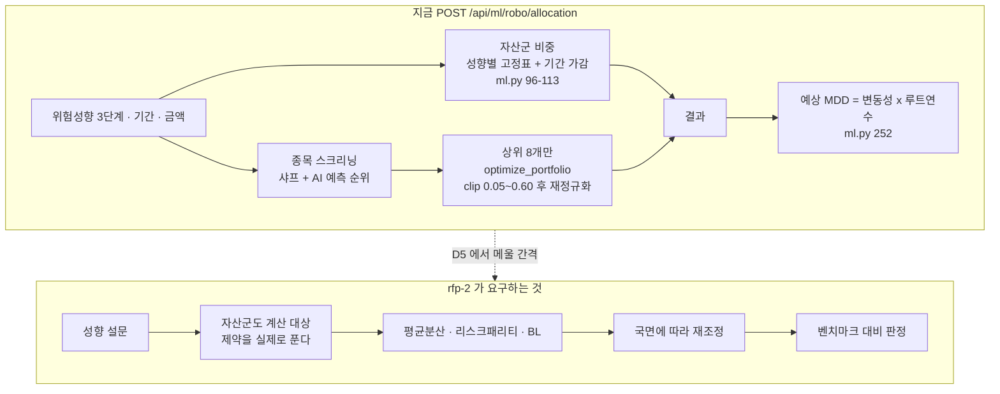
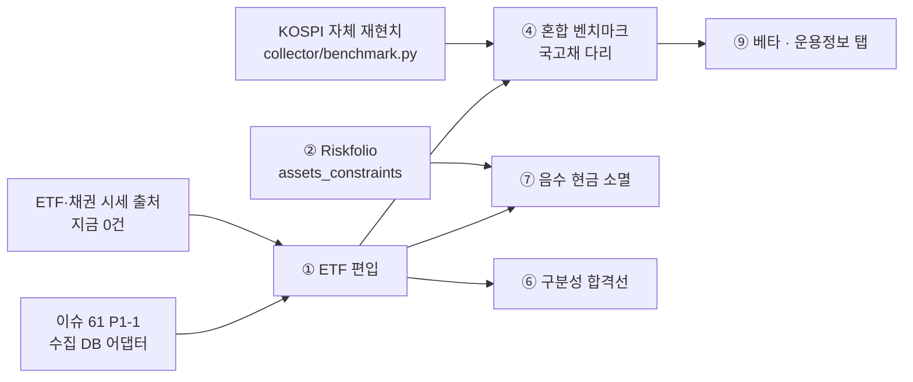
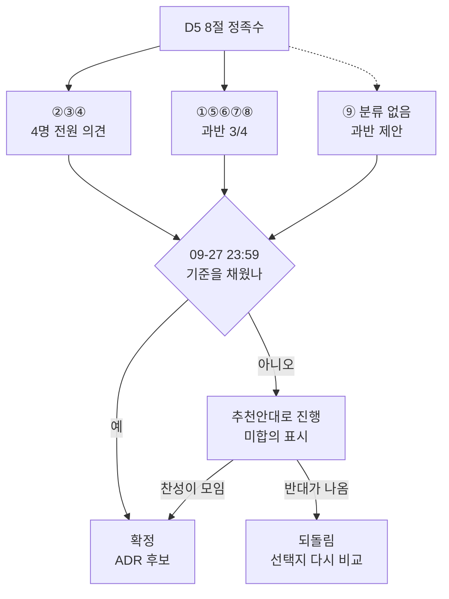

# #18 [논의] D5 2차 로보어드바이저 설계 — 무엇에 투자하고, 무엇으로 계산하고, 무엇과 비교할까

> 🗂️ 옛 GitHub 논의를 옮긴 **기록 문서**입니다 — [색인](../README.md). 원문은 그대로 두고, 링크·커밋 해시만 새 자리 기준으로 바꿨습니다.

| 항목 | 내용 |
|---|---|
| 종류 | 논의 |
| 상태 | 논의 · 설계(1·2·3차) |
| 원 작성 | 이동원(`devlee328288`) · 2026-09-17 13:41 KST |
| 댓글 | 3건 |
| 옛 주소 | `github.com/devlee328288/Qurious/discussions/18` (지금은 열리지 않음) |

## 본문

> 🟡 **결론 초안 게시 (2026-09-23)** — 9개 안건 모두 추천안을 결론 초안으로 두었고, 확정된 것은 아직 없습니다. 제안자 말고 찬성이 있는 안건은 ④ 벤치마크·⑨ 운용정보(강민석님 · [#29](../discussions/029.md) 교차 답)뿐이고 반대는 0건입니다. 8절 규칙(②③④ 전원 · 나머지 과반)을 못 채운 안건은 09-27(일) 23:59 KST 에 **"추천안대로 진행 · 미합의"** 로 2차를 시작합니다. → **본문 아래 §10 결론**

> **한 줄로**: 2차 로보어드바이저를 **무엇에 투자하고 · 무엇으로 계산하고 · 무엇과 비교할지** ~~8가지를~~ 🔴 (09-23 정정) 9가지를 정합니다(09-18 에 ⑨ 를 더하며 이 줄만 8로 남았습니다).
> 기한은 **2026-09-27(일) 23:59 KST**. 안건마다 골라서 댓글 한 줄이면 됩니다.

## 0. 쉬운 요약

1. 지금 화면의 "AI가 최적 계산"은 **자산군은 고정표**, **종목만 계산**입니다. 그 고정표는 30개 조합 중 **7개에서 현금 비중이 음수**가 됩니다(공격형·10년이면 −4.0%).
2. 종목 최적화도 제약을 **진짜로 푸는 게 아니라 `clip`으로 자르고 다시 나눕니다.** 그래서 "5~60%"라고 써 놓고 실제로는 **3.33%**까지 내려갑니다(아래 2.2 실측).
3. 그래서 D5에서 **투자 대상 · 계산 도구 · 리밸런싱 규칙 · 벤치마크 · 판정 형식 · 성향 검증 · 고칠 시점 · MDD 합격선 · 운용정보 공개 항목** 9가지를 먼저 정하고 2차를 시작하자는 제안입니다. (⑨는 2026-09-18 신설 — [#29](../discussions/029.md))

### 한눈에 보기

| # | 안건 | 지금 | 추천안 | 확실도 |
|---|---|---|---|---|
| ① | 투자 대상 | 국내주식 약 30종목만. 채권·대체·현금은 시세 없이 표로만 | **국내주식 + 국내상장 ETF** (5개 자산군 전부 시세를 갖게) | 🟡 |
| ② | 계산 도구 | 라이브러리 없음. numpy `pinv` 한 줄 + `clip` | **Riskfolio-Lib 하나를 정본** | 🟢 |
| ③ | 리밸런싱 | 규칙 자체가 없음 | **월 1회 확인 + 5%p 밴드** (넘은 것만 거래) | 🟢 |
| ④ | 벤치마크 | 같은 종목 Buy&Hold | **성향별 혼합 벤치마크를 주, KOSPI를 반드시 병기** — ★ **"있으면 좋은 것"이 아니라 필수**입니다. 코스콤 운용정보의 **베타**를 내려면 시장지수가 있어야 하고, 우리 코드엔 베타가 **0건**입니다(2.8) | 🟢 |
| ⑤ | 판정 형식 | 없음 | **결과 보기 전에 판정표 양식을 Issue에 먼저 올림**(사전등록) | 🟡 |
| ⑥ | 성향 구분 | 3단계 선택만 | **"1:1 맞춤" 대신 "성향별로 구분되는가"를 수치로 검증** | 🟢 |
| ⑦ | 음수 현금 | 7/30 조합에서 발생 | **2차 첫 주에 ①②와 같이** (따로 패치하지 않음) | 🟡 |
| ⑧ | MDD 합격선 | rfp-2 −20% · 교안 −15%로 갈림 | **대상이 다름. 포트폴리오 −20%(합격선) · 개별 전략 −15%(3차)** | 🟡 |
| **⑨** | **운용정보 공개 항목** ★신설 | 없음 | **코스콤 운용정보 8항목을 대시보드 탭으로** — 기준가·회전율·기간별 수익률·표준편차·베타·샤프·비중 (+ 코스콤이 **안 내는 MDD**는 우리가 추가) | 🟢 |

확실도 표기: 🟢 코드·원문으로 확인 · 🟡 확인한 사실 위에 얹은 제 판단

### 용어 풀이

같은 말이 여러 뜻으로 쓰이고 있어서, 헷갈리는 것부터 구분합니다.

**먼저: "최적화"라는 말이 이 문서에서 3가지를 가리킵니다**

| 이 문서의 표기 | 가리키는 것 | 헷갈리기 쉬운 점 |
|---|---|---|
| **자산군 배분** | 주식 / 채권 / 대체 / 현금에 몇 %씩 | 지금 Qurious는 이걸 **계산하지 않습니다.** 성향별 고정표입니다 |
| **종목 비중 최적화** | 주식 바스켓 안에서 종목별 몇 % | 지금 계산하는 건 **이것뿐**입니다 |
| **과최적화(overfitting)** | 과거에만 잘 맞게 지나치게 맞춘 것 | 위 둘과 **전혀 다른 말**입니다. D4 [#17](../discussions/017.md)의 주제입니다 |

**자산배분 모델**

| 용어 | 정확한 뜻 | 이 문서에서 | 헷갈리기 쉬운 점 |
|---|---|---|---|
| **평균-분산(Markowitz)** | 기대수익과 분산만으로 "같은 위험에서 수익이 가장 높은" 비중을 찾는 방법 | rfp-2 §3.1.3의 첫 항목 | 기대수익 추정이 조금만 틀려도 비중이 확 튑니다. 그래서 아래 L2 벌점·축소추정이 나옵니다 |
| **최소분산(Minimum Variance)** | 기대수익을 **아예 안 쓰고** 변동성만 가장 낮게 | 지금 코드가 쓰는 출발점 | "수익을 포기한다"가 아니라 "수익 추정을 안 믿는다"에 가깝습니다 |
| **리스크 패리티(Risk Parity, ERC)** | 각 자산이 포트폴리오 **위험에 기여하는 양**을 똑같게 | rfp-2가 명시 요구. 지금 **없음** | "비중을 똑같게"(동일가중)와 **다릅니다.** 변동성이 큰 자산은 비중이 작아집니다 |
| **HRP(계층적 위험 패리티)** | 종목을 군집으로 묶고 그 안에서 위험을 나눔 | 리스크 패리티의 사촌 | 이름이 비슷해 **Risk Parity의 대체재로 착각하기 쉽습니다.** 다른 방법입니다 |
| **Black-Litterman** | 시장 균형 비중을 출발점으로 두고 "내 견해"를 섞어 기대수익을 다시 만듦 | rfp-2가 명시 요구. 지금 **없음** | "AI 예측을 넣는 자리"가 바로 여기입니다 |

**규칙·수치**

| 용어 | 정확한 뜻 | 이 문서에서 | 헷갈리기 쉬운 점 |
|---|---|---|---|
| **밴드(band)** | 목표 비중에서 ±몇 %p 벗어나야 거래하는 허용 폭 | 안건 ③의 핵심 | **주기**(언제 볼까)와 다릅니다. 주기는 "확인", 밴드는 "거래 여부" |
| **회전율(turnover)** | 한 번 조정할 때 사고판 금액이 자산의 몇 %인가(편도) | 비용 계산의 입력 | 편도/왕복이 2배 차이납니다. 이 문서는 **편도**로 적고 비용에서 왕복을 뭅니다 |
| **bp(베이시스포인트)** | 0.01%p | 비용 단위 | 10bps = 0.1%. 46bp = 0.46%p |
| **MDD(최대낙폭)** | 고점 대비 최대로 떨어진 폭 | 안건 ⑧ | 지금 화면의 "예상 MDD"는 **낙폭이 아닙니다**(2.3절) |
| **탄력세율** | 법이 정한 세율을 시행령이 종목·시장별로 낮춘 것 | 안건 ① ETF 비용 | KOSPI 주권은 증권거래세가 **0%**입니다(농특세는 별도) |

---

## 1. 배경 — 왜 지금 이걸 정하나

2차 프로젝트는 **2026-09-27 시작**이고, rfp-2가 요구하는 중심 기능이 자산배분 로보어드바이저입니다.

rfp-2 §3.1.3이 요구하는 네 가지입니다 ([rfp-2#L54-L59](https://github.com/EST-team-project/Qurious/blob/04f476a/docs/rfp-2.md#L54-L59)).

| rfp-2 §3.1.3 요구 | 지금 Qurious |
|---|---|
| 평균-분산 최적화(Markowitz) 구현 | 🟡 변형만 — 최소분산과 기대수익 틸트를 섞음 |
| 리스크 패리티 및 최소분산 | 🟡 최소분산만. **리스크 패리티 없음** |
| Black-Litterman (투자자 뷰 반영) | ❌ 없음 |
| 동적 자산배분: 시장 국면에 따른 비중 재조정 | ❌ 없음 (고정표) |

A15 [#5](../issues/005.md)가 격차를 세었고, A7 [#16](../issues/016.md)이 자산배분 화면을 뜯어봤습니다. **둘 다 "무엇을 어떻게 고칠지는 D5에서"** 로 넘겼습니다. 이 문서가 그 자리입니다.

D1 [#7](../discussions/007.md)에서 강민석님이 주신 의견 두 가지가 이 문서의 전제입니다.

- **"과잉거래를 방지하기 위한 장치만 마련하면 좋겠다"** → 안건 ③이 이에 대한 답입니다(수치로).
- **"어드바이저와 인디케이터는 각각 깊게. 둘을 잇는 게 목표가 되면 안 된다"** → 그래서 이 문서는 **2차(어드바이저)만** 다룹니다. 3차 인디케이터는 D6에서 따로 봅니다.



---

## 2. 사실 — 코드로 확인한 것

**코드로 답한 것**: 2.1~2.4 (자산군 고정표 · 제약 위반 · 예상 MDD · 성향 구분)
**외부 조사로 답한 것**: 2.5~2.7 (도구 비교 · 세금 · ETF 거래 제약)

재현 환경: Qurious `04f476a` · Python 3.12 · numpy 1.26.4 · pandas 3.0.3 · scikit-learn 1.9.0 · scipy 1.17.1
합성 데이터 시드 **20260901** 고정. 아래 숫자는 전부 **프로젝트 함수를 그대로 불러와 돌린 실측값**입니다(외부 시세 호출 없음).

### 2.1 자산군 고정표 — 30개 조합 중 7개에서 현금이 음수입니다 🟢

[`ml.py#L96-L113`](https://github.com/EST-team-project/Qurious/blob/04f476a/app/routes/ml.py#L96-L113)의 산술을 그대로 재현했습니다.

계산 규칙은 이렇습니다.

| 단계 | 코드 | 하는 일 |
|---|---|---|
| 1 | [#L96-L100](https://github.com/EST-team-project/Qurious/blob/04f476a/app/routes/ml.py#L96-L100) | 성향별 고정표를 고른다 |
| 2 | [#L103](https://github.com/EST-team-project/Qurious/blob/04f476a/app/routes/ml.py#L103) | `horizon_boost = min(6, max(0, 기간 - 3))` |
| 3 | [#L104-L107](https://github.com/EST-team-project/Qurious/blob/04f476a/app/routes/ml.py#L104-L107) | 주식에 boost를 **더하고**, 채권·현금에서 **뺀다** |
| 4 | [#L110-L113](https://github.com/EST-team-project/Qurious/blob/04f476a/app/routes/ml.py#L110-L113) | 합계 100으로 정규화 |

4단계의 정규화가 음수를 못 막습니다. **더한 만큼 정확히 빼기 때문에 합계가 항상 100이고, 그래서 `total`로 나눠도 값이 그대로입니다.**

| 성향 | 기간 1~3년 | 5년 | 8년 | 10년 |
|---|---|---|---|---|
| 안정형 | 15.0% | 13.0% | 10.0% | 9.0% |
| 중립형 | 5.0% | 3.0% | 0.0% | **−1.0%** |
| 공격형 | 2.0% | 0.0% | **−3.0%** | **−4.0%** |

(표의 값 = 현금 비중)

전체 30개 조합(성향 3 × 기간 1~10년) 중 **7개(23.3%)에서 현금이 음수**입니다: 중립형 9·10년, 공격형 6·7·8·9·10년.

현금 −4.0%는 **"4%를 빌려서 주식을 산다"(레버리지)** 는 뜻인데, 화면 어디에도 그런 설명이 없고 의도한 설계도 아닙니다.

### 2.2 "5~60% 제한"은 지켜지지 않습니다 🟢

[`investment_research.py#L242`](https://github.com/EST-team-project/Qurious/blob/04f476a/app/services/investment_research.py#L242) 한 줄입니다.

```python
weights = np.clip(weights, 0.05, 0.60); weights /= weights.sum()
```

`clip`으로 5% 위로 올린 뒤 **합계로 다시 나누기** 때문에, 합계가 1보다 커지면 5% 아래로 도로 내려갑니다. 순서가 문제입니다.

서로 강하게 상관된 8종목(평균 상관 실측 **0.855**)으로 `optimize_portfolio()`를 그대로 호출한 결과입니다.

| 성향 | 가장 작은 비중 | 5% 하한 | 판정 |
|---|---|---|---|
| 안정형 | **3.33%** | 5.00% | ❌ 위반 |
| 중립형 | **3.88%** | 5.00% | ❌ 위반 |
| 공격형 | **4.63%** | 5.00% | ❌ 위반 |

세 성향 **전부** 위반합니다. 그런데 반환값의 `method` 문자열은 `"최근 252거래일 공분산 기반 long-only 최적화 (비용·세금 미반영)"` 라고 적혀 있어 ([#L245](https://github.com/EST-team-project/Qurious/blob/04f476a/app/services/investment_research.py#L245)), 화면에서는 제약이 지켜진 것처럼 보입니다.

**같은 목적함수를 제약 안에서 실제로 풀면**(scipy SLSQP, 합계=1 · 0.05 ≤ w ≤ 0.60) 결과가 이렇습니다.

| 성향 | 방식 | 최소 비중 | 하한 위반 | 목적함수 값 (낮을수록 좋음) |
|---|---|---|---|---|
| 안정형 | 현재 `clip` | 3.33% | ❌ | 0.099244 |
| 안정형 | 제약 실제 해 | 5.00% | ✅ | **0.092940** |
| 중립형 | 현재 `clip` | 3.88% | ❌ | 0.118715 |
| 중립형 | 제약 실제 해 | 5.00% | ✅ | **0.082768** |
| 공격형 | 현재 `clip` | 4.63% | ❌ | 0.125662 |
| 공격형 | 제약 실제 해 | 5.00% | ✅ | **0.070561** |

**제약을 실제로 푸는 쪽이 제약도 지키고 목적함수 값도 더 좋습니다.** 세 성향 모두에서 그렇습니다. `clip`은 "빠른 근사"가 아니라 그냥 더 나쁜 답입니다.

그리고 한 가지 더 — 무제약 최소분산 해 자체가 **공매도를 냅니다** ([#L237](https://github.com/EST-team-project/Qurious/blob/04f476a/app/services/investment_research.py#L237)).

```
min_var(%) = [ 17.78  26.33  21.37  28.50  25.43  -0.89  29.66  -48.19 ]
                                                 음수      음수 ↑
```

8종목 중 2개가 음수이고, 가장 큰 음수는 **−48.19%** 입니다. `clip`이 이걸 가려 주기 때문에 화면에서는 안 보이지만, **계산의 출발점이 이미 long-only가 아닙니다.**

### 2.3 화면의 "예상 MDD"는 낙폭이 아닙니다 🟢

[`ml.py#L252`](https://github.com/EST-team-project/Qurious/blob/04f476a/app/routes/ml.py#L252)입니다.

```python
mdd = -(exp_vol * np.sqrt(y)) * 100
```

변동성에 √(연수)를 곱한 값이고, **가격 경로를 보지 않습니다.** 실제 MDD는 경로를 따라가며 고점 대비 낙폭을 재야 나옵니다.

연 변동성 20% · 연 기대수익 7%로 경로 **10만 개**를 돌려 비교했습니다(시드 20260901).

| 기간 | 화면 공식값 | 실제 MDD 중앙값 | 실제 5%분위 | **공식값보다 더 나빴던 경로** |
|---|---|---|---|---|
| 1년 | −20.00% | −17.77% | −32.67% | **38.5%** |
| 3년 | −34.64% | −28.15% | −48.39% | 27.8% |
| 5년 | −44.72% | −33.90% | −55.90% | 19.7% |
| 10년 | −63.25% | −42.52% | −65.81% | 7.1% |

1년 기준으로 **경로 10개 중 약 4개가 화면 숫자보다 더 나빴습니다.** 중앙값만 보면 공식이 보수적으로 보이지만, 나쁜 쪽 꼬리(5%분위 −32.67%)를 전혀 못 잡습니다. 위험 안내로는 위험한 숫자입니다.

(A7 [#16](../issues/016.md)은 같은 성질을 40.3%로 보고했습니다. 가정한 기대수익이 달라 값이 조금 다를 뿐 결론은 같습니다.)

### 2.4 성향이 "구분"되는지는 데이터에 달렸습니다 🟢

같은 `optimize_portfolio()`를 **상관이 낮은 8종목**과 **상관이 높은 8종목**에 각각 돌렸습니다.

| 데이터 | 안정형 변동성 | 중립형 | 공격형 | 안정↔공격 차이 |
|---|---|---|---|---|
| 상관 낮음(분산된 유니버스) | 7.51% | 8.69% | 11.29% | **3.78%p** |
| 상관 높음(실측 0.855) | 29.98% | 30.20% | 30.57% | **0.59%p** |

상관이 높은 유니버스에서는 **세 성향이 사실상 같은 포트폴리오**가 됩니다. 국내주식만 담으면 상관이 높아지므로, 이건 안건 ①과 직접 연결됩니다.

코스콤 RA 테스트베드의 심사항목 '개인 맞춤성'은 **"성향별로 유의미하게 구분되는 복수 포트폴리오"** 를 요구합니다([#5](../issues/005.md) 5.2절). 우리도 같은 기준으로 자가 점검할 수 있습니다.

---

## 2.5 외부 조사 — 도구 (조회일 2026-09-17 KST)

지금 `requirements.txt`에는 **최적화 라이브러리가 하나도 없습니다** ([requirements.txt](https://github.com/EST-team-project/Qurious/blob/04f476a/requirements.txt)). scipy조차 직접 핀이 없고 scikit-learn이 끌어온 것입니다(실측 1.17.1 설치됨).

rfp-2 §8.1이 권장 스택으로 적은 것은 `PyPortfolioOpt`, `cvxpy`, `riskfolio-lib` 세 가지입니다 ([rfp-2#L160](https://github.com/EST-team-project/Qurious/blob/04f476a/docs/rfp-2.md#L160)).

A15 [#5](../issues/005.md)가 버전·라이선스를 비교했고, 여기서는 **rfp-2 §3.1.3의 네 요구를 각 도구가 실제로 내장하는지**만 봅니다.

| rfp-2 §3.1.3 요구 | PyPortfolioOpt 1.6.0 | Riskfolio-Lib 7.3 |
|---|---|---|
| 평균-분산(Markowitz) | ✅ `EfficientFrontier` | ✅ `Portfolio` (MV) |
| 최소분산 | ✅ `min_volatility()` | ✅ 목적함수 MinRisk |
| **리스크 패리티(ERC)** | ❌ **없음** | ✅ 위험척도 22종 |
| Black-Litterman | ✅ `BlackLittermanModel` | ✅ BL · Augmented BL · Bayesian BL |
| 자산군 단위 제약 | 🟡 제약을 직접 써야 함 | ✅ `assets_constraints` |

PyPortfolioOpt에 리스크 패리티가 없다는 건 패키지가 공개하는 목록으로 확인했습니다. [`pypfopt/__init__.py`](https://raw.githubusercontent.com/PyPortfolio/PyPortfolioOpt/main/pypfopt/__init__.py)의 `__all__`이 전부입니다.

```
BlackLittermanModel · CLA · DiscreteAllocation · EfficientFrontier
EfficientSemivariance · EfficientCVaR · EfficientCDaR · HRPOpt · CovarianceShrinkage
```

`HRPOpt`는 **계층적** 위험 패리티라서 rfp-2가 말한 리스크 패리티와 다른 방법입니다(용어 풀이 참고).

**`assets_constraints`가 왜 중요한가** — 안건 ①·⑦이 요구하는 "자산군 단위 제약"을 그대로 표현합니다. Riskfolio-Lib 원문 예시입니다.

| Type | Set | Position | Sign | Weight | 뜻 |
|---|---|---|---|---|---|
| Classes | Class 1 | Equity | <= | 0.6 | 주식 전체를 60% 이하로 |
| Classes | Class 1 | Fixed Income | <= | 0.5 | 채권 전체를 50% 이하로 |
| All Assets | | | >= | 0.02 | 모든 종목을 2% 이상으로 |

출처: [ConstraintsFunctions.py](https://github.com/dcajasn/Riskfolio-Lib/blob/master/riskfolio/src/ConstraintsFunctions.py) docstring 예시

**설치 조건 확인** (실측)

| 항목 | 요구 | 우리 환경 | 판정 |
|---|---|---|---|
| Python | 3.10 이상 | 3.12 | ✅ |
| scikit-learn | 1.7 이상 (Riskfolio) | **1.9.0 설치됨** | ✅ (핀만 `>=1.4.0`이라 올리면 됨) |
| numpy | 1.26 이상 | 1.26.4 | ✅ |
| 추가로 딸려오는 것 | cvxpy, clarabel, scs, statsmodels, arch, astropy, networkx, pybind11 | 없음 | ⚠️ 이미지가 커짐 |

A15 [#5](../issues/005.md)는 scikit-learn 핀을 올려야 한다고 적었는데, **실제로는 1.9.0이 이미 깔려 있어 핀 문자열만 고치면 됩니다.**

## 2.6 외부 조사 — 세금 (조회일 2026-09-17 KST)

D4 [#17](../discussions/017.md)이 매도세를 **0.15%** 로 고정했습니다. 안건 ①에서 ETF를 넣으면 이 값이 그대로 맞는지 확인이 필요해 법령 원문을 봤습니다.

**증권거래세법 시행령 제5조(탄력세율)** — 시행일자 **2026-01-02** 판본 ([국가법령정보센터 API](https://www.law.go.kr/DRF/lawService.do?OC=test&target=law&type=XML&LM=%EC%A6%9D%EA%B6%8C%EA%B1%B0%EB%9E%98%EC%84%B8%EB%B2%95%20%EC%8B%9C%ED%96%89%EB%A0%B9))

| 시장 | 증권거래세 | 농어촌특별세 | 합계 |
|---|---|---|---|
| 유가증권시장(KOSPI) | **영(零)** | 0.15% | **0.15%** |
| 코스닥시장 | **1만분의 15 = 0.15%** | 없음 | **0.15%** |
| 코넥스시장 | 1만분의 10 = 0.10% | 없음 | 0.10% |

**D4 [#17](../discussions/017.md)의 0.15%는 KOSPI·KOSDAQ 양쪽에서 맞습니다.** 🟢 (경과 규정이 2024년까지라 그 이전 값을 인용한 자료가 인터넷에 많습니다. 조문을 직접 확인했습니다.)

**ETF는 다릅니다.** 증권거래세법 제2조는 과세대상을 **"주권 또는 지분"** 으로 한정하고, 제1조의2는 "주권"을 법인이 발행한 주권으로 정의합니다. 국내 상장 ETF는 대부분 **투자신탁의 수익증권**이라 여기에 해당하지 않습니다.

→ **ETF 매도에는 증권거래세·농특세가 붙지 않습니다.** 대신 **총보수**(연 0.03~0.5% 수준)가 기초자산 수익에서 매일 차감됩니다.

🟢 법 제2조·제1조의2 조문은 원문 확인 · 🟡 "국내 상장 ETF가 대부분 수익증권"이라는 일반화는 제 판단입니다(투자회사형 ETF는 다를 수 있습니다).

**안건 ①을 고르면 D4 비용 규격에 자산 유형별 분기가 한 줄 필요합니다.**

| 자산 유형 | 매수 | 매도 | 매도세 | 보유 비용 |
|---|---|---|---|---|
| 주식(KOSPI·KOSDAQ) | 10bps | 10bps | **15bps** | 없음 |
| ETF | 10bps | 10bps | **0bps** | 총보수(연) |

## 2.7 외부 조사 — ETF 거래 제약 (조회일 2026-09-17 KST)

2026-09-14 개장한 **KRX 애프터마켓**(정규장 후 16:00~20:00 실시간 거래)에서 **ETF·ETN은 거래 대상에서 제외**됐습니다.

출처: [한국경제 2026-09-01](https://www.hankyung.com/article/2026090177307) · [뉴스핌 2026-09-02](https://www.newspim.com/news/view/20260902000974) · [한국금융신문 2026-09-02](https://www.fntimes.com/html/view.php?ud=202609022002211430179ad43907_18)

제외 대상은 ETF·ETN 외에 당일 정규장 미거래종목, 투자경고·위험종목, 이상급등종목, 관리종목, 초저유동종목입니다.

**우리에게 영향이 있나 → 없습니다.** D7 [#13](../discussions/013.md) 추천안 ⑥이 체결가를 **"다음 거래일 시가"** 로 잡고 있어 애프터마켓 시간대를 애초에 쓰지 않기 때문입니다. 안건 ①을 골라도 D7과 충돌하지 않습니다. 🟢

---

## 2.8 외부 조사 — 코스콤 RA 테스트베드 (조회일 2026-09-18 KST) 🟢

[#29](../discussions/029.md)에서 강민석님이 *"만들면서 정해야 하는 기준은 '심사프로세스'를 참고하며, 검증은 '운용정보'를 최대한 참고하고 싶다"* 고 제안해 주셔서 **원문을 직접 읽었습니다.**

### 2.8.1 심사프로세스 — 원문 그대로

| 단계 | 기간 | 원문 |
|---|---|---|
| 사전심사 | 0.5개월 | "참여요건 및 알고리즘의 **투자자 성향별 포트폴리오 산출역량**을 심사" |
| **본심사** | **6개월** | "일정기간(6개월) 동안 **실제 자금을 운용**" · 심사항목 = 알고리즘 안정성 · **리밸런싱 유효성** · **다계좌 오류 여부** |
| 최종심의위원회 | 0.5개월 | 최종 통과여부 심의 |

- 계좌: **"3가지 유형별 포트폴리오를 각각 3개 계좌에서 동시에 운용 (총 9개 계좌)"** — 안정추구 · 위험중립 · 적극투자
- 자금: "원칙적으로 업체 고유자금", "계좌별로 **최소 가입금액 이상**"
- **제출: "일일 운용종료 후 거래내역과 최종 잔고내역을 제출"**
- 사후: 리밸런싱 주기 **1개월 미만 → 1개월 단위** / 1개월 이상 → 매매처리 후 3영업일 이내

> **③ 리밸런싱 규칙과 직접 걸립니다.** 추천안 C(월 1회 확인 + 5%p 밴드)는 코스콤 기준으로 "1개월 이상"과 "미만"의 **경계선**에 놓입니다. 밴드가 중간에 터지면 월 1회보다 잦아지기 때문입니다.

### 2.8.2 운용정보가 공개하는 항목 ↔ 우리 코드 🟢

| 코스콤 공개 항목 | 우리 코드 | 근거 |
|---|---|---|
| 기준가(전일대비) | ❌ 없음 — `nav` 필드는 **펀드 기준가 크롤링용**이라 계좌 기준가가 아닙니다 | [reference.py:83](https://github.com/EST-team-project/Qurious/blob/04f476a/app/models/reference.py#L83) |
| **매매회전율(%)** | 🟡 계산은 하는데 **반환하지 않음** (비용 차감 중간값으로만 씀) | [investment_research.py:59](https://github.com/EST-team-project/Qurious/blob/04f476a/app/services/investment_research.py#L59) |
| 수익률 1주·1개월·3개월·6개월·누적 | 🟡 **누적만** | [investment_research.py:71](https://github.com/EST-team-project/Qurious/blob/04f476a/app/services/investment_research.py#L71) |
| 표준편차 | ✅ 샤프 계산 안에 있음 | [ta_utils.py:56](https://github.com/EST-team-project/Qurious/blob/04f476a/app/services/ta_utils.py#L56) |
| **베타** | ❌ **저장소 전체에 한 줄도 없습니다** (전수 검색 0건) | — |
| 샤프지수 | ⚠️ 있으나 **두 벌** — 무위험수익률 **0** vs **2%** | [ta_utils.py:56](https://github.com/EST-team-project/Qurious/blob/04f476a/app/services/ta_utils.py#L56) vs [lean_backtest.py:402](https://github.com/EST-team-project/Qurious/blob/04f476a/app/services/lean_backtest.py#L402) |
| 자산별 투자비중 (주식/펀드/주식ETF/채권ETF/기타ETF/ETN/예금/기타) | 🟡 자산군 **5개 고정표** | 2.1절 |
| **MDD** | ✅ 있음 | **코스콤은 공개하지 않습니다** |

**여기서 두 가지가 뒤집혔습니다.**

1. **베타가 없습니다.** 베타를 내려면 **시장지수가 반드시 필요**합니다 → **④ 벤치마크가 "있으면 좋은 것"에서 "운용정보를 채우려면 필수인 것"으로** 올라갑니다.
2. **코스콤은 MDD를 공개하지 않습니다.** 민석님이 제안하신 *"어떤 정보가 제공되지 않았는지와 그 이유를 제시"* 를, 반대 방향 — **"우리가 코스콤보다 더 내는 항목"** — 으로도 쓸 수 있습니다.

### 2.8.3 로보어드바이저 3대 기능 ↔ 이 논의의 안건

민석님이 정리해 주신 3대 기능이 안건과 어떻게 붙는지입니다.

| 3대 기능 | 어느 논의 | 안건 |
|---|---|---|
| 1. 포트폴리오 자동구성 | **D5(이 문서)** | ① 투자 대상 · ② 계산 도구 · ④ 벤치마크 |
| 2. 자동매매 | **D7 [#13](../discussions/013.md)** | ② 체결처 · ④ 10분 자동매매 · ⑥ 비용 |
| 3. 자동 리밸런싱 | **D5(이 문서)** | ③ 리밸런싱 규칙 |

| 민석님 구분 | 대응 | 1차 재사용 |
|---|---|:--:|
| **로봇 측면** (무엇을 언제 얼마나) | D5 ①②③ + D7 | ✅ 1차 `evaluation/` 그대로 |
| **어드바이저 측면** (투자자 상황) | D5 ⑥ 성향 검증 | 🟡 성향 3~5단계 분류만 있고 인출 제약 없음 |

민석님이 어드바이저 측면을 *"향후 발전 계획으로 빼자"* 고 하신 데 **동의합니다.** 다만 코스콤 **사전심사** 항목이 *"투자자 성향별 포트폴리오 산출역량"* 이라, **⑥(성향이 실제로 구분되는가)만은 남겨야** 합니다. 2.4절에서 지금 구조는 성향 간 차이가 **0.59%p**뿐입니다.

---

## 3. 선택지

### 안건 ① 투자 대상

| 안 | 내용 | 장점 | 단점 |
|---|---|---|---|
| **A** | 국내주식만 (현행 약 30종목) | 지금 데이터 그대로 | 상관이 높아 성향 구분이 0.59%p로 무너짐(2.4). 자산배분이라 부르기 어려움 |
| **B** | 국내주식 + 국내상장 ETF | 5개 자산군 전부 실제 시세를 가짐. rfp-2 §3.1.3을 진짜로 만족 | 비용 규격에 분기 필요(2.6). 종목 수가 늘어 데이터 작업 증가 |
| **C** | 해외 직접투자까지 확대 | 분산 효과 최대 | 환율·시차·세제가 전부 새 변수. 6주에 무리 |

### 안건 ② 계산 도구

| 안 | 내용 | 장점 | 단점 |
|---|---|---|---|
| **A** | 현행 numpy 유지 + 제약만 scipy로 | 의존성 안 늘어남 | 리스크 패리티·BL을 직접 구현해야 함 |
| **B** | **Riskfolio-Lib 하나** | rfp-2 네 요구를 전부 내장. 자산군 제약 내장 | 의존성 8개 추가 |
| **C** | PyPortfolioOpt 하나 | 가볍고 API 쉬움 | **리스크 패리티가 없음**(rfp-2 명시 요구) |
| **D** | 둘 다 설치해 골라 씀 | 각각의 장점 | **엔진이 또 갈라집니다.** A6 [#14](../issues/014.md)가 성과 엔진 5개로 겪은 문제의 반복 |

### 안건 ③ 리밸런싱 규칙

| 안 | 내용 |
|---|---|
| **A** | 고정 주기만 (월 1회 / 분기 1회) |
| **B** | 밴드만 (±5%p 벗어나면 즉시) |
| **C** | **주기 + 밴드** (주기마다 확인하되 밴드 넘은 것만 거래) |

### 안건 ④ 벤치마크

| 안 | 내용 |
|---|---|
| **A** | KOSPI 단일 (rfp-2 문구 그대로) |
| **B** | **성향별 혼합 벤치마크를 주 · KOSPI 병기** |
| **C** | 동일가중 Buy&Hold |

### 안건 ⑤ 판정 형식 · ⑥ 성향 검증 · ⑦ 고칠 시점 · ⑧ MDD 합격선

4절 추천안에 각각의 선택지를 함께 적었습니다.

### 안건 ⑨ 운용정보 공개 항목을 어디까지 구현할까 ★ 2026-09-18 신설

| | 범위 | 필요한 것 | 대가 |
|---|---|---|---|
| **가** | **운용정보 화면 항목만 구현** (기준가·회전율·기간별 수익률·표준편차·베타·샤프·비중) | ④ 벤치마크 확정 · 신규 코드 2개 | 가장 가벼움. 다만 *"매일 기록했다"* 는 말은 못 함 |
| **나** | 가 + **일일 거래내역·잔고를 실제로 매일 기록** | 위 + 수집기 **09-22 가동** + 모의 체결(D7 [#13](../discussions/013.md)) | 코스콤 본심사 형식을 흉내낼 수 있음 |
| **다** | 나 + **3유형 × 3계좌 = 9계좌 동시 운용** | 위 + 다계좌 구조 | 코스콤 *"다계좌 오류 여부"* 까지. 발표에서 눈에 띄지만 배울 거리는 적음 |

**코드 재사용 판정: 성과 계산 함수는 전부 재사용하고, 위에 얇은 집계 층 하나만 얹습니다.**

```
 지금                                    운용정보 탭을 채운 뒤
 ──────────────────────────────          ──────────────────────────────────
 backtest_strategy()                     backtest_strategy()          ← 그대로
   └ 반환: 누적수익·샤프·MDD·거래수         └ 반환에 turnover_pct 추가   ← 1줄

 ta_utils.sharpe_ratio(rf=0 고정)        ta_utils.sharpe_ratio(rf=인자)  ← 인자 추가
 lean_backtest (rf=2% 하드코딩)          └ 같은 함수 호출로 통일        ← 중복 제거

 (없음)                                  ta_utils.beta(returns, bench)  ← 신규 약 10줄
 (없음)                                  account_nav()                  ← 신규
                                           입출금을 제외한 기준가 시계열
 (없음)                                  returns_1w / 1m / 3m / 6m      ← 신규 슬라이스
```

**신규 코드는 `beta()` 와 `account_nav()` 둘뿐**이고 나머지는 인자 추가·슬라이스입니다. `account_nav()` 가 필요한 이유는 **모의투자로 중간에 입금하면 잔고로는 성과를 잴 수 없기** 때문입니다 — 코스콤이 기준가를 쓰는 이유가 그것입니다. 부수 효과로 [A6 #14](../issues/014.md)가 지적한 **샤프 두 벌 문제가 이 작업에서 자연히 합쳐집니다.**

---

## 4. 추천안 (미확정 — 의견 주세요)

### ① 투자 대상 → **B. 국내주식 + 국내상장 ETF**

자산군 5개 중 **주식만 시세가 있고 채권·대체·현금은 표로만 있는 게 지금의 근본 문제**입니다(2.1). ETF를 넣으면 4개 자산군이 전부 계산 대상이 되어 "자산배분 모델"이 비로소 성립합니다.

최소 구성 제안 — 자산군마다 대표 ETF 1~2개씩, **합쳐서 8~12개**:

| 자산군 | 채울 것 | 왜 |
|---|---|---|
| 국내주식 | 기존 개별종목 + 코스피200 ETF | 개별종목 쏠림을 지수로 희석 |
| 해외주식 | 선진국·미국 지수 ETF | 국내와 상관이 낮아 2.4의 구분 문제가 풀림 |
| 국내채권 | 국고채 ETF (단기·중기) | 방어 자산이 시세를 갖게 됨 |
| 대체자산 | 금·리츠 ETF | rfp-2의 "대체자산"을 실물화 |
| 현금 | 현금성 ETF 또는 무위험수익률 | **음수 현금 문제가 구조적으로 사라짐** |

**종목 선정은 이 문서에서 정하지 않습니다.** 자산군별로 몇 개를 어떤 기준(순자산·거래대금·보수)으로 고를지는 2차 착수 후 별도 Issue로 다룹니다.

### ② 계산 도구 → **B. Riskfolio-Lib 하나를 정본**

이유는 세 가지입니다.

1. **rfp-2 §3.1.3의 네 요구를 전부 내장한 유일한 선택지**입니다(2.5). PyPortfolioOpt를 고르면 리스크 패리티를 직접 만들어야 하고, 그건 "구현했다"가 아니라 "구현 과제가 하나 늘었다"입니다.
2. **`assets_constraints`가 자산군 제약을 그대로 표현합니다.** 안건 ①의 5개 자산군 상하한을 최적화 **안에서** 풀 수 있어, 2.1·2.2의 두 버그가 동시에 사라집니다.
3. **하나만 씁니다.** D4 [#17](../discussions/017.md) ③이 "정본 엔진 하나"를 정한 것과 같은 이유입니다. A6 [#14](../issues/014.md)가 찾아낸 성과 엔진 5개·샤프 3종 문제를, 최적화에서 반복하지 않으려는 것입니다.

설치 핀 변경은 두 줄입니다.

```
scikit-learn>=1.7.0     # 지금 >=1.4.0 (실제 설치본은 1.9.0이라 재설치 불필요)
riskfolio-lib>=7.3.0    # 신규
```

### ③ 리밸런싱 → **C. 월 1회 확인 + 5%p 밴드**

강민석님이 D1 [#7](../discussions/007.md)에서 요청하신 **"과잉거래 방지 장치"** 에 대한 수치 답입니다.

8종목 동일가중 · 개별 연변동성 30% · 평균상관 0.45 · 5년 · 경로 200개 평균. 비용은 D4 [#17](../discussions/017.md) ①(매수 10bps · 매도 10bps + 매도세 15bps)을 그대로 적용했습니다.

**연간 비용(bp)**

| 주기 \ 밴드 | 밴드 없음 | 3%p | **5%p** | 10%p |
|---|---|---|---|---|
| 매 거래일 | **46.1** | 4.6 | 2.7 | 1.1 |
| 주 1회 | 20.6 | 4.4 | 2.6 | 1.1 |
| **월 1회** | 10.0 | 4.0 | **2.5** | 1.0 |
| 분기 1회 | 5.8 | 3.6 | 2.3 | 1.0 |
| 연 1회 | 2.9 | 2.7 | 1.9 | 0.9 |

**읽는 법**: 왼쪽 위(매 거래일·밴드 없음) 46.1bp = 연 0.461%p를 비용으로 씁니다. 오른쪽 아래로 갈수록 적게 씁니다.

여기서 배울 점은 **주기보다 밴드가 훨씬 강하다**는 것입니다.

| 비교 | 연 비용 | 배수 |
|---|---|---|
| 매 거래일 · 밴드 없음 | 46.1bp | 기준 |
| 월 1회 · 밴드 없음 | 10.0bp | 4.6배 절약 |
| 월 1회 · **밴드 5%p** | **2.5bp** | **18.4배 절약** |

밴드를 걸고 나면 주기를 바꿔도 거의 차이가 없습니다(월 2.5 · 분기 2.3 · 연 1.9). **그래서 "월 1회 확인"으로 반응성을 지키고, "5%p 밴드"로 거래를 막는 조합이 가장 낫습니다.**

누적 수익률에 남는 자국(연 기대수익 7% 가정):

| 설정 | 연 비용 | 1년 | 3년 | 5년 | 10년 |
|---|---|---|---|---|---|
| 매 거래일 · 밴드 없음 | 0.461% | −0.46%p | −1.58%p | −2.99%p | **−8.31%p** |
| 월 1회 · 밴드 없음 | 0.100% | −0.10%p | −0.34%p | −0.65%p | −1.83%p |
| **월 1회 · 밴드 5%p** | **0.025%** | −0.02%p | −0.09%p | −0.16%p | **−0.45%p** |

10년에 **8.31%p vs 0.45%p** — 18배 차이입니다.

### ④ 벤치마크 → **B. 성향별 혼합 벤치마크를 주 · KOSPI 병기**

2025년 국내 RA 알고리즘 평균 수익률은 **14.89%**, 같은 기간 KOSPI는 **75.63%** 였습니다([#5](../issues/005.md) 5.2절, 코스콤 뉴스룸 2026-01-28). **자산배분형 상품을 100% 주식 지수로 재면 구조적으로 집니다.** 채권·현금을 섞으라고 해 놓고 주식 지수로 채점하는 셈이기 때문입니다.

그렇다고 KOSPI를 빼면 rfp-2 §7.1을 어깁니다. 그래서 **둘 다 적습니다.**

| 성향 | 주 벤치마크(제안) | 병기 |
|---|---|---|
| 안정형 | 주식 25% + 국고채 75% | KOSPI |
| 중립형 | 주식 55% + 국고채 45% | KOSPI |
| 공격형 | 주식 80% + 국고채 20% | KOSPI |

★ **2026-09-18 추가 — ④는 선택이 아니라 필수가 됐습니다.** 코스콤 운용정보가 공개하는 **베타**는 정의상 시장지수가 있어야 계산됩니다(2.8.2). 즉 ⑨(운용정보 탭)를 하기로 하면 ④를 **반드시** 먼저 정해야 합니다. 코스콤도 유형별 지수(안정추구·위험중립·적극투자)를 따로 두고 있어, 아래 혼합 벤치마크 구조와 **같은 모양**입니다.

혼합 벤치마크도 **같은 리밸런싱 규칙(③)과 같은 비용(D4 ①)** 을 적용해야 공정합니다. 비용 없는 벤치마크와 비용 있는 전략을 비교하면 전략이 부당하게 불리합니다.

**결론을 미리 정하지 않습니다.** KOSPI에 지면 진 대로 적고, 왜 졌는지(주식 비중이 낮아서인지, 종목 선택이 나빠서인지) 분해해서 보고합니다. 강사님 피드백 ④(결론에 집착 금지)를 그대로 적용한 것입니다.

### ⑤ 판정 형식 → **결과를 보기 전에 판정표 양식을 Issue에 먼저 올린다**

D4 [#17](../discussions/017.md) ⑦의 사전등록과 같은 방식입니다. 채우기 전 양식을 먼저 확정합니다.

| 지표 | rfp-2 기준 | 측정 방법 | 데이터 구간 | 결과 | 판정 |
|---|---|---|---|---|---|
| 방향성 정확도 | 55% 이상 | **상승/하락 2분류**(현행 3분류 아님) | (착수 시 확정) | | |
| 벤치마크 대비 | 초과수익 | 혼합 벤치마크 · KOSPI 둘 다 | | | |
| MDD | −20% 이내 | **경로 기반**(2.3의 공식 아님) | | | |
| Sharpe | 1.0 이상 | **무위험수익률 차감**(현행 미차감) | | | |
| 스크리닝 성과 | 시장 평균 상위 30% | 선정 후 사후 추적 | | | |

**"측정 방법" 칸의 굵은 글씨가 지금 코드와 다른 부분입니다.** 넷 중 셋이 다릅니다. 이걸 먼저 맞추지 않으면 나중에 "기준을 통과했다"고 말할 수 없습니다.

`Sharpe` 미차감 근거: [`ta_utils.py#L56-L59`](https://github.com/EST-team-project/Qurious/blob/04f476a/app/services/ta_utils.py#L56-L59)는 `returns.mean() / returns.std()`만 계산합니다.

### ⑥ 성향 구분 검증 → **"1:1 맞춤" 대신 "성향별로 구분되는가"를 수치로**

코스콤 테스트베드의 '개인 맞춤성' 항목이 쓰는 표현을 그대로 빌립니다. 두 가지를 봅니다.

| 검증 | 합격 조건 | 2.4의 실측 예 |
|---|---|---|
| **순서성** | 안정 < 중립 < 공격 순으로 변동성·MDD가 커지는가 | 두 경우 모두 순서는 지킴 |
| **구분성** | 안정↔공격 변동성 차이가 충분한가 | 상관 낮음 3.78%p ✅ / 상관 높음 **0.59%p** ❌ |

**구분성 합격선은 지금 정하지 않습니다.** ①을 골라 유니버스를 확정한 뒤, 실제 데이터로 분포를 보고 정하는 게 맞습니다. 숫자를 먼저 박으면 그 숫자에 맞추게 됩니다.

### ⑦ 음수 현금을 언제 고칠까 → **2차 첫 주에 ①②와 함께**

따로 패치하지 않습니다. ①(ETF로 현금 자산군을 시세화)과 ②(`assets_constraints`로 자산군 하한을 0% 이상으로 강제)를 하면 **이 버그는 구조적으로 사라집니다.** 지금 고정표에 `max(0, ...)`를 씌우면 2주 뒤 그 코드를 통째로 지우게 됩니다.

다만 **①②가 뒤집히면 즉시 단독 패치**합니다(6절).

### ⑧ MDD 합격선 → **대상이 다릅니다. 둘 다 유지**

A15 [#5](../issues/005.md)가 "기준이 서로 다르다"고 표시한 항목입니다. 원문을 다시 읽으니 **대상이 다릅니다.**

| 출처 | 값 | 무엇에 대한 기준인가 | 언제 쓰나 |
|---|---|---|---|
| [rfp-2 §7.1](https://github.com/EST-team-project/Qurious/blob/04f476a/docs/rfp-2.md#L137) | −20% 이내 | **포트폴리오** 평가 기준 | 2차 |
| [교안 05.md §2](https://github.com/EST-team-project/Qurious/blob/04f476a/docs/05.md#L58-L59) | −15% 초과 | **TradingView 전략 테스터**의 개별 전략 | 3차(PineScript) |

교안 문장은 "전략 테스터 탭의 Net Profit, Max Drawdown, Win Rate, Profit Factor, Sharpe Ratio 5가지"를 재는 기준이고, Profit Factor > 1.5가 함께 붙어 있습니다. **개별 전략에 대한 문턱**입니다.

→ **2차 포트폴리오는 −20%(rfp-2), 3차 개별 전략은 −15%(교안).** 충돌이 아니라 층이 다릅니다.

🟡 이건 제 해석입니다. 교안 문장이 "포트폴리오 제출 기준에 부합합니다"라고 끝나서 **한 문장 안에 전략과 포트폴리오가 섞여 있습니다.** 강사님께 확인하는 게 가장 확실합니다.

---

## 5. 근거·반례·한계

### 추천안에 대한 반례

| 안건 | 반례 | 제 답 |
|---|---|---|
| ① ETF 추가 | "종목이 늘면 6주에 못 끝낸다" | 자산군당 1~2개, 합쳐서 8~12개면 지금(약 30종목)보다 **오히려 적습니다** |
| ① ETF 추가 | "ETF는 개별종목 분석 실력을 못 보여준다" | 스크리닝(rfp-2 §3.1.4)은 개별종목으로 그대로 합니다. ETF는 **자산군 자리만** 채웁니다 |
| ② Riskfolio | "의존성 8개는 과하다" | 맞습니다. 다만 **직접 구현하는 비용**과 비교해야 합니다. 리스크 패리티+BL을 직접 만들면 검증까지 필요합니다 |
| ② Riskfolio | "PyPortfolioOpt의 `L2_reg`가 필요할 수 있다" | **실제로 필요합니다**(아래 한계 참고). Riskfolio에도 대응 기능이 있는지 착수 시 확인이 필요합니다 |
| ③ 5%p 밴드 | "밴드가 크면 목표에서 오래 벗어나 있는다" | 맞습니다. 비용 2.5bp와 추적오차를 맞바꾸는 것입니다. 3%p(4.0bp)도 합리적 선택지입니다 |
| ④ 혼합 벤치마크 | "rfp-2가 KOSPI라고 했는데 바꾸는 건 과제 회피다" | 그래서 **바꾸지 않고 병기**합니다. KOSPI 대비 결과를 반드시 싣습니다 |

### 한계 — 이 문서가 답하지 못한 것

1. **제약을 제대로 풀어도 코너 해가 나옵니다.** 2.2의 SLSQP 해는 세 성향 모두 `[5, 5, 60, 5, 5, 10, 5, 5]%` 로 한 종목에 상한까지 몰렸습니다. **도구를 바꾼다고 저절로 해결되지 않습니다.** PyPortfolioOpt는 이 문제에 `L2_reg`(작은 비중에 벌점)를 제공합니다. Riskfolio에서 같은 효과를 어떻게 낼지는 **착수 시 확인해야 합니다.**
2. **③의 시뮬레이션은 목표 비중이 고정된 경우입니다.** 실제로는 최적화가 매달 목표를 바꾸므로 **회전율이 이보다 큽니다.** 표의 값은 하한으로 읽어야 합니다.
3. **2.1~2.4는 합성 데이터입니다.** 구조적 성질(음수 현금·제약 위반·공식 MDD의 한계)은 데이터와 무관하지만, **구체적 수치는 실제 시세에서 달라집니다.**
4. **동적 자산배분(국면 분류)을 다루지 않았습니다.** rfp-2 §3.1.3의 네 번째 항목입니다. VKOSPI 기반 국면 정의 후보가 [#4](../issues/004.md)에 있고, **분량상 2차 착수 후 별도 Issue**가 맞다고 봅니다.
5. **읽지 못한 곳**: riskfolio-lib 하위 문서(404) · KRX 규정 원문 사이트 · 한국투자증권 사이트(robots.txt). Riskfolio API는 **GitHub 소스 docstring**으로 대신 확인했습니다. 애프터마켓 ETF 제외는 **언론 보도 3곳**으로만 확인했고 KRX 규정 원문은 못 봤습니다.
6. **ETF 총보수를 비용 모형에 어떻게 넣을지** 정하지 않았습니다. 매일 차감되는 구조라 거래비용과 성격이 다릅니다. ①이 채택되면 D4 규격의 후속 논의가 필요합니다.

---

## 6. 판정을 뒤집을 조건

| 안건 | 이렇게 되면 추천을 버립니다 |
|---|---|
| ① | ETF 시세를 안정적으로 받을 방법이 2차 첫 주에 확보되지 않으면 → A(국내주식만)로 후퇴하고, 대신 ⑥의 구분성 미달을 **한계로 명시** |
| ② | Riskfolio-Lib 설치가 Docker 이미지에서 실패하거나 빌드가 10분을 넘으면 → C(PyPortfolioOpt) + 리스크 패리티 직접 구현 |
| ② | 리스크 패리티를 "직접 구현"하는 것이 학습 목표로 더 낫다는 의견이 있으면 → A 또는 C |
| ③ | 실제 데이터에서 5%p 밴드가 연 1회 미만으로만 걸리면 → 3%p로 낮춤 |
| ④ | 강사님이 "KOSPI 단일로 보라"고 하시면 → A. 혼합 벤치마크는 참고 지표로 강등 |
| ⑦ | ①②가 둘 다 뒤집히면 → **음수 현금을 즉시 단독 패치** |
| ⑧ | 강사님이 "−15%는 포트폴리오 기준이 맞다"고 하시면 → 둘 중 **엄격한 −15%** 를 합격선으로 |

---

## 7. 결정 기준

| 순위 | 기준 | 뜻 |
|---|---|---|
| 1 | **rfp-2 요구를 실제로 만족하는가** | 과제 명세가 1순위입니다 |
| 2 | **6주 안에 끝나는가** | 2026-09-27 시작, 2차 기간 안에 |
| 3 | **하나로 모이는가** | A6 [#14](../issues/014.md)의 "엔진 5개" 문제를 반복하지 않습니다 |
| 4 | **팀원이 설명할 수 있는가** | 강사님 피드백 ③·⑤ (비전문가도 이해 · 면접에서 설명) |
| 5 | 성능 | 위 네 개를 만족한 뒤에 봅니다 |

---

## 8. 기한·담당

- **기한: 2026-09-27(일) 23:59 KST**
- **담당**: 지정하지 않습니다. 안건마다 의견을 주시면 됩니다.
- **정족수**: ②③④는 코드 구조를 바꾸므로 **4명 전원 의견**을 받고 싶습니다. ①⑤⑥⑦⑧은 과반이면 진행합니다.
- 기한까지 의견이 모이지 않으면, **추천안대로 진행하되 "미합의"로 표시**하고 2차 중에 언제든 되돌릴 수 있게 남깁니다.

---

## 9. 결론 체크리스트

댓글에 **번호와 선택만** 적어 주셔도 됩니다. (예: `① B · ② B · ③ C · ④ B · ⑤ 찬성 · ⑥ 찬성 · ⑦ 찬성 · ⑧ 찬성`)

- [ ] **①** 투자 대상 — A 국내주식만 / **B 주식+ETF(추천)** / C 해외까지
- [ ] **②** 계산 도구 — A numpy+scipy / **B Riskfolio-Lib(추천)** / C PyPortfolioOpt / D 둘 다
- [ ] **③** 리밸런싱 — A 주기만 / B 밴드만 / **C 월 1회 + 5%p 밴드(추천)**
- [ ] **④** 벤치마크 — A KOSPI 단일 / **B 혼합 벤치마크 주 + KOSPI 병기(추천)** / C 동일가중 Buy&Hold
- [ ] **⑤** 판정표 양식을 **결과 보기 전에** Issue로 올리는 데 찬성 / 반대
- [ ] **⑥** 성향 검증을 **순서성 + 구분성** 두 가지로 하는 데 찬성 / 반대 (합격선은 나중에)
- [ ] **⑦** 음수 현금을 **2차 첫 주에 ①②와 함께** 고치는 데 찬성 / 반대(즉시 단독 패치)
- [ ] **⑧** MDD를 **포트폴리오 −20% · 개별 전략 −15%** 로 층을 나누는 데 찬성 / 반대
- [ ] **⑨** 운용정보 범위 ★신설 — 가(화면 항목만) / **나(+일일 기록, 추천)** / 다(+9계좌)

---

## 10. 결론 — 초안 (2026-09-23)

> 9절 체크리스트는 **지우지 않고 그대로 둡니다.** 결론은 이 절(본문)에 쓰고, 댓글에는 요약만 남깁니다(09-18 운영 규칙).

### 10.0 쉬운 요약 3줄

1. **9개 안건 가운데 확정된 것은 아직 없습니다.** 제안자 말고도 찬성이 있는 안건은 ④ 벤치마크·⑨ 운용정보 두 개뿐입니다(강민석님 · [#29](../discussions/029.md) 스레드 · 09-21). 나머지 7개는 제안자 1명뿐이고, 반대는 0건입니다.
2. 규칙은 8절 그대로입니다 — ②③④는 4명 전원, ①⑤⑥⑦⑧은 과반(4명 중 3명). ⑨는 09-18에 새로 넣으면서 **정족수 분류를 빠뜨렸고**, 이 초안이 "과반"으로 두자고 제안합니다.
3. 기한 **09-27(일) 23:59 KST**까지 기준을 못 채운 안건은 8절대로 **"추천안대로 진행 · 미합의"**로 2차를 시작합니다. 무응답은 찬성으로 세지 않고, 반대가 나오면 되돌립니다.

### 10.1 상태표

범례 — **제안** = 제안자(이동원, 찬성으로 셈) · **✅ X (MM-DD)** = 명시 찬성 · **✅ᶜ** = 조건부 찬성(조건에 제안자가 답함 · 투표자 재확인 없음 · n/4 에 넣지 않고 "+ ✅ᶜ n" 으로 따로 적음) · **💬** = 이 논의 안건을 향한 말이지만 선택지를 고르지 않음(세지 않음) · **—** = 이 논의에서 발언 없음 · **🔴** = 반대. **n/4 는 제안과 ✅ 만 센 값입니다.**

<!-- 결론표:시작 -->
| 안건 | 결론(초안) | 이동원 | 강민석 | 신장환 | 오준영 | 확정 규칙 | 상태 |
|---|---|:-:|:-:|:-:|:-:|---|---|
| ① 투자 대상 | B 국내주식 + 국내상장 ETF (자산군당 1~2개 · 합쳐 8~12개, 종목 선정은 별도 Issue) | 제안 | — | — | — | 과반 3/4 (8절) | ⏳ 과반 대기 1/4 |
| ② 계산 도구 | B Riskfolio-Lib 하나를 정본 | 제안 | — | — | — | 전원 의견 4/4 (8절) | ⏳ 전원 찬성 대기 1/4 |
| ③ 리밸런싱 | C 월 1회 확인 + 5%p 밴드 | 제안 | — | — | — | 전원 의견 4/4 (8절) | ⏳ 전원 찬성 대기 1/4 |
| ④ 벤치마크 | B 성향별 혼합 벤치마크를 주 + KOSPI(자체 재현치) 병기 · 비중표는 '제안'으로 둠 | 제안 | ✅ B (09-21 · [#29](../discussions/029.md) Q3) | — | — | 전원 의견 4/4 (8절) | ⏳ 전원 찬성 대기 2/4 · 민석 찬성은 'KOSPI(자체 재현치)' 표기·비중표 '제안' 보탬 전 |
| ⑤ 판정 형식 | 결과를 보기 전에 판정표 양식을 Issue로 사전등록 | 제안 | — | — | — | 과반 3/4 (8절) | ⏳ 과반 대기 1/4 |
| ⑥ 성향 검증 | 순서성 + 구분성 두 가지 (합격선은 ① 확정 뒤 실제 데이터로) | 제안 | — | — | — | 과반 3/4 (8절) | ⏳ 과반 대기 1/4 |
| ⑦ 음수 현금 | 2차 첫 주에 ①②와 함께 (①②가 둘 다 뒤집히면 즉시 단독 패치) | 제안 | — | — | — | 과반 3/4 (8절) | ⏳ 과반 대기 1/4 |
| ⑧ MDD 합격선 | 포트폴리오 −20% · 개별 전략 −15% (강사님께 여쭐 것 ⑧ 대기) | 제안 | — | — | — | 과반 3/4 (8절) | ⏳ 과반 대기 1/4 |
| ⑨ 운용정보 범위 | 나 — 운용정보 화면 항목 + 일일 거래내역·잔고 기록 | 제안 | ✅ 나 (09-21 · [#29](../discussions/029.md) Q1) | — | — | 🔴 8절 미분류 → 과반 3/4 (제안) | ⏳ 과반 대기 2/4 · ⑨ 규칙 빈칸 → 과반 제안 |
<!-- 결론표:끝 -->

강민석 칸의 ✅ 두 개는 모두 **[#29](../discussions/029.md) 스레드의 교차 투표**입니다(10.3) — 제가 [#29](../discussions/029.md) 에 이 논의 선택지를 그대로 옮겨 여쭌 Q1·Q3 에 답하셨습니다. Q3 답은 *"…사용한다면 … 가능할 것 같습니다"* 꼴이지만 조건이 선택지 자체라 ✅ 로 셉니다(D1 의 ✅ᶜ 와 다른 경우).

```
안건 │ 명시 찬성       │ 규칙           │ 필요 │ 남은 수
─────┼─────────────────┼────────────────┼──────┼────────
 ①  │ ■□□□ 1/4        │ 과반           │  3   │  2
 ②  │ ■□□□ 1/4        │ 전원           │  4   │  3
 ③  │ ■□□□ 1/4        │ 전원           │  4   │  3
 ④  │ ■■□□ 2/4        │ 전원           │  4   │  2
 ⑤  │ ■□□□ 1/4        │ 과반           │  3   │  2
 ⑥  │ ■□□□ 1/4        │ 과반           │  3   │  2
 ⑦  │ ■□□□ 1/4        │ 과반           │  3   │  2
 ⑧  │ ■□□□ 1/4        │ 과반           │  3   │  2
 ⑨  │ ■■□□ 2/4        │ 과반(제안)     │  3   │  1
      ■ = 명시 찬성(제안 포함)   반대 = 전 안건 0
```

### 10.2 확정 규칙 — 8절 원문 그대로 🟢

> - **정족수**: ②③④는 코드 구조를 바꾸므로 **4명 전원 의견**을 받고 싶습니다. ①⑤⑥⑦⑧은 과반이면 진행합니다.
> - 기한까지 의견이 모이지 않으면, **추천안대로 진행하되 "미합의"로 표시**하고 2차 중에 언제든 되돌릴 수 있게 남깁니다.

이 규칙을 읽는 방법 세 가지입니다. **이 초안의 해석이라 반대가 있으면 고칩니다.**

| 쟁점 | 원문 | 이 초안의 읽기 | 확실도 |
|---|---|---|:-:|
| "전원 의견" | ②③④ | 4명이 **각자 명시적으로 고른다.** 무응답은 의견이 아닙니다. 고른 것이 갈리면 🔴 이견으로 표시 — 8절에 이견 처리법은 없습니다 | 🟡 |
| ⑨ | 8절 정족수 줄에 **없음** | 09-18 신설 때 분류를 빠뜨렸습니다 🔴. **과반**으로 두자고 제안합니다 — ⑨가 새로 만드는 코드는 `beta()`·`account_nav()` 둘과 슬라이스뿐이고(3절 ⑨ 표), 구조를 바꾸는 전제(벤치마크)는 이미 전원 규칙인 ④에 들어 있습니다 | 🟡 제안 |
| 72시간 | 8절에 **없음** | D5는 D0 [#6](../discussions/006.md) ② 추천안(72시간 lazy consensus)에 **기대지 않는 자체 규칙**입니다. 그래서 다른 논의의 "09-26 18:00 일괄 확정"이 여기에는 없습니다. 참고로 D0 ② 자체도 전원 명시 찬성이 필요한데 **3/4로 미확정**입니다 | 🟢 |

**과반 · 정족수**
- 뜻: 과반 = 절반을 넘는 수. 정족수 = 결정이 성립하는 데 필요한 최소 인원.
- 이 문서에서: 4명 중 **3명**이 같은 안을 명시적으로 골라야 과반입니다. 제안자 1명 + 2명.
- 헷갈리는 점: "반대가 없다"는 과반이 아닙니다. 반대 0 · 찬성 1이면 1/4입니다.

**미합의 진행(잠정)**
- 뜻: 합의 없이 추천안으로 먼저 움직이되, 그 사실을 표시해 두는 것.
- 이 문서에서: 8절 둘째 줄. 09-27까지 기준을 못 채운 안건에 붙습니다.
- 헷갈리는 점: **확정이 아닙니다.** 2차 중에 반대가 나오면 되돌립니다. ADR도 확정 뒤에 씁니다.

**교차 투표**
- 뜻: 이 논의 스레드가 아니라 다른 스레드에서 이 논의의 선택지를 고른 발언.
- 이 문서에서: [#29](../discussions/029.md)에서 민석님이 이동원의 Q1·Q3에 답한 것 → ⑨·④.
- 헷갈리는 점: 질문이 이 논의의 선택지를 **그대로** 옮긴 것이라 셉니다. 취지만 닮은 말(예: "과잉거래 방지 장치")은 세지 않습니다.

### 10.3 누가 언제 무엇을 — 발언 전수

조회: 2026-09-23 11:40 KST, 모든 논의의 댓글 **+ 답글** 전부. **D5([#18](../discussions/018.md)) 스레드의 팀원 발언은 0건**입니다(댓글 2개 모두 이동원). 아래는 다른 스레드에서 D5에 닿는 팀원 발언 전부입니다.

| 누가 | 언제 · 어디 | 원문(그대로) | 안건 | 셈 |
|---|---|---|---|---|
| 강민석 | 09-21 14:26 · [#29](../discussions/029.md) 답글 | "Q1 다는 구현이 힘들 것 같고 나 안으로 하는게 좋을 것 같습니다." | ⑨ | ✅ 나 🟢 |
| 강민석 | 09-21 14:26 · [#29](../discussions/029.md) 답글 | "Q3 코스콤 방식과 같은 성향별 혼합 벤치마크 + KOSPI 병기 방식을 사용한다면 의미있는 베타 산출이 가능할 것 같습니다." | ④ | ✅ B 🟡 — "동의합니다" 대신 "~한다면 가능할 것 같다" 꼴입니다. 질문("이대로 가도 될까요?")에 B의 내용을 그대로 적어 답했으므로 셉니다. 민석님이 아니라고 하시면 💬로 내립니다 |
| 강민석 | 09-21 14:26 · [#29](../discussions/029.md) 답글 | "Q2 동의합니다. …" | D6 ⑨ | 세지 않음(D5 아님) |
| 강민석 | 09-15 16:34 · [#7](../discussions/007.md) | "단, 말씀처럼 과잉거래를 방지하기 위한 장치만 마련하면 좋겠습니다." | ③ 취지 | 세지 않음 — D1 스레드 · D5 게시 전 발언(칸은 —) |
| 강민석 | 09-17 · [#29](../discussions/029.md) 본문 | "…향후 발전 계획으로 빼고, 나머지에 집중하는 편이 합리적이긴 합니다." | ⑥ 취지 | 세지 않음 — 선택지를 고르지 않음(칸은 —) |
| 강민석 | 09-17 · [#29](../discussions/029.md) 본문 | "…대시보드에 '전체 운용정보' 탭을 제시하고…" | ⑨ 발의 | 세지 않음 — ⑨의 출처. 선택은 위 Q1 |
| 강민석 | 09-21 17:21 · [#17](../discussions/017.md) 답글 | "확인했습니다" | D4 4.1(표에 'D5 ⑨' 행) | 세지 않음 |
| 신장환 | 09-23 09:22 · [#7](../discussions/007.md) | "① B ② P2 ③ 동의 ④ S1 --- 전부 동의합니다" | D1 | 세지 않음 — D1 4절의 D5 관련 문단은 "(확정은 각 논의에서)" |
| 오준영 | — | (발언 0건) | — | — |

**본문은 투표 뒤 바뀌지 않았습니다 🟢. 다만 이 초안이 ④ 에 "자체 재현치" 표기와 "비중표는 제안"을 더했으므로 민석님 Q3 는 보탬 전 안에 대한 찬성입니다.** 이 본문의 마지막 변경은 09-18 19:41(⑨ 신설 · ④ '필수')이고 논의 `updatedAt`도 같은 시각입니다. 민석님 답(09-21 14:26)은 그 뒤라 **개정 뒤 본문에 대한 찬성**입니다. 다만 Q1~Q3 질문은 개정 5분 **전**(09-18 19:36)에 쓰였는데, Q1의 가/나/다는 ⑨의 가/나/다와 문구가 같고 Q3의 추천(혼합 + KOSPI 병기)도 ④ B 그대로라 어긋남이 없습니다 🟢.

```
09-17        #29 민석님 글 — 3대 기능 · 코스콤 테스트베드
09-18 14:46  D5 댓글 — 백테스트 기간 사실 확인 (안건 아님)
09-18 19:36  #29 이동원 — Q1(⑨ 범위) · Q3(④ 벤치마크) 질문
09-18 19:41  D5 본문 개정 — 안건 8→9, ④ '필수' ── 마지막 변경
09-21 14:26  #29 민석님 — Q1 '나' · Q3 '혼합 + KOSPI 병기'
09-21 16:09  #29 이동원 — "④ 그대로 확정" ← 🔴 10.4에서 정정
09-23 15:00  §10 결론 초안 게시 (지금)
09-27 23:59  기한 → 못 채운 안건은 '미합의'로 2차 시작
```

### 10.4 앞서 쓴 글 정정 — 지우지 않고 취소선

댓글([#29](../discussions/029.md))은 고치지 않고 여기 적습니다. 본문 맨 위 "한 줄로"는 그 자리에서 고쳤습니다.

| 위치 | 원문 | 고침 |
|---|---|---|
| [#29](../discussions/029.md) 이동원 답글 09-21 16:09 · Q3 행 | ~~✅ D5 ④ 추천안 그대로 확정~~ | 🔴 확정이 아닙니다 — ④는 8절 "4명 전원 의견" 대상이고 지금 2/4 |
| 같은 답글 · Q1 행 | ~~✅ 그대로 갑니다~~ | 🔴 ⑨는 2/4이고 8절 분류도 비어 있었습니다 → 과반 제안 · ⏳ |
| 본문 맨 위 "한 줄로" | ~~8가지를~~ 정합니다 | 🔴 9가지 — 09-18 개정 때 이 줄만 8로 남았습니다 |
| 본문 8절 정족수 | (⑨ 없음) | 🔴 ⑨ 분류 누락 → 10.2 에서 과반 제안 (8절 문구는 고치지 않음) |

🟡 덧붙임 — 09-18에 "④가 선택에서 **필수**로 바뀌었다"고 쓴 것은 **시장지수가 들어간 벤치마크가 있어야 베타를 낸다**는 뜻입니다. A(KOSPI 단일)도 이를 채우고 C(동일가중 Buy&Hold)만 못 채웁니다. '필수'가 곧 B 선택을 뜻하지는 않습니다.

### 10.5 코드로 다시 확인한 것 — `3b12100` (본문은 `04f476a` 기준이었음)

| 사실 | 근거 | 이 결론에 주는 영향 | 확실도 |
|---|---|---|:-:|
| 고정표 · `clip` · √연수 MDD 셋 다 그대로 | ml.py:96-113 · investment_research.py:266 · ml.py:252 | ②⑦의 전제가 여전히 유효 | 🟢 |
| 베타 **0건** | `git grep -i beta 3b12100` (py·js·html) 0줄 | ④→⑨ 의존이 그대로 | 🟢 |
| 회전율은 계산만, 반환 안 함 | investment_research.py:76 계산 · :89-106 반환 dict에 없음 | ⑨ "반환 1줄 추가" 유효 | 🟢 |
| **ETF 매도세 분기는 이미 있음** | trading_cost.py:180-185 `tax_rates(is_etf)` | 2.6절 "분기 한 줄 필요"는 **해결됨**. 단 ETF 판정이 종목명 규칙이라 임시(:159-166 🔴)이고, **총보수는 0줄** | 🟢 |
| **KOSPI는 공식 지수가 아니라 자체 재현치** | collector/benchmark.py:10-21 (연 평균 오차 0.066%) | ④의 "KOSPI 병기"는 **"KOSPI(자체 재현치)"로 적어야** 합니다 | 🟢 |
| **ETF·채권 시세가 수집기에 0건** | `git grep -i "etf\|채권\|국고채" -- collector/` 0줄 · 포털 소스는 주식시세만(sources/portal.py:1) · KIS는 과거 백필 금지(sources/kis.py:3) | ① B와 ④ B의 국고채 다리 모두 **데이터 출처 미정** → 6절 ① 뒤집을 조건이 살아 있습니다 | 🟢 |
| 자산배분 경로의 시세는 야후 | ml.py:122 `get_candles` → stock.py:9 `YAHOO_CHART` | 새 코드는 야후를 쓰지 않으므로 ①②④ 구현은 [#61](../issues/061.md) P1-1(수집 DB 어댑터) 뒤 | 🟢 |
| 화면 문구 "AI가 최적 자산배분 비율을 계산합니다" | app.html:1690 | 실제는 고정표(ml.py:96-100). ①② 뒤 문구도 바뀜 — 문구 자체는 RTM [#71](../issues/071.md) 결정 대기 | 🟢 |



### 10.6 파생 작업 — 확정(또는 미합의 진행)되면

| 작업 | 안건 | 대표 파일 | 재사용 |
|---|---|---|:-:|
| 고정표 삭제 → 자산군 비중도 계산 대상 | ①②⑦ | [ml.py#L96-L113](https://github.com/EST-team-project/Qurious/blob/3b12100/app/routes/ml.py#L96-L113) | ❌ 새로 작성 |
| `clip` 최적화 → Riskfolio `assets_constraints` | ② | [investment_research.py#L246-L269](https://github.com/EST-team-project/Qurious/blob/3b12100/app/services/investment_research.py#L246-L269) | ❌ 새로 작성 (입력 정리 L248-L257은 🟡 이식) |
| 의존성 핀 | ② | [requirements.txt#L21-L24](https://github.com/EST-team-project/Qurious/blob/3b12100/requirements.txt#L21-L24) | 🟡 이식 (scikit-learn 핀 + riskfolio-lib 추가) |
| 경로 기반 MDD | ⑤⑧ | [ml.py#L244-L252](https://github.com/EST-team-project/Qurious/blob/3b12100/app/routes/ml.py#L244-L252) → [ta_utils.py#L62-L66](https://github.com/EST-team-project/Qurious/blob/3b12100/app/services/ta_utils.py#L62-L66) | ✅ 그대로 (`max_drawdown` 재사용) |
| 샤프 무위험수익률 통일 | ⑤⑨ | [ta_utils.py#L56-L59](https://github.com/EST-team-project/Qurious/blob/3b12100/app/services/ta_utils.py#L56-L59) · [lean_backtest.py#L402-L402](https://github.com/EST-team-project/Qurious/blob/3b12100/app/services/lean_backtest.py#L402-L402) | 🟡 이식 (rf 인자) |
| 베타 | ④⑨ | (없음) | ❌ 새로 작성 |
| KOSPI 병기 | ④ | [collector/benchmark.py#L10-L21](https://github.com/EST-team-project/Qurious/blob/3b12100/collector/benchmark.py#L10-L21) | ✅ 그대로 (표기만 "자체 재현치") |
| ETF 비용 | ①③ | [trading_cost.py#L180-L185](https://github.com/EST-team-project/Qurious/blob/3b12100/app/services/trading_cost.py#L180-L185) | ✅ 그대로 (총보수는 ❌ 새로) |
| 회전율 반환 | ⑨ | [investment_research.py#L76-L76](https://github.com/EST-team-project/Qurious/blob/3b12100/app/services/investment_research.py#L76-L76) | 🟡 이식 (반환 1줄) |
| 시세 출처 | ①②④ | [stock.py#L9-L9](https://github.com/EST-team-project/Qurious/blob/3b12100/app/services/stock.py#L9-L9) (야후) | ❌ 쓰지 않음 → [#61](../issues/061.md) P1-1 |
| 화면 문구 | ①② | [app.html#L1689-L1690](https://github.com/EST-team-project/Qurious/blob/3b12100/public/app.html#L1689-L1690) | 🟡 이식 (RTM [#71](../issues/071.md) 결정 뒤) |

**가장 무거운 작업 — ①②⑦ 배분 계산 교체** (고정표 18줄 + 최적화 24줄 + MDD 1줄 = 43줄이 바뀝니다)

```
 바꾸기 전 (3b12100)                 바꾼 뒤 (①B · ②B · ⑦)
 ────────────────────────────        ─────────────────────────────
 ml.py:96-113 고정표 18줄            (삭제) 자산군 비중도 계산
   → 현금 음수 7/30 조합               → 현금 하한 0% 제약, 음수 불가
 ml.py:122 get_candles = 야후        수집 DB 어댑터 (#61 P1-1)
 investment_research.py:246-269      Riskfolio Portfolio 1벌
   pinv → clip → 재정규화 24줄         assets_constraints 안에서 풂
   → 5% 하한 위반 (3.33%)              → 상·하한 동시 충족
 ml.py:252 MDD = -vol×√연수 1줄      ta_utils.max_drawdown 재사용
                                       (경로 기반 · :62-66 ✅)
```

### 10.7 09-27에 어떻게 두나 — 제안

> 아래는 **제안**입니다. 근거는 이 문서 8절 *"추천안대로 진행하되 "미합의"로 표시하고 2차 중에 언제든 되돌릴 수 있게 남깁니다"* 와 D8 [#69](../discussions/069.md) 6절 *🟡 **무응답을 찬성으로 읽지 않겠습니다.*** 입니다.

- **09-27 에는 "잠정(미합의)"으로 2차를 시작하고, 전원 찬성이 모이면 확정 · 반대가 나오면 되돌린다 · 무응답을 찬성으로 세지 않는다.** (과반 안건은 "전원 찬성" 대신 "명시 찬성 3/4") 전원 안건(②③④)과 과반 안건(①⑤⑥⑦⑧⑨) 모두 같습니다.
- ⑦은 ①②에 묶여 있습니다. ①②가 잠정이면 ⑦도 잠정이고, ①②가 **둘 다** 뒤집히면 음수 현금을 즉시 단독 패치합니다(4절 ⑦).
- 확정된 안건만 ADR 후보(D0 ③ "D5 자산배분 모델·벤치마크")로 넘깁니다. 잠정 안건은 ADR을 쓰지 않습니다.



### 10.8 결론을 뒤집을 조건

| 조건 | 그러면 |
|---|---|
| 누구든 한 안건에 다른 선택 + 이유를 남김 | 그 안건을 🔴 이견으로 바꾸고 3·4절 비교를 다시 엽니다(8절에 이견 처리법이 없어 그때 정함) |
| 민석님이 "Q3는 B를 고른 뜻이 아니었다" | ④ 강민석 칸을 💬로 내림 → 1/4 |
| ETF 시세 출처를 2차 첫 주에 못 구함 | ① A로 후퇴(6절) → ④ 혼합 벤치마크의 국고채 다리도 비므로 ④를 다시 봄 · ⑥ 구분성 미달을 한계로 명시 |
| Riskfolio 설치 실패 또는 빌드 10분 초과 | ② C + 리스크 패리티 직접 구현(6절) |
| 강사님 "KOSPI 단일로 보라"(여쭐 것 ⑨) | ④ A, 혼합 벤치마크는 참고 지표로 강등 |
| 강사님 "−15%가 포트폴리오 기준"(여쭐 것 ⑧) | ⑧ 엄격한 −15% |
| 모의투자 기간이 너무 짧음(여쭐 것 ①) | ⑨ 나 → 가로 낮춤 |
| 실제 데이터에서 5%p 밴드가 연 1회 미만으로만 걸림 | ③ 밴드 3%p |

### 10.9 이 결론이 답하지 않는 것

- **백테스트 기간**(KRX 16.7년 vs 포털 6.7년) — 09-18 14:46 댓글로 사실만 올렸고 ①~⑨에 안건이 없습니다. 🟢
- **D3 [#30](../discussions/030.md) ⑦이 기다리는 "2차가 `quant_pipeline.py`(약 240줄)를 쓰나"** — D5에 안건이 없어 이 결론으로는 답이 나오지 않습니다. 🟢
- **동일가중 Buy&Hold를 보조 기준선으로 남길지** — D1 [#7](../discussions/007.md) 4절은 "단순한 대안(동일가중·60/40·Buy&Hold)"을 주 질문으로 적었습니다. ④ B와 충돌은 아니지만 한 줄 필요합니다. 🟡
- 혼합 벤치마크 비중(25·55·80%)과 국고채 다리의 출처 · 동적 자산배분 · ETF 총보수 · ⑥ 구분성 합격선 — 5절 한계 그대로입니다.

### 10.10 강사님께 여쭐 것 (모아서 한 번에 · 결정 대장 참조)

번호는 결정 대장 번호입니다(전체 목록은 `docs/계획서/논의결정대장_v0.9.md` §5).

| # | 질문 | D5 어디에 걸리나 |
|---|---|---|
| ① | 발표일 · 모의투자 기간 | ⑨ 나 — 일일 기록을 며칠 쌓을 수 있는가 |
| ③ | 공공누리 — 팀 private 공유가 제3자 제공인가 | ⑨ 일일 기록을 팀이 함께 보는 방식 |
| ④ | 파생 지표가 "변경금지"에 걸리는가 | ⑨ 베타·샤프·회전율도 파생 지표 — 같은 질문 |
| ⑧ | 합격선 묶음 — 2차 MDD 기준의 대상: 교안 [05.md:58-59](https://github.com/EST-team-project/Qurious/blob/3b12100/docs/05.md#L58-L59) "MDD > -15% … 포트폴리오 제출 기준" vs rfp-2 [§7.1](https://github.com/EST-team-project/Qurious/blob/3b12100/docs/rfp-2.md#L133-L137) "-20% 이내" | ⑧ |
| ⑨ | rfp-2 §7.1 "벤치마크(KOSPI)"를 (a) 성향별 혼합 벤치마크 주 + KOSPI 병기로 (b) 공식 지수 대신 자체 재현치로 해도 되는가 | ④ |

---

### 참고 · 출처

**코드** (기준 커밋 `04f476a`)
- [ml.py#L96-L113](https://github.com/EST-team-project/Qurious/blob/04f476a/app/routes/ml.py#L96-L113) 자산군 고정표 · [#L252](https://github.com/EST-team-project/Qurious/blob/04f476a/app/routes/ml.py#L252) 예상 MDD
- [investment_research.py#L222-L245](https://github.com/EST-team-project/Qurious/blob/04f476a/app/services/investment_research.py#L222-L245) optimize_portfolio · [#L242](https://github.com/EST-team-project/Qurious/blob/04f476a/app/services/investment_research.py#L242) clip
- [ta_utils.py#L56-L59](https://github.com/EST-team-project/Qurious/blob/04f476a/app/services/ta_utils.py#L56-L59) 샤프 · [requirements.txt](https://github.com/EST-team-project/Qurious/blob/04f476a/requirements.txt)
- [rfp-2.md#L54-L59](https://github.com/EST-team-project/Qurious/blob/04f476a/docs/rfp-2.md#L54-L59) §3.1.3 · [#L131-L139](https://github.com/EST-team-project/Qurious/blob/04f476a/docs/rfp-2.md#L131-L139) §7.1 · [05.md#L58-L59](https://github.com/EST-team-project/Qurious/blob/04f476a/docs/05.md#L58-L59) 교안

**외부 — 코스콤 RA 테스트베드** (2026-09-18 KST 조회 · 2.8절)
- 심사프로세스 소개 https://www.ratestbed.kr:7443/portal/main/contents.do?menuNo=200080
- 알고리즘별 운용정보 https://www.ratestbed.kr:7443/portal/pblntf/viewAlgrthInfo.do?menuNo=200233
- 유형별 운용정보 https://www.ratestbed.kr:7443/portal/pblntf/listProgrsInfo.do?menuNo=200226
- 코스콤 RA테스트베드 심사단계 https://www.koscom.co.kr/portal/main/contents.do?menuNo=200590
- 제안 출처: [#29](../discussions/029.md) 강민석님 (2026-09-17)

**외부** (모두 2026-09-17 KST 조회)
- [Riskfolio-Lib README](https://github.com/dcajasn/Riskfolio-Lib/blob/master/README.md) · [ConstraintsFunctions.py](https://github.com/dcajasn/Riskfolio-Lib/blob/master/riskfolio/src/ConstraintsFunctions.py)
- [PyPortfolioOpt README](https://github.com/PyPortfolio/PyPortfolioOpt/blob/main/README.md) · [pypfopt/\_\_init\_\_.py](https://github.com/PyPortfolio/PyPortfolioOpt/blob/main/pypfopt/__init__.py)
- [증권거래세법 시행령 (국가법령정보센터 API, 시행 2026-01-02)](https://www.law.go.kr/DRF/lawService.do?OC=test&target=law&type=XML&LM=%EC%A6%9D%EA%B6%8C%EA%B1%B0%EB%9E%98%EC%84%B8%EB%B2%95%20%EC%8B%9C%ED%96%89%EB%A0%B9)
- KRX 애프터마켓 ETF 제외: [한국경제](https://www.hankyung.com/article/2026090177307) · [뉴스핌](https://www.newspim.com/news/view/20260902000974) · [한국금융신문](https://www.fntimes.com/html/view.php?ud=202609022002211430179ad43907_18)

**연관 문서**: [#5](../issues/005.md)(A15 격차표) · [#7](../discussions/007.md)(D1 타깃) · [#10](../discussions/010.md)(D2 비용) · [#13](../discussions/013.md)(D7 모의투자) · [#14](../issues/014.md)(A6 성과엔진) · [#16](../issues/016.md)(A7 자산배분) · [#17](../discussions/017.md)(D4 검정규격)

---

## 댓글 3건

---

<a id="discussioncomment-18495292"></a>

### 💬 1. 이동원(`devlee328288`) · 2026-09-18 14:46 KST

## 📌 백테스트 기간 선택지의 사실관계가 확정됐습니다 — KRX 16.7년 / 포털 6.7년

**쉬운 요약 3줄**

1. 기간 논의에서 "포털 6.7년 vs KRX 16.7년"이라고만 적어 뒀던 걸, 오늘 **양끝을 실제로 찔러 확정**했습니다. KRX는 **2010-01-04**부터, 포털은 **2020-01-02**부터입니다.
2. S22에서 나온 **"시점 유니버스 편향을 유의하게 재려면 약 16.5년 필요"**와 맞춰 보면, **포털만으로는 그 검정이 불가능**합니다.
3. 다만 KRX 쪽에는 **인증키를 넷이 각자 발급해야 하는** 부담이 따라옵니다. 결론은 내지 않고 선택지와 대가만 놓습니다.

| 출처 | 시작일 | 기간 | 거래일 | 확실도 | 확인 방법 |
|---|---|---|---|---|---|
| **KRX OpenAPI** | **2010-01-04** | **16.7년** | 약 4,100일(추정) | 🟢 | `20091230` → 0행 / `20100104` → 925행 |
| **공공데이터포털** | **2020-01-02** | **6.7년** | **1,648일**(실측) | 🟢 | `20191230` → 0행 / `20200102` → 2,475행 |

```
2010-01-04                          2020-01-02              2026-09-17
     │                                   │                       │
     ├───────────────────────────────────┴───────────────────────┤  KRX  16.7년
     │                                   ├───────────────────────┤  포털  6.7년
     ├─────── 이 10년이 포털엔 없습니다 ──→│
     │
     └─ S22 판정: 유니버스 편향을 p<0.05로 재려면 약 16.5년 필요
        → KRX 16.7년은 간신히 넘고, 포털 6.7년은 못 넘습니다
```

### 기간을 늘릴 때 같이 커지는 것

- ETF는 2010년 **50종목** → 2026년 **1,171종목**(23배)입니다. 16.7년을 쓰면 "거의 없던 시장"에서 출발하게 됩니다.
- 주식도 유가증권 기준 2010-01-04에 **925종목**이었습니다. 기간이 길수록 **그 시절 유니버스가 지금과 다르다**는 사실 자체를 다뤄야 합니다.

### 대가 비교 🟡

| | KRX 16.7년 | 포털 6.7년 |
|---|---|---|
| 편향 검정 | **가능**(간신히) | 불가능 |
| 인증 | `AUTH_KEY` 헤더 1개 — 단 **약관 제7조⑤ 양도 금지 → 4명 각자 발급** | `serviceKey` 1개 |
| 유량 | **헤더를 주지 않아 한도를 알 수 없음** | `X-RateLimit-Limit: 10000` 실측 |
| 수집 비용 | 미측정 | **1,648회 · 10.3분** 실측 ([#23](../issues/023.md#issuecomment-5725661101)) |
| 조회 단위 | `basDd` 하루치 전종목 | 같음 |

### 제가 답하지 않은 것

KRX 4,100거래일은 양끝만 확인한 **추정치**이고, KRX 수집에 실제로 몇 분이 걸리는지는 안 재봤습니다. 유량 한도가 있는지조차 모릅니다. 기간을 KRX로 정하면 그것부터 측정해야 합니다.

자세한 근거는 [#23 댓글](../issues/023.md#issuecomment-5725736888)에 있습니다.

---

<a id="discussioncomment-18498858"></a>

### 💬 2. 이동원(`devlee328288`) · 2026-09-18 19:41 KST

### 본문을 고쳤습니다 (2026-09-18) — 안건이 8개 → **9개**, 그리고 ④의 성격이 바뀌었습니다

[#29](../discussions/029.md)에서 강민석님이 **코스콤 RA 테스트베드**를 참고하자고 하셔서 **원문을 직접 읽고** 본문에 반영했습니다. 고친 곳만 적습니다.

| 곳 | 무엇을 | 왜 |
|---|---|---|
| **2.8 신설** | 코스콤 **심사프로세스 원문** + **운용정보 공개 항목 ↔ 우리 코드** 대조표 + **3대 기능 ↔ 안건** 대응표 | 민석님 제안의 근거를 본문에 고정 |
| **⑨ 신설** | "운용정보 공개 항목을 어디까지 구현할까" — 가/나/다 3안 | 민석님이 *"대시보드에 전체 운용정보 탭을 제시하자"* 고 하신 것을 안건으로 세움 |
| **④ 벤치마크** | *선택* → **필수** | 코스콤 운용정보의 **베타**는 시장지수 없이는 계산이 안 되는데, **우리 코드에 베타가 0건**입니다 |
| 0절 · 한눈에 보기 · 9절 | 8가지 → 9가지 | 위에 맞춰 |

**읽으면서 두 가지가 뒤집혔습니다.**

1. **베타가 저장소에 한 줄도 없습니다.** 그래서 ④가 "있으면 좋은 것"에서 "⑨를 하려면 반드시 먼저 정해야 하는 것"이 됐습니다.
2. **코스콤은 MDD를 공개하지 않습니다.** 민석님이 제안하신 *"어떤 정보가 제공되지 않았는지와 그 이유를 제시"* 를, 반대로 **"우리가 코스콤보다 더 내는 항목"** 으로도 쓸 수 있습니다.

그리고 **③ 리밸런싱과 코스콤 기준이 걸립니다** — 코스콤은 리밸런싱 주기가 **1개월 미만이면 제출 주기가 1개월 단위**로 빡빡해집니다. 추천안 C(월 1회 + 5%p 밴드)는 밴드가 중간에 터지면 "1개월 미만"으로 넘어가는 **경계선**에 있습니다.

> ⑨ 추천은 **나(운용정보 항목 + 일일 기록)** 입니다. "다"(9계좌)는 계좌만 늘 뿐 배울 거리가 적고, "가"만으로는 *"매일 기록했다"* 는 말을 못 합니다. 다만 9계좌가 **발표에서 눈에 띄는 그림**이라 판단을 여쭙고 싶습니다.

한계 🟡: 2.8.2의 항목 목록은 **제가 화면에서 읽은 것**이라, 차수·업체별로 표시 항목이 다를 수 있습니다. MDD도 상세 화면 안쪽에 있을 가능성이 남아 있습니다.

---

<a id="discussioncomment-18561594"></a>

### 💬 3. 이동원(`devlee328288`) · 2026-09-23 13:03 KST

결론 초안을 본문 **§10** 에 올렸습니다 (2026-09-23)

| 안건 | 결론 | 상태 |
|---|---|---|
| ① 투자 대상 | B 국내주식 + 국내상장 ETF | ⏳ 과반 1/4 |
| ② 계산 도구 | B Riskfolio-Lib | ⏳ 전원 1/4 |
| ③ 리밸런싱 | C 월 1회 + 5%p 밴드 | ⏳ 전원 1/4 |
| ④ 벤치마크 | B 성향별 혼합 + KOSPI(자체 재현치) 병기 | ⏳ 전원 2/4 |
| ⑤ 판정 형식 | 결과 전 판정표 사전등록 | ⏳ 과반 1/4 |
| ⑥ 성향 검증 | 순서성 + 구분성 | ⏳ 과반 1/4 |
| ⑦ 음수 현금 | 2차 첫 주에 ①② 와 함께 | ⏳ 과반 1/4 |
| ⑧ MDD 합격선 | 포트폴리오 −20% · 개별 −15% | ⏳ 과반 1/4 |
| ⑨ 운용정보 범위 | 나 — 화면 항목 + 일일 기록 | ⏳ 과반 2/4 |

- 민석님이 [#29](../discussions/029.md) 에서 답하신 Q1(⑨ 나)·Q3(④ B)을 이 논의 찬성으로 셌습니다. 다만 ④ 에 "KOSPI 는 자체 재현치"라는 표기를 이 초안에서 더했으니, 찬성은 그 전 판에 대한 것입니다.
- 🔴 제가 [#29](../discussions/029.md) 답글(09-21)에 "④ 추천안 그대로 확정"이라고 쓴 것은 틀렸습니다. ④ 는 8절상 4명 전원 의견이 필요합니다(§10.4).
- ⑨ 는 09-18 에 새로 넣으면서 8절 정족수 분류를 빠뜨려, **과반**으로 두자고 제안합니다.

반대·수정 의견은 **09-27(일) 23:59 KST** 까지 이 글에 `② −1 — 이유` 처럼 남겨 주세요.
