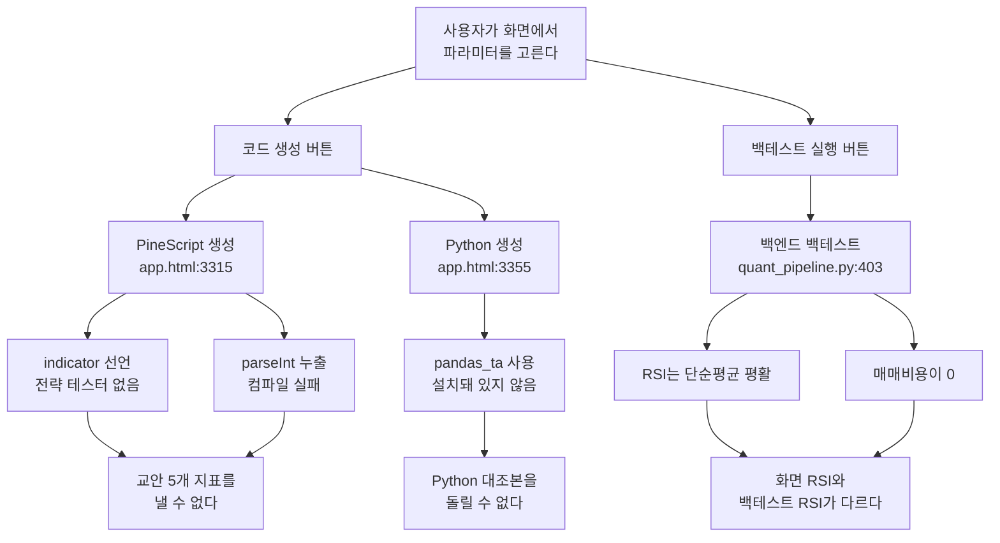
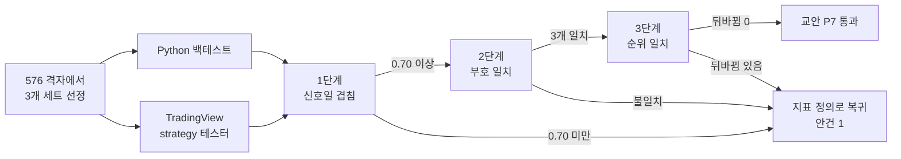
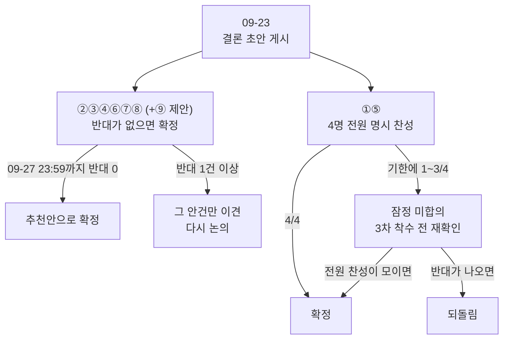

# #20 [논의] D6 3차 커스텀 인디케이터 설계 — 같은 'RSI 14'가 세 벌이라 결론이 58.3% 뒤집힙니다

> 🗂️ 옛 GitHub 논의를 옮긴 **기록 문서**입니다 — [색인](../README.md). 원문은 그대로 두고, 링크·커밋 해시만 새 자리 기준으로 바꿨습니다.

| 항목 | 내용 |
|---|---|
| 종류 | 논의 |
| 상태 | 논의 · 설계(1·2·3차) |
| 원 작성 | 이동원(`devlee328288`) · 2026-09-17 14:34 KST |
| 댓글 | 2건 |
| 옛 주소 | `github.com/devlee328288/Qurious/discussions/20` (지금은 열리지 않음) |

## 본문

> 🟡 **결론 초안 게시 (2026-09-23)** — ②③④⑥⑦⑧ 은 반대 0 으로 **09-27(일) 23:59 KST 확정 예정**입니다. ⑨(3차 주 지표)는 민석님 찬성이 있지만 8절 규칙이 비어 있어 🟡 조건부로 둡니다. ①(지표 정의)·⑤(파라미터 범위)는 전원 명시 찬성이 필요한데 1/4 라 모이지 않으면 **잠정(미합의)** 으로 두자고 제안합니다. 본문에서 사실이 바뀐 곳 9곳은 그 자리에서 고쳤습니다. → **본문 아래 §10 결론**

읽는 순서: 0 쉬운 요약 → 0.2 한눈에 보기 → 4 추천안 → 궁금한 안건만 2·3절 → 9 반응 방법

💬 안건별로 댓글 하나씩 달아 주세요 (예: ① A 👍, ⑥ B — 이유 …).

---

## 0. 쉬운 요약 (3줄)

1. **같은 "RSI 14"가 이 앱 안에서 세 가지로 계산됩니다.** 어느 쪽을 쓰느냐에 따라 같은 전략의 백테스트 결과가 **수익에서 손실로 뒤집히는 경우가 58.3%** 였습니다(200개 파라미터 조합 실측).
2. **화면이 만들어 주는 PineScript는 TradingView에서 컴파일이 안 되고**, 컴파일된다 해도 `indicator()` 선언이라 **전략 테스터가 열리지 않습니다** — 교안이 요구하는 5개 지표를 낼 수 없습니다.
3. 3차에서 "나만의 지표"를 만들려면, **먼저 지표의 뜻을 하나로 못 박고**(안건 ①), **파라미터를 마구 돌리지 않겠다고 미리 약속**해야 합니다(안건 ⑤). 그러지 않으면 어떤 결과가 나와도 "운이 좋았던 것"과 구별할 수 없습니다.

---

### 0.1 이 문서에서 결정할 9가지 (2026-09-18 ⑨ 신설)

| # | 안건 | 추천안 | 확실도 | 지금 상태 |
|---|---|---|---|---|
| ① | 지표 정의를 하나로 통일할까 | **A. TradingView 정의로 통일** (RSI=Wilder, 표준편차=모집단) | 🟢 | RSI 3벌 · 볼린저 자유도 2갈래 |
| ② | PineScript 생성을 어떻게 할까 | **B. `strategy()`로 바꾸고 JS 누출 버그를 고친다** | 🟢 | `indicator()` · 컴파일 불가 |
| ③ | 교안 P7(두 결과 방향성 일치)을 어떻게 확인할까 | **C. 3단계 절차를 못 박는다** (신호일 겹침 → 지표 부호 → 순위) | 🟡 | 절차 없음 |
| ④ | 저장 인디케이터에 무엇을 남길까 | **B. 12개 필드로 확장** (종목·기간·규격버전·결과·시도번호) | 🟢 | 6개 필드뿐 |
| ⑤ | 파라미터 범위를 좁힐까 | **A. 576개 격자로 고정** (MinBTL 상한 724 이내) | 🟢 | 최대 2,266만 조합 |
| ⑥ | 3차에 수급 데이터(외국인·기관)를 넣을까 | **C. 3차 범위에서 뺀다** — ★ 추천 근거가 "부담"에서 **"A안이 약관 위반으로 확정"** 으로 바뀌었습니다(2.10) | 🟢 | 데이터 없음 |
| ⑦ | 3차 합격선을 교안 그대로 쓸까 | **B. 그대로 쓰되 3개 조건을 붙인다** | 🟢 | Profit Factor를 아무도 계산 안 함 |
| ⑧ | 강민석님 의견(2·3차를 각각 깊게)을 어떻게 반영할까 | **A. 3차를 독립 주제로 세운다** — 공유하는 건 ~~비용·검정 규격뿐~~ 🔴 (09-23 정정) 비용·검정 규격 + 검증 엔진 + 모의투자 일지 형식(D1 ④ S1) | 🟡 | ★ [#29](../discussions/029.md) 에서 **B(새 수식) 선호**를 밝히셔서 A안이 더 맞습니다 |
| **⑨** | **3차 주 지표를 무엇으로 할까** ★ 신설 | **B. 조건부 분포 차이** — "얼마 벌었나" 대신 "분포가 달라지나" | 🟡 | ΔSharpe 뿐 |

> 확실도 표기 — 🟢 코드나 공식 문서 원문으로 직접 확인 / 🟡 그 위에서 제가 판단한 추론.
> 이 문서의 모든 수치는 **기준 커밋 `04f476a`** 의 코드를 직접 불러 **합성 데이터(시드 20260901, 2,520행 ≈ 10년)** 로 돌린 실측값입니다. 실제 종목 데이터가 아니므로 숫자의 크기보다 **방향과 갈라짐의 존재**를 보아 주세요.

---

### 0.2 용어 풀이

세 표로 나눠 정리했습니다. **먼저 "같은 말이 여러 뜻인 것"부터** 봅니다.

#### (가) 같은 말인데 뜻이 갈리는 것 — 이 문서의 핵심

| 말 | 뜻 ① | 뜻 ② | 이 문서에서 |
|---|---|---|---|
| **RSI 14** | 14일 **단순평균**으로 상승폭·하락폭을 평활 | 14일 **Wilder 평활**(지수가중, alpha=1/14) | 둘 다 앱 안에 있습니다. ①에서 하나로 정합니다 |
| **표준편차** | 나눗수가 **n** (모집단) | 나눗수가 **n-1** (표본) | 차트는 n, 백엔드는 n-1을 씁니다. ①에서 정합니다 |
| **승률** | **하루 단위** — 보유한 날 중 오른 날 비율 | **거래 단위** — 한 번의 매수~매도 중 이익 난 비율 | 앱은 전부 하루 단위. 교안 기준은 거래 단위입니다 |
| **샤프** | 무위험수익률 **0%** 가정 | 무위험수익률 **2%** 차감 | 앱은 0%, TradingView 기본은 2%입니다 |

#### (나) 기술 용어

| 용어 | 정확한 뜻 | 이 문서에서 가리키는 것 | 헷갈리기 쉬운 점 |
|---|---|---|---|
| **Wilder 평활 (RMA)** | alpha = 1/기간 인 지수가중이동평균. J. Welles Wilder가 RSI·ATR에 쓴 방식 | TradingView `ta.rsi`가 내부에서 쓰는 평활. Pine 문서에 `ta.rma` 로 명시 | "지수이동평균(EMA)"과 다릅니다. EMA는 alpha = 2/(기간+1). 14기간이면 Wilder는 0.0714, EMA는 0.1333 — **거의 2배 차이** |
| **자유도 (ddof)** | 표준편차를 구할 때 제곱합을 무엇으로 나누는가. n으로 나누면 모집단(ddof 0), n-1로 나누면 표본(ddof 1) | 볼린저밴드 폭이 갈리는 원인 | pandas `.std()`는 **기본이 ddof=1**, numpy `.std()`는 **기본이 ddof=0** 입니다. 같은 파이썬인데 기본값이 반대입니다 |
| **`indicator()` / `strategy()`** | PineScript 스크립트의 종류를 정하는 선언문 | `indicator()`는 차트에 선·화살표만 그림. `strategy()`라야 가상 매매를 돌려 "전략 테스터" 탭이 생김 | 화면이 만들어 주는 코드는 `indicator()`라, TradingView에 붙여넣어도 **성적표 탭 자체가 안 생깁니다** |
| **Profit Factor (수익 요인)** | 총이익 ÷ 총손실. 1.0이면 본전, 클수록 좋음 | 교안·RFP가 요구하는 합격 지표 | **앱의 세 백테스트 엔진 어디에도 이 계산이 없습니다**(2절에서 확인) |
| **MinBTL** | Minimum Backtest Length. "시도를 N번 했을 때, 순전히 운으로 목표 샤프가 나올 수 있으니, 그걸 배제하려면 표본이 최소 몇 년 필요한가" | 안건 ⑤에서 파라미터 개수의 상한을 정하는 근거 | 시도를 **많이 할수록** 필요한 표본 기간이 **길어집니다**. 데이터가 10년뿐인데 100만 번 돌리면 어떤 결과든 신뢰할 수 없습니다 |
| **사전등록 (pre-registration)** | 실험을 **하기 전에** "무엇을 몇 번 시도하고 무엇을 합격으로 볼지"를 먼저 기록하는 것 | ④·⑤·⑦의 공통 장치 | 결과를 보고 기준을 바꾸면(= 사후 정당화) 검정이 무의미해집니다 |
| **공공누리 제4유형** | 정부·공공기관 저작물 이용 표시 중 하나. **출처표시 + 상업적 이용금지 + 변경금지** | KRX 유래 데이터가 공공데이터포털에서 붙이는 조건 | "무료 공개 = 마음대로 써도 됨"이 아닙니다. 재배포도 금지입니다 |

#### (다) 숫자로 확인하는 계산 — Wilder vs 단순평균

같은 값 하나만 넣어 두 방식을 손으로 돌려봅니다. 기간 14, 직전 평균 상승폭이 **1.00**인 상태에서 오늘 상승폭 **8.00**이 들어왔다고 합시다.

| 방식 | 계산식 | 새 평균 |
|---|---|---|
| Wilder 평활 | (1.00 × 13 + 8.00) ÷ 14 | **1.50** |
| 단순평균(14일 중 가장 오래된 값이 1.00이었다면) | 1.00 + (8.00 − 1.00) ÷ 14 | **1.50** |

여기까지는 같아 보입니다. 그런데 **그다음 날 상승폭이 0**이면 갈라집니다.

| 방식 | 계산식 | 다음 평균 |
|---|---|---|
| Wilder 평활 | (1.50 × 13 + 0) ÷ 14 | **1.393** — 8.00의 영향이 천천히 사라짐 |
| 단순평균 | 창(window) 안에서 8.00이 여전히 1/14의 무게를 그대로 유지 | **약 1.50 유지** — 14일 뒤 갑자기 떨어짐 |

→ 단순평균은 **큰 값이 창을 벗어나는 순간 계단처럼 튀고**, Wilder는 **부드럽게 감쇠**합니다. 이 차이가 쌓여 RSI 값이 최대 26.8까지 벌어집니다(2.1절).

---

## 1. 배경: 왜 지금 정해야 하는가

3차 프로젝트의 주제는 "커스텀 인디케이터 개발"입니다. 교안([docs/05.md](https://github.com/EST-team-project/Qurious/blob/04f476a/docs/05.md))은 이렇게 요구합니다.

- PineScript로 전략을 만들고, **TradingView 전략 테스터**에서 Net Profit · MDD · Win Rate · Profit Factor · Sharpe 5개를 읽는다
- 같은 전략을 Python으로도 돌려서 **두 결과의 방향성이 일치하는지** 확인한다 (이하 **P7**)
- 합격선: Profit Factor > 1.5, MDD > −15%, Sharpe > 1.0 을 **동시에** 만족

그런데 지금 앱의 상태를 확인해 보니, 이 세 가지가 **전부 지금 그대로는 불가능**합니다.



이 문서는 **코드를 고치자는 제안이 아니라, 3차에서 무엇을 만들지 먼저 정하자는 논의**입니다. 결정이 나면 그 결정대로 2차 프로젝트 이후에 구현합니다.

---

## 2. 사실: 코드와 공식 문서에서 확인한 것

> 조사 방법 — **코드로 답한 것**은 대상 파일을 직접 읽고 함수를 그대로 불러 실행했습니다.
> **외부 조사로 답한 것**은 공식 문서 원문을 받아 확인했고, 출처 URL과 조회일(KST)을 각주에 적었습니다.

### 2.1 같은 "RSI 14"가 세 벌 있습니다 🟢

| # | 구현 위치 | 평활 방식 | 쓰이는 화면 |
|---|---|---|---|
| 1 | `ta_utils.rsi(method="sma")` — [ta_utils.py:14](https://github.com/EST-team-project/Qurious/blob/04f476a/app/services/ta_utils.py#L14) | **단순평균** | **커스텀 인디케이터 백테스트** ([quant_pipeline.py:429](https://github.com/EST-team-project/Qurious/blob/04f476a/app/services/quant_pipeline.py#L429)), 퀀트 ML 피처 ([:73](https://github.com/EST-team-project/Qurious/blob/04f476a/app/services/quant_pipeline.py#L73)) |
| 2 | `ta_utils.rsi(method="ewm")` — 같은 파일 | **Wilder** (pandas `ewm`) | 전략 분석 · 스크리닝 ([investment_research.py:21](https://github.com/EST-team-project/Qurious/blob/04f476a/app/services/investment_research.py#L21)) |
| 3 | `_calc_rsi()` — [stock.py:271](https://github.com/EST-team-project/Qurious/blob/04f476a/app/services/stock.py#L271) | **Wilder** (직접 구현, 소수 2자리 반올림) | 차트 화면의 RSI 선 |
| (4) | 생성 PineScript `ta.rsi` | **Wilder** | TradingView |
| (5) | 생성 Python `pandas_ta.rsi` | **Wilder** | (라이브러리 미설치 — 실행 불가) |

**실측** (시드 20260901, 2,520행):

| 비교 | 평균 절대차 | 95퍼센타일 | 최대 절대차 |
|---|---|---|---|
| ① 단순평균 vs ② Wilder | **6.6605** | 15.9543 | **26.8098** |
| ③ 차트 Wilder vs ② Wilder | 0.0385 | — | 6.8895 |

③과 ②는 **같은 Wilder인데도** 최대 6.89 차이가 납니다. 이유는 **시작값(seed)**입니다. Pine `ta.rma`와 차트 `_calc_rsi`는 첫 14개의 **단순평균**으로 시작하는데, pandas `ewm(adjust=False)`는 **첫 관측값 하나**로 시작합니다. 초반 구간에서만 벌어지고 점차 수렴합니다.

**임계값을 넘는 날 수**가 어떻게 달라지는지가 전략에 직접 영향을 줍니다.

| 조건 | 단순평균(현행 백테스트) | Wilder(화면·TradingView) | 차이 |
|---|---|---|---|
| RSI < 30 | 301일 | 95일 | **+216.8%** |
| RSI < 35 | 484일 | 263일 | **+84.0%** |
| RSI < 40 | 737일 | 523일 | **+40.9%** |

```
RSI < 35 해당일수 (2,506일 중)
단순평균  ████████████████████████████████████████████████  484일
Wilder    ██████████████████████████                        263일
```

> 참고 — [A5 #19](../issues/019.md)에서는 평균 6.91 · 최대 24.31 · 151일 vs 87일로 보고했습니다. 이번엔 표본을 10년으로 늘려 다시 쟀습니다. 표본 길이를 250~2,520행으로 바꿔가며 재보니 **평균 절대차는 6.6~7.5 사이에서 안정**했고, 임계값 초과일수 비율도 방향이 같았습니다. **수치가 다른 것은 표본 길이 차이일 뿐 결론은 같습니다.**

### 2.2 지표 정의만 바꾸면 결론이 58.3% 뒤집힙니다 🟢

`backtest_custom_indicator`를 **그대로 두고** RSI 평활 방식만 바꿔 200개 파라미터 조합을 돌렸습니다(RSI를 쓰는 `rsi_ma`·`volume_rsi` 두 조합, 시드 20260901).

| 항목 | 값 |
|---|---|
| 둘 중 하나라도 거래가 발생한 조합 | 120개 |
| **총수익의 부호가 뒤집힌 조합** | **70개 (58.3%)** |
| 거래 횟수가 달라진 조합 | 118개 (98.3%) |
| 총수익 차이 중앙값 | 22.16%p |
| 총수익 차이 최대 | 199.04%p |
| 샤프 차이 중앙값 | 0.180 |

```
200개 조합 중 결론이 갈린 비율
부호 역전   ████████████████████████████████████  58.3%
거래수 변동 ████████████████████████████████████████████████████████████  98.3%
```

가장 크게 갈린 5개:

| 기준 조합 | short | mid | rsi | buy_th | 단순평균(현행) | Wilder |
|---|---|---|---|---|---|---|
| volume_rsi | 23 | 55 | 27 | 25 | **+199.04%** | 0.00% |
| volume_rsi | 8 | 37 | 35 | 24 | **+147.98%** | 0.00% |
| volume_rsi | 20 | 118 | 38 | 27 | **+143.20%** | 0.00% |
| volume_rsi | 7 | 71 | 37 | 30 | **+140.84%** | 0.00% |
| volume_rsi | 17 | 45 | 21 | 35 | **+117.83%** | −0.99% |

Wilder 쪽이 0.00%인 것은 **거래가 한 번도 일어나지 않아 현금으로 있었다**는 뜻입니다. 단순평균 RSI는 극단값에 훨씬 자주 닿기 때문에 신호가 많이 나오고, 그래서 "잘 되는 것처럼" 보입니다.

RSI를 쓰지 않는 `macd_bb`·`triple_ma` 조합은 두 방식이 **소수점까지 동일**했습니다 — 실험이 RSI만 바꾼 것이 맞다는 확인입니다.

### 2.3 볼린저밴드 자유도가 두 갈래입니다 🟢

| 위치 | 계산 | 자유도 |
|---|---|---|
| 차트 화면 [stock.py:301](https://github.com/EST-team-project/Qurious/blob/04f476a/app/services/stock.py#L301) | 제곱합 ÷ `period` | **ddof 0** (모집단) |
| 백엔드 [ta_utils.py:43](https://github.com/EST-team-project/Qurious/blob/04f476a/app/services/ta_utils.py#L43) | pandas `.std()` | **ddof 1** (표본) |
| 생성 PineScript `ta.stdev` | `biased=true` 기본 | **ddof 0** |

| 항목 | 값 |
|---|---|
| 이론 비율 √(20/19) | 1.025978 |
| 실측 밴드폭 비율 평균 | **1.025978** (최소 1.025973 / 최대 1.025983) |
| 차트 밴드가 좁은 정도 | **2.5321%** |

이론값과 실측값이 소수 6자리까지 일치합니다. **차트와 PineScript는 서로 맞고, 백엔드만 다릅니다.**

### 2.4 생성되는 PineScript는 컴파일되지 않고, 돼도 성적표가 없습니다 🟢

**(가) 컴파일 실패** — [app.html:3338](https://github.com/EST-team-project/Qurious/blob/04f476a/public/app.html#L3338)

```
sell_th   = input.int(100 - parseInt(buyTh), "매도 RSI 임계값")
```

이 줄은 JavaScript 템플릿 문자열 안에 있는데 `${...}` 로 감싸지 않아, **`parseInt(buyTh)` 라는 글자가 그대로** Pine 소스에 들어갑니다. `parseInt`는 Pine에 없는 함수라 컴파일이 실패합니다. 이 줄은 **4개 기준 조합이 모두 공유**하므로 생성되는 4종 전부 해당합니다.

참고로 Python 생성기([app.html:3355](https://github.com/EST-team-project/Qurious/blob/04f476a/public/app.html#L3355))는 같은 표현을 `${100 - parseInt(buyTh)}`로 **올바르게** 감쌌습니다 — Pine 쪽만 빠진 실수입니다.

**(나) 성적표 부재** — [app.html:3331](https://github.com/EST-team-project/Qurious/blob/04f476a/public/app.html#L3331) 이 `indicator("...", overlay=true)` 입니다.

Pine Script v6 공식 레퍼런스에서 두 선언문의 인자를 비교했습니다.

| 기능 | `indicator()` | `strategy()` |
|---|---|---|
| 가상 매매·전략 테스터 | ❌ 없음 | ✅ |
| 수수료 `commission_type` / `commission_value` | ❌ | ✅ 기본 `percent` / **0** |
| 슬리피지 `slippage` | ❌ | ✅ 기본 **0** (틱 단위) |
| 초기자본 `initial_capital` | ❌ | ✅ 기본 **1,000,000** |
| 주문수량 `default_qty_type` / `default_qty_value` | ❌ | ✅ 기본 `fixed` / **1주** |
| 샤프 계산용 `risk_free_rate` | ❌ | ✅ 기본 **2** (%) |
| 종가 즉시 체결 `process_orders_on_close` | ❌ | ✅ 기본 **false** → 다음 봉 시가 체결 |

**새로 확인한 것 2가지:**

- **TradingView 샤프는 무위험수익률 2%를 차감합니다.** 앱은 0%입니다([ta_utils.py:56](https://github.com/EST-team-project/Qurious/blob/04f476a/app/services/ta_utils.py#L56)). [A6 #14](../issues/014.md)에서 "샤프 3종"이라 했는데, TradingView를 더하면 **4번째 정의**가 됩니다.
- **기본 주문수량이 1주**입니다. 초기자본 100만인데 1주씩 사면 수익률이 거의 0으로 나옵니다 — 교안 예시대로 붙여넣으면 "전략이 나쁜 것"처럼 보일 수 있습니다.

`process_orders_on_close` 기본값이 false라 **체결은 다음 봉 시가** — [D7 #13](../discussions/013.md) ⑥의 추천안과 일치합니다.

### 2.5 매매비용이 커스텀 백테스트에 ~~닿지 않습니다 🟢~~ 🔴 (09-23 정정) 닿지 않았습니다 — 09-20 PR [#42](../pulls/042.md) 로 고쳐짐

API는 `cost_bps`를 받습니다([stocks.py:743](https://github.com/EST-team-project/Qurious/blob/04f476a/app/routes/stocks.py#L743), 0~500 허용). 그런데

- `strategy != "custom"` 일 때만 `backtest_strategy(..., cost_bps=cost_bps)` 로 전달 ([stocks.py:754](https://github.com/EST-team-project/Qurious/blob/04f476a/app/routes/stocks.py#L754))
- 기본값인 `strategy="custom"` 일 때는 `backtest_custom_indicator(...)` 를 호출하는데 **인자 목록에 `cost_bps`가 아예 없습니다** ([stocks.py:756](https://github.com/EST-team-project/Qurious/blob/04f476a/app/routes/stocks.py#L756))

실행해 확인했습니다.

```
backtest_custom_indicator 파라미터: ['candles', 'base', 'short_window', 'mid_window', 'rsi_period', 'buy_threshold']
backtest() 안 'cost' 문자열 등장 횟수: 0
```

~~즉 **커스텀 인디케이터 화면에서 비용을 0으로 놓든 5%로 놓든 결과가 한 글자도 바뀌지 않습니다.**~~ 🔴 (09-23 정정) 09-17 기준 사실이었습니다. 09-20 PR [#42](../pulls/042.md) 뒤로는 `cost` 가 커스텀 백테스트에 전달됩니다(`app/services/quant_pipeline.py:427-483` · [`3b12100`](https://github.com/EST-team-project/Qurious/commit/3b12100a33798c038b7ef3ed52406867efe7bacc)).

비용을 실제로 반영하는 엔진(`backtest_strategy`)으로 같은 데이터를 돌리면 이렇게 달라집니다.

| cost_bps | 총수익 | 샤프 | MDD | 거래수 |
|---|---|---|---|---|
| 0 | −38.59% | −0.162 | −53.19% | 172 |
| **10 (D4 추천안)** | **−48.29%** | **−0.254** | −57.49% | 172 |
| 25 | −60.06% | −0.390 | −66.30% | 172 |
| 100 | −89.09% | −1.056 | −90.51% | 172 |
| 500 | −99.99% | −3.291 | −99.99% | 172 |

거래 172회에 편도 10bps만 붙여도 **총수익이 9.7%p 깎입니다.**

### 2.6 Profit Factor를 아무도 계산하지 않습니다 🟢

| 엔진 | `profit_factor` 키 |
|---|---|
| `backtest` ([quant_pipeline.py:231](https://github.com/EST-team-project/Qurious/blob/04f476a/app/services/quant_pipeline.py#L231)) | 없음 |
| `backtest_strategy` ([investment_research.py:50](https://github.com/EST-team-project/Qurious/blob/04f476a/app/services/investment_research.py#L50)) | 없음 |
| `backtest_custom_indicator` ([quant_pipeline.py:403](https://github.com/EST-team-project/Qurious/blob/04f476a/app/services/quant_pipeline.py#L403)) | 없음 |

그런데 **교안 05.md 2절**은 `Profit Factor > 1.5`를 합격 조건으로 명시하고, **[rfp-2.md](https://github.com/EST-team-project/Qurious/blob/04f476a/docs/rfp-2.md) 6.1절**은 성과 검증 보고서의 **필수 산출물**로 `Profit Factor`를 요구합니다.

직접 계산해 봤습니다(ma 전략, cost_bps=10, 일 단위): **Profit Factor = 0.9445** → 교안 기준 **미달**.

### 2.7 파라미터 조합이 화면과 API에서 다릅니다 🟢

| 파라미터 | 화면 min/max ([app.html:1953~1965](https://github.com/EST-team-project/Qurious/blob/04f476a/public/app.html#L1953)) | API ge/le ([stocks.py:738~743](https://github.com/EST-team-project/Qurious/blob/04f476a/app/routes/stocks.py#L738)) |
|---|---|---|
| 단기 MA | 2 ~ **20** | 2 ~ **30** |
| 중기 MA | **5** ~ **60** | **3** ~ **120** |
| RSI 기간 | 5 ~ **30** | 5 ~ **40** |
| 매수 임계값 | **10** ~ 50 | **5** ~ 50 |

| 경로 | 조합 수 |
|---|---|
| 화면 입력창 기준 | **4,536,896** |
| API 직접 호출 기준 | **22,667,328** (정확히 **5.00배**) |
| 백엔드 clamp(`mid = max(short+1, mid)`) 반영 후 유효 조합 | 19,977,984 (88.1%) |

HTML의 `min`/`max`는 브라우저 검증일 뿐이라 API를 직접 부르면 넓은 쪽이 열립니다.

### 2.8 그래서 몇 번까지 시도해도 되는가 — MinBTL 🟢

[A5 #19](../issues/019.md)·[D4 #17](../discussions/017.md)에서 쓴 식을 그대로 씁니다.

```
E[max Z] ≈ (1 − γ)·Φ⁻¹[1 − 1/N] + γ·Φ⁻¹[1 − 1/(N·e)]     (γ = 0.5772156649)
MinBTL   = (E[max Z] / 목표샤프)²
```

**원문 예시 재현 검증**: N=45, 목표샤프 1.0 → **4.998년 ≈ 5년** (원문과 일치) ✅

| 표본 길이 | 목표샤프 1.0을 주장할 수 있는 최대 시도 횟수 N |
|---|---|
| 5년 | **45** |
| **10년** | **724** |
| 20년 | 145,785 |

| 시도 횟수 | 필요한 표본 |
|---|---|
| 화면 전수 4,536,896 | **26.6년** |
| API 전수 22,667,328 | **29.7년** |

같은 10년 표본이라도 목표 샤프를 낮추면 더 빨리 한계에 닿습니다.

| 목표 샤프 | 10년으로 감당되는 N |
|---|---|
| 0.5 | **10** |
| 1.0 | 724 |
| 1.5 | 536,957 |

> 읽는 법: "10년 데이터로 샤프 1.0짜리 전략을 찾았다"고 **정직하게 말하려면 시도가 724번 이내**여야 합니다. 2,266만 번 돌려서 나온 최고 성적은 **30년치 데이터가 있어야** 운과 구별됩니다.

### 2.9 외부 조사: pandas_ta는 사실상 유실 상태입니다 🟢

생성되는 Python 코드는 첫 줄이 `import pandas_ta as ta` 입니다([app.html:3371](https://github.com/EST-team-project/Qurious/blob/04f476a/public/app.html#L3371)). 조회일 **2026-09-17 (KST)** 기준:

| 확인 항목 | 결과 |
|---|---|
| requirements.txt 포함 여부 | **없음** → 이 프로젝트에서 실행 불가 |
| PyPI 최신 버전 | **0.4.71b0** — 베타 |
| PyPI 최신 업로드일 | **2025-09-14** (약 1년 전) |
| PyPI에 남은 릴리스 수 | **2개** (0.4.67b0, 0.4.71b0) — **정식 릴리스 0개** |
| requires_python | **>=3.12** |
| 공식 문서 `pandas-ta.dev` | DNS는 있으나 **HTTPS 연결 실패** |
| GitHub `twopirllc/pandas-ta` | **404 Not Found** (인증 API로 확인) |
| 해당 계정의 공개 저장소 수 | **0개** |

대안으로 유지보수되는 포크가 있습니다.

| 저장소 | 스타 | 라이선스 | 마지막 푸시 |
|---|---|---|---|
| `xgboosted/pandas-ta-classic` | 438 | **MIT** | **2026-09-16** (어제) |

### 2.10 외부 조사: 수급 데이터 출처와 이용 조건 🟢🟡

현재 앱의 시세 출처는 **Yahoo Finance** 뿐입니다([stock.py:9](https://github.com/EST-team-project/Qurious/blob/04f476a/app/services/stock.py#L9)). 외국인·기관 순매수 데이터는 코드·모델·의존성 **어디에도 없습니다**.

| 경로 | 무엇을 주나 | 이용 조건 | 확실도 |
|---|---|---|---|
| **공공데이터포털** — 금융위원회 API 군 (KRX 연계) | 주식시세 등. **갱신은 영업일 +1일 오후 1시** | **공공누리 제4유형: 출처표시 + 상업적 이용금지 + 변경금지.** "상업적 목적 여부와 상관 없이 **제3자 무단 제공 및 재배포가 엄격히 금지**" 명시. 무료, 개발계정 10,000건/일 | 🟢 원문 확인 |
| **KRX 정보데이터시스템** — `MDCSTAT022`(시장 전체) / `MDCSTAT023`(개별종목) 투자자별 거래실적 | 외국인·기관·개인 순매수 | 화면 제공. 상업적 이용은 **KRX Data Marketplace 유료 구매** | 🟡 목록만 확인 (사이트가 자동 접근을 403으로 차단) |
| **KRX OPEN API** (`openapi.krx.co.kr`) | 공식 API. **2010-01-04~ 16.7년** | ★ **약관 정독 완료(S23·S25)** — 제10조② **자동화 수단 무단 수집 금지** · 제7조⑤ **인증키 양도 금지** · 제12조①② **재배포 금지**. 유량 헤더를 주지 않아 한도 불명 | 🟢 원문 확인 |
| **pykrx** (`sharebook-kr/pykrx`) | KRX 화면을 **스크래핑**하는 파이썬 라이브러리. 스타 1,091 · 최신 1.2.8 (2026-05-04) | 🔴 **사용하지 않기로 확정(S25)** — 라이브러리 코드가 MIT 인 것과 별개로, 동작 자체가 **KRX 약관 제10조②(자동화 수단 무단 수집 금지)** 에 정면으로 걸립니다. PyPI 메타데이터는 MIT 이나 **저장소 루트에 LICENSE 파일이 없습니다** | 🟢 |

> ⚠️ 구별해야 할 점: **pykrx의 MIT는 "라이브러리 코드"의 라이선스이지, 그것이 가져오는 "KRX 데이터"의 이용 조건이 아닙니다.** 데이터는 여전히 KRX 약관을 따릅니다.
>
> ⚠️ 그리고 **"변경금지"** 조항이 퀀트 분석과 충돌할 소지가 있습니다. 지표를 계산하고 가공해 화면에 띄우는 것이 "변경"에 해당하는지는 **제가 판단할 수 없습니다** 🟡. 넣기로 한다면 이 점을 강사님께 먼저 여쭤야 합니다.

---

## 3. 선택지

### ① 지표 정의를 하나로 통일할까

| | 선택지 | 내용 | 장점 | 단점 |
|---|---|---|---|---|
| **A** | **TradingView 정의로 통일** | RSI = Wilder(SMA 시드), 표준편차 = ddof 0 | 교안 P7(두 결과 대조)이 성립. 차트·PineScript와 일치 | 백엔드 2곳 수정. 기존 백테스트 결과가 전부 바뀜 |
| B | 앱 정의로 통일 | RSI = 단순평균, 표준편차 = ddof 1 | 수정량이 적음 | TradingView와 영영 안 맞아 P7 불가 |
| C | 두 정의를 **선택 가능**하게 | 화면에서 고르게 함 | 비교 자체가 3차 주제가 됨 | 시도 횟수가 2배 → MinBTL 부담 |
| D | 그대로 둔다 | — | 작업 0 | 화면과 백테스트가 다른 지표를 씀 |

### ② PineScript 생성을 어떻게 할까

| | 선택지 | 내용 |
|---|---|---|
| A | 지금처럼 `indicator()` 유지 + 버그만 수정 | 컴파일은 되지만 성적표 없음. "참고용 지표 스크립트"로 범위를 낮춤 |
| **B** | **`strategy()`로 바꾸고 버그 수정** | 전략 테스터가 열려 교안 5지표를 낼 수 있음 |
| C | PineScript 생성 기능을 **뺀다** | 안 되는 기능을 없애 정직해짐. 대신 교안 P7 불가 |

### ③ 교안 P7(방향성 일치)을 어떻게 확인할까

| | 선택지 | 내용 |
|---|---|---|
| A | 교안대로 "Sharpe·MDD 증감 방향만" 눈으로 비교 | 기준이 모호해 "일치한다"고 우기기 쉬움 |
| B | 수치가 ±10% 이내면 일치로 본다 | 데이터 소스가 다르면 넘기 어려운 기준 |
| **C** | **3단계 절차를 못 박는다** | (1) 신호 발생일 집합의 겹침 비율 (2) Sharpe·MDD **부호** 일치 (3) 3개 파라미터 세트의 **순위** 일치 |

### ④ 저장 인디케이터에 무엇을 남길까

현재 저장되는 것 ([trading.py:72](https://github.com/EST-team-project/Qurious/blob/04f476a/app/models/trading.py#L72)): `name` `base` `short_window` `mid_window` `rsi_period` `buy_threshold` — **6개뿐**. 종목도, 기간도, 결과도 없습니다.

| | 선택지 | 추가 필드 |
|---|---|---|
| A | 최소 확장 | + 종목 · 기간 (8개) |
| **B** | **재현 가능한 수준** | + 종목 · 기간 · 비용규격 버전 · 지표정의 버전 · 결과 스냅샷(샤프/MDD/PF/거래수) · 시도 일련번호 · 사전등록 여부 · 코드 커밋 해시 (~~**12개**~~ 🔴 09-23 정정: 새 칸 8개 · 기존 6 + 8 = **14칸**) |
| C | 전체 결과 시계열까지 저장 | B + 누적수익 곡선 |

### ⑤ 파라미터 범위를 좁힐까

| | 선택지 | 조합 수 | 10년 표본으로 주장 가능한 목표 샤프 |
|---|---|---|---|
| **A** | **576개 격자로 고정** | 576 | ~~**1.0 이상 주장 가능** (상한 724)~~ 🔴 (09-23 정정) 10년 표본일 때만 — 새 코드가 쓰는 수집 DB 6.7년이면 상한 118(§10.4 ⑤) |
| B | 화면 범위를 API에 맞춰 넓힘 | 22,667,328 | 30년 필요 → 주장 불가 |
| C | API 범위를 화면에 맞춰 좁힘 | 4,536,896 | 27년 필요 → 주장 불가 |
| D | 그대로 둔다 | 화면 4,536,896 / API 22,667,328 (불일치) | — |

A안의 구체적 격자 (4 × 3 × 4 × 3 × 4 = **576**):

| 축 | 값 | 개수 |
|---|---|---|
| 기준 조합 | rsi_ma · macd_bb · volume_rsi · triple_ma | 4 |
| 단기 MA | 5 · 10 · 20 | 3 |
| 중기 MA | 20 · 40 · 60 · 120 | 4 |
| RSI 기간 | 9 · 14 · 21 | 3 |
| 매수 임계값 | 25 · 30 · 35 · 40 | 4 |

남는 148회(724 − 576)는 재현 실패 시 재시도 여유분으로 둡니다.

### ⑥ 3차에 수급 데이터를 넣을까

| | 선택지 | 내용 |
|---|---|---|
| ~~A~~ | 🔴 **선택 불가** — pykrx로 수집해 DB 저장 | ★ 2026-09-18 정정: "라이선스 확인 필요"가 아니라 **확인 결과 위반**입니다(2.10). 이 칸은 기록으로만 남깁니다 |
| B | **관측만** — 화면에 띄우되 저장·재배포 안 함 | 조건 위반 위험이 낮음. 다만 백테스트에는 못 씀 |
| **C** | **3차 범위에서 뺀다** | 라이선스 확인 부담 없음. 3차는 "지표 정의" 하나에 집중 |

### ⑦ 3차 합격선을 교안 그대로 쓸까

| | 선택지 | 내용 |
|---|---|---|
| A | 교안 5지표를 그대로 | PF를 계산하는 코드가 없어 지금은 판정 불가 |
| **B** | **그대로 쓰되 3개 조건을 붙인다** | (1) PF 계산을 추가 (2) 승률·PF를 **거래 단위**로 (3) **비용 차감 후** 기준 |
| C | rfp-2 기준(MDD −20%, 샤프 1.0)을 쓴다 | rfp-2는 **포트폴리오** 기준 — 개별 전략에 쓰기엔 느슨함 |

> 참고: 교안(개별 전략) MDD > −15% 와 rfp-2(포트폴리오) MDD −20% 는 **대상이 다릅니다**. [D5 #18](../discussions/018.md) ⑧에서 이미 다룬 사안입니다.

### ⑧ 강민석님 의견을 3차 범위에 어떻게 반영할까

[D1 #7](../discussions/007.md)에서 주신 의견:

> "로보 어드바이저와 인디케이터를 **완전히 다른 범위**로 인식하고 있습니다. … 어드바이저를 깊게, 인디케이터를 깊게 만드는 것이 중요하다 생각합니다. … **목표가 둘을 잇는 것이 되면 안 된다**고 생각합니다."

| | 선택지 | 내용 |
|---|---|---|
| **A** | **3차를 독립 주제로 세운다** | 3차의 질문을 "지표 정의가 결과를 얼마나 바꾸는가"로 좁힘. 2차와 공유하는 것은 ~~**비용·검정 규격(D4)** 뿐~~ 🔴 (09-23 정정) 비용·검정 규격(D4) + 검증 엔진 + 모의투자 일지 형식(D7 ⑤) — D1 ④ S1 |
| B | 2·3차를 잇는 대시보드를 목표로 | D1 의견과 충돌 |
| C | 여유가 되면 마지막에 결합 대시보드 | 강민석님이 언급한 "시간이 남으면" 안 |

---

### ⑨ 3차 주 지표를 무엇으로 할까 ★ 2026-09-18 신설

[#29](../discussions/029.md)에서 강민석님이 세워 주신 기준입니다.

> "1차처럼 개발한 지표로 특정 양의 수익을 내는 것이 목표라기보다는, **차트의 현 상황을 어떤 관점으로 어떻게 분석해서 어떤 유의미한 관점을 도출하는가**를 목표로 하면 좋겠습니다."

문제는 [D4 #17 ⑤](../discussions/017.md)가 정한 주 지표가 **ΔSharpe_net**(비용 차감 샤프 차이)이라는 점입니다. 그대로 3차에 쓰면 *"결국 수익 얘기 아니냐"* 가 되어 위 기준과 어긋납니다. 그렇다고 검정을 아예 빼면 *"이 관점이 우연이 아니다"* 를 말할 방법이 없어집니다.

| | 선택지 | 무엇을 보이나 | 통계 검정 | 민석님 기준과 |
|---|---|---|---|:--:|
| A | D4 ⑤ 그대로 **ΔSharpe_net** | 비용 빼고 더 벌었나 | block bootstrap 그대로 | ✖ 수익 중심 |
| **B** | **조건부 분포 차이** | "조건 A **전체**" 와 "조건 A **∩ 새 지표 발동**" 의 다음 N일 수익 **분포가 다른가** | **같은 bootstrap**, 비교 대상만 교체 | ✅ 관점 중심 |
| C | 둘 다 보고 | | 시도 횟수 2배 → MinBTL 부담 | 🟡 |

**B를 택하면 양의 수익이 아니어도 통과할 수 있습니다.** *"새 지표가 발동하면 다음 5일 수익 분포가 하락 쪽으로 쏠린다"* 도 유의미한 관점이기 때문입니다. 민석님이 드신 예 — *"RSI 과매수 상황에서 가격이 실제로 하락하는 시점을 포착"* — 가 정확히 이 형태입니다.

~~**코드 재사용**: 검정 코드는 **그대로 씁니다.** 1차 `evaluation/` 의 block bootstrap 은 *두 수익률 배열의 차이*를 받으므로, 넣는 배열만 `(전략, 기준선)` → `(조건A∩B, 조건A)` 로 바뀝니다. 새로 쓰는 것은 **조건 마스크를 만드는 함수 하나**입니다.~~ 🔴 (09-23 정정) **코드 재사용**: 1차에는 block bootstrap **코드가 없고** 절차(ADR 0004)만 있습니다 — 1차 보고서도 주 검정을 *"수행하지 못했다"* 고 적었습니다. 검정 코드와 조건 마스크를 **새로 씁니다**(D4 ⑤ 파생과 같은 작업).

⚠️ **한계** 🔴: 조건이 겹칠수록 표본이 줄어 p값이 안 나올 수 있습니다(예: "과매수 ∩ 새 지표"가 10년에 40일뿐이면 검정력 부족). **B를 택하면 최소 표본 수를 먼저 정해야 합니다.**

---

## 4. 추천안

| # | 추천 | 한 줄 이유 |
|---|---|---|
| ① | **A — TradingView 정의로 통일** (RSI=Wilder·SMA 시드, 표준편차=ddof 0) | 교안 P7이 성립하는 유일한 선택. 차트·PineScript가 이미 그쪽 |
| ② | **B — `strategy()`로 바꾸고 [app.html:3338](https://github.com/EST-team-project/Qurious/blob/04f476a/public/app.html#L3338) 버그 수정** | 전략 테스터 없이는 교안 5지표를 못 냄 |
| ③ | **C — 3단계 절차를 못 박는다** | "방향성 일치"는 기준이 없으면 우길 수 있음 |
| ④ | **B — 12개 필드로 확장** | ⑤·⑦의 사전등록이 저장 없이는 성립 안 함 |
| ⑤ | **A — 576개 격자로 고정** + 화면·API 범위 일치 | 10년 표본으로 샤프 1.0을 주장하려면 724 이내 |
| ⑥ | **C — 3차 범위에서 뺀다** | 라이선스 확인 부담 + 강민석님 "깊게" 의견 |
| ⑦ | **B — 교안 기준 + 3개 조건** | PF 계산 추가 · 거래 단위 · 비용 차감 후 |
| ⑧ | **A — 3차를 독립 주제로** | ~~강민석님 의견 그대로 반영 ([#29](../discussions/029.md) 의 B 선호로 더 강해짐)~~ 🔴 (09-23 정정) 민석님이 ⑧ 을 직접 고르신 적은 없고, [#29](../discussions/029.md) 의 B 는 다른 축(새 수식 지표)입니다 — 제 추론이었습니다(§10.11) |
| **⑨** | **B — 조건부 분포 차이** | "관점 도출이 목표"를 검정 가능한 형태로 옮긴 유일한 안 |

### 4.1 ②를 고를 때 미리 알아야 할 한계 🟡

`strategy()`로 바꾸면 수수료를 인자로 넣을 수 있지만, **[D4 #17](../discussions/017.md) ①의 비용 규격을 Pine으로 정확히 옮길 수 없습니다.**

| D4 ① 규격 | Pine `strategy()` 표현 | 가능? |
|---|---|---|
| 매수 편도 10bps | `commission_value=0.1` | ✅ |
| 매도 편도 10bps | 같은 값이 자동 적용 | ✅ |
| **매도세 0.15% (매도에만)** | Pine에는 **매수/매도를 구분하는 수수료 인자가 없음** | ❌ |

→ 따라서 **정본은 Python으로 두고, Pine은 "왕복 비용 근사"** 로 씁니다. 두 결과가 매도세만큼 차이 나는 것은 **미리 알고 있는 차이**로 기록합니다. 이것이 ③의 3단계 절차가 "수치 일치"가 아니라 "부호·순위 일치"를 보는 이유입니다.

### 4.2 ③ 3단계 절차 (구체안)

같은 종목 · 같은 기간 · **576 격자에서 뽑은 3개 세트**로 다음을 표에 기록합니다.

| 단계 | 무엇을 보나 | 합격선(제안) |
|---|---|---|
| 1 | **신호 발생일이 얼마나 겹치나** (Jaccard = 교집합 ÷ 합집합) | ≥ 0.70 |
| 2 | Sharpe · MDD · Net Profit의 **부호**가 같은가 | 3개 모두 일치 |
| 3 | 3개 세트를 Sharpe로 줄 세웠을 때 **순위**가 같은가 | 순위 뒤바뀜 0건 |

1단계가 0.70 미만이면 **지표 정의가 아직 안 맞은 것**이므로 ①로 돌아갑니다.



---

## 5. 근거 · 반례 · 한계

### 5.1 이 문서를 지탱하는 근거

| 주장 | 근거 | 확실도 |
|---|---|---|
| RSI가 3벌이다 | 세 파일을 직접 읽음 + 실행해 수치 비교 | 🟢 |
| 정의만 바꿔도 58.3% 부호 역전 | 프로젝트 함수를 그대로 불러 200조합 실측 | 🟢 |
| 볼린저 비율 1.025978 | 이론값과 실측값이 소수 6자리 일치 | 🟢 |
| TradingView RSI = Wilder | Pine v6 레퍼런스 `ta.rsi` → "calculated using the `ta.rma()`", `ta.rma` → "alpha = 1 / length" | 🟢 |
| `ta.stdev` 기본이 모집단 | Pine v6 레퍼런스 `biased` "The default is true" + 등가 코드 `math.sqrt(sum / length)` | 🟢 |
| TradingView 샤프에 rf 2% | Pine v6 `strategy()` `risk_free_rate` "The default is 2" | 🟢 |
| cost_bps가 custom에 안 닿음 | 함수 시그니처 출력 + `backtest()` 내 'cost' 0회 | 🟢 |
| MinBTL 724 | 원문 예시(N=45 → 4.998년) 재현 후 같은 식으로 계산 | 🟢 |
| pandas_ta 유실 | PyPI 메타데이터 + GitHub 인증 API 404 | 🟢 |
| 공공누리 제4유형 | 공공데이터포털 페이지 원문 | 🟢 |
| "변경금지"가 퀀트 가공과 충돌할 수 있다 | 제 판단 | 🟡 |

### 5.2 반례와 한계 — 이 문서가 틀릴 수 있는 지점

1. **합성 데이터입니다.** 실제 종목이 아니라 정규분포 난수로 만든 가격입니다. 실제 데이터는 추세·군집변동성이 있어 **숫자의 크기는 달라집니다.** 다만 "정의가 다르면 결과가 갈린다"는 **존재 자체**는 데이터와 무관합니다.

2. **58.3%는 표본 200개의 값입니다.** 다른 시드로 뽑으면 50~65% 사이에서 움직일 것으로 봅니다 🟡. 정확한 숫자보다 **"절반 이상"** 이라는 크기가 요점입니다.

3. **기본값(rsi_ma, short=5, mid=20, buy_th=35)에서는 거래가 0회였습니다.** 골든크로스와 RSI<35가 같은 날 성립한 적이 없었기 때문입니다. 임계값을 45로 올려야 거래가 시작됐습니다. **다만 이것은 추세가 없는 합성 데이터의 성질일 수 있어** 실제 종목에서 다시 확인해야 합니다 🟡.

4. **KRX 관련 3개 사이트를 읽지 못했습니다.** `openapi.krx.co.kr`·`data.krx.co.kr`이 자동 접근을 **403**으로 차단합니다. 이용약관 원문은 **사람이 직접 열어 확인해야 합니다.**

5. **Pine `strategy()`를 실제로 돌려보지 않았습니다.** TradingView 계정이 필요하고 이 세션에서는 코드 작업을 하지 않기로 했습니다. 인자 기본값은 공식 레퍼런스로 확인했지만, **실제 체결 동작은 돌려봐야 압니다** 🟡.

6. **pandas_ta 404가 네트워크 차단일 가능성**이 남아 있습니다. 다만 (a) PyPI 릴리스가 2개뿐, (b) 공식 문서 사이트 연결 실패, (c) 인증 API 404, (d) 계정 공개 저장소 0개 — 네 가지가 같은 방향을 가리킵니다.

---

## 6. 이 추천안을 뒤집을 조건

| 안건 | 이런 사실이 나오면 추천안을 버립니다 |
|---|---|
| ① | 실제 종목 데이터에서 두 정의의 백테스트 차이가 **부호 역전 10% 미만**이면 → D안(그대로 두기)이 합리적 |
| ② | TradingView 무료 계정에서 `strategy()` 백테스트가 **막혀 있으면** → A안(참고용 지표)으로 후퇴 |
| ③ | 1단계 Jaccard가 **정의를 통일한 뒤에도 0.70을 못 넘으면** → 데이터 소스 차이가 원인이므로 P7 자체를 "정성 확인"으로 낮춤 |
| ④ | A2(데이터 계층) 분석에서 **필드 추가가 마이그레이션을 크게 건드리면** → A안(8개)으로 축소 |
| ⑤ | 팀이 **목표 샤프를 1.5로 올리기로** 하면 → 상한이 536,957로 늘어 C안도 가능 |
| ⑥ | 강사님이 **"수급 데이터를 꼭 써라"** 고 하시면 → B안(관측만)으로 전환 |
| ⑦ | 576 격자 전체에서 **합격 조합이 0개**면 → 합격선이 이 데이터에 과하다는 뜻이므로 기준을 다시 논의 |
| ⑧ | 팀 다수가 **결합 대시보드를 원하면** → C안(여유 시 결합) |

---

## 7. 결정 기준

정할 때 이 순서로 따져 주세요.

1. **교안·RFP가 요구하는가** — ②·⑦은 교안이 명시적으로 요구합니다. 안 하면 제출물이 빕니다.
2. **하지 않으면 결과를 믿을 수 없는가** — ①·⑤가 여기 해당합니다. 지표가 갈리거나 시도를 무한히 하면 어떤 숫자도 근거가 못 됩니다.
3. **2차 프로젝트 3주 안에 되는가** — ④는 A2 분석 결과에 달렸습니다.
4. **강사님 피드백 ②(심층 분석)에 맞는가** — ⑥을 빼는 대신 ①을 깊게 파는 것이 이 기준에 맞습니다.

---

## 8. 기한 · 담당

- **기한: 2026-09-27(일) 23:59 KST** — 2차 프로젝트 시작일과 같습니다.
- **①·⑤는 4명 전원의 명시 찬성**이 필요합니다. 나머지 6개는 기한까지 반대가 없으면 추천안으로 확정합니다. 🔴 (09-23 덧붙임) 이 문장은 ⑨ 신설(09-18) 전이라 ⑨ 의 규칙이 비어 있습니다 — ⑨ 를 "나머지"에 넣자는 **제안**은 §10.2.
- **담당자는 지정하지 않습니다.** 역할 분배([D0 #6](../discussions/006.md) ⑤)가 아직 확정되지 않았기 때문입니다.
- 이 문서는 **코드를 고치지 않습니다.** 결정만 모으고, 구현은 2차 프로젝트 이후에 합니다.

---

## 9. 결론 체크리스트 — 반응 방법

안건 하나에 댓글 하나씩 달아 주세요. 형식은 자유입니다.

- [ ] **①** 지표 정의 통일 — A(TradingView) / B(앱 정의) / C(선택 가능) / D(그대로) ← **전원 찬성 필요**
- [ ] **②** PineScript — A(indicator 유지) / B(strategy로 변경) / C(기능 제거)
- [ ] **③** 교안 P7 절차 — A(눈으로) / B(±10%) / C(3단계 절차)
- [ ] **④** 저장 필드 — A(8개) / B(12개) / C(시계열까지)
- [ ] **⑤** 파라미터 범위 — A(576 격자) / B(넓힘) / C(좁힘) / D(그대로) ← **전원 찬성 필요**
- [ ] **⑥** 수급 데이터 — A(넣는다) / B(관측만) / C(뺀다)
- [ ] **⑦** 합격선 — A(교안 그대로) / B(교안+3조건) / C(rfp-2 기준)
- [ ] **⑧** 3차 범위 — A(독립 주제) / B(결합이 목표) / C(여유 시 결합)
- [ ] **⑨** 3차 주 지표 ★신설 — A(ΔSharpe 그대로) / B(조건부 분포 차이) / C(둘 다)

이견이나 "이해가 안 되는 부분"도 그대로 적어 주세요. 설명이 부족한 것은 제 잘못입니다.

---

## 10. 결론 — 초안 (2026-09-23)

> 9절 체크리스트와 1~8절은 그대로 두고 **이 절을 뒤에 붙였습니다.** 본문에서 틀린 칸은 그 자리에 취소선으로 고쳤습니다(10.5).

### 10.0 쉬운 요약 (3줄)

1. 9개 안건 중 **6개(②③④⑥⑦⑧)는 "기한까지 반대가 없으면 확정"** 입니다. ⑨ 는 8절 규칙이 비어 있어 같은 규칙을 적용하자고 **제안**합니다. 지금까지 **반대는 0건**이라, 09-27(일) 23:59 까지 반대가 없으면 추천안대로 정해집니다.
2. **①(지표 정의)·⑤(파라미터 범위)는 4명 모두의 명시 찬성**이 필요한데 **지금 1/4(제안자만)** 입니다. 3차는 2차 뒤에 시작하므로, 모이지 않으면 **"잠정(미합의)"** 으로 두자고 제안합니다(10.8).
3. 다시 확인하다 **본문에서 바로잡을 곳 9곳**(+ [#29](../discussions/029.md) 댓글 2곳)을 찾았습니다. 가장 큰 둘 — ⑤의 "10년 데이터" 전제가 우리 수집 DB(6.7년)와 안 맞아 **시도 상한이 724 → 118** 로 줄고, ⑨가 "그대로 쓴다"던 **검정 코드가 1차에 없습니다** 🔴.

---

### 10.1 상태표

범례 — **제안** = 제안자(이동원, 찬성으로 셈) · **✅ X (MM-DD)** = 명시 찬성 · **✅ᶜ** = 조건부 찬성(조건에 제안자가 답함 · 투표자 재확인 없음 · n/4 에 넣지 않고 "+ ✅ᶜ n" 으로 따로 적음) · **💬** = 이 논의 안건을 향한 말이지만 선택지를 고르지 않음(세지 않음) · **—** = 이 논의에서 발언 없음 · **🔴** = 반대. **n/4 는 제안과 ✅ 만 센 값입니다.** **"반대 0" 은 찬성이 아닙니다.**

<!-- 결론표:시작 -->
| 안건 | 결론(초안) | 이동원 | 강민석 | 신장환 | 오준영 | 확정 규칙 | 상태 |
|---|---|:-:|:-:|:-:|:-:|---|---|
| ① 지표 정의 통일 | A — TradingView 정의 (RSI=Wilder·SMA 시드, 표준편차=모집단) | 제안 | — | — | — | 전원 명시 찬성 | ⏳ 전원 찬성 대기 1/4 · 반대 0 |
| ② PineScript | B — `strategy()` 로 바꾸고 `parseInt` 누출 수정 | 제안 | — | — | — | 기한까지 반대 없으면 확정 | 🟢 확정 예정 (09-27 23:59) · 명시 1/4 · 반대 0 |
| ③ P7 대조 절차 | C — 3단계(신호일 겹침 → 부호 → 순위) | 제안 | — | — | — | 기한까지 반대 없으면 확정 | 🟢 확정 예정 (09-27 23:59) · 명시 1/4 · 반대 0 |
| ④ 저장 칸 | B — 재현 가능한 수준, **기존 6 + 새 8 = 14칸** (🔴 본문 "12개"는 셈 착오) | 제안 | — | — | — | 기한까지 반대 없으면 확정 | 🟢 확정 예정 (09-27 23:59) · 명시 1/4 · 반대 0 |
| ⑤ 파라미터 범위 | A 원칙(사전에 고정한 격자 · MinBTL 상한 이내) 유지 · 🔴 **576은 10년 전제** → 수집 DB 6.7년이면 상한 118, 격자 재산정 | 제안 | — | — | — | 전원 명시 찬성 | ⏳ 전원 찬성 대기 1/4 · 반대 0 |
| ⑥ 수급 데이터 | C — 3차 범위에서 뺀다 | 제안 | — | — | — | 기한까지 반대 없으면 확정 | 🟢 확정 예정 (09-27 23:59) · 명시 1/4 · 반대 0 |
| ⑦ 합격선 | B — 교안 기준 + 3조건(PF 추가 · 거래 단위 · 비용 차감 후) | 제안 | — | — | — | 기한까지 반대 없으면 확정 | 🟢 확정 예정 (09-27 23:59) · 명시 1/4 · 반대 0 |
| ⑧ 3차 범위 | A — 3차를 독립 주제로. 2차와 공유하는 것은 D1 ④ S1 대로 비용·검정 규격(D4) + 검증 엔진 + 모의투자 일지 형식(D7 ⑤). 결합 대시보드는 목표가 아니라 D1 ④ "S2 선택 확장" 조건에서만 | 제안 | — | — | — | 기한까지 반대 없으면 확정 | 🟢 확정 예정 (09-27 23:59) · 명시 1/4 · 반대 0 |
| ⑨ 3차 주 지표 | B — 조건부 분포 차이 + 민석님 제안 **"조합 순위"를 보조 산출물로** | 제안 | ✅ B (09-21 · [#29](../discussions/029.md) Q2 · [#17](../discussions/017.md)) | — | — | 🔴 8절 미분류 → "나머지"(기한까지 반대 없으면 확정) 적용 제안 | 🟡 조건부 — ⑨ 규칙 빈칸 · "나머지" 적용 제안 · 명시 2/4 · 반대 0 |
<!-- 결론표:끝 -->

**칸마다의 근거** 🟢 (전수 조회 09-23 11:40 KST · 댓글+답글+다른 스레드)

- **⑨ 민석님 ✅** — [#29](../discussions/029.md) Q2 *"동의합니다"*(09-21 14:26) · [#17](../discussions/017.md) *"D6 9의 B 동의합니다"*(09-21 15:29). Q2 는 ⑨ B 와 같은 정의(09-18 19:36 질문 → 19:39 ⑨ 신설)라 **같은 분의 같은 선택 → 1표**. ⑨ 본문은 신설 뒤 바뀌지 않아 **재작성 전 안에 대한 찬성이 아닙니다.** 17:21 *"확인했습니다"* 는 16:09 의 "⑨ B 접수 · 봉인 구간 재확인" 안내에 대한 답이지만 **동의로 세지 않았습니다.**
- **⑧ (칸은 —)** — 다른 논의(D1 09-15)의 *"목표가 둘을 잇는 것이 되면 안된다"*(B 에 반대 취지) 와 *"시간이 남으면 … 결합한 대시보드"*(C 취지)가 한 글에 같이 있습니다. ⑧ 의 A/B/C 를 직접 고르신 적은 없습니다. [#29](../discussions/029.md) 의 *"B 방향"* 은 **다른 축**(새 수식 지표)입니다(10.11).
- **⑦ (칸은 —)** — [#29](../discussions/029.md) 본문 *"두 방향 모두 양의 부호 성과를 보일 필요는 없습니다"* 는 교안 합격선(양의 성과 요구)과 긴장이 있습니다(10.4 ⑦).
- **⑥ (칸은 —)** — D0 09-21 14:33 *"지표 계산은 추출 후 계산이기에 변경금지에 포함되지 않는다가 제 의견"* — ⑥ 선택이 아니라 2.10 ⚠️ 의 전제에 대한 의견입니다.
- **신장환·오준영 (—)** — D6 관련 발언 0건. 장환님 09-23 D1 *"④ S1"* 은 D1 안건이라 ⑧ 에 세지 않았습니다.

```
 명시 찬성 (4명 중 · 제안 포함)              반대
 ⑨        ██████████░░░░░░░░░░  2/4          0
 ①~⑧      █████░░░░░░░░░░░░░░░  1/4          0
 ①⑤ 필요  ████████████████████  4/4
```

### 10.2 확정 규칙 — 원문과 적용

> 8절 원문: "**①·⑤는 4명 전원의 명시 찬성**이 필요합니다. 나머지 6개는 기한까지 반대가 없으면 추천안으로 확정합니다."

- 🔴 8절의 **"나머지 6개"는 ⑨ 신설(09-18) 전 문구**라 ⑨ 의 규칙이 비어 있습니다. ⑨ 를 "나머지"(기한까지 반대 없으면 확정)에 넣자고 **제안**합니다(D5 ⑨ 와 같은 처리) — 이 해석에 반대가 있으면 ⑨ 는 ⏳ 로 돌립니다. 8절 문구는 고치지 않고 덧붙임만 달았습니다.
- 🟢 이 논의는 **"기한까지"** 규칙이라 확정 시각은 **09-27 23:59 KST** 입니다. 다른 논의의 "초안 뒤 72시간(09-26 18:00)" 을 쓰지 않습니다. 이 초안(09-23 15:00)부터 기한까지 약 105시간이라, D0 ② 가 A 로 확정돼 "초안 뒤 72시간" 이 붙어도 함께 채워집니다.
- 🟡 이 규칙은 D0 [#6](../discussions/006.md) ② 를 인용하지 않는 **자체 규칙**입니다. 다만 D0 ② 자체가 전원 찬성 필요 · **3/4 로 미확정**이고, 만약 B(모든 결정 전원 👍)로 가면 ②③④⑥⑦⑧⑨ 도 전원 찬성이 필요해집니다.

### 10.3 누가 언제 — 시간표 (KST)

```
 09-17  ● #29 글(민석님) — "관점 도출이 목표" · 3차는 새 수식(B)
 09-18  ● 19:39 D6 ⑨ 신설 — ⑨ 본문의 마지막 변경
 09-20  ● PR #42 머지 — 비용이 커스텀 백테스트에 닿음(본문 2.5 낡음)
 09-21  ● 14:26 #29 Q2 "동의합니다"         → ⑨ B ✅
        ● 15:29 #17 "D6 9의 B 동의합니다"   → ⑨ B ✅ (같은 1표)
        ● 17:21 #17 "확인했습니다"          → 동의로 세지 않음
 09-23  ● 15:00 이 초안
 09-27  ● 23:59 기한 — 반대 없으면 ②③④⑥⑦⑧ 확정 · ⑨ 는 규칙 제안 전제
 ※ #20 스레드 안의 팀원 댓글은 0건 — 찬성은 모두 다른 스레드에 있었다
```

### 10.4 안건별 근거

- **① A** 🟢 — [`3b12100`](https://github.com/EST-team-project/Qurious/commit/3b12100a33798c038b7ef3ed52406867efe7bacc) 에서도 커스텀 백테스트는 단순평균 RSI 를 씁니다([quant_pipeline.py#L456](https://github.com/EST-team-project/Qurious/blob/3b12100/app/services/quant_pipeline.py#L456)). 🟡 구현 주의: `ewm(adjust=False)` 는 **첫 관측값 시드**라 기본값만 `ewm` 으로 바꾸면 초반이 TradingView 와 어긋납니다(2.1 의 최대 6.89). **SMA 시드**까지 맞춰야 A 입니다.
- **② B** 🟢 — `indicator(` · `parseInt` 누출이 그대로입니다([app.html#L3333](https://github.com/EST-team-project/Qurious/blob/3b12100/public/app.html#L3333) · [#L3340](https://github.com/EST-team-project/Qurious/blob/3b12100/public/app.html#L3340)). 생성 코드는 `//@version=5` 라 v6 로 올릴지 함께 정합니다 🟡.
- **③ C** — 🔴 "같은 데이터" 가 전제인데 Python 쪽은 아직 야후입니다([stock.py#L214-L222](https://github.com/EST-team-project/Qurious/blob/3b12100/app/services/stock.py#L214-L222)). [#61](../issues/061.md) P1-1(수집 DB 어댑터)이 먼저입니다. 🟡 강사님 목표기능표(RTM `P02-③-2`·`④-3`)는 대조 상대를 "LEAN" 으로 적고 있어 이름을 맞춰야 합니다(10.9 ②).
- **④ B** 🟡 — 앱 DB 표를 손대므로 새 칸에 **칸 주석**을 함께 답니다(앱 DB 259칸 중 15칸만 설명, S42).
- **⑤ A 원칙 · 숫자 재산정** 🔴 — 새 코드는 야후를 쓰지 않으므로 표본은 **수집 DB 약 6.7년**([backfill.py#L55-L58](https://github.com/EST-team-project/Qurious/blob/3b12100/collector/backfill.py#L55-L58))입니다. 2.8 과 같은 식으로 다시 계산하면 목표 샤프 1.0 상한은 **118** 입니다. 또 576 격자는 기준 조합마다 안 쓰는 축이 있어 **서로 다른 전략은 221개**(rsi_ma 144 · volume_rsi 60 · triple_ma 12 · macd_bb 5)이고, 이것도 **7.8년**이 필요합니다. 🟡 제안: 원칙(사전 고정 · 상한 이내)은 그대로, 격자는 **쓰는 표본 길이로 다시 정합니다**(예: 108개 = 6.5년). 3차가 [#29](../discussions/029.md) B(새 수식)로 가면 격자 축도 새 지표 파라미터로 바뀝니다.
- **⑥ C** 🟢 — 수급 코드는 여전히 0건입니다. pykrx 배제는 약관 사실(2.10)이라 투표 대상이 아닙니다. 🟡 "변경금지" 질문은 ⑥ 만이 아니라 **포털 시세로 계산하는 3차 지표 전부**에 걸립니다(10.9 ④).
- **⑦ B** 🟢 — 조건 (3) 비용 차감 후는 PR [#42](../pulls/042.md) 로 엔진이 준비됐고([quant_pipeline.py#L232](https://github.com/EST-team-project/Qurious/blob/3b12100/app/services/quant_pipeline.py#L232)), PF 는 여전히 **어디에도 없습니다**(git grep 0건). 🟡 교안은 합격선을 "포트폴리오 제출 기준"이라 적습니다([05.md#L58-L59](https://github.com/EST-team-project/Qurious/blob/3b12100/docs/05.md#L58-L59)). 그래서 **⑦ = 교안 형식의 보고, ⑨ = 우리 주장의 판정**으로 둘 다 냅니다. 미달이면 미달로 적습니다.
- **⑧ A** 🟡 — 민석님 글에 C 취지("시간이 남으면")도 있어, D1 ④ 추천(S2 는 주 경로 한 바퀴 뒤 선택 확장)과 같은 조건을 붙였습니다. 선택지는 A 그대로이고, 공유 범위는 D1 ④ S1 에 맞춰 **비용·검정 규격 + 검증 엔진 + 모의투자 일지 형식**으로 적었습니다(본문 0.1 · 3절 문구는 취소선으로 고침).
- **⑨ B** 🟢 — 민석님 제안 **"새 지표 + 기존 지표 조합 순위"** 는 ⑨ 의 **보조 산출물**로 넣습니다([#17](../discussions/017.md)·[#29](../discussions/029.md) 에서 "⑨ 에 기록하겠다"고 한 약속을 여기서 지킵니다). 조합마다 ④ 시도번호로 전부 기록하고, 상위 조합은 봉인 구간에서 같은 순위를 유지하는지 봅니다. 🔴 검정 코드는 새로 씁니다(10.5 ⑤). 3차 사전등록 때 정할 것 4개 — **통계량**(KS · Wasserstein · 조건부 평균 차) · **최소 표본 수** · **블록 길이**(ADR 0004 의 10일은 1차 라벨 5일에서 나온 값) · **비교 방식**(A∩B 는 A 의 부분집합이라 A∩B vs A∖B 로 나누는 안) 🟡.

### 10.5 이번에 바로잡은 곳 (본문·댓글 취소선)

| # | 곳 | 무엇이 | 근거 |
|---|---|---|---|
| ① | 8절 | ⑨ 규칙 빈칸 덧붙임 (8절 문구는 그대로 · §10.2 제안) | ⑨ 신설 뒤 미갱신 |
| ② | 2.5 제목 · 결론 문장 | "닿지 않습니다" → 09-20 PR [#42](../pulls/042.md) 로 고쳐짐 | [quant_pipeline.py#L427-L483](https://github.com/EST-team-project/Qurious/blob/3b12100/app/services/quant_pipeline.py#L427-L483) `cost` 인자 |
| ③ | 3절 ⑤ A행 | "1.0 이상 주장 가능(상한 724)" → 10년일 때만 · 6.7년이면 118 | 10.4 ⑤ |
| ④ | 3절 ④ B행 | "12개" → 14개 | 새 칸 8개를 세면 6+8 |
| ⑤ | 3절 ⑨ 코드 재사용 | "검정 코드 그대로" → **코드 없음, 절차만** | 1차 보고서 *"수행하지 못했다"*(build_final_report.py#L1049 (Alpha_Stack `scripts/build_final_report.py#L1049` @ `6ab9a37`)) · D4 5절도 같은 사실 |
| ⑥ | 0.1 · 3절 A행 · 4절 ⑧ | 공유 범위 → D1 ④ S1 · 🟢 → 🟡 · "그대로 반영" 취소선 | [#29](../discussions/029.md) 의 B 는 다른 축 · ⑧ 직접 선택 없음 · D1 ④ S1 |
| ⑦ | [#29](../discussions/029.md) 댓글 3.2 (댓글 · 여기 기록만) | ~~"같은 bootstrap 그대로 재사용"~~ | ⑤ 와 같은 착오 |
| ⑧ | [#29](../discussions/029.md) 댓글 2.3 (댓글 · 여기 기록만) | ~~`ta_utils.py:14` "sma→ewm ✅ 그대로"~~ | 10.4 ① — 시드까지 바꿔야 함 |

### 10.6 파생 작업 — 재사용 판정

| 안건 | 파생 작업 | 대표 파일 ([`3b12100`](https://github.com/EST-team-project/Qurious/commit/3b12100a33798c038b7ef3ed52406867efe7bacc)) | 재사용 |
|---|---|---|:-:|
| ① | RSI 를 Wilder·**SMA 시드**로 | [ta_utils.py#L14-L25](https://github.com/EST-team-project/Qurious/blob/3b12100/app/services/ta_utils.py#L14-L25) | 🟡 이식 |
| ① | 볼린저 표준편차 ddof 0 | [ta_utils.py#L43-L47](https://github.com/EST-team-project/Qurious/blob/3b12100/app/services/ta_utils.py#L43-L47) | 🟡 한 줄 |
| ① | 차트 RSI·볼린저 — 이미 TradingView 정의(대조 기준) | [stock.py#L273-L310](https://github.com/EST-team-project/Qurious/blob/3b12100/app/services/stock.py#L273-L310) | ✅ 그대로 |
| ② | `strategy()` · 누출 수정 · 비용·수량 인자 | [app.html#L3317-L3355](https://github.com/EST-team-project/Qurious/blob/3b12100/public/app.html#L3317-L3355) | 🟡 이식 |
| ② | 생성 Python 의 `pandas_ta` import | [app.html#L3373](https://github.com/EST-team-project/Qurious/blob/3b12100/public/app.html#L3373) | ❌ 새로 |
| ③ | 수집 DB 어댑터([#61](../issues/061.md) P1-1) · 3단계 대조 스크립트 | [stock.py#L214-L222](https://github.com/EST-team-project/Qurious/blob/3b12100/app/services/stock.py#L214-L222) | ❌ 새로 |
| ④ | 6 → 14칸 + DTO + 마이그레이션 | [trading.py#L124-L134](https://github.com/EST-team-project/Qurious/blob/3b12100/app/models/trading.py#L124-L134) · [stocks.py#L800-L806](https://github.com/EST-team-project/Qurious/blob/3b12100/app/routes/stocks.py#L800-L806) | 🟡 확장 |
| ⑤ | 화면·API 범위 맞추기 + 격자 고정 | [app.html#L1953-L1965](https://github.com/EST-team-project/Qurious/blob/3b12100/public/app.html#L1953-L1965) · [stocks.py#L751-L754](https://github.com/EST-team-project/Qurious/blob/3b12100/app/routes/stocks.py#L751-L754) | 🟡 이식 |
| ⑦ | PF 추가 · 승률을 거래 단위로(지금 일 단위) | [quant_pipeline.py#L268-L270](https://github.com/EST-team-project/Qurious/blob/3b12100/app/services/quant_pipeline.py#L268-L270) | 🟡 이식 |
| ⑨ | block bootstrap(D4 ⑤ 파생과 같은 작업) + 조건 마스크 | ADR 0004#L88-L102 (Alpha_Stack `docs/decisions/0004-%EC%82%AC%EC%A0%84%EB%93%B1%EB%A1%9D.md#L88-L102` @ `6ab9a37`) (절차만) | ❌ 새로 |
| ⑨ | 조합 순위의 시도 횟수 보정(DSR) | evaluation_risk.py#L365 (Alpha_Stack `evaluation/evaluation_risk.py#L365` @ `6ab9a37`) | 🟡 이식 |

**가장 무거운 것 — ④ 저장 칸** (DB·API·화면 세 층을 건드림)

```
 custom_indicators        바꾸기 전 (3b12100)     바꾼 뒤 (④ B)
 ──────────────────────────────────────────────────────────────
 파라미터 6칸             name·base·short·        그대로
                          mid·rsi·buy_th
 종목 · 기간              없음                    + 2
 비용규격 · 지표정의 버전 없음                    + 2  (D4 ① · ①)
 결과 스냅샷              없음                    + 1  (성과 4종)
 시도번호·사전등록·커밋   없음                    + 3  (⑤⑦⑨ 시도 기록)
 ──────────────────────────────────────────────────────────────
 합계                     6칸                     14칸
 고칠 곳                  모델 11줄 · DTO 7줄      + 마이그레이션 0004
                                                  + 새 칸 주석 8개
```

### 10.7 확정 경로



### 10.8 ①·⑤ — 기한까지 전원 찬성이 안 모일 때 (🟡 제안)

**09-27 에는 "잠정(미합의)"으로 2차를 시작하고, 전원 찬성이 모이면 확정 · 반대가 나오면 되돌린다 · 무응답을 찬성으로 세지 않는다.**

- 근거: D5 [#18](../discussions/018.md) §8 *기한까지 의견이 모이지 않으면, **추천안대로 진행하되 "미합의"로 표시**하고 2차 중에 언제든 되돌릴 수 있게 남깁니다.* · D8 [#69](../discussions/069.md) §6 *🟡 **무응답을 찬성으로 읽지 않겠습니다.***
- D6 는 3차 논의라 2차 시작을 막지 않습니다. 잠정 ①·⑤ 가 실제로 코드를 움직이는 것은 **3차 착수 때**이므로, 그 전에 한 번 더 확인합니다.

### 10.9 강사님께 여쭐 것 (모아서 한 번에 · 결정 대장 참조)

번호는 결정 대장 번호입니다(전체 목록은 `docs/계획서/논의결정대장_v0.9.md` §5).

| # | 질문 | D6 에서 걸리는 곳 |
|---|---|---|
| ① | 발표일 · 모의투자 기간 | 3차 일정 · ⑦ 보고 시점 |
| ② | P02 요구 개수 (13 vs 15) + `P02-③-2`·`④-3` 의 "LEAN" 이 엔진 지정인지 | ②③⑦ |
| ③ | 공공누리 — 팀 private 공유가 제3자 제공인가 | ③ 대조 데이터를 넷이 같이 쓰는 방식 |
| ④ | 파생 지표가 "변경금지"에 걸리는가 | ⑥ 과 **3차 지표 전부** · 민석님 의견(09-21) "걸리지 않는다" |
| ⑧ | 합격선 묶음 — 3차 합격선(PF>1.5·MDD>−15%·Sharpe>1.0)이 제출 필수인가, 미달이어도 관점 도출(⑨)이 검정되면 인정되는가 | ⑦ · ⑨ |

### 10.10 결론을 뒤집을 조건

| 안건 | 이런 사실이 나오면 |
|---|---|
| ① | 실제 종목에서 두 정의의 부호 역전이 10% 미만 → D |
| ② | 무료 계정에서 `strategy()` 백테스트가 막힘 → A |
| ③ | 정의 통일 뒤에도 Jaccard 0.70 미만 → P7 을 정성 확인으로 |
| ④ | 마이그레이션 부담이 큼 → A(8칸) |
| ⑤ | KRX 16.7년을 표본으로 들이기로 함 → 576 원안 그대로 가능 |
| ⑥ | 강사님이 "수급 데이터를 꼭" → B |
| ⑦ | 강사님이 여쭐 것 ⑧ 에 "관점 도출로 대체 가능" → ⑦ 은 참고 보고로 |
| ⑧ | 팀 다수가 결합 대시보드를 원함 → C |
| ⑨ | 조건부 표본이 사전등록한 최소 수 미만 → A(ΔSharpe) 로 후퇴 |

### 10.11 용어

**잠정(미합의)**
- 뜻: 추천안대로 일은 시작하되 "합의된 것이 아님" 을 표시해 둔 상태.
- 이 문서에서: ①·⑤ 가 기한까지 4/4 가 안 될 때의 제안.
- 헷갈리는 점: "반대 0" 과 다릅니다. 확정이 아니므로 반대 한 건이면 되돌립니다.

**서로 다른 전략 수(유효 시도 수)**
- 뜻: 격자 칸 수가 아니라, 실제로 결과가 다른 조합의 수.
- 이 문서에서: 576 격자 → 221개. macd_bb 는 RSI 축을 안 써서 같은 전략이 반복됩니다.
- 헷갈리는 점: 줄어도 상한(6.7년 → 118)을 넘습니다.

**세 가지 "B"**
- 뜻: [#29](../discussions/029.md) 의 B = 새 수식 지표 · ⑧ 의 B = 2·3차 결합이 목표 · ⑨ 의 B = 조건부 분포 차이.
- 이 문서에서: 민석님은 [#29](../discussions/029.md) B 와 ⑨ B 를 고르셨고, ⑧ B 는 고르지 않으셨습니다.
- 헷갈리는 점: "[#29](../discussions/029.md) B 선호 → ⑧ A" 는 제 추론이었습니다(10.5 ⑥).

### 10.12 반대·의견 남기는 법

- 이 논의에 **"⑤ 반대 — 이유 …"** 한 줄이면 됩니다. 기한은 **2026-09-27(일) 23:59 KST**.
- 담당은 지정하지 않습니다(8절). D0 ⑤ 가 확정되면 그 표에 따라 나눕니다.

---

### 출처

- [#29 2차·3차 의견 공유](../discussions/029.md) — 강민석님 (2026-09-17) · ⑧⑨의 출처

- Pine Script v6 Language Reference Manual — `ta.rsi` · `ta.rma` · `ta.stdev` · `ta.bb` · `strategy()` · `indicator()` · `ta.variance`
  https://www.tradingview.com/pine-script-reference/v6/ (조회 2026-09-17 KST)
- 공공데이터포털 — 금융위원회_주식시세정보 (이용허락범위: 공공누리 제4유형)
  https://www.data.go.kr/data/15094808/openapi.do (조회 2026-09-17 KST)
- KRX 정보데이터시스템 — 투자자별 거래실적 `MDCSTAT022` / 개별종목 `MDCSTAT023`
  https://data.krx.co.kr/contents/MDC/MDI/outerLoader/index.cmd?screenId=MDCSTAT022 (목록만 확인 · 본문 403 차단)
- KRX OPEN API https://openapi.krx.co.kr/ (서비스 존재만 확인 · 본문 403 차단)
- pykrx https://github.com/sharebook-kr/pykrx · PyPI 1.2.8 (조회 2026-09-17 KST)
- pandas-ta PyPI 0.4.71b0 · pandas-ta-classic https://github.com/xgboosted/pandas-ta-classic (조회 2026-09-17 KST)
- 프로젝트 코드 — 기준 커밋 `04f476a`

**관련 문서**: [A5 #19](../issues/019.md) · [A6 #14](../issues/014.md) · [D4 #17](../discussions/017.md) · [D7 #13](../discussions/013.md) · [D1 #7](../discussions/007.md) · [A15 #5](../issues/005.md) · [인덱스 #1](../issues/001.md)

---

## 댓글 2건

---

<a id="discussioncomment-18498821"></a>

### 💬 1. 이동원(`devlee328288`) · 2026-09-18 19:39 KST

### 본문을 고쳤습니다 (2026-09-18) — 안건이 8개 → **9개**가 됐습니다

댓글로 덧붙이지 않고 **본문을 직접 고쳤습니다.** 무엇을 고쳤는지만 여기 남깁니다.

| 곳 | 무엇을 | 왜 |
|---|---|---|
| 0.1 · 3절 · 4절 · 9절 | **⑨ "3차 주 지표를 무엇으로 할까" 신설** | [#29](../discussions/029.md)에서 강민석님이 *"수익이 아니라 관점 도출이 목표"* 라는 기준을 주셨는데, D4 ⑤의 주 지표가 ΔSharpe라 **그대로 쓰면 어긋납니다.** 추천은 **B(조건부 분포 차이)** — 같은 bootstrap을 쓰되 비교 대상만 바꿉니다 |
| 0.1 ⑧행 | 확실도 🟡 → 🟢 | [#29](../discussions/029.md)에서 **B(새 수식) 선호**를 밝혀 주셔서, ⑧ A안(3차 독립)이 더 맞게 됐습니다 |
| 2.10 표 · 3절 ⑥ | **pykrx를 🔴 선택 불가로 확정** | *"라이선스 확인 필요"* 라고 써 뒀던 것이, S25 약관 정독 결과 **확인해 보니 위반**이었습니다 — KRX 약관 **제10조②(자동화 수단 무단 수집 금지)**. ⑥ A안 칸은 지우지 않고 기록으로 남겼습니다 |
| 2.10 표 | KRX OPEN API "약관 미확인" → **원문 확인 완료** | 제10조② · 제7조⑤(인증키 양도 금지) · 제12조①②(재배포 금지) |

> ⑨의 한계도 본문에 적어 두었습니다 🔴 — 조건이 겹칠수록 표본이 줄어 **p값이 안 나올 수 있습니다.** ⑨ B를 택하면 **최소 표본 수를 먼저 정해야** 합니다.

민석님, ⑨에 대한 의견을 [#29 쪽 답글](../discussions/029.md#discussioncomment-18498775)이나 여기 아무 데나 남겨 주시면 됩니다.

---

<a id="discussioncomment-18561614"></a>

### 💬 2. 이동원(`devlee328288`) · 2026-09-23 13:06 KST

결론 초안을 본문 **§10** 에 올렸습니다 (2026-09-23)

| 안건 | 결론 | 상태 |
|---|---|---|
| ① 지표 정의 통일 | A — TradingView 정의 (SMA 시드까지) | ⏳ 전원 1/4 |
| ② PineScript | B — `strategy()` + 누출 수정 | 🟢 09-27 23:59 |
| ③ P7 대조 절차 | C — 3단계 | 🟢 09-27 23:59 |
| ④ 저장 칸 | B — 6 + 8 = 14칸 | 🟢 09-27 23:59 |
| ⑤ 파라미터 범위 | A 원칙 유지 · 격자는 6.7년 표본으로 재산정(상한 118) | ⏳ 전원 1/4 |
| ⑥ 수급 데이터 | C — 3차에서 뺀다 | 🟢 09-27 23:59 |
| ⑦ 합격선 | B — 교안 기준 + 3조건 | 🟢 09-27 23:59 |
| ⑧ 3차 범위 | A — 독립 주제 · 공유는 D1 ④ S1 대로 | 🟢 09-27 23:59 |
| ⑨ 3차 주 지표 | B — 조건부 분포 차이 + 조합 순위 보조 | 🟡 조건부 (규칙 빈칸) |

- 민석님이 [#29](../discussions/029.md) · [#17](../discussions/017.md) 에서 고르신 ⑨ B 를 이 논의 찬성으로 셌습니다(같은 분의 같은 선택이라 1표).
- 다시 확인하며 본문 9곳을 고쳤습니다 — 가장 큰 둘: ⑤ 의 "상한 724" 는 10년 전제였고 우리 수집 DB 6.7년이면 **118**, ⑨ 가 "그대로 쓴다"던 검정 코드는 **1차에 없어 새로 씁니다**.
- ①·⑤ 가 모이지 않으면: 09-27 에는 "잠정(미합의)"으로 2차를 시작하고, 전원 찬성이 모이면 확정 · 반대가 나오면 되돌린다 · 무응답을 찬성으로 세지 않는다(§10.8 제안).

반대·수정 의견은 **09-27(일) 23:59 KST** 까지 이 글에 `⑤ −1 — 이유` 처럼 남겨 주세요.
