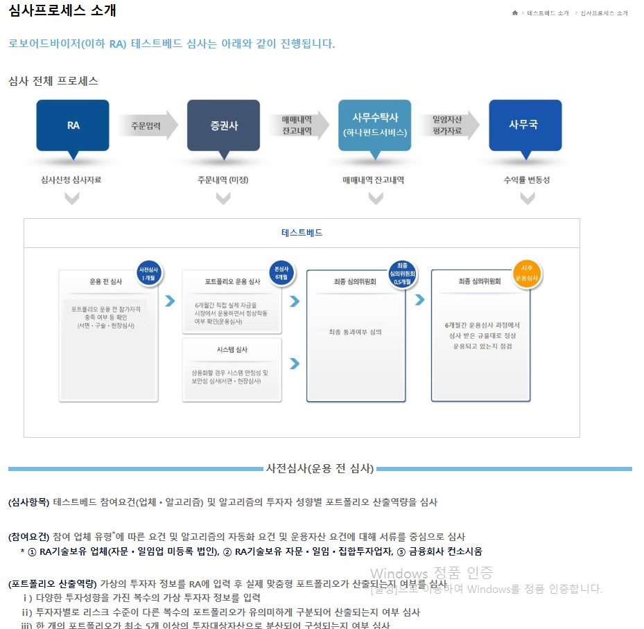
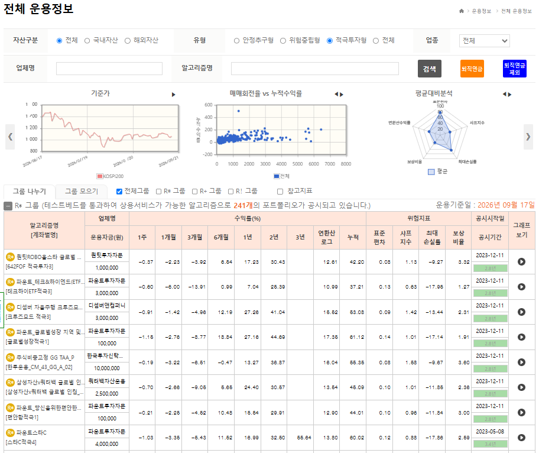
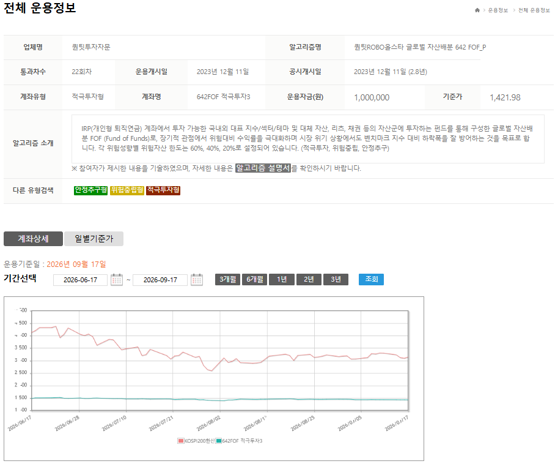
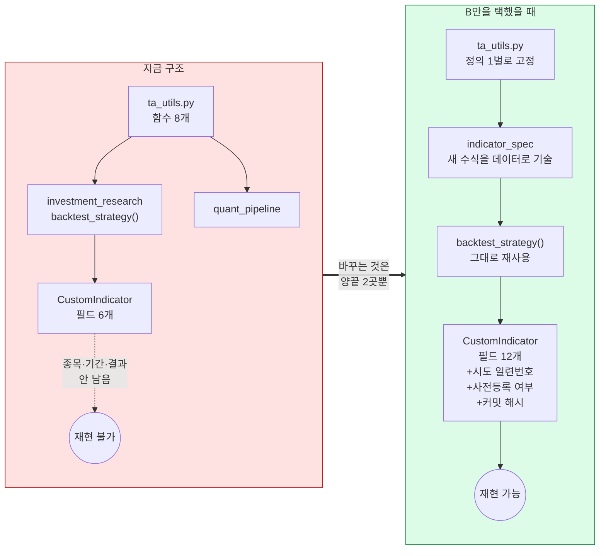

# #29 [의견 공유] 2차, 3차 의견 공유합니다

> 🗂️ 옛 GitHub 논의를 옮긴 **기록 문서**입니다 — [색인](../README.md). 원문은 그대로 두고, 링크·커밋 해시만 새 자리 기준으로 바꿨습니다.

| 항목 | 내용 |
|---|---|
| 종류 | 논의 |
| 상태 | 논의 · 방향성·목표 |
| 원 작성 | `rkdalstjr` · 2026-09-17 16:57 KST |
| 댓글 | 1건 · 답글 2건 |
| 옛 주소 | `github.com/devlee328288/Qurious/discussions/29` (지금은 열리지 않음) |

## 본문

아직 시작 단계이니, 개인적인 의견 공유드립니다.

2차는 로보 어드바이저 개발, 3차는 투자 인디케이터 개발로 주제가 픽스되어있습니다.

---

먼저 3차 투자 인디케이터에 대해서 의견을 드립니다.
- A : 기존의 RSI, BB, MACD 등 이미 존재하는 지표를 조합하여 기존의 지표와 다른 관점의 결과를 내는 지표를 개발하고 성과를 보이기
- B : 수식을 개발하고 이에 맞게 새로운 관점의 결과를 내는 아예 새로운 지표를 개발하고 성과를 보이기

물론, 두 방향 모두 양의 부호 성과를 보일 필요는 없습니다. 1차에서 진행했던 모델 예측과는 달리, 단순히 인디케이터를 개발하면 되기 때문입니다.

RSI를 예시로 들어보면, N일간의 종가 상승폭과 하락폭, 지수이동평균선만을 가지고 '과매수' 상황과 '과매도' 상황을 판단합니다. 여기서 그치지 않고, RSI 상승, 하락 다이버전스와 같은 심화 해석도 가능합니다. 

저희가 지표를 만드는 3차 프로젝트를 진행할 때, 차트 데이터에서 주어지는 여러 값을 다양하게 수식으로 적용해보고, 위의 심화 해석 여지처럼 만든 지표를 심화 해석하는 방법을 고안해 보는 것도 좋을 것 같습니다. 

중요한 것은 1차처럼 개발한 지표로 특정 양의 수익을 내는 것이 목표라기 보다는, 차트의 현 상황을 어떤 관점으로 어떻게 분석해서 어떤 유의미한 관점을 도출하는가를 목표로 하면 좋겠습니다.

새로운 지표를 만들고 기존 지표와 결합하여 보았더니 RSI 과매수 상황에서 가격이 실제로 하락하는 시점을 포착한다든가, BB 상단 돌파 상황에서 가격이 실제로 밴드 안으로 돌아오는 시점을 포착한다든가 등의 기존 지표와 같이 썼을 때 강점을 보이는 상황을 제시하면 아주 좋을 것 같습니다.

저는 개인적으로 B 방향으로 각자가 새로운 아이디어를 내며 지표를 여러개 만들어보고 그 중 좋은 것을 선별하여 디벨롭하고 발표하면 재밌을 것 같습니다.

---

다음으로 2차 로보 어드바이저에 대한 의견입니다.

로보 어드바이저는 크게 3가지 핵심 기능으로 1. 포트폴리오 자동구성, 2. 자동매매, 3. 자동 리벨런싱을 갖춰야 합니다.

작게는 로봇 측면과 어드바이저 측면으로 나뉩니다.
- 로봇 측면 : 무엇을 언제 얼마나 사고 팔 것인가. 1차에서 제작한 AI 모델 최적화 및 선정 방식이나 백테스트, 성과 및 위험 지표 등을 그대로 사용 가능합니다. 
- 어드바이저 측면 : 투자하려는 사람의 정확한 상황분석입니다. 똑같이 1억을 운용하는 두 사람이 있다고 했을 때, 한 사람은 '내년에 집을 계약해야 해서 1년 후 모든 돈 인출'이라는 조건이 걸려있을 수 있고, 다른 한 사람은 '매달 이자와 월세 때문에 100만원 씩 인출'이라는 조건이 걸려있을 수 있습니다. (이용 대상의 여러 상황을 가정하고 그에 맞춰 구현하는 것은 난이도가 꽤 높아 향후 발전 계획으로 빼고, 나머지에 집중하는 편이 합리적이긴 합니다.)

발표에 근거를 다지거나, 면접에 유용하게 쓰기 위해서는 '단순히 주제에 맞게 임의로 개발해보았다'보다는 특정 공식 기준에 맞게 진행해보았다는 부분이 훨씬 신빙성있습니다. 1차에서는 그 예로 QFRS를 사용하였고, 2차에서는 코스콤 테스트베드(https://www.ratestbed.kr/) 를 참고하면 좋을 것 같습니다. 

만들면서 정해야 하는 기준은 해당 링크의 '심사프로세스'를 참고하며, 검증은 '운용정보'를 최대한 참고하고 싶습니다.






사진을 보면 실제로 심사에 통과한 로보어드바이저들 목록이 나타나며, 하나를 들어가보면 그 안에 여러 정보들을 확인할 수 있습니다. 

2차 프로젝트의 검증 단계는, 실제 테스트베드 소개 화면에서 보이는 것을 최대한 구현하여 저희가 만들 대시보드에 '전체 운용정보' 탭을 제시하고, 어떤 정보가 제공되지 않았는지와 그 이유를 제시하면 좋을 것 같습니다.

---

## 댓글 1건 · 답글 2건

---

<a id="discussioncomment-18498775"></a>

### 💬 1. 이동원(`devlee328288`) · 2026-09-18 19:36 KST

먼저 사과드립니다. 제가 논의 목록을 **8건으로 들고 다니다가 이 글을 빠뜨렸습니다.** 09-17에 올려주신 글인데 어제(09-18) 작업 때도 못 보고 오늘에야 읽었습니다. 목록을 9건으로 고쳤고, 앞으로는 매 작업 시작 때 논의 전체를 훑습니다.

내용은 제가 지금까지 쓴 논의 문서들과 **거의 전부 같은 방향**입니다. 다만 **순서 하나**와 **판정 기준 하나**만 다르게 보고 있어서 그 두 가지를 근거와 함께 적고, 마지막에 **여쭙는 것 3가지**를 남깁니다.

---

## 0. 한눈에 보기 — 주신 의견 5건에 대한 제 답

| # | 주신 의견 | 제 답 | 어디서 | 확실도 |
|---|---|---|---|:--:|
| 1 | 3차는 **B(새 수식)** 방향으로 | **동의합니다.** 다만 순서 하나 — D6 ① 지표 정의 통일이 **B에서도 먼저**입니다 | 2절 | 🟢 |
| 2 | 수익이 아니라 **관점 도출**이 목표 | **충돌하지 않습니다.** D4 ⑤ 검정은 "얼마 벌었나"가 아니라 "우연인가"를 봅니다. 다만 3차 주 지표를 바꾸자고 제안드립니다 | 3절 | 🟡 |
| 3 | 로보어드바이저 **3대 기능** | D5 [#18](../discussions/018.md) 안건과 거의 1:1로 붙습니다. **자동매매만 D7 [#13](../discussions/013.md) 소관**입니다 | 4절 | 🟢 |
| 4 | **코스콤 테스트베드** 기준 참고 | 심사프로세스·운용정보 원문을 읽었습니다. **"일일 적재"가 전제**입니다. 어디까지 따를지 여쭙습니다 | 5절 | 🟢 |
| 5 | 어드바이저 측면 **후순위** | **동의합니다.** 단 "3유형 구분" 한 줄은 남기자는 제안 | 6절 | 🟡 |

> 확실도 표기: 🟢 원문·코드로 직접 확인 / 🟡 제 판단·제안 / 🔴 미확인

---

## 1. 용어 풀이 (이 글에서 새로 나오는 것만)

| 용어 | 일반적인 뜻 | **이 글에서는** | 헷갈리기 쉬운 점 |
|---|---|---|---|
| **기준가** | 펀드 1좌의 가격. 보통 1,000원에서 시작해 수익률만큼 오르내림 | 코스콤이 계좌 성과를 공개하는 **단위**. 계좌에 돈을 더 넣어도 기준가는 안 변함 | "잔고"와 다릅니다. 입출금이 섞인 잔고로는 성과를 못 재기 때문에 기준가를 씁니다 |
| **매매회전율** | 한 해 동안 보유자산을 몇 번 갈아탔는지의 비율 | 코스콤 운용정보가 **공개하는 지표**. 우리 코드에는 계산은 있으나 **밖으로 내보내지 않습니다** | "거래 횟수"와 다릅니다. 금액 기준입니다 |
| **베타(β)** | 시장이 1% 움직일 때 내 자산이 몇 % 움직이는가 | 코스콤 운용정보의 지표. **우리 코드에는 한 줄도 없습니다** | 상관계수와 다릅니다. 베타는 방향+크기, 상관은 방향만 |
| **조건부 분포** | "어떤 조건일 때만" 모아 본 값들의 퍼짐 | 3절에서 제안하는 **3차 판정 방식**. "RSI 과매수일 때의 다음 5일 수익 분포" 같은 것 | 평균만 보는 게 아니라 퍼짐·꼬리까지 봅니다 |
| **다계좌 운용** | 같은 알고리즘을 여러 계좌에 동시에 적용 | 코스콤 본심사 항목. 9개 계좌를 동시에 굴려 **오류가 나는지** 봅니다 | 성과 심사가 아니라 **안정성** 심사입니다 |

---

## 2. 3차 — B(새 수식)에 동의합니다. 다만 순서가 하나 있습니다

### 2.1 B는 D6 [#20](../discussions/020.md) ⑧과 충돌하지 않습니다. 오히려 강화합니다 🟢

[D6 #20 ⑧](../discussions/020.md)에서 저는 민석님이 D1에 쓰신 *"목표가 둘을 잇는 것이 되면 안 된다"* 를 그대로 받아 **A안(3차를 독립 주제로)** 을 추천드렸습니다. 이번에 주신 B(새 수식)는 그 A안과 **같은 방향**입니다.

- A(기존 지표 조합)는 재료가 이미 2차와 겹칩니다 → 두 프로젝트가 자연히 엮입니다
- B(새 수식)는 3차만의 재료를 만듭니다 → **분리가 더 깨끗해집니다**

### 2.2 그런데 B에서도 "지표 정의 통일"이 먼저입니다 🟢

민석님이 드신 예 — *"새 지표를 만들고 기존 지표와 결합했더니 **RSI 과매수** 상황에서 실제로 하락하는 시점을 포착한다"* — 이 문장에 **기존 지표가 판정 기준으로 들어옵니다.** 그래서 B를 택해도 "RSI 과매수"가 무엇인지 먼저 못 박아야 합니다.

지금 저장소에 **RSI가 세 벌** 있습니다:

```
 RSI "14" 세 벌  ─ 같은 이름, 다른 값 (최대 26.8 차이)
 ─────────────────────────────────────────────────────────
 ① 앱 백엔드    ta_utils.rsi(method="sma")   ← 단순평균   ★ 지금 기본값
 ② 차트 화면    _calc_rsi                    ← Wilder (단순평균 시드)
 ③ PineScript   ta.rsi / ta.rma              ← Wilder (단순평균 시드)

 볼린저 표준편차도 두 갈래
 ─────────────────────────────────────────────────────────
 ① 우리 코드    close.rolling(n).std()       ← pandas 기본 ddof=1 (표본)
 ② TradingView  ta.stdev                     ← ddof=0 (모집단)

 → "RSI 30 아래가 과매도" 를 어느 벌로 재느냐에 따라
   같은 날이 과매도였다가 아니었다가 합니다.
```

근거: [`ta_utils.py:14`](https://github.com/EST-team-project/Qurious/blob/04f476a/app/services/ta_utils.py#L14) (`method: str = "sma"` 가 기본값) · [`ta_utils.py:43-47`](https://github.com/EST-team-project/Qurious/blob/04f476a/app/services/ta_utils.py#L43-L47) (`.std()` = ddof 1). D6 [#20](../discussions/020.md) 2.1~2.3절에 수치 비교를 올려두었습니다.

### 2.3 고치는 비용은 작습니다 — 호출부가 2곳뿐입니다 🟢

**코드 재사용 판정: `ta_utils.py`는 그대로 쓰고, 기본값과 볼린저 한 줄만 바꿉니다.**

| 파일 | 지금 | 바꾼 뒤 | 재사용 |
|---|---|---|:--:|
| [`ta_utils.py:14`](https://github.com/EST-team-project/Qurious/blob/04f476a/app/services/ta_utils.py#L14) | `method: str = "sma"` | `method: str = "ewm"` | ✅ 그대로 |
| [`ta_utils.py:45`](https://github.com/EST-team-project/Qurious/blob/04f476a/app/services/ta_utils.py#L45) | `close.rolling(period).std()` | `.std(ddof=0)` | ✅ 그대로 |
| [`investment_research.py:12`](https://github.com/EST-team-project/Qurious/blob/04f476a/app/services/investment_research.py#L12) | `from app.services import ta_utils as ta` | 변경 없음 | ✅ 그대로 |
| [`quant_pipeline.py:10`](https://github.com/EST-team-project/Qurious/blob/04f476a/app/services/quant_pipeline.py#L10) | 〃 | 변경 없음 | ✅ 그대로 |
| 차트 `_calc_rsi` · Pine 생성기 | Wilder | 변경 없음 | ✅ 그대로 |

`ta_utils`를 import 하는 파일이 **위 2곳뿐**이라 파급이 좁습니다. 대신 **기존 백테스트 숫자는 전부 다시 계산**해야 합니다(그래서 D6 ①이 "작업 0"이 아닌 이유).

### 2.4 B를 택했을 때 3차 코드가 어떤 구조가 되는가

지금은 지표가 `ta_utils`에 **함수로 흩어져** 있고, 저장되는 인디케이터는 필드 6개([`trading.py:72`](https://github.com/EST-team-project/Qurious/blob/04f476a/app/models/trading.py#L72))뿐이라 "누가 무엇을 몇 번째로 시도했는지"가 남지 않습니다. B(새 수식 여러 개를 만들어 좋은 것을 고름)는 **시도 횟수가 곧 결과의 신뢰도**라, 여기가 그대로면 발표에서 방어가 어렵습니다.



- **재사용**: `backtest_strategy()`([`investment_research.py:50`](https://github.com/EST-team-project/Qurious/blob/04f476a/app/services/investment_research.py#L50))는 **손대지 않습니다.** 포지션 배열만 받으면 되므로 수식이 무엇이든 그대로 돕니다.
- **새로 만드는 것**: 수식을 코드가 아니라 **데이터로 적는 자리**(`indicator_spec`). 새 지표를 하나 만들 때마다 파이썬 파일을 늘리지 않고 한 줄이 늘어납니다.
- **확장하는 것**: 저장 필드 6 → 12 (D6 [#20](../discussions/020.md) ④ B안).

---

## 3. "수익이 목표가 아니라 관점 도출" — 검정 규격과 충돌하지 않습니다 🟡

### 3.1 층이 다릅니다

[D4 #17 ⑤](../discussions/017.md)의 주 검정(block bootstrap · ΔSharpe)은 **"얼마나 벌었나"를 묻는 장치가 아니라 "이 결과가 우연일 확률이 얼마인가"를 묻는 장치**입니다. 민석님 말씀대로 양의 수익이 목표가 아니어도, *"이 지표가 이런 관점을 준다"* 는 주장 자체는 **우연이 아님을 보여야** 발표에서 버팁니다.

```
 목표(무엇을 보일 것인가)          판정(그게 우연이 아님을 어떻게 보일 것인가)
 ────────────────────────          ──────────────────────────────────────
 1차 : 수익을 냈다            →    ΔSharpe 가 0보다 크고 p < 0.05
 3차 : 관점을 준다            →    ???  ← 여기가 비어 있습니다
```

### 3.2 그래서 3차 주 지표를 바꾸자고 제안드립니다

3차에서 ΔSharpe를 주 지표로 쓰면 *"결국 수익 얘기 아니냐"* 가 됩니다. 대신 민석님이 드신 예를 그대로 지표로 옮기면 이렇게 됩니다.

| | 주 지표 | 무엇을 보이나 | 민석님 목표와 |
|---|---|---|:--:|
| 지금(D4 ⑤) | **ΔSharpe_net** | 비용 빼고 더 벌었나 | ✖ 수익 중심 |
| **제안** | **조건부 분포 차이** | "RSI 과매수 **전체**"와 "RSI 과매수 **∩ 새 지표 발동**"의 다음 N일 수익 분포가 **다른가** | ✅ 관점 중심 |

- 통계 검정은 **같은 block bootstrap을 그대로 재사용**합니다. 비교 대상만 `전략 vs 기준선` → `조건A vs 조건A∩B` 로 바뀝니다.
- 이러면 **양의 수익이 아니어도 통과할 수 있습니다.** "새 지표가 발동하면 하락 쪽으로 분포가 쏠린다"도 유의미한 관점입니다.
- D6 [#20](../discussions/020.md)에 이것을 **⑨번 안건**으로 추가하겠습니다(민석님 의견이 출처임을 적어서).

### 3.3 다만 먼저 알려드릴 것 — 1차 주 검정이 아직 안 돌았습니다 🔴

[#32](../issues/032.md) 숙제 ①입니다. 1차가 스스로 "주 지표"로 정한 것이 **비용 반영 ΔSharpe**였는데 그게 미수행이라, **1차 결론이 아직 닫히지 않은 상태**입니다. 3차 검정 방식을 정할 때 이 코드를 처음 쓰게 되므로, 3차 논의가 1차 마무리를 겸하게 됩니다.

---

## 4. 2차 3대 기능 ↔ D5 [#18](../discussions/018.md) 안건 대응표 🟢

| 민석님이 드신 3대 기능 | 어느 논의 | 안건 | 지금 코드 상태 |
|---|---|---|---|
| **1. 포트폴리오 자동구성** | D5 [#18](../discussions/018.md) | ① 투자 대상 · ② 계산 도구 · ④ 벤치마크 | 자산군 5개 중 **주식만 시세가 있고** 나머지는 고정표. 30개 조합 중 7개에서 현금이 음수 |
| **2. 자동매매** | **D7 [#13](../discussions/013.md)** | ② 체결처 · ④ 10분 자동매매 · ⑥ 비용 | 소관이 D5가 아니라 **D7**입니다. KIS 모의 연동이 선행 조건 |
| **3. 자동 리밸런싱** | D5 [#18](../discussions/018.md) | ③ 리밸런싱 규칙 | "5~60% 제한"이 실제로는 지켜지지 않음 |

**로봇 / 어드바이저 구분도 그대로 겹칩니다.**

| 민석님 구분 | 대응 | 1차 재사용 |
|---|---|:--:|
| **로봇 측면** (무엇을 언제 얼마나) | D5 ①②③ + D7 | ✅ `evaluation/` 그대로. `models/`를 import하는 곳 0건이라 갈아끼워집니다([#32](../issues/032.md)) |
| **어드바이저 측면** (투자자 상황) | D5 ⑥ 성향 검증 | 🟡 성향 3~5단계 분류만 있고 인출 제약은 없음 |

---

## 5. 코스콤 테스트베드 — 원문을 읽었습니다. **일일 적재가 전제**입니다 🟢

말씀하신 대로 [심사프로세스](https://www.ratestbed.kr:7443/portal/main/contents.do?menuNo=200080)와 [운용정보](https://www.ratestbed.kr:7443/portal/pblntf/viewAlgrthInfo.do?menuNo=200233)를 직접 읽었습니다(조회일 2026-09-18 KST). 원문 표현 그대로 옮깁니다.

### 5.1 심사프로세스 원문

| 단계 | 기간 | 원문 |
|---|---|---|
| 사전심사 | 0.5개월 | "참여요건 및 알고리즘의 **투자자 성향별 포트폴리오 산출역량**을 심사" |
| **본심사** | **6개월** | "일정기간(6개월) 동안 **실제 자금을 운용**" · 심사항목 = 알고리즘 안정성 · **리밸런싱 유효성** · **다계좌 오류 여부** |
| 최종심의위원회 | 0.5개월 | 최종 통과여부 심의 |

- 계좌: **"3가지 유형별 포트폴리오를 각각 3개 계좌에서 동시에 운용 (총 9개 계좌)"** — 안정추구 · 위험중립 · 적극투자
- 자금: "원칙적으로 업체 고유자금", "계좌별로 **최소 가입금액 이상**"
- **제출: "일일 운용종료 후 거래내역과 최종 잔고내역을 제출"**
- 사후: 리밸런싱 주기 **1개월 미만 → 1개월 단위 제출** / 1개월 이상 → 매매처리 후 3영업일 이내 / 자기평가서 3·6·9·12월 첫째 주 / 연 1회 현장실사

> **이것이 저희 데이터 일정과 직결됩니다.** 본심사가 "실제 자금 6개월"이라 저희가 그대로는 못 합니다. 다만 **"매일 장 끝나고 거래내역·잔고를 남긴다"** 는 형식은 흉내낼 수 있고, 그러려면 **일일 시세 적재가 먼저** 돌아야 합니다. 그래서 수집기를 **09-22 가동** 목표로 잡았습니다.

### 5.2 운용정보가 공개하는 항목 — 그리고 우리 코드에 없는 것 🟢

민석님이 "검증은 운용정보를 최대한 참고하고 싶다"고 하셨으니, **공개 항목을 전부 뽑아 우리 코드와 맞춰** 봤습니다.

| 코스콤 공개 항목 | 우리 코드 | 근거 |
|---|---|---|
| 기준가(전일대비) | ❌ 없음 — `nav` 필드는 **펀드 기준가 크롤링용** | [`reference.py:83`](https://github.com/EST-team-project/Qurious/blob/04f476a/app/models/reference.py#L83) |
| **매매회전율(%)** | 🟡 계산은 하는데 **밖으로 안 내보냄** (비용 차감 중간값으로만 씀) | [`investment_research.py:59`](https://github.com/EST-team-project/Qurious/blob/04f476a/app/services/investment_research.py#L59) |
| 수익률 1주·1개월·3개월·6개월·누적 | 🟡 누적만 | [`investment_research.py:71`](https://github.com/EST-team-project/Qurious/blob/04f476a/app/services/investment_research.py#L71) |
| 표준편차 | ✅ 샤프 계산 안에 있음 | [`ta_utils.py:56`](https://github.com/EST-team-project/Qurious/blob/04f476a/app/services/ta_utils.py#L56) |
| **베타** | ❌ **저장소 전체에 한 줄도 없습니다** | 전수 검색 0건 |
| 샤프지수 | ⚠️ 있으나 **두 벌** — 무위험수익률 **0** vs **2%** | [`ta_utils.py:56`](https://github.com/EST-team-project/Qurious/blob/04f476a/app/services/ta_utils.py#L56) vs [`lean_backtest.py:402`](https://github.com/EST-team-project/Qurious/blob/04f476a/app/services/lean_backtest.py#L402) |
| 자산별 투자비중 (주식/펀드/주식ETF/채권ETF/기타ETF/ETN/예금/기타) | 🟡 자산군 5개 고정표 | D5 [#18](../discussions/018.md) 2.1 |
| **MDD** | ✅ 있음 | **코스콤은 공개하지 않습니다** |

**뒤집힌 항목 두 개가 나왔습니다.**

1. **베타가 없습니다.** 베타를 내려면 **시장지수가 필요**합니다 → [D5 #18 ④ 벤치마크](../discussions/018.md) 안건이 "있으면 좋은 것"에서 **"운용정보를 채우려면 반드시 필요한 것"** 으로 올라갑니다.
2. **코스콤은 MDD를 공개하지 않습니다.** 민석님이 제안하신 *"어떤 정보가 제공되지 않았는지와 그 이유를 제시"* 가, 오히려 **"우리가 코스콤보다 더 내는 항목(MDD)"** 쪽으로도 쓸 수 있습니다.

### 5.3 운용정보 탭을 채우려면 코드가 어떻게 바뀌는가

**재사용 판정: 성과 계산 함수는 전부 재사용하고, 위에 얇은 집계 층 하나만 얹습니다.**

```
 지금                                    운용정보 탭을 채운 뒤
 ────────────────────────                ──────────────────────────────
 backtest_strategy()                     backtest_strategy()          ← 그대로
   └ 반환: 누적수익·샤프·MDD·거래수         └ 반환에 turnover_pct 추가   ← 1줄
                                        
 ta_utils.sharpe_ratio(rf=0 고정)        ta_utils.sharpe_ratio(rf=인자)  ← 인자 추가
 lean_backtest (rf=2% 하드코딩)          └ 같은 함수 호출로 통일        ← 중복 제거
                                        
 (없음)                                  ta_utils.beta(returns, bench)  ← 신규 10줄
 (없음)                                  account_nav()                  ← 신규
                                           입출금 제외한 기준가 시계열
 (없음)                                  returns_1w / 1m / 3m / 6m      ← 신규 슬라이스
```

- **신규 코드는 `beta()` 와 `account_nav()` 두 개뿐**입니다. 나머지는 인자 추가와 슬라이스입니다.
- `account_nav()`가 필요한 이유: 모의투자로 중간에 입금하면 **잔고로는 성과를 못 잽니다.** 코스콤이 기준가를 쓰는 이유가 이것입니다.
- 샤프 두 벌 문제는 이 작업에서 **자연히 하나로 합쳐집니다**([A6 #14](../issues/014.md)가 지적한 엔진 5개 문제의 일부).

---

## 6. 어드바이저 측면 후순위 — 동의합니다. 단 한 줄만 남기면 어떨까요 🟡

*"이용 대상의 여러 상황을 가정하고 구현하는 것은 난이도가 꽤 높아 향후 발전 계획으로 빼고"* 에 **동의합니다.** 6주에 인출 제약·목표시점 최적화까지는 무리라고 봅니다.

다만 코스콤 **사전심사** 항목이 *"투자자 성향별 포트폴리오 산출역량"* 이라, **성향 3유형 구분 자체는 빼기 어렵습니다.** 제안은 이렇습니다.

| | 남길 것 | 뺄 것 |
|---|---|---|
| **어드바이저** | 안정추구·위험중립·적극투자 **3유형이 실제로 구분되는가**를 수치로 (D5 ⑥) | 인출 시점·목표금액·세금 등 개인 상황 모델링 |

**근거**: D5 [#18](../discussions/018.md) 2.4절에서 지금 구조로는 성향 간 차이가 **0.59%p**밖에 안 벌어집니다. "3유형"이라고 이름만 붙고 결과가 같으면 사전심사 항목을 못 채웁니다. 그래서 **뺄 것을 빼되 이 한 줄은 검증하자**는 제안입니다.

---

## 7. 데이터 — HF Organization을 쓰면 일일 적재가 팀 공유까지 이어집니다 🟡

1차에서 쓰던 **Hugging Face Organization**을 2차 저장소로 그대로 쓰는 방향으로 설계 중입니다. 다만 [#25](../issues/025.md)에서 확인한 약관 제약이 하나 걸립니다.

| 층 | 무엇 | HF Org 공유 | 이유 |
|---|---|:--:|---|
| 원자료 | 포털 일별시세 원본 | ❌ | 공공데이터포털 상세페이지가 **"제3자 무단 제공 및 재배포 엄격히 금지"** |
| 파생 | 지표·수익률·판정표 | 🟡 확인 중 | 공공누리 4유형에 **변경금지**가 걸려 있어 2차 저작물 판단이 필요 |
| 산출물 | 코드 · 모델 · 결과표 · **데이터 해시** | ✅ | 우리가 만든 것 |

→ **원자료는 각자 키로 각자 로컬에, 공유는 "같은 코드 + 같은 명세 + 같은 해시"로** 하는 구조를 보고 있습니다. 해시만 맞으면 데이터를 옮기지 않고도 넷의 데이터가 같음을 증명할 수 있습니다. 상세 설계는 [#33](../issues/033.md)에 이어 올리겠습니다.

---

## 8. 한계 — 이 답이 틀릴 수 있는 지점

- **5.2의 항목 목록은 화면에서 읽은 것**입니다. 차수·업체별로 표시 항목이 다를 수 있습니다. 🟡
- **MDD 미공개**는 제가 본 화면 기준입니다. 상세 화면 안쪽에 있을 수 있습니다. 🟡
- 3.2의 "조건부 분포 차이"는 **제안이고 아직 돌려본 적이 없습니다.** 표본이 적은 조건(예: 과매수 ∩ 새 지표)에서는 검정력이 떨어질 수 있습니다. 🔴
- 2.3의 "호출부 2곳"은 `ta_utils` import 기준입니다. 지표를 **자체 구현한 곳**(차트 `_calc_rsi`, Pine 생성기)은 별도입니다. 🟢

### 이 답을 뒤집을 조건

| 조건 | 그러면 |
|---|---|
| 코스콤 운용정보 상세에 MDD·비중 이력이 더 있다 | 5.2 표를 고치고 대시보드 범위를 넓힙니다 |
| 조건부 분포 검정이 표본 부족으로 p값이 안 나온다 | 3.2 제안을 철회하고 D4 ⑤ ΔSharpe를 3차에도 그대로 씁니다 |
| 팀이 "일일 적재까지는 과하다"고 보신다 | 수집 주기를 주 1회로 낮추고 09-22 목표를 미룹니다 |

---

## 9. 여쭙는 것 3가지

**Q1. 코스콤을 어디까지 따를까요?**

| | 범위 | 필요한 것 |
|---|---|---|
| **가** | **운용정보 화면 항목만 구현** (기준가·회전율·기간별 수익률·표준편차·베타·샤프·비중) | 베타용 벤치마크 확정(D5 ④) · 신규 코드 2개 |
| **나** | 가 + **일일 거래내역·잔고를 실제로 매일 기록** | 위 + 수집기 **09-22 가동** · 모의 체결(D7) |
| **다** | 나 + **3유형 × 3계좌 = 9계좌 동시 운용** | 위 + 다계좌 구조. 코스콤 "다계좌 오류 여부" 항목까지 흉내 |

저는 **"나"** 를 제안드립니다. "다"는 계좌 9개가 늘어날 뿐 새 배울 거리가 적고, "가"만으로는 *"매일 기록했다"* 는 말을 못 합니다. 다만 **"다"의 9계좌는 발표에서 눈에 띄는 그림**이라 민석님 판단을 여쭙고 싶습니다.

**Q2. 3차 주 지표를 "조건부 분포 차이"로 바꾸는 것에 동의하시나요?** (3.2) 동의하시면 D6 [#20](../discussions/020.md)에 ⑨번 안건으로 올리겠습니다.

**Q3. 베타를 위한 벤치마크를 무엇으로 할까요?** 코스콤은 유형별 지수(안정추구·위험중립·적극투자)를 따로 만듭니다. D5 ④에서 저는 **성향별 혼합 벤치마크 + KOSPI 병기**를 추천드렸는데, 이게 코스콤 방식과 같은 구조입니다. 이대로 가도 될까요?

---

민석님 의견 덕분에 **D5 ④(벤치마크)가 선택 사항에서 필수로 바뀌었고**, 3차 판정 기준이 비어 있다는 것도 드러났습니다. 늦게 답드려 다시 한번 죄송합니다.

준영님도 편하실 때 2·3차 방향에 대해 한 줄이라도 남겨주시면 좋겠습니다. 장환님은 D0에 의견 주셔서 감사합니다 — D1 [#7](../discussions/007.md)(목표)과 이 글이 이어지는 내용이라 같이 보시면 좋을 것 같습니다.

<a id="discussioncomment-18534344"></a>

#### ↳ 답글 1-1 · `rkdalstjr` · 2026-09-21 14:26 KST

> Q1 다는 구현이 힘들 것 같고 나 안으로 하는게 좋을 것 같습니다.
> Q2 동의합니다. 추가로 새 지표와 다른 여러 지표들을 조합해서 조합 사용 시 좋은 피쳐 순위를 내든가 하는 방식으로 확장 가능할 것 같습니다.
> Q3 코스콤 방식과 같은 성향별 혼합 벤치마크 + KOSPI 병기 방식을 사용한다면 의미있는 베타 산출이 가능할 것 같습니다.

<a id="discussioncomment-18535282"></a>

#### ↳ 답글 1-2 · 이동원(`devlee328288`) · 2026-09-21 16:09 KST

> 민석님, 세 질문 모두 답해 주셔서 감사합니다. 그대로 정리합니다.
>
> | 질문 | 민석님 답 | 반영 |
> |---|---|---|
> | **Q1** 코스콤을 어디까지 | **나** 안 (다는 구현 부담) | ✅ 그대로 갑니다 |
> | **Q2** 3차 주 지표를 "조건부 분포 차이"로 | 동의 + **지표 조합 순위**까지 확장 제안 | ✅ D6 [#20](../discussions/020.md) **⑨번 안건**으로 이미 올라가 있습니다 |
> | **Q3** 베타 벤치마크 | **성향별 혼합 + KOSPI 병기** (코스콤 구조) | ✅ D5 ④ 추천안 그대로 확정 |
>
> **Q2 확장 제안에 대해** — *"새 지표 1개와 다른 여러 지표들의 조합을 돌려 같이 썼을 때 좋았던 순위를
> 매긴다"* 는 방향, 좋습니다. 한 가지만 미리 적어 둡니다 🟡: 조합 수가 늘면 **우연히 좋아 보이는 조합**이
> 반드시 나옵니다(다중비교). 지표 10개에서 2개씩 골라도 45조합이고, 그 중 가장 좋은 것은 실력이 없어도
> 좋아 보입니다.
>
> 그래서 **순위표는 내되, 상위 조합을 "좋다"고 부르기 전에 한 단계를 둡니다** — 봉인 구간(D7 ⑦ E2)에서
> 그 조합이 **같은 순위를 유지하는지** 봅니다. 구체 방법은 D6 [#20](../discussions/020.md)
> ⑨번 안건 쪽에 적겠습니다. **순위를 매기는 것 자체는 그대로 하겠습니다.**
>
> **용어 — 다중비교(multiple comparisons)**
> - 뜻: 여러 후보를 한꺼번에 시험하면, 전부 무의미해도 그중 하나는 좋아 보입니다.
> - 이 문서에서: 지표 조합을 많이 돌릴수록 "1등 조합"의 성적을 그대로 믿기 어려워집니다.
> - 헷갈리는 점: **조합을 많이 시험하는 게 잘못이 아닙니다.** 결과를 읽는 방법만 달라집니다.
