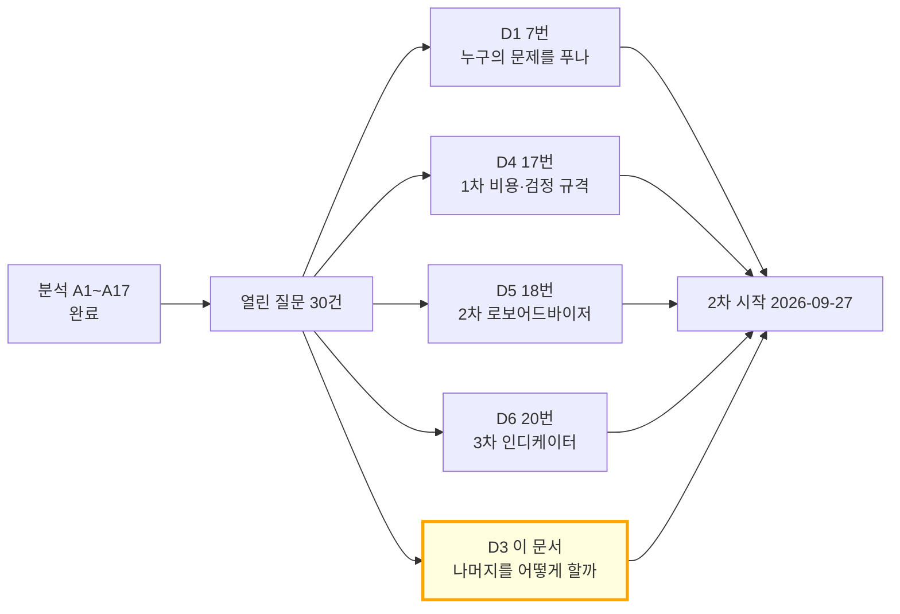
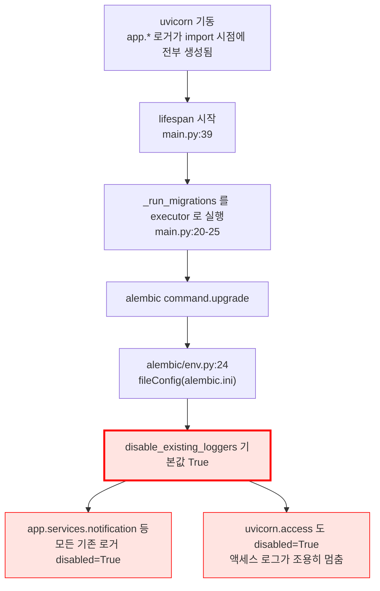
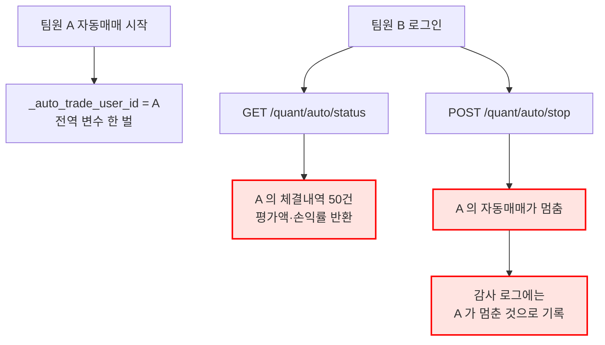
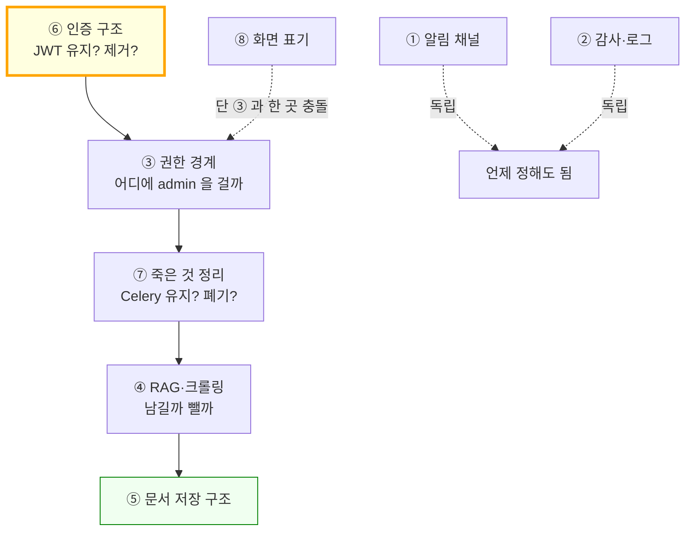
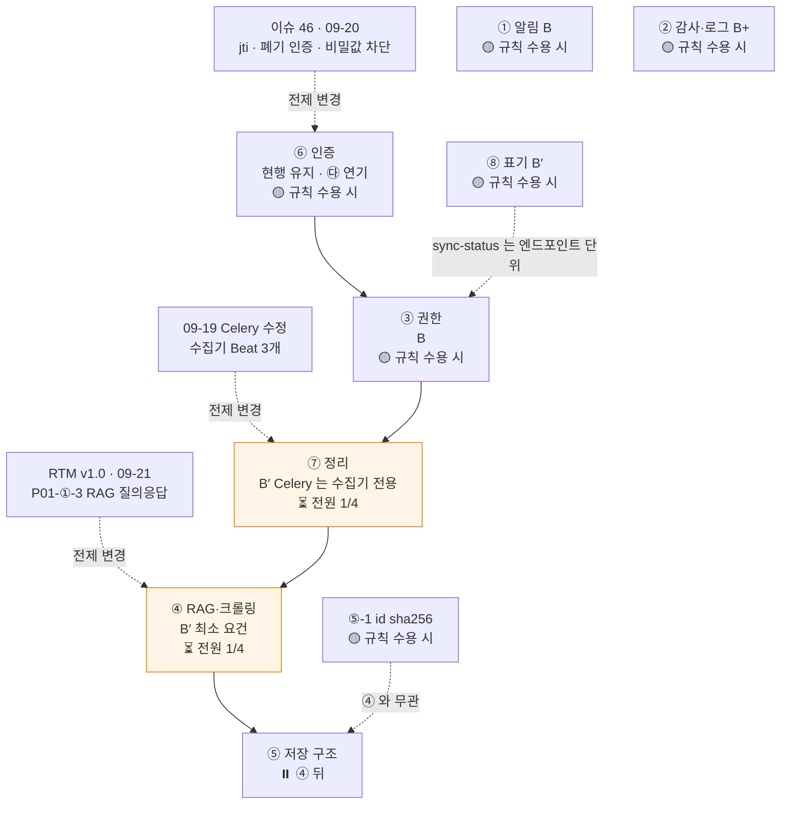
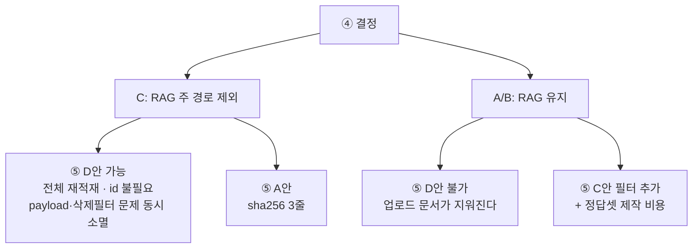

# #30 [논의] D3 lumina-invest 기능 범위 — 화면이 한 번도 부르지 않는 API가 31개입니다

> 🗂️ 옛 GitHub 논의를 옮긴 **기록 문서**입니다 — [색인](../README.md). 원문은 그대로 두고, 링크·커밋 해시만 새 자리 기준으로 바꿨습니다.

| 항목 | 내용 |
|---|---|
| 종류 | 논의 |
| 상태 | 논의 · 설계(1·2·3차) |
| 원 작성 | 이동원(`devlee328288`) · 2026-09-17 17:35 KST |
| 댓글 | 3건 |
| 옛 주소 | `github.com/devlee328288/Qurious/discussions/30` (지금은 열리지 않음) |

## 본문

> 🟡 **결론 초안 게시 (2026-09-23)** — 이 논의에는 팀원 답이 아직 없고, 본문에 **확정 방식도 없었습니다.** 그래서 규칙을 **제안**합니다 — 되돌리기 쉬운 6개는 "72시간 반대 없음", 코드를 지우는 ④·⑦ 은 4명 전원 명시 찬성. 이 규칙은 **팀원 한 분 이상이 받아들이셔야** 적용하고, 그 전까지 전부 🟡 조건부입니다. 본문을 쓴 뒤 코드가 먼저 바뀐 ④⑥⑦⑧ 은 추천을 바꿨습니다. → **본문 아래 §10 결론**

> **한 줄 요약** — 2차 프로젝트를 시작하기 전에 **"무엇을 손대지 않을지"** 를 먼저 정합니다. 안건 8개에 A/B/C 로 답해 주세요. 기한 **2026-09-27**.
> 기준 커밋 [`04f476a`](https://github.com/EST-team-project/Qurious/tree/04f476a) · 앞선 분석 [A1~A17](../issues/001.md) 전부 완료 후 작성

## 0. 쉬운 요약 (3줄)

1. 지금 앱에는 화면 49개와 API 85개가 있는데, **화면이 한 번도 부르지 않는 API 가 31개**입니다. "기능이 있다"와 "쓰이고 있다"가 다릅니다.
2. 2차(로보어드바이저)·3차(커스텀 인디케이터)를 만들 시간은 정해져 있습니다. **버릴 것을 먼저 버려야 남은 시간이 얼마인지 계산됩니다.** 이 문서는 그 선을 8개 안건으로 나눠 묻습니다.
3. 안건끼리 **결정 순서**가 있습니다. ⑥→③→⑦→④→⑤ 순서를 지키지 않으면 한쪽 결정이 다른 쪽을 헛일로 만듭니다(4.2절).

---

### 0.1 한눈에 보기 — 안건 8개

| # | 안건 | 지금 상태 | 추천(미확정) | 안 고치면 | 작업량 |
|:--:|---|---|---|---|---|
| ① | 알림 채널 | 5종(텔레그램·슬랙·이메일·카카오·SMS) 중 카카오·SMS 는 **구조상 발송 불가** | **B** 텔레그램만 남기고 4종 동결 | 시연 때 안 나가는 채널을 붙들고 시간을 씀 | 삭제 위주 · 반나절 |
| ② | 감사·로그 범위 | 감사 17종에 **인증 이벤트 0건** · 관리자 초기화가 감사 이력을 지움 · **앱 로그 전체가 꺼져 있음** | **B+** 인증 이벤트 추가 · 초기화 대상 제외 · 로깅 1줄 복구 | D7 ⑤(매 거래일 1행 축적)의 근거가 남지 않음 | 약 40줄 |
| ③ | 권한 경계 | `/api/system/*` 이 로그인만 하면 열림 · **`/api/tasks/*` 는 아예 무인증** · **자동매매는 전역 1개라 남의 것을 보고 멈출 수 있음** | **B** 관리자 전용 + 자동매매 소유자 검사 | 팀원끼리 시연하다 서로의 체결내역이 보임 | 약 60줄 |
| ④ | RAG·크롤링 범위 | 네이버 크롤러 robots 미확인 · 임의 URL 크롤링 SSRF · 가드레일이 **양방향으로 틀림** · 죽은 함수 3개 | **C** 주 경로에서 RAG 제외 · 죽은 코드 삭제 · 임의 URL 크롤링 폐기 | 2·3차와 무관한 기능의 보안 부채를 계속 짊어짐 | 삭제 100줄 |
| ⑤ | 문서 저장 구조 | 업로드·크롤 문서가 한 컬렉션 공유 · 업로더 필터 없음 · `point_id` 가 실행마다 달라짐 | **A** ④에서 RAG 를 빼면 **대부분 자동 해소** · `point_id` 만 즉시 수정 | 남기면 3건을 다 고쳐야 함(90~140줄) | ④ 결정에 종속 |
| ⑥ | 인증 구조 | ~~폐기 목록 키가 **서비스 전체 상수 1개** · **`JWT_SECRET` 이 공개 저장소의 기본값**~~ 🔴 (09-23 정정) 두 결함 모두 [#46](../issues/046.md)(09-20)으로 고쳐짐 — · JWT 전용 화면 0곳 | **㉰** JWT 경로 제거 (차선 ㉮ 1줄 수정) | 공개 배포 시 누구나 admin 토큰을 위조 | ㉮ 2줄 / ㉰ 약 300줄 |
| ⑦ | 죽은 것 정리 | 미호출 API **31개** · ~~**Celery 태스크 6개 전부 실행 불가**~~ 🔴 (09-23 정정) 7개였고 09-19 에 고쳐 지금은 10개 등록 · Beat 5개 · 인덱스 드리프트 3건 · 문서 3종 부정확 | **B** Celery 폐기 + 미호출 라우터 숨김 + 인덱스 모델 반영 | `docker compose` 컨테이너 2개를 계속 띄움(D2 0원 원칙과 충돌) | 코드 130줄 + 문서 200줄 |
| ⑧ | 오해를 부르는 화면 | **목업 표기는 이미 9곳에 있음** — 빠진 건 3곳 · 게다가 **라벨이 거꾸로 달린 화면**과 **거짓 `● LIVE` 배지**가 있음 | **B** 거짓 배지 제거 + 라벨 교정 + `company-compare` 는 실 API 로 교체 | 발표 때 하드코딩 73,400원을 오늘 시세로 읽음 | 약 120~180줄 |

#### 0.1.1 어느 차수에 걸리나 — 2차와 3차로 나눠 보기

같은 안건이라도 **2차(로보어드바이저)에서 만들고 3차(커스텀 인디케이터)가 그대로 쓰는 것**과, **차수마다 따로 손대야 하는 것**이 다릅니다. 나눠서 보면 언제 무엇을 정해야 하는지가 분명해집니다.

| # | 안건 | 2차에서 걸리는 부분 | 3차에서 걸리는 부분 | 성격 |
|:--:|---|---|---|---|
| ① | 알림 채널 | 리밸런싱 알림을 쓸지 | 체결 알림([D7 13번](../discussions/013.md) ⑤) | **2차에서 한 번 정하면 3차가 그대로 씀** |
| ② | 감사·로그 | 리밸런싱 기록의 근거 | 전략 실행·체결 기록의 근거 | **2차에서 만들고 3차로 확장** |
| ③ | 권한 경계 | 시스템 API·태스크 API | 자동매매 소유자 검사 | **2차에서 기반, 3차에서 자동매매분 추가** |
| ④ | RAG·크롤링 | **네이버 크롤러 존폐가 [D5 18번](../discussions/018.md) ①(국내 ETF 경로)과 같은 갈림길** | 해당 없음 | **2차에서 결정** |
| ⑤ | 문서 저장 구조 | 해당 없음 (④ 종속) | 해당 없음 | 과제 밖 — ④ 가 정해지면 따라옴 |
| ⑥ | 인증 구조 | 해당 없음 | 해당 없음 | **공통 기반 · 가장 먼저** (4.2절) |
| ⑦ | 죽은 것 정리 | **`quant_pipeline.py` 약 240줄 존폐가 [D5 18번](../discussions/018.md) 에 달림** · Celery 큐가 필요한지 | 3차가 백그라운드 큐를 쓸지 | **2차에서 결정, 3차가 확인** |
| ⑧ | 화면 표기 | `company-compare` · `company-sector` · 스크리닝 신뢰도 라벨 | **전략 분석의 거꾸로 된 `Mockup` 라벨** · 백테스트 도움말 | **차수마다 따로** |

**읽는 법** — ①②③⑥ 은 *한 번 정해서 두 차수가 공유*합니다. ④⑦ 은 *2차 설계(D5)가 정해져야* 답이 나옵니다. ⑧ 만 *차수별로 따로* 손대야 합니다.


---

### 0.2 이번 조사에서 **앞선 분석이 틀렸던 것** 🟢

먼저 밝힙니다. 이 문서를 쓰면서 A12 [#27](../issues/027.md) · A13 [#28](../issues/028.md) 의 주장 71건을 코드에서 다시 확인했고, **15건이 달랐습니다.** 그중 결론을 바꾸는 3건입니다.

| 앞서 적은 것 | 실제 | 어디에 영향 |
|---|---|---|
| "로깅 설정이 0건이라 봇 토큰이 stderr 로 샌다" | **틀렸습니다.** 로깅 설정이 없는 게 아니라 **alembic 이 앱 로거를 전부 꺼버립니다**(2.3절 실측). 그래서 토큰이 든 경고문은 **애초에 출력되지 않습니다** | ① 의 유출 근거가 약해지고, 대신 ② 에 **더 큰 문제**가 생김 |
| "화면에 '예시 데이터' 표시가 없다" | **틀렸습니다.** `app.html` 989·998·1216·1276·4509·4925·4928·5255·5260 에 이미 있습니다. 빠진 건 **3곳뿐**이고, 오히려 **라벨이 거꾸로 달린 곳**이 있습니다 | ⑧ 의 성격이 "배지를 달자"에서 "이미 있는 규칙을 왜 어겼나"로 바뀜 |
| "JWT 를 없애면 파급이 크다" | **JWT 만 요구하는 엔드포인트가 0개**입니다. 화면은 JWT 를 한 번도 쓰지 않습니다(`app.html` 직접 `fetch(` 0건) | ⑥ 에서 가장 과감한 선택지 ㉰ 의 위험이 예상보다 훨씬 낮음 |

강사님 피드백 ④(결론에 집착하지 말 것)에 따라, **제가 틀렸던 것을 지우지 않고 그대로 둡니다.** 전체 15건은 5.3절에 있습니다.

---

### 0.3 용어 풀이

| 용어 | 뜻 | 이 문서에서 | 헷갈리는 점 |
|---|---|---|---|
| **유지 / 개선 / 폐기** | 그대로 둔다 / 고쳐서 쓴다 / 코드를 지우거나 화면에서 숨긴다 | 안건마다 이 셋 중 하나를 고릅니다 | "폐기"가 꼭 `git rm` 은 아닙니다. **화면에서 숨기고 라우터만 남기는 것**도 폐기로 셉니다 |
| **동결(freeze)** | 손대지 않기로 합의한 상태 | D1 [#7](../discussions/007.md) 이 화면 49개를 주 경로 12 · 최소 요건 2 · 개념 10 · **동결 25** 로 나누자고 제안 중 | 동결은 "지금 그대로 둔다"이고, 폐기는 "없앤다"입니다. **동결한 것도 켜져 있으면 보안 책임은 남습니다** — ③ 이 그 이야기입니다 |
| **죽은 코드(dead code)** | 어디서도 호출되지 않는 코드 | 전수 `grep` 으로 호출처 0건인 것만 그렇게 부릅니다 | "안 쓰는 것 같다"가 아니라 **호출처 개수를 세어** 판정했습니다 |
| **SSRF** | 서버가 대신 요청을 보내게 만들어, 바깥에서 못 가는 내부 주소를 조회하는 공격 | ④ 의 임의 URL 크롤링 | 앱이 뚫리는 게 아니라 **앱을 심부름꾼으로 쓰는** 것입니다 |
| **감사 로그 / 애플리케이션 로그** | 전자는 "누가 무엇을 했나"를 DB 에 남기는 것, 후자는 개발자용 진단 출력 | ② 는 **둘 다** 다룹니다 | 이름이 비슷해 섞이기 쉽습니다. 이 앱은 **감사는 있는데 인증 기록이 없고, 애플리케이션 로그는 통째로 꺼져 있습니다** |
| **`disable_existing_loggers`** | 파이썬 로깅 설정을 적용할 때, **이미 만들어져 있던 로거를 전부 끄는** 옵션. 기본값이 `True` | 2.3절의 원인 | 끄는 게 기본값이라는 사실이 잘 알려져 있지 않습니다 |
| **payload (Qdrant)** | 벡터와 함께 저장하는 부가 정보(원문·출처 등) | ⑤ 에서 두 경로가 **서로 다른 모양**으로 저장 | 같은 컬렉션에 들어가도 모양이 다르면 **한쪽이 다른 쪽을 못 읽습니다** |
| **Celery / Celery Beat** | 작업을 백그라운드로 돌리는 도구 / 그 작업을 정해진 시각에 넣어 주는 시계 | ⑦ | 둘은 **별도 컨테이너**입니다. Beat 만 고쳐도 워커가 태스크를 모르면 소용없습니다 |

---

## 1. 배경 — 왜 지금 이 선을 긋나

분석 A1~A17 이 끝났습니다. 그 과정에서 **"2·3차에서 정해야 한다"고 미뤄 둔 항목이 30건** 쌓였고([인덱스 #1](../issues/001.md) 5절), 그대로 두면 2차 시작일에 그대로 숙제가 됩니다.



**D1·D4·D5·D6 은 "무엇을 만들까"를 정합니다. 이 문서는 "무엇을 만들지 않을까"를 정합니다.** 둘 다 있어야 일정이 계산됩니다.

D1 [#7](../discussions/007.md) 은 화면 49개를 **주 경로 12 · 최소 요건 2 · 개념 10 · 동결 25** 로 나누자고 제안 중입니다. D3 는 그 분류를 **코드 단위로 집행**하는 문서입니다. 특히 **"동결한 기능도 켜져 있으면 책임은 남는다"** 는 점이 안건 ③ 의 출발점입니다.

---

## 2. 사실 — 지금 무엇이 있나

### 2.1 규모 🟢

| 항목 | 수 | 비고 |
|---|---:|---|
| 화면 (SPA 섹션) | 49 | 전수표는 [A13 #28](../issues/028.md) 2절 |
| API 엔드포인트 | 85 | 라우터 파일 19개 |
| 서비스 모듈 | 22 | `app/services/` |
| `public/app.html` | 5,465줄 | 화면 49개가 **한 파일**에 |
| 테스트 | ~~**0개**~~ 🔴 (09-23 정정) 2파일 23건(09-21 · 실거래 차단·야후 봉인) — 앱 기능 회귀 시험은 여전히 0 | ~~`test_*.py` 0건 · `tests/` 없음~~ |

**테스트 0개**는 모든 안건의 선택지 평가에 들어갑니다 — 어떤 선택을 하든 회귀 검증이 전부 수동이므로, **작업량이 적은 안이 구조적으로 유리합니다.**

### 2.2 화면이 한 번도 부르지 않는 API 31개 🟢

`public/` 전체에서 호출되는 경로를 뽑아 라우터와 대조했습니다.

| 라우터 | 엔드포인트 | 화면 호출 | 비고 |
|---|---:|---:|---|
| [`conversations.py`](https://github.com/EST-team-project/Qurious/blob/04f476a/app/routes/conversations.py) | 8 | **0** | `Conversation` **모델은 살아 있습니다**(`chat.py:105`·`158`) — 라우터만 죽음 |
| [`documents.py`](https://github.com/EST-team-project/Qurious/blob/04f476a/app/routes/documents.py) | 4 | **0** | **업로드 UI 자체가 없습니다** |
| [`graph.py`](https://github.com/EST-team-project/Qurious/blob/04f476a/app/routes/graph.py) | 6 | **0** | 전부 무인증 (④) |
| [`tasks.py`](https://github.com/EST-team-project/Qurious/blob/04f476a/app/routes/tasks.py) | 2 | **0** | 전부 무인증 (③) |
| [`quant.py`](https://github.com/EST-team-project/Qurious/blob/04f476a/app/routes/quant.py) | 3 | **0** | 지우면 `quant_pipeline.py` 약 240줄이 연쇄로 죽음 |
| `/api/chat/async` · `/api/ingest/*/async` | 5 | **0** | Celery 경로 — ⑦ 에서 어차피 실행 불가 |
| `/api/ingest/translation-*` · `/local-docs` | 3 | **0** | 필요한 `data/` 디렉터리가 없음 |
| **합계** | **31** | | |

> **이 표가 ⑦ 의 규모를 바꿉니다.** 앞선 분석은 "죽은 API 3개"라고 적었는데, 실제로는 31개입니다.
>
> 그리고 **`documents.py` 가 0건이라는 사실이 ⑤ 의 심각도를 낮춥니다** — "A가 올린 문서가 B의 근거가 된다"는 **지금 UI 로는 도달 불가**이고, 기능을 켜는 순간 새는 상태입니다. "지금 새고 있다"가 아닙니다.

### 2.3 ★ 전 안건에 걸치는 사실 — 앱 로그가 시작 직후 통째로 꺼집니다 🟢 실측

이건 이번 조사에서 새로 확인한 것이고, ① 과 ② 의 전제를 동시에 뒤집습니다.



이 저장소의 `alembic.ini` 로 직접 재현한 결과입니다 🟢:

```text
before: app.disabled=False  uvicorn.access.disabled=False  root.handlers=[]
after : app.disabled=True   uvicorn.access.disabled=True
        root.handlers=[<StreamHandler <stderr> (NOTSET)>]  root.level=30
```

| 앞서 적은 것 | 실제 |
|---|---|
| 앱 런타임에 로깅 설정이 0건이다 | **있습니다.** alembic 이 root 에 `StreamHandler(stderr)` / WARNING 을 심습니다 |
| `lastResort` 로 stderr 에 나간다 | **안 나갑니다.** 기동 시점에 이미 만들어진 `app.*` 로거가 전부 꺼집니다 |
| 그래서 봇 토큰이 로그로 샌다 | **운영 프로세스에서는 출력되지 않습니다.** "코드상 유출 경로가 있다"까지가 정확한 표현입니다 |

**대신 더 큰 문제가 드러납니다.**

- **uvicorn 액세스 로그가 기동 직후 조용히 꺼집니다.** 누가 어떤 API 를 불렀는지 아무 데도 남지 않습니다 → ② 의 핵심 근거.
- 예외적으로 [`stocks.py:608`](https://github.com/EST-team-project/Qurious/blob/04f476a/app/routes/stocks.py#L608) 은 **함수 안에서** `logging.getLogger(__name__)` 을 부르므로 이 비활성화를 피해 갑니다. 즉 **증권사 잔고 조회 예외만 stderr 로 나옵니다** — 하필 가장 민감한 한 줄만 살아 있습니다.

고치는 방법은 `alembic/env.py:24` 를 `fileConfig(config.config_file_name, disable_existing_loggers=False)` 로 바꾸는 **1줄**입니다.

---

## 3. 선택지 — 안건 ①~⑧

각 안건은 **사실 → 선택지 → 추천(미확정) → 이 추천을 뒤집을 조건** 순서입니다. 추천은 전부 **미확정**이며, 여러분의 선택으로 정해집니다.

---

### 안건 ① 알림 채널을 어디까지 남길까

**사실** 🟢

| 무엇 | 근거 |
|---|---|
| 채널 5종 = 텔레그램 · 슬랙 · 이메일 · 카카오 · SMS | [`notification.py:267-276`](https://github.com/EST-team-project/Qurious/blob/04f476a/app/services/notification.py#L267-L276) |
| **채널을 전부 끄면 팀 공용 `.env` 채널로 나감** — `user_cfg.get("channels") or _default_channels()` 에서 빈 리스트가 falsy | [`notification.py:294-295`](https://github.com/EST-team-project/Qurious/blob/04f476a/app/services/notification.py#L294-L295) |
| 화면 체크박스를 전부 해제하면 실제로 `channels: []` 가 저장됨 | [`app.html:4644`](https://github.com/EST-team-project/Qurious/blob/04f476a/public/app.html#L4644) |
| **카카오는 템플릿 필드가 아예 없음** — 알림톡은 사전 승인 템플릿이 필수 | [`notification.py:163-168`](https://github.com/EST-team-project/Qurious/blob/04f476a/app/services/notification.py#L163-L168) |
| 카카오·SMS 가 **같은 인증 헤더**를 쓰는데 `date` 가 ISO8601 이 아님 → 서명이 거부되면 **두 채널이 동시에 죽음** | [`notification.py:134-137`](https://github.com/EST-team-project/Qurious/blob/04f476a/app/services/notification.py#L134-L137) |
| SMS 길이 검사가 **문자 수** 기준(`len(message) > 80`), 자르는 것도 문자 슬라이싱 | [`notification.py:194-195`](https://github.com/EST-team-project/Qurious/blob/04f476a/app/services/notification.py#L194-L195) · `208` |
| Slack 웹훅 URL 만 **마스킹에서 빠짐** (바로 윗줄 텔레그램 토큰은 `mask()` 통과) | [`routes/notification.py:85-87`](https://github.com/EST-team-project/Qurious/blob/04f476a/app/routes/notification.py#L85-L87) |
| 발송 레이트리밋 0건 | [`notification.py:347-350`](https://github.com/EST-team-project/Qurious/blob/04f476a/app/services/notification.py#L347-L350) |
| `paper_trading.py` 702줄에 알림 호출 **0건** | [`paper_trading.py`](https://github.com/EST-team-project/Qurious/blob/04f476a/app/services/paper_trading.py) |

**선택지**

| 안 | 내용 | 장점 | 단점 |
|:--:|---|---|---|
| **A** | 5채널 유지 + 결함만 수정 | 기능표가 화려함 | 카카오·SMS 는 **사업자 등록 · 발신번호 사전등록 · 템플릿 검수**가 필요해 팀이 못 채움 |
| **B** | **텔레그램만 남기고 4종 동결** | 시연 가능한 것만 남음 · 전역 폴백 문제도 같이 사라짐 | 이메일을 쓰고 싶으면 다시 켜야 함 |
| **C** | 외부 채널 전부 빼고 화면 내 알림만 | 외부 의존 0 · 가장 안전 | D7 ⑤(매 거래일 기록)의 "알림으로 확인" 경로가 사라짐 |

**추천(미확정): B** — 카카오·SMS 는 코드 결함이 아니라 **제도 요건**이 막고 있어 팀이 해결할 수 없습니다. 어느 안을 고르든 **전역 폴백 제거**(`or` 를 명시적 `is None` 검사로)와 **Slack 마스킹 한 줄**은 같이 갑니다.

**이 추천을 뒤집을 조건**
- 팀원 중 사업자 등록 + 발신번호 등록을 이미 가진 분이 있다면 → A 재검토
- D7 이 "모의투자 체결 알림"을 필수로 정하면 → C 탈락

---

### 안건 ② 감사·로그를 어디까지 남길까

**사실** 🟢

| 무엇 | 근거 |
|---|---|
| **앱 로그 전체가 기동 직후 꺼짐** (2.3절) · uvicorn 액세스 로그 포함 | `alembic/env.py:24` + `main.py:39` |
| 감사 이벤트 17종에 **인증(로그인·로그아웃·실패) 0건** | [`audit.py`](https://github.com/EST-team-project/Qurious/blob/04f476a/app/services/audit.py) |
| 기록에 **IP · User-Agent · 성공여부 컬럼 없음** | `AuditEvent` 모델 |
| 감사 기록 실패를 `except: pass` 로 삼킴 | `audit.py` |
| **관리자 초기화가 감사 이력을 지움** — `USER_MODELS` 에 `AuditEvent` 포함 | [`admin.py`](https://github.com/EST-team-project/Qurious/blob/04f476a/app/routes/admin.py) |
| 감사 조회 필터가 UUID 파싱 실패 시 `WHERE user_id IS NULL` 로 컴파일돼 **조용히 전부 거름** | [`audit.py:8-16`](https://github.com/EST-team-project/Qurious/blob/04f476a/app/services/audit.py#L8-L16) |
| **수동 주문은 감사를 남기는데 자동매매는 안 남김** — `auto_trade.py` 의 audit 호출은 start·stop 2줄뿐이고, **실거래 주문 전송 `_place_live_order` 에는 0건** | [`auto_trade.py:139-176`](https://github.com/EST-team-project/Qurious/blob/04f476a/app/services/auto_trade.py#L139-L176) vs [`stocks.py:638`](https://github.com/EST-team-project/Qurious/blob/04f476a/app/routes/stocks.py#L638) |
| 인증 엔드포인트에 레이트리밋·잠금 **전무** (register · login · token) | [`auth.py:105`](https://github.com/EST-team-project/Qurious/blob/04f476a/app/routes/auth.py#L105) · `144` · `187` |

> **핵심은 "17종이냐"가 아니라 비대칭입니다** — 사람이 누른 주문은 남고, **자동으로 나간 실거래 주문은 안 남습니다.** D7 이 "매 거래일 1행을 축적한다"고 정하면 그 원장의 신뢰가 여기에 달립니다.

**선택지**

| 안 | 내용 | 품 |
|:--:|---|---|
| **A** | 현행 유지 | 0 |
| **B** | **인증 이벤트 추가 + 초기화 대상에서 `AuditEvent` 제외 + `disable_existing_loggers=False` 1줄** | 약 40줄 |
| **C** | B + IP/UA/결과 컬럼 추가 + 자동매매 체결·실거래 주문 감사 + 로그인 시도 제한 | 약 120줄 + 마이그레이션 1건 |

**추천(미확정): B 를 최소선으로, 여력이 되면 C 에서 "자동매매 실거래 주문 감사" 한 가지만 끌어올림.** 로깅 1줄은 비용이 거의 없는데 효과가 가장 큽니다.

**이 추천을 뒤집을 조건**
- D7 ①(live 차단)이 확정되면 → 실거래 주문 감사는 불필요해지고 B 로 충분
- 감사 테이블 보존을 D0 의 "기록 방식"으로 넘기기로 하면 → ② 는 로깅 1줄만 남김

---

### 안건 ③ 권한 경계를 어디에 그을까

**사실** 🟢

| 무엇 | 근거 |
|---|---|
| `/api/system/*` 이 admin 검사 없이 로그인만 하면 열림 — `REDIS_URL` · 컨테이너 목록 · 디스크 반환 | [`system.py`](https://github.com/EST-team-project/Qurious/blob/04f476a/app/routes/system.py) |
| 반면 `/api/admin/*` 에는 검사가 있음 — **같은 저장소에 올바른 예가 있음** | [`admin.py:20`](https://github.com/EST-team-project/Qurious/blob/04f476a/app/routes/admin.py#L20) |
| admin 판정은 **세션 `roles` 배열 검사**. 이메일 목록 대조는 **회원가입 때 1회뿐**이고, **기존 사용자를 승격하는 API 가 없음** | `admin.py:20` · [`auth.py:114`](https://github.com/EST-team-project/Qurious/blob/04f476a/app/routes/auth.py#L114) |
| **`/api/tasks/{id}` 조회·취소에 `Depends` 가 0건** — 임의 `task_id` 로 남의 태스크 결과 전문을 읽고, `terminate=true` 로 워커에 SIGTERM | [`tasks.py:26`](https://github.com/EST-team-project/Qurious/blob/04f476a/app/routes/tasks.py#L26) · [`51`](https://github.com/EST-team-project/Qurious/blob/04f476a/app/routes/tasks.py#L51) |
| **자동매매 상태가 모듈 전역 한 벌** — `_auto_trade_task` · `_trade_log` · `_is_running` · `_auto_trade_user_id` | [`auto_trade.py:20-23`](https://github.com/EST-team-project/Qurious/blob/04f476a/app/services/auto_trade.py#L20-L23) |
| → **로그인한 아무나 남의 체결내역·평가액·손익률을 봄** (`get_status()` 에 소유자 검사 없음) | [`stocks.py:687-688`](https://github.com/EST-team-project/Qurious/blob/04f476a/app/routes/stocks.py#L687-L688) |
| → **아무나 남의 자동매매를 정지시킴** — `stop_auto_trade()` 에 user 인자조차 없음 | [`stocks.py:701-703`](https://github.com/EST-team-project/Qurious/blob/04f476a/app/routes/stocks.py#L701-L703) |
| → A 가 돌리는 중 B 가 start 하면 무시되는데 응답은 `{"ok": true, "started": false}` 라 **B 는 자기 것이 도는 줄 앎** | `auto_trade.py:374-375` |



**선택지**

| 안 | 내용 | 품 |
|:--:|---|---|
| **A** | 현행 유지 (동결 화면이니 놔둠) | 0 |
| **B** | `/api/system/*` 관리자 전용 + `/api/tasks/*` 인증 추가 + **자동매매에 소유자 검사** | 약 60줄 |
| **C** | B + 자동매매를 사용자별 딕셔너리로 전환 | 약 150줄 |

**추천(미확정): B.** 단 **⑦ 에서 Celery 를 폐기하면 `/api/tasks/*` 는 통째로 사라지므로 그 부분은 자동 해결**됩니다(4.2절 순서 참조). 그리고 **D7 ⑧(운영자 1명)이 확정되면 자동매매의 실질 위험은 크게 줄어듭니다** — 그래도 "남의 것을 볼 수 있다"는 설계 자체는 남습니다.

**주의 — ⑧ 과 충돌합니다.** `/api/system/sync-status` 는 전역 헤더 배지가 60초마다 부릅니다. 라우터 **전체**에 admin 을 걸면 일반 사용자 배지가 영구 오프라인이 되어, ⑧ 이 고치려는 "거짓 배지" 문제가 하나 늘어납니다. → **엔드포인트 단위로** 걸어야 합니다.

**이 추천을 뒤집을 조건**
- ⑦ 에서 Celery 유지로 정해지면 → `/api/tasks/*` 인증이 **필수**가 됨(지금은 선택)
- ⑥ 에서 JWT 를 남기기로 하면 → 위조 토큰으로 이 경계를 넘을 수 있어 B 로는 부족

---

### 안건 ④ RAG·크롤링에서 무엇을 뺄까

**사실** 🟢

| 무엇 | 근거 |
|---|---|
| 네이버 금융 크롤러가 있고 **robots.txt 확인 코드 0줄** | [`crawl.py:212-231`](https://github.com/EST-team-project/Qurious/blob/04f476a/app/services/crawl.py#L212-L231) |
| 임의 URL 크롤링에 허용목록·사설IP 차단·스킴 제한·크기 상한 없음 + **리다이렉트 추종** | [`crawl.py:183-194`](https://github.com/EST-team-project/Qurious/blob/04f476a/app/services/crawl.py#L183-L194) · [`ingest.py:43-56`](https://github.com/EST-team-project/Qurious/blob/04f476a/app/routes/ingest.py#L43-L56) |
| 가드레일 금지어 10개가 **부분 문자열** 매칭 → `주가조작`(띄어쓰기 제거)은 통과, `사기 피해 신고 절차`·`해킹 방어 대책`은 차단 | [`guardrails.py:1-25`](https://github.com/EST-team-project/Qurious/blob/04f476a/app/lib/guardrails.py#L1-L25) |
| 출력(LLM 응답)은 **검사 안 함** · 가드레일 호출처는 에이전트 경로 1곳뿐 | [`langgraph_agent.py:245-247`](https://github.com/EST-team-project/Qurious/blob/04f476a/app/services/langgraph_agent.py#L245-L247) |
| **`/api/graph/rag` 는 가드레일을 아예 건너뜀 + 라우터 전체가 무인증** | [`graph.py:74-82`](https://github.com/EST-team-project/Qurious/blob/04f476a/app/routes/graph.py#L74-L82) |
| `prompts/` 3파일이 코드에서 읽히지 않음 (Dockerfile 이 COPY 만 함) | [`Dockerfile:19`](https://github.com/EST-team-project/Qurious/blob/04f476a/Dockerfile#L19) |
| 죽은 함수 3개 — `build_rag_chain()` · `crawl.qdrant_search()` · `link_document_to_companies()` 전부 호출처 0건 | [`rag_pipeline.py:132-140`](https://github.com/EST-team-project/Qurious/blob/04f476a/app/services/rag_pipeline.py#L132-L140) · [`crawl.py:291-299`](https://github.com/EST-team-project/Qurious/blob/04f476a/app/services/crawl.py#L291-L299) · [`graph_service.py:201-230`](https://github.com/EST-team-project/Qurious/blob/04f476a/app/services/graph_service.py#L201-L230) |
| → 그 결과 **"문서-종목 연결"이 한 번도 만들어지지 않아** `/api/graph/documents/{symbol}` 은 구조상 항상 빈 배열 | `graph_service.py:201-230` |
| 자동 크롤링 대상이 **강사님 저장소 docs 하나뿐** (`CRAWL_TARGETS` 길이 1) | [`crawl.py:30-39`](https://github.com/EST-team-project/Qurious/blob/04f476a/app/services/crawl.py#L30-L39) |

**선택지**

| 안 | 내용 | 장점 | 단점 |
|:--:|---|---|---|
| **A** | RAG 를 2·3차 주 경로에 유지 + 방어 추가(SSRF 45~60줄, robots 확인, 가드레일 재작성) | 챗봇 데모가 화려함 | 2·3차 과제(로보어드바이저·인디케이터)와 **무관한 곳에 시간을 씀** |
| **B** | RAG 를 **개념 화면**으로 두되 크롤링만 폐기 | 중간 | 죽은 코드가 남음 |
| **C** | **주 경로에서 RAG 제외 + 임의 URL 크롤링 폐기 + 죽은 코드 3개 삭제 + `prompts/` 정리** | 약 100줄 삭제로 끝 · 보안 부채 소멸 | GraphRAG 데모를 포기 |

**추천(미확정): C.** 근거는 두 가지입니다 — (1) ~~RAG 는 2차·3차 과제가 아닙니다.~~ 🔴 (09-23 정정) 강사님 목표기능표 P01-①-3 「근거문서·출처 포함 RAG 질의응답」에 있습니다(§10.3). (2) [A10 #24](../issues/024.md) 가 확인했듯 **지금 상태로는 근거 인용이 동작하지 않습니다**(크롤이 쓴 payload 를 채팅 RAG 가 못 읽음). 고쳐서 쓰려면 ⑤ 까지 함께 고쳐야 하는데, 그 시간을 2·3차에 쓰는 편이 낫다고 봅니다.

**이 추천을 뒤집을 조건**
- D1 [#7](../discussions/007.md) 의 화면 분류에서 RAG 챗봇이 **주 경로 12** 안에 들어가면 → A 가 강제됨
- 강사님이 3차 평가에 RAG·GraphRAG 를 포함한다고 하면 → A
- 팀원 중 RAG 를 개인 학습 목표로 삼은 분이 있으면 → B 로 절충

---

### 안건 ⑤ 문서 저장 구조를 어떻게 할까

**사실** 🟢

| 무엇 | 근거 |
|---|---|
| `QDRANT_COLLECTION` 과 `DOCUMENT_COLLECTION` 기본값이 **둘 다 `fin_chunks`** | [`config.py:37-38`](https://github.com/EST-team-project/Qurious/blob/04f476a/app/config.py#L37-L38) |
| 채팅 RAG 검색에 업로더 필터 없음 | [`chat.py:116`](https://github.com/EST-team-project/Qurious/blob/04f476a/app/routes/chat.py#L116) |
| 문서 검색 API 도 본인 문서로 좁히지 않음 | [`documents.py:174-179`](https://github.com/EST-team-project/Qurious/blob/04f476a/app/routes/documents.py#L174-L179) |
| **`point_id` 를 내장 `hash()` 로 생성** → `PYTHONHASHSEED` 미설정이라 실행마다 달라져 중복 누적 | [`crawl.py:110`](https://github.com/EST-team-project/Qurious/blob/04f476a/app/services/crawl.py#L110) |
| **같은 저장소에 정답이 이미 있음** — `translation_ingest.py` 는 sha256 사용 | [`translation_ingest.py:85-87`](https://github.com/EST-team-project/Qurious/blob/04f476a/app/services/translation_ingest.py#L85-L87) |
| 두 writer 의 **payload 모양이 다름** — LangChain 은 `page_content` + 중첩 `metadata`, `crawl.py` 는 평평한 dict | [`rag_pipeline.py:124-125`](https://github.com/EST-team-project/Qurious/blob/04f476a/app/services/rag_pipeline.py#L124-L125) vs [`crawl.py:113`](https://github.com/EST-team-project/Qurious/blob/04f476a/app/services/crawl.py#L113) |
| 차원 결정이 **먼저 만드는 쪽 승리** — `rag_pipeline` 은 768 하드코딩, `crawl.py` 는 실측 | [`rag_pipeline.py:37-40`](https://github.com/EST-team-project/Qurious/blob/04f476a/app/services/rag_pipeline.py#L37-L40) |
| `data/manifest.json` 에 문서 9건 `allowed_roles` 가 있는데 **읽는 코드 0건** · `data/raw` 폴더도 없음 | [`manifest.json`](https://github.com/EST-team-project/Qurious/blob/04f476a/data/manifest.json) · [`ingest.py:87-91`](https://github.com/EST-team-project/Qurious/blob/04f476a/app/routes/ingest.py#L87-L91) |
| `DELETE /api/documents/{id}` 의 벡터 삭제 필터가 **평평한 `source` 키**인데 업로드 경로는 중첩 저장 → **청크를 못 지우고도 "삭제 완료"** 🟡 | [`rag_pipeline.py:196-198`](https://github.com/EST-team-project/Qurious/blob/04f476a/app/services/rag_pipeline.py#L196-L198) · [`201`](https://github.com/EST-team-project/Qurious/blob/04f476a/app/services/rag_pipeline.py#L201) |

> 마지막 항목만 🟡 입니다 — `langchain-qdrant` 가 로컬에 설치돼 있지 않아 **기본 payload 중첩 여부를 직접 확인하지 못했습니다.** 확인 방법은 6절에 적었습니다.

**선택지**

| 안 | 내용 | 조건 |
|:--:|---|---|
| **A** | **④ 에서 C 를 고르면 대부분 자동 해소** — writer 가 LangChain 한 벌만 남고, 업로드 UI 는 원래 없음. `point_id` 를 sha256 으로 바꾸는 **3줄**만 수행 | ④ = C |
| **B** | 컬렉션을 업로드용·크롤용으로 분리 | ④ = A 또는 B |
| **C** | 컬렉션은 하나로 두고 검색에 **업로더·역할 필터** 추가 (재료는 이미 있음 — `User.roles` 배열 + 세션 `roles`) | ④ = A 또는 B |

**추천(미확정): A** — 즉 **④ 를 먼저 정하면 ⑤ 는 대부분 저절로 정해집니다.** ⑤ 를 먼저 "컬렉션 분리"로 결정했다가 ④ 에서 크롤링을 지우면 그 작업이 헛일이 됩니다.

**이 추천을 뒤집을 조건**
- ④ 에서 A(RAG 유지)를 고르면 → C(필터 추가)가 정답. 재료가 이미 있어 약 20줄
- 2차에서 "내 문서로 답하는 RA" 를 하기로 하면 → B 가 필요

#### ⑤-1 ★ 2026-09-19 추가 — A11 [#25](../issues/025.md) 와 **결론이 같습니다** ✅

"벡터 중복 방지 방식을 통일하자"가 두 문서에 걸친 채 열려 있었습니다. 대조해 보니 **이미 같은 답을 가리키고 있어, 통일이라기보다 *확정*만 남았습니다.**

| | D3 ⑤ (이 문서) | A11 [#25](../issues/025.md) §5 | 결론 |
|---|---|---|---|
| 본 각도 | 기능을 **어디까지 남길까** | 같은 저장소 안의 **정답과 오답** | — |
| 문제 지점 | `crawl.py:110` 내장 `hash()` | 같음 | ✅ 일치 |
| 이미 있는 정답 | `translation_ingest.py:85-87` sha256 | 같음 | ✅ 일치 |
| 실측 | — | **PYTHONHASHSEED 0/1/2 에서 id 3개가 전부 다름** · sha256 은 3회 모두 동일 | 🟢 |
| 고치는 규모 | **3줄** | 같음 | ✅ 일치 |

**그래서 "통일"의 내용은 세 줄로 정리됩니다.**

| # | 무엇을 | 지금 | 통일 후 | ④에 딸리나 |
|---|---|---|---|:---:|
| 1 | **id 생성** | `abs(hash(...))` (프로세스마다 다름) | **`sha256(...)`** — 같은 저장소의 `translation_ingest` 방식을 그대로 | ❌ 독립 |
| 2 | **payload 모양** | LangChain은 중첩 · `crawl.py` 는 평평 | writer 가 하나만 남으면 자연히 해소 | ✅ ④ |
| 3 | **차원 결정** | 먼저 만드는 쪽 승리(768 하드코딩 vs 실측) | writer 가 하나만 남으면 자연히 해소 | ✅ ④ |

```
  1번만 ④와 무관합니다 — 지금 고쳐도 헛일이 되지 않습니다.

   ④ 결정 ────┬──→ 2번 payload  ┐
              └──→ 3번 차원     ┘ ④를 기다린다
   (무관) ───────→ 1번 id        → 지금 고쳐도 됨 (3줄)
```

**왜 1번은 미뤄도 되는 문제가 아닌가** 🟢 — 벡터가 **조용히 쌓입니다.** 오류도 경고도 나지 않고 검색 결과에 같은 내용이 여러 번 올라올 뿐입니다. A2 [#21](../issues/021.md)이 실측한 *"재크롤 3회 → 중복 누적"* 의 원인이 이것입니다. 발표 직전에 재크롤을 한 번 돌리면 그날 검색 품질이 떨어집니다.

**한계 🟡** — 위 표 마지막 줄(업로드 경로가 매번 새 UUID를 쓰는지)은 `langchain-qdrant` 가 로컬에 없어 **직접 확인하지 못했습니다**([#25](../issues/025.md) §5.2와 같은 한계). ④에서 업로드 경로를 남기기로 하면 **그때 설치해서 확인해야 합니다.**

---

### 안건 ⑥ 인증 구조를 어떻게 할까

**사실** 🟢

| 무엇 | 근거 |
|---|---|
| 폐기 목록 키가 `token[:32]` 인데 HS256 헤더의 base64url 이 **36자**라, 잘린 32자가 **모든 토큰에서 동일** → 키가 서비스 전체에 **상수 1개** | [`jwt_auth.py:83-85`](https://github.com/EST-team-project/Qurious/blob/04f476a/app/lib/jwt_auth.py#L83-L85) |
| → 한 사람의 로그아웃이 **전 사용자 JWT 를 즉시 무효화** | 위와 같음 |
| 폐기 API 에 `Depends` 없음 → **익명 호출 가능** | [`auth.py:234-242`](https://github.com/EST-team-project/Qurious/blob/04f476a/app/routes/auth.py#L234-L242) |
| ★ **`.env.prod` 에 `JWT_SECRET` 이 아예 없음** → `config.py:16` 의 하드코딩 기본값이 서명 키가 되고, 그 값이 **Public 저장소의 `.env.example:11` 에 공개**돼 있음 | [`config.py:16`](https://github.com/EST-team-project/Qurious/blob/04f476a/app/config.py#L16) |
| → 그 값을 아는 누구나 `roles: ["admin"]` 토큰을 위조할 수 있고, `get_current_user_any` 가 붙은 **40개 엔드포인트**가 통과시킴 | [`jwt_auth.py:131-146`](https://github.com/EST-team-project/Qurious/blob/04f476a/app/lib/jwt_auth.py#L131-L146) |
| **JWT 만 요구하는 엔드포인트는 0개** — `get_current_user_jwt` 는 `get_current_user_any` 안에서만 호출됨 | `jwt_auth.py:106` · `140` |
| **화면은 JWT 를 한 번도 안 씀** — `app.html` 5,465줄에 직접 `fetch(` 0건, `common.js` 의 `api()` 가 쿠키만 보냄 | [`common.js:1-9`](https://github.com/EST-team-project/Qurious/blob/04f476a/public/js/common.js#L1-L9) · [`app.html:2652`](https://github.com/EST-team-project/Qurious/blob/04f476a/public/app.html#L2652) |
| 리프레시 경로가 **권한을 7일간 얼림** — DB 에서 roles 를 강등해도 기존 리프레시가 살아 있으면 admin 이 재발급됨 | [`auth.py:224-228`](https://github.com/EST-team-project/Qurious/blob/04f476a/app/routes/auth.py#L224-L228) |

**선택지**

| 안 | 내용 | 품 | 남는 문제 |
|:--:|---|---|---|
| **㉮** | 키를 **토큰 전체 SHA-256** 으로 | **1파일 2줄** | 인증 없는 폐기 API · 공개 `JWT_SECRET` 은 그대로 |
| **㉯** | `jti` 도입 | 2파일 30~45줄 | 같음 |
| **㉰** | **JWT 경로 자체를 제거** — `jwt_auth.py` 171줄 + `auth.py` JWT 섹션 58줄 삭제, `get_current_user_any` → `get_current_user` 39곳 치환 | 8~10파일 약 300줄 | **①②⑦ 이 한꺼번에 사라짐** |

**추천(미확정): ㉰. 시간이 없으면 ㉮ + `JWT_SECRET` 설정.**

㉰ 를 미는 이유는 **`JWT_SECRET` 하나**입니다. 다른 논거를 다 빼도, 공개 저장소에 서명 키가 적혀 있고 그 키로 40개 엔드포인트에 admin 으로 들어갈 수 있다는 사실이 남습니다. **그리고 그 JWT 를 쓰는 화면이 0곳입니다** — 얻는 것 없이 위험만 지고 있는 구조입니다.

**주의 — ㉰ 를 고르면 선행 작업이 있습니다.** `require_roles` 가 `jwt_auth.py:154-171` 안에 살고 있어 파일을 지우면 `auth.py:288` 이 `ImportError` 로 죽습니다. **`session.py` 로 먼저 옮겨야** 합니다.

**이 추천을 뒤집을 조건**
- 2·3차에서 **외부 클라이언트**(모바일 앱, 스크립트)를 붙일 계획이 생기면 → ㉮ 또는 ㉯
- 39곳 치환의 PR diff 가 리뷰 부담이라고 판단되면 → ㉮ + `JWT_SECRET` 설정으로 축소
- `/openapi/v1` 의 API 키 인증은 **JWT 와 무관하게 그대로 남습니다** — 그쪽은 토큰 전체를 SHA-256 으로 해시해 DB 에 저장하는 **올바른 구현**이라, 제거 대상이 아닙니다

---

### 안건 ⑦ 죽어 있는 것을 어디까지 치울까

**사실** 🟢

| 무엇 | 근거 |
|---|---|
| Beat 스케줄이 부르는 이름(`app.tasks.sync_tasks.*`)과 등록명(`sync.*`)이 달라 **2개 모두 실행된 적 없음** | [`celery_app.py:33-44`](https://github.com/EST-team-project/Qurious/blob/04f476a/app/celery_app.py#L33-L44) |
| ~~**더 나쁨 — Celery 태스크 6개 전부 실행 불가.**~~ 🔴 (09-23 정정) 7개였고(agent 1·ingest 4·sync 2), 09-19 에 등록·Beat 이름을 고쳐 지금은 돕니다(§10.3). `autodiscover_tasks(["app.tasks"])` 가 아무것도 못 찾고(`app/tasks/__init__.py` 가 **0바이트**), 워커 커맨드에도 `-I/--include` 가 없음 | [`celery_app.py:48`](https://github.com/EST-team-project/Qurious/blob/04f476a/app/celery_app.py#L48) · [`docker-compose.yml:117-122`](https://github.com/EST-team-project/Qurious/blob/04f476a/docker-compose.yml#L117-L122) |
| 이름을 고치면 **그때 비로소 중복 실행**이 생김 — `_syncing` 은 프로세스 로컬 | [`sync_scheduler.py:199-200`](https://github.com/EST-team-project/Qurious/blob/04f476a/app/services/sync_scheduler.py#L199-L200) |
| 마이그레이션에만 있고 모델에 없는 인덱스 3건 → `autogenerate` 가 **DROP 을 써 넣을 위험** | [`0001_initial_schema.py:35-49`](https://github.com/EST-team-project/Qurious/blob/04f476a/alembic/versions/0001_initial_schema.py#L35-L49) |
| Redis 네임스페이스 6개 중 2개가 유령 (`market` · `rl`) — 다만 `market` 은 PostgreSQL `data_cache` 로 **옮기고 안 지운 것** | [`redis_cache.py:156-160`](https://github.com/EST-team-project/Qurious/blob/04f476a/app/lib/redis_cache.py#L156-L160) |
| `docs/supabase_schema.sql` 은 alembic 과 **중복이 아니라 양립 불가능한 다른 스키마** (`portfolios` 복수형 등) · 참조 0건 | [`supabase_schema.sql:38-48`](https://github.com/EST-team-project/Qurious/blob/04f476a/docs/supabase_schema.sql#L38-L48) |
| **AWS 전제는 `pipeline.md` 쪽** — SageMaker·S3·Comprehend 가 흐름도 노드로 들어 있음. `onprem.md` 는 끊긴 링크가 문제 | [`pipeline.md:26-35`](https://github.com/EST-team-project/Qurious/blob/04f476a/pipeline.md#L26-L35) · [`onprem.md:6`](https://github.com/EST-team-project/Qurious/blob/04f476a/onprem.md#L6) |
| `pipeline.md:85-86` 이 **존재하지 않는 모듈**(`app/services/sentiment.py` 등)을 현행 구현으로 적음 | `pipeline.md:85-86` |
| `readme.md:683-748` 에 프로젝트와 무관한 Terraform/Ansible 비교 리포트 70줄 | [`readme.md:683-748`](https://github.com/EST-team-project/Qurious/blob/04f476a/readme.md#L683-L748) |
| `docker-compose.yml` 의 app·ingest·worker 가 모두 `env_file: .env` 인데 저장소에 `.env` 가 없음 → **신규 clone 후 `docker compose up` 실패** | [`docker-compose.yml:60`](https://github.com/EST-team-project/Qurious/blob/04f476a/docker-compose.yml#L60) · `92` · `116` |

**선택지**

| 안 | 내용 | D2 와의 관계 |
|:--:|---|---|
| **A** | Beat 이름을 고치고 **앱 내 스케줄러를 뗌** | 컨테이너 2개(beat·worker)를 항상 띄워야 함 — D2 "추가 0원·로컬 시연"과 충돌 |
| **B** | **Celery·Beat 를 폐기하고 앱 내 루프만 남김** | 컨테이너 2개 감소 · **`/api/tasks/*` 무인증(③)도 함께 소멸** |
| **C** | 둘 다 두고 분산 락 | 이 규모에 과함 |

**추천(미확정): B.** 그리고 함께: 미호출 라우터 31개는 **삭제가 아니라 `include_router` 에서 빼는 것**부터(되돌리기 쉬움), 인덱스 3건은 모델에 `index=True` / `__table_args__` 로 **약 5줄**, 문서 3종은 "정확하지 않음" 머리말을 달거나 삭제.

**이 추천을 뒤집을 조건**
- 2차에서 임베딩·백테스트를 **백그라운드 큐**로 돌려야 하면 → A (Celery 를 살려야 함)
- D2 결론이 "HF Space 상시 구동"으로 가면 → A 가 자연스러움
- `quant.py` 3개를 지우면 `quant_pipeline.py` 약 240줄이 연쇄로 죽습니다 — **D5(2차)가 그 코드를 쓸 계획이면 남겨야 합니다.** 이건 D5 결론을 보고 정하는 게 맞습니다

---

### 안건 ⑧ 오해를 부르는 화면을 어떻게 할까

**사실** 🟢 — 앞선 분석의 판정이 가장 크게 바뀐 안건입니다.

| 무엇 | 근거 |
|---|---|
| **목업 표기는 이미 9곳에 있음** — `app.html` 989 · 998 · 1216 · 1276 · 4509 · 4925 · 4928 · 5255 · 5260 | [`app.html:998`](https://github.com/EST-team-project/Qurious/blob/04f476a/public/app.html#L998) |
| 빠진 건 **3곳** — `company-compare` · `company-sector` · `us-dashboard` | [`3681-3717`](https://github.com/EST-team-project/Qurious/blob/04f476a/public/app.html#L3681-L3717) · [`3868-3875`](https://github.com/EST-team-project/Qurious/blob/04f476a/public/app.html#L3868-L3875) · [`4707-4712`](https://github.com/EST-team-project/Qurious/blob/04f476a/public/app.html#L4707-L4712) |
| ★ **거짓 배지** — `us-dashboard` 헤더에 상태와 무관한 정적 `● LIVE` 가 하드코딩. 폴백 목업 가격이 뜨는 순간에도 켜져 있음 | [`app.html:1535`](https://github.com/EST-team-project/Qurious/blob/04f476a/public/app.html#L1535) |
| ★ **표식이 거꾸로** — 실데이터일 때만 "실시간 데이터 · Yahoo Finance" 꼬리표가 붙고, 폴백일 때는 **아무 표시도 없음** | [`app.html:4770-4772`](https://github.com/EST-team-project/Qurious/blob/04f476a/public/app.html#L4770-L4772) |
| ★ **라벨이 거꾸로 달린 화면** — 전략 분석은 실제 Yahoo 10년 데이터를 부르는데 제목이 `(10년 Mockup)`, 반대로 순수 하드코딩인 `company-sector`·`company-compare` 에는 라벨이 없음 | [`app.html:1213-1218`](https://github.com/EST-team-project/Qurious/blob/04f476a/public/app.html#L1213-L1218) |
| 인앱 도움말이 화면보다 더 큰 오해원 — `quant-backtest` 도움말은 "누적수익률·샤프·MDD·승률을 Buy&Hold 와 비교"라고 하는데 화면엔 그 4개가 **하나도 없음** | [`app.html:2840`](https://github.com/EST-team-project/Qurious/blob/04f476a/public/app.html#L2840) |
| 로보어드바이저 도움말이 `mvo`·`risk_parity`·`covariance_opt` 를 연결하지만 **백엔드에 그 구현이 `grep` 0건** · 실제 비중은 리터럴 표 | [`app.html:2820`](https://github.com/EST-team-project/Qurious/blob/04f476a/public/app.html#L2820) · [`ml.py:96-100`](https://github.com/EST-team-project/Qurious/blob/04f476a/app/routes/ml.py#L96-L100) |
| 프론트 `ALLOC_PROFILES`·`ROBO_PICKS` 는 **죽은 상수**이고, 값이 백엔드와 어긋남(안정형: 프론트 대체자산 5·현금 20 vs 백엔드 10·15) | [`app.html:3087-3111`](https://github.com/EST-team-project/Qurious/blob/04f476a/public/app.html#L3087-L3111) |
| 스크리닝 "최소 신뢰도 50%" 옵션은 **사실상 무필터** — `confidence` 최솟값이 55 | [`app.html:1767`](https://github.com/EST-team-project/Qurious/blob/04f476a/public/app.html#L1767) |
| "신뢰도 65% 이상" 의 실제 뜻은 `abs(score) >= 10/13 ≈ 0.77` | [`investment_research.py:104`](https://github.com/EST-team-project/Qurious/blob/04f476a/app/services/investment_research.py#L104) · [`stocks.py:178`](https://github.com/EST-team-project/Qurious/blob/04f476a/app/routes/stocks.py#L178) |

**선택지**

| 안 | 내용 | 품 |
|:--:|---|---|
| **A** | 동결하고 그대로 둠 | 0 |
| **B** | **거짓 `● LIVE` 제거 + 라벨 교정 + 폴백일 때 표식 + `company-compare` 를 실 API 로 교체** | 약 120~180줄 |
| **C** | B + `company-sector` 삭제 + 죽은 상수 정리 + 도움말 문구 교정 | 약 250줄 |

**추천(미확정): B.** `company-compare` 는 **새 백엔드가 필요 없습니다** — 표의 7개 컬럼(PER·PBR·ROE·ROA·부채비율·배당수익률·영업이익률)이 `company-dashboard` 가 이미 쓰는 `/api/stocks/fundamentals` 응답에 전부 있습니다([`stock.py:185-209`](https://github.com/EST-team-project/Qurious/blob/04f476a/app/services/stock.py#L185-L209)). 반면 `company-sector` 는 **국내 섹터 집계 엔드포인트가 아예 없어** 살리려면 새로 만들어야 하므로, 삭제나 동결이 낫습니다.

**이 추천을 뒤집을 조건**
- D1 [#7](../discussions/007.md) 에서 이 세 화면이 **동결 25** 에 들어가면 → 거짓 배지 한 줄만 고치고 A
- 발표 시연 동선에 `company-compare` 가 들어가면 → B 필수

---

## 4. 추천안 한눈에 · 결정 순서

### 4.1 추천안(전부 미확정)

| # | 추천 | 한 줄 이유 |
|:--:|---|---|
| ① | **B** 텔레그램만 | 카카오·SMS 는 코드가 아니라 **제도 요건**이 막음 |
| ② | **B+** 인증 이벤트 · 초기화 제외 · 로깅 1줄 | 로깅 1줄이 비용 대비 효과가 가장 큼 |
| ③ | **B** 관리자 전용 + 자동매매 소유자 검사 | 팀원끼리 시연할 때 바로 드러남 |
| ④ | ~~**C** 주 경로에서 RAG 제외 + 죽은 코드 삭제~~ 🔴 (09-23) B′ 로 변경(§10) | ~~2·3차 과제가 아님~~ 🔴 P01-①-3 에 있음 |
| ⑤ | **A** ④ 결정에 종속 | ④=C 면 대부분 자동 해소 |
| ⑥ | **㉰** JWT 제거 (차선 ㉮) | 공개 저장소에 서명 키 · 쓰는 화면 0곳 |
| ⑦ | **B** Celery 폐기 | D2 "추가 0원" 과 정합 · ③ 도 함께 해결 |
| ⑧ | **B** 거짓 배지 제거 + 라벨 교정 | 이미 있는 규칙을 3곳에서만 어김 |

### 4.2 ★ 결정 순서 — 이걸 지키지 않으면 헛일이 생깁니다



| 순서 | 왜 먼저인가 |
|---|---|
| **⑥ → ③** | JWT 를 남기면 위조 토큰으로 권한 경계를 넘을 수 있습니다. **③ 의 답이 ⑥ 에 종속**됩니다. 또 `require_roles` 가 `jwt_auth.py` 안에 살아서, ⑥ 이 "파일 삭제"면 ③ 은 그 함수를 옮긴 뒤에야 설계할 수 있습니다 |
| **③ → ⑦** | ⑦ 에서 Celery 를 폐기하면 `/api/tasks/*` 2개가 사라져 ③ 의 무인증 문제가 **자동 해결**됩니다. 반대로 Celery 를 살리면 ③ 에서 그 2개에 인증이 **필수**가 됩니다 |
| **⑦ → ④** | Celery 폐기는 `/api/ingest/*/async` 5개도 같이 끕니다. ④ 의 "크롤링을 어디까지"가 그만큼 좁아집니다 |
| **④ → ⑤** | ④ 에서 크롤러를 폐기하면 writer 가 한 벌만 남아 ⑤ 의 payload 불일치·차원 충돌이 **통째로 사라집니다.** ⑤ 를 먼저 "컬렉션 분리"로 정하면 그 작업이 헛일이 됩니다 |
| **①·② 는 독립** | 언제 정해도 다른 안건에 영향이 없습니다 |
| **⑧ ↔ ③ 충돌 1건** | `/api/system/sync-status` 를 헤더 배지가 60초마다 부릅니다. ③ 에서 라우터 **전체**에 admin 을 걸면 ⑧ 이 고치려는 "거짓 배지"가 하나 더 생깁니다 → **엔드포인트 단위**로 |

**한 벌 더 있는 충돌**: ⑧ 의 `company-sector` 하드코딩 6개 · 프론트 `COMPANIES` 5개 · 백엔드 [`graph_service.py:12-48`](https://github.com/EST-team-project/Qurious/blob/04f476a/app/services/graph_service.py#L12-L48) 의 15개 — **하드코딩 종목 사전이 세 벌**입니다. 하나만 지우면 나머지가 남아 같은 오해가 재발합니다. ④ 와 ⑧ 을 같이 보셔야 합니다.

---

## 5. 근거 · 반례 · 한계

### 5.1 확인 방법 🟢

- 기준 커밋 **`04f476a`** 의 파일을 직접 열어 **`grep -n` / `sed -n` 으로 줄 번호를 확정**했습니다. 추측한 줄 번호는 없습니다.
- "호출처 0건" 주장은 전부 **저장소 전수 `grep`** 으로 셌습니다.
- 2.3절 로깅은 이 저장소의 `alembic.ini` 로 **직접 실행해 재현**했습니다.
- ⑥ 의 "헤더 base64url 36자"는 python-jose 의 직렬화 규칙(`sort_keys=True, separators=(",",":")`)으로 **직접 계산**했습니다.
- 주장 71건을 8갈래로 나눠 각각 독립 검증했고, 그 결과를 **다시 한 번 반대편에서 점검**했습니다(그 과정에서 5.3절의 정정이 나왔습니다).

### 5.2 반례 — 과장하지 않기 위해

| 항목 | 정확한 표현 |
|---|---|
| ① "봇 토큰이 로그로 샌다" | **운영 프로세스에서는 해당 로거가 꺼져 있어 출력되지 않습니다.** "코드상 유출 경로가 있다"까지 |
| ① "매도 신호 알림이 실패한다" | 텔레그램이 `<` 를 400 으로 거절한다는 건 **외부 서비스 동작 추정**입니다. 코드로 말할 수 있는 건 "이스케이프 0건 + `parse_mode=HTML`" 까지 |
| ① "마스킹이 없다" | **Slack 한 곳뿐**입니다. 텔레그램 토큰·이메일 비밀번호·카카오/SMS 키는 전부 `mask()` 를 거칩니다. 장치가 이미 있고 한 줄을 빠뜨린 것에 가깝습니다 → **폐기 근거라기보다 수정 근거** |
| ② "감사 커버리지 11.6%" | 분모에 `/health` 와 시세 조회가 다 들어갑니다. **상태 변경 엔드포인트만 놓으면 비율이 크게 달라집니다.** 이 숫자는 쓰지 않았습니다 |
| ③ "`/api/system/sync` 를 아무나 반복 호출해 부하" | `sync_all()` 이 `_syncing` 으로 **직렬화**합니다. 동시 증폭은 1회로 묶입니다 |
| ③ "`REDIS_URL` 이 샌다" | 이 저장소 값에는 자격증명이 없습니다. **내부 토폴로지 노출**이 정확합니다 |
| ⑤ "A가 올린 문서가 B의 근거가 된다" | 사실이나 **업로드 UI 가 0건**이라 현재 경로는 API 직접 호출뿐입니다. "지금 샌다"가 아니라 **"기능을 켜는 순간 샌다"** |
| ⑥ "익명 DoS 가 성립한다" | 성립하지만 **JWT 클라이언트가 현재 0** 입니다(화면 전부 쿠키). 실제 피해 대상이 없습니다 |
| ⑥ "roles 에 admin 을 넣으면 `require_roles` 도 뚫린다" | `require_roles` 의 유일 사용처가 `auth.py:288` 이고 조건이 `("admin","user")` 라 **일반 사용자도 통과**합니다. 권한 상승이 아니라 **사칭**이 진짜 위험입니다 |
| ⑥ COOKIE_SECURE | 기본값은 `False` 가 맞지만 **`.env.prod` 는 `true` 로 덮습니다.** "운영에서 평문"까지 가면 과합니다 |
| ⑦ "네임스페이스 2개가 유령" | 맞지만 `market_cache` 는 PostgreSQL `data_cache` 로 **옮기고 안 지운 것**입니다. "빠뜨린 것"이 아니라 폐기 난이도가 낮습니다 |
| ⑤ "`.env` 가 컬렉션을 갈라놓는다" | **Docker 배포에는 해당 없습니다.** `Dockerfile:17-21` 이 `.env.dev` 를 COPY 하지 않아 컨테이너에서는 기본값이 적용됩니다. **로컬 실행 한정**입니다 |

### 5.3 한계 — 확인하지 못한 것과 **제가 틀렸다가 고친 것**

**확인하지 못한 것**

| 항목 | 왜 |
|---|---|
| ⑤ "문서 삭제가 벡터를 안 지운다" 🟡 | `langchain-qdrant` 가 로컬에 없어 **기본 payload 중첩 여부를 직접 확인하지 못했습니다.** 6절에 확인 방법을 적었습니다 |
| ① 카카오 `type:"FT"` 가 공식 타입인지 | 저장소가 SDK 없이 REST 를 직접 부르고 로컬에도 SDK 가 없어 **목록을 대조할 근거가 저장소 안에 없습니다.** 다만 **템플릿 필드가 아예 없다**는 사실만으로 현 상태 발송 불가는 말할 수 있습니다 |
| 실제 Qdrant·Neo4j·Redis 를 띄운 통합 동작 | 컨테이너를 올리지 않았습니다. 코드 경로 추적과 라이브러리 소스 확인까지입니다 |
| 외부 서비스의 실제 응답(텔레그램·CoolSMS) | 호출하지 않았습니다 |

**제가 틀렸다가 고친 것** — 이번 조사에서 주장 71건 중 **15건이 달랐습니다.** 결론을 바꾼 것 외 나머지입니다.

| 앞서 적은 것 | 실제 |
|---|---|
| "폐기 목록 TTL 이 7일" | 고정 7일이 아니라 **토큰 잔여 수명**(액세스 15분 / 리프레시 7일). 다만 키가 상수라 뒤에 오는 리프레시가 덮어써 **결과는 7일이 맞습니다** |
| "`supabase_schema.sql` 이 alembic 과 중복" | 중복이 아니라 **양립 불가능한 다른 스키마**입니다 |
| "`onprem.md`·`pipeline.md` 가 AWS 전제" | 둘을 묶은 게 틀렸습니다. **AWS 전제는 `pipeline.md`** 이고 `onprem.md` 는 끊긴 링크가 문제입니다 |
| "admin 판정은 이메일 목록 대조" | 요청 시점 판정은 **세션 `roles` 배열 검사**입니다. 이메일 대조는 가입 때 1회뿐입니다 |
| "로깅 설정 0건" | alembic 쪽에 있습니다. **앱 런타임 한정으로만** 참이었고, 더 정확히는 **alembic 이 앱 로거를 끕니다**(2.3절) |
| "SMS 한글 74자 = 108바이트" | 틀렸습니다. 한글 74자는 **EUC-KR 148바이트 / UTF-8 222바이트**입니다. 108바이트(EUC-KR)는 한글 54자입니다 |
| "감사 조회 필터에 항상 거짓인 조건이 붙는다" | 메커니즘이 다릅니다. UUID 파싱 실패 → `None` → SQLAlchemy 가 **`WHERE user_id IS NULL`** 로 컴파일합니다 |
| "죽은 Celery 태스크 2개" | ~~**6개 전부**입니다~~ 🔴 (09-23 정정) **7개**였고 09-19 에 고쳐졌습니다 |
| "미호출 API 3개" | **31개**입니다 |
| "`company-compare` 가 주가·분기실적을 표시한다" | 하드코딩은 맞지만 렌더 함수가 실제로 표시하는 컬럼은 다릅니다 |
| "전략 분석이 최근 100일만 표시" | `[-100:]` 절단은 백엔드에서 일어나지만, 이 화면은 그 경로를 타지 않습니다. **"백테스트를 하지 않는다"만 맞습니다** |
| "신뢰도 65% = `abs(점수) >= 1`" | 실제는 `abs(score) >= 10/13 ≈ 0.77` 입니다 |

---

## 6. 판정을 뒤집을 조건

| 판정 | 뒤집히는 조건 |
|---|---|
| ⑤ "문서 삭제가 벡터를 안 지운다" 🟡 | `pip install langchain-qdrant` 후 `QdrantVectorStore.__init__` 의 `metadata_payload_key` 기본값을 확인 → 평평하게 저장된다면 이 항목은 **취소**됩니다 |
| ⑥ ㉰ "화면이 안 깨진다" | 외부에서 `/api/auth/token` 을 쓰는 클라이언트가 **하나라도** 나오면 취소. 저장소 안에는 `scripts/`·`public/` 모두 0건입니다 |
| ⑥ ㉰ "동작 무변경" | 정확히는 **무변경이 아닙니다.** 40개 엔드포인트가 슬라이딩 만료를 타게 되어 세션 만료 타이밍이 (더 나은 쪽으로) 바뀝니다 |
| ⑦ B "Celery 폐기" | D5(2차)가 백그라운드 큐를 쓰기로 하면 취소 |
| ⑦ "`quant.py` 삭제" | D5 가 `quant_pipeline.py` 의 LightGBM·MLP 경로를 쓰기로 하면 취소 (약 240줄이 연쇄로 살아납니다) |
| ④ C "RAG 제외" | D1 [#7](../discussions/007.md) 화면 분류에서 RAG 가 주 경로 12 에 들어가면 취소 |
| ③ B "관리자 전용" | D7 ⑧(운영자 1명 PC)이 확정되면 자동매매 부분의 긴급도가 내려갑니다(설계 문제는 남습니다) |
| 2.3절 로깅 | 배포 시 별도 로깅 설정(`dictConfig` 등)을 넣기로 하면 전제가 바뀝니다 |
| 전체 | **기준 커밋이 `04f476a` 입니다.** 강사님 원본을 다시 병합하면 줄 번호가 전부 달라집니다 |

---

## 7. 결정 기준 — 무엇을 보고 고를까

결론에 집착하지 않기 위해, **무엇을 근거로 고를지**를 먼저 적습니다.

| 기준 | 묻는 것 | 이 문서에서 |
|:--:|---|---|
| **1. 2·3차 과제와의 거리** | 이 기능이 로보어드바이저(D5)·커스텀 인디케이터(D6) 에 쓰이나 | ④⑦ 의 핵심 기준 |
| **2. 고치는 비용 vs 지우는 비용** | 지우는 게 더 싸면 지운다 | ④ 삭제 100줄 vs SSRF 방어 60줄 + robots + 가드레일 재작성 |
| **3. 켜져 있는 것의 책임** | 동결해도 켜져 있으면 사고가 날 수 있나 | ③⑥ — **동결은 면죄부가 아닙니다** |
| **4. 시연에서 드러나는가** | 발표·시연 중에 팀원/청중이 보게 되나 | ⑧ 과 ③ 의 자동매매 |
| **5. 되돌리기 쉬운가** | 틀렸을 때 복구 비용 | 라우터를 **`include_router` 에서 빼는 것**부터 — 삭제는 나중에 |
| **6. 테스트가 없다** | 회귀 검증이 전부 수동 | **작업량이 적은 안이 구조적으로 유리** |

---

## 8. 기한 · 담당

- **기한: 2026-09-27** (다른 논의 D0·D1·D2·D4·D5·D6·D7 과 동일)
- **담당: 지정하지 않습니다.** 이 문서는 결정 요청이고, 실행 담당은 결론이 난 뒤 각 차수 담당자 안에서 정하는 게 맞다고 봅니다.
- **먼저 답해 주시면 좋은 것: ⑥ 과 ④** — 4.2절대로 이 둘이 나머지를 좌우합니다. 시간이 없으시면 **이 두 개만 답해 주셔도** 됩니다.

---

## 9. 결론 체크리스트

아래를 복사해 댓글로 답해 주세요. **전부 답하지 않으셔도 됩니다** — ⑥ 과 ④ 만으로도 다음 단계가 열립니다.

```text
[공통 기반 — 한 번 정하면 2·3차가 같이 씁니다]
⑥ 인증 구조 ★     : ㉮ / ㉯ / ㉰      (추천 ㉰, 차선 ㉮)   ← 가장 먼저
③ 권한 경계        : A / B / C        (추천 B)
② 감사·로그        : A / B / C        (추천 B+)
① 알림 채널        : A / B / C        (추천 B)

[2차 설계(D5)가 정해져야 답이 나오는 것]
④ RAG·크롤링 ★    : A / B / C        (추천 C)
⑦ 죽은 것 정리     : A / B / C        (추천 B)
⑤ 문서 저장 구조   : A / B / C        (추천 A, ④에 종속)

[차수마다 따로 손대야 하는 것]
⑧ 화면 표기        : A / B / C        (추천 B)
   2차분: company-compare · company-sector · 스크리닝 라벨
   3차분: 전략 분석의 거꾸로 된 Mockup 라벨 · 백테스트 도움말

반대하거나 더 보고 싶은 근거:
```

**답을 미뤄도 되는 것**: ⑤ 는 ④ 가 정해지면 자동으로 좁혀집니다. ⑧ 은 D1 [#7](../discussions/007.md) 의 화면 분류가 나온 뒤에 봐도 됩니다.

---

## 10. 결론 — 초안 (2026-09-23)

> 게시 2026-09-23(수) 15:00 KST · 기준 커밋 [`3b12100`](https://github.com/EST-team-project/Qurious/tree/3b12100) (1~9절은 `04f476a` 기준) · **아직 결정이 아닙니다.**

### 10.0 쉬운 요약 (3줄)

1. 이 논의에는 팀원 답이 **아직 한 건도 없습니다**(모든 논의를 답글까지 전수 확인). 다른 논의에서 하신 말씀 3건(장환님 D1 ③ · 민석님 D2 · 민석님 D7)이 **이 안건 다섯 곳의 전제에 닿지만**, D3 선택지를 직접 고르신 것은 0건입니다. 그래서 아래는 **결정이 아니라 추천을 다시 정리한 초안**입니다.
2. 본문을 쓴 뒤 **코드와 문서가 먼저 움직였습니다.** ⑥ JWT 결함은 이슈 [#46](../issues/046.md) 으로 이미 고쳤고, ⑦ Celery 는 되살아나 수집기가 쓰고 있고, ④ RAG 는 강사님 목표기능표(P01-①-3)에 들어 있었습니다. 그래서 **④⑥⑦⑧ 네 개의 추천을 바꿉니다.**
3. 본문에 **확정 방식이 없었습니다.** 되돌리기 쉬운 6개는 "72시간 반대 없음", 코드를 지우는 ④·⑦ 은 **4명 전원 명시 찬성**, ⑤ 는 ④ 뒤로 미루자고 제안합니다(10.2). 다만 이 규칙은 본문에 없던 것이라 **팀원 한 분 이상이 받아들이셔야** 적용하고, 그 전까지는 모두 🟡 조건부입니다.

### 10.1 결론표

범례 — **제안** = 제안자(이동원, 찬성으로 셈) · **✅ X (MM-DD)** = 명시 찬성 · **✅ᶜ** = 조건부 찬성(조건에 제안자가 답함 · 투표자 재확인 없음 · n/4 에 넣지 않고 "+ ✅ᶜ n" 으로 따로 적음) · **💬** = 이 논의 안건을 향한 말이지만 선택지를 고르지 않음(세지 않음) · **—** = 이 논의에서 발언 없음 · **🔴** = 반대. **n/4 는 제안과 ✅ 만 센 값입니다.**

<!-- 결론표:시작 -->
| 안건 | 결론(초안) | 이동원 | 강민석 | 신장환 | 오준영 | 확정 규칙 | 상태 |
|---|---|:-:|:-:|:-:|:-:|---|---|
| ① 알림 채널 | **B** 텔레그램만 남기고 4종 동결 · 전역 폴백 제거 · Slack 마스킹 1줄 | 제안 | — | — | — | (본문에 규칙 없음) §10.2 제안: 72시간 반대 없음 | 🟡 조건부 — 규칙 제안(§10.2)이 받아들여지면 09-26 18:00 확정 예정 · 명시 1/4 · 반대 0 |
| ② 감사·로그 | **B+** 로깅 1줄 · 인증 이벤트 · 초기화에서 감사 제외 (C 의 실거래 감사는 불필요) | 제안 | — | — | — | (본문에 규칙 없음) §10.2 제안: 72시간 반대 없음 | 🟡 조건부 — 규칙 제안(§10.2)이 받아들여지면 09-26 18:00 확정 예정 · 명시 1/4 · 반대 0 |
| ③ 권한 경계 | **B** system 은 엔드포인트 단위 admin(sync-status 제외) · tasks 인증 · 자동매매 소유자 검사 | 제안 | — | — | — | (본문에 규칙 없음) §10.2 제안: 72시간 반대 없음 | 🟡 조건부 — 규칙 제안(§10.2)이 받아들여지면 09-26 18:00 확정 예정 · 명시 1/4 · 반대 0 |
| ④ RAG·크롤링 | 🔴 추천 변경 ~~C~~ → **B′** RAG 는 P01-①-3 최소 요건(citations 배선) · 임의 URL 크롤링 폐기 · 죽은 함수 3개 삭제 · 🟡 전제: D1 ③ 에서 AI 투자 상담을 동결 → 최소 요건으로(아니면 C) | 제안 | — | — | — | 전원 명시 찬성 (코드 삭제 · D5 선례 · §10.2 제안) | ⏳ 전원 찬성 대기 1/4 · 09-27 부터 잠정(미합의) 후보 |
| ⑤ 문서 저장 구조 | ④ 확정 뒤 A·B·C·D(D = 09-18 댓글의 전체 재적재) 중 선택 | 제안 | — | — | — | ④ 에 종속 | ⏸️ 연기 (④ 확정 뒤) |
| ⑤-1 id 생성 | `point_id` 를 `sha256` 으로 (3줄 · ④ 와 무관) | 제안 | — | — | — | (본문에 규칙 없음) §10.2 제안: 72시간 반대 없음 | 🟡 조건부 — 규칙 제안(§10.2)이 받아들여지면 09-26 18:00 확정 예정 · 명시 1/4 · 반대 0 |
| ⑥ 인증 구조 | 🔴 추천 변경 ~~㉰~~ → **현행 유지**([#46](../issues/046.md) 로 ㉯ + 기본 비밀값 차단 적용됨) · ㉰ 는 2차 중 재검토 | 제안 | — | — | — | (본문에 규칙 없음) §10.2 제안: 72시간 반대 없음 | 🟡 조건부 — 규칙 제안(§10.2)이 받아들여지면 09-26 18:00 확정 예정 · 명시 1/4 · 반대 0 |
| ⑦ 죽은 것 정리 | 🔴 추천 변경 ~~B~~ → **B′** Celery 는 수집기 배치 전용 · Beat `sync.*` 2개 제거 · 미호출 라우터 해제 · 인덱스 3건 · 문서 머리말 | 제안 | — | — | — | 전원 명시 찬성 (구조 변경 · §10.2 제안) | ⏳ 전원 찬성 대기 1/4 · 09-27 부터 잠정(미합의) 후보 |
| ⑧ 화면 표기 | 🔴 추천 변경 **B′** 거짓 `● LIVE` 제거 · 라벨 교정 · 목업 표기 3곳 · 도움말 문구 교정 · `company-compare` 교체는 뺌(야후) · 자산배분 문구는 RTM [#71](../issues/071.md) §6 결정 3 을 따름(D3 에서 정하지 않음) · D1 ③ 이 확정되면 A(거짓 배지·라벨만), 그 전까지 B′ 중 표기 수정만 잠정 | 제안 | — | — | — | (본문에 규칙 없음) §10.2 제안: 72시간 반대 없음 | 🟡 조건부 — 규칙 제안(§10.2)이 받아들여지면 09-26 18:00 확정 예정 · 명시 1/4 · 반대 0 |
<!-- 결론표:끝 -->

다른 논의에서 하신 말씀이 이 안건의 전제·뒤집을 조건에 닿는 경우는 칸에 넣지 않고 10.4 표에만 적었습니다. **🟡 조건부 칸의 시각은 10.2 규칙 제안이 받아들여질 때의 예정**입니다.

### 10.2 확정 규칙 — 본문에 없던 것 🟢 사실 · 🟡 제안

**사실** — 8절에는 기한과 담당만 있고 **확정 방식 문장이 없습니다.**

> - **기한: 2026-09-27** (다른 논의 D0·D1·D2·D4·D5·D6·D7 과 동일)
> - **담당: 지정하지 않습니다.** …
> - **먼저 답해 주시면 좋은 것: ⑥ 과 ④** …

3절 머리말은 *"추천은 전부 **미확정**이며, 여러분의 선택으로 정해집니다"* 였는데, 제가 09-18 [#6](../discussions/006.md) 답글(장환님께) 표의 「나머지 논의 6건 ([#10](../discussions/010.md) [#13](../discussions/013.md) [#17](../discussions/017.md) [#18](../discussions/018.md) [#20](../discussions/020.md) [#30](../discussions/030.md))」 행에는 *"의견 있으면 댓글, **없으면 기한에 추천안 확정**"* 이라고 적었습니다. **본문에 없는 규칙을 한 분께만 적은 것**이었습니다 — 그 칸의 정정은 D0 [#6](../discussions/006.md) 결론(§7.8)에 모아 적었습니다.

| 논의 | 확정 방식 🟢 |
|---|---|
| D0 [#6](../discussions/006.md) ② | 초안 뒤 **72시간 반대 없으면 확정** · 목표·비용·역할만 전원 — **이 규칙 자체가 전원 필요 · 현재 3/4 미확정** |
| D4 [#17](../discussions/017.md) · D7 [#13](../discussions/013.md) | D0 ② 추천안을 따름 |
| D5 [#18](../discussions/018.md) | 코드 구조를 바꾸는 ②③④ 는 전원 의견 · 나머지 과반 · 안 모이면 "미합의" 표시 |
| D6 [#20](../discussions/020.md) | ①⑤ 전원 · 나머지는 기한까지 반대 없으면 확정 |
| D2 [#10](../discussions/010.md) | 0원 항목 과반 + 반대 없음 · 비용 드는 항목 전원 |
| D8 [#69](../discussions/069.md) | 무응답을 찬성으로 읽지 않음 |

**제안 🟡** — D4·D7 처럼 D0 ② 를 기본으로 하되, 코드를 지우는 결정만 D5 처럼 전원으로 올립니다.

| 묶음 | 안건 | 규칙 | 이유 |
|---|---|---|---|
| (가) 되돌리기 쉬운 수정 | ①②③⑤-1⑥⑧ | (제안이 받아들여지면) 초안 뒤 72시간 이상 — **09-26(토) 18:00 KST** 까지 반대(사유 포함)가 없으면 확정 | 몇 줄 수준 · 7절 기준 5(되돌리기 쉬운가) |
| (나) 지우거나 구조를 바꾸는 결정 | ④⑦ | **4명 전원 명시 찬성** | D5 ②③④ 와 같은 성격 · 추천이 오늘 바뀌었고 참여가 0 |
| (다) 종속 | ⑤ | ④ 확정 뒤 | 9절 *"⑤ 는 ④ 가 정해지면 자동으로 좁혀집니다"* |

**(나)가 09-27 까지 모이지 않으면 — 제안입니다** — 09-27 에는 "잠정(미합의)"으로 2차를 시작하고, 전원 찬성이 모이면 확정 · 반대가 나오면 되돌린다 · 무응답을 찬성으로 세지 않는다. 근거는 D5 [#18](../discussions/018.md) §8 *기한까지 의견이 모이지 않으면, **추천안대로 진행하되 "미합의"로 표시**하고 2차 중에 언제든 되돌릴 수 있게 남깁니다.* 와 D8 [#69](../discussions/069.md) §6 *🟡 **무응답을 찬성으로 읽지 않겠습니다.*** 입니다.

- **이 규칙 제안은 본문에 없던 규칙이라 느슨한 합의로 스스로 통과시키지 않습니다** — 팀원 한 분 이상이 명시적으로 받아들이시면 적용하고, 그 전 09-27 에는 (가)도 "잠정(미합의)"으로 2차를 시작합니다(D0 09-18 답글: *"규칙 자신을 그 규칙으로 통과시킬 수는 없어서"*).
- (가)는 D0 ② 에 기대는데 **D0 ② 는 아직 미확정(3/4)** 입니다. 받아들여져 확정되더라도 D4·D7 과 같이 **"D0 ② 잠정 위의 확정"** 으로 표시합니다.

**용어 풀이**

- **lazy consensus(느슨한 합의)** — *뜻*: 기간 안에 반대가 없으면 통과로 보는 방식. *이 문서에서*: (가) 여섯 개. *헷갈리는 점*: "반대 0" 과 "명시 1/4" 는 다른 숫자입니다 — 반대가 없다고 찬성으로 세지 않습니다.
- **잠정(미합의)** — *뜻*: 합의 없이 추천안으로 진행하되 언제든 되돌릴 수 있게 표시한 상태. *이 문서에서*: ④⑦ 이 09-27 까지 전원 찬성을 못 모을 때. *헷갈리는 점*: 확정이 아닙니다 — 그동안의 코드는 **되돌리기 쉬운 방식**(`include_router` 에서 빼기 등)으로만 짭니다.
- **전제 변경** — *뜻*: 추천이 기댄 사실이 그 뒤 바뀐 것. *이 문서에서*: 10.3 표. *헷갈리는 점*: "추천이 틀렸다"와 다릅니다 — 다만 ⑦ 의 "태스크 6개"는 쓸 때부터 틀렸습니다(7개).

### 10.3 본문을 쓴 뒤 바뀐 것 — 추천 4개가 움직인 이유

```text
 09-17~18   D3 게시 (04f476a)            팀원 답 0
 09-18 13   S21 댓글: ④ 정답셋 비용, ⑤ D안
 09-19 12   Celery 등록·Beat 이름 수정   → ⑦
 09-19 12   본문 개정: ⑤-1 추가
 09-20 13   #46 jti·폐기 인증·비밀값    → ⑥
 09-21 15   실거래 차단 ADR-0001        → ②
 09-21      RTM v1.0: P01-①-3 RAG       → ④
 09-23 09   신장환 D1 ③ 동의(⏳ 2/4)     → ④ ⑧
 09-23 15   ★ 이 초안
 09-26 18   (가) 여섯 개 · 규칙 수용 시
 09-27 23:59 논의 기한 · 2차 시작
```

| 안건 | 본문 (`04f476a`) | 지금 (`3b12100`) 🟢 | 그래서 |
|---|---|---|---|
| ⑥ | 폐기 키 상수 · 익명 폐기 · 공개 기본 서명키 | **셋 다 고침** — 키는 jti, 폐기에 인증+소유 확인, 기본값이면 발급·검증 거부([jwt_auth.py#L56-L80](https://github.com/EST-team-project/Qurious/blob/3b12100/app/lib/jwt_auth.py#L56-L80)) · `11d6562` 09-20 | ㉰ 의 근거("`JWT_SECRET` 하나")가 사라지고 ㉰ 의 규모는 커짐(`jwt_auth.py` 171→255줄 · 치환 40→41곳) → **현행 유지** |
| ⑦ | 태스크 "6개" 전부 실행 불가 | 🔴 원래 **7개**(agent 1·ingest 4·sync 2) · 09-19 고쳐 **10개 등록 · Beat 5개**([celery_app.py#L20-L28](https://github.com/EST-team-project/Qurious/blob/3b12100/app/celery_app.py#L20-L28)) | 폐기(B)하면 수집기 Beat 3개와 RTM P01-①-4·P02-⑤-3 의 코드 근거가 함께 사라짐 → **B′** |
| ⑦ | "이름을 고치면 그때 비로소 중복 실행이 생김" | 🔴 **그 이름을 고쳤습니다.** Beat 가 `sync.market_data` 를 매시 호출([celery_app.py#L61-L70](https://github.com/EST-team-project/Qurious/blob/3b12100/app/celery_app.py#L61-L70)) → `sync_all` → 야후, `_syncing` 은 프로세스 로컬([sync_scheduler.py#L195-L200](https://github.com/EST-team-project/Qurious/blob/3b12100/app/services/sync_scheduler.py#L195-L200)) · 실행은 안 함 🟡 | `celery-beat` 를 띄우면 **야후 호출 + 앱 루프와 중복** → ⑦ 이 정해질 때까지 Beat 를 띄우지 않고 수집기는 CLI 로 |
| ④ | "RAG 는 2차·3차 과제가 아닙니다" | 강사님 목표기능표 **P01-①-3 「근거문서·출처 포함 RAG 질의응답」**(RTM v1.0 §5 · 원문은 [#62](../issues/062.md) 전재 🟡) · citations 가 항상 `[]`([langgraph_agent.py#L272-L276](https://github.com/EST-team-project/Qurious/blob/3b12100/app/services/langgraph_agent.py#L272-L276)) · [#61](../issues/061.md) P1-3 에 배선 계획 | C 의 근거 (1) 이 깨짐 → **B′** |
| ⑧ | `company-compare` 를 `/api/stocks/fundamentals` 로 | 그 API 는 **야후 `quoteSummary`**([stock.py#L147-L153](https://github.com/EST-team-project/Qurious/blob/3b12100/app/services/stock.py#L147-L153)) · 09-21 야후 봉인(TC-YH) · D1 ③ 초안(⏳ 2/4 · 미확정)이 이 화면을 **동결 25** 에 두자고 함 | 교체를 빼고 표기만 고침 → **B′** |
| ② | 뒤집을 조건 "D7 ①(live 차단)이 확정되면 B 로 충분" | 실거래를 팩토리에서 차단([factory.py#L77-L92](https://github.com/EST-team-project/Qurious/blob/3b12100/app/services/brokers/factory.py#L77-L92) · `ed0abb4` · ADR-0001) · D7 ① 은 민석님 L1 | C 의 실거래 감사는 불필요. 🟡 그리고 **로깅 1줄이 없으면 이 차단 경고도 안 찍힙니다** — `factory.py:38` 모듈 로거가 `alembic/env.py:24` 에서 꺼짐(2.3절 메커니즘) |
| 2.1 | 테스트 0개 | `tests/` 2파일 · 23건(실거래 차단·야후 봉인) — **앱 기능 회귀 시험은 여전히 0** | 기준 6 "작업량이 적은 안이 유리"는 그대로 |

⑥·⑦ 은 **결정보다 코드가 먼저 움직였습니다.** [#46](../issues/046.md) 은 보안 결함 수정이지만 선택지로 보면 ㉯ 이고, Celery 수정은 수집기 검증 중 찾은 버그였지만 ⑦ 을 A(살림) 쪽으로 옮겼습니다. 팀이 고르기 전에 한 일이라 그대로 적습니다. 🟢

### 10.4 누가 무엇을 말했나 — 전수 조회 (09-23 11:40 KST · 댓글+답글)

이 스레드 댓글 2건은 모두 제안자(09-18 S21 조사 · 09-19 본문 개정)입니다. 팀원 발언 **14건**(민석님 12 · 장환님 2)과 [#29](../discussions/029.md) 본문을 전부 대조했고, 오준영님은 모든 논의에서 0건입니다.

| 누가 · 언제 | 어디 | 원문 | D3 에 닿는 곳 | 셈 |
|---|---|---|---|:-:|
| 강민석 09-15 · 신장환 09-18 | D0 [#6](../discussions/006.md) | "전체 A로 동의합니다" · "전체 A 동의합니다!" | D0 ② A(72시간 규칙) → 10.2 (가)의 근거 | 투표 아님 |
| 신장환 09-23 09:22 | D1 [#7](../discussions/007.md) | "③ 동의" | D1 ③ 초안(⏳ 2/4 · 미확정)이 AI 투자 상담·크롤링·지표 비교 분석·섹터 인디케이터·미국주식을 **동결**에 둠 → ④ 뒤집을 조건 미발동 · ⑧ 뒤집을 조건은 D1 ③ 확정 시 발동 🟡 | 세지 않음 (칸은 —) |
| 강민석 09-15 16:47 | D2 [#10](../discussions/010.md) | "전체 안건 내용에 동의합니다" | "추가 0원 · 로컬 시연" = ⑦ B 의 원래 근거 🟡 | 세지 않음 (칸은 —) |
| 강민석 09-21 15:26 | D7 [#13](../discussions/013.md) | "1-L1" | ② 뒤집을 조건(live 차단) 🟡 | 세지 않음 (칸은 —) |
| 강민석 09-21 15:26 | D7 [#13](../discussions/013.md) | "4-R2 …" · "8-추천안 동의" | 10분 자동매매 동결 · 담당 1명 PC → ③ 긴급도 ↓ 🟡 | 세지 않음 (칸은 —) |
| 강민석 09-15 · 09-17 | D1 [#7](../discussions/007.md) · [#29](../discussions/029.md) 본문 | "과잉거래를 방지하기 위한 장치" · "2. 자동매매" | ③ 에 간접 🟡 | 투표 아님 |
| 강민석 나머지 8건 + "5-J1" | D0·D1·D2·D7·D4·[#29](../discussions/029.md) | D0 ④ 확인 · 공공누리 · S1 · 일지 형식 · "5-J1" · 비용 4수준 · D6 ⑨ 두 건 · Q1~Q3 | **D3 와 무관** ("5-J1" 도 체결 알림을 요구하지 않아 ① 과 무관) | — |

**D3 선택지를 직접 고른 발언: 0건** — 그래서 팀원 칸에 ✅ 가 없고, "투표 뒤 본문이 바뀌었나"도 해당 없습니다(본문 개정은 09-19 ⑤-1 추가 1회).

### 10.5 결정 순서와 지금 상태



- 🟢 **⑥ → ③ 순서가 느슨해졌습니다.** 기본 비밀값이면 JWT 발급·검증을 거부하므로 "위조 토큰으로 ③ 경계를 넘는다"는 걱정이 사라져, ③ B 는 ⑥ 과 상관없이 충분합니다.
- 🟡 **③ 의 `/api/tasks/*` 는 ⑦ 을 따릅니다.** Celery 가 살아 있는 지금은 인증이 **필수**(③ 뒤집을 조건 그대로)이고, ⑦ B′ 로 라우터에서 빼면 사라집니다.
- 🟡 **④ 가 B′ 면 ⑤ 의 "자동 해소"는 없습니다.** writer 두 벌이 남아 citations 배선은 payload 통일(⑤-1 표 2번)과 함께 해야 동작합니다 — ⑤ 는 C 또는 D 로 좁혀집니다.

### 10.6 파생 작업 — 확정되면 (재사용 판정)

| 작업 | 안건 | 재사용 | 대표 위치 (`3b12100`) | 규모 |
|---|:-:|:-:|---|---|
| `fileConfig(..., disable_existing_loggers=False)` | ② | ✅ 그대로 | [alembic/env.py#L23-L24](https://github.com/EST-team-project/Qurious/blob/3b12100/alembic/env.py#L23-L24) | 1줄 |
| 초기화 대상에서 `AuditEvent` 빼기 | ② | ✅ 그대로 | [admin.py#L16-L22](https://github.com/EST-team-project/Qurious/blob/3b12100/app/routes/admin.py#L16-L22) | 1줄 |
| 로그인·로그아웃·실패 감사 (지금 0건) | ② | 🟡 이식 — `audit()` 패턴 | [auth.py#L144-L172](https://github.com/EST-team-project/Qurious/blob/3b12100/app/routes/auth.py#L144-L172) | 약 15줄 |
| 전역 폴백 `or` → `is None` | ① | ✅ 그대로 | [notification.py#L294-L295](https://github.com/EST-team-project/Qurious/blob/3b12100/app/services/notification.py#L294-L295) | 2줄 |
| system 엔드포인트 admin (sync-status 제외) | ③ | 🟡 이식 — `_require_admin` | [system.py#L11-L39](https://github.com/EST-team-project/Qurious/blob/3b12100/app/routes/system.py#L11-L39) | 약 6줄 |
| 자동매매 소유자 검사 | ③ | 🟡 이식 | [stocks.py#L694-L702](https://github.com/EST-team-project/Qurious/blob/3b12100/app/routes/stocks.py#L694-L702) | 약 30줄 |
| `point_id` sha256 | ⑤-1 | 🟡 이식 — `translation_ingest` 방식 | [crawl.py#L110](https://github.com/EST-team-project/Qurious/blob/3b12100/app/services/crawl.py#L110-L110) ← [translation_ingest.py#L85-L87](https://github.com/EST-team-project/Qurious/blob/3b12100/app/services/translation_ingest.py#L85-L87) | 3줄 |
| 임의 URL 크롤링 제거 | ④ | ✅ 삭제만 | [ingest.py#L47-L56](https://github.com/EST-team-project/Qurious/blob/3b12100/app/routes/ingest.py#L47-L56) | 약 40줄 삭제 |
| citations 배선 ([#61](../issues/061.md) P1-3) | ④ | ❌ 새로 작성 | [langgraph_agent.py#L272-L276](https://github.com/EST-team-project/Qurious/blob/3b12100/app/services/langgraph_agent.py#L272-L276) | 2곳 |
| 거짓 `● LIVE` 제거 · `(10년 Mockup)` 라벨 교정 | ⑧ | ✅ 그대로 | [app.html#L1535](https://github.com/EST-team-project/Qurious/blob/3b12100/public/app.html#L1535-L1535) · `:1216` | 약 10줄 |
| 자산배분 문구 "AI가 최적 자산배분 비율을 계산" 교정 | RTM | — (RTM [#71](../issues/071.md) §6 결정 3 뒤 · D3 에서 정하지 않음) | [app.html#L1690](https://github.com/EST-team-project/Qurious/blob/3b12100/public/app.html#L1690-L1690) ↔ 리터럴 표 [ml.py#L96-L100](https://github.com/EST-team-project/Qurious/blob/3b12100/app/routes/ml.py#L96-L100) · 도움말 `:2822` | 약 5줄 |
| Beat 에서 `sync.*` 2개 제거 · 미호출 라우터 해제 | ⑦ | ✅ 삭제만 | [celery_app.py#L61-L70](https://github.com/EST-team-project/Qurious/blob/3b12100/app/celery_app.py#L61-L70) | 아래 |

**가장 무거운 것 — ⑦ B′ (바꾸기 전 / 바꾼 뒤)** 🟡 제안

```text
  지금 (3b12100)                ⑦ B′ 뒤
  ------------------------      ------------------------
  Celery 태스크 10              Celery 태스크 3
   sync.*      2  야후·중복       collector.*  3
   ingest.*    4  화면 호출 0    (나머지 모듈은 include
   agent.*     1  화면 호출 0      목록에서 뺌, 파일 유지)
   collector.* 3
  Beat 5 (매시 야후 1 포함)     Beat 3 (18·19·20시)
  미호출 API 31 라우터 등록     include_router 에서 해제
  celery 컨테이너 2             celery 컨테이너 2 (유지)
```

원래 B 와 달리 **컨테이너는 줄지 않습니다**(유료는 아니라 D2 "추가 0원"과는 맞음). 대신 수집기의 정기 실행 경로와 RTM P01-①-4 의 근거를 지킵니다.

### 10.7 D3 로 넘어왔는데 안건에 자리가 없는 것 🟢

| 넘긴 곳 | 넘겨받은 것 | 처리 제안 |
|---|---|---|
| D1 [#7](../discussions/007.md) ③ | 동결 25 화면의 삭제·숨김 (*"삭제는 D3에서 정합니다"*) | D3 v2 |
| D1 [#7](../discussions/007.md) 4절 | "AI가 최적 비율을 계산합니다" 같은 계산과 다른 약속 | RTM [#71](../issues/071.md) §6 결정 3 을 따름 (D3 ⑧ 에서 정하지 않음) |
| D2 [#10](../discussions/010.md) | CI 도입 · 선택 산출물 대시보드 | CI 는 D8 [#69](../discussions/069.md) 로 옮겨감 · 대시보드는 D3 v2 |
| D7 [#13](../discussions/013.md) 3.3·4절 | 쓰기 막기 범위 · 10분 자동매매·`quant_virtual_accounts` 폐기 · 의사결정 화면 문구 | D3 v2 |

기한 4일 전에 안건을 늘리지 않고, 2차 첫 주에 **D3 v2** 로 엽니다.

### 10.8 정정 — 본문에 취소선으로 남긴 곳 (7곳)

- 0.1·⑦·5.3 표의 "Celery 태스크 **6개**" → 🔴 **7개**였고, 09-19 부터는 등록돼 돕니다.
- 0.1 표 ⑥ 행 → 🔴 세 결함은 [#46](../issues/046.md) 으로 고쳐졌습니다.
- ④ 근거 (1) "RAG 는 2차·3차 과제가 아닙니다" · 4.1 표 ④ 행 → 🔴 목표기능표 P01-①-3 에 있습니다.
- 2.1 표 "테스트 0개" → 🔴 2파일 23건(앱 기능 시험은 0).
- [#6](../discussions/006.md) 답글(09-18) "[#30](../discussions/030.md) … 없으면 기한에 추천안 확정" → 🔴 D3 본문에는 그런 규칙이 없었습니다(10.2) — 댓글이라 정정은 D0 [#6](../discussions/006.md) §7.8 에 모았습니다.

### 10.9 강사님께 여쭐 것 (모아서 한 번에 · 결정 대장 참조)

번호는 결정 대장 번호입니다(전체 목록은 `docs/계획서/논의결정대장_v0.9.md` §5). D3 에 걸리는 것은 ① 발표일·모의투자 기간 · ③ 공공누리 · ④ 파생 지표 · 그리고
⑩ 목표기능표 P01-①-3 「근거문서·출처 포함 RAG 질의응답」이 2차 **채점 항목**인가 — 답에 따라 ④ 가 A / B′ / C 로 갈립니다.

### 10.10 결론을 뒤집을 조건

- 강사님께 여쭐 것 ⑩ 의 답이 "채점 항목" → ④ **A** (09-18 댓글대로 정답셋 제작을 일정에 넣음). "선택 항목" → ④ **C** 로 되돌림.
- D1 ③ 에서 AI 투자 상담이 **동결**로 확정되면 → ④ **C** (B′ 의 전제가 없어짐).
- 수집기 정기 실행을 CLI·Windows 작업 스케줄러로 하기로 하면 → ⑦ 원래 **B**(Celery 폐기)로.
- 2차가 백그라운드 큐를 쓰거나 D2 가 "HF Space 상시 구동"으로 가면 → ⑦ **A**.
- 외부 클라이언트(스크립트·모바일)를 붙이지 않기로 정해지면 → ⑥ **㉰** 재검토(먼저 `require_roles` 를 `jwt_auth.py:238` 에서 옮김).
- D1 ③ 이 부결돼 지표 비교 분석 등이 주 경로로 오면 → ⑧ `company-compare` 를 [#61](../issues/061.md) P1-1(수집 DB 어댑터) 뒤 실데이터로.
- D7 ④ R2·⑧ 이 뒤집혀 10분 자동매매를 살리면 → ③ **C**(사용자별 상태).
- 10.2 규칙 제안이 받아들여지지 않으면 → (가) 여섯 개도 09-27 에 "잠정(미합의)".
- **뒤집는 조건이 아닌 것**: 답이 없는 상태가 이어지는 것 — 규칙 제안이 받아들여지기 전까지 (가)·(나) 모두 잠정(미합의)로 둡니다.

### 10.11 한계

- 목표기능표 원문은 저장소에 없어 [#62](../issues/062.md) 전재본으로만 봤고, 본문을 쓸 때 이 표가 있었는지도 확인하지 못했습니다 🟡.
- ⑦ Beat 의 야후 호출·중복과 ② 의 "차단 경고가 안 찍힘"은 **코드 경로와 2.3절 메커니즘으로 추론**했고 실행·재현하지 않았습니다 🟡.
- `quant_pipeline.py` "약 240줄 연쇄"는 다시 세지 않았습니다 🟡. 시험 23건은 이번 세션 0-D 결과를 옮긴 것입니다.

---

### 이 문서와 이어지는 곳

| 문서 | 관계 |
|---|---|
| [D1 #7](../discussions/007.md) | 화면 49개 분류(주 경로 12 · 동결 25)가 ⑧ 과 ④ 를 좌우 |
| [D2 #10](../discussions/010.md) | "추가 0원 · 로컬 시연" 이 ⑦ 의 Celery 폐기 근거 |
| [D5 #18](../discussions/018.md) | 2차가 `quant_pipeline.py` 를 쓰는지가 ⑦ 을 좌우 |
| [D7 #13](../discussions/013.md) | ①(모의투자 알림) · ②(매 거래일 기록) · ③(운영자 1명) |
| [A10 #24](../issues/024.md) · [A11 #25](../issues/025.md) | ④⑤ 의 원 분석 |
| [A12 #27](../issues/027.md) | ①②③ 의 원 분석 — **2.3절이 이 문서의 로깅 전제를 정정합니다** |
| [A13 #28](../issues/028.md) | ⑧ 의 원 분석 — **목업 배지 판정이 정정되었습니다** |

---

## 댓글 3건

---

<a id="discussioncomment-18493824"></a>

### 💬 1. 이동원(`devlee328288`) · 2026-09-18 13:05 KST

> **S21 조사.** 강사님 th18 `langchain-lab`에 **RAG 평가 스크립트 11개**가 있어 열어 봤습니다. ④(RAG 범위)의 A안이 실제로 얼마나 드는 일인지, ⑤(중복 방지)에 **우리가 안 보던 선택지**가 있는지를 보려던 것입니다. 둘 다 나왔습니다.

### 쉬운 요약 3줄

1. ④ **A안(RAG 유지)의 가격표가 구체화됐습니다.** 강사님도 평가 스크립트를 11개나 두셨는데, **정답셋 파일이 저장소에 없어** 그대로는 한 줄도 안 돕니다. "RAG를 주 경로로 쓴다"는 건 평가셋을 우리가 처음부터 만든다는 뜻입니다. 🟢
2. ⑤ **선택지 D가 있습니다.** th18은 `point_id`를 아예 만들지 않습니다 — **컬렉션을 통째로 지우고 다시 넣습니다.** 우리가 `hash()` vs `sha256`으로 고민하던 문제가 **없어지는** 방식입니다. 🟢
3. 다만 th18 평가 코드에는 **그대로 베끼면 안 되는 곳이 7군데** 있습니다. 그중 하나는 ④에서 우리가 지적한 **가드레일 부분 문자열 매칭과 똑같은 함정**입니다. 🟢

### 한눈에 보기

| 안건 | th18이 주는 것 | 우리 결정에 미치는 영향 |
|---|---|---|
| **④ RAG 범위** | 평가 스크립트 11개 · 그러나 **정답셋 없음** | A안의 **숨은 비용**이 드러남 → C안 근거 보강 |
| **⑤ 중복 방지** | **id를 안 만드는 방식**(전체 재적재) | 선택지 **D 추가** — `hash()`/`sha256` 논쟁이 소멸 |

### 용어 풀이 — 빠른 대조표

| 용어 | 한 줄 뜻 |
|---|---|
| golden set (정답셋) | "이 질문엔 이 답이 맞다"를 사람이 미리 적어 둔 시험지 |
| 회귀평가 (regression eval) | 고칠 때마다 같은 시험지를 다시 풀려 **전보다 나빠졌는지** 보는 것 |
| LLM-as-Judge | 채점을 사람 대신 LLM에게 시키는 것 |
| self-preference bias | 채점 LLM이 **자기가 쓴 답**에 후한 점수를 주는 치우침 |
| recall@k | 정답 문서가 상위 k개 검색 결과 **안에 들어왔는지**의 비율 |
| 증분 적재 / 전체 재적재 | 바뀐 것만 넣기 / 매번 싹 지우고 다시 넣기 |

<details><summary><b>자세히</b> — 헷갈리기 쉬운 점까지</summary>

**recall@k와 "답이 맞았다"는 다릅니다**
- *정확한 뜻*: recall@k는 **검색 단계**의 지표입니다. 정답 문서가 상위 k개에 들어왔는가만 봅니다.
- *이 문서에서*: th18의 회귀평가는 **최종 답변 문자열**만 봅니다. 검색이 엉뚱한 문서를 가져왔는데 LLM이 사전지식으로 맞혀도 **통과**합니다.
- *헷갈리기 쉬운 점*: 통과율이 높아도 **RAG가 동작한다는 증거가 아닙니다.** 두 단계를 따로 재야 합니다.

**self-preference bias**
- *정확한 뜻*: 답을 쓴 모델과 채점하는 모델이 같으면, 자기 문체·자기 주장에 더 높은 점수를 주는 경향.
- *이 문서에서*: th18 `04`는 답변과 채점을 **같은 모델**로 합니다. 강사님도 코드 주석에 *"운영은 분리 권장"*이라 적어 두셨습니다.
- *헷갈리기 쉬운 점*: `temperature=0`으로 둬도 이 치우침은 **사라지지 않습니다.** 결정론성과 공정성은 다른 문제입니다.

</details>

---

### 1. ④에 대해 — A안의 가격표

th18 `edumgt/langchain-lab`(`87bc4d5`) `catalog/eval/`에 **11개 스크립트 612줄**이 있습니다.

| 파일 | 무엇을 재나 |
|---|---|
| `03_rag_regression.py` | 정답셋으로 RAG 회귀평가 → pass rate |
| `04_llm_judge_grounding.py` | 답변이 근거에 기반했는지 LLM이 채점 |
| `05_eval_suite_runner.py` | 위 8개를 한 번에 실행 |
| `07`~`11` | 인용 포함·구조 준수·인용 위치·각주 매핑 등 **규칙 기반** |
| `06_tools_accuracy.py` | 도구 호출 정확도 |

**그런데 `data/eval/golden.jsonl`이 저장소에 없습니다.** 디렉터리 자체가 없고, 저장소 전체에 `.jsonl` 파일이 **0개**입니다. [`03_rag_regression.py:24`](https://github.com/edumgt/langchain-lab/blob/87bc4d5/catalog/eval/03_rag_regression.py)가 그 경로를 여니 **실행 즉시 `FileNotFoundError`** 입니다. 🟢

> **이것이 ④ A안의 숨은 비용입니다.** 평가 **코드**는 베낄 수 있지만 평가 **기준**은 못 베낍니다. 우리 도메인 질문 N개와 정답 문서를 사람이 직접 적어야 하고, 그 일이 RAG를 "동작한다"고 말할 수 있게 만드는 유일한 방법입니다. A10 [#24](../issues/024.md)가 *"근거 인용이 동작하지 않는다"*고 한 것을 고쳤다고 주장하려면 **이 시험지가 있어야** 합니다.

### 2. ⑤에 대해 — 선택지 D

th18의 적재 함수는 이렇습니다 ([`rag_utils.py:32-47`](https://github.com/edumgt/langchain-lab/blob/87bc4d5/app/core/rag_utils.py)):

```python
_ingested: set[str] = set()          # ← 프로세스 로컬 가드

def ingest_dir(docs_dir, persist_dir, collection) -> int:
    key = f"{docs_dir}::{collection}"
    if key in _ingested:
        return 0
    ...
    vs.delete_collection()           # ← 통째로 지우고
    vs = Chroma(...)
    vs.add_documents(chunks)         # ← 다시 넣는다 (id를 만들지 않음)
```

| 방식 | 중복을 어떻게 막나 | 우리 상황 |
|---|---|---|
| 지금 Qurious | `point_id`를 `hash()`로 생성 → `PYTHONHASHSEED` 미설정이라 **실행마다 달라져 중복 누적** | 문제 |
| ⑤ A안 | `sha256`으로 교체 (3줄) | 좋음 |
| **⑤ D안 (신규)** | **id를 안 만든다.** 매번 컬렉션을 지우고 다시 적재 | **검토 가치 있음** |

**D안이 우리에게 특히 맞는 이유:** ④에서 확인된 대로 자동 크롤 대상이 **`CRAWL_TARGETS` 길이 1**(강사님 저장소 docs 하나)입니다. 전체 재적재의 비용이 작습니다. 그리고 **payload 모양이 다른 두 writer 문제**([#30](../discussions/030.md) ⑤ 표 6행)도, 삭제 필터가 안 맞아 **"청크를 못 지우고도 삭제 완료"** 라 나오는 문제(표 마지막 행)도 — **컬렉션을 통째로 새로 만들면 둘 다 사라집니다.** 🟢

**대신 이런 대가가 있습니다:**

| 대가 | 내용 |
|---|---|
| 적재 중 검색 불가 | `delete_collection()` 직후~적재 완료까지 **빈 컬렉션** |
| 임베딩 비용 | 바뀐 문서 1건 때문에 전체를 다시 임베딩 |
| **사용자 업로드와 상극** | 업로드 문서까지 지워집니다 → **④에서 A/B(RAG 유지 + 업로드)를 고르면 D는 쓸 수 없습니다** |



> **[#30](../discussions/030.md) 4.2의 "④를 먼저 정하라"는 결정 순서가 여기서도 맞습니다.** D안은 ④=C일 때만 성립합니다.

또 하나 — th18의 `_ingested` 가드는 **프로세스 로컬 `set`** 입니다. 재시작하면 무효이고 워커가 여럿이면 각자 따로 셉니다. **A4 [#23](../issues/023.md) 2.4에서 지적한 `_syncing` 과 똑같은 패턴**입니다. 참고만 하고 그대로 쓰진 않는 편이 좋겠습니다.

### 3. 베낄 때 조심할 7가지 🟢

| # | 무엇 | 왜 문제 |
|:--:|---|---|
| 1 | **정답셋 파일 없음** | `03`은 실행 즉시 `FileNotFoundError` |
| 2 | **`must_contain` 부분 문자열 매칭** — `all(m in text for m in must)` | 표현이 바뀌면 깨짐. **④에서 지적한 가드레일 부분 문자열 함정과 동일** |
| 3 | **retrieval 품질 미측정** | 정답 문서 id가 없어 recall@k·MRR을 못 잼. 검색 실패를 LLM이 가려 줌 |
| 4 | **`04`는 질문 1건 하드코딩** | 회귀평가가 아니라 데모 |
| 5 | **답변 모델 = 채점 모델** | self-preference bias (주석에 "운영은 분리 권장") |
| 6 | **`05`에 통과 게이트 없음** | `returncode`를 모으기만 함 → 전부 실패해도 스위트는 **성공** |
| 7 | **`/app/…` 절대경로 하드코딩** | 도커 밖에서 안 돎 |

*(하나 더 — `07`은 검사 대상 파일이 0건이어도 `rate`가 `0/max(0,1)=0.0`이라 **"전부 실패"와 구분되지 않습니다.**)*

### 4. 그래서 제안 — 선택지 변경이 아니라 추가

| 안건 | 제안 |
|---|---|
| **④** | 선택지는 그대로. **A안 설명에 "정답셋 제작"을 명시** — 코드를 베껴도 시험지는 우리가 만들어야 합니다 |
| **⑤** | **D안(전체 재적재) 추가.** 단 "④=C일 때만" 조건을 붙여서 |

### 5. 한계

1. **th18 코드를 실행하지 않았습니다.** 도커·LLM API 키가 필요합니다. 1~7은 **코드를 읽어 확인**한 것입니다. 정답셋 부재는 파일시스템으로 확인했습니다(`.jsonl` 0개). 🟢
2. **`06`·`08`~`11`은 목적만 보고 본문을 다 읽지 않았습니다.** 🟡
3. **D안의 임베딩 비용을 숫자로 재지 않았습니다.** 우리 문서 규모에서 전체 재적재가 몇 초/얼마인지는 미측정입니다. 🟡
4. self-preference bias는 **일반적으로 알려진 현상**을 근거로 적었고, 우리 데이터로 재현한 것은 아닙니다. 🟡
5. th18은 **Chroma**, 우리는 **Qdrant**입니다. `delete_collection()` 후 재생성 패턴은 Qdrant에도 있지만 동작이 같은지는 확인하지 않았습니다. 🟡

### 6. 결론을 뒤집을 조건

- 우리 문서가 **수만 청크 규모**가 되면 → D안의 전체 재적재 비용이 커져 A안(sha256)이 낫습니다.
- ④에서 **A/B(RAG 유지)** 를 고르면 → D안은 자동 탈락이고, 대신 **정답셋 제작**이 일정에 들어와야 합니다.
- Qdrant의 `delete_collection` 동작이 Chroma와 다르면 → D안 구현 비용을 다시 재야 합니다.

---

<a id="discussioncomment-18510504"></a>

### 💬 2. 이동원(`devlee328288`) · 2026-09-19 12:45 KST

**본문을 고쳤습니다 — 안건 ⑤ 에 ⑤-1 을 붙였습니다.** (2026-09-19)

"벡터 중복 방지 방식을 통일하자"가 이 문서 ⑤ 와 A11 [#25](../issues/025.md) §5 에 걸친 채 열려 있었습니다. 대조해 보니 **두 문서가 이미 같은 답을 가리키고 있어, 통일이 아니라 *확정*만 남았습니다.**

| | D3 ⑤ | A11 [#25](../issues/025.md) §5 |
|---|---|---|
| 문제 지점 | `crawl.py:110` 내장 `hash()` | 같음 ✅ |
| 이미 있는 정답 | `translation_ingest.py` sha256 | 같음 ✅ |
| 고치는 규모 | 3줄 | 같음 ✅ |

**"통일"의 내용은 세 가지인데, 그중 하나만 ④와 무관합니다.**

```
 ④ 결정 ────┬──→ payload 모양  ┐
            └──→ 차원 결정     ┘ ④를 기다린다
 (무관) ───────→ id 생성 sha256 → 지금 고쳐도 됨 (3줄)
```

즉 **id 생성만은 ④ 결정과 상관없이 지금 고쳐도 헛일이 되지 않습니다.** 나머지 둘은 ④에서 writer 가 하나만 남으면 자연히 사라집니다.

**미뤄도 되는 문제가 아닌 이유** — 벡터가 **조용히 쌓입니다.** 오류도 경고도 없이 검색 결과에 같은 내용이 여러 번 올라올 뿐입니다. A2 [#21](../issues/021.md)이 실측한 *"재크롤 3회 → 중복 누적"* 의 원인이 이것이라, **발표 직전에 재크롤을 한 번 돌리면 그날 검색 품질이 떨어집니다.**

🟡 한계는 그대로입니다 — 업로드 경로가 매번 새 UUID를 쓰는지는 `langchain-qdrant` 가 로컬에 없어 확인하지 못했습니다. ④에서 업로드 경로를 남기기로 하면 그때 설치해 확인해야 합니다.

---

<a id="discussioncomment-18561638"></a>

### 💬 3. 이동원(`devlee328288`) · 2026-09-23 13:09 KST

결론 초안을 본문 **§10** 에 올렸습니다 (2026-09-23)

| 안건 | 결론 | 상태 |
|---|---|---|
| ① 알림 채널 | B 텔레그램만 · 전역 폴백 제거 | 🟡 규칙 수용 시 09-26 18:00 |
| ② 감사·로그 | B+ 로깅 1줄 · 인증 이벤트 | 🟡 규칙 수용 시 09-26 18:00 |
| ③ 권한 경계 | B system admin · tasks 인증 · 자동매매 소유자 검사 | 🟡 규칙 수용 시 09-26 18:00 |
| ④ RAG·크롤링 | ~~C~~ → B′ 최소 요건(citations) · 임의 URL 크롤링 폐기 | ⏳ 전원 1/4 |
| ⑤ 문서 저장 구조 | ④ 뒤 | ⏸️ |
| ⑤-1 id 생성 | `point_id` → sha256 (3줄) | 🟡 규칙 수용 시 09-26 18:00 |
| ⑥ 인증 구조 | ~~㉰~~ → 현행 유지([#46](../issues/046.md) 로 고쳐짐) | 🟡 규칙 수용 시 09-26 18:00 |
| ⑦ 죽은 것 정리 | ~~B~~ → B′ Celery 는 수집기 전용 | ⏳ 전원 1/4 |
| ⑧ 화면 표기 | B′ 거짓 배지·라벨·목업 표기만 (자산배분 문구는 RTM 결정 3) | 🟡 규칙 수용 시 09-26 18:00 |

- 본문에 확정 방식이 없어서 규칙을 **제안**했습니다. 규칙이 스스로를 통과시키지 않도록, 팀원 한 분 이상이 받아들이시기 전까지는 모두 🟡 이고 09-27 에는 "잠정(미합의)"으로 시작합니다.
- 본문을 쓴 뒤 코드가 먼저 바뀌어([#46](../issues/046.md) JWT 수정 · 09-19 Celery 수정 · RTM 의 RAG 요구) ④⑥⑦⑧ 추천을 바꿨고, 본문 7곳의 낡은 사실은 그 자리에서 취소선으로 고쳤습니다.
- ④ B′ 는 D1 ③ 에서 AI 투자 상담을 **동결 → 최소 요건**으로 옮기는 것이 전제입니다(아니면 C).

규칙 제안을 받아들이실지, 안건별 반대·수정 의견은 **09-27(일) 23:59 KST** 까지 이 글에 남겨 주세요(예: `규칙 👍` · `⑦ −1 — 이유`).
