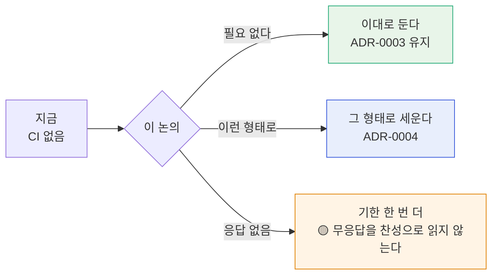

# #69 [논의] D8 CI(자동 시험)를 둘 것인가, 둔다면 어떤 식으로 — 먼저 세웠던 것을 걷어내고 여쭙습니다

> 🗂️ 옛 GitHub 논의를 옮긴 **기록 문서**입니다 — [색인](../README.md). 원문은 그대로 두고, 링크·커밋 해시만 새 자리 기준으로 바꿨습니다.

| 항목 | 내용 |
|---|---|
| 종류 | 논의 |
| 상태 | 논의 · General |
| 원 작성 | 이동원(`devlee328288`) · 2026-09-21 15:44 KST |
| 옛 주소 | `github.com/devlee328288/Qurious/discussions/69` (지금은 열리지 않음) |

## 본문

> **이 논의는 답을 정해 두고 묻는 것이 아닙니다.** 1번 질문이 「자동 시험이 필요한가」이고,
> **「필요 없다」도 정당한 답**입니다. 그렇게 적어 두지 않으면 묻는 시늉이 되기 때문에 먼저 밝힙니다.
>
> 🔴 **제가 먼저 잘못한 순서가 있습니다.** CI 를 팀 논의 없이 세웠다가 걷어냈습니다. 경위는 §1 에 그대로 적었습니다.

---

## 1. 무슨 일이 있었나 — 하루에 세 번 바뀐 경위

```
  09-21 S40   CI 도입 + 룰셋 게이트 계획         "승인자를 못 두니 CI 가 막는다"
                │
                ▼
  09-21 S41 ①  게이트 철회 → 신호등 전환         게이트가 우리 머지 방식을 막는다
                │                                (PR #68 — 머지까지 됨)
                ▼
  09-21 S41 ②  워크플로 삭제 + 이 논의 개설      팀 도구를 팀 논의 없이 세웠다
                                                 (ADR-0003)
```

앞의 두 판은 **「어떤 CI 를 쓸까」**를 따졌고, 세 번째는 **「그걸 제가 정할 일인가」**를 따졌습니다.

이 저장소에는 팀에 영향 가는 결정을 올리는 규격이 이미 있습니다 — **이 Discussion 9건**이 그것입니다.

| Discussion 을 거친 것 | Discussion 을 안 거친 것 |
|----------------------|------------------------|
| D0 팀 운영·기록 방식 | **CI 도입** 🔴 |
| D1 무엇을 푸는가 | **룰셋 게이트 계획** 🔴 |
| D2 유료 서비스 범위 | |
| D3 기능 범위 · D4 검정 규격 | |
| D5 배분 설계 · D6 인디케이터 · D7 모의투자 | |

CI 는 **모든 팀원의 PR 화면에 나타나는 공용 장치**입니다. 성격상 D0 과 같은 칸에 있어야 했는데
「기술 부채를 막는 장치」로 분류해 혼자 세웠습니다. 분류를 잘못한 것입니다.

---

## 2. 지금 상태

| 항목 | 상태 |
|------|:----:|
| GitHub Actions 워크플로 | 🔴 **없음** (`.github/` 디렉터리째 사라짐) |
| 자동 실행 | 🔴 없음 — PR 에도 push 에도 아무것도 돌지 않습니다 |
| 시험 파일 | 🟢 **23건 그대로** (`tests/`) |
| 시험 실행 | 🟢 `python -m pytest` 로 로컬에서 돕니다 |
| 저장소 룰셋 | 🔴 없음 (건 적이 없습니다) |

**시험은 안 지웠습니다.** 시험은 「무엇을 지킬 것인가」의 기록이고 그건 ADR-0001·테스트계획서로
이미 합의된 내용입니다. 지운 건 **「누가 언제 돌릴 것인가」** 쪽입니다. 그 둘이 한 덩어리로
묶여 있었는데, 사실 다른 결정이었습니다.

```bash
# 지금도 이렇게 돌아갑니다
pip install -r requirements-dev.txt
python -m pytest -p no:warnings -q
# .......................  [100%]   23 passed
```

---

## 3. 판단 재료 — **결론이 아니라 재료입니다**

논의에 쓰시라고 지난 판에서 정리한 것을 그대로 옮깁니다. 이게 답이라는 뜻이 아닙니다.

### 3.1 사람 리뷰와 자동 시험이 보는 범위가 다릅니다

```
        사람 이중 검증 (PR·이슈)              자동 시험
        ─────────────────────────            ─────────────────────────
보는 것  ┌───────────────┐                    ┌───────────────────────┐
         │  이 PR 의 diff │                    │  저장소 전체의 현재 상태 │
         └───────────────┘                    └───────────────────────┘
             ↑ 좁고 깊다                          ↑ 넓고 얕다

잡는 것  · 설계 의도가 맞는가                  · 지난번에 고친 게 되돌아왔나
         · 요구를 충족하는가                   · 전역 약속이 아직 지켜지나

못 잡음  · 다른 파일에 **이미 있던** 문제        · 의도가 옳은지
```

### 3.2 시험 23건 중 3건은 저장소 전체를 훑습니다

| 시험 | 훑는 범위 | 지키는 것 |
|------|-----------|-----------|
| `test_저장소_어디에도_paper_False_하드코딩이_남아있지_않다` | `app/**/*.py` 전체 | 실거래 차단 (ADR-0001) |
| `test_야후_참조가_기준선과_같다` | 저장소 전체 | 야후 의존 봉인선 ([#61](../issues/061.md) P1-1) |
| `test_기준선에_없는_파일이_야후를_쓰지_않는다` | 저장소 전체 | 새 파일의 야후 반입 |

### 3.3 실제 사례 하나

ADR-0001 이 막은 `paper=False` 하드코딩이 언제 들어왔는지 추적해 봤습니다.

```
2e2d3f8  강사님 lumina-invest 최신본 반영
            └─ auto_trade.py 의 paper=False 가 이때 들어옴
                      ▼
2e3cccc  주문이 정산금액으로 현금을 옮긴다 — orders 확장
            └─ 같은 파일을 또 건드렸는데도 안 잡힘
                      ▼
ed0abb4  실거래로 나가는 문이 셋이었다 (09-21)
            └─ 전수 조사를 해서야 발견
```

리뷰가 게을러서가 아닙니다. `2e3cccc` 는 「주문 정산」을 보는 PR 이었고 `paper=False` 는
그 관심사 밖의 줄이었습니다.

> 🟡 **다만 이 사례가 「그러니 CI 를 쓰자」를 뜻하지는 않습니다.** 다른 해법도 있습니다 —
> pre-commit 훅, 릴리스 전 수동 점검, 아예 다른 방식. 그게 아래 질문의 이유입니다.

---

## 4. 여쭙고 싶은 것 6가지

편한 것만 골라 답해 주셔도 됩니다. **모르겠다·상관없다도 답입니다.**

### Q1. 자동 시험이 필요한가요?

- [ ] 필요하다
- [ ] **필요 없다** — 사람 검증으로 충분하다
- [ ] 모르겠다 / 더 써 봐야 알겠다

### Q2. 필요하다면, **무엇을** 막아야 하나요?

막을 대상이 정해져야 도구가 정해집니다.

| 후보 | 지금 상태 |
|------|-----------|
| 실거래 주문이 나가는 경로 | 시험 21건 있음 (ADR-0001) |
| 야후 의존이 다시 늘어나는 것 | 시험 2건 있음 |
| 문법 오류·import 깨짐 | 시험 없음 |
| 화면이 안 뜨는 것 | 시험 없음 |
| 그 밖에 ( ) | |

### Q3. **언제** 돌아야 하나요?

- [ ] PR 올릴 때마다
- [ ] main 에 들어갈 때
- [ ] 발표·제출 직전에만
- [ ] 각자 필요할 때 수동으로 (= 지금 상태)

### Q4. 실패하면 **어떻게** 되나요?

```
  게이트          빨간 X → 머지 버튼 잠김        확실하지만 급할 때 막힌다
  신호등          빨간 X → 표시만, 머지 가능     안 막지만 무시될 수 있다
  알림 없음        아무 표시 없음                 —
```

### Q5. **누가 관리**하나요?

깨진 CI 를 아무도 안 고치면 없느니만 못합니다. 상시 빨간 상태가 되면 아무도 안 봅니다.

- [ ] 주 단위 당번 (P-E 처럼)
- [ ] 만든 사람이 계속
- [ ] 정하지 말고 그때그때

### Q6. GitHub Actions 말고 **다른 방법**은 어떤가요?

| 방법 | 성격 |
|------|------|
| pre-commit 훅 | 커밋 전에 로컬에서 자동. 각자 설치해야 함 |
| 로컬 스크립트 (`make check` 같은) | 돌리고 싶을 때만. 지금 상태에 가깝다 |
| 발표 전 체크리스트 | 사람이 한 번에 훑음 |
| 아무것도 안 함 | 사람 검증만 |

---

## 5. 흐름



> **용어 — CI(Continuous Integration, 지속적 통합)**
> 코드가 올라올 때마다 **자동으로 검사를 돌리는 장치**입니다.
> **이 논의에서는** 「GitHub Actions 로 pytest 를 자동 실행하는 것」을 좁게 가리킵니다.
> **헷갈리는 점**: CI 와 **룰셋**은 다른 물건입니다. CI(워크플로)는 *검사를 실행할 뿐*이고,
> 그 결과로 **병합을 잠그는 것은 룰셋**입니다. 그래서 워크플로만 있으면 아무것도 막히지 않습니다.
> Q4 의 「게이트/신호등」 갈림이 정확히 이 차이입니다.

---

## 6. 기한

**09-27** — 다른 논의(D0~D7)와 같은 날로 맞춥니다.

🟡 **무응답을 찬성으로 읽지 않겠습니다.** 기한까지 답이 없으면 기한을 한 번 더 두고,
재촉 글은 쓰지 않겠습니다. 지금 상태(CI 없음)가 기본값이라 **아무 일도 일어나지 않아도
프로젝트는 멈추지 않습니다.**

---

## 참조

- `docs/ADR/ADR-0003-CI를-걷어내고-먼저-논의한다.md` — 걷어낸 경위와 근거
- `docs/ADR/ADR-0002-CI를-게이트가-아니라-신호로-둔다.md` — 대체됨 (§3 의 분석 출처)
- `docs/배포/CI-CD명세_v1.2.md` — 지금 상태 · 시험을 직접 돌리는 법
- 이슈 [#67](../issues/067.md) · PR [#68](../pulls/068.md)(머지 후 되돌림)
