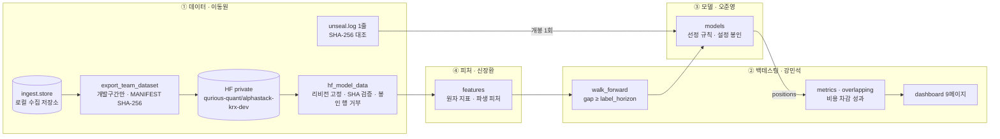

# #3 [분석] A16 1차 Alpha_Stack 유산 인벤토리

> 🗂️ 옛 GitHub 이슈를 옮긴 **기록 문서**입니다 — [색인](../README.md). 원문은 그대로 두고, 링크·커밋 해시만 새 자리 기준으로 바꿨습니다.

| 항목 | 내용 |
|---|---|
| 종류 | 이슈 |
| 상태 | 열림 |
| 원 작성 | 이동원(`devlee328288`) · 2026-09-15 11:57 KST |
| 라벨 | `analysis` `phase-1` |
| 담당 | 이동원(`devlee328288`) |
| 옛 주소 | `github.com/devlee328288/Qurious/issues/3` (지금은 열리지 않음) |

## 본문

### 1. 요약

- 1차에서 2.0으로 가져갈 핵심은 모델 성능이 아니라, 네 역할이 함께 만든 **검증 절차와 데이터 운영 방식**입니다.
  - ① 데이터: 미래 차단 정문, 홀드아웃 봉인, HF 비공개 데이터 허브
  - ② 백테스팅: 누수 차단 분할, 비용 차감 지표
  - ③ 모델: 사전등록한 선정 규칙, 시도 기록
  - ④ 피처: look-ahead 금지 계약
- 이 자산들은 모델을 모르게 설계돼 있어서 2차(자산배분)와 3차(인디케이터)에 그대로 붙일 수 있습니다.
- 다만 **비용 차감 홀드아웃 백테스트와 주 검정을 하지 못했습니다.** 비용 규격과 라벨 축도 파일마다 달라서, 옮기기 전에 규격부터 하나로 맞춰야 합니다.

### 2. 1차 역할별 유산 지도

기준은 README 역할표 (Alpha_Stack `README.md#L91-L96` @ `01d8894`)와 커밋 `01d8894`입니다.

| 1차 역할 | 담당 | 1차 영역 | 2.0으로 가져갈 유산 | 이어지는 2.0 항목 |
|---|---|---|---|---|
| ① 팀장 · 데이터 수집·저장·정제·전처리 · 문서화 | 이동원 | `ingest/` `common/` `supply/` `docs/` | as_of 정문, 홀드아웃 봉인, **HF 비공개 데이터 허브**, 품질 원장, 백테스트 원장 계약, ADR 사전등록 | A2 · A4 · D2 · D4 · D7 |
| ② 백테스팅 · 성과지표 · 화면 | 강민석 | `evaluation/` `backtest/` `dashboard/` | walk_forward, 기준선 3종, 비용 차감 지표, 중첩 백테스트, 동적 기준선, 분할매매, 대시보드 | A6 · A7 · A13 · D4 · D5 |
| ③ 모델: 표 → 등락 방향 분류기 | 오준영 | `models/` | 선정 규칙, 단일 실행 설정 봉인, 최종 실행기, 시도 기록 | A6 · D4 · D5 |
| ④ 피처 · 품질: 지표 계산 | 신장환 | `features/` | look-ahead 금지 계약, 원자 지표, 파생 피처 4개, 유동 임계값 | **A5 · D6** (3차 인디케이터와 직결) |

> 2.0 담당은 **D0에서 정합니다.** 이 표는 1차 역할을 그대로 이으면 어디로 연결되는지만 보여줍니다.

### 3. 역할과 데이터 흐름

### 4. 역할별 핵심 진입점

#### ① 데이터 (이동원)

**as_of 정문**
- `AsOfRequired` clock.py#L46-L51 (Alpha_Stack `supply/clock.py#L46-L51` @ `01d8894`): `as_of`에 기본값이 없어서, 빠뜨리면 즉시 오류가 납니다.
- `known_at` #L79-L88 (Alpha_Stack `supply/clock.py#L79-L88` @ `01d8894`): 거래일 T의 시세는 T+1 0시(KST)부터 알 수 있다고 봅니다.
- `dart_known_at` #L177-L211 (Alpha_Stack `supply/clock.py#L177-L211` @ `01d8894`): 공시는 접수일 다음 거래일부터 알 수 있다고 봅니다.
- `index_series`·`price_series` market.py#L138-L175 (Alpha_Stack `supply/market.py#L138-L175` @ `01d8894`)
- 경계 테스트 test_supply_boundary.py#L1-L15 (Alpha_Stack `tests/test_supply_boundary.py#L1-L15` @ `01d8894`): 소비 계층이 저장소를 직접 import하면 테스트가 실패합니다.

**HF Organization 비공개 데이터 허브** ([qurious-quant](https://huggingface.co/qurious-quant))

- **반출**: export_team_dataset.py#L1-L23 (Alpha_Stack `scripts/export_team_dataset.py#L1-L23` @ `01d8894`)
  - 개발구간만 담아 small과 full 두 벌로 나눕니다.
  - full은 599만 행이고, CSV 656.7MB를 parquet 142.1MB로 줄였습니다.
  - MANIFEST의 SHA-256으로 같은 결과를 다시 만들 수 있습니다.
  - KRX 이용약관 제11조 ②가 제3자 제공을 금지합니다. 그래서 공개 저장소에는 파일을 올리지 않고 스크립트만 남깁니다(#L5-L8 (Alpha_Stack `scripts/export_team_dataset.py#L5-L8` @ `01d8894`)).
- **입구**: `_hf_revision_and_token` hf_model_data.py#L175-L188 (Alpha_Stack `supply/hf_model_data.py#L175-L188` @ `01d8894`)
  - 저장소가 **private이 아니면 멈춥니다.**
  - 한 번 실행하는 동안 HF 커밋을 하나로 고정합니다.
- **검증**: `validate_index_snapshot` #L66-L115 (Alpha_Stack `supply/hf_model_data.py#L66-L115` @ `01d8894`)
  - MANIFEST와 SHA-256, 행 수, 열 구성이 모두 같은지 대조합니다.
  - **홀드아웃 행이 있으면 거부합니다.**
- **로컬에는 캐시만 남습니다**(`DEFAULT_CACHE_DIR` #L21 (Alpha_Stack `supply/hf_model_data.py#L21` @ `01d8894`)). 그래서 팀원 PC의 용량 부담이 적고, 모두 같은 스냅샷을 씁니다.
- **결과 원장도 같은 Organization에 올립니다**: backtest_ledger.py#L79-L80 (Alpha_Stack `supply/backtest_ledger.py#L79-L80` @ `01d8894`)의 execution-log·trade-log

**홀드아웃 봉인**
- `HOLDOUT_START` horizon.py#L34 (Alpha_Stack `evaluation/horizon.py#L34` @ `01d8894`)는 ADR 0005 (Alpha_Stack `docs/decisions/0005-홀드아웃-2년.md` @ `01d8894`)에서 정했습니다.
- `holdout_safe_frame` model_data.py#L10-L82 (Alpha_Stack `supply/model_data.py#L10-L82` @ `01d8894`)
- `append_unseal_row` holdout.py#L158-L186 (Alpha_Stack `supply/holdout.py#L158-L186` @ `01d8894`): 두 번째 개봉 기록은 쓰지 못하게 막습니다.
- `verify_holdout_snapshot` #L203-L248 (Alpha_Stack `supply/holdout.py#L203-L248` @ `01d8894`)
- `reports/unseal.log` (Alpha_Stack `reports/unseal.log` @ `01d8894`): 2026-09-11 16:18:48 KST에 1회 개봉했습니다.

**품질 원장·원장 계약**
- `quality_ledger.py`의 8개 축 #L113-L483 (Alpha_Stack `supply/quality_ledger.py#L113-L483` @ `01d8894`): 결측, 유효성, 이상치, 거래량, 달력, 중복, 봉인, 총수익을 검사합니다.
- `verify_ledger` backtest_ledger.py#L158 (Alpha_Stack `supply/backtest_ledger.py#L158` @ `01d8894`): ②가 낸 원장을 데이터 쪽에서 다시 계산해 대조합니다.

**사전등록 문서**
- ADR 0004 §2~§4 (Alpha_Stack `docs/decisions/0004-사전등록.md#L52-L110` @ `01d8894`): 귀무가설, 주 지표 ΔSharpe_net, block bootstrap 설정(블록 10, B=10,000, 시드 20260901)
- ADR 0004 §8 (Alpha_Stack `docs/decisions/0004-사전등록.md#L186-L214` @ `01d8894`): 결론 문장 두 개를 결과를 보기 전에 미리 썼습니다.

#### ② 백테스팅 · 성과지표 · 화면 (강민석)

**누수 차단 분할**
- `_resolve_gap` walk_forward.py#L61-L109 (Alpha_Stack `evaluation/walk_forward.py#L61-L109` @ `01d8894`): `gap < label_horizon`이면 `LeakageError`를 냅니다.
- `expanding_splits` #L112-L177 (Alpha_Stack `evaluation/walk_forward.py#L112-L177` @ `01d8894`) · `expanding_group_splits` #L180-L241 (Alpha_Stack `evaluation/walk_forward.py#L180-L241` @ `01d8894`) · `rolling_splits` #L244-L276 (Alpha_Stack `evaluation/walk_forward.py#L244-L276` @ `01d8894`)

**기준선 3종**
- `always_up` baseline.py#L35 (Alpha_Stack `evaluation/baseline.py#L35` @ `01d8894`) · `majority_class` #L40 (Alpha_Stack `evaluation/baseline.py#L40` @ `01d8894`) · `previous_direction` #L96 (Alpha_Stack `evaluation/baseline.py#L96` @ `01d8894`) · `evaluate_all` #L111 (Alpha_Stack `evaluation/baseline.py#L111` @ `01d8894`)

**비용 차감 지표**
- `apply_cost` metrics.py#L118-L145 (Alpha_Stack `evaluation/metrics.py#L118-L145` @ `01d8894`) · `summarize` #L148-L188 (Alpha_Stack `evaluation/metrics.py#L148-L188` @ `01d8894`)
- `overlap_vif` horizon.py#L74-L95 (Alpha_Stack `evaluation/horizon.py#L74-L95` @ `01d8894`): 5일 레이블이 서로 겹치면 분산팽창계수(VIF)가 3.78입니다.

**중첩 백테스트**
- `overlapping_long_only_returns` overlapping.py#L123-L163 (Alpha_Stack `evaluation/overlapping.py#L123-L163` @ `01d8894`): 자금을 5개 슬리브로 나눠 매일 신호를 실행하고 Buy&Hold와 비교합니다.
- `delta_sharpe_net` #L166-L173 (Alpha_Stack `evaluation/overlapping.py#L166-L173` @ `01d8894`)
- `run_overlapping_stock_backtest` stock_backtest.py#L223 (Alpha_Stack `evaluation/stock_backtest.py#L223` @ `01d8894`)

**동적 기준선 (CMA-ES)**
- `make_band_labels` step5_optimize_6params.py#L172-L183 (Alpha_Stack `evaluation/threshold_tuning/step5_optimize_6params.py#L172-L183` @ `01d8894`)
- CMA-ES 설정 #L518-L536 (Alpha_Stack `evaluation/threshold_tuning/step5_optimize_6params.py#L518-L536` @ `01d8894`)

**분할매매 A~F**
- `get_trade_ratio_a` backtest_strategies.py#L121 (Alpha_Stack `backtest/backtest_strategies.py#L121` @ `01d8894`) · `_b` #L140 (Alpha_Stack `backtest/backtest_strategies.py#L140` @ `01d8894`) · `_c` #L149 (Alpha_Stack `backtest/backtest_strategies.py#L149` @ `01d8894`)
- D·E·F는 A·B·C에 5거래일 락을 건 전략입니다(#L164 (Alpha_Stack `backtest/backtest_strategies.py#L164` @ `01d8894`) · #L209 (Alpha_Stack `backtest/backtest_strategies.py#L209` @ `01d8894`)).
- 비용 민감도 프리셋 run_cost_sensitivity.py#L20-L25 (Alpha_Stack `backtest/run_cost_sensitivity.py#L20-L25` @ `01d8894`)

**화면**
- `dashboard/pages/` (Alpha_Stack `dashboard/pages` @ `01d8894`)의 9페이지: Baseline · Model Lab · Comparison · Backtest · Risk · Cost Sensitivity · System · Universe · QFRS
- HF Space 배포 (Alpha_Stack `deploy/hf-space/README.md` @ `01d8894`)

#### ③ 모델 (오준영)

**선정 규칙**: selection.py#L7-L31 (Alpha_Stack `models/selection.py#L7-L31` @ `01d8894`)
- 순서: 학습 최빈 기준선 대비 정확도 → Macro F1 → 기준선을 이긴 폴드 수
- ADR 0007 (Alpha_Stack `docs/decisions/0007-최종-모델-선정과-홀드아웃.md` @ `01d8894`)에 하락 Recall을 선정 기준에서 뺀 근거가 있습니다.

**단일 실행 설정 봉인**: final_holdout_model.json (Alpha_Stack `config/final_holdout_model.json#L1-L34` @ `01d8894`)
- KOSPI200은 조합 C(피처 6개), 개별종목은 조합 K(피처 14개)이고 둘 다 LogisticRegression입니다.
- ADR 0009 (Alpha_Stack `docs/decisions/0009-최종-홀드아웃-실행설정.md` @ `01d8894`)에서 승인했습니다.

**최종 실행기**: `run_final_holdout` final_holdout.py#L139 (Alpha_Stack `models/final_holdout.py#L139` @ `01d8894`)
- 마지막 구간 평가는 ADR 0010 (Alpha_Stack `docs/decisions/0010-개봉후-마지막-예측구간.md` @ `01d8894`)에 있고, 해석을 바꾼 사실도 함께 기록했습니다.

**시도 기록**: `reports/trials.jsonl`
- 모든 fit 호출을 기록했고 17,388행입니다(#L1235 (Alpha_Stack `scripts/build_final_report.py#L1235` @ `01d8894`)).
- 다중비교를 보정한 뒤 유의한 후보가 없다는 사실도 숨기지 않기로 했습니다(ADR 0007 #L37 (Alpha_Stack `docs/decisions/0007-최종-모델-선정과-홀드아웃.md#L37` @ `01d8894`)).

#### ④ 피처 · 품질 (신장환)

- **look-ahead 금지 계약**: indicators.py#L1-L28 (Alpha_Stack `features/indicators.py#L1-L28` @ `01d8894`)
  - 지표마다 손계산 테스트와 shift 검사를 둡니다.
  - t+1 이후 값을 넣었다 빼도 t 이전 출력이 변하면 안 됩니다.
- **원자 지표**: `sma` #L46 (Alpha_Stack `features/indicators.py#L46` @ `01d8894`) · `ema` #L105 (Alpha_Stack `features/indicators.py#L105` @ `01d8894`) · `rsi`(Wilder) #L116-L156 (Alpha_Stack `features/indicators.py#L116-L156` @ `01d8894`) · `macd` #L159 (Alpha_Stack `features/indicators.py#L159` @ `01d8894`) · `bollinger_bands` #L185 (Alpha_Stack `features/indicators.py#L185` @ `01d8894`)
- **파생 피처 4개**: `atr_ratio` volatility.py#L226 (Alpha_Stack `features/volatility.py#L226` @ `01d8894`) · `hv_regime` #L260 (Alpha_Stack `features/volatility.py#L260` @ `01d8894`) · `obv_slope_20` volume.py#L153 (Alpha_Stack `features/volume.py#L153` @ `01d8894`) · `macd_hist_atr` indicators.py#L287 (Alpha_Stack `features/indicators.py#L287` @ `01d8894`)
- **유동 임계값**: dynamic_threshold.py#L59-L81 (Alpha_Stack `features/dynamic_threshold.py#L59-L81` @ `01d8894`), 공식은 `threshold = 0.40 · σ_5d`입니다.

### 5. 외부 의존과 비용

- `evaluation/`과 `features/`는 numpy·pandas만 씁니다. models와 DB를 import하지 않습니다(evaluation/__init__.py#L17-L28 (Alpha_Stack `evaluation/__init__.py#L17-L28` @ `01d8894`)).
- 모델 입력 데이터는 **HF Organization의 private dataset**에서 받습니다.
  - `huggingface_hub`와 팀원별 토큰(`HF_TOKEN` 등)이 필요합니다.
  - 로컬에는 캐시만 남습니다.
- `supply/`의 시세 정문은 로컬 `ingest.store`(SQLite·PostgreSQL)에 묶여 있습니다(market.py#L53-L55 (Alpha_Stack `supply/market.py#L53-L55` @ `01d8894`)).
  - Qurious에는 원칙만 가져가고, 데이터 원천 연결은 새로 해야 합니다(A4).
- 기타 의존
  - `threshold_tuning`: `cma`(#L5 (Alpha_Stack `evaluation/threshold_tuning/step5_optimize_6params.py#L5` @ `01d8894`))
  - 비용 민감도: HF `datasets`(#L8 (Alpha_Stack `backtest/run_cost_sensitivity.py#L8` @ `01d8894`))
- 유료 서비스는 없습니다. HF dataset과 Space는 무료 등급으로 운영했습니다.

### 6. 품질 관찰: 1차 미완 항목

- [ ] **②③ 홀드아웃 비용 차감 백테스트와 주 검정을 하지 못했습니다.**
  - 최종 예측을 백테스트 입력으로 넘기는 연결이 남았습니다(#L1049-L1051 (Alpha_Stack `scripts/build_final_report.py#L1049-L1051` @ `01d8894`)).
  - 종목 트랙은 매수 후보의 성과도 계산하지 않았습니다(#L1060-L1061 (Alpha_Stack `scripts/build_final_report.py#L1060-L1061` @ `01d8894`)).
  - ADR 0009 후속 체크리스트 두 줄이 비어 있습니다(#L49-L50 (Alpha_Stack `docs/decisions/0009-최종-홀드아웃-실행설정.md#L49-L50` @ `01d8894`)).
- [ ] **② block bootstrap을 구현하지 않았습니다.** 절차는 ADR 0004 §4에 고정돼 있지만, `.py` 파일에는 보고서 문장으로만 나옵니다.
- [ ] **② 비용 규격 ①: 기본 왕복비용이 모듈마다 다릅니다.**
  - metrics.py#L37 (Alpha_Stack `evaluation/metrics.py#L37` @ `01d8894`)은 `0.003`입니다.
  - horizon.py#L41 (Alpha_Stack `evaluation/horizon.py#L41` @ `01d8894`) · overlapping.py#L129 (Alpha_Stack `evaluation/overlapping.py#L129` @ `01d8894`) · experiment.py#L33 (Alpha_Stack `models/experiment.py#L33` @ `01d8894`)은 `0.0005`입니다.
  - 그래서 `summarize()`를 기본값으로 부르면 비용이 6배로 잡힙니다.
- [ ] **② 비용 규격 ②: 편도 비용을 두 번 뺍니다.**
  - 프리셋은 왕복 비용인데, 매수 #L353 (Alpha_Stack `backtest/backtest_strategies.py#L353` @ `01d8894`)과 매도 #L377 (Alpha_Stack `backtest/backtest_strategies.py#L377` @ `01d8894`)에서 각각 곱합니다.
  - 결과적으로 실질 비용이 2배입니다(README #L121 (Alpha_Stack `README.md#L121` @ `01d8894`) · Alpha_Stack #265).
- [ ] **② 비용 규격 ③: 연율화 계수를 섞어 씁니다.** metrics.py#L40 (Alpha_Stack `evaluation/metrics.py#L40` @ `01d8894`)은 `252`, horizon.py#L44 (Alpha_Stack `evaluation/horizon.py#L44` @ `01d8894`)는 `245`입니다.
- [ ] **② 라벨 축이 어긋납니다.**
  - `make_band_labels` #L182-L183 (Alpha_Stack `evaluation/threshold_tuning/step5_optimize_6params.py#L182-L183` @ `01d8894`)은 주석에 "t+1 시가 → t+6 시가"라고 적었지만 **종가**로 계산합니다.
  - ADR 0002와 같은 파일의 #L49 (Alpha_Stack `evaluation/threshold_tuning/step5_optimize_6params.py#L49` @ `01d8894`)는 시가를 씁니다.
- [ ] **② 대시보드 수치가 공식 결과와 다릅니다.** LR 정확도가 대시보드는 0.3736, 공식 결과는 0.4542입니다(README #L121 (Alpha_Stack `README.md#L121` @ `01d8894`)).
- [ ] **② 결과 업로드 4곳에 `private` 지정이 없습니다.**
  - 대상: run_cost_sensitivity.py#L165 (Alpha_Stack `backtest/run_cost_sensitivity.py#L165` @ `01d8894`) · #L176 (Alpha_Stack `backtest/run_cost_sensitivity.py#L176` @ `01d8894`) · #L204 (Alpha_Stack `backtest/run_cost_sensitivity.py#L204` @ `01d8894`) · #L207 (Alpha_Stack `backtest/run_cost_sensitivity.py#L207` @ `01d8894`)의 `push_to_hub`
  - 이 경우 새 저장소는 조직의 기본 공개 범위를 따릅니다.
  - 원장에 KRX 가격이 들어 있으면 이용약관 문제가 될 수 있습니다. **현재 공개 범위를 웹에서 확인해야 합니다.**
- [ ] **①② gap 5와 T+6 청산이 하루 겹칩니다.**
  - 학습 마지막 날 T=20240823의 청산일이 평가 첫날인 20240902와 같습니다(개봉 절차 #L344 (Alpha_Stack `docs/데이터파트/version4.6/홀드아웃_개봉_절차.md#L344` @ `01d8894`)).
  - → 2.0에서는 `label_horizon`을 **판단일부터 청산일까지의 거리(6)** 로 정의합니다.
- [ ] **④ 유동 임계값이 라벨링·리포트에 연결되지 않았습니다.** `classify_3`가 스칼라 band만 받습니다(#L35-L36 (Alpha_Stack `features/dynamic_threshold.py#L35-L36` @ `01d8894`) · #L74-L78 (Alpha_Stack `features/dynamic_threshold.py#L74-L78` @ `01d8894`)).
- [ ] **①③ 홀드아웃을 이미 1회 열었습니다.**
  - ADR 0010에서 실행 해석이 바뀌었으므로, 2년 전체를 확증적으로 평가했다고 부를 수 없습니다(#L16-L19 (Alpha_Stack `docs/decisions/0010-개봉후-마지막-예측구간.md#L16-L19` @ `01d8894`)).
  - 결과는 KOSPI200 MCC −0.0114로 우연 수준입니다(#L1055-L1056 (Alpha_Stack `scripts/build_final_report.py#L1055-L1056` @ `01d8894`)).
- [x] 누수 방지 기본값과 경계 테스트는 있습니다: `test_walk_forward_gap` · `test_supply_boundary` · `test_supply_holdout` · `test_unseal_holdout` · `test_hf_model_data` · 지표별 손계산 테스트

### 7. 2.0 관점 1차 판정 (확정은 D3·D4)

| 역할 | 자산 | 판정 | 근거 |
|---|---|---|---|
| ① | as_of 정문 | **원칙 유지 · 구현 개선** | Qurious는 데이터 원천이 달라서 연결을 새로 해야 합니다(A4). |
| ① | **HF Organization 비공개 데이터 허브**(반출 스크립트, 고정 리비전, SHA 검증 입구) | **유지 · 2.0 데이터 허브 후보** | 로컬 용량 부담 없이 팀원 모두가 같은 스냅샷을 씁니다. KRX 제3자 제공 금지도 private으로 지킵니다. Qurious 앱 DB(PostgreSQL 등, A2)는 서빙용 파생 데이터만 두고 원자료는 HF에 두는 역할 분리를 검토합니다(A2 · A4 · D2). |
| ① | 봉인 장치 · 품질 원장 · 원장 계약 | **유지** | 2.0의 새 봉인 구간은 모의투자 포워드 로그입니다(D7). 원장 계약은 모의투자 로그 대조에 씁니다. |
| ① | ADR 사전등록 | **유지** | "누구에게·무슨 목적으로"(D1 결론)를 결과를 보기 전에 못 박는 도구입니다. |
| ② | walk_forward | **유지 · Qurious 교체 1순위** | Qurious에 누수 지점이 있습니다. [ml_models.py#L124](https://github.com/EST-team-project/Qurious/blob/04f476a/app/services/ml_models.py#L124)는 시간을 무시한 `cross_val_score(cv=5)`입니다. [investment_research.py#L138](https://github.com/EST-team-project/Qurious/blob/04f476a/app/services/investment_research.py#L138)은 5일 앞 라벨을 쓰는데, [#L148](https://github.com/EST-team-project/Qurious/blob/04f476a/app/services/investment_research.py#L148)에 gap이 없습니다(A6). |
| ② | 기준선 3종 · `overlap_vif` | **유지** | 2차 기준선(Buy&Hold 등)과 3차 적중률 해석으로 넓힙니다. |
| ② | `apply_cost`·`summarize` | **개선 후 유지** | 비용·연율화 상수를 한 곳에서 관리합니다. 2차는 비중 벡터를 다루므로 turnover를 여러 자산의 합으로 넓힙니다(D5). |
| ② | 중첩 백테스트 | **보류** | 2차 리밸런싱 주기(D5)와 3차 보유기간(D6)이 정해진 뒤 판단합니다. |
| ② | `backtest_strategies` 분할매매 | **코드 폐기 후보 · 아이디어 보존** | 비용을 두 번 빼고, 평가 엔진과 별도 경로입니다. 비중 조절 규칙은 2차 리밸런싱 후보로 넘깁니다(D5). |
| ② | CMA-ES 동적 기준선 | **보류** | 라벨 축을 정리한 뒤 3차 임계 탐색 도구가 될 수 있습니다. 탐색 횟수는 trials에 기록합니다(D6). |
| ② | Streamlit 대시보드 · HF Space | **화면 폐기 · 구성 참고 · 배포 방식 검토** | Qurious 화면은 SPA(`public/app.html`)입니다. 페이지 구성은 A13에서, 무료 데모 배포 방식은 D2에서 참고합니다. |
| ② | block bootstrap | **신규 구현** | 절차가 ADR 0004에 고정돼 있어 2·3차 주 검정에 다시 씁니다. |
| ③ | 선정 규칙 · 설정 봉인 · trials | **유지** | 2차 자산배분 모델 선택과 3차 파라미터 선택에 같은 규칙을 적용합니다. |
| ③ | C·K LogisticRegression 모델 | **2.0 신호원으로 쓰지 않음** | 결과가 우연 수준이고, 2.0 과제는 방향 분류가 아닙니다. 1차 매듭은 D4에서 짓습니다. |
| ④ | look-ahead 계약 · 원자 지표 · 손계산 테스트 | **유지 · 3차 기반** | Qurious는 RSI 구현이 세 갈래라 하나로 통일할 후보입니다(A5). ① [`ta_utils.rsi` #L14-L25](https://github.com/EST-team-project/Qurious/blob/04f476a/app/services/ta_utils.py#L14-L25)는 기본이 SMA이고, [quant_pipeline.py#L73](https://github.com/EST-team-project/Qurious/blob/04f476a/app/services/quant_pipeline.py#L73)이 이 기본값을 씁니다. ② 같은 함수의 `method="ewm"` 옵션이 있습니다. ③ [`stock._calc_rsi` #L273-L291](https://github.com/EST-team-project/Qurious/blob/04f476a/app/services/stock.py#L273-L291)은 Wilder 방식 루프입니다. |
| ④ | 파생 피처 4개 · 유동 임계값 | **유지 후보** | 3차 인디케이터 후보군입니다. Qurious의 [`backtest_custom_indicator` 호출 routes/stocks.py#L756](https://github.com/EST-team-project/Qurious/blob/04f476a/app/routes/stocks.py#L756)과 연결합니다(D6). |

**2.0 스토리 연결**
- 1차 보고서 9.2절은 "2026-09-01 이후 쌓이는 자료로 새 봉인 구간을 정하고, 결과를 보기 전에 다시 사전등록한다"고 적었습니다(#L1397-L1400 (Alpha_Stack `scripts/build_final_report.py#L1397-L1400` @ `01d8894`)).
- **모의투자로 앞으로 쌓이는 로그가 바로 그 새 봉인 구간**입니다.
- 이 로그도 같은 HF Organization에 private으로 쌓으면 1차와 같은 방식으로 검증할 수 있습니다.

### 8. 관련 · 파트별 확인 요청

- 인덱스: [#1](../issues/001.md)
- 입력으로 쓰는 논의: **D0** 담당 · **D2** 인프라·비용 · **D4** 1차 매듭 · **D5** 2차 설계 · **D6** 3차 설계 · **D7** 모의투자
- 관련 분석: A2 · A4 · A5 · A6 · A7 · A13
- 1차 담당자께 각 절이 맞는지 확인을 부탁드립니다. 틀린 곳은 댓글로 알려주세요.
  - [x] ① 데이터: `@devlee328288`
  - [ ] ② 백테스팅·성과지표·화면: `@rkdalstjr`
  - [ ] ③ 모델: `@GoonGuMa`
  - [ ] ④ 피처·품질: `@janghwan-god`
