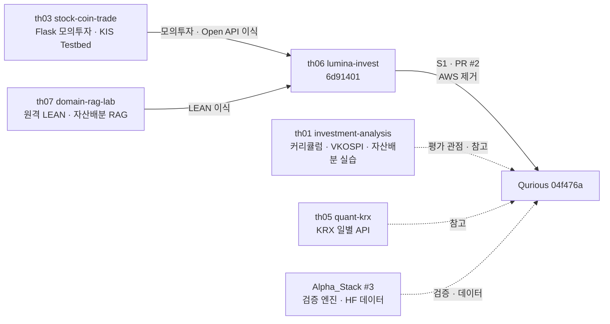

# #4 [분석] A17 강사님 배포 자료 인벤토리: 2·3차 평가 관점과 재사용 자산

> 🗂️ 옛 GitHub 이슈를 옮긴 **기록 문서**입니다 — [색인](../README.md). 원문은 그대로 두고, 링크·커밋 해시만 새 자리 기준으로 바꿨습니다.

| 항목 | 내용 |
|---|---|
| 종류 | 이슈 |
| 상태 | 열림 |
| 원 작성 | 이동원(`devlee328288`) · 2026-09-15 12:08 KST |
| 라벨 | `analysis` `phase-2` `phase-3` |
| 담당 | 이동원(`devlee328288`) |
| 옛 주소 | `github.com/devlee328288/Qurious/issues/4` (지금은 열리지 않음) |

## 본문

### 1. 요약

- 2·3차 담당 강사님의 배포 저장소 5곳(th01·th03·th05·th06·th07)을 **평가 관점**과 **재사용 자산** 두 축으로 정리했습니다. th04-in2는 범위에서 뺐습니다.
- **2차 평가 기준**은 `rfp-1`·`rfp-2`에 있습니다.
  - 자산배분 모델을 1개 이상 적용하고, 종목을 스크리닝하고, 모의투자 의사결정 로그를 남겨야 합니다.
  - 수치 기준도 있습니다: 방향성 정확도 55%, Sharpe 1.0, MDD −20%.
- **3차는 별도 명세가 없습니다.** 커리큘럼 5줄과 PineScript 교안의 합격 기준 예시만 있습니다.
- 모의투자(th03)와 LEAN(th07)은 th06을 거쳐 **이미 Qurious에 들어와 있습니다.** 남은 재사용 후보는 네 가지입니다.
  - KIS Testbed 절차
  - VKOSPI 국면 데이터
  - 자산배분 교안·RAG 문서
  - AWS·EC2 비용 근거

### 2. 위치·규모 (강사님 원본, 읽기 전용)

| 로컬 | 원본 저장소 · 기준 커밋 | 파일 | 성격 | 2·3차 관련 |
|---|---|---|---|---|
| th01 | [edumgt/investment-analysis `2cb9b7f`](https://github.com/edumgt/investment-analysis/tree/2cb9b7f) | 270 | 투자분석 학습 웹앱, 과정 커리큘럼, LEAN 예제 3종, VKOSPI 데이터 | **과정 목표**(2·3차), 자산배분 실습 |
| th03 | [edumgt/stock-coin-trade `ebb40c3`](https://github.com/edumgt/stock-coin-trade/tree/ebb40c3) | 188 | Flask 모의투자·Open API 플랫폼, KIS·KB·Alpaca 4일 커리큘럼 | 모의투자, 증권사 연동, Pine 학습 |
| th05 | [edumgt/quant-test-20260828 `8684a2b`](https://github.com/edumgt/quant-test-20260828/tree/8684a2b) | 18 | KRX 일별매매정보 조회 API, GitHub Actions 예제 | 데이터 수집(참고) |
| th06 | [edumgt/lumina-invest `6d91401`](https://github.com/edumgt/lumina-invest/tree/6d91401) | 280 | Qurious의 원본, RFP, 퀀트 모델링 교안 01~05 | **2차 평가 기준**, 3차 교안 |
| th07 | [edumgt/domain-rag-lab `7b71808`](https://github.com/edumgt/domain-rag-lab/tree/7b71808) | 130 | 금융상품·자산배분 RAG, 원격 LEAN, EC2 이관 실습 | 자산배분 지식, 배포 방식 |

### 3. 2·3차 평가 관점과 자산 흐름

#### 2차 · 로보 어드바이저

| 구분 | 요구 | 근거 |
|---|---|---|
| 과업 | AI 자동화 모델, 패턴 인식 예측, **자산배분(평균분산·Risk Parity·블랙-리터만 중 1개 이상)**, 스크리닝, 모의투자 의사결정 | [th01 readme#L23-L28](https://github.com/edumgt/investment-analysis/blob/2cb9b7f/readme.md#L23-L28) · [rfp-1#L8-L29](https://github.com/edumgt/lumina-invest/blob/6d91401/docs/rfp-1.md#L8-L29) |
| 정성 평가 | 자동화 완성도·재현성, 로직 타당성, 성과지표 검증의 충실도, 해석의 논리성과 개선안 | [rfp-1#L38-L42](https://github.com/edumgt/lumina-invest/blob/6d91401/docs/rfp-1.md#L38-L42) · [rfp-2#L141-L146](https://github.com/edumgt/lumina-invest/blob/6d91401/docs/rfp-2.md#L141-L146) |
| **수치 기준** | 방향성 정확도 55% 이상 · KOSPI 대비 초과수익 · MDD −20% 이내 · Sharpe 1.0 이상 · 스크리닝 종목이 시장 상위 30% | [rfp-2#L131-L139](https://github.com/edumgt/lumina-invest/blob/6d91401/docs/rfp-2.md#L131-L139) |
| 검증 | **상승·하락·횡보 시나리오별 성과 비교**, 의사결정 일관성 | [rfp-1#L27-L29](https://github.com/edumgt/lumina-invest/blob/6d91401/docs/rfp-1.md#L27-L29) |
| 산출물 | 설계서, 소스, 최적화·스크리닝 결과, 백테스트·모의투자 보고서(수익률·MDD·Sharpe·**Win Rate·Profit Factor**), 의사결정 일지. 대시보드와 리밸런싱 자동화는 선택 | [rfp-2#L113-L125](https://github.com/edumgt/lumina-invest/blob/6d91401/docs/rfp-2.md#L113-L125) |
| 제외 범위 | **실계좌 자동주문**, 상용 배포, 타인 자산 운용 | [rfp-2#L90-L94](https://github.com/edumgt/lumina-invest/blob/6d91401/docs/rfp-2.md#L90-L94) |
| 기타 | 시드 고정과 재현성, **데이터 출처·라이선스 준수**, GitHub 공개 업로드 | [rfp-2#L70-L73](https://github.com/edumgt/lumina-invest/blob/6d91401/docs/rfp-2.md#L70-L73) · [#L186-L189](https://github.com/edumgt/lumina-invest/blob/6d91401/docs/rfp-2.md#L186-L189) |

#### 3차 · 커스텀 인디케이터 (별도 RFP 없음)

| 구분 | 요구 | 근거 |
|---|---|---|
| 과업 | MA·RSI 기본 전략 → 커스텀 인디케이터 → TradingView PineScript로 성과 확인 → 파이썬 성과 검증 → **증권사 API 자동화** | [th01 readme#L30-L36](https://github.com/edumgt/investment-analysis/blob/2cb9b7f/readme.md#L30-L36) |
| 합격 기준(교안 예시) | Profit Factor > 1.5 · MDD > −15% · Sharpe > 1.0을 **동시에 만족**하고, Python으로 재현한 결과와 방향성이 일치할 것 | [th06 docs/05.md#L58-L59](https://github.com/edumgt/lumina-invest/blob/6d91401/docs/05.md#L58-L59) · [#L90](https://github.com/edumgt/lumina-invest/blob/6d91401/docs/05.md#L90) |
| 교안 | 01 성과지표 · 02 워크포워드·리밸런싱 · 03 계절성 · 04 알고리즘 트레이딩 · 05 PineScript | [th06 docs/](https://github.com/edumgt/lumina-invest/tree/6d91401/docs) |

#### 자산 흐름

### 4. 재사용 자산 진입점

#### th01 · investment-analysis

- **자산배분 비교 API** [`POST /api/quant/portfolio` #L218](https://github.com/edumgt/investment-analysis/blob/2cb9b7f/app/backend/routers/quant.py#L218)
  - 60/40 · 평균분산 · 블랙-리터만 · Risk Parity 네 가지를 CAGR·MDD·Sharpe·Sortino로 비교합니다([#L408-L431](https://github.com/edumgt/investment-analysis/blob/2cb9b7f/app/backend/routers/quant.py#L408-L431)).
- **실습 모듈**
  - [`risk_parity_weights` PortfolioOptimizer.py#L132](https://github.com/edumgt/investment-analysis/blob/2cb9b7f/app/src/PortfolioOptimizer.py#L132) · [`monte_carlo_frontier` #L97](https://github.com/edumgt/investment-analysis/blob/2cb9b7f/app/src/PortfolioOptimizer.py#L97)
  - [`var_cvar` RiskManager.py#L152](https://github.com/edumgt/investment-analysis/blob/2cb9b7f/app/src/RiskManager.py#L152) · [`position_size` #L117](https://github.com/edumgt/investment-analysis/blob/2cb9b7f/app/src/RiskManager.py#L117)
- **LEAN 추세 신호 검증** [lean-hyundai/README.md](https://github.com/edumgt/investment-analysis/blob/2cb9b7f/lean-hyundai/README.md#L1-L17)
  - `SMA20 > SMA60` 롱 신호의 월별 방향 적중률을 봅니다.
  - 단순 보유 대비 누적수익을 리포트로 비교합니다.
- **VKOSPI 데이터셋** [README_vkospi_dataset.md#L1-L28](https://github.com/edumgt/investment-analysis/blob/2cb9b7f/data/README_vkospi_dataset.md#L1-L28)
  - VKOSPI·KOSPI·KOSPI200을 일별로 합친 3,165행입니다(2013-08-06~2026-09-01).
  - 내재변동성과 실현변동성의 차이도 들어 있습니다.

#### th03 · stock-coin-trade

- **KIS Testbed 절차** [curriculum/01.md#L3-L9](https://github.com/edumgt/stock-coin-trade/blob/ebb40c3/curriculum/01.md#L3-L9)
  - 모의투자 계좌와 모의 키를 발급받고, 모의 주문 → 정정 → 취소 흐름을 따라갑니다.
  - 실전 계좌는 과정 범위 밖입니다.
  - 제출물: [#L75-L79](https://github.com/edumgt/stock-coin-trade/blob/ebb40c3/curriculum/01.md#L75-L79)
- **신호 전략 6종** [quant.py#L105-L112](https://github.com/edumgt/stock-coin-trade/blob/ebb40c3/python-stock-backend/quant.py#L105-L112)
  - MA 교차, 추세, 눌림목, RSI, 거래량 돌파, 모멘텀입니다.
  - 미래 캔들을 쓰지 않고 신호를 만듭니다([#L119-L166](https://github.com/edumgt/stock-coin-trade/blob/ebb40c3/python-stock-backend/quant.py#L119-L166)).
- **팩터 회귀** [`_regression` #L61-L74](https://github.com/edumgt/stock-coin-trade/blob/ebb40c3/python-stock-backend/quant.py#L61-L74): 알파와 팩터 노출(SMB·HML·RMW·CMA·MOM)을 구합니다.
- **Pine 학습 페이지** [frontend/learning/tradingview-pine.html](https://github.com/edumgt/stock-coin-trade/blob/ebb40c3/frontend/learning/tradingview-pine.html) · 가입 안내 [README#L360-L362](https://github.com/edumgt/stock-coin-trade/blob/ebb40c3/README.md#L360-L362)
- **이미 Qurious에 들어온 것**
  - th06이 이식했고([readme#L302-L329](https://github.com/edumgt/lumina-invest/blob/6d91401/readme.md#L302-L329)), Qurious에서는 [routes/paper.py#L115-L118](https://github.com/EST-team-project/Qurious/blob/04f476a/app/routes/paper.py#L115-L118)의 Pine 전략 주문(`source=PINE`)입니다.
  - 봇 자동매매, API 사용 이력, KIS MCP는 옮기지 않았습니다([#L328](https://github.com/edumgt/lumina-invest/blob/6d91401/readme.md#L328)).

#### th05 · quant-test-20260828

- **KRX 일별매매정보 기간 조회** [README#L23-L49](https://github.com/edumgt/quant-test-20260828/blob/8684a2b/README.md#L23-L49): 최대 366일까지 병렬로 조회하고 AG Grid 화면에 보여줍니다.
- **GitHub Actions** [README#L51-L77](https://github.com/edumgt/quant-test-20260828/blob/8684a2b/README.md#L51-L77): `test.md`를 자동 커밋합니다. 테스트 프레임워크는 없습니다([#L21](https://github.com/edumgt/quant-test-20260828/blob/8684a2b/README.md#L21)).

#### th06 · lumina-invest

- **2차 평가 기준** [docs/rfp-1.md](https://github.com/edumgt/lumina-invest/blob/6d91401/docs/rfp-1.md) · [docs/rfp-2.md](https://github.com/edumgt/lumina-invest/blob/6d91401/docs/rfp-2.md): Qurious `docs/`에 같은 사본이 있습니다.
- **3차 합격 기준 교안** [docs/05.md#L58-L59](https://github.com/edumgt/lumina-invest/blob/6d91401/docs/05.md#L58-L59) · Python 재현 체크 [#L216-L228](https://github.com/edumgt/lumina-invest/blob/6d91401/docs/05.md#L216-L228)
- **예상 비용** [readme#L70-L79](https://github.com/edumgt/lumina-invest/blob/6d91401/readme.md#L70-L79): 로컬만 쓰면 월 0~2만 원, AWS를 함께 쓰면 **월 30~150만 원 이상**입니다.
- **LEAN 모드** [readme#L331-L353](https://github.com/edumgt/lumina-invest/blob/6d91401/readme.md#L331-L353)
  - 모드는 `auto`·`ssh`·`docker`·`local` 네 가지이고, Docker 이미지는 약 14GB입니다.
  - Qurious에는 이미 들어와 있습니다([config.py#L49](https://github.com/EST-team-project/Qurious/blob/04f476a/app/config.py#L49)).
- **설계서** [onprem.md](https://github.com/edumgt/lumina-invest/blob/6d91401/onprem.md)(LEAN 격리 원칙 [#L366](https://github.com/edumgt/lumina-invest/blob/6d91401/onprem.md#L366)) · [pipeline.md](https://github.com/edumgt/lumina-invest/blob/6d91401/pipeline.md)

#### th07 · domain-rag-lab

- **자산배분 지식 문서 23종** [data/samples/](https://github.com/edumgt/domain-rag-lab/tree/7b71808/data/samples)
  - 포트폴리오 이론, 평균분산·블랙-리터만·Risk Parity, ETF 심화 등입니다([README#L271-L284](https://github.com/edumgt/domain-rag-lab/blob/7b71808/README.md#L271-L284)).
- **하이브리드 검색 RAG** [README#L44-L51](https://github.com/edumgt/domain-rag-lab/blob/7b71808/README.md#L44-L51)
  - Qdrant 검색과 PostgreSQL 검색 결과를 RRF로 합칩니다.
  - 도구 호출 오케스트레이터가 있습니다.
- **원격 LEAN** [lean_backtest_service.py#L41-L70](https://github.com/edumgt/domain-rag-lab/blob/7b71808/app/services/lean_backtest_service.py#L41-L70) · 전략 4종 [schemas/chat.py#L64-L69](https://github.com/edumgt/domain-rag-lab/blob/7b71808/app/schemas/chat.py#L64-L69)
- **EC2 이관 실습** [README#L5-L20](https://github.com/edumgt/domain-rag-lab/blob/7b71808/README.md#L5-L20)
  - 단일 EC2와 Caddy로 운영합니다.
  - ALB·ECS 확장은 별도 저장소에서 다룹니다.

### 5. 외부 의존과 비용

- **무료로 쓸 수 있는 것**: KIS Testbed(모의투자), TradingView 무료 계정(Pine Editor), yfinance, KRX Data API(키 발급 필요)
- **비용이 드는 것**
  - AWS 병행: 월 30~150만 원 이상([th06 readme#L76](https://github.com/edumgt/lumina-invest/blob/6d91401/readme.md#L76))
  - th03 Anthropic API: AI Sheet용, 선택
  - LEAN 원격 실행용 서버: ssh 모드일 때
- **용량**: LEAN Docker 이미지가 약 14GB입니다([th06 readme#L350](https://github.com/edumgt/lumina-invest/blob/6d91401/readme.md#L350)). 로컬 디스크 계획에 넣어야 합니다.
- 팀 비용은 자비 부담이라, 이 수치들을 **D2**의 입력으로 씁니다.

### 6. 품질 관찰

- [ ] **3차 명세서가 없습니다.**
  - 평가 기준은 커리큘럼 5줄과 교안의 합격 기준 예시뿐입니다.
  - 💬 **강사님께 3차 RFP나 평가표가 있는지 확인이 필요합니다.**
- [ ] **rfp-2 수치 기준과 1차 사전등록 방식이 부딪힙니다.**
  - rfp-2는 "정확도 55%, Sharpe 1.0" 같은 합격선을 둡니다([#L131-L139](https://github.com/edumgt/lumina-invest/blob/6d91401/docs/rfp-2.md#L131-L139)).
  - 1차는 결과를 보고 합격선을 좇게 되는 문제를 막으려고, 합격선을 두지 않았습니다(Alpha_Stack ADR 0004 §5). 1차 결과는 MCC −0.0114였습니다([#3](../issues/003.md)).
  - 한편 rfp-1은 같은 기준을 "평가 기준(**예시**)"라고 적었습니다([#L38](https://github.com/edumgt/lumina-invest/blob/6d91401/docs/rfp-1.md#L38)).
  - → 이 기준값을 **결과를 보기 전에** 보고 형식으로 못 박을지 **D5**에서 정합니다.
- [ ] **"증권사 연동 자동화"(3차)와 "실계좌 자동주문 제외"(2차)를 함께 맞춰야 합니다.**
  - KIS Testbed 모의 계좌로 한정하면 둘 다 충족합니다([th03 curriculum/01#L9](https://github.com/edumgt/stock-coin-trade/blob/ebb40c3/curriculum/01.md#L9)).
  - 결정은 **D7**에서 합니다.
- [ ] **th01의 블랙-리터만은 실제 모델이 아닙니다.**
  - 기대수익을 `0.75·μ + 0.25·(μ+view)`로 계산한 뒤, 이 값을 합이 1이 되게 나눠 **비중으로 씁니다**([#L386](https://github.com/edumgt/investment-analysis/blob/2cb9b7f/app/backend/routers/quant.py#L386) · [#L406](https://github.com/edumgt/investment-analysis/blob/2cb9b7f/app/backend/routers/quant.py#L406)).
  - 평균분산은 무작위 비중을 뽑는 몬테카를로 방식으로 최대 Sharpe를 찾습니다([#L389-L405](https://github.com/edumgt/investment-analysis/blob/2cb9b7f/app/backend/routers/quant.py#L389-L405)).
  - 자산 데이터도 합성입니다([#L366-L378](https://github.com/edumgt/investment-analysis/blob/2cb9b7f/app/backend/routers/quant.py#L366-L378)).
  - → 이 코드로 RFP의 "블랙-리터만 적용" 요구를 충족했다고 볼 수 없습니다. 개념 설명용으로만 씁니다(A7).
- [ ] **th03 팩터 회귀의 팩터 수익률은 sin·cos로 만든 학습 샘플입니다**([#L94-L102](https://github.com/edumgt/stock-coin-trade/blob/ebb40c3/python-stock-backend/quant.py#L94-L102)). 스크리닝 근거로 쓰려면 실제 팩터 데이터가 필요합니다.
- [ ] **예제 백테스트 대부분이 비용·세금을 반영하지 않습니다**([th01 lean-hyundai#L17](https://github.com/edumgt/investment-analysis/blob/2cb9b7f/lean-hyundai/README.md#L17) · [th07 README#L269](https://github.com/edumgt/domain-rag-lab/blob/7b71808/README.md#L269)). → 1차의 비용 차감 엔진([#3](../issues/003.md) ②)이 **차별점**입니다.
- [ ] **RSI 변형이 하나 더 있습니다.**
  - th03 신호의 RSI는 14일 단순평균 방식입니다([#L128-L134](https://github.com/edumgt/stock-coin-trade/blob/ebb40c3/python-stock-backend/quant.py#L128-L134)).
  - Qurious에 있는 세 갈래([#3](../issues/003.md) ④)와 함께, 3차에서 정의를 하나로 고정해야 합니다.
- [ ] **데이터 이용 조건을 확인해야 합니다.**
  - VKOSPI는 Investing.com, 지수는 Yahoo에서 받습니다. 원본 README도 KRX 원천과 교차 검증하라고 안내합니다([#L28](https://github.com/edumgt/investment-analysis/blob/2cb9b7f/data/README_vkospi_dataset.md#L28)).
  - RFP도 라이선스 준수를 요구합니다.
- [x] th03 모의투자와 th07 LEAN은 이미 Qurious에 반영돼 있습니다(S1 · PR [#2](../pulls/002.md)). 다만 실행 검증은 하지 않았습니다.

### 7. 2.0 관점 1차 판정 (확정은 D3·D5·D6)

| 자산 | 판정 | 근거 · 이어지는 곳 |
|---|---|---|
| rfp-1·rfp-2 평가 기준 | **기준으로 채택** | 2차 요구사항 체크리스트의 원천입니다. 수치 기준을 어떤 형식으로 보고할지는 D5에서 정합니다. |
| th06 docs/05 합격 기준 | **3차 잠정 기준** | 명세가 없으므로 강사님께 확인하기 전까지 잠정으로 둡니다(D6). |
| th03 KIS Testbed 절차·키 안전 원칙 | **유지** | 모의투자 데모와 3차 자동화의 준비물입니다. 키는 프론트에 두지 않습니다(D7 · A8). |
| th03 모의투자 앱 → Qurious 반영분 | **유지 · 검증 필요** | 이미 들어와 있지만 실행해 보지 않았습니다(A9). |
| th07·th06 LEAN 모드 → Qurious 반영분 | **유지 · 비용 차감 보강** | 외부 엔진으로 교차 확인하는 용도입니다. 주 검증은 1차 엔진([#3](../issues/003.md))이 맡습니다(A6). |
| th03 신호 전략 6종 | **3차 기준선 후보** | MA·RSI 기본 전략 단계에 해당합니다. RSI 정의를 통일한 뒤 씁니다(A5 · D6). |
| th01 자산배분 API·실습 모듈 | **개념 참고 · 코드 이식 안 함** | 블랙-리터만이 약식이고 데이터가 합성입니다. 실제 구현은 권장 도구(PyPortfolioOpt·riskfolio-lib 등)를 D5에서 비교합니다(rfp-2 [#L160](https://github.com/edumgt/lumina-invest/blob/6d91401/docs/rfp-2.md#L160)). |
| th01 VKOSPI 데이터셋 | **국면 분류 후보** | 상승·하락·횡보 시나리오 비교 요구에 씁니다. 이용 조건과 KRX 교차 검증이 먼저입니다(D5 · A4). |
| th07 자산배분 문서 23종·RAG | **보류** | 2차 결과 해석·설명 기능의 후보입니다. Qurious RAG(A10)와 겹치므로, 문서 코퍼스만 쓸지 D3에서 정합니다. 출처 확인이 필요합니다. |
| th06 예상 비용·onprem·th07 EC2 이관 | **D2 입력** | AWS를 함께 쓰면 월 30만 원 이상입니다. 로컬·단일 EC2·HF Space를 비교합니다. |
| th05 KRX 조회 API | **참고만** | 1차 `ingest/`가 KRX 수집을 이미 더 깊게 갖고 있습니다([#3](../issues/003.md) ①). |
| th03 팩터 회귀 | **구조만 참고** | 팩터 데이터가 합성입니다. 2차 팩터 스크리닝을 설계할 때 참고합니다(D5). |

### 8. 관련

- 인덱스: [#1](../issues/001.md) · 1차 유산: [#3](../issues/003.md)
- 입력으로 쓰는 논의
  - **D1** 목표
  - **D2** 인프라·비용
  - **D3** 범위
  - **D5** 2차 설계
  - **D6** 3차 설계
  - **D7** 모의투자
- 관련 분석: A4 · A5 · A6 · A7 · A8 · A9 · A10 · A15(RFP 격차표)
- 💬 **확인 요청**: 3차 인디케이터 프로젝트에 별도 명세서나 평가표가 있는지, 강사님께 여쭤볼 분이 필요합니다.
