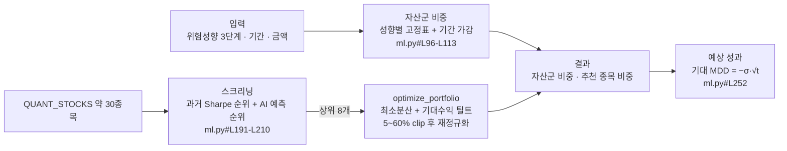

# #5 [분석] A15 과제 명세·문서 현황과 RFP 대비 구현 격차표

> 🗂️ 옛 GitHub 이슈를 옮긴 **기록 문서**입니다 — [색인](../README.md). 원문은 그대로 두고, 링크·커밋 해시만 새 자리 기준으로 바꿨습니다.

| 항목 | 내용 |
|---|---|
| 종류 | 이슈 |
| 상태 | 열림 |
| 원 작성 | 이동원(`devlee328288`) · 2026-09-15 12:29 KST |
| 라벨 | `analysis` `phase-2` `phase-3` |
| 담당 | 이동원(`devlee328288`) |
| 옛 주소 | `github.com/devlee328288/Qurious/issues/5` (지금은 열리지 않음) |

## 본문

### 1. 요약

- 2차 RFP(`rfp-1`·`rfp-2`) 요구를 **36개 항목**으로 나눠 Qurious `04f476a`과 대조했습니다.
  - 결과: ✅ 있음 6 · 🟡 약식 17 · ❌ 없음 12 · ⚠️ 제외 범위 위반 소지 1
- **가장 큰 격차는 자산배분입니다.** RFP가 요구하는 평균분산·Risk Parity·블랙-리터만이 하나도 없고, 최소분산 휴리스틱만 있습니다. 패턴 인식, 시나리오별 성과 비교, 결과 해석 보고서도 없습니다.
- **3차(잠정 기준)** 는 인디케이터 조합과 PineScript 코드 생성까지는 있습니다. 그러나 비용 반영, Profit Factor, Python–Pine 결과 대조 같은 **검증 쪽이 약식**입니다.
- **문서 상태**
  - README가 실제 구조와 다르고, 코드 블록이 깨져 뒤쪽 180줄이 제대로 보이지 않습니다.
  - 교안(docs/01~05)의 코드 해설은 12곳이 현재 코드와 맞지 않습니다.
- **외부 조사**
  - 자산배분 3모델을 모두 내장한 도구는 Riskfolio-Lib입니다. PyPortfolioOpt는 Risk Parity(위험기여 균등)가 내장돼 있지 않습니다.
  - 코스콤 RA 테스트베드 심사항목으로 보면 **리밸런싱 원칙**과 **개인 맞춤성**이 비어 있습니다.

### 2. 위치·규모

| 대상 | 규모 | 성격 | 이 이슈에서 본 것 |
|---|---|---|---|
| [`docs/rfp-1.md`](https://github.com/EST-team-project/Qurious/blob/04f476a/docs/rfp-1.md) | 48줄 | 2차 RFP 요약판. 평가 기준은 "(예시)"로 표기 | 격차표 행 |
| [`docs/rfp-2.md`](https://github.com/EST-team-project/Qurious/blob/04f476a/docs/rfp-2.md) | 190줄 | 2차 RFP 상세판. 수치 기준·산출물·제외 범위 포함 | 격차표 행 |
| [`docs/01~05.md`](https://github.com/EST-team-project/Qurious/tree/04f476a/docs) | 2,263줄 | 모듈 9 교안 5일치(성과지표·워크포워드·계절성·알고리즘 트레이딩·PineScript)와 웹앱 코드 해설 | 3차 잠정 행, 해설 정확도 |
| [`docs/supabase_schema.sql`](https://github.com/EST-team-project/Qurious/blob/04f476a/docs/supabase_schema.sql) | — | Supabase 테이블 스키마 | 코드에서 참조하는지 |
| [`readme.md`](https://github.com/EST-team-project/Qurious/blob/04f476a/readme.md) | 805줄 | 과제 목표·실행 가이드·아키텍처, 뒤쪽에 학습 노트(Neo4j·Celery·IaC·Vector DB) | 구조 일치 여부 |
| [`data/manifest.json`](https://github.com/EST-team-project/Qurious/blob/04f476a/data/manifest.json) | 149줄 | 법률 RAG 문서 매니페스트 | 쓰임새 |
| [`screenshots/`](https://github.com/EST-team-project/Qurious/tree/04f476a/screenshots) | PNG 15장 | README 주요 화면 | 현재 화면과의 차이 |
| [`scripts/take_screenshots.py`](https://github.com/EST-team-project/Qurious/blob/04f476a/scripts/take_screenshots.py) | 93줄 | Playwright 캡처. 저장소의 **유일한 스크립트** | 캡처 범위 |

- `screenshots/`·`scripts/`·`manifest.json`·`supabase_schema.sql`은 최초 등록(`4d0f979`) 이후 바뀐 적이 없습니다.
- `onprem.md`·`pipeline.md`는 README가 "우선 기준"으로 지정한 설계서입니다([readme#L192-L197](https://github.com/EST-team-project/Qurious/blob/04f476a/readme.md#L192-L197)). 내용은 A1·A4에서 다룹니다.
- **테스트 폴더가 없습니다**(`tests/` 0개).

### 3. 역할과 데이터 흐름: 로보어드바이저 핵심 경로

RFP 2차의 중심인 `POST /api/ml/robo/allocation`이 실제로 하는 일입니다.



- 채권·대체자산·현금 비중은 **시세 없이 표로만** 정합니다. 최적화 대상은 주식 바스켓뿐입니다.
- 화면의 "기대 MDD"는 낙폭이 아니라 **변동성을 기간으로 늘린 근사값**입니다.

### 4. RFP 대비 구현 격차표

상태 표기: ✅ 있음 · 🟡 약식(일부만 있거나 요구와 방식이 다름) · ❌ 없음 · ⚠️ 제외 범위 위반 소지
기준: Qurious [`04f476a`](https://github.com/EST-team-project/Qurious/tree/04f476a) · 요구 줄은 같은 커밋의 `docs/rfp-*.md`

#### 4.1 2차 · 로보 어드바이저 (행 = [#4](../issues/004.md)의 2차 평가 관점)

**과업 ① 데이터·예측 모델** (rfp-1 §3.1 · rfp-2 §3.1.1·§3.1.2)

| # | 요구 항목 | RFP 근거 | Qurious 구현 위치 | 상태 | 격차 · 넘길 곳 |
|---|---|---|---|---|---|
| 1 | 시장 데이터 수집·정제 파이프라인 | [rfp-1#L16](https://github.com/EST-team-project/Qurious/blob/04f476a/docs/rfp-1.md#L16) · [rfp-2#L44](https://github.com/EST-team-project/Qurious/blob/04f476a/docs/rfp-2.md#L44) | 1시간 동기화 [sync_scheduler.py#L25](https://github.com/EST-team-project/Qurious/blob/04f476a/app/services/sync_scheduler.py#L25) · 전처리 [quant_pipeline.py#L351-L355](https://github.com/EST-team-project/Qurious/blob/04f476a/app/services/quant_pipeline.py#L351-L355) | 🟡 | 요청할 때마다 Yahoo를 조회해서 **데이터 스냅샷이 고정되지 않습니다**. [#3](../issues/003.md) ① HF 스냅샷 · A4 |
| 2 | 학습·추론 흐름 자동화 | [rfp-1#L16](https://github.com/EST-team-project/Qurious/blob/04f476a/docs/rfp-1.md#L16) | `run_pipeline` [quant_pipeline.py#L338-L400](https://github.com/EST-team-project/Qurious/blob/04f476a/app/services/quant_pipeline.py#L338-L400) | 🟡 | 요청마다 즉석에서 학습합니다. 재학습 일정과 모델 저장이 없습니다. A6 |
| 3 | ML 지도학습 모델 | [rfp-2#L41-L42](https://github.com/EST-team-project/Qurious/blob/04f476a/docs/rfp-2.md#L41-L42) | SVM·RF·GB·MLP·Voting [ml_models.py#L80-L93](https://github.com/EST-team-project/Qurious/blob/04f476a/app/services/ml_models.py#L80-L93) · LightGBM [quant_pipeline.py#L104-L145](https://github.com/EST-team-project/Qurious/blob/04f476a/app/services/quant_pipeline.py#L104-L145) | ✅ | XGBoost·LSTM·Transformer는 없습니다([requirements.txt#L18-L19](https://github.com/EST-team-project/Qurious/blob/04f476a/requirements.txt#L18-L19)는 lightgbm·scikit-learn뿐). README의 "LSTM·Transformer 확장 옵션"([#L147-L150](https://github.com/EST-team-project/Qurious/blob/04f476a/readme.md#L147-L150))은 코드가 없습니다. |
| 4 | 비지도: 군집화로 **시장 국면** 분류 | [rfp-2#L43](https://github.com/EST-team-project/Qurious/blob/04f476a/docs/rfp-2.md#L43) | KMeans·DBSCAN [ml_models.py#L215-L290](https://github.com/EST-team-project/Qurious/blob/04f476a/app/services/ml_models.py#L215-L290) | 🟡 | **종목**을 군집화할 뿐 **시장 국면**을 나누지 않습니다. D5 |
| 5 | 매수·매도·보유 의사결정 규칙 | [rfp-1#L17](https://github.com/EST-team-project/Qurious/blob/04f476a/docs/rfp-1.md#L17) | `rule_based_signals` [quant_pipeline.py#L203-L226](https://github.com/EST-team-project/Qurious/blob/04f476a/app/services/quant_pipeline.py#L203-L226) · 전략 4종 [investment_research.py#L32-L47](https://github.com/EST-team-project/Qurious/blob/04f476a/app/services/investment_research.py#L32-L47) | ✅ | 규칙이 세 곳에 흩어져 있습니다([`_generate_signal` stock.py#L349](https://github.com/EST-team-project/Qurious/blob/04f476a/app/services/stock.py#L349) 포함). A5 |
| 6 | 기술적 차트 패턴(Head & Shoulders·Double Top·삼각형) | [rfp-2#L49](https://github.com/EST-team-project/Qurious/blob/04f476a/docs/rfp-2.md#L49) | — | ❌ | `screen_pattern`은 이름과 달리 RSI·MA·볼린저 점수입니다([investment_research.py#L85-L104](https://github.com/EST-team-project/Qurious/blob/04f476a/app/services/investment_research.py#L85-L104)). |
| 7 | 시계열 패턴(ACF/PACF·ARIMA·Fourier) | [rfp-2#L50](https://github.com/EST-team-project/Qurious/blob/04f476a/docs/rfp-2.md#L50) | — | ❌ | 에이전트 프롬프트의 용어 예시에만 나옵니다([langgraph_agent.py#L57](https://github.com/EST-team-project/Qurious/blob/04f476a/app/services/langgraph_agent.py#L57)). |
| 8 | 딥러닝 패턴 인식(CNN 차트 이미지·LSTM) | [rfp-2#L51](https://github.com/EST-team-project/Qurious/blob/04f476a/docs/rfp-2.md#L51) | sklearn MLP만 [quant_pipeline.py#L155-L185](https://github.com/EST-team-project/Qurious/blob/04f476a/app/services/quant_pipeline.py#L155-L185) | ❌ | GPU가 필요해지면 실행처(로컬/Colab)를 D2에서 정합니다. |
| 9 | 멀티팩터 신호 통합·앙상블 | [rfp-2#L52](https://github.com/EST-team-project/Qurious/blob/04f476a/docs/rfp-2.md#L52) | VotingClassifier [ml_models.py#L86-L93](https://github.com/EST-team-project/Qurious/blob/04f476a/app/services/ml_models.py#L86-L93) · 규칙 점수 합산 | 🟡 | 모델 앙상블은 있지만 **팩터 신호**를 합치는 곳이 없습니다. D5 |
| 10 | 모델 성능지표 정의·측정 | [rfp-2#L45](https://github.com/EST-team-project/Qurious/blob/04f476a/docs/rfp-2.md#L45) | 검증 정확도 [quant_pipeline.py#L139-L140](https://github.com/EST-team-project/Qurious/blob/04f476a/app/services/quant_pipeline.py#L139-L140) · CV [ml_models.py#L124](https://github.com/EST-team-project/Qurious/blob/04f476a/app/services/ml_models.py#L124) | 🟡 | 80/20 분할을 한 번만 합니다([#L115](https://github.com/EST-team-project/Qurious/blob/04f476a/app/services/quant_pipeline.py#L115)). 시계열에 KFold를 써서 누수가 있습니다([#3](../issues/003.md) ②). A6 |

**과업 ② 자산배분** (rfp-1 §3.2 · rfp-2 §3.1.3)

| # | 요구 항목 | RFP 근거 | Qurious 구현 위치 | 상태 | 격차 · 넘길 곳 |
|---|---|---|---|---|---|
| 11 | 평균-분산(Markowitz) | [rfp-1#L20](https://github.com/EST-team-project/Qurious/blob/04f476a/docs/rfp-1.md#L20) · [rfp-2#L56](https://github.com/EST-team-project/Qurious/blob/04f476a/docs/rfp-2.md#L56) | — | ❌ | 화면 도움말은 `mvo`·`risk_parity` 용어를 연결해 두었습니다([app.html#L2820](https://github.com/EST-team-project/Qurious/blob/04f476a/public/app.html#L2820)). 그러나 계산하는 코드는 없습니다. D5 · A7 |
| 12 | 최소분산 포트폴리오 | [rfp-2#L57](https://github.com/EST-team-project/Qurious/blob/04f476a/docs/rfp-2.md#L57) | `optimize_portfolio` [investment_research.py#L222-L245](https://github.com/EST-team-project/Qurious/blob/04f476a/app/services/investment_research.py#L222-L245) | 🟡 | 역공분산의 해석해([#L236-L237](https://github.com/EST-team-project/Qurious/blob/04f476a/app/services/investment_research.py#L236-L237))에 기대수익 틸트를 섞습니다([#L239-L241](https://github.com/EST-team-project/Qurious/blob/04f476a/app/services/investment_research.py#L239-L241)). 그 뒤 5~60%로 잘라 다시 정규화하므로([#L242](https://github.com/EST-team-project/Qurious/blob/04f476a/app/services/investment_research.py#L242)) **최적해가 보장되지 않습니다**. 비용·세금도 반영하지 않습니다([#L245](https://github.com/EST-team-project/Qurious/blob/04f476a/app/services/investment_research.py#L245)). |
| 13 | Risk Parity | [rfp-2#L57](https://github.com/EST-team-project/Qurious/blob/04f476a/docs/rfp-2.md#L57) | — | ❌ | D5 (도구 비교는 5.1) |
| 14 | Black-Litterman(투자자 뷰 반영) | [rfp-2#L58](https://github.com/EST-team-project/Qurious/blob/04f476a/docs/rfp-2.md#L58) | — | ❌ | th01의 BL은 약식입니다([#4](../issues/004.md) §6). D5 |
| 15 | 동적 자산배분(국면별 비중 재조정) | [rfp-2#L59](https://github.com/EST-team-project/Qurious/blob/04f476a/docs/rfp-2.md#L59) | 성향별 고정표 [ml.py#L96-L113](https://github.com/EST-team-project/Qurious/blob/04f476a/app/routes/ml.py#L96-L113) | ❌ | 국면 정의([#4](../issues/004.md)의 VKOSPI 후보)가 먼저 필요합니다. D5 |

**과업 ③ 종목 스크리닝** (rfp-1 §3.2 · rfp-2 §3.1.4)

| # | 요구 항목 | RFP 근거 | Qurious 구현 위치 | 상태 | 격차 · 넘길 곳 |
|---|---|---|---|---|---|
| 16 | 팩터 스크리닝(가치·모멘텀·퀄리티·저변동성) | [rfp-1#L21](https://github.com/EST-team-project/Qurious/blob/04f476a/docs/rfp-1.md#L21) · [rfp-2#L63](https://github.com/EST-team-project/Qurious/blob/04f476a/docs/rfp-2.md#L63) | 과거 Sharpe + AI 예측 순위 [ml.py#L115-L210](https://github.com/EST-team-project/Qurious/blob/04f476a/app/routes/ml.py#L115-L210) | 🟡 | 이름 붙은 팩터 정의가 없습니다. 유니버스는 고정된 약 30종목입니다. D5 |
| 17 | 재무 필터(PER·PBR·ROE 등) | [rfp-2#L64](https://github.com/EST-team-project/Qurious/blob/04f476a/docs/rfp-2.md#L64) | `get_fundamentals` [stock.py#L126-L195](https://github.com/EST-team-project/Qurious/blob/04f476a/app/services/stock.py#L126-L195) | 🟡 | 값을 조회해 화면에 보여주기만 하고, **종목 선정에는 쓰지 않습니다**. |
| 18 | 기술적 스크리닝(정배열·52주 신고가) | [rfp-2#L65](https://github.com/EST-team-project/Qurious/blob/04f476a/docs/rfp-2.md#L65) | `screen_pattern` [investment_research.py#L85-L104](https://github.com/EST-team-project/Qurious/blob/04f476a/app/services/investment_research.py#L85-L104) | 🟡 | 한 종목의 신호만 봅니다. 유니버스 전체 스캔과 52주 신고가 조건이 없습니다. |
| 19 | 복합 점수 랭킹 | [rfp-2#L66](https://github.com/EST-team-project/Qurious/blob/04f476a/docs/rfp-2.md#L66) | `combined_score` [ml.py#L203-L210](https://github.com/EST-team-project/Qurious/blob/04f476a/app/routes/ml.py#L203-L210) | ✅ | 가중치를 이렇게 정한 근거 문서가 없습니다. |

**검증 · 성과지표와 해석** (rfp-1 §3.3·§3.4)

| # | 요구 항목 | RFP 근거 | Qurious 구현 위치 | 상태 | 격차 · 넘길 곳 |
|---|---|---|---|---|---|
| 20 | 수익률·MDD·Sharpe 산출 | [rfp-1#L24](https://github.com/EST-team-project/Qurious/blob/04f476a/docs/rfp-1.md#L24) | `backtest` [quant_pipeline.py#L231-L276](https://github.com/EST-team-project/Qurious/blob/04f476a/app/services/quant_pipeline.py#L231-L276) · `backtest_strategy` [investment_research.py#L50-L82](https://github.com/EST-team-project/Qurious/blob/04f476a/app/services/investment_research.py#L50-L82) | ✅ | **백테스트 엔진이 두 벌이고 비용 처리가 다릅니다.** 한쪽은 비용이 없고([#L241](https://github.com/EST-team-project/Qurious/blob/04f476a/app/services/quant_pipeline.py#L241)), 다른 쪽은 차감합니다([#L60](https://github.com/EST-team-project/Qurious/blob/04f476a/app/services/investment_research.py#L60)). Sharpe는 무위험수익률을 빼지 않습니다([ta_utils.py#L56-L59](https://github.com/EST-team-project/Qurious/blob/04f476a/app/services/ta_utils.py#L56-L59)). A6 · D4 |
| 21 | Win Rate·Profit Factor | [rfp-2#L120](https://github.com/EST-team-project/Qurious/blob/04f476a/docs/rfp-2.md#L120) | 승률 [quant_pipeline.py#L254-L255](https://github.com/EST-team-project/Qurious/blob/04f476a/app/services/quant_pipeline.py#L254-L255) | 🟡 | 승률을 **거래가 아니라 보유일** 기준으로 셉니다. Profit Factor가 없습니다. |
| 22 | 결과 해석 리포트(강점·한계·개선안) | [rfp-1#L25](https://github.com/EST-team-project/Qurious/blob/04f476a/docs/rfp-1.md#L25) · [rfp-2#L118](https://github.com/EST-team-project/Qurious/blob/04f476a/docs/rfp-2.md#L118) | — | ❌ | 1차 결과보고서 형식([#3](../issues/003.md))을 참고합니다. |
| 23 | 기간형 모의투자 수행 | [rfp-1#L28](https://github.com/EST-team-project/Qurious/blob/04f476a/docs/rfp-1.md#L28) | 모의주문 기록 [paper_trading.py#L208-L255](https://github.com/EST-team-project/Qurious/blob/04f476a/app/services/paper_trading.py#L208-L255) · 600초 자동매매 루프 [auto_trade.py#L24](https://github.com/EST-team-project/Qurious/blob/04f476a/app/services/auto_trade.py#L24) | 🟡 | "기간"(시작일·종료일·초기 조건)이라는 개념이 없습니다. 실행 검증도 아직 안 했습니다(S1). A9 · D7 |
| 24 | 거래 의사결정 로그·일지 | [rfp-1#L28](https://github.com/EST-team-project/Qurious/blob/04f476a/docs/rfp-1.md#L28) · [rfp-2#L119](https://github.com/EST-team-project/Qurious/blob/04f476a/docs/rfp-2.md#L119) | 주문 출처 구분 [models/trading.py#L35](https://github.com/EST-team-project/Qurious/blob/04f476a/app/models/trading.py#L35) · 자동매매 사유 [auto_trade.py#L280](https://github.com/EST-team-project/Qurious/blob/04f476a/app/services/auto_trade.py#L280) | 🟡 | 자동매매는 신호 사유를 남깁니다. 그러나 RFP가 말하는 "스크리닝 → 포트폴리오 구성 → 매매" 흐름의 일지 형식은 없고, 수동 모의주문에는 사유 필드가 없습니다. D7 |
| 25 | 시나리오별(상승·하락·횡보) 성과 비교·일관성 검증 | [rfp-1#L29](https://github.com/EST-team-project/Qurious/blob/04f476a/docs/rfp-1.md#L29) | — | ❌ | 국면을 어떻게 나눌지부터 정해야 합니다. D5 |

**수치 기준** ([rfp-2 §7.1 #L131-L139](https://github.com/EST-team-project/Qurious/blob/04f476a/docs/rfp-2.md#L131-L139))

| # | 요구 항목 | RFP 근거 | Qurious 구현 위치 | 상태 | 격차 · 넘길 곳 |
|---|---|---|---|---|---|
| 26 | 방향성 정확도 55% 이상 | [#L135](https://github.com/EST-team-project/Qurious/blob/04f476a/docs/rfp-2.md#L135) | 3분류(매도·관망·매수) 검증 정확도 [quant_pipeline.py#L113](https://github.com/EST-team-project/Qurious/blob/04f476a/app/services/quant_pipeline.py#L113) | 🟡 | RFP의 "상승/하락 방향" 2분류 정확도로 보고하지 않습니다. 분할도 한 번뿐입니다. D5 |
| 27 | 벤치마크(KOSPI) 대비 초과수익 | [#L136](https://github.com/EST-team-project/Qurious/blob/04f476a/docs/rfp-2.md#L136) | 같은 종목 Buy&Hold [quant_pipeline.py#L242](https://github.com/EST-team-project/Qurious/blob/04f476a/app/services/quant_pipeline.py#L242) | 🟡 | KOSPI 지수와 비교하지 않습니다. 벤치마크를 무엇으로 둘지는 5.2 시사점을 보고 D5에서 정합니다. |
| 28 | MDD −20% 이내 · Sharpe 1.0 이상 | [#L137-L138](https://github.com/EST-team-project/Qurious/blob/04f476a/docs/rfp-2.md#L137-L138) | 계산은 [#20](../discussions/020.md) | 🟡 | 기준과 비교해 판정하고 보고하는 형식이 없습니다. 교안은 MDD 합격선을 −15%로 적어 기준이 서로 다릅니다(6절). D5 |
| 29 | 스크리닝 종목이 시장 평균 대비 상위 30% | [#L139](https://github.com/EST-team-project/Qurious/blob/04f476a/docs/rfp-2.md#L139) | — | ❌ | 선정한 종목의 사후 성과를 추적하지 않습니다. |

**정성 평가 · 비기능** (rfp-1 §5 · rfp-2 §3.2·§7.2)

| # | 요구 항목 | RFP 근거 | Qurious 구현 위치 | 상태 | 격차 · 넘길 곳 |
|---|---|---|---|---|---|
| 30 | 자동화 완성도·재현성(시드 고정·결과 재현) | [rfp-1#L39](https://github.com/EST-team-project/Qurious/blob/04f476a/docs/rfp-1.md#L39) · [rfp-2#L72](https://github.com/EST-team-project/Qurious/blob/04f476a/docs/rfp-2.md#L72) | 대부분 `random_state=42` [ml_models.py#L80-L93](https://github.com/EST-team-project/Qurious/blob/04f476a/app/services/ml_models.py#L80-L93) | 🟡 | 시드가 빠진 곳이 있습니다([investment_research.py#L185-L186](https://github.com/EST-team-project/Qurious/blob/04f476a/app/services/investment_research.py#L185-L186)). 데이터 스냅샷이 고정되지 않고([#1](../issues/001.md)), **테스트는 0개**입니다. [#3](../issues/003.md) ①② |
| 31 | 모델 선택 근거·튜닝 과정의 체계성 | [rfp-2#L144](https://github.com/EST-team-project/Qurious/blob/04f476a/docs/rfp-2.md#L144) | 여러 모델 비교 [ml_models.py#L80-L124](https://github.com/EST-team-project/Qurious/blob/04f476a/app/services/ml_models.py#L80-L124) | 🟡 | 사전에 정한 선정 규칙과 시도 기록이 없습니다. [#3](../issues/003.md) ③ |
| 32 | 설계서·분석 보고서 문서화 | [rfp-1#L32](https://github.com/EST-team-project/Qurious/blob/04f476a/docs/rfp-1.md#L32) · [rfp-2#L73](https://github.com/EST-team-project/Qurious/blob/04f476a/docs/rfp-2.md#L73) | — | ❌ | `docs/`에는 RFP와 교안만 있습니다. D5 결론 → ADR·설계서 |

**산출물(선택) · 제외 범위 · 기타** (rfp-2 §6.2·§4.2·§10)

| # | 요구 항목 | RFP 근거 | Qurious 구현 위치 | 상태 | 격차 · 넘길 곳 |
|---|---|---|---|---|---|
| 33 | 대시보드(선택) | [rfp-2#L124](https://github.com/EST-team-project/Qurious/blob/04f476a/docs/rfp-2.md#L124) | SPA GNB 9개 [app.html#L659-L667](https://github.com/EST-team-project/Qurious/blob/04f476a/public/app.html#L659-L667) | ✅ | RFP 예시인 Streamlit·Dash가 아니라 SPA로 대체했습니다. A13 |
| 34 | 수집 → 스크리닝 → 리밸런싱 자동화(선택) | [rfp-2#L125](https://github.com/EST-team-project/Qurious/blob/04f476a/docs/rfp-2.md#L125) | — | ❌ | 리밸런싱 규칙 자체가 없습니다. D5 |
| 35 | **실계좌 자동주문 제외** | [rfp-2#L92](https://github.com/EST-team-project/Qurious/blob/04f476a/docs/rfp-2.md#L92) | live 모드 실주문 [auto_trade.py#L154-L165](https://github.com/EST-team-project/Qurious/blob/04f476a/app/services/auto_trade.py#L154-L165) (`paper=False`) | ⚠️ | 기본값은 paper입니다([stocks.py#L350](https://github.com/EST-team-project/Qurious/blob/04f476a/app/routes/stocks.py#L350)). 그러나 설정만 바꾸면 **실계좌로 주문이 나갑니다**. 막을지는 D7에서 정합니다. A9 |
| 36 | "투자 권유 아님"·과거 성과 미보장 고지 | [rfp-2#L186-L187](https://github.com/EST-team-project/Qurious/blob/04f476a/docs/rfp-2.md#L186-L187) | [app.html#L1243](https://github.com/EST-team-project/Qurious/blob/04f476a/public/app.html#L1243) · [#L3160](https://github.com/EST-team-project/Qurious/blob/04f476a/public/app.html#L3160) | ✅ | LEAN 화면과 자산배분 결과에는 있습니다. 모의투자 화면에 있는지는 A13에서 확인합니다. |

#### 4.2 3차 · 커스텀 인디케이터 (잠정 행)

3차는 별도 명세가 없습니다([#4](../issues/004.md)). 그래서 과제 5줄([readme#L11-L16](https://github.com/EST-team-project/Qurious/blob/04f476a/readme.md#L11-L16), th01 커리큘럼과 같은 문구)과 교안 합격 기준([docs/05#L58-L59](https://github.com/EST-team-project/Qurious/blob/04f476a/docs/05.md#L58-L59) · [#L89-L90](https://github.com/EST-team-project/Qurious/blob/04f476a/docs/05.md#L89-L90))을 **잠정 행**으로 둡니다. 강사님 확인 후 바꿉니다.

| # | 잠정 요구 | 근거 | Qurious 구현 위치 | 상태 | 격차 · 넘길 곳 |
|---|---|---|---|---|---|
| P1 | 기본 인디케이터(MA·RSI)로 전략 설계 | [readme#L12](https://github.com/EST-team-project/Qurious/blob/04f476a/readme.md#L12) | `rsi`·`ma` 전략 [investment_research.py#L34-L38](https://github.com/EST-team-project/Qurious/blob/04f476a/app/services/investment_research.py#L34-L38) | ✅ | 같은 RSI라도 계산 방식이 다릅니다. 이 경로는 EWM([#L21](https://github.com/EST-team-project/Qurious/blob/04f476a/app/services/investment_research.py#L21))이고 커스텀 경로는 SMA 기본값([quant_pipeline.py#L429](https://github.com/EST-team-project/Qurious/blob/04f476a/app/services/quant_pipeline.py#L429))입니다. [#3](../issues/003.md) ④ · A5 |
| P2 | 커스텀 인디케이터 개발 | [readme#L13](https://github.com/EST-team-project/Qurious/blob/04f476a/readme.md#L13) | `backtest_custom_indicator` 4조합 [quant_pipeline.py#L403-L476](https://github.com/EST-team-project/Qurious/blob/04f476a/app/services/quant_pipeline.py#L403-L476) · 저장 [stocks.py#L769](https://github.com/EST-team-project/Qurious/blob/04f476a/app/routes/stocks.py#L769) | 🟡 | 미리 정한 4가지 조합의 **파라미터만 조절**합니다. 새 지표를 정의할 수는 없습니다. A5 · D6 |
| P3 | TradingView PineScript로 성과 확인·코딩 | [readme#L14](https://github.com/EST-team-project/Qurious/blob/04f476a/readme.md#L14) | Pine 코드 생성 [app.html#L3315](https://github.com/EST-team-project/Qurious/blob/04f476a/public/app.html#L3315) · Pine 모의주문 [paper.py#L115-L118](https://github.com/EST-team-project/Qurious/blob/04f476a/app/routes/paper.py#L115-L118) | 🟡 | 코드를 생성하는 데까지만 합니다. TradingView 전략 테스터 결과를 받아 오거나 기록하는 경로가 없습니다. |
| P4 | 파이썬으로 성과 검증 | [readme#L15](https://github.com/EST-team-project/Qurious/blob/04f476a/readme.md#L15) | `backtest` 경유 [quant_pipeline.py#L456](https://github.com/EST-team-project/Qurious/blob/04f476a/app/services/quant_pipeline.py#L456) | 🟡 | 비용을 반영하지 않습니다([#L241](https://github.com/EST-team-project/Qurious/blob/04f476a/app/services/quant_pipeline.py#L241)). 워크포워드도 없습니다. LightGBM 신호는 학습 구간을 포함한 전체 구간에 예측해 백테스트하므로([#L363-L364](https://github.com/EST-team-project/Qurious/blob/04f476a/app/services/quant_pipeline.py#L363-L364)) **in-sample**입니다. A6 · D4 |
| P5 | 증권사 API 연동 자동화 | [readme#L16](https://github.com/EST-team-project/Qurious/blob/04f476a/readme.md#L16) | 가상계좌 자동매매와 live 주문 [auto_trade.py#L139-L176](https://github.com/EST-team-project/Qurious/blob/04f476a/app/services/auto_trade.py#L139-L176) | 🟡 | KIS 모의투자(vps)를 쓰지 않습니다([#4](../issues/004.md)). live는 [#35](../pulls/035.md)와 부딪힙니다. A8 · A9 · D7 |
| P6 | 합격 기준: Profit Factor > 1.5 · MDD > −15% · Sharpe > 1.0 **동시 충족** | [docs/05#L58-L59](https://github.com/EST-team-project/Qurious/blob/04f476a/docs/05.md#L58-L59) | MDD·Sharpe만([#20](../discussions/020.md)) | 🟡 | Profit Factor와 동시 충족 판정 로직이 없습니다. D6 |
| P7 | Python과 PineScript 결과의 방향성 일치 | [docs/05#L89-L90](https://github.com/EST-team-project/Qurious/blob/04f476a/docs/05.md#L89-L90) | — | ❌ | 두 결과를 비교하는 절차와 기록이 없습니다. D6 |

### 5. 외부 조사 (조회일 2026-09-15 KST)

**코드로 답한 것**: 4절 격차표와 6절 문서 품질
**외부 조사로 답한 것**: 아래 5.1 자산배분 도구, 5.2 국내 RA 제도·시장

#### 5.1 자산배분 구현 도구: PyPortfolioOpt vs Riskfolio-Lib

rfp-2가 권장 스택으로 적은 도구입니다([#L160](https://github.com/EST-team-project/Qurious/blob/04f476a/docs/rfp-2.md#L160)). Qurious에는 둘 다 설치돼 있지 않습니다([requirements.txt#L18-L19](https://github.com/EST-team-project/Qurious/blob/04f476a/requirements.txt#L18-L19)).

| 항목 | PyPortfolioOpt | Riskfolio-Lib |
|---|---|---|
| 최신 버전 | **1.6.0** (2026-02-26) | **7.3.0** (2026-05-31) |
| 라이선스 | MIT | BSD-3-Clause |
| 지원 Python | 3.10~3.14 | 3.10 이상 |
| 평균-분산 | ✅ | ✅ |
| Black-Litterman | ✅ | ✅ |
| **Risk Parity(위험기여 균등)** | ❌ 내장 없음. HRP·CLA만 제공하고, 나머지는 사용자 정의 최적화기로 직접 구현 | ✅ |
| 계층적 위험 패리티(HRP) | ✅ | ✅ |
| 위험척도 | 분산·CVaR 등 | 26종(CVaR·최대낙폭 등) |
| 핵심 의존성 | cvxpy, scikit-learn(공분산 축소) | cvxpy ≥ 1.7.2, clarabel, scs, scikit-learn ≥ 1.7 |
| 유지보수 | PyPortfolio 조직으로 이관됐고, 1.6.0에서 pandas 3·Python 3.14를 지원 | 2020년 첫 릴리스 이후 꾸준히 갱신. 2026-02 CVXPY 워크숍에서 발표 |

- **RFP의 세 모델(평균분산·RP·BL)을 모두 내장한 쪽은 Riskfolio-Lib입니다.** PyPortfolioOpt를 쓰면 Risk Parity를 직접 구현해야 합니다.
- Qurious는 Python 3.12라서 둘 다 설치 조건을 만족합니다([readme#L54](https://github.com/EST-team-project/Qurious/blob/04f476a/readme.md#L54)). 다만 Riskfolio-Lib는 scikit-learn ≥ 1.7이 필요해, 지금 핀(`>=1.4.0`)을 올려야 합니다.
- 둘 다 무료 오픈소스이므로 비용 문제는 없습니다. 어느 쪽을 쓸지는 **D5**에서 정합니다.

#### 5.2 국내 로보어드바이저(RA) 테스트베드·규제 배경

**제도 흐름**

| 시점 | 내용 | 출처 |
|---|---|---|
| 2016-08 | 금융위원회가 RA 자문·일임 서비스 도입을 발표하고, 코스콤이 테스트베드를 구축·운영 | [코스콤 RA 테스트베드](https://www.koscom.co.kr/portal/main/contents.do?menuNo=200590) |
| 2019-03-20 | RA 비대면 투자일임계약의 자기자본 요건(40억 원) 폐지 | [금융위 2019-05-15](https://www.fsc.go.kr/no010101/73686) |
| 2019-06-03 | **개인도 테스트베드 참여 가능**(접수 시작) | 같은 자료 |
| 2019-07-24 | RA의 펀드재산 직접 운용, 비(非)운용사 RA 업체에 대한 운용 위탁 허용(시행 예정) | 같은 자료 |
| 2023-06 | 테스트베드 **사후운용심사** 도입 | [코스콤 뉴스룸 2026-01-28](https://www.koscom.co.kr/portal/bbs/B0000064/view.do?nttId=30513&menuNo=200629) |
| 2024-12-24 | 퇴직연금 RA 일임서비스를 혁신금융서비스로 신규 지정(17건) | [금융위 2024-12-24](https://www.fsc.go.kr/no010101/83716) |
| 2025-03-28 | 퇴직연금 RA 일임서비스 순차 출시 | [금융위 2025-03-27](https://www.fsc.go.kr/no010101/84247) |

**테스트베드 심사**
- 단계: 사전심사 0.5개월 → 본심사 6개월(포트폴리오 운용·시스템) → 최종심의 0.5개월
- 심사항목 10개
  - 참여요건
  - 알고리즘의 합리성(설명의 합리성·테스트 결과의 신뢰성)
  - **개인 맞춤성**(투자자 성향 분석, 성향별로 유의미하게 구분되는 복수 포트폴리오)
  - **분산투자**
  - **합리적인 리밸런싱**(발생 기준과 원칙, 유효한 실행)
  - 다계좌 운용
  - 법규 준수(금지 투자 방지)
  - 유지보수 인력
  - 보안성
  - 안정성
- 운용실적 공시: 3개월 수익률이 "동일유형 3개월 수익률 평균 − 표준편차 × 3"보다 낮으면 주의 대상 그룹으로 분류합니다([공시기준](https://www.ratestbed.kr:7443/portal/main/contents.do?menuNo=200239)).

**시장 규모** ([코스콤 뉴스룸 2026-01-28](https://www.koscom.co.kr/portal/bbs/B0000064/view.do?nttId=30513&menuNo=200629))
- 2025년 말 RA 계약자는 **37만 4,853명**(전년 대비 약 4.9만 명 증가), 가입 금액은 **1조 1,742억 원**(약 2,500억 원 증가)입니다.
- 테스트베드에는 누적 145개사·906개 알고리즘이 참여했고, 116개사·725개 알고리즘이 통과했습니다(통과율 약 80%).
- 2025년 RA 알고리즘 평균 수익률은 **14.89%** 로, 같은 기간 KOSPI **75.63%**·S&P500 16.39%에 못 미쳤습니다.

**Qurious 시사점**

| 테스트베드 심사항목 | Qurious 현황 | 상태 | 넘길 곳 |
|---|---|---|---|
| 개인 맞춤성 | 위험성향 3단계 선택만 있습니다([ml.py#L61-L64](https://github.com/EST-team-project/Qurious/blob/04f476a/app/routes/ml.py#L61-L64)). 성향 설문이 없습니다. | 🟡 | **D1** |
| 분산투자 | 종목 비중 5~60% 제한, 자산군 고정표 | 🟡 | D5 |
| 합리적 리밸런싱 | 없음 | ❌ | D5 |
| 알고리즘 설명·테스트 신뢰성 | in-sample 백테스트, 엔진 두 벌의 비용 불일치 | 🟡 | A6 · D4 |
| 법규 준수 | live 실주문 경로 | ⚠️ | D7 |

- 학습 프로젝트는 테스트베드 심사 대상이 아닙니다. 그래도 심사항목은 **"RA가 갖춰야 할 최소 요건"을 공개한 외부 기준**이므로, D1(누구에게)과 D5(설계)의 체크리스트로 쓸 수 있습니다.
- 2025년은 자산배분형 RA가 강세장에서 KOSPI에 크게 뒤진 해입니다. rfp-2의 "KOSPI 대비 초과수익" 기준을 그대로 쓰면 자산배분형 설계에 불리할 수 있으므로, **벤치마크 선택을 D5에서 명시적으로** 다룹니다.
- 실제 자문·일임은 등록과 테스트베드 통과가 필요합니다. 이는 RFP 제외 범위의 "타인 자산 운용"([rfp-2#L93](https://github.com/EST-team-project/Qurious/blob/04f476a/docs/rfp-2.md#L93))과 같은 선이므로, 발표와 화면에서 "투자 권유 아님"을 유지합니다([#36](../pulls/036.md)).

**출처** (모두 2026-09-15 KST 조회)
- PyPI [riskfolio-lib](https://pypi.org/project/riskfolio-lib/) · [pyportfolioopt](https://pypi.org/project/pyportfolioopt/)
- [PyPortfolioOpt Releases](https://github.com/PyPortfolio/PyPortfolioOpt/releases) · [PyPortfolioOpt Other Optimizers 문서](https://pyportfolioopt.readthedocs.io/en/latest/OtherOptimizers.html)
- [코스콤 RA 테스트베드 소개](https://www.koscom.co.kr/portal/main/contents.do?menuNo=200590) · [코스콤 뉴스룸(2026-01-28)](https://www.koscom.co.kr/portal/bbs/B0000064/view.do?nttId=30513&menuNo=200629) · [RA 테스트베드 운용실적 공시기준](https://www.ratestbed.kr:7443/portal/main/contents.do?menuNo=200239)
- 금융위원회 보도자료 [2019-05-15](https://www.fsc.go.kr/no010101/73686) · [2024-12-24](https://www.fsc.go.kr/no010101/83716) · [2025-03-27](https://www.fsc.go.kr/no010101/84247)

### 6. 품질 관찰: 문서 현황

**README**
- [ ] **실제 구조와 다릅니다.**
  - README는 MongoDB·SQLite 기준입니다([#L94-L117](https://github.com/EST-team-project/Qurious/blob/04f476a/readme.md#L94-L117) · [#L199-L222](https://github.com/EST-team-project/Qurious/blob/04f476a/readme.md#L199-L222) · [#L283-L285](https://github.com/EST-team-project/Qurious/blob/04f476a/readme.md#L283-L285)).
  - 실제 코드는 PostgreSQL입니다([data_cache.py#L1](https://github.com/EST-team-project/Qurious/blob/04f476a/app/services/data_cache.py#L1)). README도 이 사실을 [#L197](https://github.com/EST-team-project/Qurious/blob/04f476a/readme.md#L197)에서 스스로 경고합니다.
- [ ] **실행 포트가 서로 다릅니다.**
  - Docker 전체 실행 뒤 접속 주소를 `localhost:8000`으로 안내합니다([#L270](https://github.com/EST-team-project/Qurious/blob/04f476a/readme.md#L270)).
  - 실제 compose 매핑은 `8966:8000`이고([docker-compose.yml#L58](https://github.com/EST-team-project/Qurious/blob/04f476a/docker-compose.yml#L58)), Open API 예시도 8966을 씁니다([#L316](https://github.com/EST-team-project/Qurious/blob/04f476a/readme.md#L316)).
- [ ] **ML 파이프라인 도식이 실제와 다릅니다.**
  - 도식은 Alpaca로 실제 주문을 내고 MongoDB에 기록한다고 그립니다([#L173-L176](https://github.com/EST-team-project/Qurious/blob/04f476a/readme.md#L173-L176)).
  - 실제로는 키가 없으면 mockup 응답만 돌려줍니다([quant_pipeline.py#L324-L333](https://github.com/EST-team-project/Qurious/blob/04f476a/app/services/quant_pipeline.py#L324-L333)).
- [ ] **AWS를 제거한 뒤에도 EC2·S3 안내가 남아 있습니다**(Qdrant 구성 [#L359-L389](https://github.com/EST-team-project/Qurious/blob/04f476a/readme.md#L359-L389), IaC 보고서 [#L681-L749](https://github.com/EST-team-project/Qurious/blob/04f476a/readme.md#L681-L749)).
- [ ] **코드 블록이 깨져 뒤쪽이 제대로 보이지 않습니다.**
  - [#L621](https://github.com/EST-team-project/Qurious/blob/04f476a/readme.md#L621)의 ` ```cypher `가 닫히지 않았습니다.
  - 그래서 #L647이 이 블록을 닫고 #L653이 새 블록을 여는데, 그 블록이 끝까지 닫히지 않습니다.
  - 결과적으로 **#L654~#L805(Celery 후반·IaC·Vector DB)가 통째로 코드로 렌더링**됩니다.
- [ ] **후반 #L602~#L805는 프로젝트와 무관한 학습 노트입니다.** 과제 설명과 섞여 있습니다.
- [ ] **화면 이름이 바뀌었습니다.** README는 GNB `company`를 "기업 분석"이라고 부르지만, 현재 이름은 "투자 인디케이터"입니다([app.html#L665](https://github.com/EST-team-project/Qurious/blob/04f476a/public/app.html#L665)).

**교안 docs/01~05** (강사님 교안이라 수정하지 않습니다. 코드 위치를 참고할 때만 주의합니다.)
- [ ] **코드 해설의 줄 번호와 사실 12곳이 현재 코드와 다릅니다.**

| 교안 위치 | 교안 서술 | `04f476a` 실제 |
|---|---|---|
| [01#L201](https://github.com/EST-team-project/Qurious/blob/04f476a/docs/01.md#L201) | MDD 계산 quant_pipeline.py 242~266 | [#L250-L251](https://github.com/EST-team-project/Qurious/blob/04f476a/app/services/quant_pipeline.py#L250-L251) |
| [01#L218](https://github.com/EST-team-project/Qurious/blob/04f476a/docs/01.md#L218) | `/quant/pipeline` stocks.py 626 | [#L733](https://github.com/EST-team-project/Qurious/blob/04f476a/app/routes/stocks.py#L733) |
| [02#L143](https://github.com/EST-team-project/Qurious/blob/04f476a/docs/02.md#L143) | 80/20 분할 122~132 | [#L115-L117](https://github.com/EST-team-project/Qurious/blob/04f476a/app/services/quant_pipeline.py#L115-L117) |
| [02#L169](https://github.com/EST-team-project/Qurious/blob/04f476a/docs/02.md#L169) | `QuantSettingsBody` stocks.py 249~265 | [#L345](https://github.com/EST-team-project/Qurious/blob/04f476a/app/routes/stocks.py#L345) |
| [02#L185-L191](https://github.com/EST-team-project/Qurious/blob/04f476a/docs/02.md#L185-L191) | 1시간 동기화 = "매 시간 리밸런싱" | 시세 캐시를 갱신할 뿐 리밸런싱과 무관([sync_scheduler.py#L25](https://github.com/EST-team-project/Qurious/blob/04f476a/app/services/sync_scheduler.py#L25)) |
| [03#L142](https://github.com/EST-team-project/Qurious/blob/04f476a/docs/03.md#L142) | `MACRO_SYMBOLS` routes/macro.py 9~19 | 정의 위치는 [sync_scheduler.py#L37](https://github.com/EST-team-project/Qurious/blob/04f476a/app/services/sync_scheduler.py#L37), macro.py는 import만 함 |
| [03#L161-L184](https://github.com/EST-team-project/Qurious/blob/04f476a/docs/03.md#L161-L184) | data_cache가 MongoDB | PostgreSQL([data_cache.py#L1-L14](https://github.com/EST-team-project/Qurious/blob/04f476a/app/services/data_cache.py#L1-L14)) |
| [04#L162](https://github.com/EST-team-project/Qurious/blob/04f476a/docs/04.md#L162) | `rule_based_signals` 212~236 | [#L203-L226](https://github.com/EST-team-project/Qurious/blob/04f476a/app/services/quant_pipeline.py#L203-L226) |
| [04#L188](https://github.com/EST-team-project/Qurious/blob/04f476a/docs/04.md#L188) | `_generate_signal` stock.py 185~238 | [#L349](https://github.com/EST-team-project/Qurious/blob/04f476a/app/services/stock.py#L349) |
| [04#L240](https://github.com/EST-team-project/Qurious/blob/04f476a/docs/04.md#L240) | `broker_order` stocks.py 504~530 | [#L590](https://github.com/EST-team-project/Qurious/blob/04f476a/app/routes/stocks.py#L590) |
| [04#L274](https://github.com/EST-team-project/Qurious/blob/04f476a/docs/04.md#L274) | 자동매매 30분(1800초) 주기 | 600초([auto_trade.py#L24](https://github.com/EST-team-project/Qurious/blob/04f476a/app/services/auto_trade.py#L24)) |
| [05#L211](https://github.com/EST-team-project/Qurious/blob/04f476a/docs/05.md#L211) · [#L261](https://github.com/EST-team-project/Qurious/blob/04f476a/docs/05.md#L261) | `backtest` 241~290, 수수료 없는 줄 257 | [#L231-L276](https://github.com/EST-team-project/Qurious/blob/04f476a/app/services/quant_pipeline.py#L231-L276) · [#L241](https://github.com/EST-team-project/Qurious/blob/04f476a/app/services/quant_pipeline.py#L241). 단, `strategy`를 지정하면 비용을 차감하는 경로도 있음([stocks.py#L743](https://github.com/EST-team-project/Qurious/blob/04f476a/app/routes/stocks.py#L743)) |

- [ ] **합격선이 문서마다 다릅니다.**
  - 교안은 MDD −15%입니다([01#L43](https://github.com/EST-team-project/Qurious/blob/04f476a/docs/01.md#L43) · [05#L59](https://github.com/EST-team-project/Qurious/blob/04f476a/docs/05.md#L59)).
  - rfp-2는 −20%입니다([#L137](https://github.com/EST-team-project/Qurious/blob/04f476a/docs/rfp-2.md#L137)). Sharpe 1.0은 둘이 같습니다.
  - → 2차는 D5, 3차는 D6에서 기준을 정합니다.

**data · docs 부속물 · 스크린샷 · 스크립트**
- [ ] **`data/manifest.json`은 금융 과제와 무관합니다.**
  - 법률 RAG 샘플(임금체불 가이드·여권법·헌재 결정 등)입니다([#L14-L147](https://github.com/EST-team-project/Qurious/blob/04f476a/data/manifest.json#L14-L147)).
  - 가리키는 `data/raw/**` 파일이 저장소에 없습니다.
  - **코드도 이 매니페스트를 읽지 않습니다.** `/ingest/local-docs`는 `data/raw/*.md`를 직접 순회합니다([ingest.py#L87-L97](https://github.com/EST-team-project/Qurious/blob/04f476a/app/routes/ingest.py#L87-L97)).
  - [pipeline.md#L88](https://github.com/EST-team-project/Qurious/blob/04f476a/pipeline.md#L88)만 이 파일을 언급합니다. 들어온 경위는 확인하지 못했습니다.
- [ ] **`docs/supabase_schema.sql`은 코드 어디에서도 참조하지 않습니다**(Supabase를 쓰는 코드가 없음).
- [ ] **스크린샷이 현재 화면을 반영하지 못합니다.**
  - 15장 모두 최초 등록 이후 갱신되지 않았고, README는 "API Mock 기반" 캡처라고 적었습니다([#L510](https://github.com/EST-team-project/Qurious/blob/04f476a/readme.md#L510)).
  - 캡처 목록은 GNB 5개(agent·quant·us·company·trading)만 다룹니다([take_screenshots.py#L18-L32](https://github.com/EST-team-project/Qurious/blob/04f476a/scripts/take_screenshots.py#L18-L32)).
  - 현재 GNB 9개 중 **모의투자·ML·투자분석·크롤링 화면이 없습니다**([app.html#L659-L667](https://github.com/EST-team-project/Qurious/blob/04f476a/public/app.html#L659-L667)).
- [ ] **`scripts/`에는 캡처 스크립트 하나뿐입니다.**
  - 로컬 테스트 계정이 하드코딩돼 있고([#L10-L11](https://github.com/EST-team-project/Qurious/blob/04f476a/scripts/take_screenshots.py#L10-L11)), 실행 경로는 Linux 기준입니다([#L3](https://github.com/EST-team-project/Qurious/blob/04f476a/scripts/take_screenshots.py#L3)).
  - 데이터 수집·검증·리포트 스크립트는 없습니다.
- [ ] **테스트가 0개입니다.** 재현성 평가([#30](../discussions/030.md))의 가장 큰 공백입니다.
- [x] rfp-1·rfp-2·docs/01~05는 강사님 원본 `6d91401`의 사본으로 반영돼 있습니다(S1 · PR [#2](../pulls/002.md)).

### 7. 2.0 관점 1차 판정 (확정은 D3·D5·D6)

| 대상 | 판정 | 근거 · 이어지는 곳 |
|---|---|---|
| rfp-1·rfp-2 | **기준 유지** | 4.1 격차표를 D5의 요구사항 체크리스트로 씁니다. |
| 3차 잠정 행(P1~P7) | **잠정 유지** | 강사님께 3차 명세를 확인하기 전까지 씁니다([#1](../issues/001.md) 열린 질문). |
| `optimize_portfolio` 최소분산 휴리스틱 | **교체 후보** | RFP 3모델을 충족하지 못합니다. 검증된 라이브러리(5.1)로 바꿀지 D5에서 정합니다. A7 |
| `robo_allocation`의 성향 고정표·기대 MDD 근사 | **개선** | 자산군 비중이 데이터와 무관하고, "MDD" 표기가 오해를 부릅니다. D1 · D5 |
| 스크리닝(`combined_score`·`screen_pattern`·`get_fundamentals`) | **개선** | 팩터를 정의하고, 재무 필터를 연결하고, 선정 종목의 사후 성과를 추적합니다. D5 |
| 백테스트 두 벌 | **통합 후보** | 비용 처리가 서로 다릅니다. 1차 비용 차감 지표([#3](../issues/003.md) ②)로 통일합니다. A6 · D4 |
| 커스텀 인디케이터·Pine 코드 생성기 | **유지 · 검증 보강** | 3차 과업과 직결됩니다. Profit Factor와 Python–Pine 대조 절차를 더합니다. A5 · D6 |
| live 실주문 경로 | **차단 후보** | RFP 제외 범위에 걸립니다. D7 · A9 |
| `readme.md` | **재작성 후보** | 구조가 다르고, 렌더링이 깨졌고, 학습 노트가 섞였습니다. D3에서 범위를 정한 뒤 PR로 고칩니다. |
| docs/01~05 교안 | **원문 보존** | 강사님 교안이므로 고치지 않습니다. 팀 문서에서는 코드 위치를 직접 링크합니다. |
| `data/manifest.json`·`docs/supabase_schema.sql` | **폐기 후보** | 코드에서 참조하지 않습니다. D3 |
| `screenshots/`·`take_screenshots.py` | **갱신 후보** | 발표 전에 현재 화면으로 다시 캡처합니다. A13 |

### 8. 관련 · 확인 요청

- 인덱스: [#1](../issues/001.md) · 1차 유산: [#3](../issues/003.md) · 강사님 자료: [#4](../issues/004.md)
- 입력으로 쓰는 논의
  - **D1** 목표 (개인 맞춤성)
  - **D3** 범위 (README·부속물 정리)
  - **D5** 2차 설계 (자산배분 도구·벤치마크·수치 기준 보고 형식·리밸런싱)
  - **D6** 3차 설계 (합격선·Python–Pine 대조)
  - **D7** 모의투자 (live 차단·의사결정 일지)
- 관련 분석: A5 · A6 · A7 · A9 · A13
- 행별 확인을 부탁드립니다. 틀린 곳은 댓글로 알려주세요.
  - [ ] 성과지표·백테스트 행([#20](../discussions/020.md)~[#29](../discussions/029.md)): `@rkdalstjr`
  - [ ] 모델 행([#3](../issues/003.md)·[#4](../issues/004.md)·[#8](../issues/008.md)~[#10](../discussions/010.md)·[#31](../issues/031.md)): `@GoonGuMa`
  - [ ] 3차 인디케이터 행(P1~P7): `@janghwan-god`
