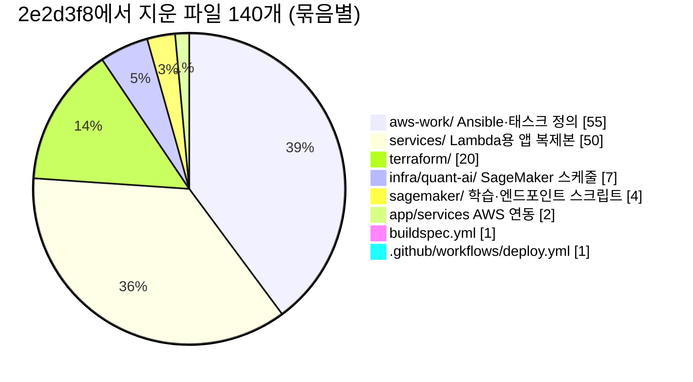
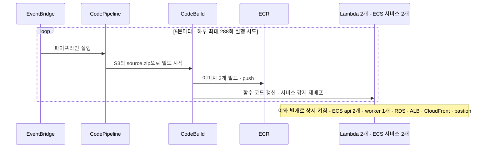
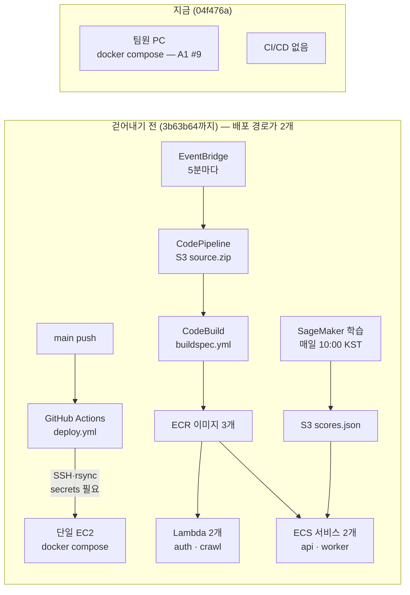
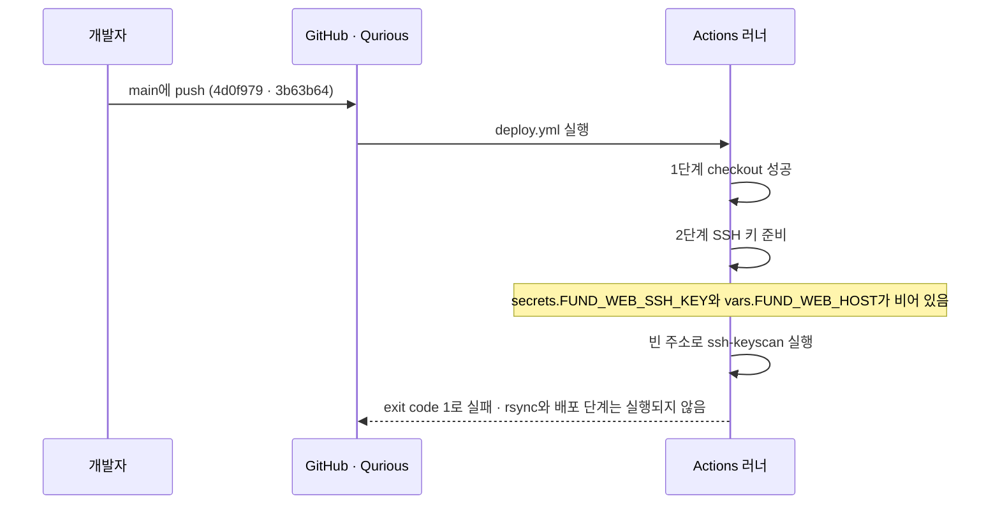

# #8 [분석] A14 클라우드 인프라·CI/CD — 걷어낸 것·남은 것·무료로 할 수 있는 것

> 🗂️ 옛 GitHub 이슈를 옮긴 **기록 문서**입니다 — [색인](../README.md). 원문은 그대로 두고, 링크·커밋 해시만 새 자리 기준으로 바꿨습니다.

| 항목 | 내용 |
|---|---|
| 종류 | 이슈 |
| 상태 | 열림 |
| 원 작성 | 이동원(`devlee328288`) · 2026-09-15 14:03 KST |
| 라벨 | `analysis` `infra-cost` |
| 옛 주소 | `github.com/devlee328288/Qurious/issues/8` (지금은 열리지 않음) |

## 본문

> **읽는 순서**: 쉬운 요약 → 한눈에 보기 → 7. 2.0 판정 → 5.3 D2에 넘길 선택지 → 필요하면 나머지
> 💬 **논의할 곳**: 데모 방식·유료 서비스 범위는 **D2**(인프라·비용)에서 정합니다. 이 이슈는 현황만 적습니다.

## 쉬운 요약 (3줄)

1. 강사님 원본의 AWS 배포 장치(파일 138개, Terraform 자원 110개)는 S1([PR #2](../pulls/002.md))에서 **모두 걷어냈고**, 지금(`04f476a`) 저장소에는 **자동 검사·배포(CI/CD)가 하나도 없습니다.**
2. 걷어내기 전 자동 배포는 팀 저장소에 비밀값이 없어 **push할 때마다 첫 단계에서 실패**했습니다(2회 중 2회 실패). 과제 명세도 **"상용 서비스 배포 및 운영"을 제외 범위**로 둡니다.
3. 남은 일은 ① 문서 속 AWS 안내와 끊긴 링크 정리 ② **돈이 들지 않는 검사(CI)와 데모 방식**을 D2에서 고르는 것입니다. "무료"로 알려진 HF Docker Space는 **지금은 유료 플랜이 있어야 만들 수 있습니다.**

## 한눈에 보기

| 구분 | 걷어내기 전 (`3b63b64`) | 지금 (`04f476a`) | 2.0 판정 후보 |
|---|---|---|---|
| AWS 인프라 코드 | 파일 138개 · Terraform 자원 110개 | 없음 | 폐기 유지 |
| 앱의 AWS 연동 | Bedrock · SageMaker · Comprehend · S3 | 없음 ("제거했다" 주석 3줄) | 폐기 유지 |
| 자동 배포 (CD) | 경로 2개: Actions → EC2 / CodePipeline → ECS·Lambda | 없음 | 폐기. 필요하면 D2 뒤 새로 작성 |
| 자동 검사 (CI) | 없음 | 없음 | **신규 도입 후보 (0원)** |
| 문서 속 AWS 안내 | README "AWS 이관 가이드" · 비용 행 | `onprem.md`·`pipeline.md`에 끊긴 링크 5종 | 개선 |
| 월 비용 | 강사님 추정 30만~150만 원+ (AWS 병행 시) | 0원 (팀원 PC) | D2 |
| 데모 | 강사님 운영 서버(`fund-web` EC2) | 없음 | D2 (0원 후보 4개) |

## 용어 풀이

| 용어 | 뜻 |
|---|---|
| CI / CD | 코드를 올릴 때마다 자동으로 **검사**(CI)하고 서버에 **배포**(CD)하는 장치 |
| GitHub Actions | GitHub가 제공하는 CI/CD 실행기. `.github/workflows/*.yml`에 적은 작업을 GitHub 서버에서 돌립니다. |
| Secrets | 워크플로가 쓰는 비밀값(SSH 키·토큰) 보관함. **저장소마다 따로 등록**해야 해서, 코드를 복사해도 따라오지 않습니다. |
| IaC · Terraform | 서버·DB·네트워크 같은 클라우드 자원을 **코드로 적어** 만들고 지우는 방식과 그 도구 |
| ECS · RDS · ALB · CloudFront | AWS의 컨테이너 실행 · 관리형 DB · 로드밸런서 · CDN(정적 파일 배포망) 서비스 |
| SageMaker | AWS의 모델 학습·서빙 서비스. 켜 둔 시간만큼 요금이 붙습니다. |
| 터널 (Tunnel) | 내 PC에서 도는 앱을 **임시 공개 주소**로 열어 주는 도구(Cloudflare Quick Tunnel, ngrok) |
| 정적 사이트 | 서버 계산 없이 HTML·CSS·JS 파일만 내려주는 사이트(GitHub Pages, HF Static Space) |
| SSE | 서버가 브라우저로 데이터를 계속 흘려보내는 방식(Server-Sent Events). 일부 터널이 지원하지 않습니다. |

**확실도 표시**: 🟢 코드·로그에서 사실로 확인 · 🟡 코드와 문서를 읽고 추론(실행이나 원문으로 더 확인 필요)

---

## 1. 요약

- **범위**: 원래 계획의 A14 대상(`terraform/`, `infra/quant-ai/`, `sagemaker/`, `aws-work/`, `services/`, `buildspec.yml`, `.github/workflows/deploy.yml`)은 **전부 `04f476a`에 없습니다.** 그래서 이 이슈는 "무엇이 있었고(이력 `3b63b64`), 무엇을 뺐고(`2e2d3f8`), 무엇이 남았는가(`04f476a`)"를 대조합니다.
- **남은 것**: CI/CD 0개. AWS 흔적은 **문서 3개**(`onprem.md`·`pipeline.md`·`readme.md`)와 "제거했다"는 **코드 주석 3줄**뿐입니다.
- **D2 입력**: 무료 CI(GitHub Actions)는 공개 저장소라 비용이 0원입니다. 데모는 로컬 시연·터널·정적 결과 페이지가 0원이고, 앱을 공개 서버에 올리는 방식은 모두 돈이 듭니다(5.3).
- 로컬 실행 부담(팀원 PC)은 **A1 [#9](../issues/009.md)**에서 다룹니다.

## 2. 위치·규모

### 2.1 S1에서 걷어낸 것 — `2e2d3f8` 삭제 파일 140개

| 묶음 | 파일 수 | 무엇이었나 | 대표 근거 (`3b63b64`) |
|---|---:|---|---|
| `aws-work/` | 55 | Ansible 플레이북(서울 `prod`·오사카 `osaka`), ECS 태스크 정의, IAM 정책, 아키텍처 그림 | [README](https://github.com/EST-team-project/Qurious/blob/3b63b64/aws-work/README.md) |
| `services/` | 50 | Lambda로 따로 배포하던 `auth-service`·`crawl-service`(앱 코드 복제본) + 배포 스크립트 | [deploy-lambda.sh](https://github.com/EST-team-project/Qurious/blob/3b63b64/services/deploy-lambda.sh) |
| `terraform/` | 20 | VPC·ALB·ECS·RDS·CloudFront·API Gateway·Lambda·CodePipeline·EventBridge | 아래 2.2 |
| `infra/quant-ai/` | 7 | SageMaker 일일 학습 스케줄·S3 | [sagemaker.tf#L118](https://github.com/EST-team-project/Qurious/blob/3b63b64/infra/quant-ai/sagemaker.tf#L118) |
| `sagemaker/` | 4 | 학습 스크립트, LLM 엔드포인트 배포 스크립트 | [deploy_llm_endpoint.py#L36](https://github.com/EST-team-project/Qurious/blob/3b63b64/sagemaker/deploy_llm_endpoint.py#L36) |
| `buildspec.yml` | 1 | CodeBuild: 이미지 3개 빌드 → Lambda 2개·ECS 서비스 2개 갱신 | [#L49-L67](https://github.com/EST-team-project/Qurious/blob/3b63b64/buildspec.yml#L49-L67) |
| `.github/workflows/` | 1 | `deploy.yml`: main push → SSH로 단일 EC2에 배포 | [#L7-L23](https://github.com/EST-team-project/Qurious/blob/3b63b64/.github/workflows/deploy.yml#L7-L23) |
| `app/services/` | 2 | 앱의 AWS 연동: `quant_ai_scores.py`(S3 점수), `sentiment.py`(Comprehend 감성) | [TIL](https://github.com/EST-team-project/Qurious/blob/04f476a/docs/TIL/이동원/2026-09-15-사본은-원본을-따라가지-않는다.md) |

- 인프라 파일 138개 + 앱 연동 2개 = 140개 🟢. 이 밖에 `llm_client.py`의 Bedrock·SageMaker 백엔드와 `readme.md`의 "AWS 이관 가이드" 절, **AWS 비용 행(월 30만~150만 원+)** 을 수정으로 뺐습니다.

### 2.2 Terraform 자원 110개는 무엇이었나

`terraform/` + `infra/quant-ai/`의 `resource "aws_…"` 블록을 종류별로 묶었습니다 🟢 (막대 █ 1칸 = 2개).

| 분류 | 자원 수 | 막대 | 내역 |
|---|---:|---|---|
| IAM 권한 | 32 | ████████████████ | 역할 13 · 인라인 정책 12 · 정책 연결 5 · 인스턴스 프로필 2 |
| 서버리스 (Lambda·API Gateway) | 17 | ████████▌ | Lambda 함수 4 · 호출 권한 5 · API 2 · 스테이지 2 · 라우트 2 · 통합 2 |
| 네트워크 | 16 | ████████ | VPC 1 · 서브넷 4 · 라우트 테이블 1 · 테이블 연결 4 · 인터넷 게이트웨이 1 · 탄력적 IP 1 · 보안 그룹 4 |
| S3 저장소 | 8 | ████ | 버킷 4 · 공개 차단 2 · 버전 관리 1 · 버킷 정책 1 |
| 컨테이너 (ECS·ECR) | 8 | ████ | 클러스터 1 · 서비스 2 · 태스크 정의 2 · 이미지 저장소 3 |
| 스케줄·이벤트 | 7 | ███▌ | EventBridge Scheduler 3 · 이벤트 규칙 2 · 대상 2 |
| 로그 | 7 | ███▌ | CloudWatch 로그 그룹 7 |
| 로드밸런서 | 6 | ███ | ALB 1 · 리스너 1 · 리스너 규칙 1 · 대상 그룹 2 · 대상 연결 1 |
| DB | 2 | █ | RDS 인스턴스 1 · 서브넷 그룹 1 |
| CDN | 2 | █ | CloudFront 배포 1 · 원본 접근 제어 1 |
| 비밀 저장 | 2 | █ | Secrets Manager 비밀 1 · 버전 1 |
| CI/CD | 2 | █ | CodeBuild 1 · CodePipeline 1 |
| EC2 | 1 | ▌ | bastion 1 |
| **합계** | **110** | | |

- 자원 수의 3분의 1 가까이(32개)가 **권한(IAM)** 입니다. 서비스를 잘게 나눌수록 서로 호출할 권한 설정이 늘어납니다. 팀이 이 구조를 다시 짠다면 코드보다 권한 설계에 시간이 더 들 수 있습니다(🟡 해석).

### 2.3 `04f476a`에 남은 것 🟢

| 위치 | 남은 내용 | 문제 |
|---|---|---|
| `.github/` | **없음** | CI/CD가 0개 |
| [onprem.md#L6](https://github.com/EST-team-project/Qurious/blob/04f476a/onprem.md#L6) · [#L468](https://github.com/EST-team-project/Qurious/blob/04f476a/onprem.md#L468) | `aws.md` 링크 | **끊긴 링크**(파일이 원래 사본에 없음) |
| [onprem.md#L22](https://github.com/EST-team-project/Qurious/blob/04f476a/onprem.md#L22) | LLM 선택지에 `bedrock`·`sagemaker` | 코드에서는 제거됨 |
| [onprem.md#L319](https://github.com/EST-team-project/Qurious/blob/04f476a/onprem.md#L319) | `sagemaker/train.py`를 CronJob으로 돌리라는 안내 | 파일 없음 |
| [pipeline.md#L5](https://github.com/EST-team-project/Qurious/blob/04f476a/pipeline.md#L5) · [#L26-L56](https://github.com/EST-team-project/Qurious/blob/04f476a/pipeline.md#L26-L56) · [#L85-L86](https://github.com/EST-team-project/Qurious/blob/04f476a/pipeline.md#L85-L86) · [#L110](https://github.com/EST-team-project/Qurious/blob/04f476a/pipeline.md#L110) · [#L304](https://github.com/EST-team-project/Qurious/blob/04f476a/pipeline.md#L304) | 데이터 흐름도에 SageMaker·S3·Comprehend 노드, 삭제된 파일 링크 3개 | 흐름도가 **현재 코드와 다름** |
| [pipeline.md#L270-L280](https://github.com/EST-team-project/Qurious/blob/04f476a/pipeline.md#L270-L280) | 온프레미스 vs AWS 단계별 비교표 | 비교 자체는 D2 참고 자료로 가치 있음 |
| [readme.md#L683-L748](https://github.com/EST-team-project/Qurious/blob/04f476a/readme.md#L683-L748) | Terraform·Ansible·CloudFormation·Beanstalk 일반 비교 글 | 프로젝트 코드와 무관 |
| [main.py#L68](https://github.com/EST-team-project/Qurious/blob/04f476a/app/main.py#L68) · [llm_client.py#L11](https://github.com/EST-team-project/Qurious/blob/04f476a/app/lib/llm_client.py#L11) · [krx_companies.py#L12](https://github.com/EST-team-project/Qurious/blob/04f476a/app/services/krx_companies.py#L12) | "AWS 제거로 뺐다"는 주석 | 문제 아님 — **왜 없는지** 알려 주는 기록 |
| git 이력 (`3b63b64` 이전) | 강사님 AWS 계정 ID(12자리)가 13개 파일에, Ansible `secrets.yml` 2개 | 값 유형만 확인: `secrets.yml`은 **자리표시자뿐**(`change-me…`). 계정 ID는 AWS 문서상 비밀 정보가 아님(5.2) |

### 2.4 걷어내기 전 AWS 구성에서 돈을 쓰던 자원

- 5분마다 실행하도록 적힌 것은 코드로 확인했습니다 🟢([eventbridge.tf#L7](https://github.com/EST-team-project/Qurious/blob/3b63b64/terraform/eventbridge.tf#L7)). 소스가 바뀌지 않았을 때도 매번 빌드까지 끝까지 도는지는 실행 기록이 없어 확인하지 못했습니다 🟡.

| 과금 방식 | 자원 | 설정 | 근거 |
|---|---|---|---|
| **상시 켜짐** | ECS api 서비스 | 1 vCPU · 2GB × **2개** | [ecs.tf#L33-L34](https://github.com/EST-team-project/Qurious/blob/3b63b64/terraform/ecs.tf#L33-L34) · [#L140](https://github.com/EST-team-project/Qurious/blob/3b63b64/terraform/ecs.tf#L140) |
| 상시 켜짐 | ECS worker 서비스 | 0.5 vCPU · 1GB × 1개 | [ecs.tf#L96-L97](https://github.com/EST-team-project/Qurious/blob/3b63b64/terraform/ecs.tf#L96-L97) · [#L162](https://github.com/EST-team-project/Qurious/blob/3b63b64/terraform/ecs.tf#L162) |
| 상시 켜짐 | RDS PostgreSQL | `db.t3.medium` · 20GB | [postgres.tf#L16-L17](https://github.com/EST-team-project/Qurious/blob/3b63b64/terraform/postgres.tf#L16-L17) |
| 상시 켜짐 | EC2 bastion | `t3.medium` | [ec2.tf#L16-L18](https://github.com/EST-team-project/Qurious/blob/3b63b64/terraform/ec2.tf#L16-L18) |
| 상시 켜짐 | ALB · CloudFront | 각 1개 | [alb.tf#L4](https://github.com/EST-team-project/Qurious/blob/3b63b64/terraform/alb.tf#L4) · [cloudfront.tf#L15](https://github.com/EST-team-project/Qurious/blob/3b63b64/terraform/cloudfront.tf#L15) |
| **주기 실행** | EventBridge → CodePipeline → CodeBuild | 5분마다. 실행마다 이미지 3개 빌드 | [eventbridge.tf#L7](https://github.com/EST-team-project/Qurious/blob/3b63b64/terraform/eventbridge.tf#L7) · [buildspec.yml#L49-L67](https://github.com/EST-team-project/Qurious/blob/3b63b64/buildspec.yml#L49-L67) |
| 주기 실행 | SageMaker 학습 | `ml.m5.large`, 매일 01:00 UTC(10:00 KST) | [sagemaker.tf#L118](https://github.com/EST-team-project/Qurious/blob/3b63b64/infra/quant-ai/sagemaker.tf#L118) · [#L195](https://github.com/EST-team-project/Qurious/blob/3b63b64/infra/quant-ai/sagemaker.tf#L195) |
| **수동 실행** | SageMaker LLM 엔드포인트 | 기본 `ml.g5.xlarge`(GPU). 켜 두면 계속 과금 | [deploy_llm_endpoint.py#L36](https://github.com/EST-team-project/Qurious/blob/3b63b64/sagemaker/deploy_llm_endpoint.py#L36) |

- **달러 금액은 싣지 않습니다.** 이번에 AWS 요금표 원문을 확인하지 못했습니다(한계 참고).
- 강사님 README는 "AWS 소규모 운영 병행"을 **월 30만~150만 원+** (1인 기준)로 추정합니다. 계산 근거는 적혀 있지 않습니다([lumina-invest readme#L76](https://github.com/edumgt/lumina-invest/blob/6d91401/readme.md#L76), [#4](../issues/004.md) §5).

## 3. 역할과 데이터 흐름

- 원본에는 **서로 다른 배포 경로 2개**가 함께 있었습니다 🟢: ① Actions → SSH → 단일 EC2(`docker compose`) ② CodePipeline → ECS·Lambda. 앞의 것은 강사님 운영 서버용, 뒤의 것은 AWS 이관 실습용으로 보입니다 🟡.
- 지금은 팀원 PC에서 `docker compose`로 띄우는 것이 유일한 실행 경로입니다. 그 부담은 **A1 [#9](../issues/009.md)**에서 다룹니다.

## 4. 핵심 진입점

### 4.1 자동 배포는 왜 실패했나 — 실행 로그로 확인 🟢

| 실행 | 커밋 | 시각 (KST) | 결과 |
|---|---|---|---|
| 34916302908 ((옛 Actions 실행 기록 — 지금은 없음)) | `4d0f979` 초기 등록 | 2026-09-15 10:11 | 실패 |
| 34920947215 ((옛 Actions 실행 기록 — 지금은 없음)) | `3b63b64` | 2026-09-15 11:22 | 실패 |

- 실패 로그에 `echo "" > ~/.ssh/fund-web.pem`, `ssh-keyscan -H ""`가 찍혀 있습니다. 즉 비밀값이 **빈 값**이었습니다([deploy.yml#L21-L23](https://github.com/EST-team-project/Qurious/blob/3b63b64/.github/workflows/deploy.yml#L21-L23)).
- 트리거는 `push: branches: [main]`이었습니다([#L7-L9](https://github.com/EST-team-project/Qurious/blob/3b63b64/.github/workflows/deploy.yml#L7-L9)). Qurious는 PR 머지가 곧 main push이므로, **같은 방식으로 배포를 다시 넣으면 머지할 때마다 배포**됩니다.
- `2e2d3f8`에서 파일을 지운 뒤로는 실행 기록이 없습니다(조회 2026-09-15, 최근 20건 기준 2건뿐).

### 4.2 과제 명세의 범위 🟢

- [rfp-2.md#L90-L94](https://github.com/EST-team-project/Qurious/blob/04f476a/docs/rfp-2.md#L90-L94) **제외 범위**: "실제 증권 계좌를 통한 실거래 자동 주문 실행", **"상용 서비스 배포 및 운영"**, "타인 자산 운용 서비스 제공"
- 대신 요구하는 것은 GitHub 공개 업로드입니다: "최종 산출물은 GitHub 레포지토리에 README와 함께 공개 업로드"([#L189](https://github.com/EST-team-project/Qurious/blob/04f476a/docs/rfp-2.md#L189)).

## 5. 외부 의존과 비용

### 5.1 지금 드는 비용

- **0원.** 걷어낸 뒤로 저장소에 클라우드 자원을 만드는 코드가 없습니다. 실행 비용은 팀원 PC 자원뿐입니다(A1 [#9](../issues/009.md)).

### 5.2 무료로 쓸 수 있는 것 — 외부 조사 (조회일 2026-09-15 KST, 원문 재확인한 문장만)

| 후보 | 원문 (요지 그대로) | 출처 |
|---|---|---|
| **GitHub Actions** | "GitHub Actions usage is **free** for self-hosted runners and for **public repositories** that use standard GitHub-hosted runners." / "Larger runners are always charged for" | [Actions billing](https://docs.github.com/en/billing/concepts/product-billing/github-actions) |
| Actions 한도 | "Each job in a workflow can run for up to 6 hours of execution time." / Free 플랜 표준 러너 동시 작업 20개 / 저장소당 캐시 10GB | [Actions limits](https://docs.github.com/en/actions/reference/limits) |
| Actions 예약 실행 | "The `schedule` event can be delayed during periods of high loads" / "The shortest interval … is once every 5 minutes." / "In a public repository, scheduled workflows are automatically disabled when no repository activity has occurred in 60 days." | [Events that trigger workflows](https://docs.github.com/en/actions/reference/workflows-and-actions/events-that-trigger-workflows) |
| **GitHub Pages** | "GitHub Pages is a static site hosting service that takes HTML, CSS, and JavaScript files straight from a repository" / "no larger than 1 GB" / "soft bandwidth limit of 100 GB per month" / "soft limit of 10 builds per hour" / Free 계정은 "the repository must be public" | [What is Pages](https://docs.github.com/en/pages/getting-started-with-github-pages/what-is-github-pages) · [Pages limits](https://docs.github.com/en/pages/getting-started-with-github-pages/github-pages-limits) · [Creating a site](https://docs.github.com/en/pages/getting-started-with-github-pages/creating-a-github-pages-site) |
| **HF Spaces** ⚠️ | "Static Spaces are free for everyone. **Gradio and Docker Spaces run on compute and require a paid plan to create**: PRO for personal accounts, Team or Enterprise for organizations." / CPU Basic "2 vCPU · 16 GB · 50 GB" FREE, "(not persistent) disk" | [Spaces overview](https://huggingface.co/docs/hub/spaces-overview) |
| HF 요금·수명 | PRO "$9 /month", Team "$20 /month per user" / cpu-basic은 "inactive for more than a set time (currently, 48 hours)"면 잠들고 "Anyone visiting your Space will restart it automatically." / 외부 요청은 80·443·8080 포트만 / Docker Space는 "The data written on disk is lost whenever your Docker Space restarts." | [Pricing](https://huggingface.co/pricing) · [Spaces GPUs](https://huggingface.co/docs/hub/spaces-gpus) · [Docker Spaces](https://huggingface.co/docs/hub/spaces-sdks-docker) |
| **Cloudflare Quick Tunnel** | "intended for testing and development only" / "this limit is 200 in-flight requests" / "do not support Server-Sent Events (SSE)" / "We don't guarantee any SLA or uptime" | [TryCloudflare](https://developers.cloudflare.com/cloudflare-one/connections/connect-networks/do-more-with-tunnels/trycloudflare/) |
| **ngrok Free** | 온라인 엔드포인트 최대 3개, dev 도메인 1개 자동 배정 / "Data transfer out 1 GB / month" / "HTTP requests 20,000 / month" / 무료 등급의 모든 브라우저 HTML 트래픽 앞에 **경고(interstitial) 페이지** | [Free plan limits](https://ngrok.com/docs/pricing-limits/free-plan-limits/) |
| AWS 계정 ID | "they are **not considered secret, sensitive, or confidential** information." (단 "should be used and shared carefully") | [AWS account identifiers](https://docs.aws.amazon.com/accounts/latest/reference/manage-acct-identifiers.html) |

- 앱이 SSE를 쓰는지 확인했습니다: `app/`·`public/`에 `StreamingResponse`·`text/event-stream`·`EventSource`가 **없습니다** 🟢. Quick Tunnel의 SSE 제약은 현재 코드에는 걸리지 않습니다.

### 5.3 D2에 넘길 선택지 (결정 아님)

**데모 방식 — 무엇이 필요한가에 따라 고르는 흐름** (D2 논의용 질문 순서)

```mermaid
flowchart TD
  Q1{"평가자·방문자가<br/>앱을 직접 조작해야 하나?"}
  Q1 -->|"아니오 · 결과만 보면 됨"| S4["④ 정적 결과 페이지<br/>0원 · 상시 공개"]
  Q1 -->|"예"| Q2{"발표 시간에만<br/>되면 되나?"}
  Q2 -->|"예"| Q3{"공개 URL이<br/>필요한가?"}
  Q3 -->|"아니오"| S1["① 발표 PC 로컬 시연<br/>0원"]
  Q3 -->|"예"| S2["② Quick Tunnel · ③ ngrok<br/>0원 · PC가 켜져 있어야 함"]
  Q2 -->|"아니오 · 상시 접속"| Q4{"월 비용을<br/>자비로 낼 수 있나?"}
  Q4 -->|"소액"| S5["⑤ HF Docker Space<br/>PRO 월 9달러 · 48시간 미사용 시 잠듦"]
  Q4 -->|"상시 운영 수준"| S6["⑥ 클라우드 서버<br/>강사님 추정 월 30만 원+ · rfp-2 제외 범위"]
  S4 -.->|"함께 쓸 수 있음"| S1
```

**데모 방식 비교표**

| # | 방식 | 비용 | 상시 접속 | 앱 직접 조작 | 내 PC를 꺼도 됨 | 핵심 제약 |
|---|---|---|:---:|:---:|:---:|---|
| ① | 발표 PC 로컬 시연 | 0원 | ❌ | ✅ | ❌ | 발표장 PC·네트워크 의존. 평가자가 나중에 다시 볼 수 없음 |
| ② | 로컬 + Cloudflare Quick Tunnel | 0원 | ❌ PC 켜진 동안만 | ✅ | ❌ | 개발·테스트 용도, 동시 200요청, SLA 없음 |
| ③ | 로컬 + ngrok Free | 0원 | ❌ PC 켜진 동안만 | ✅ 브라우저 경고 페이지를 거침 | ❌ | 월 1GB · 2만 요청 |
| ④ | **정적 결과 페이지** (GitHub Pages · HF Static Space) | 0원 | ✅ | ❌ 읽기 전용 | ✅ | KRX 원자료는 재배포하지 않고 파생 결과만([#1](../issues/001.md) 열린 질문·[#3](../issues/003.md)) |
| ⑤ | HF Docker Space | PRO 월 $9 (개인) · Team 월 $20/인 (조직 `qurious-quant`) | 🔸 48시간 미사용 시 잠듦, 방문하면 재시작 | ✅ | ✅ | 2 vCPU·16GB, 재시작하면 디스크 초기화. 컨테이너 1개에 PostgreSQL·Redis를 함께 넣어야 함 🟡 |
| ⑥ | AWS 등 클라우드 서버 | 강사님 추정 월 30만~150만 원+ | ✅ | ✅ | ✅ | rfp-2 제외 범위, 자비 부담 |

**검사(CI)**

| 방식 | 비용 | 할 수 있는 것 | 주의 |
|---|---|---|---|
| GitHub Actions (공개 저장소 · 표준 러너) | 0원 | PR마다 문법·import·테스트 검사. 예약 실행으로 일 1회 작업 | 테스트가 아직 없음([#5](../issues/005.md)). 예약 실행은 지연될 수 있고, 60일간 활동이 없으면 꺼짐 |

- **D7과 연결되는 질문**: 모의투자 일지를 "새 봉인 구간"으로 쌓으려면([#7](../discussions/007.md) §4) **누가 매일 기록을 돌리나?** 팀원 PC·Actions 예약 실행·상시 서버 중 무엇이냐에 따라 필요한 인프라가 달라집니다.

## 6. 품질 관찰

| # | 관찰 | 영향 | 확실도 | 넘길 곳 |
|---:|---|---|:---:|---|
| 1 | ✅ 해결됨: 매 push마다 실패하던 `deploy.yml` 제거 | 실패 알림이 멈춤(제거 뒤 실행 0건) | 🟢 | — |
| 2 | ✅ 해결됨: 앱 코드의 AWS 연동 제거 | 남은 것은 설명 주석 3줄 | 🟢 | — |
| 3 | **CI가 전혀 없음** | PR에 문법 오류가 섞여도 모름. S1의 `compileall` 검사는 수동 1회였음 | 🟢 | D2 · D3 |
| 4 | `onprem.md`·`pipeline.md`의 **끊긴 링크 5종**(`aws.md`, `sagemaker/train.py`, `infra/quant-ai/`, `quant_ai_scores.py`, `sentiment.py`)과 AWS 전제 흐름도 | 독자가 없는 파일을 찾고, 흐름도가 코드와 다름 | 🟢 | D3 (README 재작성 [#5](../issues/005.md)와 함께) |
| 5 | `readme.md` 끝의 IaC 일반 비교 글(66줄) | 프로젝트와 무관한 분량 | 🟢 | D3 |
| 6 | "KIND가 AWS IP를 차단"한다는 기록([pipeline.md#L77](https://github.com/EST-team-project/Qurious/blob/04f476a/pipeline.md#L77)) | 앱을 클라우드로 옮기면 **KRX 종목 목록 수집이 다시 막힐 수 있음** | 🟡 강사님 문서 서술, 직접 확인 안 함 | D2 조건 |
| 7 | 배포 경로 2개 공존(Actions → EC2, CodePipeline → ECS·Lambda) | 배포를 다시 넣는다면 하나만 | 🟢 공존 · 🟡 용도 | D2 |
| 8 | 옛 자동 배포가 main push에 묶여 있었음 | 같은 방식이면 PR 머지마다 배포 | 🟢 | D2 |
| 9 | git 이력 속 강사님 계정 ID(13개 파일) · 자리표시자 `secrets.yml` | 비밀값이 아니므로 **이력 재작성은 하지 않는 쪽을 제안**(force push는 사용자 승인 사항이고 실익이 낮음) | 🟢 | — |

## 7. 2.0 관점 1차 판정 (확정은 D2 · D3)

| 대상 | 판정 후보 | 근거 |
|---|---|---|
| AWS 인프라 코드(걷어낸 138개) | **폐기 유지** | rfp-2 제외 범위 "상용 서비스 배포 및 운영" · 비용 자비 부담 · 핵심 기능은 로컬 Docker로 돎 |
| `deploy.yml` 방식(SSH → 단일 서버) | **폐기** | secrets·서버가 없음. 배포가 필요해지면 D2 결정 뒤 새로 작성 |
| CI (GitHub Actions) | **신규 도입 후보** | 공개 저장소 표준 러너 무료. 무엇을 검사할지는 테스트 전략과 함께(D0 ⑦ 이후) |
| 문서의 AWS 안내 | **개선** | 끊긴 링크 정리, 흐름도를 현재 코드에 맞춤. `pipeline.md` 비교표는 D2 참고용으로 남김 |
| 데모 방식 | **D2에서 선택** | 5.3 흐름도·비교표. 0원 후보는 ①~④ |
| 이력 속 계정 ID | **조치 없음** | AWS 문서상 비밀 정보 아님 |

## 근거 · 반례 · 한계

**근거**
- 파일 목록은 `git diff --name-status 3b63b64 2e2d3f8`, 자원 수는 `git grep '^resource "aws_'`로 셌습니다.
- 실패 원인은 Actions 실행 로그(`gh run view --log-failed`)로 확인했습니다.
- 외부 수치는 5.2의 공식 문서 원문 문장만 옮겼습니다.

**반례**
- **"AWS를 완전히 빼면 평가에서 불리하다"**: 강사님 자료에는 EC2 이관 실습이 있습니다(th07, [#4](../issues/004.md)). 그 실습이 **2·3차 평가 항목인지는 확인되지 않았습니다.** rfp-2는 오히려 배포·운영을 제외합니다.
- **"HF Space는 무료다"**: 널리 알려진 설명이지만, 현재 문서는 Docker·Gradio Space 생성에 유료 플랜을 요구합니다. 정책은 바뀔 수 있어 조회일을 적었습니다.
- **"CI를 넣으면 품질이 오른다"**: 테스트가 0개라, 당장 잡을 수 있는 것은 문법·import 오류 정도입니다.

**한계**
- AWS 달러 비용은 요금표 원문을 확인하지 못해 싣지 않았습니다. 인용한 강사님 추정(월 30만~150만 원+)에도 계산 근거가 없습니다.
- 5분 주기 파이프라인이 실제로 매번 빌드까지 돌았는지는 실행 기록이 없어 확인하지 못했습니다.
- HF Docker Space에서 여러 서비스(PostgreSQL·Redis)나 `docker.sock`을 쓸 수 있는지는 문서에 명시가 없어 **추정**입니다.
- Cloudflare **이름 있는 터널**(계정·도메인 필요 여부, 요금)은 원문을 찾지 못해 Quick Tunnel만 적었습니다.
- Actions 실행 기록이 2건뿐입니다(저장소 생성일이 2026-09-15).
- 설계 주간이라 실행 검증은 하지 않았습니다.

## 2.0 판정을 뒤집을 조건

1. 강사님이 **공개 URL 상시 운영**을 평가 항목으로 확인해 주면 → "폐기 유지"를 다시 보고, D2에서 최소 구성(단일 서버 등)의 비용을 원문 요금표로 계산합니다.
2. D7에서 모의투자 일지를 **장중 실시간**으로 쌓기로 정하면 → 상시 켜진 실행처가 필요해 0원 후보(①~④)로는 부족합니다.
3. HF가 무료 계정의 Docker Space 생성을 다시 허용하면 → 데모 후보 순위를 바꿉니다.
4. A1 [#9](../issues/009.md)에서 **팀원 PC가 실행 사양을 못 맞추는 경우**가 확인되면 → 클라우드 개발 환경(유료 포함)을 D2 선택지에 추가합니다.

## 8. 관련 Issue · Discussion

- 인덱스 [#1](../issues/001.md) · **A1 실행 환경 [#9](../issues/009.md)** · A15 과제 명세·격차표 [#5](../issues/005.md) · A17 강사님 자료(AWS 비용 추정, th07 EC2 이관) [#4](../issues/004.md) · D1 방향성 [#7](../discussions/007.md) · D0 운영 [#6](../discussions/006.md)
- [PR #2](../pulls/002.md) 최신본 반영·AWS 제거 · **D2 인프라·비용(예정)**
- 기준 커밋: Qurious `04f476a` (삭제 전 대조 `3b63b64`, 삭제 커밋 `2e2d3f8`) · 강사님 lumina-invest `6d91401`
