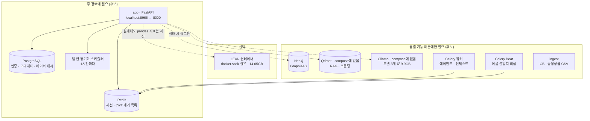
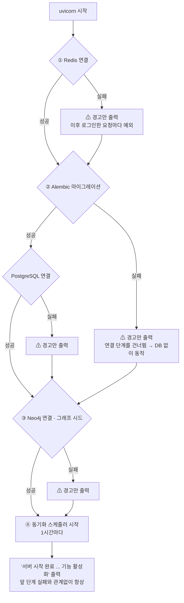
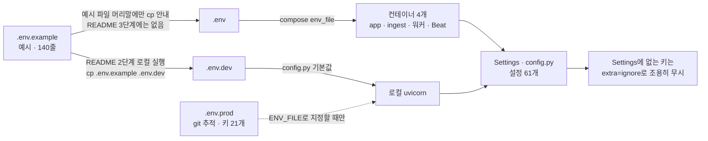
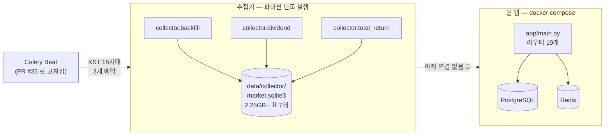
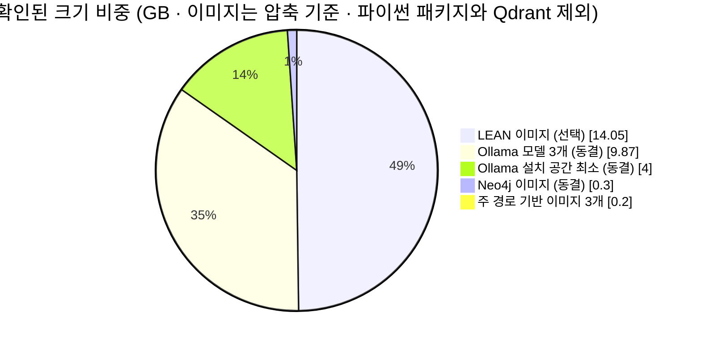
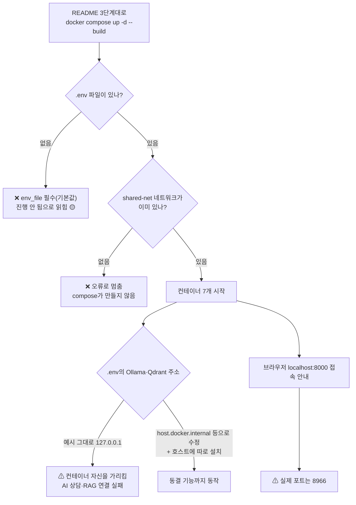
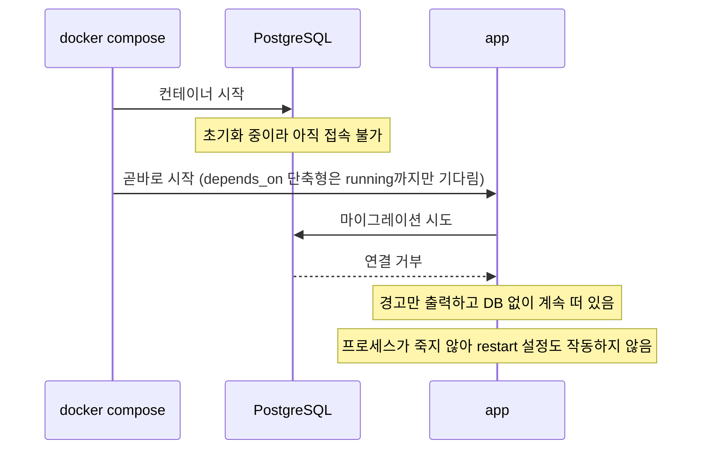
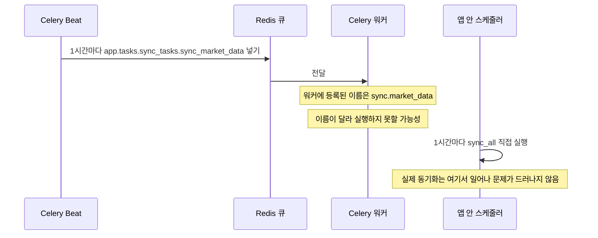
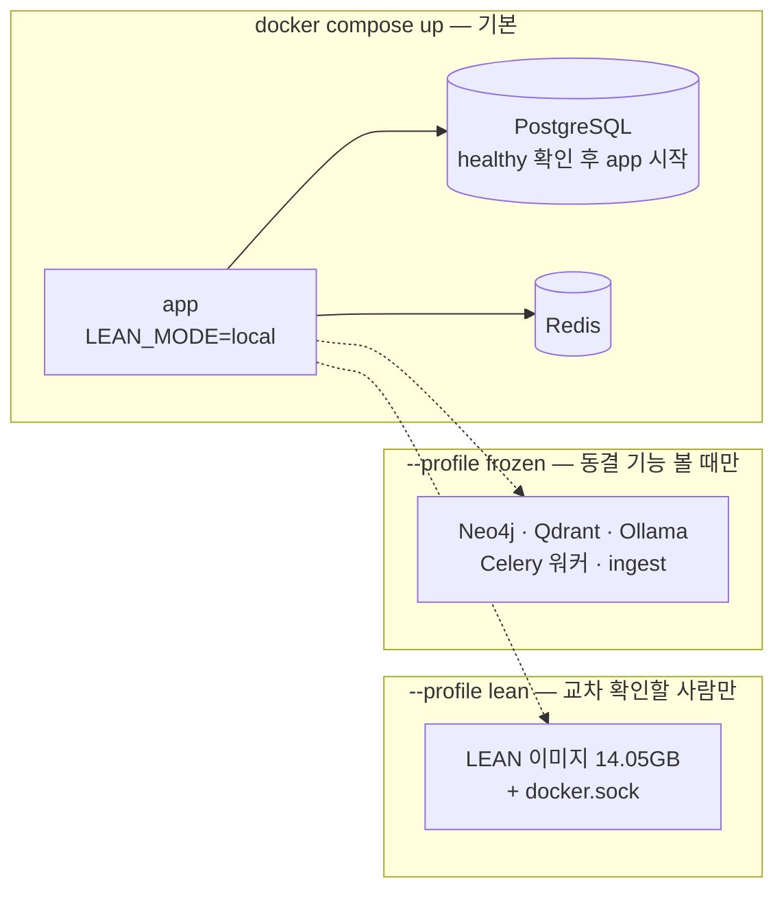

# #9 [분석] A1 실행 환경·루트 설정·앱 진입점 — 주 경로에 꼭 필요한 서비스는 무엇인가

> 🗂️ 옛 GitHub 이슈를 옮긴 **기록 문서**입니다 — [색인](../README.md). 원문은 그대로 두고, 링크·커밋 해시만 새 자리 기준으로 바꿨습니다.

| 항목 | 내용 |
|---|---|
| 종류 | 이슈 |
| 상태 | 열림 |
| 원 작성 | 이동원(`devlee328288`) · 2026-09-15 14:22 KST |
| 라벨 | `analysis` |
| 댓글 | 1건 |
| 옛 주소 | `github.com/devlee328288/Qurious/issues/9` (지금은 열리지 않음) |

## 본문

> **읽는 순서**: 쉬운 요약 → 한눈에 보기 → 7. 2.0 판정 → 6. 결함표 → 필요하면 나머지
> 💬 **논의할 곳**: 로컬 구동 부담·데모 방식은 **D2**, 동결 서비스를 끌지·지울지는 **D3**에서 정합니다. 주 경로는 **D1 [#7](../discussions/007.md) 추천안(미확정)** 을 기준으로 삼았습니다.
> 🙋 **팀원 요청**: 맨 아래 "팀원 확인"에 각자 PC 사양을 댓글로 남겨 주세요.

## 쉬운 요약 (3줄)

1. 이 앱은 `docker compose` 한 번에 컨테이너 7개(PostgreSQL·Redis·Neo4j·앱·인제스트·Celery 워커·Celery Beat)를 띄우는 구조입니다. 그런데 **README 안내대로는 바로 뜨지 않을 가능성이 높습니다.** 미리 만들어 둬야 하는 네트워크가 있고, 필요한 Ollama·Qdrant는 compose에 없으며, 없는 서비스 이름을 안내합니다(실행 검증 전 추정).
2. D1 주 경로("규칙 → 검증 → 기록")에 **꼭 필요한 서비스는 PostgreSQL·Redis·앱 3개**로 보입니다. Neo4j·Qdrant·Ollama·Celery·인제스트는 **동결 기능 때문에만** 필요합니다.
3. 무거운 쪽은 동결 기능입니다. Ollama 모델 3개가 약 9.9GB이고, 선택 기능인 LEAN 이미지가 14.05GB(압축)입니다. 주 경로 서비스의 기반 이미지는 합쳐 약 0.2GB입니다(파이썬 패키지 크기는 미측정).

## 한눈에 보기 — 서비스별 판정 후보

| 서비스 | compose에 있나 | 주 경로에 필요한가 | 크기 (Docker Hub 압축, amd64) | 판정 후보 |
|---|:---:|:---:|---|---|
| PostgreSQL | ✅ | ✅ 필요 | 116MB | 유지 |
| Redis | ✅ | ✅ 필요 | 39MB | 유지 |
| app (FastAPI) | ✅ 빌드 | ✅ 필요 | 기반 46MB + 파이썬 패키지(미측정) | 유지 |
| LEAN | ❌ 앱이 docker.sock으로 직접 실행 | 🔸 선택 | 14.05GB | 선택 (기본 끄기) |
| Neo4j | ✅ | ❌ | 0.30GB | 동결 |
| Qdrant | ❌ | ❌ | 미측정 | 동결 |
| Ollama + 모델 3개 | ❌ | ❌ | 설치 공간 최소 4GB + 모델 9.9GB | 동결 |
| Celery 워커 | ✅ 앱 이미지 재사용 | ❌ | 추가 없음 | 동결 |
| Celery Beat | ✅ 앱 이미지 재사용 | ❌ | 추가 없음 | 폐기 또는 이름 수정 |
| ingest | ✅ 앱 이미지 재사용 | ❌ | 추가 없음 | 동결 |

## 용어 풀이

| 용어 | 뜻 |
|---|---|
| 이미지 / 컨테이너 | 이미지는 실행 준비물 묶음(설치 파일), 컨테이너는 그 이미지를 실제로 켠 것 |
| docker compose | 여러 컨테이너를 파일 하나(`docker-compose.yml`)로 함께 띄우는 도구 |
| 외부 네트워크 (external) | compose가 만들지 않아 **미리 만들어 둬야 하는** 컨테이너 간 통신망 |
| profile | compose에서 "이 이름을 켰을 때만 뜨는" 서비스 묶음 |
| `depends_on` | "이 서비스보다 먼저 켜라"는 compose 설정. 기본은 **켜지기만** 기다리고 준비 완료까지는 기다리지 않음 |
| 진입점 | 프로그램이 시작되는 첫 코드. 여기서는 `app/main.py`의 FastAPI 앱 |
| lifespan | FastAPI가 서버를 켜고 끌 때 한 번씩 실행하는 준비·정리 코드 |
| 마이그레이션 (Alembic) | DB 테이블 구조를 코드 버전에 맞게 바꾸는 작업 |
| Celery 워커 / Beat | 오래 걸리는 일을 뒤에서 처리하는 작업 큐. 워커는 일을 하는 프로세스, Beat는 정해진 시각에 일을 넣는 시계 |
| Ollama | 내 PC에서 LLM을 돌리는 실행기. 모델 파일을 내려받아 씁니다. |
| Qdrant / Neo4j | 문서 의미 검색용 벡터 DB / 종목·개념 관계를 담는 그래프 DB |
| docker.sock | Docker 엔진을 조종하는 통로. 컨테이너에 연결하면 그 컨테이너가 **호스트의 Docker 전체**를 다룰 수 있습니다. |
| LEAN | QuantConnect의 오픈소스 백테스트 엔진. 여기서는 Docker 이미지로 실행합니다. |

**확실도 표시**: 🟢 코드에서 사실로 확인 · 🟡 코드와 공식 문서를 읽고 추론(실행으로 확인 필요)

---

## 1. 요약

- ~~**진입점은 하나**입니다~~ 🔴 **S28~S32 에서 진입점이 넷이 되었습니다** — 웹 앱 하나와 **수집기 3개**(`python -m collector.backfill` · `collector.dividend` · `collector.total_return`). 수집기는 FastAPI·PostgreSQL·Redis 없이 **단독으로 돕니다**(4.1절). 아래는 웹 앱 쪽 설명입니다. ([main.py#L60-L89](https://github.com/EST-team-project/Qurious/blob/04f476a/app/main.py#L60-L89)). 라우터 19개를 한 앱에 등록하고, 시작할 때 Redis → 마이그레이션·PostgreSQL → Neo4j → 동기화 스케줄러 순으로 준비합니다. **어느 단계가 실패해도 경고만 찍고 계속 뜹니다.** 🟢
- **주 경로 라우트**(`/api/paper`, `/api/backtests/lean`, `/api/ml`, `/api/quant/ml`, `/api` 안의 종목·증권사 설정)는 LLM·Qdrant·Neo4j·Celery를 import하지 않습니다. 다만 앱이 **모든 라우터를 시작 시점에 import**하므로, 동결 기능 서버는 꺼도 되지만 **패키지는 설치해야** 합니다. 🟢
- 결함 후보 **14건**을 찾았습니다: 기동을 막을 수 있는 것 4, 조용히 틀어질 수 있는 것 4, 보안·재현성 6(6절 표).

## 2. 위치·규모 (`04f476a`)

| 파일 | 규모 | 역할 |
|---|---|---|
| [`docker-compose.yml`](https://github.com/EST-team-project/Qurious/blob/04f476a/docker-compose.yml) | 179줄 · 서비스 7개 · 볼륨 5개 | 로컬 실행 구성 |
| [`Dockerfile`](https://github.com/EST-team-project/Qurious/blob/04f476a/Dockerfile) | 30줄 | `python:3.12-slim` 기반 앱 이미지. 앱·인제스트·Celery 워커·Beat 4개 서비스가 같은 이미지를 씀 |
| [`start.sh`](https://github.com/EST-team-project/Qurious/blob/04f476a/start.sh) | 75줄 | Ollama·Qdrant를 찾아 compose 실행 (bash 전용) |
| [`requirements.txt`](https://github.com/EST-team-project/Qurious/blob/04f476a/requirements.txt) | 패키지 32개 | **전부 하한만(`>=`) 지정**, 상한·잠금 파일 없음 |
| [`alembic.ini`](https://github.com/EST-team-project/Qurious/blob/04f476a/alembic.ini) | 149줄 | 마이그레이션 설정 |
| [`.env.example`](https://github.com/EST-team-project/Qurious/blob/04f476a/.env.example) · [`.env.prod`](https://github.com/EST-team-project/Qurious/blob/04f476a/.env.prod) | 140줄 · 키 21개 | 환경변수 예시 / git에 추적되는 운영용 예시(자리표시자) |
| [`app/main.py`](https://github.com/EST-team-project/Qurious/blob/04f476a/app/main.py) | 110줄 | FastAPI 진입점 |
| [`app/config.py`](https://github.com/EST-team-project/Qurious/blob/04f476a/app/config.py) | 113줄 · 설정 61개 | 모든 환경변수를 읽는 유일한 곳 |
| [`app/celery_app.py`](https://github.com/EST-team-project/Qurious/blob/04f476a/app/celery_app.py) | 48줄 | Celery 브로커·Beat 예약 |

- `app/` 전체에서 환경변수를 읽는 곳은 `Settings`와 `ENV_FILE` 하나뿐입니다([config.py#L104-L106](https://github.com/EST-team-project/Qurious/blob/04f476a/app/config.py#L104-L106)). 그래서 **`Settings`에 없는 키는 앱이 읽지 않습니다**(6절). 🟢

## 3. 역할과 데이터 흐름

### 3.1 서비스 지도 — D1 주 경로 기준 분류 (판정 후보)

- 실선은 주 경로에서 항상 쓰는 연결이고, 점선은 선택·동결 기능에서만 쓰는 연결입니다.

### 3.2 앱이 켜질 때 — `lifespan`

| 순서 | 하는 일 | 실패하면 | 근거 |
|---|---|---|---|
| ① | Redis 연결 | `[WARN] Redis 연결 실패 (세션 비활성)` 후 계속. 그러나 실제로는 세션·JWT 확인이 `get_redis()`에서 예외를 던짐 | [main.py#L31-L34](https://github.com/EST-team-project/Qurious/blob/04f476a/app/main.py#L31-L34) · [redis_cache.py#L31-L33](https://github.com/EST-team-project/Qurious/blob/04f476a/app/lib/redis_cache.py#L31-L33) |
| ② | Alembic 마이그레이션 → PostgreSQL 연결 | `[WARN] PostgreSQL 연결 실패 (인증 비활성)` 후 계속. **둘이 같은 `try` 안이라 마이그레이션이 실패하면 연결도 건너뜀** | [main.py#L35-L42](https://github.com/EST-team-project/Qurious/blob/04f476a/app/main.py#L35-L42) |
| ③ | Neo4j 연결 · 스키마 · 그래프 시드 | 경고 후 계속 | [main.py#L43-L49](https://github.com/EST-team-project/Qurious/blob/04f476a/app/main.py#L43-L49) |
| ④ | 시장 데이터 동기화 스케줄러(1시간 주기) | — | [main.py#L50](https://github.com/EST-team-project/Qurious/blob/04f476a/app/main.py#L50) · [sync_scheduler.py#L25](https://github.com/EST-team-project/Qurious/blob/04f476a/app/services/sync_scheduler.py#L25) |
| 끝 | "서버 시작 완료. JWT + PostgreSQL + 대화이력 기능 활성화" 출력 | **앞 단계가 실패해도 같은 문구** | [main.py#L51](https://github.com/EST-team-project/Qurious/blob/04f476a/app/main.py#L51) |

- `alembic.ini`의 DB 주소(`lumina:lumina`, [#L89](https://github.com/EST-team-project/Qurious/blob/04f476a/alembic.ini#L89))는 compose 계정과 다르지만, [alembic/env.py#L26-L27](https://github.com/EST-team-project/Qurious/blob/04f476a/alembic/env.py#L26-L27)이 `settings.DATABASE_URL`로 덮어씁니다. **문제 아님**(확인한 반례). 🟢

### 3.3 환경변수 파일은 누가 읽나

- `.env.example` 머리말에는 "복사: cp .env.example .env  또는  cp .env.example .env.dev"라고 적혀 있습니다([#L3](https://github.com/EST-team-project/Qurious/blob/04f476a/.env.example#L3)). 하지만 README의 Docker 실행 절([readme.md#L261-L268](https://github.com/EST-team-project/Qurious/blob/04f476a/readme.md#L261-L268))은 `.env`를 만들라는 안내 없이 `docker compose up`을 시킵니다. 🟢 compose의 `env_file`은 기본이 필수(`required` 기본값 true)입니다. Docker 문서에는 반대 경우만 적혀 있습니다: "When `required` is set to `false` and the `.env` file is missing, Compose silently ignores the entry."([services](https://docs.docker.com/reference/compose-file/services/)) 🟡

## 4. 핵심 진입점 — 서비스별로 누가 쓰나

| 서비스·패키지 | 쓰는 곳 | 주 경로 라우트가 쓰나 |
|---|---|:---:|
| PostgreSQL | 전 라우트(인증·모의계좌·캐시) · [postgres.py#L17-L27](https://github.com/EST-team-project/Qurious/blob/04f476a/app/database/postgres.py#L17-L27) | ✅ |
| Redis | 세션 · JWT 폐기 확인 · [jwt_auth.py#L100-L117](https://github.com/EST-team-project/Qurious/blob/04f476a/app/lib/jwt_auth.py#L100-L117) | ✅ 로그인한 요청마다 |
| `lightgbm` · `scikit-learn` | `ml_models` · `investment_research` · `quant_pipeline` | ✅ 모델 비교·자산배분·스크리닝 |
| `bs4` | `krx_companies`(종목 목록) · `crawl` | ✅ 종목 목록 |
| LEAN (Docker) | `lean_backtest`. `LEAN_MODE=auto`면 docker.sock이 보이는 순간 docker 모드 → [lean_backtest.py#L69-L77](https://github.com/EST-team-project/Qurious/blob/04f476a/app/services/lean_backtest.py#L69-L77). **LEAN이 실패해도 수익률·MDD 등 화면 지표는 pandas로 계산** → [#L163-L172](https://github.com/EST-team-project/Qurious/blob/04f476a/app/services/lean_backtest.py#L163-L172) | 🔸 교차 확인 화면에서 엔진 결과를 보여줄 때만 |
| Neo4j | `graph_service` · `graph_rag` · `/api/graph` | ❌ |
| Qdrant · langchain | `rag_pipeline` · `crawl` · `translation_ingest` · [rag_pipeline.py#L10-L18](https://github.com/EST-team-project/Qurious/blob/04f476a/app/services/rag_pipeline.py#L10-L18) | ❌ |
| Ollama | `llm_client` · `langgraph_agent` · `doc_parser` · `crawl` · `/api/chat`·`documents`·`ingest`. 화면에서 `/api/chat`을 부르는 곳은 AI 상담·CB 통계·금융상품 검색([app.html#L3987](https://github.com/EST-team-project/Qurious/blob/04f476a/public/app.html#L3987) · [#L4026](https://github.com/EST-team-project/Qurious/blob/04f476a/public/app.html#L4026) · [#L4063](https://github.com/EST-team-project/Qurious/blob/04f476a/public/app.html#L4063)) — 셋 다 [#7](../discussions/007.md) 동결 목록 | ❌ |
| Celery | `.delay()` 호출은 [chat.py#L208](https://github.com/EST-team-project/Qurious/blob/04f476a/app/routes/chat.py#L208) · [ingest.py#L178-L205](https://github.com/EST-team-project/Qurious/blob/04f476a/app/routes/ingest.py#L178-L205)뿐 | ❌ |
| 문서 파서 4종(`pptx`·`docx`·`openpyxl`·`pdfplumber`) | `doc_parser`만 | ❌ |
| ingest가 채우는 테이블 4개(개인·기업 CB 통계, 은행·펀드 상품) | [financial_ingest.py#L10](https://github.com/EST-team-project/Qurious/blob/04f476a/app/services/financial_ingest.py#L10)이 채우고, 읽는 곳은 `financial_tools`(AI 에이전트 도구) · [library.py#L6](https://github.com/EST-team-project/Qurious/blob/04f476a/app/routes/library.py#L6) · [admin.py#L15](https://github.com/EST-team-project/Qurious/blob/04f476a/app/routes/admin.py#L15)뿐. README는 ingest를 "DB 초기화"로도 안내하지만([readme.md#L254-L255](https://github.com/EST-team-project/Qurious/blob/04f476a/readme.md#L254-L255)) 테이블은 Alembic이 만듦 | ❌ |

- 주 경로 라우트 파일(`paper.py`·`lean.py`·`ml.py`·`quant.py`·`stocks.py`)에서 `llm`·`ollama`·`agent`·`qdrant`·`neo4j`·`celery`를 검색하면 import가 0건입니다(`stocks.py`의 `User-Agent` 문자열만 걸림). 🟢

### 4.1 수집기 — 두 번째 진입점 계열 (S26~S32 신설) 🟢

문서 작성 당시에는 없던 것입니다. `collector/` 패키지(2,493줄)가 **웹 앱과 별개로** 돕니다.

| 진입점 | 하는 일 | 필요한 것 | 쓰지 않는 것 |
|---|---|---|---|
| `python -m collector.backfill` | 공공데이터포털 일별시세 수집 · 수정주가 재계산 | `.env` 키 1개 + SQLite 파일 | PostgreSQL · Redis · Neo4j · Qdrant · Ollama · FastAPI |
| `python -m collector.dividend` | DART 배당 공시 파싱 | DART 키 + 같은 SQLite | 〃 |
| `python -m collector.total_return` | TR(총수익) 계열 계산 | 같은 SQLite (네트워크 없음) | 〃 |

**판정에 미치는 영향** 🔴

- 이 문서의 "주 경로 최소 구성 = PostgreSQL · Redis · 앱" 판정은 **웹 앱에만 해당**합니다.
  수집기는 **셋 다 없어도** 돕니다. 데이터를 모으는 일과 보여 주는 일이 분리됐습니다.
- 그래서 **"로컬 구동 부담" 질문이 둘로 갈립니다** — ① 화면을 보려면 무엇이 필요한가(기존 답) ② 데이터를 모으려면 무엇이 필요한가(파이썬 + 2.25GB 디스크 + API 키). D2·D3 에서 나눠 정해야 합니다.
- 🔴 **수집기가 모은 데이터를 웹 앱이 아직 읽지 않습니다.** 앱은 여전히 외부 API 를 직접 부릅니다(A4 [#23](../issues/023.md)). 이 연결이 2차 프로젝트의 과제입니다.
- `collector/config.py#L34-L37` 이 경로를 정합니다(`data/collector/` 아래 DB·manifest·state).

---

## 5. 외부 의존과 비용 — 로컬 구동 부담 (조회일 2026-09-15 KST, 원문 재확인한 수치만)

### 5.1 시나리오별 크기

| 시나리오 | 포함 | 확인된 크기 합계 | 막대 (█ 1칸 ≈ 2GB) |
|---|---|---:|---|
| **A** 주 경로만 (`LEAN_MODE=local`) | PostgreSQL · Redis · 앱 기반 이미지 | 약 0.2GB + 파이썬 패키지 | ▏ |
| **B** 주 경로 + LEAN 교차 확인 | A + LEAN 이미지 | 약 14.3GB + 패키지 | ███████ |
| **C** 지금 README 전체 | B + Ollama 설치 공간 + 모델 3개 + Neo4j | 약 28.4GB + 패키지·Qdrant | ██████████████ |
| **D** 수집기 데이터 (신규 · S26~S32) | `data/collector/market.sqlite3` | **2.25GB** | █ |
| 참고: 강사님 README "최소 여유 저장공간" | — | 30GB | ███████████████ |

> 🔴 **D 는 이미지가 아니라 우리가 모은 데이터**라 위 셋과 성격이 다릅니다. Docker 와 무관하게 디스크를 씁니다.
> 2026-09-19 기준 표 7개 · 4,460,710행 × 3계열(원주가·수정주가·총수익) + 배당 9,188건 + 원문 12,692건.
> git 에 올리지 않습니다(`.gitignore`). 팀원이 받으려면 **다시 수집해야** 합니다 — 포털 유량 10,000회/일 제한 안에서 며칠 걸립니다.

- 시나리오 C(약 28.4GB)만으로 강사님 README의 최소 여유 30GB가 거의 다 찹니다. LEAN은 S1에서 최신본을 반영하며 들어온 기능이라, README 사양표가 그 뒤 기준을 따라가지 못한 것으로 보입니다. 🟡
- **비용**: 모두 로컬이라 0원입니다. 외부 시세 API(Yahoo·KIND 등)는 A4에서 다룹니다.

### 5.2 원문 수치

| 구성 요소 | 크기·요구 (원문) | 필요한 곳 | 출처 |
|---|---|---|---|
| Docker Desktop (Windows, WSL 2) | "8GB system RAM" · "WSL version 2.1.5 or later" · 요구 목록 "Windows 11 64-bit: Enterprise, Pro, or Education version 23H2" · 주의 문구 "Windows Home or Education editions only allow you to run Linux containers." | 전부 | [Docker docs](https://docs.docker.com/desktop/setup/install/windows-install/) (원본 [L62-L83](https://github.com/docker/docs/blob/main/content/manuals/desktop/setup/install/windows-install.md)) |
| `postgres:16-alpine` | 116,052,663 bytes | 주 경로 | [Docker Hub](https://hub.docker.com/_/postgres/tags?name=16-alpine) |
| `redis:8-alpine` | 39,006,802 bytes | 주 경로 | [Docker Hub](https://hub.docker.com/_/redis/tags?name=8-alpine) |
| `python:3.12-slim` (앱 기반) | 46,175,163 bytes + 파이썬 패키지(**미측정**) | 주 경로 | [Docker Hub](https://hub.docker.com/_/python/tags?name=3.12-slim) |
| `quantconnect/lean:latest` | amd64 14,047,381,079 bytes · arm64 5,069,992,225 bytes · 최종 push 2026-09-14 | 선택 | [Docker Hub](https://hub.docker.com/r/quantconnect/lean/tags) |
| Ollama (Windows) | "Windows 10 22H2 or newer, Home or Pro" · "at least 4GB of space for the binary install" · 모델은 "tens to hundreds of GB" | 동결 | [Ollama docs](https://docs.ollama.com/windows) |
| `llama3.1` (기본 8B) · `nomic-embed-text` · `llava` (기본 7B) | 4.9GB · 274MB · 4.7GB ([config.py#L22-L24](https://github.com/EST-team-project/Qurious/blob/04f476a/app/config.py#L22-L24)) | 동결 | [llama3.1](https://ollama.com/library/llama3.1) · [nomic-embed-text](https://ollama.com/library/nomic-embed-text) · [llava](https://ollama.com/library/llava) |
| Neo4j (개인·개발용) | 메모리 "2GB minimum, 16GB or more recommended" · 저장 "10GB SATA Minimum" | 동결 | [Neo4j requirements](https://neo4j.com/docs/operations-manual/current/installation/requirements/) |
| `neo4j:5.18-community` | 300,375,577 bytes | 동결 | [Docker Hub](https://hub.docker.com/_/neo4j/tags?name=5.18-community) |
| 강사님 README 권장 사양 | RAM 최소 16GB·권장 32GB, 여유 저장공간 30GB·80GB | — | [readme.md#L47-L55](https://github.com/EST-team-project/Qurious/blob/04f476a/readme.md#L47-L55) |

## 6. 품질 관찰 — 결함 후보 14건 (실행 검증 전)

### 6.1 결함표

| # | 분류 | 결함 | 영향 | 확실도 | 넘길 곳 |
|---:|---|---|---|:---:|---|
| 1 | 기동 | 외부 네트워크 `shared-net`을 미리 만들어야 함 · README에 안내 없음 | `docker compose up` 오류 | 🟡 | README · D3 |
| 2 | 기동 | Ollama·Qdrant가 compose에 없음 · `start.sh`가 켜는 프로필도 없음 | 동결 기능 연결 실패 | 🟢 없음 확인 | D3 |
| 3 | 기동 | 컨테이너 안 Ollama·Qdrant 주소가 `127.0.0.1`·`localhost` | 동결 기능 연결 실패 | 🟡 | D3 |
| 4 | 기동 | README 안내 불일치: `model-pull` · 포트 8000 · `.env` 생성 · MongoDB·SQLite | 따라 하다 막힘 | 🟢 | README([#5](../issues/005.md)) |
| 5 | 조용한 오류 | DB 준비 전 앱 기동 → 마이그레이션 실패 → DB 없이 계속 동작 | 로그인 불가인데 서버는 떠 있음 | 🟡 | D3 |
| 6 | 조용한 오류 | ~~Celery Beat 태스크 이름 불일치~~ **🔴 해결됨 (PR [#35](../pulls/035.md), S28)** | ~~Beat 예약 미실행~~ → Beat 가 등록 이름(`sync.market_data`)으로 부르도록 고쳤고, `include` 누락도 함께 고쳤습니다(둘은 별개 버그라 하나만으로는 안 돌았습니다). **수집기 태스크 3개가 새로 예약됐습니다**(`collector.portal_recent`·`rebuild_adjusted`·`write_manifest`, KST 18시대 crontab) | 🟢 | A4 |
| 7 | 조용한 오류 | 기동 단계가 실패해도 "기능 활성화" 완료 문구 출력 | 로그만 보고 정상으로 오해 | 🟢 | A12 |
| 8 | 조용한 오류 | env 파일 3종 혼재 · 읽히지 않는 키 17개 · `.env.prod`에 `JWT_SECRET` 없음 | 설정이 무시돼도 모름 | 🟢 | D3 · A3 |
| 9 | 보안 | docker.sock 마운트 | 앱 컨테이너가 호스트 Docker 전체 제어 | 🟢 | A3 |
| 10 | 보안 | 기본 비밀값으로도 기동 · compose 비밀번호 하드코딩 · DB 포트 호스트 공개 | 설정 누락 시 추측 가능한 비밀값 | 🟢 | A3 |
| 11 | 재현성 | 패키지 32개 전부 `>=` · LEAN `latest` | 빌드 날짜마다 결과가 달라질 수 있음 | 🟢 | D3 |
| 12 | 재현성 | 동결 기능 패키지도 최상위 import | 동결 서비스를 떼려면 라우터 분리 필요 | 🟢 | D3 |
| 13 | 이식성 | `start.sh` bash 전용 · 외부 `redis` 컨테이너 가정 | Windows는 Git Bash·WSL 필요 | 🟢 | README |
| 14 | 보안 | Dockerfile root 실행 · `data` `chmod 777` · 앱 healthcheck 없음 | 권한 과다 · 상태 감시 불가 | 🟢 | A3 |

### 6.2 기동을 막을 수 있는 것 ([#1](../issues/001.md)~[#4](../issues/004.md))

- **[#1](../issues/001.md)** `shared-net`이 `external: true`입니다([docker-compose.yml#L177-L179](https://github.com/EST-team-project/Qurious/blob/04f476a/docker-compose.yml#L177-L179)). Docker 문서: "Compose doesn't attempt to create these networks, and returns an error if one doesn't exist."([networks](https://docs.docker.com/reference/compose-file/networks/))
- **[#2](../pulls/002.md)** `start.sh`는 Ollama·Qdrant를 못 찾으면 `local-ollama`·`local-qdrant` 프로필을 켭니다([start.sh#L33-L37](https://github.com/EST-team-project/Qurious/blob/04f476a/start.sh#L33-L37) · [#L52-L55](https://github.com/EST-team-project/Qurious/blob/04f476a/start.sh#L52-L55)). 하지만 그 프로필을 가진 서비스가 compose에 없습니다. `4d0f979` 초기 사본부터 없었습니다(강사님 원본에서 온 흔적).
- **[#3](../issues/003.md)** `.env.example`은 `127.0.0.1`·`localhost`입니다([#L17](https://github.com/EST-team-project/Qurious/blob/04f476a/.env.example#L17) · [#L41](https://github.com/EST-team-project/Qurious/blob/04f476a/.env.example#L41)). `start.sh`가 `export`하는 값([#L23-L29](https://github.com/EST-team-project/Qurious/blob/04f476a/start.sh#L23-L29))은 compose 파일에 `${OLLAMA_BASE_URL}` 참조가 없어 **전달되지 않을 가능성**이 큽니다. Docker 문서의 우선순위에서 셸 값이 쓰이는 경우는 "value interpolated from your shell"일 때입니다([precedence](https://docs.docker.com/compose/how-tos/environment-variables/envvars-precedence/)).
- **[#4](../issues/004.md)** 없는 서비스 `docker compose logs -f model-pull`([readme.md#L239](https://github.com/EST-team-project/Qurious/blob/04f476a/readme.md#L239)) · 접속 주소 `http://localhost:8000`([#L270](https://github.com/EST-team-project/Qurious/blob/04f476a/readme.md#L270))인데 compose는 `8966:8000`([docker-compose.yml#L58](https://github.com/EST-team-project/Qurious/blob/04f476a/docker-compose.yml#L58)) · 기술 스택이 MongoDB·SQLite([readme.md#L100-L102](https://github.com/EST-team-project/Qurious/blob/04f476a/readme.md#L100-L102), [#5](../issues/005.md)에서도 지적)

### 6.3 조용히 틀어질 수 있는 것 ([#5](../issues/005.md)~[#8](../issues/008.md))

**[#5](../issues/005.md) DB가 준비되기 전에 앱이 뜸** 🟡

- `depends_on`이 단축형입니다([docker-compose.yml#L82-L85](https://github.com/EST-team-project/Qurious/blob/04f476a/docker-compose.yml#L82-L85)). 그래서 PostgreSQL healthcheck([#L16-L20](https://github.com/EST-team-project/Qurious/blob/04f476a/docker-compose.yml#L16-L20))를 기다리지 않습니다. Docker 문서: "Compose does not wait until a container is "ready", only until it's running."([startup order](https://docs.docker.com/compose/how-tos/startup-order/)) 반대로 "`condition: service_healthy`"를 쓰면 healthcheck 통과까지 기다립니다.

**[#6](../discussions/006.md) ~~Celery Beat 태스크 이름 불일치~~** 🔴 **해결됨 — PR [#35](../pulls/035.md) (S28, `32c44a6` 기준)**

> 아래 다이어그램은 **고치기 전** 상태의 기록입니다. 지금은 `beat_schedule` 이 등록 이름으로 부르고,
> [`celery_app.py#L52-L60`](https://github.com/EST-team-project/Qurious/blob/32c44a6/app/celery_app.py#L52-L60) 에
> 그 경위가 주석으로 남아 있습니다. **단, D7 2.4 가 지적한 대로 — 이제 Beat 가 실제로 돌기 때문에
> 앱 안 스케줄러와 중복 실행이 진짜로 생깁니다.** 그 조정은 A4 [#23](../issues/023.md) 에서 다룹니다. 🔴

| 예약 | Beat가 보내는 이름 | 워커에 등록된 이름 |
|---|---|---|
| 시장 데이터(1시간) | `app.tasks.sync_tasks.sync_market_data` ([celery_app.py#L35](https://github.com/EST-team-project/Qurious/blob/04f476a/app/celery_app.py#L35)) | `sync.market_data` ([sync_tasks.py#L16](https://github.com/EST-team-project/Qurious/blob/04f476a/app/tasks/sync_tasks.py#L16)) |
| 캔들(24시간) | `app.tasks.sync_tasks.sync_stock_candles` ([celery_app.py#L40](https://github.com/EST-team-project/Qurious/blob/04f476a/app/celery_app.py#L40)) | `sync.stock_candles` ([sync_tasks.py#L39](https://github.com/EST-team-project/Qurious/blob/04f476a/app/tasks/sync_tasks.py#L39)) |

- Celery 문서상 Beat의 `task`는 "The name of the task to execute"입니다. 태스크는 이름을 명시하면 그 이름으로 등록되고, 명시하지 않을 때만 모듈·함수 이름으로 만들어집니다([periodic tasks](https://docs.celeryq.dev/en/stable/userguide/periodic-tasks.html) · [tasks](https://docs.celeryq.dev/en/stable/userguide/tasks.html)).
- 같은 일을 앱 안 스케줄러가 1시간마다 하고 있습니다([sync_scheduler.py#L247-L251](https://github.com/EST-team-project/Qurious/blob/04f476a/app/services/sync_scheduler.py#L247-L251) · [sync_tasks.py#L23-L29](https://github.com/EST-team-project/Qurious/blob/04f476a/app/tasks/sync_tasks.py#L23-L29)). 둘 다 동작한다면 **같은 외부 API를 두 번씩 부르게** 됩니다.

**[#7](../discussions/007.md) 실패해도 "기능 활성화"라고 출력** 🟢: [main.py#L51](https://github.com/EST-team-project/Qurious/blob/04f476a/app/main.py#L51) (3.2 흐름도 마지막 칸)

**[#8](../issues/008.md) 환경변수 파일 3종 혼재** 🟢 (3.3 흐름도)
- 코드 기본은 `.env.dev`([config.py#L105](https://github.com/EST-team-project/Qurious/blob/04f476a/app/config.py#L105)), compose는 `.env`([docker-compose.yml#L59](https://github.com/EST-team-project/Qurious/blob/04f476a/docker-compose.yml#L59)), git에는 `.env.prod`가 있습니다. `extra = "ignore"`([config.py#L106](https://github.com/EST-team-project/Qurious/blob/04f476a/app/config.py#L106)) 때문에 읽히지 않는 키가 조용히 무시됩니다.

| 파일 | 키 수 | 앱이 읽지 않는 키 |
|---|---:|---|
| `.env.example` | — | 10개: `KIS_*` 4 · `EBEST_*` 3 · `GITHUB_TOKEN` · `CHUNK_SIZE` · `CHUNK_OVERLAP`. 증권사 키는 UI에서 DB로 저장하는 방식이라(A8) 예시 파일이 헷갈리게 함 |
| `.env.prod` | 21 | 7개: `BASE_URL` · `RAW_DIR` · `CHUNK_SIZE` · `CHUNK_OVERLAP` · `MAX_CONTEXT_CHUNKS` · `DOC_VERSION_STRATEGY` · `OLLAMA_TIMEOUT_MS`. 또 `JWT_SECRET`이 없어 이 파일로 띄우면 기본값([config.py#L16](https://github.com/EST-team-project/Qurious/blob/04f476a/app/config.py#L16))이 쓰임 |

### 6.4 보안·재현성·이식성 ([#9](../issues/009.md)~[#14](../issues/014.md), 자세한 보안은 A3 `security`)

- **[#9](../issues/009.md) docker.sock 마운트**([docker-compose.yml#L77](https://github.com/EST-team-project/Qurious/blob/04f476a/docker-compose.yml#L77)): Docker 문서: "only trusted users should be allowed to control your Docker daemon."([security](https://docs.docker.com/engine/security/)) 강사님 문서도 온프레미스에서는 "docker.sock 금지"라고 적었습니다([pipeline.md#L279](https://github.com/EST-team-project/Qurious/blob/04f476a/pipeline.md#L279)). `LEAN_MODE=local`이면 필요 없습니다.
- **[#10](../discussions/010.md)**
  - `SESSION_SECRET`·`JWT_SECRET`에 기본값이 있습니다([config.py#L7](https://github.com/EST-team-project/Qurious/blob/04f476a/app/config.py#L7) · [#L16](https://github.com/EST-team-project/Qurious/blob/04f476a/app/config.py#L16)).
  - compose에 비밀번호가 하드코딩돼 있습니다([#L9](https://github.com/EST-team-project/Qurious/blob/04f476a/docker-compose.yml#L9) · [#L45](https://github.com/EST-team-project/Qurious/blob/04f476a/docker-compose.yml#L45)).
  - 포트 15432·16379·17474·7687이 호스트에 열립니다.
- **[#11](../issues/011.md)** 패키지 32개가 전부 `>=`이고, LEAN 이미지도 `latest`입니다([config.py#L50](https://github.com/EST-team-project/Qurious/blob/04f476a/app/config.py#L50), 최종 push 2026-09-14).
- **[#12](../issues/012.md)** 모든 라우터를 시작 시 import합니다([main.py#L15](https://github.com/EST-team-project/Qurious/blob/04f476a/app/main.py#L15)). 동결 기능 패키지를 빼면 앱이 뜨지 않습니다.
- **[#13](../discussions/013.md)** `start.sh`는 bash 전용 문법(`source <(...)`, 배열)을 씁니다. 또 compose의 `fin-ai-redis`가 아닌 **다른 외부 `redis` 컨테이너**를 `shared-net`에 붙이려 합니다([#L58-L67](https://github.com/EST-team-project/Qurious/blob/04f476a/start.sh#L58-L67)). 강사님 개인 환경의 흔적입니다.
- **[#14](../issues/014.md)** [Dockerfile#L24](https://github.com/EST-team-project/Qurious/blob/04f476a/Dockerfile#L24) `chmod -R 777 data` · `USER` 지정 없음(root) · `HEALTHCHECK` 없음

## 7. 2.0 관점 1차 판정 (주 경로는 D1 [#7](../discussions/007.md) 추천안 기준 · 확정은 D2·D3)

| 대상 | 판정 후보 | 근거 |
|---|---|---|
| PostgreSQL · Redis · app | **유지** | 주 경로 라우트가 직접 씀. Redis가 없으면 인증 요청이 예외 |
| 앱 안 동기화 스케줄러 | **유지** (A4에서 상세 검토) | 실제로 데이터를 동기화하는 쪽 |
| Neo4j · Qdrant · Ollama · Celery 워커 · ingest | **동결 후보**: 주 경로 개발 중에는 끄고 개발 | 주 경로 라우트가 쓰지 않음. 삭제 여부는 D3 |
| Celery Beat | **폐기 또는 이름 수정 후보** | 앱 스케줄러와 하는 일이 겹치고, 이름 불일치로 실행되지 않을 가능성 |
| LEAN Docker | **선택**: 기본 `LEAN_MODE=local`, 교차 확인이 필요한 사람만 docker | 14.05GB · docker.sock 보안. 꺼도 화면 지표는 계산됨 |
| compose · `start.sh` · README 실행 안내 | **개선**: "주 경로 최소 구성"을 기본으로, 동결 서비스는 profile로 분리 | 결함 [#1](../issues/001.md)~[#5](../issues/005.md) |
| `.env.example` · `.env.prod` | **개선**: 예시 파일 하나로 정리, `.env.prod` 추적 해제 후보 | 결함 [#8](../issues/008.md) |
| `requirements.txt` | **개선**: 버전 고정(잠금 파일) | 결함 [#11](../issues/011.md). 1차 Alpha_Stack의 재현 원칙([#3](../issues/003.md))과도 맞음 |
| **`collector/` (S26~S32 신설)** | **유지 · 주 경로** | 웹 앱과 독립. PostgreSQL·Redis 없이 돈다(4.1). 2.25GB 데이터가 D1 주 경로의 재료 — "투자/모의투자에 쓸 수 있는가"의 전제 |
| **수집기 ↔ 웹 앱 연결** | **미착수 🔴** | 앱이 아직 수집 데이터를 읽지 않는다. 2차 과제(A4 [#23](../issues/023.md)) |

**제안하는 개발 환경 모양** (D3 결정 전 참고안)

## 근거 · 반례 · 한계

**근거**
- 대상 파일을 직접 읽어 줄 번호를 확인했습니다. 서비스 사용처는 import 검색으로 확인했습니다.
- 외부 수치는 5절의 공식 문서·Docker Hub API 원문 값만 옮겼습니다. Docker 요구사항은 요약 결과가 엇갈려, GitHub의 문서 원본 마크다운에서 해당 줄을 직접 확인했습니다.

**반례**
- **"동결 서비스는 없어도 된다"**
  - 패키지는 설치해야 합니다([#12](../issues/012.md)).
  - compose의 앱이 `depends_on: neo4j`라, compose로는 Neo4j 없이 앱만 띄우기가 번거롭습니다.
  - 화면이 시스템 상태 패널 등에서 Ollama·Neo4j 상태를 보여 주다 오류를 낼 수도 있습니다(A13에서 확인).
- **"Ollama는 주 경로에 불필요"**: D5·D6에서 LLM 기능(인디케이터 코드 생성, 결과 해설)을 주 경로에 넣기로 하면 필요해집니다.
- **"Beat는 동작하지 않는다"**: 이름이 다르다는 것은 코드로 확인했지만, 워커 로그로 실패를 본 것은 아닙니다.

**한계**
- **실행 검증을 하지 않았습니다**(설계 주간). 🟡 항목은 모두 코드와 공식 문서를 읽고 낸 추정입니다.
- 주 경로 12개 화면과 API의 대응은 **라우트 파일 import 기준**입니다. 화면별 실제 호출은 A13에서 확인합니다.
- 이미지 크기는 Docker Hub의 **압축 크기(amd64)** 입니다. 디스크에 풀면 더 커집니다. 앱 이미지(파이썬 패키지 포함)와 Qdrant 이미지는 재지 않았습니다.
- **Ollama 모델의 RAM 요구는 공식 문서에서 찾지 못했습니다**(다운로드 크기만 확인).
- Docker Desktop 문서는 요구 목록에 **Windows Home이 없지만** 주의 문구에서는 Home을 언급해 모호합니다. 팀원 PC의 에디션을 확인해야 합니다.
- `env_file`이 없을 때의 동작은 문서에서 "`required: false`면 무시한다"는 반대 경우만 원문으로 확인했습니다.
- 팀원 4명의 PC 사양을 모릅니다.

## 2.0 판정을 뒤집을 조건

1. D1 [#7](../discussions/007.md)이 확정되며 **LLM 기능(상담·해설)이 주 경로에 들어가면** → Ollama(또는 D2의 유료 API)를 "필요"로 바꿉니다.
2. A13에서 **주 경로 화면이 Neo4j·Qdrant·Celery API를 부르는 것**이 확인되면 → 해당 서비스를 "필요"로 바꿉니다.
3. 실행해 보니 **안내대로 문제없이 뜨면**(예: `shared-net`이 이미 있는 환경) → 결함 [#1](../issues/001.md)~[#4](../issues/004.md)의 우선순위를 낮춥니다.
4. **팀원 PC가 LEAN 14GB나 RAM 요구를 감당하지 못하면** → `LEAN_MODE=local` 기본을 확정하거나, D2에서 원격 실행처를 논의합니다.

## 팀원 확인

`@rkdalstjr` `@GoonGuMa` `@janghwan-god` — 판정에 필요한 정보입니다. 이 이슈에 댓글로 남겨 주세요.

| 이름 | OS·에디션 (Home·Pro / macOS) | RAM | 여유 디스크 | Docker Desktop 설치 |
|---|---|---|---|---|
| 이동원 | | | | |
| 강민석 | | | | |
| 오준영 | | | | |
| 신장환 | | | | |

- [ ] 동결 목록([#7](../discussions/007.md) §3 ③) 기능 중 **로컬에서 꼭 돌려 봐야 하는 것**이 있나요? (있다면 그 서비스는 개발 환경에 남깁니다)

## 8. 관련 Issue · Discussion

- 인덱스 [#1](../issues/001.md) · A14 클라우드 인프라·CI/CD [#8](../issues/008.md) · A15 과제 명세·격차표(README 재작성, 테스트 0개) [#5](../issues/005.md) · D1 방향성·주 경로 [#7](../discussions/007.md) · A16 1차 유산(재현 원칙) [#3](../issues/003.md)
- 넘길 곳: **D2** 로컬 부담·데모 방식 · **D3** 동결 서비스 끄기·지우기 · **A3** 보안([#9](../issues/009.md)·[#10](../discussions/010.md)·[#14](../issues/014.md)) · **A4** 동기화 스케줄러([#6](../discussions/006.md)) · **A6** LEAN · **A8** 증권사 키 저장 방식 · **A12** 기동 로그([#7](../discussions/007.md)) · **A13** 화면별 API 호출
- 기준 커밋: Qurious `04f476a` (본문 링크) · **갱신 확인 `32c44a6` (S33, 2026-09-19)**
- 🔴 **S33 갱신분**: 진입점 4개(1절·4.1절) · 결함 [#6](../discussions/006.md) 해결(PR [#35](../pulls/035.md)) · 수집기 DB 2.25GB(5.1 D행) · 7절 판정표에 수집기 행

---

## 댓글 1건

---

### 💬 1. 이동원(`devlee328288`) · 2026-09-19 16:53 KST

**본문을 갱신했습니다** (S33 · 2026-09-19 KST). 이 이슈를 쓴 뒤 S26~S32 에서 저장소가 바뀌어, 본문 7곳을 고쳤습니다. 댓글이 아니라 **본문을 고쳤으니 본문을 보시면 됩니다.** 틀렸던 칸은 지우지 않고 ~~취소선~~ + 🔴 로 남겨 두었습니다.

| 절 | 무엇이 바뀌었나 |
|---|---|
| **1절** | ~~"진입점은 하나"~~ → **넷**. 웹 앱 + 수집기 3개(`collector.backfill`·`dividend`·`total_return`) |
| **4.1 (신설)** | 수집기가 **PostgreSQL·Redis·FastAPI 없이 단독으로 돈다**는 사실과 그 판정 영향 |
| **5.1** | 시나리오 **D** 추가 — 수집기 DB `market.sqlite3` **2.25GB**(표 7개 · 4,460,710행 × 3계열) |
| **6.1 결함표 [#6](../discussions/006.md)** | ~~Celery Beat 이름 불일치~~ **해결됨 (PR [#35](../pulls/035.md))**. 수집기 태스크 3개가 새로 예약됨 |
| **6.3 [#6](../discussions/006.md) 상세** | 다이어그램을 "고치기 전 기록"으로 명시 + 🔴 **이제 Beat 가 실제로 도니 중복 실행이 진짜로 생긴다**(D7 2.4) |
| **7절 판정표** | `collector/` 행(**유지·주 경로**) · 수집기↔웹앱 연결 행(**미착수 🔴**) |
| **맨 아래** | 기준 커밋에 `32c44a6` 갱신 표시 |

**판정이 실제로 달라진 곳**은 하나입니다 — 이 문서의 "주 경로 최소 구성 = PostgreSQL · Redis · 앱"은 **웹 앱에만 해당**합니다. 데이터를 모으는 일은 그 셋 없이 됩니다. 그래서 D2·D3 의 "로컬 구동 부담" 질문이 **둘로 갈립니다**: ① 화면을 보려면 무엇이 필요한가 ② 데이터를 모으려면 무엇이 필요한가(파이썬 + 2.25GB + API 키).

🔴 아직 **수집기가 모은 데이터를 웹 앱이 읽지 않습니다.** 앱은 여전히 외부 API 를 직접 부릅니다 — 이 연결이 2차의 과제입니다(A4 [#23](../issues/023.md)).

관련: 거래비용 작업 이슈 [#40](../issues/040.md) 을 새로 열었습니다.
