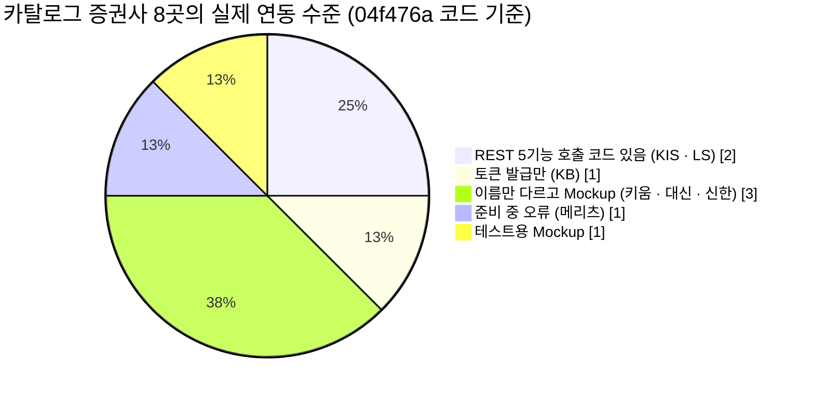
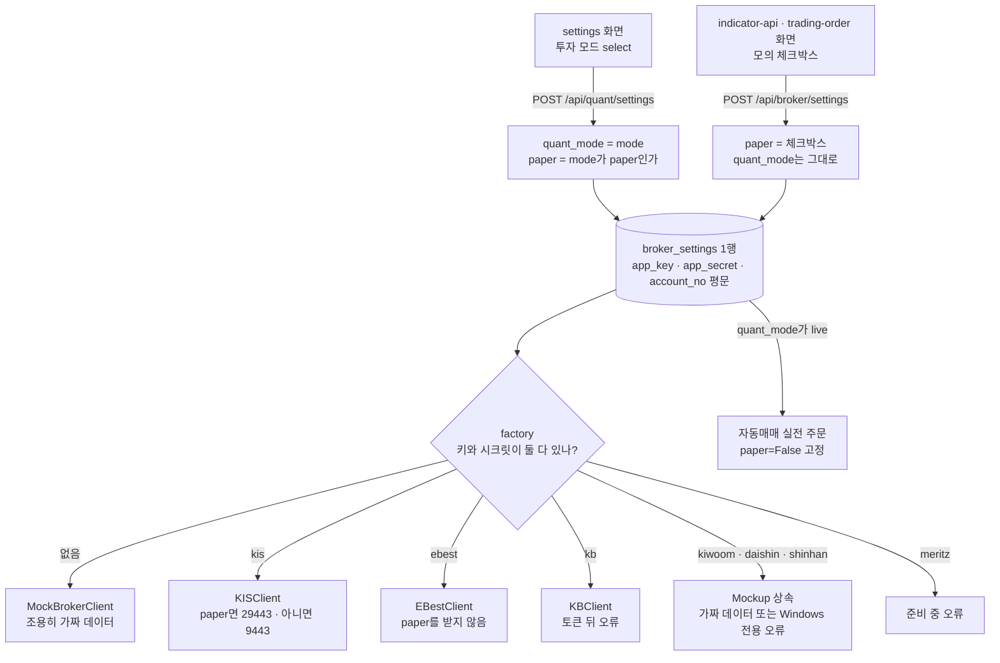
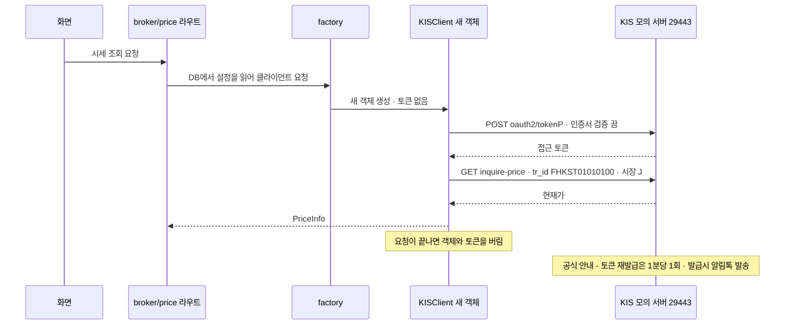
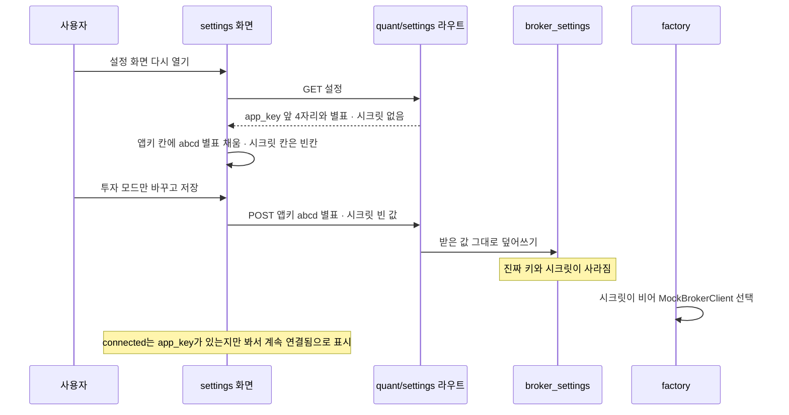
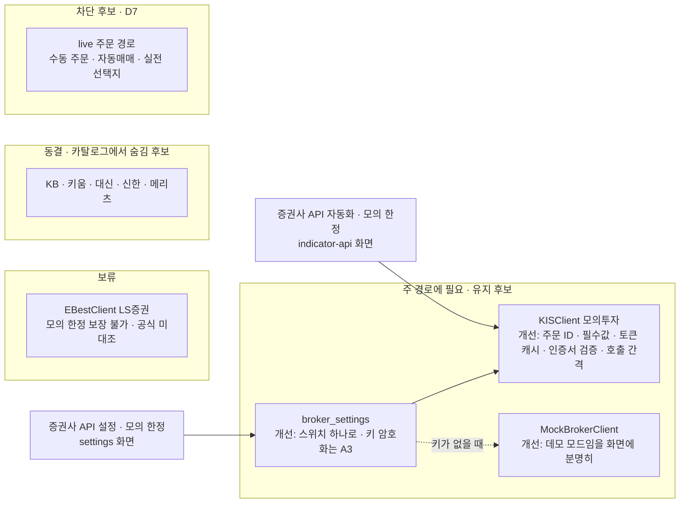

# #11 [분석] A8 [Execution] 증권사 브로커 계층 — 모의투자로 실제 연결되는 증권사는 어디인가

> 🗂️ 옛 GitHub 이슈를 옮긴 **기록 문서**입니다 — [색인](../README.md). 원문은 그대로 두고, 링크·커밋 해시만 새 자리 기준으로 바꿨습니다.

| 항목 | 내용 |
|---|---|
| 종류 | 이슈 |
| 상태 | 열림 |
| 원 작성 | 이동원(`devlee328288`) · 2026-09-15 15:22 KST |
| 라벨 | `analysis` `phase-2` `phase-3` |
| 댓글 | 1건 |
| 옛 주소 | `github.com/devlee328288/Qurious/issues/11` (지금은 열리지 않음) |

## 본문

> **읽는 순서**: 쉬운 요약 → 한눈에 보기 → 7. 2.0 판정 → 6. 결함표 → 필요하면 나머지
> 💬 **논의할 곳**: live(실전) 주문을 막을지는 **D7**, 키 저장·인증서 검증 같은 보안 상세는 **A3**, 주문·자동매매 흐름은 **A9**에서 다룹니다. 주 경로는 **D1 [#7](../discussions/007.md) 추천안(미확정)** 을 기준으로 삼았습니다.
> 🙋 **팀원 요청**: 맨 아래 "팀원 확인"에 증권사 계좌·모의투자 신청 가능 여부를 남겨 주세요. **앱키·시크릿은 절대 댓글에 올리지 마세요.**

## 쉬운 요약 (3줄)

1. 증권사 8곳이 목록에 있지만 **실제로 증권사 서버와 통신하는 코드는 한국투자증권(KIS)과 LS증권 2곳**뿐입니다. KB는 토큰까지만, 키움·대신·신한은 이름만 다르고 **가짜(Mockup) 데이터**를 돌려주며, 메리츠는 "준비 중" 오류를 냅니다.
2. KIS는 모의투자 서버를 주소로 구분하도록 짜여 있지만, **공식 최신 예제와 주문 거래 ID·필수 항목이 다르고**, 요청마다 토큰을 새로 받으며(공식: 1분당 1회 · 발급마다 알림톡), 인증서 검증을 끕니다(`verify=False`). 키가 없어 **실제로 돌려 보지는 않았습니다.**
3. 설정 화면에서 **"실전투자 (Live)"** 를 고르면 수동 주문·자동매매 모두 **실계좌 주소로 주문**합니다. D1 주 경로는 "모의 한정"이므로, 2.0에서는 **KIS 모의투자 한 곳만 깊게 살리고 live 경로는 막는 쪽**을 판정 후보로 둡니다(결정은 D7).

## 한눈에 보기 — 증권사별 실제 연동

| 증권사 | 카탈로그 표시 | 실제 동작 (`04f476a`) | 모의/실전 구분 | 판정 후보 |
|---|---|---|---|---|
| **KIS 한국투자증권** | available · "REST + WebSocket" | REST 5기능(토큰·시세·잔고·주문·일봉) 실제 호출 · **WebSocket 코드 없음** | ✅ 주소(29443/9443) + 거래 ID(V/T) | **유지·개선** |
| LS증권 (eBest) | available | REST 5기능 호출 코드 · 도메인·필드가 공식 안내와 다름 | ❌ 코드는 구분 없음 (공식: **입력한 키 종류**로 서버가 정해짐) | 보류 (2순위) |
| KB증권 | available | 토큰 발급만 · 나머지 4기능은 "경로 미설정" 오류 | ❌ 인자만 받고 안 씀 | 동결 |
| 키움증권 | available | Mockup 상속 · Windows에서만 **가짜 데이터**, Linux(Docker)에서는 오류 | ❌ | 동결 · 표시 수정 |
| 대신증권 | available | 키움과 같음 | ❌ | 동결 · 표시 수정 |
| 신한투자증권 | available | Mockup + "[SHINHAN-MOCK]" 문구 | ❌ | 동결 · 표시 수정 |
| 메리츠증권 | planned | 모든 기능 "출시 준비 중" 오류 | ❌ | 동결 |
| Mockup | available | 고정 5종목 ±2% 난수 가격 · 고정 잔고 | — | 유지 (데모·테스트, **표시를 분명히**) |



## 용어 풀이

| 용어 | 뜻 |
|---|---|
| 브로커 계층 | 앱이 증권사 API를 부르는 코드 묶음. 증권사마다 다른 호출 방식을 같은 모양(시세·잔고·주문)으로 감쌉니다. |
| Open API · 앱키/시크릿 | 증권사가 개발자에게 여는 호출 창구 · 그 창구를 쓰기 위한 **계좌별 비밀 열쇠 한 쌍** |
| 접근 토큰 | 앱키·시크릿으로 받아 일정 시간 쓰는 **임시 출입증**. 매 호출에 붙입니다. |
| 모의투자(vps) / 실전(prod) | 가짜 돈으로 체결되는 증권사 연습 서버 / 진짜 계좌 서버. KIS는 **주소와 앱키가 따로** 있습니다. |
| 거래 ID (`tr_id`) | KIS가 "어떤 기능인지" 구분하는 코드. 모의는 보통 `V`, 실전은 `T`로 시작합니다. |
| REST / WebSocket | 요청할 때마다 한 번 받아오는 방식 / 연결을 열어 두고 실시간으로 계속 받는 방식 |
| 인증서 검증 (`verify`) | 접속한 서버가 진짜 그 회사인지 확인하는 절차. 끄면 중간에서 가로채도 알 수 없습니다. |
| 평문 저장 | 암호화하지 않고 그대로 DB에 저장하는 것 |
| 호출 유량 제한 | 1초에 부를 수 있는 횟수 제한. KIS는 넘으면 `EGW00201` 오류를 줍니다. |
| NXT | 넥스트레이드(대체거래소). KIS 시세 API는 KRX·NXT·통합 시장 코드를 따로 받습니다. |

**확실도 표시**: 🟢 코드·공식 원문으로 확인 · 🟡 코드와 문서를 읽고 추론(실행으로 확인 필요)

---

## 1. 요약

- **범위**: `app/services/brokers/` 12파일(856줄), `/api/broker/*` 라우트 8개와 `/api/quant/settings` 2개([stocks.py#L327-L670](https://github.com/EST-team-project/Qurious/blob/04f476a/app/routes/stocks.py#L327-L670)), `BrokerSettings` 모델([trading.py#L39-L59](https://github.com/EST-team-project/Qurious/blob/04f476a/app/models/trading.py#L39-L59)), 자동매매의 실전 주문 함수([auto_trade.py#L139-L176](https://github.com/EST-team-project/Qurious/blob/04f476a/app/services/auto_trade.py#L139-L176)), 관련 화면 3곳.
- **범위 밖**: Alpaca 연결 테스트([paper.py#L336-L379](https://github.com/EST-team-project/Qurious/blob/04f476a/app/routes/paper.py#L336-L379)) · 외부 Open API `/openapi/v1`([openapi.py#L28](https://github.com/EST-team-project/Qurious/blob/04f476a/app/routes/openapi.py#L28)) · 자동매매 루프 → **A9**
- **결함 후보 15건**: 기능 6 · 안전 2 · 보안 2 · 운영 2 · 표시 2 · 테스트 1 (6절)

### 1.1 착수 시 나눈 질문

| 질문 | 답하는 방법 | 위치 |
|---|---|---|
| 증권사별로 실제 REST 연동이 되어 있나 | 코드 `brokers/*` | 한눈에 보기 · 2 |
| KIS 모의투자(vps)를 쓰나 | 코드 `kis.py`·`factory.py` + KIS 공식 설정 | 3.2 · 4.1 |
| `verify=False`는 어디에 있나 | 코드 검색 + httpx 문서 | 4.1 · 6 |
| 키는 어떻게 저장되나 (보안 상세는 A3) | 코드 `trading.py`·`stocks.py`·`app.html` | 4.4 |
| live 주문 경로는 ([#5](../issues/005.md) 격차표 35행) | 코드 `stocks.py`·`auto_trade.py`·`app.html` | 4.3 |
| KIS 모의투자 도메인·토큰·호출 제한·WebSocket | **외부** KIS 공식 GitHub 원문 | 4.1 · 5 |
| LS증권 모의투자 지원 방식 | **외부** LS증권 OPEN API 안내 원문 | 4.2 · 5 |

## 2. 위치·규모 (`04f476a`)

| 파일 | 줄 | 역할 | 실제 통신 |
|---|---:|---|:---:|
| [`base.py`](https://github.com/EST-team-project/Qurious/blob/04f476a/app/services/brokers/base.py) | 68 | 공통 인터페이스 5기능(`get_token`·`get_price`·`get_balance`·`place_order`·`get_daily_ohlcv`) | — |
| [`catalog.py`](https://github.com/EST-team-project/Qurious/blob/04f476a/app/services/brokers/catalog.py) | 87 | 화면에 보여줄 증권사 8곳 목록·설명 | — |
| [`factory.py`](https://github.com/EST-team-project/Qurious/blob/04f476a/app/services/brokers/factory.py) | 40 | 증권사 코드 → 클라이언트 선택. **키가 없으면 Mockup** | — |
| [`kis.py`](https://github.com/EST-team-project/Qurious/blob/04f476a/app/services/brokers/kis.py) | 190 | 한국투자증권 REST | ✅ |
| [`ebest.py`](https://github.com/EST-team-project/Qurious/blob/04f476a/app/services/brokers/ebest.py) | 180 | LS증권(eBest) REST | ✅ |
| [`kb.py`](https://github.com/EST-team-project/Qurious/blob/04f476a/app/services/brokers/kb.py) | 80 | KB증권 — 토큰만 | 🔸 |
| [`mock.py`](https://github.com/EST-team-project/Qurious/blob/04f476a/app/services/brokers/mock.py) | 88 | 가짜 시세·잔고·주문 | ❌ |
| [`kiwoom.py`](https://github.com/EST-team-project/Qurious/blob/04f476a/app/services/brokers/kiwoom.py) · [`daishin.py`](https://github.com/EST-team-project/Qurious/blob/04f476a/app/services/brokers/daishin.py) | 38 · 38 | Mockup 상속 + Windows 검사 | ❌ |
| [`shinhan.py`](https://github.com/EST-team-project/Qurious/blob/04f476a/app/services/brokers/shinhan.py) | 16 | Mockup 상속 + 문구만 바꿈 | ❌ |
| [`meritz.py`](https://github.com/EST-team-project/Qurious/blob/04f476a/app/services/brokers/meritz.py) | 31 | 모든 기능 오류 | ❌ |
| `__init__.py` | 0 | 빈 파일 | — |

**라우트** ([stocks.py](https://github.com/EST-team-project/Qurious/blob/04f476a/app/routes/stocks.py))

| 메서드 · 경로 | 줄 | 하는 일 |
|---|---|---|
| GET `/broker/catalog` | [#L377](https://github.com/EST-team-project/Qurious/blob/04f476a/app/routes/stocks.py#L377) | 증권사 목록 |
| POST `/broker/settings` | [#L382-L400](https://github.com/EST-team-project/Qurious/blob/04f476a/app/routes/stocks.py#L382-L400) | 키·계좌·`paper` 저장 |
| GET `/broker/settings` | [#L403-L426](https://github.com/EST-team-project/Qurious/blob/04f476a/app/routes/stocks.py#L403-L426) | 설정 조회(앱키 앞 4자리만) |
| GET·POST `/quant/settings` | [#L429-L505](https://github.com/EST-team-project/Qurious/blob/04f476a/app/routes/stocks.py#L429-L505) | 키·계좌 + **투자 모드(paper/live)** + 자동매매 설정 저장 |
| GET `/broker/price` · `/broker/balance` · `/broker/ohlcv` | [#L522-L580](https://github.com/EST-team-project/Qurious/blob/04f476a/app/routes/stocks.py#L522-L580) | 시세·잔고·일봉 |
| POST `/broker/order` | [#L590-L656](https://github.com/EST-team-project/Qurious/blob/04f476a/app/routes/stocks.py#L590-L656) | 증권사 주문 |
| GET `/broker/test` | [#L659-L670](https://github.com/EST-team-project/Qurious/blob/04f476a/app/routes/stocks.py#L659-L670) | 삼성전자 시세로 연결 테스트 |

**화면** ([public/app.html](https://github.com/EST-team-project/Qurious/blob/04f476a/public/app.html))

| 화면 (`data-view`) | 줄 | D1 주 경로 이름 | 저장 API |
|---|---|---|---|
| `settings` "증권사 Open API 연결" | [#L1272-L1285](https://github.com/EST-team-project/Qurious/blob/04f476a/public/app.html#L1272-L1285) · 저장 [#L4522-L4543](https://github.com/EST-team-project/Qurious/blob/04f476a/public/app.html#L4522-L4543) | 증권사 API 설정(모의 한정) 🟡 이름 대응 | `/api/quant/settings` |
| `indicator-api` | [#L2039](https://github.com/EST-team-project/Qurious/blob/04f476a/public/app.html#L2039) · 저장 [#L3557-L3566](https://github.com/EST-team-project/Qurious/blob/04f476a/public/app.html#L3557-L3566) | 증권사 API 자동화(모의 한정) 🟢 주석 "투자 인디케이터: 증권사 API 자동화" | `/api/broker/settings` |
| `trading-order` | [#L960-L992](https://github.com/EST-team-project/Qurious/blob/04f476a/public/app.html#L960-L992) · 저장 [#L4300-L4318](https://github.com/EST-team-project/Qurious/blob/04f476a/public/app.html#L4300-L4318) | (주 경로 아님) | `/api/broker/settings` |

## 3. 역할과 데이터 흐름

### 3.1 설정 → 클라이언트 선택



- 근거: [factory.py#L24-L40](https://github.com/EST-team-project/Qurious/blob/04f476a/app/services/brokers/factory.py#L24-L40) · [stocks.py#L508-L517](https://github.com/EST-team-project/Qurious/blob/04f476a/app/routes/stocks.py#L508-L517) · [#L493-L494](https://github.com/EST-team-project/Qurious/blob/04f476a/app/routes/stocks.py#L493-L494) · [#L397](https://github.com/EST-team-project/Qurious/blob/04f476a/app/routes/stocks.py#L397) · [auto_trade.py#L154-L163](https://github.com/EST-team-project/Qurious/blob/04f476a/app/services/auto_trade.py#L154-L163) 🟢

### 3.2 KIS 시세 한 번 조회할 때 🟢 코드 · 🟡 서버 반응



- 요청마다 `_get_broker_client`가 새 클라이언트를 만듭니다([stocks.py#L508-L517](https://github.com/EST-team-project/Qurious/blob/04f476a/app/routes/stocks.py#L508-L517)). 토큰은 객체 안에만 있고 만료 확인도 없습니다(`_token_exp`는 선언만, [kis.py#L21-L22](https://github.com/EST-team-project/Qurious/blob/04f476a/app/services/brokers/kis.py#L21-L22) · [#L52-L54](https://github.com/EST-team-project/Qurious/blob/04f476a/app/services/brokers/kis.py#L52-L54)). 🟢
- 그래서 **1분 안에 두 번 조회하면 두 번째 토큰 발급이 막힐 수 있습니다.** 🟡 실행 확인 필요

## 4. 핵심 진입점

### 4.1 KIS 클라이언트 — 공식 예제와 대조

KIS 공식 저장소 [koreainvestment/open-trading-api](https://github.com/koreainvestment/open-trading-api) `main` 브랜치 원문(조회 2026-09-15 KST)과 한 줄씩 비교했습니다.

| 항목 | 우리 코드 | KIS 공식 | 일치 |
|---|---|---|:---:|
| 모의 REST 주소 | `openapivts.koreainvestment.com:29443` [kis.py#L12](https://github.com/EST-team-project/Qurious/blob/04f476a/app/services/brokers/kis.py#L12) | 같음 ([kis_devlp.yaml](https://github.com/koreainvestment/open-trading-api/blob/main/kis_devlp.yaml)) | ✅ |
| 모의/실전 앱키 | 한 칸에 하나만 저장 [trading.py#L48-L51](https://github.com/EST-team-project/Qurious/blob/04f476a/app/models/trading.py#L48-L51) | "**모의투자** 및 **실전투자** 앱키 각각 준비" ([README](https://github.com/koreainvestment/open-trading-api/blob/main/README.md)) | 🔸 모의↔실전 전환 시 키도 바꿔야 함 |
| 토큰 경로 | `/oauth2/tokenP` [#L40](https://github.com/EST-team-project/Qurious/blob/04f476a/app/services/brokers/kis.py#L40) | `/oauth2/tokenP` ([kis_auth.py](https://github.com/koreainvestment/open-trading-api/blob/main/examples_llm/kis_auth.py)) | ✅ |
| 토큰 재사용 | 요청마다 새로 발급 (3.2) | 파일에 저장해 재사용 · "6시간 이내 발급시 기존 token값 유지, **발급시 알림톡 무조건 발송**" · README "토큰 재발급 - **1분당 1회** 발급됩니다." | ❌ |
| 인증서 검증 | `verify=False` **5곳** [#L38](https://github.com/EST-team-project/Qurious/blob/04f476a/app/services/brokers/kis.py#L38) · [#L60](https://github.com/EST-team-project/Qurious/blob/04f476a/app/services/brokers/kis.py#L60) · [#L84](https://github.com/EST-team-project/Qurious/blob/04f476a/app/services/brokers/kis.py#L84) · [#L146](https://github.com/EST-team-project/Qurious/blob/04f476a/app/services/brokers/kis.py#L146) · [#L166](https://github.com/EST-team-project/Qurious/blob/04f476a/app/services/brokers/kis.py#L166) | 공식 샘플은 끄지 않음(`requests` 기본값) | ❌ |
| 호출 간격 | 없음 | 공식 샘플 대기 시간 모의 `0.5`초 · 실전 `0.05`초 · README "모의투자 계좌는 REST API 호출 제한이 낮습니다" (`EGW00201`) | ❌ |
| 시세 거래 ID · 시장 | `FHKST01010100` · `J` [#L63-L64](https://github.com/EST-team-project/Qurious/blob/04f476a/app/services/brokers/kis.py#L63-L64) | 실전·모의 모두 `FHKST01010100` · 시장 "J:KRX, NX:NXT, UN:통합" ([inquire_price.py](https://github.com/koreainvestment/open-trading-api/blob/main/examples_llm/domestic_stock/inquire_price/inquire_price.py)) | ✅ · 🔸 NXT 미반영 |
| 잔고 거래 ID | `VTTC8434R` / `TTTC8434R` [#L83](https://github.com/EST-team-project/Qurious/blob/04f476a/app/services/brokers/kis.py#L83) | 같음 ([inquire_balance.py](https://github.com/koreainvestment/open-trading-api/blob/main/examples_llm/domestic_stock/inquire_balance/inquire_balance.py)) | ✅ |
| 잔고 연속조회 | 없음(빈 키로 한 번만) [#L98-L99](https://github.com/EST-team-project/Qurious/blob/04f476a/app/services/brokers/kis.py#L98-L99) | "모의계좌의 경우, 한 번의 호출에 **최대 20건**까지 확인 가능하며, 이후의 값은 연속조회" | 🔸 |
| **현금주문 거래 ID** | 매수 `VTTC0802U` · 매도 `VTTC0801U` (실전 `TTTC0802U`·`TTTC0801U`) [#L141-L144](https://github.com/EST-team-project/Qurious/blob/04f476a/app/services/brokers/kis.py#L141-L144) | 모의 매수 **`VTTC0012U`** · 매도 **`VTTC0011U`** (실전 `TTTC0012U`·`TTTC0011U`) ([order_cash.py](https://github.com/koreainvestment/open-trading-api/blob/main/examples_llm/domestic_stock/order_cash/order_cash.py)) | ❌ |
| **주문 필수값** | `EXCG_ID_DVSN_CD` 없음 [#L150-L157](https://github.com/EST-team-project/Qurious/blob/04f476a/app/services/brokers/kis.py#L150-L157) | `excg_id_dvsn_cd (str): [필수] 거래소ID구분코드 (KRX)` | ❌ |
| WebSocket | 없음 (카탈로그 설명만 "REST + WebSocket" [catalog.py#L9](https://github.com/EST-team-project/Qurious/blob/04f476a/app/services/brokers/catalog.py#L9)) | 접속키 `/oauth2/Approval` · 모의 `ws://ops.koreainvestment.com:31000` | — |

- 공식 주문 예제 설명에 "TTC0802U(현금매수) 사용하셔서 미수매수 가능합니다"라는 옛 ID 문구가 남아 있어, **옛 ID를 아직 받아 주는지는 알 수 없습니다.** 🟡
- 공식 포털 공지 목록에 "[중요] API 변경에 따른 안내 2026.08.27" · "[중요] KRX 애프터마켓 도입 및 NXT 제도 변경에 따른 안내 2026.09.09"가 있습니다([KIS Developers](https://apiportal.koreainvestment.com/intro)). 본문은 화면이 스크립트로만 그려져 읽지 못했습니다.

### 4.2 LS증권 클라이언트 — 공식 안내와 대조

| 항목 | 우리 코드 | LS증권 공식 ([OPEN API 이용안내](https://openapi.ls-sec.co.kr/howto-use)) | 일치 |
|---|---|---|:---:|
| REST 주소 | `https://openapi.ebestsec.co.kr` (포트 없음 = 443) [ebest.py#L10](https://github.com/EST-team-project/Qurious/blob/04f476a/app/services/brokers/ebest.py#L10) | `BASE_URL = "https://openapi.ls-sec.co.kr:8080"` | ❌ 옛 도메인 동작 여부 미확인 🟡 |
| 모의/실전 | 구분 없음 — 모의·실전 주소를 같게 적음 [#L3-L5](https://github.com/EST-team-project/Qurious/blob/04f476a/app/services/brokers/ebest.py#L3-L5), 팩토리도 `paper`를 넘기지 않음 [factory.py#L38-L39](https://github.com/EST-team-project/Qurious/blob/04f476a/app/services/brokers/factory.py#L38-L39) | "모의투자 App Key, Secret Key는 별도 발급이 필요합니다." · "**발급받은 App Key, Secret Key에 따라 접속 시 운영 또는 모의투자 서버로 자동접속**됩니다." | 🔸 앱이 모의 한정을 **보장할 수 없음** |
| 토큰 요청 필드 | `appsecret` [#L34](https://github.com/EST-team-project/Qurious/blob/04f476a/app/services/brokers/ebest.py#L34) | `"appsecretkey":APP_SECRET` | ❌ 🟡 |
| 토큰 유효기간 | 응답 없으면 86400초로 가정 [#L42](https://github.com/EST-team-project/Qurious/blob/04f476a/app/services/brokers/ebest.py#L42) | "신청일로부터 익일 07시까지" | 🔸 |
| 계좌 비밀번호 | `"0000"` 고정 [#L81](https://github.com/EST-team-project/Qurious/blob/04f476a/app/services/brokers/ebest.py#L81) · [#L135](https://github.com/EST-team-project/Qurious/blob/04f476a/app/services/brokers/ebest.py#L135) | (API 가이드 확인 못 함) | 🟡 |
| API 경로 `/stock/sise` 등 | [#L53](https://github.com/EST-team-project/Qurious/blob/04f476a/app/services/brokers/ebest.py#L53) · [#L75](https://github.com/EST-team-project/Qurious/blob/04f476a/app/services/brokers/ebest.py#L75) · [#L130](https://github.com/EST-team-project/Qurious/blob/04f476a/app/services/brokers/ebest.py#L130) · [#L155](https://github.com/EST-team-project/Qurious/blob/04f476a/app/services/brokers/ebest.py#L155) | (API 가이드가 스크립트 화면이라 확인 못 함) | ❓ |
| 인증서 검증 | 기본값(검증함) | 공식 예시는 `requests.post(URL, verify=False, …)` | (공식 예시가 오히려 끔) |
| 이용 조건 | — | "당사 계좌를 보유중인 고객(개인/법인)에게 제공" · xingAPI 신청 후 OPEN API 신청 ([소개](https://openapi.ls-sec.co.kr/about-openapi)) | — |

### 4.3 live(실전) 주문 경로 — [#5](../issues/005.md) 격차표 35행 🟢

| 경로 | 조건 | 결과 | 근거 |
|---|---|---|---|
| 화면 선택지 | `settings` 화면 "투자 모드" | **"실전투자 (Live)"** 를 고를 수 있음 | [app.html#L1281-L1285](https://github.com/EST-team-project/Qurious/blob/04f476a/public/app.html#L1281-L1285) |
| 설정 저장 | 모드를 live로 저장 | `paper = False` · `quant_mode = "live"` | [stocks.py#L493-L494](https://github.com/EST-team-project/Qurious/blob/04f476a/app/routes/stocks.py#L493-L494) |
| **수동 주문** | `paper = False` + KIS 키 | KIS **실전 주소(9443)** 로 주문 | [stocks.py#L512-L517](https://github.com/EST-team-project/Qurious/blob/04f476a/app/routes/stocks.py#L512-L517) · [#L628-L630](https://github.com/EST-team-project/Qurious/blob/04f476a/app/routes/stocks.py#L628-L630) · [kis.py#L19](https://github.com/EST-team-project/Qurious/blob/04f476a/app/services/brokers/kis.py#L19) |
| **자동매매** | `quant_mode = "live"` + 키·계좌 + mock 아님 | 가상 체결 뒤 `paper=False`로 **실제 주문** | [auto_trade.py#L154-L165](https://github.com/EST-team-project/Qurious/blob/04f476a/app/services/auto_trade.py#L154-L165) |
| LS 수동 주문 | 실전 키를 넣으면 | 모드와 관계없이 운영 서버 | 4.2 |
| 기본값 | — | `paper = True` · `quant_mode = "paper"` | [trading.py#L51-L53](https://github.com/EST-team-project/Qurious/blob/04f476a/app/models/trading.py#L51-L53) · [stocks.py#L342](https://github.com/EST-team-project/Qurious/blob/04f476a/app/routes/stocks.py#L342) |

**모의/실전 스위치가 두 개입니다** 🟢 논리 · 🟡 화면에서 실제로 이 상태가 되는지는 미확인

| 저장한 화면 | `paper` | `quant_mode` | 수동 주문 | 자동매매 |
|---|---|---|---|---|
| `settings`에서 live 저장 | False | live | 실전 | 실전 |
| 그 뒤 `indicator-api`에서 모의 체크 저장 | **True** | **live 유지** | 모의 | **실전** |
| `indicator-api`에서 모의 체크 해제 저장 | **False** | paper | **실전** | 가상만 |

- `/api/broker/settings`는 `paper`만 바꾸고([#L397](https://github.com/EST-team-project/Qurious/blob/04f476a/app/routes/stocks.py#L397)), `/api/quant/settings`는 화면이 보낸 `paper` 체크박스를 **무시**합니다(입력 모델에 `paper`가 없고 `extra="ignore"`, [#L345-L360](https://github.com/EST-team-project/Qurious/blob/04f476a/app/routes/stocks.py#L345-L360) · 화면 [app.html#L4541](https://github.com/EST-team-project/Qurious/blob/04f476a/public/app.html#L4541)).

### 4.4 키 저장 방식 (보안 상세는 A3)

| 사실 | 근거 | 확실도 |
|---|---|:---:|
| `app_key`·`app_secret`·`account_no`를 **평문 문자열 컬럼**에 저장 | [trading.py#L48-L50](https://github.com/EST-team-project/Qurious/blob/04f476a/app/models/trading.py#L48-L50) · [stocks.py#L394-L396](https://github.com/EST-team-project/Qurious/blob/04f476a/app/routes/stocks.py#L394-L396) · [#L490-L492](https://github.com/EST-team-project/Qurious/blob/04f476a/app/routes/stocks.py#L490-L492) | 🟢 |
| 조회 응답: 앱키는 앞 4자리 + `****`, 시크릿은 안 내려줌, **계좌번호는 전체** | [stocks.py#L418-L426](https://github.com/EST-team-project/Qurious/blob/04f476a/app/routes/stocks.py#L418-L426) | 🟢 |
| `.env.example`의 `KIS_*`·`EBEST_*` 키는 앱이 읽지 않음 | [#9](../issues/009.md) §6.3 | 🟢 |
| **설정 화면을 다시 열어 저장하면 키가 망가질 수 있음** | 아래 흐름도 | 🟢 경로 · 🟡 실행 |



- 근거: 화면 채우기 [app.html#L4496](https://github.com/EST-team-project/Qurious/blob/04f476a/public/app.html#L4496) · 저장 [#L4538-L4539](https://github.com/EST-team-project/Qurious/blob/04f476a/public/app.html#L4538-L4539) · 덮어쓰기 [stocks.py#L490-L491](https://github.com/EST-team-project/Qurious/blob/04f476a/app/routes/stocks.py#L490-L491) · Mockup 선택 [factory.py#L24-L25](https://github.com/EST-team-project/Qurious/blob/04f476a/app/services/brokers/factory.py#L24-L25) · 연결 표시 [stocks.py#L452](https://github.com/EST-team-project/Qurious/blob/04f476a/app/routes/stocks.py#L452) · [app.html#L4508-L4509](https://github.com/EST-team-project/Qurious/blob/04f476a/public/app.html#L4508-L4509)

## 5. 외부 의존과 비용 (조회일 2026-09-15 KST, 원문 전체를 받아 확인한 문장만)

| 출처 | 확인한 원문 | 쓰인 곳 |
|---|---|---|
| [KIS README](https://github.com/koreainvestment/open-trading-api/blob/main/README.md) | "**모의투자** 및 **실전투자** 앱키 각각 준비" · `ka.auth(svr="prod", product="01") # 모의투자: svr="vps"` · "토큰 재발급 - 1분당 1회 발급됩니다." · "모의투자 계좌는 REST API 호출 제한이 낮습니다." | 4.1 |
| [KIS kis_devlp.yaml](https://github.com/koreainvestment/open-trading-api/blob/main/kis_devlp.yaml) | 실전 REST `:9443` · 모의 REST `:29443` · 실전 WS `ws://ops.koreainvestment.com:21000` · 모의 WS `:31000` | 4.1 · D2 [#10](../discussions/010.md) |
| [KIS kis_auth.py](https://github.com/koreainvestment/open-trading-api/blob/main/examples_llm/kis_auth.py) | 토큰 파일 저장·재사용 · "6시간 이내 발급시 기존 token값 유지, 발급시 알림톡 무조건 발송" · 대기 시간 `prod 0.05` / `vps 0.5` · 모의는 거래 ID 앞자리를 `V`로 바꿈 | 3.2 · 4.1 |
| KIS 예제 [order_cash.py](https://github.com/koreainvestment/open-trading-api/blob/main/examples_llm/domestic_stock/order_cash/order_cash.py) · [inquire_balance.py](https://github.com/koreainvestment/open-trading-api/blob/main/examples_llm/domestic_stock/inquire_balance/inquire_balance.py) · [inquire_price.py](https://github.com/koreainvestment/open-trading-api/blob/main/examples_llm/domestic_stock/inquire_price/inquire_price.py) | 주문 `VTTC0012U`/`VTTC0011U` · `EXCG_ID_DVSN_CD` 필수 · 잔고 `VTTC8434R`, 모의 한 번에 최대 20건 · 시세 `FHKST01010100`, 시장 J·NX·UN | 4.1 |
| [LS증권 OPEN API 이용안내](https://openapi.ls-sec.co.kr/howto-use) | 모의 키 별도 발급 · 키에 따라 운영/모의 서버 자동 접속 · `BASE_URL = "https://openapi.ls-sec.co.kr:8080"` · `"appsecretkey"` · 토큰 "익일 07시까지" · 웹소켓 별도 포트 | 4.2 |
| [httpx SSL 문서](https://www.python-httpx.org/advanced/ssl/) | "By default httpx will verify HTTPS connections" · "You can disable SSL verification completely and allow insecure requests" | 4.1 · 6 |
| HF Spaces 네트워크 (D2 [#10](../discussions/010.md) §2.2.2) | 밖으로 나가는 요청은 80·443·8080만 → KIS 29443·9443 차단, LS 8080 허용 | 7 |

**비용**
- ~~조사한 KIS·LS 공식 페이지에는 API 이용 요금 언급이 없습니다. **0원으로 추정**합니다. 🟡~~
  🔵 **2026-09-19 보강** — KIS **약관 제11조**에 *수수료 부과* 조항이 **있습니다**(단 "0원이면 해당 없음"). 즉 "요금 언급이 없다"가 아니라 **"부과할 수 있되 현재 금액을 확인 못 했다"** 가 정확한 서술입니다. 여전히 🟡 이고, **확인 방법이 생겼습니다** — 포털 게시 항목을 보면 됩니다([#33](../issues/033.md) §6.1).
- 대신 **각 증권사 계좌가 필요**합니다. KIS README는 "계좌 개설 및 ID 연결", LS 안내는 "당사 계좌를 보유중인 고객"에게 제공한다고 적었습니다. 🟢
- 모의투자 앱키도 따로 신청해야 합니다(두 곳 모두). 🟢

### 5.1 ★ 2026-09-19 추가 — 약관을 읽었고, 모의 키로 실제 호출했습니다

이 문서를 쓸 때는 **약관을 한 번도 읽지 않은 상태**였고 *"키가 없어 실행 검증을 하지 않았다"* 가 한계였습니다. 그 뒤 S26~S27에서 둘 다 했습니다. 전문 정리는 [#33](../issues/033.md) §6.1에 있고, 여기에는 **A8(브로커 계층)에 직접 걸리는 것**만 옮깁니다.

#### 5.1.1 약관에서 A8에 걸리는 조항 (전문 21개 조 · 제정 2022-08-08 · 시행 2022-10-01)

| 조항 | 원문 요지 | A8에서 무엇이 달라지나 | 확실도 |
|---|---|---|:---:|
| **제5조②** | 앱키·시크릿키를 **제3자에게 대여·위임·양도·누설 금지** | 🔴 **팀원끼리 키를 공유할 수 없습니다.** 4.4 "키 저장 방식"은 *한 사람의 키를 앱에 넣는* 구조인데, 그 앱을 팀이 함께 쓰면 **누설에 해당하는지 따져야 합니다.** 아래 5.1.3 | 🟢 원문 |
| **제5조③** | 시세정보를 **"직접 개발한 프로그램 등 개인의 업무에 한하여"** 이용 · **제3자 제공 금지** | 🔴 팀 공유·재배포 불가. 포털·KRX와 **같은 결론**입니다 | 🟢 원문 |
| **제9조①4 · 제10조①6** | 서버에 **일정수준 이상 부하**를 주면 이용 **중지·해지** | 🔴 **KIS로 대량 백필을 하면 안 됩니다.** 결함 4(호출 간격 없음)의 심각도가 "느려진다"가 아니라 **"계정이 막힌다"** 로 올라갑니다 | 🟢 원문 |
| 제10조①4 | 최근 **1년간 이용 실적 없으면 해지** | 🟡 발표 뒤 방치 주의 | 🟢 원문 |
| 제11조 | 수수료 부과 (0원이면 해당 없음) | 위 "비용" 참고 | 🟢 원문 |
| 제12조 | 유량 제어는 **회사가 정해 게시** | 게시 수치를 못 찾아 **직접 쟀습니다**(5.1.2) | 🟢 |
| **제17조②1** | 키 유출로 인한 부정사용은 **고객 책임** | 🔴 결함 5(`verify=False`)·결함 6(평문 저장)의 무게가 달라집니다 — 사고가 나면 **증권사가 아니라 우리 책임**입니다 | 🟢 원문 |

#### 5.1.2 모의 키로 실호출 — 한계 두 개가 풀렸습니다 ✅

**모의 키(`KIS_MOCK_*`)로만 했습니다. 실계좌 키는 읽지도 않았습니다.**

| 검증 | 결과 |
|---|---|
| 토큰 발급 `POST /oauth2/tokenP` | HTTP 200 · `expires_in` **86,400초(24시간)** · Bearer |
| 현재가 `inquire-price` (삼성전자) | HTTP 200 · `rt_cd=0` · 응답 필드 **80개** |
| 일별 차트 `inquire-daily-itemchartprice` | HTTP 200 · `output2` 필드 **13개** |
| 유량 응답 헤더 | **없음** — 포털이 주는 `X-RateLimit-*` 3종이 KIS에는 없습니다 |

**유량 실측** (약관 제12조가 "게시한다"는데 게시 수치를 못 찾아 직접 쟀습니다)

| 시험 | 결과 |
|---|---|
| 단독 호출 (앞뒤 여유) | ✅ 59ms |
| **무휴식 연속 6회** | ✅❌✅❌❌❌ — **6회 중 4회 실패** |
| **0.5초 간격 4회** | ✅✅✅❌ — **4회째에 걸림** |

```
실패는 이렇게 옵니다

  HTTP 500  ·  rt_cd = 1  ·  msg_cd = EGW00201
  msg1 = "초당 거래건수를 초과하였습니다."
```

→ 모의 도메인은 대략 **초당 2건**입니다. 0.5초 간격도 4회째에 걸렸으므로 **0.6~1.0초 간격**을 권합니다. 🟡 실전 도메인은 **재지 않았습니다**(실계좌 키를 승인 없이 쓰지 않았습니다).

**그래서 이 문서의 한계 두 줄이 해소됩니다**

| 원래 한계 | 지금 |
|---|---|
| ~~"키가 없어 실행 검증을 하지 않았습니다"~~ | ✅ **조회·토큰은 실호출로 확인.** 🔴 **주문은 여전히 안 해봤습니다** → 결함 1·2(주문 ID·필수값)는 그대로 🟡 |
| ~~"KIS 모의투자 초당 호출 수치를 공식 원문에서 찾지 못했습니다"~~ | ✅ **실측 초당 약 2건** |

#### 5.1.3 🟡 풀리지 않은 것 — "팀원이 제3자인가"

제5조②(키 누설 금지)와 제5조③(시세 제3자 제공 금지)이 **팀 프로젝트에서 어디까지 걸리는지** 판단이 필요합니다.

| 상황 | 걸리나 |
|---|---|
| 내 키를 팀원에게 알려 준다 | 🔴 **명백히 금지** (제5조②) |
| 내 키를 넣은 앱을 팀원이 화면으로 쓴다 | 🟡 키는 안 넘어가지만, **시세는 넘어갑니다** (제5조③) |
| 팀원이 각자 키를 발급받아 각자 쓴다 | 🟢 문제 없음 — 다만 **4명 모두 계좌·모의투자 신청**이 필요합니다 |

→ 아래 "팀원 확인" 항목이 **그래서 중요합니다.** 각자 키를 받는 것이 가장 깨끗한 길인데, 그러려면 계좌가 있어야 합니다.

---

## 6. 품질 관찰 — ~~결함 후보 15건~~ **16건** (2026-09-19 · 조회 경로는 실행 검증함 · 주문 경로는 여전히 미검증)

| # | 분류 | 결함 | 영향 | 확실도 | 넘길 곳 |
|---:|---|---|---|:---:|---|
| 1 | 기능 | KIS 현금주문 거래 ID가 공식 최신과 다름 (`0802U/0801U` ↔ `0012U/0011U`) | 모의 주문 거부 가능 | 🟢 차이 · 🟡 영향 | A9 · D7 |
| 2 | 기능 | KIS 주문에 필수값 `EXCG_ID_DVSN_CD` 없음 | 주문 거부 가능 | 🟢 차이 · 🟡 영향 | A9 |
| 3 | 운영 | 요청마다 토큰 새로 발급 · 만료 확인 없음 | 1분 1회 제한에 걸림 · 발급마다 알림톡 | 🟢 코드 · 🟡 영향 | 개선 |
| 4 | 운영 → **안전** | 호출 간격·재시도 없음 (`kis.py` 전체에 `sleep`·`retry`·`except` **0건**) | ~~모의 유량 초과~~ → **실측: 무휴식 6회 중 4회 실패 · 0.5초 간격도 4회째 실패**(5.1.2). 약관 제9조①4에 따르면 부하 유발은 **이용 중지·해지** 사유 | ~~🟡~~ **🟢 실측** | 개선 → **D7**(자동매매 주기) |
| 5 | 보안 | KIS 호출 5곳 `verify=False` | 가로챈 연결에 키·토큰이 넘어갈 수 있음 | 🟢 | A3 |
| 6 | 보안 | 키·시크릿·계좌번호 평문 저장 · 조회 시 계좌번호 전체 노출 | DB가 새면 키도 샘 | 🟢 | A3 |
| 7 | 기능 | 설정 재저장 시 가려진 키·빈 시크릿으로 덮어써져 **조용히 Mockup으로 전환**, 화면은 계속 "연결됨" | 가짜 데이터를 실제 연동으로 오해 | 🟢 경로 · 🟡 실행 | A13 · 개선 |
| 8 | 안전 | 모의/실전 스위치가 두 개(`paper` · `quant_mode`) | 수동 주문과 자동매매가 서로 다른 서버로 감 | 🟢 논리 · 🟡 도달 | D7 |
| 9 | 안전 | live 주문 경로(수동·자동)와 "실전투자 (Live)" 선택지 | RFP 제외 범위 "실거래 자동 주문" | 🟢 | **D7** ([#5](../issues/005.md) 35행) |
| 10 | 표시 | 카탈로그가 키움·대신·신한을 "available"로 표시하지만 Mockup | 실제 연동으로 오해 | 🟢 | D3 |
| 11 | 표시 | 카탈로그 KIS 설명 "REST + WebSocket" · "국내 유일 REST API"([catalog.py#L9-L11](https://github.com/EST-team-project/Qurious/blob/04f476a/app/services/brokers/catalog.py#L9-L11)) | WebSocket 코드는 없고, LS도 공식 REST를 제공 | 🟢 | D3 |
| 12 | 기능 | LS: 모의/실전을 앱이 구분 못 함 · 도메인·토큰 필드명이 공식 안내와 다름 · 계좌 비밀번호 `"0000"` 고정 | 모의 한정 보장 불가 · 연결 실패 가능 | 🟢 차이 · 🟡 영향 | 보류 |
| 13 | 기능 | 키가 없으면 오류 대신 **조용히 Mockup** · 키움·대신은 Windows에서만 가짜 데이터 | 데모에서 실제처럼 보임 | 🟢 | D7 |
| 14 | 기능 | KIS 잔고 연속조회 없음 · 시장 코드 `J`만 | 모의 21종목 이상 누락 · NXT 체결 미반영 | 🟢 코드 · 🟡 영향 | 개선 (낮음) |
| 15 | 테스트 | 브로커 계층 테스트 0개 ([#5](../issues/005.md)) | 증권사 API 변경(4.1 공지)을 감지 못 함 | 🟢 | D3 |
| **16** ★ | 기능 | **응답의 `rt_cd` 를 한 번도 보지 않습니다** — `raise_for_status()` 로 HTTP 상태만 확인하고 `output1`·`output2` 를 바로 꺼냅니다 ([kis.py:102-106](https://github.com/EST-team-project/Qurious/blob/04f476a/app/services/brokers/kis.py#L102-L106) · [kis.py:126](https://github.com/EST-team-project/Qurious/blob/04f476a/app/services/brokers/kis.py#L126)) | KIS는 **HTTP 200 인데 `rt_cd=1`** 인 응답을 줍니다. 그러면 `output` 이 비어 있고, 코드는 그것을 **"보유 종목 0개"·"데이터 없음"으로 오인**합니다. 실패가 성공처럼 보입니다 | 🟢 코드 · 🟡 200+실패 빈도 | 개선 |

## 7. 2.0 관점 1차 판정 (주 경로는 D1 [#7](../discussions/007.md) 추천안 기준 · 확정은 D3·D7)



| 대상 | 판정 후보 | 주 경로 화면 | 근거 |
|---|---|---|---|
| `KISClient` (모의) | **유지 · 개선** — 공식 예제 기준으로 주문 ID·필수값 맞춤, 토큰을 DB·파일에 캐시, `verify` 켜기, 호출 간격 | 증권사 API 설정(모의 한정) · 증권사 API 자동화(모의 한정) | 모의 서버를 **주소로 구분**하는 유일한 클라이언트 · 강사님 th03 KIS Testbed 절차([#4](../issues/004.md)) |
| `MockBrokerClient` | **유지** — 키가 없을 때 조용히 쓰지 말고 "데모 데이터"로 표시 | 전 화면 | 결함 7·13. HF Space 데모([#10](../discussions/010.md))에서는 이것만 가능 |
| live 주문 경로 | **차단 후보** | — | RFP 제외 범위 · 결함 8·9. 결정은 D7 |
| 모의/실전 스위치 | **개선** — `paper`·`quant_mode`를 하나로 | settings · indicator-api | 결함 8 |
| `BrokerSettings` 저장 | **개선** — 재저장 덮어쓰기 수정, 암호화는 A3 | settings | 결함 6·7 |
| `EBestClient` (LS) | **보류 (2순위)** | — | 모의 한정을 앱이 보장 못 함 · 공식 경로 미대조. 포트 8080이라 HF Space에서도 호출 가능한 점은 장점 |
| KB · 키움 · 대신 · 신한 · 메리츠 | **동결 · 카탈로그에서 숨김 후보** | — | 실제 연동 아님(결함 10) |
| WebSocket 실시간 | **추가하지 않음** 🟡 | — | D2 [#10](../discussions/010.md) 추천안이 "장 마감 후 하루 1회 기록". 장중 실시간을 택하면 다시 봄 |

## 근거 · 반례 · 한계

**근거**
- 브로커 파일 12개, 라우트·모델·자동매매·화면 해당 줄을 직접 읽었습니다.
- KIS·LS·httpx 외부 원문은 요약 도구를 거치지 않고 **페이지·원본 파일 전체를 받아** 해당 문장을 확인했습니다.

**반례**
- **"KIS 옛 주문 ID도 아직 받는다"**: 공식 예제 설명에 옛 ID 문구가 남아 있어 호환될 가능성이 있습니다. 그래서 결함 1은 실행 전까지 🟡입니다.
- **"LS가 더 쉽다"**: 포트 8080이라 HF Space에서도 부를 수 있고 인증서 검증도 켜져 있습니다. 그러나 모의/실전을 **키로만** 가르므로, 실전 키를 넣으면 앱이 막을 방법이 없습니다.
- **"verify=False는 증권사 공식도 쓴다"**: LS 공식 예시는 실제로 끕니다. 다만 KIS 공식 샘플은 끄지 않으며, 끄는 것이 안전한 이유는 어디에도 적혀 있지 않습니다.
- **"Mockup으로 조용히 넘어가는 게 편하다"**: 개발에는 편합니다. 하지만 발표·데모에서 가짜 데이터를 실제 연동처럼 보이게 만들어, 강사님 피드백 ④(결론에 끌려가지 않기)와 부딪힙니다.

**한계**
- ~~**키가 없어 실행 검증을 하지 않았습니다.** 🟡 항목은 모두 코드·원문 대조로 낸 추정입니다.~~ ✅ **2026-09-19 일부 해소** — 모의 키로 **토큰 발급·현재가·일별차트·유량**을 실호출해 확인했습니다(5.1.2). 🔴 **주문은 여전히 안 해봤습니다** — 결함 1·2는 그대로 🟡 이고, 모의 계좌에 실제로 주문을 넣어 봐야 확정됩니다.
- KIS 포털 공지 본문(08-27 API 변경 · 09-09 NXT 제도 변경)은 화면이 스크립트로만 그려져 읽지 못했습니다. 결함 1·2의 원인일 수 있습니다.
- ~~KIS **모의투자 초당 호출 수치**는 공식 원문에서 찾지 못했습니다(README는 "낮다"만).~~ ✅ **2026-09-19 해소 — 직접 쟀습니다. 초당 약 2건**(5.1.2). 공식 게시 문서는 여전히 못 찾았고, **실전 도메인은 재지 않았습니다** 🔴 (실계좌 키를 승인 없이 쓰지 않습니다).
- LS API 가이드(경로·필드·비밀번호 요구)는 스크립트 화면이라 확인하지 못했습니다.
- KIS 일봉 거래 ID(`FHKST01010400`)와 KB 포트(32484)는 공식 원문과 대조하지 않았습니다.
- 증권사 약관이 **자동매매·데모 공개**를 어디까지 허용하는지는 확인하지 않았습니다.
- 화면 이름과 D1 주 경로 이름의 대응 중 `settings`는 이름으로만 맞췄습니다(A13에서 확인).

## 2.0 판정을 뒤집을 조건

1. **KIS 모의 서버가 옛 주문 ID·필수값 없이도 주문을 받으면** → 결함 1·2의 우선순위를 낮춥니다.
2. **D7에서 증권사 연동 없이 앱 내 가상계좌만 쓰기로 하면** → `KISClient`도 동결하고, "증권사 API 자동화(모의 한정)"는 Mockup으로 시연합니다.
3. **팀원 대부분이 KIS 계좌·모의투자 신청을 할 수 없으면** → LS·Mockup의 순위를 다시 봅니다.
4. **강사님 3차 평가가 특정 증권사를 요구하면**(th03 커리큘럼은 KIS·KB·Alpaca, [#4](../issues/004.md)) → 그 증권사를 유지로 올립니다.
5. **D2 [#10](../discussions/010.md)에서 HF Space 데모를 택하고 증권사 호출까지 보여야 하면** → KIS 포트 차단 때문에 LS(8080) 또는 로컬 실행을 다시 봅니다.
6. **D7에서 장중 실시간 기록을 택하면** → WebSocket 추가를 다시 봅니다.

## 팀원 확인

`@rkdalstjr` `@GoonGuMa` `@janghwan-god` — 판정 3·4에 필요한 정보입니다. **앱키·시크릿·계좌번호는 적지 마세요.**

| 이름 | KIS 계좌 있음 / 개설 가능 | KIS 모의투자 신청 가능 | LS증권 계좌 있음 |
|---|---|---|---|
| 이동원 | | | |
| 강민석 | | | |
| 오준영 | | | |
| 신장환 | | | |

## 8. 관련 Issue · Discussion

- 인덱스 [#1](../issues/001.md) · A17 강사님 자료(th03 KIS Testbed) [#4](../issues/004.md) · A15 격차표(35행 live · P5 증권사 자동화) [#5](../issues/005.md) · D1 주 경로 [#7](../discussions/007.md) · A1 실행 환경(§6.3 읽히지 않는 키) [#9](../issues/009.md) · **D2 인프라·비용(§2.2.2 포트 제약) [#10](../discussions/010.md)**
- 넘길 곳: **D7** live 차단·증권사 연동 여부 · **A9** 주문·자동매매 흐름 · **A3** 키 저장·인증서 검증 · **A13** 화면 대응·재저장 덮어쓰기 · **D3** 카탈로그 정리·테스트
- 기준 커밋: Qurious `04f476a` · KIS 공식 저장소 `main`(조회 2026-09-15)

---

## 댓글 1건

---

<a id="issuecomment-5739035173"></a>

### 💬 1. 이동원(`devlee328288`) · 2026-09-19 12:35 KST

**본문을 고쳤습니다 — 5.1 절 신설 + 결함 1건 추가.** (2026-09-19)

이 문서를 쓸 때는 **약관을 읽지 않았고 키도 없었습니다.** 그 뒤 둘 다 해서 한계 두 줄이 풀렸습니다.

| 바뀐 곳 | 내용 |
|---|---|
| **5.1 신설** | 약관 정독 + 모의 키 실호출 + 🟡 남은 쟁점 |
| 6절 결함 4 | 🟡 → **🟢 실측** · 심각도 상향 |
| 6절 **결함 16 추가** | `rt_cd` 를 한 번도 보지 않음 |
| 5절 비용 | 제11조 근거로 서술 정정 |
| 한계 2줄 | ✅ 해소 (취소선으로 남김) |

**① 약관에서 A8에 걸리는 것** — 특히 두 조항이 기존 판정의 무게를 바꿉니다.
- **제9조①4** (서버 부하 유발 시 **이용 중지·해지**) → 결함 4의 영향이 "느려진다"가 아니라 **"계정이 막힌다"** 입니다.
- **제17조②1** (키 유출은 **고객 책임**) → 결함 5(`verify=False`)·6(평문 저장)은 사고가 나면 **증권사가 아니라 우리 책임**입니다.

**② 모의 키로 실호출했습니다** — 토큰 발급(24시간 유효)·현재가·일별차트 모두 정상. **유량은 실측 초당 약 2건**이고 `0.5초 간격도 4회째에 걸렸습니다`. 0.6~1.0초를 권합니다.
🔴 **주문은 여전히 안 해봤습니다** — 결함 1·2(거래 ID `VTTC0802U` ↔ 공식 `VTTC0012U`, 필수값 `EXCG_ID_DVSN_CD`)는 그대로 🟡 입니다. 모의 계좌에 실제로 주문을 넣어 봐야 확정됩니다.

**③ 결함 16 — 실패가 성공처럼 보입니다**
`kis.py` 는 `raise_for_status()` 로 **HTTP 상태만** 보고 `output1`·`output2` 를 바로 꺼냅니다. `rt_cd` 는 한 번도 확인하지 않습니다. KIS는 **HTTP 200 인데 `rt_cd=1`** 인 응답을 주는데, 그때 `output` 이 비어 있어 코드가 **"보유 종목 0개"로 오인**합니다. (수집기를 만들 때 포털에서 같은 함정을 실제로 밟았습니다 — 유량 초과 응답을 "데이터 없는 날"로 오인했습니다.)

**④ 🟡 아직 못 정한 것 — "팀원이 제3자인가"**
제5조②·③이 팀 프로젝트에 어디까지 걸리는지 갈립니다. 가장 깨끗한 길은 **각자 키를 발급받는 것**인데, 그러려면 각자 계좌가 있어야 합니다.

`@rkdalstjr` `@GoonGuMa` `@janghwan-god` — 아래 "팀원 확인"이 그래서 필요합니다. **KIS 계좌가 있으신지, 모의투자 신청이 가능하신지**만 알려 주세요. **앱키·시크릿·계좌번호는 적지 마세요.**
