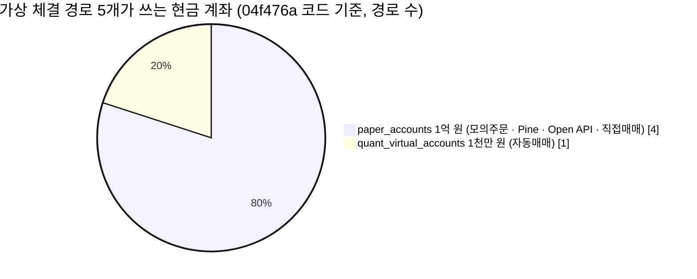
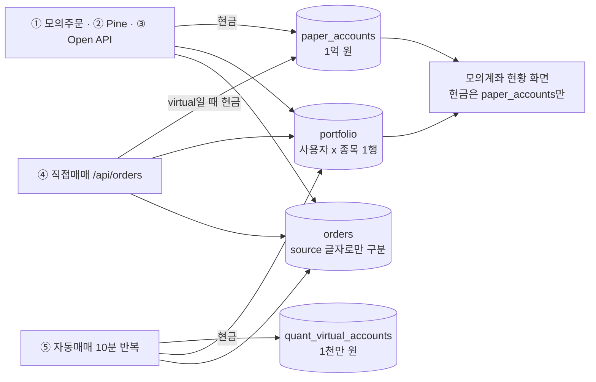
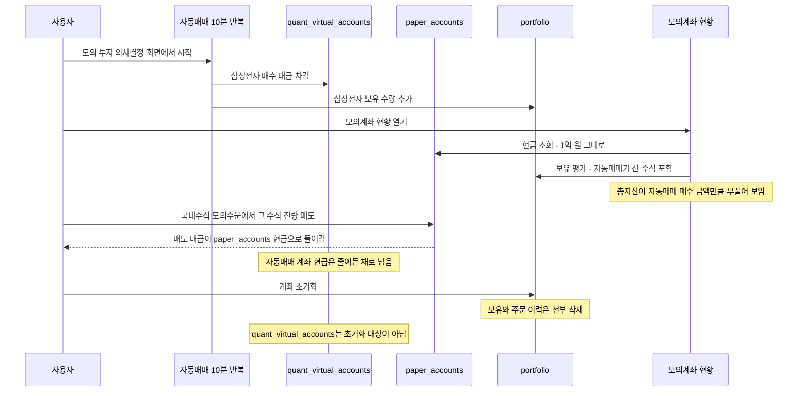
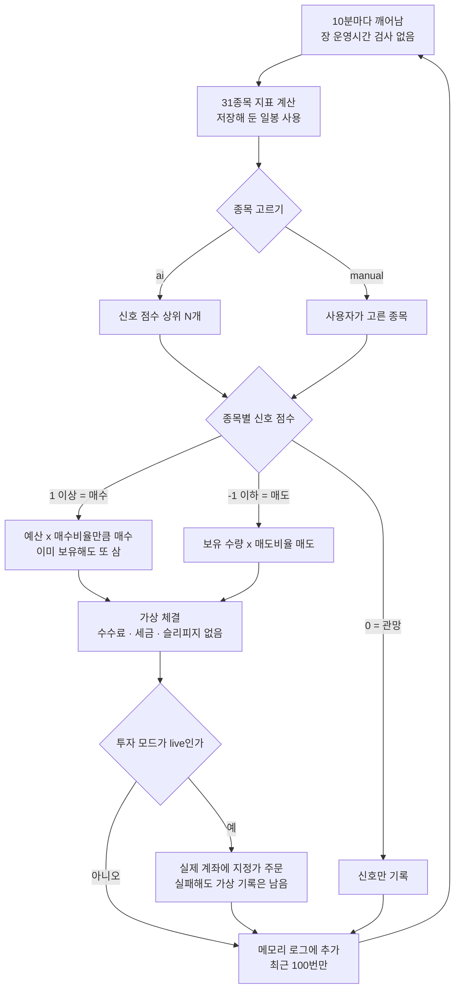
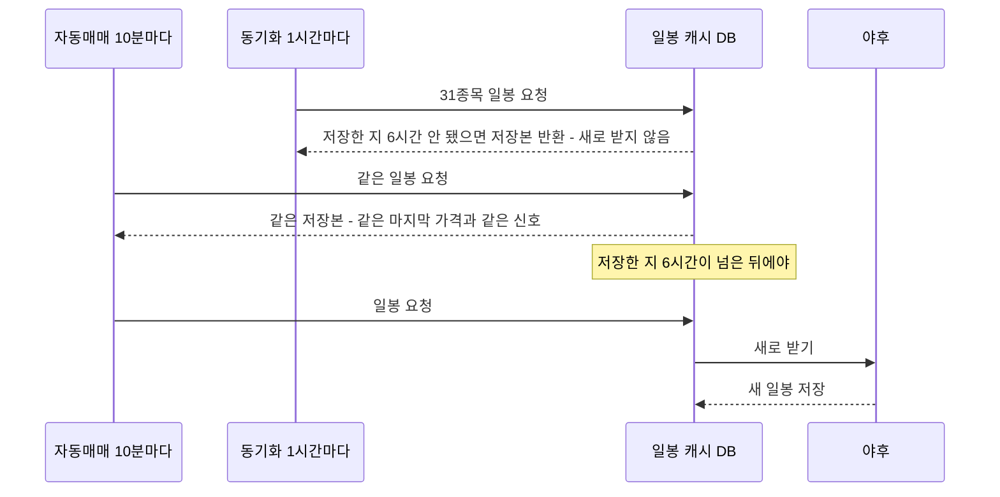
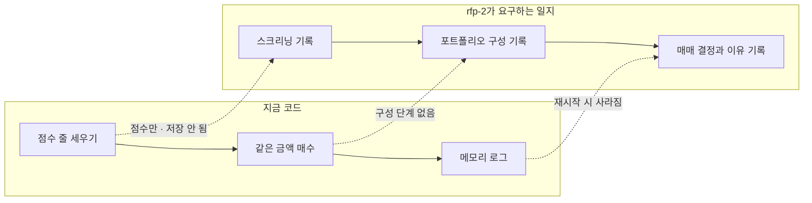
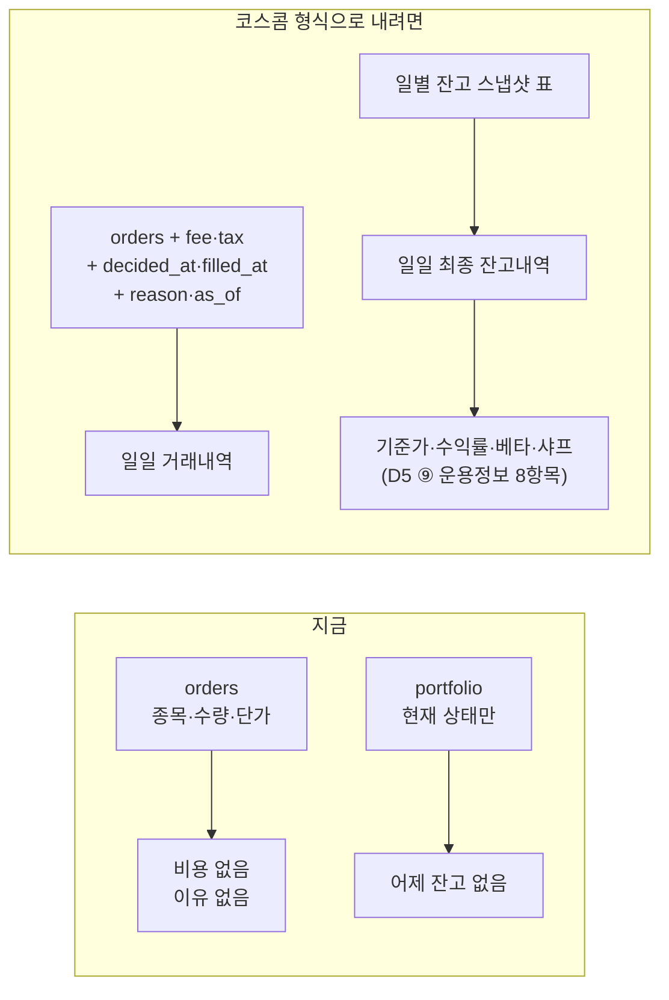
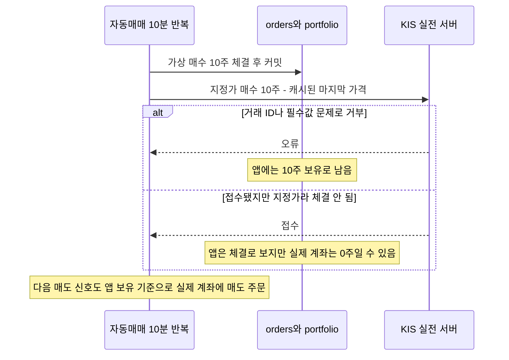
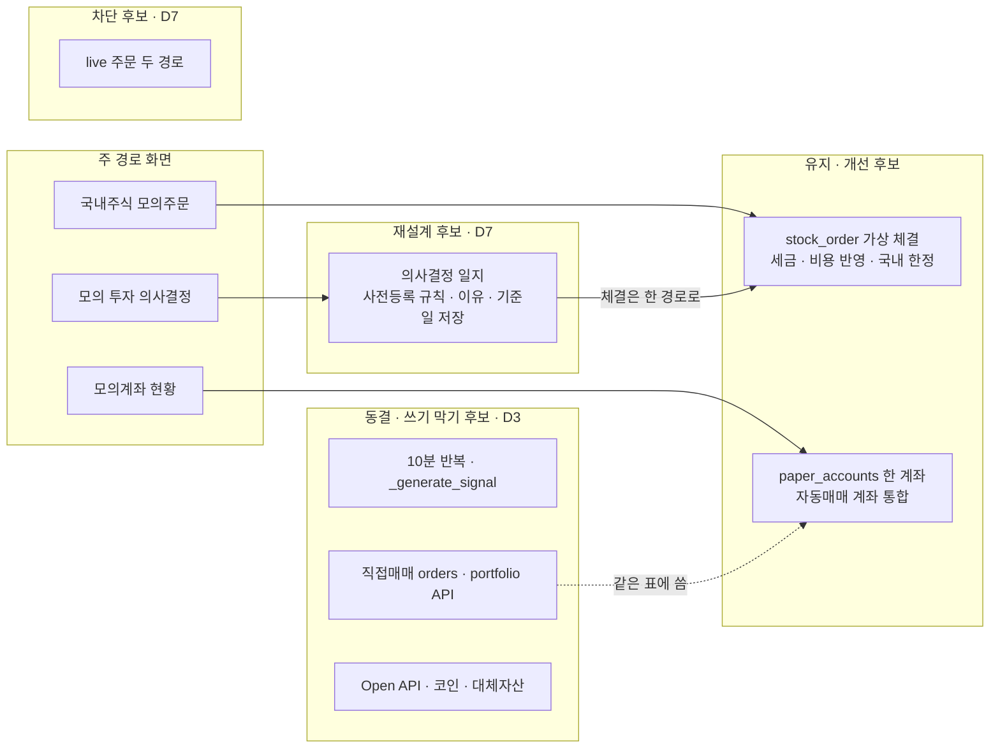

# #12 [분석] A9 [Execution] 주문·포트폴리오·자동매매 — 가상 체결은 무엇을 기록하고 무엇을 빠뜨리나

> 🗂️ 옛 GitHub 이슈를 옮긴 **기록 문서**입니다 — [색인](../README.md). 원문은 그대로 두고, 링크·커밋 해시만 새 자리 기준으로 바꿨습니다.

| 항목 | 내용 |
|---|---|
| 종류 | 이슈 |
| 상태 | 열림 |
| 원 작성 | 이동원(`devlee328288`) · 2026-09-15 16:40 KST |
| 라벨 | `analysis` `phase-2` `phase-3` |
| 댓글 | 1건 |
| 옛 주소 | `github.com/devlee328288/Qurious/issues/12` (지금은 열리지 않음) |

## 본문

> **읽는 순서**: 쉬운 요약 → 한눈에 보기 → **용어 풀이(처음이면 0절 비교표만이라도)** → 7. 2.0 판정 → 6. 결함표 → 필요하면 나머지
> 💬 **논의할 곳**: 계좌를 하나로 합칠지 · 10분 자동매매를 멈추고 "의사결정 일지"로 바꿀지 · 실제 계좌 주문(live)을 막을지는 **D7**, 동결 화면이 같은 표에 쓰는 문제는 **D3**, 백테스트 규칙 통일은 **A6**에서 다룹니다. 주 경로는 **D1 [#7](../discussions/007.md) 추천안(미확정)** 기준입니다.

## 쉬운 요약 (3줄)

1. 앱 안에서 "가짜 돈으로 사고판 것으로 치는" 길(**가상 체결**)이 **다섯 갈래**입니다. 이 다섯 갈래가 **보유 종목표(`portfolio`)와 주문 기록표(`orders`)는 하나를 같이 쓰는데, 현금은 두 계좌로 나뉩니다**(모의투자 1억 원 · 자동매매 1천만 원). 그래서 자동매매가 산 주식이 "모의계좌 현황"에는 잡히지만, 그 돈은 다른 계좌에서 빠집니다.
2. 모든 가상 체결에 **증권사 수수료 · 세금 · 슬리피지(주문하려던 가격과 실제 체결 가격의 차이)가 0원**입니다. 직접매매 주문은 **화면에 입력한 가격 그대로** 체결되고, 보유 주식이 없어도 매도 대금이 들어옵니다. 자동매매는 **최대 약 6시간 전에 받아 둔 하루 단위 가격 데이터(일봉)의 마지막 가격**으로 10분마다 체결하며, 장이 열렸는지 확인하지 않습니다.
3. 자동매매가 쓰는 매매 규칙은 **어느 백테스트(과거 데이터로 규칙 성과를 계산하는 것)에서도 검증되지 않았습니다.** 매매 이유는 앱이 켜져 있는 동안만 기억해서, rfp-2가 요구하는 "모의 투자 의사결정 일지"(스크리닝 → 포트폴리오 구성 → 매매 결정 기록)와 모양이 다릅니다. 판정 후보는 **주 경로 3화면을 "계좌 하나 · 비용 반영 · 일지 기록"으로 고치고, 10분 자동매매와 실제 계좌 주문은 동결·차단**하는 쪽입니다(결정은 D7).

## 한눈에 보기 — 가상 체결 경로 5개 + 실제 계좌 주문(live)

| # | 경로 | 화면 (D1 [#7](../discussions/007.md) 분류) | API | 체결 가격 | 현금 계좌 | 비용·세금 | 판정 후보 |
|---|---|---|---|---|---|:---:|---|
| ① | 국내주식 모의주문 | `paper-stock` (**주 경로**) | POST `/api/paper/stocks/orders` | 야후 현재가 (60초 동안 저장본 재사용) | `paper_accounts` | ❌ | **유지·개선** |
| ② | Pine 주문 | 호출하는 화면 없음 (검색 기준) | POST `/api/paper/stocks/orders/pine` | ①과 같음 | `paper_accounts` | ❌ | 보류 (3차 D6) |
| ③ | 외부 Open API | `paper-openapi` (동결) | POST `/openapi/v1/orders` | ①과 같음 | `paper_accounts` | ❌ | 동결 |
| ④ | 직접매매 주문 | `trading-order` · 미국주식 (동결) | POST `/api/orders` | **화면에 입력한 가격** | `paper_accounts` (`virtual`일 때만) | ❌ | **동결 + 쓰기 막기** |
| ⑤ | 자동매매 10분 반복 | `robo-decision` (**주 경로**) · `quant-auto` (동결) | POST `/api/quant/auto/start` | 저장해 둔 일봉의 마지막 가격 (최대 약 6시간 전) | **`quant_virtual_accounts`** | ❌ | **재설계** (D7) |
| — | 실제 계좌 주문 (live) | 수동 API는 **호출 화면 없음** · 자동매매는 `settings` 투자 모드 | `/api/broker/order` · `_place_live_order` | 증권사가 체결 | 실제 계좌 | 증권사 부과 | **차단 후보** (D7) |

- 다섯 경로 모두 **같은 `portfolio`·`orders` 표**에 씁니다. 표 안에서는 `orders.source` 칸의 글자(PAPER·PINE·OPENAPI·WEB·QUANT)로만 어느 경로인지 구분합니다([trading.py#L35-L36](https://github.com/EST-team-project/Qurious/blob/04f476a/app/models/trading.py#L35-L36)). 🟢



## 용어 풀이

> 팀원이 헷갈렸던 사례가 있어, 이 문서의 용어는 **정확한 뜻 → 이 문서에서 가리키는 것 → 헷갈리기 쉬운 점** 순서로 풉니다. 코드 동작을 설명한 칸에는 확실도를 붙였습니다.

### 0. 먼저 구분할 것 — "모의투자"가 세 가지 뜻으로 쓰입니다

| 구분 | 누가 체결하나 | 돈 | 이 앱에서 | 이 문서의 이름 |
|---|---|---|---|---|
| **앱 안 가상 체결** | 이 앱이 DB 숫자만 바꿈 (거래소·증권사를 거치지 않음) | 가짜 | 메뉴 "모의투자" · "모의 투자 의사결정" · 직접매매 `virtual` | 가상 체결 (경로 ①~⑤) |
| **증권사 모의투자 서버** | 증권사가 운영하는 연습용 서버 (예: KIS 모의투자, 주소 29443) | 가짜 | 증권사 설정에서 "모의"를 고르고 **증권사 API를 부를 때만** 씀 | KIS 모의 (A8 [#11](../issues/011.md)) |
| **실전 (live)** | 증권사 실제 서버 → 거래소 | **진짜** | 투자 모드 "실전투자 (Live)" | live · 실제 계좌 주문 |

- 헷갈리기 쉬운 점: 앱 메뉴 이름이 "모의투자"여도 **증권사 모의투자 서버와는 관계가 없습니다.** 경로 ①~⑤는 증권사를 한 번도 부르지 않습니다. 🟢

### 1. 주문 · 체결

| 용어 | 정확한 뜻 | 이 문서에서 · 헷갈리기 쉬운 점 |
|---|---|---|
| 체결 | 사려는 주문과 팔려는 주문이 가격·수량에서 맞아 거래가 성립한 것 | **가상 체결**은 성립했다고 **치고** 현금·보유·주문 기록 숫자만 바꿉니다. 그 가격에 실제로 살 수 있었는지는 확인하지 않습니다. |
| 지정가 · 시장가 | 지정가 = 정한 가격 이하(매수)·이상(매도)에서만 체결 / 시장가 = 지금 나와 있는 가격에 바로 체결 | 지정가 주문은 **접수돼도 체결되지 않을 수 있습니다**(가격이 안 오면). 4.5절에서 중요합니다. |
| 슬리피지 | 주문하려던 가격과 실제 체결 가격의 차이 | 주문이 크거나 거래가 적은 종목일수록 커집니다. 이 앱은 0으로 계산합니다. |
| 수수료 | 증권사가 매매를 중개한 대가로 받는 돈 (매수·매도 모두) | **세금과 다릅니다.** 증권사·매체마다 달라 이번에 조사하지 않았습니다. |
| 보유 · 평균단가 · 평가액 | 보유 = 가진 수량 / 평균단가 = 산 가격들의 수량 가중 평균 / 평가액 = 보유 수량 × 현재가 | `portfolio` 표 한 행이 "사용자 한 명의 한 종목 보유"입니다. |
| 포지션 | 지금 들고 있는 상태 (예: 보유 1 / 현금 0) | 백테스트 비교표(4.3)에서 씁니다. |
| 누적 매수 | 이미 보유한 종목을 또 사서 수량을 늘리는 것 | 자동매매는 매수 신호마다 보유 여부와 관계없이 또 삽니다. 🟢 |
| 과잉거래 | 이득보다 비용·실수가 커질 만큼 너무 자주 사고파는 것 | 연구(Barber·Odean 2000, [#7](../discussions/007.md) 인용)에서 개인투자자 성과를 깎는 원인으로 봅니다. |

### 2. 가격 · 데이터

| 용어 | 정확한 뜻 | 이 문서에서 · 헷갈리기 쉬운 점 |
|---|---|---|
| 일봉 · 캔들 | 하루 단위로 시가(첫 가격)·고가·저가·종가(마지막 가격)·거래량을 묶은 데이터 한 칸 | 자동매매는 2년치 일봉을 받아 **마지막 칸의 종가 값**을 "현재가"로 씁니다 [stock.py#L344](https://github.com/EST-team-project/Qurious/blob/04f476a/app/services/stock.py#L344). 🟢 |
| 종가 | 그날 정규장 마지막 체결 가격 | 장중에 받은 **오늘 일봉의 마지막 값은 아직 확정된 종가가 아닐 수 있습니다**(야후가 장중 값을 넣는지 확인 안 함). 그래서 이 문서는 "마지막 가격"이라고 씁니다. 🟡 |
| 현재가 (`regularMarketPrice`) | 야후 파이낸스가 정규장 기준으로 알려 주는 최근 가격 | 경로 ①이 씁니다. 몇 분 지연되는지는 확인하지 않았습니다. 🟡 |
| 캐시 | 한 번 받은 데이터를 저장해 두고 정해진 시간 동안 다시 받지 않고 쓰는 것 | 빠르지만 **오래된 값**을 씁니다. 일봉은 **6시간**, 경로 ① 현재가는 **60초** 동안 재사용합니다. 🟢 |
| 동기화 (sync) | 앱이 1시간마다 시세를 미리 받아 두는 백그라운드 작업 | **캐시가 6시간이 안 됐으면 동기화도 새로 받지 않습니다**(같은 함수를 부름). "1시간마다 갱신"이 아닙니다(3.3 흐름도). 🟢 |
| 유니버스 | 전략이 고를 수 있는 종목 후보 목록 | 자동매매는 코스피 31종목입니다 [stock.py#L15-L47](https://github.com/EST-team-project/Qurious/blob/04f476a/app/services/stock.py#L15-L47). 🟢 |
| `.KS` · `.KQ` | 야후 파이낸스가 한국 종목 코드 뒤에 붙이는 표기. `.KS` = 유가증권시장(코스피), `.KQ` = 코스닥 | 예: 삼성전자 `005930.KS`. 코드도 같은 규칙으로 시장을 판단합니다 [paper_trading.py#L109-L113](https://github.com/EST-team-project/Qurious/blob/04f476a/app/services/paper_trading.py#L109-L113). 🟢 |
| UTC · KST | UTC = 세계 표준시 / KST = 한국 시간 = UTC + 9시간 | 자동매매 로그 시각은 **UTC**라, 오후 3시(KST) 기록이 "06:00"으로 보입니다. 🟢 |

### 3. 지표 · 신호 · 백테스트

| 용어 | 정확한 뜻 | 이 문서에서 · 헷갈리기 쉬운 점 |
|---|---|---|
| 이동평균선 (5일선 · 20일선) | 최근 5(20)거래일 종가의 평균을 날마다 이은 선 | 5일선이 20일선보다 위면 "최근이 더 비싸다(단기 상승)"로 흔히 해석합니다. |
| 골든크로스 · 데드크로스 | 골든 = 짧은 선(5일선)이 긴 선(20일선)을 **아래에서 위로** 뚫은 날 / 데드 = 위에서 아래로 | "위에 있다"와 "뚫었다"는 다릅니다. 코드는 뚫은 날 ±3점, 그냥 위·아래면 ±1점을 줍니다(4.3). 🟢 |
| RSI (상대강도지수) | 최근 14일의 **오른 폭 평균 ÷ 내린 폭 평균**(= RS)으로 `100 − 100 ÷ (1 + RS)`를 계산한 0~100 값 | 70 이상 "과매수"·30 이하 "과매도"는 **관례적 해석**이지 규칙이 아닙니다. **평균 내는 방법**(단순평균 · Wilder 지수평활)에 따라 같은 날도 값이 달라집니다 — 이 앱에 3가지가 섞여 있습니다(4.3). |
| 단순평균 (SMA) · 지수평활 (EWM · Wilder) | 단순평균 = 최근 N개를 똑같은 비중으로 평균 / 지수평활 = 최근 값에 더 큰 비중, 옛날 값은 점점 작게 (Wilder는 새 값 비중 1/14) | "RSI 14"라고 써도 방법이 다르면 다른 숫자입니다. 개념 노트로 남길 후보(D0 ⑦). |
| 볼린저 밴드 | 20일 평균 ± 2 × 20일 표준편차(가격이 흩어진 정도)로 그린 위·아래 선 | 종가가 아래 선 밖이면 "많이 떨어졌다", 위 선 밖이면 "많이 올랐다"로 해석합니다. |
| MACD | 12일 지수이동평균 − 26일 지수이동평균. 시그널선 = MACD의 9일 지수이동평균 | MACD가 시그널선보다 위면 상승 힘이 세지는 중으로 흔히 해석합니다. 자동매매 규칙은 **MACD를 쓰지 않습니다.** 🟢 |
| 신호 점수 | 이 코드가 지표 조건마다 점수를 더하고 빼서 합친 값 | 1 이상이면 매수, −1 이하면 매도입니다. 계산표는 4.3절. 🟢 |
| 백테스트 | 과거 데이터에 규칙을 그대로 적용해 "그때 이 규칙대로 했다면" 성과를 계산하는 것 | **과거 성과가 미래를 보장하지 않습니다**(rfp-2 #L187). 그래서 앞으로 쌓이는 모의투자 기록이 따로 필요합니다. |
| 미래 엿보기 (look-ahead) | 그 시점에는 알 수 없던 정보를 계산에 쓰는 오류 | "오늘 종가로 신호를 만들고 **오늘 종가에 산 것으로** 계산"하면 미래 엿보기가 됩니다. 그래서 백테스트는 "t일 신호 → t+1일 수익률"로 계산합니다. |
| bp (베이시스 포인트) | 1bp = 0.01% | 10bp = 0.10%. 전략 백테스트는 포지션이 바뀔 때마다 10bp를 뺍니다(사고 팔면 합계 0.20%). 🟢 |
| 스크리닝 · 포트폴리오 구성 · 리밸런싱 | 스크리닝 = 조건으로 후보 종목 거르기 / 구성 = 고른 종목에 **비중(%)** 정하기 / 리밸런싱 = 비중이 틀어지면 다시 맞추기 | 자동매매에는 **비중 개념이 없고** 종목마다 같은 금액을 삽니다(4.4). 🟢 |

### 4. 세금 (5.1절 원문)

| 용어 | 정확한 뜻 | 헷갈리기 쉬운 점 |
|---|---|---|
| 증권거래세 | 주식을 **팔 때** 판 금액에 매기는 국세 | 살 때는 없습니다. |
| 양도가액 | 판 금액 (매도 가격 × 수량) | 수익이 아니라 **판 금액 전체**에 붙습니다. 손해 보고 팔아도 냅니다. |
| 거래징수 | 예탁결제원·증권사가 거래할 때 판 사람에게서 세금을 떼어 대신 내는 방식 (증권거래세법 제9조) | 투자자가 따로 신고하지 않아도 매도 대금에서 빠집니다. |
| 기본세율 · 시행령 세율 | 법(제8조)은 0.35%로 정하지만, 대통령령(시행령 제5조)으로 시장별로 낮춘 세율이 실제로 적용됨 | 코스피 거래세는 현재 **0%** 입니다. 대신 농어촌특별세가 붙습니다. |
| 농어촌특별세 | 증권거래세 같은 다른 세금에 덧붙여 매기는 국세 | 유가증권시장(코스피) 매도에만 0.15%입니다. 코스닥 매도에는 없습니다. |
| 유가증권시장 · 코스닥 · 코넥스 | 한국거래소가 운영하는 주식시장 세 곳 | "코스피"는 원래 유가증권시장 **지수** 이름이지만 시장 이름처럼도 씁니다. |

### 5. 시스템 · DB

| 용어 | 정확한 뜻 | 이 문서에서 · 헷갈리기 쉬운 점 |
|---|---|---|
| API · 라우트 | API = 프로그램끼리 정해진 주소로 요청을 주고받는 창구 / 라우트 = 앱 코드에서 주소 하나를 처리하는 함수 | `POST /api/orders` = "주문 만들기 주소". 화면 버튼이 없어도 API는 직접 부를 수 있습니다. |
| 표 (테이블) · 행 | DB 안의 엑셀 시트 같은 표 / 그 표의 한 줄 | `paper_accounts` 한 행 = 사용자 한 명의 모의투자 현금 계좌 |
| 커밋 (DB) | 바꾼 내용을 DB에 **확정 저장**하는 것 | git 커밋과 다른 뜻입니다. 커밋 전이면 되돌릴 수 있고, 커밋 뒤에는 기록이 남습니다. |
| 행 잠금 (`FOR UPDATE`) | 한 요청이 어떤 행을 고치는 동안 다른 요청이 그 행을 못 고치게 잠시 잠그는 것 | 잠그지 않으면 주문 두 개가 같은 순간 같은 잔고를 읽고 둘 다 통과할 수 있습니다(**동시성** 문제). |
| 무결성 | 서로 맞아야 할 데이터끼리 실제로 맞는 상태 (예: 현금 + 보유 평가액 = 총자산) | 결함표의 "무결성" 분류는 이 관계가 깨지는 경우입니다. |
| 프로세스 메모리 · 전역 변수 | 앱이 **켜져 있는 동안만** 기억하는 곳 / 앱 전체가 함께 쓰는 변수 하나 | 앱을 재시작하면 사라집니다. 사용자별로 나뉘지도 않습니다. 🟢 |
| Mockup | 실제 연결 없이 가짜 응답을 돌려주는 대역 코드 | 화면에는 실제처럼 보일 수 있습니다(A8 결함 13). |
| SHA-256 해시 | 원문을 넣으면 고정 길이의 "지문"을 만드는 계산. 지문으로 원문을 되돌릴 수 없음 | Open API 키는 원문 대신 지문만 저장합니다. 🟢 |
| 호출 제한 · 고정 창 | 정해진 시간에 부를 수 있는 횟수 제한 / 시계를 60초 단위 칸으로 잘라 칸마다 횟수를 세는 방식 | 칸 경계 앞뒤로 몰아서 부르면 짧은 순간 2배까지 통과할 수 있습니다. 🟡 |
| Redis | 메모리에 두는 빠른 저장소 | 호출 횟수 세기에 씁니다. 없으면 앱 메모리로 대신 셉니다. 🟢 |
| 거래 ID (`tr_id`) · `EXCG_ID_DVSN_CD` | KIS API에서 "어떤 기능인지" 구분하는 코드 / 주문을 보낼 거래소 구분 코드(KRX 등) | A8 [#11](../issues/011.md) 결함 1·2 — 우리 코드가 공식 최신 예제와 다릅니다. |

### 6. 판정 용어 (이 문서와 D1 [#7](../discussions/007.md)에서)

| 용어 | 뜻 |
|---|---|
| 주 경로 | D1 추천안에서 **깊게 만들 12개 화면**(미확정). 이 문서에서는 모의 투자 의사결정 · 모의계좌 현황 · 국내주식 모의주문 3개가 해당합니다. |
| 유지 · 개선 | 남기고 결함을 고칩니다. |
| 재설계 | 목적은 남기되 동작 방식을 새로 정합니다. |
| 동결 | 개발·발표에 시간을 쓰지 않습니다. **코드는 그대로 남고**, 삭제 여부는 D3에서 정합니다. |
| 차단 | 코드로 **실행 자체를 못 하게** 막습니다. 동결과 다릅니다(동결은 여전히 실행됩니다). |
| 보류 | 지금 판정하지 않고 다른 논의(D6 등) 뒤로 넘깁니다. |
| 사전등록 · 봉인 구간 | 결과를 보기 전에 규칙과 평가 방법을 적어 두고, 그 뒤 쌓인 데이터로만 평가하는 방식(1차에서 사용, [#3](../issues/003.md)) |
| 포워드 데이터 | 과거가 아니라 **오늘부터 앞으로** 쌓이는 데이터. 백테스트와 달리 미래 엿보기가 불가능합니다. |
| 의사결정 일지 | 결정 **시점에** "무엇을 보고 · 어떤 규칙으로 · 왜" 샀는지 남기는 기록. rfp-2 필수 산출물입니다. |

**확실도 표시**: 🟢 코드·공식 원문으로 확인 · 🟡 코드와 문서를 읽고 추론(실행으로 확인 필요)

---

## 1. 요약

- **범위**: 자동매매 [auto_trade.py](https://github.com/EST-team-project/Qurious/blob/04f476a/app/services/auto_trade.py) · 모의투자 서비스 [paper_trading.py](https://github.com/EST-team-project/Qurious/blob/04f476a/app/services/paper_trading.py) · 라우트 [stocks.py#L199-L322](https://github.com/EST-team-project/Qurious/blob/04f476a/app/routes/stocks.py#L199-L322)(보유·주문) · [#L345-L505](https://github.com/EST-team-project/Qurious/blob/04f476a/app/routes/stocks.py#L345-L505)(자동매매 설정) · [#L675-L730](https://github.com/EST-team-project/Qurious/blob/04f476a/app/routes/stocks.py#L675-L730)(자동매매 켜기·끄기·상태) · [paper.py](https://github.com/EST-team-project/Qurious/blob/04f476a/app/routes/paper.py) · [openapi.py](https://github.com/EST-team-project/Qurious/blob/04f476a/app/routes/openapi.py) · 모델 [trading.py](https://github.com/EST-team-project/Qurious/blob/04f476a/app/models/trading.py) · [models/paper.py](https://github.com/EST-team-project/Qurious/blob/04f476a/app/models/paper.py) · 관련 화면 3곳(주 경로)
- **범위 밖**: 증권사 클라이언트 내부 → **A8 [#11](../issues/011.md)** · 백테스트·LEAN → **A6** · 코인·대체자산 체결(D1 동결, 구조만 언급) · 키 저장·인증 → **A3**
- **결함 후보 19건**: 무결성 4 · 정확도 4 · 기능 2 · 운영 2 · 기록 1 · 검증 1 · 안전 2 · 동시성 1 · 표시 2 · 테스트 1 (6절)
- **A8 [#11](../issues/011.md) 보정**: [#11](../issues/011.md) §4.3이 "수동 주문" 경로로 적은 `/api/broker/order`는 **화면에서 부르는 곳이 없습니다**(`public/` 검색 기준: 화면이 부르는 증권사 API는 설정·시세·연결 테스트뿐). API를 직접 부르면 동작합니다. 🟢

### 1.1 착수 시 나눈 질문

| 질문 | 답하는 방법 | 위치 |
|---|---|---|
| 가상 체결에 비용·세금·슬리피지가 반영되나 | 코드 3경로 비교 | 4.1 |
| 10분 반복·장 운영시간·메모리 로그 ([#10](../discussions/010.md) §2.4) | 코드 `auto_trade.py`·`data_cache.py`·`sync_scheduler.py` | 3.3 · 4.2 |
| 자동매매 규칙이 백테스트한 전략과 같나 | 코드 신호 함수 3곳 대조 | 4.3 |
| 계좌 표 여러 개의 관계 | 코드 모델·서비스 | 3.1 · 3.2 |
| rfp-2 "모의 투자 의사결정 일지" 대비 격차 | 과제 명세 원문 + 코드 | 4.4 |
| live 경로([#11](../issues/011.md) §4.3)와 A8 결함 1·2의 주문 영향 | 코드 `auto_trade.py`·`stocks.py`·`kis.py` + 화면 검색 | 4.5 |
| `/openapi/v1` 인증·호출 제한 | 코드 `openapi.py`·`config.py` | 4.6 |
| 국내 주식 매도 세금의 현행 세율 | **외부** 국가법령정보센터 법령 원문 | 5.1 |
| KIS 모의투자 체결 방식 | **외부** KIS 공식 | 5.2 (확인 못 함 · 한계) |

## 2. 위치·규모 (`04f476a`)

| 파일 | 줄 | 역할 |
|---|---:|---|
| [`services/auto_trade.py`](https://github.com/EST-team-project/Qurious/blob/04f476a/app/services/auto_trade.py) | 390 | 10분 자동매매 반복 · 가상 체결 · live 주문 |
| [`services/paper_trading.py`](https://github.com/EST-team-project/Qurious/blob/04f476a/app/services/paper_trading.py) | 702 | 모의투자 체결(주식·코인·대체자산) · 계좌 합산 |
| [`routes/paper.py`](https://github.com/EST-team-project/Qurious/blob/04f476a/app/routes/paper.py) | 382 | `/api/paper/*` · Open API 키 발급 · Alpaca 읽기 테스트 |
| [`routes/openapi.py`](https://github.com/EST-team-project/Qurious/blob/04f476a/app/routes/openapi.py) | 174 | `/openapi/v1/*` 외부 연동 |
| [`routes/stocks.py`](https://github.com/EST-team-project/Qurious/blob/04f476a/app/routes/stocks.py) | 845 (이 중 약 300) | `/api/portfolio` · `/api/orders` · `/api/quant/settings` · `/api/auto-trade/*` · `/api/quant/auto/*` |
| [`models/trading.py`](https://github.com/EST-team-project/Qurious/blob/04f476a/app/models/trading.py) · [`models/paper.py`](https://github.com/EST-team-project/Qurious/blob/04f476a/app/models/paper.py) | 82 · 121 | 표 정의 |

**계좌·체결 관련 표 (PostgreSQL)**

| 표 | 모델 | 한 행의 단위 | 쓰는 경로 | 처음 금액 |
|---|---|---|---|---|
| `portfolio` | [trading.py#L12-L20](https://github.com/EST-team-project/Qurious/blob/04f476a/app/models/trading.py#L12-L20) | 사용자 × 종목 1행 | ①~⑤ + `POST /api/portfolio` 직접 수정 | — |
| `orders` | [trading.py#L23-L36](https://github.com/EST-team-project/Qurious/blob/04f476a/app/models/trading.py#L23-L36) | 체결 1건 (`status`는 사실상 항상 `filled` = 체결됨) | ①~⑤ | — |
| `paper_accounts` | [paper.py#L23-L32](https://github.com/EST-team-project/Qurious/blob/04f476a/app/models/paper.py#L23-L32) | 사용자 1행 | ①②③④ + 코인·대체자산 | **1억 원** [#L20](https://github.com/EST-team-project/Qurious/blob/04f476a/app/models/paper.py#L20) |
| `quant_virtual_accounts` | [trading.py#L62-L69](https://github.com/EST-team-project/Qurious/blob/04f476a/app/models/trading.py#L62-L69) | 사용자 1행 | ⑤ | **1천만 원** [auto_trade.py#L25](https://github.com/EST-team-project/Qurious/blob/04f476a/app/services/auto_trade.py#L25) |
| `broker_settings` | [trading.py#L39-L59](https://github.com/EST-team-project/Qurious/blob/04f476a/app/models/trading.py#L39-L59) | 사용자 1행 | ⑤ 설정 · live 스위치 (A8) | — |
| `api_keys` | [paper.py#L92-L103](https://github.com/EST-team-project/Qurious/blob/04f476a/app/models/paper.py#L92-L103) | 키 1개 | ③ 인증 | — |
| `crypto_*` · `alternative_*` | [paper.py#L35-L89](https://github.com/EST-team-project/Qurious/blob/04f476a/app/models/paper.py#L35-L89) | — | 코인·대체자산 (동결) | `paper_accounts` 현금 공유 |

- 모델 설명이 공유를 **의도**로 적었습니다: "주식 포지션/주문은 기존 Portfolio / Order 테이블을 그대로 재사용한다(직접매매 화면과 잔고 공유)" [paper.py#L6](https://github.com/EST-team-project/Qurious/blob/04f476a/app/models/paper.py#L6). 자동매매 계좌는 이 설명에 없습니다. 🟢

## 3. 역할과 데이터 흐름

### 3.1 표 관계 — 보유표는 하나, 현금은 둘 🟢



- 근거: 모의주문 체결 [paper_trading.py#L207-L245](https://github.com/EST-team-project/Qurious/blob/04f476a/app/services/paper_trading.py#L207-L245) · 직접매매 [stocks.py#L280-L306](https://github.com/EST-team-project/Qurious/blob/04f476a/app/routes/stocks.py#L280-L306) · 자동매매 [auto_trade.py#L48-L136](https://github.com/EST-team-project/Qurious/blob/04f476a/app/services/auto_trade.py#L48-L136) · 현황 합산 [paper_trading.py#L685-L702](https://github.com/EST-team-project/Qurious/blob/04f476a/app/services/paper_trading.py#L685-L702)

### 3.2 한 사용자에게 생기는 어긋남 🟢 경로 · 🟡 실행



- "총자산"은 모의투자 현금 + 보유 주식 평가액으로 계산합니다. 자동매매 계좌 현금은 더하지 않으므로, 자동매매가 쓴 돈은 빠지지 않고 산 주식만 더해집니다. 🟢 [paper_trading.py#L685-L702](https://github.com/EST-team-project/Qurious/blob/04f476a/app/services/paper_trading.py#L685-L702)
- 초기화 대상 표: `Portfolio, Order, CryptoHolding, CryptoOrder, AlternativePosition, AlternativeOrder` [paper_trading.py#L66-L73](https://github.com/EST-team-project/Qurious/blob/04f476a/app/services/paper_trading.py#L66-L73). `QuantVirtualAccount`는 없습니다. 🟢
- 모의계좌 현황은 **코인·대체자산 평가액도 합산**합니다(둘 다 D1 동결 화면). 🟢

### 3.3 자동매매 한 번의 반복 🟢



**가격이 왜 오래 같은 값으로 남나** — 동기화가 캐시를 새로 받지 않는 이유 🟢



| 단계 | 근거 |
|---|---|
| 10분 주기 · 전역 변수 하나로 반복 1개 | [auto_trade.py#L20-L25](https://github.com/EST-team-project/Qurious/blob/04f476a/app/services/auto_trade.py#L20-L25) · [#L359-L380](https://github.com/EST-team-project/Qurious/blob/04f476a/app/services/auto_trade.py#L359-L380) |
| 31종목 유니버스(모두 `.KS`) | [stock.py#L15-L47](https://github.com/EST-team-project/Qurious/blob/04f476a/app/services/stock.py#L15-L47) |
| 가격 = 일봉 마지막 칸의 종가 값 · **캐시 6시간** | [stock.py#L214-L219](https://github.com/EST-team-project/Qurious/blob/04f476a/app/services/stock.py#L214-L219) · [#L344](https://github.com/EST-team-project/Qurious/blob/04f476a/app/services/stock.py#L344) · [data_cache.py#L32-L53](https://github.com/EST-team-project/Qurious/blob/04f476a/app/services/data_cache.py#L32-L53) |
| 동기화 1시간마다 · **같은 `get_candles`를 불러 6시간 안 된 캐시는 그대로** | [sync_scheduler.py#L25](https://github.com/EST-team-project/Qurious/blob/04f476a/app/services/sync_scheduler.py#L25) · [#L223](https://github.com/EST-team-project/Qurious/blob/04f476a/app/services/sync_scheduler.py#L223) · [#L160-L190](https://github.com/EST-team-project/Qurious/blob/04f476a/app/services/sync_scheduler.py#L160-L190) |
| 종목 고르기 | [auto_trade.py#L234-L246](https://github.com/EST-team-project/Qurious/blob/04f476a/app/services/auto_trade.py#L234-L246) |
| 매수 수량 `max(1, int(예산 ÷ 가격))` — 보유 여부 확인 없음 | [#L275-L281](https://github.com/EST-team-project/Qurious/blob/04f476a/app/services/auto_trade.py#L275-L281) |
| 매도 수량 `max(1, int(보유 × 매도비율))` | [#L300-L310](https://github.com/EST-team-project/Qurious/blob/04f476a/app/services/auto_trade.py#L300-L310) |
| live 주문은 가상 체결 **뒤** | [#L293-L298](https://github.com/EST-team-project/Qurious/blob/04f476a/app/services/auto_trade.py#L293-L298) · [#L322-L327](https://github.com/EST-team-project/Qurious/blob/04f476a/app/services/auto_trade.py#L322-L327) |
| 로그는 메모리, 시각은 **UTC** 문자열 | [#L181](https://github.com/EST-team-project/Qurious/blob/04f476a/app/services/auto_trade.py#L181) · [#L354-L356](https://github.com/EST-team-project/Qurious/blob/04f476a/app/services/auto_trade.py#L354-L356) |
| 장 운영시간 검사: `app/`의 `.py`에서 요일 검사는 가짜 브로커 1곳뿐 | [mock.py#L75](https://github.com/EST-team-project/Qurious/blob/04f476a/app/services/brokers/mock.py#L75) (검색어 `15:30`·`09:00`·`weekday()`·`휴장` 등 기준) |

**기본 설정으로 현금이 바닥나는 속도** (계산 · 가정: 상위 3종목이 모두 매수 신호이고, 캐시 때문에 가격·신호가 그대로일 때)

| 반복 | 경과 | 매수 금액 (3종목 × 약 100만 원) | 남은 현금 | 막대 (█ = 100만 원) |
|---:|---|---:|---:|---|
| 0 | 시작 | — | 1,000만 원 | ██████████ |
| 1 | 0분 | 약 300만 원 | 약 700만 원 | ███████ |
| 2 | 10분 | 약 300만 원 | 약 400만 원 | ████ |
| 3 | 20분 | 약 300만 원 | 약 100만 원 | █ |
| 4 | 30분 | 남은 현금만큼 | 약 0원 | ▏ |

- 기본값: 처음 1천만 원 · 종목당 예산 100만 원 · 매수비율 1.0 · 상위 3종목 [stocks.py#L355-L360](https://github.com/EST-team-project/Qurious/blob/04f476a/app/routes/stocks.py#L355-L360) · [auto_trade.py#L208-L212](https://github.com/EST-team-project/Qurious/blob/04f476a/app/services/auto_trade.py#L208-L212) 🟢
- "약"인 이유: 수량을 정수로 내림해서 한 종목에 100만 원보다 조금 덜 씁니다(주가가 100만 원보다 비싸면 1주를 사서 더 씁니다). 🟢
- 매수 신호가 30분 동안 유지되는지는 실행해 보지 않아 모릅니다. 수수료·세금은 넣지 않았습니다(코드에 없음). 🟡

## 4. 핵심 진입점

### 4.1 가상 체결 로직 — 비용·세금·슬리피지 반영 여부

| 항목 | ① 모의주문 `stock_order` | ④ 직접매매 `/api/orders` | ⑤ 자동매매 `_execute_virtual_trade` |
|---|---|---|---|
| 체결 가격 | 야후 현재가 `regularMarketPrice`, 60초 캐시 [paper_trading.py#L78-L79](https://github.com/EST-team-project/Qurious/blob/04f476a/app/services/paper_trading.py#L78-L79) · [stock.py#L70-L86](https://github.com/EST-team-project/Qurious/blob/04f476a/app/services/stock.py#L70-L86) | **요청에 담긴 `price` 그대로** [stocks.py#L248-L254](https://github.com/EST-team-project/Qurious/blob/04f476a/app/routes/stocks.py#L248-L254) · 화면 입력칸 [app.html#L4258-L4266](https://github.com/EST-team-project/Qurious/blob/04f476a/public/app.html#L4258-L4266) | 캐시된 일봉의 마지막 가격 [stock.py#L344](https://github.com/EST-team-project/Qurious/blob/04f476a/app/services/stock.py#L344) |
| 단가 처리 | 1,000 이상이면 **소수점 아래를 버려 정수로** [#L131-L133](https://github.com/EST-team-project/Qurious/blob/04f476a/app/services/paper_trading.py#L131-L133) | 없음 | 없음 |
| 수수료 · 세금 · 슬리피지 | ❌ `금액 = 가격 × 수량` [#L216-L217](https://github.com/EST-team-project/Qurious/blob/04f476a/app/services/paper_trading.py#L216-L217) | ❌ [stocks.py#L289](https://github.com/EST-team-project/Qurious/blob/04f476a/app/routes/stocks.py#L289) | ❌ [auto_trade.py#L119](https://github.com/EST-team-project/Qurious/blob/04f476a/app/services/auto_trade.py#L119) · [#L126](https://github.com/EST-team-project/Qurious/blob/04f476a/app/services/auto_trade.py#L126) |
| 매도 시 보유 확인 | ✅ 부족하면 거부 [#L233-L234](https://github.com/EST-team-project/Qurious/blob/04f476a/app/services/paper_trading.py#L233-L234) | ❌ **보유가 없어도 현금을 더함** — 현금 계산 [stocks.py#L288-L294](https://github.com/EST-team-project/Qurious/blob/04f476a/app/routes/stocks.py#L288-L294)이 보유 확인 [#L272-L277](https://github.com/EST-team-project/Qurious/blob/04f476a/app/routes/stocks.py#L272-L277)보다 먼저이고, 보유가 없으면 보유 쪽은 아무것도 안 함 | ✅ 보유만큼만 [auto_trade.py#L95-L105](https://github.com/EST-team-project/Qurious/blob/04f476a/app/services/auto_trade.py#L95-L105) |
| 수량·유형 검증 | ✅ `BUY`/`SELL`만 · 1 이상 [#L210-L214](https://github.com/EST-team-project/Qurious/blob/04f476a/app/services/paper_trading.py#L210-L214) | ❌ `quantity: int`에 하한 없음(**음수 수량 매수 = 현금 증가**) · `buy`가 아닌 글자는 현금 계산에서 매도로 취급하고 보유는 그대로 [stocks.py#L289](https://github.com/EST-team-project/Qurious/blob/04f476a/app/routes/stocks.py#L289) | 앱 내부에서만 부름 |
| 잔고 부족 | 거부 | 거부 (`virtual`일 때만) | 살 수 있는 만큼으로 줄여 체결 [auto_trade.py#L73-L90](https://github.com/EST-team-project/Qurious/blob/04f476a/app/services/auto_trade.py#L73-L90) |
| 동시 주문 잠금 | ✅ 계좌 행 `FOR UPDATE` [#L43-L54](https://github.com/EST-team-project/Qurious/blob/04f476a/app/services/paper_trading.py#L43-L54) | 현금 행만 잠금 (보유 행은 없음) | ❌ 없음 |
| 통화 | **해외 티커도 원화 현금에서 1:1 차감** — 달러 가격 230이면 230원 차감 (`currency`를 계산에 안 씀) [#L115-L125](https://github.com/EST-team-project/Qurious/blob/04f476a/app/services/paper_trading.py#L115-L125) · 입력 설명 "해외 티커도 가능" [paper.py#L60](https://github.com/EST-team-project/Qurious/blob/04f476a/app/routes/paper.py#L60) | 미국주식 화면도 같은 API [app.html#L4892-L4906](https://github.com/EST-team-project/Qurious/blob/04f476a/public/app.html#L4892-L4906) | 국내 31종목만 |
| `broker`가 `virtual`이 아닐 때 | — | 화면 선택지에 KIS·LS 등이 있음 [app.html#L971-L978](https://github.com/EST-team-project/Qurious/blob/04f476a/public/app.html#L971-L978). 골라도 **증권사를 부르지 않고**, 현금은 그대로 두고 보유·주문만 "체결"로 기록 [stocks.py#L288-L300](https://github.com/EST-team-project/Qurious/blob/04f476a/app/routes/stocks.py#L288-L300) | — |

- 백테스트 쪽에는 비용이 **한 곳만** 있습니다: `backtest_strategy(cost_bps=10)` [investment_research.py#L50-L60](https://github.com/EST-team-project/Qurious/blob/04f476a/app/services/investment_research.py#L50-L60). ML 파이프라인 백테스트는 비용이 없습니다 [quant_pipeline.py#L231-L276](https://github.com/EST-team-project/Qurious/blob/04f476a/app/services/quant_pipeline.py#L231-L276). 🟢 (상세는 A6)
- `POST /api/portfolio`는 현금 변화 없이 **보유 수량·평균단가를 직접 덮어씁니다** [stocks.py#L211-L227](https://github.com/EST-team-project/Qurious/blob/04f476a/app/routes/stocks.py#L211-L227). 직접매매 "포트폴리오" 화면(동결)이 씁니다. 🟢

### 4.2 10분 반복의 운영 방식 ([#10](../discussions/010.md) §2.4 보강) 🟢

| 사실 | 근거 | 결과 |
|---|---|---|
| 반복 작업은 앱 전체에 **1개** · 다른 사용자가 시작하면 `started: false` | [auto_trade.py#L372-L377](https://github.com/EST-team-project/Qurious/blob/04f476a/app/services/auto_trade.py#L372-L377) | 한 번에 한 사용자만 |
| **멈추기 API가 누가 시작했는지 확인하지 않음** — 로그인한 누구나 남의 자동매매를 멈춤 | [#L383-L390](https://github.com/EST-team-project/Qurious/blob/04f476a/app/services/auto_trade.py#L383-L390) · [stocks.py#L681-L684](https://github.com/EST-team-project/Qurious/blob/04f476a/app/routes/stocks.py#L681-L684) | 권한 문제 (A3) |
| **상태 API가 남의 로그를 보여 줌**(평가액·손익·종목) | [auto_trade.py#L34-L40](https://github.com/EST-team-project/Qurious/blob/04f476a/app/services/auto_trade.py#L34-L40) · [stocks.py#L687-L730](https://github.com/EST-team-project/Qurious/blob/04f476a/app/routes/stocks.py#L687-L730) | 권한 문제 (A3) |
| 로그 = 메모리 리스트 최근 100번 | [auto_trade.py#L21](https://github.com/EST-team-project/Qurious/blob/04f476a/app/services/auto_trade.py#L21) · [#L354-L356](https://github.com/EST-team-project/Qurious/blob/04f476a/app/services/auto_trade.py#L354-L356) | 재시작하면 사라짐 |
| 가격이 최대 약 6시간 같은 값 (동기화로도 갱신되지 않음) | 3.3 흐름도 | 10분마다 돌아도 **실시간이 아님** · 같은 신호로 반복 매수 🟡 |
| 장 운영시간·휴장일 검사 없음 | 3.3 표 | 밤·주말에도 체결 기록이 쌓임 🟡 |

### 4.3 자동매매 규칙은 백테스트한 전략과 같은가 — **아니요** 🟢

`_generate_signal`(자동매매 신호 함수)을 부르는 곳은 `get_quant_indicators` 하나이고, 그 함수를 부르는 곳은 **자동매매 · 지표 조회 API · 캐시 동기화** 3곳입니다([auto_trade.py#L222](https://github.com/EST-team-project/Qurious/blob/04f476a/app/services/auto_trade.py#L222) · [stocks.py#L82](https://github.com/EST-team-project/Qurious/blob/04f476a/app/routes/stocks.py#L82) · [sync_scheduler.py#L183](https://github.com/EST-team-project/Qurious/blob/04f476a/app/services/sync_scheduler.py#L183)). **백테스트 함수는 이 규칙을 쓰지 않습니다.**

**자동매매 신호 점수 계산표** [stock.py#L349-L402](https://github.com/EST-team-project/Qurious/blob/04f476a/app/services/stock.py#L349-L402) 🟢

| 지표 | 조건 (가장 최근 날 기준) | 점수 |
|---|---|---:|
| RSI | 30 미만 | +2 |
| | 70 초과 | −2 |
| | 30~70 | 0 |
| 이동평균 | 5일선이 오늘 20일선을 **아래에서 위로 뚫음** (골든크로스) | +3 |
| | 5일선이 오늘 20일선을 **위에서 아래로 뚫음** (데드크로스) | −3 |
| | 뚫지는 않았고 5일선 > 20일선 | +1 |
| | 뚫지는 않았고 5일선 ≤ 20일선 | −1 |
| 볼린저 밴드 | 종가 < 아래 선 | +1 |
| | 종가 > 위 선 | −1 |
| | 밴드 안 | 0 |

| 합계 | 화면 표시 | 자동매매 동작 [auto_trade.py#L275](https://github.com/EST-team-project/Qurious/blob/04f476a/app/services/auto_trade.py#L275) · [#L300](https://github.com/EST-team-project/Qurious/blob/04f476a/app/services/auto_trade.py#L300) |
|---|---|---|
| 3 이상 | 강력 매수 | 매수 (매수와 똑같이 처리) |
| 1 ~ 2 | 매수 | 매수 |
| 0 | 관망 | 아무것도 안 함 |
| −1 ~ −2 | 매도 | 보유의 50% 매도 |
| −3 이하 | 강력 매도 | 보유의 50% 매도 (매도와 똑같이 처리) |

- **예 1**: RSI 55(0) + 5일선이 20일선 위(+1) + 밴드 안(0) = **1 → 매수**. 상승 추세가 이어지는 동안 매일(캐시가 바뀌기 전까지는 10분마다) 매수 쪽으로 나옵니다.
- **예 2**: RSI 75(−2) + 5일선이 20일선 위(+1) + 밴드 안(0) = **−1 → 보유의 50% 매도**.

**세 규칙 비교**

| 항목 | 자동매매 `_generate_signal` | 전략 백테스트 `composite` | ML 파이프라인 규칙 `rule_based_signals` |
|---|---|---|---|
| 위치 | [stock.py#L349-L402](https://github.com/EST-team-project/Qurious/blob/04f476a/app/services/stock.py#L349-L402) | [investment_research.py#L41-L47](https://github.com/EST-team-project/Qurious/blob/04f476a/app/services/investment_research.py#L41-L47) | [quant_pipeline.py#L203-L226](https://github.com/EST-team-project/Qurious/blob/04f476a/app/services/quant_pipeline.py#L203-L226) |
| RSI 평균 내는 법 | 직접 구현: 첫 14일은 단순평균, 그 뒤 Wilder 지수평활 [stock.py#L273-L291](https://github.com/EST-team-project/Qurious/blob/04f476a/app/services/stock.py#L273-L291) | Wilder 지수평활 `ta.rsi(method="ewm")` [#L21](https://github.com/EST-team-project/Qurious/blob/04f476a/app/services/investment_research.py#L21) | 14일 단순평균 `ta.rsi` 기본값 `sma` [quant_pipeline.py#L73](https://github.com/EST-team-project/Qurious/blob/04f476a/app/services/quant_pipeline.py#L73) · [ta_utils.py#L14-L25](https://github.com/EST-team-project/Qurious/blob/04f476a/app/services/ta_utils.py#L14-L25) |
| 쓰는 지표 | RSI · 5/20일선 · 볼린저 | 5/20일선 · RSI · MACD | RSI · MACD 히스토그램 · 볼린저 위치 · 이평 비율 |
| 매수 조건 | **점수 1 이상** (나머지가 중립이면 5일선 > 20일선 하나로도) | 5일선 > 20일선 **그리고** RSI > 50 **그리고** MACD > 시그널선 | 점수 3 이상 |
| 매도 조건 | 점수 −1 이하 → 보유의 50% | 5일선 < 20일선 **또는** RSI > 75 → 전량 | 점수 −3 이하 |
| 포지션 | 신호마다 **누적 매수** | 보유 1 / 현금 0 | 보유 1 / 현금 0 |
| 체결 시점 | 캐시된 마지막 가격으로 즉시 | t일 신호 → t+1일 수익률 [#L57-L58](https://github.com/EST-team-project/Qurious/blob/04f476a/app/services/investment_research.py#L57-L58) | 전날 신호 → 오늘 수익률 [#L238-L239](https://github.com/EST-team-project/Qurious/blob/04f476a/app/services/quant_pipeline.py#L238-L239) |
| 비용 | 없음 | 포지션 변화마다 10bp | 없음 |

- 즉 **"모의 투자 의사결정" 화면이 돌리는 규칙은 성과가 한 번도 측정되지 않은 규칙**입니다. D1 추천안의 흐름 "규칙 → **검증** → 기록"에서 검증 단계를 건너뜁니다. 🟢
- 자동매매의 "캐시된 마지막 가격으로 즉시 체결"은 백테스트의 미래 엿보기와는 다른 문제입니다. 앞으로의 매매라 미래를 볼 수는 없지만, **그 가격에 실제로 살 수 있었는지 보장되지 않습니다.** 🟢

### 4.4 rfp-2 "모의 투자 의사결정 일지" 대비 격차

과제 명세 원문:
- 필수 산출물 "**모의 투자 의사결정 일지**: 스크리닝 → 포트폴리오 구성 → 매매 의사결정 과정 기록" [rfp-2.md#L119](https://github.com/EST-team-project/Qurious/blob/04f476a/docs/rfp-2.md#L119)
- 목표 "구축한 퀀트 모델의 결과를 해석하고 **모의 투자 의사결정 직접 수행**" [#L31](https://github.com/EST-team-project/Qurious/blob/04f476a/docs/rfp-2.md#L31)
- 평가 "모의 투자 의사결정의 **논리적 일관성**" [#L146](https://github.com/EST-team-project/Qurious/blob/04f476a/docs/rfp-2.md#L146)

| 일지 요소 | 지금 코드 | DB에 영구 저장 | 격차 |
|---|---|:---:|---|
| **스크리닝** | 31종목을 신호 점수로 줄 세워 상위 N [auto_trade.py#L239-L246](https://github.com/EST-team-project/Qurious/blob/04f476a/app/services/auto_trade.py#L239-L246) | ❌ 메모리 로그의 `signals`만 | 왜 그 종목인지 남지 않음 🟢 |
| **포트폴리오 구성** | **비중 개념이 없음** — 종목마다 같은 예산 × 비율 [#L275-L277](https://github.com/EST-team-project/Qurious/blob/04f476a/app/services/auto_trade.py#L275-L277) | ❌ | 구성 단계 자체가 없음 🟢 |
| **매매 결정 이유** | `reasons` 문자열 [#L268](https://github.com/EST-team-project/Qurious/blob/04f476a/app/services/auto_trade.py#L268) → 메모리 로그 | ❌ `orders` 표에 이유 칸 없음 [trading.py#L23-L36](https://github.com/EST-team-project/Qurious/blob/04f476a/app/models/trading.py#L23-L36) | 재시작하면 사라짐 🟢 |
| 결정 시점 · 데이터 기준일 | UTC 시각 문자열 · 몇 월 며칠 일봉을 썼는지 기록 없음 | ❌ | 나중에 "그때 무엇을 알았나"를 재현할 수 없음 🟢 |
| 결과 추적 | 반복마다 평가액·손익%를 메모리에 | ❌ | 수익률 시계열이 남지 않음 🟢 |
| **"직접 수행"** | 버튼 한 번 뒤 기계가 10분마다 반복 | — | 사람의 해석·판단 기록이 없음 🟡 해석 |
| 화면 설명 | "퀀트 모델 시그널 수집 → **패턴 인식 분석 → 포트폴리오 리밸런싱 판단** → 가상 주문 실행 → 성과 기록" [app.html#L1834-L1836](https://github.com/EST-team-project/Qurious/blob/04f476a/public/app.html#L1834-L1836) | — | 코드에 패턴 인식·리밸런싱 단계 없음 · 근거 카드 문구는 실제 신호 이유와 무관한 **고정 문장** [app.html#L3250](https://github.com/EST-team-project/Qurious/blob/04f476a/public/app.html#L3250) 🟢 |



### 4.4.1 ★ 2026-09-19 추가 — 코스콤 본심사 제출 형식과 대조했습니다

4.4는 **과제 명세(rfp-2)** 기준으로 격차를 봤습니다. 여기서는 **업계 기준**과 대조합니다. 코스콤 로보어드바이저 테스트베드 본심사의 제출 요구는 한 줄입니다(D5 [#18](../discussions/018.md) §2.8 · 원문 조회 2026-09-18).

> **"일일 운용종료 후 거래내역과 최종 잔고내역을 제출"**

**왜 이걸로 재보나** 🟡 — 우리가 테스트베드에 나가는 것은 아닙니다. 다만 *"모의투자 일지에 무엇이 들어가야 하는가"* 를 **우리끼리 정하는 것보다, 실제로 심사에 쓰이는 형식과 맞춰 보는 편이 근거가 됩니다.** 강사님 피드백 ①(목표 명확화)에도 맞습니다.

#### (가) 거래내역 ↔ `orders` 표

| 거래내역에 있어야 할 것 | `orders` 표 | 근거 |
|---|:---:|---|
| 종목·수량·단가 | ✅ `symbol` · `quantity` · `price` | [trading.py:28-31](https://github.com/EST-team-project/Qurious/blob/04f476a/app/models/trading.py#L28-L31) |
| 매수/매도 구분 | ✅ `order_type` | [:30](https://github.com/EST-team-project/Qurious/blob/04f476a/app/models/trading.py#L30) |
| 체결 시각 | 🟡 `created_at` 하나뿐 — **주문 시각과 체결 시각이 구분되지 않습니다** | `CreatedAtMixin` |
| **수수료** | ❌ **칸이 없습니다** | 아래 (다) |
| **세금** | ❌ **칸이 없습니다** | 아래 (다) |
| 어느 경로로 낸 주문인가 | ✅ `source` (WEB·PAPER·OPENAPI·PINE·QUANT) | [:36](https://github.com/EST-team-project/Qurious/blob/04f476a/app/models/trading.py#L36) |
| 결정 이유 | ❌ 없음 (4.4에서 이미 지적) | — |

#### (나) 최종 잔고내역 ↔ `portfolio` 표 🔴 **여기가 제일 큽니다**

```
portfolio 표의 구조 — user_id + symbol 로 유일 (UniqueConstraint)

  user_id | symbol | quantity | avg_price
  --------+--------+----------+-----------
  나      | 005930 |      10  |  70,000     ← 사고팔 때마다 이 행을 덮어씁니다

  9/17 잔고 ──┐
  9/18 잔고 ──┼─→ 전부 같은 행. 어제 값은 남지 않습니다.
  9/19 잔고 ──┘
```

**`portfolio` 는 "지금 상태"만 담습니다.** 사고팔 때마다 같은 행을 덮어쓰므로 **"9월 18일 운용종료 시점의 잔고"를 나중에 꺼낼 수 없습니다.** 저장소 전체 표 25개를 훑어도 **일별 잔고·평가액 스냅샷을 남기는 표가 없습니다** ([trading.py:13-20](https://github.com/EST-team-project/Qurious/blob/04f476a/app/models/trading.py#L13-L20) · 전수 확인).

| 필요한 것 | 지금 | 결과 |
|---|:---:|---|
| 일자별 보유 종목·수량 | ❌ 현재 상태만 | **"일일 최종 잔고내역"을 만들 수 없습니다** |
| 일자별 평가금액 | ❌ | 수익률 시계열이 남지 않습니다 (4.4에서도 지적) |
| 일자별 현금 | ⚠️ **둘로 나뉘어 있습니다** (3.1) | 총자산이 시점마다 어긋납니다 |

→ 거래내역에서 역산하면 되지 않느냐고 할 수 있는데, **현금이 두 표에 나뉘어 있어 역산 결과가 화면 표시와 맞지 않습니다**(3.1·3.2). 즉 **역산도 지금 구조로는 신뢰할 수 없습니다.** 🟢

#### (다) 그래서 무엇을 더해야 하나 — 최소 변경안

| 더할 것 | 어디에 | 왜 |
|---|---|---|
| `orders` 에 `fee`·`tax` 칸 | 표 2칸 | 4.1이 지적한 "비용 0" 문제가 **기록 단계에서** 풀립니다. 나중에 계산으로 메우면 그때그때 값이 달라집니다 |
| `orders` 에 `decided_at`·`filled_at` 분리 | 표 1칸 | **D7 2.6에서 확인된 T+1 구조** 때문입니다 — 결정한 날과 체결가가 확정되는 날이 다릅니다 |
| `orders` 에 `reason`·`as_of` | 표 2칸 | 4.4의 "결정 이유·데이터 기준일" 격차 |
| **일별 잔고 스냅샷 표 1개** | 새 표 | (나). 하루 1행씩 쌓으면 기준가·수익률·MDD가 전부 여기서 나옵니다 |
| 현금 표 통합 | 3.1 참고 | 스냅샷이 맞으려면 선행돼야 합니다 |



**D5 ⑨와 같은 작업입니다** — D5 [#18](../discussions/018.md) ⑨(운용정보 탭)가 요구하는 **기준가**는 정의상 일별 계좌 가치가 있어야 나옵니다. 즉 위 "일별 잔고 스냅샷 표"는 A9와 D5가 **각자 필요로 하다가 만나는 지점**입니다. 한 번 만들면 둘 다 풀립니다. 🟢

**한계 🟡** — 코스콤 항목 목록은 **화면에서 읽은 것**이고, 제출 형식의 *세부 서식*(칸 이름·파일 형식)은 공개돼 있지 않습니다. 차수·업체별로 다를 수 있습니다. 위 표는 "거래내역·잔고내역"이라는 **문구에서 필요한 최소 항목을 역산한 것**입니다.

### 4.5 live 경로와 A8 결함 1·2의 주문 영향 ([#11](../issues/011.md) §4.3)

| 경로 | 조건 | A8 결함 1 · 2 (거래 ID · 거래소 구분 코드) | 주문 방식 | 앱에 남는 기록 | 확실도 |
|---|---|---|---|---|:---:|
| 수동 `/api/broker/order` | **화면에서 부르는 곳 없음** · API를 직접 부를 때 `paper=False` + KIS 키 | 실전 `TTTC0802U` (공식 최신 `TTTC0012U`) · `EXCG_ID_DVSN_CD` 없음 → **거부될 수 있음** | 요청에 담긴 가격으로 **지정가** | **`orders`에 기록 없음** · 감사 로그만 [stocks.py#L638-L641](https://github.com/EST-team-project/Qurious/blob/04f476a/app/routes/stocks.py#L638-L641) | 🟢 기록 · 🟡 거부 |
| 수동 · `paper=True` | 같은 API · KIS 모의 29443 | 모의 `VTTC0802U` · 같은 누락 | 같음 | 같음 | 🟢 · 🟡 |
| 자동 `_place_live_order` | 투자 모드 `live` + 키·계좌 (`settings` 화면에서 선택 가능) | 실전 거래 ID 고정 `paper=False` [auto_trade.py#L163](https://github.com/EST-team-project/Qurious/blob/04f476a/app/services/auto_trade.py#L163) | **캐시된 마지막 가격으로 지정가** `ORD_DVSN "00"` · `int(price)` [kis.py#L150-L157](https://github.com/EST-team-project/Qurious/blob/04f476a/app/services/brokers/kis.py#L150-L157) | 가상 체결을 **먼저 커밋** [auto_trade.py#L129](https://github.com/EST-team-project/Qurious/blob/04f476a/app/services/auto_trade.py#L129) · 실주문 실패는 로그·알림만 [#L170-L176](https://github.com/EST-team-project/Qurious/blob/04f476a/app/services/auto_trade.py#L170-L176) | 🟢 |



- 자동 live 주문의 수량·매도 판단은 **앱의 가상 보유** 기준이고, 실제 계좌 잔고와 대조하지 않습니다. 🟢
- 이 경로는 rfp-2 제외 범위 "실제 증권 계좌를 통한 실거래 자동 주문 실행" [rfp-2.md#L92](https://github.com/EST-team-project/Qurious/blob/04f476a/docs/rfp-2.md#L92)에 해당합니다([#5](../issues/005.md) 35행). 🟢

### 4.6 `/openapi/v1` 인증·호출 제한 (D1 동결 화면) 🟢

| 항목 | 내용 | 근거 |
|---|---|---|
| 인증 | 요청 머리글 `Authorization: Bearer <키>` → 키의 SHA-256 지문으로 DB 조회, 원문은 저장 안 함 | [openapi.py#L58-L74](https://github.com/EST-team-project/Qurious/blob/04f476a/app/routes/openapi.py#L58-L74) · [paper.py#L308-L318](https://github.com/EST-team-project/Qurious/blob/04f476a/app/routes/paper.py#L308-L318) |
| 호출 제한 | 키당 **60초에 60회**, Redis로 고정 창 방식 · Redis가 없으면 **앱 메모리**로 셈 | [openapi.py#L40-L55](https://github.com/EST-team-project/Qurious/blob/04f476a/app/routes/openapi.py#L40-L55) · [config.py#L71-L72](https://github.com/EST-team-project/Qurious/blob/04f476a/app/config.py#L71-L72) |
| 주문 | ① 모의주문과 같은 함수 · `source=OPENAPI` · 같은 `paper_accounts` | [openapi.py#L129-L139](https://github.com/EST-team-project/Qurious/blob/04f476a/app/routes/openapi.py#L129-L139) |
| 키 이름 | 접두사 `lumina_live_` — 앱 안 가상 체결 전용인데 "live" | [paper.py#L289](https://github.com/EST-team-project/Qurious/blob/04f476a/app/routes/paper.py#L289) |
| 매 호출 | 사용 횟수를 DB에 커밋 | [openapi.py#L71-L73](https://github.com/EST-team-project/Qurious/blob/04f476a/app/routes/openapi.py#L71-L73) |

- 고정 창 방식은 창 경계 앞뒤로 몰아서 부르면 짧은 순간 최대 2배(120회)까지 통과할 수 있습니다. 앱을 여러 프로세스로 띄우고 Redis가 없으면 프로세스마다 따로 셉니다. 🟡

## 5. 외부 의존과 비용 (조회일 2026-09-15 KST, 원문 전체를 받아 확인한 문장만)

### 5.1 국내 주식을 팔 때 붙는 세금 🟢

| 출처 (현행 시행본) | 확인한 원문 |
|---|---|
| [증권거래세법](https://www.law.go.kr/법령/증권거래세법) 제8조 (법률 제18724호) | ① "증권거래세의 세율은 1만분의 35로 한다." ② "증권시장에서 거래되는 주권에 한정하여 … 대통령령으로 정하는 바에 따라 낮추거나 영(零)으로 할 수 있다." |
| 같은 법 제9조 ① | "주권등을 **양도하는 자로부터** … 증권거래세를 … 징수하여야 한다." → **매도할 때만** |
| [증권거래세법 시행령](https://www.law.go.kr/법령/증권거래세법시행령) 제5조 (대통령령 제35947호, 2026-01-02 시행) | 1. 유가증권시장: "**영(零)**. 다만, … 2024년 1월 1일부터 2024년 12월 31일까지는 1만분의 3" · 2. 코넥스시장: "1만분의 10" · 3. 코스닥시장 등: "**1만분의 15**. 다만, … 2024년 … 1만분의 18" |
| [농어촌특별세법](https://www.law.go.kr/법령/농어촌특별세법) 제5조 ① 5호 (법률 제21611호, 2026-05-12 시행) | "대통령령으로 정하는 증권시장에서 거래된 증권의 양도가액" → 세율 "**1만분의 15**" |
| 같은 법 제4조 7호 | 영의 세율이면 비과세, "다만, … 대통령령으로 정하는 증권시장에서 … 영의 세율이 적용되는 경우는 제외" |
| [농어촌특별세법 시행령](https://www.law.go.kr/법령/농어촌특별세법시행령) 제5조 ① · 제4조 ③ | 두 조항 모두 "대통령령으로 정하는 증권시장"을 "**유가증권시장**"으로 정함 |

- 읽는 법: 코스피 매도는 거래세가 0%라도 "영의 세율이면 비과세"의 **예외**에 해당해 농어촌특별세 0.15%가 붙습니다. 코스닥 매도는 거래세 0.15%만 붙고, 농어촌특별세 과세 대상 시장(유가증권시장)이 아니라서 농어촌특별세는 없습니다.

**1,000만 원어치를 한 번 팔 때 세금** (위 원문 세율을 그대로 곱한 계산 · 수수료·슬리피지 제외)

| 시장 | 증권거래세 | 농어촌특별세 | 합계 | 막대 (█ = 2,500원) |
|---|---:|---:|---:|---|
| 유가증권시장 (코스피) | 0원 | 15,000원 | **15,000원 (0.15%)** | ██████ |
| 코스닥 | 15,000원 | 0원 | **15,000원 (0.15%)** | ██████ |
| 코넥스 | 10,000원 | 0원 | **10,000원 (0.10%)** | ████ |
| 매수 | 0원 | 0원 | 0원 | ▏ |

- 자동매매 유니버스 31종목은 모두 `.KS`(코스피)입니다([stock.py#L15-L47](https://github.com/EST-team-project/Qurious/blob/04f476a/app/services/stock.py#L15-L47)). 🟢
- **빠진 항목**: 증권사 매매 수수료(증권사·매체마다 달라 조사하지 않음) · 슬리피지(공식 수치 없음) · ETF·해외주식 세금(대상 확정 뒤 D5에서) · 법령 개정 예정 여부(현행 시행본만 확인)

### 5.2 KIS 모의투자

| 출처 | 확인한 것 |
|---|---|
| [KIS open-trading-api README](https://github.com/koreainvestment/open-trading-api/blob/main/README.md) | "**모의투자** 및 **실전투자** 앱키 각각 준비" · "모의투자 계좌는 REST API 호출 제한이 낮습니다." |
| [한국투자증권 모의투자안내](https://securities.koreainvestment.com/main/research/virtual/_static/TF07da010000.jsp) | **읽지 못함** — 사이트 robots.txt가 자동 수집을 막음. 모의투자 체결 기준(실제 호가와 같은지 등)은 이번에 확인하지 못했습니다. |
| ★ **KIS 오픈API 고객 이용약관** (2026-09-18 정독 · [#33](../issues/033.md) §6.1) | 전문 21개 조. A9에 걸리는 것: **제13조** — 연중무휴이되 *점검시간에는 **잔고 조회가 실제와 다를 수 있음***. → **4.4.1 (나)의 일별 잔고 스냅샷을 찍는 시각을 규칙으로 고정**해야 합니다. 점검시간에 찍힌 잔고는 조용히 틀립니다 🟢 |
| ★ **모의 키 실호출** (2026-09-18) | 토큰 발급 HTTP 200 (`expires_in` 24시간) · 현재가 정상 · **유량 실측 초당 약 2건**(0.5초 간격도 4회째 실패) · 유량 헤더 없음. 🔴 **주문은 넣어 보지 않았습니다** → A8 결함 1·2(거래 ID·필수값)는 그대로 미확정 |

### 5.3 비용

- ~~이 영역에 쓰는 외부 서비스는 **야후 차트 API(무료·비공식)** 뿐입니다. 시세 지연 정도는 확인하지 않았습니다. 🟡~~
  🔴 **2026-09-19 갱신** — **야후는 쓰지 않기로 했습니다**([#33](../issues/033.md)). 국내 시세는 **공공데이터포털**로 옮겼고 수집기가 이미 섰습니다(PR [#34](../pulls/034.md)·[#35](../pulls/035.md)). **지연도 쟀습니다 — 최소 T+1** 입니다(D7 [#13](../discussions/013.md) §2.6). 그래서 "다음 거래일 시가로 체결"을 **그날 안에 기록할 수 없습니다** → 4.4.1 (다)의 `decided_at`·`filled_at` 분리가 필요한 이유입니다.
- live·KIS 모의 연동의 비용·계좌 조건은 [#11](../issues/011.md) 5절과 같습니다.

## 6. 품질 관찰 — 결함 후보 19건 (실행 검증 전)

| # | 분류 | 결함 | 영향 | 확실도 | 넘길 곳 |
|---:|---|---|---|:---:|---|
| 1 | 무결성 | 보유·주문 표는 공유, 현금은 두 계좌(`paper_accounts` · `quant_virtual_accounts`) | 모의계좌 현황 총자산이 틀림 · 자동매매가 산 주식을 모의주문으로 팔면 현금이 다른 계좌로 감 | 🟢 경로 · 🟡 실행 | **D7** |
| 2 | 무결성 | 계좌 초기화가 자동매매 계좌 현금은 되돌리지 않음 | 초기화 뒤 자동매매 현금만 줄어든 채 | 🟢 | D7 |
| 3 | 무결성 | `/api/orders`: **보유 없이 매도해도 현금 증가** · 음수 수량 매수도 현금 증가 · `buy`가 아닌 글자는 현금만 매도처럼 늘어남 | API로 현금을 마음대로 만들 수 있음 | 🟢 경로 · 🟡 실행 | D3 · A3 |
| 4 | 무결성 | `POST /api/portfolio`로 보유 수량·단가를 현금 없이 덮어씀 | 평가액을 마음대로 바꿈 | 🟢 | D3 |
| 5 | 정확도 | 모든 가상 체결에 수수료·세금·슬리피지 0 | 모의 수익률 과대 · 코스피 매도마다 0.15%(5.1)가 빠져야 함 | 🟢 | D7 · A6 |
| 6 | 정확도 | `/api/orders`는 **요청 가격 그대로** 체결 · 증권사를 골라도 부르지 않고 "체결" 기록 | 시세와 무관한 체결 | 🟢 | D3 |
| 7 | 정확도 | 모의주문이 해외 티커를 원화 현금에서 1:1 차감 · 1,000 이상 단가 소수점 버림 | 미국 주식이 수백 원에 사짐 | 🟢 코드 · 🟡 실행 | 개선 (국내 한정) |
| 8 | 정확도 | 자동매매 가격이 캐시된 일봉의 마지막 가격(최대 약 6시간 · 동기화로도 갱신 안 됨) | 10분마다 같은 가격·신호로 반복 매수 | 🟢 경로 · 🟡 반복 횟수 | D7 |
| 9 | 기능 | 매수 조건이 신호 점수 1 이상 · 보유와 무관하게 누적 매수 | 추세장에서 기본 설정이면 약 30분에 현금 소진(3.3 계산) | 🟢 규칙 · 🟡 실제 | D7 · A6 |
| 10 | 운영 | 장 운영시간·휴장일 검사 없음 | 밤·주말 체결 기록 | 🟢 검색 | D7 |
| 11 | 운영 | 반복 작업·로그가 앱 메모리 전역 · **누구나 남의 자동매매를 멈추고 로그를 봄** | 재시작 시 기록 소실 · 권한 문제 | 🟢 | D7 · A3 |
| 12 | 기록 | 결정 이유·스크리닝 점수·데이터 기준일이 DB에 없음 · 시각 UTC | rfp-2 일지 요건 미충족 (4.4) | 🟢 | **D7** |
| 13 | 검증 | 자동매매 규칙이 어떤 백테스트에도 없음 · RSI 평균 내는 법 3가지 | "검증한 규칙을 모의투자한다"가 성립하지 않음 | 🟢 | A6 · D7 |
| 14 | 안전 | 자동 live 주문이 가상 체결 커밋 **뒤** 실행 · 실패해도 가상 기록 남음 · 실제 계좌와 대조 없음 · 캐시된 가격으로 지정가 | 앱 기록과 실제 계좌가 어긋남 | 🟢 | **D7** ([#11](../issues/011.md) 결함 9) |
| 15 | 안전 | 수동 live 주문 API는 `orders`에 기록하지 않음 (화면 호출은 없음) | API로 낸 실주문 이력을 앱에서 볼 수 없음 | 🟢 | D7 |
| 16 | 동시성 | 자동매매 체결은 계좌 행 잠금 없음 | 수동 주문과 같은 순간 겹치면 잔고 계산이 틀어질 수 있음 | 🟢 코드 · 🟡 영향 | 개선 |
| 17 | 표시 | "모의 투자 의사결정" 화면이 없는 단계(패턴 인식·리밸런싱)를 안내 · 근거 카드가 고정 문장 | 발표에서 과장으로 보임 | 🟢 | A13 · D3 |
| 18 | 표시 | Open API 키 접두사 `lumina_live_` | 실거래 키로 오해 | 🟢 | D3 |
| 19 | 테스트 | 체결·계좌 테스트 0개 ([#5](../issues/005.md)) | 1~4번 같은 문제를 감지 못 함 | 🟢 | D3 |

## 7. 2.0 관점 1차 판정 (주 경로는 D1 [#7](../discussions/007.md) 추천안 기준 · 확정은 D3·D7)



| 대상 | 판정 후보 | 주 경로 화면 | 근거 |
|---|---|---|---|
| `stock_order` (① 모의주문) | **유지 · 개선** — 매도 세금(5.1)·수수료 가정 반영, 국내 종목만 허용, 체결 가격 기준(예: 종가) 명시 | 국내주식 모의주문 | 잠금·검증이 가장 잘 돼 있음(4.1) · 결함 5·7 |
| `paper_accounts` | **유지 · 한 계좌로** | 모의계좌 현황 | 결함 1·2 |
| `quant_virtual_accounts` | **통합 또는 폐기 후보** | — | 결함 1·2 |
| 10분 자동매매 · `_generate_signal` | **동결 후보** — 대신 "장 마감 후 하루 1회, 사전등록한(검증된) 규칙으로 결정 → 일지 저장 → ① 경로로 체결"로 **재설계**(D2 [#10](../discussions/010.md) 추천안의 "하루 1회" 전제와 같음) | 모의 투자 의사결정 | 결함 8~13 · D1 "규칙 → 검증 → 기록" |
| 의사결정 일지 (새로) | **추가 후보** — 스크리닝 결과 · 구성 비중 · 결정 이유 · 데이터 기준일 · KST 시각을 DB에 | 모의 투자 의사결정 | rfp-2 필수 산출물(4.4) · 새 봉인 구간([#3](../issues/003.md)) |
| `/api/orders` · `/api/portfolio` (직접매매·미국주식) | **동결 + 주 경로 표에 쓰지 못하게** | — (동결 화면) | **동결은 실행을 막지 않으므로**, 같은 표에 계속 쓰면 주 경로 숫자가 오염됨 · 결함 3·4·6 |
| live 주문 두 경로 | **차단 후보** | — | rfp-2 제외 범위 · 결함 14·15 · [#11](../issues/011.md) 결함 8·9 |
| `/openapi/v1` · 코인 · 대체자산 · Alpaca 읽기 테스트 | **동결** | — | D1 동결 목록 · 모의계좌 현황 합산에서 뺄지는 D3 |
| Pine 주문 API ② | **보류** | — | 호출 화면이 없음(검색 기준) · 3차 설계에서 결정(D6) |

## 근거 · 반례 · 한계

**근거**
- 자동매매·모의투자·Open API 서비스와 라우트, 모델, 관련 화면 코드, 신호·백테스트 함수 3곳, 캐시·동기화 코드를 직접 읽었습니다.
- 세율은 국가법령정보센터의 **현행 시행 법령 원문 전체**를 받아 조문을 확인했습니다. KIS README도 원본 파일 전체를 받았습니다.

**반례**
- **"모의투자는 연습용이라 비용이 없어도 된다"**: 버튼 연습이라면 맞습니다. 하지만 D1 목적은 "규칙을 **믿어도 되는지** 판단"이고, 모의투자 기록을 새 봉인 구간으로 쓰려면 비용을 빼지 않은 수익률은 과대가 됩니다. 1차도 비용 차감을 핵심으로 봤습니다([#3](../issues/003.md)).
- **"계좌를 둘로 나눈 건 의도한 설계다"**: 자동매매 자금을 따로 두려던 것일 수 있습니다. 그렇다면 **보유표도 따로**여야 하는데 공유하므로, 의도였더라도 절반만 구현된 상태입니다.
- **"10분마다 도니 실시간이다"**: 가격이 6시간 캐시에서 오고 동기화로도 갱신되지 않으므로 실제로는 실시간이 아닙니다.
- **"규칙이 단순하니 검증이 필요 없다"**: 점수 1 이상 매수는 추세장에서 반복 매수를 만듭니다(4.3 예 1). 과잉거래인지는 검증 없이는 알 수 없습니다.

**한계**
- **실행 검증을 하지 않았습니다.** DB·야후 호출·자동매매 반복을 실제로 돌리지 않았고, 🟡 항목은 코드 경로로 낸 추정입니다.
- 야후가 장중에 오늘 일봉의 마지막 값을 어떻게 채우는지, 시세가 몇 분 지연되는지 확인하지 않았습니다.
- 증권사 매매 수수료는 조사하지 않았습니다. 세율은 현행 시행본만 봤고 개정 예정은 확인하지 않았습니다.
- **KIS 모의투자 체결 기준 페이지는 robots.txt 차단으로 읽지 못했습니다.** 모의 서버가 실제 호가대로 체결하는지는 모릅니다.
- 계좌 공유가 원본(th03 stock-coin-trade → th06 이식)에서 의도된 것인지 커밋 이력으로 확인하지 않았습니다.
- 화면과 API 연결은 코드 검색으로만 맞췄습니다(A13에서 확인). Pine 주문 API가 다른 방식으로 호출되는지는 모릅니다.
- ~~코스콤 RA 테스트베드의 운용 기록 요구는 이번에 추가 조사하지 않았습니다([#5](../issues/005.md) §5.2 참고).~~ ✅ **2026-09-19 해소** — 심사프로세스·운용정보 원문을 읽고 **4.4.1에서 대조했습니다**. 🟡 다만 제출 *서식*의 세부(칸 이름·파일 형식)는 공개돼 있지 않아, 필요한 항목을 문구에서 역산했습니다.

## 2.0 판정을 뒤집을 조건

1. **D7에서 KIS 모의투자 서버로 체결하기로 하면** → 앱 안 가상 체결(①)은 기록 보조로 내려가고, 비용·체결가는 증권사 결과를 씁니다([#11](../issues/011.md) 결함 1·2 해결이 먼저).
2. **강사님 평가가 "자동으로 도는 모의매매 시연"을 요구하면** → 10분 반복을 동결하지 않고 결함 8~12를 고쳐 살립니다.
3. **계좌 분리가 의도된 설계로 확인되면**(원본 이력·강사님) → 통합 대신 보유표·주문표도 분리합니다.
4. **실행해 보니 가격이 반복마다 새로 들어오면** → 결함 8·9의 우선순위를 낮춥니다.
5. **D5에서 투자 대상이 ETF 멀티에셋으로 바뀌면** → 5.1 세율표를 ETF 기준으로 다시 확인합니다.
6. **D1에서 주 경로가 바뀌면**(예: 직접매매 화면을 살림) → `/api/orders` 판정을 동결에서 개선으로 올립니다.

## 8. 관련 Issue · Discussion

- 인덱스 [#1](../issues/001.md) · 1차 유산(새 봉인 구간) [#3](../issues/003.md) · 강사님 자료(th03 KIS Testbed) [#4](../issues/004.md) · 격차표(35행 live · P5) [#5](../issues/005.md) · D1 주 경로 [#7](../discussions/007.md) · A1 실행 환경 [#9](../issues/009.md) · **D2 [#10](../discussions/010.md)**(§2.4 기록 위치 · §3.4 일지 실행처) · **A8 [#11](../issues/011.md)**(§4.3 live 경로 · 결함 1·2·8·9)
- 넘길 곳: **D7** 계좌 통합 · 10분 반복 재설계 · 의사결정 일지 · live 차단 · **D3** 동결 화면의 쓰기 막기 · 화면 문구 · 테스트 · **A6** 백테스트 규칙·비용 통일 · RSI 3가지 · **A3** 자동매매 제어·로그 조회 권한 · **A13** 화면 대응 · **D6** Pine 주문
- 용어 중 개념 노트로 남길 후보(D0 ⑦): RSI(평균 내는 법 차이) · 미래 엿보기 · 증권거래세·농어촌특별세 · 가상 체결과 증권사 모의투자의 차이
- 기준 커밋: Qurious `04f476a` · 법령은 국가법령정보센터 현행 시행본(조회 2026-09-15 KST)

---

## 댓글 1건

---

<a id="issuecomment-5739053172"></a>

### 💬 1. 이동원(`devlee328288`) · 2026-09-19 12:37 KST

**본문을 고쳤습니다 — 4.4.1 절 신설(코스콤 제출 형식 대조).** (2026-09-19)

4.4는 **과제 명세(rfp-2)** 로 격차를 봤는데, 이번엔 **업계 기준**과 맞춰 봤습니다. 코스콤 본심사 제출 요구는 한 줄입니다 — *"일일 운용종료 후 **거래내역**과 **최종 잔고내역**을 제출"*(D5 [#18](../discussions/018.md) §2.8).

| 바뀐 곳 | 내용 |
|---|---|
| **4.4.1 신설** | 거래내역·잔고내역 ↔ 우리 표 대조 + 최소 변경안 |
| 5.2 | KIS 약관 제13조 · 모의 키 실호출 결과 |
| 5.3 비용 | 야후 → **공공데이터포털** (지연 T+1 실측) |
| 한계 | 코스콤 미조사 → ✅ 해소 |

**🔴 가장 큰 발견 — "일일 최종 잔고내역"을 만들 수 없습니다.**

`portfolio` 표는 `user_id + symbol` 로 유일해서, 사고팔 때마다 **같은 행을 덮어씁니다.** 저장소 표 25개를 훑어도 **일별 잔고·평가액 스냅샷을 남기는 표가 없습니다.**

```
  9/17 잔고 ──┐
  9/18 잔고 ──┼─→ 전부 같은 행. 어제 값은 남지 않습니다.
  9/19 잔고 ──┘
```

"거래내역에서 역산하면 되지 않나" 싶지만, **현금이 두 표로 나뉘어 있어(3.1) 역산 결과가 화면과 맞지 않습니다.** 즉 역산도 지금 구조로는 믿을 수 없습니다.

**거래내역 쪽에서 비는 칸**: 수수료·세금 칸이 **아예 없고**, 체결 시각이 `created_at` 하나뿐이라 **주문 시각과 체결 시각이 구분되지 않습니다.**

**그래서 필요한 최소 변경** — `orders` 에 칸 5개(`fee`·`tax`·`decided_at`·`filled_at`·`reason`/`as_of`) + **일별 잔고 스냅샷 표 1개**.

**★ 이건 D5 ⑨와 같은 작업입니다.** D5의 운용정보 8항목 중 **기준가**는 정의상 일별 계좌 가치가 있어야 나옵니다. A9와 D5가 각자 필요로 하다가 **만나는 지점**이라, 한 번 만들면 둘 다 풀립니다.

**`decided_at`·`filled_at` 를 나눠야 하는 이유**는 지난 주에 새로 생겼습니다 — 포털이 **당일 시세를 당일에 주지 않아**(최소 T+1) "다음 거래일 시가로 체결"을 그날 안에 기록할 수 없습니다(D7 [#13](../discussions/013.md) §2.6).

🟡 한계: 코스콤 제출 *서식*의 세부(칸 이름·파일 형식)는 공개돼 있지 않아, 필요한 항목을 문구에서 역산했습니다.
