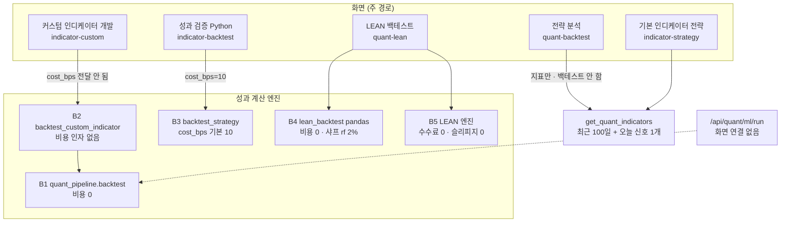
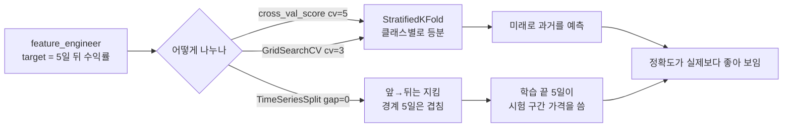
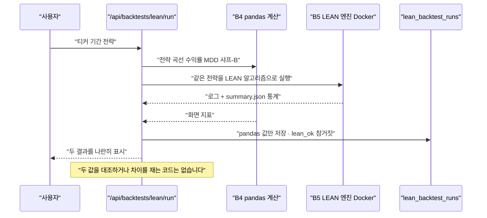

# #14 [분석] A6 퀀트 ML 파이프라인·백테스트·ML 실험(LEAN 포함) — 성과 계산 엔진 5개가 서로 다른 규칙을 씁니다

> 🗂️ 옛 GitHub 이슈를 옮긴 **기록 문서**입니다 — [색인](../README.md). 원문은 그대로 두고, 링크·커밋 해시만 새 자리 기준으로 바꿨습니다.

| 항목 | 내용 |
|---|---|
| 종류 | 이슈 |
| 상태 | 열림 |
| 원 작성 | 이동원(`devlee328288`) · 2026-09-17 12:30 KST |
| 라벨 | `analysis` `phase-1` `phase-2` `phase-3` |
| 옛 주소 | `github.com/devlee328288/Qurious/issues/14` (지금은 열리지 않음) |

## 본문

## 쉬운 요약 3줄

1. 이 앱에는 **성과를 계산하는 엔진이 5개** 있는데, 서로 **비용·체결 시점·지표 정의가 다릅니다.** 같은 전략·같은 데이터로도 총수익률이 **-12.18%에서 +7.84%까지** 갈립니다(합성 데이터 실측).
2. ML 실험 3곳(모델 비교·튜닝·AI 예측)은 **시간 순서를 지키지 않는 교차검증**을 씁니다. 첫 폴드는 **가장 과거를 예측하면서 그보다 미래인 표본 347개로 학습**합니다 — 1차(Alpha_Stack)에서는 이걸 `LeakageError`로 막아 뒀는데, 2.0에는 그 장치가 없습니다.
3. "**LEAN으로 교차 확인**"은 지금 구조로는 교차 확인이 되지 않습니다. LEAN 기본 설정이 **수수료 0 · 슬리피지 0 · 당일 종가 즉시 체결**이라(LEAN 소스 확인), 옆에 있는 pandas 계산보다 **덜 보수적**이고 두 값을 **비교하는 코드도 없습니다.**

---

## 한눈에 보기

| 무엇을 봤나 | 핵심 | 확실도 |
|---|---|---|
| 성과 계산 엔진 개수 | **5개** (quant_pipeline 2 · investment_research 1 · lean_backtest pandas 1 · LEAN 엔진 1) | 🟢 |
| 비용(수수료·세금)을 빼는 엔진 | **1개뿐** (`backtest_strategy`, 기본 10bps). 세금은 어디에도 없음 | 🟢 |
| 화면 기본 경로의 비용 | **0원.** 커스텀 인디케이터 화면은 `cost_bps`를 받아도 **함수에 전달하지 않음** | 🟢 |
| 체결 시점 | pandas 4개 = 신호 **다음 날** · LEAN = **당일 종가 즉시** → 같은 전략에서 **20.02%p** 차이 | 🟢 규칙 / 🟡 수치는 합성 데이터 |
| 시간 누수 | `cross_val_score(cv=5)`·`GridSearchCV(cv=3)` → **StratifiedKFold**(미래로 과거 예측) · `TimeSeriesSplit`에 **gap 없음**(라벨이 5일 앞) | 🟢 |
| 같은 이름 다른 계산 | RSI **3가지** · 샤프 **3가지** · 승률 **2가지** | 🟢 |
| 승률의 뜻 | 화면의 "승률"은 **보유한 날 중 오른 날 비율**. 거래 단위로 다시 세면 46.03% → **33.33%** | 🟢 |
| "전략 분석" 화면(주 경로) | 백테스트를 **하지 않음.** 10년치를 받아 **최근 100일만** 그리고 오늘 신호 1개를 보여줌 | 🟢 |
| 화면에서 못 가는 코드 | `/api/quant/ml/*` 3개 (LightGBM·MLP 학습 + Alpaca) — **어느 화면도 호출하지 않음** | 🟢 |
| 딥러닝 화면 | API 호출 0건. PyTorch/TensorFlow가 **의존성에 없음** — 설명 페이지 | 🟢 |
| Alpaca 주문 | `run_pipeline`이 키 없이 호출 → **항상 Mockup.** 환경변수를 넣어도 이 경로에는 쓰이지 않음 | 🟢 |
| 1차 유산 대비 | `walk_forward`(gap 강제)·`apply_cost`·`overlapping`·block bootstrap — **2.0에 대응물 없음** | 🟢 |

> **이 문서의 판정은 추천이고 확정이 아닙니다.** 확정은 D4(1차 매듭)·D5(2차 설계)·D7([#13](../discussions/013.md) 모의투자)에서 합니다.

---

## 용어 풀이

### ⓪ 같은 말이 여러 뜻으로 쓰입니다 — 먼저 구분합니다

| 말 | 이 문서에서 구분해 부르는 이름 | 실제로 가리키는 것 |
|---|---|---|
| "백테스트" | **엔진 B1~B5** | 5개가 서로 다른 함수입니다. 아래 §2 표에서 번호로 부릅니다. |
| "샤프지수" | **샤프-A / 샤프-B** | A는 `ta_utils`(무위험수익률 0), B는 `lean_backtest`(무위험 2% 차감). 값이 다릅니다. |
| "RSI" | **RSI-단순 / RSI-Wilder(pandas) / RSI-Wilder(직접)** | 계산법이 셋입니다. 같은 날 값이 최대 24 넘게 벌어집니다. |
| "승률" | **일 단위 승률 / 거래 단위 승률** | 화면 값은 일 단위입니다. |
| "교차 확인" | **(지금은) 병렬 실행** | LEAN과 pandas를 각각 돌려 나란히 보여줄 뿐, 두 값을 대조·검증하는 코드가 없습니다. |
| "Mockup" | **화면 제목의 Mockup / 주문의 Mockup** | 전략 분석 화면 제목의 "Mockup"과 Alpaca 주문의 `mockup_submitted`는 다른 뜻입니다. |

### ① 검증(누수) 용어

| 용어 | 정확한 뜻 | 이 문서에서 가리키는 것 | 헷갈리기 쉬운 점 |
|---|---|---|---|
| **데이터 누수 (leakage)** | 예측 시점에 알 수 없었던 정보가 학습·평가에 섞이는 것 | ML 실험 3곳이 미래 구간을 학습에 쓰는 문제 | "버그"가 아니라 **정상 동작하는 코드가 만드는 착시**입니다. 에러가 안 납니다. |
| **in-sample / out-of-sample** | 학습에 쓴 구간 / 안 쓴 구간 | `run_pipeline`이 앞 80%로 학습하고 **전체 구간**을 예측해 백테스트하는 문제 | "검증 정확도"는 out-of-sample인데, 그 아래 백테스트 그래프는 in-sample이 섞여 있습니다. |
| **KFold** | 데이터를 k등분해 돌아가며 한 조각을 시험지로 쓰는 방법 | `cv=5`가 실제로 고르는 분할기의 부모 격 | 시계열에서는 **미래로 과거를 맞히는** 폴드가 생깁니다. |
| **StratifiedKFold** | KFold인데 **클래스 비율을 폴드마다 맞춰** 나눔 | sklearn이 분류기 + `cv=5`일 때 **자동으로** 고르는 것 | `shuffle=False`라 "순서를 안 섞는다"고 오해하기 쉽지만, **클래스별로 따로 나누므로 시간 순서는 깨집니다.** |
| **TimeSeriesSplit** | 앞을 학습, 뒤를 시험으로만 쓰는 시계열 전용 분할 | `ai_predict_return`이 쓰는 것 | 이것만으로는 부족합니다. **라벨이 미래 5일을 보면 gap도 필요**합니다. |
| **gap (purge)** | 학습 끝과 시험 시작 **사이에 버리는 구간** | `TimeSeriesSplit(gap=...)` 인자 | 기본값이 **0**입니다. 안 적으면 없는 것과 같습니다. |
| **label_horizon** | 판단일부터 청산일까지의 거리 | 이 앱은 **5일**(`pct_change(5).shift(-5)`) | 1차에서 "6"으로 정의를 통일했습니다([#3](../issues/003.md)). 2.0 코드는 5입니다. |
| **walk-forward** | 기간을 앞으로 밀며 반복 학습·검증 | 1차 `evaluation/walk_forward.py` | 2.0에는 없습니다. |

### ② 비용·체결 용어

| 용어 | 정확한 뜻 | 이 문서에서 가리키는 것 | 헷갈리기 쉬운 점 |
|---|---|---|---|
| **bps (베이시스포인트)** | 1bps = 0.01% = 0.0001 | `cost_bps=10` → 편도 0.1% | **왕복이 아니라 편도**입니다. 진입·청산에 각각 붙어 실질 0.2%입니다. |
| **turnover (회전)** | 포지션이 바뀐 양 | `held.diff().abs()` | "매매 횟수"와 다릅니다. 0→1도 1, 1→0도 1로 세어 **왕복이 2로** 잡힙니다. |
| **슬리피지** | 기대한 체결가와 실제 체결가의 차이 | 5개 엔진 모두 **0** | "수수료를 넣었으니 현실적"과 다릅니다. 슬리피지는 별개입니다. |
| **증권거래세** | 주식을 **팔 때** 양도가액에 붙는 세금 | 5개 엔진 모두 **0** | 사는 쪽에는 안 붙습니다. 손해를 봐도 냅니다. |
| **농어촌특별세** | 증권거래세를 깎아준 만큼 따로 걷는 세금 | 코스피 매도 시 0.15% | 코스피는 증권거래세가 0%라도 **농특세 0.15%는 냅니다.** |
| **체결 시점** | 신호를 본 뒤 실제로 사고파는 시점 | pandas = 다음 날 / LEAN = 당일 종가 | 하루 차이가 성과를 크게 바꿉니다(§4). |

### ③ 지표 용어 — 계산표와 숫자 예시

**샤프지수 (Sharpe ratio)**: 위험 1단위당 초과수익. 클수록 좋습니다.

| 이름 | 어디 | 식 | 무위험수익률 | 표준편차 |
|---|---|---|---|---|
| **샤프-A** | [`ta_utils.sharpe_ratio` #L56-L59](https://github.com/EST-team-project/Qurious/blob/04f476a/app/services/ta_utils.py#L56-L59) | (일수익률 평균 ÷ 일수익률 표준편차) × √252 | **0** (안 뺌) | 표본(ddof=1) |
| **샤프-B** | [`lean_backtest._analytics` #L400-L402](https://github.com/EST-team-project/Qurious/blob/04f476a/app/services/lean_backtest.py#L400-L402) | (연환산수익률 − 2%) ÷ 연환산변동성 | **2%** | 모(ddof=0) |
| 샤프-C (참고) | 없음 | 샤프-A 식에 무위험 2%를 일할로 뺀 것 | 2% | 표본 |

같은 수익률 시계열(합성 데이터, 이동평균 교차 전략)에 세 식을 넣으면:

| 식 | 값 |
|---|---|
| 샤프-A | **-0.253** |
| 샤프-B | **-0.457** |
| 샤프-C | -0.393 |

> 연환산수익률 -4.57%, 연변동성 14.36%(ddof=0) / 14.37%(ddof=1). **표준편차 차이는 0.01%p로 무시할 수준이고, 값이 갈리는 진짜 원인은 무위험수익률 2%를 빼느냐입니다.**

**승률 (win rate)**: "이긴 비율"인데, **무엇을 한 번으로 세느냐**가 다릅니다.

| 세는 단위 | 뜻 | 어디 | 값 |
|---|---|---|---|
| **일 단위** | 주식을 들고 있던 날 중 오른 날의 비율 | [`backtest_strategy` #L76](https://github.com/EST-team-project/Qurious/blob/04f476a/app/services/investment_research.py#L76) · [`backtest` #L254-L255](https://github.com/EST-team-project/Qurious/blob/04f476a/app/services/quant_pipeline.py#L254-L255) | **46.03%** |
| **거래 단위** | 진입~청산 한 번을 1로 세어 이긴 비율 | 코드에 없음 | **33.33%** |

> 같은 백테스트에서 보유 252일 · 거래 21회. 거래 단위로는 21번 중 7번만 이겼고 **평균 -0.658%, 중앙값 -1.543%** 입니다. "승률 46%"를 보고 "절반 가까이 성공"이라고 읽으면 사실과 멀어집니다.

**RSI**: 최근 상승폭과 하락폭의 비. 보통 30 아래를 과매도(매수), 70 위를 과매수(매도)로 봅니다.

| 이름 | 평활 방법 | 어디 | 쓰는 곳 |
|---|---|---|---|
| **RSI-단순** | 단순이동평균 | [`ta_utils.rsi(method="sma")` #L14-L25](https://github.com/EST-team-project/Qurious/blob/04f476a/app/services/ta_utils.py#L14-L25) (기본값) | 피처 엔지니어링 · 커스텀 인디케이터 |
| **RSI-Wilder(pandas)** | `ewm(alpha=1/14)` | 같은 함수 `method="ewm"` | 기본 인디케이터 전략 · 성과 검증 |
| **RSI-Wilder(직접)** | 첫 14일 단순평균으로 시작한 뒤 재귀 평활 | [`stock._calc_rsi` #L273-L292](https://github.com/EST-team-project/Qurious/blob/04f476a/app/services/stock.py#L273-L292) | 전략 분석 화면 · 자동매매 신호 |

같은 데이터(740일 합성)에서 셋을 나란히 계산하면:

| 비교 | 같은 날 최대 차이 | RSI<30 (매수 신호) 일수 | RSI>70 (매도 신호) 일수 |
|---|---|---|---|
| RSI-단순 | — | **48일** | **66일** |
| RSI-Wilder(pandas) | 단순 대비 최대 **24.3** | **18일** | **7일** |
| RSI-Wilder(직접) | pandas Wilder 대비 최대 **22.4** | 18일 | **10일** |

> 매수 신호가 뜨는 날이 **2.7배**, 매도 신호는 **9.4배** 차이 납니다. 두 Wilder 방식끼리도 매도 신호가 7일 vs 10일로 다릅니다. **화면마다 "RSI 28"이 다른 뜻**이라는 말입니다.

---

## 1. 무엇을 코드로 답하고, 무엇을 외부에서 찾았나

| 질문 | 어디서 답했나 |
|---|---|
| 백테스트 엔진이 몇 개이고 규칙이 어떻게 다른가 | 코드 (§2) |
| 교차검증이 시간을 지키는가 | 코드 + sklearn 공식 문서 + **로컬 재현 실험** (§3) |
| LEAN이 정말 더 현실적인가 | **QuantConnect 공식 문서 + LEAN 소스** (§4) |
| 매도 세금을 얼마로 잡아야 하나 | **법령 원문** (§5.4) |
| 화면과 코드가 맞는가 | 코드 (§6) |
| 1차에 있던 검증 장치가 남았는가 | [#3](../issues/003.md) + Alpha_Stack 퍼머링크 (§8) |

**조회일**: 2026-09-17 (KST). **기준 커밋**: Qurious `04f476a` · Alpha_Stack `01d8894` · LEAN `master`.

| 외부 출처 | URL |
|---|---|
| sklearn `cross_val_score` (기본 분할기 규칙) | https://scikit-learn.org/stable/modules/generated/sklearn.model_selection.cross_val_score.html |
| sklearn `TimeSeriesSplit` (`gap` 인자) | https://scikit-learn.org/stable/modules/generated/sklearn.model_selection.TimeSeriesSplit.html |
| QuantConnect 수수료 기본값 | https://www.quantconnect.com/docs/v2/writing-algorithms/reality-modeling/transaction-fees/key-concepts |
| QuantConnect 슬리피지 기본값 | https://www.quantconnect.com/docs/v2/writing-algorithms/reality-modeling/slippage/key-concepts |
| QuantConnect 체결 기본값 | https://www.quantconnect.com/docs/v2/writing-algorithms/reality-modeling/trade-fills/key-concepts |
| LEAN `DefaultBrokerageModel.cs` | https://github.com/QuantConnect/Lean/blob/master/Common/Brokerages/DefaultBrokerageModel.cs |
| 증권거래세법 시행령 제5조 (시행 2026-01-02) | https://www.law.go.kr/법령/증권거래세법시행령 |
| 농어촌특별세법 제5조 (시행 2026-05-12) | https://www.law.go.kr/법령/농어촌특별세법 |

**재현 실험**: 이 문서의 수치 중 "실측"이라 적은 것은 프로젝트 함수를 그대로 불러와 **합성 데이터**(seed 고정 랜덤워크)로 돌린 결과입니다. 실제 종목이 아니므로 **크기는 참고값**이고, **방향(어느 쪽이 크다/작다)과 구조적 원인**이 이 문서의 주장입니다. 외부 네트워크 호출 없이 로컬 CPU에서 재현됩니다.

---

## 2. 성과를 계산하는 엔진이 5개입니다



### 2.1 다섯 엔진 비교표

| | **B1** `backtest` | **B2** `backtest_custom_indicator` | **B3** `backtest_strategy` | **B4** lean pandas | **B5** LEAN 엔진 |
|---|---|---|---|---|---|
| 위치 | [quant_pipeline #L231-L276](https://github.com/EST-team-project/Qurious/blob/04f476a/app/services/quant_pipeline.py#L231-L276) | [#L403-L476](https://github.com/EST-team-project/Qurious/blob/04f476a/app/services/quant_pipeline.py#L403-L476) | [investment_research #L50-L82](https://github.com/EST-team-project/Qurious/blob/04f476a/app/services/investment_research.py#L50-L82) | [lean_backtest #L456-L475](https://github.com/EST-team-project/Qurious/blob/04f476a/app/services/lean_backtest.py#L456-L475) · [#L396-L447](https://github.com/EST-team-project/Qurious/blob/04f476a/app/services/lean_backtest.py#L396-L447) | [#L561-L634](https://github.com/EST-team-project/Qurious/blob/04f476a/app/services/lean_backtest.py#L561-L634) |
| 신호원 | ML(LightGBM/MLP) 또는 규칙 | 규칙 4종 | 규칙 4종 | 규칙 4종 | 같은 규칙을 LEAN 알고리즘으로 다시 씀 |
| **수수료** | **0** | **0** | `cost_bps` 편도 (기본 10 = 0.1%) | **0** | **0** (커스텀 데이터 → `ConstantFeeModel(0)`) |
| **세금** | **0** | **0** | **0** | **0** | **0** |
| **슬리피지** | **0** | **0** | **0** | **0** | **0** (`NullSlippageModel`) |
| **체결 시점** | 신호 **다음 날** ([#L239](https://github.com/EST-team-project/Qurious/blob/04f476a/app/services/quant_pipeline.py#L239)) | 다음 날 (B1 재사용) | 다음 날 ([#L58](https://github.com/EST-team-project/Qurious/blob/04f476a/app/services/investment_research.py#L58)) | 다음 날 ([#L482](https://github.com/EST-team-project/Qurious/blob/04f476a/app/services/lean_backtest.py#L482)) | **당일 종가 즉시** (`ImmediateFillModel`) |
| 체결가 | 종가 수익률에 비중 곱 | 〃 | 〃 | 〃 | 그 바의 종가 |
| 샤프 | 샤프-A | 샤프-A | 샤프-A | **샤프-B** | LEAN 자체 Sharpe |
| 승률 | 일 단위 | 일 단위 | 일 단위 | 없음 | LEAN 자체 Win Rate |
| 데이터 | `get_candles` (Yahoo) | 〃 | 〃 | `fetch_close_series` (Yahoo **adjclose 우선**) | 같은 CSV(종가만) |
| **DB 기록** | 없음 | 없음 | 없음 | [`LeanBacktestRun`](https://github.com/EST-team-project/Qurious/blob/04f476a/app/models/paper.py#L106-L121) 저장 | **저장 안 됨**(`lean_ok` 참/거짓만) |

### 2.2 비용을 빼는 엔진은 B3 하나뿐인데, 화면 기본 경로는 B2입니다

[`stocks.py #L734-L764`](https://github.com/EST-team-project/Qurious/blob/04f476a/app/routes/stocks.py#L734-L764)는 `cost_bps`를 쿼리로 받습니다. 그런데 `strategy`의 **기본값이 `custom`** 이고, custom 분기는 `backtest_custom_indicator(...)`를 부르면서 **`cost_bps`를 넘기지 않습니다.** 받는 함수에도 비용 인자가 아예 없습니다.

| 화면 | 호출 | 비용 |
|---|---|---|
| 커스텀 인디케이터 개발 ([app.html #L3411](https://github.com/EST-team-project/Qurious/blob/04f476a/public/app.html#L3411)) | `…&base=rsi_ma&short=…` (strategy 미지정 → custom) | **0** |
| 성과 검증 (Python) ([app.html #L3510](https://github.com/EST-team-project/Qurious/blob/04f476a/public/app.html#L3510)) | `…&strategy=${strategy}&cost_bps=10` | 편도 0.1% |

> 같은 API, 같은 화면 묶음인데 한쪽은 비용 0, 다른 쪽은 0.1%입니다. **사용자는 두 화면의 수익률을 나란히 비교하게 됩니다.**

### 2.3 비용이 얼마나 차이를 만드나 (실측)

이동평균 교차 전략, 740일 합성 데이터, 매매 41회(청산 20회):

| 비용 설정 | 총수익률 | 샤프-A |
|---|---|---|
| 0bps (B1·B2·B4) | **-12.18%** | -0.253 |
| 10bps 편도 (B3 기본) | **-15.71%** | -0.356 |
| 20bps 편도 (D4 민감도 2배안) | **-19.09%** | -0.459 |
| 10bps + 매도세 0.15% | **-18.20%** | -0.431 |

> 비용만으로 **3.53%p~6.91%p**가 사라집니다. 매매가 잦을수록 커집니다. 🟡 합성 데이터 기준.
> 검산: `backtest_strategy(strategy="ma", cost_bps=10)`의 원본 결과(-15.71% · 샤프 -0.356 · 41회 · 46.03%)와 제 재현 계산이 **완전히 일치**합니다 🟢.

---

### 2.4 ★ 2026-09-19 추가 — 다섯 엔진 **아래의 데이터 층**이 바뀌었습니다

2.1 비교표의 마지막에서 두 번째 줄("데이터")이 전부 **Yahoo** 였습니다. 그 줄이 통째로 달라졌습니다. 엔진을 통일하는 문제(2.1~2.3)와 **별개로, 그 아래 바닥이 먼저 바뀐 것**입니다.

| | 전 ([`04f476a`](https://github.com/EST-team-project/Qurious/commit/04f476a7558086d2c02d81b91325d52cd541d2fc) 기준) | 후 (PR [#34](../pulls/034.md)·[#35](../pulls/035.md)) |
|---|---|---|
| 국내 시세 출처 | Yahoo 비공식 API | **공공데이터포털 공식 API** |
| 보관 | 안 함 — 요청마다 새로 받음 | **원문 그대로 로컬 보존** + 지문(manifest) |
| 수정주가 | `adjclose` (B4만) / 나머지는 **미조정 종가** | **거래소 기준가(`vs`) 기반으로 우리가 계산** |
| 이용 조건 | 🔴 "개인 사용" 문구 | 🟢 공공데이터 ([#33](../issues/033.md)) |

#### 2.4.1 🔴 엔진 5개 중 4개가 **미조정 종가**를 쓰고 있었습니다

2.1 표를 다시 보면 `adjclose` 를 쓰는 것은 **B4 하나뿐**입니다. B1·B2·B3·B5는 `get_candles` 의 종가를 그대로 씁니다.

**왜 문제인가** — 액면분할이나 권리락이 있는 날, 미조정 종가는 **가격이 뚝 떨어진 것처럼 보입니다.**

```
카카오 2021-04-15 액면분할 (5:1) · 미조정 종가로 보면

  4/14  558,000 ┤███████████████████
  4/15  111,500 ┤███                  ← 하루에 -80% 로 보인다
                 실제로는 주식 수가 5배가 됐을 뿐, 손실이 아니다

  이 하루가 수익률 계열에 들어가면
    · 수익률 -80% 한 칸 → 표준편차가 크게 부풀어 **샤프가 망가진다**
    · MDD 가 -80% 로 찍힌다
    · 규칙이 "급락 매수" 라면 **없는 신호를 잡는다**
```

이 단 하루가 그 종목의 성과 지표를 통째로 못 쓰게 만듭니다. 그리고 **조용합니다** — 오류가 나지 않고 숫자만 틀립니다. 🟢

#### 2.4.2 조정 방식 — 거래소가 이미 계산해 둔 값을 씁니다

처음에는 등락률(`fltRt`)을 누적해 역산하려 했는데, **분할일의 `vs`(전일 대비) 칸에 거래소 기준가가 이미 들어 있었습니다.**

| 카카오 20210415 | 값 | 뜻 |
|---|---|---|
| 종가 | 111,500 | 분할 후 |
| `vs` | −8,500 | 기준가 대비 변동 |
| **종가 − vs = 120,000** | | **거래소가 정한 기준가** |
| 참고: 558,000 ÷ 5 = 111,600 | | **단순 나눗셈과 다릅니다** |

→ 단순히 5로 나누면 틀립니다. **거래소 기준가를 써야 맞습니다.** 🟢

상장주식수 교차검증으로 사유까지 갈랐습니다. 이 방식은 **무상증자 권리락에도 통합니다**(씨젠 20210423 · 대한제당 20210429 확인).

🔴 **한계** — **거래정지 구간은 `vs` 가 0 이라 조정 정보가 없습니다.** 정지 해제일에 가격이 크게 뛰어도 그것이 조정인지 실제 변동인지 **자동으로 판단할 수 없습니다**(아이엠텍 214 → 5,350 사례). 이런 건은 "확인 필요"로 따로 빼 둡니다.

#### 2.4.3 그래서 2.1~2.3의 판정이 어떻게 달라지나

| 이 문서의 판정 | 지금 |
|---|---|
| "엔진 5개가 서로 다른 규칙" | **그대로 유효합니다.** 데이터가 같아져도 비용·체결시점·샤프 정의는 여전히 제각각입니다 |
| "B4만 adjclose" | 🔴 **더 큰 문제였습니다** — 나머지 4개는 조정 자체를 안 했습니다. 데이터 층이 바뀌면 **다섯 엔진이 같은 조정 규칙을 공유**하게 됩니다 |
| 2.3 비용 실측(합성 데이터) | **그대로 유효합니다.** 합성 데이터라 조정 문제와 무관합니다 |
| D4 ③ "정본 엔진 하나" | **선행 조건이 하나 줄었습니다** — 어느 엔진을 고르든 밑에 깔 데이터는 정해졌습니다 |

**용어 — 수정주가(adjusted price)**
- 뜻: 액면분할·권리락처럼 **주식 수가 바뀌는 사건**을 반영해, 과거 가격을 지금 기준으로 고쳐 놓은 것.
- 이 문서에서: 이것이 없으면 분할일 하루가 **가짜 폭락**으로 보여 성과 지표가 망가집니다.
- 헷갈리는 점: **배당은 별개입니다.** 우리가 만든 것은 분할·권리락만 반영한 **PR(주가수익률)** 이고, 배당까지 넣은 **TR(총수익률)** 이 아닙니다. 벤치마크를 TR 지수와 비교하면 **우리 쪽이 구조적으로 낮게 나옵니다** 🔴 — D4 ④(벤치마크)에서 짚어야 합니다.

---

## 3. ML 실험 3곳이 시간 순서를 지키지 않습니다

### 3.1 무슨 일이 일어나나



### 3.2 `cv=5`가 실제로 고르는 것

sklearn 공식 문서 원문 🟢:

> "For int/None inputs, if the estimator is a classifier and y is either binary or multiclass, **StratifiedKFold** is used. In all other cases, KFold is used. These splitters are instantiated with `shuffle=False`."

[`ml_models.compare_models #L124`](https://github.com/EST-team-project/Qurious/blob/04f476a/app/services/ml_models.py#L124)의 `cross_val_score(clf, X_s, y, cv=5, scoring="accuracy")`는 분류기 + 3-class 라벨이므로 **StratifiedKFold**가 선택됩니다. 로컬에서 `check_cv(5, y, classifier=True)`로 확인한 결과도 `StratifiedKFold`, `shuffle=False` 🟢.

`shuffle=False`라서 "순서를 안 섞는다"고 읽기 쉬운데, **클래스별로 따로 등분**하므로 시간 축은 깨집니다. 실제 폴드(480행 데이터):

| 폴드 | 시험 구간(행 번호) | 학습 구간 | **시험보다 미래인 학습 표본 수** |
|---|---|---|---|
| 0 | 0 ~ 132 (**가장 과거**) | 80 ~ 479 | **347개** |
| 1 | 80 ~ 223 | 0 ~ 479 | 256개 |
| 2 | 173 ~ 299 | 0 ~ 479 | 180개 |
| 3 | 260 ~ 394 | 0 ~ 479 | 85개 |
| 4 | 379 ~ 479 | 0 ~ 394 | 0개 |

> 폴드 0은 **2년 뒤 데이터로 배운 모델이 가장 과거를 맞히는** 상황입니다.

[`tune_hyperparams #L190`](https://github.com/EST-team-project/Qurious/blob/04f476a/app/services/ml_models.py#L190)의 `GridSearchCV(..., cv=3)`도 같은 규칙으로 StratifiedKFold입니다. 여기엔 문제가 하나 더 있습니다 — [`#L187`](https://github.com/EST-team-project/Qurious/blob/04f476a/app/services/ml_models.py#L187)에서 `StandardScaler().fit_transform(X)`를 **전체 데이터에** 먼저 적용합니다. 폴드 시험 구간의 평균·표준편차가 학습에 새어 듭니다(스케일링 누수).

### 3.3 `TimeSeriesSplit`은 썼지만 `gap`이 없습니다

[`ai_predict_return #L138·L148`](https://github.com/EST-team-project/Qurious/blob/04f476a/app/services/investment_research.py#L138-L148):

```python
df["fwd_return"] = close.pct_change(5).shift(-5)   # L138 — 라벨이 5일 앞을 봄
...
tscv = TimeSeriesSplit(n_splits=n_splits)          # L148 — gap 기본값 0
```

공식 문서 원문 🟢: `gap : int, default=0 — Number of samples to exclude from the end of each train set before the test set.`

문서의 예시(12개 표본, `n_splits=3`, `test_size=2`)를 로컬에서 그대로 재현했습니다 🟢:

| 설정 | 폴드 0 학습 | 폴드 0 시험 |
|---|---|---|
| `gap=0` | [0,1,2,3,4,5] | [6,7] |
| `gap=2` | **[0,1,2,3]** | [6,7] |

라벨이 5일 앞을 보므로 **`gap`이 최소 5**여야 합니다. 지금은 0이라 학습 구간 **마지막 5행의 정답이 시험 구간 가격으로 만들어집니다.**

### 3.4 누수가 정확도에 주는 영향 (실측)

순수 랜덤워크(예측 불가능이 보장된 데이터) 480행, RandomForest:

| 검증 방식 | 평균 정확도 | 표준편차 |
|---|---|---|
| 현재 코드 (`cv=5` → StratifiedKFold) | **0.4333** | 0.0651 |
| TimeSeriesSplit(gap=0) | 0.4100 | 0.0464 |
| TimeSeriesSplit(gap=5) | 0.4175 | 0.0625 |
| **"항상 관망"이라고만 답하기** (다수 클래스) | **0.4854** | — |

두 가지를 함께 봐야 합니다.

1. 누수 방식이 **가장 높은 점수**를 냅니다(0.4333 > 0.4100).
2. 그런데 **세 방식 모두 "항상 관망"보다 못합니다**(0.4854). 화면은 정확도 순위표만 보여주고 **이 기준선을 보여주지 않습니다** ([app.html #L2854](https://github.com/EST-team-project/Qurious/blob/04f476a/public/app.html#L2854)에 "어떤 모델이 이 종목에 가장 잘 맞는지 확인하세요"라고 안내).

> 🟡 랜덤워크라 격차(2.3%p)가 작게 나왔습니다. 실제 종목·실제 피처에서는 더 벌어질 수도, 좁을 수도 있습니다. **격차의 크기가 아니라 "순위를 매기는 점수가 누수된 점수"라는 구조**가 문제입니다.

### 3.5 같은 표에서 LightGBM만 다른 잣대로 채점됩니다

[`compare_models #L104-L128`](https://github.com/EST-team-project/Qurious/blob/04f476a/app/services/ml_models.py#L104-L128)에서 LightGBM만 CV를 돌리지 않고 **시간순 80/20 검증 정확도**를 `cv_mean`에 넣습니다. 나머지 7종은 StratifiedKFold 점수입니다. 그리고 [`#L141`](https://github.com/EST-team-project/Qurious/blob/04f476a/app/services/ml_models.py#L141)에서 **`cv_mean` 기준으로 정렬**합니다.

> 정직하게 채점한 모델 하나를 부풀려진 점수의 모델 7개와 같은 줄에 세워 순위를 매기는 셈입니다. 화면 안내문은 "5-fold 교차검증 평균 정확도 기준 정렬"이라고만 적혀 있습니다.

### 3.6 `ai_predict_return`의 다른 문제 둘

| 문제 | 근거 | 결과 |
|---|---|---|
| **회귀와 분류의 기준 시점이 다름** | 회귀는 [`latest_features` #L139](https://github.com/EST-team-project/Qurious/blob/04f476a/app/services/investment_research.py#L139)(가장 최근 행), 분류는 [`X[-1:]` #L196](https://github.com/EST-team-project/Qurious/blob/04f476a/app/services/investment_research.py#L196)(`labeled` 기준 = **5거래일 전** 행) | 한 카드 안의 "예측 수익률"과 "매수/관망/매도"가 **다른 날짜 기준** |
| **연환산 표시가 사실상 상한에 붙음** | [#L204-L205](https://github.com/EST-team-project/Qurious/blob/04f476a/app/services/investment_research.py#L204-L205) 5일 예측을 ±20%로 자른 뒤 `(1+x)^50.4`, [#L213](https://github.com/EST-team-project/Qurious/blob/04f476a/app/services/investment_research.py#L213)에서 -90%~300%로 다시 자름 | 5일 +20% → 연 **97만%** → 300%로 잘림. 5일 -20% → 연 -99.99% → -90%로 잘림 |

> 두 번째는 코드 주석이 이미 "예측이 조금만 튀어도 지수적으로 폭발"한다고 인정하고 있습니다. **표시값이 예측의 세기를 나타내지 못합니다.**

---

## 4. "LEAN 백테스트(교차 확인)"는 지금 교차 확인이 아닙니다

### 4.1 한 화면에 두 계산이 나란히 있습니다



[`lean_backtest.run #L174-L213`](https://github.com/EST-team-project/Qurious/blob/04f476a/app/services/lean_backtest.py#L174-L213)에서 화면 지표는 pandas로 계산하고, LEAN 결과는 `lean_statistics`·`lean_log`로 **따로** 담습니다. [`lean.py #L79-L85`](https://github.com/EST-team-project/Qurious/blob/04f476a/app/routes/lean.py#L79-L85)는 **pandas 값만 DB에 저장**하고 LEAN 통계는 저장하지 않습니다.

### 4.2 LEAN이 더 현실적이라는 전제가 성립하지 않습니다

우리 알고리즘은 종가만 담긴 CSV를 커스텀 데이터로 읽습니다([`_reader_boilerplate` #L538-L559](https://github.com/EST-team-project/Qurious/blob/04f476a/app/services/lean_backtest.py#L538-L559) · `add_data(YFPrice, "YF", Resolution.DAILY)`). 커스텀 데이터는 LEAN에서 `SecurityType.Base`입니다. `DefaultBrokerageModel.cs` 원문 🟢:

| 모델 | 코드 | 결과 |
|---|---|---|
| 수수료 | `case SecurityType.Base: … return new ConstantFeeModel(0m);` | **0원** |
| 체결 | `case SecurityType.Base: … return new ImmediateFillModel();` | **즉시 체결** |
| 슬리피지 | `return NullSlippageModel.Instance;` | **0** |

`ImmediateFillModel`의 시장가 체결가(공식 문서 표) 🟢: **TradeBar 매수 = 종가 + 슬리피지 / 매도 = 종가 − 슬리피지**, 그리고 "The model … **immediately fills them**."

> 정리하면 **LEAN 쪽이 pandas 쪽보다 유리한 가정**입니다. pandas는 신호 다음 날부터 수익을 잡는데, LEAN은 **신호를 만든 그 종가로 바로 체결**합니다.

### 4.3 하루 차이가 얼마나 되나 (실측)

같은 이동평균 교차 전략·같은 데이터로, 체결 시점만 바꿔 계산했습니다:

| 체결 규칙 | 총수익률 | 보유일수 |
|---|---|---|
| 신호 **다음 날** (현재 pandas 4개 엔진) | **-12.18%** | 252일 |
| **당일 종가 즉시** (LEAN 기본) | **+7.84%** | 253일 |
| **차이** | **20.02%p** | — |

> 🟡 LEAN을 실제로 돌린 값이 아니라, **LEAN의 체결 규칙을 pandas로 재현**한 값입니다. 규칙 자체는 🟢(공식 문서·LEAN 소스). 실제 LEAN 실행에는 주문 지연·현금 결제 등 다른 요소가 더 붙습니다.

### 4.4 같은 전략인데 코드가 셋으로 갈라져 있습니다

DCA(정액 분할 매수)를 예로 들면:

| 어디 | 매수 횟수를 세는 기준 |
|---|---|
| [`_equity_dca` #L501-L515](https://github.com/EST-team-project/Qurious/blob/04f476a/app/services/lean_backtest.py#L501-L515) | **거래일** (`range(0, n, interval)`) |
| [`_analytics` dca 분기 #L408-L412](https://github.com/EST-team-project/Qurious/blob/04f476a/app/services/lean_backtest.py#L408-L412) | 거래일 (다른 식) |
| [LEAN 알고리즘 #L592-L596](https://github.com/EST-team-project/Qurious/blob/04f476a/app/services/lean_backtest.py#L592-L596) | **달력일** (`total_days // interval_days`) |

> 달력일은 거래일의 약 1.45배라 **분할 횟수와 1회 매수액이 달라집니다.** 같은 화면에 서로 다른 전략 두 개를 비교해 놓고 "엔진이 달라서"라고 읽게 됩니다.

### 4.5 면책 문구가 코드와 어긋납니다

[`#L212`](https://github.com/EST-team-project/Qurious/blob/04f476a/app/services/lean_backtest.py#L212)의 면책 문구는 "**배당**·세금·수수료·슬리피지…를 반영하지 않으며"라고 적혀 있습니다. 그런데 [`fetch_close_series #L113-L114`](https://github.com/EST-team-project/Qurious/blob/04f476a/app/services/lean_backtest.py#L113-L114)는 **`adjclose`(배당·분할 조정 종가)를 우선** 사용합니다.

> 배당은 **반영돼 있습니다**(가격에 녹아서). 문구가 틀렸습니다. 반대로 B1·B2·B3가 쓰는 `get_candles`가 조정가인지 원가인지는 A4에서 확인할 몫입니다 — **두 경로의 가격 정의가 다르면 수익률 자체가 비교 불가**입니다.

### 4.6 (참고) 강사님 원본이 같은 날 LEAN 로컬 실행을 추가했습니다

2026-09-16 `domain-rag-lab`에 [`26767cb` "add LEAN runner configuration … local and remote options"](https://github.com/edumgt/domain-rag-lab/commit/26767cb)가 들어왔습니다(원본 HEAD `7b71808` → `02c5ddb`).

**우리에게 새로 가져올 것은 없습니다** 🟢: Qurious의 [`resolve_lean_mode` #L69-L77](https://github.com/EST-team-project/Qurious/blob/04f476a/app/services/lean_backtest.py#L69-L77)은 이미 `ssh`/`docker`/`local`/`auto` 4모드를 지원하고, 소켓이 없어도 되는 Docker Engine API 경로([`_docker_api_run` #L272-L300](https://github.com/EST-team-project/Qurious/blob/04f476a/app/services/lean_backtest.py#L272-L300))까지 갖고 있습니다. 강사님 쪽이 이번에 따라온 형태입니다. **D2([#10](../discussions/010.md))의 "AWS 0원 · 로컬 시연" 방향과도 맞습니다.**

---

## 5. 같은 이름, 다른 계산 — 정리와 비용 규격 제안

### 5.1 지표 정의 갈라짐 요약

| 지표 | 정의 수 | 어디가 다른가 | 영향 |
|---|---|---|---|
| RSI | **3** | 평활 방법 | 매수 신호일 18일 vs 48일 |
| 샤프 | **3** | 무위험수익률(0 vs 2%), 표준편차(ddof) | -0.253 vs -0.457 |
| 승률 | **2** | 세는 단위(일 vs 거래) | 46.03% vs 33.33% |
| MDD | 1 | — | 정의는 하나 🟢 ([`max_drawdown` #L62-L66](https://github.com/EST-team-project/Qurious/blob/04f476a/app/services/ta_utils.py#L62-L66)) |

### 5.2 `_generate_signal`은 어떤 백테스트에도 없습니다

[`stock._generate_signal #L349-L402`](https://github.com/EST-team-project/Qurious/blob/04f476a/app/services/stock.py#L349-L402)는 점수 합산 규칙으로 "강력 매수/매수/관망/매도/강력 매도"를 냅니다. 쓰이는 곳은 **전략 분석 화면**과 **자동매매**입니다([#12](../issues/012.md) §4.3). 그런데 5개 백테스트 엔진 중 어느 것도 이 규칙을 쓰지 않습니다.

| 규칙 | 골든크로스 점수 | 매수 판정 기준 | 백테스트 가능 |
|---|---|---|---|
| `_generate_signal` | **+3** | 점수 ≥ 1 (강력은 ≥ 3) | ❌ |
| [`rule_based_signals` #L203-L226](https://github.com/EST-team-project/Qurious/blob/04f476a/app/services/quant_pipeline.py#L203-L226) | +1 | 점수 ≥ 3 | ✅ (B1) |
| [`screen_pattern` #L100-L102](https://github.com/EST-team-project/Qurious/blob/04f476a/app/services/investment_research.py#L100-L102) | +1 | 점수 ≥ 1 | ❌ |

> 이름은 셋 다 "규칙 기반 신호"인데 **가중치도 임계값도 다릅니다.** D7([#13](../discussions/013.md))이 "일지에 올릴 규칙은 백테스트 엔진 하나로 검증"을 요구하는데, **지금 실제로 매매하는 규칙이 검증 대상에서 빠져 있습니다.**

### 5.3 시나리오별(상승/하락/횡보) 비교를 지금 코드로는 못 합니다

rfp-1이 요구하고 D7 [#13](../discussions/013.md)이 "백테스트 구간으로" 넘긴 항목입니다. 5개 엔진 어디에도 **구간을 국면으로 나누는 코드가 없습니다** 🟢. B1·B2·B3는 전체 기간 단일 숫자만 냅니다. B4·B5는 사용자가 시작·종료일을 직접 넣는 방식이라(`compare_start_date`·`compare_end_date`) **사람이 눈으로 고른 구간**이 됩니다 — 국면을 사후에 고르면 그 자체가 결과를 고르는 일이 됩니다.

### 5.4 비용 규격 제안 (D4로 넘김)

법령 원문으로 확인한 매도 세율 🟢:

| 근거 | 시장 | 세율 |
|---|---|---|
| 증권거래세법 시행령 제5조 (시행 2026-01-02, 대통령령 제35947호) | **유가증권시장(코스피)** | **영(零)** |
| 〃 | 코스닥시장 | 1만분의 15 = **0.15%** |
| 〃 | 코넥스시장 | 1만분의 10 = 0.10% |
| 농어촌특별세법 제5조 제1항 제5호 (시행 2026-05-12) | 대통령령으로 정하는 증권시장의 양도가액 | 1만분의 15 = **0.15%** |

> 코스피는 증권거래세 0% + 농특세 0.15% = **매도 시 0.15%**, 코스닥은 증권거래세 0.15% = **0.15%**. 🟡 코스닥에 농특세가 붙지 않는 근거(대통령령의 "정하는 증권시장" 범위)는 시행령까지 확인하지 않았습니다.

제안(미확정):

| 항목 | 값 | 이유 |
|---|---|---|
| 매수 수수료 | 편도 `cost_bps` (기본 10bps) | 기존 B3 기본값 유지 |
| 매도 수수료 | 편도 `cost_bps` | 〃 |
| **매도 세금** | **0.15%** | 법령 확인값. 코스피·코스닥 동일 |
| 슬리피지 | 0 (기본) · 민감도에서 변화 | 일봉 종가 체결이라 추정이 어렵습니다 |
| **민감도 3종** | **0 / 기본 / 2배** | D7 [#13](../discussions/013.md) ⑥ 규격 그대로 |
| 연율화 계수 | **252** | 1차에서 252·245가 섞였습니다([#3](../issues/003.md)) |
| label_horizon | **6** | 1차 정의 통일값([#3](../issues/003.md)). 현재 코드는 5 |

---

## 6. 화면과 코드가 어긋나는 곳

| # | 화면 | 화면이 말하는 것 | 코드가 하는 것 | 확실도 |
|---|---|---|---|---|
| 1 | **전략 분석** (주 경로) | 도움말: "규칙 기반 시그널을 적용해 **10년치 백테스트 성과**를 확인합니다" ([#L2840](https://github.com/EST-team-project/Qurious/blob/04f476a/public/app.html#L2840)) | `get_quant_indicators` — 백테스트 **안 함**. 10년치를 받아 [**최근 100개만** 잘라](https://github.com/EST-team-project/Qurious/blob/04f476a/app/services/stock.py#L334-L345) 지표와 오늘 신호 1건만 반환 | 🟢 |
| 2 | 같은 화면 본문 | "근 10년 데이터 기반 퀀트 **지표를 조회**합니다" ([#L1218](https://github.com/EST-team-project/Qurious/blob/04f476a/public/app.html#L1218)) | 본문은 맞습니다 — **도움말과 본문이 서로 다릅니다** | 🟢 |
| 3 | 커스텀 인디케이터 개발 | 성과를 비용 포함으로 보여주는 것처럼 나란히 배치 | `cost_bps` 전달 안 됨 → **비용 0** | 🟢 |
| 4 | 모델 비교 | "어떤 모델이 이 종목에 가장 잘 맞는지" | 누수된 점수로 정렬 · **기준선 미표시** | 🟢 |
| 5 | **딥러닝 시계열 예측** | LSTM·Transformer 구조도와 PyTorch 예제 | **API 호출 0건.** `torch`·`tensorflow`가 [requirements.txt](https://github.com/EST-team-project/Qurious/blob/04f476a/requirements.txt)에 **없음** — 정적 설명 페이지 | 🟢 |
| 6 | (화면 없음) | — | `/api/quant/ml/run`·`/run/batch`·`/stocks` **3개 모두 어느 화면도 호출하지 않음** (`public/` 전수 확인) | 🟢 |
| 7 | (화면 없음) | `alpaca_execute` docstring: "실제 연동: `ALPACA_API_KEY`… 환경변수 필요" | [`run_pipeline #L380`](https://github.com/EST-team-project/Qurious/blob/04f476a/app/services/quant_pipeline.py#L380)이 **키 없이 호출** → 설정해도 **항상 Mockup** | 🟢 |

### 6.1 신호가 하나도 없어도 조용히 "성공"합니다

`run_pipeline`의 LightGBM 경로를 합성 데이터 두 벌(랜덤워크 480행 / 추세 740행)에 돌린 결과, **두 번 모두 매수 신호가 0일**이었습니다(라벨 분포가 관망·매도 쪽으로 기울어 argmax가 매수를 고르지 않음). 그때 [`backtest`](https://github.com/EST-team-project/Qurious/blob/04f476a/app/services/quant_pipeline.py#L231-L276)가 돌려주는 값은:

| 항목 | 값 |
|---|---|
| 전략 총수익률 | **0.00%** |
| 매수 후 보유 | **-51.12%** |
| 매매 횟수 | 0 |
| 승률 | 0% |
| 오류 | **없음** |

> 아무것도 사지 않은 전략이 "시장을 **51%p 이겼다**"로 보입니다. 지금은 화면에서 이 API에 갈 수 없어 실제 피해가 없지만, **주 경로로 끌어 쓰기 전에 반드시 막아야 할 형태**입니다. 🟡 합성 데이터 기준이며, 실제 종목에서는 신호가 나올 수 있습니다.

---

## 7. D1([#7](../discussions/007.md))·D7([#13](../discussions/013.md))이 요구하는 것과의 격차

### 7.1 D1 주 경로 화면별 상태

| D1 분류 | 화면 | A6 판정 | 필요한 일 |
|---|---|---|---|
| **주 경로** | 전략 분석 | ❌ 백테스트 없음 · 도움말 불일치 | 백테스트 엔진에 연결하거나, 화면 성격을 "현재 지표 조회"로 정직하게 고침 |
| **주 경로** | 기본 인디케이터 전략 | △ RSI-Wilder 사용, 성과는 성과 검증 화면에서 | 지표 정의 통일 |
| **주 경로** | 커스텀 인디케이터 개발 | ❌ 비용 0 | `cost_bps` 전달 + 세금 |
| **주 경로** | 성과 검증 (Python) | △ 유일하게 비용 반영, 세금 없음 · 승률 정의 | **정본 엔진 후보** |
| **주 경로** | LEAN 백테스트 (교차 확인) | ❌ 교차 확인 아님 | 대조 지표 추가 또는 목적 재정의 |
| 최소 요건 | 모델 비교 | ❌ 누수 · 잣대 불일치 | `TimeSeriesSplit(gap≥6)` 교체 + 기준선 표시 |
| 최소 요건 | 종목 군집화 | (A7에서 다룸) | — |
| 개념 설명 | 회귀 분석 | △ 시간순 80/20은 지킴, CV 없음 | 개념 노트 연결 |
| 개념 설명 | 하이퍼파라미터 튜닝 | ❌ 누수 2종(분할 + 스케일링) | 개념 노트 연결 시에도 **누수는 고쳐야** 설명이 성립 |
| 개념 설명 | 계절성 분석 | △ 유의성 검정 없음(12개 월 중 최고를 고르면 우연) | 개념 노트에 "다중비교" 함께 기록 |
| 개념 설명 | 딥러닝 | 정적 페이지 | 그대로 두되 "구현 없음"을 명시 |
| 동결 | 퀀트 대시보드 · 자동매매 현황 | — | D3 |

### 7.2 D7([#13](../discussions/013.md))이 요구한 두 가지

| D7 요구 | 지금 상태 | 모자란 것 |
|---|---|---|
| "일지에 올릴 규칙은 **백테스트 엔진 하나**로 검증" | 엔진 5개 · 실제 매매 규칙(`_generate_signal`)은 **검증 불가** | ① 정본 엔진 1개 지정 ② 매매 규칙을 그 엔진이 받을 수 있는 형태로 옮김 ③ 검증 결과를 **DB에 남김**(지금은 LEAN만 기록) |
| "**시나리오별 비교는 백테스트 구간으로**" | 국면 분할 코드 **없음** | 국면 정의(사전 등록) + 구간별 성과 산출 |

---

## 8. 1차(Alpha_Stack) 유산 대비 격차

[#3](../issues/003.md)에서 "**walk_forward는 Qurious 교체 1순위**"로 이미 지목했던 항목입니다. 대조하면:

| 1차 자산 | 하는 일 | 2.0 대응물 | 격차 |
|---|---|---|---|
| `_resolve_gap` walk_forward.py#L61-L109 (Alpha_Stack `evaluation/walk_forward.py#L61-L109` @ `01d8894`) | `gap < label_horizon`이면 **`LeakageError`를 던짐** | **없음** | 누수를 **코드가 막아 주던 것이 사라졌습니다** |
| `expanding_splits` #L112-L177 (Alpha_Stack `evaluation/walk_forward.py#L112-L177` @ `01d8894`) 외 2종 | 확장·롤링 분할 | `TimeSeriesSplit(gap=0)` 1곳뿐 | 분할 전략 선택지 없음 |
| `apply_cost` metrics.py#L118-L145 (Alpha_Stack `evaluation/metrics.py#L118-L145` @ `01d8894`) | 비용·연율화를 **한 곳에서** 관리 | 엔진마다 흩어짐(0 또는 10bps) | 규격 통일 대상 (D4) |
| `overlapping_long_only_returns` #L123-L163 (Alpha_Stack `evaluation/overlapping.py#L123-L163` @ `01d8894`) | 자금을 5슬리브로 나눠 매일 신호 실행 | **없음** | 중첩 보유 구조 없음 |
| `delta_sharpe_net` #L166-L173 (Alpha_Stack `evaluation/overlapping.py#L166-L173` @ `01d8894`) | 기준선 대비 순 샤프 차이 | **없음** | 주 지표 없음 |
| ADR 0004 block bootstrap (블록 10 · B=10,000 · 시드 20260901) | 성과가 우연인지 검정 | **없음** (1차도 미구현) | D4에서 신규 구현 |

> 1차는 **장치는 있었지만 홀드아웃 비용차감 백테스트와 주 검정을 끝내지 못했고**, 2.0은 **장치 자체가 없습니다.** D4가 매듭지어야 할 지점이 여기입니다.

---

## 9. 판정 — 추천이고 확정이 아닙니다

| # | 항목 | 추천안 | 대안 | 왜 이쪽인가 |
|---|---|---|---|---|
| ① | **정본 백테스트 엔진** | **B3 `backtest_strategy` 하나로 모읍니다.** B1·B2는 B3를 부르게 바꾸고, B4는 B3 결과를 씁니다 | (가) B4를 정본으로 (나) 새로 만듦 | B3만 비용 인자를 이미 갖고 있고, 주 경로 "성과 검증(Python)"이 쓰는 엔진입니다 |
| ② | **LEAN의 역할** | **"더 현실적인 검증"이 아니라 "독립 구현 대조"로 목적을 다시 씁니다.** 두 결과의 차이를 숫자로 표시하고 DB에 남깁니다 | 동결 | 기본 모델이 수수료 0·슬리피지 0·즉시 체결이라 현실성 근거가 없습니다. 다만 **다른 사람이 짠 엔진이 같은 답을 내는지**는 여전히 가치가 있습니다 |
| ③ | **교차검증** | **`TimeSeriesSplit(gap ≥ label_horizon)`으로 3곳 모두 교체**하고, 스케일러는 폴드 안에서만 `fit` | 최소 요건이니 그대로 둠 | D1이 "최소 요건"으로 분류했지만, **누수된 점수는 최소 요건도 못 채웁니다**(RFP 정확도 55% 기준을 이 점수로 주장할 수 없음) |
| ④ | **지표 정의** | **RSI는 Wilder(pandas) 하나, 샤프는 샤프-A에 무위험수익률을 인자로, 승률은 거래 단위를 기본**으로 | 화면마다 유지 | "같은 이름 다른 값"은 발표에서 가장 먼저 지적받습니다 |
| ⑤ | **비용 규격** | **§5.4 표를 D4에서 확정**하고 한 모듈에서 관리 | 엔진별 유지 | 1차의 실패(모듈마다 다른 비용)를 반복하지 않기 위해 |
| ⑥ | **전략 분석 화면** | **도움말을 본문에 맞춰 "현재 지표 조회"로 고칩니다.** 백테스트가 필요하면 성과 검증 화면으로 보냅니다 | 백테스트를 붙임 | 주 경로 화면이 **없는 기능을 있다고 안내**하는 상태를 먼저 없앱니다 |
| ⑦ | **`/api/quant/ml/*` 3개** | **동결**(화면 연결 없음 · 신호 0건에도 성공 반환) | 주 경로로 승격 | 지금 상태로 노출하면 §6.1 착시가 화면에 나옵니다 |
| ⑧ | **딥러닝 화면** | **"구현 없음 · 개념 설명"이라고 화면에 적습니다** | 실제 구현 | D1이 개념 설명으로 분류했고, 의존성도 없습니다 |
| ⑨ | **시나리오별 비교** | **국면 구간을 미리 정의해 사전 등록**한 뒤 구간별 성과를 냅니다 | 포워드 기간으로 채움 | D7 [#13](../discussions/013.md)이 이미 "백테스트 구간으로" 넘겼고, 몇 주 포워드로는 불가능합니다 |

---

## 10. 근거 · 반례 · 한계

### 반례 (이 문서의 주장에 반대되는 사실)

| 반례 | 내용 |
|---|---|
| **전부 나쁘기만 한 건 아닙니다** | 5개 엔진 모두 **룩어헤드 방지(`shift(1)`)는 정확히 하고 있습니다** 🟢. [`backtest #L238-L239`](https://github.com/EST-team-project/Qurious/blob/04f476a/app/services/quant_pipeline.py#L238-L239)에 주석까지 달려 있습니다. `ta_utils`도 "같은 지표가 파일마다 갈라지는 것을 막는다"는 목적으로 이미 만들어진 파일입니다 |
| **면책은 있습니다** | LEAN 결과에는 세금·수수료 미반영 면책 문구가 있습니다([#L212](https://github.com/EST-team-project/Qurious/blob/04f476a/app/services/lean_backtest.py#L212)). `optimize_portfolio`도 "비용·세금 미반영"을 명시합니다 |
| **`ai_predict_return`은 CV를 씁니다** | 단일 분할이 아니라 TimeSeriesSplit 다중 폴드입니다. `gap`만 없습니다 — **방향은 맞고 한 칸이 빕니다** |
| **엔진이 여러 개인 게 항상 잘못은 아닙니다** | 독립 구현 대조는 실제 검증 기법입니다. 문제는 **규칙이 다른 채로 나란히 보여준다**는 점입니다 |
| **최소 요건 화면에 공을 들일 필요가 없을 수 있습니다** | D1이 모델 비교·군집화를 "최소 요건"으로 분류했습니다. 다만 ③에 적었듯 **누수 점수로는 최소 요건 주장 자체가 서지 않습니다** |

### 한계 (확인하지 못한 것)

| 한계 | 왜 |
|---|---|
| **LEAN을 실제로 실행해 보지 못했습니다** | Docker 이미지(약 14GB)와 실행 시간이 필요합니다. §4의 체결 규칙은 **문서·소스 근거**이고, 20.02%p는 **규칙을 pandas로 재현한 값**입니다 |
| **실제 종목 데이터로 돌리지 않았습니다** | 합성 데이터(seed 고정)만 썼습니다. 수치의 **크기**는 종목·기간에 따라 달라집니다 |
| **`get_candles`가 조정가인지 원가인지** | A4 범위입니다. B1~B3와 B4~B5의 가격 정의가 다르면 §2 비교 자체가 흔들립니다 |
| **LEAN `summary.json`의 실제 통계 키** | 실행 결과를 본 적이 없어 [`_pick_statistics #L353-L360`](https://github.com/EST-team-project/Qurious/blob/04f476a/app/services/lean_backtest.py#L353-L360)이 고르는 9개 키가 실제로 나오는지 미확인 |
| **코스닥 농특세 비적용 근거** | 농어촌특별세법 **시행령**의 "대통령령으로 정하는 증권시장" 범위를 확인하지 않았습니다 |
| **KRX 애프터마켓(2026-09-14 시행)** | 야후 일봉 종가가 16~20시 체결을 포함하는지 미확인([#13](../discussions/013.md) §2.5 · A4) — 포함된다면 **모든 엔진의 종가 정의가 바뀝니다** |
| **`ta_utils.sharpe_ratio`의 0 나누기 방어** | `returns.std() == 0` 정확 비교라 부동소수 미세값(1e-19 등)에서 값이 폭발하는 것을 실험 중 확인했습니다 🟡 실사용 조건에서 재현되는지는 미확인 |

---

## 11. 이 판정을 뒤집을 조건

| # | 조건 | 뒤집히는 것 |
|---|---|---|
| 1 | **LEAN을 실제 실행**했더니 수수료·슬리피지가 0이 아니거나 체결이 다음 바에서 일어남 | ② LEAN 역할 재정의의 전제 |
| 2 | `get_candles`도 **조정가**여서 B1~B5 가격 정의가 같음 | §2 비교의 한 축이 해소 |
| 3 | 실제 종목에서 **누수 방식과 시간순 방식의 정확도 차이가 사실상 없음** | ③ 교체의 시급성(다만 "점수가 누수됐다"는 사실은 남음) |
| 4 | D1의 주 경로 12개가 **D3에서 다시 줄어** 전략 분석·LEAN이 빠짐 | ⑥·② 우선순위 |
| 5 | 강민석 님 의견대로 **2·3차를 잇지 않기로**([#7](../discussions/007.md) S3) 확정 | 정본 엔진 하나로 모으는 ①의 범위 — 2차용·3차용 두 개가 정당해질 수 있음 |
| 6 | **KRX 애프터마켓이 일봉 종가에 포함**되는 것으로 확인 | §2 체결가 정의 전체 · D7 체결가 규격(P3) |
| 7 | 강사님이 **"백테스트는 교육용 예시면 충분"**이라고 하심 | ①③⑤의 무게. 다만 rfp-2 수치 기준(정확도 55%·Sharpe 1.0·MDD −20%)이 남아 있으면 그대로 유효 |
| 8 | `LeanBacktestRun` 저장값을 **일지 근거로 쓰지 않기로** D7에서 정함 | ② 후반(대조 지표를 DB에 남기기) |

---

## 12. 팀원 확인 · 다음으로 넘길 것

### 확인 부탁드립니다

1. **정본 백테스트 엔진을 하나로 모으는 데(①) 동의하시나요?** 반대하시면 어떤 엔진을 남길지 알려주세요.
2. **② 백테스팅·성과지표 담당(강민석 님 제안, D0 미확정)** 관점에서, `TimeSeriesSplit(gap≥6)` 교체를 2차 시작 전에 할지 / 2차 안에서 할지 의견 주세요.
3. **딥러닝 화면(⑧)**: "구현 없음"을 화면에 적는 것과, 실제로 LSTM을 붙이는 것 중 어느 쪽이 발표에 나을까요? (붙이면 PyTorch 의존성·학습 시간이 생깁니다)

### 넘길 곳

| 내용 | 넘길 곳 |
|---|---|
| 비용 규격(§5.4) 확정 · 연율화 252 · label_horizon 6 · block bootstrap | **D4** |
| 정본 엔진 지정 ① · 국면 구간 사전등록 ⑨ | **D4** → **D5**·**D6** |
| LEAN 역할 재정의 ② · 대조 지표 DB 기록 | **D7 [#13](../discussions/013.md)** · D3 |
| 전략 분석 화면 도움말 ⑥ · 딥러닝 화면 ⑧ · 동결 ⑦ | **D3** · A13 |
| `get_candles` 조정가 여부 · 애프터마켓 종가 | **A4** |
| 자산배분·스크리닝 쪽 지표 — 샤프 계산이 [ml.py #L130-L132](https://github.com/EST-team-project/Qurious/blob/04f476a/app/routes/ml.py#L130-L132)에 **네 번째로** 또 있습니다(식은 샤프-A와 같고 `np.std`라 ddof=0, 무위험 0) | **A7** |
| 커스텀 인디케이터 파라미터 탐색이 과최적화로 이어지는 경로 | **A5** · D6 |

---

<sub>기준 커밋: Qurious `04f476a` · Alpha_Stack `01d8894` · LEAN `master` · 조회일 2026-09-17 KST · 재현 실험은 프로젝트 함수를 그대로 불러와 로컬에서 실행(외부 호출 없음, seed 고정)</sub>
