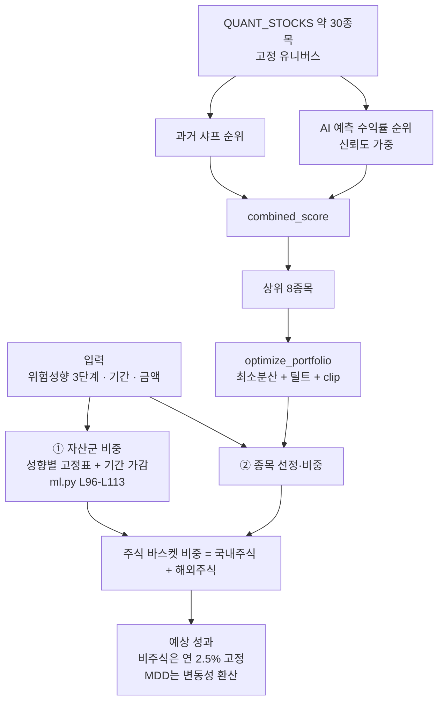
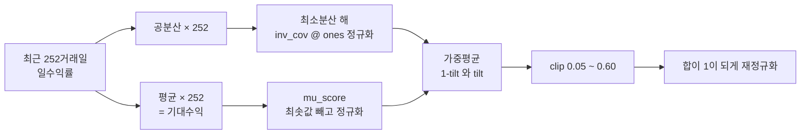

# #16 [분석] A7 로보어드바이저 자산배분·스크리닝 — 'AI가 최적 계산'이라는 화면에서 자산군 비중은 고정표입니다

> 🗂️ 옛 GitHub 이슈를 옮긴 **기록 문서**입니다 — [색인](../README.md). 원문은 그대로 두고, 링크·커밋 해시만 새 자리 기준으로 바꿨습니다.

| 항목 | 내용 |
|---|---|
| 종류 | 이슈 |
| 상태 | 열림 |
| 원 작성 | 이동원(`devlee328288`) · 2026-09-17 12:42 KST |
| 라벨 | `analysis` `phase-2` |
| 댓글 | 1건 |
| 옛 주소 | `github.com/devlee328288/Qurious/issues/16` (지금은 열리지 않음) |

## 본문

## 쉬운 요약 3줄

1. **"AI가 최적 자산배분 비율을 계산합니다"** 라고 적힌 화면에서, **자산군 비중(주식/채권/현금)은 계산되지 않습니다.** 성향별로 미리 적어 둔 표에 투자기간만큼 숫자를 더하고 빼는 구조입니다. 그래서 **중립+초장기를 고르면 현금이 −1.0%, 공격적+초장기면 −4.0%** 가 화면에 나옵니다(실측).
2. 종목 비중은 실제로 계산하지만, **결과는 "최소분산"이 아닙니다.** 최소분산 해를 만든 뒤 기대수익 쪽으로 섞고 5~60%로 자르는데, **자른 뒤 다시 100%로 맞추면서 하한 5%가 깨집니다**(실측 4.21%).
3. "예상 MDD"로 표시되는 값은 **최대낙폭이 아니라 변동성 × √기간**입니다. 1년 구간 시뮬레이션에서 **경로의 40.3%가 그 값보다 더 나빴습니다.** 안전판으로 읽으면 위험합니다.

---

## 한눈에 보기

| 무엇 | 지금 | 확실도 |
|---|---|---|
| 자산군 비중(주식·채권·대체·현금) | **성향별 고정표 + 기간 가감.** 시장 데이터와 무관 | 🟢 |
| 고정표의 경계 | **현금 비중이 음수**가 됨 (중립+10년 −1.0%, 공격+10년 −4.0%) | 🟢 실측 |
| 종목 비중 | 최소분산 해 + 기대수익 틸트 + clip → **최소분산도 평균분산도 아님** | 🟢 |
| clip(5%, 60%) | 재정규화 때문에 **하한이 깨짐**(4.21%). 상한도 극단 사례에서 63.16% | 🟢 실측 |
| 성향 구분 | 세 성향의 **상위 3종목이 동일**, 최대 비중 차 15.3%p | 🟢 실측 |
| "예상 MDD" | `−(연변동성 × √연수)` — MDD가 아님 | 🟢 |
| 비주식 자산 수익 | **연 2.5% 고정** 가정 (근거 없음) | 🟢 |
| 기대수익의 출처 | **최근 252거래일 평균수익률**을 그대로 미래 기대수익으로 사용 | 🟢 |
| 스크리닝 "LightGBM (앙상블)" | 학습 모델이 아니라 **규칙 3개 점수 합산** (코드 주석이 인정) | 🟢 |
| "신뢰도 65% 이상" 필터 | `min(95, 55 + abs(점수) × 13)` — 확률이 아니라 점수를 옮긴 값 | 🟢 |
| 네 번째 샤프 | `ml.py`에 샤프 계산이 또 있음(ddof=0·무위험 0) — A6의 3가지에 이어 **4번째** | 🟢 |
| RFP 3모델(평균분산·RP·BL) | 개념 화면에 **수식만**, 계산 코드 없음 | 🟢 ([#5](../issues/005.md) 11·13·14행) |

> **판정은 추천이고 확정이 아닙니다.** 확정은 D5(2차 설계)·D1([#7](../discussions/007.md))·D3에서 합니다.

---

## 용어 풀이

### ⓪ 같은 말이 여러 뜻입니다

| 말 | 이 문서의 구분 | 가리키는 것 |
|---|---|---|
| "자산배분" | **① 자산군 배분 / ② 종목 배분** | ①은 고정표, ②는 계산. **둘은 서로를 참고하지 않습니다.** |
| "최적화" | **제약 있는 최적화 / 지금의 혼합 휴리스틱** | 지금 것은 최적화 문제를 풀지 않습니다. 해석해를 섞을 뿐입니다. |
| "MDD" | **실제 최대낙폭 / 화면의 예상 MDD** | 화면 값은 변동성 환산치입니다. |
| "신뢰도" | **확률(캘리브레이션된 값) / 화면의 신뢰도** | 화면 값은 점수를 55~95로 옮긴 것입니다. |
| "AI" | **학습 모델 / 규칙 점수** | 스크리닝의 "LightGBM"은 후자입니다. |

### ① 자산배분 용어

| 용어 | 정확한 뜻 | 이 문서에서 | 헷갈리기 쉬운 점 |
|---|---|---|---|
| **최소분산 포트폴리오** | 기대수익을 보지 않고 **변동성만 최소화**하는 비중 | `inv_cov @ ones`를 합으로 나눈 값 | **제약이 없으면 음수 비중(공매도)이 나옵니다.** 실측에서 2종목이 음수였습니다 |
| **평균-분산(MVO)** | 기대수익과 분산을 **동시에** 놓고 푸는 최적화 | RFP 요구 항목. **코드 없음** | 최소분산은 MVO의 한 점(맨 왼쪽 끝)일 뿐입니다 |
| **Risk Parity** | 각 자산의 **위험 기여도**를 같게 맞춤 | RFP 요구 항목. **코드 없음** | 비중을 같게 하는 동일가중과 다릅니다 |
| **Black-Litterman** | 시장 균형 수익률에 **투자자 견해**를 베이즈로 결합 | RFP 요구 항목. **코드 없음** | 기대수익 추정 오차를 줄이는 방법이지 별도 자산군이 아닙니다 |
| **틸트(tilt)** | 기준 비중에서 어느 방향으로 **기울이는** 것 | `tilt_strength` 0.10/0.35/0.65 | 최적화가 아니라 **두 벡터의 가중평균**입니다 |
| **clip** | 값을 상·하한 안으로 **자르기** | `np.clip(w, 0.05, 0.60)` | **자른 뒤 합을 1로 다시 맞추면 한계가 깨집니다**(§4.3) |
| **turnover / 리밸런싱** | 비중을 다시 맞추는 것과 그 거래량 | **코드 없음** | RA 심사항목입니다([#5](../issues/005.md) 5.2) |

### ② 지표 용어 — 계산표와 숫자 예시

**"예상 MDD"**: 화면에 `expected_mdd_pct`로 나가는 값.

| | 식 | 1년 | 3년 | 5년 | 10년 |
|---|---|---|---|---|---|
| **화면 값** | `−(연변동성 × √연수)` | **−18.00%** | −31.18% | −40.25% | −56.92% |
| 시뮬레이션 중앙값 | 20,000경로 실제 MDD | −16.25% | −25.87% | −31.26% | −39.36% |
| 시뮬레이션 95% 최악 | 하위 5% 분위 | **−30.13%** | −44.76% | −52.42% | −62.59% |
| **화면 값보다 나빴던 경로** | | **40.3%** | 29.8% | 22.5% | 10.1% |

> 가정: 연변동성 18% · 연수익 6% · 기하브라운운동. **기간에 따라 틀리는 방향이 반대입니다** — 1년에서는 40%의 경우가 표시값보다 나쁘고, 10년에서는 표시값이 중앙값보다 17.6%p 과하게 나쁩니다. 어느 쪽이든 "예상 MDD"라는 이름과 맞지 않습니다.

**스크리닝 신뢰도**: `confidence = min(95, int(55 + abs(score) * 13))`

| 점수 | 1 | 2 | 3 | 4 |
|---|---|---|---|---|
| 표시 신뢰도 | **68%** | 81% | 94% | 95%(상한) |

> 화면의 "최소 신뢰도 **65% 이상**" 필터는 실제로는 **abs(점수) ≥ 1**을 뜻합니다. "80% 이상"은 **abs(점수) ≥ 2**입니다. 확률적 의미는 없습니다.

---

## 1. 무엇을 코드로 답하고, 무엇을 외부에서 찾았나

| 질문 | 어디서 |
|---|---|
| 자산군 비중이 어떻게 정해지나 | 코드 + **재현 실험** (§3) |
| "최적화"가 실제로 무엇을 계산하나 | 코드 + **재현 실험** (§4) |
| "예상 MDD"가 실제 MDD와 얼마나 다른가 | **시뮬레이션** (§5) |
| 스크리닝 점수·신뢰도의 정체 | 코드 (§6) |
| RFP 3모델을 무엇으로 채우나 | **PyPortfolioOpt 공식 문서** + [#5](../issues/005.md) §5.1 (§9) |

**조회일** 2026-09-17 (KST) · **기준 커밋** Qurious `04f476a`

| 외부 출처 | URL |
|---|---|
| PyPortfolioOpt — Mean-Variance Optimization | https://pyportfolioopt.readthedocs.io/en/latest/MeanVariance.html |
| Riskfolio-Lib 공식 문서 | https://riskfolio-lib.readthedocs.io/en/latest/ |

**재현 실험**: 프로젝트 함수(`optimize_portfolio`)와 라우트 로직을 그대로 불러와 **합성 데이터**(8종목, 520일, seed 고정)로 돌렸습니다. 외부 호출 없음. 수치의 **크기는 참고값**, 주장은 **구조**입니다.

---

## 2. 자산배분 흐름 — 두 단계가 서로를 보지 않습니다



핵심: **①은 데이터를 보지 않고, ②는 성향을 `tilt_strength` 한 숫자로만 받습니다.** 두 단계가 만나는 곳은 마지막 곱셈 한 줄([`ml.py #L226`](https://github.com/EST-team-project/Qurious/blob/04f476a/app/routes/ml.py#L226))뿐입니다.

---

## 3. 자산군 비중은 계산이 아니라 표입니다

[`ml.py #L96-L113`](https://github.com/EST-team-project/Qurious/blob/04f476a/app/routes/ml.py#L96-L113):

| 성향 | 국내주식 | 해외주식 | 국내채권 | 대체자산 | 현금 |
|---|---|---|---|---|---|
| 보수적 | 15 | 10 | 50 | 10 | 15 |
| 중립 | 30 | 25 | 30 | 10 | 5 |
| 공격적 | 45 | 35 | 10 | 8 | 2 |

기간 보정은 `horizon_boost = min(6, max(0, 기간 − 3))`을 **주식에 더하고 채권·현금에서 뺍니다.**

### 3.1 화면에서 두 번 고르면 현금이 음수가 됩니다 🟢

화면 드롭다운에 **"초장기 (5년 이상)" = 10년**이 있습니다([app.html #L1706](https://github.com/EST-team-project/Qurious/blob/04f476a/public/app.html#L1706)). 로직을 그대로 재현한 결과:

| 성향 / 기간 | 국내주식 | 해외주식 | 국내채권 | 대체자산 | **현금** | 주식 합 |
|---|---|---|---|---|---|---|
| 보수적 / 10년 | 21.0 | 16.0 | 44.0 | 10.0 | 9.0 | 37.0 |
| **중립 / 10년** | 36.0 | 31.0 | 24.0 | 10.0 | **−1.0** | 67.0 |
| **공격적 / 10년** | 51.0 | 41.0 | 4.0 | 8.0 | **−4.0** | **92.0** |
| 공격적 / 5년 | 47.0 | 37.0 | 8.0 | 8.0 | 0.0 | 84.0 |

합계 정규화([#L110-L113](https://github.com/EST-team-project/Qurious/blob/04f476a/app/routes/ml.py#L110-L113))는 총합이 이미 100이라 **음수를 고치지 못합니다.** 음수 현금은 "빚내서 투자"를 뜻하는데, 그런 설계가 아니라 **뺄셈에 하한이 없어서** 생긴 값입니다.

### 3.2 성향별로 "유의미하게 구분"되는가

코스콤 RA 테스트베드 심사항목 중 **개인 맞춤성**은 "성향별로 유의미하게 구분되는 복수 포트폴리오"를 봅니다([#5](../issues/005.md) §5.2). 종목 단계에서 실측하면:

| 비교 | 최대 비중 차이 | 전체 차이(L1) | 상위 3종목 |
|---|---|---|---|
| 보수적 vs 공격적 | **15.3%p** | 49.5%p | **동일(S1·S2·S3)** |
| 보수적 vs 중립 | 5.8%p | — | 동일 |

> 구분이 아예 없지는 않습니다. 다만 **어느 성향을 골라도 같은 종목이 상위에 오고**, 성향은 그 비중을 조금 조절할 뿐입니다. 성향 설문도 없습니다([`RoboAllocationBody` #L61-L64](https://github.com/EST-team-project/Qurious/blob/04f476a/app/routes/ml.py#L61-L64)).

---

## 4. "포트폴리오 최적화"의 실체

[`optimize_portfolio` #L222-L245](https://github.com/EST-team-project/Qurious/blob/04f476a/app/services/investment_research.py#L222-L245)는 네 단계입니다.



### 4.1 최소분산 해에는 공매도가 들어 있습니다 🟢

`inv_cov @ ones`를 합으로 나눈 것은 **제약 없는** 최소분산 해석해입니다. 실측(8종목):

| | 값 |
|---|---|
| 음수 비중 종목 수 | **2개** |
| 최소 비중 | **−6.18%** |
| 최대 비중 | 50.94% |

이 음수는 뒤의 틸트·clip에서 가려지지만, **출발점이 공매도를 가정한 해**라는 점은 남습니다. 롱온리를 원하면 최적화 단계에서 제약으로 넣어야 합니다(§9).

### 4.2 결과는 최소분산이 아닙니다 🟢

같은 공분산에서 각 비중의 실제 연변동성:

| 포트폴리오 | 연변동성 |
|---|---|
| 제약 없는 최소분산(코드의 `min_var`) | **12.51%** |
| 최종 — 보수적 | 14.15% |
| 최종 — 중립 | 14.83% |
| 최종 — 공격적 | 16.89% |
| (참고) 동일가중 | 19.29% |

> **공정하게**: 동일가중보다는 분명히 낮습니다(분산 효과가 있습니다). 다만 **"최소분산"이라는 이름과 실제 결과 사이에는 1.6~4.4%p 차이**가 있고, 그 차이는 기대수익 틸트가 만든 것입니다. 이 구조를 문서화하지 않으면 발표에서 "무슨 최적화냐"는 질문에 답할 수 없습니다.

### 4.3 5~60% 제한이 지켜지지 않습니다 🟢

[`#L242`](https://github.com/EST-team-project/Qurious/blob/04f476a/app/services/investment_research.py#L242)는 `np.clip(weights, 0.05, 0.60)` 다음 줄에서 `weights /= weights.sum()`을 합니다. **자를 때는 지켜지지만, 다시 100%로 맞추는 순간 비율이 바뀝니다.**

| 성향 | 최소 비중 | 하한 5% 지켜짐? | 최대 비중 | 상한 60% 지켜짐? |
|---|---|---|---|---|
| 보수적 | **4.21%** | ❌ | 39.5% | ✅ |
| 중립 | **4.58%** | ❌ | 33.9% | ✅ |
| 공격적 | **4.85%** | ❌ | 24.25% | ✅ |
| (극단 예시) 한 종목만 기대수익이 압도적 | — | — | **63.16%** | ❌ |

> 지금 데이터에서는 상한이 깨지지 않지만 **구조적으로 깨질 수 있습니다.** 제한을 약속으로 쓰려면 clip이 아니라 **최적화 제약**이어야 합니다.

### 4.4 기대수익은 "최근 252일 평균"입니다

[`#L234`](https://github.com/EST-team-project/Qurious/blob/04f476a/app/services/investment_research.py#L234) `mu = ret.mean().values * 252`. 최근 1년 평균 일수익률을 252배 한 값을 **미래 기대수익**으로 씁니다. 실측 합성 데이터에서 중립 바스켓의 `expected_return_pct`가 **35.98%** 로 나왔습니다 — 과거 1년이 좋았던 종목을 고르면 기대수익도 그만큼 커지는 구조입니다.

> 이것이 평균-분산 최적화가 실무에서 어려운 바로 그 이유(**기대수익 추정 오차에 민감**)이고, 앱의 개념 설명 화면도 그렇게 적어 두었습니다([app.html #L2532](https://github.com/EST-team-project/Qurious/blob/04f476a/public/app.html#L2532)). 화면은 알고 있고 코드는 그대로 하고 있습니다.

---

## 5. "예상 성과 시뮬레이션"의 가정

[`ml.py #L243-L258`](https://github.com/EST-team-project/Qurious/blob/04f476a/app/routes/ml.py#L243-L258):

| 항목 | 코드 | 문제 |
|---|---|---|
| 전체 기대수익 | `주식바스켓 × 주식비중 + 0.025 × (1 − 주식비중)` | **채권·대체자산·현금을 모두 연 2.5%로** 가정. 근거가 코드에 없습니다 |
| 전체 변동성 | `주식변동성 × 주식비중` | 비주식 자산의 변동성을 **0**으로 봅니다. 상관관계도 없습니다 |
| 누적 수익 | `(1 + 기대수익)^연수 − 1` | 과거 1년 평균을 매년 반복한다고 가정 |
| **예상 MDD** | `−(변동성 × √연수)` | §용어풀이 ② 표 참조 — **MDD가 아닙니다** |

> 변동성을 "주식 비중 × 주식 변동성"으로 잡으면 **채권을 섞을수록 위험이 정확히 비례해 줄어든다**는 뜻이 됩니다. 실제로는 상관관계에 따라 더 줄기도, 덜 줄기도 합니다.

---

## 6. 스크리닝 — 무엇으로 고르나

### 6.1 `combined_score`의 구조 🟢

[`ml.py #L191-L210`](https://github.com/EST-team-project/Qurious/blob/04f476a/app/routes/ml.py#L191-L210):

| 구성 요소 | 순위화 | 가중치 |
|---|---|---|
| 과거 샤프 순위 | 0~1 | **항상 1.0** |
| AI 예측 연환산수익률 순위 | 0~1 | **그 종목의 `confidence`** (없으면 0.6) |

`combined_score = Σ(순위 × 가중치) / Σ가중치`

> 종목마다 가중치가 다른 가중평균입니다. **의도는 좋습니다** — 예측 품질이 낮은 종목의 신호를 약하게 반영합니다(코드 주석이 설명). 다만 그 `confidence`가 A6 §3.6에서 본 대로 **회귀 R²와 3-class 정확도를 반반 섞은 값**이라, 라벨이 "관망"에 몰리면 정확도만으로도 높아집니다.

그리고 AI 예측 수익률 자체가 **±20% clip 뒤 50.4제곱 → 다시 −90~300% clip**을 거친 값입니다(A6 §3.6). **순위만 쓰므로 clip의 영향은 줄지만**, 상한 300%에 여러 종목이 동시에 걸리면 순위가 뭉갭니다 🟡.

### 6.2 "LightGBM (앙상블)"은 학습 모델이 아닙니다 🟢

화면 드롭다운은 **"LightGBM (앙상블)"** 을 기본값으로 보여줍니다([app.html #L1759](https://github.com/EST-team-project/Qurious/blob/04f476a/public/app.html#L1759)). 실제로 불리는 것은 [`screen_pattern` #L100-L102](https://github.com/EST-team-project/Qurious/blob/04f476a/app/services/investment_research.py#L100-L102)의 `else` 분기입니다:

```python
else:  # lightgbm 선택 시에도 학습 모델을 가장한 값이 아닌 투명한 앙상블 점수 사용
    score = (1 if x.ma5 > x.ma20 else -1) + (1 if x.macd > x.macd_signal else -1) + (1 if x.rsi < 45 else -1 if x.rsi > 65 else 0)
```

> **코드 주석이 이미 정직합니다** — "학습 모델을 가장한 값이 아닌". 문제는 **화면에 'LightGBM'이라고 적혀 있다**는 점입니다. 코드는 정직하고 라벨이 부정확한, 고치기 쉬운 종류의 불일치입니다.

### 6.3 스크리닝 범위와 팩터

| 항목 | 지금 | RFP 요구 |
|---|---|---|
| 유니버스 | `QUANT_STOCKS` **고정 약 30종목** | 시장 전체 스크리닝 |
| 팩터 | 이름 붙은 팩터 **없음** (샤프 + AI 예측) | 가치·모멘텀·퀄리티·저변동성 |
| 재무 데이터 | `get_fundamentals`가 있으나 **스크리닝에 연결 안 됨** | 재무 필터 |
| 52주 신고가·정배열 | 없음 | rfp-2 §3.1.4 |
| 사후 추적 | 없음 | "상위 30%" 판정 기준([#5](../issues/005.md) 29행) |

> `/stocks/signals`([stocks.py #L146-L179](https://github.com/EST-team-project/Qurious/blob/04f476a/app/routes/stocks.py#L146-L179))는 유니버스를 전수 스캔하므로 [#5](../issues/005.md) 18행의 "한 종목만 본다"는 지적은 **이 경로에서는 해소**돼 있습니다 🟢. 남은 것은 팩터 정의와 재무 연결입니다.

### 6.3.1 ★ 2026-09-19 추가 — 6.3 표의 **첫 두 줄이 풀렸습니다**

6.3에서 유니버스와 팩터를 격차로 적었습니다. 그 사이 수집기가 서고 **전량 수집이 끝났습니다**([#33](../issues/033.md) §10.1).

| 6.3의 격차 | 그때 | 지금 |
|---|---|---|
| 유니버스 | `QUANT_STOCKS` **고정 약 30종목** | **3,302종목** — 코스피·코스닥·코넥스 전량, 2019-12-30 이후 **4,460,710행** 🟢 |
| 팩터 | 이름 붙은 팩터 없음 | **절반은 지금 재료로 만들 수 있습니다** (아래) |
| 재무 데이터 | 스크리닝에 연결 안 됨 | 🔴 **그대로** — 포털 시세에는 재무가 없습니다 |

#### 무엇을 만들 수 있고 무엇이 안 되나

매일 받는 필드는 15개입니다 — `clpr`(종가) `mkp`(시가) `hipr` `lopr` `vs` `fltRt` `trqu`(거래량) `trPrc`(거래대금) **`lstgStCnt`(상장주식수)** **`mrktTotAmt`(시가총액)** `mrktCtg`(시장구분) 등.

| 팩터 | 만들 수 있나 | 재료 |
|---|:---:|---|
| **모멘텀** (과거 N개월 수익률) | ✅ | `clpr` 시계열 |
| **저변동성** | ✅ | `clpr` 시계열의 표준편차 |
| **규모(Size)** | ✅ | **`mrktTotAmt`** |
| **유동성** | ✅ | `trqu` · `trPrc` |
| 52주 신고가 (rfp-2 §3.1.4) | ✅ | `hipr` · `clpr` |
| 이동평균 정배열 (rfp-2 §3.1.4) | ✅ | `clpr` |
| 거래회전율 | ✅ | `trqu` ÷ `lstgStCnt` |
| **가치** (PER·PBR·PSR) | ❌ | **재무 필요** → DART |
| **퀄리티** (ROE·부채비율) | ❌ | **재무 필요** → DART |
| 배당수익률 | ❌ | **배당 필요** ([#33](../issues/033.md) 열린 질문) |

```
  rfp-2 가 요구하는 4대 팩터

    가치      ❌ ──┐
    퀄리티    ❌ ──┴─→ DART 재무제표가 있어야 함  (아직)
    모멘텀    ✅ ──┐
    저변동성  ✅ ──┴─→ 지금 재료로 바로 됨

  → **절반은 지금 할 수 있고, 절반은 DART 를 붙여야 합니다.**
```

#### 🟢 그리고 **시장지수를 직접 만들 수 있습니다** — D5 ⑨ 베타의 선행 조건

D5 [#18](../discussions/018.md) §2.8이 *"베타가 저장소 전체에 한 줄도 없다"* 고 지적했고, 베타를 내려면 **시장지수가 반드시 필요**합니다. 그런데 —

> **시가총액(`mrktTotAmt`)을 전 종목에 대해 매일 받고 있습니다.**

시가총액 가중 지수는 정의상 그 합의 변화율입니다. 즉 **별도 지수 API 없이 우리 데이터만으로 계산됩니다.**

```
  지수_t = Σ mrktTotAmt(종목, t)  /  Σ mrktTotAmt(종목, t₀) × 기준값

  시장구분(mrktCtg)으로 나누면 코스피·코스닥을 따로 만들 수도 있습니다.
```

🟡 **다만 우리가 만든 지수는 KOSPI 공식 지수와 값이 다릅니다** — 공식 지수는 유동주식 비율·특례 편입·기준시점 보정을 적용합니다. **베타를 재는 목적**에는 큰 문제가 없지만(수익률 상관만 쓰므로), *"KOSPI 대비 몇 %"* 를 말할 때는 **공식 지수를 따로 받아야 합니다.** 포털의 지수시세 API 는 아직 확인하지 않았습니다.

#### 남은 격차

| 항목 | 상태 |
|---|---|
| 재무 연결 (가치·퀄리티) | 🔴 **DART 를 붙여야 합니다** — `.env` 에 키는 있고 호출은 아직 |
| 사후 추적 ("상위 30%" 판정) | 🔴 그대로 |
| 공식 지수 | 🟡 자체 계산은 되지만 공식값은 미확인 |
| **생존 편향** | ✅ **덜 위험해졌습니다** — 상장폐지 432종목을 **지우지 않고 보존**합니다([#33](../issues/033.md) §10.1.4). 30종목 고정 유니버스는 *지금 살아 있는 종목만* 봤습니다 |

---

### 6.4 네 번째 샤프

[`ml.py #L130-L132`](https://github.com/EST-team-project/Qurious/blob/04f476a/app/routes/ml.py#L130-L132)에 샤프 계산이 또 있습니다.

```python
ann_ret = float(np.mean(rets) * 252)
ann_vol = float(np.std(rets) * np.sqrt(252)) if np.std(rets) > 0 else 0.0001
sharpe = ann_ret / ann_vol if ann_vol > 0 else 0.0
```

식은 A6의 **샤프-A와 같지만** `np.std`라 **ddof=0**(모표준편차)입니다. 무위험수익률은 0. A6에서 센 3가지에 이어 **프로젝트 안 네 번째 샤프 구현**입니다.

---

## 7. 화면이 말하는 것과 코드

| 화면 | 화면 문구 | 코드 | 확실도 |
|---|---|---|---|
| 자산배분·최적화 (주 경로) | "투자 성향과 기간에 따라 **AI가 최적 자산배분 비율을 계산**합니다" ([#L1690](https://github.com/EST-team-project/Qurious/blob/04f476a/public/app.html#L1690)) | 자산군은 고정표, 종목은 휴리스틱. **학습 모델 없음** | 🟢 |
| 〃 | "📐 **최적** 자산배분 결과" | 위와 같음 | 🟢 |
| 패턴 인식·스크리닝 (주 경로) | "**AI 패턴 인식** 기법으로 주가 움직임을 **예측**하고" ([#L1746](https://github.com/EST-team-project/Qurious/blob/04f476a/public/app.html#L1746)) | 규칙 3개 점수 합산 | 🟢 |
| 〃 | 모델 드롭다운 "**LightGBM (앙상블)**" | 학습 없음 (§6.2) | 🟢 |
| 자산배분 모델 (개념 설명) | MVO·Black-Litterman·Risk Parity **수식** ([#L2521-L2554](https://github.com/EST-team-project/Qurious/blob/04f476a/public/app.html#L2521-L2554)) | **계산 코드 없음.** "자산배분·최적화 탭에서 실행해보세요"로 안내하지만 그 탭은 셋 중 아무것도 아님 | 🟢 |

> 개념 화면은 **정확합니다** — MVO의 단점("기대수익 추정 오차에 민감, 극단 배분 발생")까지 적어 뒀습니다. 그 설명이 **우리 코드에 그대로 해당**되는데, 화면은 그 사실을 연결해 주지 않습니다.

---

## 8. RFP·RA 심사항목 격차 ([#5](../issues/005.md) 요약, 중복 최소화)

[#5](../issues/005.md)가 이미 표로 정리한 항목입니다. 여기서는 **A7이 새로 확인한 것만** 덧붙입니다.

| [#5](../issues/005.md) 항목 | [#5](../issues/005.md) 판정 | A7이 덧붙이는 것 |
|---|---|---|
| 11 평균-분산 | ❌ | 지금 코드는 **최소분산 해를 쓰지만 결과는 최소분산이 아님**(§4.2) — "부분 구현"이라고 쓸 수도 없습니다 |
| 13 Risk Parity | ❌ | 위험기여도를 계산하는 코드 자체가 없습니다 🟢 |
| 14 Black-Litterman | ❌ | 시장 균형 수익률(역최적화)도 없습니다 🟢 |
| 15 동적 자산배분 | ❌ | 고정표에 **기간 가감만** 있고, 그 가감이 음수 비중을 만듭니다(§3.1) |
| 16 팩터 스크리닝 | 🟡 | 팩터 이름이 없을 뿐 아니라 **재무 API가 연결돼 있지 않습니다**(§6.3) |
| 18 기술적 스크리닝 | 🟡 | `/stocks/signals`는 **전수 스캔을 이미 합니다** — 이 부분은 🟡보다 나은 상태 |
| 개인 맞춤성 | 🟡 | 성향별 **상위 종목이 동일**하다는 실측을 덧붙입니다(§3.2) |
| 리밸런싱 | ❌ | turnover·비용을 다루는 코드가 이 경로에 **전혀 없습니다**(A6 §2와 별개 경로) |

---

## 9. 대체 설계 — 무엇으로 바꾸나

[#5](../issues/005.md) §5.1이 도구를 비교했습니다(Riskfolio-Lib만 세 모델 내장). A7은 **우리 코드를 어떤 호출로 바꾸는지**까지 적습니다.

### 9.1 PyPortfolioOpt로 바꿀 경우 🟢 (공식 문서 확인)

| 지금 | 바꾸면 | 왜 |
|---|---|---|
| `inv_cov @ ones` 정규화 | `EfficientFrontier(mu, S, weight_bounds=(0.05, 0.60)).min_volatility()` | **상하한이 제약으로 들어가 실제로 지켜집니다**(§4.3 해결) |
| `tilt_strength` 가중평균 | `max_quadratic_utility(risk_aversion=δ)` | 성향 3단계를 **위험회피계수 3값**으로 — 최적화 안에서 처리 |
| (없음) | `max_sharpe(risk_free_rate=...)` | 접선 포트폴리오. 무위험수익률을 **명시적 인자**로 받습니다 |
| `np.clip` 후 재정규화 | `add_constraint(...)` + `clean_weights()` | 제약 위반이 구조적으로 불가능 |
| 과거 평균 기대수익 | `expected_returns` 모듈 + Black-Litterman | 추정 오차 완화 |

> `EfficientFrontier(expected_returns, cov_matrix, weight_bounds=(0, 1), ...)` — **`weight_bounds`가 기본 (0,1)이고 공매도를 쓰려면 (-1,1)로 바꿔야 한다**고 문서가 명시합니다. 지금 코드의 "음수 비중이 나온 뒤 가려지는" 구조와 반대입니다.

### 9.2 Risk Parity가 필요하면 🟡

Riskfolio-Lib이 **Risk Parity를 22개 위험척도로 제공**하고 HRP·HERC·NCO도 포함합니다(공식 문서 개요, 2026-09-17 조회). PyPortfolioOpt는 RP 내장이 없어 직접 구현해야 합니다([#5](../issues/005.md) §5.1).

> 🟡 정확한 함수 시그니처는 확인하지 못했습니다(문서 하위 페이지 404). **D5에서 도구를 정한 뒤 실제 호출 예제를 한 번 돌려보고 확정**해야 합니다.

### 9.3 무엇을 남기나

| 지금 코드 | 처리 |
|---|---|
| `combined_score` 순위 결합 구조 | **유지** — 종목별 신뢰도 가중은 아이디어가 좋습니다(§6.1) |
| `/stocks/signals` 전수 스캔 | **유지** |
| 자산군 고정표 | **경계만 고치고 유지**(§10 ②) — 2차 범위에서 자산군 최적화까지 하긴 어렵습니다 |
| `optimize_portfolio` 휴리스틱 | **교체** |
| "예상 MDD" | **표기 교체**(§10 ④) |

---

## 10. 판정 — 추천이고 확정이 아닙니다

| # | 항목 | 추천안 | 대안 | 왜 |
|---|---|---|---|---|
| ① | 종목 비중 계산 | **PyPortfolioOpt로 교체**하고 상하한을 제약으로 넣습니다 | 지금 휴리스틱 유지 + 문서화 | 제약이 지켜지지 않는 것(§4.3)은 설명으로 덮을 수 없습니다 |
| ② | 자산군 고정표 | **경계 버그를 먼저 고칩니다** — 각 자산군에 하한 0을 두고, 뺄 수 있는 만큼만 뺍니다 | 고정표 자체를 최적화로 교체 | 음수 비중(§3.1)은 **화면 두 번 클릭으로 재현**됩니다. 교체는 D5 범위가 커집니다 |
| ③ | 화면 문구 | **"AI가 최적 계산"→ 실제 방식대로** 고칩니다 (예: "성향별 기준 배분 + 최근 1년 데이터 기반 종목 비중") | 그대로 | [#7](../discussions/007.md) §2.2에서 이미 열린 질문으로 올라와 있습니다 |
| ④ | "예상 MDD" | **이름을 바꾸고**(예: "1σ 변동 범위") 실제 MDD는 **시뮬레이션 분위수**로 표시 | 삭제 | 지금 값이 안전판으로 읽히는 게 가장 위험합니다(§5) |
| ⑤ | 스크리닝 "LightGBM" 표기 | **"규칙 앙상블(학습 없음)"으로 고칩니다** | 실제 LightGBM 연결 | 코드 주석이 이미 정직합니다. 라벨만 맞추면 됩니다 |
| ⑥ | 신뢰도 | **"점수"로 이름을 바꾸거나**, 실제 확률로 캘리브레이션 | 그대로 | 65%·80% 필터가 확률처럼 보입니다 |
| ⑦ | RFP 3모델 | **Risk Parity 하나를 먼저** 추가하고(평균분산은 ①로 해결) BL은 여력이 되면 | 셋 다 / 하나도 안 함 | [#5](../issues/005.md) 기준 ❌ 3건 중 2건을 메우면 격차가 크게 줄고, BL은 뷰 정의가 따로 필요합니다 |
| ⑧ | 성향 구분 검증 | **성향별 포트폴리오가 통계적으로 구분되는지**를 사전 등록한 방식으로 검증 | 1:1 맞춤 추천 | [#7](../discussions/007.md) 추천안과 같은 방향입니다(1:1 맞춤 대신 구분 검증) |
| ⑨ | 리밸런싱 | **주기와 밴드를 D5에서 정하고**, 비용은 D4 규격을 그대로 씁니다 | 2차 범위 밖 | RA 심사항목이고, 비용 없는 리밸런싱은 백테스트를 왜곡합니다 |

---

## 11. 근거 · 반례 · 한계

### 반례

| 반례 | 내용 |
|---|---|
| **분산 효과는 실제로 있습니다** | 최종 비중의 변동성(14.15~16.89%)이 동일가중(19.29%)보다 낮습니다 🟢. "아무 의미 없는 계산"은 아닙니다 |
| **코드가 스스로 정직한 곳이 많습니다** | `screen_pattern`의 "학습 모델을 가장한 값이 아닌" 주석, `optimize_portfolio`의 `"비용·세금 미반영"` method 문구([#L245](https://github.com/EST-team-project/Qurious/blob/04f476a/app/services/investment_research.py#L245)), 개념 화면의 MVO 단점 설명 — **문제는 주로 화면 라벨입니다** |
| **`confidence` 가중은 좋은 설계입니다** | 예측 품질이 낮은 종목의 신호를 약하게 쓰는 것은 실무 감각에 맞습니다(§6.1) |
| **고정표가 반드시 나쁜 건 아닙니다** | 타깃 데이트 펀드(TDF)의 글라이드 패스도 규칙 기반 고정표입니다. **문제는 "AI가 계산"이라고 말하는 것**과 음수 경계입니다 |
| **성향 구분이 아주 없지는 않습니다** | L1 거리 49.5%p는 작지 않습니다. 다만 상위 종목이 같습니다 |

### 한계

| 한계 | 왜 |
|---|---|
| **합성 데이터입니다** | 8종목·520일·상관 0.35 고정. 실제 KOSPI 종목의 상관 구조는 다릅니다. **음수 현금(§3.1)과 clip 위반(§4.3)은 데이터와 무관한 로직 문제**라 영향받지 않습니다 |
| **`QUANT_STOCKS` 구성을 확인하지 않았습니다** | 약 30종목이라는 것만 확인. 섹터 편중 여부는 A13·D5 |
| **Riskfolio-Lib API 미확인** | 문서 하위 페이지 404 (§9.2) |
| **`get_fundamentals` 내용 미확인** | A7 범위 밖(A4·A13). "스크리닝에 연결 안 됨"만 확인 🟢 |
| **`robo-decision` 화면** | `/api/quant/auto/*`를 쓰며 A9([#12](../issues/012.md))에서 다뤘습니다. 여기서는 다루지 않았습니다 |
| **MDD 시뮬레이션은 정규분포 가정** | 실제 수익률은 꼬리가 두꺼워 **실제 MDD는 더 나쁠 수 있습니다**. 즉 §5의 "40.3%"는 낙관적인 추정입니다 |

---

## 12. 이 판정을 뒤집을 조건

| # | 조건 | 뒤집히는 것 |
|---|---|---|
| 1 | D5에서 **자산군 배분까지 최적화**하기로 함 | ② 고정표 유지 |
| 2 | 실제 종목 데이터에서 **성향별 상위 종목이 뚜렷이 갈림** | §3.2 · ⑧의 시급성 |
| 3 | 2차 일정상 **라이브러리 추가가 불가**(D2 의존성·용량 제약) | ① 교체 → 지금 휴리스틱에 제약 처리만 직접 구현 |
| 4 | 강사님이 **"RFP 3모델은 개념 설명으로 충분"**이라고 하심 | ⑦ |
| 5 | D1에서 **자산배분·최적화가 주 경로에서 빠짐** | 전체 우선순위 |
| 6 | `QUANT_STOCKS`가 실제로는 30종목이 아니라 훨씬 적음 | §6.3 유니버스 판단 |
| 7 | 성향 설문을 넣기로 해서 **성향이 3단계가 아니게 됨** | ②의 고정표 구조 |

---

## 13. 팀원 확인 · 넘길 곳

### 확인 부탁드립니다

1. **음수 현금 비중(§3.1)은 2차 시작 전에 고칠까요, 2차 안에서 고칠까요?** 화면 두 번 클릭으로 재현되는 것이라 발표 시연 중에 나올 수 있습니다.
2. **자산배분 도구(①·⑦)**: PyPortfolioOpt(평균분산·BL 내장, RP 직접 구현) vs Riskfolio-Lib(셋 다 내장) — 어느 쪽이 좋을까요? → D5에서 확정합니다.
3. **"예상 MDD" 표기(④)**: 이름만 바꿀지, 시뮬레이션 분위수까지 넣을지 의견 주세요.

### 넘길 곳

| 내용 | 넘길 곳 |
|---|---|
| 자산배분 도구 선택 · Risk Parity 추가 · 리밸런싱 규칙 · 벤치마크 | **D5** |
| 성향 구분 검증 방식 ⑧ · 성향 설문 | **D1 [#7](../discussions/007.md)** → **D5** |
| 화면 문구 ③⑤⑥ · 개념 화면 연결 | **D3** · A13 |
| 음수 현금 경계 ② | **D5**(또는 즉시 수정 PR — 팀 확인 후) |
| 비용·리밸런싱 비용 규격 | **D4** (A6 §5.4와 같은 규격) |
| `QUANT_STOCKS` 구성·재무 API 연결 | **A4** · A13 |
| 네 번째 샤프(§6.4) 통일 | **D4** (A6 ④와 함께) |

---

<sub>기준 커밋: Qurious `04f476a` · 조회일 2026-09-17 KST · 재현 실험은 프로젝트 함수를 그대로 불러와 로컬에서 실행(외부 호출 없음, seed 고정)</sub>

---

## 댓글 1건

---

<a id="issuecomment-5739155558"></a>

### 💬 1. 이동원(`devlee328288`) · 2026-09-19 12:52 KST

**본문을 고쳤습니다 — 6.3.1 신설.** (2026-09-19)

6.3 격차표의 **첫 두 줄이 풀렸습니다.** 전량 수집이 끝났습니다([#33](../issues/033.md) §10.1).

| 6.3의 격차 | 그때 | 지금 |
|---|---|---|
| 유니버스 | 고정 **약 30종목** | **3,302종목** · 4,460,710행 🟢 |
| 팩터 | 이름 붙은 팩터 없음 | **절반은 지금 재료로 됩니다** |
| 재무 데이터 | 연결 안 됨 | 🔴 **그대로** — 포털 시세에 재무는 없습니다 |

**무엇이 되고 무엇이 안 되나**

```
  rfp-2 가 요구하는 4대 팩터
    가치      ❌ ──┐
    퀄리티    ❌ ──┴─→ DART 재무제표가 있어야 함
    모멘텀    ✅ ──┐
    저변동성  ✅ ──┴─→ 지금 재료로 바로 됨
```

**규모(시가총액)·유동성·52주 신고가·정배열·거래회전율**도 지금 재료로 됩니다.

**🟢 그리고 시장지수를 직접 만들 수 있습니다 — D5 ⑨ 베타의 선행 조건**

D5 §2.8이 *"베타가 한 줄도 없다"* 고 지적했고 베타를 내려면 시장지수가 필요한데, **시가총액(`mrktTotAmt`)을 전 종목에 대해 매일 받고 있습니다.** 시가총액 가중 지수는 그 합의 변화율이므로 **별도 지수 API 없이 계산됩니다.** `mrktCtg` 로 코스피·코스닥을 나눌 수도 있습니다.

🟡 다만 **공식 KOSPI 와는 값이 다릅니다**(유동주식 비율·특례 편입·기준시점 보정). **베타를 재는 데는 문제없지만**(수익률 상관만 씀), *"KOSPI 대비 몇 %"* 를 말하려면 공식 지수를 따로 받아야 합니다.

**✅ 생존 편향도 덜 위험해졌습니다** — 상장폐지 432종목을 지우지 않고 보존합니다. 30종목 고정 유니버스는 *지금 살아 있는 종목만* 보고 있었습니다.

**남은 것** 🔴 — 재무 연결(DART · `.env` 에 키는 있고 호출은 아직) · 사후 추적 · 공식 지수.
