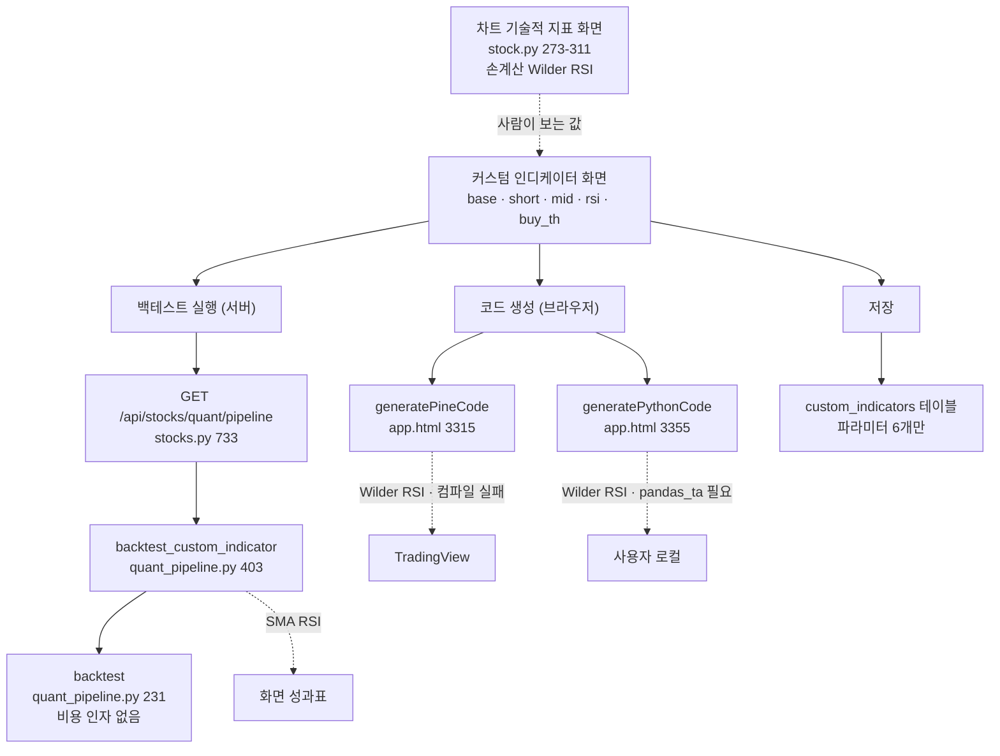

# #19 [분석] A5 기술지표·커스텀 인디케이터 — 화면에서 본 지표와 백테스트가 쓰는 지표가 다릅니다

> 🗂️ 옛 GitHub 이슈를 옮긴 **기록 문서**입니다 — [색인](../README.md). 원문은 그대로 두고, 링크·커밋 해시만 새 자리 기준으로 바꿨습니다.

| 항목 | 내용 |
|---|---|
| 종류 | 이슈 |
| 상태 | 열림 |
| 원 작성 | 이동원(`devlee328288`) · 2026-09-17 13:52 KST |
| 라벨 | `analysis` `phase-3` |
| 댓글 | 1건 |
| 옛 주소 | `github.com/devlee328288/Qurious/issues/19` (지금은 열리지 않음) |

## 본문

> **한 줄로**: 커스텀 인디케이터 화면은 **화면에 그린 지표와 백테스트가 쓰는 지표가 다르고**, **내보낸 PineScript는 TradingView에서 컴파일되지 않습니다.**
> A6 [#14](../issues/014.md)의 "성과 엔진 5개" 조사를 지표 쪽으로 이어서 전수 확인했습니다.

## 0. 쉬운 요약

1. **RSI가 화면마다 다릅니다.** 커스텀 인디케이터 백테스트만 단순이동평균 RSI를 쓰고, 차트·전략분석·PineScript는 전부 Wilder RSI를 씁니다. 같은 586일 데이터에서 "RSI < 35"를 만족한 날이 **151일 vs 87일** — 거의 두 배 차이입니다.
2. **생성된 PineScript는 실행되지 않습니다.** 4개 기준 조합 전부에 자바스크립트 코드 `100 - parseInt(buyTh)` 가 그대로 새어 나갑니다. 게다가 `indicator()` 로 선언해서 **TradingView 전략 테스터가 아예 돌지 않습니다** — 교안이 비교하라는 5개 지표가 나올 수 없습니다.
3. **저장한 인디케이터는 재현되지 않습니다.** 파라미터 6개만 저장하고 **종목·기간·데이터·결과를 저장하지 않습니다.**

### 한눈에 보기

| # | 발견 | 크기 | 확실도 | 넘길 곳 |
|---|---|---|---|---|
| 1 | RSI 구현이 3벌, 백테스트만 SMA 평활 | 평균절대차 **6.91**, 최대 **24.31** | 🟢 | D6 |
| 2 | 볼린저 표준편차 자유도가 화면·백테스트 간 다름 | 밴드폭 **2.53%** 차이 | 🟢 | D6 |
| 3 | PineScript에 JS 코드가 새어 나감 | **4종 전부 컴파일 실패** | 🟢 | D6 |
| 4 | `indicator()` 선언이라 전략 테스터 불가 | 교안 5개 지표 **산출 불가** | 🟢 | D6 |
| 5 | `macd_bb` 매도 규칙이 세 곳에서 서로 다름 | **3갈래** | 🟢 | D6 |
| 6 | `cost_bps` 를 받고도 무시 | 0→500bps에도 결과 **불변** | 🟢 | D4 [#17](../discussions/017.md) |
| 7 | 저장된 인디케이터에 종목·기간·결과가 없음 | 필드 **6개뿐** | 🟢 | D6 |
| 8 | 파라미터 조합이 과도 | **2,266만** (D4 값 재현) | 🟢 | D4 [#17](../discussions/017.md) |
| 9 | 생성 Python이 `pandas_ta` 의존 — 설치돼 있지 않음 | 복붙하면 ImportError | 🟢 | D6 |
| 10 | 기본 조합 `rsi_ma` 가 600일 동안 거래 0회 | 신호가 거의 안 남 | 🟡 | D6 |

확실도: 🟢 코드·원문으로 확인 · 🟡 확인한 사실 위에 얹은 제 판단

### 용어 풀이

**먼저: "RSI"라는 한 단어가 이 프로젝트에서 세 가지 계산을 가리킵니다**

| 이 문서의 표기 | 계산 방식 | 어디서 쓰나 |
|---|---|---|
| **SMA-RSI** | 상승폭·하락폭을 **단순이동평균**으로 평활 | 커스텀 인디케이터 백테스트 · ML 피처 |
| **Wilder-RSI** | 직전 평균에 새 값을 `1/기간` 만큼 섞음(지수평활) | 차트 화면 · 전략 분석 · TradingView · pandas_ta |
| **손계산 Wilder** | 위와 같은 식이지만 **첫 값을 단순평균으로 시작** | 차트 화면 `stock.py` |

원조 J. Welles Wilder 의 정의는 **Wilder-RSI** 입니다. 시중 도구(TradingView·pandas_ta)도 전부 이쪽입니다.

**지표·통계**

| 용어 | 정확한 뜻 | 이 문서에서 | 헷갈리기 쉬운 점 |
|---|---|---|---|
| **평활(smoothing)** | 들쭉날쭉한 값을 부드럽게 만드는 처리 | RSI가 갈라지는 지점 | 단순이동평균과 지수평활은 **같은 기간을 넣어도 다른 값**이 나옵니다 |
| **자유도(ddof)** | 표준편차를 구할 때 `n`으로 나누나 `n-1`로 나누나 | 볼린저밴드가 갈라지는 지점 | `ddof=0`은 모집단, `ddof=1`은 표본. pandas `.std()`는 **기본이 1** 입니다 |
| **골든크로스** | 단기 이동평균이 중기를 **아래에서 위로** 뚫는 날 | 매수 조건 | "위에 있는 상태"가 아니라 **뚫는 그 하루**입니다 |
| **전략 테스터(Strategy Tester)** | TradingView가 매매 성과를 계산해 주는 탭 | 발견 4 | `strategy()` 로 선언한 스크립트에만 생깁니다. `indicator()` 는 **안 생깁니다** |
| **틱(tick)** | 그 종목의 최소 호가 단위 | 슬리피지 단위 | 시간 단위가 아닙니다 |

**계산 예시 — SMA-RSI와 Wilder-RSI가 왜 갈라지나 (기간 3, 상승폭만 놓고)**

| 날 | 상승폭 | SMA-RSI 쪽 평균 | Wilder 쪽 평균 |
|---|---|---|---|
| 1~3 | 1, 1, 1 | (1+1+1)/3 = **1.000** | 시작값 **1.000** |
| 4 | 4 | (1+1+4)/3 = **2.000** | (1.000×2 + 4)/3 = **2.000** |
| 5 | 1 | (1+4+1)/3 = **2.000** | (2.000×2 + 1)/3 = **1.667** |
| 6 | 1 | (4+1+1)/3 = **2.000** | (1.667×2 + 1)/3 = **1.444** |
| 7 | 1 | (1+1+1)/3 = **1.000** | (1.444×2 + 1)/3 = **1.296** |

단순이동평균은 4가 창을 빠져나가는 7일에 **뚝 떨어지고**, Wilder는 **천천히 줄어듭니다.** 기간이 14면 이 차이가 훨씬 오래 갑니다.

---

## 1. 범위와 방법

**코드로 답한 것**: 3~6절 (지표 갈라짐 · PineScript · 재현성 · 과최적화)
**외부 조사로 답한 것**: 7절 (TradingView Pine Script v6 공식 문서)

**대상** (기준 커밋 `04f476a`)

| 파일 | 본 것 |
|---|---|
| [`app/services/ta_utils.py`](https://github.com/EST-team-project/Qurious/blob/04f476a/app/services/ta_utils.py) | 공통 지표 8개 전부 |
| [`app/services/quant_pipeline.py`](https://github.com/EST-team-project/Qurious/blob/04f476a/app/services/quant_pipeline.py) | `feature_engineer` · `backtest` · `backtest_custom_indicator` |
| [`app/services/investment_research.py`](https://github.com/EST-team-project/Qurious/blob/04f476a/app/services/investment_research.py) | `indicators` · `_position` · `backtest_strategy` |
| [`app/services/stock.py`](https://github.com/EST-team-project/Qurious/blob/04f476a/app/services/stock.py) | `_calc_rsi` · `_calc_sma` · `_calc_bollinger` |
| [`app/models/trading.py`](https://github.com/EST-team-project/Qurious/blob/04f476a/app/models/trading.py#L72-L82) | `CustomIndicator` 모델 |
| [`app/routes/stocks.py`](https://github.com/EST-team-project/Qurious/blob/04f476a/app/routes/stocks.py#L733-L764) | `/quant/pipeline` · `/custom-indicators` 3개 |
| [`public/app.html`](https://github.com/EST-team-project/Qurious/blob/04f476a/public/app.html#L3315-L3400) | `generatePineCode` · `generatePythonCode` |

**재현 환경**: Python 3.12 · numpy 1.26.4 · pandas 3.0.3 · Node.js v24.14.0
합성 데이터 시드 **20260901** 고정, 600거래일. 외부 시세 호출 없이 **프로젝트 함수를 그대로 불러와** 측정했습니다.

---

## 2. 지도 — 커스텀 인디케이터가 지나가는 길



**점선 네 개가 이 문서의 주제입니다.** 같은 파라미터가 네 갈래로 흘러가는데 **계산이 서로 다릅니다.**

---

## 3. 지표 정의가 갈라집니다

`ta_utils.py`는 첫 줄에 이렇게 적혀 있습니다 ([#L3-L6](https://github.com/EST-team-project/Qurious/blob/04f476a/app/services/ta_utils.py#L3-L6)).

> quant_pipeline.py / investment_research.py 가 각자 구현하던 (…) 계산을 하나로 모아, 같은 지표의 정의가 파일마다 갈라지는 것을 막는다.

**의도는 옳은데 절반만 이뤄졌습니다.** `stock.py`가 합류하지 않았고, `ta_utils` 안에서도 `method` 파라미터로 두 정의가 공존합니다.

### 3.1 RSI — 구현 3벌, 호출 지점마다 다름 🟢

| 어디서 | 호출 | 평활 |
|---|---|---|
| 차트 기술적 지표 화면 | [`stock.py#L273`](https://github.com/EST-team-project/Qurious/blob/04f476a/app/services/stock.py#L273) `_calc_rsi` | 손계산 Wilder |
| **커스텀 인디케이터 백테스트** | [`quant_pipeline.py#L429`](https://github.com/EST-team-project/Qurious/blob/04f476a/app/services/quant_pipeline.py#L429) `ta.rsi(close, rsi_period)` | **SMA** |
| ML 피처 | [`quant_pipeline.py#L73`](https://github.com/EST-team-project/Qurious/blob/04f476a/app/services/quant_pipeline.py#L73) `ta.rsi(c, 14)` | **SMA** |
| 전략 분석 · 스크리닝 | [`investment_research.py#L21`](https://github.com/EST-team-project/Qurious/blob/04f476a/app/services/investment_research.py#L21) `ta.rsi(close, 14, method="ewm")` | Wilder |
| 생성 PineScript | `ta.rsi(close, rsi_len)` | Wilder |
| 생성 Python | `pandas_ta.rsi` | Wilder |

`ta.rsi`의 기본값이 `method="sma"` 입니다 ([`ta_utils.py#L14`](https://github.com/EST-team-project/Qurious/blob/04f476a/app/services/ta_utils.py#L14)). **기본값을 그대로 쓴 두 곳만 SMA가 되고, 나머지 넷은 전부 Wilder입니다.**

**실측** (합성 데이터 600일, 비교 가능일 586일)

| 비교 | 평균 절대차 | 최대 절대차 |
|---|---|---|
| SMA vs Wilder(`ewm`) | **6.914** | **24.308** |
| Wilder(`ewm`) vs 손계산(`stock.py`) | 0.158 | 6.924 |
| SMA vs 손계산 | 6.789 | 21.658 |

RSI는 0~100 척도입니다. **평균 6.9는 작은 차이가 아닙니다.**

**매매 판정으로 옮기면 이렇게 됩니다.**

| 조건 | SMA-RSI | Wilder-RSI | 손계산 | 서로 다르게 판정한 날 |
|---|---|---|---|---|
| RSI < 30 | **98일** | 31일 | 31일 | 73일 |
| RSI < 35 (화면 기본값) | **151일** | 87일 | 89일 | 90일 |
| RSI < 40 | **214일** | 172일 | 176일 | 92일 |

화면 기본 매수 임계값 35 기준으로 **매수 후보일이 151일 vs 87일 — 1.7배입니다.**

> **이게 왜 문제인가**: 사용자는 차트 화면에서 Wilder-RSI를 보고 "RSI 35 아래에서 사자"고 정합니다. 그런데 백테스트는 SMA-RSI로 검증합니다. **본 것과 검증한 것이 다른 지표입니다.**

### 3.2 볼린저밴드 — 표준편차 자유도가 다릅니다 🟢

| 어디서 | 표준편차 | 자유도 |
|---|---|---|
| 백테스트 · ML | [`ta_utils.py#L46`](https://github.com/EST-team-project/Qurious/blob/04f476a/app/services/ta_utils.py#L46) `close.rolling(period).std()` | **ddof=1** (pandas 기본, 표본) |
| 차트 화면 | [`stock.py#L301`](https://github.com/EST-team-project/Qurious/blob/04f476a/app/services/stock.py#L301) `(sum((x-m)**2)/period)**0.5` | **ddof=0** (모집단) |

**실측**: 두 밴드폭의 비가 **1.025978**. 이론값 √(20/19) = **1.025978** 과 소수점 6자리까지 일치합니다.

→ **차트에 그려지는 밴드가 백테스트가 쓰는 밴드보다 2.53% 좁습니다.**

"종가가 하단밴드 아래"를 만족한 날: 백테스트 기준 **31일** vs 차트 기준 **34일**.

### 3.3 이동평균 — 반올림 🟢

[`stock.py#L298`](https://github.com/EST-team-project/Qurious/blob/04f476a/app/services/stock.py#L298)의 `_calc_sma`는 `round(..., 2)` 로 소수 둘째 자리에서 끊습니다. `ta.sma`는 끊지 않습니다. 골든크로스 판정이 **아슬아슬한 날에 갈릴 수 있습니다.** 크기는 작아서 위 둘보다 우선순위가 낮습니다.

---

## 4. PineScript 생성이 Python 백테스트와 같은 규칙인가

**아닙니다. 그리고 생성된 코드는 애초에 실행되지 않습니다.**

`generatePineCode()` 를 Node.js로 그대로 불러 4개 기준 조합을 전부 생성해 확인했습니다.

### 4.1 자바스크립트가 Pine 코드로 새어 나갑니다 🟢

생성된 스크립트 **4종 전부**에 이 줄이 들어 있습니다.

```
sell_th   = input.int(100 - parseInt(buyTh), "매도 RSI 임계값")
```

[`app.html#L3338`](https://github.com/EST-team-project/Qurious/blob/04f476a/public/app.html#L3338) 입니다. 템플릿 문자열 안인데 `${ }` 로 감싸지 않아서, **계산되지 않고 글자 그대로** 나갑니다.

바로 윗줄과 비교하면 차이가 분명합니다.

| 줄 | 코드 | 결과 |
|---|---|---|
| 3337 | `buy_th    = input.int(${buyTh}, ...)` | `input.int(35, ...)` ✅ |
| 3338 | `sell_th   = input.int(100 - parseInt(buyTh), ...)` | `input.int(100 - parseInt(buyTh), ...)` ❌ |

`parseInt` 와 `buyTh` 는 Pine Script에 없는 이름입니다. **TradingView에 붙여넣으면 컴파일 오류가 납니다.** `rsi_ma` · `volume_rsi` 는 `sell_th` 를 실제로 쓰고, `macd_bb` · `triple_ma` 는 안 쓰지만 **선언 자체가 오류라 네 개 모두 실행되지 않습니다.**

바로 아래 `generatePythonCode()` 는 같은 자리를 [`${100 - parseInt(buyTh)}`](https://github.com/EST-team-project/Qurious/blob/04f476a/public/app.html#L3378) 로 **올바르게** 씁니다. 한쪽만 고쳐진 상태입니다.

### 4.2 `indicator()` 라서 전략 테스터가 돌지 않습니다 🟢

생성 코드 2번째 줄은 `indicator("${name}", overlay=true)` 입니다 ([#L3331](https://github.com/EST-team-project/Qurious/blob/04f476a/public/app.html#L3331)).

TradingView 공식 문서는 이렇게 규정합니다(7절 출처).

> When a script uses the `strategy()` function as its declaration statement, it gains access to the `strategy.*` namespace (…) Additionally, **the script generates a detailed strategy report in a dedicated tab below the chart.**

즉 **전략 리포트는 `strategy()` 선언에만 생깁니다.** `indicator()` 는 화살표만 그리고 성과를 계산하지 않습니다.

교안 [`05.md#L58-L59`](https://github.com/EST-team-project/Qurious/blob/04f476a/docs/05.md#L58-L59)는 이렇게 요구합니다.

> TradingView **전략 테스터** 탭의 Net Profit, Max Drawdown, Win Rate, Profit Factor, Sharpe Ratio 5가지를 기준값과 비교합니다.

**지금 화면이 만들어 주는 코드로는 이 5개 중 하나도 얻을 수 없습니다.** 교안의 P7 항목("Python과 PineScript 결과의 방향성 일치", [#5](../issues/005.md))이 ❌인 근본 이유입니다.

덧붙여 `//@version=5` 인데 [공식 문서의 현재 버전은 **v6**](https://www.tradingview.com/pine-script-docs/concepts/strategies/) 입니다.

### 4.3 `macd_bb` 매도 규칙이 세 곳에서 다릅니다 🟢

같은 이름의 한 전략인데 매도 조건이 세 갈래입니다.

| 어디 | 매도 조건 |
|---|---|
| 서버 백테스트 [`quant_pipeline.py#L438`](https://github.com/EST-team-project/Qurious/blob/04f476a/app/services/quant_pipeline.py#L438) | 데드크로스 **또는** 종가 > 볼린저 **상단밴드** |
| 생성 PineScript | 데드크로스 **또는** 종가 > 중심선 + 2×`ta.stdev` |
| 생성 Python [`app.html#L3364`](https://github.com/EST-team-project/Qurious/blob/04f476a/public/app.html#L3364) | 데드크로스 **만** — 볼린저 조건이 **빠져 있습니다** |

Pine 쪽은 식을 직접 풀어 썼는데, 3.2절의 자유도 문제가 여기서 다시 나타납니다. 서버는 `ddof=1`, Pine `ta.stdev` 는 모집단 추정으로 알려져 있어 **같은 식이라도 밴드가 다릅니다** 🟡(Pine 원문 확인은 못 했습니다).

나머지 세 조합(`rsi_ma` · `volume_rsi` · `triple_ma`)은 **구조는 일치**합니다. 다만 3.1의 RSI 정의 차이가 그대로 남습니다.

### 4.4 생성 Python은 그대로 돌지 않습니다 🟢

첫 줄이 `import pandas_ta as ta` 입니다 ([#L3371](https://github.com/EST-team-project/Qurious/blob/04f476a/public/app.html#L3371)). `pandas_ta` 는 [`requirements.txt`](https://github.com/EST-team-project/Qurious/blob/04f476a/requirements.txt)에 **없습니다.** 화면 안내문은 "Python 코드는 직접 백테스트에 활용할 수 있습니다"라고 적혀 있지만, 복사해 붙이면 `ImportError` 가 납니다.

---

## 5. 저장된 인디케이터는 재현되지 않습니다 🟢

`custom_indicators` 테이블이 가진 전부입니다 ([`trading.py#L72-L82`](https://github.com/EST-team-project/Qurious/blob/04f476a/app/models/trading.py#L72-L82)).

| 저장되는 것 | 저장되지 않는 것 |
|---|---|
| `name` · `base` | **종목**(symbol) |
| `short_window` · `mid_window` | **기간**(period — 백테스트 기본값 `10y`) |
| `rsi_period` · `buy_threshold` | **데이터 스냅샷** |
| `created_at` · `user_id` | **백테스트 결과**(수익률·샤프·MDD) |
| | **시도 횟수** |

rfp-2 §3.2는 **"재현 가능성: 코드 및 랜덤 시드(Seed) 고정, 결과 재현 보장"** 을 비기능 요구로 적고 있습니다 ([rfp-2#L72](https://github.com/EST-team-project/Qurious/blob/04f476a/docs/rfp-2.md#L72)).

지금 구조에서는 이렇게 됩니다.


~~시세도 요청할 때마다 Yahoo에서 새로 받으므로([#5](../issues/005.md) ①) **같은 종목·같은 기간이어도 날짜가 지나면 값이 달라집니다.**~~

✅ **2026-09-19 — 이 줄의 절반이 풀렸습니다.** 시세를 **매번 밖에서 받아 오는 구조가 아니게 됐습니다.** 공공데이터포털 원문을 로컬에 보존하는 수집기가 섰고(PR [#34](../pulls/034.md)·[#35](../pulls/035.md)), 적재분에 **지문(manifest)** 을 남깁니다.

| | 전 (Yahoo) | 후 (포털 + 로컬 보존) |
|---|---|---|
| 같은 날짜를 다시 물으면 | **값이 달라질 수 있음** (수정주가 재계산·정정) | **같은 값** — 원문을 그대로 보관 |
| 조정 규칙 | 야후가 정함 (안이 안 보임) | **우리가 정함** — 거래소 기준가(`vs`) 기반 |
| 어느 시점 데이터인지 | 알 수 없음 | manifest 에 **행 수·해시** 기록 |

🔴 **그래도 절반은 남습니다** — `custom_indicators` 표에 **어느 종목·어느 기간으로 돌렸는지가 여전히 저장되지 않습니다.** 데이터가 고정돼도 *무엇에 대고 돌렸는지*를 모르면 재현이 안 됩니다. 위 표의 "저장되지 않는 것" 칸은 그대로 유효합니다.

---

## 6. 과최적화 경로 🟢

라우트가 허용하는 범위 그대로 셈했습니다 ([`stocks.py#L736-L741`](https://github.com/EST-team-project/Qurious/blob/04f476a/app/routes/stocks.py#L736-L741)).

| 파라미터 | 범위 | 가짓수 |
|---|---|---|
| `short` | 2 ~ 30 | 29 |
| `mid` | 3 ~ 120 | 118 |
| `rsi` | 5 ~ 40 | 36 |
| `base` | 4종 | 4 |
| `buy_th` | 5.0 ~ 50.0 (**실수**) | 눈금에 따라 |

| `buy_th` 눈금 | 가짓수 | 전체 조합 |
|---|---|---|
| 1.0 | 46 | **22,667,328** |
| 0.5 | 91 | 44,841,888 |
| 0.1 | 451 | 222,238,368 |

**D4 [#17](../discussions/017.md)이 인용한 2,266만은 `buy_th` 1.0 눈금 기준이고, 정확히 재현됩니다.** `buy_th`를 빼도 492,768개입니다.

D4 [#17](../discussions/017.md) §2.3의 MinBTL 계산에 따르면 2,266만 조합을 정직하게 탐색하려면 **약 29.7년**의 데이터가 필요한데, 화면 기본값은 **10년**입니다([`stocks.py#L735`](https://github.com/EST-team-project/Qurious/blob/04f476a/app/routes/stocks.py#L735) `period="10y"`). 10년으로 감당되는 조합 수는 **724개**입니다.

여기에 5절의 문제가 겹칩니다. **시도 횟수가 기록되지 않으므로**, 사람이 손으로 스무 번 돌려 가장 좋은 하나를 저장해도 **그 스무 번이 있었다는 사실 자체가 남지 않습니다.** D4 [#17](../discussions/017.md) ⑦(사전등록 + 시도 횟수 기록)이 필요한 이유가 이 화면에 그대로 있습니다.

---

## 6.2 ★ 2026-09-19 추가 — 3차가 [#29](../discussions/029.md) 방향으로 가면 **위험한 축이 바뀝니다**

6절은 **파라미터 자동 탐색**을 기준으로 조합 수를 셌습니다(2,266만). 그런데 [#29](../discussions/029.md)에서 강민석님이 제안하신 3차 방식은 그것과 다릅니다 —

> *"각자가 새로운 아이디어를 내며 지표를 **여러개 만들어보고 그 중 좋은 것을 선별**하여 디벨롭하고"*
> *"새로운 지표를 만들고 기존 지표와 결합하여 보았더니 **RSI 과매수 상황에서** 가격이 실제로 하락하는 시점을 포착한다든가"*

**사람이 아이디어를 내는 방식이라 파라미터 조합 수는 작아집니다.** 대신 **다른 축이 두 개 생깁니다.**

```
6절이 센 축 (자동 탐색)              #29 방식이 만드는 축
┌────────────────────┐            ┌──────────────────────────┐
│ short × mid × rsi  │            │ 겹 1 · 만든 지표 여러 개  │
│ × base × buy_th    │            │        ↓ 그중 고름        │
│ = 22,667,328       │            │ 겹 2 · "어떤 상황에서"    │
│                    │            │        조건을 고름        │
│ 사람이 손으로 도달  │            │ 지표 10 × 조건 5 = 50회   │
│ 하기 어려운 수      │            │ 손으로 충분히 도달 가능   │
└────────────────────┘            └──────────────────────────┘
       추상적 위험                        실제로 벌어질 일
```

| | 자동 탐색 | [#29](../discussions/029.md) 방식 |
|---|---|---|
| 조합 수 | 2,266만 | **약 50** |
| 사람이 실제로 도달하나 | ❌ 거의 못 함 | ✅ **한 주면 도달** |
| 기록되나 | ❌ (5절) | ❌ (5절) |
| 유의수준 5%로 재면 | — | **1 − 0.95⁵⁰ ≈ 92%** 로 "유의한 것"이 하나쯤 나옴 |

**오해 없으시길** — 여러 개 만들어 고르는 것은 **정상적인 연구 방식이고 제안도 옳습니다.** 문제는 *고른 뒤에 "이게 유의하다"고 말할 때*만 생기고, **몇 번 재 봤는지를 함께 적으면 그대로 해결됩니다.** D4 [#17](../discussions/017.md) §4.1에서 ⑦(시도 횟수 기록)을 🟡 → 🔴 **필수**로 올린 이유가 이것입니다.

**그래서 `custom_indicators` 표에 더해야 할 칸** (5절 표의 "저장되지 않는 것"을 3차 기준으로 다시 쓴 것)

| 더할 칸 | 왜 | 없으면 |
|---|---|---|
| `symbol` · `period` | 무엇에 대고 돌렸나 | 재현 불가 (5절) |
| `data_manifest` | 어느 시점 데이터인가 | 수집기가 지문을 남기므로 **값만 적으면 됨** |
| **`condition`** | "RSI 과매수 상황에서" 같은 **조건** | 겹 2를 셀 수 없음 |
| **`trial_count`** | 몇 번째 시도인가 | 겹 1을 셀 수 없음 |
| `result` (수익률·샤프·주 지표) | 그때 결과 | 나중에 대조 불가 |

**주 지표가 무엇이 되든 이 칸들은 필요합니다** — D6 [#20](../discussions/020.md) ⑨가 A(ΔSharpe)든 B(조건부 분포 차이)든, **"몇 번 재 봤나"는 똑같이 필요합니다.** 🟢

**한계 🟡** — 위 "약 50"은 [#29](../discussions/029.md) 문장에서 읽은 **예시 규모**입니다. 실제 시도 수는 3차를 시작해 봐야 압니다. 요점은 수치가 아니라 **축이 파라미터에서 "지표 × 조건"으로 옮겨 간다**는 것입니다.

---

## 6.1 덧 — 비용을 받고도 쓰지 않습니다 🟢

A6 [#14](../issues/014.md)가 지적한 항목을 정확한 위치와 크기로 확인했습니다.

라우트는 `cost_bps` 를 받습니다 ([`stocks.py#L743`](https://github.com/EST-team-project/Qurious/blob/04f476a/app/routes/stocks.py#L743), 기본 10 · 최대 500). 그런데 `strategy="custom"` 분기에서는 [**넘기지 않습니다**](https://github.com/EST-team-project/Qurious/blob/04f476a/app/routes/stocks.py#L756-L759). `backtest_custom_indicator` 에는 비용 인자가 아예 없고, 그것이 부르는 `backtest` 에도 없습니다 ([`quant_pipeline.py#L231`](https://github.com/EST-team-project/Qurious/blob/04f476a/app/services/quant_pipeline.py#L231)).

**실측** — 같은 데이터에서 `cost_bps` 만 바꿨습니다.

| `cost_bps` | custom · volume_rsi (19거래) | custom · triple_ma (8거래) | strategy=composite |
|---|---|---|---|
| 0 | −21.60% | −6.19% | −14.79% |
| 10 | −21.60% | −6.19% | −17.48% |
| 50 | −21.60% | −6.19% | −27.42% |
| 200 | −21.60% | −6.19% | −55.36% |
| 500 | −21.60% | −6.19% | **−83.49%** |

**왼쪽 두 열은 전혀 움직이지 않습니다.** 화면에서 비용을 아무리 올려도 커스텀 인디케이터 성과는 그대로입니다.

덧붙여 기본 조합 `rsi_ma` 는 600일 동안 **거래 0회**였습니다 🟡. 골든크로스(하루)와 SMA-RSI<35가 같은 날 겹치는 일이 드물기 때문으로 보입니다. 합성 데이터라 실제 시세에서는 다를 수 있지만, **기본값으로 열었을 때 아무 일도 안 일어나는 화면**일 가능성은 확인해 볼 만합니다.

---

## 7. 외부 조사 — TradingView Pine Script (조회일 2026-09-17 KST)

출처: [Pine Script 공식 문서 · Strategies](https://www.tradingview.com/pine-script-docs/concepts/strategies/)

| 항목 | TradingView 기본값 | 근거 |
|---|---|---|
| 현재 버전 | **v6** | 문서 제목 "Welcome to Pine Script® v6", 예제 전부 `//@version=6` |
| 성과 리포트 | **`strategy()` 선언에만** 생성 | "the script generates a detailed strategy report in a dedicated tab" |
| 수수료 | **없음** | "these backtesting results do not account for any fees that the broker/exchange may charge" — `commission_type`·`commission_value` 를 직접 넣어야 적용 |
| 슬리피지 | **0** | "The default argument is 0" |
| 체결 시점 | **다음 봉 시가** | `process_orders_on_close` 기본 `false` · "the earliest point at which the emulator can fill orders (…) is on the next tick, at the open of the following bar" |
| 지정가 체결 가정 | 도달 즉시 체결 | `backtest_fill_limits_assumption` 기본 0 |

**A6 [#14](../issues/014.md)의 LEAN 조사와 나란히 놓으면 이렇습니다.**

| | LEAN (A6 [#14](../issues/014.md)) | TradingView | Qurious `backtest` |
|---|---|---|---|
| 수수료 | 0 | **0** | **0** |
| 슬리피지 | 0 | **0** | **0** |
| 체결 시점 | 당일 종가 즉시 | **다음 봉 시가** | 다음 날 종가 |

**세 도구 모두 비용 기본값이 0입니다.** "기본 설정으로 돌린 백테스트는 비용이 없다"는 것이 업계 공통이고, 그래서 D4 [#17](../discussions/017.md) ①이 비용 규격을 못 박은 것이 맞는 방향입니다.

반면 **체결 시점은 셋이 다 다릅니다.** A6 [#14](../issues/014.md)가 LEAN에서 체결 하루 차이로 **−12.18% vs +7.84%** 를 관측한 만큼, 이 항목은 규격으로 고정해야 합니다 — D7 [#13](../discussions/013.md) 추천안 ⑥이 "다음 거래일 시가"를 택한 것은 **TradingView 기본값과 일치**합니다.

---

## 8. 종합 — 무엇을 어디로 넘기나

| # | 문제 | 성격 | 넘길 곳 |
|---|---|---|---|
| 1 | RSI 3벌 · 백테스트만 SMA | 규격 결정 필요 | **D6** — 3차에서 "RSI 정의는 Wilder 하나" 로 정할지 |
| 2 | 볼린저 자유도 불일치 | 규격 결정 필요 | **D6** |
| 3 | PineScript JS 누출 | **명백한 버그** | 3차 착수 즉시 수정 |
| 4 | `indicator()` → 전략 테스터 불가 | 설계 변경 | **D6** — `strategy()` 로 바꿀지 |
| 5 | `macd_bb` 3갈래 | **명백한 불일치** | 3차 착수 즉시 |
| 6 | `cost_bps` 무시 | 규격 위반 | **D4 [#17](../discussions/017.md)** 결론 적용 대상 |
| 7 | 저장 필드 부족 | 설계 변경 | **D6** — 무엇을 저장할지 |
| 8 | 2,266만 조합 | 규격 결정 필요 | **D4 [#17](../discussions/017.md) ⑦** 사전등록·시도 기록 |
| 9 | `pandas_ta` 미설치 | 버그 또는 문서 수정 | 3차 착수 즉시 |
| 10 | `rsi_ma` 거래 0회 | 확인 필요 | 실제 시세로 재확인 |

**이 문서는 결론을 내지 않습니다.** 3~5·7번은 D6에서 팀이 정할 문제이고, 여기서는 "무엇이 어떻게 갈라져 있는지"만 수치로 남깁니다.

---

## 9. 근거·반례·한계

### 반례 — 이렇게 볼 수도 있습니다

| 주장 | 반례 | 제 답 |
|---|---|---|
| RSI 3벌은 문제다 | "학습용이니 정의가 달라도 된다" | 정의가 다른 것 자체보다, **어느 화면이 어느 정의인지 아무 데도 안 적혀 있는 것**이 문제입니다 |
| PineScript가 안 돌아간다 | "복사해서 쓸 사람이 실제로 있나" | 교안 05.md가 명시적으로 요구하는 3차 과업입니다(P7) |
| 비용 0이 잘못됐다 | "TradingView·LEAN도 기본이 0이다" | 맞습니다. 그래서 **기본값 문제가 아니라 "화면이 비용 칸을 보여 주면서 안 쓰는 것"** 이 문제입니다 |
| 2,266만 조합이 위험하다 | "사람이 2,266만 번 돌릴 리 없다" | 맞습니다. 위험은 **횟수가 기록되지 않는다**는 쪽입니다(5절) |

### 한계

1. **합성 데이터입니다.** 구조적 성질(정의 차이·`clip` 없음·비용 미반영)은 데이터와 무관하지만, **3.1·3.2·6.1의 구체적 수치는 실제 시세에서 달라집니다.**
2. **Pine `ta.stdev` 의 자유도를 원문으로 확인하지 못했습니다** 🟡 (4.3). 모집단 추정으로 알려져 있으나 레퍼런스 문서를 직접 읽지 못했습니다.
3. **생성된 PineScript를 TradingView에 실제로 붙여넣어 보지 않았습니다.** 컴파일 실패는 Pine 문법상 `parseInt` 가 존재하지 않는다는 데서 오는 판단입니다 🟡. 3차 착수 시 한 번 붙여넣어 확인하면 확정됩니다.
4. **`pandas_ta` 의 최신 유지보수 상태를 확인하지 않았습니다.** 설치되어 있지 않다는 사실만 확인했습니다.
5. **LEAN 경로(`lean_backtest.py`)는 A6 [#14](../issues/014.md)가 다뤘으므로 다시 보지 않았습니다.**
6. **화면 4개(`indicator-*`)의 UI 동작은 코드만 읽었고 브라우저로 띄워 보지 않았습니다.** 실행 검증은 S1 이후 아직입니다.

### 판정을 뒤집을 조건

| 발견 | 이렇게 되면 철회합니다 |
|---|---|
| 1 (RSI) | `ta.rsi` 기본값이 `ewm` 으로 바뀌거나, 백테스트 호출이 `method="ewm"` 을 넘기도록 고쳐지면 |
| 3 (JS 누출) | 붙여넣었을 때 TradingView가 오류 없이 컴파일되면 — 그러면 제가 Pine 문법을 잘못 안 것입니다 |
| 4 (전략 테스터) | `indicator()` 스크립트에서도 성과 리포트를 얻는 방법이 있으면 |
| 6 (비용 무시) | 라우트가 `cost_bps` 를 넘기도록 바뀌면 |
| 8 (조합 수) | 라우트의 파라미터 범위가 좁아지면 재계산합니다 |

---

### 참고 · 출처

**코드** (기준 커밋 `04f476a`)
- [ta_utils.py#L14-L25](https://github.com/EST-team-project/Qurious/blob/04f476a/app/services/ta_utils.py#L14-L25) RSI · [#L43-L47](https://github.com/EST-team-project/Qurious/blob/04f476a/app/services/ta_utils.py#L43-L47) 볼린저
- [stock.py#L273-L311](https://github.com/EST-team-project/Qurious/blob/04f476a/app/services/stock.py#L273-L311) 손계산 3종
- [quant_pipeline.py#L231-L276](https://github.com/EST-team-project/Qurious/blob/04f476a/app/services/quant_pipeline.py#L231-L276) backtest · [#L403-L476](https://github.com/EST-team-project/Qurious/blob/04f476a/app/services/quant_pipeline.py#L403-L476) backtest_custom_indicator
- [investment_research.py#L15-L29](https://github.com/EST-team-project/Qurious/blob/04f476a/app/services/investment_research.py#L15-L29) indicators
- [stocks.py#L733-L764](https://github.com/EST-team-project/Qurious/blob/04f476a/app/routes/stocks.py#L733-L764) 라우트 · [trading.py#L72-L82](https://github.com/EST-team-project/Qurious/blob/04f476a/app/models/trading.py#L72-L82) 모델
- [app.html#L3315-L3400](https://github.com/EST-team-project/Qurious/blob/04f476a/public/app.html#L3315-L3400) 코드 생성 · [#L3338](https://github.com/EST-team-project/Qurious/blob/04f476a/public/app.html#L3338) 누출 지점
- [docs/05.md#L58-L59](https://github.com/EST-team-project/Qurious/blob/04f476a/docs/05.md#L58-L59) 교안 기준 · [rfp-2.md#L72](https://github.com/EST-team-project/Qurious/blob/04f476a/docs/rfp-2.md#L72) 재현성 요구

**외부** (2026-09-17 KST 조회)
- [TradingView Pine Script 공식 문서 · Strategies](https://www.tradingview.com/pine-script-docs/concepts/strategies/)

**연관 문서**: [#5](../issues/005.md)(A15 격차표) · [#13](../discussions/013.md)(D7 모의투자) · [#14](../issues/014.md)(A6 성과엔진) · [#17](../discussions/017.md)(D4 검정규격) · [#18](../discussions/018.md)(D5 2차 설계)

---

## 댓글 1건

---

<a id="issuecomment-5739122963"></a>

### 💬 1. 이동원(`devlee328288`) · 2026-09-19 12:47 KST

**본문을 고쳤습니다 — 6.2 신설 + 5절 갱신.** (2026-09-19)

| 바뀐 곳 | 내용 |
|---|---|
| **6.2 신설** | 3차가 [#29](../discussions/029.md) 방향으로 가면 **위험한 축이 바뀝니다** |
| 5절 | "요청할 때마다 Yahoo에서 새로 받는다" → ✅ **절반 해소** |

**① 6절이 센 2,266만 조합은 *자동 탐색* 기준이었습니다.**

`@rkdalstjr` 님이 [#29](../discussions/029.md)에 적어 주신 3차 방식은 **사람이 아이디어를 내는** 쪽이라 파라미터 조합 수가 작아집니다. 대신 **다른 축이 두 개** 생깁니다 — *"지표를 여러 개 만들어 좋은 것 선별"*(겹 1) × *"어떤 상황에서 강점을 보이는지"*(겹 2).

| | 자동 탐색 | [#29](../discussions/029.md) 방식 |
|---|---|---|
| 조합 수 | 2,266만 | **약 50** |
| 사람이 실제로 도달하나 | ❌ 거의 못 함 | ✅ **한 주면 도달** |
| 유의수준 5%로 재면 | — | **1 − 0.95⁵⁰ ≈ 92%** 로 하나쯤 "유의"가 나옴 |

**추상적 위험이 실제로 벌어질 일로 바뀝니다.** 오해 없으시길 — 여러 개 만들어 고르는 건 정상적인 연구 방식이고 제안도 옳습니다. **몇 번 재 봤는지를 함께 적으면 그대로 해결됩니다.**

`custom_indicators` 표에 더해야 할 칸을 3차 기준으로 다시 썼습니다 — `symbol`·`period`·`data_manifest`·**`condition`**·**`trial_count`**·`result`. **주 지표가 A든 B든(D6 ⑨) 이 칸들은 똑같이 필요합니다.**

**② 5절 — 데이터 쪽 재현성은 풀렸습니다 ✅**

시세를 매번 밖에서 받아 오는 구조가 아니게 됐습니다. 포털 원문을 로컬에 보존하고 지문(manifest)을 남깁니다.

| | 전 (Yahoo) | 후 |
|---|---|---|
| 같은 날짜를 다시 물으면 | 값이 달라질 수 있음 | **같은 값** |
| 조정 규칙 | 야후가 정함 (안이 안 보임) | **우리가 정함** (거래소 기준가 기반) |

🔴 **그래도 절반은 남습니다** — `custom_indicators` 에 **어느 종목·어느 기간으로 돌렸는지**가 여전히 저장되지 않습니다. 데이터가 고정돼도 *무엇에 대고 돌렸는지*를 모르면 재현이 안 됩니다.
